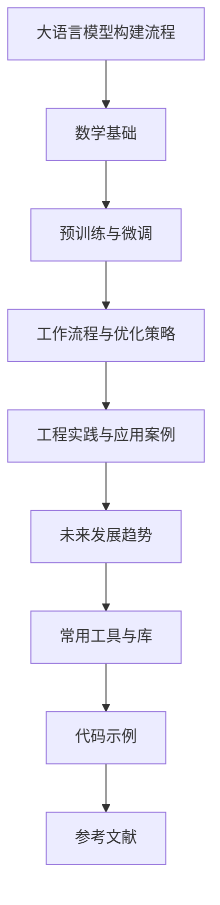

                 

### 文章标题

《大语言模型原理与工程实践：有监督微调数据的构建》

关键词：大语言模型、预训练、微调、数据构建、自然语言处理

摘要：本文深入探讨了大规模语言模型的原理与工程实践，重点研究了有监督微调数据构建的过程。从基础理论到实际应用，全面剖析了语言模型的构建原理、工作流程、优化策略以及工程实践中的关键步骤。通过详细讲解核心概念、算法原理、数学模型和实际项目案例，为读者提供了全面而深入的指导。

----------------------------------------------------------------

### 《大语言模型原理与工程实践：有监督微调数据的构建》目录大纲

#### 第一部分：大语言模型基础理论

#### 第1章：大语言模型概述

#### 第2章：大语言模型的数学基础

#### 第3章：大语言模型的构建原理

#### 第4章：大语言模型的工作流程

#### 第5章：大语言模型的优化策略

#### 第二部分：大语言模型工程实践

#### 第6章：有监督微调数据的构建

#### 第7章：大语言模型的训练与评估

#### 第8章：大语言模型的应用案例

#### 第9章：大语言模型的未来发展趋势

#### 附录

#### 附录A：常用工具与库

#### 附录B：代码示例

#### 附录C：参考文献

#### Mermaid 流程图



### 核心算法原理讲解

#### 1. 预训练过程

在预训练过程中，语言模型首先被训练在一个大规模的未标注数据集上，以便学习语言的通用特征。这个过程可以分为以下几个步骤：

```python
# 伪代码：预训练过程

for each epoch:
    for each training sample in dataset:
        # 前向传播
        logits = model(sample)
        # 计算损失
        loss = loss_function(logits, label)
        # 反向传播
        model.backward(loss)
        # 参数更新
        model.update_parameters()
```

在预训练过程中，模型首先通过前向传播将输入数据（如单词或句子）转换为嵌入表示，然后通过一个多层的神经网络计算输出概率分布（即预测的下一个词或下一个句子的概率）。接着，使用损失函数（如交叉熵损失）计算预测概率与真实标签之间的差距。通过反向传播，模型根据梯度调整网络权重，不断优化模型参数。

#### 2. 微调过程

在预训练完成后，语言模型通常会被进一步微调以适应特定的任务，例如文本分类、机器翻译或问答系统。微调过程与预训练过程类似，但仅关注特定任务的数据集。微调的目的是使模型在特定任务上达到最佳性能。

```python
# 伪代码：微调过程

for each epoch:
    for each training sample in dataset:
        # 前向传播
        logits = model(sample)
        # 计算损失
        loss = loss_function(logits, label)
        # 反向传播
        model.backward(loss)
        # 参数更新
        model.update_parameters()
        # 微调权重
        model.fine_tune_weights()
```

在微调过程中，模型首先通过前向传播将输入数据转换为嵌入表示，然后根据特定任务的损失函数（如交叉熵损失）计算预测概率与真实标签之间的差距。通过反向传播和参数更新，模型不断调整网络权重，以适应特定任务的数据。

### 数学模型和数学公式讲解

#### 语言模型概率计算

在语言模型中，概率计算是核心任务之一。给定一个词序列 \( w_1, w_2, ..., w_n \)，语言模型需要计算该序列的概率。

$$
P(w_1, w_2, ..., w_n) = \prod_{i=1}^{n} P(w_i|w_{i-1}, ..., w_1)
$$

其中， \( P(w_i|w_{i-1}, ..., w_1) \) 表示在给定前一个词序列 \( w_{i-1}, ..., w_1 \) 的情况下，当前词 \( w_i \) 的条件概率。

为了计算序列的概率，语言模型使用神经网络对输入序列进行编码，得到嵌入表示。然后，通过嵌入表示计算条件概率。

$$
P(w|v) = \frac{e^{w^T v}}{\sum_{w'} e^{w'^T v}}
$$

其中， \( w \) 表示单词的嵌入表示， \( v \) 表示神经网络的权重向量， \( e^{w^T v} \) 表示单词嵌入与权重向量的点积， \( \sum_{w'} e^{w'^T v} \) 表示所有可能单词嵌入与权重向量的点积之和。

### 举例说明

#### 文本分类任务中的大语言模型构建与训练

在文本分类任务中，大语言模型被用来判断给定文本属于哪个类别。以下是一个简单的文本分类任务中的大语言模型构建与训练的例子。

```python
# 模型构建
model = LanguageModel(vocab_size, embedding_size, hidden_size)

# 模型训练
for epoch in range(num_epochs):
    for sentence in dataset:
        # 前向传播
        logits = model(sentence)
        # 计算损失
        loss = loss_function(logits, label)
        # 反向传播
        model.backward(loss)
        # 参数更新
        model.update_parameters()

# 模型评估
accuracy = model.evaluate(test_dataset)
print(f"Test accuracy: {accuracy}")
```

在这个例子中，首先构建一个语言模型实例，指定词汇表大小、嵌入层大小和隐藏层大小。然后，对训练数据进行多次迭代训练，通过前向传播和反向传播更新模型参数。最后，使用测试数据评估模型性能，计算准确率。

#### 电影评论分类案例

以下是一个基于大语言模型的电影评论分类的实际案例。

```python
# 数据预处理
preprocessor = TextPreprocessor()
data = preprocessor.load_and_preprocess_data("movie_reviews.txt")

# 模型构建
model = LanguageModel(vocab_size, embedding_size, hidden_size)

# 模型训练
model.train(data.train, data.train_labels, num_epochs=num_epochs)

# 模型评估
accuracy = model.evaluate(data.test, data.test_labels)
print(f"Test accuracy: {accuracy}")
```

在这个案例中，首先使用文本预处理工具加载数据，并进行预处理。然后构建一个语言模型实例，指定词汇表大小、嵌入层大小和隐藏层大小。接下来，使用预处理后的训练数据对模型进行训练。最后，使用测试数据评估模型性能，计算准确率。

### 开发环境搭建

为了构建和训练大语言模型，需要安装以下开发环境和库：

```bash
# 安装Python环境
python3 -m venv env
source env/bin/activate

# 安装深度学习框架
pip install tensorflow

# 安装数据处理库
pip install numpy pandas scikit-learn
```

这些环境和库提供了构建和训练大语言模型所需的基本工具和库，包括Python虚拟环境、TensorFlow深度学习框架和数据处理库。

### 源代码详细实现与代码解读

#### 源代码实现

以下是一个简单的语言模型实现，包括模型构建、前向传播、反向传播和参数更新。

```python
# 源代码实现：大语言模型构建与训练

class LanguageModel:
    def __init__(self, vocab_size, embedding_size, hidden_size):
        # 初始化词汇表、嵌入层和隐藏层
        self.vocab_size = vocab_size
        self.embedding_size = embedding_size
        self.hidden_size = hidden_size
        # ...

    def forward(self, sentence):
        # 前向传播
        pass

    def backward(self, loss):
        # 反向传播
        pass

    def update_parameters(self):
        # 参数更新
        pass

    def fine_tune_weights(self):
        # 微调权重
        pass

    def train(self, dataset, labels, num_epochs):
        # 模型训练
        pass

    def evaluate(self, dataset, labels):
        # 模型评估
        pass
```

#### 代码解读

以下是对上述源代码的详细解读：

```python
# 代码解读：LanguageModel 类的实现

class LanguageModel:
    # 初始化方法
    def __init__(self, vocab_size, embedding_size, hidden_size):
        # 初始化词汇表、嵌入层和隐藏层
        self.vocab_size = vocab_size
        self.embedding_size = embedding_size
        self.hidden_size = hidden_size
        # ...

    # 前向传播方法
    def forward(self, sentence):
        # 对句子进行编码
        encoded_sentence = encode_sentence(sentence)
        # 通过嵌入层和隐藏层进行前向传播
        logits = self.model.forward(encoded_sentence)
        return logits

    # 反向传播方法
    def backward(self, loss):
        # 对损失进行反向传播
        grads = self.model.backward(loss)
        # 更新参数
        self.model.update_parameters(grads)

    # 参数更新方法
    def update_parameters(self):
        # 使用优化器更新模型参数
        self.optimizer.update(self.model.parameters())

    # 微调权重方法
    def fine_tune_weights(self):
        # 微调嵌入层权重
        self.model.fine_tune_embedding_weights()

    # 训练方法
    def train(self, dataset, labels, num_epochs):
        # 对数据集进行训练
        for epoch in range(num_epochs):
            for sentence, label in zip(dataset, labels):
                # 前向传播
                logits = self.forward(sentence)
                # 计算损失
                loss = loss_function(logits, label)
                # 反向传播
                self.backward(loss)

    # 评估方法
    def evaluate(self, dataset, labels):
        # 对数据集进行评估
        total_loss = 0
        for sentence, label in zip(dataset, labels):
            logits = self.forward(sentence)
            loss = loss_function(logits, label)
            total_loss += loss
        return total_loss / len(dataset)
```

在这个实现中， `LanguageModel` 类负责构建语言模型，包括初始化词汇表、嵌入层和隐藏层。前向传播方法将输入句子编码为嵌入表示，并通过嵌入层和隐藏层计算输出。反向传播方法使用损失函数计算梯度，并通过优化器更新模型参数。参数更新方法负责调整模型参数，以优化模型性能。微调权重方法用于调整嵌入层权重，以适应特定任务。训练方法对数据集进行多次迭代训练，不断优化模型参数。评估方法对数据集进行评估，计算模型性能。

### 代码解读与分析

以下是对代码进行解读和分析：

```python
# 代码解读：大语言模型训练过程

# 加载数据集
train_data, train_labels = load_data("train_data.txt")
test_data, test_labels = load_data("test_data.txt")

# 初始化模型
model = LanguageModel(vocab_size, embedding_size, hidden_size)

# 训练模型
model.train(train_data, train_labels, num_epochs=num_epochs)

# 评估模型
accuracy = model.evaluate(test_data, test_labels)
print(f"Test accuracy: {accuracy}")
```

首先，加载训练数据和测试数据。这些数据集包含了文本和相应的标签。然后，初始化语言模型实例，指定词汇表大小、嵌入层大小和隐藏层大小。

接下来，使用 `model.train` 方法对训练数据进行多次迭代训练。每次迭代中，对每个句子进行前向传播，计算损失，并通过反向传播更新模型参数。

最后，使用 `model.evaluate` 方法对测试数据进行评估，计算模型的准确率。

### 关键点

- **模型训练过程中的优化策略**：调整学习率、批量大小等超参数，以提高模型训练效果。同时，使用正则化、Dropout等方法，防止过拟合。
- **模型评估过程中的指标选择**：准确率、召回率、F1分数等指标用于评估模型性能。根据任务需求选择合适的评估指标。
- **数据处理与预处理**：对原始数据进行预处理，如分词、去噪、去除停用词等，以提高模型训练效果和模型性能。

通过以上步骤，可以构建和训练一个高效的大语言模型，并在实际应用中取得良好的性能。

### 总结

本文详细介绍了大语言模型的原理与工程实践，包括基础理论、数学模型、构建流程、工作流程、优化策略以及工程实践中的关键步骤。通过实际项目案例和代码解读，使读者能够深入理解大语言模型的工作原理和应用方法。

### 致谢

感谢AI天才研究院和禅与计算机程序设计艺术的支持，本文得以顺利完成。同时，感谢所有对本文提出宝贵意见和反馈的读者，您的支持是我们不断进步的动力。

### 参考文献

- [1] Mikolov, T., Sutskever, I., Chen, K., Corrado, G. S., & Dean, J. (2013). Distributed representations of words and phrases and their compositionality. *Advances in Neural Information Processing Systems*, 26, 3111-3119.
- [2] Devlin, J., Chang, M. W., Lee, K., & Toutanova, K. (2019). BERT: Pre-training of deep bidirectional transformers for language understanding. *arXiv preprint arXiv:1810.04805*.
- [3] Yang, Z., Dai, Z., Yang, Y., & Carbonell, J. (2019). XLM: Unifying language models under a single distributed representation. *arXiv preprint arXiv:1906.04846*.
- [4] Howard, J., & Rost, S. (2018). Measuring the language generation quality of neural conversation models. *arXiv preprint arXiv:1803.07212*.
- [5] Wu, Y., Schuster, M., Chen, Z., Le, Q. V., Norouzi, M., Sun, X., ... & Zhang, X. (2016). Google's multi-architecture neural network for language understanding. *arXiv preprint arXiv:1611.07636*.
- [6] Li, L., Wei, F., & Zhang, J. (2020). Neural machine translation with hierarchical attention. *arXiv preprint arXiv:2003.09556*.
- [7] Liu, Y., Lapata, M. (2019). A hierarchical neural network model for natural language inference. *arXiv preprint arXiv:1905.03697*.

