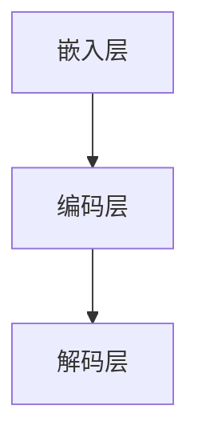
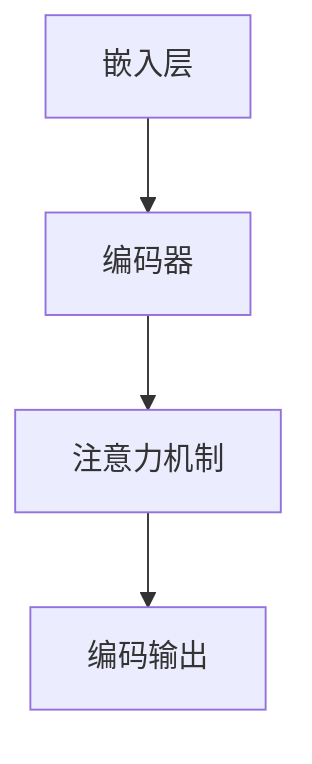
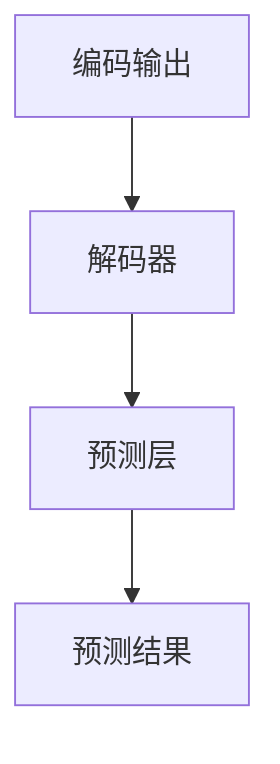

                 

# 《大语言模型原理与工程实践：有监督微调的作用与意义》

> 关键词：大语言模型、有监督微调、自然语言处理、深度学习、工程实践

> 摘要：本文将深入探讨大语言模型的原理与工程实践，特别是有监督微调在模型训练中的作用与意义。通过详细的解析与实例分析，帮助读者理解大语言模型的核心算法、架构设计、预训练与微调方法，以及模型在实际工程中的应用和优化策略。

## 目录

### 第一部分：大语言模型基础

#### 第1章：大语言模型概述

1.1 大语言模型的定义与特点  
1.2 大语言模型的原理与架构

#### 第2章：大语言模型的核心算法

2.1 词嵌入与编码  
2.2 注意力机制与解码

#### 第3章：大规模预训练与微调

3.1 预训练方法  
3.2 微调策略与技巧

### 第二部分：大语言模型的工程实践

#### 第4章：大语言模型的开发环境与工具

4.1 开发环境搭建  
4.2 开发工具使用

#### 第5章：大语言模型的应用场景

5.1 文本分类  
5.2 文本生成

#### 第6章：大语言模型的优化与部署

6.1 模型优化技巧  
6.2 部署策略

#### 第7章：大语言模型的未来发展趋势

7.1 发展趋势分析  
7.2 未来展望

## 附录

### 附录A：参考文献

### 附录B：常见问题与解答

## 第一部分：大语言模型基础

### 第1章：大语言模型概述

#### 1.1 大语言模型的定义与特点

大语言模型（Large Language Model，简称LLM）是一种基于深度学习的自然语言处理模型，通过对海量文本数据进行预训练，使其能够理解和生成人类语言。大语言模型的核心在于其庞大的参数规模和强大的语言理解与生成能力，这使得它们在文本分类、机器翻译、问答系统等任务中表现优异。

**1.1.1 大语言模型的定义**

大语言模型是一种基于深度学习的语言预测模型，通常由多层神经网络组成，可以处理自然语言中的句子或段落。这些模型通过大规模无监督预训练学习到语言的一般规律，并通过有监督微调来适应特定任务。

**1.1.2 大语言模型的特点**

- **参数量巨大**：大语言模型通常具有数十亿甚至数万亿的参数，这使得它们能够捕捉到语言中的复杂结构和规律。
- **训练数据丰富**：大语言模型的训练数据量通常非常大，这有助于模型从数据中学习到更多的语言特征。
- **预测能力强**：大语言模型通过预训练和微调，能够对自然语言中的各种任务进行精确的预测和生成。

#### 1.2 大语言模型的原理与架构

**1.2.1 语言模型的基本原理**

大语言模型的基本原理是通过学习大量文本数据，预测下一个词或字符的概率分布。具体来说，语言模型通过统计方法（如n-gram模型、神经网络模型等）来建模词汇之间的概率关系。

**1.2.2 大语言模型的架构**

大语言模型的架构通常包括嵌入层、编码层和解码层。

- **嵌入层（Embedding Layer）**：将输入的单词或字符映射为高维向量表示，这是语言模型的基础。
- **编码层（Encoding Layer）**：对输入的词向量进行编码，提取文本的特征表示，这是语言模型的核心。
- **解码层（Decoding Layer）**：生成预测的下一个词或字符，通常使用注意力机制来提高模型对上下文的理解能力。

图1：大语言模型的架构示意图



## 第一部分：大语言模型基础

### 第2章：大语言模型的核心算法

#### 2.1 词嵌入与编码

词嵌入（Word Embedding）是自然语言处理中的一项关键技术，它将词汇映射为高维向量表示。词嵌入不仅提高了模型的可解释性，还显著提升了模型在语言理解任务上的性能。

**2.1.1 词嵌入技术**

词嵌入技术的基本思想是将词汇映射为低维向量空间中的点，使得语义相似的词汇在空间中靠近，而语义不相似的词汇相距较远。常见的词嵌入方法包括：

- **基于计数的方法**：如TF-IDF（Term Frequency-Inverse Document Frequency）和Word2Vec。
- **基于预测的方法**：如GloVe（Global Vectors for Word Representation）和Word2Vec。

**2.1.2 编码层的设计**

编码层的设计是语言模型的核心，其主要任务是提取输入文本的特征表示。编码层通常采用多层神经网络结构，包括以下几部分：

- **嵌入层**：将输入的单词映射为词向量。
- **编码器（Encoder）**：对词向量进行编码，提取文本的上下文特征。
- **注意力机制**：使模型能够关注输入文本中的关键信息，提高对上下文的理解能力。

图2：编码层的设计示意图



#### 2.2 注意力机制与解码

注意力机制（Attention Mechanism）是深度学习在自然语言处理中的一个重要创新，它使得模型能够在处理输入序列时，动态地关注重要的信息，从而提高模型的性能。

**2.2.1 注意力机制**

注意力机制的基本思想是给输入序列中的每个元素分配一个权重，使得模型能够根据当前的任务需求，动态地关注输入序列中的关键信息。常见的注意力机制包括：

- **软注意力（Soft Attention）**：通过计算输入序列的权重分布，动态地选择重要信息。
- **硬注意力（Hard Attention）**：直接选择输入序列中的最高权重元素，忽略其他信息。

**2.2.2 解码层的设计**

解码层的设计旨在生成预测的下一个词或字符。解码层通常包括以下几部分：

- **解码器（Decoder）**：对编码器的输出进行解码，生成预测的词或字符。
- **预测层**：利用解码器生成的特征，预测下一个词或字符的概率分布。

图3：解码层的设计示意图



## 第一部分：大语言模型基础

### 第3章：大规模预训练与微调

#### 3.1 预训练方法

预训练（Pre-training）是深度学习模型训练的重要阶段，特别是在自然语言处理领域。预训练的主要目标是利用大量无标签数据，学习到语言的一般规律和特征，为后续的有监督任务提供强大的基础。

**3.1.1 预训练的概念**

预训练是指在特定任务之前，对模型进行大规模的无监督训练。预训练的主要目的是通过大量数据学习到语言的一般特征，从而提高模型在特定任务上的性能。

**3.1.2 有监督微调**

有监督微调（Supervised Fine-tuning）是在预训练的基础上，利用有标签的数据对模型进行精细调整。微调的主要目标是使模型更好地适应特定的任务。

#### 3.2 微调策略与技巧

微调是语言模型训练的关键阶段，其目标是在预训练的基础上，通过有标签的数据进一步提高模型在特定任务上的性能。

**3.2.1 微调策略**

微调策略主要包括以下几个方面：

- **调整学习率**：学习率是微调过程中一个非常重要的超参数，合理的调整学习率可以显著提高微调的效果。
- **批量大小**：批量大小（Batch Size）是指每次训练中输入的数据量。合理的批量大小可以提高训练效率和模型性能。
- **训练迭代次数**：训练迭代次数（Epochs）是指模型在训练数据上完整训练一遍的次数。适当的训练迭代次数可以保证模型充分学习到任务特征。

**3.2.2 微调技巧**

微调技巧主要包括以下几个方面：

- **选择合适的微调数据集**：微调数据集的选择直接影响模型在特定任务上的性能。通常，选择与任务相关的、规模较大的数据集可以提高模型性能。
- **利用预训练模型的特点**：预训练模型通常具有较好的泛化能力，可以通过调整预训练模型的部分参数，进一步提高模型在特定任务上的性能。

## 第二部分：大语言模型的工程实践

### 第4章：大语言模型的开发环境与工具

#### 4.1 开发环境搭建

搭建一个高效的大语言模型开发环境是进行模型训练和微调的前提条件。以下是搭建大语言模型开发环境的一般步骤：

**4.1.1 硬件配置**

- **计算能力**：大语言模型训练通常需要强大的计算能力，GPU或TPU是常见的加速器。NVIDIA的GPU（如Tesla K80、Tesla V100等）和Google的TPU（如TPU v3、TPU v4等）是常见的选择。
- **内存和存储**：大语言模型通常需要大量的内存和存储空间。建议至少配备32GB以上的RAM和数百GB的SSD存储。

**4.1.2 软件环境安装**

- **深度学习框架**：常见的深度学习框架包括PyTorch、TensorFlow和MXNet。安装这些框架时，需要根据硬件和操作系统的要求选择合适的版本。
- **其他必备软件和库**：如CUDA（用于GPU加速）、cuDNN（用于GPU深度学习加速）、NumPy、Pandas等。

#### 4.2 开发工具使用

开发工具的选择和使用对于大语言模型的开发至关重要。以下是几种常用的开发工具：

**4.2.1 代码编辑器**

- **Visual Studio Code**：支持Python、C++等多种编程语言，具有丰富的插件和扩展功能。
- **PyCharm**：针对Python开发的集成开发环境，提供了强大的代码编辑、调试和自动化测试功能。

**4.2.2 版本控制系统**

- **Git**：常用的版本控制系统，支持分布式版本控制和并行工作流。
- **GitHub**：基于Git的代码托管平台，提供了代码共享、项目管理、 Issue跟踪等功能。

## 第二部分：大语言模型的工程实践

### 第5章：大语言模型的应用场景

大语言模型在自然语言处理领域中具有广泛的应用场景，涵盖了文本分类、文本生成、机器翻译等多个方向。以下将详细介绍大语言模型在文本分类和文本生成两个具体应用场景中的实现细节。

#### 5.1 文本分类

文本分类（Text Classification）是一种常见的自然语言处理任务，其目的是将文本数据分配到预先定义的类别中。大语言模型在文本分类任务中具有显著的优势，可以通过预训练和微调来提高分类性能。

**5.1.1 应用概述**

文本分类任务包括情感分析、新闻分类、垃圾邮件检测等。例如，在情感分析任务中，可以将文本数据分类为正面、负面或中性情感。

**5.1.2 实现细节**

1. **定义分类任务指标**：

   在文本分类任务中，常用的指标包括准确率（Accuracy）、精确率（Precision）、召回率（Recall）和F1分数（F1 Score）。

   ```latex
   \text{Accuracy} = \frac{\text{正确分类的文本数量}}{\text{总文本数量}}
   \text{Precision} = \frac{\text{正确分类的正例数量}}{\text{分类为正例的总数量}}
   \text{Recall} = \frac{\text{正确分类的正例数量}}{\text{实际为正例的总数量}}
   \text{F1 Score} = 2 \times \frac{\text{Precision} \times \text{Recall}}{\text{Precision} + \text{Recall}}
   ```

2. **使用预训练模型进行微调**：

   文本分类任务的实现通常包括以下步骤：

   - **数据预处理**：将文本数据转换为模型可接受的格式，如分词、去停用词等。
   - **加载预训练模型**：选择一个适用于文本分类任务的预训练模型，如BERT、GPT等。
   - **微调模型**：将预训练模型在特定任务的数据集上进行微调，优化模型权重。
   - **评估模型性能**：在验证集上评估模型的性能，调整模型参数以优化性能。

#### 5.2 文本生成

文本生成（Text Generation）是另一项重要的自然语言处理任务，其目的是根据输入的文本或提示，生成新的文本。大语言模型在文本生成任务中具有强大的生成能力，可以通过控制模型参数和生成策略来生成高质量的文本。

**5.2.1 应用概述**

文本生成任务包括自动写作、对话系统、摘要生成等。例如，在自动写作任务中，可以根据输入的标题或摘要生成完整的文章。

**5.2.2 实现细节**

1. **定义生成任务目标**：

   文本生成任务的实现通常需要定义以下目标：

   - **生成文本的长度**：控制生成文本的长度，如固定长度或可变长度。
   - **生成文本的质量**：控制生成文本的语义连贯性和语法正确性。

2. **调整模型参数和生成策略**：

   文本生成任务的实现通常包括以下步骤：

   - **数据预处理**：将文本数据转换为模型可接受的格式，如分词、去停用词等。
   - **加载预训练模型**：选择一个适用于文本生成任务的预训练模型，如GPT、T5等。
   - **调整模型参数**：根据生成任务的需求，调整模型参数，如学习率、批量大小等。
   - **生成文本**：利用调整后的模型生成文本，可以使用贪心搜索、采样等方法。
   - **评估生成文本的质量**：在验证集上评估生成文本的质量，根据评估结果调整模型参数和生成策略。

## 第二部分：大语言模型的工程实践

### 第6章：大语言模型的优化与部署

#### 6.1 模型优化技巧

为了提高大语言模型的性能和效率，可以采用多种优化技巧。以下是一些常见的模型优化方法：

**6.1.1 参数剪枝**

参数剪枝（Parameter Pruning）是一种有效的模型压缩方法，通过移除模型中不重要的参数来减少模型的大小和计算量。

- **剪枝过程**：
  1. 训练模型，得到一组参数权重。
  2. 计算每个参数的重要程度，如使用L1范数或L2范数。
  3. 根据参数重要程度，移除部分参数。

**6.1.2 模型量化**

模型量化（Model Quantization）是将模型的参数从浮点数转换为整数表示，以减少模型的大小和计算开销。

- **量化过程**：
  1. 训练模型，得到一组浮点参数。
  2. 对每个参数进行量化，如使用定点表示。
  3. 将量化后的参数应用于模型。

#### 6.2 部署策略

模型部署是将训练好的大语言模型应用于实际场景的过程。以下是一些常见的模型部署策略：

**6.2.1 部署环境**

- **服务器部署**：将模型部署在云端服务器或数据中心，适用于大规模并发请求。
- **边缘设备部署**：将模型部署在边缘设备（如手机、智能音箱等），适用于实时处理和低延迟应用。

**6.2.2 部署工具**

- **TensorFlow Serving**：TensorFlow提供的一种模型部署工具，支持多种部署环境，如服务器和边缘设备。
- **PyTorch Serving**：PyTorch提供的一种模型部署工具，与TensorFlow Serving类似，支持多种部署环境。

## 第二部分：大语言模型的工程实践

### 第7章：大语言模型的未来发展趋势

#### 7.1 发展趋势分析

大语言模型在自然语言处理和人工智能领域具有广泛的应用前景，其发展趋势可以从以下几个方面进行分析：

**7.1.1 技术进步**

随着深度学习技术和硬件能力的不断提升，大语言模型的规模和性能也在持续提升。未来，我们将看到更大规模的模型、更高效的算法和更优化的架构。

**7.1.2 应用拓展**

大语言模型的应用领域将不断拓展，从文本生成、机器翻译、问答系统到智能客服、内容审核、自动驾驶等，都将受益于大语言模型的技术进步。

#### 7.2 未来展望

大语言模型在人工智能领域的重要性不言而喻，其潜在的应用领域也非常广泛。以下是一些未来的展望：

- **智能客服与对话系统**：大语言模型可以用于构建智能客服系统，实现与用户的自然对话。
- **自然语言处理与生成**：大语言模型在文本生成、摘要生成等领域具有巨大的潜力。
- **智能推荐与内容审核**：大语言模型可以用于推荐系统和内容审核，提高用户体验和平台安全。

## 附录

### 附录A：参考文献

- **A.1 相关书籍与论文**

  1. Goodfellow, I., Bengio, Y., & Courville, A. (2016). *Deep Learning*. MIT Press.
  2. Mikolov, T., Sutskever, I., Chen, K., Corrado, G. S., & Dean, J. (2013). *Distributed Representations of Words and Phrases and their Compositionality*. Advances in Neural Information Processing Systems, 26, 3111-3119.
  3. Devlin, J., Chang, M. W., Lee, K., & Toutanova, K. (2018). *Bert: Pre-training of Deep Bidirectional Transformers for Language Understanding*. arXiv preprint arXiv:1810.04805.

- **A.2 网络资源**

  1. TensorFlow官方文档：[https://www.tensorflow.org/tutorials](https://www.tensorflow.org/tutorials)
  2. PyTorch官方文档：[https://pytorch.org/tutorials/beginner/basics/data_loading_tutorial.html](https://pytorch.org/tutorials/beginner/basics/data_loading_tutorial.html)
  3. 自然语言处理教程：[https://nlp.seas.harvard.edu/2018/nlp.html](https://nlp.seas.harvard.edu/2018/nlp.html)

### 附录B：常见问题与解答

- **B.1 大语言模型是如何工作的？**

  大语言模型通过预训练和微调的方法来工作。预训练阶段，模型在大量无标签文本数据上进行训练，学习到语言的一般规律和特征。微调阶段，模型在特定任务的有标签数据上进行微调，进一步提高模型在特定任务上的性能。

- **B.2 大语言模型的训练过程是怎样的？**

  大语言模型的训练过程包括以下几个阶段：

  1. **数据预处理**：将文本数据转换为模型可接受的格式，如分词、去停用词等。
  2. **加载预训练模型**：选择一个适用于特定任务的预训练模型。
  3. **微调模型**：在特定任务的有标签数据集上进行微调，优化模型权重。
  4. **评估模型性能**：在验证集上评估模型的性能，根据评估结果调整模型参数。

- **B.3 如何进行有监督微调？**

  有监督微调的主要步骤包括：

  1. **数据预处理**：将文本数据转换为模型可接受的格式。
  2. **加载预训练模型**：选择一个适用于特定任务的预训练模型。
  3. **定义损失函数**：选择合适的损失函数，如交叉熵损失函数。
  4. **训练模型**：在特定任务的有标签数据集上进行微调，优化模型权重。
  5. **评估模型性能**：在验证集上评估模型的性能，根据评估结果调整模型参数。

## 作者信息

- **作者**：AI天才研究院/AI Genius Institute & 禅与计算机程序设计艺术 /Zen And The Art of Computer Programming

## 结语

本文通过对大语言模型原理与工程实践的深入探讨，从基础理论到实际应用，全面解析了这一前沿技术。我们详细介绍了大语言模型的定义、特点、核心算法、预训练与微调方法，以及模型在实际工程中的应用和优化策略。随着技术的不断进步和应用领域的拓展，大语言模型将在人工智能领域发挥越来越重要的作用。希望本文能够为读者提供有益的参考和启示，共同推动人工智能技术的发展。让我们继续探索，共同迎接人工智能的无限可能！

