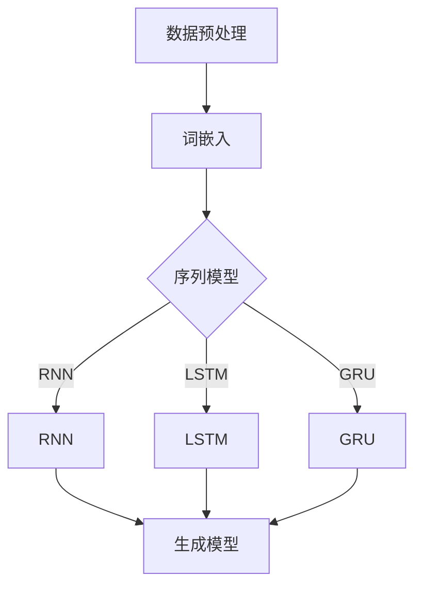

                 

### 文章标题

《大语言模型原理与工程实践：检索增强生成技术》

### 关键词

大语言模型，检索增强生成，深度学习，自然语言处理，工程实践，算法优化

### 摘要

本文深入探讨了大语言模型的原理与工程实践，特别是检索增强生成技术。首先，我们介绍了大语言模型的基础理论，包括其概念、发展历史、应用场景以及核心技术。接着，我们详细讨论了数据预处理、词嵌入技术以及序列模型在大语言模型中的作用。随后，文章阐述了大语言模型的训练与优化过程，包括训练算法、模型优化以及模型评估。接下来，我们重点分析了检索增强生成技术的概念、方法与实现，并讨论了其优势与挑战。最后，文章通过实际应用案例展示了大语言模型在不同领域的应用，并探讨了其部署与优化策略，以及对未来发展趋势与挑战的思考。本文旨在为广大读者提供一份全面、深入的大语言模型技术指南。

## 第1章：大语言模型概述

### 1.1 大语言模型的概念与历史发展

大语言模型（Large Language Model）是指使用大规模数据集训练的深度神经网络模型，旨在理解和生成人类语言。这种模型通过捕捉语言数据中的模式和规律，能够生成连贯、自然的语言输出。

大语言模型的历史可以追溯到20世纪50年代，当时研究人员开始尝试使用统计方法和规则系统来模拟自然语言。然而，这些早期模型在处理复杂语言现象时存在很大局限性。随着计算机性能的提升和深度学习技术的进步，大语言模型在21世纪初开始崭露头角。

2003年，研究人员提出了基于神经网络的语言模型（Neural Network Language Model），标志着大语言模型的开端。此后，大规模数据集和计算能力的提升推动了大语言模型的发展。2018年，谷歌推出了BERT（Bidirectional Encoder Representations from Transformers），标志着大语言模型进入了一个新的阶段。BERT使用了双向Transformer结构，并在多个自然语言处理任务中取得了显著效果。

### 1.2 大语言模型的应用场景

大语言模型在自然语言处理领域具有广泛的应用，以下是几个典型的应用场景：

1. **文本生成**：大语言模型可以生成文章、故事、诗歌等自然语言文本。例如，谷歌的GPT-3模型可以生成高质量的新闻报道和学术论文。

2. **问答系统**：大语言模型可以用于构建智能问答系统，如智能客服、语音助手等。例如，微软的QnA Maker和谷歌的Meena都采用了大语言模型来提供自然语言交互。

3. **机器翻译**：大语言模型可以用于机器翻译任务，如谷歌翻译和百度翻译。例如，谷歌的BERT模型被用于提升翻译质量。

4. **文本分类**：大语言模型可以用于对文本进行分类，如垃圾邮件过滤、情感分析等。例如，Spotify使用大语言模型对用户评论进行分类。

5. **命名实体识别**：大语言模型可以用于识别文本中的命名实体，如人名、地名、组织名等。例如，Facebook的BERT模型被用于命名实体识别任务。

### 1.3 大语言模型的基本原理

大语言模型的基本原理是基于深度学习技术和自然语言处理的理论。深度学习通过多层神经网络学习数据中的特征和模式。自然语言处理则关注如何将自然语言文本转换为计算机可以理解和处理的形式。

大语言模型通常采用序列模型，如循环神经网络（RNN）、长短期记忆网络（LSTM）和门控循环单元（GRU）。这些模型可以捕捉文本中的时间依赖关系。近年来，Transformer结构因其并行计算能力和强大的表达能力而成为大语言模型的主流架构。

### 1.4 大语言模型的核心技术

大语言模型的核心技术包括数据预处理、词嵌入、序列模型和生成模型。

1. **数据预处理**：数据预处理是训练大语言模型的第一步。这包括文本清洗、分词、去除停用词等步骤。清洗后的文本数据将被转换为数字序列，以便神经网络处理。

2. **词嵌入**：词嵌入是将词汇映射到高维向量空间的技术。常见的词嵌入方法包括Word2Vec、GloVe和BERT。这些方法可以使模型更好地理解和生成自然语言。

3. **序列模型**：序列模型如RNN、LSTM和GRU可以处理文本的序列数据。它们通过捕捉序列中的时间依赖关系，使模型能够生成连贯的自然语言。

4. **生成模型**：生成模型如GPT和BERT可以生成高质量的文本。这些模型通过学习大量文本数据，能够生成具有自然语言特征的文本。

### 1.5 大语言模型的核心概念与联系

为了更好地理解大语言模型，我们可以通过Mermaid流程图来展示其核心概念和联系。

这个流程图展示了数据预处理、词嵌入、序列模型（包括RNN、LSTM和GRU）以及生成模型之间的关系。

## 第2章：大语言模型的数据处理

### 2.1 数据预处理

数据预处理是训练大语言模型的第一步，其目标是清洗和准备数据，以便神经网络可以有效地学习。以下是数据预处理的主要步骤：

1. **文本清洗**：文本清洗包括去除HTML标签、特殊字符和空白字符。这一步的目的是消除无关噪声，提高数据质量。

2. **分词**：分词是将文本分解为单词或子词的过程。常见的分词方法有基于词典的分词和基于统计的分词。分词的准确性对后续的词嵌入和模型训练至关重要。

3. **去除停用词**：停用词是指对模型训练没有贡献的常见词汇，如“的”、“和”、“是”等。去除停用词可以减少模型训练的负担，提高模型性能。

4. **标记化**：标记化是将文本转换为数字序列的过程。通常，每个单词或子词被映射到一个唯一的整数ID。

### 2.2 词嵌入技术

词嵌入是将词汇映射到高维向量空间的技术，使模型能够理解和生成自然语言。以下是几种常见的词嵌入方法：

1. **Word2Vec**：Word2Vec是一种基于神经网络的词嵌入方法，通过学习单词在窗口中的上下文表示。其基本思想是使具有相似上下文的单词在向量空间中更接近。

2. **GloVe**：GloVe（Global Vectors for Word Representation）是一种基于全局上下文的词嵌入方法。它通过计算单词和其上下文之间的共现矩阵来学习词向量。

3. **BERT**：BERT（Bidirectional Encoder Representations from Transformers）是一种基于Transformer结构的预训练词嵌入方法。它通过双向Transformer结构同时考虑单词的前后文信息，从而生成高质量的词向量。

### 2.3 序列模型

序列模型是处理文本序列数据的关键技术，以下介绍几种常见的序列模型：

1. **循环神经网络（RNN）**：RNN是一种基于时间递归的神经网络，可以处理序列数据。然而，RNN存在梯度消失和梯度爆炸问题，限制了其性能。

2. **长短期记忆网络（LSTM）**：LSTM是一种改进的RNN结构，通过引入门控机制来避免梯度消失问题。LSTM在处理长序列数据时表现出色。

3. **门控循环单元（GRU）**：GRU是LSTM的一种变体，通过简化LSTM的结构来提高计算效率。GRU在许多任务中取得了与LSTM相似的性能。

### 2.4 数据处理流程

数据处理流程通常包括以下步骤：

1. **数据收集**：收集用于训练的文本数据，可以是已标记的数据或未标记的数据。

2. **数据预处理**：对文本数据进行清洗、分词、去除停用词等操作。

3. **数据标记**：对于未标记的数据，可以采用数据增强或半监督学习方法进行标记。

4. **数据转换**：将预处理后的文本数据转换为数字序列，并生成词嵌入。

5. **数据集划分**：将数据集划分为训练集、验证集和测试集，用于模型训练和评估。

## 第3章：大语言模型的训练与优化

### 3.1 训练算法

大语言模型的训练过程主要包括两个阶段：预训练和微调。预训练是在大规模语料库上进行的，旨在学习通用语言表示；微调是在特定任务上进行的，旨在调整模型以适应特定任务。

1. **预训练**：预训练通常采用自监督学习，其中模型需要预测输入序列中的下一个单词。预训练的主要目的是学习通用语言表示，使模型能够在各种任务中表现出色。

2. **微调**：微调是在预训练的基础上，在特定任务上对模型进行调整。微调过程通常包括以下步骤：

   - **数据准备**：收集用于微调的任务数据，并进行预处理。
   - **模型初始化**：使用预训练模型作为初始化，以便利用预训练模型的已有知识。
   - **模型调整**：在特定任务上调整模型参数，以适应特定任务。
   - **评估与优化**：评估模型在验证集上的性能，并根据评估结果调整模型参数。

### 3.2 模型优化

模型优化是提高大语言模型性能的重要步骤。以下是几种常见的模型优化方法：

1. **梯度下降**：梯度下降是一种常见的优化算法，通过更新模型参数以最小化损失函数。

2. **Adam优化器**：Adam优化器是梯度下降的一种变体，结合了AdaGrad和RMSprop的优点，能够自适应地调整学习率。

3. **学习率调度**：学习率调度是一种调整学习率的方法，旨在避免模型过早地陷入局部最小值。

4. **dropout**：dropout是一种正则化技术，通过随机丢弃神经网络中的部分神经元，以防止过拟合。

### 3.3 模型评估

模型评估是评估大语言模型性能的重要步骤。以下是一些常用的评估指标：

1. **准确率（Accuracy）**：准确率是正确预测的样本数占总样本数的比例。

2. **精确率（Precision）**：精确率是正确预测的样本数与预测为正类的样本数之比。

3. **召回率（Recall）**：召回率是正确预测的样本数与实际为正类的样本数之比。

4. **F1分数（F1 Score）**：F1分数是精确率和召回率的加权平均，用于综合评估模型的性能。

5. **ROC曲线和AUC值**：ROC曲线和AUC值是评估二分类模型性能的常用工具。

### 3.4 训练过程

以下是训练大语言模型的一般步骤：

1. **数据准备**：收集并预处理训练数据，包括文本清洗、分词、去除停用词等操作。

2. **词嵌入**：将文本数据转换为词嵌入表示，可以使用预训练的词嵌入或者自己训练。

3. **模型构建**：根据任务需求构建神经网络模型，可以使用预训练的模型或者从头开始训练。

4. **训练过程**：使用训练数据和优化算法对模型进行训练，包括前向传播、损失计算、反向传播和参数更新。

5. **评估与调整**：评估模型在验证集上的性能，并根据评估结果调整模型参数。

6. **微调与优化**：在特定任务上进行微调，以进一步提高模型性能。

7. **测试与部署**：在测试集上评估模型性能，并根据结果调整模型。最后，将模型部署到生产环境中。

## 第4章：检索增强生成技术

### 4.1 检索增强的基本概念

检索增强生成技术（Retrieval-Augmented Generation，RAG）是一种结合检索和生成技术的大语言模型。RAG的基本思想是在生成过程中利用外部知识库，以提高模型的生成质量和准确性。

RAG的主要组成部分包括：

1. **检索器**：检索器负责从外部知识库中检索与输入查询相关的信息。常见的检索器包括向量检索器和基于规则的方法。

2. **生成器**：生成器负责将检索到的信息融合到输入查询中，生成高质量的回答。

3. **融合机制**：融合机制负责将检索到的信息和生成器的输出进行结合，以生成最终的回答。

### 4.2 检索增强的方法与实现

检索增强生成技术有多种实现方法，以下是几种常见的方法：

1. **基于向量的检索**：基于向量的检索使用向量相似度来检索外部知识库中的相关文档。常用的向量检索方法包括TF-IDF、Word2Vec和BERT等。

2. **基于规则的方法**：基于规则的方法使用手工定义的规则来检索相关文档。例如，使用自然语言处理技术提取关键词，并基于关键词匹配来检索文档。

3. **混合检索方法**：混合检索方法结合了基于向量和基于规则的检索方法，以提高检索的准确性。

在实现RAG时，通常采用以下步骤：

1. **知识库准备**：准备用于检索的知识库，可以是预训练的模型或已有的知识库。

2. **检索策略设计**：设计适合任务的检索策略，包括检索器选择、检索阈值设置等。

3. **生成器构建**：构建生成器模型，可以采用预训练的大语言模型或从头开始训练。

4. **融合机制实现**：实现融合机制，将检索到的信息和生成器的输出进行结合。

5. **模型训练与优化**：使用训练数据和检索增强策略对模型进行训练和优化。

### 4.3 检索增强的优势与挑战

检索增强生成技术具有以下优势：

1. **提高生成质量**：通过利用外部知识库，RAG可以生成更准确、更丰富的回答。

2. **扩展知识范围**：RAG可以结合外部知识库中的信息，从而扩展模型的语义理解能力。

3. **降低过拟合风险**：RAG通过引入外部知识库，可以减少模型对训练数据的依赖，降低过拟合的风险。

然而，RAG也面临一些挑战：

1. **检索效率**：如何高效地检索外部知识库是一个关键问题，特别是在大规模知识库中。

2. **融合机制设计**：如何有效地融合检索到的信息和生成器的输出是一个挑战。

3. **模型解释性**：RAG模型的解释性相对较低，难以解释生成结果的具体原因。

4. **计算资源消耗**：RAG需要大量的计算资源，尤其是在大规模知识库和复杂模型中。

### 4.4 检索增强的应用案例

检索增强生成技术已在多个应用场景中取得显著成果，以下是几个应用案例：

1. **问答系统**：RAG可以用于构建高效的问答系统，如谷歌的Meena。Meena通过结合外部知识库和生成器模型，提供高质量的问答服务。

2. **文本生成**：RAG可以用于生成高质量的文章和报告。例如，OpenAI的GPT-3模型结合外部知识库，生成高质量的新闻报道和学术论文。

3. **机器翻译**：RAG可以用于改进机器翻译质量。例如，谷歌的BERT模型结合外部知识库，提供更准确的翻译结果。

4. **文本分类**：RAG可以用于文本分类任务，如垃圾邮件过滤和情感分析。通过结合外部知识库，模型可以更好地理解文本的语义，提高分类准确性。

## 第5章：大语言模型的应用案例

### 5.1 文本生成

文本生成是大语言模型的重要应用之一，模型可以生成高质量的自然语言文本。以下是几个常见的文本生成场景：

1. **新闻生成**：大语言模型可以用于自动生成新闻报道，如谷歌的GPT-3模型。GPT-3通过学习大量新闻文章，可以生成连贯、自然的新闻文本。

2. **故事生成**：大语言模型可以生成故事、小说和诗歌等文学作品。例如，OpenAI的GPT-3模型可以生成引人入胜的小说和诗歌。

3. **对话生成**：大语言模型可以用于生成对话，如智能客服和聊天机器人。例如，谷歌的Meena可以生成自然、连贯的对话。

4. **摘要生成**：大语言模型可以用于生成文本摘要，如文章摘要和会议摘要。例如，谷歌的BERT模型可以生成简洁、准确的文本摘要。

### 5.2 问答系统

问答系统是大语言模型的另一个重要应用场景，模型可以回答用户提出的问题。以下是几个常见的问答系统应用：

1. **智能客服**：大语言模型可以用于构建智能客服系统，如聊天机器人。智能客服可以回答用户关于产品、订单和服务的各种问题。

2. **教育辅导**：大语言模型可以用于教育辅导，如在线学习平台和智能辅导系统。模型可以回答学生在学习过程中遇到的问题。

3. **医学问答**：大语言模型可以用于医学问答系统，如智能医疗助手。模型可以回答医生和患者关于疾病、症状和治疗的各种问题。

4. **法律咨询**：大语言模型可以用于法律咨询系统，如智能法律助手。模型可以回答用户关于法律问题、合同和纠纷的各种问题。

### 5.3 机器翻译

机器翻译是大语言模型在自然语言处理领域的经典应用，模型可以将一种语言翻译成另一种语言。以下是几个常见的机器翻译应用：

1. **在线翻译**：大语言模型可以用于在线翻译工具，如谷歌翻译和百度翻译。用户可以输入文本，模型会生成相应的翻译结果。

2. **实时翻译**：大语言模型可以用于实时翻译应用，如语音翻译和视频翻译。例如，谷歌的实时翻译工具可以将演讲实时翻译成多种语言。

3. **多语言处理**：大语言模型可以用于处理多语言文本，如多语言新闻、多语言论坛和社交媒体。模型可以同时处理多种语言，提高信息传播的效率。

4. **机器翻译评估**：大语言模型可以用于评估机器翻译质量，如BLEU、METEOR和NIST等评估指标。模型可以帮助评估者评估翻译结果的准确性。

### 5.4 垃圾邮件过滤

垃圾邮件过滤是大语言模型在网络安全领域的应用之一，模型可以识别并过滤掉垃圾邮件。以下是几个常见的垃圾邮件过滤应用：

1. **电子邮件过滤**：大语言模型可以用于电子邮件过滤系统，如Gmail的垃圾邮件过滤器。模型可以分析邮件内容，识别并标记垃圾邮件。

2. **社交网络过滤**：大语言模型可以用于社交网络垃圾邮件过滤，如Facebook和Twitter的垃圾邮件过滤器。模型可以识别并过滤掉垃圾消息。

3. **恶意软件检测**：大语言模型可以用于检测恶意软件，如恶意邮件和恶意链接。模型可以分析邮件内容，识别潜在的恶意行为。

4. **欺诈检测**：大语言模型可以用于欺诈检测系统，如信用卡欺诈检测和在线交易欺诈检测。模型可以分析交易数据，识别潜在的欺诈行为。

### 5.5 其他应用

除了上述应用外，大语言模型还有许多其他应用：

1. **情感分析**：大语言模型可以用于情感分析，如分析社交媒体评论、新闻报道和客户反馈。模型可以识别文本中的情感倾向，如正面、负面或中性。

2. **命名实体识别**：大语言模型可以用于命名实体识别，如识别文本中的人名、地名、组织名等。模型可以用于信息抽取和知识图谱构建。

3. **文本摘要**：大语言模型可以用于文本摘要，如自动生成文章、报告和会议的摘要。模型可以提取文本的关键信息，生成简洁、准确的摘要。

4. **对话系统**：大语言模型可以用于构建对话系统，如智能客服、语音助手和聊天机器人。模型可以生成自然、连贯的对话，提高用户体验。

5. **语音识别**：大语言模型可以用于语音识别，如将语音转换为文本。模型可以识别不同语言和方言的语音，提高语音识别的准确性。

## 第6章：大语言模型的部署与优化

### 6.1 部署环境搭建

部署大语言模型需要搭建合适的环境，以下是一个基本的部署环境搭建步骤：

1. **硬件配置**：根据模型的复杂度和数据规模，选择合适的硬件配置。对于大规模模型，可能需要使用GPU或TPU进行加速。

2. **操作系统**：选择适合的操作系统，如Ubuntu或CentOS。操作系统需要支持深度学习和自然语言处理相关的软件。

3. **深度学习框架**：安装常用的深度学习框架，如TensorFlow、PyTorch或MXNet。这些框架提供了高效的计算和模型训练工具。

4. **依赖库**：安装其他依赖库，如NumPy、Pandas和Scikit-learn等。这些库提供了数据操作和机器学习相关的工具。

5. **数据存储**：配置数据存储方案，如HDFS或Amazon S3。这些方案可以存储大规模数据集，并提供高效的数据访问。

6. **容器化**：使用容器化技术，如Docker，将模型和依赖库打包成容器镜像。这有助于简化部署和迁移过程。

### 6.2 模型压缩与量化

模型压缩与量化是提高大语言模型部署性能的重要手段。以下是一些常见的模型压缩与量化方法：

1. **模型剪枝**：模型剪枝是通过去除模型中冗余的权重来减小模型尺寸。剪枝方法包括结构剪枝和权重剪枝。

2. **量化**：量化是将模型的浮点数权重转换为低精度的整数权重。量化方法包括全量化、部分量化和小数量化。

3. **知识蒸馏**：知识蒸馏是将大型模型的知识迁移到小型模型。通过训练小模型以复制大模型的输出，可以提高小模型的性能。

4. **低秩分解**：低秩分解是将高秩矩阵分解为低秩矩阵。这种方法可以减少模型参数的数量，从而减小模型尺寸。

### 6.3 模型优化策略

优化模型性能是部署大语言模型的关键步骤。以下是一些常见的模型优化策略：

1. **模型并行化**：模型并行化是将模型拆分为多个部分，并在多个GPU或TPU上同时训练。这种方法可以提高训练速度。

2. **异步训练**：异步训练是多个训练任务并行执行，每个任务可以独立更新模型。这种方法可以减少训练时间。

3. **动态调整学习率**：动态调整学习率可以根据训练进度自适应地调整学习率。这种方法可以加速模型收敛。

4. **模型压缩与量化**：使用模型压缩与量化技术，减小模型尺寸，提高部署性能。

### 6.4 模型运维

模型运维是确保大语言模型稳定运行的关键。以下是一些常见的模型运维策略：

1. **监控与报警**：监控模型性能和资源使用情况，并设置报警机制，以及时发现和解决问题。

2. **日志记录**：记录模型训练和部署过程中的日志，以便分析和调试。

3. **弹性扩展**：根据模型负载动态调整资源使用，以应对负载波动。

4. **备份与恢复**：定期备份模型数据和配置，以便在发生故障时快速恢复。

5. **自动化部署**：使用自动化工具，如Kubernetes，简化模型部署和管理。

## 第7章：大语言模型的未来趋势与挑战

### 7.1 大语言模型的未来发展方向

随着深度学习和自然语言处理技术的不断进步，大语言模型在未来的发展中将呈现以下趋势：

1. **更强大的生成能力**：未来的大语言模型将具备更强大的生成能力，可以生成更加自然、连贯和多样化的文本。

2. **多模态处理**：大语言模型将逐渐扩展到多模态处理，如文本、图像、声音和视频的融合，以实现更全面的信息理解和生成。

3. **增强现实与虚拟现实**：大语言模型将在增强现实（AR）和虚拟现实（VR）领域发挥重要作用，如生成虚拟角色对话、构建虚拟场景等。

4. **迁移学习与泛化能力**：未来的大语言模型将具备更强的迁移学习能力和泛化能力，可以在不同任务和数据集上快速适应和表现。

5. **可解释性与可解释性**：为了提高模型的可靠性和信任度，未来的大语言模型将注重可解释性和可解释性，使研究人员和用户能够理解模型的决策过程。

### 7.2 大语言模型面临的挑战与应对策略

尽管大语言模型取得了显著成果，但仍面临一些挑战。以下是几个主要挑战及其应对策略：

1. **计算资源需求**：大语言模型对计算资源的需求巨大，特别是在训练和推理过程中。为应对这一挑战，可以采用高效计算架构和模型压缩与量化技术。

2. **数据隐私与安全**：大语言模型通常使用大量用户数据进行训练，可能涉及数据隐私和安全问题。为应对这一挑战，需要制定严格的隐私保护政策和安全措施。

3. **模型解释性**：大语言模型通常缺乏可解释性，难以解释其决策过程。为提高模型的可解释性，可以采用可解释性增强方法，如注意力机制和决策路径可视化。

4. **过拟合风险**：大语言模型在训练过程中可能存在过拟合风险，导致模型在新数据上的表现不佳。为应对这一挑战，可以采用数据增强、正则化和模型融合等技术。

5. **伦理与道德问题**：大语言模型的应用可能引发伦理和道德问题，如歧视、偏见和滥用。为应对这一挑战，需要制定相应的伦理规范和法律法规，以确保模型的应用符合道德标准。

### 7.3 大语言模型对社会的影响与伦理问题

大语言模型在社会各个方面产生了深远的影响，同时也引发了一系列伦理问题。以下是一些主要影响和伦理问题：

1. **经济影响**：大语言模型可以自动化许多工作，如文本生成、机器翻译和问答系统，从而影响就业和经济结构。

2. **教育影响**：大语言模型在教育领域的应用，如智能辅导和在线课程，可以提高教育质量和普及率。

3. **文化交流**：大语言模型促进了不同语言和文化之间的交流和理解，有助于消除语言障碍和文化隔阂。

4. **伦理问题**：大语言模型可能引发伦理问题，如歧视、偏见和滥用。为应对这些问题，需要制定相应的伦理规范和法律法规。

5. **隐私问题**：大语言模型通常使用大量用户数据，可能涉及隐私侵犯和隐私泄露问题。为保护用户隐私，需要采取严格的隐私保护措施。

## 附录1：大语言模型常用工具与框架

### 1.1 TensorFlow 2.x

TensorFlow是Google开发的开源机器学习框架，支持多种编程语言和操作。以下是TensorFlow 2.x的主要特性：

1. **高级API**：TensorFlow提供了高级API，如Keras，使得构建和训练神经网络更加简便。

2. **兼容性**：TensorFlow 2.x与Python 3.6+兼容，并支持GPU和TPU加速。

3. **动态图计算**：TensorFlow使用动态计算图，使得模型设计更加灵活。

4. **生态系统**：TensorFlow拥有丰富的生态系统，包括TensorBoard、TensorFlow Lite和TensorFlow Serving等工具。

### 1.2 PyTorch

PyTorch是Facebook开发的开源机器学习框架，以其动态计算图和简洁的API而受到欢迎。以下是PyTorch的主要特性：

1. **动态计算图**：PyTorch使用动态计算图，使得模型设计和调试更加方便。

2. **简洁API**：PyTorch的API简洁直观，易于理解和使用。

3. **GPU支持**：PyTorch支持GPU加速，可以在训练过程中显著提高性能。

4. **生态系统**：PyTorch拥有丰富的生态系统，包括torchvision、torchaudio和torchtext等工具。

### 1.3 其他常用框架

除了TensorFlow和PyTorch，还有其他一些常用的机器学习框架，如：

1. **MXNet**：Apache MXNet是Apache Software Foundation的一个开源深度学习框架，支持多种编程语言，并具有高效的多GPU训练能力。

2. **Caffe**：Caffe是由Berkeley Vision and Learning Center（BVLC）开发的开源深度学习框架，以其简洁和高效的特点而受到关注。

3. **Theano**：Theano是另一个开源深度学习框架，以其符号计算能力和Python接口而受到欢迎。尽管Theano已逐渐被TensorFlow和PyTorch取代，但它仍是一个有价值的学习资源。

4. **Keras**：Keras是一个开源的神经网络库，旨在提供简单和模块化的API，可以在TensorFlow和Theano等后端框架上运行。Keras已被集成到TensorFlow 2.x中，成为其高级API的一部分。

