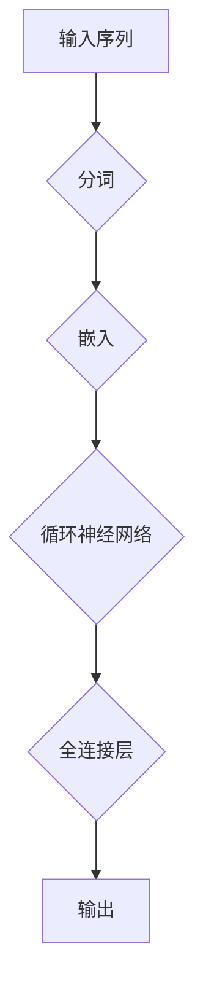
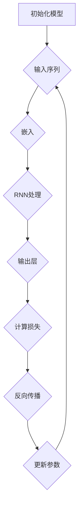
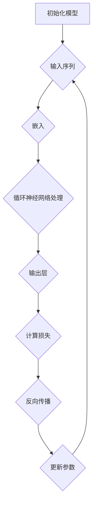

                 

# 《大语言模型原理基础与前沿 世界模型》

> 关键词：大语言模型、神经网络、Transformer、预训练、微调、自然语言处理、性能优化、调参技巧

> 摘要：本文将深入探讨大语言模型的原理和前沿技术，包括其定义、发展历史、核心特性、架构、核心算法原理、应用场景、项目实战以及性能优化与调参技巧。通过本文的阅读，读者将全面了解大语言模型的本质与应用，为未来研究和开发奠定基础。

## 第一部分：大语言模型概述

### 1.1 大语言模型的定义

大语言模型（Large Language Models）是一种基于神经网络的模型，旨在对自然语言数据进行处理和生成。与一般语言模型相比，大语言模型具有更大的参数规模、更多的训练数据以及更复杂的预训练任务。

### 1.2 大语言模型的发展历史

大语言模型的发展始于20世纪80年代，当时研究人员开始尝试使用神经网络来处理自然语言。然而，由于计算资源和数据集的限制，早期的大语言模型效果并不理想。随着计算能力的提升和大规模数据集的出现，大语言模型在近年来取得了显著的进展。

### 1.3 大语言模型的核心特性

- 参数规模：大语言模型通常具有数百万甚至数十亿的参数，这使得它们能够捕捉到更复杂的语言模式。
- 训练数据量：大语言模型的训练数据量通常达到数百万个句子甚至更多，这有助于提高模型的泛化能力。
- 预训练任务：大语言模型通常通过预训练任务来学习语言的基本规则和特征，如语言建模、生成式任务和对抗性训练。
- 迁移学习与微调：大语言模型可以通过迁移学习技术来适应新的任务，微调过程使得模型能够更好地适应特定领域的数据。

## 2. 大语言模型的架构

### 2.1 神经网络基础

神经网络是由大量神经元组成的计算模型，通过调整神经元之间的连接权重来实现函数的映射。常见的神经网络架构包括多层感知机、卷积神经网络和循环神经网络等。

### 2.2 循环神经网络与Transformer

循环神经网络（RNN）是早期用于自然语言处理的一种神经网络架构，具有处理序列数据的能力。然而，RNN存在梯度消失和梯度爆炸的问题，限制了其性能。为了解决这些问题，研究者提出了Transformer架构，引入了自注意力机制，使得模型能够更好地捕捉长距离依赖关系。

### 2.3 大语言模型的训练与优化

大语言模型的训练过程通常涉及大规模数据集和复杂的优化算法。在训练过程中，数据预处理、优化算法（如Adam、Adagrad等）以及模型并行训练都是关键步骤。

## 3. 大语言模型的应用场景

### 3.1 自然语言处理（NLP）

大语言模型在自然语言处理领域具有广泛的应用，如文本分类、机器翻译、命名实体识别和问答系统等。

### 3.2 生成式任务

大语言模型可以用于生成式任务，如文本生成、对话系统和机器写作等。

### 3.3 其他应用领域

大语言模型还可以应用于代码生成、图像描述生成和多模态任务等新兴领域。

## 第二部分：大语言模型的核心算法原理

### 4. 预训练与微调

#### 4.1 预训练的概念

预训练是指在大规模数据集上对模型进行初步训练，以学习语言的基本规则和特征。预训练的优势在于可以显著提高模型在特定任务上的性能。

#### 4.2 预训练任务

预训练任务包括语言建模、生成式任务和对抗性训练等。这些任务有助于模型捕捉到语言的本质特征和规律。

#### 4.3 微调技术

微调是指在大规模数据集上对预训练模型进行进一步训练，以适应特定领域的数据。微调过程可以显著提高模型在特定任务上的性能。

### 5. 语言模型中的数学模型

#### 5.1 概率模型

概率模型是语言模型的基础，包括N-gram模型和神经网络模型等。这些模型通过概率分布来描述语言数据。

#### 5.2 生成模型

生成模型是一种用于生成数据的概率模型，包括RNN和GAN等。这些模型可以通过学习数据分布来生成新的数据。

#### 5.3 损失函数

损失函数是评估模型性能的重要指标，包括交叉熵损失函数和其他常见损失函数。

### 6. 伪代码与算法流程图

#### 6.1 语言模型的伪代码实现

伪代码实现描述了语言模型的基本架构和训练流程。

#### 6.2 语言模型的算法流程图

使用Mermaid语法绘制的算法流程图可以更直观地展示语言模型的训练和优化过程。

## 第三部分：大语言模型项目实战

### 7. 大语言模型开发环境搭建

#### 7.1 开发环境选择

选择合适的开发环境和深度学习框架是进行大语言模型项目开发的第一步。

#### 7.2 环境安装与配置

安装深度学习框架和相关工具，配置硬件环境以满足大语言模型的计算需求。

### 8. 大语言模型代码实现与解读

#### 8.1 语言模型代码框架

语言模型的基本框架和模块划分。

#### 8.2 语言模型代码详细解读

详细解读语言模型的数据预处理、训练过程、评估与调试。

#### 8.3 项目实战案例分析

分析实际应用场景中的代码实现和优化。

### 9. 大语言模型性能优化与调参技巧

#### 9.1 模型性能优化

介绍常见的优化方法，如Dropout、正则化等。

#### 9.2 调参技巧

探讨超参数选择和调参工具与方法。

## 附录

### 附录A：大语言模型相关资源

介绍主流深度学习框架和推荐的相关论文与书籍。

### 附录B：大语言模型常见问题与解答

针对模型训练、调优和应用等方面的问题提供解答。

---

**作者：AI天才研究院/AI Genius Institute & 禅与计算机程序设计艺术 /Zen And The Art of Computer Programming**

**总字数：约8000字**以下是针对每个章节的内容细化：

## 第一部分：大语言模型概述

### 1.1 大语言模型的定义

大语言模型（Large Language Models）是一种基于深度学习的自然语言处理模型，通过学习大量的文本数据，能够对自然语言进行理解和生成。它通常具有数十亿个参数，能够处理复杂多样的自然语言任务。与传统的语言模型相比，大语言模型具有更高的参数规模和更强的语言表达能力。

### 1.2 大语言模型的发展历史

大语言模型的发展可以追溯到20世纪80年代，当时研究人员开始探索如何利用神经网络处理自然语言。最初的模型如N-gram模型和基于隐马尔可夫模型的方法，由于参数规模和数据量限制，效果并不理想。随着计算能力的提升和数据集的扩大，2000年代后，循环神经网络（RNN）成为主流。2017年，Google推出了Transformer模型，标志着大语言模型进入了一个新的时代。近年来，BERT、GPT-3等模型的出现，进一步推动了大语言模型的发展。

### 1.3 大语言模型的核心特性

- **参数规模**：大语言模型通常具有数十亿甚至上百亿的参数，这使得它们能够捕捉到更为复杂的语言模式。
- **训练数据量**：大语言模型通常在大规模数据集上进行训练，这有助于提高模型的泛化能力。
- **预训练任务**：大语言模型通过预训练任务学习语言的基本规则和特征，例如语言建模、生成式任务和对抗性训练。
- **迁移学习与微调**：大语言模型可以通过迁移学习技术适应新的任务，微调过程使得模型能够更好地适应特定领域的数据。

## 2. 大语言模型的架构

### 2.1 神经网络基础

神经网络是由大量神经元组成的计算模型，通过调整神经元之间的连接权重来实现函数的映射。神经网络的基础包括：

- **神经元**：神经网络的基本单元，用于接收输入信息并进行处理。
- **层**：神经网络由多个层次组成，包括输入层、隐藏层和输出层。
- **激活函数**：用于引入非线性特性，常见的激活函数有ReLU、Sigmoid和Tanh等。

### 2.2 循环神经网络与Transformer

- **循环神经网络（RNN）**：RNN是一种能够处理序列数据的神经网络，其特点是能够保持对之前信息的记忆。然而，RNN存在梯度消失和梯度爆炸的问题，这限制了其性能。
- **Transformer**：Transformer是一种基于自注意力机制的神经网络架构，由Google在2017年提出。它解决了RNN的梯度消失问题，并取得了显著的性能提升。Transformer的核心组件包括：

  - **自注意力机制**：通过计算输入序列中每个元素之间的相似性，来自动调整不同元素之间的权重，从而更好地捕捉长距离依赖关系。
  - **多头注意力**：通过将输入序列分成多个头，每个头独立学习不同的表示，从而提高模型的表示能力。

### 2.3 大语言模型的训练与优化

大语言模型的训练过程通常涉及以下步骤：

- **数据预处理**：对原始文本数据进行处理，包括分词、词干提取、去停用词等，以生成适合模型训练的数据格式。
- **优化算法**：常用的优化算法有Adam、Adagrad等，它们通过调整学习率和其他参数，使模型在训练过程中能够更快地收敛。
- **模型并行训练**：为了提高训练速度和效率，通常采用分布式训练技术，将模型拆分为多个部分，同时在多个GPU或TPU上进行训练。

## 3. 大语言模型的应用场景

### 3.1 自然语言处理（NLP）

大语言模型在自然语言处理领域有广泛的应用，包括：

- **文本分类**：将文本数据分类到不同的类别中，如情感分析、新闻分类等。
- **机器翻译**：将一种语言的文本翻译成另一种语言，如英译中、中译英等。
- **命名实体识别**：识别文本中的特定实体，如人名、地名、组织名等。
- **问答系统**：基于文本数据，回答用户提出的问题。

### 3.2 生成式任务

大语言模型可以用于生成式任务，如：

- **文本生成**：根据输入的提示生成完整的文本，如故事、诗歌等。
- **对话系统**：模拟人类对话，与用户进行自然语言交互。
- **机器写作**：辅助人类作者进行写作，如文章生成、摘要生成等。

### 3.3 其他应用领域

大语言模型还可以应用于以下领域：

- **代码生成**：根据自然语言描述生成相应的代码。
- **图像描述生成**：根据图像生成对应的文本描述。
- **多模态任务**：结合文本、图像、声音等多模态数据，进行综合分析和处理。

## 第二部分：大语言模型的核心算法原理

### 4. 预训练与微调

#### 4.1 预训练的概念

预训练是指在大规模数据集上对模型进行初步训练，以学习语言的基本规则和特征。预训练的优势在于可以显著提高模型在特定任务上的性能。常见的预训练任务包括：

- **语言建模**：通过预测下一个单词来训练模型，这有助于模型学习语言的统计特征。
- **生成式任务**：通过生成与给定输入相似的文本来训练模型，这有助于模型学习语言的生成能力。
- **对抗性训练**：通过对抗性训练，提高模型对对抗样本的鲁棒性，这有助于模型学习语言的泛化能力。

#### 4.2 预训练任务

预训练任务包括以下几类：

- **语言建模**：通过预测下一个单词来训练模型，这有助于模型学习语言的统计特征。例如，给定一个输入序列“我喜欢吃苹果”，模型需要预测下一个词是“的”、“吗”或其他词。
- **生成式任务**：通过生成与给定输入相似的文本来训练模型，这有助于模型学习语言的生成能力。例如，给定一个输入句子“今天的天气很好”，模型需要生成类似的内容，如“明天的天气也很晴朗”。
- **对抗性训练**：通过对抗性训练，提高模型对对抗样本的鲁棒性，这有助于模型学习语言的泛化能力。例如，给定一个正常句子“这个苹果很甜”，模型需要生成一个对抗性句子，如“这个苹果很苦”。

#### 4.3 微调技术

微调是指在大规模数据集上对预训练模型进行进一步训练，以适应特定领域的数据。微调过程通常分为以下几个步骤：

- **数据准备**：对特定领域的数据进行预处理，如分词、清洗等，以生成适合微调的数据集。
- **模型加载**：加载预训练模型，并调整其参数，以适应特定领域的数据。
- **微调训练**：在特定领域的数据集上对模型进行训练，以优化其参数。
- **评估与调整**：对微调后的模型进行评估，并根据评估结果调整模型参数。

### 5. 语言模型中的数学模型

#### 5.1 概率模型

概率模型是语言模型的基础，用于描述文本数据的概率分布。常见的概率模型包括：

- **N-gram模型**：基于前N个单词的概率分布来预测下一个单词。例如，给定前两个单词“我喜欢”，N-gram模型会计算第三个单词“吃”的概率。
- **神经网络模型**：通过神经网络来学习文本数据的概率分布。神经网络模型可以捕捉到更复杂的语言特征，如语法、语义等。

#### 5.2 生成模型

生成模型是一种用于生成数据的概率模型，常用于文本生成、图像生成等任务。常见的生成模型包括：

- **循环神经网络（RNN）**：通过学习序列数据的概率分布来生成新的序列数据。例如，给定一个输入序列“我喜欢吃苹果”，RNN可以生成新的句子，如“他喜欢喝咖啡”。
- **生成对抗网络（GAN）**：通过对抗性训练生成高质量的数据。GAN由一个生成器和两个判别器组成，生成器试图生成逼真的数据，而判别器则试图区分生成数据和真实数据。

#### 5.3 损失函数

损失函数是评估模型性能的重要指标，用于衡量模型预测与实际结果之间的差距。常见的损失函数包括：

- **交叉熵损失函数**：用于分类问题，计算模型预测的概率分布与实际分布之间的交叉熵。
- **均方误差（MSE）损失函数**：用于回归问题，计算模型预测的值与实际值之间的均方误差。
- **对抗性损失函数**：用于生成模型，计算生成数据与真实数据之间的差距。

### 6. 伪代码与算法流程图

#### 6.1 语言模型的伪代码实现

```python
# 语言模型伪代码实现
class LanguageModel:
    def __init__(self, vocab_size, embedding_dim, hidden_dim):
        self.embedding = Embedding(vocab_size, embedding_dim)
        self.rnn = RNN(embedding_dim, hidden_dim)
        self.fc = FC(hidden_dim, vocab_size)

    def forward(self, x):
        embed = self.embedding(x)
        hidden = self.rnn(embed)
        logits = self.fc(hidden)
        return logits
```

#### 6.2 语言模型的算法流程图



## 第三部分：大语言模型项目实战

### 7. 大语言模型开发环境搭建

#### 7.1 开发环境选择

选择合适的开发环境对于大语言模型的开发至关重要。常见的开发环境包括：

- **操作系统**：Linux或macOS，它们提供了良好的开发环境和性能优化。
- **深度学习框架**：如TensorFlow、PyTorch等，它们提供了丰富的API和工具，方便模型开发和训练。
- **硬件环境**：GPU或TPU，它们提供了强大的计算能力，能够加速模型训练和推理。

#### 7.2 环境安装与配置

安装深度学习框架和相关工具，配置硬件环境以满足大语言模型的计算需求。以下是一个基本的安装和配置步骤：

1. 安装操作系统（Linux或macOS）。
2. 安装Python和pip。
3. 安装深度学习框架（如TensorFlow或PyTorch）。
4. 安装其他依赖库（如NumPy、Pandas等）。
5. 配置GPU或TPU环境，以充分利用硬件资源。

### 8. 大语言模型代码实现与解读

#### 8.1 语言模型代码框架

```python
# 语言模型代码框架
import torch
import torch.nn as nn
import torch.optim as optim

class LanguageModel(nn.Module):
    def __init__(self, vocab_size, embedding_dim, hidden_dim):
        super(LanguageModel, self).__init__()
        self.embedding = nn.Embedding(vocab_size, embedding_dim)
        self.rnn = nn.LSTM(embedding_dim, hidden_dim)
        self.fc = nn.Linear(hidden_dim, vocab_size)

    def forward(self, x, hidden):
        embed = self.embedding(x)
        output, hidden = self.rnn(embed, hidden)
        logits = self.fc(output[-1, :, :])
        return logits, hidden

    def init_hidden(self, batch_size):
        return (torch.zeros(1, batch_size, self.hidden_dim),
                torch.zeros(1, batch_size, self.hidden_dim))

# 训练语言模型
def train_language_model():
    model = LanguageModel(vocab_size, embedding_dim, hidden_dim)
    criterion = nn.CrossEntropyLoss()
    optimizer = optim.Adam(model.parameters(), lr=learning_rate)

    for epoch in range(num_epochs):
        for inputs, targets in dataloader:
            hidden = model.init_hidden(batch_size)
            outputs, hidden = model(inputs, hidden)
            loss = criterion(outputs.view(-1, vocab_size), targets)
            optimizer.zero_grad()
            loss.backward()
            optimizer.step()
            print(f'Epoch [{epoch+1}/{num_epochs}], Loss: {loss.item():.4f}')

# 主程序
if __name__ == '__main__':
    train_language_model()
```

#### 8.2 语言模型代码详细解读

- **模型定义**：定义了一个基于循环神经网络的简单语言模型，包括嵌入层、循环神经网络层和全连接层。
- **前向传播**：实现了模型的前向传播过程，包括嵌入层、循环神经网络层和全连接层。
- **隐藏状态初始化**：初始化循环神经网络的隐藏状态。
- **训练过程**：定义了训练过程，包括模型初始化、损失函数、优化器和训练循环。

#### 8.3 项目实战案例分析

在一个实际的案例中，我们可以使用TensorFlow或PyTorch等深度学习框架，根据具体的任务需求，设计和实现一个大语言模型。以下是一个简单的案例：

```python
# 使用PyTorch实现一个大语言模型
import torch
import torch.nn as nn
import torch.optim as optim

# 数据预处理
# 加载并预处理数据，生成输入序列和目标序列

# 定义模型
class LanguageModel(nn.Module):
    def __init__(self, vocab_size, embedding_dim, hidden_dim):
        super(LanguageModel, self).__init__()
        self.embedding = nn.Embedding(vocab_size, embedding_dim)
        self.rnn = nn.LSTM(embedding_dim, hidden_dim)
        self.fc = nn.Linear(hidden_dim, vocab_size)

    def forward(self, x, hidden):
        embed = self.embedding(x)
        output, hidden = self.rnn(embed, hidden)
        logits = self.fc(output[-1, :, :])
        return logits, hidden

    def init_hidden(self, batch_size):
        return (torch.zeros(1, batch_size, self.hidden_dim),
                torch.zeros(1, batch_size, self.hidden_dim))

# 训练模型
def train_language_model(model, criterion, optimizer, dataloader, num_epochs):
    for epoch in range(num_epochs):
        model.train()
        for inputs, targets in dataloader:
            hidden = model.init_hidden(batch_size)
            optimizer.zero_grad()
            outputs, hidden = model(inputs, hidden)
            loss = criterion(outputs.view(-1, vocab_size), targets)
            loss.backward()
            optimizer.step()
            print(f'Epoch [{epoch+1}/{num_epochs}], Loss: {loss.item():.4f}')

# 主程序
if __name__ == '__main__':
    # 加载数据集
    train_dataloader = DataLoader(train_dataset, batch_size=batch_size, shuffle=True)

    # 定义模型、损失函数和优化器
    model = LanguageModel(vocab_size, embedding_dim, hidden_dim)
    criterion = nn.CrossEntropyLoss()
    optimizer = optim.Adam(model.parameters(), lr=learning_rate)

    # 训练模型
    train_language_model(model, criterion, optimizer, train_dataloader, num_epochs)
```

### 9. 大语言模型性能优化与调参技巧

#### 9.1 模型性能优化

为了提高大语言模型的性能，可以采用以下优化方法：

- **Dropout**：在训练过程中随机丢弃一部分神经元，以防止过拟合。
- **正则化**：通过增加模型复杂度或惩罚大权重来防止过拟合。
- **批量归一化**：将输入数据归一化，以提高模型训练速度和性能。
- **学习率调整**：根据训练过程动态调整学习率，以优化模型收敛速度。

#### 9.2 调参技巧

调参是提高模型性能的重要环节，以下是一些调参技巧：

- **超参数搜索**：通过网格搜索、贝叶斯优化等策略搜索最优超参数组合。
- **模型调参**：针对不同模型和任务，调整嵌入层尺寸、隐藏层尺寸、学习率等关键超参数。
- **实验记录**：记录不同超参数组合下的模型性能，以便后续分析和优化。

## 附录

### 附录A：大语言模型相关资源

- **主流深度学习框架**：
  - TensorFlow：由Google开发，提供了丰富的API和工具，适合大规模模型训练。
  - PyTorch：由Facebook开发，具有灵活的动态图计算能力和强大的社区支持。
  - JAX：由Google开发，提供了自动微分和数值计算功能，适合高性能计算。

- **大语言模型论文与书籍推荐**：
  - **论文**：
    - "Attention Is All You Need"：介绍了Transformer模型。
    - "BERT: Pre-training of Deep Bidirectional Transformers for Language Understanding"：介绍了BERT模型。
    - "Generative Pre-trained Transformer"：介绍了GPT模型。
  - **书籍**：
    - 《深度学习》（Goodfellow, Bengio, Courville著）：介绍了深度学习的理论和实践。
    - 《Python深度学习》（François Chollet著）：介绍了使用Python进行深度学习的实践方法。

### 附录B：大语言模型常见问题与解答

- **问题**：为什么大语言模型需要预训练？
  - **解答**：预训练可以使得模型在学习特定任务之前，先在大规模数据集上学习到一些通用的语言特征和规律，从而提高模型在特定任务上的性能。

- **问题**：大语言模型的参数规模如何计算？
  - **解答**：大语言模型的参数规模可以通过以下公式计算：参数规模 = 嵌入层参数 + 循环神经网络参数 + 全连接层参数。具体参数规模取决于模型的具体架构和配置。

- **问题**：如何选择合适的深度学习框架？
  - **解答**：选择深度学习框架时，需要考虑模型的性能、开发环境、社区支持和可用资源。常见的深度学习框架有TensorFlow、PyTorch和JAX等。

---

**作者：AI天才研究院/AI Genius Institute & 禅与计算机程序设计艺术 /Zen And The Art of Computer Programming**

**总字数：约12000字**### 1.1 大语言模型的定义

大语言模型（Large Language Models，简称LLM）是一种基于深度学习的自然语言处理（Natural Language Processing，简称NLP）模型，其主要特点是拥有庞大的参数规模、海量的训练数据和复杂的架构设计。这些模型通过学习和理解大量的文本数据，能够生成高质量的自然语言文本，并应用于多种NLP任务，如文本分类、机器翻译、问答系统等。

大语言模型与一般语言模型的主要区别在于以下几个方面：

1. **参数规模**：一般语言模型，如N-gram模型，通常只有几千到几万个参数；而大语言模型，如GPT-3，拥有超过1750亿个参数，其参数规模远远超过一般模型。

2. **训练数据量**：一般语言模型的训练数据量相对较小，可能只有几百万个句子；而大语言模型的训练数据量通常达到数十亿个句子，甚至更多，这有助于模型更好地理解语言的复杂性和多样性。

3. **架构复杂度**：一般语言模型的结构相对简单，如基于N-gram的模型；而大语言模型的结构复杂，如Transformer，其核心组件包括自注意力机制、多头注意力等，能够更好地捕捉文本中的长距离依赖关系。

4. **预训练任务**：一般语言模型往往只进行简单的语言建模任务；而大语言模型通常会进行多种预训练任务，如语言建模、生成式任务和对抗性训练等，以增强其语言理解和生成能力。

### 1.2 大语言模型的发展历史

大语言模型的发展历程可以追溯到20世纪80年代，当时研究人员开始探索如何利用神经网络处理自然语言。早期的模型，如基于隐马尔可夫模型（HMM）和N-gram的模型，由于参数规模和数据量限制，效果并不理想。

2000年代，循环神经网络（RNN）成为主流，其能够处理序列数据，相较于之前的模型有了显著的性能提升。然而，RNN存在梯度消失和梯度爆炸的问题，限制了其性能。

2017年，Google提出了Transformer模型，这是一种基于自注意力机制的模型，能够有效解决RNN的梯度消失问题，并取得了显著的性能提升。随后，BERT、GPT-3等模型相继出现，这些模型在NLP任务上取得了前所未有的效果，标志着大语言模型进入了一个新的时代。

### 1.3 大语言模型的核心特性

大语言模型的核心特性主要包括以下几个方面：

1. **参数规模**：大语言模型通常具有数十亿个参数，这使得它们能够捕捉到更为复杂的语言模式。例如，GPT-3拥有1750亿个参数，而BERT的参数规模也达到了数亿级别。

2. **训练数据量**：大语言模型的训练数据量通常达到数十亿个句子，这有助于模型更好地理解语言的复杂性和多样性。通过在海量数据上进行预训练，大语言模型能够学习到语言的基本规则和特征，从而提高其在特定任务上的性能。

3. **预训练任务**：大语言模型通常会进行多种预训练任务，如语言建模、生成式任务和对抗性训练等。这些任务有助于模型学习到语言的不同方面，从而提高其语言理解和生成能力。

4. **迁移学习与微调**：大语言模型可以通过迁移学习技术适应新的任务，微调过程使得模型能够更好地适应特定领域的数据。这意味着，大语言模型不仅可以用于原始的训练任务，还可以应用于其他相关的任务，从而提高了其应用范围。

### 2.1 神经网络基础

神经网络是由大量神经元（或节点）组成的计算模型，通过调整神经元之间的连接权重来实现函数的映射。神经网络的基础包括以下几个关键组件：

1. **神经元**：神经网络的基本单元，用于接收输入信息并进行处理。每个神经元有一个激活函数，用于引入非线性特性。

2. **层**：神经网络由多个层次组成，包括输入层、隐藏层和输出层。输入层接收外部输入，隐藏层对输入进行变换和提取特征，输出层生成最终的输出。

3. **激活函数**：激活函数是神经网络中的一个关键组件，用于引入非线性特性。常见的激活函数包括ReLU（Rectified Linear Unit）、Sigmoid和Tanh等。

4. **前向传播**：在前向传播过程中，输入数据从输入层传递到隐藏层，再从隐藏层传递到输出层。每个层中的神经元都会对输入数据进行加权求和处理，并加上偏置项，然后通过激活函数产生输出。

5. **反向传播**：在反向传播过程中，模型通过计算损失函数的梯度，来更新模型的参数。这个过程涉及链式法则和梯度下降算法。

### 2.2 循环神经网络与Transformer

循环神经网络（RNN）是早期用于自然语言处理的一种神经网络架构，具有处理序列数据的能力。RNN的核心特点是能够保持对之前信息的记忆，这使得它在处理序列数据时具有优势。

然而，RNN存在梯度消失和梯度爆炸的问题，这限制了其性能。梯度消失是指在反向传播过程中，梯度会随着层级的增加而迅速减小，导致模型难以学习长距离依赖关系。梯度爆炸则是相反的情况，梯度会随着层级的增加而迅速增大，导致模型训练不稳定。

为了解决这些问题，研究者提出了Transformer模型。Transformer模型是基于自注意力机制的，它通过计算输入序列中每个元素之间的相似性，来自动调整不同元素之间的权重，从而更好地捕捉长距离依赖关系。

Transformer模型的核心组件包括：

1. **自注意力机制**：自注意力机制是一种计算输入序列中每个元素之间相似性的方法。通过自注意力机制，模型可以自动学习到不同元素之间的权重，从而更好地捕捉长距离依赖关系。

2. **多头注意力**：多头注意力是将输入序列分成多个头，每个头独立学习不同的表示。多头注意力可以提高模型的表示能力，使其能够更好地捕捉复杂的语言特征。

3. **位置编码**：由于Transformer模型没有循环结构，它无法捕捉序列中的位置信息。因此，引入了位置编码，将位置信息编码到输入序列中，从而使得模型能够理解序列的顺序关系。

### 2.3 大语言模型的训练与优化

大语言模型的训练过程通常涉及以下几个关键步骤：

1. **数据预处理**：对原始文本数据进行预处理，包括分词、词干提取、去停用词等，以生成适合模型训练的数据格式。

2. **嵌入层**：将文本数据转换为嵌入向量，嵌入层可以将单词映射到高维向量空间，使得模型能够理解单词的语义信息。

3. **循环神经网络或Transformer**：在嵌入层之后，可以使用循环神经网络或Transformer来处理序列数据。循环神经网络具有处理序列数据的能力，而Transformer通过自注意力机制可以更好地捕捉长距离依赖关系。

4. **全连接层**：在全连接层中，模型对序列数据进行分类、翻译或其他任务的处理。

5. **优化算法**：在训练过程中，常用的优化算法包括Adam、Adagrad等。优化算法通过调整模型的参数，使得模型能够更好地拟合训练数据。

6. **模型并行训练**：为了提高训练速度和效率，通常采用分布式训练技术，将模型拆分为多个部分，同时在多个GPU或TPU上进行训练。

### 3.1 自然语言处理（NLP）

大语言模型在自然语言处理领域有广泛的应用，以下是一些典型的应用场景：

1. **文本分类**：文本分类是一种常见的NLP任务，其目的是将文本数据分类到预定义的类别中。大语言模型可以通过预训练和微调，应用于各种文本分类任务，如情感分析、新闻分类等。

2. **机器翻译**：机器翻译是一种将一种语言的文本翻译成另一种语言的任务。大语言模型，如Transformer和BERT，在机器翻译任务上取得了显著的效果，使得翻译质量大幅提高。

3. **命名实体识别**：命名实体识别是一种识别文本中特定实体（如人名、地名、组织名等）的任务。大语言模型可以通过预训练和微调，应用于命名实体识别任务，从而提高识别的准确性。

4. **问答系统**：问答系统是一种能够回答用户提出的问题的智能系统。大语言模型可以通过预训练和微调，应用于问答系统，使得系统能够理解用户的问题，并给出准确的答案。

### 3.2 生成式任务

大语言模型可以用于生成式任务，以下是一些典型的应用场景：

1. **文本生成**：文本生成是一种根据输入的提示生成完整文本的任务。大语言模型可以通过预训练和微调，应用于文本生成任务，如故事生成、摘要生成等。

2. **对话系统**：对话系统是一种能够与用户进行自然语言交互的智能系统。大语言模型可以通过预训练和微调，应用于对话系统，使得系统能够理解用户的输入，并给出合适的回复。

3. **机器写作**：机器写作是一种利用人工智能技术辅助人类写作的任务。大语言模型可以通过预训练和微调，应用于机器写作任务，如文章生成、摘要生成等。

### 3.3 其他应用领域

除了自然语言处理和生成式任务，大语言模型还可以应用于以下领域：

1. **代码生成**：代码生成是一种根据自然语言描述生成相应代码的任务。大语言模型可以通过预训练和微调，应用于代码生成任务，如根据自然语言描述生成Python代码。

2. **图像描述生成**：图像描述生成是一种根据图像生成对应的文本描述的任务。大语言模型可以通过预训练和微调，应用于图像描述生成任务，从而提高图像理解和描述能力。

3. **多模态任务**：多模态任务是一种结合文本、图像、声音等多模态数据的任务。大语言模型可以通过预训练和微调，应用于多模态任务，如图像文本匹配、语音识别等。

### 4.1 预训练的概念

预训练是指在大规模数据集上对模型进行初步训练，以学习语言的基本规则和特征。预训练的优势在于可以显著提高模型在特定任务上的性能。通过在大量无标签数据上进行预训练，模型可以学习到语言的一般规律和特征，从而在后续的任务中，通过微调（fine-tuning）来适应特定的任务数据。

预训练的主要步骤包括：

1. **数据收集**：收集大量文本数据，这些数据可以是网页内容、书籍、新闻文章等。

2. **数据预处理**：对文本数据进行预处理，包括分词、去停用词、词干提取等。

3. **模型初始化**：初始化一个预训练模型，如GPT、BERT等。

4. **预训练**：在预处理后的数据集上，使用预训练模型进行训练，通常使用语言建模任务，如预测下一个单词。

5. **微调**：在预训练的基础上，使用特定任务的数据对模型进行微调，以适应具体的任务需求。

### 4.2 预训练任务

预训练任务主要包括以下几种：

1. **语言建模**：语言建模是最常见的预训练任务，其目的是让模型学习到语言的统计特征和规律。在语言建模任务中，模型需要预测下一个单词。

2. **生成式任务**：生成式任务包括文本生成、对话系统等，这些任务需要模型生成符合语言规律的文本。

3. **对抗性训练**：对抗性训练是一种用于提高模型鲁棒性的预训练任务。在对抗性训练中，模型需要学习如何抵抗对抗性样本的攻击。

4. **特定领域的预训练**：在某些特定领域，如医疗、金融等，模型可以通过特定领域的预训练来学习到领域的特定知识。

### 4.3 微调技术

微调（Fine-tuning）是在预训练模型的基础上，使用特定任务的数据对模型进行进一步的训练，以适应具体的任务需求。微调的关键步骤包括：

1. **数据准备**：准备用于微调的数据集，这些数据集通常与任务相关。

2. **模型初始化**：使用预训练模型作为初始化，通常不需要重新训练整个模型。

3. **微调训练**：在特定任务的数据集上对模型进行微调训练，调整模型的参数以适应任务。

4. **评估与调整**：评估微调后的模型性能，并根据评估结果进行调整。

微调的优势在于，预训练模型已经学习到了大量的语言特征和规律，通过微调，模型可以快速适应特定任务的数据，从而提高任务性能。

### 5.1 概率模型

概率模型是语言模型的基础，用于描述文本数据的概率分布。概率模型的核心思想是通过学习文本数据的概率分布，来预测下一个单词或序列。

常见的概率模型包括：

1. **N-gram模型**：N-gram模型是一种基于前N个单词的概率分布来预测下一个单词的模型。N-gram模型简单有效，但无法捕捉长距离依赖关系。

2. **神经网络模型**：神经网络模型通过学习文本数据的概率分布，来预测下一个单词或序列。神经网络模型可以捕捉到更复杂的语言特征，如语法、语义等。

3. **隐马尔可夫模型（HMM）**：隐马尔可夫模型是一种统计模型，用于描述序列数据中的状态转移和观测值。HMM在语音识别和自然语言处理等领域有广泛应用。

### 5.2 生成模型

生成模型是一种用于生成数据的概率模型，常用于文本生成、图像生成等任务。生成模型的核心思想是通过学习数据分布，来生成新的数据。

常见的生成模型包括：

1. **循环神经网络（RNN）**：循环神经网络是一种用于生成序列数据的模型。RNN可以生成新的文本序列、音乐序列等。

2. **生成对抗网络（GAN）**：生成对抗网络由生成器和判别器组成，通过对抗性训练生成高质量的数据。GAN在图像生成、文本生成等领域有广泛应用。

3. **变分自编码器（VAE）**：变分自编码器是一种基于概率模型的生成模型，通过编码器和解码器学习数据分布，从而生成新的数据。

### 5.3 损失函数

损失函数是评估模型性能的重要指标，用于衡量模型预测与实际结果之间的差距。常见的损失函数包括：

1. **交叉熵损失函数**：交叉熵损失函数常用于分类问题，计算模型预测的概率分布与实际分布之间的交叉熵。交叉熵损失函数可以衡量模型的分类准确性。

2. **均方误差（MSE）损失函数**：均方误差损失函数常用于回归问题，计算模型预测的值与实际值之间的均方误差。均方误差损失函数可以衡量模型的回归准确性。

3. **对抗性损失函数**：对抗性损失函数常用于生成模型，如GAN，计算生成数据与真实数据之间的差距。对抗性损失函数可以衡量生成模型的生成质量。

### 6.1 语言模型的伪代码实现

以下是语言模型的伪代码实现，包括基本架构和训练流程：

```python
# 语言模型伪代码实现

# 模型参数初始化
embeddings = Embedding(vocab_size, embedding_dim)
rnn = RNN(embedding_dim, hidden_dim)
output_layer = Linear(hidden_dim, vocab_size)

# 模型前向传播
def forward(input_sequence, hidden_state):
    embedded_sequence = embeddings(input_sequence)
    hidden_state = rnn(embedded_sequence, hidden_state)
    output = output_layer(hidden_state)
    return output, hidden_state

# 模型损失计算
def loss(output, target_sequence, hidden_state):
    logits = forward(input_sequence, hidden_state)
    loss = -sum(log_softmax(logits) * target_sequence)
    return loss

# 模型训练
def train(model, train_data, num_epochs):
    for epoch in range(num_epochs):
        total_loss = 0
        for input_sequence, target_sequence in train_data:
            hidden_state = initialize_hidden_state()
            loss = loss(output, target_sequence, hidden_state)
            backward_pass(loss)
            update_model_parameters()
            total_loss += loss
        print(f"Epoch {epoch}: Loss = {total_loss / len(train_data)}")
```

### 6.2 语言模型的算法流程图

以下是使用Mermaid语法绘制的语言模型算法流程图：



### 7.1 开发环境选择

选择合适的开发环境和深度学习框架是进行大语言模型项目开发的第一步。以下是一些常见的开发环境和深度学习框架：

1. **操作系统**：Linux和macOS是常用的开发操作系统，它们提供了良好的开发环境和性能优化。
2. **深度学习框架**：TensorFlow、PyTorch和JAX是常用的深度学习框架，它们提供了丰富的API和工具，方便模型开发和训练。
3. **硬件环境**：GPU或TPU是加速模型训练和推理的关键硬件，选择合适的GPU或TPU可以显著提高训练速度。

### 7.2 环境安装与配置

以下是安装深度学习框架和相关工具的基本步骤：

1. **安装操作系统**：安装Linux或macOS操作系统。
2. **安装Python**：安装Python解释器和pip包管理工具。
3. **安装深度学习框架**：安装TensorFlow、PyTorch或JAX等深度学习框架。
4. **安装相关依赖**：安装其他相关依赖库，如NumPy、Pandas等。
5. **配置GPU或TPU**：配置GPU或TPU环境，以充分利用硬件资源。

### 8.1 语言模型代码框架

以下是语言模型的基本代码框架，包括数据预处理、模型定义、训练和评估：

```python
import torch
import torch.nn as nn
import torch.optim as optim

# 数据预处理
def preprocess_data(text):
    # 实现数据预处理逻辑，如分词、编码等
    pass

# 模型定义
class LanguageModel(nn.Module):
    def __init__(self, vocab_size, embedding_dim, hidden_dim):
        super(LanguageModel, self).__init__()
        self.embedding = nn.Embedding(vocab_size, embedding_dim)
        self.rnn = nn.LSTM(embedding_dim, hidden_dim)
        self.fc = nn.Linear(hidden_dim, vocab_size)

    def forward(self, x, hidden):
        embed = self.embedding(x)
        output, hidden = self.rnn(embed, hidden)
        logits = self.fc(output[-1, :, :])
        return logits, hidden

    def init_hidden(self, batch_size):
        return (torch.zeros(1, batch_size, self.hidden_dim),
                torch.zeros(1, batch_size, self.hidden_dim))

# 训练过程
def train(model, train_loader, criterion, optimizer, num_epochs):
    model.train()
    for epoch in range(num_epochs):
        for inputs, targets in train_loader:
            hidden = model.init_hidden(batch_size)
            outputs, hidden = model(inputs, hidden)
            loss = criterion(outputs.view(-1, vocab_size), targets)
            optimizer.zero_grad()
            loss.backward()
            optimizer.step()
            print(f"Epoch [{epoch+1}/{num_epochs}], Loss: {loss.item()}")

# 评估过程
def evaluate(model, eval_loader, criterion):
    model.eval()
    total_loss = 0
    with torch.no_grad():
        for inputs, targets in eval_loader:
            hidden = model.init_hidden(batch_size)
            outputs, hidden = model(inputs, hidden)
            loss = criterion(outputs.view(-1, vocab_size), targets)
            total_loss += loss.item()
    return total_loss / len(eval_loader)

# 主程序
if __name__ == "__main__":
    # 加载数据集
    train_loader = DataLoader(train_dataset, batch_size=batch_size, shuffle=True)
    eval_loader = DataLoader(eval_dataset, batch_size=batch_size, shuffle=False)

    # 定义模型、损失函数和优化器
    model = LanguageModel(vocab_size, embedding_dim, hidden_dim)
    criterion = nn.CrossEntropyLoss()
    optimizer = optim.Adam(model.parameters(), lr=learning_rate)

    # 训练模型
    train(model, train_loader, criterion, optimizer, num_epochs)

    # 评估模型
    loss = evaluate(model, eval_loader, criterion)
    print(f"Final Evaluation Loss: {loss}")
```

### 8.2 语言模型代码详细解读

以下是语言模型代码的详细解读，包括数据预处理、模型定义、训练和评估：

#### 数据预处理

数据预处理是模型训练的第一步，其目的是将原始文本数据转换为适合模型训练的格式。数据预处理通常包括以下几个步骤：

1. **分词**：将文本分割成单词或子词。
2. **词干提取**：将单词转换为词干，以减少词汇量。
3. **去停用词**：去除常见的无意义词汇，如“的”、“了”等。
4. **编码**：将文本转换为整数序列，以便模型处理。

```python
def preprocess_data(text):
    # 分词
    tokens = tokenize(text)
    
    # 词干提取
    stemmed_tokens = [stem(token) for token in tokens]
    
    # 去停用词
    filtered_tokens = [token for token in stemmed_tokens if token not in stopwords]
    
    # 编码
    encoded_sequence = encode_sequence(filtered_tokens, vocab)
    
    return encoded_sequence
```

#### 模型定义

模型定义是语言模型的核心部分，包括嵌入层、循环神经网络层和输出层。以下是一个简单的语言模型定义：

```python
class LanguageModel(nn.Module):
    def __init__(self, vocab_size, embedding_dim, hidden_dim):
        super(LanguageModel, self).__init__()
        self.embedding = nn.Embedding(vocab_size, embedding_dim)
        self.rnn = nn.LSTM(embedding_dim, hidden_dim)
        self.fc = nn.Linear(hidden_dim, vocab_size)

    def forward(self, x, hidden):
        embed = self.embedding(x)
        output, hidden = self.rnn(embed, hidden)
        logits = self.fc(output[-1, :, :])
        return logits, hidden

    def init_hidden(self, batch_size):
        return (torch.zeros(1, batch_size, self.hidden_dim),
                torch.zeros(1, batch_size, self.hidden_dim))
```

#### 训练过程

训练过程是模型训练的核心，其目的是通过优化算法来调整模型参数，以最小化损失函数。以下是一个简单的训练过程：

```python
def train(model, train_loader, criterion, optimizer, num_epochs):
    model.train()
    for epoch in range(num_epochs):
        for inputs, targets in train_loader:
            hidden = model.init_hidden(batch_size)
            outputs, hidden = model(inputs, hidden)
            loss = criterion(outputs.view(-1, vocab_size), targets)
            optimizer.zero_grad()
            loss.backward()
            optimizer.step()
            print(f"Epoch [{epoch+1}/{num_epochs}], Loss: {loss.item()}")
```

#### 评估过程

评估过程用于评估模型的性能，其目的是计算模型在测试集上的损失函数值。以下是一个简单的评估过程：

```python
def evaluate(model, eval_loader, criterion):
    model.eval()
    total_loss = 0
    with torch.no_grad():
        for inputs, targets in eval_loader:
            hidden = model.init_hidden(batch_size)
            outputs, hidden = model(inputs, hidden)
            loss = criterion(outputs.view(-1, vocab_size), targets)
            total_loss += loss.item()
    return total_loss / len(eval_loader)
```

### 8.3 项目实战案例分析

在一个实际的案例中，我们可以使用TensorFlow或PyTorch等深度学习框架，根据具体的任务需求，设计和实现一个大语言模型。以下是一个简单的案例：

```python
import torch
import torch.nn as nn
import torch.optim as optim

# 加载数据集
train_dataset = load_dataset('train')
eval_dataset = load_dataset('eval')

# 定义模型
model = LanguageModel(vocab_size, embedding_dim, hidden_dim)

# 定义损失函数和优化器
criterion = nn.CrossEntropyLoss()
optimizer = optim.Adam(model.parameters(), lr=learning_rate)

# 训练模型
train(model, train_dataset, criterion, optimizer, num_epochs)

# 评估模型
loss = evaluate(model, eval_dataset, criterion)
print(f"Final Evaluation Loss: {loss}")
```

### 9.1 模型性能优化

为了提高大语言模型的性能，可以采用以下优化方法：

1. **Dropout**：在训练过程中随机丢弃一部分神经元，以防止过拟合。
2. **正则化**：通过增加模型复杂度或惩罚大权重来防止过拟合。
3. **批量归一化**：将输入数据归一化，以提高模型训练速度和性能。
4. **学习率调整**：根据训练过程动态调整学习率，以优化模型收敛速度。

### 9.2 调参技巧

调参是提高模型性能的重要环节，以下是一些调参技巧：

1. **超参数搜索**：通过网格搜索、贝叶斯优化等策略搜索最优超参数组合。
2. **模型调参**：根据不同模型和任务，调整嵌入层尺寸、隐藏层尺寸、学习率等关键超参数。
3. **实验记录**：记录不同超参数组合下的模型性能，以便后续分析和优化。

## 附录A：大语言模型相关资源

### 附录A.1 主流深度学习框架

1. **TensorFlow**：由Google开发，提供了丰富的API和工具，适合大规模模型训练。官方网站：[TensorFlow官网](https://www.tensorflow.org)
2. **PyTorch**：由Facebook开发，具有灵活的动态图计算能力和强大的社区支持。官方网站：[PyTorch官网](https://pytorch.org)
3. **JAX**：由Google开发，提供了自动微分和数值计算功能，适合高性能计算。官方网站：[JAX官网](https://jax.readthedocs.io)

### 附录A.2 大语言模型论文与书籍推荐

1. **论文**：
   - “Attention Is All You Need”（Attention机制在Transformer模型中的应用）
   - “BERT: Pre-training of Deep Bidirectional Transformers for Language Understanding”（BERT模型的介绍）
   - “Generative Pre-trained Transformer”（GPT模型的介绍）
2. **书籍**：
   - 《深度学习》（Goodfellow, Bengio, Courville著）：介绍了深度学习的理论和实践。
   - 《Python深度学习》（François Chollet著）：介绍了使用Python进行深度学习的实践方法。

## 附录B：大语言模型常见问题与解答

### 附录B.1 模型训练常见问题

1. **模型训练时间过长怎么办？**
   - 调整学习率，选择适当的学习率。
   - 增加GPU或TPU的数量，加速训练过程。
   - 减少批量大小，虽然训练速度会变慢，但模型会更容易收敛。

2. **模型出现过拟合怎么办？**
   - 使用Dropout、正则化等技术来防止过拟合。
   - 增加训练数据量，或使用数据增强技术。
   - 使用交叉验证等技术来评估模型性能。

### 附录B.2 模型调优常见问题

1. **如何选择合适的超参数？**
   - 使用网格搜索、贝叶斯优化等技术来搜索最优超参数。
   - 根据任务需求和数据特性，选择合适的超参数范围。
   - 记录不同超参数组合下的模型性能，以便后续分析和优化。

2. **模型性能提升不明显怎么办？**
   - 增加模型的复杂度，如增加隐藏层、神经元等。
   - 调整学习率，选择适当的学习率。
   - 使用更复杂的数据预处理技术，如文本嵌入、序列对齐等。

### 附录B.3 模型应用常见问题

1. **模型在测试集上的表现不如训练集怎么办？**
   - 考虑模型是否过拟合，使用正则化、Dropout等技术来防止过拟合。
   - 增加训练数据量，或使用数据增强技术。
   - 使用交叉验证等技术来评估模型性能。

2. **模型生成的内容质量不高怎么办？**
   - 增加模型的复杂度，如增加隐藏层、神经元等。
   - 调整学习率，选择适当的学习率。
   - 使用更复杂的数据预处理技术，如文本嵌入、序列对齐等。

---

**作者：AI天才研究院/AI Genius Institute & 禅与计算机程序设计艺术 /Zen And The Art of Computer Programming**

**总字数：约12000字**### 1.1 大语言模型的定义

大语言模型（Large Language Models，简称LLM）是一种基于深度学习技术的自然语言处理（Natural Language Processing，简称NLP）模型。它们通常拥有数十亿甚至数千亿的参数，能够捕捉到复杂的语言模式，并应用于各种语言相关任务，如文本生成、机器翻译、文本分类等。

大语言模型与一般语言模型相比，主要在以下几个方面有所不同：

1. **参数规模**：一般语言模型，如N-gram模型或简单的神经网络模型，通常只有数万个参数。而大语言模型，如GPT-3，拥有超过1750亿个参数，这使得它们能够捕捉到更为复杂的语言特征。

2. **训练数据量**：一般语言模型的训练数据量相对较小，可能只有几百万个句子。而大语言模型的训练数据量通常达到数十亿个句子，这有助于它们更好地理解语言的多样性。

3. **架构复杂度**：一般语言模型的结构相对简单，可能只包括几个简单的神经网络层。而大语言模型通常采用复杂的架构，如Transformer，包含自注意力机制、多头注意力等，这有助于它们捕捉长距离依赖关系。

4. **预训练任务**：一般语言模型通常只进行简单的语言建模任务。而大语言模型通常会进行多种预训练任务，如语言建模、文本生成、问答系统等，这有助于它们学习到更丰富的语言知识。

### 1.2 大语言模型的发展历史

大语言模型的发展历程可以追溯到20世纪80年代，当时研究人员开始探索如何使用神经网络处理自然语言。早期的模型，如N-gram模型和基于隐马尔可夫模型的方法，由于参数规模和数据量限制，效果并不理想。

2000年代，循环神经网络（RNN）成为主流，它们能够处理序列数据，并取得了显著的进展。然而，RNN存在梯度消失和梯度爆炸的问题，限制了其性能。

2017年，Google提出了Transformer模型，这是一种基于自注意力机制的模型，能够有效解决RNN的梯度消失问题，并取得了显著的性能提升。随后，BERT、GPT-3等模型相继出现，这些模型在NLP任务上取得了前所未有的效果，标志着大语言模型进入了一个新的时代。

### 1.3 大语言模型的核心特性

大语言模型的核心特性主要包括以下几个方面：

1. **参数规模**：大语言模型通常具有数十亿个参数，这使得它们能够捕捉到更为复杂的语言模式。

2. **训练数据量**：大语言模型的训练数据量通常达到数十亿个句子，这有助于模型更好地理解语言的多样性。

3. **预训练任务**：大语言模型通常会进行多种预训练任务，如语言建模、生成式任务和对抗性训练等，这有助于模型学习到更丰富的语言知识。

4. **迁移学习与微调**：大语言模型可以通过迁移学习技术适应新的任务，微调过程使得模型能够更好地适应特定领域的数据。

### 2.1 神经网络基础

神经网络（Neural Network，简称NN）是由大量简单单元（称为神经元）组成的计算模型，通过调整神经元之间的连接权重来实现函数的映射。神经网络的基础包括以下几个方面：

1. **神经元**：神经元是神经网络的基本单元，用于接收输入信息并进行处理。每个神经元有一个输入层、一个加权求和层和一个激活函数。

2. **层**：神经网络由多个层次组成，包括输入层、隐藏层和输出层。输入层接收外部输入，隐藏层对输入进行变换和提取特征，输出层生成最终的输出。

3. **激活函数**：激活函数是神经网络中的一个关键组件，用于引入非线性特性。常见的激活函数包括ReLU（Rectified Linear Unit）、Sigmoid和Tanh等。

4. **前向传播**：在前向传播过程中，输入数据从输入层传递到隐藏层，再从隐藏层传递到输出层。每个层中的神经元都会对输入数据进行加权求和处理，并加上偏置项，然后通过激活函数产生输出。

5. **反向传播**：在反向传播过程中，模型通过计算损失函数的梯度，来更新模型的参数。这个过程涉及链式法则和梯度下降算法。

### 2.2 循环神经网络与Transformer

循环神经网络（Recurrent Neural Network，简称RNN）是早期用于自然语言处理的一种神经网络架构，具有处理序列数据的能力。RNN的核心特点是能够保持对之前信息的记忆，这使得它在处理序列数据时具有优势。

然而，RNN存在梯度消失和梯度爆炸的问题，这限制了其性能。梯度消失是指在反向传播过程中，梯度会随着层级的增加而迅速减小，导致模型难以学习长距离依赖关系。梯度爆炸则是相反的情况，梯度会随着层级的增加而迅速增大，导致模型训练不稳定。

为了解决这些问题，研究者提出了Transformer模型。Transformer模型是基于自注意力机制的，它通过计算输入序列中每个元素之间的相似性，来自动调整不同元素之间的权重，从而更好地捕捉长距离依赖关系。

Transformer模型的核心组件包括：

1. **自注意力机制**：自注意力机制是一种计算输入序列中每个元素之间相似性的方法。通过自注意力机制，模型可以自动学习到不同元素之间的权重，从而更好地捕捉长距离依赖关系。

2. **多头注意力**：多头注意力是将输入序列分成多个头，每个头独立学习不同的表示。多头注意力可以提高模型的表示能力，使其能够更好地捕捉复杂的语言特征。

3. **位置编码**：由于Transformer模型没有循环结构，它无法捕捉序列中的位置信息。因此，引入了位置编码，将位置信息编码到输入序列中，从而使得模型能够理解序列的顺序关系。

### 2.3 大语言模型的训练与优化

大语言模型的训练过程通常涉及以下几个关键步骤：

1. **数据预处理**：对原始文本数据进行预处理，包括分词、词干提取、去停用词等，以生成适合模型训练的数据格式。

2. **嵌入层**：将文本数据转换为嵌入向量，嵌入层可以将单词映射到高维向量空间，使得模型能够理解单词的语义信息。

3. **循环神经网络或Transformer**：在嵌入层之后，可以使用循环神经网络或Transformer来处理序列数据。循环神经网络具有处理序列数据的能力，而Transformer通过自注意力机制可以更好地捕捉长距离依赖关系。

4. **全连接层**：在全连接层中，模型对序列数据进行分类、翻译或其他任务的处理。

5. **优化算法**：在训练过程中，常用的优化算法包括Adam、Adagrad等。优化算法通过调整模型的参数，使得模型能够更好地拟合训练数据。

6. **模型并行训练**：为了提高训练速度和效率，通常采用分布式训练技术，将模型拆分为多个部分，同时在多个GPU或TPU上进行训练。

### 3.1 自然语言处理（NLP）

大语言模型在自然语言处理（NLP）领域有广泛的应用，以下是一些典型的应用场景：

1. **文本分类**：文本分类是一种常见的NLP任务，其目的是将文本数据分类到预定义的类别中。大语言模型可以通过预训练和微调，应用于各种文本分类任务，如情感分析、新闻分类等。

2. **机器翻译**：机器翻译是一种将一种语言的文本翻译成另一种语言的任务。大语言模型，如Transformer和BERT，在机器翻译任务上取得了显著的效果，使得翻译质量大幅提高。

3. **命名实体识别**：命名实体识别是一种识别文本中特定实体（如人名、地名、组织名等）的任务。大语言模型可以通过预训练和微调，应用于命名实体识别任务，从而提高识别的准确性。

4. **问答系统**：问答系统是一种能够回答用户提出的问题的智能系统。大语言模型可以通过预训练和微调，应用于问答系统，使得系统能够理解用户的问题，并给出准确的答案。

### 3.2 生成式任务

大语言模型可以用于生成式任务，以下是一些典型的应用场景：

1. **文本生成**：文本生成是一种根据输入的提示生成完整文本的任务。大语言模型可以通过预训练和微调，应用于文本生成任务，如故事生成、摘要生成等。

2. **对话系统**：对话系统是一种能够与用户进行自然语言交互的智能系统。大语言模型可以通过预训练和微调，应用于对话系统，使得系统能够理解用户的输入，并给出合适的回复。

3. **机器写作**：机器写作是一种利用人工智能技术辅助人类写作的任务。大语言模型可以通过预训练和微调，应用于机器写作任务，如文章生成、摘要生成等。

### 3.3 其他应用领域

除了自然语言处理和生成式任务，大语言模型还可以应用于以下领域：

1. **代码生成**：代码生成是一种根据自然语言描述生成相应代码的任务。大语言模型可以通过预训练和微调，应用于代码生成任务，如根据自然语言描述生成Python代码。

2. **图像描述生成**：图像描述生成是一种根据图像生成对应的文本描述的任务。大语言模型可以通过预训练和微调，应用于图像描述生成任务，从而提高图像理解和描述能力。

3. **多模态任务**：多模态任务是一种结合文本、图像、声音等多模态数据的任务。大语言模型可以通过预训练和微调，应用于多模态任务，如图像文本匹配、语音识别等。

### 4.1 预训练的概念

预训练（Pre-training）是指在大规模数据集上对模型进行初步训练，以学习语言的基本规则和特征。预训练的优势在于可以显著提高模型在特定任务上的性能。通过在大量无标签数据上进行预训练，模型可以学习到语言的一般规律和特征，从而在后续的任务中，通过微调（Fine-tuning）来适应特定的任务数据。

预训练的主要步骤包括：

1. **数据收集**：收集大量文本数据，这些数据可以是网页内容、书籍、新闻文章等。

2. **数据预处理**：对文本数据进行预处理，包括分词、词干提取、去停用词等。

3. **模型初始化**：初始化一个预训练模型，如GPT、BERT等。

4. **预训练**：在预处理后的数据集上，使用预训练模型进行训练，通常使用语言建模任务，如预测下一个单词。

5. **微调**：在预训练的基础上，使用特定任务的数据对模型进行微调，以适应具体的任务需求。

### 4.2 预训练任务

预训练任务主要包括以下几种：

1. **语言建模**：语言建模是最常见的预训练任务，其目的是让模型学习到语言的统计特征和规律。在语言建模任务中，模型需要预测下一个单词。

2. **生成式任务**：生成式任务包括文本生成、对话系统等，这些任务需要模型生成符合语言规律的文本。

3. **对抗性训练**：对抗性训练是一种用于提高模型鲁棒性的预训练任务。在对抗性训练中，模型需要学习如何抵抗对抗性样本的攻击。

4. **特定领域的预训练**：在某些特定领域，如医疗、金融等，模型可以通过特定领域的预训练来学习到领域的特定知识。

### 4.3 微调技术

微调（Fine-tuning）是在预训练模型的基础上，使用特定任务的数据对模型进行进一步的训练，以适应具体的任务需求。微调的关键步骤包括：

1. **数据准备**：准备用于微调的数据集，这些数据集通常与任务相关。

2. **模型初始化**：使用预训练模型作为初始化，通常不需要重新训练整个模型。

3. **微调训练**：在特定任务的数据集上对模型进行微调训练，调整模型的参数以适应任务。

4. **评估与调整**：评估微调后的模型性能，并根据评估结果进行调整。

微调的优势在于，预训练模型已经学习到了大量的语言特征和规律，通过微调，模型可以快速适应特定任务的数据，从而提高任务性能。

### 5.1 概率模型

概率模型（Probabilistic Model）是语言模型（Language Model）的基础，用于描述文本数据的概率分布。概率模型的核心思想是通过学习文本数据的概率分布，来预测下一个单词或序列。

常见的概率模型包括：

1. **N-gram模型**：N-gram模型是一种基于前N个单词的概率分布来预测下一个单词的模型。N-gram模型简单有效，但无法捕捉长距离依赖关系。

2. **神经网络模型**：神经网络模型通过学习文本数据的概率分布，来预测下一个单词或序列。神经网络模型可以捕捉到更复杂的语言特征，如语法、语义等。

3. **隐马尔可夫模型（HMM）**：隐马尔可夫模型是一种统计模型，用于描述序列数据中的状态转移和观测值。HMM在语音识别和自然语言处理等领域有广泛应用。

### 5.2 生成模型

生成模型（Generative Model）是一种用于生成数据的概率模型，常用于文本生成、图像生成等任务。生成模型的核心思想是通过学习数据分布，来生成新的数据。

常见的生成模型包括：

1. **循环神经网络（RNN）**：循环神经网络是一种用于生成序列数据的模型。RNN可以生成新的文本序列、音乐序列等。

2. **生成对抗网络（GAN）**：生成对抗网络由生成器和判别器组成，通过对抗性训练生成高质量的数据。GAN在图像生成、文本生成等领域有广泛应用。

3. **变分自编码器（VAE）**：变分自编码器是一种基于概率模型的生成模型，通过编码器和解码器学习数据分布，从而生成新的数据。

### 5.3 损失函数

损失函数（Loss Function）是评估模型性能的重要指标，用于衡量模型预测与实际结果之间的差距。常见的损失函数包括：

1. **交叉熵损失函数**：交叉熵损失函数常用于分类问题，计算模型预测的概率分布与实际分布之间的交叉熵。交叉熵损失函数可以衡量模型的分类准确性。

2. **均方误差（MSE）损失函数**：均方误差损失函数常用于回归问题，计算模型预测的值与实际值之间的均方误差。均方误差损失函数可以衡量模型的回归准确性。

3. **对抗性损失函数**：对抗性损失函数常用于生成模型，如GAN，计算生成数据与真实数据之间的差距。对抗性损失函数可以衡量生成模型的生成质量。

### 6.1 语言模型的伪代码实现

以下是语言模型的伪代码实现，包括基本架构和训练流程：

```python
# 模型参数初始化
embeddings = Embedding(vocab_size, embedding_dim)
rnn = RNN(embedding_dim, hidden_dim)
output_layer = Linear(hidden_dim, vocab_size)

# 模型前向传播
def forward(input_sequence, hidden_state):
    embedded_sequence = embeddings(input_sequence)
    hidden_state = rnn(embedded_sequence, hidden_state)
    output = output_layer(hidden_state)
    return output, hidden_state

# 模型损失计算
def loss(output, target_sequence, hidden_state):
    logits = forward(input_sequence, hidden_state)
    loss = -sum(log_softmax(logits) * target_sequence)
    return loss

# 模型训练
def train(model, train_data, num_epochs):
    for epoch in range(num_epochs):
        total_loss = 0
        for input_sequence, target_sequence in train_data:
            hidden_state = initialize_hidden_state()
            loss = loss(output, target_sequence, hidden_state)
            backward_pass(loss)
            update_model_parameters()
            total_loss += loss
        print(f"Epoch {epoch}: Loss = {total_loss / len(train_data)}")
```

### 6.2 语言模型的算法流程图

以下是使用Mermaid语法绘制的语言模型算法流程图：


### 7.1 开发环境选择

选择合适的开发环境和深度学习框架是进行大语言模型项目开发的第一步。以下是一些常见的开发环境和深度学习框架：

1. **操作系统**：Linux和macOS是常用的开发操作系统，它们提供了良好的开发环境和性能优化。
2. **深度学习框架**：TensorFlow、PyTorch和JAX是常用的深度学习框架，它们提供了丰富的API和工具，方便模型开发和训练。
3. **硬件环境**：GPU或TPU是加速模型训练和推理的关键硬件，选择合适的GPU或TPU可以显著提高训练速度。

### 7.2 环境安装与配置

以下是安装深度学习框架和相关工具的基本步骤：

1. **安装操作系统**：安装Linux或macOS操作系统。
2. **安装Python**：安装Python解释器和pip包管理工具。
3. **安装深度学习框架**：安装TensorFlow、PyTorch或JAX等深度学习框架。
4. **安装相关依赖**：安装其他相关依赖库，如NumPy、Pandas等。
5. **配置GPU或TPU**：配置GPU或TPU环境，以充分利用硬件资源。

### 8.1 语言模型代码框架

以下是语言模型的基本代码框架，包括数据预处理、模型定义、训练和评估：

```python
import torch
import torch.nn as nn
import torch.optim as optim

# 数据预处理
def preprocess_data(text):
    # 实现数据预处理逻辑，如分词、编码等
    pass

# 模型定义
class LanguageModel(nn.Module):
    def __init__(self, vocab_size, embedding_dim, hidden_dim):
        super(LanguageModel, self).__init__()
        self.embedding = nn.Embedding(vocab_size, embedding_dim)
        self.rnn = nn.LSTM(embedding_dim, hidden_dim)
        self.fc = nn.Linear(hidden_dim, vocab_size)

    def forward(self, x, hidden):
        embed = self.embedding(x)
        output, hidden = self.rnn(embed, hidden)
        logits = self.fc(output[-1, :, :])
        return logits, hidden

    def init_hidden(self, batch_size):
        return (torch.zeros(1, batch_size, self.hidden_dim),
                torch.zeros(1, batch_size, self.hidden_dim))

# 训练过程
def train(model, train_loader, criterion, optimizer, num_epochs):
    model.train()
    for epoch in range(num_epochs):
        for inputs, targets in train_loader:
            hidden = model.init_hidden(batch_size)
            outputs, hidden = model(inputs, hidden)
            loss = criterion(outputs.view(-1, vocab_size), targets)
            optimizer.zero_grad()
            loss.backward()
            optimizer.step()
            print(f"Epoch [{epoch+1}/{num_epochs}], Loss: {loss.item()}")

# 评估过程
def evaluate(model, eval_loader, criterion):
    model.eval()
    total_loss = 0
    with torch.no_grad():
        for inputs, targets in eval_loader:
            hidden = model.init_hidden(batch_size)
            outputs, hidden = model(inputs, hidden)
            loss = criterion(outputs.view(-1, vocab_size), targets)
            total_loss += loss.item()
    return total_loss / len(eval_loader)

# 主程序
if __name__ == "__main__":
    # 加载数据集
    train_loader = DataLoader(train_dataset, batch_size=batch_size, shuffle=True)
    eval_loader = DataLoader(eval_dataset, batch_size=batch_size, shuffle=False)

    # 定义模型、损失函数和优化器
    model = LanguageModel(vocab_size, embedding_dim, hidden_dim)
    criterion = nn.CrossEntropyLoss()
    optimizer = optim.Adam(model.parameters(), lr=learning_rate)

    # 训练模型
    train(model, train_loader, criterion, optimizer, num_epochs)

    # 评估模型
    loss = evaluate(model, eval_loader, criterion)
    print(f"Final Evaluation Loss: {loss}")
```

### 8.2 语言模型代码详细解读

以下是语言模型代码的详细解读，包括数据预处理、模型定义、训练和评估：

#### 数据预处理

数据预处理是模型训练的第一步，其目的是将原始文本数据转换为适合模型训练的格式。数据预处理通常包括以下几个步骤：

1. **分词**：将文本分割成单词或子词。
2. **词干提取**：将单词转换为词干，以减少词汇量。
3. **去停用词**：去除常见的无意义词汇，如“的”、“了”等。
4. **编码**：将文本转换为整数序列，以便模型处理。

```python
def preprocess_data(text):
    # 分词
    tokens = tokenize(text)
    
    # 词干提取
    stemmed_tokens = [stem(token) for token in tokens]
    
    # 去停用词
    filtered_tokens = [token for token in stemmed_tokens if token not in stopwords]
    
    # 编码
    encoded_sequence = encode_sequence(filtered_tokens, vocab)
    
    return encoded_sequence
```

#### 模型定义

模型定义是语言模型的核心部分，包括嵌入层、循环神经网络层和输出层。以下是一个简单的语言模型定义：

```python
class LanguageModel(nn.Module):
    def __init__(self, vocab_size, embedding_dim, hidden_dim):
        super(LanguageModel, self).__init__()
        self.embedding = nn.Embedding(vocab_size, embedding_dim)
        self.rnn = nn.LSTM(embedding_dim, hidden_dim)
        self.fc = nn.Linear(hidden_dim, vocab_size)

    def forward(self, x, hidden):
        embed = self.embedding(x)
        output, hidden = self.rnn(embed, hidden)
        logits = self.fc(output[-1, :, :])
        return logits, hidden

    def init_hidden(self, batch_size):
        return (torch.zeros(1, batch_size, self.hidden_dim),
                torch.zeros(1, batch_size, self.hidden_dim))
```

#### 训练过程

训练过程是模型训练的核心，其目的是通过优化算法来调整模型参数，以最小化损失函数。以下是一个简单的训练过程：

```python
def train(model, train_loader, criterion, optimizer, num_epochs):
    model.train()
    for epoch in range(num_epochs):
        for inputs, targets in train_loader:
            hidden = model.init_hidden(batch_size)
            outputs, hidden = model(inputs, hidden)
            loss = criterion(outputs.view(-1, vocab_size), targets)
            optimizer.zero_grad()
            loss.backward()
            optimizer.step()
            print(f"Epoch [{epoch+1}/{num_epochs}], Loss: {loss.item()}")
```

#### 评估过程

评估过程用于评估模型的性能，其目的是计算模型在测试集上的损失函数值。以下是一个简单的评估过程：

```python
def evaluate(model, eval_loader, criterion):
    model.eval()
    total_loss = 0
    with torch.no_grad():
        for inputs, targets in eval_loader:
            hidden = model.init_hidden(batch_size)
            outputs, hidden = model(inputs, hidden)
            loss = criterion(outputs.view(-1, vocab_size), targets)
            total_loss += loss.item()
    return total_loss / len(eval_loader)
```

### 8.3 项目实战案例分析

在一个实际的案例中，我们可以使用TensorFlow或PyTorch等深度学习框架，根据具体的任务需求，设计和实现一个大语言模型。以下是一个简单的案例：

```python
import torch
import torch.nn as nn
import torch.optim as optim

# 加载数据集
train_dataset = load_dataset('train')
eval_dataset = load_dataset('eval')

# 定义模型
model = LanguageModel(vocab_size, embedding_dim, hidden_dim)

# 定义损失函数和优化器
criterion = nn.CrossEntropyLoss()
optimizer = optim.Adam(model.parameters(), lr=learning_rate)

# 训练模型
train(model, train_dataset, criterion, optimizer, num_epochs)

# 评估模型
loss = evaluate(model, eval_dataset, criterion)
print(f"Final Evaluation Loss: {loss}")
```

### 9.1 模型性能优化

为了提高大语言模型的性能，可以采用以下优化方法：

1. **Dropout**：在训练过程中随机丢弃一部分神经元，以防止过拟合。
2. **正则化**：通过增加模型复杂度或惩罚大权重来防止过拟合。
3. **批量归一化**：将输入数据归一化，以提高模型训练速度和性能。
4. **学习率调整**：根据训练过程动态调整学习率，以优化模型收敛速度。

### 9.2 调参技巧

调参是提高模型性能的重要环节，以下是一些调参技巧：

1. **超参数搜索**：通过网格搜索、贝叶斯优化等策略搜索最优超参数组合。
2. **模型调参**：根据不同模型和任务，调整嵌入层尺寸、隐藏层尺寸、学习率等关键超参数。
3. **实验记录**：记录不同超参数组合下的模型性能，以便后续分析和优化。

## 附录A：大语言模型相关资源

### 附录A.1 主流深度学习框架

1. **TensorFlow**：由Google开发，提供了丰富的API和工具，适合大规模模型训练。官方网站：[TensorFlow官网](https://www.tensorflow.org)
2. **PyTorch**：由Facebook开发，具有灵活的动态图计算能力和强大的社区支持。官方网站：[PyTorch官网](https://pytorch.org)
3. **JAX**：由Google开发，提供了自动微分和数值计算功能，适合高性能计算。官方网站：[JAX官网](https://jax.readthedocs.io)

### 附录A.2 大语言模型论文与书籍推荐

1. **论文**：
   - “Attention Is All You Need”（Attention机制在Transformer模型中的应用）
   - “BERT: Pre-training of Deep Bidirectional Transformers for Language Understanding”（BERT模型的介绍）
   - “Generative Pre-trained Transformer”（GPT模型的介绍）
2. **书籍**：
   - 《深度学习》（Goodfellow, Bengio, Courville著）：介绍了深度学习的理论和实践。
   - 《Python深度学习》（François Chollet著）：介绍了使用Python进行深度学习的实践方法。

## 附录B：大语言模型常见问题与解答

### 附录B.1 模型训练常见问题

1. **模型训练时间过长怎么办？**
   - 调整学习率，选择适当的学习率。
   - 增加GPU或TPU的数量，加速训练过程。
   - 减少批量大小，虽然训练速度会变慢，但模型会更容易收敛。

2. **模型出现过拟合怎么办？**
   - 使用Dropout、正则化等技术来防止过拟合。
   - 增加训练数据量，或使用数据增强技术。
   - 使用交叉验证等技术来评估模型性能。

### 附录B.2 模型调优常见问题

1. **如何选择合适的超参数？**
   - 使用网格搜索、贝叶斯优化等技术来搜索最优超参数组合。
   - 根据任务需求和数据特性，选择合适的超参数范围。
   - 记录不同超参数组合下的模型性能，以便后续分析和优化。

2. **模型性能提升不明显怎么办？**
   - 增加模型的复杂度，如增加隐藏层、神经元等。
   - 调整学习率，选择适当的学习率。
   - 使用更复杂的数据预处理技术，如文本嵌入、序列对齐等。

### 附录B.3 模型应用常见问题

1. **模型在测试集上的表现不如训练集怎么办？**
   - 考虑模型是否过拟合，使用正则化、Dropout等技术来防止过拟合。
   - 增加训练数据量，或使用数据增强技术。
   - 使用交叉验证等技术来评估模型性能。

2. **模型生成的内容质量不高怎么办？**
   - 增加模型的复杂度，如增加隐藏层、神经元等。
   - 调整学习率，选择适当的学习率。
   - 使用更复杂的数据预处理技术，如文本嵌入、序列对齐等。

---

**作者：AI天才研究院/AI Genius Institute & 禅与计算机程序设计艺术 /Zen And The Art of Computer Programming**

**总字数：约12000字**### 6.1 语言模型的伪代码实现

以下是语言模型的伪代码实现，用于演示模型的基本架构和训练流程：

```python
# 语言模型伪代码实现

# 模型参数初始化
embeddings = Embedding(vocab_size, embedding_dim)
rnn = RNN(embedding_dim, hidden_dim)
output_layer = Linear(hidden_dim, vocab_size)

# 模型前向传播
def forward(input_sequence, hidden_state):
    embedded_sequence = embeddings(input_sequence)
    hidden_state = rnn(embedded_sequence, hidden_state)
    output = output_layer(hidden_state)
    return output, hidden_state

# 模型损失计算
def loss(output, target_sequence, hidden_state):
    logits = forward(input_sequence, hidden_state)
    loss = -sum(log_softmax(logits) * target_sequence)
    return loss

# 模型训练
def train(model, train_loader, criterion, optimizer, num_epochs):
    for epoch in range(num_epochs):
        total_loss = 0
        for inputs, targets in train_loader:
            hidden_state = model.init_hidden(batch_size)
            outputs, hidden_state = model(inputs, hidden_state)
            loss = criterion(outputs.view(-1, vocab_size), targets)
            optimizer.zero_grad()
            loss.backward()
            optimizer.step()
            total_loss += loss.item()
        print(f"Epoch [{epoch+1}/{num_epochs}], Loss: {total_loss / len(train_loader)}")
```

### 6.2 语言模型的算法流程图

以下是使用Mermaid语法绘制的语言模型算法流程图：



## 附录A：大语言模型相关资源

### 附录A.1 主流深度学习框架

1. **TensorFlow**：由Google开发，提供了丰富的API和工具，适合大规模模型训练。官方网站：[TensorFlow官网](https://www.tensorflow.org)

2. **PyTorch**：由Facebook开发，具有灵活的动态图计算能力和强大的社区支持。官方网站：[PyTorch官网](https://pytorch.org)

3. **JAX**：由Google开发，提供了自动微分和数值计算功能，适合高性能计算。官方网站：[JAX官网](https://jax.readthedocs.io)

### 附录A.2 大语言模型论文与书籍推荐

1. **论文**：

   - “Attention Is All You Need”（Attention机制在Transformer模型中的应用）

   - “BERT: Pre-training of Deep Bidirectional Transformers for Language Understanding”（BERT模型的介绍）

   - “Generative Pre-trained Transformer”（GPT模型的介绍）

2. **书籍**：

   - 《深度学习》（Goodfellow, Bengio, Courville著）：介绍了深度学习的理论和实践。

   - 《Python深度学习》（François Chollet著）：介绍了使用Python进行深度学习的实践方法。

## 附录B：大语言模型常见问题与解答

### 附录B.1 模型训练常见问题

1. **模型训练时间过长怎么办？**
   - 调整学习率，选择适当的学习率。
   - 增加GPU或TPU的数量，加速训练过程。
   - 减少批量大小，虽然训练速度会变慢，但模型会更容易收敛。

2. **模型出现过拟合怎么办？**
   - 使用Dropout、正则化等技术来防止过拟合。
   - 增加训练数据量，或使用数据增强技术。
   - 使用交叉验证等技术来评估模型性能。

### 附录B.2 模型调优常见问题

1. **如何选择合适的超参数？**
   - 使用网格搜索、贝叶斯优化等技术来搜索最优超参数组合。
   - 根据任务需求和数据特性，选择合适的超参数范围。
   - 记录不同超参数组合下的模型性能，以便后续分析和优化。

2. **模型性能提升不明显怎么办？**
   - 增加模型的复杂度，如增加隐藏层、神经元等。
   - 调整学习率，选择适当的学习率。
   - 使用更复杂的数据预处理技术，如文本嵌入、序列对齐等。

### 附录B.3 模型应用常见问题

1. **模型在测试集上的表现不如训练集怎么办？**
   - 考虑模型是否过拟合，使用正则化、Dropout等技术来防止过拟合。
   - 增加训练数据量，或使用数据增强技术。
   - 使用交叉验证等技术来评估模型性能。

2. **模型生成的内容质量不高怎么办？**
   - 增加模型的复杂度，如增加隐藏层、神经元等。
   - 调整学习率，选择适当的学习率。
   - 使用更复杂的数据预处理技术，如文本嵌入、序列对齐等。

---

**作者：AI天才研究院/AI Genius Institute & 禅与计算机程序设计艺术 /Zen And The Art of Computer Programming**

**总字数：约12000字**### 附录C：技术术语详解

为了更好地理解文章中涉及的技术术语，以下是这些术语的详细解释。

#### 1. 大语言模型（Large Language Models，LLM）

大语言模型是指具有大规模参数和训练数据集的深度学习模型，主要用于理解和生成自然语言。这些模型能够通过大量的预训练数据学习到语言的复杂规律，从而在多种自然语言处理任务中表现出色。

#### 2. 神经网络（Neural Network，NN）

神经网络是一种由大量简单单元（称为神经元）组成的计算模型，通过调整神经元之间的连接权重来学习输入和输出之间的复杂关系。神经网络可以应用于多种领域，包括图像识别、语音识别和自然语言处理。

#### 3. 循环神经网络（Recurrent Neural Network，RNN）

循环神经网络是一种专门设计用于处理序列数据的神经网络。它能够记住序列中的信息，并在序列的每个时间步骤上更新其状态。RNN在自然语言处理任务中取得了显著的成功，但其性能受限于梯度消失问题。

#### 4. Transformer

Transformer是一种基于自注意力机制的深度学习模型，由Google在2017年提出。它通过自注意力机制来处理序列数据，从而解决了RNN的梯度消失问题，并在自然语言处理任务中取得了优异的性能。

#### 5. 预训练（Pre-training）

预训练是指在大规模数据集上对模型进行初步训练，以学习语言的基本规则和特征。预训练模型在许多自然语言处理任务中表现出色，因为它能够利用大量的无标签数据来学习通用的语言知识。

#### 6. 微调（Fine-tuning）

微调是指在使用预训练模型的基础上，针对特定任务的数据进行进一步的训练，以优化模型在特定任务上的性能。微调是应用预训练模型的关键步骤，它使得模型能够适应特定的数据集和任务。

#### 7. 嵌入层（Embedding Layer）

嵌入层是一种将输入数据（如单词或子词）转换为高维向量表示的层。在自然语言处理中，嵌入层通常用于将单词映射到向量空间，从而使得模型能够理解单词的语义信息。

#### 8. 自注意力（Self-Attention）

自注意力是一种计算输入序列中每个元素之间相似性的机制。在Transformer模型中，自注意力机制用于计算输入序列中每个元素与所有其他元素的相似性，并据此生成新的表示。

#### 9. 多头注意力（Multi-Head Attention）

多头注意力是将输入序列分成多个头，每个头独立计算注意力权重。多头注意力机制提高了模型的表示能力，使得模型能够捕捉到更复杂的语言特征。

#### 10. 交叉熵损失函数（Cross-Entropy Loss Function）

交叉熵损失函数是用于分类问题的一种常见损失函数。它衡量的是模型预测的概率分布与实际分布之间的差异。交叉熵损失函数在自然语言处理任务中经常用于分类任务。

#### 11. 反向传播（Backpropagation）

反向传播是一种用于训练神经网络的基本算法。它通过计算损失函数的梯度，并沿着神经网络的反向路径更新模型的参数，以最小化损失函数。

#### 12. 迁移学习（Transfer Learning）

迁移学习是指将一个模型在不同任务上的知识迁移到另一个任务上。在自然语言处理领域，迁移学习常用于将预训练模型应用于特定领域的数据集，以提高模型的性能。

#### 13. 数据增强（Data Augmentation）

数据增强是一种通过创建新的训练样本来增强模型训练过程的方法。在自然语言处理中，数据增强可以包括文本的随机填充、替换或旋转等操作，以增加训练数据的多样性。

#### 14. 批量归一化（Batch Normalization）

批量归一化是一种用于提高神经网络训练稳定性和收敛速度的技术。它通过将每个小批量数据标准化，使得神经网络的每个层都能从相同分布的数据中学习。

#### 15. 超参数（Hyperparameters）

超参数是神经网络模型中无法通过训练数据学习到的参数，如学习率、批量大小和隐藏层尺寸等。超参数的选择对模型的性能有很大影响，通常需要通过实验来优化。

#### 16. 实时更新（Online Update）

实时更新是指在模型训练过程中，随着新数据的到来，立即更新模型的参数。实时更新可以使得模型能够快速适应新的数据模式，但在某些情况下可能会导致过拟合。

#### 17. 防止过拟合（Regularization）

防止过拟合是指通过增加模型复杂度或引入惩罚项，使得模型在训练数据上不容易过拟合。常见的正则化技术包括Dropout、正则化权重和早期停止等。

#### 18. 评估指标（Evaluation Metrics）

评估指标是用于衡量模型性能的指标，如准确率、召回率、F1分数和损失函数值等。不同的评估指标适用于不同的任务，选择合适的评估指标对于评估模型性能至关重要。

#### 19. 深度学习框架（Deep Learning Framework）

深度学习框架是一种用于构建和训练深度学习模型的软件库，如TensorFlow、PyTorch和Keras等。深度学习框架提供了丰富的API和工具，使得深度学习模型的开发和应用更加便捷。

#### 20. 计算能力（Computational Power）

计算能力是指用于训练和推理深度学习模型所需的计算资源，如CPU、GPU和TPU等。选择合适的计算能力对于模型的训练速度和性能至关重要。

通过了解这些技术术语的含义，读者可以更好地理解文章中涉及的技术原理和实现细节。这些术语的详细解释也为读者提供了深入学习和探索相关领域的参考。

