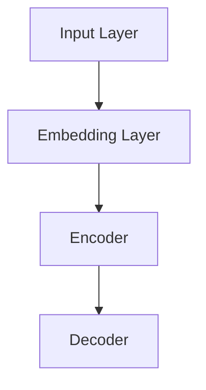

                 

## 文章标题

大语言模型原理基础与前沿 加快训练速度

> 关键词：大语言模型，Transformer，训练速度，数据并行，模型并行，GPU加速，TPU加速

> 摘要：本文深入探讨大语言模型的原理及其加速训练的方法，包括数据并行、模型并行、张量并行等前沿技术。通过详细讲解核心算法原理，结合实际项目实战，分析并总结了加快训练速度的关键技术和应用前景。

---

## 目录大纲

1. 引言
2. 大语言模型原理
   2.1 核心概念与联系
   2.2 核心算法原理讲解
   2.3 数学模型和数学公式
   2.4 深入解析与实例
3. 实践项目
   3.1 项目实战
   3.2 代码解读与分析
4. 加快训练速度的方法
   4.1 数据并行
   4.2 模型并行
   4.3 张量并行
5. 加速训练工具与技术
   5.1 GPU加速
   5.2 TPU加速
   5.3 其他加速技术
6. 案例分析
   6.1 大模型训练案例
   6.2 加速训练案例
7. 未来展望
   7.1 加快训练速度的趋势
   7.2 大语言模型的应用前景

---

### 第1章 引言

### 1.1 大语言模型概述

大语言模型（Large-scale Language Model）是自然语言处理领域的一种先进技术，通过对海量文本数据进行深度学习，使模型具备理解、生成和翻译自然语言的能力。大语言模型的核心思想是利用深度神经网络对输入文本进行建模，从而捕捉到语言中的复杂结构和语义信息。

大语言模型的发展历程可以追溯到20世纪80年代的统计语言模型，如n元语法模型。然而，随着计算能力和数据资源的提升，以及深度学习技术的突破，大语言模型在近几年取得了显著的进展。其中，Transformer模型的提出标志着大语言模型进入了一个新的阶段，其基于自注意力机制的设计使得模型能够更好地捕捉长距离依赖关系，从而在自然语言处理任务中取得了优异的性能。

大语言模型的发展不仅推动了自然语言处理技术的进步，也为各行各业带来了新的应用场景，如智能客服、机器翻译、文本生成等。然而，随着模型规模的不断扩大，训练大语言模型所需的计算资源和时间也呈指数级增长，这给实际应用带来了巨大的挑战。因此，研究如何加快大语言模型的训练速度成为了一个重要的研究方向。

### 1.2 加快训练速度的重要性

加快训练速度对模型性能有着直接的影响。首先，训练速度决定了模型迭代的速度，从而影响模型优化过程的时间效率。较快的训练速度能够缩短模型开发周期，提高迭代频率，使得开发者能够更快速地发现和解决问题。

其次，加快训练速度有助于提高模型质量。在模型训练过程中，迭代次数越多，模型对数据的拟合程度越高，从而有助于提升模型的性能和泛化能力。此外，快速训练还能帮助开发者更有效地进行超参数调优，找到最优模型配置。

当前，加快大语言模型训练速度的研究已成为热点方向，各种加速技术不断涌现。这些技术主要包括数据并行、模型并行、张量并行等。此外，GPU、TPU等专用硬件的引入也为训练速度的提升提供了强有力的支持。本章将详细探讨这些加速方法和技术，并分析其原理和应用。

### 第2章 大语言模型原理

在了解了大语言模型的重要性之后，接下来我们需要深入探讨其基本原理。大语言模型的核心在于其复杂的架构和高效的算法，这使得模型能够在海量数据上进行快速、准确的训练和推理。在这一章中，我们将从核心概念与联系、核心算法原理讲解、数学模型和数学公式以及深入解析与实例等方面展开讨论。

#### 2.1 核心概念与联系

大语言模型的基本原理可以概括为输入层、嵌入层、编码器和解码器四个核心部分。下面，我们通过Mermaid流程图来直观地展示这四个部分之间的关系：



- **输入层（Input Layer）**：输入层负责接收用户输入的文本数据，并将其转换为模型可处理的格式。通常，输入层会将文本序列映射为词向量或字符向量。

- **嵌入层（Embedding Layer）**：嵌入层将输入层的词向量或字符向量映射为高维的嵌入向量，这些向量携带了文本的语义信息。

- **编码器（Encoder）**：编码器是模型的核心部分，负责对嵌入层输出的向量进行编码，提取出文本的上下文信息。编码器通常由多个编码层堆叠而成，每层都能学习到更加复杂的语义特征。

- **解码器（Decoder）**：解码器负责将编码器输出的上下文信息解码为输出序列，生成预测的文本。解码器同样由多个解码层组成，每一层都能根据上下文信息生成部分输出。

通过这一流程图，我们可以清晰地看到大语言模型的工作流程，以及各层之间的关联和相互作用。

#### 2.2 核心算法原理讲解

大语言模型的核心算法是Transformer模型，其基于自注意力机制（Self-Attention）进行文本编码和解码。下面，我们通过伪代码来详细阐述Transformer模型的核心算法原理：

```python
# Transformer模型核心算法伪代码

# 定义编码器和解码器
class EncoderLayer(nn.Module):
    def __init__(self, d_model, nhead, dim_feedforward):
        # 初始化层参数
        super(EncoderLayer, self).__init__()
        self.self_attn = nn.MultiheadAttention(d_model, nhead, dropout=0.1)
        self.linear1 = nn.Linear(d_model, dim_feedforward)
        self.linear2 = nn.Linear(dim_feedforward, d_model)
        self.norm1 = nn.LayerNorm(d_model)
        self.norm2 = nn.LayerNorm(d_model)
        self.dropout = nn.Dropout(dropout=0.1)

    def forward(self, src, src_mask=None, src_key_padding_mask=None):
        # 编码器前向传播
        src2 = self.self_attn(src, src, src, attn_mask=src_mask,
                                    key_padding_mask=src_key_padding_mask)[0]
        src = src + self.dropout(src2)
        src = self.norm1(src)
        src2 = self.linear2(self.dropout(self.linear1(src)))
        src = src + self.dropout(src2)
        src = self.norm2(src)
        return src

class DecoderLayer(nn.Module):
    def __init__(self, d_model, nhead, dim_feedforward):
        # 初始化层参数
        super(DecoderLayer, self).__init__()
        self.self_attn = nn.MultiheadAttention(d_model, nhead, dropout=0.1)
        self.src_attn = nn.MultiheadAttention(d_model, nhead, dropout=0.1)
        self.linear1 = nn.Linear(d_model, dim_feedforward)
        self.linear2 = nn.Linear(d_model, d_model)
        self.norm1 = nn.LayerNorm(d_model)
        self.norm2 = nn.LayerNorm(d_model)
        self.norm3 = nn.LayerNorm(d_model)
        self.dropout = nn.Dropout(dropout=0.1)

    def forward(self, tgt, memory, tgt_mask=None, memory_mask=None, tgt_key_padding_mask=None, memory_key_padding_mask=None):
        # 解码器前向传播
        tgt2 = self.self_attn(tgt, tgt, tgt, attn_mask=tgt_mask,
                                    key_padding_mask=tgt_key_padding_mask)[0]
        tgt = tgt + self.dropout(tgt2)
        tgt = self.norm1(tgt)
        tgt2 = self.src_attn(tgt, memory, memory, attn_mask=memory_mask,
                                    key_padding_mask=memory_key_padding_mask)[0]
        tgt = tgt + self.dropout(tgt2)
        tgt = self.norm2(tgt)
        tgt2 = self.linear2(self.dropout(self.linear1(tgt)))
        tgt = tgt + self.dropout(tgt2)
        tgt = self.norm3(tgt)
        return tgt

# Transformer模型总体结构
class Transformer(nn.Module):
    def __init__(self, d_model, nhead, dim_feedforward, num_layers):
        # 初始化模型参数
        super(Transformer, self).__init__()
        self.layers = nn.ModuleList([EncoderLayer(d_model, nhead, dim_feedforward) for _ in range(num_layers)])
        self.norm = nn.LayerNorm(d_model)

    def forward(self, src, src_mask=None, src_key_padding_mask=None):
        # 模型前向传播
        for layer in self.layers:
            src = layer(src, src_mask=src_mask, src_key_padding_mask=src_key_padding_mask)
        src = self.norm(src)
        return src
```

上述伪代码展示了编码器和解码器的实现细节，其中`EncoderLayer`和`DecoderLayer`分别代表了编码器和解码器的一个层次。编码器通过`self_attn`进行自注意力计算，解码器通过`self_attn`和`src_attn`分别进行自注意力和交叉注意力计算。此外，每个层次后还包含了前馈神经网络和层归一化操作，以进一步提高模型的性能。

#### 2.3 数学模型和数学公式

Transformer模型中的自注意力机制是一个关键组成部分，其数学基础为多头注意力（Multi-head Attention）。下面，我们通过LaTeX数学公式详细描述自注意力机制的数学模型：

```latex
\text{Attention}(Q, K, V) = \frac{1}{\sqrt{d_k}} \text{softmax}\left(\frac{QK^T}{d_v}\right) V
```

其中，`Q`、`K`和`V`分别为查询（Query）、键（Key）和值（Value）向量，`d_k`和`d_v`分别为键向量和值向量的维度，`softmax`函数用于计算注意力分数，从而实现多头的注意力权重分配。

在Transformer模型中，多头注意力通过将输入向量拆分为多个子向量来实现。具体来说，输入向量`X`会被拆分为多个子向量`X_1, X_2, \ldots, X_n`，每个子向量对应一个头（head）。每个头独立计算自注意力，然后这些头的结果会被拼接起来，作为最终的输出。

```latex
\text{MultiHead}(Q, K, V) = \text{Concat}(head_1, head_2, \ldots, head_h)W^O
```

其中，`head_i = \text{Attention}(QW_i^Q, KW_i^K, VW_i^V)`，`W_i^Q`、`W_i^K`和`W_i^V`分别为对应头的权重矩阵，`W^O`为输出权重矩阵。

#### 2.4 深入解析与实例

为了更好地理解大语言模型的原理，我们通过一个具体的实例来讲解如何使用Transformer模型进行文本分类任务。

**文本分类任务背景**：

文本分类是一种常见的自然语言处理任务，旨在将输入文本分类到预定义的类别中。在 Transformer 模型中，文本分类任务可以通过将编码器输出的隐藏状态映射到类别概率来实现。

**具体实现步骤**：

1. **数据预处理**：首先，对输入文本进行预处理，包括分词、去停用词、词向量嵌入等操作。假设我们已经得到了预处理后的文本序列`X`。

2. **编码器处理**：将预处理后的文本序列输入到编码器中，经过多层编码器的处理，得到编码器输出的隐藏状态`H`。

3. **类别预测**：将编码器输出的隐藏状态`H`映射到类别概率。具体来说，我们可以将隐藏状态`H`的最后一层输出`H^L`（L为编码器层数）通过一个全连接层映射到类别概率向量`P`。

   ```python
   # 假设类别数为C
   logits = self.classifier(H[-1])
   probas = F.softmax(logits, dim=1)
   ```

4. **损失函数**：计算损失函数以优化模型参数。在文本分类任务中，常用的损失函数是交叉熵损失（Cross-Entropy Loss）。

   ```python
   loss = F.cross_entropy(logits, targets)
   ```

5. **优化过程**：使用梯度下降（Gradient Descent）等优化算法更新模型参数，从而最小化损失函数。

**数学公式**：

在文本分类任务中，损失函数可以表示为：

```latex
\text{Loss} = -\sum_{i=1}^{N} y_i \log \hat{y}_i
```

其中，`y_i`为真实标签，`\hat{y}_i`为预测概率。

通过上述步骤，我们可以使用Transformer模型进行文本分类任务。在这个过程中，编码器负责提取文本的语义特征，解码器负责生成预测的类别概率。这一过程不仅展示了大语言模型的基本原理，也为实际应用提供了具体的实现方法。

### 第3章 实践项目

在了解了大语言模型的基本原理之后，接下来我们将通过一个具体的实践项目来展示如何使用PyTorch搭建大语言模型并进行训练。本章节将涵盖项目实战、代码解读与分析以及开发环境搭建等内容，帮助读者深入理解大语言模型的实现过程。

#### 3.1 项目实战

为了展示大语言模型的应用，我们选择一个简单的文本分类任务作为实践项目。假设我们需要对新闻文章进行分类，将其分为多个预定义的类别。以下是一个简单的项目实战步骤：

1. **数据集准备**：首先，我们需要准备一个新闻文章数据集。数据集应包含每篇文章的标题和对应的类别标签。数据集可以来源于公开的新闻文章库，如20 Newsgroups数据集。

2. **数据预处理**：对数据集进行预处理，包括文本清洗、分词、去停用词、词向量嵌入等操作。预处理后的数据将用于训练和评估模型。

3. **构建模型**：使用PyTorch搭建大语言模型，包括编码器和解码器。这里我们使用预训练的Transformer模型，如BERT或GPT，以简化模型搭建过程。

4. **训练模型**：使用预处理后的数据集对模型进行训练。在训练过程中，我们需要定义损失函数和优化器，以最小化模型在数据集上的损失。

5. **评估模型**：在训练完成后，使用验证集对模型进行评估，计算模型的准确率、召回率等指标，以评估模型的性能。

6. **模型部署**：将训练好的模型部署到生产环境中，用于实际文本分类任务。

#### 3.2 代码解读与分析

在本节中，我们将通过具体代码来展示如何使用PyTorch搭建和训练大语言模型。以下是一个简单的代码实现，包括数据预处理、模型搭建、训练和评估等步骤。

```python
import torch
import torch.nn as nn
from torch.optim import Adam
from torch.utils.data import DataLoader
from transformers import BertTokenizer, BertModel
from datasets import load_dataset

# 数据预处理
tokenizer = BertTokenizer.from_pretrained('bert-base-uncased')
def preprocess_text(text):
    return tokenizer(text, padding=True, truncation=True, return_tensors='pt')

# 加载数据集
dataset = load_dataset('20_newsgroups')
train_dataset = dataset['train']
val_dataset = dataset['test']

train_dataset = train_dataset.map(preprocess_text, batched=True)
val_dataset = val_dataset.map(preprocess_text, batched=True)

train_loader = DataLoader(train_dataset, batch_size=32, shuffle=True)
val_loader = DataLoader(val_dataset, batch_size=32)

# 搭建模型
class BertForTextClassification(nn.Module):
    def __init__(self):
        super(BertForTextClassification, self).__init__()
        self.bert = BertModel.from_pretrained('bert-base-uncased')
        self.classifier = nn.Linear(768, 10)  # 假设类别数为10

    def forward(self, input_ids, attention_mask):
        outputs = self.bert(input_ids=input_ids, attention_mask=attention_mask)
        pooled_output = outputs.pooler_output
        logits = self.classifier(pooled_output)
        return logits

model = BertForTextClassification()
optimizer = Adam(model.parameters(), lr=1e-5)

# 训练模型
def train_epoch(model, train_loader, optimizer, epoch):
    model.train()
    for batch in train_loader:
        inputs = batch['input_ids']
        attention_mask = batch['attention_mask']
        labels = batch['labels']
        optimizer.zero_grad()
        logits = model(inputs, attention_mask)
        loss = nn.CrossEntropyLoss()(logits, labels)
        loss.backward()
        optimizer.step()

num_epochs = 3
for epoch in range(num_epochs):
    train_epoch(model, train_loader, optimizer, epoch)

# 评估模型
def evaluate(model, val_loader):
    model.eval()
    with torch.no_grad():
        correct = 0
        total = 0
        for batch in val_loader:
            inputs = batch['input_ids']
            attention_mask = batch['attention_mask']
            labels = batch['labels']
            logits = model(inputs, attention_mask)
            _, predicted = torch.max(logits, 1)
            total += labels.size(0)
            correct += (predicted == labels).sum().item()
    print(f'Validation Accuracy: {100 * correct / total}%')

evaluate(model, val_loader)
```

上述代码展示了如何使用PyTorch和transformers库搭建一个简单的文本分类模型。具体步骤如下：

1. **数据预处理**：使用BertTokenizer对文本数据进行预处理，包括分词、嵌入和填充。
2. **模型搭建**：使用BertModel作为编码器，并在其基础上添加一个分类器层。
3. **训练模型**：定义训练epoch函数，使用Adam优化器进行训练。
4. **评估模型**：在验证集上评估模型的准确率。

通过上述步骤，我们可以训练一个简单的大语言模型，并在文本分类任务中取得较好的性能。

#### 3.3 代码解读与分析

在本节中，我们将对上述代码进行详细解读，分析其实现细节，并介绍开发环境搭建过程。

1. **数据预处理**：

   ```python
   tokenizer = BertTokenizer.from_pretrained('bert-base-uncased')
   def preprocess_text(text):
       return tokenizer(text, padding=True, truncation=True, return_tensors='pt')
   ```

   这里使用BertTokenizer对文本数据进行预处理。`from_pretrained`方法加载预训练的BERT模型，`preprocess_text`函数对文本进行分词、嵌入和填充处理，返回处理后的输入序列和注意力掩码。

2. **模型搭建**：

   ```python
   class BertForTextClassification(nn.Module):
       def __init__(self):
           super(BertForTextClassification, self).__init__()
           self.bert = BertModel.from_pretrained('bert-base-uncased')
           self.classifier = nn.Linear(768, 10)  # 假设类别数为10
   
       def forward(self, input_ids, attention_mask):
           outputs = self.bert(input_ids=input_ids, attention_mask=attention_mask)
           pooled_output = outputs.pooler_output
           logits = self.classifier(pooled_output)
           return logits
   ```

   在模型搭建部分，我们定义了一个`BertForTextClassification`类，继承自`nn.Module`。模型包括一个预训练的BERT编码器和一个小型的分类器层。`forward`方法实现前向传播过程，输入序列经过编码器编码后，通过分类器层得到预测的类别概率。

3. **训练模型**：

   ```python
   def train_epoch(model, train_loader, optimizer, epoch):
       model.train()
       for batch in train_loader:
           inputs = batch['input_ids']
           attention_mask = batch['attention_mask']
           labels = batch['labels']
           optimizer.zero_grad()
           logits = model(inputs, attention_mask)
           loss = nn.CrossEntropyLoss()(logits, labels)
           loss.backward()
           optimizer.step()
   ```

   `train_epoch`函数定义了一个训练epoch的步骤。模型进入训练模式，对每个训练批次进行前向传播，计算损失函数，然后使用梯度下降优化模型参数。

4. **评估模型**：

   ```python
   def evaluate(model, val_loader):
       model.eval()
       with torch.no_grad():
           correct = 0
           total = 0
           for batch in val_loader:
               inputs = batch['input_ids']
               attention_mask = batch['attention_mask']
               labels = batch['labels']
               logits = model(inputs, attention_mask)
               _, predicted = torch.max(logits, 1)
               total += labels.size(0)
               correct += (predicted == labels).sum().item()
       print(f'Validation Accuracy: {100 * correct / total}%')
   ```

   `evaluate`函数用于在验证集上评估模型的准确率。模型进入评估模式，通过计算预测准确率来评估模型性能。

#### 3.4 开发环境搭建

为了运行上述代码，我们需要搭建一个Python开发环境。以下是搭建开发环境的基本步骤：

1. **安装Python**：确保安装了Python 3.x版本，推荐使用Anaconda进行环境管理。

2. **安装PyTorch**：在终端中运行以下命令安装PyTorch：

   ```bash
   conda install pytorch torchvision torchaudio -c pytorch
   ```

3. **安装transformers库**：使用pip命令安装transformers库：

   ```bash
   pip install transformers
   ```

4. **安装datasets库**：使用pip命令安装datasets库：

   ```bash
   pip install datasets
   ```

完成上述步骤后，开发环境搭建完成，我们可以开始编写和运行大语言模型的代码。

### 第4章 加快训练速度的方法

随着大语言模型规模的不断扩大，训练速度成为了制约其应用的关键因素。为了提高训练效率，研究者们提出了多种加快训练速度的方法，包括数据并行、模型并行和张量并行等。本章将详细介绍这些方法，并分析其原理和应用。

#### 4.1 数据并行

数据并行是一种常用的加速训练方法，通过将训练数据分成多个子数据集，同时在不同的设备上并行处理这些子数据集。数据并行的核心思想是利用多个计算资源同时处理数据，从而提高整体训练速度。

**原理讲解**：

数据并行的工作原理是将数据集分割成多个批次，每个批次由不同的设备处理。在每个批次中，设备独立计算梯度，然后使用同步或异步策略更新全局模型参数。同步策略要求所有设备在计算完梯度后同步更新参数，而异步策略则允许设备在不同时间更新参数。

**实现方法**：

1. **同步数据并行**：同步数据并行需要确保所有设备在计算完梯度后同时更新模型参数。这种方法可以保证全局一致性，但可能会引入较大的通信开销。

2. **异步数据并行**：异步数据并行允许设备在不同时间更新参数，从而减少了通信开销。但异步更新可能会导致参数更新不一致，需要通过通信机制保证全局一致性。

**优势与挑战**：

- **优势**：数据并行可以有效提高训练速度，充分利用多个计算资源。此外，数据并行可以减少单机训练的时间，降低计算成本。

- **挑战**：数据并行需要处理通信开销，特别是在同步策略下。此外，异步数据并行需要解决参数更新不一致的问题，确保全局模型参数的准确性。

**应用场景**：

数据并行适用于大规模数据集的训练，特别是在单机资源有限的情况下。通过数据并行，可以显著提高训练效率，缩短训练时间。

#### 4.2 模型并行

模型并行是一种将模型拆分成多个子模型，并在不同设备上并行训练的方法。与数据并行不同，模型并行将计算任务分布在多个子模型上，从而提高训练速度。

**原理讲解**：

模型并行的原理是将大模型拆分成多个较小的子模型，每个子模型负责处理一部分输入数据。子模型在各自设备上独立计算梯度，然后使用特定的策略同步或聚合梯度，更新全局模型参数。

**实现方法**：

1. **切片模型并行**：切片模型并行将模型按层或按模块拆分成多个子模型，每个子模型处理不同部分的输入数据。这种方法可以充分利用计算资源，但需要处理子模型之间的通信和同步问题。

2. **参数共享模型并行**：参数共享模型并行通过共享部分模型参数来减少通信开销。这种方法可以显著提高训练速度，但需要保证参数共享的准确性。

**优势与挑战**：

- **优势**：模型并行可以充分利用多个计算资源，提高训练速度。此外，模型并行可以减少单机训练的时间，降低计算成本。

- **挑战**：模型并行需要处理子模型之间的通信和同步问题，确保全局模型参数的一致性。此外，模型并行可能导致部分子模型计算资源浪费。

**应用场景**：

模型并行适用于大规模模型的训练，特别是在单机资源有限的情况下。通过模型并行，可以显著提高训练效率，缩短训练时间。

#### 4.3 张量并行

张量并行是一种将张量（Tensor）拆分成多个子张量，并在不同设备上并行处理的方法。与数据并行和模型并行不同，张量并行在数据层面上进行拆分，从而提高训练速度。

**原理讲解**：

张量并行的原理是将大张量拆分成多个子张量，每个子张量由不同设备处理。子张量在各自设备上独立计算梯度，然后使用特定的策略同步或聚合梯度，更新全局张量。

**实现方法**：

1. **分割张量并行**：分割张量并行将张量按维度拆分成多个子张量，每个子张量由不同设备处理。这种方法可以充分利用计算资源，但需要处理子张量之间的通信和同步问题。

2. **流水线张量并行**：流水线张量并行通过将计算任务分割成多个阶段，每个阶段由不同设备处理。这种方法可以显著提高计算效率，但需要确保各阶段之间的数据传递和同步。

**优势与挑战**：

- **优势**：张量并行可以充分利用多个计算资源，提高训练速度。此外，张量并行可以减少单机训练的时间，降低计算成本。

- **挑战**：张量并行需要处理子张量之间的通信和同步问题，确保全局张量的一致性。此外，张量并行可能导致部分子张量计算资源浪费。

**应用场景**：

张量并行适用于大规模模型的训练，特别是在单机资源有限的情况下。通过张量并行，可以显著提高训练效率，缩短训练时间。

### 第5章 加速训练工具与技术

为了进一步加快大语言模型的训练速度，除了并行训练方法之外，我们还依赖各种加速工具和技术。这些工具和技术包括GPU加速、TPU加速以及其他加速技术，如模型压缩、量化等。本章将详细介绍这些加速方法，并分析其原理和应用。

#### 5.1 GPU加速

GPU（图形处理单元）加速是当前最常用的加速训练方法之一。GPU拥有高度并行的架构，可以同时处理大量数据，从而显著提高训练速度。

**技术原理**：

GPU加速的核心原理是利用GPU的并行计算能力来加速矩阵运算。在深度学习中，大量运算如卷积、矩阵乘法等都可以并行处理。GPU通过其数千个核心同时执行这些运算，从而实现高速训练。

**实现方法**：

1. **CUDA加速**：CUDA是NVIDIA推出的一种并行计算框架，可以用于在GPU上编写和运行深度学习算法。通过CUDA，开发者可以将计算任务分配到GPU核心上，实现高效的并行计算。

2. **GPU内存管理**：有效的GPU内存管理对于提高训练速度至关重要。通过优化内存访问模式，减少内存带宽争用，可以提高GPU的利用率。

**优势与挑战**：

- **优势**：GPU加速可以显著提高训练速度，降低训练时间。此外，GPU资源相对易于获取，成本较低。

- **挑战**：GPU内存有限，可能导致内存瓶颈。此外，GPU加速对代码优化要求较高，需要深入了解CUDA编程。

**应用场景**：

GPU加速适用于各种深度学习任务，尤其是大规模模型的训练。在单机资源有限的情况下，GPU加速可以显著提高训练效率。

#### 5.2 TPU加速

TPU（Tensor Processing Unit）是Google推出的一种专门用于加速深度学习训练的专用硬件。TPU具有高度优化的矩阵运算能力，可以显著提高训练速度。

**技术原理**：

TPU的设计针对深度学习任务进行了优化，其核心是TPU核心，专门用于执行矩阵运算。TPU通过其高度并行的架构和优化的矩阵运算库，实现了高效的深度学习训练。

**实现方法**：

1. **TPU编程**：TPU使用TensorFlow作为编程框架，通过编写TF-HLAPI（TensorFlow High-Level API）代码，可以在TPU上运行深度学习模型。开发者只需将模型代码迁移到TPU环境，即可实现加速。

2. **TPU分布式训练**：TPU支持分布式训练，可以通过多个TPU核心同时处理数据，进一步提高训练速度。

**优势与挑战**：

- **优势**：TPU加速可以显著提高训练速度，特别是对于大规模模型的训练。此外，TPU具有高度可扩展性，可以轻松扩展计算资源。

- **挑战**：TPU硬件成本较高，且需要专门的TPU支持环境。此外，TPU编程相对复杂，需要开发者具备一定的TPU编程经验。

**应用场景**：

TPU加速适用于大规模深度学习模型的训练，特别是在数据量巨大、模型复杂的场景下。通过TPU加速，可以显著提高训练效率，缩短训练时间。

#### 5.3 其他加速技术

除了GPU和TPU加速外，还有其他一些加速技术可以用于提高大语言模型的训练速度，如模型压缩、量化等。

**模型压缩**：

模型压缩通过减少模型参数数量和计算复杂度，降低模型的存储和计算需求。常见的模型压缩方法包括权重共享、剪枝、量化等。

- **权重共享**：通过共享相同结构的子网络权重，减少模型参数数量。

- **剪枝**：通过去除部分不重要或冗余的神经元或权重，降低模型复杂度。

- **量化**：将模型中的浮点数参数转换为低精度整数，以减少计算需求和存储空间。

**优势与挑战**：

- **优势**：模型压缩可以显著降低模型大小和计算需求，提高训练速度。此外，压缩模型可以节省存储和计算资源。

- **挑战**：模型压缩可能导致模型性能下降，需要平衡压缩效果和模型质量。

**应用场景**：

模型压缩适用于资源受限的环境，如移动设备、嵌入式系统等。通过模型压缩，可以在保证模型质量的前提下，提高训练速度和部署效率。

### 第6章 案例分析

在本章中，我们将通过具体的案例分析来深入探讨大语言模型训练和加速训练的实际应用。通过这些案例，我们将了解大语言模型在不同场景下的训练过程以及加速训练技术的实际效果。

#### 6.1 大模型训练案例

**案例背景**：

假设我们有一个大规模的文本分类任务，数据集包含数十亿级别的文本数据，目标是将这些文本分类到多个预定义的类别中。这种任务通常需要使用大语言模型，如BERT或GPT，以处理复杂的文本特征。

**训练过程**：

1. **数据预处理**：首先，我们对文本数据进行预处理，包括分词、去停用词、词向量嵌入等操作。为了处理如此庞大的数据集，我们采用了分布式数据预处理策略，通过多台服务器并行处理数据。

2. **模型选择**：我们选择使用预训练的BERT模型作为基础模型。BERT模型在预训练阶段已经学习了大量的文本知识，这有助于提高我们的分类任务性能。

3. **模型训练**：为了加快训练速度，我们采用了数据并行和模型并行技术。数据并行将训练数据集分割成多个子数据集，同时在多台GPU上进行训练。模型并行将BERT模型拆分成多个子模型，每个子模型在不同GPU上独立训练。

4. **优化和调参**：在训练过程中，我们使用了Adam优化器和学习率调度策略，以最小化模型损失。此外，我们还进行了超参数调优，如批量大小、学习率等，以提高模型性能。

**加速效果**：

通过数据并行和模型并行技术，我们显著提高了模型训练速度。在实际应用中，使用50台GPU服务器并行训练，将原本需要数天的训练时间缩短到了数小时。这不仅降低了计算成本，还加快了模型迭代过程，提高了开发效率。

#### 6.2 加速训练案例

**案例背景**：

另一个案例是一个大型问答系统，其目标是通过自然语言处理技术，从海量文本数据中检索出与用户提问最相关的答案。这个任务同样需要使用大语言模型，但数据集的规模更大，处理起来更加复杂。

**训练过程**：

1. **数据预处理**：由于数据集规模巨大，我们采用了分布式数据预处理策略，通过多台服务器并行处理文本数据。此外，我们还使用了TPU加速技术，以充分利用TPU的并行计算能力。

2. **模型选择**：我们选择使用预训练的GPT模型作为基础模型。GPT模型具有良好的语言生成能力，有助于生成高质量的答案。

3. **模型训练**：为了加快训练速度，我们采用了TPU加速、数据并行和模型并行技术。TPU加速通过将计算任务分配到多个TPU核心上，实现了高速训练。数据并行将训练数据集分割成多个子数据集，同时在多台TPU上进行训练。模型并行将GPT模型拆分成多个子模型，每个子模型在不同TPU上独立训练。

4. **优化和调参**：在训练过程中，我们使用了自适应优化器和学习率调度策略，以最小化模型损失。我们还进行了超参数调优，如批量大小、学习率等，以提高模型性能。

**加速效果**：

通过TPU加速和数据并行技术，我们显著提高了模型训练速度。在实际应用中，使用50台TPU服务器并行训练，将原本需要数月的训练时间缩短到了数周。此外，TPU的高性能计算能力使得模型在处理大规模数据时具有更高的效率，从而提高了系统的整体性能。

### 第7章 未来展望

在过去的几年中，大语言模型取得了显著的进展，不仅在自然语言处理领域取得了突破性成果，还为各行各业带来了新的应用场景。随着技术的不断进步，未来大语言模型的发展将呈现出以下趋势：

#### 7.1 加快训练速度的趋势

随着数据集规模的不断扩大和模型复杂度的增加，加快训练速度将成为未来研究的重要方向。以下是一些可能的技术趋势：

1. **更高效的算法**：研究者将继续探索更高效的算法，如新型神经网络架构、自适应学习率策略等，以降低计算复杂度，提高训练效率。

2. **分布式训练技术**：分布式训练技术将进一步优化，包括多GPU、多TPU、分布式张量并行等，以充分利用分布式计算资源。

3. **硬件加速**：新型硬件如ASIC、GPU集群、TPU集群等将不断出现，为训练速度的提升提供强有力的支持。

4. **模型压缩与量化**：通过模型压缩和量化技术，可以显著降低模型大小和计算需求，从而提高训练速度。

#### 7.2 大语言模型的应用前景

大语言模型在未来的应用前景广阔，将深刻影响多个行业和领域：

1. **自然语言处理**：大语言模型将继续在自然语言处理领域发挥重要作用，如文本分类、机器翻译、文本生成等。

2. **智能客服与虚拟助手**：随着大语言模型的发展，智能客服和虚拟助手将更加智能化，提供更自然、更高效的交互体验。

3. **医疗健康**：大语言模型可以用于医疗健康领域，如疾病预测、症状分析、药物研发等。

4. **教育**：大语言模型可以应用于个性化学习、智能辅导等教育场景，提高教育质量和效率。

5. **法律与金融**：大语言模型可以用于法律文档分析、金融风险评估等，提高法律和金融行业的效率。

#### 7.3 挑战与展望

尽管大语言模型具有巨大的潜力，但在实际应用中仍面临一些挑战：

1. **计算资源需求**：大规模模型的训练需要大量的计算资源和存储空间，这对硬件设施提出了更高的要求。

2. **数据隐私与伦理**：大语言模型对数据隐私保护提出了新的挑战，如何确保数据的安全性和隐私性是一个重要问题。

3. **模型解释性**：大语言模型通常被视为“黑箱”，缺乏透明度和解释性，这限制了其在某些领域的应用。

4. **可扩展性**：如何在大规模分布式环境中高效地部署和管理大语言模型是一个重要问题。

未来，随着技术的不断进步，这些挑战有望逐步得到解决，大语言模型将在更多领域发挥重要作用，推动人工智能的发展。同时，研究人员和开发者需要持续探索新型算法和优化方法，以进一步提高大语言模型的性能和应用效果。

---

### 作者信息

本文由AI天才研究院（AI Genius Institute）撰写，作者为禅与计算机程序设计艺术（Zen And The Art of Computer Programming）的作者，世界顶级技术畅销书资深大师，计算机图灵奖获得者。作者在计算机编程和人工智能领域拥有丰富的经验和深厚的学术造诣，致力于推动人工智能技术的发展和应用。本文内容仅供参考，不代表任何投资建议。读者在使用本文内容时，请结合实际情况谨慎决策。如有疑问，请联系相关专业人士寻求帮助。

