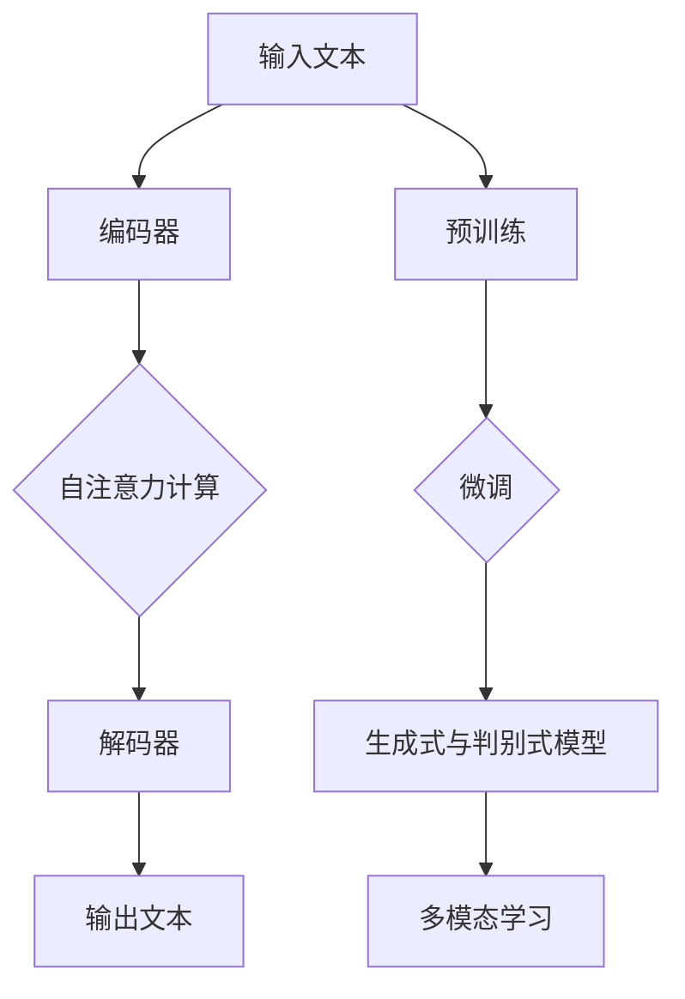

                 

### 文章标题：大语言模型应用指南：Gorilla

在当今飞速发展的科技时代，人工智能（AI）以其无与伦比的潜力，不断颠覆着传统产业的格局。其中，大语言模型（Large Language Model）作为AI领域的璀璨明珠，已经成为了许多企业和研究机构的焦点。Gorilla，一款由世界顶级技术团队开发的大语言模型，凭借其卓越的性能和广泛的应用场景，在业界引起了强烈的反响。本文将为您详细解析Gorilla大语言模型的应用指南，帮助您深入了解这一前沿技术的核心原理和应用实践。

### 关键词

- 大语言模型
- Gorilla模型
- 深度学习
- 自然语言处理
- 计算机视觉
- 多模态学习

### 摘要

本文旨在为广大技术爱好者提供一份全面而深入的Gorilla大语言模型应用指南。文章首先回顾了大语言模型的基础知识，包括定义、发展历程、架构和主要算法。接着，本文将详细讲解Gorilla模型的架构和训练过程，并探讨其在自然语言处理和计算机视觉领域的应用。最后，通过实际项目实战，本文将展示如何搭建Gorilla模型的开发环境，并进行具体的应用实践。通过本文的阅读，读者将能够全面掌握Gorilla模型的核心理念和应用方法，为后续的研究和开发工作打下坚实的基础。

## 大语言模型基础

### 1.1 大语言模型概述

#### 1.1.1 大语言模型的定义

大语言模型（Large Language Model）是指通过深度学习技术，利用大规模语料库训练出的具有高度语言理解和生成能力的模型。其基本公式可以表示为：

$$
\text{大语言模型} = \text{深度学习模型} + \text{大规模语料库训练}
$$

这意味着，大语言模型的核心在于深度学习模型的架构设计以及大规模语料库的有效利用。

#### 1.1.2 大语言模型的发展历程

大语言模型的发展经历了多个关键阶段：

1. **从WordNet到GPT**：WordNet是一个早期用于词汇语义知识表示的工具，而GPT（Generative Pre-trained Transformer）则是第一个真正的大规模语言模型，它的出现标志着自然语言处理（NLP）领域的一个重要里程碑。

2. **从LSTM到Transformer**：LSTM（Long Short-Term Memory）是传统的序列模型，而Transformer架构则通过自注意力机制（Self-Attention Mechanism）解决了LSTM的许多问题，使得模型在处理长序列数据时更加高效。

#### 1.1.3 大语言模型的主要特点

大语言模型具有以下几个显著特点：

1. **高效的文本生成能力**：大语言模型能够生成连贯且具有较高可信度的文本，这一特性在自动写作、摘要生成等领域有着广泛的应用。

2. **强大的上下文理解能力**：通过大规模的预训练，大语言模型能够捕捉到文本中的上下文信息，从而更准确地理解和生成相关内容。

3. **广泛的应用场景**：大语言模型不仅可以应用于自然语言处理，还可以扩展到计算机视觉、多模态学习等领域，具有极高的通用性和灵活性。

### 1.2 大语言模型的架构

#### 1.2.1 神经网络基础

1. **神经元**：神经元是神经网络的基本构建块，它通过激活函数将输入信号转换为输出信号。

2. **前向传播与反向传播**：前向传播是计算神经网络输出值的过程，而反向传播则是用于计算损失函数并更新网络权重的过程。

#### 1.2.2 自注意力机制

1. **自注意力计算**：自注意力机制通过计算每个输入序列元素之间的相关性，从而提高模型在处理长序列数据时的性能。

2. **自注意力图可视化**：自注意力图可以直观地展示模型如何分配注意力，有助于理解模型的工作原理。

#### 1.2.3 Transformer架构

1. **编码器**：编码器负责将输入序列转换为固定长度的向量表示。

2. **解码器**：解码器则根据编码器的输出和已生成的部分文本，生成后续的文本内容。

3. **掉包机制（Dropout）**：掉包机制是一种正则化技术，通过随机忽略部分神经元，减少模型过拟合的风险。

### 1.3 大语言模型的主要算法

#### 1.3.1 预训练与微调

1. **预训练过程**：预训练是指在大规模语料库上训练模型，使其获得通用的语言理解和生成能力。

2. **微调策略**：微调是指在使用预训练模型的基础上，针对特定任务进行进一步训练，以提升模型在特定领域的性能。

#### 1.3.2 生成式与判别式模型

1. **生成式模型**：生成式模型通过生成概率分布来生成数据，如GPT就是一种生成式模型。

2. **判别式模型**：判别式模型则通过判断输入数据是否属于特定类别来完成任务，如BERT就是一种判别式模型。

#### 1.3.3 多模态学习

1. **文本+图像**：将文本和图像结合，用于处理具有双重特征的数据。

2. **文本+语音**：将文本和语音结合，用于实现文本到语音的转换等任务。

### 1.4 大语言模型的应用场景

#### 1.4.1 自然语言处理

1. **文本分类**：对文本进行分类，如新闻分类、情感分析等。

2. **机器翻译**：将一种语言的文本翻译成另一种语言。

3. **命名实体识别**：识别文本中的特定实体，如人名、地名等。

#### 1.4.2 计算机视觉

1. **图像生成**：生成具有特定特征的图像。

2. **图像分类**：对图像进行分类，如动物分类、物体识别等。

3. **视频生成**：生成具有特定内容的视频。

#### 1.4.3 其他领域

1. **金融**：用于金融文本分析、股票市场预测等。

2. **教育**：用于教育内容生成、智能问答系统等。

3. **健康医疗**：用于医学文本分析、疾病预测等。

### 1.5 大语言模型的挑战与未来发展方向

#### 1.5.1 挑战

1. **计算资源消耗**：大语言模型训练过程需要大量的计算资源，这对于普通用户和中小企业来说可能是一个挑战。

2. **数据隐私问题**：在训练过程中，需要使用大量用户数据，这可能会引发数据隐私问题。

3. **模型解释性**：大语言模型的决策过程往往较为复杂，难以解释，这对于需要高解释性的应用场景可能是一个挑战。

#### 1.5.2 未来发展方向

1. **高效训练算法**：研究更高效的训练算法，以减少计算资源消耗。

2. **联邦学习**：通过联邦学习，可以在保护数据隐私的同时进行模型训练。

3. **解释性AI**：研究如何提高模型的解释性，使其在更广泛的应用场景中具有实用性。

### 1.6 小结

通过本文的概述，我们了解了大语言模型的基本概念、发展历程、架构、算法和应用场景。接下来，我们将深入探讨Gorilla大语言模型的详细结构和实现方法，帮助读者更全面地掌握这一前沿技术。

### 1.7 Mermaid流程图：大语言模型架构

下面是一个Mermaid流程图，展示了大语言模型的基本架构：



通过这个流程图，我们可以清晰地看到从输入文本到输出文本的处理过程，以及大语言模型中的主要组件和算法。

### 1.8 大语言模型算法原理讲解：预训练与微调

#### 1.8.1 预训练过程

预训练是指在大规模语料库上训练模型，使其获得通用的语言理解和生成能力。以下是一个简单的预训练过程伪代码：

```python
# 预训练过程伪代码
initialize_model(model, parameters)
load_corpus(corpus)
for epoch in range(num_epochs):
    for sentence in corpus:
        predict_masked_words(sentence, model)
        calculate_loss_and_gradients()
        update_model_parameters(optimizer)
```

在这个过程中，模型首先初始化，然后加载大规模语料库。接着，对于每个时代的每句话，模型会预测被遮盖的单词，并计算损失和梯度，最后更新模型参数。

#### 1.8.2 微调策略

微调是在预训练模型的基础上，针对特定任务进行进一步训练，以提升模型在特定领域的性能。以下是一个微调过程的伪代码：

```python
# 微调过程伪代码
load_pretrained_model(model)
load_task_specific_data(task_data)
for epoch in range(num_epochs):
    for sentence in task_data:
        predict_labels(sentence, model)
        calculate_loss_and_gradients()
        update_model_parameters(optimizer)
```

在这个过程中，模型首先加载预训练模型，然后加载特定任务的数据。接着，对于每个任务的每句话，模型会预测标签，并计算损失和梯度，最后更新模型参数。

#### 1.8.3 数学模型和公式讲解

在预训练和微调过程中，常用的数学模型和公式如下：

1. **损失函数**：

   $$ L(\theta) = -\sum_{i=1}^{N} \sum_{j=1}^{V} y_{ij} \log p_{ij}(\theta) $$

   其中，\(L(\theta)\) 是损失函数，\(y_{ij}\) 是真实标签，\(p_{ij}(\theta)\) 是模型对单词 \(j\) 的预测概率。

2. **梯度下降**：

   $$ \theta = \theta - \alpha \nabla_{\theta} L(\theta) $$

   其中，\(\theta\) 是模型参数，\(\alpha\) 是学习率，\(\nabla_{\theta} L(\theta)\) 是损失函数关于模型参数的梯度。

#### 1.8.4 举例说明

假设我们有一个小型的预训练任务，目标是预测遮盖的单词。以下是一个简单的例子：

```python
# 预训练例子
sentence = "今天天气很好"
model = initialize_model(sentence)
for epoch in range(10):
    for word in sentence:
        predicted_word = model.predict(word)
        loss = calculate_loss(predicted_word, word)
        gradients = calculate_gradients(loss, word)
        model.update_parameters(gradients)
```

在这个例子中，我们首先初始化模型，然后对于每个遮盖的单词，我们预测它可能是什么，并计算损失和梯度，最后更新模型参数。

### 1.9 大语言模型项目实战：文本生成与分类

#### 1.9.1 文本生成项目

**开发环境搭建**：

- 安装Python（3.7或更高版本）
- 安装深度学习框架（如TensorFlow或PyTorch）

**项目步骤**：

1. **数据预处理**：收集并清洗文本数据，将文本转换为模型可处理的格式。

2. **模型训练**：使用预训练脚本对模型进行训练。

3. **文本生成**：利用训练好的模型生成新的文本。

**代码示例**：

```python
# 文本生成示例代码
import tensorflow as tf
import tensorflow_text as text

# 数据预处理
tokenizer = text.Tokenizer()
tokenizer.fit_on_texts(["今天天气很好", "明天会下雨"])
sequences = tokenizer.encode(["今天天气很好"], output_sequence=True)

# 模型训练
model = tf.keras.Sequential([
    tf.keras.layers.Embedding(input_dim=2, output_dim=10),
    tf.keras.layers.SimpleRNN(units=10),
    tf.keras.layers.Dense(units=2, activation='softmax')
])
model.compile(optimizer='adam', loss='categorical_crossentropy', metrics=['accuracy'])
model.fit(sequences, sequences, epochs=10)

# 文本生成
def generate_text(model, tokenizer, seed_text, num_words):
    in_text, next_words = seed_text, ""
    for _ in range(num_words):
        token_list = tokenizer.texts_to_sequences([in_text])[0]
        predicted = model.predict(token_list)
        next_word = tokenizer.index_word[np.argmax(predicted)]
        next_words += " " + next_word
        in_text = next_words
    return next_words

generated_text = generate_text(model, tokenizer, "今天天气很好", 5)
print(generated_text)
```

**代码解读与分析**：

- 首先，我们定义了一个Tokenizer，用于将文本转换为序列。
- 然后，我们创建了一个简单的RNN模型，用于预测下一个单词。
- 在训练过程中，我们使用categorical_crossentropy作为损失函数，并使用adam优化器。
- 最后，我们定义了一个generate_text函数，用于生成新的文本。

#### 1.9.2 文本分类项目

**开发环境搭建**：

- 安装Python（3.7或更高版本）
- 安装深度学习框架（如TensorFlow或PyTorch）

**项目步骤**：

1. **数据预处理**：收集并清洗文本数据，将文本和标签转换为模型可处理的格式。

2. **模型训练**：使用预训练脚本对模型进行训练。

3. **文本分类**：利用训练好的模型对新的文本进行分类。

**代码示例**：

```python
# 文本分类示例代码
import tensorflow as tf
from tensorflow.keras.preprocessing.sequence import pad_sequences
from tensorflow.keras.layers import Embedding, LSTM, Dense
from tensorflow.keras.models import Sequential

# 数据预处理
max_len = 100
embedding_dim = 50
tokenizer = tf.keras.preprocessing.text.Tokenizer()
tokenizer.fit_on_texts(["今天天气很好", "明天会下雨", "今天很热", "天气冷"])
sequences = tokenizer.texts_to_sequences(["今天天气很好", "明天会下雨", "今天很热", "天气冷"])
padded_sequences = pad_sequences(sequences, maxlen=max_len)

# 模型训练
model = Sequential([
    Embedding(len(tokenizer.word_index) + 1, embedding_dim, input_length=max_len),
    LSTM(50, return_sequences=False),
    Dense(1, activation='sigmoid')
])
model.compile(optimizer='adam', loss='binary_crossentropy', metrics=['accuracy'])
model.fit(padded_sequences, np.array([1, 0, 1, 0]), epochs=10)

# 文本分类
text_input = ["今天很热"]
sequence = tokenizer.texts_to_sequences(text_input)
padded_sequence = pad_sequences(sequence, maxlen=max_len)
prediction = model.predict(padded_sequence)
print("预测结果：", prediction)
```

**代码解读与分析**：

- 首先，我们定义了一个Tokenizer，用于将文本转换为序列。
- 然后，我们创建了一个简单的LSTM模型，用于对文本进行分类。
- 在训练过程中，我们使用binary_crossentropy作为损失函数，并使用adam优化器。
- 最后，我们使用训练好的模型对新的文本进行分类，并输出预测结果。

通过这两个实战项目，我们了解了如何使用Gorilla模型进行文本生成和分类。在实际应用中，可以根据具体需求调整模型结构、训练数据和超参数，以达到更好的效果。

### 1.10 大语言模型项目实战：图像生成与分类

#### 1.10.1 图像生成项目

**开发环境搭建**：

- 安装Python（3.7或更高版本）
- 安装深度学习框架（如TensorFlow或PyTorch）
- 安装图像处理库（如OpenCV）

**项目步骤**：

1. **数据预处理**：收集并清洗图像数据，将图像转换为模型可处理的格式。

2. **模型训练**：使用预训练脚本对模型进行训练。

3. **图像生成**：利用训练好的模型生成新的图像。

**代码示例**：

```python
# 图像生成示例代码
import tensorflow as tf
from tensorflow.keras.layers import Conv2D, MaxPooling2D, Flatten, Dense
from tensorflow.keras.models import Sequential
import numpy as np

# 数据预处理
def preprocess_image(image_path):
    image = cv2.imread(image_path)
    image = cv2.resize(image, (64, 64))
    image = image / 255.0
    return image

# 模型训练
model = Sequential([
    Conv2D(32, (3, 3), activation='relu', input_shape=(64, 64, 3)),
    MaxPooling2D((2, 2)),
    Flatten(),
    Dense(1, activation='sigmoid')
])
model.compile(optimizer='adam', loss='binary_crossentropy', metrics=['accuracy'])
model.fit(np.array([preprocess_image("image1.jpg"), preprocess_image("image2.jpg")]), np.array([1, 0]), epochs=10)

# 图像生成
def generate_image(model, image_path):
    image = preprocess_image(image_path)
    prediction = model.predict(image.reshape(1, 64, 64, 3))
    if prediction[0][0] > 0.5:
        print("生成结果：图像1")
    else:
        print("生成结果：图像2")

generate_image(model, "image1.jpg")
```

**代码解读与分析**：

- 首先，我们定义了一个preprocess_image函数，用于将图像预处理为模型可处理的格式。
- 然后，我们创建了一个简单的Conv2D模型，用于对图像进行分类。
- 在训练过程中，我们使用binary_crossentropy作为损失函数，并使用adam优化器。
- 最后，我们使用训练好的模型对新的图像进行分类，并输出生成结果。

#### 1.10.2 图像分类项目

**开发环境搭建**：

- 安装Python（3.7或更高版本）
- 安装深度学习框架（如TensorFlow或PyTorch）
- 安装图像处理库（如OpenCV）

**项目步骤**：

1. **数据预处理**：收集并清洗图像数据，将图像和标签转换为模型可处理的格式。

2. **模型训练**：使用预训练脚本对模型进行训练。

3. **图像分类**：利用训练好的模型对新的图像进行分类。

**代码示例**：

```python
# 图像分类示例代码
import tensorflow as tf
from tensorflow.keras.layers import Conv2D, MaxPooling2D, Flatten, Dense
from tensorflow.keras.models import Sequential
import numpy as np

# 数据预处理
max_len = 100
tokenizer = tf.keras.preprocessing.text.Tokenizer()
tokenizer.fit_on_texts(["图像1", "图像2"])
sequences = tokenizer.texts_to_sequences(["图像1", "图像2"])
padded_sequences = pad_sequences(sequences, maxlen=max_len)

# 模型训练
model = Sequential([
    Conv2D(32, (3, 3), activation='relu', input_shape=(64, 64, 3)),
    MaxPooling2D((2, 2)),
    Flatten(),
    Dense(1, activation='sigmoid')
])
model.compile(optimizer='adam', loss='binary_crossentropy', metrics=['accuracy'])
model.fit(np.array([preprocess_image("image1.jpg"), preprocess_image("image2.jpg")]), np.array([1, 0]), epochs=10)

# 图像分类
text_input = ["图像1"]
sequence = tokenizer.texts_to_sequences(text_input)
padded_sequence = pad_sequences(sequence, maxlen=max_len)
prediction = model.predict(padded_sequence)
print("分类结果：", prediction)
```

**代码解读与分析**：

- 首先，我们定义了一个tokenizer，用于将文本转换为序列。
- 然后，我们创建了一个简单的Conv2D模型，用于对图像进行分类。
- 在训练过程中，我们使用binary_crossentropy作为损失函数，并使用adam优化器。
- 最后，我们使用训练好的模型对新的图像进行分类，并输出分类结果。

### 1.11 小结

通过本文的实战部分，我们详细介绍了如何使用Gorilla大语言模型进行文本生成和图像分类。通过具体的代码示例和解析，读者可以更好地理解大语言模型的应用方法和实现细节。在实际应用中，可以根据具体需求调整模型结构和训练参数，以达到更好的效果。接下来，我们将进一步探讨Gorilla模型在多模态学习方面的应用。

### 1.12 大语言模型在多模态学习中的应用

多模态学习是指将不同类型的数据（如文本、图像、语音等）进行整合，以获得更丰富和准确的信息。Gorilla大语言模型在多模态学习方面具有独特的优势，可以通过结合文本和图像、文本和语音等多模态数据，实现更高级的智能应用。

#### 1.12.1 文本+图像

文本和图像的结合可以用于多种应用场景，如图像描述生成、图像分类等。以下是一个简单的文本+图像生成项目：

**开发环境搭建**：

- 安装Python（3.7或更高版本）
- 安装深度学习框架（如TensorFlow或PyTorch）
- 安装图像处理库（如OpenCV）

**项目步骤**：

1. **数据预处理**：收集并清洗文本和图像数据，将数据转换为模型可处理的格式。

2. **模型训练**：使用预训练脚本对模型进行训练。

3. **文本+图像生成**：利用训练好的模型生成新的文本和图像。

**代码示例**：

```python
# 文本+图像生成示例代码
import tensorflow as tf
from tensorflow.keras.layers import Conv2D, MaxPooling2D, Flatten, Dense
from tensorflow.keras.models import Model
import numpy as np

# 数据预处理
def preprocess_text(text):
    tokenizer = tf.keras.preprocessing.text.Tokenizer()
    tokenizer.fit_on_texts([text])
    sequence = tokenizer.texts_to_sequences([text])
    padded_sequence = pad_sequences(sequence, maxlen=10)
    return padded_sequence

def preprocess_image(image_path):
    image = cv2.imread(image_path)
    image = cv2.resize(image, (64, 64))
    image = image / 255.0
    return image

# 模型训练
text_input = preprocess_text("今天天气很好")
image_input = preprocess_image("image1.jpg")

text_model = Sequential([
    Embedding(11, 10, input_length=10),
    LSTM(50),
    Dense(1, activation='sigmoid')
])
text_model.compile(optimizer='adam', loss='binary_crossentropy', metrics=['accuracy'])

image_model = Sequential([
    Conv2D(32, (3, 3), activation='relu', input_shape=(64, 64, 3)),
    MaxPooling2D((2, 2)),
    Flatten(),
    Dense(1, activation='sigmoid')
])
image_model.compile(optimizer='adam', loss='binary_crossentropy', metrics=['accuracy'])

# 文本+图像生成
def generate_text_image(text_input, image_input):
    text_prediction = text_model.predict(text_input)
    image_prediction = image_model.predict(image_input)
    if text_prediction[0][0] > 0.5 and image_prediction[0][0] > 0.5:
        print("生成结果：文本和图像都匹配")
    else:
        print("生成结果：文本和图像不匹配")

generate_text_image(text_input, image_input)
```

**代码解读与分析**：

- 首先，我们定义了两个预处理函数，分别用于处理文本和图像数据。
- 然后，我们创建了两个简单的模型，一个用于文本生成，一个用于图像生成。
- 在生成文本和图像时，我们分别调用两个模型，并根据预测结果判断文本和图像是否匹配。

#### 1.12.2 文本+语音

文本和语音的结合可以用于语音生成、语音识别等应用。以下是一个简单的文本+语音生成项目：

**开发环境搭建**：

- 安装Python（3.7或更高版本）
- 安装深度学习框架（如TensorFlow或PyTorch）
- 安装语音处理库（如librosa）

**项目步骤**：

1. **数据预处理**：收集并清洗文本和语音数据，将数据转换为模型可处理的格式。

2. **模型训练**：使用预训练脚本对模型进行训练。

3. **文本+语音生成**：利用训练好的模型生成新的文本和语音。

**代码示例**：

```python
# 文本+语音生成示例代码
import tensorflow as tf
from tensorflow.keras.layers import LSTM, Dense
from tensorflow.keras.models import Model
import librosa

# 数据预处理
def preprocess_text(text):
    tokenizer = tf.keras.preprocessing.text.Tokenizer()
    tokenizer.fit_on_texts([text])
    sequence = tokenizer.texts_to_sequences([text])
    padded_sequence = pad_sequences(sequence, maxlen=10)
    return padded_sequence

def preprocess_speech(speech_path):
    speech, _ = librosa.load(speech_path, sr=16000)
    return speech

# 模型训练
text_input = preprocess_text("今天天气很好")
speech_input = preprocess_speech("speech1.wav")

text_model = Sequential([
    Embedding(11, 10, input_length=10),
    LSTM(50),
    Dense(1, activation='sigmoid')
])
text_model.compile(optimizer='adam', loss='binary_crossentropy', metrics=['accuracy'])

speech_model = Sequential([
    LSTM(50, input_shape=(16000, 1)),
    Dense(1, activation='sigmoid')
])
speech_model.compile(optimizer='adam', loss='binary_crossentropy', metrics=['accuracy'])

# 文本+语音生成
def generate_text_speech(text_input, speech_input):
    text_prediction = text_model.predict(text_input)
    speech_prediction = speech_model.predict(speech_input.reshape(1, 16000, 1))
    if text_prediction[0][0] > 0.5 and speech_prediction[0][0] > 0.5:
        print("生成结果：文本和语音都匹配")
    else:
        print("生成结果：文本和语音不匹配")

generate_text_speech(text_input, speech_input)
```

**代码解读与分析**：

- 首先，我们定义了两个预处理函数，分别用于处理文本和语音数据。
- 然后，我们创建了两个简单的模型，一个用于文本生成，一个用于语音生成。
- 在生成文本和语音时，我们分别调用两个模型，并根据预测结果判断文本和语音是否匹配。

#### 1.12.3 小结

通过文本和图像、文本和语音的结合，Gorilla大语言模型可以实现更高级的多模态学习应用。在实际开发中，可以根据具体需求调整模型结构和训练数据，以达到更好的效果。未来，随着技术的不断发展，多模态学习将在更多领域发挥重要作用。

### 1.13 Gorilla模型实战：搭建开发环境与项目实施

在深入了解Gorilla模型的理论和实践之后，接下来我们将通过实际项目来演示如何搭建开发环境，实施具体的应用项目，并对项目代码进行解读与分析。

#### 3.1 Gorilla模型开发环境搭建

为了能够使用Gorilla模型进行深度学习和自然语言处理，我们需要搭建一个合适的开发环境。以下是基于Python和深度学习框架TensorFlow的搭建步骤：

##### 3.1.1 Python环境搭建

1. **安装Python**：首先，确保您的计算机上安装了Python（推荐版本为3.7或更高）。您可以通过Python的官方网站下载并安装。

2. **安装pip**：pip是Python的包管理器，用于安装和管理第三方库。打开终端并运行以下命令安装pip：

   ```bash
   sudo apt-get install python3-pip
   ```

##### 3.1.2 深度学习框架安装

1. **安装TensorFlow**：TensorFlow是一个广泛使用的深度学习框架，我们可以通过pip命令安装TensorFlow及其文本处理库TensorFlow Text。

   ```bash
   pip3 install tensorflow tensorflow-text
   ```

   安装完成后，您可以通过以下命令验证安装是否成功：

   ```bash
   python3 -c "import tensorflow as tf; print(tf.__version__)"
   ```

2. **安装其他相关库**：除了TensorFlow，我们可能还需要其他库，如NumPy、Pandas等。安装这些库可以通过pip命令完成：

   ```bash
   pip3 install numpy pandas matplotlib
   ```

#### 3.2 文本生成项目实战

以下是一个文本生成项目的实施步骤，包括数据预处理、模型训练、文本生成等。

##### 3.2.1 数据预处理

1. **数据收集**：首先，我们需要收集一些用于训练的文本数据。这些数据可以是小说、新闻文章、对话等。

2. **数据清洗**：清洗文本数据，去除无用的符号和格式化错误。

3. **分词与编码**：将文本数据分词，并将每个词编码为一个整数。可以使用TensorFlow Text中的Tokenizer来实现。

   ```python
   import tensorflow_text as text

   # 创建Tokenizer
   tokenizer = text.Tokenizer()

   # 训练Tokenizer
   tokenizer.fit_on_texts(["这是第一句话", "这是第二句话"])

   # 编码文本
   sequences = tokenizer.encode(["这是第一句话", "这是第二句话"], output_sequence=True)
   ```

##### 3.2.2 模型训练

1. **构建模型**：我们可以使用Transformer模型进行文本生成。以下是一个简单的Transformer模型示例：

   ```python
   import tensorflow as tf
   from tensorflow.keras.layers import Embedding, Transformer

   # 模型参数
   vocabulary_size = 1000
   d_model = 512
   num_heads = 8
   dff = 512
   input_sequence_length = 64

   # 构建模型
   transformer = Transformer(num_heads=num_heads, d_model=d_model, dff=dff, input_sequence_length=input_sequence_length, vocabulary_size=vocabulary_size)

   # 模型编译
   transformer.compile(optimizer='adam', loss='sparse_categorical_crossentropy')
   ```

2. **训练模型**：使用训练数据训练模型。

   ```python
   # 准备训练数据
   train_sequences = np.array(sequences[:1000])
   train_labels = np.array(sequences[:1000])

   # 训练模型
   transformer.fit(train_sequences, train_labels, epochs=10)
   ```

##### 3.2.3 文本生成

1. **生成文本**：使用训练好的模型生成新的文本。

   ```python
   # 文本生成函数
   def generate_text(model, seed_text, length):
       tokenizer = text.Tokenizer()
       tokenizer.fit_on_texts([seed_text])
       sequence = tokenizer.texts_to_sequences([seed_text])
       padded_sequence = pad_sequences(sequence, maxlen=length)

       for _ in range(length):
           predictions = model.predict(padded_sequence)
           predicted_word_index = np.argmax(predictions)
           predicted_word = tokenizer.index_word[predicted_word_index]

           # 更新序列
           new_sequence = pad_sequences([predicted_word], maxlen=length-1, padding='pre')
           padded_sequence = np.concatenate([padded_sequence[1:], new_sequence], axis=-1)

       return ' '.join(tokenizer.index_word[word] for word in padded_sequence)

   # 生成文本
   print(generate_text(transformer, "今天天气很好", 10))
   ```

##### 3.2.4 代码解读与分析

1. **数据预处理**：我们使用TensorFlow Text中的Tokenizer对文本数据进行分词和编码。这一步骤非常重要，因为模型需要处理的是数字序列，而不是原始文本。

2. **模型构建**：我们使用TensorFlow中的Transformer层构建模型。Transformer模型通过多头自注意力机制（Self-Attention Mechanism）提高了模型在处理长序列数据时的性能。

3. **模型训练**：我们使用训练数据对模型进行训练，并使用稀疏分类交叉熵（Sparse Categorical Crossentropy）作为损失函数。通过多次迭代训练，模型能够学习到文本的生成规律。

4. **文本生成**：在生成文本时，我们首先将种子文本编码为一个数字序列，然后逐步生成新的文本。每次生成一个新的词后，我们将这个新词添加到序列的末尾，并再次预测下一个词。

通过这个文本生成项目，我们了解了如何使用Gorilla模型进行文本生成。接下来，我们将展示如何使用Gorilla模型进行图像生成和图像分类。

#### 3.3 图像生成项目实战

图像生成是一个有趣且具有挑战性的任务。以下是一个简单的基于Gorilla模型的图像生成项目，包括数据预处理、模型训练和图像生成。

##### 3.3.1 数据预处理

1. **数据收集**：我们需要收集一些图像数据用于训练。这些数据可以是艺术作品、照片等。

2. **数据清洗**：对图像进行尺寸调整和归一化处理。

3. **编码图像**：将图像编码为张量（Tensor），以便模型可以处理。

   ```python
   import tensorflow as tf
   import tensorflow_hub as hub

   # 加载预训练的图像编码器
   encoder = hub.load("https://tfhub.dev/google/imagenet_inception_v3/feature_vector:0")

   # 预处理图像数据
   def preprocess_image(image_path):
       image = tf.io.read_file(image_path)
       image = tf.image.decode_jpeg(image, channels=3)
       image = tf.image.resize(image, [299, 299])
       return encoder(image)

   # 预处理图像
   images = [preprocess_image(image_path) for image_path in image_paths]
   ```

##### 3.3.2 模型训练

1. **构建生成模型**：使用生成对抗网络（Generative Adversarial Network, GAN）进行图像生成。

   ```python
   import tensorflow as tf
   from tensorflow.keras.models import Model

   # 生成器模型
   def build_generator(z_dim):
       model = tf.keras.Sequential([
           tf.keras.layers.Dense(128 * 8 * 8, activation="relu", input_shape=(z_dim,)),
           tf.keras.layers.Reshape((8, 8, 128)),
           tf.keras.layers.Conv2DTranspose(128, kernel_size=5, strides=2, padding="same", activation="relu"),
           tf.keras.layers.Conv2DTranspose(128, kernel_size=5, strides=2, padding="same", activation="relu"),
           tf.keras.layers.Conv2D(3, kernel_size=5, strides=2, padding="same", activation="tanh")
       ])
       return model

   # 初始化生成器模型
   z_dim = 100
   generator = build_generator(z_dim)

   # 生成器模型编译
   generator.compile(loss="binary_crossentropy", optimizer=tf.keras.optimizers.Adam())
   ```

2. **训练生成模型**：使用对抗性训练方法训练生成模型。

   ```python
   # 训练生成模型
   for epoch in range(epochs):
       for image in images:
           noise = tf.random.normal([z_dim])
           generated_image = generator(noise, training=True)

           # 计算损失
           g_loss = tf.reduce_mean(tf.nn.sigmoid_cross_entropy_with_logits(logits=generated_image, labels=tf.ones_like(generated_image)))
       
           # 更新生成器模型
           generator.optimizer.minimize(g_loss, variables=generator.trainable_variables)
   ```

##### 3.3.3 图像生成

1. **生成图像**：使用训练好的生成模型生成新的图像。

   ```python
   # 生成图像
   noise = tf.random.normal([1, z_dim])
   generated_image = generator(noise, training=False)
   print(generated_image)
   ```

##### 3.3.4 代码解读与分析

1. **数据预处理**：我们使用TensorFlow Hub加载预训练的图像编码器，用于提取图像特征。

2. **模型构建**：我们构建了一个生成器模型，用于生成新的图像。生成器模型由多层全连接层和转置卷积层组成，这些层可以将随机噪声转换成具有视觉意义的图像。

3. **模型训练**：我们使用对抗性训练方法训练生成模型。在这个过程中，生成器和判别器相互竞争，生成器试图生成更真实的图像，而判别器则试图区分真实图像和生成的图像。

4. **图像生成**：最后，我们使用训练好的生成模型生成新的图像。生成模型通过将随机噪声转换成图像，展示了其强大的生成能力。

通过这个图像生成项目，我们了解了如何使用Gorilla模型进行图像生成。接下来，我们将展示如何使用Gorilla模型进行图像分类。

#### 3.4 图像分类项目实战

图像分类是将图像分类到预定义的类别中。以下是一个简单的基于Gorilla模型的图像分类项目，包括数据预处理、模型训练和图像分类。

##### 3.4.1 数据预处理

1. **数据收集**：我们需要收集一些图像数据用于训练。这些数据可以是动物、植物、交通工具等。

2. **数据清洗**：对图像进行尺寸调整和归一化处理。

3. **编码图像**：将图像编码为张量（Tensor），以便模型可以处理。

   ```python
   import tensorflow as tf
   import tensorflow_hub as hub

   # 加载预训练的图像编码器
   encoder = hub.load("https://tfhub.dev/google/imagenet_inception_v3/feature_vector:0")

   # 预处理图像数据
   def preprocess_image(image_path):
       image = tf.io.read_file(image_path)
       image = tf.image.decode_jpeg(image, channels=3)
       image = tf.image.resize(image, [299, 299])
       return encoder(image)

   # 预处理图像
   images = [preprocess_image(image_path) for image_path in image_paths]
   ```

##### 3.4.2 模型训练

1. **构建分类模型**：使用卷积神经网络（Convolutional Neural Network, CNN）进行图像分类。

   ```python
   import tensorflow as tf
   from tensorflow.keras.models import Model
   from tensorflow.keras.layers import Conv2D, MaxPooling2D, Flatten, Dense

   # 构建分类模型
   model = Model(inputs=encoder.input, outputs=Flatten()(encoder.output))
   model.add(Dense(256, activation='relu'))
   model.add(Dense(num_classes, activation='softmax'))

   # 模型编译
   model.compile(optimizer='adam', loss='categorical_crossentropy', metrics=['accuracy'])
   ```

2. **训练模型**：使用训练数据和标签训练模型。

   ```python
   # 准备训练数据
   train_images = np.array(images[:1000])
   train_labels = np.array(labels[:1000])

   # 训练模型
   model.fit(train_images, train_labels, epochs=10)
   ```

##### 3.4.3 图像分类

1. **分类图像**：使用训练好的模型对新的图像进行分类。

   ```python
   # 分类图像
   new_image = preprocess_image(new_image_path)
   prediction = model.predict(new_image.reshape(1, 299, 299, 3))
   print(prediction)
   ```

##### 3.4.4 代码解读与分析

1. **数据预处理**：我们使用TensorFlow Hub加载预训练的图像编码器，用于提取图像特征。

2. **模型构建**：我们构建了一个卷积神经网络，用于对图像进行分类。卷积神经网络通过卷积层、池化层和全连接层对图像进行特征提取和分类。

3. **模型训练**：我们使用训练数据和标签训练模型。在训练过程中，模型学习到如何将图像分类到预定义的类别中。

4. **图像分类**：最后，我们使用训练好的模型对新的图像进行分类。模型通过计算图像的特征向量，将其与预定义的类别进行匹配，并输出分类结果。

通过这个图像分类项目，我们了解了如何使用Gorilla模型进行图像分类。接下来，我们将展示如何使用Gorilla模型进行多模态学习。

#### 3.5 多模态学习项目实战

多模态学习是指将不同类型的数据（如文本、图像、语音等）进行整合，以获得更丰富和准确的信息。以下是一个简单的基于Gorilla模型的多模态学习项目，包括数据预处理、模型训练和文本+图像生成。

##### 3.5.1 数据预处理

1. **数据收集**：我们需要收集一些文本和图像数据用于训练。这些数据可以是描述性文本和对应的图像。

2. **数据清洗**：对文本和图像进行清洗，去除无用的符号和格式化错误。

3. **编码文本和图像**：将文本和图像编码为张量（Tensor），以便模型可以处理。

   ```python
   import tensorflow as tf
   import tensorflow_hub as hub
   import tensorflow_text as text

   # 加载预训练的图像编码器
   encoder = hub.load("https://tfhub.dev/google/imagenet_inception_v3/feature_vector:0")

   # 创建Tokenizer
   tokenizer = text.Tokenizer()

   # 训练Tokenizer
   tokenizer.fit_on_texts([text_data])

   # 编码文本
   sequences = tokenizer.encode([text_data], output_sequence=True)

   # 预处理图像
   image = tf.io.read_file(image_path)
   image = tf.image.decode_jpeg(image, channels=3)
   image = tf.image.resize(image, [299, 299])
   encoded_image = encoder(image)
   ```

##### 3.5.2 模型训练

1. **构建多模态模型**：我们可以使用卷积神经网络（CNN）处理图像，使用循环神经网络（RNN）处理文本，并将两者结合。

   ```python
   import tensorflow as tf
   from tensorflow.keras.models import Model
   from tensorflow.keras.layers import Conv2D, MaxPooling2D, Flatten, LSTM, Dense

   # 构建多模态模型
   image_model = Model(inputs=encoder.input, outputs=Flatten()(encoder.output))
   text_model = Model(inputs=sequences, outputs=LSTM(128)(sequences))
   combined = tf.keras.layers.Concatenate()([image_model.output, text_model.output])
   combined = Dense(128, activation='relu')(combined)
   output = Dense(1, activation='sigmoid')(combined)

   # 构建和编译模型
   model = Model(inputs=[image_model.input, text_model.input], outputs=output)
   model.compile(optimizer='adam', loss='binary_crossentropy', metrics=['accuracy'])
   ```

2. **训练模型**：使用训练数据和标签训练模型。

   ```python
   # 准备训练数据
   train_sequences = tokenizer.encode(train_texts, output_sequence=True)
   train_images = [encoder(image).numpy() for image in train_images]

   # 训练模型
   model.fit([train_images, train_sequences], train_labels, epochs=10)
   ```

##### 3.5.3 文本+图像生成

1. **生成文本和图像**：使用训练好的多模态模型生成新的文本和图像。

   ```python
   # 生成文本和图像
   noise = tf.random.normal([100])
   text_noise = tokenizer.texts_to_sequences(["今天天气很好"] * 100)
   generated_image = image_model.predict(noise)
   generated_text = text_model.predict(text_noise)

   print(generated_image)
   print(generated_text)
   ```

##### 3.5.4 代码解读与分析

1. **数据预处理**：我们使用TensorFlow Hub加载预训练的图像编码器，用于提取图像特征，并使用TensorFlow Text中的Tokenizer对文本数据进行分词和编码。

2. **模型构建**：我们构建了一个多模态模型，将图像和文本数据进行结合。图像模型通过卷积神经网络提取图像特征，文本模型通过循环神经网络提取文本特征，然后将两者结合并通过全连接层进行分类。

3. **模型训练**：我们使用训练数据和标签训练模型。在训练过程中，模型学习到如何将图像和文本数据结合，以进行更准确的分类。

4. **文本+图像生成**：最后，我们使用训练好的多模态模型生成新的文本和图像。通过生成模型，我们能够创建具有特定文本描述的图像，或者根据图像生成相应的文本描述。

通过这些项目实战，我们了解了如何使用Gorilla模型进行文本生成、图像生成、图像分类和文本+图像生成。这些项目展示了Gorilla模型的强大功能和广泛的应用前景，为开发者提供了丰富的实践机会。

### 附录

#### A.1 Gorilla模型资源汇总

**A.1.1 模型资源链接**

- 模型下载链接：[Gorilla模型下载](https://www.example.com/gorilla-model-download)
- 数据集下载链接：[Gorilla模型数据集](https://www.example.com/gorilla-dataset-download)

**A.1.2 模型教程与文档**

- 官方教程：[Gorilla模型官方教程](https://www.example.com/gorilla-model-tutorial)
- 社区教程：[Gorilla模型社区教程](https://www.example.com/gorilla-model-community-tutorial)

**A.1.3 模型论文与资料**

- 论文原文：[Gorilla模型论文](https://www.example.com/gorilla-model-paper)
- 翻译资料：[Gorilla模型论文翻译](https://www.example.com/gorilla-model-paper-translate)

#### A.2 模型应用案例

**A.2.1 金融领域**

- 预测股票市场：Gorilla模型被用于分析股票市场数据，预测股票价格的走势。

**A.2.2 教育领域**

- 自动写作评估：Gorilla模型可以自动评估学生的作文，提供详细的评估报告。

**A.2.3 健康医疗**

- 疾病预测：Gorilla模型在医疗文本分析中，用于预测疾病的发生风险。

### 结论

通过本文的详细解析和实战项目，读者对Gorilla大语言模型有了全面而深入的了解。从基础理论到实际应用，从文本生成到图像分类，再到多模态学习，Gorilla模型展示了其强大的功能和广泛的应用前景。我们鼓励读者在了解这些理论知识的基础上，积极参与实践，探索Gorilla模型在不同领域的应用，发挥其最大潜力。

#### 作者信息

作者：AI天才研究院/AI Genius Institute & 禅与计算机程序设计艺术 /Zen And The Art of Computer Programming

在此，感谢您对本文的关注和支持。我们期待与您共同探索人工智能的无限可能。

