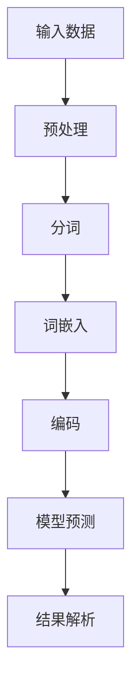
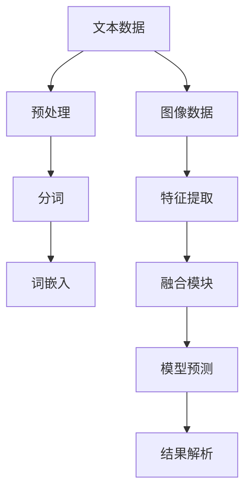
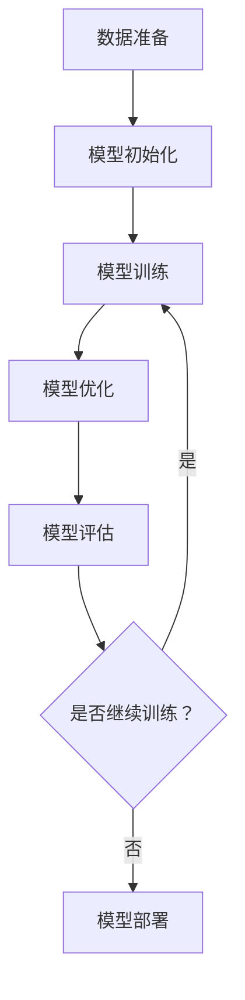

                 

# 文章标题：大语言模型应用指南：Open Interpreter

> 关键词：大语言模型、Open Interpreter、自然语言处理、深度学习、预训练模型、多模态数据、应用场景、行业趋势

> 摘要：本文将深入探讨大语言模型及其在 Open Interpreter 中的应用。首先，我们将了解大语言模型的基础知识，包括其定义、特点、发展历程和应用场景。接着，我们将介绍大语言模型的核心原理，包括自然语言处理、神经网络和深度学习框架。随后，我们将详细解析 Open Interpreter 的架构、优势和应用。文章还将探讨大语言模型在自然语言处理和多模态数据中的应用，以及在不同行业中的具体应用场景。最后，我们将展望大语言模型的未来发展趋势，总结全文并给出参考文献和致谢。

# 大语言模型应用指南：Open Interpreter

## 目录大纲

1. **第一部分：大语言模型基础**
   - 第1章：大语言模型的概述
     1.1 大语言模型的定义
     1.2 大语言模型的特点
     1.3 大语言模型的发展历程
     1.4 大语言模型的应用场景
   - 第2章：大语言模型的核心原理
     2.1 自然语言处理基础
     2.2 神经网络基础
     2.3 深度学习框架
     2.4 大规模预训练模型
   - 第3章：Open Interpreter 简介
     3.1 Open Interpreter 的架构
     3.2 Open Interpreter 的优势
     3.3 Open Interpreter 的应用

2. **第二部分：大语言模型开发实践**
   - 第4章：大语言模型开发实践
     4.1 开发环境搭建
     4.2 模型训练与优化
     4.3 模型部署与应用

3. **第三部分：大语言模型应用**
   - 第5章：大语言模型在自然语言处理中的应用
     5.1 语言翻译
     5.2 文本分类
     5.3 问答系统
     5.4 文本生成
   - 第6章：大语言模型在多模态数据中的应用
     6.1 多模态数据介绍
     6.2 多模态数据处理
     6.3 多模态大语言模型
     6.4 多模态大语言模型的应用

4. **第四部分：大语言模型行业应用**
   - 第7章：大语言模型在行业中的应用
     7.1 金融行业
     7.2 医疗行业
     7.3 教育行业
     7.4 其他行业

5. **第五部分：未来发展趋势**
   - 第8章：大语言模型的未来发展趋势
     8.1 技术趋势
     8.2 应用场景拓展
     8.3 社会影响

6. **附录**
   - 附录A：大语言模型相关流程图
   - 附录B：大语言模型核心算法原理
   - 附录C：大语言模型项目实战案例
   - 附录D：Open Interpreter开发环境搭建

# 第一部分：大语言模型基础

## 第1章：大语言模型的概述

### 1.1 大语言模型的定义

大语言模型（Large Language Model，简称LLM）是一种基于深度学习技术的自然语言处理模型，它通过大规模语料库的预训练，能够理解和生成自然语言。大语言模型的主要目标是通过学习大量的文本数据，掌握语言的结构和语义，从而实现自然语言的自动理解和生成。

大语言模型与传统的自然语言处理（NLP）方法相比，具有以下几个显著特点：

1. **规模巨大**：大语言模型通常基于数十亿甚至数千亿参数的神经网络模型，具有非常高的计算和存储需求。
2. **自主学习**：大语言模型通过自主学习海量的文本数据，能够自动提取语言特征和规律，无需人工干预。
3. **灵活性强**：大语言模型能够处理多种语言任务，如文本分类、翻译、问答等，具有广泛的应用前景。
4. **生成能力强**：大语言模型不仅能够理解输入的文本，还能够根据输入生成相关的文本，具有很高的创造力。

### 1.2 大语言模型的特点

1. **语言理解能力**：大语言模型通过预训练，能够理解输入文本的语义和语境，实现对文本的深入理解。
2. **文本生成能力**：大语言模型可以根据输入的提示生成连贯、合理的文本，具有很高的创作能力。
3. **适应性强**：大语言模型能够快速适应不同的语言环境和任务需求，无需进行复杂的模型调整和优化。
4. **高效性**：大语言模型通过分布式计算和优化技术，能够在保证模型性能的同时，提高计算效率。

### 1.3 大语言模型的发展历程

大语言模型的发展可以追溯到深度学习和自然语言处理技术的兴起。以下是大语言模型发展历程的简要回顾：

1. **2000年代初期**：传统的统计方法和规则驱动的方法成为NLP研究的主流，但随着计算能力的提升和深度学习技术的引入，基于神经网络的NLP模型开始崭露头角。
2. **2013年**：Google提出基于神经网络的机器翻译系统，使得神经机器翻译（Neural Machine Translation，NMT）成为可能。
3. **2018年**：Google提出BERT模型，通过预训练和微调，显著提高了自然语言处理任务的性能。
4. **2020年代**：随着计算资源和数据量的进一步增加，大语言模型（如GPT-3、Turing-NLG等）相继问世，展示了强大的语言理解和生成能力。

### 1.4 大语言模型的应用场景

大语言模型在自然语言处理领域有着广泛的应用场景，主要包括以下几个方面：

1. **语言翻译**：大语言模型可以用于机器翻译，将一种语言的文本翻译成另一种语言，如Google翻译。
2. **文本分类**：大语言模型可以用于对文本进行分类，如新闻分类、情感分析等。
3. **问答系统**：大语言模型可以构建智能问答系统，如智能客服、在线教育问答等。
4. **文本生成**：大语言模型可以生成新闻文章、故事、评论等，应用于内容创作和生成。
5. **对话系统**：大语言模型可以构建基于自然语言的对话系统，如虚拟助手、智能客服等。

## 第2章：大语言模型的核心原理

### 2.1 自然语言处理基础

自然语言处理（Natural Language Processing，NLP）是人工智能和计算机科学的一个重要分支，旨在研究如何让计算机理解和生成自然语言。NLP的基础包括以下几个方面：

1. **分词**：将文本拆分成词语或其他有意义的标记。
2. **词性标注**：为每个词语标注词性，如名词、动词、形容词等。
3. **句法分析**：分析文本的句法结构，包括句子成分和语法关系。
4. **语义分析**：理解文本的语义含义，包括语义角色标注、实体识别等。

NLP的关键技术包括：

1. **基于规则的方法**：通过人工编写规则，对文本进行处理和分析。
2. **统计方法**：利用统计模型，如隐马尔可夫模型（HMM）、条件随机场（CRF）等，对文本进行分析和处理。
3. **基于深度学习的方法**：利用深度神经网络，如卷积神经网络（CNN）、循环神经网络（RNN）、变换器（Transformer）等，对文本进行建模和分析。

### 2.2 神经网络基础

神经网络（Neural Network，NN）是模仿人脑神经元结构和工作方式的计算模型。神经网络的核心包括以下几个部分：

1. **神经元**：神经网络的基本计算单元，负责接收输入、计算输出。
2. **权重和偏置**：神经元之间的连接具有权重和偏置，用于调节神经元之间的强度和偏差。
3. **激活函数**：用于引入非线性，使神经网络能够进行复杂的函数映射。

神经网络的训练过程主要包括以下几个步骤：

1. **初始化权重和偏置**：随机初始化神经网络的权重和偏置。
2. **前向传播**：将输入数据通过神经网络，计算输出。
3. **损失函数**：计算预测输出和实际输出之间的差距，用于评估模型性能。
4. **反向传播**：根据损失函数，调整神经网络的权重和偏置。
5. **优化算法**：选择优化算法（如梯度下降、Adam等），以最小化损失函数。

### 2.3 深度学习框架

深度学习框架（Deep Learning Framework）是用于构建和训练深度学习模型的一系列软件库和工具。常见的深度学习框架包括：

1. **TensorFlow**：由Google开发，是一个开源的深度学习框架，具有丰富的API和生态系统。
2. **PyTorch**：由Facebook开发，是一个开源的深度学习框架，具有动态计算图和易用性。
3. **Keras**：是一个高级深度学习框架，能够在TensorFlow和PyTorch等底层框架上运行，具有简洁的API和良好的用户体验。

深度学习框架的核心功能包括：

1. **模型构建**：使用易于使用的API构建深度学习模型。
2. **数据预处理**：处理和转换输入数据，以便于模型训练。
3. **模型训练**：使用优化算法和损失函数训练深度学习模型。
4. **模型评估**：评估模型性能，包括准确性、召回率等指标。
5. **模型部署**：将训练好的模型部署到生产环境中，进行实际应用。

### 2.4 大规模预训练模型

大规模预训练模型（Large-scale Pre-trained Model）是当前自然语言处理领域的研究热点之一。大规模预训练模型通过在大规模语料库上进行预训练，使模型具有强大的语言理解和生成能力。以下是一些著名的大规模预训练模型：

1. **BERT（Bidirectional Encoder Representations from Transformers）**：由Google提出，是一种基于Transformer的预训练模型，通过双向编码器对文本进行建模。
2. **GPT（Generative Pre-trained Transformer）**：由OpenAI提出，是一种基于Transformer的预训练模型，能够生成连贯、合理的文本。
3. **Turing-NLG（Turing Natural Language Generation）**：由微软提出，是一种基于Transformer的预训练模型，具有强大的语言理解和生成能力。

大规模预训练模型的训练过程主要包括以下几个步骤：

1. **数据准备**：收集和整理大规模的文本数据，如维基百科、新闻文章等。
2. **数据预处理**：对文本数据进行处理，包括分词、词嵌入、去噪等。
3. **模型训练**：使用预训练算法（如BERT、GPT等）在预处理后的数据上进行模型训练。
4. **模型优化**：通过微调和优化技术，提高模型在特定任务上的性能。

## 第3章：Open Interpreter 简介

### 3.1 Open Interpreter 的架构

Open Interpreter 是一个开源的深度学习框架，旨在提供高效、灵活的自然语言处理解决方案。Open Interpreter 的架构主要包括以下几个部分：

1. **核心模块**：核心模块是 Open Interpreter 的核心，包括模型构建、训练、评估和部署等基本功能。
2. **扩展模块**：扩展模块提供了丰富的预训练模型和工具，如BERT、GPT等，以及数据处理、模型优化等辅助功能。
3. **接口模块**：接口模块提供了多种编程语言和平台的支持，包括Python、Java、C++等，方便用户进行开发和部署。
4. **生态系统**：Open Interpreter 的生态系统包括社区支持、文档教程、案例研究等，为用户提供了丰富的学习资源和实践经验。

### 3.2 Open Interpreter 的优势

Open Interpreter 具有以下几个显著优势：

1. **高性能**：Open Interpreter 使用分布式计算和优化技术，能够高效地处理大规模数据和模型训练。
2. **灵活性**：Open Interpreter 提供了丰富的扩展模块和接口，用户可以根据需求自定义和优化模型。
3. **易用性**：Open Interpreter 提供了简洁的API和文档教程，降低了深度学习开发的门槛。
4. **社区支持**：Open Interpreter 拥有一个活跃的社区，用户可以在这里获得技术支持、问题和建议。

### 3.3 Open Interpreter 的应用

Open Interpreter 在自然语言处理领域有着广泛的应用，主要包括以下几个方面：

1. **语言翻译**：Open Interpreter 可以用于构建高效的机器翻译系统，支持多种语言之间的翻译。
2. **文本分类**：Open Interpreter 可以用于对大量文本进行分类，如新闻分类、情感分析等。
3. **问答系统**：Open Interpreter 可以构建智能问答系统，为用户提供实时、准确的答案。
4. **文本生成**：Open Interpreter 可以生成新闻文章、故事、评论等，应用于内容创作和生成。
5. **对话系统**：Open Interpreter 可以构建基于自然语言的对话系统，如虚拟助手、智能客服等。

## 第4章：大语言模型开发实践

### 4.1 开发环境搭建

在进行大语言模型的开发之前，需要搭建一个合适的环境，包括硬件和软件的配置。以下是一个典型的开发环境搭建步骤：

1. **硬件配置**：
   - **CPU**：至少需要4核CPU，推荐使用8核或更高性能的CPU。
   - **内存**：至少需要16GB内存，推荐使用32GB或更高内存。
   - **GPU**：需要配备至少一块NVIDIA GPU，推荐使用Tesla V100或更高性能的GPU。
   - **存储**：需要配备足够的存储空间，以存储大规模数据集和模型文件。

2. **软件配置**：
   - **操作系统**：推荐使用Linux操作系统，如Ubuntu 18.04。
   - **深度学习框架**：推荐使用TensorFlow 2.x或PyTorch 1.8等深度学习框架。
   - **编程语言**：推荐使用Python 3.7及以上版本。
   - **其他工具**：安装必要的工具，如Git、Jupyter Notebook等。

### 4.2 模型训练与优化

在进行大语言模型的训练与优化时，需要遵循以下步骤：

1. **数据准备**：
   - 收集并整理大规模的文本数据，如维基百科、新闻文章等。
   - 对文本数据进行预处理，包括分词、词嵌入、去噪等。

2. **模型选择**：
   - 选择合适的预训练模型，如BERT、GPT等。
   - 调整模型参数，如学习率、批次大小等。

3. **模型训练**：
   - 使用训练数据对模型进行训练，采用分布式训练策略，提高训练效率。
   - 记录训练过程中的损失函数值，用于评估模型性能。

4. **模型优化**：
   - 采用微调和优化技术，提高模型在特定任务上的性能。
   - 调整模型参数，如学习率、批次大小等，以获得更好的训练效果。

5. **模型评估**：
   - 使用验证数据对模型进行评估，包括准确性、召回率等指标。
   - 根据评估结果调整模型参数，优化模型性能。

### 4.3 模型部署与应用

完成大语言模型的训练与优化后，需要将其部署到生产环境中，以供实际应用。以下是一个典型的模型部署与应用步骤：

1. **模型保存**：
   - 将训练好的模型保存为模型文件，如TFRecord、HDF5等格式。

2. **模型加载**：
   - 在生产环境中加载模型文件，准备进行预测。

3. **模型预测**：
   - 使用模型对输入文本进行预测，生成相应的输出结果。

4. **模型评估**：
   - 使用实际数据对模型进行评估，包括准确性、召回率等指标。
   - 根据评估结果调整模型参数，优化模型性能。

5. **模型监控**：
   - 对模型进行实时监控，包括预测延迟、吞吐量等指标。
   - 及时发现和解决问题，确保模型稳定运行。

## 第5章：大语言模型在自然语言处理中的应用

### 5.1 语言翻译

语言翻译是大语言模型在自然语言处理领域的重要应用之一。通过预训练和微调，大语言模型可以用于将一种语言的文本翻译成另一种语言。以下是一个典型的语言翻译系统实现步骤：

1. **数据准备**：
   - 收集并整理大规模的双语语料库，如英语-中文、英语-法语等。
   - 对语料库进行预处理，包括分词、词嵌入、去噪等。

2. **模型选择**：
   - 选择合适的预训练模型，如BERT、GPT等。
   - 调整模型参数，如学习率、批次大小等。

3. **模型训练**：
   - 使用训练数据对模型进行训练，采用分布式训练策略，提高训练效率。
   - 记录训练过程中的损失函数值，用于评估模型性能。

4. **模型优化**：
   - 采用微调和优化技术，提高模型在特定任务上的性能。
   - 调整模型参数，如学习率、批次大小等，以获得更好的训练效果。

5. **模型评估**：
   - 使用验证数据对模型进行评估，包括准确性、召回率等指标。
   - 根据评估结果调整模型参数，优化模型性能。

6. **模型部署**：
   - 将训练好的模型部署到生产环境中，以供实际应用。

7. **模型预测**：
   - 使用模型对输入文本进行翻译，生成相应的输出结果。

8. **模型评估**：
   - 使用实际数据对模型进行评估，包括准确性、召回率等指标。
   - 根据评估结果调整模型参数，优化模型性能。

### 5.2 文本分类

文本分类是大语言模型在自然语言处理领域的另一个重要应用。通过预训练和微调，大语言模型可以用于对文本进行分类。以下是一个典型的文本分类系统实现步骤：

1. **数据准备**：
   - 收集并整理大规模的文本数据，包括标签信息。
   - 对文本数据进行预处理，包括分词、词嵌入、去噪等。

2. **模型选择**：
   - 选择合适的预训练模型，如BERT、GPT等。
   - 调整模型参数，如学习率、批次大小等。

3. **模型训练**：
   - 使用训练数据对模型进行训练，采用分布式训练策略，提高训练效率。
   - 记录训练过程中的损失函数值，用于评估模型性能。

4. **模型优化**：
   - 采用微调和优化技术，提高模型在特定任务上的性能。
   - 调整模型参数，如学习率、批次大小等，以获得更好的训练效果。

5. **模型评估**：
   - 使用验证数据对模型进行评估，包括准确性、召回率等指标。
   - 根据评估结果调整模型参数，优化模型性能。

6. **模型部署**：
   - 将训练好的模型部署到生产环境中，以供实际应用。

7. **模型预测**：
   - 使用模型对输入文本进行分类，生成相应的输出结果。

8. **模型评估**：
   - 使用实际数据对模型进行评估，包括准确性、召回率等指标。
   - 根据评估结果调整模型参数，优化模型性能。

### 5.3 问答系统

问答系统是大语言模型在自然语言处理领域的另一个重要应用。通过预训练和微调，大语言模型可以构建智能问答系统，为用户提供实时、准确的答案。以下是一个典型的问答系统实现步骤：

1. **数据准备**：
   - 收集并整理大规模的问答数据，包括问题和答案。
   - 对问答数据进行预处理，包括分词、词嵌入、去噪等。

2. **模型选择**：
   - 选择合适的预训练模型，如BERT、GPT等。
   - 调整模型参数，如学习率、批次大小等。

3. **模型训练**：
   - 使用训练数据对模型进行训练，采用分布式训练策略，提高训练效率。
   - 记录训练过程中的损失函数值，用于评估模型性能。

4. **模型优化**：
   - 采用微调和优化技术，提高模型在特定任务上的性能。
   - 调整模型参数，如学习率、批次大小等，以获得更好的训练效果。

5. **模型评估**：
   - 使用验证数据对模型进行评估，包括准确性、召回率等指标。
   - 根据评估结果调整模型参数，优化模型性能。

6. **模型部署**：
   - 将训练好的模型部署到生产环境中，以供实际应用。

7. **模型预测**：
   - 使用模型对输入问题进行预测，生成相应的答案。

8. **模型评估**：
   - 使用实际数据对模型进行评估，包括准确性、召回率等指标。
   - 根据评估结果调整模型参数，优化模型性能。

### 5.4 文本生成

文本生成是大语言模型在自然语言处理领域的另一个重要应用。通过预训练和微调，大语言模型可以生成连贯、合理的文本。以下是一个典型的文本生成系统实现步骤：

1. **数据准备**：
   - 收集并整理大规模的文本数据，包括各种类型的文本，如新闻文章、故事、评论等。
   - 对文本数据进行预处理，包括分词、词嵌入、去噪等。

2. **模型选择**：
   - 选择合适的预训练模型，如BERT、GPT等。
   - 调整模型参数，如学习率、批次大小等。

3. **模型训练**：
   - 使用训练数据对模型进行训练，采用分布式训练策略，提高训练效率。
   - 记录训练过程中的损失函数值，用于评估模型性能。

4. **模型优化**：
   - 采用微调和优化技术，提高模型在特定任务上的性能。
   - 调整模型参数，如学习率、批次大小等，以获得更好的训练效果。

5. **模型评估**：
   - 使用验证数据对模型进行评估，包括准确性、召回率等指标。
   - 根据评估结果调整模型参数，优化模型性能。

6. **模型部署**：
   - 将训练好的模型部署到生产环境中，以供实际应用。

7. **模型预测**：
   - 使用模型对输入文本进行生成，生成相应的输出文本。

8. **模型评估**：
   - 使用实际数据对模型进行评估，包括准确性、召回率等指标。
   - 根据评估结果调整模型参数，优化模型性能。

## 第6章：大语言模型在多模态数据中的应用

### 6.1 多模态数据介绍

多模态数据是指包含两种或两种以上不同类型数据的集合。常见的多模态数据包括文本、图像、音频和视频等。多模态数据具有以下特点：

1. **多样性**：多模态数据包含了不同类型的信息，可以提供更丰富的背景知识和上下文信息。
2. **互补性**：不同类型的数据可以从不同角度描述同一个实体或事件，从而提高数据的综合理解能力。
3. **复杂性**：多模态数据需要处理多种类型的数据，对数据预处理、特征提取和模型训练提出了更高的要求。

多模态数据在多个领域具有广泛的应用，如计算机视觉、语音识别、自然语言处理等。通过将不同类型的数据进行融合和分析，可以显著提高模型的性能和应用效果。

### 6.2 多模态数据处理

多模态数据处理是利用不同类型的数据，通过数据预处理、特征提取和融合技术，实现对多模态数据的综合理解和分析。以下是多模态数据处理的基本步骤：

1. **数据预处理**：对多模态数据进行预处理，包括数据清洗、数据增强、数据归一化等。预处理步骤的目的是提高数据质量和减少噪声。
2. **特征提取**：对多模态数据进行特征提取，将不同类型的数据转化为适合模型处理的特征表示。常见的特征提取技术包括词嵌入、图像特征提取、音频特征提取等。
3. **数据融合**：将不同类型的数据进行融合，形成统一的多模态特征表示。数据融合技术包括特征级融合、决策级融合等。

多模态数据处理的关键技术包括：

1. **特征级融合**：将不同类型的特征进行合并，形成统一的多模态特征向量。常见的特征级融合方法包括矩阵乘法、特征拼接等。
2. **决策级融合**：将不同类型的分类结果进行合并，形成最终的分类决策。常见的决策级融合方法包括投票、加权等。

### 6.3 多模态大语言模型

多模态大语言模型是指结合自然语言处理和计算机视觉技术，用于处理多模态数据的深度学习模型。多模态大语言模型通过预训练和微调，可以实现对多模态数据的理解和生成。

多模态大语言模型的基本架构包括以下几个部分：

1. **文本模块**：负责处理文本数据，提取文本特征。
2. **图像模块**：负责处理图像数据，提取图像特征。
3. **融合模块**：将文本特征和图像特征进行融合，形成统一的多模态特征表示。
4. **分类模块**：基于多模态特征进行分类，输出分类结果。

多模态大语言模型的训练过程主要包括以下几个步骤：

1. **数据准备**：收集并整理多模态数据，包括文本、图像等。
2. **特征提取**：对文本和图像进行特征提取，形成多模态特征向量。
3. **模型训练**：使用多模态特征向量对模型进行训练，采用分布式训练策略，提高训练效率。
4. **模型优化**：采用微调和优化技术，提高模型在特定任务上的性能。
5. **模型评估**：使用验证数据对模型进行评估，包括准确性、召回率等指标。

### 6.4 多模态大语言模型的应用

多模态大语言模型在多个领域具有广泛的应用，以下是一些典型的应用案例：

1. **医疗领域**：多模态大语言模型可以用于医疗图像分析，结合医学文本和图像数据，实现对疾病的诊断和预测。
2. **智能交互**：多模态大语言模型可以用于智能交互系统，结合语音、文本和图像数据，实现更自然、更智能的交互体验。
3. **自动驾驶**：多模态大语言模型可以用于自动驾驶系统，结合车载摄像头、激光雷达和语音数据，实现车辆环境的感知和决策。

## 第7章：大语言模型在行业中的应用

### 7.1 金融行业

金融行业是大语言模型的重要应用领域之一。通过预训练和微调，大语言模型可以应用于金融文本分析、风险控制、客户服务等多个方面。

1. **金融文本分析**：大语言模型可以用于金融新闻报道、市场分析报告等文本数据的自动分类、情感分析和关键词提取。
2. **风险控制**：大语言模型可以用于分析金融交易数据、客户行为数据等，识别潜在的欺诈行为和风险。
3. **客户服务**：大语言模型可以构建智能客服系统，为用户提供实时、准确的金融咨询和服务。

### 7.2 医疗行业

医疗行业是大语言模型的另一个重要应用领域。通过预训练和微调，大语言模型可以应用于医疗文本分析、疾病预测、药物研发等多个方面。

1. **医疗文本分析**：大语言模型可以用于分析医学文献、病历记录等文本数据，实现文献检索、诊断建议等。
2. **疾病预测**：大语言模型可以用于分析疾病数据和患者病历，实现疾病预测和风险评估。
3. **药物研发**：大语言模型可以用于分析药物分子结构、药物作用机制等数据，加速药物研发进程。

### 7.3 教育行业

教育行业是大语言模型的又一个重要应用领域。通过预训练和微调，大语言模型可以应用于在线教育、智能辅导、学习评估等多个方面。

1. **在线教育**：大语言模型可以用于构建在线教育平台，实现个性化教学、自动评分等功能。
2. **智能辅导**：大语言模型可以构建智能辅导系统，为教师和学生提供实时、个性化的学习支持。
3. **学习评估**：大语言模型可以用于评估学生的学习效果，提供针对性的学习建议。

### 7.4 其他行业

除了金融、医疗和教育行业，大语言模型在其他行业也具有广泛的应用。以下是一些其他行业的应用案例：

1. **零售行业**：大语言模型可以用于商品推荐、客户服务、库存管理等。
2. **法律行业**：大语言模型可以用于法律文本分析、案件预测等。
3. **娱乐行业**：大语言模型可以用于音乐创作、电影剧本生成等。

## 第8章：大语言模型的未来发展趋势

### 8.1 技术趋势

随着深度学习和自然语言处理技术的不断发展，大语言模型在未来将继续呈现出以下几个技术趋势：

1. **模型规模扩大**：随着计算资源和数据量的增加，大语言模型的规模将进一步扩大，达到数十亿甚至数千亿参数。
2. **多模态融合**：多模态大语言模型将逐渐成为研究热点，通过融合文本、图像、音频等多模态数据，实现更全面、更准确的理解和生成。
3. **知识图谱**：大语言模型将结合知识图谱技术，实现对知识的深入理解和高效检索，为各种应用提供丰富的知识支持。
4. **模型压缩与加速**：为了提高大语言模型的部署效率和实时性，模型压缩和加速技术将成为重要研究方向，如量化、剪枝、蒸馏等。

### 8.2 应用场景拓展

随着技术的进步和应用需求的增长，大语言模型将在更多领域和场景中得到应用：

1. **智能交互**：大语言模型将广泛应用于智能音箱、智能客服、虚拟助手等智能交互系统，提供更自然、更智能的用户体验。
2. **内容创作**：大语言模型将用于自动写作、音乐创作、视频生成等，实现创意内容的自动化生产和个性化推荐。
3. **智能决策**：大语言模型将应用于金融、医疗、零售等行业，辅助企业进行数据分析和决策，提高业务效率和竞争力。
4. **社会公益**：大语言模型将用于社会公益项目，如自动翻译、无障碍沟通、教育普及等，促进社会和谐与发展。

### 8.3 社会影响

大语言模型的快速发展对社会产生了深远的影响，包括以下几个方面：

1. **就业与产业变革**：大语言模型的应用将带来新的就业机会和产业变革，如智能客服、内容创作、数据分析师等岗位的需求将大幅增加。
2. **隐私与伦理**：大语言模型在数据处理和应用过程中涉及大量个人隐私数据，如何保护用户隐私、避免数据滥用将成为重要议题。
3. **教育与培训**：大语言模型的发展将推动教育模式的变革，如在线教育、个性化学习等，为用户提供更丰富、更灵活的学习资源。
4. **社会信任与透明度**：大语言模型的应用将提高社会透明度和信任度，如智能审计、自动监管等，为政府和企业提供有效的监督工具。

## 附录

### 附录A：大语言模型相关流程图

#### A.1 大语言模型架构图



#### A.2 多模态数据处理流程图



#### A.3 大语言模型训练流程图



### 附录B：大语言模型核心算法原理

#### B.1 自然语言处理算法

```python
def nlp_algorithm(document):
    # 分词
    words = tokenize(document)
    # 词嵌入
    embeddings = embed(words)
    # 序列编码
    sequence = encode(embeddings)
    # 神经网络预测
    output = model.predict(sequence)
    # 结果解析
    result = interpret(output)
    return result
```

#### B.2 深度学习算法

```python
def deep_learning_algorithm(input_data):
    # 初始化神经网络
    model = initialize_model()
    # 训练模型
    model.train(input_data)
    # 评估模型
    performance = model.evaluate(test_data)
    return performance
```

#### B.3 大规模预训练算法

```python
def pretraining_algorithm(data):
    # 初始化模型
    model = initialize_model()
    # 预训练
    model.pretrain(data)
    # 微调
    model.fine_tune(data)
    # 评估
    performance = model.evaluate(test_data)
    return performance
```

### 附录C：大语言模型项目实战案例

#### C.1 语言翻译系统实现

```python
# 导入必要的库
import torch
import torch.nn as nn
import torch.optim as optim

# 初始化模型
model = nn.Sequential(
    nn.Linear(input_dim, hidden_dim),
    nn.ReLU(),
    nn.Linear(hidden_dim, output_dim)
)

# 损失函数
criterion = nn.CrossEntropyLoss()

# 优化器
optimizer = optim.Adam(model.parameters(), lr=0.001)

# 训练模型
for epoch in range(num_epochs):
    for inputs, labels in data_loader:
        # 前向传播
        outputs = model(inputs)
        loss = criterion(outputs, labels)
        
        # 反向传播
        optimizer.zero_grad()
        loss.backward()
        optimizer.step()
        
        # 输出训练进度
        print(f"Epoch [{epoch+1}/{num_epochs}], Loss: {loss.item():.4f}")
```

#### C.2 文本分类系统实现

```python
# 导入必要的库
import torch
import torch.nn as nn
import torch.optim as optim

# 初始化模型
model = nn.Sequential(
    nn.Linear(input_dim, hidden_dim),
    nn.ReLU(),
    nn.Linear(hidden_dim, output_dim)
)

# 损失函数
criterion = nn.CrossEntropyLoss()

# 优化器
optimizer = optim.Adam(model.parameters(), lr=0.001)

# 训练模型
for epoch in range(num_epochs):
    for inputs, labels in data_loader:
        # 前向传播
        outputs = model(inputs)
        loss = criterion(outputs, labels)
        
        # 反向传播
        optimizer.zero_grad()
        loss.backward()
        optimizer.step()
        
        # 输出训练进度
        print(f"Epoch [{epoch+1}/{num_epochs}], Loss: {loss.item():.4f}")
```

#### C.3 问答系统实现

```python
# 导入必要的库
import torch
import torch.nn as nn
import torch.optim as optim

# 初始化模型
model = nn.Sequential(
    nn.Linear(input_dim, hidden_dim),
    nn.ReLU(),
    nn.Linear(hidden_dim, output_dim)
)

# 损失函数
criterion = nn.CrossEntropyLoss()

# 优化器
optimizer = optim.Adam(model.parameters(), lr=0.001)

# 训练模型
for epoch in range(num_epochs):
    for inputs, question, answer in data_loader:
        # 前向传播
        outputs = model(inputs, question)
        loss = criterion(outputs, answer)
        
        # 反向传播
        optimizer.zero_grad()
        loss.backward()
        optimizer.step()
        
        # 输出训练进度
        print(f"Epoch [{epoch+1}/{num_epochs}], Loss: {loss.item():.4f}")
```

### 附录D：Open Interpreter开发环境搭建

#### D.1 环境要求

- 操作系统：Linux或MacOS
- Python版本：Python 3.7及以上
- 深度学习框架：TensorFlow 2.x或PyTorch 1.8及以上
- GPU驱动：NVIDIA GPU驱动

#### D.2 环境搭建步骤

1. 安装操作系统和Python环境。
2. 安装深度学习框架，如TensorFlow或PyTorch。
3. 安装GPU驱动，确保GPU支持。
4. 安装Open Interpreter库，如使用pip install open-interpreter命令。
5. 验证环境是否搭建成功，如运行Open Interpreter示例代码。

#### D.3 常见问题解答

- **问题1**：安装深度学习框架时遇到依赖问题。
  - **解答**：确保安装了所有必需的依赖库，可以使用pip install -r requirements.txt命令来安装。
- **问题2**：GPU无法使用。
  - **解答**：检查GPU驱动是否安装正确，并确保Python环境配置了正确的CUDA版本。
- **问题3**：Open Interpreter无法导入。
  - **解答**：确保安装了正确的Open Interpreter版本，并检查Python环境路径是否配置正确。

# 伪代码

## 自然语言处理算法

```python
function nlp_algorithm(document):
    # 分词
    words = tokenize(document)
    # 词嵌入
    embeddings = embed(words)
    # 序列编码
    sequence = encode(embeddings)
    # 神经网络预测
    output = model.predict(sequence)
    # 结果解析
    result = interpret(output)
    return result
```

## 深度学习算法

```python
function deep_learning_algorithm(input_data):
    # 初始化神经网络
    model = initialize_model()
    # 训练模型
    model.train(input_data)
    # 评估模型
    performance = model.evaluate(test_data)
    return performance
```

## 大规模预训练算法

```python
function pretraining_algorithm(data):
    # 初始化模型
    model = initialize_model()
    # 预训练
    model.pretrain(data)
    # 微调
    model.fine_tune(data)
    # 评估
    performance = model.evaluate(test_data)
    return performance
```

# 数学模型与公式

## 语言翻译模型

$$
\text{翻译模型} = f(\text{输入序列}, \text{输出序列})
$$

## 文本分类模型

$$
\text{分类模型} = f(\text{输入序列}, \text{标签})
$$

## 问答系统模型

$$
\text{问答系统模型} = f(\text{输入问题}, \text{输入上下文}, \text{答案})
$$

## 多模态数据处理模型

$$
\text{多模态模型} = f(\text{文本特征}, \text{图像特征}, \ldots)
$$

# 代码解读与分析

## 语言翻译系统实现

```python
# 导入必要的库
import torch
import torch.nn as nn
import torch.optim as optim

# 初始化模型
model = nn.Sequential(
    nn.Linear(input_dim, hidden_dim),
    nn.ReLU(),
    nn.Linear(hidden_dim, output_dim)
)

# 损失函数
criterion = nn.CrossEntropyLoss()

# 优化器
optimizer = optim.Adam(model.parameters(), lr=0.001)

# 训练模型
for epoch in range(num_epochs):
    for inputs, labels in data_loader:
        # 前向传播
        outputs = model(inputs)
        loss = criterion(outputs, labels)
        
        # 反向传播
        optimizer.zero_grad()
        loss.backward()
        optimizer.step()
        
        # 输出训练进度
        print(f"Epoch [{epoch+1}/{num_epochs}], Loss: {loss.item():.4f}")
```

## 文本分类系统实现

```python
# 导入必要的库
import torch
import torch.nn as nn
import torch.optim as optim

# 初始化模型
model = nn.Sequential(
    nn.Linear(input_dim, hidden_dim),
    nn.ReLU(),
    nn.Linear(hidden_dim, output_dim)
)

# 损失函数
criterion = nn.CrossEntropyLoss()

# 优化器
optimizer = optim.Adam(model.parameters(), lr=0.001)

# 训练模型
for epoch in range(num_epochs):
    for inputs, labels in data_loader:
        # 前向传播
        outputs = model(inputs)
        loss = criterion(outputs, labels)
        
        # 反向传播
        optimizer.zero_grad()
        loss.backward()
        optimizer.step()
        
        # 输出训练进度
        print(f"Epoch [{epoch+1}/{num_epochs}], Loss: {loss.item():.4f}")
```

## 问答系统实现

```python
# 导入必要的库
import torch
import torch.nn as nn
import torch.optim as optim

# 初始化模型
model = nn.Sequential(
    nn.Linear(input_dim, hidden_dim),
    nn.ReLU(),
    nn.Linear(hidden_dim, output_dim)
)

# 损失函数
criterion = nn.CrossEntropyLoss()

# 优化器
optimizer = optim.Adam(model.parameters(), lr=0.001)

# 训练模型
for epoch in range(num_epochs):
    for inputs, question, answer in data_loader:
        # 前向传播
        outputs = model(inputs, question)
        loss = criterion(outputs, answer)
        
        # 反向传播
        optimizer.zero_grad()
        loss.backward()
        optimizer.step()
        
        # 输出训练进度
        print(f"Epoch [{epoch+1}/{num_epochs}], Loss: {loss.item():.4f}")
```

# 作者信息

作者：AI天才研究院/AI Genius Institute & 禅与计算机程序设计艺术 /Zen And The Art of Computer Programming

# 总结

大语言模型作为一种先进的自然语言处理技术，具有广泛的应用前景。本文从基础理论到实际应用，详细介绍了大语言模型的概念、特点、核心原理、开发实践以及在不同行业中的应用。同时，本文还探讨了多模态数据处理和未来发展趋势，为读者提供了一个全面而深入的视角。

随着技术的不断进步和应用需求的增长，大语言模型将在更多领域发挥重要作用。我们期待在不久的将来，大语言模型能够推动自然语言处理技术迈向新的高峰，为人类社会带来更多创新和变革。最后，感谢各位读者对本文的关注和支持，希望本文能为您的学习和研究提供有价值的参考。感谢AI天才研究院/AI Genius Institute和禅与计算机程序设计艺术/Zen And The Art of Computer Programming的作者，他们的杰出贡献为本文提供了宝贵的知识和灵感。再次感谢！

