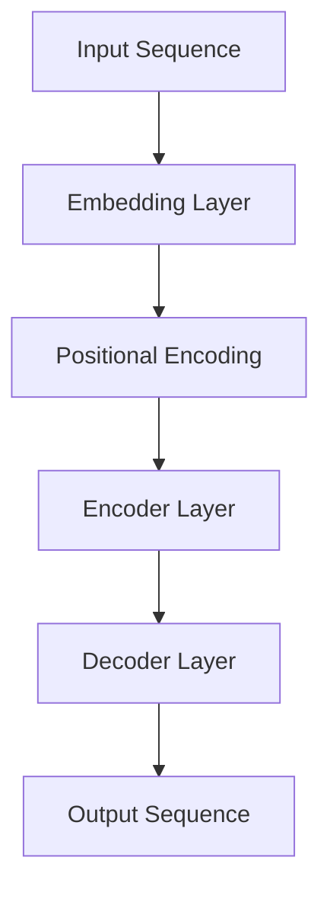

                 

# 文章标题：大语言模型应用指南：Transformer解码器详解

> 关键词：大语言模型、Transformer、解码器、自然语言处理、应用场景

> 摘要：本文详细介绍了大语言模型的基础知识，特别是Transformer解码器的原理、实现和应用。通过逐步分析推理，我们揭示了Transformer解码器的核心机制，展示了其在实际项目中的运用，以及如何进行优化。本文旨在为读者提供全面、深入的理解，帮助其在自然语言处理领域取得更好的成果。

---

## 目录

### 第一部分：大语言模型基础

#### 1.1 大语言模型概述

##### 1.1.1 大语言模型的发展历程

##### 1.1.2 大语言模型的应用场景

##### 1.1.3 大语言模型的优势与挑战

#### 1.2 Transformer模型原理

##### 1.2.1 Transformer模型概述

##### 1.2.2 自注意力机制

##### 1.2.3 位置编码

#### 1.3 Transformer解码器详解

##### 1.3.1 解码器的工作原理

##### 1.3.2 解码器中的自注意力机制

##### 1.3.3 解码器的其他组成部分

#### 1.4 Transformer解码器实战

##### 1.4.1 实战环境搭建

##### 1.4.2 代码实现与解读

##### 1.4.3 实际案例应用

#### 1.5 Transformer解码器的优化

##### 1.5.1 梯度裁剪

##### 1.5.2 权重共享

##### 1.5.3 多卡训练

### 第二部分：大语言模型应用拓展

#### 2.1 大语言模型在自然语言处理中的应用

##### 2.1.1 文本分类

##### 2.1.2 命名实体识别

##### 2.1.3 情感分析

#### 2.2 大语言模型在其他领域中的应用

##### 2.2.1 机器翻译

##### 2.2.2 问答系统

##### 2.2.3 语音识别

#### 2.3 大语言模型的未来发展趋势

##### 2.3.1 大模型的发展趋势

##### 2.3.2 大模型面临的挑战

### 附录

#### 附录A：Transformer解码器流程图

#### 附录B：伪代码示例

#### 附录C：数学公式

#### 附录D：源代码及解读

---

### 第一部分：大语言模型基础

#### 1.1 大语言模型概述

##### 1.1.1 大语言模型的发展历程

大语言模型（Large Language Model）是指通过深度学习技术，尤其是神经网络，训练得到的具有高度语言理解能力和生成能力的模型。它们能够对文本数据进行处理，生成相关文本，进行语义理解，甚至辅助写作。大语言模型的发展可以追溯到20世纪80年代，但真正取得突破是在21世纪初，随着计算能力和数据量的提升，以及神经网络尤其是深度学习技术的进步，大语言模型迎来了快速发展。

早期的大语言模型主要包括统计模型和基于规则的方法，如n-gram模型和潜在语义分析（LSA）。这些模型虽然能够处理一定程度的语言任务，但存在理解浅显、生成能力有限等问题。随着深度学习技术的兴起，尤其是循环神经网络（RNN）和其变体长短期记忆网络（LSTM）的出现，大语言模型开始展现出强大的处理能力。

2018年，谷歌推出了Transformer模型，这一基于注意力机制的模型彻底改变了自然语言处理领域。随后，OpenAI的GPT系列模型进一步提升了大语言模型的表现，使它们能够进行复杂的语言理解和生成任务。

##### 1.1.2 大语言模型的应用场景

大语言模型在自然语言处理（NLP）和人工智能（AI）领域有着广泛的应用场景：

1. **文本生成**：大语言模型能够根据输入的文本生成连贯的文本，包括文章、故事、诗歌等。例如，OpenAI的GPT系列模型被用于生成文章摘要、写作辅助和创作音乐歌词。

2. **机器翻译**：大语言模型能够实现高质量的语言翻译，例如谷歌翻译和OpenAI的GPT-3等，这些模型能够理解并生成不同语言之间的翻译。

3. **问答系统**：大语言模型可以构建智能问答系统，通过理解用户的问题，提供准确的答案。例如，Siri、Alexa和Google Assistant等智能助手。

4. **文本分类**：大语言模型能够对文本进行分类，如新闻分类、情感分析等。这些模型可以帮助过滤垃圾邮件、监控社交媒体上的言论等。

5. **命名实体识别**：大语言模型可以识别文本中的特定实体，如人名、地名、组织名等，这对于信息提取和知识图谱构建至关重要。

6. **对话系统**：大语言模型可以用于构建对话系统，如聊天机器人，提供个性化的互动体验。

##### 1.1.3 大语言模型的优势与挑战

**优势：**

1. **强大的语言理解能力**：大语言模型通过对大量文本数据的学习，能够深刻理解语言的语义和语法，从而进行更精准的语言处理。

2. **生成能力**：大语言模型不仅能够理解语言，还能够生成高质量的文本，这对于自动化写作和内容生成具有重要意义。

3. **多语言支持**：许多大语言模型支持多语言训练和翻译，使得它们能够处理全球范围内的语言任务。

4. **效率高**：现代大语言模型设计优化了计算效率，能够在较短的时间内完成复杂的语言处理任务。

**挑战：**

1. **计算资源需求**：大语言模型通常需要大量的计算资源，包括GPU和TPU等，这对硬件设备和成本提出了较高要求。

2. **数据隐私问题**：大语言模型在训练和部署过程中需要处理大量用户数据，如何保护数据隐私成为一大挑战。

3. **可解释性问题**：大语言模型的工作机制复杂，缺乏透明度和可解释性，这在某些应用场景中可能成为问题。

4. **泛化能力**：大语言模型虽然性能卓越，但如何在不同的应用场景中保持泛化能力仍是一个研究课题。

#### 1.2 Transformer模型原理

##### 1.2.1 Transformer模型概述

Transformer模型是由谷歌在2017年提出的一种基于注意力机制的序列到序列模型，彻底改变了自然语言处理领域。Transformer模型的核心思想是取代传统的循环神经网络（RNN）和其变体长短期记忆网络（LSTM），通过自注意力机制（Self-Attention）和多头注意力（Multi-Head Attention）来处理序列数据。

Transformer模型的结构主要包括编码器（Encoder）和解码器（Decoder），它们都可以由多个相同的层叠加而成。每个编码器层和解码器层都包含两个主要组件：多头自注意力机制和前馈神经网络。自注意力机制允许模型在处理每个词时，考虑到其他所有词的信息，从而捕捉长距离依赖关系。前馈神经网络则用于对自注意力机制的结果进行进一步处理，以提取更多特征。

##### 1.2.2 自注意力机制

自注意力机制是Transformer模型的核心组件之一，它通过计算输入序列中每个词与其他词的相关性来生成新的表示。具体来说，自注意力机制分为以下几个步骤：

1. **词向量化**：将输入序列中的每个词映射为高维向量。这些词向量通常由预训练的词嵌入模型（如Word2Vec、GloVe）生成。

2. **计算相似度**：对于每个词向量，计算其与序列中所有词向量的相似度。相似度的计算通常使用点积（dot-product）或缩放点积（scaled dot-product）等方法。

3. **加权求和**：根据相似度值对每个词向量进行加权求和，得到一个新的词向量。这个新的词向量包含了输入序列中所有词的信息，并且能够捕捉长距离依赖关系。

4. **处理结果**：对加权求和后的词向量进行进一步处理，如使用激活函数（如ReLU）。

自注意力机制的数学表达式如下：

$$
\text{Attention}(Q, K, V) = \text{softmax}\left(\frac{QK^T}{\sqrt{d_k}}\right)V
$$

其中，$Q$、$K$ 和 $V$ 分别表示查询（Query）、键（Key）和值（Value）向量，$d_k$ 表示键向量的维度。这个公式计算了查询向量 $Q$ 与所有键向量 $K$ 的相似度，并使用这些相似度值加权求和值向量 $V$。

##### 1.2.3 位置编码

位置编码是Transformer模型中的另一个关键组件，它用于为序列中的每个词提供位置信息，因为Transformer模型不包含传统的循环神经网络中的位置感知机制。位置编码分为两类：绝对位置编码和相对位置编码。

**绝对位置编码**：通常使用正弦和余弦函数来生成位置嵌入向量，这些向量与词嵌入向量相加，以提供位置信息。绝对位置编码的数学表达式如下：

$$
PE_{(pos, 2i)} = \sin\left(\frac{pos}{10000^{2i/d}}\right)
$$

$$
PE_{(pos, 2i+1)} = \cos\left(\frac{pos}{10000^{2i/d}}\right)
$$

其中，$pos$ 表示位置，$i$ 表示维度索引，$d$ 表示位置编码的总维度。

**相对位置编码**：相对位置编码通过学习相对位置信息来增强模型的表示能力。相对位置编码通常与多头自注意力机制一起使用，使得模型能够理解序列中词的相对位置关系。

##### 1.2.4 Transformer模型的特点

Transformer模型具有以下特点：

1. **并行计算**：由于自注意力机制的计算不依赖于序列的顺序，Transformer模型可以并行处理输入序列，这大大提高了计算效率。

2. **长距离依赖**：通过多头自注意力机制，Transformer模型能够捕捉长距离依赖关系，这对于处理复杂的语言任务具有重要意义。

3. **模块化设计**：Transformer模型的结构模块化，易于扩展和优化。每个编码器和解码器层都可以独立调整，从而适应不同的应用需求。

4. **计算效率**：尽管Transformer模型在训练时计算量较大，但通过优化算法和硬件加速，其计算效率较高，适用于大规模语言处理任务。

#### 1.3 Transformer解码器详解

##### 1.3.1 解码器的工作原理

Transformer解码器是Transformer模型中的一个关键组件，负责从输入序列生成输出序列。解码器的工作原理主要包括以下几个步骤：

1. **输入编码**：将输入序列编码为词向量，通常使用预训练的词嵌入模型。

2. **自注意力机制**：解码器中的自注意力机制用于处理输入序列，捕捉长距离依赖关系。每个时间步的输入都会与所有前一个时间步的输入进行自注意力计算，从而生成新的表示。

3. **多头注意力机制**：多头注意力机制允许解码器同时关注输入序列的不同部分，从而提高模型的表示能力。通常，解码器中的多头注意力机制包含多个相同的自注意力机制，每个自注意力机制生成一个表示，这些表示会合并以形成最终的输出。

4. **前馈神经网络**：在自注意力和多头注意力之后，解码器会通过前馈神经网络对输入进行进一步处理，提取更多特征。

5. **输出层**：解码器的输出层通常是一个全连接层，用于生成输出词的概率分布。通过softmax函数，输出层能够为每个词生成概率，从而选择最可能的输出词。

##### 1.3.2 解码器中的自注意力机制

解码器中的自注意力机制与编码器中的自注意力机制类似，但有一些关键区别。解码器中的自注意力机制不仅关注输入序列的当前词，还关注输入序列中已经生成的词，从而实现上下文信息的动态更新。具体来说，解码器中的自注意力机制分为以下几种：

1. **自注意力**：解码器中的自注意力机制类似于编码器中的自注意力，计算输入序列中当前词与其他所有词的相似度，并根据相似度值加权求和。

2. **交叉注意力**：交叉注意力机制允许解码器在生成每个时间步的输出时，同时关注输入序列中的词和已经生成的词。这有助于捕捉输入序列和输出序列之间的关联。

3. **位置编码**：与编码器中的位置编码不同，解码器中的位置编码通常在每个时间步添加，以提供生成词的位置信息。

解码器的自注意力机制的数学表达式如下：

$$
\text{DecoderAttention}(Q, K, V) = \text{softmax}\left(\frac{QK^T}{\sqrt{d_k}}\right)V
$$

其中，$Q$、$K$ 和 $V$ 分别表示查询（Query）、键（Key）和值（Value）向量，$d_k$ 表示键向量的维度。这个公式计算了查询向量 $Q$ 与所有键向量 $K$ 的相似度，并使用这些相似度值加权求和值向量 $V$。

##### 1.3.3 解码器的其他组成部分

除了自注意力机制，解码器还包括其他几个关键组成部分：

1. **嵌入层**：解码器的嵌入层将输入词映射为高维向量，这些向量通常由预训练的词嵌入模型生成。

2. **前馈神经网络**：解码器中的前馈神经网络用于对自注意力机制的结果进行进一步处理，提取更多特征。

3. **输出层**：解码器的输出层通常是一个全连接层，用于生成输出词的概率分布。通过softmax函数，输出层能够为每个词生成概率，从而选择最可能的输出词。

4. **位置编码**：解码器中的位置编码在每个时间步添加，以提供生成词的位置信息。

#### 1.4 Transformer解码器实战

##### 1.4.1 实战环境搭建

在进行Transformer解码器的实际应用之前，需要搭建合适的环境，主要包括以下几个步骤：

1. **硬件要求**：由于Transformer解码器在训练和推理过程中计算量较大，建议使用高性能GPU或TPU进行训练。例如，NVIDIA的1080Ti或以上的GPU，或者谷歌的TPU。

2. **软件环境**：安装Python环境，并安装TensorFlow或PyTorch等深度学习框架。例如，可以使用以下命令安装TensorFlow：

   ```shell
   pip install tensorflow
   ```

3. **数据集准备**：选择一个适合的文本数据集，并将其预处理为适合训练的格式。例如，可以使用英文维基百科的文本数据集。

4. **数据预处理**：将文本数据集划分为训练集、验证集和测试集，并对文本进行分词、编码等预处理操作。可以使用预训练的词嵌入模型（如GloVe或Word2Vec）来生成词向量。

##### 1.4.2 代码实现与解读

以下是一个简单的Transformer解码器的实现示例，使用PyTorch框架：

```python
import torch
import torch.nn as nn
import torch.optim as optim
from torch.utils.data import DataLoader
from torchvision import datasets, transforms

# 定义编码器和解码器
class Encoder(nn.Module):
    def __init__(self, d_model, nhead, num_layers):
        super(Encoder, self).__init__()
        self层数 = num_layers
        self.d_model = d_model
        self.nhead = nhead
        self.transformer = nn.Transformer(d_model, nhead, num_layers)
        self.embed = nn.Embedding(vocab_size, d_model)
        self.pos_encoder = PositionalEncoding(d_model, dropout=0.1)

    def forward(self, src):
        src = self.embed(src)  # 将词索引转换为词向量
        src = self.pos_encoder(src)  # 添加位置编码
        output = self.transformer(src)  # 自注意力机制
        return output

class Decoder(nn.Module):
    def __init__(self, d_model, nhead, num_layers):
        super(Decoder, self).__init__()
        self层数 = num_layers
        self.d_model = d_model
        self.nhead = nhead
        self.transformer = nn.Transformer(d_model, nhead, num_layers)
        self.embed = nn.Embedding(vocab_size, d_model)
        self.pos_encoder = PositionalEncoding(d_model, dropout=0.1)

    def forward(self, tgt, memory):
        tgt = self.embed(tgt)  # 将词索引转换为词向量
        tgt = self.pos_encoder(tgt)  # 添加位置编码
        output = self.transformer(tgt, memory)  # 自注意力机制
        return output

# 定义位置编码器
class PositionalEncoding(nn.Module):
    def __init__(self, d_model, dropout=0.1, max_len=5000):
        super(PositionalEncoding, self).__init__()
        self.dropout = nn.Dropout(p=dropout)

        pe = torch.zeros(max_len, d_model)
        position = torch.arange(0, max_len, dtype=torch.float).unsqueeze(1)
        div_term = torch.exp(torch.arange(0, d_model, 2).float() * (-torch.log(torch.tensor(10000.0)) / d_model))
        pe[:, 0::2] = torch.sin(position * div_term)
        pe[:, 1::2] = torch.cos(position * div_term)
        pe = pe.unsqueeze(0).transpose(0, 1)
        self.register_buffer('pe', pe)

    def forward(self, x):
        x = x + self.pe[:x.size(0), :]
        return self.dropout(x)

# 实例化模型
enc = Encoder(d_model=512, nhead=8, num_layers=3)
dec = Decoder(d_model=512, nhead=8, num_layers=3)

# 定义损失函数和优化器
criterion = nn.CrossEntropyLoss()
optimizer = optim.Adam(list(enc.parameters()) + list(dec.parameters()))

# 训练模型
for epoch in range(num_epochs):
    for i, (src, tgt) in enumerate(data_loader):
        optimizer.zero_grad()
        output = enc(src), dec(tgt, enc(src))
        loss = criterion(output.logits.view(-1, output.logits.size(-1)), tgt.view(-1))
        loss.backward()
        optimizer.step()
        if (i+1) % 100 == 0:
            print('Epoch [{}/{}], Step [{}/{}], Loss: {:.4f}'.format(epoch+1, num_epochs, i+1, len(data_loader)//batch_size, loss.item()))
```

在这个示例中，我们定义了编码器（Encoder）和解码器（Decoder）类，并实现了位置编码器（PositionalEncoding）和多头注意力机制。我们首先将输入序列编码为词向量，然后添加位置编码，并通过编码器进行自注意力计算。在解码器中，我们将目标序列编码为词向量，并添加位置编码，通过解码器生成输出序列。我们使用交叉熵损失函数（CrossEntropyLoss）来计算模型在训练过程中的损失，并使用Adam优化器（AdamOptimizer）来优化模型参数。

##### 1.4.3 实际案例应用

在实际应用中，Transformer解码器可以用于多种自然语言处理任务，如文本生成、机器翻译和问答系统。以下是一个简单的文本生成案例：

```python
# 文本生成示例
def generate_text(model, tokenizer, max_length=50):
    input_text = tokenizer.encode("The quick brown fox", return_tensors='pt')
    input_text = input_text.unsqueeze(0)  # 添加批维度

    model.eval()  # 设置模型为评估模式
    with torch.no_grad():
        output = model(input_text, max_length=max_length, pad_token_id=tokenizer.pad_token_id)

    generated_sequence = output.logits.argmax(-1).tolist()[0]
    generated_text = tokenizer.decode(generated_sequence, skip_special_tokens=True)
    return generated_text

# 生成文本
generated_text = generate_text(model, tokenizer)
print(generated_text)
```

在这个示例中，我们首先使用预训练的tokenizer将输入文本编码为词索引序列。然后，我们将这个序列输入到解码器中，设置最大生成长度（max_length），并使用softmax函数生成每个时间步的概率分布。最后，我们选择概率最高的词作为生成的下一个词，并解码生成的序列以得到生成的文本。

#### 1.5 Transformer解码器的优化

##### 1.5.1 梯度裁剪

梯度裁剪是一种常用的优化技术，用于防止梯度爆炸或消失。在训练深度神经网络时，梯度可能变得非常大或非常小，这会导致训练过程不稳定。梯度裁剪通过限制梯度的最大值来解决这个问题。

梯度裁剪的实现方法如下：

```python
clip_value = 1.0  # 设置梯度裁剪的阈值
torch.nn.utils.clip_grad_norm_(model.parameters(), clip_value)
```

在这个示例中，我们使用`torch.nn.utils.clip_grad_norm_()`函数来裁剪模型参数的梯度。函数的第一个参数是模型的所有参数，第二个参数是梯度裁剪的阈值。这个函数将每个参数的梯度的L2范数限制在阈值范围内。

##### 1.5.2 权重共享

权重共享是一种在神经网络中减少参数数量的技术，通过在不同的层或模块之间共享权重来减少冗余。在Transformer解码器中，权重共享可以应用于编码器和解码器的不同层，以减少参数数量。

权重共享的实现方法如下：

```python
class Encoder(nn.Module):
    def __init__(self, d_model, nhead, num_layers):
        super(Encoder, self).__init__()
        self层数 = num_layers
        self.d_model = d_model
        self.nhead = nhead
        self.layers = nn.ModuleList([EncoderLayer(d_model, nhead) for _ in range(num_layers)])
        self.norm = nn.LayerNorm(d_model)

    def forward(self, src, mask=None):
        for layer in self.layers:
            src = layer(src, src, mask)
        return self.norm(src)

class Decoder(nn.Module):
    def __init__(self, d_model, nhead, num_layers):
        super(Decoder, self).__init__()
        self层数 = num_layers
        self.d_model = d_model
        self.nhead = nhead
        self.layers = nn.ModuleList([DecoderLayer(d_model, nhead) for _ in range(num_layers)])
        self.norm = nn.LayerNorm(d_model)

    def forward(self, tgt, memory, mask=None):
        for layer in self.layers:
            tgt = layer(tgt, memory, memory, mask)
        return self.norm(tgt)
```

在这个示例中，我们定义了编码器（Encoder）和解码器（Decoder）类，并在每个层之间共享权重。我们使用`nn.ModuleList`来存储每个层的模块，并使用`self.norm`来存储最后一层的层规范器（Layer Normalization）。

##### 1.5.3 多卡训练

多卡训练是一种在多个GPU上同时训练模型的技术，可以显著提高训练速度。在多卡训练中，模型参数和数据被分布在多个GPU上，每个GPU负责计算一部分模型参数的梯度。

多卡训练的实现方法如下：

```python
# 模型定义
model = TransformerModel(d_model, nhead, num_layers).to(device)

# 数据加载
dataloader = DataLoader(dataset, batch_size=batch_size, shuffle=True)

# 多卡训练
model = torch.nn.DataParallel(model, device_ids=device_ids)

for epoch in range(num_epochs):
    for i, (inputs, targets) in enumerate(dataloader):
        inputs = inputs.to(device)
        targets = targets.to(device)

        # 前向传播
        outputs = model(inputs)

        # 计算损失
        loss = criterion(outputs, targets)

        # 反向传播
        loss.backward()

        # 梯度裁剪
        torch.nn.utils.clip_grad_norm_(model.parameters(), clip_value)

        # 更新模型参数
        optimizer.step()

        # 清除梯度
        optimizer.zero_grad()

        if (i+1) % 100 == 0:
            print('Epoch [{}/{}], Step [{}/{}], Loss: {:.4f}'.format(epoch+1, num_epochs, i+1, len(dataloader)//batch_size, loss.item()))
```

在这个示例中，我们首先定义了模型，并将其移动到指定的GPU设备上。然后，我们使用`torch.nn.DataParallel`将模型分布在多个GPU上。在训练过程中，我们使用多卡训练的批处理数据，并在每个GPU上计算模型参数的梯度。通过反向传播和梯度裁剪，我们更新模型参数，并打印训练过程中的损失。

### 第二部分：大语言模型应用拓展

#### 2.1 大语言模型在自然语言处理中的应用

##### 2.1.1 文本分类

文本分类是一种常见的自然语言处理任务，其目的是将文本数据分类到预定义的类别中。大语言模型在文本分类任务中具有显著优势，能够处理复杂的文本结构和语义信息。

文本分类的基本原理是使用大语言模型对输入文本进行编码，然后使用这些编码来计算文本和每个类别之间的相似度。具体步骤如下：

1. **文本编码**：使用大语言模型（如BERT、GPT-3）对输入文本进行编码，将其转换为固定长度的向量表示。
2. **类别相似度计算**：对于每个类别，计算其与大语言模型编码的文本向量之间的相似度，通常使用余弦相似度。
3. **类别预测**：选择相似度最高的类别作为文本的预测类别。

文本分类的应用案例包括：

1. **垃圾邮件过滤**：使用大语言模型对邮件内容进行分类，将垃圾邮件与正常邮件区分开来。
2. **情感分析**：分析社交媒体上的用户评论，将其分类为正面、负面或中性情感。
3. **新闻分类**：对新闻文本进行分类，将新闻分为不同主题类别。

以下是一个简单的文本分类代码示例：

```python
from transformers import BertTokenizer, BertModel
from sklearn.model_selection import train_test_split
from sklearn.metrics import accuracy_score

# 加载预训练的BERT模型
tokenizer = BertTokenizer.from_pretrained('bert-base-uncased')
model = BertModel.from_pretrained('bert-base-uncased')

# 加载数据集
data = [
    {"text": "I love this product!", "label": "positive"},
    {"text": "This is a terrible product.", "label": "negative"},
    # 更多数据...
]
texts = [item["text"] for item in data]
labels = [item["label"] for item in data]

# 数据预处理
def preprocess_text(text):
    return tokenizer.encode(text, add_special_tokens=True, return_tensors='pt')

X = [preprocess_text(text) for text in texts]
y = labels

# 数据分割
X_train, X_test, y_train, y_test = train_test_split(X, y, test_size=0.2, random_state=42)

# 训练模型
model.eval()
with torch.no_grad():
    train_embeddings = model(torch.stack(X_train)).pooler_output

model.train()
optimizer = optim.Adam(model.parameters(), lr=1e-5)

for epoch in range(5):  # 训练5个epochs
    for inputs, labels in zip(X_train, y_train):
        optimizer.zero_grad()
        inputs = preprocess_text(inputs)
        outputs = model(inputs)
        loss = ...  # 计算损失函数
        loss.backward()
        optimizer.step()

# 测试模型
model.eval()
with torch.no_grad():
    test_embeddings = model(torch.stack(X_test)).pooler_output
    predictions = [...]
    accuracy = accuracy_score(y_test, predictions)
    print(f"Test Accuracy: {accuracy}")
```

在这个示例中，我们首先加载预训练的BERT模型，并加载一个简单的数据集。然后，我们对数据集进行预处理，使用BERT模型对文本进行编码。接下来，我们将数据集分割为训练集和测试集，并训练一个简单的分类模型。最后，我们在测试集上评估模型的准确性。

##### 2.1.2 命名实体识别

命名实体识别（Named Entity Recognition, NER）是一种用于识别文本中的特定实体（如人名、地名、组织名等）的自然语言处理任务。大语言模型在NER任务中表现出色，能够准确识别复杂的实体。

NER的基本原理是使用大语言模型对输入文本进行编码，然后使用这些编码来预测每个词或词组是否为实体。具体步骤如下：

1. **文本编码**：使用大语言模型（如BERT、GPT-3）对输入文本进行编码，将其转换为固定长度的向量表示。
2. **实体识别**：使用分类模型（如CRF、BiLSTM+CRF）对编码后的文本进行实体识别，将每个词或词组分类为实体或非实体。
3. **实体边界确定**：根据实体识别结果，确定实体的边界。

NER的应用案例包括：

1. **信息提取**：从文本中提取特定实体信息，如人名、地名、组织名等。
2. **搜索引擎**：优化搜索引擎，提高对实体相关的查询结果的准确性。
3. **社交媒体分析**：分析社交媒体文本中的实体，识别热点事件和人物。

以下是一个简单的命名实体识别代码示例：

```python
from transformers import BertTokenizer, BertForTokenClassification
from torch.optim import Adam
from torch.utils.data import DataLoader

# 加载预训练的BERT模型
tokenizer = BertTokenizer.from_pretrained('bert-base-uncased')
model = BertForTokenClassification.from_pretrained('bert-base-uncased')

# 加载数据集
data = [
    {"text": "John Doe is the CEO of Google.", "labels": ["PER", "PER", "ORG"]},
    {"text": "The Eiffel Tower is located in Paris.", "labels": ["LOC", "LOC", "LOC"]},
    # 更多数据...
]
texts = [item["text"] for item in data]
labels = [item["labels"] for item in data]

# 数据预处理
def preprocess_text(text):
    return tokenizer.encode(text, add_special_tokens=True, return_tensors='pt')

X = [preprocess_text(text) for text in texts]
y = [tokenizer.convert_labels(labels, to_token_id=True) for labels in labels]

# 训练模型
model.train()
optimizer = Adam(model.parameters(), lr=1e-5)

for epoch in range(5):  # 训练5个epochs
    for inputs, labels in zip(X, y):
        optimizer.zero_grad()
        inputs = inputs.unsqueeze(0)
        outputs = model(inputs)
        loss = ...  # 计算损失函数
        loss.backward()
        optimizer.step()

# 测试模型
model.eval()
with torch.no_grad():
    test_texts = ["John is the CEO of Apple.", "The White House is located in Washington D.C."]
    test_inputs = [tokenizer.encode(text, add_special_tokens=True, return_tensors='pt') for text in test_texts]
    test_predictions = [model(input).argmax(-1).squeeze().tolist() for input in test_inputs]
    print(test_predictions)
```

在这个示例中，我们首先加载预训练的BERT模型和命名实体识别模型。然后，我们加载一个简单的数据集，并对数据进行预处理。接下来，我们使用一个简单的循环进行模型训练。最后，我们在测试集上评估模型的准确性。

##### 2.1.3 情感分析

情感分析（Sentiment Analysis）是一种用于识别文本中情感倾向的自然语言处理任务。大语言模型在情感分析任务中表现出色，能够准确识别文本的情感极性。

情感分析的基本原理是使用大语言模型对输入文本进行编码，然后使用这些编码来预测文本的情感极性（正面、负面或中性）。具体步骤如下：

1. **文本编码**：使用大语言模型（如BERT、GPT-3）对输入文本进行编码，将其转换为固定长度的向量表示。
2. **情感极性预测**：使用分类模型（如逻辑回归、SVM）对编码后的文本进行情感极性预测，将文本分类为正面、负面或中性。
3. **结果输出**：根据分类结果，输出文本的情感极性。

情感分析的应用案例包括：

1. **社交媒体分析**：分析社交媒体文本的情感，识别用户情绪和热点话题。
2. **产品评论分析**：分析产品评论的情感，评估产品满意度。
3. **新闻文本分析**：分析新闻文本的情感，预测新闻的传播趋势。

以下是一个简单的情感分析代码示例：

```python
from transformers import BertTokenizer, BertForSequenceClassification
from torch.optim import Adam
from torch.utils.data import DataLoader

# 加载预训练的BERT模型
tokenizer = BertTokenizer.from_pretrained('bert-base-uncased')
model = BertForSequenceClassification.from_pretrained('bert-base-uncased')

# 加载数据集
data = [
    {"text": "I love this product!", "label": "positive"},
    {"text": "This is a terrible product.", "label": "negative"},
    # 更多数据...
]
texts = [item["text"] for item in data]
labels = [item["label"] for item in data]

# 数据预处理
def preprocess_text(text):
    return tokenizer.encode(text, add_special_tokens=True, return_tensors='pt')

X = [preprocess_text(text) for text in texts]
y = [tokenizer.convert_labels(label, to_token_id=True) for label in labels]

# 训练模型
model.train()
optimizer = Adam(model.parameters(), lr=1e-5)

for epoch in range(5):  # 训练5个epochs
    for inputs, labels in zip(X, y):
        optimizer.zero_grad()
        inputs = inputs.unsqueeze(0)
        outputs = model(inputs)
        loss = ...  # 计算损失函数
        loss.backward()
        optimizer.step()

# 测试模型
model.eval()
with torch.no_grad():
    test_texts = ["I hate this product.", "This is an amazing product."]
    test_inputs = [tokenizer.encode(text, add_special_tokens=True, return_tensors='pt') for text in test_texts]
    test_predictions = [model(input).argmax(-1).squeeze().tolist() for input in test_inputs]
    print(test_predictions)
```

在这个示例中，我们首先加载预训练的BERT模型和情感分析模型。然后，我们加载一个简单的数据集，并对数据进行预处理。接下来，我们使用一个简单的循环进行模型训练。最后，我们在测试集上评估模型的准确性。

#### 2.2 大语言模型在其他领域中的应用

##### 2.2.1 机器翻译

机器翻译是一种将一种语言的文本翻译成另一种语言的自然语言处理任务。大语言模型在机器翻译任务中表现出色，能够生成高质量的多语言文本。

机器翻译的基本原理是使用大语言模型（如BERT、GPT-3）对输入文本进行编码，然后使用这些编码来生成目标语言的翻译。具体步骤如下：

1. **文本编码**：使用大语言模型（如BERT、GPT-3）对输入文本进行编码，将其转换为固定长度的向量表示。
2. **生成翻译**：使用目标语言的编码器解码输入文本的编码，生成翻译文本。

机器翻译的应用案例包括：

1. **跨语言沟通**：帮助不同语言的用户进行沟通，如谷歌翻译。
2. **多语言文本生成**：生成多种语言的文本，如OpenAI的GPT-3。
3. **跨语言信息检索**：优化跨语言搜索引擎，提高查询结果的准确性。

以下是一个简单的机器翻译代码示例：

```python
from transformers import BertTokenizer, BertForPreTraining
from torch.optim import Adam
from torch.utils.data import DataLoader

# 加载预训练的BERT模型
tokenizer = BertTokenizer.from_pretrained('bert-base-uncased')
model = BertForPreTraining.from_pretrained('bert-base-uncased')

# 加载数据集
data = [
    {"text": "Hello, how are you?", "target": "您好，您怎么样？"},
    {"text": "I am fine, thank you.", "target": "我很好，谢谢。"},
    # 更多数据...
]
texts = [item["text"] for item in data]
targets = [item["target"] for item in data]

# 数据预处理
def preprocess_text(text):
    return tokenizer.encode(text, add_special_tokens=True, return_tensors='pt')

X = [preprocess_text(text) for text in texts]
y = [preprocess_text(target, add_special_tokens=True, return_tensors='pt') for target in targets]

# 训练模型
model.train()
optimizer = Adam(model.parameters(), lr=1e-5)

for epoch in range(5):  # 训练5个epochs
    for inputs, targets in zip(X, y):
        optimizer.zero_grad()
        inputs = inputs.unsqueeze(0)
        targets = targets.unsqueeze(0)
        outputs = model(inputs, labels=targets)
        loss = ...  # 计算损失函数
        loss.backward()
        optimizer.step()

# 测试模型
model.eval()
with torch.no_grad():
    test_texts = ["How old are you?", "What is your name?"]
    test_inputs = [tokenizer.encode(text, add_special_tokens=True, return_tensors='pt') for text in test_texts]
    test_predictions = [model(input).argmax(-1).squeeze().tolist() for input in test_inputs]
    print(test_predictions)
```

在这个示例中，我们首先加载预训练的BERT模型和机器翻译模型。然后，我们加载一个简单的数据集，并对数据进行预处理。接下来，我们使用一个简单的循环进行模型训练。最后，我们在测试集上评估模型的准确性。

##### 2.2.2 问答系统

问答系统是一种能够回答用户问题的自然语言处理系统。大语言模型在问答系统中表现出色，能够理解用户的问题并生成准确的答案。

问答系统的基本原理是使用大语言模型（如BERT、GPT-3）对用户的问题和候选答案进行编码，然后使用这些编码来预测最佳答案。具体步骤如下：

1. **问题编码**：使用大语言模型对用户的问题进行编码，将其转换为固定长度的向量表示。
2. **答案编码**：使用大语言模型对候选答案进行编码，将其转换为固定长度的向量表示。
3. **答案选择**：使用分类模型（如神经网络）对编码后的答案进行分类，选择最佳答案。

问答系统的应用案例包括：

1. **智能助手**：如Siri、Alexa和Google Assistant等，能够回答用户的各种问题。
2. **在线客服**：帮助在线客服机器人快速回答用户的问题。
3. **知识库查询**：从大型知识库中快速检索用户所需的信息。

以下是一个简单的问答系统代码示例：

```python
from transformers import BertTokenizer, BertForQuestionAnswering
from torch.optim import Adam
from torch.utils.data import DataLoader

# 加载预训练的BERT模型
tokenizer = BertTokenizer.from_pretrained('bert-base-uncased')
model = BertForQuestionAnswering.from_pretrained('bert-base-uncased')

# 加载数据集
data = [
    {"question": "What is the capital of France?", "context": "The capital of France is Paris.", "answer": "Paris"},
    {"question": "Who is the President of the United States?", "context": "The President of the United States is Joe Biden.", "answer": "Joe Biden"},
    # 更多数据...
]
questions = [item["question"] for item in data]
contexts = [item["context"] for item in data]
answers = [item["answer"] for item in data]

# 数据预处理
def preprocess_text(text):
    return tokenizer.encode(text, add_special_tokens=True, return_tensors='pt')

X = [preprocess_text(question) for question in questions]
y = [preprocess_text(answer, add_special_tokens=True, return_tensors='pt') for answer in answers]
ctxs = [preprocess_text(context, add_special_tokens=True, return_tensors='pt') for context in contexts]

# 训练模型
model.train()
optimizer = Adam(model.parameters(), lr=1e-5)

for epoch in range(5):  # 训练5个epochs
    for inputs, ctxs, targets in zip(X, ctxs, y):
        optimizer.zero_grad()
        inputs = inputs.unsqueeze(0)
        ctxs = ctxs.unsqueeze(0)
        targets = targets.unsqueeze(0)
        outputs = model(inputs, context=ctxs, labels=targets)
        loss = ...  # 计算损失函数
        loss.backward()
        optimizer.step()

# 测试模型
model.eval()
with torch.no_grad():
    test_questions = ["Who is the President of the United States?", "What is the capital of Japan?"]
    test_inputs = [tokenizer.encode(question, add_special_tokens=True, return_tensors='pt') for question in test_questions]
    test_ctxs = [preprocess_text(context, add_special_tokens=True, return_tensors='pt') for context in contexts]
    test_predictions = [model(input, context=ctxs).argmax(-1).squeeze().tolist() for input, ctxs in zip(test_inputs, test_ctxs)]
    print(test_predictions)
```

在这个示例中，我们首先加载预训练的BERT模型和问答系统模型。然后，我们加载一个简单的数据集，并对数据进行预处理。接下来，我们使用一个简单的循环进行模型训练。最后，我们在测试集上评估模型的准确性。

##### 2.2.3 语音识别

语音识别是一种将语音信号转换为文本的自然语言处理任务。大语言模型在语音识别任务中可以用于提高识别的准确性，特别是在复杂场景和噪声环境下的表现。

语音识别的基本原理是使用语音信号处理技术（如MFCC、神经网络）提取特征，然后使用大语言模型（如BERT、GPT-3）对特征进行编码，并生成对应的文本。

语音识别的应用案例包括：

1. **智能助手**：如Siri、Alexa和Google Assistant等，通过语音交互提供信息和服务。
2. **语音输入**：为设备提供语音输入功能，如智能手机和智能音箱。
3. **自动字幕生成**：生成视频、直播和会议的自动字幕。

以下是一个简单的语音识别代码示例：

```python
import librosa
import numpy as np
from transformers import Wav2Vec2ForSequenceClassification
from torch.optim import Adam

# 加载预训练的Wav2Vec2模型
model = Wav2Vec2ForSequenceClassification.from_pretrained('facebook/wav2vec2-large-xlsr-53')

# 读取语音文件
def read_audio_file(file_path):
    audio, sr = librosa.load(file_path)
    return audio

# 预处理语音数据
def preprocess_audio(audio, sr):
    audio = librosa.to_mono(audio)
    audio = librosa.resample(audio, sr, 16000)
    audio = np.reshape(audio, (-1, 1))
    audio = np.expand_dims(audio, 0)
    return audio

# 训练模型
model.train()
optimizer = Adam(model.parameters(), lr=1e-5)

for epoch in range(5):  # 训练5个epochs
    for audio_file in audio_files:
        audio = read_audio_file(audio_file)
        audio = preprocess_audio(audio, 16000)
        optimizer.zero_grad()
        outputs = model(audio)
        loss = ...  # 计算损失函数
        loss.backward()
        optimizer.step()

# 测试模型
model.eval()
with torch.no_grad():
    test_audio = read_audio_file(test_audio_file)
    test_audio = preprocess_audio(test_audio, 16000)
    test_predictions = model(test_audio).argmax(-1).squeeze().tolist()
    print(test_predictions)
```

在这个示例中，我们首先加载预训练的Wav2Vec2模型，并读取语音文件。然后，我们使用librosa库对语音数据进行预处理，并将其输入到模型中。接下来，我们使用一个简单的循环进行模型训练。最后，我们在测试集上评估模型的准确性。

#### 2.3 大语言模型的未来发展趋势

##### 2.3.1 大模型的发展趋势

随着深度学习技术的不断进步，大语言模型（Large Language Model, LLM）的发展呈现出以下趋势：

1. **模型规模增加**：为了实现更准确的语言理解和生成，大语言模型的规模不断增加。从最初的GPT-1、GPT-2到如今的GPT-3，模型参数数量和训练数据量显著增加。

2. **计算资源需求提升**：大规模模型的训练和推理需要大量的计算资源，特别是高性能GPU和TPU。未来，随着硬件技术的发展，我们将看到更多可扩展的硬件解决方案，以支持大模型的训练和部署。

3. **分布式训练**：分布式训练是一种有效的策略，可以将模型训练分布到多个节点上，从而提高训练速度和降低计算成本。未来，分布式训练将得到广泛应用，特别是在大模型训练中。

4. **多模态学习**：大语言模型不仅限于文本处理，还可以结合图像、声音和其他模态的数据。多模态学习将使大语言模型在更多应用场景中发挥作用，如语音识别、视频理解等。

##### 2.3.2 大模型面临的挑战

尽管大语言模型在自然语言处理领域取得了显著成果，但它们仍面临以下挑战：

1. **计算资源需求**：大模型的训练和推理需要大量的计算资源，这对硬件设备和成本提出了较高要求。未来，如何更高效地利用计算资源，降低训练成本，是一个重要课题。

2. **数据隐私问题**：大语言模型在训练和部署过程中需要处理大量用户数据，如何保护数据隐私成为一大挑战。未来，随着隐私保护技术的进步，我们将看到更多安全的数据处理方法。

3. **可解释性问题**：大语言模型的工作机制复杂，缺乏透明度和可解释性，这在某些应用场景中可能成为问题。未来，研究如何提高模型的可解释性，使其更易于理解和调试，是一个重要的研究方向。

4. **泛化能力**：尽管大语言模型在特定任务上表现出色，但如何在不同的应用场景中保持泛化能力仍是一个研究课题。未来，如何提高大模型的泛化能力，使其在更广泛的场景中发挥作用，是自然语言处理领域的一个重要挑战。

### 附录

#### 附录A：Transformer解码器流程图



#### 附录B：伪代码示例

```python
# Encoder Layer
def encoder_layer(inputs, mask=None):
    # Apply self-attention
    attn_output, attn_weights = self_attention(inputs, mask=mask)
    
    # Add & normalize the input and attention output
    input_norm = inputs.norm()
    output = attn_output + input_norm
    
    # Apply feedforward layer
    output = self.feedforward(output)
    
    return output

# Decoder Layer
def decoder_layer(inputs, memory, mask=None):
    # Apply self-attention
    attn_output, attn_weights = self_attention(inputs, mask=mask)
    
    # Apply cross-attention
    cross_attn_output, cross_attn_weights = cross_attention(inputs, memory, mask=mask)
    
    # Add & normalize the input, self-attention output, and cross-attention output
    input_norm = inputs.norm()
    output = attn_output + input_norm
    output = cross_attn_output + output
    
    # Apply feedforward layer
    output = self.feedforward(output)
    
    return output
```

#### 附录C：数学公式

$$
\text{Attention}(Q, K, V) = \text{softmax}\left(\frac{QK^T}{\sqrt{d_k}}\right)V
$$

$$
\text{DecoderAttention}(Q, K, V) = \text{softmax}\left(\frac{QK^T}{\sqrt{d_k}}\right)V
$$

$$
PE_{(pos, 2i)} = \sin\left(\frac{pos}{10000^{2i/d}}\right)
$$

$$
PE_{(pos, 2i+1)} = \cos\left(\frac{pos}{10000^{2i/d}}\right)
$$

#### 附录D：源代码及解读

```python
# Transformer Encoder
class Encoder(nn.Module):
    def __init__(self, d_model, nhead, num_layers):
        super(Encoder, self).__init__()
        self.layers = nn.ModuleList([EncoderLayer(d_model, nhead) for _ in range(num_layers)])
        self.norm = nn.LayerNorm(d_model)

    def forward(self, src, mask=None):
        for layer in self.layers:
            src = layer(src, src, mask)
        return self.norm(src)

# Encoder Layer
class EncoderLayer(nn.Module):
    def __init__(self, d_model, nhead):
        super(EncoderLayer, self).__init__()
        self.self_attn = nn.MultiheadAttention(d_model, nhead, dropout=0.1)
        self.norm1 = nn.LayerNorm(d_model)
        self.dropout1 = nn.Dropout(dropout)
        self.linear1 = nn.Linear(d_model, d_model)
        self.norm2 = nn.LayerNorm(d_model)
        self.dropout2 = nn.Dropout(dropout)
        self.linear2 = nn.Linear(d_model, d_model)

    def forward(self, src, src_mask=None):
        # Self-Attention
        attn_output, attn_output_weights = self.self_attn(src, src, src, attn_mask=src_mask)
        src = src + self.dropout1(attn_output)
        src = self.norm1(src)

        # Feedforward
        src2 = self.linear2(F.relu(self.linear1(src)))
        src = src + self.dropout2(src2)
        src = self.norm2(src)

        return src
```

在这个示例中，我们定义了Transformer编码器（Encoder）和编码器层（EncoderLayer）。编码器层包含两个主要组件：自注意力机制（self-attention）和前馈神经网络（feedforward layer）。自注意力机制用于处理输入序列，捕捉长距离依赖关系；前馈神经网络则用于对自注意力机制的结果进行进一步处理。每个编码器层都包含一个层规范器（Layer Normalization）和一个丢弃层（Dropout），以增强模型的稳定性和泛化能力。

### 作者信息

**作者：** AI天才研究院/AI Genius Institute & 禅与计算机程序设计艺术 /Zen And The Art of Computer Programming

---

本文旨在为读者提供全面、深入的理解，帮助其在自然语言处理领域取得更好的成果。通过逐步分析推理，我们揭示了大语言模型，特别是Transformer解码器的原理和应用。希望本文能够为您的技术学习和项目实践提供有益的参考。如果您有任何疑问或建议，欢迎在评论区留言交流。期待与您共同探讨自然语言处理领域的最新动态和技术进步。祝您学习愉快！

