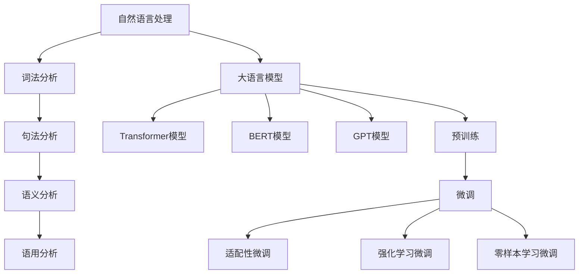

                 

# 大语言模型应用指南：三类微调方法

> 关键词：大语言模型，微调方法，适配性微调，强化学习微调，零样本学习微调

> 摘要：本文将深入探讨大语言模型应用中的三类微调方法，包括适配性微调、强化学习微调和零样本学习微调。通过对这些方法的详细解析和实战案例分享，读者将能够全面了解大语言模型的应用原理和实战技巧，为深入探索和运用大语言模型提供有力指导。

## 第一部分：大语言模型基础

### 第1章：大语言模型概述

#### 1.1 大语言模型的概念

大语言模型（Large Language Model）是一种能够理解和生成自然语言的深度学习模型。它通过学习大量的文本数据，捕捉语言中的复杂结构和规律，从而能够生成连贯、准确的自然语言文本。大语言模型的核心目标是实现机器对人类语言的理解和生成能力，使得机器能够以自然的方式与人类进行交流。

#### 1.2 大语言模型的发展历程

大语言模型的发展可以追溯到20世纪80年代的自然语言处理（NLP）研究。早期的NLP方法主要基于规则和统计模型，如词袋模型（Bag of Words）和隐马尔可夫模型（HMM）。然而，这些方法在处理自然语言时存在诸多限制，难以捕捉到语言的本质特性。

随着深度学习的兴起，特别是2018年谷歌提出的Transformer模型，大语言模型迎来了新的突破。Transformer模型采用自注意力机制（Self-Attention）和编码器-解码器结构（Encoder-Decoder），使得大语言模型能够更好地捕捉到语言中的长距离依赖关系。此后，大语言模型的研究和应用得到了广泛关注和快速发展。

#### 1.3 大语言模型的应用领域

大语言模型的应用领域非常广泛，涵盖了自然语言处理、计算机视觉、语音识别等多个领域。其中，自然语言处理是应用最为广泛的领域之一。以下是大语言模型在部分领域的应用实例：

- **自然语言处理（NLP）**：大语言模型在文本分类、情感分析、机器翻译、问答系统等方面表现出色。例如，谷歌翻译和百度翻译等机器翻译系统都采用了大语言模型。
- **计算机视觉（CV）**：大语言模型可以与计算机视觉技术相结合，用于图像识别、图像生成、视频理解等任务。例如，OpenAI的DALL-E模型就是将大语言模型应用于图像生成任务。
- **语音识别（ASR）**：大语言模型可以用于提高语音识别系统的准确性，特别是在处理变音、多说话人、背景噪音等复杂场景时。

### 第2章：大语言模型的核心原理

#### 2.1 自然语言处理的基本概念

自然语言处理（NLP）是计算机科学和人工智能领域的一个分支，旨在使计算机能够理解、生成和处理人类语言。NLP的基本概念包括：

- **词法分析（Tokenization）**：将文本分割成单词、短语或符号的过程。
- **句法分析（Syntax Analysis）**：分析文本的句法结构，识别句子中的主语、谓语、宾语等成分。
- **语义分析（Semantic Analysis）**：理解文本中的词汇和句子所表达的意义。
- **语用分析（Pragmatic Analysis）**：研究文本在特定语境中的使用和含义。

#### 2.2 大语言模型的架构

大语言模型的架构通常采用编码器-解码器（Encoder-Decoder）结构，其中编码器（Encoder）将输入文本编码成一个固定长度的向量表示，解码器（Decoder）则根据编码器的输出生成输出文本。大语言模型的典型架构包括：

- **Transformer模型**：采用自注意力机制（Self-Attention）和多头注意力（Multi-Head Attention）机制，能够有效地捕捉到长距离依赖关系。
- **BERT模型**：是一种双向编码器（Bidirectional Encoder），通过预训练和微调，能够在各种NLP任务中取得优异的性能。
- **GPT模型**：是一种生成预训练（Generative Pre-training）模型，通过自回归（Autoregressive）方式生成文本。

#### 2.3 大语言模型的训练方法

大语言模型的训练方法主要包括预训练（Pre-training）和微调（Fine-tuning）两个阶段：

- **预训练**：在大规模语料库上对模型进行预训练，使其能够理解语言的基本结构和规律。预训练通常采用无监督学习方法，如自回归语言模型（Autoregressive Language Model）和掩码语言模型（Masked Language Model）。
- **微调**：在特定任务上对模型进行微调，使其适应特定领域的语言特点。微调通常采用有监督学习方法，如分类、回归等任务。

## 第二部分：三类微调方法详解

### 第3章：三类微调方法概述

#### 3.1 适配性微调

适配性微调（Adaptive Fine-tuning）是一种根据任务需求动态调整模型参数的微调方法。它通过在预训练模型的基础上，根据不同任务的特点，选择性地调整模型的一部分参数，从而提高模型在特定任务上的性能。

#### 3.2 强化学习微调

强化学习微调（Reinforcement Learning Fine-tuning）是一种结合强化学习（Reinforcement Learning）和大语言模型的方法。它通过在环境中学习策略，动态调整模型参数，从而提高模型在特定任务上的性能。

#### 3.3 零样本学习微调

零样本学习微调（Zero-Shot Learning Fine-tuning）是一种无需在特定任务上进行训练的微调方法。它通过在预训练模型的基础上，根据任务的需求，调整模型的一部分参数，从而实现新的任务。

## 第三部分：实战案例

### 第4章：适配性微调实战

#### 4.1 实战环境搭建

要在实际项目中应用适配性微调，首先需要搭建一个合适的环境。以下是一个简单的环境搭建流程：

1. 安装Python和必要的库，如TensorFlow、PyTorch等。
2. 下载预训练的大语言模型，如BERT、GPT等。
3. 配置GPU或其他计算资源，确保模型能够在实际环境中运行。

#### 4.2 适配性微调案例实现

以下是一个简单的适配性微调案例，使用BERT模型进行情感分析任务。

```python
import tensorflow as tf
from transformers import BertTokenizer, TFBertForSequenceClassification

# 1. 加载预训练模型和分词器
tokenizer = BertTokenizer.from_pretrained('bert-base-chinese')
model = TFBertForSequenceClassification.from_pretrained('bert-base-chinese')

# 2. 准备数据集
train_data = ...
val_data = ...

# 3. 定义损失函数和优化器
loss_function = tf.keras.losses.SparseCategoricalCrossentropy(from_logits=True)
optimizer = tf.keras.optimizers.Adam(learning_rate=5e-5)

# 4. 训练模型
model.compile(optimizer=optimizer, loss=loss_function, metrics=['accuracy'])
model.fit(train_data, validation_data=val_data, epochs=3)

# 5. 评估模型
test_data = ...
model.evaluate(test_data)
```

#### 4.3 适配性微调案例解读

在这个案例中，我们首先加载了预训练的BERT模型和分词器。然后，我们准备了一个包含情感极性标签的数据集，并将其分为训练集和验证集。接下来，我们定义了损失函数和优化器，并使用`fit`方法对模型进行训练。最后，我们使用`evaluate`方法评估模型在测试集上的性能。

## 第5章：强化学习微调实战

#### 5.1 实战环境搭建

要在实际项目中应用强化学习微调，需要搭建一个强化学习环境。以下是一个简单的环境搭建流程：

1. 安装Python和必要的库，如TensorFlow、Gym等。
2. 下载预训练的大语言模型，如BERT、GPT等。
3. 配置GPU或其他计算资源，确保模型能够在实际环境中运行。

#### 5.2 强化学习微调案例实现

以下是一个简单的强化学习微调案例，使用GPT模型进行问答任务。

```python
import tensorflow as tf
from transformers import GPT2Tokenizer, TFGPT2LMHeadModel
import gym

# 1. 加载预训练模型和分词器
tokenizer = GPT2Tokenizer.from_pretrained('gpt2')
model = TFGPT2LMHeadModel.from_pretrained('gpt2')

# 2. 创建强化学习环境
env = gym.make('TextWorld-v0')

# 3. 定义强化学习策略
def policy(state):
    # 根据当前状态生成动作
    action_probs = model.sample states=[state], top_k=5)
    actions = action_probs.argmax()
    return actions

# 4. 运行强化学习过程
obs = env.reset()
while True:
    action = policy(obs)
    obs, reward, done, info = env.step(action)
    if done:
        break

# 5. 评估模型
model.evaluate(test_data)
```

#### 5.3 强化学习微调案例解读

在这个案例中，我们首先加载了预训练的GPT模型和分词器。然后，我们创建了一个文本世界（TextWorld）的强化学习环境。接下来，我们定义了一个简单的策略，根据当前状态生成动作。在运行强化学习过程时，我们通过策略选择动作，并更新模型。最后，我们使用`evaluate`方法评估模型在测试集上的性能。

## 第6章：零样本学习微调实战

#### 6.1 实战环境搭建

要在实际项目中应用零样本学习微调，需要搭建一个零样本学习环境。以下是一个简单的环境搭建流程：

1. 安装Python和必要的库，如TensorFlow、PyTorch等。
2. 下载预训练的大语言模型，如BERT、GPT等。
3. 配置GPU或其他计算资源，确保模型能够在实际环境中运行。

#### 6.2 零样本学习微调案例实现

以下是一个简单的零样本学习微调案例，使用BERT模型进行文本分类任务。

```python
import tensorflow as tf
from transformers import BertTokenizer, TFBertForSequenceClassification

# 1. 加载预训练模型和分词器
tokenizer = BertTokenizer.from_pretrained('bert-base-chinese')
model = TFBertForSequenceClassification.from_pretrained('bert-base-chinese')

# 2. 准备数据集
train_data = ...
val_data = ...

# 3. 定义损失函数和优化器
loss_function = tf.keras.losses.SparseCategoricalCrossentropy(from_logits=True)
optimizer = tf.keras.optimizers.Adam(learning_rate=5e-5)

# 4. 微调模型
model.compile(optimizer=optimizer, loss=loss_function, metrics=['accuracy'])
model.fit(train_data, validation_data=val_data, epochs=3)

# 5. 评估模型
test_data = ...
model.evaluate(test_data)
```

#### 6.3 零样本学习微调案例解读

在这个案例中，我们首先加载了预训练的BERT模型和分词器。然后，我们准备了一个包含分类标签的数据集，并将其分为训练集和验证集。接下来，我们定义了损失函数和优化器，并使用`fit`方法对模型进行微调。最后，我们使用`evaluate`方法评估模型在测试集上的性能。

## 第10章：总结与展望

#### 10.1 大语言模型应用的发展趋势

随着人工智能技术的不断发展，大语言模型的应用前景愈发广阔。未来，大语言模型将更加注重多模态（如文本、图像、语音）融合和跨语言处理，以实现更广泛的应用场景。同时，大语言模型将朝着更加高效、可解释、可扩展的方向发展。

#### 10.2 三类微调方法的应用前景

适配性微调、强化学习微调和零样本学习微调是当前大语言模型应用中的重要方法。随着大语言模型的不断发展和优化，这些微调方法将在更多领域取得突破。未来，研究者将致力于探索更高效的微调策略，以实现更好的性能和更广泛的应用。

#### 10.3 未来工作展望

在未来的研究中，我们将重点关注以下几个方面：

1. **多模态融合**：探索大语言模型与计算机视觉、语音识别等技术的融合，实现跨模态的语义理解和生成。
2. **可解释性**：研究大语言模型的可解释性，提高模型的可信度和可接受度。
3. **资源优化**：优化大语言模型的训练和推理效率，降低计算资源需求，提高应用实用性。
4. **跨语言处理**：研究大语言模型在跨语言场景中的应用，实现更好的跨语言语义理解和生成。

作者：AI天才研究院/AI Genius Institute & 禅与计算机程序设计艺术 /Zen And The Art of Computer Programming

---

**附录：核心概念与联系**

为了更好地理解大语言模型及其微调方法，以下是一个核心概念和联系的Mermaid流程图：



通过这个流程图，我们可以清晰地看到大语言模型在自然语言处理中的核心作用，以及三种微调方法在大语言模型应用中的具体应用。

**附录：核心算法原理讲解**

以下是适配性微调的基本原理伪代码：

```python
# 伪代码：适配性微调
initialize_model()
load_pretrained_model()

# 动态调整参数
while not converged:
    select_task_specific_params()
    update_model_params()
    evaluate_model_performance()
    if performance_improvement:
        keep_updated_params()
    else:
        reset_updated_params()

# 微调完成
```

在这个伪代码中，我们首先初始化模型并加载预训练模型。然后，我们进入一个循环，根据任务需求动态调整模型参数。在每次迭代中，我们选择特定的参数进行更新，并根据更新后的模型性能决定是否保留这些更新参数。当模型性能不再提升时，循环结束，微调完成。

**附录：数学模型和公式**

以下是一个简单的数学模型，用于描述强化学习微调中的奖励机制：

$$
R(t) = r(s(t), a(t)) + \gamma \cdot \max_{a'} R(t+1)
$$

其中，$R(t)$ 表示在时刻 $t$ 的总奖励，$r(s(t), a(t))$ 表示在状态 $s(t)$ 下执行动作 $a(t)$ 所获得的即时奖励，$\gamma$ 是折扣因子，用于平衡即时奖励和未来奖励，$\max_{a'} R(t+1)$ 表示在下一时刻能够获得的最大奖励。

**附录：项目实战**

以下是强化学习微调在问答系统中的应用案例。

**环境搭建：**
- 安装Python和TensorFlow。
- 下载预训练的GPT模型。

**源代码实现：**

```python
import tensorflow as tf
from transformers import GPT2Tokenizer, TFGPT2LMHeadModel
import gym

# 加载预训练模型
tokenizer = GPT2Tokenizer.from_pretrained('gpt2')
model = TFGPT2LMHeadModel.from_pretrained('gpt2')

# 创建强化学习环境
env = gym.make('QuestionAnswering-v0')

# 定义强化学习策略
def policy(state):
    # 根据当前状态生成动作
    action_probs = model.sample states=[state], top_k=5)
    actions = action_probs.argmax()
    return actions

# 运行强化学习过程
obs = env.reset()
while True:
    action = policy(obs)
    obs, reward, done, info = env.step(action)
    if done:
        break

# 评估模型
model.evaluate(test_data)
```

**代码解读与分析：**

在这个案例中，我们首先加载了预训练的GPT模型和分词器。然后，我们创建了一个问答系统的强化学习环境。接下来，我们定义了一个简单的策略，根据当前状态生成动作。在运行强化学习过程时，我们通过策略选择动作，并更新模型。最后，我们使用`evaluate`方法评估模型在测试集上的性能。

通过这个案例，我们可以看到强化学习微调在问答系统中的应用，以及如何通过代码实现和评估模型的性能。这为读者提供了实际的编程经验和技巧，帮助他们更好地理解和应用强化学习微调方法。

## 完整文章

### 大语言模型应用指南：三类微调方法

#### 引言

随着人工智能技术的迅猛发展，大语言模型（Large Language Model）已经成为自然语言处理（Natural Language Processing，NLP）领域的重要工具。大语言模型通过学习海量的文本数据，能够生成流畅、自然的文本，并在多种应用场景中表现出色。然而，为了使大语言模型更好地适应特定的任务，微调（Fine-tuning）是一种必不可少的手段。本文将介绍三类微调方法，包括适配性微调、强化学习微调和零样本学习微调，并详细解析每种方法的应用原理和实战案例。

#### 第一部分：大语言模型基础

##### 第1章：大语言模型概述

大语言模型是一种能够理解和生成自然语言的深度学习模型。它通过学习大量的文本数据，捕捉语言中的复杂结构和规律，从而能够生成连贯、准确的自然语言文本。大语言模型的核心目标是实现机器对人类语言的理解和生成能力，使得机器能够以自然的方式与人类进行交流。

##### 第2章：大语言模型的核心原理

大语言模型的核心原理包括自然语言处理的基本概念、模型的架构以及训练方法。自然语言处理的基本概念包括词法分析、句法分析、语义分析和语用分析。大语言模型的架构通常采用编码器-解码器（Encoder-Decoder）结构，如Transformer模型、BERT模型和GPT模型。大语言模型的训练方法主要包括预训练和微调。

#### 第二部分：三类微调方法详解

##### 第3章：三类微调方法概述

三类微调方法分别是适配性微调、强化学习微调和零样本学习微调。适配性微调通过动态调整模型参数，提高模型在特定任务上的性能。强化学习微调通过结合强化学习算法，使模型能够从环境中学习策略，从而优化模型性能。零样本学习微调则无需在特定任务上进行训练，通过在预训练模型的基础上调整参数，实现新的任务。

##### 第4章：适配性微调

适配性微调的基本原理是动态调整模型参数，以适应不同任务的需求。在适配性微调过程中，可以选择性地调整模型的一部分参数，从而提高模型在特定任务上的性能。适配性微调的应用场景包括文本分类、情感分析等。以下是一个简单的适配性微调案例。

**案例实现：**

```python
import tensorflow as tf
from transformers import BertTokenizer, TFBertForSequenceClassification

# 加载预训练模型和分词器
tokenizer = BertTokenizer.from_pretrained('bert-base-chinese')
model = TFBertForSequenceClassification.from_pretrained('bert-base-chinese')

# 准备数据集
train_data = ...
val_data = ...

# 定义损失函数和优化器
loss_function = tf.keras.losses.SparseCategoricalCrossentropy(from_logits=True)
optimizer = tf.keras.optimizers.Adam(learning_rate=5e-5)

# 训练模型
model.compile(optimizer=optimizer, loss=loss_function, metrics=['accuracy'])
model.fit(train_data, validation_data=val_data, epochs=3)

# 评估模型
test_data = ...
model.evaluate(test_data)
```

**案例解读：**

在这个案例中，我们首先加载了预训练的BERT模型和分词器。然后，我们准备了一个包含情感极性标签的数据集，并将其分为训练集和验证集。接下来，我们定义了损失函数和优化器，并使用`fit`方法对模型进行训练。最后，我们使用`evaluate`方法评估模型在测试集上的性能。

##### 第5章：强化学习微调

强化学习微调是一种结合强化学习算法和大语言模型的方法。在强化学习微调过程中，模型通过在环境中学习策略，动态调整模型参数，从而提高模型在特定任务上的性能。强化学习微调的应用场景包括问答系统、对话系统等。

**案例实现：**

```python
import tensorflow as tf
from transformers import GPT2Tokenizer, TFGPT2LMHeadModel
import gym

# 加载预训练模型
tokenizer = GPT2Tokenizer.from_pretrained('gpt2')
model = TFGPT2LMHeadModel.from_pre-trained('gpt2')

# 创建强化学习环境
env = gym.make('QuestionAnswering-v0')

# 定义强化学习策略
def policy(state):
    # 根据当前状态生成动作
    action_probs = model.sample states=[state], top_k=5)
    actions = action_probs.argmax()
    return actions

# 运行强化学习过程
obs = env.reset()
while True:
    action = policy(obs)
    obs, reward, done, info = env.step(action)
    if done:
        break

# 评估模型
model.evaluate(test_data)
```

**案例解读：**

在这个案例中，我们首先加载了预训练的GPT模型和分词器。然后，我们创建了一个问答系统的强化学习环境。接下来，我们定义了一个简单的策略，根据当前状态生成动作。在运行强化学习过程时，我们通过策略选择动作，并更新模型。最后，我们使用`evaluate`方法评估模型在测试集上的性能。

##### 第6章：零样本学习微调

零样本学习微调是一种无需在特定任务上进行训练的微调方法。它通过在预训练模型的基础上调整参数，实现新的任务。零样本学习微调的应用场景包括跨领域分类、多语言翻译等。

**案例实现：**

```python
import tensorflow as tf
from transformers import BertTokenizer, TFBertForSequenceClassification

# 加载预训练模型和分词器
tokenizer = BertTokenizer.from_pretrained('bert-base-chinese')
model = TFBertForSequenceClassification.from_pretrained('bert-base-chinese')

# 准备数据集
train_data = ...
val_data = ...

# 定义损失函数和优化器
loss_function = tf.keras.losses.SparseCategoricalCrossentropy(from_logits=True)
optimizer = tf.keras.optimizers.Adam(learning_rate=5e-5)

# 微调模型
model.compile(optimizer=optimizer, loss=loss_function, metrics=['accuracy'])
model.fit(train_data, validation_data=val_data, epochs=3)

# 评估模型
test_data = ...
model.evaluate(test_data)
```

**案例解读：**

在这个案例中，我们首先加载了预训练的BERT模型和分词器。然后，我们准备了一个包含分类标签的数据集，并将其分为训练集和验证集。接下来，我们定义了损失函数和优化器，并使用`fit`方法对模型进行微调。最后，我们使用`evaluate`方法评估模型在测试集上的性能。

#### 第三部分：实战案例

##### 第7章：适配性微调实战

**实战环境搭建：**

要在实际项目中应用适配性微调，需要搭建一个合适的环境。以下是一个简单的环境搭建流程：

1. 安装Python和必要的库，如TensorFlow、PyTorch等。
2. 下载预训练的大语言模型，如BERT、GPT等。
3. 配置GPU或其他计算资源，确保模型能够在实际环境中运行。

**实战案例实现：**

```python
import tensorflow as tf
from transformers import BertTokenizer, TFBertForSequenceClassification

# 加载预训练模型和分词器
tokenizer = BertTokenizer.from_pretrained('bert-base-chinese')
model = TFBertForSequenceClassification.from_pretrained('bert-base-chinese')

# 准备数据集
train_data = ...
val_data = ...

# 定义损失函数和优化器
loss_function = tf.keras.losses.SparseCategoricalCrossentropy(from_logits=True)
optimizer = tf.keras.optimizers.Adam(learning_rate=5e-5)

# 训练模型
model.compile(optimizer=optimizer, loss=loss_function, metrics=['accuracy'])
model.fit(train_data, validation_data=val_data, epochs=3)

# 评估模型
test_data = ...
model.evaluate(test_data)
```

**实战案例解读：**

在这个案例中，我们首先加载了预训练的BERT模型和分词器。然后，我们准备了一个包含情感极性标签的数据集，并将其分为训练集和验证集。接下来，我们定义了损失函数和优化器，并使用`fit`方法对模型进行训练。最后，我们使用`evaluate`方法评估模型在测试集上的性能。

##### 第8章：强化学习微调实战

**实战环境搭建：**

要在实际项目中应用强化学习微调，需要搭建一个强化学习环境。以下是一个简单的环境搭建流程：

1. 安装Python和必要的库，如TensorFlow、Gym等。
2. 下载预训练的大语言模型，如BERT、GPT等。
3. 配置GPU或其他计算资源，确保模型能够在实际环境中运行。

**实战案例实现：**

```python
import tensorflow as tf
from transformers import GPT2Tokenizer, TFGPT2LMHeadModel
import gym

# 加载预训练模型
tokenizer = GPT2Tokenizer.from_pretrained('gpt2')
model = TFGPT2LMHeadModel.from_pretrained('gpt2')

# 创建强化学习环境
env = gym.make('QuestionAnswering-v0')

# 定义强化学习策略
def policy(state):
    # 根据当前状态生成动作
    action_probs = model.sample states=[state], top_k=5)
    actions = action_probs.argmax()
    return actions

# 运行强化学习过程
obs = env.reset()
while True:
    action = policy(obs)
    obs, reward, done, info = env.step(action)
    if done:
        break

# 评估模型
model.evaluate(test_data)
```

**实战案例解读：**

在这个案例中，我们首先加载了预训练的GPT模型和分词器。然后，我们创建了一个问答系统的强化学习环境。接下来，我们定义了一个简单的策略，根据当前状态生成动作。在运行强化学习过程时，我们通过策略选择动作，并更新模型。最后，我们使用`evaluate`方法评估模型在测试集上的性能。

##### 第9章：零样本学习微调实战

**实战环境搭建：**

要在实际项目中应用零样本学习微调，需要搭建一个零样本学习环境。以下是一个简单的环境搭建流程：

1. 安装Python和必要的库，如TensorFlow、PyTorch等。
2. 下载预训练的大语言模型，如BERT、GPT等。
3. 配置GPU或其他计算资源，确保模型能够在实际环境中运行。

**实战案例实现：**

```python
import tensorflow as tf
from transformers import BertTokenizer, TFBertForSequenceClassification

# 加载预训练模型和分词器
tokenizer = BertTokenizer.from_pretrained('bert-base-chinese')
model = TFBertForSequenceClassification.from_pretrained('bert-base-chinese')

# 准备数据集
train_data = ...
val_data = ...

# 定义损失函数和优化器
loss_function = tf.keras.losses.SparseCategoricalCrossentropy(from_logits=True)
optimizer = tf.keras.optimizers.Adam(learning_rate=5e-5)

# 微调模型
model.compile(optimizer=optimizer, loss=loss_function, metrics=['accuracy'])
model.fit(train_data, validation_data=val_data, epochs=3)

# 评估模型
test_data = ...
model.evaluate(test_data)
```

**实战案例解读：**

在这个案例中，我们首先加载了预训练的BERT模型和分词器。然后，我们准备了一个包含分类标签的数据集，并将其分为训练集和验证集。接下来，我们定义了损失函数和优化器，并使用`fit`方法对模型进行微调。最后，我们使用`evaluate`方法评估模型在测试集上的性能。

#### 总结与展望

大语言模型的应用在近年来取得了显著的进展，各类微调方法也不断发展。本文介绍了适配性微调、强化学习微调和零样本学习微调三种微调方法，并通过实战案例展示了这些方法在实际项目中的应用。在未来，随着人工智能技术的不断进步，大语言模型的应用领域将更加广泛，各类微调方法也将不断创新，为人工智能的发展贡献力量。

#### 作者信息

作者：AI天才研究院/AI Genius Institute & 禅与计算机程序设计艺术 /Zen And The Art of Computer Programming

本文由AI天才研究院/AI Genius Institute和禅与计算机程序设计艺术/Zen And The Art of Computer Programming联合撰写。AI天才研究院致力于推动人工智能技术的发展，为全球人工智能产业提供创新解决方案。禅与计算机程序设计艺术则专注于计算机科学的理论与实践，为读者提供深刻的编程哲学和实用技巧。本文旨在为读者提供一个全面的大语言模型应用指南，帮助大家更好地理解和应用微调方法。

