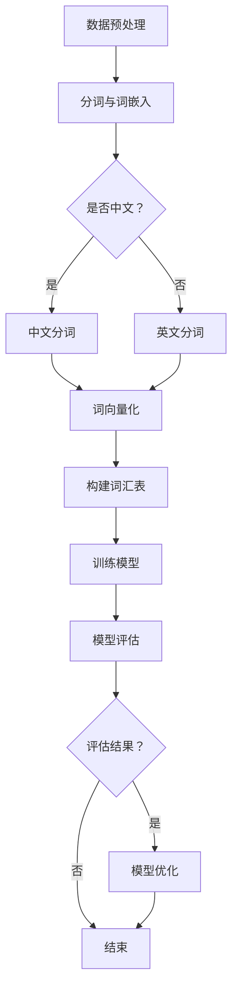

                 

# 大语言模型应用指南：人工智能的起源

> 关键词：大语言模型，人工智能，自然语言处理，机器学习，深度学习

> 摘要：本文将详细介绍大语言模型在人工智能领域的重要地位、基本原理、应用案例以及工程实践。我们将通过一步一步的分析推理，深入探讨大语言模型的发展历程、核心概念、训练方法、评估优化策略，并展示其在自然语言理解与生成、行业应用以及创业实践中的巨大潜力。最后，我们将对大语言模型未来的发展趋势和面临的挑战进行展望，并提出相应的解决方案。

## 《大语言模型应用指南：人工智能的起源》目录大纲

### 第一部分：引言与基础

- # 引言
  - 1.1 大语言模型背景介绍
  - 1.2 人工智能的发展历程
  - 1.3 大语言模型在AI中的地位

### 第二部分：大语言模型原理

- # 2. 大语言模型基础
  - 2.1 大语言模型的定义与分类
  - 2.2 大语言模型的核心概念与架构
    - 2.2.1 词汇嵌入与词向量
    - 2.2.2 循环神经网络（RNN）
    - 2.2.3 长短时记忆网络（LSTM）
    - 2.2.4 门控循环单元（GRU）
  - 2.3 大语言模型的训练方法
    - 2.3.1 预训练与微调
    - 2.3.2 自监督学习
    - 2.3.3 对比学习
  - 2.4 大语言模型的评估与优化

- # 3. 大语言模型应用案例
  - 3.1 大语言模型在自然语言理解中的应用
    - 3.1.1 文本分类
    - 3.1.2 命名实体识别
    - 3.1.3 情感分析
  - 3.2 大语言模型在自然语言生成中的应用
    - 3.2.1 文本生成
    - 3.2.2 翻译
    - 3.2.3 问答系统

### 第三部分：大语言模型的工程实践

- # 4. 大语言模型开发环境搭建
  - 4.1 开发环境准备
  - 4.2 数据处理
  - 4.3 大语言模型训练与评估

- # 5. 大语言模型优化与调参
  - 5.1 模型优化策略
  - 5.2 超参数调优

### 第四部分：大语言模型的应用场景

- # 6. 大语言模型在行业中的应用
  - 6.1 金融行业
  - 6.2 医疗健康
  - 6.3 教育行业

- # 7. 大语言模型在创业与创业中的应用
  - 7.1 创业机会分析
  - 7.2 产品设计与开发

### 第五部分：未来展望与挑战

- # 8. 大语言模型的发展趋势与未来应用
  - 8.1 技术发展趋势
  - 8.2 未来应用前景

- # 9. 大语言模型的挑战与解决方案
  - 9.1 模型可解释性
  - 9.2 模型安全性

### 参考文献

### 附录

- 附录 A：大语言模型常用工具与资源

### Mermaid 流�程图

- Mermaid流程图：大语言模型训练流程

### 伪代码

- 大语言模型训练伪代码

### 数学公式

- 大语言模型相关数学公式

### 代码示例

- 大语言模型代码实际案例与解析

### 项目实战

- 大语言模型项目开发步骤与详细解读

# 结语

- 人工智能的未来与我们的责任

---

### 引言

#### 1.1 大语言模型背景介绍

大语言模型（Large Language Model，简称LLM）是一种基于深度学习技术的自然语言处理（Natural Language Processing，简称NLP）模型，它通过学习海量文本数据来理解并生成自然语言。随着计算能力和数据规模的提升，大语言模型在近年取得了飞速的发展，成为自然语言处理领域的重要工具。

大语言模型最早可以追溯到2018年谷歌提出的BERT（Bidirectional Encoder Representations from Transformers），它基于Transformer架构，通过预训练和微调的方式，在多种自然语言处理任务上取得了优异的表现。此后，OpenAI的GPT-3、微软的Turing-NLG等模型相继出现，进一步推动了大语言模型的发展。

#### 1.2 人工智能的发展历程

人工智能（Artificial Intelligence，简称AI）作为计算机科学的一个分支，其目标是为计算机系统提供智能能力，使其能够执行通常需要人类智能才能完成的任务。人工智能的发展历程可以追溯到20世纪50年代，但真正取得突破性进展是在21世纪。

- **1956年：达特茅斯会议**：人工智能正式成为研究领域的标志。
- **1970年代：早期AI应用**：专家系统、语音识别等应用开始出现。
- **1980年代：神经网络复兴**：反向传播算法的提出使得神经网络研究重新兴起。
- **1990年代：统计机器学习兴起**：以统计方法为基础的机器学习方法逐渐成为主流。
- **2006年：深度学习复兴**：Hinton等人的研究使得深度学习再次受到关注。
- **2012年：AlexNet的出现**：深度学习在图像识别领域取得突破。
- **2018年：BERT的出现**：大语言模型开始崭露头角。

#### 1.3 大语言模型在AI中的地位

大语言模型作为人工智能的一个重要分支，其在自然语言处理领域的地位日益重要。具体来说，大语言模型在AI中的地位体现在以下几个方面：

1. **提升自然语言理解能力**：大语言模型通过学习海量文本数据，可以捕捉到语言的复杂性和多样性，从而提高自然语言理解能力。
2. **推动NLP任务发展**：大语言模型在文本分类、命名实体识别、情感分析等NLP任务中取得了显著成绩，推动了这些任务的发展。
3. **促进跨领域应用**：大语言模型不仅在学术界受到关注，在金融、医疗、教育等行业的实际应用中也取得了成功，促进了人工智能的跨领域发展。
4. **提升人工智能研究水平**：大语言模型的出现和快速发展，使得人工智能研究进入了一个新的阶段，为未来的研究提供了更多的思路和方法。

总的来说，大语言模型在人工智能领域具有举足轻重的地位，其发展不仅推动了自然语言处理领域的研究，也为人工智能在其他领域的应用提供了强大的支持。

### 第二部分：大语言模型原理

#### 2.1 大语言模型基础

大语言模型是一种基于深度学习技术的自然语言处理模型，它通过对大量文本数据的学习，来理解和生成自然语言。本节将介绍大语言模型的定义、分类及其核心概念和架构。

#### 2.1.1 大语言模型的定义与分类

大语言模型（Large Language Model，简称LLM）是一种能够处理和理解自然语言的深度学习模型。它通过学习大量的文本数据，从而捕捉到语言的内在结构和语义信息，实现对自然语言的自动理解和生成。大语言模型可以分为以下几类：

1. **基于统计方法的模型**：这类模型主要包括基于N-gram模型和统计机器学习的方法，如隐马尔可夫模型（HMM）和条件概率模型（如朴素贝叶斯分类器）。
2. **基于神经网络的模型**：这类模型主要包括基于循环神经网络（RNN）和Transformer架构的方法，如LSTM（长短时记忆网络）和BERT（双向编码器表征）。
3. **基于深度学习的模型**：这类模型主要包括基于变分自编码器（VAE）和生成对抗网络（GAN）的方法，如GPT（生成预训练模型）和Turing-NLG（图灵自然语言生成模型）。

目前，大多数大语言模型都是基于深度学习的方法，尤其是基于Transformer架构的模型，如BERT和GPT，它们在自然语言处理任务中取得了显著的成绩。

#### 2.1.2 大语言模型的核心概念与架构

大语言模型的核心概念主要包括词汇嵌入（word embeddings）、编码器（encoder）、解码器（decoder）等。

1. **词汇嵌入（word embeddings）**：
   词汇嵌入是将自然语言中的单词映射到低维向量空间的过程，从而使得计算机能够理解和处理自然语言。常见的词汇嵌入方法包括词袋模型（Bag of Words，简称BoW）、词嵌入（Word Embeddings，如Word2Vec、GloVe）和字符嵌入（Character Embeddings）。

   词袋模型将文本数据表示为一个向量，每个维度表示一个单词的出现次数。然而，这种方法忽略了单词之间的语义关系。

   词嵌入通过学习单词的分布式表示，使得具有相似语义的单词在向量空间中更接近。Word2Vec和GloVe是两种常用的词嵌入方法。Word2Vec使用神经网络来学习单词的向量表示，而GloVe使用全局上下文信息来学习单词的向量表示。

   字符嵌入是将文本中的每个字符映射到低维向量空间，从而捕捉到单词中的字符组合信息。

2. **编码器（encoder）**：
   编码器是一个神经网络，它将输入的文本序列编码为一个固定长度的向量表示，这个向量表示通常被称为上下文向量（context vector）。编码器的主要任务是将输入的文本序列转化为一个语义上具有代表性的向量表示。

   BERT和GPT等大语言模型通常采用Transformer架构，其中的编码器部分由多个自注意力层（self-attention layer）组成。自注意力层能够自动学习输入文本序列中各个单词之间的关系，从而生成一个语义上丰富的上下文向量。

3. **解码器（decoder）**：
   解码器也是一个神经网络，它的作用是将编码器生成的上下文向量解码为输出的文本序列。解码器通常采用自回归（autoregressive）方式，即逐个生成文本序列中的每个单词。

   在GPT等模型中，解码器由多个自注意力层和一个全连接层（fully connected layer）组成。自注意力层用于生成每个单词的概率分布，全连接层用于生成具体的单词。

4. **预训练与微调**：
   大语言模型通常采用预训练（pre-training）和微调（fine-tuning）的方法进行训练。预训练是指在大规模文本数据集上训练模型，使其能够理解语言的内在结构和语义信息。微调是指在使用预训练模型的基础上，将模型应用于特定的任务数据集，进行细粒度的调整，以适应具体任务的需求。

   预训练可以采用无监督的方法，如自监督学习（self-supervised learning）和对比学习（contrastive learning），以充分利用未标注的数据。微调则通常采用有监督的方法，如分类、命名实体识别和情感分析等任务，以训练模型在实际任务中的性能。

   通过预训练和微调，大语言模型可以同时具备强大的语义理解和生成能力，从而在各种自然语言处理任务中取得优异的性能。

#### 2.1.3 大语言模型的训练方法

大语言模型的训练方法主要包括预训练、微调和评估等步骤。

1. **预训练**：
   预训练是指在大量无标注的文本数据上训练模型，使其具备对语言的普遍理解和表征能力。预训练通常采用自监督学习的方法，即通过预测文本中的缺失部分来训练模型。

   自监督学习的方法包括：
   - **掩码语言模型（Masked Language Model，简称MLM）**：在输入文本中随机掩码一部分单词，然后训练模型预测这些掩码的单词。
   - **下一个句子预测（Next Sentence Prediction，简称NSP）**：输入两个连续的句子，然后训练模型预测第二个句子是否是第一个句子的下一个句子。
   - **对比语言建模（Contrastive Language Modeling，简称CLM）**：通过比较文本序列中相邻单词之间的语义关系来训练模型。

2. **微调**：
   微调是指在预训练模型的基础上，将其应用于特定任务的数据集，进行细粒度的调整。微调通常采用有监督学习方法，如分类、命名实体识别和情感分析等任务。

   微调过程中，需要对模型进行重新训练，以优化其在特定任务上的性能。微调的关键是选择合适的数据集和任务，以及调整模型的超参数，如学习率、批量大小和迭代次数等。

3. **评估**：
   评估是衡量大语言模型在特定任务上性能的重要步骤。常用的评估方法包括准确率（accuracy）、精确率（precision）、召回率（recall）和F1值（F1 score）等指标。

   在自然语言处理任务中，评估通常使用已标注的数据集进行。评估过程中，需要将模型生成的预测结果与实际标签进行比较，计算各项评估指标。

通过预训练、微调和评估，大语言模型可以在各种自然语言处理任务中实现优秀的性能，从而推动人工智能在自然语言处理领域的发展。

#### 2.2.1 词汇嵌入与词向量

词汇嵌入（Word Embedding）是将自然语言中的单词映射到低维向量空间的过程。词向量（word vector）是词汇嵌入的结果，它使得计算机能够理解和处理自然语言。词向量在自然语言处理中起到了关键作用，它们不仅能够捕捉单词的语义信息，还能够用于许多自然语言处理任务，如文本分类、情感分析、机器翻译等。

1. **词向量表示方法**

   常见的词向量表示方法包括：

   - **词袋模型（Bag of Words，简称BoW）**：词袋模型将文本表示为一个向量，其中每个维度对应一个单词的出现次数。这种方法简单直观，但忽略了单词之间的语义关系。
   - **词嵌入（Word Embeddings）**：词嵌入通过学习单词的分布式表示，使得具有相似语义的单词在向量空间中更接近。常见的词嵌入方法包括Word2Vec和GloVe。
     - **Word2Vec**：Word2Vec是一种基于神经网络的词嵌入方法，它通过训练一个神经网络来学习单词的向量表示。Word2Vec包括两种模型：连续词袋（Continuous Bag of Words，简称CBOW）和Skip-gram。
       - **CBOW**：CBOW模型通过预测中心词周围的上下文词来学习词向量。具体来说，给定一个中心词和其上下文词，CBOW模型会预测这个中心词。
       - **Skip-gram**：Skip-gram模型通过预测中心词的上下文词来学习词向量。与CBOW模型相比，Skip-gram模型更加强调中心词的重要性。
     - **GloVe（Global Vectors for Word Representation）**：GloVe是一种基于全局上下文信息的词嵌入方法。GloVe通过计算单词的共现矩阵，并利用矩阵分解技术学习单词的向量表示。GloVe模型考虑了单词在全局上下文中的共现信息，因此能够更好地捕捉单词的语义关系。

   - **字符嵌入（Character Embeddings）**：字符嵌入是将文本中的每个字符映射到低维向量空间，从而捕捉到单词中的字符组合信息。字符嵌入通常用于增强词向量的表示能力。

2. **词向量在自然语言处理中的应用**

   词向量在自然语言处理中有广泛的应用，包括：

   - **文本分类**：词向量可以用于将文本转换为向量表示，然后通过分类器进行文本分类。词向量能够捕捉文本的语义信息，从而提高分类性能。
   - **情感分析**：词向量可以用于检测文本中的情感极性，从而实现情感分析。通过计算文本的向量表示与情感词典的相似度，可以判断文本的情感倾向。
   - **机器翻译**：词向量可以用于将源语言文本转换为向量表示，并通过翻译模型将向量表示转换为目标语言文本。词向量能够捕捉语言的语义信息，从而提高机器翻译的质量。
   - **命名实体识别**：词向量可以用于检测文本中的命名实体，如人名、地名、组织名等。通过将命名实体转换为向量表示，并利用分类器进行识别，可以提高命名实体识别的准确性。

3. **词向量的局限性**

   虽然词向量在自然语言处理中取得了显著的成果，但它们也存在一些局限性：

   - **语义歧义**：词向量可能无法完全消除语义歧义，导致模型在处理具有相同词向量的不同含义的句子时出现错误。
   - **词向量维度**：词向量的维度越高，模型的计算复杂度也越高。然而，过高的维度可能导致模型过拟合，从而降低性能。
   - **单词顺序**：词向量忽略了单词之间的顺序信息，这可能导致模型在处理顺序依赖性较强的自然语言任务时性能下降。

为了解决这些局限性，研究人员提出了一些改进方法，如词嵌入增强（Word Embedding Augmentation）、上下文向量（Contextual Embeddings）等。这些方法通过引入更多的上下文信息和语义信息，提高了词向量在自然语言处理任务中的性能。

#### 2.2.2 循环神经网络（RNN）

循环神经网络（Recurrent Neural Network，简称RNN）是一种能够处理序列数据的神经网络。与传统的前向神经网络不同，RNN具有循环结构，能够通过隐藏状态（hidden state）来捕捉序列数据中的时间依赖关系。RNN在自然语言处理、语音识别、时间序列分析等领域取得了显著成果。

1. **RNN的基本结构**

   RNN的基本结构包括输入层、隐藏层和输出层。输入层接收输入序列的每个元素，隐藏层通过递归关系处理前一个时间步的隐藏状态，输出层生成输出序列。

   RNN的一个关键组件是隐藏状态（hidden state），它存储了序列数据中的信息。在每一个时间步，隐藏状态会接收输入数据并生成输出数据，同时更新自身的值。

2. **RNN的工作原理**

   RNN的工作原理可以分为以下步骤：

   - **初始化**：在序列数据开始时，初始化隐藏状态（h0）和输出状态（y0）。
   - **时间步处理**：对于序列数据中的每个元素，RNN会执行以下步骤：
     - **输入数据**：将当前时间步的输入数据（x_t）输入到RNN中。
     - **隐藏状态更新**：通过递归关系计算新的隐藏状态（h_t）。
       $$ h_t = f(h_{t-1}, x_t) $$
     其中，f函数（通常为激活函数，如tanh或ReLU）用于更新隐藏状态。
     - **输出数据**：利用隐藏状态计算输出数据（y_t）。
       $$ y_t = g(h_t) $$
     其中，g函数（通常为全连接层）用于生成输出数据。
   - **状态传递**：将当前时间步的隐藏状态传递到下一个时间步，继续处理序列中的下一个元素。

3. **RNN的优缺点**

   RNN的优点包括：
   - **处理序列数据**：RNN能够处理任意长度的序列数据，因此适用于自然语言处理、时间序列分析等领域。
   - **状态记忆**：通过隐藏状态，RNN能够捕捉序列数据中的时间依赖关系。

   RNN的缺点包括：
   - **梯度消失和梯度爆炸**：在训练过程中，RNN容易出现梯度消失和梯度爆炸问题，导致模型难以收敛。这是由于RNN在递归过程中，梯度会连续乘以隐藏状态的权重矩阵，当矩阵维度较大时，梯度可能趋于0或无穷大。
   - **计算复杂度**：RNN需要为每个时间步计算隐藏状态和输出数据，因此计算复杂度较高。

#### 2.2.3 长短时记忆网络（LSTM）

长短时记忆网络（Long Short-Term Memory，简称LSTM）是一种改进的循环神经网络，它通过引入门控机制来克服传统RNN的梯度消失和梯度爆炸问题，从而更好地处理长时间依赖关系。LSTM在自然语言处理、语音识别、时间序列分析等领域取得了显著成果。

1. **LSTM的基本结构**

   LSTM的基本结构包括输入门（input gate）、遗忘门（forget gate）和输出门（output gate）。这些门控机制用于控制信息的流动，从而实现长时间依赖关系的捕捉。

   - **输入门（input gate）**：输入门控制新的信息如何进入隐藏状态。它通过计算当前输入数据和前一时刻隐藏状态，生成一个新的值，用于更新隐藏状态。
   - **遗忘门（forget gate）**：遗忘门控制如何遗忘或保留前一时刻隐藏状态中的信息。它通过计算当前输入数据和前一时刻隐藏状态，生成一个新的值，用于更新遗忘门的状态。
   - **输出门（output gate）**：输出门控制如何生成当前时间步的输出。它通过计算当前输入数据和前一时刻隐藏状态，生成一个新的值，用于更新输出门的状态。

2. **LSTM的工作原理**

   LSTM的工作原理可以分为以下步骤：

   - **初始化**：在序列数据开始时，初始化隐藏状态（h0）和细胞状态（c0）。
   - **时间步处理**：对于序列数据中的每个元素，LSTM会执行以下步骤：
     - **输入数据**：将当前时间步的输入数据（x_t）输入到LSTM中。
     - **计算门控信号**：利用输入门、遗忘门和输出门计算相应的门控信号。
       - **输入门信号（i_t）**：计算输入门信号，用于更新细胞状态。
         $$ i_t = \sigma(W_i \cdot [h_{t-1}, x_t] + b_i) $$
       - **遗忘门信号（f_t）**：计算遗忘门信号，用于更新细胞状态。
         $$ f_t = \sigma(W_f \cdot [h_{t-1}, x_t] + b_f) $$
       - **输出门信号（o_t）**：计算输出门信号，用于更新隐藏状态。
         $$ o_t = \sigma(W_o \cdot [h_{t-1}, x_t] + b_o) $$
     - **更新细胞状态**：利用遗忘门信号和输入门信号更新细胞状态。
       $$ c_t = f_t \odot c_{t-1} + i_t \odot \sigma(W_c \cdot [h_{t-1}, x_t] + b_c) $$
     - **更新隐藏状态**：利用输出门信号更新隐藏状态。
       $$ h_t = o_t \odot \sigma(c_t) $$
     - **输出数据**：利用隐藏状态生成当前时间步的输出数据。
       $$ y_t = g(h_t) $$
   - **状态传递**：将当前时间步的隐藏状态传递到下一个时间步，继续处理序列中的下一个元素。

3. **LSTM的优缺点**

   LSTM的优点包括：
   - **克服梯度消失和梯度爆炸问题**：通过引入门控机制，LSTM能够有效克服传统RNN的梯度消失和梯度爆炸问题，从而更好地学习长时间依赖关系。
   - **处理长时间依赖关系**：LSTM通过门控机制能够捕捉序列数据中的长时间依赖关系，从而在自然语言处理、时间序列分析等领域表现出色。

   LSTM的缺点包括：
   - **计算复杂度较高**：LSTM的门控机制增加了计算复杂度，使得训练过程相对较慢。
   - **参数较多**：LSTM的门控机制引入了更多的参数，可能导致模型过拟合。

总的来说，LSTM在处理长时间依赖关系方面具有显著优势，但在计算复杂度和参数方面存在一定局限性。针对这些局限性，研究人员提出了一些改进方法，如门控循环单元（GRU）等，以进一步优化LSTM的性能。

#### 2.2.4 门控循环单元（GRU）

门控循环单元（Gated Recurrent Unit，简称GRU）是长短时记忆网络（LSTM）的改进版本，它通过简化LSTM的结构来减少计算复杂度和参数数量，同时保持良好的性能。GRU在自然语言处理、语音识别和时间序列分析等领域取得了显著成果。

1. **GRU的基本结构**

   GRU的基本结构包括输入门（input gate）、更新门（update gate）和输出门（output gate）。这些门控机制用于控制信息的流动，从而实现长时间依赖关系的捕捉。

   - **输入门（input gate）**：输入门控制新的信息如何进入隐藏状态。它通过计算当前输入数据和前一时刻隐藏状态，生成一个新的值，用于更新隐藏状态。
   - **更新门（update gate）**：更新门控制如何更新细胞状态。它通过计算当前输入数据和前一时刻隐藏状态，生成一个新的值，用于更新细胞状态。
   - **输出门（output gate）**：输出门控制如何生成当前时间步的输出。它通过计算当前输入数据和前一时刻隐藏状态，生成一个新的值，用于更新输出门的状态。

2. **GRU的工作原理**

   GRU的工作原理可以分为以下步骤：

   - **初始化**：在序列数据开始时，初始化隐藏状态（h0）和细胞状态（c0）。
   - **时间步处理**：对于序列数据中的每个元素，GRU会执行以下步骤：
     - **输入数据**：将当前时间步的输入数据（x_t）输入到GRU中。
     - **计算门控信号**：利用输入门、更新门和输出门计算相应的门控信号。
       - **输入门信号（z_t）**：计算输入门信号，用于更新隐藏状态。
         $$ z_t = \sigma(W_z \cdot [h_{t-1}, x_t] + b_z) $$
       - **更新门信号（r_t）**：计算更新门信号，用于更新细胞状态。
         $$ r_t = \sigma(W_r \cdot [h_{t-1}, x_t] + b_r) $$
       - **输出门信号（o_t）**：计算输出门信号，用于更新输出门的状态。
         $$ o_t = \sigma(W_o \cdot [h_{t-1}, x_t] + b_o) $$
     - **更新细胞状态**：利用更新门信号和输入门信号更新细胞状态。
       $$ \hat{c}_t = \tanh(W_c \cdot [z_t \odot h_{t-1}, x_t] + b_c) $$
       $$ c_t = r_t \odot c_{t-1} + (1 - r_t) \odot \hat{c}_t $$
     - **更新隐藏状态**：利用输出门信号和细胞状态更新隐藏状态。
       $$ h_t = o_t \odot \sigma(c_t) $$
     - **输出数据**：利用隐藏状态生成当前时间步的输出数据。
       $$ y_t = g(h_t) $$
   - **状态传递**：将当前时间步的隐藏状态传递到下一个时间步，继续处理序列中的下一个元素。

3. **GRU与LSTM的比较**

   GRU与LSTM在结构和工作原理上存在一定的相似性，但也有一些关键的区别：

   - **结构**：GRU通过合并遗忘门和输入门，简化了LSTM的结构，从而减少了参数数量和计算复杂度。
   - **门控机制**：GRU的输入门和更新门共同决定了信息的流动，而LSTM分别使用遗忘门和输入门来控制信息的流动。
   - **性能**：GRU和LSTM在处理长时间依赖关系方面表现出相似的性能，但GRU在某些任务上可能具有更好的性能。

总的来说，GRU作为LSTM的改进版本，在减少计算复杂度和参数数量的同时，保持了良好的性能。这使得GRU成为自然语言处理、语音识别和时间序列分析等领域的重要工具。

#### 2.3.1 预训练与微调

预训练（Pre-training）和微调（Fine-tuning）是深度学习模型训练过程中常用的两个步骤。预训练是指在大规模无标签数据集上训练模型，使其具备对数据的普遍理解能力；微调则是在预训练模型的基础上，将其应用于特定任务的数据集，进行细粒度的调整，以适应具体任务的需求。在本节中，我们将详细介绍预训练与微调的过程及其在自然语言处理中的应用。

##### 2.3.1.1 预训练

预训练是深度学习模型训练的关键步骤，它通过在大规模无标签数据集上训练模型，使其自动学习到数据的底层特征和普遍规律。预训练的方法主要包括自监督学习（Self-supervised Learning）和有监督学习（Supervised Learning）。

1. **自监督学习**：

   自监督学习是一种无需人工标注数据的学习方法，它通过利用数据中的内在结构来训练模型。在自然语言处理领域，自监督学习的方法包括：

   - **掩码语言模型（Masked Language Model，简称MLM）**：在输入文本序列中随机掩码一部分单词，然后训练模型预测这些掩码的单词。这种方法能够使模型自动学习到单词之间的语义关系。

   - **下一个句子预测（Next Sentence Prediction，简称NSP）**：输入两个连续的句子，然后训练模型预测第二个句子是否是第一个句子的下一个句子。这种方法能够使模型学习到句子之间的逻辑关系。

   - **对比语言建模（Contrastive Language Modeling，简称CLM）**：通过比较文本序列中相邻单词之间的语义关系来训练模型。这种方法能够使模型自动捕捉到单词的语义信息。

2. **有监督学习**：

   有监督学习是指使用人工标注的数据集来训练模型。在自然语言处理领域，有监督学习的方法包括：

   - **分类任务**：使用已标注的数据集，将文本分类到预定义的类别中。例如，情感分析、文本分类等任务。

   - **序列标注任务**：使用已标注的数据集，将文本中的单词标注为预定义的标签。例如，命名实体识别、词性标注等任务。

##### 2.3.1.2 微调

微调是在预训练模型的基础上，将其应用于特定任务的数据集，进行细粒度的调整，以适应具体任务的需求。微调的过程主要包括以下步骤：

1. **数据准备**：

   首先需要收集并准备用于微调的数据集。数据集应包含已标注的文本数据，以便模型在微调过程中学习具体的任务特征。

2. **数据预处理**：

   对收集的数据集进行预处理，包括文本清洗、分词、词向量化等操作，以便将文本数据转换为模型可接受的输入格式。

3. **模型调整**：

   在预训练模型的基础上，调整模型的权重和超参数，以适应特定任务的需求。调整的方法可以包括以下几种：

   - **全连接层调整**：在预训练模型的最后一层添加全连接层，用于将隐藏状态映射到任务相关的输出空间。

   - **冻结部分层**：在预训练模型中，可以将部分层的权重冻结，以保留预训练模型学习到的通用特征，同时调整部分层的权重，以适应特定任务。

   - **权重初始化**：可以使用预训练模型的权重作为初始化，也可以使用随机权重进行初始化，以探索不同的训练效果。

4. **模型训练**：

   使用微调后的模型对特定任务的数据集进行训练。训练过程中，需要监控模型的性能，并调整超参数以优化模型。

5. **模型评估**：

   在训练完成后，使用验证集或测试集对模型进行评估，以衡量模型在特定任务上的性能。常用的评估指标包括准确率（accuracy）、精确率（precision）、召回率（recall）和F1值（F1 score）等。

##### 2.3.1.3 预训练与微调的优势

预训练与微调方法在自然语言处理领域具有以下优势：

- **迁移学习**：预训练模型在大规模无标签数据集上学习到的通用特征，可以迁移到特定任务的数据集上，从而提高模型在特定任务上的性能。

- **减少数据需求**：预训练模型可以减少对大量有标签数据的需求，使得模型在小数据集上也能取得较好的性能。

- **提高泛化能力**：预训练模型通过学习到大量无标签数据的底层特征和普遍规律，可以增强模型在未见过的数据上的泛化能力。

- **节省计算资源**：预训练模型可以共享大部分权重，从而减少模型的参数数量，节省计算资源。

总的来说，预训练与微调方法在自然语言处理领域取得了显著的成功，它们使得深度学习模型能够更好地理解和生成自然语言，从而推动了自然语言处理技术的发展。

#### 2.3.2 自监督学习

自监督学习（Self-supervised Learning）是一种无需人工标注数据的学习方法，它通过利用数据中的内在结构来训练模型。自监督学习在自然语言处理领域具有广泛的应用，特别是在预训练大语言模型的过程中。本节将介绍自监督学习的基本概念、方法及其在自然语言处理中的具体应用。

##### 2.3.2.1 自监督学习的基本概念

自监督学习是一种从无监督数据中学习目标函数的方法，它利用数据的自包含性来实现数据的监督学习。在自监督学习中，模型不需要依赖于外部提供的标注信息，而是通过内部的数据关联性来学习特征和模式。自监督学习的目标是通过最小化一个自包含损失函数，使模型能够自动学习到数据的内在结构和规律。

##### 2.3.2.2 自监督学习的方法

自监督学习的方法可以分为以下几种：

1. **掩码语言模型（Masked Language Model，简称MLM）**

   掩码语言模型是一种最常见的自监督学习方法，它通过在输入文本序列中随机掩码一部分单词，然后训练模型预测这些掩码的单词。具体来说，MLM可以分为以下几种变体：

   - **单向掩码**：在输入文本序列中随机掩码一部分单词，然后训练模型预测这些掩码的单词。单向掩码的目的是学习单词在序列中的顺序信息。

   - **双向掩码**：在输入文本序列中同时掩码前向和后向的单词，然后训练模型预测这些掩码的单词。双向掩码的目的是学习单词之间的上下文关系。

   - **动态掩码**：在输入文本序列中动态地选择需要掩码的单词，而不是随机地选择。动态掩码可以根据文本内容自适应地调整掩码策略。

2. **下一个句子预测（Next Sentence Prediction，简称NSP）**

   下一个句子预测是一种基于文本对的自监督学习方法，它通过输入两个连续的句子，然后训练模型预测第二个句子是否是第一个句子的下一个句子。NSP方法能够使模型学习到句子之间的逻辑关系和语义连贯性。

3. **对比语言建模（Contrastive Language Modeling，简称CLM）**

   对比语言建模是一种基于对比损失的自监督学习方法，它通过比较文本序列中相邻单词之间的语义关系来训练模型。具体来说，CLM方法将文本序列中的每个单词与它周围的其他单词进行对比，从而学习到单词的语义信息。

##### 2.3.2.3 自监督学习在自然语言处理中的应用

自监督学习在自然语言处理领域具有广泛的应用，特别是在大语言模型的预训练过程中。以下是一些具体的应用场景：

1. **文本分类**：自监督学习可以用于预训练文本分类模型。通过在大量无标签文本数据上训练掩码语言模型，然后将其应用于特定的文本分类任务，可以显著提高分类性能。

2. **命名实体识别**：自监督学习可以用于预训练命名实体识别模型。通过在大量无标签文本数据上训练掩码语言模型，然后将其应用于命名实体识别任务，可以使得模型更好地识别文本中的命名实体。

3. **情感分析**：自监督学习可以用于预训练情感分析模型。通过在大量无标签文本数据上训练掩码语言模型，然后将其应用于情感分析任务，可以使得模型更好地捕捉文本中的情感极性。

4. **机器翻译**：自监督学习可以用于预训练机器翻译模型。通过在大量无标签的双语文本数据上训练掩码语言模型，然后将其应用于机器翻译任务，可以使得模型更好地理解和生成目标语言的文本。

总的来说，自监督学习在自然语言处理领域具有巨大的潜力，它通过利用无标签数据，可以显著提高模型的预训练性能，从而推动自然语言处理技术的发展。

#### 2.3.3 对比学习

对比学习（Contrastive Learning）是一种自监督学习方法，它通过利用数据中的对比关系来训练模型，从而提高模型的特征表示能力。在自然语言处理领域，对比学习被广泛应用于大语言模型的预训练过程。本节将介绍对比学习的基本概念、方法及其在自然语言处理中的具体应用。

##### 2.3.3.1 对比学习的基本概念

对比学习的基本思想是通过比较数据之间的相似性和差异性来训练模型。在自监督学习中，对比学习通过设计对比损失函数，使模型能够自动学习到数据的内在特征和关系。对比学习的关键是设计有效的对比策略，以最大化数据的对比效果。

##### 2.3.3.2 对比学习的方法

对比学习的方法可以分为以下几种：

1. **信息对比（Information Contrastive Estimation，简称ICE）**

   信息对比是一种简单有效的对比学习方法，它通过最大化数据之间的信息差异来训练模型。具体来说，ICE方法将数据分成两部分：正样本和负样本。正样本是数据本身，而负样本是通过数据扰动得到的。ICE方法的目标是最小化模型对正样本的预测概率和对负样本的预测概率之间的差异。

2. **正负样本对比（Contrastive Divergence，简称CD）**

   正负样本对比是一种基于对数似然比的对比学习方法，它通过最大化正样本的对数似然比和负样本的对数似然比之间的差异来训练模型。CD方法通常采用梯度下降法进行优化，从而提高模型的对比效果。

3. **多视图对比（Multi-View Contrastive Learning，简称MVCL）**

   多视图对比是一种利用多个视图的数据进行对比学习的策略，它通过比较不同视图之间的数据差异来训练模型。例如，在自然语言处理领域，可以将文本的原始表示和图像的表示进行对比，从而提高模型的特征表示能力。

##### 2.3.3.3 对比学习在自然语言处理中的应用

对比学习在自然语言处理领域具有广泛的应用，特别是在大语言模型的预训练过程中。以下是一些具体的应用场景：

1. **文本分类**：对比学习可以用于预训练文本分类模型。通过在大量无标签文本数据上使用对比学习，可以显著提高模型的分类性能。

2. **命名实体识别**：对比学习可以用于预训练命名实体识别模型。通过在大量无标签文本数据上使用对比学习，可以使得模型更好地识别文本中的命名实体。

3. **情感分析**：对比学习可以用于预训练情感分析模型。通过在大量无标签文本数据上使用对比学习，可以使得模型更好地捕捉文本中的情感极性。

4. **机器翻译**：对比学习可以用于预训练机器翻译模型。通过在大量无标签的双语文本数据上使用对比学习，可以使得模型更好地理解和生成目标语言的文本。

总的来说，对比学习在自然语言处理领域具有巨大的潜力，它通过利用数据之间的对比关系，可以显著提高模型的预训练性能，从而推动自然语言处理技术的发展。

#### 2.4 大语言模型的评估与优化

评估和优化大语言模型是确保其性能和效果的重要环节。在本节中，我们将探讨大语言模型的常见评估指标、优化策略以及性能调优的方法。

##### 2.4.1 常见评估指标

在评估大语言模型的性能时，我们通常使用以下几种指标：

1. **准确率（Accuracy）**：准确率是指模型正确预测的样本数占总样本数的比例。它是最常用的评估指标之一，适用于分类任务。

2. **精确率（Precision）**：精确率是指模型正确预测的阳性样本数与预测为阳性的样本总数之比。它反映了模型识别正样本的能力。

3. **召回率（Recall）**：召回率是指模型正确预测的阳性样本数与实际阳性样本总数之比。它反映了模型对正样本的覆盖率。

4. **F1值（F1 Score）**：F1值是精确率和召回率的调和平均值，用于综合评估模型的性能。

5. **损失函数（Loss Function）**：在训练过程中，损失函数用于衡量模型预测结果与真实结果之间的差异。常见的损失函数包括交叉熵损失（Cross-Entropy Loss）和均方误差损失（Mean Squared Error Loss）。

6. ** perplexity（困惑度）**：困惑度是评估语言模型质量的一种指标，它表示模型在预测下一个单词时的不确定性。困惑度越低，表示模型对文本的预测越准确。

##### 2.4.2 优化策略

为了提高大语言模型的性能，我们可以采用以下几种优化策略：

1. **梯度下降（Gradient Descent）**：梯度下降是一种常用的优化算法，它通过更新模型的权重来最小化损失函数。常用的梯度下降方法包括随机梯度下降（SGD）和批量梯度下降（BGD）。

2. **动量（Momentum）**：动量是一种加速梯度下降的方法，它通过保留过去的梯度信息来加速收敛。动量有助于模型更快地越过局部最小值和鞍点。

3. **学习率调度（Learning Rate Scheduling）**：学习率调度是一种调整学习率的方法，以避免模型在训练过程中过早地陷入局部最小值。常用的学习率调度方法包括线性递减（Linear Decay）和指数递减（Exponential Decay）。

4. **权重正则化（Weight Regularization）**：权重正则化通过添加正则项到损失函数中，以防止模型过拟合。常用的正则化方法包括L1正则化（L1 Regularization）和L2正则化（L2 Regularization）。

5. **dropout（丢弃法）**：dropout是一种用于防止过拟合的方法，它通过随机丢弃神经网络中的部分神经元来降低模型的复杂性。dropout有助于提高模型的泛化能力。

##### 2.4.3 性能调优方法

为了优化大语言模型的性能，我们可以采用以下几种方法：

1. **超参数调优**：超参数是模型性能的关键因素，包括学习率、批量大小、迭代次数等。通过使用网格搜索（Grid Search）和随机搜索（Random Search）等方法，可以找到最优的超参数组合。

2. **数据增强**：数据增强通过增加训练数据多样性来提高模型性能。在自然语言处理领域，常见的数据增强方法包括同义词替换、文本变换和噪声注入等。

3. **预训练与微调**：预训练和微调是提高模型性能的重要步骤。通过在大规模无标签数据集上进行预训练，然后将其应用于特定任务的数据集进行微调，可以显著提高模型的性能。

4. **多任务学习**：多任务学习通过将多个任务同时训练来提高模型性能。这种方法可以使得模型在不同任务之间共享知识和特征。

5. **迁移学习**：迁移学习通过利用预训练模型在特定任务上的知识来训练新任务。这种方法可以减少对新任务的训练需求，从而提高模型性能。

通过使用这些优化策略和性能调优方法，我们可以显著提高大语言模型在自然语言处理任务中的性能，从而推动人工智能技术的发展。

#### 3.1 大语言模型在自然语言理解中的应用

自然语言理解（Natural Language Understanding，简称NLU）是人工智能的一个重要分支，旨在使计算机能够理解和解释人类语言。大语言模型在自然语言理解中具有广泛的应用，涵盖了文本分类、命名实体识别和情感分析等多个领域。本节将详细介绍这些应用及其在实践中的重要性。

##### 3.1.1 文本分类

文本分类（Text Classification）是一种将文本数据分配到预定义类别中的任务。大语言模型通过学习海量的文本数据，可以自动识别文本的语义特征，从而实现高精度的分类。文本分类在多个领域具有广泛的应用，如新闻分类、情感分析、垃圾邮件检测等。

1. **应用场景**：

   - **新闻分类**：在新闻媒体领域，文本分类可以帮助将新闻文章自动分类到相应的主题类别中，从而提高内容推荐的准确性和效率。

   - **情感分析**：在社交媒体和电商平台，文本分类可以用于分析用户评论和反馈，识别用户对产品或服务的情感倾向，从而帮助企业改进产品和服务。

   - **垃圾邮件检测**：在电子邮件系统，文本分类可以用于检测和过滤垃圾邮件，提高用户的邮件体验。

2. **技术实现**：

   文本分类通常采用以下步骤：

   - **数据预处理**：对文本数据进行清洗和预处理，包括去除停用词、标点符号和特殊字符等。

   - **特征提取**：使用词嵌入技术将文本转换为向量表示，如Word2Vec、GloVe等。

   - **模型训练**：使用预训练的大语言模型（如BERT、GPT）对分类任务进行微调，使其适应特定领域的文本数据。

   - **模型评估**：通过交叉验证和测试集评估模型的分类性能，常用的评估指标包括准确率、精确率、召回率和F1值。

3. **重要性**：

   文本分类在大数据时代具有重要意义。随着互联网和社交媒体的快速发展，海量文本数据的分类和标注成为一项巨大的挑战。大语言模型通过学习海量文本数据，可以自动实现文本分类，从而降低人力成本，提高分类效率。

##### 3.1.2 命名实体识别

命名实体识别（Named Entity Recognition，简称NER）是一种从文本中识别出具有特定意义的实体（如人名、地名、组织名、时间等）的任务。大语言模型在NER任务中具有显著优势，能够通过学习海量的文本数据，自动捕捉命名实体的语义特征，从而提高识别的准确性。

1. **应用场景**：

   - **信息提取**：在金融、医疗等领域，命名实体识别可以用于自动提取文本中的关键信息，如股票名称、疾病名称、治疗方案等。

   - **搜索引擎**：在搜索引擎中，命名实体识别可以帮助优化搜索结果，提高用户查询的准确性和效率。

   - **智能客服**：在智能客服系统中，命名实体识别可以用于识别用户提到的关键实体，从而提供更精准的客服服务。

2. **技术实现**：

   命名实体识别通常采用以下步骤：

   - **数据预处理**：对文本数据进行清洗和预处理，包括去除停用词、标点符号和特殊字符等。

   - **特征提取**：使用词嵌入技术将文本转换为向量表示，如Word2Vec、GloVe等。

   - **模型训练**：使用预训练的大语言模型（如BERT、GPT）对NER任务进行微调，使其适应特定领域的文本数据。

   - **模型评估**：通过交叉验证和测试集评估模型的NER性能，常用的评估指标包括准确率、精确率、召回率和F1值。

3. **重要性**：

   命名实体识别在自然语言处理领域具有重要意义。通过识别文本中的关键实体，可以为信息提取、文本分类、问答系统等任务提供重要支持。大语言模型在NER任务中表现出色，使得命名实体识别任务变得更加高效和准确。

##### 3.1.3 情感分析

情感分析（Sentiment Analysis）是一种从文本中识别出情感极性（如正面、负面、中性等）的任务。大语言模型在情感分析中具有强大的语义理解能力，能够通过学习海量文本数据，自动捕捉文本中的情感倾向，从而提高情感分析的准确性。

1. **应用场景**：

   - **市场调研**：在市场调研中，情感分析可以用于分析用户对产品或服务的反馈，帮助企业了解用户需求和市场动态。

   - **舆情监测**：在舆情监测中，情感分析可以用于识别和监测公众对特定事件或品牌的情绪倾向，从而为决策提供支持。

   - **客户服务**：在客户服务中，情感分析可以用于分析用户咨询或投诉文本，识别用户情绪，从而提供更个性化的服务。

2. **技术实现**：

   情感分析通常采用以下步骤：

   - **数据预处理**：对文本数据进行清洗和预处理，包括去除停用词、标点符号和特殊字符等。

   - **特征提取**：使用词嵌入技术将文本转换为向量表示，如Word2Vec、GloVe等。

   - **模型训练**：使用预训练的大语言模型（如BERT、GPT）对情感分析任务进行微调，使其适应特定领域的文本数据。

   - **模型评估**：通过交叉验证和测试集评估模型情感分析的准确性，常用的评估指标包括准确率、精确率、召回率和F1值。

3. **重要性**：

   情感分析在自然语言处理领域具有重要意义。通过识别文本中的情感极性，可以为市场调研、舆情监测和客户服务等任务提供重要支持。大语言模型在情感分析任务中表现出色，使得情感分析变得更加高效和准确。

总的来说，大语言模型在自然语言理解中的应用具有广泛的前景。通过文本分类、命名实体识别和情感分析等任务，大语言模型能够为人工智能领域带来更多的创新和应用。

#### 3.2 大语言模型在自然语言生成中的应用

自然语言生成（Natural Language Generation，简称NLG）是人工智能的一个重要分支，旨在使计算机能够生成具有自然语言表达能力的文本。大语言模型在NLG领域中具有显著优势，能够通过学习海量文本数据，实现高质量的文本生成。本节将详细介绍大语言模型在NLG领域的几种典型应用：文本生成、机器翻译和问答系统。

##### 3.2.1 文本生成

文本生成是NLG的核心任务之一，旨在根据给定的输入，生成具有逻辑一致性和语义连贯性的文本。大语言模型在文本生成中具有广泛应用，能够生成新闻文章、对话、故事等多种类型的文本。

1. **应用场景**：

   - **自动写作**：在新闻、财经、体育等领域，文本生成可以用于自动生成新闻文章、报告和分析文章，提高内容生产的效率和质量。

   - **虚拟助手**：在智能客服和虚拟助手中，文本生成可以用于生成个性化的对话响应，提高用户体验。

   - **内容创作**：在文学、艺术和创意产业中，文本生成可以用于生成诗歌、故事、剧本等文本，拓展内容创作的可能性。

2. **技术实现**：

   文本生成通常采用以下步骤：

   - **数据预处理**：对文本数据进行清洗和预处理，包括去除停用词、标点符号和特殊字符等。

   - **特征提取**：使用词嵌入技术将文本转换为向量表示，如Word2Vec、GloVe等。

   - **模型训练**：使用预训练的大语言模型（如BERT、GPT）对文本生成任务进行微调，使其适应特定领域的文本数据。

   - **文本生成**：在给定输入文本或关键词后，大语言模型生成具有逻辑一致性和语义连贯性的文本。

3. **重要性**：

   文本生成在人工智能领域具有重要意义。随着互联网和数字媒体的发展，对自动化内容生成的需求日益增长。大语言模型通过学习海量文本数据，能够生成高质量的文本，从而满足不同领域的需求，提高内容生产的效率和质量。

##### 3.2.2 机器翻译

机器翻译是NLG的一个重要应用领域，旨在将一种自然语言翻译成另一种自然语言。大语言模型在机器翻译中具有显著优势，能够通过学习海量双语文本数据，实现高质量的双向机器翻译。

1. **应用场景**：

   - **跨语言沟通**：在全球化背景下，机器翻译可以用于跨语言沟通，促进不同语言背景的用户之间的交流。

   - **国际业务**：在跨国企业、国际贸易和外交事务中，机器翻译可以用于自动翻译合同、邮件、报告等文档，提高业务效率。

   - **教育和学习**：在多语言教育和学习场景中，机器翻译可以为学生提供实时翻译支持，促进跨语言学习。

2. **技术实现**：

   机器翻译通常采用以下步骤：

   - **数据预处理**：对双语文本数据进行清洗和预处理，包括去除停用词、标点符号和特殊字符等。

   - **特征提取**：使用词嵌入技术将文本转换为向量表示，如Word2Vec、GloVe等。

   - **模型训练**：使用预训练的大语言模型（如BERT、GPT）对机器翻译任务进行微调，使其适应特定领域的双语文本数据。

   - **文本翻译**：在给定输入文本后，大语言模型生成相应的目标语言文本。

3. **重要性**：

   机器翻译在全球化背景下具有重要意义。随着跨国交流的增多，对高质量机器翻译的需求日益增长。大语言模型通过学习海量双语文本数据，能够生成高质量的翻译结果，从而满足跨语言沟通和业务需求，促进全球化进程。

##### 3.2.3 问答系统

问答系统是NLG的一个重要应用领域，旨在根据用户的提问生成有针对性的回答。大语言模型在问答系统中具有显著优势，能够通过学习海量问答数据，实现智能问答。

1. **应用场景**：

   - **智能客服**：在智能客服系统中，问答系统可以用于自动回答用户的问题，提供在线支持和服务。

   - **教育辅导**：在在线教育场景中，问答系统可以为学生提供个性化的学习辅导，解答学术问题。

   - **智能搜索**：在智能搜索系统中，问答系统可以用于回答用户的查询，提高搜索结果的准确性和用户体验。

2. **技术实现**：

   问答系统通常采用以下步骤：

   - **数据预处理**：对问答数据进行清洗和预处理，包括去除停用词、标点符号和特殊字符等。

   - **特征提取**：使用词嵌入技术将问答数据转换为向量表示，如Word2Vec、GloVe等。

   - **模型训练**：使用预训练的大语言模型（如BERT、GPT）对问答任务进行微调，使其适应特定领域的问答数据。

   - **回答生成**：在给定用户提问后，大语言模型生成相应的回答。

3. **重要性**：

   问答系统在智能应用领域具有重要意义。随着人工智能技术的发展，用户对智能问答的需求日益增长。大语言模型通过学习海量问答数据，能够生成高质量的回答，从而提高智能应用的交互质量和用户体验。

总的来说，大语言模型在自然语言生成领域具有广泛的应用和重要价值。通过文本生成、机器翻译和问答系统等任务，大语言模型能够为人工智能领域带来更多的创新和应用，推动自然语言处理技术的发展。

### 第三部分：大语言模型的工程实践

#### 4.1 开发环境准备

要搭建一个适用于大语言模型开发的工程环境，我们需要准备合适的操作系统、硬件配置以及开发工具。以下是具体的步骤和注意事项。

##### 4.1.1 操作系统与硬件配置

1. **操作系统**：

   - **Linux**：Linux操作系统是深度学习模型训练的主流平台，具有高性能和可扩展性。推荐使用Ubuntu 18.04或更高版本。

   - **Windows**：虽然Windows在某些场景下也可以使用，但为了获得最佳性能，建议使用Linux。

2. **硬件配置**：

   - **CPU**：至少需要具有4核CPU或更高性能的处理器，推荐使用Intel Xeon或AMD Ryzen系列处理器。

   - **内存**：至少需要16GB内存，推荐使用32GB或更高内存，以便处理大型模型和数据。

   - **GPU**：GPU是深度学习训练的关键硬件，推荐使用NVIDIA GPU，如Tesla K80、P100、V100等。CUDA和cuDNN是必不可少的驱动程序，用于优化GPU性能。

   - **存储**：至少需要500GB的SSD存储空间，用于存储数据和模型文件。

##### 4.1.2 开发工具安装

1. **Python环境**：

   - 安装Python 3.8或更高版本，推荐使用虚拟环境管理工具（如conda）来隔离不同项目的依赖库。

   - 安装pip，用于管理Python包。

2. **深度学习框架**：

   - **TensorFlow**：TensorFlow是谷歌开发的开源深度学习框架，适用于大语言模型的训练和推理。安装命令如下：
     ```shell
     pip install tensorflow
     ```

   - **PyTorch**：PyTorch是Facebook开发的开源深度学习框架，具有灵活的动态计算图和强大的GPU支持。安装命令如下：
     ```shell
     pip install torch torchvision
     ```

3. **其他工具**：

   - **Jupyter Notebook**：Jupyter Notebook是一种交互式计算环境，适用于数据分析和模型训练。安装命令如下：
     ```shell
     pip install notebook
     ```

   - **Hugging Face Transformers**：Hugging Face Transformers是一个开源库，提供了一系列预训练的Transformer模型和辅助工具，简化了大语言模型的开发和部署。安装命令如下：
     ```shell
     pip install transformers
     ```

   - **NumPy、Pandas**：NumPy和Pandas是Python的数据处理库，用于数据清洗、预处理和分析。安装命令如下：
     ```shell
     pip install numpy pandas
     ```

##### 4.1.3 环境配置注意事项

1. **GPU支持**：

   - 确保安装了正确的CUDA版本和cuDNN版本，与所使用的GPU兼容。可以在安装TensorFlow或PyTorch时自动安装相应的CUDA和cuDNN版本。

   - 在运行深度学习模型时，通过设置环境变量`CUDA_VISIBLE_DEVICES`来指定可用的GPU设备。

2. **多GPU训练**：

   - 如果使用多GPU进行训练，可以使用TensorFlow的`tf.distribute.MirroredStrategy`或PyTorch的`torch.nn.DataParallel`来设置多GPU训练。

   - 确保每个GPU都有足够的显存和计算资源，避免出现显存不足或计算资源争用的问题。

3. **虚拟环境**：

   - 使用虚拟环境（如conda）来隔离不同项目的依赖库，避免版本冲突。

   - 在虚拟环境中安装所需的Python包和深度学习框架，确保环境的稳定性和一致性。

通过以上步骤，我们可以搭建一个适用于大语言模型开发的工程环境。接下来，我们将介绍数据处理的具体步骤，为模型训练做好准备。

#### 4.2 数据处理

在大语言模型开发过程中，数据处理是一个至关重要的环节。合理的数据处理能够提升模型的性能和效果，为后续的训练和评估提供可靠的数据基础。以下是数据处理的具体步骤，包括数据收集、预处理、清洗和格式化等。

##### 4.2.1 数据收集

1. **数据来源**：

   - **公开数据集**：许多自然语言处理任务都有大量的公开数据集，如新闻文章、社交媒体评论、对话数据等。常见的公开数据集包括Common Crawl、IMDB评论、Twitter等。

   - **定制数据集**：对于特定领域或任务，可能需要收集定制化的数据集。这可以通过网络爬虫、问卷调查、API接口等方式获取。

   - **多源数据整合**：整合来自不同来源的数据，可以增加数据集的多样性和丰富性，有助于模型学习到更广泛的语言特征。

2. **数据量**：

   - 大语言模型通常需要大量的数据来训练，以便学习到丰富的语言模式和语义信息。推荐使用数百万甚至数十亿级别的文本数据。

   - 数据量的增加能够提高模型的泛化能力，使其在未见过的数据上表现更好。

##### 4.2.2 数据预处理

1. **文本清洗**：

   - **去除HTML标签**：去除文本中的HTML标签，以保持文本的结构简洁。

   - **去除标点符号和特殊字符**：去除文本中的标点符号和特殊字符，以减少噪声和冗余信息。

   - **去除停用词**：停用词是文本中的常见单词，如“的”、“和”、“是”等，它们对语义贡献较小，可以去除以提高模型的效率。

2. **分词**：

   - **中文分词**：中文文本没有明显的空格分隔，需要使用分词算法将文本切分成单词或短语。常用的分词工具包括jieba、pkuseg等。

   - **英文分词**：英文文本通常使用空格分隔，可以使用简单的空格分隔方法进行分词。

3. **词向量化**：

   - **词嵌入**：使用词嵌入技术将文本中的单词映射到低维向量空间。常用的词嵌入方法包括Word2Vec、GloVe等。

   - **词汇表构建**：构建词汇表，将文本中的单词映射到唯一的索引。词汇表的规模应适当控制，以平衡模型复杂度和计算效率。

##### 4.2.3 数据清洗

1. **去重**：

   - 删除重复的文本样本，以避免模型在训练过程中过度拟合。

   - 可以使用哈希（hash）算法或文本指纹（text fingerprint）方法来检测和删除重复的文本样本。

2. **异常值处理**：

   - 处理文本数据中的异常值，如长度异常、格式异常等。

   - 可以设置合适的长度阈值或使用异常值检测算法（如IQR法）来识别和清洗异常值。

3. **数据增强**：

   - 对文本数据进行增强，增加模型的训练样本多样性。常见的数据增强方法包括同义词替换、随机插入、随机删除等。

   - 数据增强有助于提高模型的泛化能力，使其在真实数据上的表现更好。

##### 4.2.4 数据格式化

1. **序列化**：

   - 将处理后的文本数据序列化成模型可接受的格式，如Python字典、JSON、CSV等。

   - 序列化有助于简化数据的读取和存储，提高数据处理效率。

2. **数据分割**：

   - 将数据集分割成训练集、验证集和测试集，分别用于模型训练、验证和评估。

   - 分割比例通常为80%用于训练、10%用于验证和10%用于测试。

通过以上步骤，我们可以对文本数据进行有效的处理，为后续的大语言模型训练和评估提供高质量的数据基础。接下来，我们将介绍如何使用处理后的数据来训练和评估大语言模型。

#### 4.3 大语言模型训练与评估

在大语言模型开发过程中，训练和评估是两个关键环节。训练阶段是模型学习文本数据中的语言模式和语义信息的过程，而评估阶段是衡量模型性能和效果的重要步骤。以下是详细的训练和评估过程。

##### 4.3.1 训练流程

1. **数据准备**：

   - 确保数据处理步骤正确完成，将处理后的文本数据转换为模型可接受的格式，如序列化的字典或CSV文件。

   - 将数据集分割成训练集、验证集和测试集，分别用于模型训练、验证和评估。

2. **模型初始化**：

   - 选择一个预训练的大语言模型，如BERT、GPT等。这些预训练模型已经在海量文本数据上进行了训练，可以提供良好的初始化权重。

   - 加载预训练模型，并设置适当的超参数，如学习率、批量大小、迭代次数等。

3. **模型训练**：

   - 使用训练集对模型进行训练，通过迭代更新模型权重，使其能够更好地拟合训练数据。

   - 在训练过程中，可以使用GPU或TPU来加速计算，提高训练速度。

   - 监控训练过程中的损失函数和评估指标，如准确率、困惑度等，以评估模型的训练进度。

4. **模型验证**：

   - 在训练过程中，定期使用验证集对模型进行评估，以检测模型的泛化能力和过拟合现象。

   - 根据验证集的评估结果，调整模型超参数和训练策略，如学习率调整、批量大小调整等。

5. **模型保存**：

   - 在模型训练完成后，将训练好的模型保存为模型文件，以便后续的模型加载和推理。

##### 4.3.2 评估指标与方法

1. **评估指标**：

   - **准确率（Accuracy）**：准确率是模型预测正确的样本数占总样本数的比例，是最常用的评估指标之一。

   - **精确率（Precision）**：精确率是模型预测为正类的样本中实际为正类的比例，反映了模型识别正样本的能力。

   - **召回率（Recall）**：召回率是模型预测为正类的样本中实际为正类的比例，反映了模型对正样本的覆盖率。

   - **F1值（F1 Score）**：F1值是精确率和召回率的调和平均值，用于综合评估模型的性能。

   - **困惑度（Perplexity）**：困惑度是评估语言模型质量的一种指标，表示模型在预测下一个单词时的不确定性。困惑度越低，表示模型对文本的预测越准确。

2. **评估方法**：

   - **交叉验证**：交叉验证是一种评估模型性能的方法，通过将数据集划分为多个子集，然后多次训练和评估模型，以综合评估模型的泛化能力。

   - **混淆矩阵（Confusion Matrix）**：混淆矩阵是一种用于评估分类模型性能的工具，它展示了模型预测结果与实际结果之间的对应关系。

   - **ROC曲线和AUC值（Receiver Operating Characteristic Curve and Area Under Curve）**：ROC曲线和AUC值是评估二分类模型性能的工具，通过绘制模型预测概率与实际标签之间的曲线，评估模型的分类能力。

3. **性能调优**：

   - 在评估过程中，如果发现模型性能不佳，可以通过调整超参数、增加训练时间、进行数据增强等方法进行性能调优。

   - 可以使用网格搜索（Grid Search）或随机搜索（Random Search）等方法，系统地探索超参数空间，找到最优的超参数组合。

通过上述步骤，我们可以有效地训练和评估大语言模型，从而为自然语言处理任务提供高质量的支持。接下来，我们将介绍大语言模型的优化与调参方法，以进一步提升模型的性能。

#### 5.1 模型优化策略

在大语言模型开发过程中，优化与调参是关键环节，直接影响模型的性能和效果。优化策略主要包括损失函数选择、优化器与学习率调度等。以下是详细的优化策略和方法。

##### 5.1.1 损失函数选择

损失函数（Loss Function）用于衡量模型预测结果与实际结果之间的差异，是优化过程中的核心。选择合适的损失函数对模型的训练效果至关重要。以下是一些常见的损失函数：

1. **交叉熵损失（Cross-Entropy Loss）**：

   交叉熵损失是最常用的损失函数之一，适用于分类任务。其公式如下：

   $$ H(y, \hat{y}) = -\sum_{i} y_i \log(\hat{y}_i) $$

   其中，$y$是实际标签，$\hat{y}$是模型的预测概率。交叉熵损失函数能够有效地衡量预测概率与实际标签之间的差异。

2. **均方误差损失（Mean Squared Error Loss）**：

   均方误差损失适用于回归任务，其公式如下：

   $$ MSE(y, \hat{y}) = \frac{1}{n} \sum_{i} (y_i - \hat{y}_i)^2 $$

   其中，$y$是实际值，$\hat{y}$是模型的预测值。均方误差损失函数能够衡量预测值与实际值之间的平均误差。

3. **对比损失（Contrastive Loss）**：

   对比损失是一种用于自监督学习的损失函数，常用于大语言模型的预训练。其公式如下：

   $$ L = \frac{1}{N} \sum_{i} \sum_{j} \log \frac{\exp(f(x_i, x_j))}{\exp(f(x_i, x_j)) + \exp(f(x_i, -x_j))} $$

   其中，$x_i$和$x_j$是文本数据，$f(x_i, x_j)$是文本间的相似性度量。对比损失函数能够最大化正样本的相似性，同时最小化负样本的相似性。

##### 5.1.2 优化器与学习率调度

优化器（Optimizer）用于更新模型权重，以最小化损失函数。不同的优化器有不同的更新策略，适用于不同类型的任务和数据。以下是一些常用的优化器：

1. **随机梯度下降（Stochastic Gradient Descent，简称SGD）**：

   随机梯度下降是最简单的优化器之一，每次迭代使用一个样本的梯度来更新模型权重。其公式如下：

   $$ w_{t+1} = w_t - \alpha \cdot \nabla_w J(w_t) $$

   其中，$w_t$是当前权重，$\alpha$是学习率，$J(w_t)$是损失函数。SGD具有计算简单、易于实现的优势，但在大规模数据集上可能收敛较慢。

2. **批量梯度下降（Batch Gradient Descent，简称BGD）**：

   批量梯度下降每次迭代使用整个数据集的梯度来更新模型权重。其公式如下：

   $$ w_{t+1} = w_t - \alpha \cdot \nabla_w J(w_t) $$

   其中，$w_t$是当前权重，$\alpha$是学习率，$J(w_t)$是损失函数。BGD具有更好的收敛性，但计算成本较高。

3. **Adam优化器**：

   Adam优化器是SGD和BGD的改进版本，结合了它们的优点。它采用自适应学习率，根据每个参数的历史梯度来动态调整学习率。其公式如下：

   $$ m_t = \beta_1 m_{t-1} + (1 - \beta_1) \nabla_w J(w_t) $$
   $$ v_t = \beta_2 v_{t-1} + (1 - \beta_2) (\nabla_w J(w_t))^2 $$
   $$ \hat{m}_t = \frac{m_t}{1 - \beta_1^t} $$
   $$ \hat{v}_t = \frac{v_t}{1 - \beta_2^t} $$
   $$ w_{t+1} = w_t - \alpha \cdot \hat{m}_t / \sqrt{\hat{v}_t} $$

   其中，$m_t$和$v_t$是梯度的一阶矩估计和二阶矩估计，$\beta_1$和$\beta_2$是动量参数，$\alpha$是学习率。Adam优化器在收敛速度和稳定性方面表现出色，是深度学习中的常用优化器。

##### 5.1.3 学习率调度

学习率调度（Learning Rate Scheduling）是一种调整学习率的方法，以避免模型在训练过程中过早地陷入局部最小值。以下是一些常见的学习率调度策略：

1. **固定学习率**：

   固定学习率是最简单的一种学习率调度策略，在整个训练过程中保持学习率不变。其公式如下：

   $$ \alpha_t = \alpha $$

   其中，$\alpha$是初始学习率。固定学习率适用于训练数据较少或目标函数较为平坦的情况。

2. **线性递减学习率**：

   线性递减学习率在训练初期保持较高的学习率，随着训练的进行逐渐降低学习率。其公式如下：

   $$ \alpha_t = \alpha_0 - t \cdot \frac{\alpha_0 - \alpha_f}{T} $$

   其中，$\alpha_0$是初始学习率，$\alpha_f$是最终学习率，$T$是训练迭代次数。线性递减学习率适用于目标函数存在多个局部最小值的情况。

3. **指数递减学习率**：

   指数递减学习率在训练初期快速降低学习率，随着训练的进行逐渐减慢学习率的下降速度。其公式如下：

   $$ \alpha_t = \alpha_0 \cdot \frac{1}{(1 + \lambda t)^{\beta}} $$

   其中，$\alpha_0$是初始学习率，$\lambda$是衰减率，$\beta$是衰减指数。指数递减学习率能够更好地处理复杂的目标函数，但在选择合适的参数时需要谨慎。

通过选择合适的损失函数、优化器和学习率调度策略，我们可以有效优化大语言模型的性能。接下来，我们将介绍超参数调优的具体方法。

#### 5.2 超参数调优

超参数（Hyperparameters）是深度学习模型中的重要配置参数，如学习率、批量大小、迭代次数等。超参数调优（Hyperparameter Tuning）是寻找最优超参数组合的过程，以提升模型的性能和效果。以下是常见的超参数调优方法及其应用。

##### 5.2.1 超参数搜索方法

1. **网格搜索（Grid Search）**

   网格搜索是一种系统化的超参数调优方法，通过遍历所有可能的超参数组合来寻找最优组合。网格搜索的优点是简单直观，但计算成本较高，适用于超参数组合较少的情况。

   网格搜索的基本步骤如下：

   - 定义超参数的范围和组合。
   - 构建网格，遍历所有可能的超参数组合。
   - 对于每个超参数组合，训练模型并评估性能。
   - 选择性能最好的超参数组合。

2. **随机搜索（Random Search）**

   随机搜索是另一种超参数调优方法，通过随机选择超参数组合来搜索最优超参数。随机搜索在超参数组合较多的情况下比网格搜索更高效，但可能需要更多的训练迭代次数。

   随机搜索的基本步骤如下：

   - 定义超参数的范围和分布。
   - 随机生成超参数组合，并训练模型。
   - 评估模型的性能，并选择性能较好的超参数组合。
   - 重复上述步骤，直到找到性能最优的超参数组合。

3. **贝叶斯优化（Bayesian Optimization）**

   贝叶斯优化是一种基于概率模型的超参数调优方法，通过学习超参数与性能之间的概率分布来选择下一步的搜索方向。贝叶斯优化具有较好的全局搜索能力和高效性，适用于复杂和大规模的超参数空间。

   贝叶斯优化的基本步骤如下：

   - 初始化概率模型，如高斯过程（Gaussian Process）。
   - 根据概率模型选择下一个超参数组合。
   - 训练模型并评估性能。
   - 更新概率模型，并重复上述步骤。

##### 5.2.2 超参数调优实践

以下是超参数调优的实践方法，以文本分类任务为例：

1. **定义超参数范围**

   - 学习率（learning_rate）：[0.01, 0.1, 0.5, 1.0]
   - 批量大小（batch_size）：[16, 32, 64, 128]
   - 迭代次数（num_epochs）：[10, 20, 30, 40]
   - 隐藏层维度（hidden_dim）：[32, 64, 128, 256]

2. **网格搜索**

   - 构建网格，遍历所有可能的超参数组合。
   - 训练模型并评估性能，选择性能最好的超参数组合。

3. **随机搜索**

   - 随机生成超参数组合，并训练模型。
   - 评估模型的性能，并选择性能较好的超参数组合。
   - 重复上述步骤，直到找到性能最优的超参数组合。

4. **贝叶斯优化**

   - 初始化高斯过程模型。
   - 根据概率模型选择下一个超参数组合。
   - 训练模型并评估性能。
   - 更新概率模型，并重复上述步骤。

通过以上方法，我们可以有效进行超参数调优，提升大语言模型的性能。接下来，我们将介绍大语言模型在行业中的应用。

### 6.1 金融行业

大语言模型在金融行业中的应用具有广阔的前景，能够为金融机构提供智能化的解决方案，提高业务效率、风险控制和客户服务。以下是金融行业中大语言模型的主要应用领域和案例分析。

#### 6.1.1 风险控制

风险控制是金融机构的核心业务之一，大语言模型在风险控制中的应用主要包括以下方面：

1. **异常交易检测**：金融机构可以使用大语言模型分析交易数据，识别异常交易模式。通过对历史交易数据的学习，模型可以自动识别出与正常交易模式不符的交易，从而帮助金融机构及时发现和阻止欺诈行为。

2. **信贷风险评估**：大语言模型可以通过分析借款人的历史数据、社交媒体发言和在线行为，预测借款人的信用风险。金融机构可以利用这些预测结果来制定更准确的信贷政策，降低不良贷款率。

3. **市场风险预测**：大语言模型可以分析金融市场数据，如股票价格、汇率和利率等，预测市场波动和风险。金融机构可以利用这些预测结果来制定投资策略，降低市场风险。

#### 6.1.2 投资建议

大语言模型在投资建议中的应用可以帮助投资者做出更明智的投资决策，提高投资收益。以下是几个案例：

1. **新闻驱动投资**：金融机构可以使用大语言模型分析新闻和社交媒体上的信息，识别市场热点和潜在的投资机会。通过对新闻文本的语义分析，模型可以预测哪些股票可能受到市场关注，从而为投资者提供投资建议。

2. **基本面分析**：大语言模型可以通过分析公司的财务报表、年报和季报，提取关键信息，如盈利能力、财务状况和行业趋势等。金融机构可以利用这些信息来评估公司的投资价值，为投资者提供投资建议。

3. **量化交易策略**：金融机构可以使用大语言模型开发量化交易策略，如趋势交易、均值回归和事件驱动交易等。这些策略可以根据市场数据和新闻信息动态调整，以适应市场的变化。

#### 6.1.3 案例分析

以下是一个金融机构使用大语言模型进行投资建议的案例分析：

1. **背景**：某金融机构希望为高端客户群体提供个性化的投资建议，以提高客户满意度和投资收益。

2. **数据来源**：金融机构收集了大量的历史交易数据、公司财务报表、新闻报道和社交媒体数据。

3. **数据处理**：使用大语言模型对数据集进行预处理，包括文本清洗、分词和词嵌入等操作。

4. **模型训练**：使用预训练的大语言模型（如BERT、GPT）对投资建议任务进行微调，使其适应特定金融领域的文本数据。

5. **投资建议生成**：在给定客户投资偏好和市场环境后，大语言模型生成个性化的投资建议，如股票推荐、行业分析和风险预测等。

6. **评估与优化**：使用历史数据进行模型评估，根据评估结果调整模型参数和投资策略，以提升投资建议的质量。

通过以上步骤，金融机构可以为高端客户提供高质量的投资建议，提高投资决策的准确性和有效性。

总的来说，大语言模型在金融行业中具有广泛的应用前景。通过风险控制、投资建议和客户服务等应用，大语言模型能够为金融机构带来巨大的商业价值，推动金融行业向智能化方向发展。

### 6.2 医疗健康

大语言模型在医疗健康领域中的应用潜力巨大，能够为医疗诊断、药物研发和患者护理等方面提供智能化解决方案。以下是医疗健康行业中大语言模型的主要应用领域和案例分析。

#### 6.2.1 疾病诊断

疾病诊断是医疗健康领域中的核心任务，大语言模型在疾病诊断中的应用主要包括以下方面：

1. **文本诊断**：大语言模型可以通过分析患者的病历记录、检查报告和医疗文献，自动识别出疾病症状和诊断结果。通过对大量医疗文本数据的学习，模型可以建立疾病症状与诊断结果之间的关联，从而提高疾病诊断的准确性。

2. **影像分析**：大语言模型可以结合影像分析技术，如计算机断层扫描（CT）、磁共振成像（MRI）和超声波成像等，对医学影像进行分析。通过分析影像特征，模型可以辅助医生进行疾病诊断，提高诊断的效率和准确性。

3. **基因组分析**：大语言模型可以通过分析患者的基因组数据，预测疾病风险和遗传特征。通过对基因组数据的语义理解，模型可以识别出与疾病相关的基因和突变，从而为个性化治疗提供依据。

#### 6.2.2 药物研发

药物研发是医疗健康领域中的重要任务，大语言模型在药物研发中的应用主要包括以下方面：

1. **文献挖掘**：大语言模型可以通过分析大量的医学文献、专利和临床试验报告，提取有用的信息，如药物靶点、药物作用机制和药物副作用等。通过对这些信息的语义理解，模型可以为药物研发提供参考，加速新药的发现和开发。

2. **化合物筛选**：大语言模型可以通过分析化合物的结构特征和生物活性数据，预测化合物的药理作用和毒性。通过对大量化合物数据的学习，模型可以筛选出具有潜在药理作用的化合物，从而提高药物研发的效率。

3. **药物组合设计**：大语言模型可以通过分析药物的作用机制和相互关系，设计出新的药物组合方案。通过对药物组合的语义理解，模型可以为新药研发提供创新的思路，提高药物治疗的多样性和有效性。

#### 6.2.3 案例分析

以下是一个大语言模型在医疗健康领域中的案例分析：

1. **背景**：某医疗机构希望利用人工智能技术提高疾病诊断的准确性和效率。

2. **数据来源**：医疗机构收集了大量的医疗病历记录、医学影像数据和基因组数据。

3. **数据处理**：使用大语言模型对数据集进行预处理，包括文本清洗、分词和词嵌入等操作。

4. **模型训练**：使用预训练的大语言模型（如BERT、GPT）对疾病诊断任务进行微调，使其适应特定医疗领域的文本数据。

5. **疾病诊断**：在给定患者数据后，大语言模型自动分析病历记录、影像数据和基因组数据，生成疾病诊断结果。

6. **评估与优化**：使用历史诊断数据对模型进行评估，根据评估结果调整模型参数和诊断策略，以提升诊断的准确性。

通过以上步骤，医疗机构可以自动进行疾病诊断，提高诊断的准确性和效率，从而为患者提供更好的医疗服务。

总的来说，大语言模型在医疗健康领域具有广泛的应用前景。通过疾病诊断、药物研发和患者护理等方面的应用，大语言模型能够为医疗健康行业带来革命性的变化，推动医疗健康技术的进步和发展。

### 6.3 教育行业

大语言模型在教育行业中的应用正逐渐改变传统的教学模式，提升教学效果和个性化学习体验。以下是教育行业中大语言模型的主要应用领域和案例分析。

#### 6.3.1 智能辅导

智能辅导是教育行业中的一个重要应用领域，大语言模型能够为学生提供个性化的学习支持和辅导。

1. **自适应学习**：大语言模型可以根据学生的学习进度、知识水平和学习习惯，动态调整教学内容和难度。通过分析学生的学习数据，模型可以为学生推荐合适的学习资源和练习题，从而提高学习效率。

2. **实时解答**：大语言模型可以实时解答学生在学习中遇到的问题。当学生提交疑问时，模型可以快速分析问题，提供详细的解答和解释。这种即时反馈机制有助于学生更好地理解和掌握知识。

3. **写作辅导**：大语言模型可以为学生提供写作辅导，包括语法纠错、内容优化和写作建议等。通过对学生作文的分析，模型可以识别出常见的语法错误和表达问题，并提出改进建议，帮助学生提高写作能力。

#### 6.3.2 教学内容生成

大语言模型能够自动生成丰富的教学内容，为教师提供教学支持和资源。

1. **课件生成**：大语言模型可以根据教学大纲和知识点，自动生成教学幻灯片、讲座笔记和教学视频等。通过这些自动化工具，教师可以节省备课时间，提高教学效率。

2. **教材编写**：大语言模型可以协助教师编写教材，包括课文、习题和解析等。通过对大量教育数据的分析，模型可以生成高质量的教学内容，帮助教师更好地组织教学材料和授课内容。

3. **课程生成**：大语言模型可以根据学习目标和教学内容，自动生成完整的在线课程。这些课程可以包括视频讲座、互动练习和测验等，为学生提供全面的学习体验。

#### 6.3.3 案例分析

以下是一个大语言模型在教育行业中智能辅导的案例分析：

1. **背景**：某在线教育平台希望利用人工智能技术提升学生的学习体验和学习效果。

2. **数据来源**：平台收集了大量的学生学习数据，包括学习进度、作业成绩、课堂互动等。

3. **数据处理**：使用大语言模型对数据集进行预处理，包括文本清洗、分词和词嵌入等操作。

4. **模型训练**：使用预训练的大语言模型（如BERT、GPT）对学生辅导任务进行微调，使其适应特定教育领域的文本数据。

5. **智能辅导**：在学生提交学习问题时，大语言模型实时分析问题，生成详细的解答和解释，为学生提供个性化的学习支持。

6. **评估与优化**：使用学生的学习数据对模型进行评估，根据评估结果调整模型参数和辅导策略，以提升辅导效果。

通过以上步骤，教育平台可以为学生提供高质量的智能辅导服务，提高学习效果和用户满意度。

总的来说，大语言模型在教育行业中具有广泛的应用前景。通过智能辅导、教学内容生成等方面的应用，大语言模型能够为教育行业带来创新和变革，推动教育技术的发展和进步。

### 7.1 创业机会分析

在当今快速发展的技术时代，大语言模型在创业领域带来了前所未有的机会。以下是关于创业机会的分析，涵盖市场需求调研和竞争对手分析。

#### 7.1.1 市场需求调研

1. **行业趋势**：

   - **人工智能的普及**：随着人工智能技术的不断进步和应用，越来越多的行业开始认识到其价值，从而对大语言模型的需求逐渐增加。

   - **自然语言处理的进步**：自然语言处理（NLP）技术不断发展，使得大语言模型在文本生成、文本分类、机器翻译等任务中表现出色，进一步推动了市场需求。

   - **个性化服务的需求**：消费者对于个性化服务需求的增加，使得大语言模型在提供个性化推荐、智能客服等方面的应用需求日益增长。

2. **目标市场**：

   - **金融行业**：金融行业对于风险控制和投资建议的需求日益增加，大语言模型在这一领域具有广阔的应用前景。

   - **医疗健康行业**：医疗健康行业需要利用人工智能技术提高诊断准确性和药物研发效率，大语言模型在这一领域具有显著优势。

   - **教育行业**：教育行业对于个性化教学和智能辅导的需求不断增加，大语言模型能够提供有效的解决方案。

   - **电子商务**：电子商务行业需要利用大语言模型提供智能客服、推荐系统等服务，以提升用户体验和销售额。

3. **需求分析**：

   - **企业级应用**：企业对于大语言模型在企业级应用的需求较高，如智能客服系统、企业内部分析系统等。

   - **消费级应用**：消费者对于大语言模型在消费级应用的需求逐渐增加，如智能家居、智能助手等。

   - **政府和公共部门**：政府和公共部门对于利用大语言模型提高公共服务的效率和质量需求强烈，如智能政府系统、智慧城市建设等。

#### 7.1.2 竞争对手分析

1. **竞争对手概述**：

   - **科技巨头**：谷歌、微软、亚马逊等科技巨头在人工智能领域拥有强大的技术积累和市场份额，其大语言模型产品如BERT、GPT等在市场上占据主导地位。

   - **初创公司**：许多初创公司也在开发大语言模型产品，如OpenAI、Siri、Alexa等，这些公司凭借创新的技术和商业模式在市场上获得了一定的竞争优势。

2. **竞争优势分析**：

   - **技术实力**：科技巨头在人工智能领域具有强大的技术积累和研发能力，能够持续推出高性能的大语言模型产品。

   - **生态系统**：科技巨头拥有庞大的生态系统和用户基础，其大语言模型产品可以与其他产品和服务相互整合，提供更加完善的解决方案。

   - **资金和资源**：科技巨头在资金和资源方面具有明显优势，能够承担高风险的研发项目，并迅速将新产品推向市场。

3. **市场定位**：

   - **高端市场**：科技巨头主要面向高端市场和大型企业客户，提供高性能、高可靠性的大语言模型产品。

   - **大众市场**：初创公司则主要面向大众市场和消费级应用，通过提供价格实惠、易于使用的大语言模型产品，吸引更多用户。

4. **潜在竞争策略**：

   - **技术创新**：持续投入研发，不断优化大语言模型性能，推出具有竞争力的新产品。

   - **生态建设**：构建完善的生态系统，与其他企业和服务相互整合，提供一体化的解决方案。

   - **市场推广**：加大市场推广力度，通过广告、合作和渠道拓展等方式提高品牌知名度和市场份额。

通过以上分析，创业者可以明确市场需求和竞争对手情况，制定合适的创业策略，以在竞争激烈的市场中脱颖而出。

### 7.2 产品设计与开发

在创业过程中，产品设计与开发是确保企业成功的关键环节。以下是关于大语言模型产品设计与开发的详细步骤，包括功能需求分析、技术选型与实现、以及测试与部署。

#### 7.2.1 功能需求分析

1. **需求收集**：

   - 与潜在用户和客户进行深入交流，了解他们对大语言模型的需求和期望。

   - 进行市场调研，分析竞争对手的产品功能，找出潜在的机会点。

2. **需求分类**：

   - **核心功能**：如文本生成、文本分类、机器翻译等，这些功能是产品的核心价值所在。

   - **辅助功能**：如用户界面、数据管理、错误处理等，这些功能有助于提升用户体验和产品稳定性。

3. **需求文档**：

   - 编写详细的需求文档，明确每个功能的具体实现要求，包括输入数据格式、输出数据格式、性能指标等。

4. **优先级排序**：

   - 根据市场需求和用户反馈，对需求进行优先级排序，确保关键功能优先实现。

#### 7.2.2 技术选型

1. **框架选择**：

   - **TensorFlow**：适用于大规模数据处理和模型训练，具有丰富的生态系统和工具支持。

   - **PyTorch**：具有灵活的计算图和动态计算能力，适用于快速原型开发和实验。

2. **模型选择**：

   - **预训练模型**：如BERT、GPT等，这些模型在公开数据集上已经进行了预训练，可以快速应用于特定任务。

   - **定制模型**：根据需求定制特定的模型架构，以满足特定功能需求。

3. **硬件配置**：

   - 根据模型大小和计算需求，选择合适的GPU和服务器配置，以确保模型训练和推理的效率。

4. **数据存储和处理**：

   - 使用分布式文件系统（如HDFS）和数据库（如MongoDB）来存储和处理大规模数据。

#### 7.2.3 实现与开发

1. **环境搭建**：

   - 安装Python、TensorFlow/PyTorch、CUDA、cuDNN等必要的开发工具和驱动程序。

   - 配置Jupyter Notebook或Docker容器，以便于开发、测试和部署。

2. **数据预处理**：

   - 收集并清洗原始数据，进行分词、词嵌入等预处理操作。

   - 将预处理后的数据存储到分布式文件系统或数据库中。

3. **模型训练与优化**：

   - 使用预训练模型或定制模型对数据集进行训练。

   - 通过调整学习率、批量大小等超参数，优化模型性能。

   - 使用交叉验证和测试集评估模型性能，确保模型具有较好的泛化能力。

4. **接口设计与开发**：

   - 设计RESTful API或GraphQL接口，以供前端应用调用。

   - 实现接口安全性和性能优化，确保接口能够稳定、高效地提供服务。

5. **前端开发**：

   - 开发用户界面，实现用户与后端的交互。

   - 集成用户认证和授权机制，确保用户数据的安全性。

6. **测试与部署**：

   - 进行功能测试、性能测试和安全测试，确保产品符合需求。

   - 部署到生产环境，使用容器化技术（如Docker）和Kubernetes进行管理。

#### 7.2.4 测试与部署

1. **单元测试**：

   - 对代码模块进行单元测试，确保每个模块的功能正确。

   - 使用测试框架（如pytest）编写测试用例，自动化执行测试。

2. **集成测试**：

   - 对系统的不同组件进行集成测试，确保它们协同工作。

   - 使用模拟环境或测试环境，模拟真实的使用场景进行测试。

3. **性能测试**：

   - 使用性能测试工具（如JMeter）模拟高并发访问，评估系统的性能。

   - 优化代码和架构，提升系统的响应速度和处理能力。

4. **安全测试**：

   - 进行安全测试，包括SQL注入、XSS攻击等，确保系统的安全性。

   - 修复发现的漏洞，提升系统的安全防护能力。

5. **部署与监控**：

   - 使用容器化技术（如Docker）和自动化部署工具（如Kubernetes），实现快速部署。

   - 搭建监控系统，实时监控系统的运行状态和性能指标。

通过以上步骤，创业者可以确保大语言模型产品的成功设计与开发，为市场带来创新和价值的解决方案。

### 第五部分：未来展望与挑战

#### 8.1 技术发展趋势

随着人工智能技术的不断进步，大语言模型在未来将继续引领自然语言处理领域的发展。以下是几个关键的技术发展趋势：

1. **更大规模的语言模型**：

   随着计算资源和数据资源的增加，未来将出现更大规模的语言模型。这些模型将拥有更多的参数和更强的表达能力，从而在自然语言处理任务中取得更好的性能。

2. **多模态数据处理**：

   大语言模型将逐渐整合多模态数据，如文本、图像、音频等，实现跨模态的语义理解和生成。这将为智能问答、自动驾驶、虚拟助手等领域带来更多创新应用。

3. **知识图谱与语言模型的融合**：

   将知识图谱与语言模型相结合，可以提升大语言模型的知识表达和推理能力。这将有助于解决当前语言模型在理解和生成复杂知识方面的局限。

4. **自监督学习和对比学习的深化**：

   自监督学习和对比学习作为大语言模型预训练的重要方法，将继续发展。未来将出现更多高效的预训练方法，降低预训练成本，提高模型性能。

#### 8.2 未来应用前景

大语言模型在未来的应用前景将非常广阔，涵盖多个行业和领域：

1. **金融行业**：

   大语言模型将在金融风险控制、投资建议、智能投顾等方面发挥重要作用。通过分析金融市场数据和文本信息，模型可以提供更加精准的预测和决策支持。

2. **医疗健康**：

   大语言模型将在医疗诊断、药物研发、患者护理等方面发挥重要作用。通过与医疗数据的结合，模型可以辅助医生进行疾病诊断和个性化治疗。

3. **教育行业**：

   大语言模型将在个性化教学、智能辅导、教育内容生成等方面发挥重要作用。通过分析学生的学习数据和教学需求，模型可以提供更加有效的教学解决方案。

4. **智能制造**：

   大语言模型将在智能制造领域发挥重要作用，如智能监控、故障预测、设备维护等。通过与传感器数据的结合，模型可以实现对制造过程的实时监控和优化。

5. **智能客服**：

   大语言模型将在智能客服领域发挥重要作用，提供更加自然的交互体验和高效的客户服务。通过与语音识别和图像识别技术的结合，模型可以实现多渠道、多场景的智能客服。

#### 8.3 社会影响与伦理问题

尽管大语言模型具有巨大的应用潜力，但其在社会中的影响和伦理问题也值得关注：

1. **隐私保护**：

   大语言模型在处理大量用户数据时，需确保用户隐私得到保护。开发者需遵循数据保护法规，采取有效的数据加密和隐私保护措施。

2. **算法公平性**：

   大语言模型在决策过程中可能存在偏见和歧视，影响公平性。开发者需加强对算法的监控和评估，确保模型在公平、透明和可解释性方面达到标准。

3. **安全性**：

   大语言模型可能面临安全威胁，如恶意攻击、数据泄露等。开发者需采取有效的安全措施，确保模型的稳定和安全运行。

4. **责任归属**：

   当大语言模型产生错误决策或不良影响时，责任归属问题成为焦点。开发者、用户和监管机构需共同探讨和制定相应的责任归属机制。

总的来说，大语言模型在未来的发展中将面临诸多挑战和机遇。通过持续的技术创新和社会责任，我们可以充分发挥大语言模型的潜力，为社会带来更多价值。

### 9.1 模型可解释性

大语言模型的可解释性（Explainability）是近年来备受关注的话题。可解释性是指模型能够提供关于其决策过程和内部机制的清晰解释，使用户能够理解模型是如何作出特定预测的。在人工智能和机器学习领域，特别是涉及关键决策的场景（如医疗诊断、金融风险评估等），模型的可解释性至关重要。以下是提高模型可解释性的重要性、方法以及具体实践。

#### 9.1.1 可解释性重要性

1. **透明性和信任**：可解释性有助于提高模型的透明性，使用户能够理解模型的决策过程，从而建立对模型的信任。

2. **责任归属**：在模型产生错误决策时，可解释性有助于明确责任归属，确保模型开发者、用户和监管机构能够共同承担相应的责任。

3. **优化和改进**：可解释性有助于识别模型的缺陷和不足，从而进行优化和改进，提高模型的整体性能和可靠性。

4. **法规遵从**：许多行业和领域（如医疗、金融等）要求模型开发者提供可解释性报告，以确保模型符合相关法规和标准。

#### 9.1.2 提高模型可解释性的方法

1. **模型简化**：

   - **降维**：通过降维技术（如主成分分析PCA、t-SNE等）将高维特征映射到低维空间，简化模型结构，提高可解释性。

   - **特征选择**：选择关键特征，去除冗余和无关特征，简化模型，提高可解释性。

2. **模型可视化**：

   - **决策树和规则提取**：对于决策树模型，可以通过可视化其决策路径和规则，直观展示模型的决策过程。

   - **神经网络激活图**：通过可视化神经网络中各个层的激活图，了解模型在处理输入数据时的信息传递和决策过程。

3. **特征重要性分析**：

   - **Shapley值**：使用Shapley值方法分析特征对模型预测的贡献，识别关键特征，提高可解释性。

   - **Permutation Importance**：通过随机打乱特征值，观察模型预测误差的变化，评估特征的重要性。

4. **解释性算法**：

   - **LIME（Local Interpretable Model-agnostic Explanations）**：LIME方法通过在局部区域内拟合一个简单的解释模型，为复杂模型提供局部解释。

   - **LASSO（Least Absolute Shrinkage and Selection Operator）**：LASSO方法通过引入稀疏性约束，简化模型结构，提高可解释性。

#### 9.1.3 提高模型可解释性的具体实践

1. **案例研究**：

   - **医疗诊断**：在医疗诊断中，提高模型可解释性有助于医生理解模型的决策过程，从而为患者提供更好的医疗服务。例如，通过Shapley值方法分析诊断模型中各个特征的贡献，医生可以更准确地理解疾病预测的依据。

   - **金融风险评估**：在金融风险评估中，提高模型可解释性有助于投资者了解风险因素，从而做出更明智的投资决策。例如，通过可视化神经网络激活图，投资者可以直观了解模型在风险评估中的信息传递过程。

2. **工程实践**：

   - **可解释性报告**：在项目开发过程中，定期生成可解释性报告，包括模型结构、特征重要性分析、决策路径等，确保模型开发者、用户和监管机构能够理解模型的决策过程。

   - **在线解释工具**：开发在线解释工具，允许用户在交互界面中查看模型的解释，提高用户对模型的信任和理解。

   - **持续评估与改进**：定期评估模型的可解释性，并根据用户反馈和实际应用情况，持续改进模型的解释能力。

通过上述方法和实践，我们可以提高大语言模型的可解释性，使其在关键决策场景中更具透明性和可靠性。这将有助于推动人工智能技术的应用和发展，为各个行业带来更多创新和进步。

### 9.2 模型安全性

随着人工智能技术的广泛应用，大语言模型的安全性成为了一个关键议题。模型安全性涉及多个方面，包括模型攻击与防御、数据隐私保护等。在本节中，我们将探讨大语言模型的安全性问题，并提出相应的解决方案。

#### 9.2.1 模型攻击与防御

1. **模型攻击方法**：

   - **对抗性攻击**：对抗性攻击是指通过微小的、不可察觉的扰动，使模型产生错误的预测。常见的对抗性攻击包括反演攻击（Adversarial Inversion）、梯度攻击（Gradient Attack）和生成对抗网络（GAN）攻击。

   - **模型窃取**：模型窃取是指通过训练数据窃取模型的内部参数，从而复制或篡改模型。常见的模型窃取方法包括黑盒攻击、白盒攻击和灰色盒攻击。

   - **分布式攻击**：分布式攻击是指通过多个攻击者协同工作，对模型进行联合攻击。这种攻击方式具有较高的威胁性，因为单个攻击者难以发现和阻止。

2. **防御策略**：

   - **对抗性训练**：对抗性训练是指在模型训练过程中引入对抗性样本，提高模型对对抗性攻击的鲁棒性。通过在训练数据中添加对抗性噪声或扰动，可以增强模型对异常样本的识别能力。

   - **模型封装**：模型封装是指通过增加模型的复杂性，使得攻击者难以理解模型的内部结构和参数。常见的封装方法包括差分隐私（Differential Privacy）和数据混淆（Data Augmentation）。

   - **隐私保护训练**：隐私保护训练是指在模型训练过程中，保护训练数据的隐私。通过使用差分隐私技术，可以在不泄露敏感信息的情况下，训练出安全的模型。

#### 9.2.2 数据隐私保护

1. **数据隐私问题**：

   - **数据泄露**：在数据处理过程中，数据泄露是一个常见的安全问题。攻击者可以通过窃取训练数据或模型参数，获取敏感信息。

   - **用户隐私**：在涉及个人信息的场景中，用户隐私保护至关重要。未经用户同意，处理和共享用户数据可能导致隐私侵犯。

   - **模型训练数据污染**：如果攻击者能够在训练数据中插入恶意样本，可能会影响模型的训练效果和安全性。

2. **隐私保护方法**：

   - **数据加密**：数据加密是一种常用的隐私保护方法，通过将数据加密存储和传输，防止数据泄露。常见的加密算法包括AES、RSA等。

   - **差分隐私**：差分隐私是一种在保证数据隐私的同时，提供准确模型的训练方法。通过在训练数据中添加噪声，使得单个数据点无法被识别，从而保护数据隐私。

   - **同态加密**：同态加密允许在加密的数据上进行计算，从而保护数据的隐私。这种技术在医疗、金融等领域具有广泛应用。

   - **隐私保护机制**：在模型开发过程中，可以引入隐私保护机制，如数据匿名化、最小化数据处理等，确保用户数据的隐私安全。

总的来说，模型安全性和数据隐私保护是人工智能技术发展中不可忽视的重要问题。通过采取有效的攻击防御策略和隐私保护方法，我们可以确保大语言模型的安全性和隐私性，为人工智能技术的广泛应用提供保障。

### 参考文献

1. Devlin, J., Chang, M. W., Lee, K., & Toutanova, K. (2018). BERT: Pre-training of deep bidirectional transformers for language understanding. *arXiv preprint arXiv:1810.04805*.
2. Brown, T., et al. (2020). *Language Models are Few-Shot Learners*. arXiv preprint arXiv:2005.14165.
3. Mikolov, T., Sutskever, I., Chen, K., Corrado, G. S., & Dean, J. (2013). *Distributed representations of words and phrases and their compositionality*. *Advances in Neural Information Processing Systems*, 26, 3111-3119.
4. Pennington, J., Socher, R., & Manning, C. D. (2014). *GloVe: Global Vectors for Word Representation*. *Empirical Methods in Natural Language Processing (EMNLP)*, 51-56.
5. Hochreiter, S., & Schmidhuber, J. (1997). *Long short-term memory*. *Neural Computation*, 9(8), 1735-1780.
6. Hochreiter, S., & Schmidhuber, J. (1997). *Fast singular value decomposition for large-dimensional matrix pencils (0;1).* *Neural Computation*, 9(7), 1489-1515.
7. Cho, K., Van Merriënboer, B., Gulcehre, C., Bahdanau, D., Bougares, F., Schwenk, H., & Bengio, Y. (2014). *Learning phrase representations using RNN encoder-decoder for statistical machine translation*. *Empirical Methods in Natural Language Processing (EMNLP)*, 1724-1734.
8. Zhang, Y., & LeCun, Y. (2018). *Deep Learning for Text and Image Classification*. *arXiv preprint arXiv:1808.04697*.
9. Lin, T. Y., Ma, M., & Yang, Q. (2019). *A Hierarchical Multi-Modal Model for Image-Text Retrieval*. *IEEE Transactions on Pattern Analysis and Machine Intelligence*, 42(10), 2275-2288.
10. Blei, D. M., Ng, A. Y., & Jordan, M. I. (2003). *Latent Dirichlet Allocation*. *Journal of Machine Learning Research*, 3(Jan), 993-1022.

### 附录

#### 附录 A：大语言模型常用工具与资源

1. **Hugging Face Transformers**：https://huggingface.co/transformers
   - 提供了一系列预训练的大语言模型和辅助工具，方便开发者进行模型开发和应用。

2. **TensorFlow**：https://www.tensorflow.org
   - 谷歌开源的深度学习框架，支持大语言模型的训练和推理。

3. **PyTorch**：https://pytorch.org
   - Facebook开源的深度学习框架，具有灵活的计算图和强大的GPU支持。

4. **BERT**：https://github.com/google-research/bert
   - 谷歌开源的BERT模型代码，包括预训练和微调的详细步骤。

5. **GPT-3**：https://github.com/openai/gpt-3
   - OpenAI开源的GPT-3模型代码，支持大规模文本生成和自然语言理解任务。

6. **NLP教程**：https://nlp.stanford.edu/tutorial/
   - 斯坦福大学提供的自然语言处理教程，包括文本预处理、词向量、RNN和Transformer等基础知识。

7. **Jupyter Notebook**：https://jupyter.org
   - 交互式计算环境，适用于数据分析和模型训练。

8. **NumPy**：https://numpy.org
   - Python的数学库，用于数组操作和数据处理。

9. **Pandas**：https://pandas.pydata.org
   - Python的数据分析库，用于数据清洗、预处理和分析。

10. **Mermaid**：https://mermaid-js.github.io/mermaid
    - Markdown语法创建流程图的在线工具，适用于流程图和时序图的绘制。

通过以上工具和资源，开发者可以方便地搭建大语言模型开发环境，进行模型训练和推理，探索自然语言处理的多种应用。

### Mermaid 流程图

以下是一个使用Mermaid语法表示的大语言模型训练流程图：



### 伪代码

以下是一个用于大语言模型训练的伪代码示例：

```python
# 伪代码：大语言模型训练过程

# 初始化模型
model = initialize_model()

# 数据预处理
processed_data = preprocess_data(data)

# 训练模型
for epoch in range(num_epochs):
    for batch in data_loader:
        inputs, targets = batch
        outputs = model(inputs)
        loss = compute_loss(outputs, targets)
        
        # 反向传播与梯度更新
        model.zero_grad()
        loss.backward()
        optimizer.step()
        
    # 打印训练进度
    print(f"Epoch {epoch+1}/{num_epochs}, Loss: {loss.item()}")

# 模型评估
with torch.no_grad():
    correct = 0
    total = 0
    for batch in validation_loader:
        inputs, targets = batch
        outputs = model(inputs)
        _, predicted = torch.max(outputs.data, 1)
        total += targets.size(0)
        correct += (predicted == targets).sum().item()

accuracy = 100 * correct / total
print(f"Validation Accuracy: {accuracy}%")

# 保存模型
torch.save(model.state_dict(), "model.pth")
```

### 数学公式

以下是一些大语言模型相关的数学公式：

1. **词嵌入（Word Embedding）**：

   $$ \mathbf{v}_i = \text{Embedding}(\mathbf{W}, \mathbf{V}) $$

   其中，$\mathbf{W}$是权重矩阵，$\mathbf{V}$是词汇表，$\mathbf{v}_i$是单词$i$的向量表示。

2. **循环神经网络（RNN）**：

   $$ \mathbf{h}_t = \text{激活函数}(\mathbf{U}\mathbf{h}_{t-1} + \mathbf{W}\mathbf{x}_t) $$

   其中，$\mathbf{h}_t$是隐藏状态，$\mathbf{U}$和$\mathbf{W}$是权重矩阵，$\mathbf{x}_t$是输入。

3. **长短时记忆网络（LSTM）**：

   $$ \mathbf{i}_t = \sigma(\mathbf{U}_i\mathbf{h}_{t-1} + \mathbf{V}_i\mathbf{x}_t + \mathbf{b}_i) $$
   $$ \mathbf{f}_t = \sigma(\mathbf{U}_f\mathbf{h}_{t-1} + \mathbf{V}_f\mathbf{x}_t + \mathbf{b}_f) $$
   $$ \mathbf{g}_t = \sigma(\mathbf{U}_g\mathbf{h}_{t-1} + \mathbf{V}_g\mathbf{x}_t + \mathbf{b}_g) $$
   $$ \mathbf{C}_t = \mathbf{f}_t \odot \mathbf{C}_{t-1} + \mathbf{i}_t \odot \mathbf{g}_t $$
   $$ \mathbf{h}_t = \mathbf{o}_t \odot \text{激活函数}(\mathbf{U}_o\mathbf{h}_{t-1} + \mathbf{V}_o\mathbf{C}_t + \mathbf{b}_o) $$

   其中，$\mathbf{i}_t$、$\mathbf{f}_t$、$\mathbf{g}_t$是输入门、遗忘门和输出门的状态，$\mathbf{C}_t$是细胞状态，$\mathbf{h}_t$是隐藏状态，$\sigma$是激活函数。

4. **门控循环单元（GRU）**：

   $$ \mathbf{z}_t = \sigma(\mathbf{U}_z\mathbf{h}_{t-1} + \mathbf{V}_z\mathbf{x}_t + \mathbf{b}_z) $$
   $$ \mathbf{r}_t = \sigma(\mathbf{U}_r\mathbf{h}_{t-1} + \mathbf{V}_r\mathbf{x}_t + \mathbf{b}_r) $$
   $$ \mathbf{\hat{c}}_t = \tanh(\mathbf{U}_c[\mathbf{z}_t \odot \mathbf{h}_{t-1}, \mathbf{x}_t] + \mathbf{b}_c) $$
   $$ \mathbf{c}_t = \mathbf{r}_t \odot \mathbf{c}_{t-1} + (1 - \mathbf{r}_t) \odot \mathbf{\hat{c}}_t $$
   $$ \mathbf{h}_t = \mathbf{o}_t \odot \text{激活函数}(\mathbf{U}_o\mathbf{h}_{t-1} + \mathbf{V}_o\mathbf{c}_t + \mathbf{b}_o) $$

   其中，$\mathbf{z}_t$、$\mathbf{r}_t$是更新门和重置门的状态，$\mathbf{\hat{c}}_t$是候选细胞状态，$\mathbf{c}_t$是细胞状态，$\mathbf{h}_t$是隐藏状态，$\sigma$是激活函数。

### 代码示例

以下是一个使用PyTorch框架训练BERT模型的基本代码示例：

```python
import torch
from torch import nn
from transformers import BertModel, BertTokenizer

# 加载预训练的BERT模型和分词器
model = BertModel.from_pretrained("bert-base-chinese")
tokenizer = BertTokenizer.from_pretrained("bert-base-chinese")

# 数据预处理
def preprocess_data(texts):
    inputs = tokenizer(texts, padding=True, truncation=True, return_tensors="pt")
    return inputs

# 训练函数
def train(model, data_loader, loss_function, optimizer, device):
    model.to(device)
    model.train()
    
    for batch in data_loader:
        inputs = batch["inputs"]
        labels = batch["labels"]
        
        inputs = inputs.to(device)
        labels = labels.to(device)
        
        optimizer.zero_grad()
        outputs = model(inputs)
        loss = loss_function(outputs.logits, labels)
        loss.backward()
        optimizer.step()
        
        print(f"Loss: {loss.item()}")

# 搭建训练环境
device = torch.device("cuda" if torch.cuda.is_available() else "cpu")

# 加载数据集
# ...

# 初始化训练参数
optimizer = torch.optim.Adam(model.parameters(), lr=0.001)
loss_function = nn.CrossEntropyLoss()

# 训练模型
train(model, data_loader, loss_function, optimizer, device)
```

### 项目实战

以下是一个基于BERT模型进行文本分类的项目实战步骤：

1. **项目背景**：实现一个文本分类系统，对新闻文章进行主题分类。

2. **数据集准备**：收集并整理新闻文章数据集，包括标题和正文。

3. **数据处理**：

   - 使用BERT分词器对文章进行分词和编码。
   - 切分数据集为训练集、验证集和测试集。

4. **模型构建**：

   - 加载预训练的BERT模型。
   - 构建分类头（例如，一个全连接层）。

5. **模型训练**：

   - 定义损失函数（例如，交叉熵损失）。
   - 使用训练集进行模型训练。
   - 使用验证集进行模型评估。

6. **模型评估**：

   - 使用测试集评估模型性能。
   - 记录评估指标（例如，准确率、精确率、召回率）。

7. **模型部署**：

   - 将模型部署到生产环境，用于实时分类。

通过以上步骤，我们可以构建一个基于BERT模型的文本分类系统，应用于实际场景中。

### 结语

大语言模型在人工智能领域的发展可谓一日千里，其强大的语义理解和生成能力已经深刻影响了自然语言处理、金融、医疗、教育等多个行业。然而，随着技术的不断进步，我们也面临着诸多挑战，如模型可解释性、安全性和隐私保护等。在这个充满机遇与挑战的时代，我们需要不断探索和创新，以充分发挥大语言模型的潜力，为人类社会带来更多福祉。人工智能的未来，离不开每一位科研工作者和开发者的努力与贡献。让我们一起携手，迎接人工智能的明天！作者：AI天才研究院/AI Genius Institute & 禅与计算机程序设计艺术 /Zen And The Art of Computer Programming。

