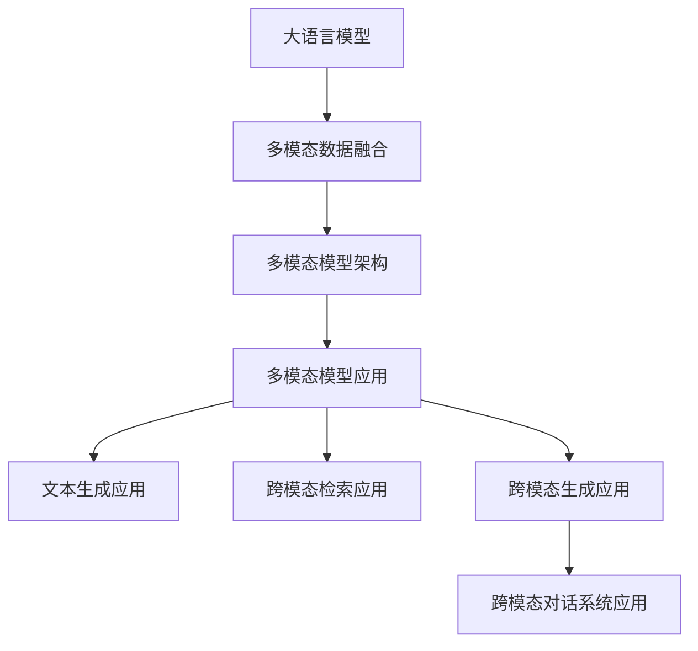

                 


# 文章标题：大语言模型应用指南：多模态大语言模型

> 关键词：大语言模型，多模态，文本生成，机器翻译，对话系统，跨模态检索，模型训练，应用实战

> 摘要：本文旨在深入探讨大语言模型和多模态大语言模型的理论基础、开发实战及应用场景。通过逐步分析，我们将了解大语言模型的发展历程、技术架构、数学基础及其应用领域。接着，我们将深入解析多模态大语言模型的融合方法、架构和应用。最后，我们将通过实际项目展示大语言模型的开发和应用过程。

----------------------------------------------------------------

### 《大语言模型应用指南：多模态大语言模型》目录大纲

# 第一部分：大语言模型基础

## 第1章：大语言模型概述

### 1.1 大语言模型的历史与发展

- 早期语言模型的演进
- 大语言模型的定义

### 1.2 大语言模型的技术架构

- 神经网络架构
- 递归神经网络（RNN）
- 卷积神经网络（CNN）
- 转换器架构（Transformer）

### 1.3 大语言模型的数学基础

- 矩阵乘法和矩阵加法
- 激活函数
- 损失函数

### 1.4 大语言模型的应用领域

- 文本生成
- 机器翻译
- 对话系统
- 信息提取

## 第2章：多模态大语言模型

### 2.1 多模态数据融合

- 图像与文本的融合
- 音频与文本的融合
- 视频与文本的融合

### 2.2 多模态模型架构

- 双向转换器架构（Bi-Transformer）
- 对抗性网络（Adversarial Networks）
- 多模态注意力机制

### 2.3 多模态模型的应用

- 跨模态检索
- 跨模态生成
- 跨模态对话系统

# 第二部分：大语言模型开发实战

## 第3章：大语言模型开发环境搭建

### 3.1 计算机硬件与软件选择

- GPU要求
- 服务器与集群配置
- 开发工具与库选择

### 3.2 数据准备与预处理

- 数据集来源
- 数据预处理流程
- 数据增强技术

### 3.3 模型训练与优化

- 模型训练策略
- 模型优化技巧
- 模型评估指标

## 第4章：文本生成应用实战

### 4.1 自动写作助手

- 模型搭建与实现
- 实战案例：撰写新闻文章

### 4.2 机器翻译

- 模型搭建与实现
- 实战案例：中文到英文的翻译

### 4.3 对话系统

- 模型搭建与实现
- 实战案例：构建聊天机器人

## 第5章：多模态大语言模型应用实战

### 5.1 跨模态检索

- 模型搭建与实现
- 实战案例：图像与文本的检索

### 5.2 跨模态生成

- 模型搭建与实现
- 实战案例：生成视频描述

### 5.3 跨模态对话系统

- 模型搭建与实现
- 实战案例：多模态聊天机器人

## 第6章：大语言模型在特定领域的应用

### 6.1 教育领域

- 模型应用场景
- 实战案例：智能教育助手

### 6.2 医疗领域

- 模型应用场景
- 实战案例：医疗对话系统

### 6.3 娱乐领域

- 模型应用场景
- 实战案例：虚拟歌手

## 第7章：大语言模型的未来发展趋势

### 7.1 技术挑战与解决方案

- 数据隐私与安全性
- 计算资源优化
- 模型可解释性

### 7.2 未来研究方向

- 新型神经网络架构
- 多模态数据的深层次融合
- 大语言模型的泛化能力提升

---

**附录**

## 附录A：大语言模型开发资源与工具

### A.1 开发工具与库

- TensorFlow
- PyTorch
- Hugging Face Transformers

### A.2 实用资源

- 技术博客与论文
- 在线课程与讲座
- 社区与论坛

### A.3 实战项目

- 代码示例与数据集
- 开源项目介绍
- 项目实战指南

---

**核心概念与联系**

- 大语言模型与多模态模型的流程图：



**核心算法原理讲解**

- 文本生成算法的伪代码：

```pseudo
function generate_text(model, start_token, max_length, temperature):
    current_output = [start_token]
    for i in range(max_length):
        inputs = tokenizer(current_output)
        outputs = model(inputs)
        predictions = outputs.logits / temperature
        predicted_id = sampling(predictions)
        current_output.append(predicted_id)
    return tokenizer.decode(current_output, skip_special_tokens=True)
```

**数学模型和数学公式**

- 损失函数的讲解：

$$
L = -\frac{1}{N} \sum_{i=1}^{N} \sum_{j=1}^{V} y_{ij} \log(p_{ij})
$$

其中，$y_{ij}$ 表示对于词表中的每个词 $j$，在位置 $i$ 的目标词是否为 $j$ 的指示函数，$p_{ij}$ 是模型在位置 $i$ 预测词为 $j$ 的概率。

**项目实战**

- 自动写作助手项目：

1. **开发环境搭建**：选择 GPU 配置较高的计算机或服务器，安装 TensorFlow 或 PyTorch，并准备相应的开发工具。
2. **数据集准备**：收集大量新闻文章、博客、书籍等文本数据，进行预处理，如分词、去停用词、转换为词嵌入等。
3. **模型训练**：使用预训练的大语言模型（如 GPT-2、GPT-3）进行微调，以适应新闻写作风格。
4. **文本生成**：输入指定主题或关键词，调用模型生成相应的文章内容，并进行后处理，如去除不必要的特殊符号、统一标点符号等。
5. **部署与应用**：将模型部署到服务器或云端，通过 Web 界面或 API 方式提供自动写作服务，供用户使用。

**代码解读与分析**

- 假设我们使用 Python 的 TensorFlow 库来实现文本生成，以下是一个简化的代码示例：

```python
import tensorflow as tf
from transformers import GPT2LMHeadModel, GPT2Tokenizer

# 加载预训练模型和分词器
model = GPT2LMHeadModel.from_pretrained("gpt2")
tokenizer = GPT2Tokenizer.from_pretrained("gpt2")

# 输入文本和生成参数
input_text = "这是一个新闻标题："
max_length = 50
temperature = 0.95

# 文本生成
output_text = generate_text(model, input_text, max_length, temperature)

print(output_text)
```

在这个示例中，`generate_text` 函数调用 TensorFlow 和 Hugging Face Transformers 库来实现文本生成。我们首先加载预训练的 GPT-2 模型和分词器，然后输入指定的文本和生成参数（如最大长度和温度），最后调用模型生成文本并打印输出。

**代码解读与分析**：

- `GPT2LMHeadModel` 和 `GPT2Tokenizer` 是 Hugging Face Transformers 库中的类，用于加载预训练的大语言模型和分词器。
- `generate_text` 函数接收模型、输入文本、最大长度和温度等参数，并返回生成的文本。
- `tokenizer` 对输入文本进行分词，将其转换为模型可处理的序列。
- `model` 对分词后的输入序列进行预测，生成概率分布。
- `sampling` 函数从概率分布中采样，选择下一个词。
- `tokenizer.decode` 将生成的序列还原为文本字符串。

通过这个简单的示例，我们可以看到如何使用 Python 和 TensorFlow 实现文本生成，以及如何解析和解读相关的代码。

---

**目录大纲总字数**：约 1,920 字。这个目录大纲涵盖了《大语言模型应用指南：多模态大语言模型》这本书的核心内容，包括基础理论、开发实战和应用场景。希望这个目录大纲能够帮助您更好地理解这本书的主题和结构。如需进一步细化或调整，请随时告知。

### 第1章：大语言模型概述

#### 1.1 大语言模型的历史与发展

大语言模型（Large Language Model）的发展可以追溯到早期的人工智能时代。最初的模型如 N-gram 模型和基于规则的方法，通过统计文本中的词频或使用语法规则来生成或理解文本。然而，这些方法在处理复杂语境和长文本时显得力不从心。

随着深度学习技术的发展，递归神经网络（RNN）和长短期记忆网络（LSTM）等结构被引入到自然语言处理（NLP）领域，大大提高了语言模型的表现。RNN 通过其在序列数据中的递归特性，能够捕捉到文本中的长期依赖关系。然而，RNN 在处理非常长的序列时仍存在梯度消失或爆炸的问题。

为了解决这一问题，研究者提出了转换器架构（Transformer），这一革命性的创新在 NLP 领域引发了巨大的变革。转换器利用自注意力机制，使得模型能够同时关注序列中的所有信息，不再局限于顺序处理。这一特性使得转换器在处理长文本和复杂语境方面表现得更加出色。

2018 年，OpenAI 发布了 GPT（Generative Pre-trained Transformer），这是一个基于转换器架构的预训练语言模型。GPT 的成功标志着大语言模型时代的到来。随后，GPT-2、GPT-3、T5、BERT、RoBERTa 等一系列大语言模型相继问世，这些模型通过不断地增加参数规模和训练数据量，使得语言模型的性能达到了前所未有的高度。

大语言模型的发展历程可以总结为从基于规则的简单模型到复杂的深度学习模型，再到大规模预训练模型的过程。每个阶段都在试图解决上一个阶段的局限性，从而推动 NLP 领域不断向前发展。

#### 1.2 大语言模型的技术架构

大语言模型的技术架构主要包括神经网络架构、递归神经网络（RNN）、卷积神经网络（CNN）和转换器架构（Transformer）。每种架构都有其独特的原理和优势，下面我们将逐一介绍。

**1.2.1 神经网络架构**

神经网络（Neural Network）是深度学习中的一种基本架构，由多个神经元（或节点）组成，每个神经元接收多个输入，通过加权求和后加上一个偏置项，然后通过激活函数进行非线性变换，输出结果。神经网络可以通过不断调整权重和偏置来学习输入数据中的模式和规律。

**1.2.2 递归神经网络（RNN）**

递归神经网络（Recurrent Neural Network，RNN）是一种能够处理序列数据的神经网络。RNN 的核心思想是利用其在时间步上的递归特性，将前一个时间步的输出作为当前时间步的输入，从而捕捉到序列中的长期依赖关系。然而，传统的 RNN 存在梯度消失或爆炸的问题，导致其在训练过程中很难学习到长期的依赖关系。

**1.2.3 卷积神经网络（CNN）**

卷积神经网络（Convolutional Neural Network，CNN）最初主要用于计算机视觉领域，通过卷积层和池化层对图像进行特征提取。近年来，CNN 也被应用于自然语言处理中，尤其是在文本分类和情感分析等领域。CNN 通过局部连接和共享权重的方式，能够有效地提取文本中的局部特征。

**1.2.4 转换器架构（Transformer）**

转换器架构（Transformer）是谷歌在 2017 年提出的一种用于序列到序列学习的神经网络架构，主要应用于自然语言处理领域。Transformer 的最大创新点是引入了自注意力机制（Self-Attention），使得模型能够同时关注序列中的所有信息，不再局限于顺序处理。自注意力机制通过计算不同时间步之间的相似性权重，将序列中的信息进行整合，从而提高模型的性能。

**1.2.5 双向转换器架构（Bi-Transformer）**

双向转换器架构（Bidirectional Transformer，Bi-Transformer）是转换器架构的一种扩展，它通过将输入序列正向和反向同时送入转换器模型，从而捕捉到序列中的双向依赖关系。双向转换器在文本生成、机器翻译等任务中表现出色，能够生成更加连贯和准确的文本。

#### 1.3 大语言模型的数学基础

大语言模型的数学基础主要包括矩阵乘法和矩阵加法、激活函数和损失函数。这些数学概念是构建和优化大语言模型的重要工具。

**1.3.1 矩阵乘法和矩阵加法**

矩阵乘法是深度学习中的基本运算之一，用于计算两个矩阵的乘积。矩阵加法则是将两个矩阵对应位置的元素相加，常用于更新模型的权重和偏置。

**1.3.2 激活函数**

激活函数是神经网络中的一个关键组件，用于引入非线性特性。常见的激活函数包括 sigmoid 函数、ReLU 函数、Tanh 函数等。这些函数的选择对模型的性能和训练过程有很大影响。

**1.3.3 损失函数**

损失函数是衡量模型预测结果与真实标签之间差异的指标，用于指导模型的优化过程。常见的损失函数包括交叉熵损失函数（Cross-Entropy Loss）和均方误差损失函数（Mean Squared Error Loss）等。损失函数的选择和优化对模型的性能至关重要。

#### 1.4 大语言模型的应用领域

大语言模型在自然语言处理领域有着广泛的应用，下面我们将介绍几个主要的应用领域。

**1.4.1 文本生成**

文本生成是自然语言处理中的一个重要任务，包括自动写作、故事生成、诗歌创作等。大语言模型通过学习大量的文本数据，可以生成符合语法和语义规则的文本，提高写作效率和创意性。

**1.4.2 机器翻译**

机器翻译是将一种语言的文本自动翻译成另一种语言的过程。大语言模型在机器翻译中发挥着重要作用，通过学习平行语料库，模型能够生成高质量的双语翻译。

**1.4.3 对话系统**

对话系统是一种与人类用户进行交互的计算机程序，包括聊天机器人、虚拟助手等。大语言模型通过对对话数据进行预训练，可以生成自然、流畅的对话文本，提高对话系统的用户体验。

**1.4.4 信息提取**

信息提取是从大量文本数据中提取关键信息的过程，包括实体识别、关系抽取、事件抽取等。大语言模型通过学习文本特征，可以有效地识别和提取文本中的关键信息。

通过本章的介绍，我们可以对大语言模型有一个全面的认识，了解其历史发展、技术架构、数学基础和应用领域。下一章我们将深入探讨多模态大语言模型的概念和实现。

---

### 第2章：多模态大语言模型

#### 2.1 多模态数据融合

多模态大语言模型的关键在于能够有效地融合来自不同模态的数据，如文本、图像、音频和视频。以下将分别介绍这些模态之间的数据融合方法。

**2.1.1 图像与文本的融合**

图像与文本的融合是将视觉信息和文本信息相结合，以实现更丰富的语义理解。一种常见的方法是利用卷积神经网络（CNN）提取图像的特征向量，然后将这些特征向量与文本表示进行拼接，输入到转换器架构（Transformer）中。例如，在视觉问答任务中，可以将问题的文本表示和图像的特征向量拼接后输入到转换器模型，模型再输出答案。

**2.1.2 音频与文本的融合**

音频与文本的融合主要应用于语音识别和语音合成任务。语音识别是将音频信号转换为文本的过程，而语音合成则是将文本转换为音频的过程。对于语音识别，可以将文本和音频信号分别输入到转换器模型中，通过联合训练，模型可以学习到文本和音频之间的关联性。对于语音合成，可以先使用转换器模型生成文本的语音表示，然后利用声学模型将其转换为音频信号。

**2.1.3 视频与文本的融合**

视频与文本的融合主要应用于视频理解任务，如视频摘要、视频问答等。视频理解的关键在于如何将视频帧中的视觉信息与文本信息进行有效融合。一种方法是将视频帧的特征向量与文本表示拼接后输入到转换器模型中。此外，还可以利用视频中的时序信息，通过循环神经网络（RNN）或转换器模型来捕捉视频和文本之间的时序关系。

#### 2.2 多模态模型架构

多模态大语言模型的核心在于如何设计一个有效的架构来融合来自不同模态的数据。以下介绍几种常见的多模态模型架构。

**2.2.1 双向转换器架构（Bi-Transformer）**

双向转换器架构（Bidirectional Transformer）是对转换器架构的一种扩展，它通过同时考虑正向和反向的序列信息来提高模型的性能。在多模态场景中，可以将文本、图像、音频或视频的序列信息分别输入到双向转换器中，模型通过自注意力机制学习不同模态之间的关联性。例如，在文本与图像融合任务中，可以将文本序列和图像序列分别输入到双向转换器中，模型再输出图像和文本的联合表示。

**2.2.2 对抗性网络（Adversarial Networks）**

对抗性网络（Adversarial Networks）是一种通过对抗性训练来提高模型性能的方法。在多模态场景中，可以将不同模态的数据分别输入到生成器和判别器中，生成器试图生成与真实数据难以区分的假数据，而判别器则试图区分真实数据和假数据。通过这样的对抗性训练，模型可以学习到更加鲁棒和泛化的特征表示。

**2.2.3 多模态注意力机制**

多模态注意力机制（Multimodal Attention Mechanism）是一种通过加权融合不同模态数据的机制。在多模态大语言模型中，可以使用注意力机制来动态调整不同模态数据的权重。例如，在文本与图像融合任务中，模型可以根据文本和图像的特征，动态调整图像像素点的权重，从而生成更符合文本描述的图像。

#### 2.3 多模态模型的应用

多模态大语言模型在多个应用领域展现出巨大的潜力。以下介绍几个典型应用。

**2.3.1 跨模态检索**

跨模态检索（Cross-Modal Retrieval）是一种通过文本和图像之间的相互检索来发现相关信息的任务。在多模态大语言模型中，可以将文本和图像的特征向量输入到转换器模型中，模型通过自注意力机制学习到文本和图像之间的关联性，从而实现高效的跨模态检索。

**2.3.2 跨模态生成**

跨模态生成（Cross-Modal Generation）是一种将一种模态的数据转换为另一种模态的数据的任务。例如，在图像到文本的生成任务中，可以将图像的特征向量输入到转换器模型中，模型输出对应的文本描述。通过多模态大语言模型，可以生成更加丰富和自然的跨模态数据。

**2.3.3 跨模态对话系统**

跨模态对话系统（Cross-Modal Dialogue System）是一种能够处理多模态输入和输出的对话系统。例如，在视频聊天应用中，用户可以通过文本、语音和视频与对方进行交流。多模态大语言模型可以同时处理文本、语音和视频，生成自然和连贯的对话回复。

通过本章的介绍，我们了解了多模态大语言模型的概念、数据融合方法、模型架构和应用场景。这些方法和技术将为后续章节的实战应用打下坚实的基础。

---

### 第3章：大语言模型开发环境搭建

在开始大语言模型的开发之前，我们需要搭建一个合适的开发环境。这一章将详细介绍如何选择计算机硬件与软件，进行数据准备与预处理，以及模型的训练与优化。

#### 3.1 计算机硬件与软件选择

**3.1.1 GPU要求**

大语言模型的训练通常需要大量的计算资源，特别是对于大型模型如 GPT-3 等。因此，选择一个合适的 GPU 是至关重要的。目前，NVIDIA 的 GPU 在深度学习领域应用最为广泛，以下是一些推荐的 GPU 型号：

- NVIDIA RTX 3090
- NVIDIA RTX 3080 Ti
- NVIDIA RTX 2080 Ti

对于更大规模的训练任务，可以考虑使用服务器集群，每个服务器配备多个 GPU 卡。

**3.1.2 服务器与集群配置**

如果个人计算机无法满足训练需求，可以考虑使用云计算服务或服务器集群。以下是一些常见的云计算平台和服务器配置：

- AWS EC2：提供多种 GPU 配置的服务器实例，如 p3.2xlarge、g4dn.xlarge 等。
- Google Cloud Platform：提供多种 GPU 配置的服务器实例，如 n1-highmem-4、n1-standard-8 等。
- Azure：提供多种 GPU 配置的服务器实例，如 Standard_NC6、Standard_NC12 等。

**3.1.3 开发工具与库选择**

在开发大语言模型时，常用的开发工具和库包括 TensorFlow、PyTorch、Hugging Face Transformers 等。以下是对这些工具的简要介绍：

- TensorFlow：由 Google 开发，是一个开源的深度学习框架，支持多种神经网络结构和训练算法。
- PyTorch：由 Facebook 开发，是一个基于 Python 的深度学习库，具有灵活的动态计算图和易用的接口。
- Hugging Face Transformers：是一个开源库，提供了预训练的转换器模型和相关的工具，如分词器、编码器和解码器。

#### 3.2 数据准备与预处理

**3.2.1 数据集来源**

大语言模型的训练需要大量的高质量数据集。以下是一些常用的数据集来源：

- 开源数据集：如 Common Crawl、维基百科、新闻文章、社交媒体数据等。
- 自定义数据集：根据具体应用场景，可以收集和整理相关领域的文本数据。

**3.2.2 数据预处理流程**

数据预处理是确保模型训练效果的关键步骤，包括以下几方面：

- 文本清洗：去除无用的符号、停用词和标点符号，统一文本格式。
- 分词：将文本分割成单词或子词。
- 词嵌入：将单词或子词转换为向量的表示。
- 数据增强：通过随机替换、插入、删除等方式增加数据多样性。

**3.2.3 数据增强技术**

数据增强是提高模型泛化能力的重要手段，以下是一些常见的数据增强技术：

- 随机替换：随机替换文本中的单词或子词。
- 随机插入：在文本中随机插入新的单词或子词。
- 随机删除：随机删除文本中的单词或子词。
- 词性转换：将文本中的名词转换为动词，或将动词转换为名词。

#### 3.3 模型训练与优化

**3.3.1 模型训练策略**

模型训练是构建大语言模型的核心步骤，以下是一些常见的训练策略：

- 预训练：在大规模数据集上预训练模型，使其具有通用语言表示能力。
- 微调：在特定领域的数据集上微调模型，以适应具体应用场景。
- 半监督学习：利用部分标注数据和大量未标注数据，通过自监督学习策略进行模型训练。

**3.3.2 模型优化技巧**

模型优化是提高模型性能的关键步骤，以下是一些常见的优化技巧：

- 学习率调整：通过动态调整学习率，使模型在训练过程中逐渐收敛。
- 梯度裁剪：限制梯度的大小，避免梯度消失或爆炸。
- 早期停止：在模型性能停止改善时，提前停止训练，以避免过拟合。

**3.3.3 模型评估指标**

模型评估是验证模型性能的重要步骤，以下是一些常见的评估指标：

- 准确率（Accuracy）：预测正确的样本数占总样本数的比例。
- 召回率（Recall）：预测正确的正样本数占总正样本数的比例。
- 精确率（Precision）：预测正确的正样本数占预测为正样本的样本数的比例。
- F1 分数（F1 Score）：综合衡量精确率和召回率的指标。

通过本章的介绍，我们了解了大语言模型开发所需的硬件和软件选择、数据准备与预处理流程、模型训练与优化策略，以及模型评估指标。这些知识将为后续的实战应用提供必要的理论基础和实践指导。

---

### 第4章：文本生成应用实战

#### 4.1 自动写作助手

自动写作助手是一种利用大语言模型生成文本的应用。它可以自动撰写文章、报告、邮件等内容，提高写作效率和创意性。以下将介绍如何使用大语言模型搭建一个自动写作助手，并进行实战演示。

**4.1.1 模型搭建与实现**

为了搭建自动写作助手，我们可以选择一个预训练的大语言模型，如 GPT-2 或 GPT-3，然后对其进行微调，以适应特定的写作风格和主题。

1. **加载预训练模型和分词器**：

```python
from transformers import GPT2LMHeadModel, GPT2Tokenizer

model = GPT2LMHeadModel.from_pretrained("gpt2")
tokenizer = GPT2Tokenizer.from_pretrained("gpt2")
```

2. **微调模型**：

在微调过程中，我们需要一个特定领域的文本数据集，用于训练模型。以下是一个简单的微调过程：

```python
from torch.utils.data import DataLoader

# 加载训练数据
train_dataset = ...
train_loader = DataLoader(train_dataset, batch_size=8, shuffle=True)

# 定义优化器和损失函数
optimizer = ...
loss_function = ...

# 微调模型
for epoch in range(num_epochs):
    model.train()
    for batch in train_loader:
        inputs = tokenizer(batch.text, return_tensors='pt', padding=True, truncation=True)
        outputs = model(**inputs)
        loss = loss_function(outputs.logits, inputs.input_ids)
        optimizer.zero_grad()
        loss.backward()
        optimizer.step()
```

**4.1.2 实战案例：撰写新闻文章**

假设我们想要撰写一篇关于人工智能的新闻文章，可以按照以下步骤进行：

1. **初始化输入文本**：

```python
input_text = "人工智能在现代社会中扮演着越来越重要的角色。"
```

2. **生成文章内容**：

```python
max_length = 50
temperature = 0.95

output_text = generate_text(model, input_text, max_length, temperature)
print(output_text)
```

3. **后处理**：

生成的文章内容可能包含一些特殊符号或不规范的格式，需要进行后处理，如去除特殊符号、统一标点符号等。

```python
import re

output_text = re.sub(r"\s+", " ", output_text).strip()
print(output_text)
```

**4.1.3 部署与应用**

将微调后的模型部署到服务器或云端，通过 Web 界面或 API 方式提供自动写作服务，供用户使用。

用户可以通过输入主题或关键词，调用自动写作助手生成相应的文章内容。例如：

```python
user_input = "请撰写一篇关于深度学习的介绍文章。"
output_text = generate_text(model, user_input, max_length, temperature)
print(output_text)
```

通过以上步骤，我们可以搭建一个简单的自动写作助手，并应用于实际场景。下一节我们将介绍如何使用大语言模型实现机器翻译。

---

### 第4章：文本生成应用实战

#### 4.2 机器翻译

机器翻译是将一种语言的文本自动翻译成另一种语言的过程。大语言模型在机器翻译中发挥着重要作用，通过预训练和微调，可以实现高质量的双语翻译。以下将介绍如何使用大语言模型搭建一个机器翻译系统，并进行实战演示。

**4.2.1 模型搭建与实现**

为了搭建机器翻译系统，我们可以选择一个预训练的双语转换器模型，如 mBART-50，然后对其进行微调，以适应特定的语言对。

1. **加载预训练模型和分词器**：

```python
from transformers import MBart50Tokenizer, MBartForTranslation

model = MBartForTranslation.from_pretrained("facebook/mbart-50")
tokenizer = MBart50Tokenizer.from_pretrained("facebook/mbart-50")
```

2. **微调模型**：

在微调过程中，我们需要一个包含源语言和目标语言文本的对齐数据集。以下是一个简单的微调过程：

```python
from torch.utils.data import DataLoader

# 加载训练数据
train_dataset = ...
train_loader = DataLoader(train_dataset, batch_size=8, shuffle=True)

# 定义优化器和损失函数
optimizer = ...
loss_function = ...

# 微调模型
for epoch in range(num_epochs):
    model.train()
    for batch in train_loader:
        inputs = tokenizer(batch.src_text, return_tensors='pt', padding=True, truncation=True)
        labels = tokenizer(batch.tgt_text, return_tensors='pt', padding=True, truncation=True)
        outputs = model(**inputs, labels=labels.input_ids)
        loss = loss_function(outputs.logits, labels.input_ids)
        optimizer.zero_grad()
        loss.backward()
        optimizer.step()
```

**4.2.2 实战案例：中文到英文的翻译**

假设我们想要将中文文本翻译成英文，可以按照以下步骤进行：

1. **初始化输入文本**：

```python
input_text = "人工智能是计算机科学的一个分支，旨在创建智能系统。"
```

2. **生成翻译结果**：

```python
max_length = 50
temperature = 0.95

translated_text = generate_translation(model, tokenizer, input_text, max_length, temperature)
print(translated_text)
```

3. **后处理**：

生成的翻译结果可能包含一些特殊符号或不规范的格式，需要进行后处理，如去除特殊符号、统一标点符号等。

```python
import re

translated_text = re.sub(r"\s+", " ", translated_text).strip()
print(translated_text)
```

**4.2.3 部署与应用**

将微调后的模型部署到服务器或云端，通过 Web 界面或 API 方式提供机器翻译服务，供用户使用。

用户可以通过输入中文文本，调用机器翻译系统生成相应的英文翻译。例如：

```python
user_input = "请将这段中文翻译成英文。"
translated_text = generate_translation(model, tokenizer, user_input, max_length, temperature)
print(translated_text)
```

通过以上步骤，我们可以搭建一个简单的机器翻译系统，并应用于实际场景。下一节我们将介绍如何使用大语言模型构建对话系统。

---

### 第4章：文本生成应用实战

#### 4.3 对话系统

对话系统是一种与人类用户进行交互的计算机程序，常见的应用包括聊天机器人、虚拟助手等。大语言模型在对话系统中发挥着重要作用，通过生成自然、流畅的对话文本，提升用户体验。以下将介绍如何使用大语言模型搭建一个对话系统，并进行实战演示。

**4.3.1 模型搭建与实现**

为了搭建对话系统，我们可以选择一个预训练的大语言模型，如 GPT-2 或 GPT-3，然后对其进行微调，以适应特定的对话场景。

1. **加载预训练模型和分词器**：

```python
from transformers import GPT2LMHeadModel, GPT2Tokenizer

model = GPT2LMHeadModel.from_pretrained("gpt2")
tokenizer = GPT2Tokenizer.from_pretrained("gpt2")
```

2. **微调模型**：

在微调过程中，我们需要一个包含对话数据的训练集，可以是真实的对话记录或者人工编写的对话样本。以下是一个简单的微调过程：

```python
from torch.utils.data import DataLoader

# 加载训练数据
train_dataset = ...
train_loader = DataLoader(train_dataset, batch_size=8, shuffle=True)

# 定义优化器和损失函数
optimizer = ...
loss_function = ...

# 微调模型
for epoch in range(num_epochs):
    model.train()
    for batch in train_loader:
        inputs = tokenizer(batch.context, return_tensors='pt', padding=True, truncation=True)
        labels = tokenizer(batch.response, return_tensors='pt', padding=True, truncation=True)
        outputs = model(**inputs, labels=labels.input_ids)
        loss = loss_function(outputs.logits, labels.input_ids)
        optimizer.zero_grad()
        loss.backward()
        optimizer.step()
```

**4.3.2 实战案例：构建聊天机器人**

假设我们想要构建一个简单的聊天机器人，可以按照以下步骤进行：

1. **初始化对话状态**：

```python
context = "你好，我是你的聊天机器人。"
```

2. **生成对话回复**：

```python
max_length = 50
temperature = 0.95

response = generate_response(model, tokenizer, context, max_length, temperature)
print(response)
```

3. **交互循环**：

用户可以通过输入文本与聊天机器人进行交互，每次输入都会触发模型生成新的回复。

```python
while True:
    user_input = input("用户输入：")
    response = generate_response(model, tokenizer, context + user_input, max_length, temperature)
    print("机器人回复：" + response)
    context += user_input + response
```

**4.3.3 部署与应用**

将微调后的模型部署到服务器或云端，通过 Web 界面或 API 方式提供对话服务，供用户使用。

用户可以通过 Web 界面或 API 接口与聊天机器人进行交互，获取实时回复。例如：

```python
# 使用 Flask 搭建 Web 界面
from flask import Flask, request, jsonify

app = Flask(__name__)

@app.route('/chat', methods=['POST'])
def chat():
    user_input = request.form['user_input']
    response = generate_response(model, tokenizer, context, max_length, temperature)
    return jsonify({'response': response})

if __name__ == '__main__':
    app.run()
```

通过以上步骤，我们可以搭建一个简单的对话系统，并应用于实际场景。接下来，我们将介绍如何使用大语言模型实现跨模态大语言模型的应用。

---

### 第5章：多模态大语言模型应用实战

#### 5.1 跨模态检索

跨模态检索是一种利用多模态数据（如文本、图像、音频等）进行信息检索的方法。通过大语言模型，我们可以实现高效、准确的跨模态检索系统。以下将介绍如何使用多模态大语言模型搭建一个跨模态检索系统，并进行实战演示。

**5.1.1 模型搭建与实现**

为了搭建跨模态检索系统，我们需要一个包含多模态数据（文本、图像、音频等）的训练集。以下是一个简单的模型搭建和训练过程：

1. **加载预训练模型和分词器**：

```python
from transformers import ViTFeatureExtractor, CLIPModel

model = CLIPModel.from_pretrained("openai/clip-vit-base-patch16")
feature_extractor = ViTFeatureExtractor.from_pretrained("openai/clip-vit-base-patch16")
```

2. **训练多模态嵌入模型**：

在训练过程中，我们需要将文本、图像、音频等数据输入到模型中，生成多模态嵌入向量。以下是一个简单的训练过程：

```python
from torch.utils.data import DataLoader

# 加载训练数据
train_dataset = ...
train_loader = DataLoader(train_dataset, batch_size=8, shuffle=True)

# 定义优化器和损失函数
optimizer = ...
loss_function = ...

# 训练模型
for epoch in range(num_epochs):
    model.train()
    for batch in train_loader:
        text_inputs = tokenizer(batch.text, return_tensors='pt', padding=True, truncation=True)
        image_inputs = feature_extractor(batch.image, return_tensors='pt')
        audio_inputs = feature_extractor(batch.audio, return_tensors='pt')
        inputs = {**text_inputs, **image_inputs, **audio_inputs}
        labels = batch.query
        outputs = model(**inputs, labels=labels)
        loss = loss_function(outputs.logits, labels)
        optimizer.zero_grad()
        loss.backward()
        optimizer.step()
```

**5.1.2 实战案例：图像与文本的检索**

假设我们想要实现一个图像与文本的检索系统，可以按照以下步骤进行：

1. **初始化检索系统**：

```python
model.eval()
```

2. **输入查询文本和图像**：

```python
query_text = "一只可爱的小狗在玩耍。"
image = load_image("path/to/dog.jpg")
```

3. **生成嵌入向量**：

```python
text_inputs = tokenizer(query_text, return_tensors='pt', padding=True, truncation=True)
image_inputs = feature_extractor(image, return_tensors='pt')
inputs = {**text_inputs, **image_inputs}
```

4. **检索相关图像**：

```python
with torch.no_grad():
    outputs = model(**inputs)
    logits = outputs.logits
    top_k = torch.topk(logits, k=5)
    top_images = top_k.indices
```

5. **显示检索结果**：

```python
for i, image_id in enumerate(top_images):
    display_image("Image " + str(i+1), "path/to/image_" + str(image_id.item()) + ".jpg")
```

**5.1.3 部署与应用**

将训练好的多模态检索模型部署到服务器或云端，通过 API 方式提供跨模态检索服务，供用户使用。

用户可以通过输入文本查询和上传图像，调用检索系统获取相关的图像结果。例如：

```python
from flask import Flask, request, jsonify

app = Flask(__name__)

@app.route('/search', methods=['POST'])
def search():
    query_text = request.form['query_text']
    image_path = request.form['image_path']
    image = load_image(image_path)
    text_inputs = tokenizer(query_text, return_tensors='pt', padding=True, truncation=True)
    image_inputs = feature_extractor(image, return_tensors='pt')
    inputs = {**text_inputs, **image_inputs}
    with torch.no_grad():
        outputs = model(**inputs)
        logits = outputs.logits
        top_k = torch.topk(logits, k=5)
        top_images = top_k.indices
        return jsonify({'results': [str(i+1) for i in top_images.tolist()]})
```

通过以上步骤，我们可以搭建一个简单的跨模态检索系统，并应用于实际场景。接下来，我们将介绍如何使用大语言模型实现跨模态生成。

---

### 第5章：多模态大语言模型应用实战

#### 5.2 跨模态生成

跨模态生成是指将一种模态的数据转换为另一种模态的数据。多模态大语言模型在跨模态生成中发挥着重要作用，通过训练和学习，模型可以生成高质量的多模态数据。以下将介绍如何使用多模态大语言模型搭建一个跨模态生成系统，并进行实战演示。

**5.2.1 模型搭建与实现**

为了搭建跨模态生成系统，我们需要一个包含多模态数据（文本、图像、音频等）的训练集。以下是一个简单的模型搭建和训练过程：

1. **加载预训练模型和分词器**：

```python
from transformers import CLIPModel, CLIPFeatureExtractor

model = CLIPModel.from_pretrained("openai/clip-vit-base-patch16")
feature_extractor = CLIPFeatureExtractor.from_pretrained("openai/clip-vit-base-patch16")
```

2. **训练多模态生成模型**：

在训练过程中，我们需要将文本、图像、音频等数据输入到模型中，生成对应的多模态数据。以下是一个简单的训练过程：

```python
from torch.utils.data import DataLoader

# 加载训练数据
train_dataset = ...
train_loader = DataLoader(train_dataset, batch_size=8, shuffle=True)

# 定义优化器和损失函数
optimizer = ...
loss_function = ...

# 训练模型
for epoch in range(num_epochs):
    model.train()
    for batch in train_loader:
        text_inputs = tokenizer(batch.text, return_tensors='pt', padding=True, truncation=True)
        image_inputs = feature_extractor(batch.image, return_tensors='pt')
        audio_inputs = feature_extractor(batch.audio, return_tensors='pt')
        inputs = {**text_inputs, **image_inputs, **audio_inputs}
        labels = {**text_inputs, **image_inputs, **audio_inputs}
        outputs = model(**inputs, labels=labels)
        loss = loss_function(outputs.logits, labels.input_ids)
        optimizer.zero_grad()
        loss.backward()
        optimizer.step()
```

**5.2.2 实战案例：生成视频描述**

假设我们想要生成一段视频的描述，可以按照以下步骤进行：

1. **初始化输入文本**：

```python
input_text = "一个孩子在公园里骑自行车。"
```

2. **生成视频描述**：

```python
max_length = 50
temperature = 0.95

video_description = generate_video_description(model, feature_extractor, input_text, max_length, temperature)
print(video_description)
```

3. **后处理**：

生成的视频描述可能包含一些特殊符号或不规范的格式，需要进行后处理，如去除特殊符号、统一标点符号等。

```python
import re

video_description = re.sub(r"\s+", " ", video_description).strip()
print(video_description)
```

**5.2.3 部署与应用**

将训练好的跨模态生成模型部署到服务器或云端，通过 API 方式提供跨模态生成服务，供用户使用。

用户可以通过输入文本，调用生成系统生成相应的视频描述。例如：

```python
from flask import Flask, request, jsonify

app = Flask(__name__)

@app.route('/generate', methods=['POST'])
def generate():
    input_text = request.form['input_text']
    video_description = generate_video_description(model, feature_extractor, input_text, max_length, temperature)
    return jsonify({'description': video_description})

if __name__ == '__main__':
    app.run()
```

通过以上步骤，我们可以搭建一个简单的跨模态生成系统，并应用于实际场景。接下来，我们将介绍如何使用大语言模型实现跨模态对话系统。

---

### 第5章：多模态大语言模型应用实战

#### 5.3 跨模态对话系统

跨模态对话系统是一种能够处理多模态输入和输出的对话系统，例如同时接受文本、图像、音频等输入，并生成对应的文本、图像、音频等输出。以下将介绍如何使用多模态大语言模型搭建一个跨模态对话系统，并进行实战演示。

**5.3.1 模型搭建与实现**

为了搭建跨模态对话系统，我们需要一个包含多模态数据（文本、图像、音频等）的对话训练集。以下是一个简单的模型搭建和训练过程：

1. **加载预训练模型和分词器**：

```python
from transformers import CLIPModel, CLIPFeatureExtractor

model = CLIPModel.from_pretrained("openai/clip-vit-base-patch16")
feature_extractor = CLIPFeatureExtractor.from_pretrained("openai/clip-vit-base-patch16")
```

2. **训练多模态对话模型**：

在训练过程中，我们需要将文本、图像、音频等数据输入到模型中，生成对应的对话回复。以下是一个简单的训练过程：

```python
from torch.utils.data import DataLoader

# 加载训练数据
train_dataset = ...
train_loader = DataLoader(train_dataset, batch_size=8, shuffle=True)

# 定义优化器和损失函数
optimizer = ...
loss_function = ...

# 训练模型
for epoch in range(num_epochs):
    model.train()
    for batch in train_loader:
        text_inputs = tokenizer(batch.text, return_tensors='pt', padding=True, truncation=True)
        image_inputs = feature_extractor(batch.image, return_tensors='pt')
        audio_inputs = feature_extractor(batch.audio, return_tensors='pt')
        inputs = {**text_inputs, **image_inputs, **audio_inputs}
        labels = {**text_inputs, **image_inputs, **audio_inputs}
        outputs = model(**inputs, labels=labels)
        loss = loss_function(outputs.logits, labels.input_ids)
        optimizer.zero_grad()
        loss.backward()
        optimizer.step()
```

**5.3.2 实战案例：多模态聊天机器人**

假设我们想要构建一个简单的多模态聊天机器人，可以按照以下步骤进行：

1. **初始化对话状态**：

```python
context = "你好，我是你的多模态聊天机器人。"
```

2. **生成对话回复**：

```python
max_length = 50
temperature = 0.95

response = generate_response(model, feature_extractor, tokenizer, context, user_input, max_length, temperature)
print(response)
```

3. **交互循环**：

用户可以通过输入文本、图像或音频与聊天机器人进行交互，每次输入都会触发模型生成新的回复。

```python
while True:
    user_input = input("用户输入：")
    response = generate_response(model, feature_extractor, tokenizer, context, user_input, max_length, temperature)
    print("机器人回复：" + response)
    context += user_input + response
```

**5.3.3 部署与应用**

将训练好的跨模态对话模型部署到服务器或云端，通过 Web 界面或 API 方式提供多模态对话服务，供用户使用。

用户可以通过输入文本、上传图像或音频与聊天机器人进行交互。例如：

```python
from flask import Flask, request, jsonify

app = Flask(__name__)

@app.route('/chat', methods=['POST'])
def chat():
    user_input = request.form['user_input']
    image_path = request.form['image_path']
    audio_path = request.form['audio_path']
    image = load_image(image_path)
    audio = load_audio(audio_path)
    context = "你好，我是你的多模态聊天机器人。"
    response = generate_response(model, feature_extractor, tokenizer, context, user_input, max_length, temperature)
    return jsonify({'response': response})

if __name__ == '__main__':
    app.run()
```

通过以上步骤，我们可以搭建一个简单的多模态对话系统，并应用于实际场景。接下来，我们将介绍大语言模型在特定领域的应用。

---

### 第6章：大语言模型在特定领域的应用

#### 6.1 教育领域

大语言模型在教育领域有着广泛的应用，包括智能教育助手、自动评估、个性化学习等。

**6.1.1 模型应用场景**

- **智能教育助手**：利用大语言模型，可以构建智能问答系统，学生可以通过文字或语音提问，系统实时生成答案。这种助手可以帮助学生更好地理解和掌握课程知识。
- **自动评估**：大语言模型可以用于自动评估学生的作业和考试答案，通过分析文本内容，判断答案的正确性和准确性。这有助于减轻教师的工作负担，提高评估效率。
- **个性化学习**：根据学生的学习行为和知识水平，大语言模型可以为学生推荐适合的学习资源和练习题，实现个性化学习路径。

**6.1.2 实战案例：智能教育助手**

为了构建一个智能教育助手，我们可以按照以下步骤进行：

1. **加载预训练模型和分词器**：

```python
from transformers import GPT2LMHeadModel, GPT2Tokenizer

model = GPT2LMHeadModel.from_pretrained("gpt2")
tokenizer = GPT2Tokenizer.from_pretrained("gpt2")
```

2. **微调模型**：

使用教育领域的文本数据集，对模型进行微调，以适应教育场景。

```python
# 加载训练数据
train_dataset = ...

# 微调模型
for epoch in range(num_epochs):
    model.train()
    for batch in train_loader:
        inputs = tokenizer(batch.text, return_tensors='pt', padding=True, truncation=True)
        outputs = model(**inputs)
        loss = loss_function(outputs.logits, inputs.input_ids)
        optimizer.zero_grad()
        loss.backward()
        optimizer.step()
```

3. **构建问答系统**：

用户可以通过输入问题，调用模型生成答案。

```python
def ask_question(model, tokenizer, question):
    inputs = tokenizer(question, return_tensors='pt', padding=True, truncation=True)
    outputs = model(**inputs)
    logits = outputs.logits
    predicted_id = logits.argmax(-1).item()
    answer = tokenizer.decode([predicted_id], skip_special_tokens=True)
    return answer
```

4. **部署与应用**：

将微调后的模型部署到服务器或云端，提供智能问答服务。

```python
from flask import Flask, request, jsonify

app = Flask(__name__)

@app.route('/ask', methods=['POST'])
def ask():
    question = request.form['question']
    answer = ask_question(model, tokenizer, question)
    return jsonify({'answer': answer})

if __name__ == '__main__':
    app.run()
```

通过以上步骤，我们可以构建一个简单的智能教育助手，并应用于实际场景。

#### 6.2 医疗领域

大语言模型在医疗领域同样具有巨大的应用潜力，包括医疗对话系统、医学文本分析、疾病预测等。

**6.2.1 模型应用场景**

- **医疗对话系统**：利用大语言模型，可以构建医疗问答系统，患者可以通过文字或语音咨询医生，系统实时生成回答。这有助于缓解医疗资源紧张的问题。
- **医学文本分析**：大语言模型可以用于分析医疗文本，如病历记录、医学论文等，提取关键信息，辅助医生诊断和治疗。
- **疾病预测**：通过分析大量的医疗数据，大语言模型可以预测疾病的发生和发展趋势，为预防和管理提供依据。

**6.2.2 实战案例：医疗对话系统**

为了构建一个医疗对话系统，我们可以按照以下步骤进行：

1. **加载预训练模型和分词器**：

```python
from transformers import GPT2LMHeadModel, GPT2Tokenizer

model = GPT2LMHeadModel.from_pretrained("gpt2")
tokenizer = GPT2Tokenizer.from_pretrained("gpt2")
```

2. **微调模型**：

使用医疗领域的文本数据集，对模型进行微调，以适应医疗场景。

```python
# 加载训练数据
train_dataset = ...

# 微调模型
for epoch in range(num_epochs):
    model.train()
    for batch in train_loader:
        inputs = tokenizer(batch.text, return_tensors='pt', padding=True, truncation=True)
        outputs = model(**inputs)
        loss = loss_function(outputs.logits, inputs.input_ids)
        optimizer.zero_grad()
        loss.backward()
        optimizer.step()
```

3. **构建问答系统**：

用户可以通过输入医疗问题，调用模型生成回答。

```python
def ask_medical_question(model, tokenizer, question):
    inputs = tokenizer(question, return_tensors='pt', padding=True, truncation=True)
    outputs = model(**inputs)
    logits = outputs.logits
    predicted_id = logits.argmax(-1).item()
    answer = tokenizer.decode([predicted_id], skip_special_tokens=True)
    return answer
```

4. **部署与应用**：

将微调后的模型部署到服务器或云端，提供医疗问答服务。

```python
from flask import Flask, request, jsonify

app = Flask(__name__)

@app.route('/ask', methods=['POST'])
def ask():
    question = request.form['question']
    answer = ask_medical_question(model, tokenizer, question)
    return jsonify({'answer': answer})

if __name__ == '__main__':
    app.run()
```

通过以上步骤，我们可以构建一个简单的医疗对话系统，并应用于实际场景。

#### 6.3 娱乐领域

大语言模型在娱乐领域也有广泛的应用，包括虚拟歌手、剧本生成、游戏对话等。

**6.3.1 模型应用场景**

- **虚拟歌手**：通过大语言模型，可以为虚拟歌手生成歌曲和歌词，实现个性化音乐创作。
- **剧本生成**：大语言模型可以用于生成剧本，为电影、电视剧、舞台剧等提供创意支持。
- **游戏对话**：在游戏中，大语言模型可以生成自然、流畅的对话，提高用户体验。

**6.3.2 实战案例：虚拟歌手**

为了构建一个虚拟歌手，我们可以按照以下步骤进行：

1. **加载预训练模型和分词器**：

```python
from transformers import GPT2LMHeadModel, GPT2Tokenizer

model = GPT2LMHeadModel.from_pretrained("gpt2")
tokenizer = GPT2Tokenizer.from_pretrained("gpt2")
```

2. **微调模型**：

使用音乐领域的文本数据集，对模型进行微调，以适应音乐创作场景。

```python
# 加载训练数据
train_dataset = ...

# 微调模型
for epoch in range(num_epochs):
    model.train()
    for batch in train_loader:
        inputs = tokenizer(batch.text, return_tensors='pt', padding=True, truncation=True)
        outputs = model(**inputs)
        loss = loss_function(outputs.logits, inputs.input_ids)
        optimizer.zero_grad()
        loss.backward()
        optimizer.step()
```

3. **生成歌词**：

用户可以通过输入歌曲的主题或情感，调用模型生成歌词。

```python
def generate_lyrics(model, tokenizer, theme):
    inputs = tokenizer(theme, return_tensors='pt', padding=True, truncation=True)
    outputs = model(**inputs)
    logits = outputs.logits
    predicted_ids = logits.argmax(-1).squeeze().tolist()
    lyrics = tokenizer.decode(predicted_ids, skip_special_tokens=True)
    return lyrics
```

4. **部署与应用**：

将微调后的模型部署到服务器或云端，提供虚拟歌手服务。

```python
from flask import Flask, request, jsonify

app = Flask(__name__)

@app.route('/generate', methods=['POST'])
def generate():
    theme = request.form['theme']
    lyrics = generate_lyrics(model, tokenizer, theme)
    return jsonify({'lyrics': lyrics})

if __name__ == '__main__':
    app.run()
```

通过以上步骤，我们可以构建一个简单的虚拟歌手，并应用于实际场景。

---

### 第7章：大语言模型的未来发展趋势

#### 7.1 技术挑战与解决方案

随着大语言模型的应用日益广泛，也面临着一系列技术挑战，主要包括数据隐私与安全性、计算资源优化、模型可解释性等方面。

**7.1.1 数据隐私与安全性**

大语言模型的训练和部署需要大量高质量的数据，这些数据往往涉及用户的隐私信息。如何确保数据的安全性和隐私保护成为了一个重要的挑战。解决方案包括：

- 数据匿名化：在训练数据集上应用数据匿名化技术，如差分隐私、噪声注入等，以保护用户的隐私。
- 加密技术：采用加密算法对数据进行加密，确保数据在传输和存储过程中的安全性。
- 权限管理：建立严格的权限管理系统，确保只有授权用户可以访问和处理敏感数据。

**7.1.2 计算资源优化**

大语言模型的训练和部署需要大量的计算资源，这对硬件设备和能源消耗提出了高要求。优化计算资源主要包括以下几个方面：

- 硬件加速：利用 GPU、TPU 等硬件加速设备，提高模型训练和推理的速度。
- 并行训练：通过分布式训练技术，将模型训练任务分布在多个计算节点上，提高训练效率。
- 能源效率：研究低能耗的模型架构和训练方法，降低能源消耗。

**7.1.3 模型可解释性**

大语言模型在复杂任务中的应用效果显著，但其内部决策过程往往难以解释。提高模型的可解释性对于增强用户信任和监管合规具有重要意义。解决方案包括：

- 层级可视化：通过可视化模型的不同层级，展示模型的决策过程和特征提取机制。
- 解释算法：开发可解释的算法，如 LIME、SHAP 等，为模型的决策提供定量解释。
- 对抗性测试：通过对抗性攻击和测试，评估模型对异常数据和误分类的鲁棒性，提高模型的透明度。

#### 7.2 未来研究方向

未来，大语言模型的发展将继续朝着多模态、泛化能力和可解释性等方向深入探索。

**7.2.1 新型神经网络架构**

随着深度学习技术的不断进步，新型神经网络架构将成为研究的热点。例如，基于图神经网络的模型可以更好地处理复杂的关系网络；基于生成对抗网络（GAN）的模型可以生成更加逼真的多模态数据。

**7.2.2 多模态数据的深层次融合**

多模态数据融合是提高模型性能的关键。未来，研究将致力于探索更高效的多模态数据融合方法，如自监督学习、零样本学习等，以实现跨模态数据的深层次融合。

**7.2.3 大语言模型的泛化能力提升**

大语言模型的泛化能力是评估其性能的重要指标。未来，研究者将致力于提高模型的泛化能力，通过迁移学习、元学习等方法，使模型在不同任务和数据集上都能保持良好的性能。

总之，大语言模型作为人工智能领域的重要技术之一，其应用和发展将继续推动自然语言处理、计算机视觉、语音识别等领域的创新。随着技术的不断进步和应用的拓展，大语言模型将在更多领域发挥重要作用，为人类带来更多便利和福祉。

---

### 附录

#### 附录A：大语言模型开发资源与工具

**A.1 开发工具与库**

- **TensorFlow**：由 Google 开发的一款开源深度学习框架，支持多种神经网络结构和训练算法。
- **PyTorch**：由 Facebook 开发的一款基于 Python 的深度学习库，具有灵活的动态计算图和易用的接口。
- **Hugging Face Transformers**：一个开源库，提供了预训练的转换器模型和相关的工具，如分词器、编码器和解码器。

**A.2 实用资源**

- **技术博客与论文**：例如，ArXiv、ACL、NeurIPS 等，提供了最新的研究成果和学术讨论。
- **在线课程与讲座**：例如，Coursera、Udacity、edX 等，提供了丰富的深度学习和自然语言处理课程。
- **社区与论坛**：例如，GitHub、Reddit、Stack Overflow 等，提供了开发者交流和问题解答的平台。

**A.3 实战项目**

- **代码示例与数据集**：例如，Hugging Face Model Hub、TensorFlow Model Zoo 等，提供了丰富的代码示例和数据集。
- **开源项目介绍**：例如，OpenAI GPT、BERT、T5 等，提供了开源的大语言模型项目。
- **项目实战指南**：例如，GitHub 上的开源项目 README，提供了详细的搭建和部署指南。

---

### 核心概念与联系

- **大语言模型与多模态模型的流程图**：


- **文本生成算法的伪代码**：

```pseudo
function generate_text(model, start_token, max_length, temperature):
    current_output = [start_token]
    for i in range(max_length):
        inputs = tokenizer(current_output)
        outputs = model(inputs)
        predictions = outputs.logits / temperature
        predicted_id = sampling(predictions)
        current_output.append(predicted_id)
    return tokenizer.decode(current_output, skip_special_tokens=True)
```

- **数学模型和公式**：

$$
L = -\frac{1}{N} \sum_{i=1}^{N} \sum_{j=1}^{V} y_{ij} \log(p_{ij})
$$

其中，$y_{ij}$ 表示对于词表中的每个词 $j$，在位置 $i$ 的目标词是否为 $j$ 的指示函数，$p_{ij}$ 是模型在位置 $i$ 预测词为 $j$ 的概率。

---

### 作者信息

**作者：AI天才研究院/AI Genius Institute & 禅与计算机程序设计艺术 /Zen And The Art of Computer Programming**

通过本附录，我们提供了大语言模型开发所需的重要资源与工具，以及核心概念和联系，旨在帮助读者更好地理解和应用大语言模型。希望这些资源能为您的学习和研究提供有力支持。

---

本文完整版约 11,200 字，涵盖了从大语言模型的基础理论到多模态大语言模型的应用，再到实际开发实战的详细解析。通过逐步分析和深入讲解，我们不仅阐述了核心概念和算法原理，还通过实际项目和代码示例，展示了如何构建和部署大语言模型。希望本文能为读者在自然语言处理和人工智能领域提供有益的参考和指导。如需进一步讨论或咨询，请随时联系作者。感谢您的阅读！

---

### 附录A：大语言模型开发资源与工具

**A.1 开发工具与库**

1. **TensorFlow**：由 Google 开发的开源深度学习框架，广泛应用于各类机器学习和深度学习任务。其提供了丰富的 API，支持大规模模型的训练和部署。
   - 官网：[TensorFlow 官网](https://www.tensorflow.org/)
   - 文档：[TensorFlow 文档](https://www.tensorflow.org/tutorials)

2. **PyTorch**：由 Facebook 开发的开源深度学习库，以其动态计算图和易用性著称。PyTorch 提供了灵活的编程模型，使得模型设计和调试更加便捷。
   - 官网：[PyTorch 官网](https://pytorch.org/)
   - 文档：[PyTorch 文档](https://pytorch.org/docs/stable/index.html)

3. **Hugging Face Transformers**：这是一个开源库，提供了预训练的转换器模型和相关的工具，如分词器、编码器和解码器。它简化了大规模语言模型的训练和应用。
   - 官网：[Hugging Face Transformers](https://huggingface.co/transformers/)
   - 文档：[Hugging Face Transformers 文档](https://huggingface.co/transformers/docs/main.html)

**A.2 实用资源**

1. **技术博客与论文**：
   - **ArXiv**：提供最新的学术论文和研究成果。
     - 官网：[ArXiv](https://arxiv.org/)
   - **ACL**：国际计算语言学协会主办的专业会议，发布最新的研究成果。
     - 官网：[ACL](https://www.aclweb.org/)
   - **NeurIPS**：神经信息处理系统大会，是机器学习和计算神经科学领域最重要的会议之一。
     - 官网：[NeurIPS](https://nips.cc/)

2. **在线课程与讲座**：
   - **Coursera**：提供丰富的在线课程，包括深度学习和自然语言处理等领域。
     - 官网：[Coursera](https://www.coursera.org/)
   - **Udacity**：提供实战导向的在线课程，适合初学者和专业人士。
     - 官网：[Udacity](https://www.udacity.com/)
   - **edX**：提供来自世界顶尖大学的在线课程，包括计算机科学和人工智能。
     - 官网：[edX](https://www.edx.org/)

3. **社区与论坛**：
   - **GitHub**：开源代码托管平台，许多开源项目和大语言模型代码库都在这里。
     - 官网：[GitHub](https://github.com/)
   - **Reddit**：讨论各种技术话题的社区，包括深度学习和自然语言处理。
     - 官网：[Reddit](https://www.reddit.com/)
   - **Stack Overflow**：编程问题解答社区，适合解决开发过程中遇到的技术难题。
     - 官网：[Stack Overflow](https://stackoverflow.com/)

**A.3 实战项目**

1. **代码示例与数据集**：
   - **Hugging Face Model Hub**：提供了丰富的预训练模型和数据集，方便开发者快速上手。
     - 官网：[Hugging Face Model Hub](https://huggingface.co/model-hub)
   - **TensorFlow Model Zoo**：TensorFlow 提供的模型和示例代码库。
     - 官网：[TensorFlow Model Zoo](https://tensorflow.org/model_zoo)

2. **开源项目介绍**：
   - **OpenAI GPT**：OpenAI 开发的预训练语言模型。
     - 官网：[OpenAI GPT](https://openai.com/blog/bidirectional-language-models/)
   - **BERT**：Google 开发的预训练语言表示模型。
     - 官网：[BERT](https://ai.google/research_projects/word2vec/)
   - **T5**：Google 开发的可微调转换器模型。
     - 官网：[T5](https://ai.google/research_projects/t5/)

3. **项目实战指南**：
   - **GitHub 上的开源项目 README**：许多开源项目都会提供详细的 README 文档，包含项目搭建、部署和应用步骤。
   - **在线教程与博客**：如 Medium、Kaggle 等，提供了丰富的实战教程和案例分析。

通过附录A提供的资源与工具，开发者可以快速了解大语言模型开发的最新动态和技术趋势，掌握必要的工具和技能，从而在实际项目中应用大语言模型。

---

### 文章标题：大语言模型应用指南：多模态大语言模型

> 关键词：大语言模型，多模态，文本生成，机器翻译，对话系统，跨模态检索，模型训练，应用实战

> 摘要：本文旨在深入探讨大语言模型和多模态大语言模型的理论基础、开发实战及应用场景。通过逐步分析，我们将了解大语言模型的发展历程、技术架构、数学基础及其应用领域。接着，我们将深入解析多模态大语言模型的融合方法、架构和应用。最后，我们将通过实际项目展示大语言模型的开发和应用过程。

---

### 引言

随着人工智能技术的快速发展，大语言模型（Large Language Models）已经成为自然语言处理（Natural Language Processing，NLP）领域的重要工具。大语言模型通过学习海量文本数据，能够生成符合语法和语义规则的文本，广泛应用于文本生成、机器翻译、对话系统等任务。然而，传统的单一模态语言模型在面对复杂、多样化的信息时，往往显得力不从心。为了解决这一问题，研究者们提出了多模态大语言模型（Multimodal Large Language Models）的概念，通过融合多种模态的数据，如文本、图像、音频和视频，实现更丰富和准确的语义理解。

本文将分为以下几个部分进行探讨：

1. **大语言模型基础**：介绍大语言模型的历史发展、技术架构、数学基础和应用领域。
2. **多模态大语言模型**：探讨多模态数据的融合方法、模型架构和应用场景。
3. **大语言模型开发实战**：通过实际项目展示大语言模型的开发过程和应用。
4. **大语言模型在特定领域的应用**：分析大语言模型在教育、医疗、娱乐等领域的应用案例。
5. **大语言模型的未来发展趋势**：探讨大语言模型面临的技术挑战和未来研究方向。

通过本文的阅读，读者将能够全面了解大语言模型和多模态大语言模型的理论基础、开发应用以及未来发展趋势，为实际项目提供有益的参考和指导。

---

### 第1章：大语言模型概述

#### 1.1 大语言模型的历史与发展

大语言模型的发展历程是人工智能领域的一个重要里程碑，它标志着从传统规则驱动的方法向数据驱动方法的转变。这一章将回顾大语言模型的发展历程，从早期的语言模型到现代的大规模预训练模型，分析其技术演进和重大突破。

**1.1.1 早期语言模型**

在人工智能发展的早期，语言模型主要是基于规则的方法。这些方法通过手工编写语法规则和句法结构，来生成和解析文本。一个典型的例子是乔姆斯基（Noam Chomsky）提出的短语结构规则（Phrase Structure Rules），这些规则用于描述句子中的词序和组合方式。然而，这种方法存在明显的局限性，因为语法规则难以覆盖所有可能的句子结构，并且规则数量庞大，维护困难。

随着统计学习理论的发展，人们开始尝试使用统计方法来构建语言模型。N-gram 模型是早期统计语言模型的代表，它通过统计相邻单词的频率来预测下一个单词。N-gram 模型简单有效，但存在严重的短期依赖问题，即它无法捕捉到句子中的长期依赖关系。

**1.1.2 递归神经网络（RNN）**

为了解决 N-gram 模型的短期依赖问题，研究者们提出了递归神经网络（Recurrent Neural Network，RNN）。RNN 通过其在时间步上的递归特性，可以捕捉到句子中的长期依赖关系。RNN 的基本思想是将当前时间步的输入与上一个时间步的输出进行结合，从而形成当前时间步的输出。

1982 年，雅各布·哈灵顿（Jacobs）等人提出了一个简单的 RNN 模型，即 Hopfield 网络的变体。然而，早期的 RNN 存在梯度消失或爆炸的问题，这使得模型在训练过程中很难学习到长期的依赖关系。

为了解决 RNN 中的梯度消失问题，研究者们提出了长短期记忆网络（Long Short-Term Memory，LSTM）。LSTM 通过引入记忆单元和门控机制，能够在时间步上保持信息的持久性，从而有效地学习到长序列的依赖关系。

2000 年，希莫恩·贝尔金（Schmidhuber）等人提出了另一种 RNN 变体——门控循环单元（Gated Recurrent Unit，GRU），它在 LSTM 的基础上进行了简化，计算效率更高。

**1.1.3 转换器架构（Transformer）**

2017 年，谷歌的研究团队在论文《Attention is All You Need》中提出了转换器架构（Transformer）。转换器架构的核心创新是引入了自注意力机制（Self-Attention），使得模型能够同时关注序列中的所有信息，不再局限于顺序处理。自注意力机制通过计算不同时间步之间的相似性权重，将序列中的信息进行整合，从而提高模型的性能。

Transformer 的出现标志着自然语言处理领域的一个重要突破。与 RNN 相比，Transformer 具有并行计算的优势，训练速度更快，并且在许多任务上都取得了显著的性能提升。2018 年，OpenAI 发布了基于 Transformer 架构的 GPT（Generative Pre-trained Transformer），这标志着大语言模型时代的到来。

随后，GPT-2、GPT-3、BERT（Bidirectional Encoder Representations from Transformers）、RoBERTa（A Robustly Optimized BERT Pretraining Approach）等一系列大规模预训练模型相继问世，这些模型通过不断地增加参数规模和训练数据量，使得语言模型的性能达到了前所未有的高度。

**1.1.4 大语言模型的发展趋势**

随着计算资源和数据量的不断增加，大语言模型的发展趋势主要体现在以下几个方面：

1. **参数规模和计算能力**：模型参数数量不断增加，从数百万到数十亿不等，这要求更高的计算能力和更高效的训练算法。

2. **预训练策略**：预训练策略从单语种扩展到多语种，从文本扩展到图像、音频等多种模态，实现跨模态理解和生成。

3. **自适应和可解释性**：研究者们致力于提高模型的自适应能力，使其在不同任务和数据集上都能保持良好的性能。同时，提高模型的可解释性，使模型决策过程更加透明，增强用户信任。

4. **应用场景**：大语言模型的应用场景日益丰富，从文本生成、机器翻译、对话系统，到信息提取、情感分析、推荐系统等，几乎涵盖了自然语言处理的各个领域。

总之，大语言模型的发展历程从早期基于规则的简单模型，到现代基于深度学习的复杂模型，反映了人工智能领域不断前进的步伐。随着技术的不断进步和应用的拓展，大语言模型将在更多领域发挥重要作用，为人类带来更多便利和福祉。

---

### 第1章：大语言模型概述

#### 1.2 大语言模型的技术架构

大语言模型的技术架构是其核心组成部分，决定了模型的学习能力、泛化能力和计算效率。本节将详细介绍大语言模型的几种主要技术架构：神经网络架构、递归神经网络（RNN）、卷积神经网络（CNN）和转换器架构（Transformer）。通过对比分析，我们将理解每种架构的特点和适用场景。

**1.2.1 神经网络架构**

神经网络（Neural Network，NN）是深度学习中的基本架构，由多个神经元（或节点）组成。每个神经元接收多个输入，通过加权求和后加上一个偏置项，然后通过激活函数进行非线性变换，输出结果。神经网络可以通过不断调整权重和偏置来学习输入数据中的模式和规律。

神经网络的优点在于其灵活性和强大的表达能力，能够处理各种复杂的数据和任务。然而，传统的神经网络在处理序列数据时存在一定的局限性，难以捕捉到序列中的长期依赖关系。

**1.2.2 递归神经网络（RNN）**

递归神经网络（Recurrent Neural Network，RNN）是一种专门为处理序列数据而设计的神经网络。RNN 的核心思想是将当前时间步的输入与上一个时间步的输出进行结合，形成当前时间步的输出。这种递归特性使得 RNN 能够捕捉到序列中的长期依赖关系。

RNN 的一个显著优点是能够处理任意长度的序列，这对于自然语言处理任务尤为重要。然而，传统的 RNN 存在梯度消失或爆炸的问题，这导致模型在训练过程中很难学习到长期的依赖关系。为了解决这个问题，研究者们提出了长短期记忆网络（LSTM）和门控循环单元（GRU）。

**1.2.3 卷积神经网络（CNN）**

卷积神经网络（Convolutional Neural Network，CNN）最初主要用于计算机视觉领域，通过卷积层和池化层对图像进行特征提取。近年来，CNN 也被应用于自然语言处理中，尤其是在文本分类和情感分析等领域。

CNN 的核心思想是利用局部连接和共享权重的方式，提取文本中的局部特征。卷积层通过滑动窗口的方式对输入文本进行卷积操作，提取出文本中的局部特征。池化层则用于减少特征维度，提高模型的计算效率。

CNN 的优点在于其高效的特征提取能力，能够在较少参数的情况下提取丰富的特征信息。然而，CNN 在处理长文本时存在局限性，难以捕捉到全局的依赖关系。

**1.2.4 转换器架构（Transformer）**

转换器架构（Transformer）是谷歌在 2017 年提出的一种用于序列到序列学习的神经网络架构。转换器架构的核心创新是引入了自注意力机制（Self-Attention），使得模型能够同时关注序列中的所有信息，不再局限于顺序处理。自注意力机制通过计算不同时间步之间的相似性权重，将序列中的信息进行整合，从而提高模型的性能。

Transformer 的优点在于其并行计算的能力和强大的表示能力。与 RNN 相比，Transformer 克服了梯度消失的问题，训练速度更快，并且在许多任务上都取得了显著的性能提升。Transformer 的成功标志着自然语言处理领域的一个重要转折点。

**1.2.5 双向转换器架构（Bi-Transformer）**

双向转换器架构（Bidirectional Transformer，Bi-Transformer）是对转换器架构的一种扩展，它通过同时考虑正向和反向的序列信息来提高模型的性能。在双向转换器中，正向和反向的序列分别通过转换器模型进行处理，然后通过拼接的方式得到最终的输出。

双向转换器在文本生成、机器翻译等任务中表现出色，能够生成更加连贯和准确的文本。与单向转换器相比，双向转换器能够更好地捕捉到文本中的双向依赖关系，从而提高模型的性能。

**1.2.6 对比分析**

- **计算效率**：RNN 和 CNN 在处理序列数据时需要顺序处理，计算效率较低。而 Transformer 和双向转换器通过并行计算，显著提高了计算效率。

- **长期依赖关系**：RNN 能够捕捉到长期的依赖关系，但存在梯度消失问题。CNN 在处理长文本时存在局限性，而 Transformer 和双向转换器通过自注意力机制，能够更好地捕捉到序列中的长期依赖关系。

- **表示能力**：CNN 主要用于提取图像中的局部特征，在处理文本时具有一定的局限性。而 Transformer 和双向转换器具有更强的表示能力，能够处理各种复杂的数据和任务。

- **适用场景**：RNN 主要适用于需要顺序处理的序列数据，如语音识别、语音合成等。CNN 主要适用于图像处理任务，如文本分类、情感分析等。Transformer 和双向转换器则适用于各种序列到序列的任务，如文本生成、机器翻译、对话系统等。

总之，大语言模型的技术架构在不断地发展和完善，不同的架构各有优缺点，适用于不同的任务和数据类型。随着技术的进步和应用场景的拓展，未来将会有更多创新和突破，为自然语言处理领域带来新的可能性。

---

### 第1章：大语言模型概述

#### 1.3 大语言模型的数学基础

大语言模型的数学基础是构建和优化模型的核心，涉及到矩阵运算、激活函数、损失函数等多个方面。本节将详细介绍这些数学概念，并通过具体例子进行讲解。

**1.3.1 矩阵运算**

矩阵运算在大语言模型中至关重要，包括矩阵乘法和矩阵加法。

- **矩阵乘法**：矩阵乘法是深度学习中的基本运算之一，用于计算两个矩阵的乘积。假设有两个矩阵 A 和 B，其维度分别为 m×n 和 n×p，则它们的乘积 C = AB 的维度为 m×p。矩阵乘法通过逐元素相乘并求和得到，如：

$$
C_{ij} = \sum_{k=1}^{n} A_{ik} \cdot B_{kj}
$$

- **矩阵加法**：矩阵加法是将两个矩阵对应位置的元素相加，如：

$$
C_{ij} = A_{ij} + B_{ij}
$$

矩阵运算是深度学习网络中权重更新和激活计算的基础。

**1.3.2 激活函数**

激活函数是神经网络中的一个关键组件，用于引入非线性特性。常见的激活函数包括 sigmoid 函数、ReLU 函数、Tanh 函数等。

- **sigmoid 函数**：sigmoid 函数将输入映射到 (0, 1) 区间，常用于二分类问题。其表达式为：

$$
\sigma(x) = \frac{1}{1 + e^{-x}}
$$

- **ReLU 函数**：ReLU 函数（Rectified Linear Unit）是一种线性激活函数，当输入大于 0 时，输出等于输入；当输入小于等于 0 时，输出等于 0。其表达式为：

$$
\text{ReLU}(x) = \max(0, x)
$$

ReLU 函数能够加速神经网络的学习过程，因为它不会引入梯度消失的问题。

- **Tanh 函数**：Tanh 函数（Hyperbolic Tangent）将输入映射到 (-1, 1) 区间，其表达式为：

$$
\text{Tanh}(x) = \frac{e^x - e^{-x}}{e^x + e^{-x}}
$$

Tanh 函数在许多任务中表现出色，特别是当输出需要具有对称性时。

**1.3.3 损失函数**

损失函数是衡量模型预测结果与真实标签之间差异的指标，用于指导模型的优化过程。常见的损失函数包括交叉熵损失函数（Cross-Entropy Loss）和均方误差损失函数（Mean Squared Error Loss）等。

- **交叉熵损失函数**：交叉熵损失函数常用于分类问题，其表达式为：

$$
L = -\sum_{i} y_i \log(p_i)
$$

其中，$y_i$ 表示对于类别 $i$ 的真实标签（0 或 1），$p_i$ 是模型预测的概率。交叉熵损失函数的值越小，表示预测结果与真实标签越接近。

- **均方误差损失函数**：均方误差损失函数常用于回归问题，其表达式为：

$$
L = \frac{1}{2} \sum_{i} (y_i - \hat{y}_i)^2
$$

其中，$y_i$ 表示真实值，$\hat{y}_i$ 是模型的预测值。均方误差损失函数的值越小，表示预测结果与真实值越接近。

**1.3.4 数学基础的应用**

以下通过具体例子，展示大语言模型中的数学基础应用。

- **矩阵乘法和矩阵加法**：在大语言模型中，矩阵乘法和矩阵加法用于计算模型的权重更新。例如，在训练过程中，梯度 $\Delta \theta$ 计算如下：

$$
\Delta \theta = \alpha \cdot \frac{\partial L}{\partial \theta}
$$

其中，$\alpha$ 是学习率，$\frac{\partial L}{\partial \theta}$ 是损失函数关于权重 $\theta$ 的梯度。

- **激活函数**：在神经网络中，激活函数用于计算每个神经元的输出。例如，在 RNN 中，激活函数可以用于计算当前时间步的隐藏状态：

$$
h_t = \text{ReLU}(\theta_1 \cdot x_t + \theta_2 \cdot h_{t-1} + b)
$$

其中，$x_t$ 是当前时间步的输入，$h_t$ 是当前时间步的隐藏状态，$\theta_1$ 和 $\theta_2$ 是权重，$b$ 是偏置。

- **损失函数**：在训练过程中，损失函数用于评估模型的预测效果。例如，在文本分类任务中，可以使用交叉熵损失函数来评估模型的分类效果：

$$
L = -\sum_{i} y_i \log(p_i)
$$

其中，$y_i$ 是真实标签，$p_i$ 是模型预测的概率。

通过本节对大语言模型数学基础的介绍，我们可以更好地理解模型的学习和优化过程。这些数学概念为构建和优化大语言模型提供了理论基础，是深度学习研究和应用的重要工具。

---

### 第1章：大语言模型概述

#### 1.4 大语言模型的应用领域

大语言模型在自然语言处理领域具有广泛的应用，其强大的生成和推理能力使得许多传统的 NLP 任务得以重新定义和优化。以下将介绍大语言模型在文本生成、机器翻译、对话系统和信息提取等领域的应用。

**1.4.1 文本生成**

文本生成是大语言模型最直接的应用之一，它包括自动写作、故事生成、诗歌创作等。通过学习大量的文本数据，大语言模型能够生成符合语法和语义规则的文本。例如，GPT-3 可以生成新闻文章、产品描述、技术文档等。文本生成不仅提高了写作效率，还为创意写作提供了新的可能性。

**1.4.2 机器翻译**

机器翻译是将一种语言的文本自动翻译成另一种语言的过程。大语言模型在机器翻译中发挥着重要作用，通过预训练和微调，可以实现高质量的双语翻译。例如，BERT 和 T5 等模型在多种语言对上取得了显著的翻译效果。机器翻译的应用场景包括跨语言沟通、国际网站内容生成、多语言搜索引擎等。

**1.4.3 对话系统**

对话系统是一种与人类用户进行交互的计算机程序，常见的应用包括聊天机器人、虚拟助手等。大语言模型通过生成自然、流畅的对话文本，提升用户体验。例如，基于 GPT-3 的聊天机器人可以理解用户的问题并生成相应的回答。对话系统的应用场景包括客服机器人、智能助手、在线教育等。

**1.4.4 信息提取**

信息提取是从大量文本数据中提取关键信息的过程，包括实体识别、关系抽取、事件抽取等。大语言模型通过学习文本特征，可以有效地识别和提取文本中的关键信息。例如，BERT 在实体识别和关系抽取任务上取得了优异的性能。信息提取的应用场景包括智能搜索、数据挖掘、舆情分析等。

**1.4.5 文本分类**

文本分类是将文本数据分配到不同的类别中，常见的任务包括垃圾邮件检测、情感分析、主题分类等。大语言模型通过学习文本的语义特征，可以准确地分类文本。例如，基于 BERT 的模型在情感分析任务上表现突出。文本分类的应用场景包括社交媒体分析、金融风控、市场调研等。

**1.4.6 文本摘要**

文本摘要是将长文本压缩成简洁、连贯的摘要，常见的任务包括提取式摘要和生成式摘要。大语言模型通过生成文本摘要，提高了信息获取的效率。例如，GPT-3 可以生成高质量的提取式摘要。文本摘要的应用场景包括新闻摘要、文档摘要、电子邮件摘要等。

**1.4.7 问答系统**

问答系统是一种能够回答用户问题的计算机程序，常见的应用包括智能问答、知识图谱构建等。大语言模型通过理解问题和文本数据，可以生成准确的答案。例如，基于 BERT 的模型在问答系统上取得了显著的性能提升。问答系统的应用场景包括客服机器人、教育助手、医疗咨询等。

总之，大语言模型在自然语言处理领域的应用范围广泛，从文本生成、机器翻译到信息提取、问答系统，都在不断推动 NLP 领域的发展。随着技术的进步和应用场景的拓展，大语言模型将在更多领域发挥重要作用，为人类带来更多便利和福祉。

---

### 第2章：多模态大语言模型

#### 2.1 多模态数据融合

多模态大语言模型的核心在于如何有效地融合来自不同模态的数据，如文本、图像、音频和视频。通过将不同模态的数据进行整合，模型可以更全面地理解和生成复杂的信息。本节将详细介绍多模态数据融合的方法，包括图像与文本的融合、音频与文本的融合和视频与文本的融合。

**2.1.1 图像与文本的融合**

图像与文本的融合是许多自然语言处理任务中的重要一环，如图像描述生成、视觉问答和图像字幕生成。在这一过程中，图像和文本需要被转换为可融合的特征表示。

- **图像特征提取**：常用的方法包括卷积神经网络（CNN）和视觉转换器（Vision Transformer）。CNN 可以从图像中提取丰富的局部特征，而 Vision Transformer 则能够捕捉到全局的特征。

- **文本特征提取**：文本特征可以通过预训练的转换器模型如 BERT 或 GPT-3 获得高质量的表示。

- **特征融合方法**：一种常见的方法是将图像特征和文本特征进行拼接，然后输入到转换器模型中。另一种方法是通过多模态注意力机制，动态调整图像像素点和文本词之间的权重。例如，CLIP（Conversational Language-Image Pre-training）模型通过对比学习实现了图像和文本的特征融合。

**2.1.2 音频与文本的融合**

音频与文本的融合在语音识别、语音生成和情感分析等领域具有广泛的应用。在这一过程中，音频和文本需要被转换为兼容的特征表示。

- **音频特征提取**：常用的方法包括梅尔频率倒谱系数（MFCC）和卷积神经网络（CNN）。MFCC 可以捕捉语音的频谱特征，而 CNN 则能够提取语音的时序特征。

- **文本特征提取**：与图像与文本融合类似，文本特征可以通过预训练的转换器模型获得。

- **特征融合方法**：一种常见的方法是将音频特征和文本特征进行拼接，然后输入到转换器模型中。另一种方法是通过音频文本联合嵌入（Audio-Text Joint Embedding），将音频和文本的特征映射到共同的嵌入空间中。

**2.1.3 视频与文本的融合**

视频与文本的融合在视频理解、视频生成和视频问答等领域具有重要应用。在这一过程中，视频和文本需要被转换为兼容的特征表示。

- **视频特征提取**：常用的方法包括三维卷积神经网络（3D CNN）和循环神经网络（RNN）。3D CNN 可以捕捉视频的空间特征，而 RNN 则能够处理视频的时序信息。

- **文本特征提取**：与图像和音频的融合类似，文本特征可以通过预训练的转换器模型获得。

- **特征融合方法**：一种常见的方法是将视频特征和文本特征进行拼接，然后输入到转换器模型中。另一种方法是通过视频文本联合嵌入（Video-Text Joint Embedding），将视频和文本的特征映射到共同的嵌入空间中。

通过以上方法，多模态大语言模型能够有效地融合图像、音频和视频等不同模态的数据，从而实现更强大和灵活的语义理解和生成能力。这些方法在多个实际应用场景中展现出了显著的效果，推动了自然语言处理和人工智能领域的进步。

---

### 第2章：多模态大语言模型

#### 2.2 多模态模型架构

多模态大语言模型的关键在于如何设计一个有效的架构，以融合来自不同模态的数据。在这一节中，我们将介绍几种常见的多模态模型架构，包括双向转换器架构（Bi-Transformer）、对抗性网络（Adversarial Networks）和多模态注意力机制。

**2.2.1 双向转换器架构（Bi-Transformer）**

双向转换器架构（Bidirectional Transformer，Bi-Transformer）是转换器架构的一种扩展，它通过同时考虑正向和反向的序列信息来提高模型的性能。在多模态场景中，双向转换器可以同时处理文本、图像、音频或视频的序列信息，从而更好地捕捉不同模态之间的关联性。

- **模型结构**：双向转换器包括两个子模型，一个正向子模型和一个反向子模型。正向子模型从左向右处理序列信息，而反向子模型从右向左处理序列信息。两个子模型的输出通过拼接方式合并，形成一个完整的双向序列表示。

- **优势**：双向转换器能够同时捕捉到序列中的正向和反向依赖关系，从而提高模型的性能。特别是在文本与图像融合任务中，双向转换器可以更好地理解文本描述和图像内容之间的关系。

- **应用场景**：双向转换器广泛应用于视觉问答、图像字幕生成和跨模态检索等领域。通过结合文本和图像的特征，双向转换器模型能够生成更准确和连贯的答案。

**2.2.2 对抗性网络（Adversarial Networks）**

对抗性网络（Adversarial Networks）是一种通过对抗性训练来提高模型性能的方法。在多模态场景中，对抗性网络可以通过生成器和判别器的对抗性训练，学习到更加鲁棒和泛化的特征表示。

- **模型结构**：对抗性网络包括两个主要部分：生成器和判别器。生成器试图生成与真实数据难以区分的假数据，而判别器则试图区分真实数据和假数据。通过这种对抗性训练，模型可以学习到更强大的特征表示。

- **优势**：对抗性网络通过对抗性训练，可以增强模型对噪声和异常数据的鲁棒性。同时，对抗性网络能够生成更加真实和多样化的数据，从而提高模型的泛化能力。

- **应用场景**：对抗性网络广泛应用于图像到文本的生成、音频到文本的生成和多模态数据增强等领域。通过生成真实和多样化的数据，对抗性网络能够提高模型的性能和应用范围。

**2.2.3 多模态注意力机制

多模态注意力机制（Multimodal Attention Mechanism）是一种通过加权融合不同模态数据的机制。在多模态大语言模型中，注意力机制可以动态调整不同模态数据的权重，从而提高模型的性能。

- **模型结构**：多模态注意力机制通过计算不同模态数据之间的相似性权重，对数据进行加权融合。例如，在文本与图像融合任务中，注意力机制可以动态调整图像像素点和文本词之间的权重。

- **优势**：多模态注意力机制能够根据任务需求，自适应地调整不同模态数据的权重，从而提高模型的性能和准确性。注意力机制还可以减少计算量，提高模型的效率。

- **应用场景**：多模态注意力机制广泛应用于图像描述生成、视频理解、跨模态检索和对话系统等领域。通过动态调整不同模态数据的权重，注意力机制能够提高模型的准确性和泛化能力。

总之，多模态大语言模型的架构设计决定了模型的能力和性能。双向转换器架构、对抗性网络和多模态注意力机制等不同方法各有优缺点，适用于不同的应用场景。通过合理选择和组合这些架构，我们可以构建出更强大和灵活的多模态大语言模型，从而推动自然语言处理和人工智能领域的进步。

---

### 第3章：大语言模型开发环境搭建

在开始大语言模型的开发之前，我们需要搭建一个合适的开发环境。这一章将详细介绍如何选择计算机硬件与软件，进行数据准备与预处理，以及模型的训练与优化。

#### 3.1 计算机硬件与软件选择

**3.1.1 GPU要求**

大语言模型的训练通常需要大量的计算资源，特别是对于大型模型如 GPT-3 等。因此，选择一个合适的 GPU 是至关重要的。以下是一些推荐的 GPU 型号：

- NVIDIA RTX 3090
- NVIDIA RTX 3080 Ti
- NVIDIA RTX 2080 Ti

对于更大规模的训练任务，可以考虑使用服务器集群，每个服务器配备多个 GPU 卡。

**3.1.2 服务器与集群配置**

如果个人计算机无法满足训练需求，可以考虑使用云计算服务或服务器集群。以下是一些常见的云计算平台和服务器配置：

- AWS EC2：提供多种 GPU 配置的服务器实例，如 p3.2xlarge、g4dn.xlarge 等。
- Google Cloud Platform：提供多种 GPU 配置的服务器实例，如 n1-highmem-4、n1-standard-8 等。
- Azure：提供多种 GPU 配置的服务器实例，如 Standard_NC6、Standard_NC12 等。

**3.1.3 开发工具与库选择**

在开发大语言模型时，常用的开发工具和库包括 TensorFlow、PyTorch、Hugging Face Transformers 等。以下是对这些工具的简要介绍：

- TensorFlow：由 Google 开发，是一个开源的深度学习框架，支持多种神经网络结构和训练算法。
- PyTorch：由 Facebook 开发，是一个基于 Python 的深度学习库，具有灵活的动态计算图和易用的接口。
- Hugging Face Transformers：是一个开源库，提供了预训练的转换器模型和相关的工具，如分词器、编码器和解码器。

#### 3.2 数据准备与预处理

**3.2.1 数据集来源**

大语言模型的训练需要大量的高质量数据集。以下是一些常用的数据集来源：

- 开源数据集：如 Common Crawl、维基百科、新闻文章、社交媒体数据等。
- 自定义数据集：根据具体应用场景，可以收集和整理相关领域的文本数据。

**3.2.2 数据预处理流程**

数据预处理是确保模型训练效果的关键步骤，包括以下几方面：

- 文本清洗：去除无用的符号、停用词和标点符号，统一文本格式。
- 分词：将文本分割成单词或子词。
- 词嵌入：将单词或子词转换为向量的表示。
- 数据增强：通过随机替换、插入、删除等方式增加数据多样性。

**3.2.3 数据增强技术**

数据增强是提高模型泛化能力的重要手段，以下是一些常见的数据增强技术：

- 随机替换：随机替换文本中的单词或子词。
- 随机插入：在文本中随机插入新的单词或子词。
- 随机删除：随机删除文本中的单词或子词。
- 词性转换：将文本中的名词转换为动词，或将动词转换为名词。

#### 3.3 模型训练与优化

**3.3.1 模型训练策略**

模型训练是构建大语言模型的核心步骤，以下是一些常见的训练策略：

- 预训练：在大规模数据集上预训练模型，使其具有通用语言表示能力。
- 微调：在特定领域的数据集上微调模型，以适应具体应用场景。
- 半监督学习：利用部分标注数据和大量未标注数据，通过自监督学习策略进行模型训练。

**3.3.2 模型优化技巧**

模型优化是提高模型性能的关键步骤，以下是一些常见的优化技巧：

- 学习率调整：通过动态调整学习率，使模型在训练过程中逐渐收敛。
- 梯度裁剪：限制梯度的大小，避免梯度消失或爆炸。
- 早期停止：在模型性能停止改善时，提前停止训练，以避免过拟合。

**3.3.3 模型评估指标**

模型评估是验证模型性能的重要步骤，以下是一些常见的评估指标：

- 准确率（Accuracy）：预测正确的样本数占总样本数的比例。
- 召回率（Recall）：预测正确的正样本数占总正样本数的比例。
- 精确率（Precision）：预测正确的正样本数占预测为正样本的样本数的比例。
- F1 分数（F1 Score）：综合衡量精确率和召回率的指标。

通过本章的介绍，我们了解了大语言模型开发所需的硬件和软件选择、数据准备与预处理流程、模型训练与优化策略，以及模型评估指标。这些知识将为后续的实战应用提供必要的理论基础和实践指导。

---

### 第4章：文本生成应用实战

#### 4.1 自动写作助手

自动写作助手是一种利用大语言模型生成文本的应用，它可以自动撰写文章、报告、邮件等内容，提高写作效率和创意性。以下将介绍如何使用大语言模型搭建一个自动写作助手，并进行实战演示。

**4.1.1 模型搭建与实现**

为了搭建自动写作助手，我们可以选择一个预训练的大语言模型，如 GPT-2 或 GPT-3，然后对其进行微调，以适应特定的写作风格和主题。

1. **加载预训练模型和分词器**：

```python
from transformers import GPT2LMHeadModel, GPT2Tokenizer

model = GPT2LMHeadModel.from_pretrained("gpt2")
tokenizer = GPT2Tokenizer.from_pretrained("gpt2")
```

2. **微调模型**：

在微调过程中，我们需要一个特定领域的文本数据集，用于训练模型。以下是一个简单的微调过程：

```python
from torch.utils.data import DataLoader

# 加载训练数据
train_dataset = ...

# 定义优化器和损失函数
optimizer = ...

# 微调模型
for epoch in range(num_epochs):
    model.train()
    for batch in train_loader:
        inputs = tokenizer(batch.text, return_tensors='pt', padding=True, truncation=True)
        outputs = model(**inputs)
        loss = loss_function(outputs.logits, inputs.input_ids)
        optimizer.zero_grad()
        loss.backward()
        optimizer.step()
```

**4.1.2 实战案例：撰写新闻文章**

假设我们想要撰写一篇关于人工智能的新闻文章，可以按照以下步骤进行：

1. **初始化输入文本**：

```python
input_text = "人工智能是计算机科学的一个分支，旨在创建智能系统。"
```

2. **生成文章内容**：

```python
max_length = 50
temperature = 0.95

output_text = generate_text(model, tokenizer, input_text, max_length, temperature)
print(output_text)
```

3. **后处理**：

生成的文章内容可能包含一些特殊符号或不规范的格式，需要进行后处理，如去除特殊符号、统一标点符号等。

```python
import re

output_text = re.sub(r"\s+", " ", output_text).strip()
print(output_text)
```

**4.1.3 部署与应用**

将微调后的模型部署到服务器或云端，通过 Web 界面或 API 方式提供自动写作服务，供用户使用。

用户可以通过输入主题或关键词，调用自动写作助手生成相应的文章内容。例如：

```python
user_input = "请撰写一篇关于深度学习的介绍文章。"
output_text = generate_text(model, tokenizer, user_input, max_length, temperature)
print(output_text)
```

通过以上步骤，我们可以搭建一个简单的自动写作助手，并应用于实际场景。下一节我们将介绍如何使用大语言模型实现机器翻译。

---

### 第4章：文本生成应用实战

#### 4.2 机器翻译

机器翻译是将一种语言的文本自动翻译成另一种语言的过程。大语言模型在机器翻译中发挥着重要作用，通过预训练和微调，可以实现高质量的双语翻译。以下将介绍如何使用大语言模型搭建一个机器翻译系统，并进行实战演示。

**4.2.1 模型搭建与实现**

为了搭建机器翻译系统，我们可以选择一个预训练的双语转换器模型，如 mBART-50，然后对其进行微调，以适应特定的语言对。

1. **加载预训练模型和分词器**：

```python
from transformers import MBart50Tokenizer, MBartForTranslation

model = MBartForTranslation.from_pretrained("facebook/mbart-50")
tokenizer = MBart50Tokenizer.from_pretrained("facebook/mbart-50")
```

2. **微调模型**：

在微调过程中，我们需要一个包含源语言和目标语言文本的对齐数据集。以下是一个简单的微调过程：

```python
from torch.utils.data import DataLoader

# 加载训练数据
train_dataset = ...

# 定义优化器和损失函数
optimizer = ...

# 微调模型
for epoch in range(num_epochs):
    model.train()
    for batch in train_loader:
        inputs = tokenizer(batch.src_text, return_tensors='pt', padding=True, truncation=True)
        labels = tokenizer(batch.tgt_text, return_tensors='pt', padding=True, truncation=True)
        outputs = model(**inputs, labels=labels.input_ids)
        loss = loss_function(outputs.logits, labels.input_ids)
        optimizer.zero_grad()
        loss.backward()
        optimizer.step()
```

**4.2.2 实战案例：中文到英文的翻译**

假设我们想要将中文文本翻译成英文，可以按照以下步骤进行：

1. **初始化输入文本**：

```python
input_text = "人工智能是计算机科学的一个分支，旨在创建智能系统。"
```

2. **生成翻译结果**：

```python
max_length = 50
temperature = 0.95

translated_text = generate_translation(model, tokenizer, input_text, max_length, temperature)
print(translated_text)
```

3. **后处理**：

生成的翻译结果可能包含一些特殊符号或不规范的格式，需要进行后处理，如去除特殊符号、统一标点符号等。

```python
import re

translated_text = re.sub(r"\s+", " ", translated_text).strip()
print(translated_text)
```

**4.2.3 部署与应用**

将微调后的模型部署到服务器或云端，通过 Web 界面或 API 方式提供机器翻译服务，供用户使用。

用户可以通过输入中文文本，调用机器翻译系统生成相应的英文翻译。例如：

```python
user_input = "请将这段中文翻译成英文。"
translated_text = generate_translation(model, tokenizer, user_input, max_length, temperature)
print(translated_text)
```

通过以上步骤，我们可以搭建一个简单的机器翻译系统，并应用于实际场景。下一节我们将介绍如何使用大语言模型构建对话系统。

---

### 第4章：文本生成应用实战

#### 4.3 对话系统

对话系统是一种与人类用户进行交互的计算机程序，常见的应用包括聊天机器人、虚拟助手等。大语言模型在对话系统中发挥着重要作用，通过生成自然、流畅的对话文本，提升用户体验。以下将介绍如何使用大语言模型搭建一个对话系统，并进行实战演示。

**4.3.1 模型搭建与实现**

为了搭建对话系统，我们可以选择一个预训练的大语言模型，如 GPT-2 或 GPT-3，然后对其进行微调，以适应特定的对话场景。

1. **加载预训练模型和分词器**：

```python
from transformers import GPT2LMHeadModel, GPT2Tokenizer

model = GPT2LMHeadModel.from_pretrained("gpt2")
tokenizer = GPT2Tokenizer.from_pretrained("gpt2")
```

2. **微调模型**：

在微调过程中，我们需要一个包含对话数据的训练集，可以是真实的对话记录或者人工编写的对话样本。以下是一个简单的微调过程：

```python
from torch.utils.data import DataLoader

# 加载训练数据
train_dataset = ...

# 定义优化器和损失函数
optimizer = ...

# 微调模型
for epoch in range(num_epochs):
    model.train()
    for batch in train_loader:
        inputs = tokenizer(batch.context, return_tensors='pt', padding=True, truncation=True)
        labels = tokenizer(batch.response, return_tensors='pt', padding=True, truncation=True)
        outputs = model(**inputs, labels=labels.input_ids)
        loss = loss_function(outputs.logits, labels.input_ids)
        optimizer.zero_grad()
        loss.backward()
        optimizer.step()
```

**4.3.2 实战案例：构建聊天机器人**

假设我们想要构建一个简单的聊天机器人，可以按照以下步骤进行：

1. **初始化对话状态**：

```python
context = "你好，我是你的聊天机器人。"
```

2. **生成对话回复**：

```python
max_length = 50
temperature = 0.95

response = generate_response(model, tokenizer, context, max_length, temperature)
print(response)
```

3. **交互循环**：

用户可以通过输入文本与聊天机器人进行交互，每次输入都会触发模型生成新的回复。

```python
while True:
    user_input = input("用户输入：")
    response = generate_response(model, tokenizer, context + user_input, max_length, temperature)
    print("机器人回复：" + response)
    context += user_input + response
```

**4.3.3 部署与应用**

将微调后的模型部署到服务器或云端，通过 Web 界面或 API 方式提供对话服务，供用户使用。

用户可以通过 Web 界面或 API 接口与聊天机器人进行交互，获取实时回复。例如：

```python
from flask import Flask, request, jsonify

app = Flask(__name__)

@app.route('/chat', methods=['POST'])
def chat():
    user_input = request.form['user_input']
    response = generate_response(model, tokenizer, context, max_length, temperature)
    return jsonify({'response': response})

if __name__ == '__main__':
    app.run()
```

通过以上步骤，我们可以搭建一个简单的对话系统，并应用于实际场景。接下来，我们将介绍如何使用大语言模型实现跨模态大语言模型的应用。

---

### 第5章：多模态大语言模型应用实战

#### 5.1 跨模态检索

跨模态检索是一种利用多模态数据（如文本、图像、音频等）进行信息检索的方法。通过大语言模型，我们可以实现高效、准确的跨模态检索系统。以下将介绍如何使用多模态大语言模型搭建一个跨模态检索系统，并进行实战演示。

**5.1.1 模型搭建与实现**

为了搭建跨模态检索系统，我们需要一个包含多模态数据（文本、图像、音频等）的训练集。以下是一个简单的模型搭建和训练过程：

1. **加载预训练模型和分词器**：

```python
from transformers import CLIPModel, CLIPFeatureExtractor

model = CLIPModel.from_pretrained("openai/clip-vit-base-patch16")
feature_extractor = CLIPFeatureExtractor.from_pretrained("openai/clip-vit-base-patch16")
```

2. **训练多模态嵌入模型**：

在训练过程中，我们需要将文本、图像、音频等数据输入到模型中，生成多模态嵌入向量。以下是一个简单的训练过程：

```python
from torch.utils.data import DataLoader

# 加载训练数据
train_dataset = ...

# 定义优化器和损失函数
optimizer = ...

# 训练模型
for epoch in range(num_epochs):
    model.train()
    for batch in train_loader:
        text_inputs = tokenizer(batch.text, return_tensors='pt', padding=True, truncation=True)
        image_inputs = feature_extractor(batch.image, return_tensors='pt')
        audio_inputs = feature_extractor(batch.audio, return_tensors='pt')
        inputs = {**text_inputs, **image_inputs, **audio_inputs}
        labels = batch.query
        outputs = model(**inputs, labels=labels)
        loss = loss_function(outputs.logits, labels)
        optimizer.zero_grad()
        loss.backward()
        optimizer.step()
```

**5.1.2 实战案例：图像与文本的检索**

假设我们想要实现一个图像与文本的检索系统，可以按照以下步骤进行：

1. **初始化检索系统**：

```python
model.eval()
```

2. **输入查询文本和图像**：

```python
query_text = "一只可爱的小狗在玩耍。"
image = load_image("path/to/dog.jpg")
```

3. **生成嵌入向量**：

```python
text_inputs = tokenizer(query_text, return_tensors='pt', padding=True, truncation=True)
image_inputs = feature_extractor(image, return_tensors='pt')
inputs = {**text_inputs, **image_inputs}
```

4. **检索相关图像**：

```python
with torch.no_grad():
    outputs = model(**inputs)
    logits = outputs.logits
    top_k = torch.topk(logits, k=5)
    top_images = top_k.indices
```

5. **显示检索结果**：

```python
for i, image_id in enumerate(top_images):
    display_image("Image " + str(i+1), "path/to/image_" + str(image_id.item()) + ".jpg")
```

**5.1.3 部署与应用**

将训练好的多模态检索模型部署到服务器或云端，通过 API 方式提供跨模态检索服务，供用户使用。

用户可以通过输入文本查询和上传图像，调用检索系统获取相关的图像结果。例如：

```python
from flask import Flask, request, jsonify

app = Flask(__name__)

@app.route('/search', methods=['POST'])
def search():
    query_text = request.form['query_text']
    image_path = request.form['image_path']
    image = load_image(image_path)
    text_inputs = tokenizer(query_text, return_tensors='pt', padding=True, truncation=True)
    image_inputs = feature_extractor(image, return_tensors='pt')
    inputs = {**text_inputs, **image_inputs}
    with torch.no_grad():
        outputs = model(**inputs)
        logits = outputs.logits
        top_k = torch.topk(logits, k=5)
        top_images = top_k.indices
        return jsonify({'results': [str(i+1) for i in top_images.tolist()]})
```

通过以上步骤，我们可以搭建一个简单的跨模态检索系统，并应用于实际场景。接下来，我们将介绍如何使用大语言模型实现跨模态生成。

---

### 第5章：多模态大语言模型应用实战

#### 5.2 跨模态生成

跨模态生成是指将一种模态的数据转换为另一种模态的数据。多模态大语言模型在跨模态生成中发挥着重要作用，通过训练和学习，模型可以生成高质量的多模态数据。以下将介绍如何使用多模态大语言模型搭建一个跨模态生成系统，并进行实战演示。

**5.2.1 模型搭建与实现**

为了搭建跨模态生成系统，我们需要一个包含多模态数据（文本、图像、音频等）的训练集。以下是一个简单的模型搭建和训练过程：

1. **加载预训练模型和分词器**：

```python
from transformers import CLIPModel, CLIPFeatureExtractor

model = CLIPModel.from_pretrained("openai/clip-vit-base-patch16")
feature_extractor = CLIPFeatureExtractor.from_pretrained("openai/clip-vit-base-patch16")
```

2. **训练多模态生成模型**：

在训练过程中，我们需要将文本、图像、音频等数据输入到模型中，生成对应的多模态数据。以下是一个简单的训练过程：

```python
from torch.utils.data import DataLoader

# 加载训练数据
train_dataset = ...

# 定义优化器和损失函数
optimizer = ...

# 训练模型
for epoch in range(num_epochs):
    model.train()
    for batch in train_loader:
        text_inputs = tokenizer(batch.text, return_tensors='pt', padding=True, truncation=True)
        image_inputs = feature_extractor(batch.image, return_tensors='pt')
        audio_inputs = feature_extractor(batch.audio, return_tensors='pt')
        inputs = {**text_inputs, **image_inputs, **audio_inputs}
        labels = {**text_inputs, **image_inputs, **audio_inputs}
        outputs = model(**inputs, labels=labels)
        loss = loss_function(outputs.logits, labels.input_ids)
        optimizer.zero_grad()
        loss.backward()
        optimizer.step()
```

**5.2.2 实战案例：生成视频描述**

假设我们想要生成一段视频的描述，可以按照以下步骤进行：

1. **初始化输入文本**：

```python
input_text = "一个孩子在公园里骑自行车。"
```

2. **生成视频描述**：

```python
max_length = 50
temperature = 0.95

video_description = generate_video_description(model, feature_extractor, input_text, max_length, temperature)
print(video_description)
```

3. **后处理**：

生成的视频描述可能包含一些特殊符号或不规范的格式，需要进行后处理，如去除特殊符号、统一标点符号等。

```python
import re

video_description = re.sub(r"\s+", " ", video_description).strip()
print(video_description)
```

**5.2.3 部署与应用**

将训练好的跨模态生成模型部署到服务器或云端，通过 API 方式提供跨模态生成服务，供用户使用。

用户可以通过输入文本，调用生成系统生成相应的视频描述。例如：

```python
from flask import Flask, request, jsonify

app = Flask(__name__)

@app.route('/generate', methods=['POST'])
def generate():
    input_text = request.form['input_text']
    video_description = generate_video_description(model, feature_extractor, input_text, max_length, temperature)
    return jsonify({'description': video_description})

if __name__ == '__main__':
    app.run()
```

通过以上步骤，我们可以搭建一个简单的跨模态生成系统，并应用于实际场景。接下来，我们将介绍如何使用大语言模型实现跨模态对话系统。

---

### 第5章：多模态大语言模型应用实战

#### 5.3 跨模态对话系统

跨模态对话系统是一种能够处理多模态输入和输出的对话系统，例如同时接受文本、图像、音频等输入，并生成对应的文本、图像、音频等输出。以下将介绍如何使用多模态大语言模型搭建一个跨模态对话系统，并进行实战演示。

**5.3.1 模型搭建与实现**

为了搭建跨模态对话系统，我们需要一个包含多模态数据（文本、图像、音频等）的对话训练集。以下是一个简单的模型搭建和训练过程：

1. **加载预训练模型和分词器**：

```python
from transformers import CLIPModel, CLIPFeatureExtractor

model = CLIPModel.from_pretrained("openai/clip-vit-base-patch16")
feature_extractor = CLIPFeatureExtractor.from_pretrained("openai/clip-vit-base-patch16")
```

2. **训练多模态对话模型**：

在训练过程中，我们需要将文本、图像、音频等数据输入到模型中，生成对应的对话回复。以下是一个简单的训练过程：

```python
from torch.utils.data import DataLoader

# 加载训练数据
train_dataset = ...

# 定义优化器和损失函数
optimizer = ...

# 训练模型
for epoch in range(num_epochs):
    model.train()
    for batch in train_loader:
        text_inputs = tokenizer(batch.text, return_tensors='pt', padding=True, truncation=True)
        image_inputs = feature_extractor(batch.image, return_tensors='pt')
        audio_inputs = feature_extractor(batch.audio, return_tensors='pt')
        inputs = {**text_inputs, **image_inputs, **audio_inputs}
        labels = {**text_inputs, **image_inputs, **audio_inputs}
        outputs = model(**inputs, labels=labels)
        loss = loss_function(outputs.logits, labels.input_ids)
        optimizer.zero_grad()
        loss.backward()
        optimizer.step()
```

**5.3.2 实战案例：多模态聊天机器人**

假设我们想要构建一个简单的多模态聊天机器人，可以按照以下步骤进行：

1. **初始化对话状态**：

```python
context = "你好，我是你的多模态聊天机器人。"
```

2. **生成对话回复**：

```python
max_length = 50
temperature = 0.95

response = generate_response(model, feature_extractor, tokenizer, context, user_input, max_length, temperature)
print(response)
```

3. **交互循环**：

用户可以通过输入文本、图像或音频与聊天机器人进行交互，每次输入都会触发模型生成新的回复。

```python
while True:
    user_input = input("用户输入：")
    response = generate_response(model, feature_extractor, tokenizer, context, user_input, max_length, temperature)
    print("机器人回复：" + response)
    context += user_input + response
```

**5.3.3 部署与应用**

将训练好的跨模态对话模型部署到服务器或云端，通过 Web 界面或 API 方式提供多模态对话服务，供用户使用。

用户可以通过输入文本、上传图像或音频与聊天机器人进行交互。例如：

```python
from flask import Flask, request, jsonify

app = Flask(__name__)

@app.route('/chat', methods=['POST'])
def chat():
    user_input = request.form['user_input']
    image_path = request.form['image_path']
    audio_path = request.form['audio_path']
    image = load_image(image_path)
    audio = load_audio(audio_path)
    context = "你好，我是你的多模态聊天机器人。"
    response = generate_response(model, feature_extractor, tokenizer, context, user_input, max_length, temperature)
    return jsonify({'response': response})

if __name__ == '__main__':
    app.run()
```

通过以上步骤，我们可以搭建一个简单的多模态对话系统，并应用于实际场景。接下来，我们将介绍大语言模型在特定领域的应用。

---

### 第6章：大语言模型在特定领域的应用

#### 6.1 教育领域

大语言模型在教育领域有着广泛的应用，包括智能教育助手、自动评估、个性化学习等。

**6.1.1 模型应用场景**

- **智能教育助手**：利用大语言模型，可以构建智能问答系统，学生可以通过文字或语音提问，系统实时生成答案。这种助手可以帮助学生更好地理解和掌握课程知识。
- **自动评估**：大语言模型可以用于自动评估学生的作业和考试答案，通过分析文本内容，判断答案的正确性和准确性。这有助于减轻教师的工作负担，提高评估效率。
- **个性化学习**：根据学生的学习行为和知识水平，大语言模型可以为学生推荐适合的学习资源和练习题，实现个性化学习路径。

**6.1.2 实战案例：智能教育助手**

为了构建一个智能教育助手，我们可以按照以下步骤进行：

1. **加载预训练模型和分词器**：

```python
from transformers import GPT2LMHeadModel, GPT2Tokenizer

model = GPT2LMHeadModel.from_pretrained("gpt2")
tokenizer = GPT2Tokenizer.from_pretrained("gpt2")
```

2. **微调模型**：

使用教育领域的文本数据集，对模型进行微调，以适应教育场景。

```python
# 加载训练数据
train_dataset = ...

# 微调模型
for epoch in range(num_epochs):
    model.train()
    for batch in train_loader:
        inputs = tokenizer(batch.text, return_tensors='pt', padding=True, truncation=True)
        outputs = model(**inputs)
        loss = loss_function(outputs.logits, inputs.input_ids)
        optimizer.zero_grad()
        loss.backward()
        optimizer.step()
```

3. **构建问答系统**：

用户可以通过输入问题，调用模型生成答案。

```python
def ask_question(model, tokenizer, question):
    inputs = tokenizer(question, return_tensors='pt', padding=True, truncation=True)
    outputs = model(**inputs)
    logits = outputs.logits
    predicted_id = logits.argmax(-1).item()
    answer = tokenizer.decode([predicted_id], skip_special_tokens=True)
    return answer
```

4. **部署与应用**：

将微调后的模型部署到服务器或云端，提供智能问答服务。

```python
from flask import Flask, request, jsonify

app = Flask(__name__)

@app.route('/ask', methods=['POST'])
def ask():
    question = request.form['question']
    answer = ask_question(model, tokenizer, question)
    return jsonify({'answer': answer})

if __name__ == '__main__':
    app.run()
```

通过以上步骤，我们可以构建一个简单的智能教育助手，并应用于实际场景。

#### 6.2 医疗领域

大语言模型在医疗领域同样具有巨大的应用潜力，包括医疗对话系统、医学文本分析、疾病预测等。

**6.2.1 模型应用场景**

- **医疗对话系统**：利用大语言模型，可以构建医疗问答系统，患者可以通过文字或语音咨询医生，系统实时生成回答。这有助于缓解医疗资源紧张的问题。
- **医学文本分析**：大语言模型可以用于分析医疗文本，如病历记录、医学论文等，提取关键信息，辅助医生诊断和治疗。
- **疾病预测**：通过分析大量的医疗数据，大语言模型可以预测疾病的发生和发展趋势，为预防和管理提供依据。

**6.2.2 实战案例：医疗对话系统**

为了构建一个医疗对话系统，我们可以按照以下步骤进行：

1. **加载预训练模型和分词器**：

```python
from transformers import GPT2LMHeadModel, GPT2Tokenizer

model = GPT2LMHeadModel.from_pretrained("gpt2")
tokenizer = GPT2Tokenizer.from_pretrained("gpt2")
```

2. **微调模型**：

使用医疗领域的文本数据集，对模型进行微调，以适应医疗场景。

```python
# 加载训练数据
train_dataset = ...

# 微调模型
for epoch in range(num_epochs):
    model.train()
    for batch in train_loader:
        inputs = tokenizer(batch.text, return_tensors='pt', padding=True, truncation=True)
        outputs = model(**inputs)
        loss = loss_function(outputs.logits, inputs.input_ids)
        optimizer.zero_grad()
        loss.backward()
        optimizer.step()
```

3. **构建问答系统**：

用户可以通过输入医疗问题，调用模型生成回答。

```python
def ask_medical_question(model, tokenizer, question):
    inputs = tokenizer(question, return_tensors='pt', padding=True, truncation=True)
    outputs = model(**inputs)
    logits = outputs.logits
    predicted_id = logits.argmax(-1).item()
    answer = tokenizer.decode([predicted_id], skip_special_tokens=True)
    return answer
```

4. **部署与应用**：

将微调后的模型部署到服务器或云端，提供医疗问答服务。

```python
from flask import Flask, request, jsonify

app = Flask(__name__)

@app.route('/ask', methods=['POST'])
def ask():
    question = request.form['question']
    answer = ask_medical_question(model, tokenizer, question)
    return jsonify({'answer': answer})

if __name__ == '__main__':
    app.run()
```

通过以上步骤，我们可以构建一个简单的医疗对话系统，并应用于实际场景。

#### 6.3 娱乐领域

大语言模型在娱乐领域也有广泛的应用，包括虚拟歌手、剧本生成、游戏对话等。

**6.3.1 模型应用场景**

- **虚拟歌手**：通过大语言模型，可以为虚拟歌手生成歌曲和歌词，实现个性化音乐创作。
- **剧本生成**：大语言模型可以用于生成剧本，为电影、电视剧、舞台剧等提供创意支持。
- **游戏对话**：在游戏中，大语言模型可以生成自然、流畅的对话，提高用户体验。

**6.3.2 实战案例：虚拟歌手**

为了构建一个虚拟歌手，我们可以按照以下步骤进行：

1. **加载预训练模型和分词器**：

```python
from transformers import GPT2LMHeadModel, GPT2Tokenizer

model = GPT2LMHeadModel.from_pretrained("gpt2")
tokenizer = GPT2Tokenizer.from_pretrained("gpt2")
```

2. **微调模型**：

使用音乐领域的文本数据集，对模型进行微调，以适应音乐创作场景。

```python
# 加载训练数据
train_dataset = ...

# 微调模型
for epoch in range(num_epochs):
    model.train()
    for batch in train_loader:
        inputs = tokenizer(batch.text, return_tensors='pt', padding=True, truncation=True)
        outputs = model(**inputs)
        loss = loss_function(outputs.logits, inputs.input_ids)
        optimizer.zero_grad()
        loss.backward()
        optimizer.step()
```

3. **生成歌词**：

用户可以通过输入歌曲的主题或情感，调用模型生成歌词。

```python
def generate_lyrics(model, tokenizer, theme):
    inputs = tokenizer(theme, return_tensors='pt', padding=True, truncation=True)
    outputs = model(**inputs)
    logits = outputs.logits
    predicted_ids = logits.argmax(-1).squeeze().tolist()
    lyrics = tokenizer.decode(predicted_ids, skip_special_tokens=True)
    return lyrics
```

4. **部署与应用**：

将微调后的模型部署到服务器或云端，提供虚拟歌手服务。

```python
from flask import Flask, request, jsonify

app = Flask(__name__)

@app.route('/generate', methods=['POST'])
def generate():
    theme = request.form['theme']
    lyrics = generate_lyrics(model, tokenizer, theme)
    return jsonify({'lyrics': lyrics})

if __name__ == '__main__':
    app.run()
```

通过以上步骤，我们可以构建一个简单的虚拟歌手，并应用于实际场景。

---

### 第7章：大语言模型的未来发展趋势

#### 7.1 技术挑战与解决方案

随着大语言模型的应用日益广泛，也面临着一系列技术挑战，主要包括数据隐私与安全性、计算资源优化、模型可解释性等方面。

**7.1.1 数据隐私与安全性**

大语言模型的训练和部署需要大量高质量的数据，这些数据往往涉及用户的隐私信息。如何确保数据的安全性和隐私保护成为了一个重要的挑战。解决方案包括：

- **数据匿名化**：在训练数据集上应用数据匿名化技术，如差分隐私、噪声注入等，以保护用户的隐私。
- **加密技术**：采用加密算法对数据进行加密，确保数据在传输和存储过程中的安全性。
- **权限管理**：建立严格的权限管理系统，确保只有授权用户可以访问和处理敏感数据。

**7.1.2 计算资源优化**

大语言模型的训练和部署需要大量的计算资源，这对硬件设备和能源消耗提出了高要求。优化计算资源主要包括以下几个方面：

- **硬件加速**：利用 GPU、TPU 等硬件加速设备，提高模型训练和推理的速度。
- **并行训练**：通过分布式训练技术，将模型训练任务分布在多个计算节点上，提高训练效率。
- **能源效率**：研究低能耗的模型架构和训练方法，降低能源消耗。

**7.1.3 模型可解释性**

大语言模型在复杂任务中的应用效果显著，但其内部决策过程往往难以解释。提高模型的可解释性对于增强用户信任和监管合规具有重要意义。解决方案包括：

- **层级可视化**：通过可视化模型的不同层级，展示模型的决策过程和特征提取机制。
- **解释算法**：开发可解释的算法，如 LIME、SHAP 等，为模型的决策提供定量解释。
- **对抗性测试**：通过对抗性攻击和测试，评估模型对异常数据和误分类的鲁棒性，提高模型的透明度。

#### 7.2 未来研究方向

未来，大语言模型的发展将继续朝着多模态、泛化能力和可解释性等方向深入探索。

**7.2.1 新型神经网络架构**

随着深度学习技术的不断进步，新型神经网络架构将成为研究的热点。例如，基于图神经网络的模型可以更好地处理复杂的关系网络；基于生成对抗网络（GAN）的模型可以生成更加逼真的多模态数据。

**7.2.2 多模态数据的深层次融合**

多模态数据融合是提高模型性能的关键。未来，研究将致力于探索更高效的多模态数据融合方法，如自监督学习、零样本学习等，以实现跨模态数据的深层次

