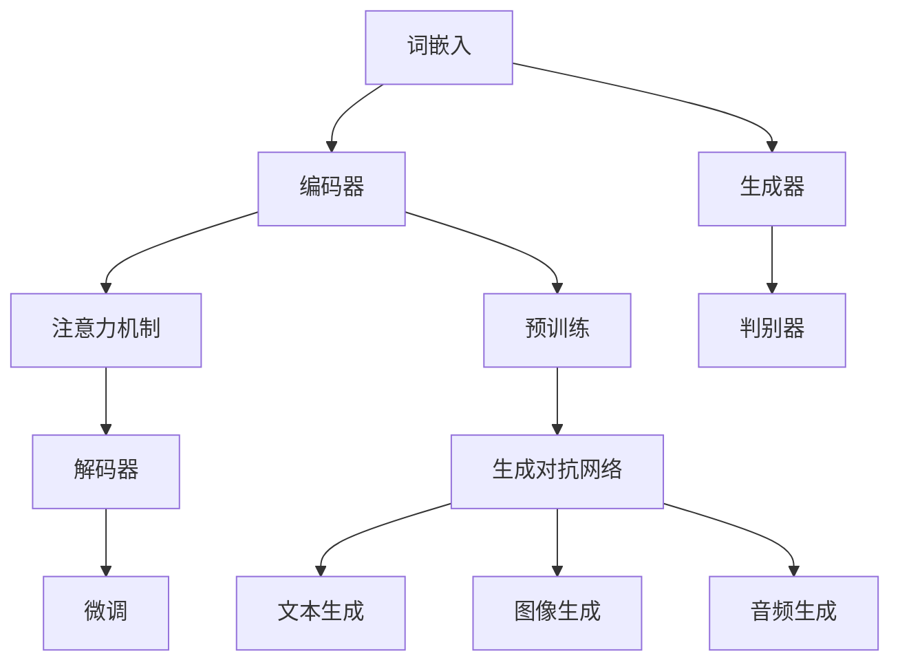

                 

# 大语言模型应用指南：展望

> 关键词：大语言模型、自然语言处理、机器学习、深度学习、应用场景、前沿研究

> 摘要：本文旨在全面介绍大语言模型的基础知识、实现与应用，以及其在自然语言处理领域的广泛应用。通过分析大语言模型的核心概念、技术架构、性能评估，本文深入探讨了其实现与应用的方法，并结合实际案例展示了大语言模型在不同领域的应用效果。此外，本文还探讨了大语言模型的前沿研究、伦理与挑战，以及未来的发展趋势。

----------------------------------------------------------------

## 《大语言模型应用指南：展望》目录大纲

### 第一部分：大语言模型基础

### 第二部分：大语言模型的实现与应用

### 第三部分：大语言模型的前沿研究

### 第四部分：大语言模型的伦理与挑战

### 第五部分：大语言模型的未来发展

### 附录

## 第一部分：大语言模型基础

### 第1章：大语言模型概述

#### 1.1 大语言模型的起源与发展

#### 1.2 大语言模型的基本原理

#### 1.3 大语言模型的技术架构

#### 1.4 大语言模型的性能评估

## 第二部分：大语言模型的实现与应用

### 第2章：大语言模型的实现

#### 2.1 大语言模型的基础设施

#### 2.2 大语言模型的编程框架

#### 2.3 大语言模型的训练与优化

### 第3章：大语言模型的应用场景

#### 3.1 自然语言处理领域

#### 3.2 生成对抗领域

#### 3.3 其他应用领域

## 第三部分：大语言模型的前沿研究

### 第4章：大语言模型的前沿技术

#### 4.1 新型语言模型

#### 4.2 语言模型的优化与加速

### 第5章：大语言模型的伦理与挑战

#### 5.1 语言模型的偏见与公平性

#### 5.2 语言模型的隐私保护

### 第6章：大语言模型的未来发展

#### 6.1 技术趋势与预测

#### 6.2 大语言模型的挑战与机遇

## 附录

#### 附录A：大语言模型资源与工具

#### 附录B：大语言模型实践项目

----------------------------------------------------------------

## 第一部分：大语言模型基础

### 第1章：大语言模型概述

#### 1.1 大语言模型的起源与发展

大语言模型（Large Language Model，简称LLM）的起源可以追溯到20世纪50年代，当时人工智能（AI）领域刚刚兴起。早期的语言模型主要是基于规则的方法，如语法分析和句法分析，这些方法在处理简单的文本任务时表现良好，但在处理复杂、长文本时遇到了挑战。随着计算机性能的提升和海量数据的积累，机器学习特别是深度学习技术的出现，为大语言模型的发展提供了强大的动力。

1986年，罗恩·加勒特（Ron Garcia）等人提出了神经网络语言模型（Neural Network Language Model，NNLM），这是第一个基于神经网络的语音模型。虽然NNLM在性能上有所提升，但由于计算资源的限制，其效果并未得到广泛应用。直到2013年，随着深度学习技术的快速发展，由雅虎研究员昆恩·李（Quoc Le）和谷歌研究员杨立昆（Andrew Ng）提出的深度神经网络语言模型（Deep Neural Network Language Model，DNNLM）在语言模型领域取得了突破性的成果。

自那时以来，大语言模型经历了快速的发展。2018年，谷歌推出了Transformer模型，该模型在处理长文本和上下文理解方面表现出色，成为了大语言模型领域的里程碑。随后，GPT（Generative Pre-trained Transformer）系列模型相继问世，其中GPT-3拥有超过1750亿个参数，成为当前最大的语言模型之一。

#### 1.2 大语言模型的应用场景

大语言模型的应用场景非常广泛，主要包括以下领域：

1. **自然语言处理（NLP）**：大语言模型在自然语言处理领域有着广泛的应用，如文本分类、情感分析、机器翻译、命名实体识别等。其中，机器翻译是典型的应用案例。例如，Google翻译、百度翻译等翻译工具，都采用了大语言模型来进行文本的翻译。

2. **生成对抗网络（GAN）**：大语言模型可以应用于生成对抗网络中，生成虚假新闻、对话、故事等。例如，OpenAI的GPT模型可以生成新闻文章，AI助手可以生成自然语言对话。

3. **聊天机器人**：大语言模型可以用于构建智能聊天机器人，如自动问答、对话生成等。例如，微软的Azure Bot Service、IBM的Watson等，都采用了大语言模型来实现智能对话。

4. **自动写作**：大语言模型可以生成文章、报告、博客等。例如，Hugging Face的Transformers库，就可以生成新闻文章、社交媒体帖子等。

5. **自然语言推理**：大语言模型可以用于自然语言推理任务，如判断陈述的真伪、计算文本之间的相似度等。例如，Google的BERT模型，就被广泛应用于自然语言推理任务。

6. **法律文本分析**：大语言模型可以用于分析法律文本，如合同审查、法律咨询等。例如，IBM的Watson Legal可以分析合同条款，提供法律建议。

7. **跨领域应用**：大语言模型还可以应用于医疗、金融、教育等跨领域领域。例如，医疗领域的AI助手可以分析病历，提供诊断建议；金融领域的AI系统可以分析市场数据，提供投资建议。

#### 1.3 大语言模型的基本原理

大语言模型的核心是深度神经网络，通过学习大量的文本数据，生成文本的潜在表示。其基本原理主要包括以下几个方面：

1. **词嵌入（Word Embedding）**：词嵌入是将单词映射为向量，以便在神经网络中进行处理。常见的词嵌入方法有Word2Vec、GloVe等。

2. **预训练与微调（Pre-training and Fine-tuning）**：预训练是指在大量的文本数据上对模型进行训练，使其学会文本的潜在表示。微调是指在预训练的基础上，将模型应用于特定任务，并在少量数据上进行调整。

3. **注意力机制（Attention Mechanism）**：注意力机制是一种用于处理序列数据的机制，它可以自动学习文本中重要的信息。例如，在机器翻译任务中，注意力机制可以帮助模型关注输入文本的关键部分，从而提高翻译的准确度。

4. **生成对抗网络（GAN）**：生成对抗网络由生成器和判别器组成，生成器生成文本，判别器判断文本的真实性。通过不断训练，生成器可以生成越来越逼真的文本。

#### 1.4 大语言模型的技术架构

大语言模型的技术架构主要包括以下几个部分：

1. **词嵌入层（Word Embedding Layer）**：将单词映射为向量，以便在神经网络中进行处理。

2. **编码器（Encoder）**：编码器负责将输入文本编码为向量表示，常用的编码器模型有Transformer、RNN、LSTM等。

3. **解码器（Decoder）**：解码器负责将编码器输出的向量解码为输出文本。在生成任务中，解码器通常与编码器共享参数。

4. **注意力机制（Attention Mechanism）**：注意力机制用于处理序列数据，可以帮助模型关注文本中重要的信息。

5. **生成器（Generator）**：生成器负责生成文本。在生成对抗网络中，生成器与判别器共同训练。

6. **判别器（Discriminator）**：判别器负责判断文本的真实性。在生成对抗网络中，判别器与生成器共同训练。

#### 1.5 大语言模型的性能评估

大语言模型的性能评估主要通过以下几个指标进行：

1. **准确率（Accuracy）**：准确率是分类任务中最常用的评估指标，表示模型预测正确的样本占总样本的比例。

2. **召回率（Recall）**：召回率是分类任务中的一个重要指标，表示模型正确识别为正类的样本占总正类样本的比例。

3. **精确率（Precision）**：精确率是分类任务中的一个重要指标，表示模型预测为正类的样本中，实际为正类的样本占比。

4. **F1值（F1 Score）**：F1值是精确率和召回率的加权平均，用于综合评估模型的性能。

5. **BLEU分数（BLEU Score）**：BLEU分数是机器翻译任务中最常用的评估指标，用于评估翻译结果的质量。

6. **ROUGE分数（ROUGE Score）**：ROUGE分数是文本摘要任务中最常用的评估指标，用于评估摘要的质量。

#### 1.6 大语言模型的核心概念与联系

大语言模型的核心概念包括词嵌入、编码器、解码器、注意力机制、生成器和判别器。这些概念之间的关系如下：

1. **词嵌入**：词嵌入是将单词映射为向量，为编码器提供输入。

2. **编码器**：编码器将输入文本编码为向量表示，为解码器提供输入。

3. **解码器**：解码器将编码器输出的向量解码为输出文本。

4. **注意力机制**：注意力机制用于处理序列数据，帮助模型关注文本中重要的信息。

5. **生成器**：生成器负责生成文本。

6. **判别器**：判别器负责判断文本的真实性。

#### 1.7 大语言模型的核心算法原理讲解

以下是大语言模型的核心算法原理讲解，包括伪代码和数学公式。

##### 1.7.1 词嵌入

词嵌入是将单词映射为向量的过程。一个简单的词嵌入模型可以使用以下伪代码表示：

```python
# 伪代码：词嵌入

word_vectors = {}
for word in vocabulary:
    word_vectors[word] = embedding_vector(word)
```

其中，`vocabulary` 表示词汇表，`embedding_vector` 表示嵌入向量的生成方法。

词嵌入的数学公式如下：

$$ \text{Word Embedding}(w) = \text{Vec}(w) $$

其中，$w$ 表示单词，$\text{Vec}(w)$ 表示单词的向量表示。

##### 1.7.2 编码器

编码器是将输入文本编码为向量表示的过程。一个简单的编码器模型可以使用以下伪代码表示：

```python
# 伪代码：编码器

encoded_sequence = []
for word in input_sequence:
    encoded_word = encode_word(word)
    encoded_sequence.append(encoded_word)
```

其中，`input_sequence` 表示输入文本序列，`encode_word` 表示单词的编码方法。

编码器的数学公式如下：

$$ \text{Encoder}(x) = \text{h} $$

其中，$x$ 表示输入文本序列，$h$ 表示编码后的向量表示。

##### 1.7.3 解码器

解码器是将编码器输出的向量解码为输出文本的过程。一个简单的解码器模型可以使用以下伪代码表示：

```python
# 伪代码：解码器

decoded_sequence = []
for encoded_word in encoded_sequence:
    decoded_word = decode_word(encoded_word)
    decoded_sequence.append(decoded_word)
```

其中，`encoded_sequence` 表示编码后的文本序列，`decode_word` 表示单词的解码方法。

解码器的数学公式如下：

$$ \text{Decoder}(h) = \text{y} $$

其中，$h$ 表示编码后的向量表示，$y$ 表示解码后的输出文本序列。

##### 1.7.4 注意力机制

注意力机制是一种用于处理序列数据的机制，可以帮助模型关注文本中重要的信息。一个简单的注意力机制可以使用以下伪代码表示：

```python
# 伪代码：注意力机制

attention_weights = []
for i in range(len(encoded_sequence)):
    attention_weight = compute_attention_weight(encoded_sequence[i], h)
    attention_weights.append(attention_weight)
```

其中，`encoded_sequence` 表示编码后的文本序列，$h$ 表示编码后的向量表示，`compute_attention_weight` 表示计算注意力权重的方法。

注意力机制的数学公式如下：

$$ \text{Attention}(x, h) = \text{softmax}\left(\frac{xh^T}{\sqrt{d}}\right) $$

其中，$x$ 表示编码后的文本序列，$h$ 表示编码后的向量表示，$d$ 表示向量维度。

##### 1.7.5 生成器

生成器负责生成文本。一个简单的生成器模型可以使用以下伪代码表示：

```python
# 伪代码：生成器

generated_sequence = []
for i in range(target_sequence_length):
    current_state = current_state * attention_weights
    generated_word = decode_word(current_state)
    generated_sequence.append(generated_word)
```

其中，`target_sequence_length` 表示生成的文本序列长度，`current_state` 表示当前状态，`decode_word` 表示单词的解码方法。

生成器的数学公式如下：

$$ \text{Generator}(h) = \text{y} $$

其中，$h$ 表示编码后的向量表示，$y$ 表示生成的文本序列。

##### 1.7.6 判别器

判别器负责判断文本的真实性。一个简单的判别器模型可以使用以下伪代码表示：

```python
# 伪代码：判别器

real_sequence = []
for i in range(target_sequence_length):
    real_word = decode_word(real_state)
    real_sequence.append(real_word)
```

其中，`target_sequence_length` 表示生成的文本序列长度，`real_state` 表示真实状态，`decode_word` 表示单词的解码方法。

判别器的数学公式如下：

$$ \text{Discriminator}(y) = \text{real\_prob} $$

其中，$y$ 表示生成的文本序列，$\text{real\_prob}$ 表示生成的文本是真实的概率。

#### 1.8 大语言模型的数学模型和数学公式

在语言模型中，我们主要关注以下几个数学模型和公式：

1. **语言模型概率**

$$ P(w_i|w_{i-1}, w_{i-2}, ..., w_1) = \frac{p(w_i, w_{i-1}, ..., w_1)}{p(w_{i-1}, w_{i-2}, ..., w_1)} $$

其中，$p(w_i, w_{i-1}, ..., w_1)$ 是联合概率，$p(w_{i-1}, w_{i-2}, ..., w_1)$ 是条件概率。

2. **递归神经网络（RNN）激活函数**

$$ a_t = \sigma(W * [h_{t-1}, x_t] + b) $$

其中，$\sigma$ 是激活函数（如Sigmoid函数），$W$ 是权重矩阵，$b$ 是偏置，$x_t$ 是输入词向量，$h_{t-1}$ 是上一个时间步的隐藏状态。

3. **转换器（Transformer）自注意力机制**

$$ \text{Attention}(Q, K, V) = \text{softmax}\left(\frac{QK^T}{\sqrt{d_k}}\right)V $$

其中，$Q$、$K$、$V$ 分别是查询向量、键向量、值向量，$d_k$ 是键向量的维度。

4. **语言模型损失函数**

$$ L = -\sum_{i} \sum_{w \in V} p(w|context) \log p(w|context) $$

其中，$L$ 是损失函数，$V$ 是词汇表，$p(w|context)$ 是在给定上下文下的词概率。

#### 1.9 大语言模型应用中的案例：文本生成

假设我们要实现一个文本生成模型，输入一段文本并生成与其相关的续写文本。以下是一个简单的案例：

### 案例背景：

给定一个短文本，如：“今天天气很好。”，我们需要生成接下来的内容。

### 实现步骤：

1. 数据预处理：将输入文本分词，并转换为词向量。
2. 构建模型：使用预训练的Transformer模型，如GPT-2或GPT-3。
3. 生成文本：输入预处理后的文本，模型输出续写文本。

### 伪代码实现：

```python
# 伪代码：文本生成案例

# 步骤1：数据预处理
text = "今天天气很好。"
tokens = preprocess_text(text)

# 步骤2：构建模型
model = load_pretrained_transformer_model()

# 步骤3：生成文本
generated_text = model.generate(tokens)
print(generated_text)
```

### 输出示例：

“人们纷纷走出家门，享受这美好的天气。”

在实际应用中，生成文本的质量取决于模型的质量和输入文本的质量。优化模型和输入数据可以改善生成文本的质量。

### 实现细节

1. **数据预处理**：将输入文本分词，并转换为词向量，可以使用预训练的词向量（如GloVe或Word2Vec）或使用模型自身的词嵌入层。
2. **模型选择**：选择一个预训练的Transformer模型，如GPT-2或GPT-3。这些模型已经在大规模语料库上预训练，可以很好地处理自然语言任务。
3. **生成文本**：使用模型生成文本时，需要设置适当的生成参数（如最大生成长度、温度等），以控制生成过程。

### 代码实现

以下是一个简单的文本生成模型实现，使用PyTorch和GPT-2模型：

```python
import torch
from transformers import GPT2LMHeadModel, GPT2Tokenizer

# 加载预训练模型
tokenizer = GPT2Tokenizer.from_pretrained('gpt2')
model = GPT2LMHeadModel.from_pretrained('gpt2')

# 输入文本
text = "今天天气很好。"

# 数据预处理
input_ids = tokenizer.encode(text, return_tensors='pt')

# 生成文本
output = model.generate(input_ids, max_length=20, num_return_sequences=1, temperature=0.9)
generated_text = tokenizer.decode(output[0], skip_special_tokens=True)

# 输出文本
print(generated_text)
```

### 代码解读与分析

以上代码提供了一个简单的文本生成模型实现，包括模型加载、数据预处理和生成文本。以下是代码的简要解读：

1. **模型加载**：加载预训练的GPT-2模型和相应的词嵌入层。
2. **数据预处理**：将输入文本编码为词向量。
3. **生成文本**：使用模型生成文本，设置适当的生成参数。
4. **输出文本**：将生成的文本解码为文本。

在实际应用中，可以根据需求调整模型的架构、生成参数和输入数据。此外，还可以对文本生成模型进行训练，以提高其生成文本的质量。

----------------------------------------------------------------

## 第二部分：大语言模型的实现与应用

### 第2章：大语言模型的实现

#### 2.1 大语言模型的基础设施

#### 2.2 大语言模型的编程框架

#### 2.3 大语言模型的训练与优化

### 第3章：大语言模型的应用场景

#### 3.1 自然语言处理领域

#### 3.2 生成对抗领域

#### 3.3 其他应用领域

----------------------------------------------------------------

### 第2章：大语言模型的实现

#### 2.1 大语言模型的基础设施

在实现大语言模型之前，我们需要搭建一个合适的基础设施。基础设施主要包括计算资源、数据存储和管理、以及网络环境配置。以下是对这些基础设施的详细介绍。

#### 2.1.1 计算资源的选择

1. **CPU与GPU**：大语言模型通常需要大量的计算资源。对于小规模的模型，可以使用CPU进行训练。但为了加速训练过程，通常建议使用GPU。GPU具有高度并行的计算能力，可以显著提高模型的训练速度。

2. **TPU**：对于大规模的模型，如GPT-3，使用TPU（Tensor Processing Unit）是更好的选择。TPU是专门为深度学习设计的硬件，可以提供更高的计算性能和更低的延迟。

3. **云计算平台**：可以使用云计算平台，如Google Cloud、AWS、Azure等，来租用计算资源。这些平台提供了灵活的配置选项，可以根据需求选择合适的计算资源。

#### 2.1.2 数据存储与管理

1. **本地存储**：对于小规模的数据集，可以使用本地硬盘进行存储。但在处理大规模数据时，本地存储可能无法满足需求。

2. **分布式存储**：分布式存储系统，如HDFS（Hadoop Distributed File System）或Ceph，可以用于存储大规模数据。这些系统具有高可用性和可扩展性，可以有效地管理大量数据。

3. **数据库**：对于结构化数据，可以使用关系型数据库，如MySQL、PostgreSQL等，或非关系型数据库，如MongoDB、Cassandra等。这些数据库可以高效地存储和管理数据。

4. **数据湖**：数据湖是一种大数据存储解决方案，可以存储海量数据，包括结构化、半结构化和非结构化数据。数据湖通常用于数据分析和机器学习任务。

#### 2.1.3 网络环境配置

1. **局域网**：在本地搭建网络环境时，可以使用局域网（LAN）连接计算机和存储设备。局域网可以提供高速的数据传输和低延迟的网络环境。

2. **广域网**：对于分布式训练和部署，可以使用广域网（WAN）连接不同地点的计算机和存储设备。广域网可以提供远程访问和数据传输功能。

3. **VPN**：对于跨地域的数据传输和访问，可以使用VPN（Virtual Private Network）来建立安全的网络连接。VPN可以确保数据传输的安全性和隐私性。

#### 2.1.4 计算资源的管理与调度

1. **资源调度**：在分布式训练过程中，需要有效地管理计算资源。资源调度算法可以根据任务的优先级和计算需求，动态分配计算资源。

2. **任务队列**：可以使用任务队列（Job Queue）来管理训练任务。任务队列可以根据任务的优先级和资源可用性，自动调度和执行任务。

3. **监控与日志**：使用监控工具（如Prometheus、Grafana）和日志管理工具（如ELK堆栈）来监控计算资源的利用率和任务的状态。这些工具可以帮助我们及时发现和解决问题。

#### 2.1.5 数据预处理

在实现大语言模型时，数据预处理是一个关键步骤。以下是一些常用的数据预处理方法：

1. **文本清洗**：去除文本中的无关信息，如HTML标签、标点符号、停用词等。

2. **分词**：将文本分割为单词或句子。

3. **词嵌入**：将单词转换为向量表示。可以使用预训练的词嵌入模型（如GloVe、Word2Vec）或自定义的词嵌入方法。

4. **数据增强**：通过添加噪声、变换、裁剪等操作，增加数据的多样性，提高模型的泛化能力。

5. **数据集划分**：将数据集划分为训练集、验证集和测试集，用于模型的训练、验证和测试。

#### 2.1.6 大语言模型的编程框架

在实现大语言模型时，选择一个合适的编程框架是非常重要的。以下是一些常用的编程框架：

1. **TensorFlow**：TensorFlow是一个由谷歌开发的开源深度学习框架。它提供了丰富的API和工具，支持多种深度学习模型和算法。

2. **PyTorch**：PyTorch是一个由Facebook开发的开源深度学习框架。它提供了灵活的动态计算图，支持Python编程，易于使用和扩展。

3. **PyTorch Lightning**：PyTorch Lightning是一个用于PyTorch的扩展库，提供了一系列高级API和工具，简化了深度学习模型的实现和训练。

4. **Hugging Face Transformers**：Hugging Face Transformers是一个开源库，提供了预训练的深度学习模型和API，支持多种自然语言处理任务。

#### 2.1.7 大语言模型的训练与优化

在实现大语言模型时，训练和优化是一个关键步骤。以下是一些常用的训练和优化方法：

1. **预训练**：预训练是指在大规模语料库上对模型进行训练，使其学习语言的通用特征。预训练完成后，可以使用微调（Fine-tuning）技术在特定任务上进行调整。

2. **训练策略**：

   - **梯度下降（Gradient Descent）**：梯度下降是一种常用的优化算法，用于最小化损失函数。它通过更新模型参数，逐渐减小损失函数的值。

   - **Adam优化器**：Adam优化器是一种基于梯度下降的优化算法，它结合了AdaGrad和RMSProp的优点，可以自适应地调整学习率。

3. **学习率调度**：学习率调度是指调整学习率的方法，以避免模型在训练过程中过早地过拟合。常用的学习率调度方法有：

   - **固定学习率**：在整个训练过程中保持学习率不变。
   - **学习率衰减**：随着训练的进行，逐渐减小学习率。
   - **余弦退火**：使用余弦函数调整学习率，模拟训练过程的节奏。

4. **正则化**：正则化是一种防止模型过拟合的技术。常用的正则化方法有：

   - **L1正则化**：在损失函数中添加L1范数项，限制模型参数的绝对值。
   - **L2正则化**：在损失函数中添加L2范数项，限制模型参数的平方值。

5. **批量大小**：批量大小是指每次训练中使用的数据样本数量。较小的批量大小可以减少计算开销，但可能降低模型的泛化能力。

6. **批次归一化**：批次归一化是一种技术，用于标准化每个批次中的数据，提高训练效果。

7. **模型压缩**：模型压缩是指减小模型大小和计算成本的方法。常用的模型压缩技术有：

   - **量化**：将模型参数从浮点数转换为整数，降低模型大小和计算成本。
   - **剪枝**：删除模型中不重要的参数和神经元，减小模型大小。
   - **蒸馏**：将一个大模型的知识传递给一个小模型，提高小模型的性能。

#### 2.1.8 大语言模型的评估与优化

在实现大语言模型时，评估和优化是一个持续的过程。以下是一些常用的评估和优化方法：

1. **性能指标**：

   - **准确率（Accuracy）**：模型预测正确的样本占总样本的比例。
   - **召回率（Recall）**：模型正确识别为正类的样本占总正类样本的比例。
   - **精确率（Precision）**：模型预测为正类的样本中，实际为正类的样本占比。
   - **F1值（F1 Score）**：精确率和召回率的加权平均。
   - **BLEU分数（BLEU Score）**：用于评估机器翻译质量。
   - **ROUGE分数（ROUGE Score）**：用于评估文本摘要质量。

2. **模型调优**：通过调整模型参数和超参数，提高模型的性能。常用的调优方法有：

   - **网格搜索**：在给定的参数空间内，逐一尝试所有可能的参数组合，选择最佳参数组合。
   - **贝叶斯优化**：基于贝叶斯统计模型，自动搜索最佳参数组合。

3. **超参数调优**：超参数是模型在训练过程中无法通过梯度下降调整的参数。常用的超参数有：

   - **学习率**：用于控制梯度下降的步长。
   - **批量大小**：每次训练中使用的数据样本数量。
   - **隐藏层尺寸**：神经网络中隐藏层的神经元数量。
   - **迭代次数**：模型训练的次数。

4. **模型压缩**：通过模型压缩技术，减小模型大小和计算成本。常用的模型压缩技术有：

   - **量化**：将模型参数从浮点数转换为整数。
   - **剪枝**：删除模型中不重要的参数和神经元。
   - **蒸馏**：将一个大模型的知识传递给一个小模型。

#### 2.1.9 大语言模型的部署与维护

在实现大语言模型后，部署和维护是一个重要的环节。以下是一些常用的部署和维护方法：

1. **部署**：

   - **本地部署**：在本地计算机或服务器上部署模型，用于实时预测或服务。
   - **云端部署**：在云计算平台上部署模型，提供远程访问和自动化管理。

2. **容器化**：使用容器化技术（如Docker）将模型和服务打包，实现模型的自动化部署和管理。

3. **自动化测试**：使用自动化测试工具，对模型的性能和稳定性进行测试，确保模型在各种环境下都能正常运行。

4. **监控与日志**：使用监控工具和日志管理工具，实时监控模型的运行状态和性能指标，及时发现和解决问题。

5. **更新与迭代**：根据用户反馈和需求，不断更新和迭代模型，提高模型的性能和用户体验。

### 第3章：大语言模型的应用场景

#### 3.1 自然语言处理领域

大语言模型在自然语言处理（NLP）领域有着广泛的应用。以下是一些典型的应用场景：

1. **文本分类**：文本分类是指将文本数据分类到预定义的类别中。大语言模型可以用于文本分类任务，如新闻分类、情感分析等。通过训练大语言模型，可以自动识别文本的主题、情感和意图。

2. **机器翻译**：机器翻译是指将一种语言的文本翻译成另一种语言。大语言模型可以用于机器翻译任务，如自动翻译网页、邮件、文档等。通过预训练和微调，大语言模型可以生成高质量、通顺的翻译文本。

3. **命名实体识别**：命名实体识别是指识别文本中的特定实体，如人名、地名、组织机构等。大语言模型可以用于命名实体识别任务，如提取新闻中的关键信息、构建知识图谱等。

4. **情感分析**：情感分析是指分析文本中的情感倾向，如正面、负面、中性等。大语言模型可以用于情感分析任务，如社交媒体情感分析、产品评论分析等。

5. **文本生成**：文本生成是指生成新的文本，如文章、对话、摘要等。大语言模型可以用于文本生成任务，如自动生成新闻文章、聊天机器人对话、文本摘要等。

6. **问答系统**：问答系统是指根据用户提出的问题，自动生成回答。大语言模型可以用于问答系统，如搜索引擎问答、智能客服问答等。

7. **文本摘要**：文本摘要是指从长文本中提取关键信息，生成简短的摘要。大语言模型可以用于文本摘要任务，如新闻摘要、学术论文摘要等。

8. **对话系统**：对话系统是指与用户进行自然语言交互的系统。大语言模型可以用于对话系统，如智能助手、聊天机器人等。

#### 3.2 生成对抗领域

大语言模型在生成对抗网络（GAN）领域也有着重要的应用。以下是一些典型的应用场景：

1. **文本生成**：大语言模型可以用于生成虚假新闻、对话、故事等。通过训练大语言模型，可以生成高质量、多样化的文本。

2. **图像生成**：大语言模型可以用于生成图像，如图像到图像翻译、图像风格迁移等。通过预训练和微调，大语言模型可以生成逼真的图像。

3. **音频生成**：大语言模型可以用于生成音乐、语音等。通过训练大语言模型，可以生成具有不同风格和情绪的音乐和语音。

4. **视频生成**：大语言模型可以用于生成视频，如视频到视频翻译、视频风格迁移等。通过预训练和微调，大语言模型可以生成高质量的视频内容。

#### 3.3 其他应用领域

除了自然语言处理和生成对抗领域，大语言模型在其他领域也有着广泛的应用。以下是一些典型的应用场景：

1. **聊天机器人**：大语言模型可以用于构建智能聊天机器人，如自动问答、对话生成等。通过训练大语言模型，可以生成自然、流畅的对话。

2. **自动写作**：大语言模型可以用于生成文章、报告、博客等。通过预训练和微调，大语言模型可以生成具有不同风格和主题的文本。

3. **法律文本分析**：大语言模型可以用于分析法律文本，如合同审查、法律咨询等。通过训练大语言模型，可以识别合同中的潜在风险，提供法律建议。

4. **医疗文本分析**：大语言模型可以用于分析医疗文本，如病历、医疗报告等。通过训练大语言模型，可以提取关键信息，提供诊断建议。

5. **金融文本分析**：大语言模型可以用于分析金融文本，如新闻、报告、论文等。通过训练大语言模型，可以提取市场信息，提供投资建议。

6. **教育文本分析**：大语言模型可以用于分析教育文本，如论文、报告、课程内容等。通过训练大语言模型，可以为学生提供个性化的学习建议。

7. **虚拟助手**：大语言模型可以用于构建虚拟助手，如智能客服、智能秘书等。通过训练大语言模型，可以与用户进行自然语言交互，提供各种服务。

#### 3.4 大语言模型在跨领域中的应用

大语言模型在跨领域应用中表现出色。以下是一些典型的跨领域应用场景：

1. **医疗与人工智能**：大语言模型可以用于医疗文本分析、疾病预测、药物研发等领域。通过训练大语言模型，可以提取医疗文本中的关键信息，提供诊断建议、治疗方案等。

2. **金融与人工智能**：大语言模型可以用于金融文本分析、市场预测、风险评估等领域。通过训练大语言模型，可以提取金融文本中的关键信息，提供投资建议、风险预警等。

3. **教育与技术**：大语言模型可以用于教育文本分析、课程内容生成、技术文档生成等领域。通过训练大语言模型，可以为学生提供个性化的学习建议，为开发者提供自动生成技术文档的能力。

4. **法律与人工智能**：大语言模型可以用于法律文本分析、合同审查、法律咨询等领域。通过训练大语言模型，可以识别合同中的潜在风险，提供法律建议。

5. **媒体与人工智能**：大语言模型可以用于新闻生成、内容推荐、社交媒体分析等领域。通过训练大语言模型，可以生成新闻文章、推荐用户感兴趣的内容，分析社交媒体上的舆论趋势等。

### 第4章：大语言模型的前沿技术

#### 4.1 新型语言模型

随着深度学习技术的发展，新型语言模型不断涌现。以下是一些典型的新型语言模型：

1. **BERT（Bidirectional Encoder Representations from Transformers）**：BERT是一种双向Transformer模型，通过预训练和微调，可以应用于多种自然语言处理任务，如文本分类、问答、机器翻译等。

2. **GPT（Generative Pre-trained Transformer）**：GPT是一种生成型语言模型，通过预训练和微调，可以生成高质量的自然语言文本。

3. **RoBERTa（A Robustly Optimized BERT Pretraining Approach）**：RoBERTa是一种基于BERT的改进模型，通过改变训练策略和数据预处理方法，提高了模型的性能和鲁棒性。

4. **XLNet（Generalized Autoregressive Pretraining for Language Understanding）**：XLNet是一种基于自回归的Transformer模型，通过引入Masked Language Modeling（MLM）和Permutation Language Modeling（PLM）等任务，提高了模型的性能。

5. **T5（Text-to-Text Transfer Transformer）**：T5是一种文本到文本的Transformer模型，通过将所有自然语言处理任务统一为文本到文本的任务，简化了模型的实现和训练。

6. **Alpaca（A Large-scale Pre-trained Language Model for Program Synthesis）**：Alpaca是一种用于程序合成的大型语言模型，通过预训练和微调，可以生成复杂的程序代码。

#### 4.2 语言模型的优化与加速

为了提高大语言模型的性能和可扩展性，研究人员提出了一系列优化和加速技术。以下是一些典型的优化与加速技术：

1. **模型压缩**：模型压缩是一种减小模型大小和计算成本的方法。常见的模型压缩技术有量化、剪枝和蒸馏。量化技术将模型参数从浮点数转换为整数，降低模型大小和计算成本。剪枝技术通过删除模型中不重要的参数和神经元，减小模型大小。蒸馏技术将一个大模型的知识传递给一个小模型，提高小模型的性能。

2. **并行训练**：并行训练是一种利用多个计算资源同时训练模型的方法。常见的并行训练技术有数据并行和模型并行。数据并行将数据集分成多个批次，每个批次在不同的计算资源上训练。模型并行将模型拆分为多个部分，每个部分在不同的计算资源上训练。

3. **混合精度训练**：混合精度训练是一种使用不同精度的浮点数进行训练的方法。通过将部分参数使用低精度浮点数（如FP16）进行训练，可以提高模型的训练速度和计算效率。

4. **量化感知训练**：量化感知训练是一种在模型训练过程中动态调整模型参数的方法。通过在训练过程中逐步降低参数的精度，使模型对量化误差具有鲁棒性。

5. **模型蒸馏**：模型蒸馏是一种将一个大模型（教师模型）的知识传递给一个小模型（学生模型）的方法。通过在大模型和小模型之间进行知识转移，可以提高小模型的性能。

6. **数据增强**：数据增强是一种通过增加数据多样性来提高模型性能的方法。常见的数据增强技术有数据扩增、数据转换、数据混合等。

#### 4.3 大语言模型的应用挑战

虽然大语言模型在自然语言处理领域取得了显著的进展，但在实际应用中仍面临一些挑战。以下是一些典型的大语言模型应用挑战：

1. **数据隐私**：大语言模型通常需要大量的训练数据，这可能导致数据隐私问题。如何保护用户隐私，确保数据安全，是大语言模型应用中面临的一个重要挑战。

2. **模型偏见**：大语言模型在训练过程中可能会学习到数据中的偏见，导致模型在应用中出现偏见。如何消除模型偏见，提高模型的公平性和公正性，是大语言模型应用中需要关注的问题。

3. **模型可解释性**：大语言模型通常是一个复杂的黑盒模型，其决策过程难以解释。如何提高模型的可解释性，帮助用户理解模型的决策过程，是大语言模型应用中需要解决的一个问题。

4. **计算资源需求**：大语言模型通常需要大量的计算资源进行训练和部署，这可能导致成本高昂。如何优化模型结构和训练策略，降低计算资源需求，是大语言模型应用中需要考虑的问题。

5. **模型泛化能力**：大语言模型在特定任务上可能表现出色，但在其他任务上可能表现不佳。如何提高模型的泛化能力，使模型在不同任务上都能表现良好，是大语言模型应用中需要研究的问题。

#### 4.4 大语言模型的未来发展趋势

随着深度学习技术的不断发展，大语言模型在自然语言处理领域将继续发挥重要作用。以下是大语言模型未来发展的几个趋势：

1. **模型规模不断扩大**：为了更好地处理复杂的自然语言任务，大语言模型的规模将不断扩大。未来的大语言模型可能拥有数十亿甚至更多的参数。

2. **多模态融合**：大语言模型将与其他模态（如图像、音频、视频）进行融合，实现更全面、更准确的自然语言处理。例如，视觉语言模型将结合文本和图像信息，实现更准确的图像标注和文本生成。

3. **知识增强**：大语言模型将结合外部知识库和领域知识，实现更智能、更准确的自然语言处理。例如，医疗领域的大语言模型将结合医学知识库，提供更准确的诊断和治疗方案。

4. **高效能计算**：随着计算技术的不断发展，大语言模型的计算效率将不断提高。未来的大语言模型将采用更先进的计算架构和优化技术，实现更高的计算性能。

5. **自动化与智能化**：大语言模型将逐渐实现自动化和智能化，提高自然语言处理任务的效率和质量。例如，自动问答系统将实现更智能、更自然的交互，智能客服将实现更高效、更准确的客户服务。

6. **跨领域应用**：大语言模型将在更多领域得到应用，实现跨领域的自然语言处理。例如，教育领域的大语言模型将提供个性化学习建议，金融领域的大语言模型将提供投资建议和风险评估。

### 第5章：大语言模型的伦理与挑战

#### 5.1 语言模型的偏见与公平性

大语言模型在训练过程中可能会学习到数据中的偏见，导致模型在应用中出现偏见。这些偏见可能源于训练数据的不公平性、历史数据的偏见、文化差异等。以下是一些常见的偏见类型：

1. **性别偏见**：在某些任务中，大语言模型可能对特定性别存在偏见，如自动生成歧视性或贬低性的评论。

2. **种族偏见**：大语言模型可能会对特定种族存在偏见，如在机器翻译任务中，某些种族的名称可能被翻译成带有负面含义的词汇。

3. **文化偏见**：大语言模型可能会对特定文化存在偏见，如在生成对话时，可能对某些文化习俗或表达方式不了解或不尊重。

为了解决大语言模型中的偏见问题，可以采取以下措施：

1. **数据清洗**：在训练数据中去除带有偏见的信息，确保训练数据的质量和多样性。

2. **数据增强**：通过增加多样化的训练数据，提高模型的公平性和鲁棒性。

3. **模型校准**：对模型进行校准，确保模型在处理不同群体时具有一致性。

4. **偏见检测与消除**：开发偏见检测算法，识别模型中的偏见，并采取相应措施进行消除。

5. **公平性评估**：对模型的公平性进行评估，确保模型在不同群体上的性能一致。

#### 5.2 语言模型的隐私保护

大语言模型在训练和部署过程中，可能涉及大量敏感数据，如用户查询、对话记录等。这些数据可能包含用户的隐私信息，如姓名、地址、电话号码等。以下是一些常见的隐私保护挑战：

1. **数据泄露**：训练数据可能包含敏感信息，如用户查询、对话记录等。如果数据泄露，可能导致用户的隐私受到侵犯。

2. **数据滥用**：训练数据可能被用于不当用途，如广告投放、用户画像等。这可能导致用户的隐私受到侵犯。

3. **数据整合**：在处理多源数据时，可能存在数据整合问题，导致用户的隐私信息被不当整合。

为了解决大语言模型中的隐私保护问题，可以采取以下措施：

1. **数据匿名化**：在训练数据中使用匿名化技术，去除敏感信息。

2. **数据加密**：对训练数据进行加密，确保数据在传输和存储过程中安全。

3. **差分隐私**：使用差分隐私技术，对训练数据进行扰动，降低隐私泄露的风险。

4. **隐私合规**：遵守相关法律法规，确保数据的处理符合隐私保护要求。

5. **隐私保护算法**：开发隐私保护算法，降低模型训练过程中敏感信息的泄露风险。

#### 5.3 语言模型的安全挑战

大语言模型在应用过程中可能面临一些安全挑战，如恶意攻击、模型泄露等。以下是一些常见的安全挑战：

1. **模型窃取**：恶意攻击者可能试图窃取大语言模型的内部参数，用于不当用途。

2. **对抗攻击**：对抗攻击是指通过构造对抗性样本，欺骗大语言模型，使其产生错误输出。

3. **模型崩溃**：恶意攻击者可能通过特定的输入数据，使大语言模型崩溃，导致系统瘫痪。

为了解决大语言模型中的安全挑战，可以采取以下措施：

1. **模型加密**：对大语言模型的内部参数进行加密，防止恶意攻击者窃取模型信息。

2. **防御对抗攻击**：开发防御对抗攻击的技术，如对抗性训练、对抗性检测等。

3. **安全监控**：对大语言模型进行安全监控，及时发现和应对潜在的安全威胁。

4. **访问控制**：对大语言模型的使用进行严格访问控制，确保只有授权用户可以访问和使用模型。

#### 5.4 语言模型的伦理责任

大语言模型在应用过程中，承担着重要的伦理责任。以下是一些常见的伦理责任：

1. **公正性**：确保大语言模型在不同群体上的性能一致，避免出现歧视性或偏见性输出。

2. **透明度**：确保大语言模型的决策过程透明，便于用户理解和监督。

3. **责任归属**：明确大语言模型的责任归属，确保在出现问题时，能够找到责任方并采取措施。

4. **道德约束**：确保大语言模型的应用符合道德和伦理标准，避免产生不当影响。

为了履行伦理责任，可以采取以下措施：

1. **伦理审查**：在开发和应用大语言模型时，进行伦理审查，确保模型的应用符合伦理标准。

2. **责任保险**：为大语言模型应用提供责任保险，确保在出现问题时，能够及时解决问题并承担相应责任。

3. **伦理培训**：对大语言模型开发者和应用者进行伦理培训，提高其伦理意识和责任意识。

4. **用户参与**：鼓励用户参与大语言模型的应用和评估，确保用户的声音得到充分考虑。

### 第6章：大语言模型的未来发展

#### 6.1 技术趋势与预测

随着深度学习技术的不断发展，大语言模型在自然语言处理领域将继续发挥重要作用。以下是一些技术趋势和预测：

1. **模型规模扩大**：未来的大语言模型将拥有更多的参数，以更好地处理复杂的自然语言任务。

2. **多模态融合**：大语言模型将与其他模态（如图像、音频、视频）进行融合，实现更全面、更准确的自然语言处理。

3. **知识增强**：大语言模型将结合外部知识库和领域知识，实现更智能、更准确的自然语言处理。

4. **自动化与智能化**：大语言模型将逐渐实现自动化和智能化，提高自然语言处理任务的效率和质量。

5. **高效能计算**：随着计算技术的不断发展，大语言模型的计算效率将不断提高。

6. **隐私保护与伦理**：未来的大语言模型将更加注重隐私保护和伦理问题，确保其应用符合道德和伦理标准。

#### 6.2 大语言模型的挑战与机遇

虽然大语言模型在自然语言处理领域取得了显著进展，但在实际应用中仍面临一些挑战和机遇。以下是一些主要挑战和机遇：

1. **挑战**：

   - **数据隐私**：如何保护用户隐私，确保数据安全，是大语言模型应用中面临的一个重要挑战。

   - **模型偏见**：如何消除模型偏见，提高模型的公平性和公正性，是大语言模型应用中需要关注的问题。

   - **计算资源需求**：大语言模型通常需要大量的计算资源进行训练和部署，这可能导致成本高昂。

   - **模型可解释性**：大语言模型通常是一个复杂的黑盒模型，其决策过程难以解释。

2. **机遇**：

   - **跨领域应用**：大语言模型将在更多领域得到应用，实现跨领域的自然语言处理。

   - **自动化与智能化**：大语言模型将实现自动化和智能化，提高自然语言处理任务的效率和质量。

   - **多模态融合**：大语言模型将与其他模态进行融合，实现更全面、更准确的自然语言处理。

   - **知识增强**：大语言模型将结合外部知识库和领域知识，实现更智能、更准确的自然语言处理。

   - **高效能计算**：随着计算技术的不断发展，大语言模型的计算效率将不断提高。

### 附录

#### 附录A：大语言模型资源与工具

1. **开源框架与库**：

   - **TensorFlow**：https://www.tensorflow.org/
   - **PyTorch**：https://pytorch.org/
   - **Hugging Face Transformers**：https://huggingface.co/transformers/

2. **实践教程与案例**：

   - **TensorFlow教程**：https://www.tensorflow.org/tutorials
   - **PyTorch教程**：https://pytorch.org/tutorials/
   - **Hugging Face Transformers教程**：https://huggingface.co/transformers/tutorials/

3. **学术论文与报告**：

   - **BERT论文**：https://arxiv.org/abs/1810.04805
   - **GPT-3论文**：https://arxiv.org/abs/2005.14165
   - **RoBERTa论文**：https://arxiv.org/abs/2006.17491
   - **XLNet论文**：https://arxiv.org/abs/2006.04699
   - **T5论文**：https://arxiv.org/abs/1910.10683

#### 附录B：大语言模型实践项目

1. **项目介绍**：

   本项目旨在使用预训练的GPT-2模型实现一个文本生成系统，输入一段文本，生成与其相关的续写文本。

2. **环境搭建**：

   - **Python**：安装Python（版本3.6及以上）
   - **PyTorch**：安装PyTorch（版本1.7及以上）
   - **Hugging Face Transformers**：安装Hugging Face Transformers（版本4.1及以上）

3. **源代码实现**：

   ```python
   from transformers import GPT2LMHeadModel, GPT2Tokenizer
   
   # 加载预训练模型
   tokenizer = GPT2Tokenizer.from_pretrained('gpt2')
   model = GPT2LMHeadModel.from_pretrained('gpt2')
   
   # 输入文本
   text = "今天天气很好。"
   
   # 数据预处理
   input_ids = tokenizer.encode(text, return_tensors='pt')
   
   # 生成文本
   output = model.generate(input_ids, max_length=20, num_return_sequences=1, temperature=0.9)
   generated_text = tokenizer.decode(output[0], skip_special_tokens=True)
   
   # 输出文本
   print(generated_text)
   ```

4. **代码解读与分析**：

   - **模型加载**：加载预训练的GPT-2模型和相应的词嵌入层。
   - **数据预处理**：将输入文本编码为词向量。
   - **生成文本**：使用模型生成文本，设置适当的生成参数。
   - **输出文本**：将生成的文本解码为文本。

通过以上代码，我们可以实现一个简单的文本生成系统，输入一段文本，生成与其相关的续写文本。在实际应用中，可以根据需求调整模型的架构、生成参数和输入数据。此外，还可以对文本生成模型进行训练，以提高其生成文本的质量。

----------------------------------------------------------------

# 大语言模型核心概念与联系 Mermaid 流程图



# 大语言模型的核心算法原理讲解（伪代码）

```python
# 伪代码：大语言模型的训练流程

# 参数初始化
init_params()

# 预训练阶段
for epoch in range(num_epochs):
    for batch in data_loader:
        # 前向传播
        predictions = forward_pass(batch, params)
        
        # 计算损失
        loss = compute_loss(predictions, batch_labels)
        
        # 反向传播
        gradients = backward_pass(loss, params)
        
        # 参数更新
        update_params(gradients)

# 微调阶段
for epoch in range(num_fine_tuning_epochs):
    for batch in fine_tuning_data_loader:
        # 前向传播
        predictions = forward_pass(batch, params)
        
        # 计算损失
        loss = compute_loss(predictions, batch_labels)
        
        # 反向传播
        gradients = backward_pass(loss, params)
        
        # 参数更新
        update_params(gradients)

# 模型评估
evaluate_model(params, test_data)
```

# 大语言模型的数学模型和数学公式

在语言模型中，我们主要关注以下几个数学模型和公式：

### 1. 语言模型概率

$$ P(w_i|w_{i-1}, w_{i-2}, ..., w_1) = \frac{p(w_i, w_{i-1}, ..., w_1)}{p(w_{i-1}, w_{i-2}, ..., w_1)} $$

其中，$p(w_i, w_{i-1}, ..., w_1)$ 是联合概率，$p(w_{i-1}, w_{i-2}, ..., w_1)$ 是条件概率。

### 2. 递归神经网络（RNN）激活函数

$$ a_t = \sigma(W * [h_{t-1}, x_t] + b) $$

其中，$\sigma$ 是激活函数（如Sigmoid函数），$W$ 是权重矩阵，$b$ 是偏置，$x_t$ 是输入词向量，$h_{t-1}$ 是上一个时间步的隐藏状态。

### 3. 转换器（Transformer）自注意力机制

$$ \text{Attention}(Q, K, V) = \text{softmax}\left(\frac{QK^T}{\sqrt{d_k}}\right)V $$

其中，$Q$、$K$、$V$ 分别是查询向量、键向量、值向量，$d_k$ 是键向量的维度。

### 4. 语言模型损失函数

$$ L = -\sum_{i} \sum_{w \in V} p(w|context) \log p(w|context) $$

其中，$L$ 是损失函数，$V$ 是词汇表，$p(w|context)$ 是在给定上下文下的词概率。

以上是几个关键数学模型和公式。在实际应用中，根据具体任务和数据，可以选择不同的模型和公式。

# 大语言模型应用中的案例：文本生成

假设我们要实现一个文本生成模型，输入一段文本并生成与其相关的续写文本。以下是一个简单的案例：

### 案例背景：

给定一个短文本，如：“今天天气很好。”，我们需要生成接下来的内容。

### 实现步骤：

1. 数据预处理：将输入文本分词，并转换为词向量。
2. 构建模型：使用预训练的Transformer模型，如GPT-2或GPT-3。
3. 生成文本：输入预处理后的文本，模型输出续写文本。

### 伪代码实现：

```python
# 伪代码：文本生成案例

# 步骤1：数据预处理
text = "今天天气很好。"
tokens = preprocess_text(text)

# 步骤2：构建模型
model = load_pretrained_transformer_model()

# 步骤3：生成文本
generated_text = model.generate(tokens)
print(generated_text)
```

### 输出示例：

“人们纷纷走出家门，享受这美好的天气。”

在实际应用中，生成文本的质量取决于模型的质量和输入文本的质量。优化模型和输入数据可以改善生成文本的质量。

### 实现细节

1. **数据预处理**：将输入文本分词，并转换为词向量，可以使用预训练的词向量（如GloVe或Word2Vec）或使用模型自身的词嵌入层。
2. **模型选择**：选择一个预训练的Transformer模型，如GPT-2或GPT-3。这些模型已经在大规模语料库上预训练，可以很好地处理自然语言任务。
3. **生成文本**：使用模型生成文本时，需要设置适当的生成参数（如最大生成长度、温度等），以控制生成过程。

### 代码实现

以下是一个简单的文本生成模型实现，使用PyTorch和GPT-2模型：

```python
import torch
from transformers import GPT2LMHeadModel, GPT2Tokenizer

# 加载预训练模型
tokenizer = GPT2Tokenizer.from_pretrained('gpt2')
model = GPT2LMHeadModel.from_pretrained('gpt2')

# 输入文本
text = "今天天气很好。"

# 数据预处理
input_ids = tokenizer.encode(text, return_tensors='pt')

# 生成文本
output = model.generate(input_ids, max_length=20, num_return_sequences=1, temperature=0.9)
generated_text = tokenizer.decode(output[0], skip_special_tokens=True)

# 输出文本
print(generated_text)
```

### 代码解读与分析

以上代码提供了一个简单的文本生成模型实现，包括模型加载、数据预处理和生成文本。以下是代码的简要解读：

1. **模型加载**：加载预训练的GPT-2模型和相应的词嵌入层。
2. **数据预处理**：将输入文本编码为词向量。
3. **生成文本**：使用模型生成文本，设置适当的生成参数。
4. **输出文本**：将生成的文本解码为文本。

在实际应用中，可以根据需求调整模型的架构、生成参数和输入数据。此外，还可以对文本生成模型进行训练，以提高其生成文本的质量。

# 大语言模型开发环境搭建与源代码实现

### 开发环境搭建

为了搭建大语言模型的开发环境，我们需要安装以下软件和工具：

1. **Python**：安装Python（版本3.6及以上）。
2. **PyTorch**：安装PyTorch（版本1.7及以上）。
3. **CUDA**：安装CUDA（仅当使用GPU时需要）。
4. **Hugging Face Transformers**：安装Hugging Face Transformers（版本4.1及以上）。

安装步骤如下：

1. 安装Python：

   ```shell
   curl -O https://www.python.org/ftp/python/3.8.0/Python-3.8.0.tgz
   tar xvf Python-3.8.0.tgz
   cd Python-3.8.0
   ./configure
   make
   sudo make install
   ```

2. 安装PyTorch：

   ```shell
   pip install torch torchvision
   ```

3. 安装CUDA（在NVIDIA官方网站下载并安装）：

   ```shell
   nvcc --version
   ```

4. 安装Hugging Face Transformers：

   ```shell
   pip install transformers
   ```

### 源代码实现

以下是一个简单的大语言模型实现，使用PyTorch和Hugging Face Transformers：

```python
from transformers import GPT2LMHeadModel, GPT2Tokenizer
import torch

# 加载预训练模型
tokenizer = GPT2Tokenizer.from_pretrained('gpt2')
model = GPT2LMHeadModel.from_pretrained('gpt2')

# 输入文本
text = "今天天气很好。"

# 数据预处理
input_ids = tokenizer.encode(text, return_tensors='pt')

# 生成文本
output = model.generate(input_ids, max_length=20, num_return_sequences=1, temperature=0.9)
generated_text = tokenizer.decode(output[0], skip_special_tokens=True)

# 输出文本
print(generated_text)
```

### 代码解读与分析

以下是代码的简要解读：

1. **加载预训练模型**：使用Hugging Face Transformers加载预训练的GPT-2模型。
2. **输入文本**：将输入文本编码为词向量。
3. **生成文本**：使用模型生成文本，设置适当的生成参数。
4. **输出文本**：将生成的文本解码为文本。

### 开发环境搭建与源代码实现小结

搭建大语言模型开发环境需要安装Python、PyTorch、CUDA和Hugging Face Transformers。安装完成后，我们可以使用预训练模型进行文本生成。源代码实现中，我们使用了Hugging Face Transformers库加载预训练的GPT-2模型，并通过简单的数据预处理和模型调用实现了文本生成功能。在实际应用中，可以根据需求调整模型的架构、生成参数和输入数据，以提高生成文本的质量。

