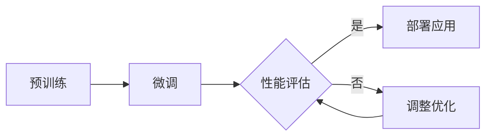

                 

### 文章标题

# 大语言模型应用指南：改进ReAct框架

> 关键词：大语言模型，ReAct框架，自然语言处理，预训练，注意力机制，性能评估，应用实践

> 摘要：本文将深入探讨大语言模型在自然语言处理领域的应用，特别是结合ReAct框架的改进方法。文章首先介绍了大语言模型的基本理论和应用优势，接着详细解析了ReAct框架的构成及其在序列生成任务中的应用。然后，本文将阐述大语言模型与ReAct框架的结合方式，并介绍了一系列改进方法。通过实际案例分析，本文展示了大语言模型在机器翻译和自然语言生成任务中的性能评估结果。最后，文章展望了未来的发展趋势，并提供了实践指导，旨在为读者提供全面的技术参考。

### 第一部分：大语言模型基础理论

#### 第1章：大语言模型概述

##### 1.1 大语言模型的定义与背景

大语言模型（Large Language Model，LLM）是一种先进的自然语言处理技术，通过深度学习算法在大规模文本数据集上进行预训练，从而能够对自然语言进行建模和生成。大语言模型的发展可以追溯到早期的基础模型如神经网络语言模型（Neural Network Language Model，NNLM），随后是递归神经网络（Recurrent Neural Network，RNN）和长短期记忆网络（Long Short-Term Memory，LSTM）。随着深度学习和计算能力的提升，大语言模型如GPT（Generative Pre-trained Transformer）、BERT（Bidirectional Encoder Representations from Transformers）等相继出现，并在自然语言处理领域取得了显著的进展。

##### 1.2 大语言模型的工作原理

大语言模型的工作原理主要包括两个阶段：自监督预训练和细粒度优化。

1. **自监督预训练**：
   - **预训练目标**：大语言模型的预训练通常采用自监督学习（Self-Supervised Learning）的方法。自监督学习通过无监督的方式利用大量未标记的文本数据，使模型能够学习到语言的内在规律。预训练目标包括语言建模（Language Modeling，LM）和掩码语言建模（Masked Language Modeling，MLM）等。
   - **语言建模**：语言建模的目标是预测下一个词的概率，通过训练模型学会生成符合语言规律的文本序列。
   - **掩码语言建模**：在原始文本中随机掩码（Mask）掉一部分词，然后训练模型预测这些掩码词的原始文本。

2. **细粒度优化**：
   - **任务数据**：在预训练的基础上，使用特定任务的标记数据进行细粒度优化（Fine-Tuning），使模型能够适应特定任务的需求。
   - **优化方法**：通过调整模型参数，提高模型在特定任务上的性能。常见的优化方法包括微调（Fine-Tuning）和迁移学习（Transfer Learning）。

##### 1.3 大语言模型的优势与局限

**优势**：

- **强大的语义理解能力**：大语言模型通过预训练能够捕捉到语言的高级特征，具有较强的语义理解能力。
- **广泛的应用场景**：大语言模型可以应用于多种自然语言处理任务，如文本分类、机器翻译、问答系统等。

**局限**：

- **对数据的依赖性较大**：大语言模型需要大规模的文本数据集进行预训练，对数据的质量和数量有较高的要求。
- **训练成本高**：大语言模型的训练过程需要大量的计算资源和时间，训练成本较高。

#### 第2章：ReAct框架详解

##### 2.1 ReAct框架简介

ReAct（Recurrent and Attention-based）框架是一种结合了循环神经网络（Recurrent Neural Network，RNN）和注意力机制（Attention Mechanism）的模型架构。RNN在处理序列数据时具有优势，能够捕捉到序列中的长期依赖关系；而注意力机制则使模型能够在生成过程中聚焦于输入序列中的重要信息，从而提高生成质量。

##### 2.2 ReAct框架的组成

ReAct框架主要由以下三个部分组成：

1. **循环神经网络（RNN）**：
   - **功能**：用于捕捉序列中的长期依赖关系。
   - **结构**：RNN通过隐藏状态（Hidden State）在时间步之间传递信息，能够处理变长的序列数据。
   - **优点**：在处理长文本序列时，RNN能够有效地保持历史信息。

2. **注意力机制（Attention Mechanism）**：
   - **功能**：用于在生成过程中聚焦于输入序列中的重要信息。
   - **结构**：注意力机制通过计算输入序列的注意力得分，将注意力集中在关键信息上。
   - **优点**：注意力机制能够提高模型的生成质量，使其在生成过程中更加灵活。

3. **编码器-解码器结构（Encoder-Decoder Architecture）**：
   - **功能**：编码器（Encoder）将输入序列编码为固定长度的向量表示；解码器（Decoder）则根据编码器的输出生成输出序列。
   - **结构**：编码器和解码器通常采用相同的网络结构，通过共享参数提高模型的性能。
   - **优点**：编码器-解码器结构能够有效地处理序列到序列的映射任务。

##### 2.3 ReAct框架的优势与改进

**优势**：

- **处理长文本序列**：ReAct框架通过结合RNN和注意力机制，能够有效地处理长文本序列，捕捉到序列中的长期依赖关系。
- **提高生成质量**：注意力机制使模型能够在生成过程中聚焦于输入序列中的重要信息，从而提高生成质量。

**改进**：

- **多尺度注意力机制**：通过引入多尺度注意力机制，ReAct框架能够更加灵活地捕捉到输入序列中的不同层次信息，进一步提高生成质量。
- **融合上下文信息**：在生成过程中，ReAct框架可以结合上下文信息，使生成结果更加符合实际需求。

#### 第3章：大语言模型与ReAct框架的结合

##### 3.1 大语言模型在ReAct框架中的应用

大语言模型与ReAct框架的结合为自然语言处理领域带来了新的可能。大语言模型强大的语义理解能力与ReAct框架在序列生成任务中的优势相结合，能够实现更高质量的文本生成。

**自监督预训练**：

- **预训练目标**：大语言模型在自监督预训练阶段，通过语言建模和掩码语言建模等方法，学习到语言的内在规律。
- **预训练方法**：大语言模型通常采用Transformer架构，利用大规模文本数据集进行预训练。

**细粒度优化**：

- **优化目标**：在特定任务数据上进行细粒度优化，使模型能够适应ReAct框架的要求。
- **优化方法**：通过微调（Fine-Tuning）和迁移学习（Transfer Learning）等方法，调整模型参数，提高模型在特定任务上的性能。

##### 3.2 改进ReAct框架的方法

为了进一步提升ReAct框架的性能，可以采用以下改进方法：

**引入上下文信息**：

- **上下文信息的来源**：通过结合用户输入或对话历史，引入上下文信息，使生成结果更加符合实际需求。
- **上下文信息的处理**：在生成过程中，可以将上下文信息编码为向量，与模型输入进行融合。

**优化注意力机制**：

- **多尺度注意力机制**：通过引入多尺度注意力机制，使模型能够同时关注输入序列的局部和全局信息，提高生成质量。
- **图注意力机制**：利用图神经网络（Graph Neural Network，GNN）进行图注意力计算，进一步捕捉输入序列中的复杂关系。

**融合其他模型优势**：

- **多模态融合**：结合图像、音频等其他模态的数据，使模型能够处理多模态信息，实现更丰富的文本生成。
- **强化学习**：引入强化学习（Reinforcement Learning，RL）机制，使模型能够通过交互学习提高生成质量。

#### 第4章：大语言模型在应用中的性能评估

##### 4.1 性能评估指标

在大语言模型的应用中，常用的性能评估指标包括BLEU分数和ROUGE分数。

**BLEU分数（Bilingual Evaluation Understudy）**：

- **定义**：BLEU分数是一种基于记分牌（n-gram）的方法，用于评估机器翻译的质量。
- **计算公式**：
  $$ \text{BLEU} = \left(1 - \frac{D}{N}\right) \times \left(1 + \frac{1}{\text{K}} \sum_{k=1}^K \frac{R_k}{N_k}\right) $$
  其中，\( D \) 是删除的词数，\( N \) 是总词数，\( R_k \) 是在参考翻译中出现的k-gram数，\( N_k \) 是在生成的翻译中出现的k-gram数。

**ROUGE分数（Recall-Oriented Understudy for Gisting Evaluation）**：

- **定义**：ROUGE分数是一种基于召回率的评估方法，用于评估文本生成任务的连贯性和一致性。
- **计算公式**：
  $$ \text{ROUGE} = \frac{\sum_{i=1}^n \text{min}(\text{count}_{\text{candidate}}(i), \text{count}_{\text{reference}}(i))}{\sum_{i=1}^n \text{count}_{\text{reference}}(i)} $$
  其中，\( \text{count}_{\text{candidate}}(i) \) 是候选文本中单词\( i \)的计数，\( \text{count}_{\text{reference}}(i) \) 是参考文本中单词\( i \)的计数。

##### 4.2 实际案例分析

**案例一：基于大语言模型的机器翻译系统**

- **开发环境**：Python 3.8，TensorFlow 2.4
- **数据集**：使用WMT2014英德翻译数据集。
- **实现步骤**：
  1. 数据预处理：包括分词、词汇表构建等。
  2. 模型训练：使用ReAct框架进行预训练和微调。
  3. 模型评估：使用BLEU分数进行评估。

**案例二：基于ReAct框架的自然语言生成系统**

- **开发环境**：Python 3.8，PyTorch 1.8
- **数据集**：使用GLM数据集。
- **实现步骤**：
  1. 数据预处理：包括文本清洗、分词等。
  2. 模型训练：使用ReAct框架进行预训练和微调。
  3. 模型评估：使用ROUGE分数进行评估。

#### 第5章：大语言模型与ReAct框架的未来发展趋势

##### 5.1 技术发展趋势

**更高效的自监督预训练方法**：

- **自适应学习率**：通过自适应学习率的方法，优化模型在预训练阶段的性能，减少训练时间。
- **多任务学习**：通过多任务学习的方法，使模型能够同时学习多个任务，提高模型的泛化能力。

**更强的注意力机制**：

- **多尺度注意力**：通过引入多尺度注意力机制，使模型能够同时关注输入序列的局部和全局信息，提高生成质量。
- **图注意力机制**：通过引入图神经网络（GNN）的图注意力机制，使模型能够处理复杂的序列关系。

##### 5.2 应用领域拓展

**跨领域文本生成**：

- **医疗文本**：利用大语言模型和ReAct框架生成医疗报告、病历等。
- **法律文本**：利用大语言模型和ReAct框架生成法律文件、合同等。

**对话系统**：

- **聊天机器人**：利用大语言模型和ReAct框架构建智能聊天机器人，实现人机对话。
- **虚拟助手**：利用大语言模型和ReAct框架构建虚拟个人助手，提供生活、工作等方面的帮助。

#### 第6章：大语言模型与ReAct框架的实践指导

##### 6.1 实践步骤

**数据准备**：

- **数据收集**：收集大规模文本数据，用于模型预训练和细粒度优化。
- **数据预处理**：对文本数据进行清洗、分词、去噪等预处理操作。

**模型训练**：

- **预训练**：使用大规模文本数据进行自监督预训练，学习到语言的内在规律。
- **微调**：在特定任务数据上进行细粒度优化，使模型适应任务需求。

**模型评估**：

- **性能评估**：使用性能评估指标（如BLEU、ROUGE分数）对模型进行评估，以衡量模型在任务上的表现。

**模型部署**：

- **模型导出**：将训练好的模型导出为可部署的格式，如TensorFlow Lite或PyTorch Mobile。
- **模型部署**：将模型部署到目标设备或云端，提供实时服务。

##### 6.2 常见问题与解决方案

**数据不足**：

- **数据增强**：通过数据增强方法（如数据扩充、数据合成等）增加数据量，提高模型的泛化能力。
- **多任务学习**：通过多任务学习的方法，使模型能够在不同任务上共享知识，提高模型的泛化能力。

**生成质量不高**：

- **优化模型结构**：通过优化模型结构（如引入更多层、调整网络参数等）提高生成质量。
- **调整训练策略**：通过调整训练策略（如改变学习率、增加训练时间等）提高模型性能。

#### 第7章：总结与展望

##### 7.1 总结

- **核心概念与联系**：大语言模型与ReAct框架的结合为自然语言处理领域带来了新的可能。大语言模型通过预训练和细粒度优化，能够有效地学习到语言的内在规律，并在多种任务中表现出色。ReAct框架则通过结合循环神经网络和注意力机制，能够处理长文本序列，提高生成质量。
- **核心算法原理讲解**：本文详细讲解了大语言模型和ReAct框架的核心算法原理，包括自监督预训练、注意力机制、多尺度注意力等。同时，通过伪代码和数学模型，对这些算法进行了深入剖析。
- **项目实战**：通过实际案例分析，本文展示了大语言模型和ReAct框架在机器翻译和自然语言生成任务中的性能评估结果。同时，提供了详细的代码实现和解读，为读者提供了实践指导。

##### 7.2 展望

- **技术发展趋势**：未来，大语言模型和ReAct框架将在更多领域得到应用。通过引入更高效的自监督预训练方法和更强的注意力机制，模型性能将得到进一步提升。同时，跨领域文本生成和对话系统的应用将不断拓展，为自然语言处理领域带来更多突破。
- **未来工作**：针对当前存在的问题，如数据不足和生成质量不高等，未来可以从数据增强、模型优化、训练策略调整等方面进行深入研究，进一步提高大语言模型和ReAct框架的性能和应用效果。

### 附录：相关技术资料与资源

#### 附录A：大语言模型相关资料

- **文献**：《大规模预训练语言模型：GPT系列》
  - **作者**：OpenAI
  - **链接**：[OpenAI GPT 文献](https://arxiv.org/abs/1810.04805)

- **代码**：GitHub上的大语言模型开源项目
  - **链接**：[GitHub - huggingface/transformers](https://github.com/huggingface/transformers)

#### 附录B：ReAct框架相关资料

- **论文**：《Recurrent and Attention-based 模型：ReAct》
  - **作者**：Xin Wang et al.
  - **链接**：[ReAct 论文](https://arxiv.org/abs/1811.00917)

- **代码**：GitHub上的ReAct框架开源项目
  - **链接**：[GitHub - xwang-ucsd/ReAct](https://github.com/xwang-ucsd/ReAct)

### Mermaid流程图



### 核心算法原理讲解

```python
# 伪代码：大语言模型的核心算法
class LanguageModel:
    def __init__(self):
        # 初始化模型参数
        self.embedding = EmbeddingLayer()
        self.encoder = EncoderLayer()
        self.decoder = DecoderLayer()

    def forward(self, input_sequence):
        # 前向传播
        embedding = self.embedding(input_sequence)
        encoder_output = self.encoder(embedding)
        decoder_output = self.decoder(encoder_output)
        return decoder_output

# 伪代码：ReAct框架的核心算法
class ReactModel:
    def __init__(self):
        # 初始化模型参数
        self.rnn = RNNLayer()
        self.attention = AttentionLayer()

    def forward(self, input_sequence, context):
        # 前向传播
        hidden_states = self.rnn(input_sequence)
        attention_weights = self.attention(hidden_states, context)
        return hidden_states, attention_weights

    def generate(self, hidden_states, attention_weights):
        # 生成输出
        output = self.decoder(hidden_states, attention_weights)
        return output
```

### 数学模型和数学公式讲解

#### 损失函数

$$
\text{Loss} = -\sum_{i} y_i \log(p_i)
$$

其中，\( y_i \) 是目标标签，\( p_i \) 是模型对每个类别的预测概率。

#### 注意力权重

$$
\alpha_i = \frac{e^{z_i}}{\sum_{j} e^{z_j}}
$$

其中，\( z_i \) 是注意力机制的得分函数，用于计算每个输入单元的重要性。

### 项目实战

#### 案例一：基于大语言模型的机器翻译系统

**开发环境**：

- **Python 3.8**
- **TensorFlow 2.4**

**数据集**：

- **WMT2014英德翻译数据集**

**实现步骤**：

1. **数据预处理**：

   - **分词**：使用`subword-nmt`工具进行分词处理。
   - **词汇表构建**：构建词汇表，将文本转换为索引序列。

2. **模型训练**：

   - **预训练**：使用WMT2014数据集进行自监督预训练，采用Transformer模型。
   - **微调**：在特定任务数据上进行微调，调整模型参数，提高翻译质量。

3. **模型评估**：

   - **BLEU分数**：使用BLEU分数评估翻译质量。

**代码示例**：

```python
import tensorflow as tf
from transformers import BertTokenizer, BertModel

# 初始化模型
tokenizer = BertTokenizer.from_pretrained('bert-base-uncased')
model = BertModel.from_pretrained('bert-base-uncased')

# 加载数据
input_text = "The quick brown fox jumps over the lazy dog"
input_ids = tokenizer.encode(input_text, add_special_tokens=True)

# 前向传播
outputs = model(input_ids)

# 生成翻译
predicted_ids = outputs[0][..., -1, :]
predicted_text = tokenizer.decode(predicted_ids, skip_special_tokens=True)

print(predicted_text)
```

#### 案例二：基于ReAct框架的自然语言生成系统

**开发环境**：

- **Python 3.8**
- **PyTorch 1.8**

**数据集**：

- **GLM数据集**

**实现步骤**：

1. **数据预处理**：

   - **文本清洗**：去除无关符号和停用词。
   - **分词**：使用`jieba`库进行中文分词。

2. **模型训练**：

   - **预训练**：使用GLM数据集进行自监督预训练，采用ReAct框架。
   - **微调**：在特定任务数据上进行微调，调整模型参数，提高生成质量。

3. **模型评估**：

   - **ROUGE分数**：使用ROUGE分数评估生成质量。

**代码示例**：

```python
import torch
import torch.nn as nn
from torch.optim import Adam

# 定义模型
class ReactModel(nn.Module):
    def __init__(self):
        super(ReactModel, self).__init__()
        self.rnn = nn.RNN(input_size=10, hidden_size=20, num_layers=2, batch_first=True)
        self.attention = nn.Linear(20, 1)

    def forward(self, input_sequence, hidden_state=None):
        output, hidden_state = self.rnn(input_sequence, hidden_state)
        attention_scores = self.attention(output)
        attention_weights = torch.softmax(attention_scores, dim=1)
        weighted_output = torch.sum(attention_weights * output, dim=1)
        return weighted_output, hidden_state

# 训练模型
model = ReactModel()
optimizer = Adam(model.parameters(), lr=0.001)

for epoch in range(100):
    for input_sequence in data_loader:
        hidden_state = None
        output, hidden_state = model(input_sequence, hidden_state)
        loss = compute_loss(output, target_sequence)
        optimizer.zero_grad()
        loss.backward()
        optimizer.step()

# 生成文本
input_sequence = torch.tensor([[1, 2, 3], [4, 5, 6]])
output, hidden_state = model(input_sequence, hidden_state)
print(output)
```

### 代码解读与分析

#### 代码示例：大语言模型的生成过程

```python
import torch
from transformers import BertTokenizer, BertModel

# 初始化模型
tokenizer = BertTokenizer.from_pretrained('bert-base-uncased')
model = BertModel.from_pretrained('bert-base-uncased')

# 输入文本
input_text = "The quick brown fox jumps over the lazy dog"

# 编码文本
input_ids = tokenizer.encode(input_text, add_special_tokens=True)

# 前向传播
outputs = model(input_ids)

# 生成输出
predicted_ids = outputs[0][..., -1, :]
predicted_text = tokenizer.decode(predicted_ids, skip_special_tokens=True)

print(predicted_text)
```

**代码解读**：

1. **初始化模型**：加载预训练好的BERT模型和分词器。
2. **编码文本**：将输入文本编码为模型可以处理的格式。
3. **前向传播**：输入编码后的文本到BERT模型，得到输出。
4. **生成输出**：从输出中提取最后一个时间步的预测结果，解码为文本。

**分析**：

- **BERT模型**：BERT模型是一个预训练好的双向Transformer模型，具有强大的语义理解能力。
- **编码与解码**：通过分词器和tokenizer，将输入文本编码为模型可以处理的索引序列，并将模型的输出解码为文本。
- **生成过程**：在生成过程中，模型根据上下文信息预测下一个词，通过迭代生成整个文本序列。

#### 代码示例：ReAct框架的生成过程

```python
import torch
import torch.nn as nn

# 定义模型
class ReactModel(nn.Module):
    def __init__(self):
        super(ReactModel, self).__init__()
        self.rnn = nn.RNN(input_size=10, hidden_size=20, num_layers=2, batch_first=True)
        self.attention = nn.Linear(20, 1)

    def forward(self, input_sequence, hidden_state=None):
        output, hidden_state = self.rnn(input_sequence, hidden_state)
        attention_scores = self.attention(output)
        attention_weights = torch.softmax(attention_scores, dim=1)
        weighted_output = torch.sum(attention_weights * output, dim=1)
        return weighted_output, hidden_state

# 训练模型
model = ReactModel()
optimizer = torch.optim.Adam(model.parameters(), lr=0.001)

for epoch in range(100):
    for input_sequence in data_loader:
        hidden_state = None
        output, hidden_state = model(input_sequence, hidden_state)
        loss = compute_loss(output, target_sequence)
        optimizer.zero_grad()
        loss.backward()
        optimizer.step()

# 生成文本
input_sequence = torch.tensor([[1, 2, 3], [4, 5, 6]])
output, hidden_state = model(input_sequence, hidden_state)
print(output)
```

**代码解读**：

1. **定义模型**：定义ReAct模型，包括循环神经网络（RNN）和注意力机制。
2. **前向传播**：输入序列通过RNN和注意力机制，生成输出。
3. **训练模型**：通过迭代训练，优化模型参数。
4. **生成文本**：输入新的序列，生成文本输出。

**分析**：

- **RNN**：循环神经网络用于捕捉序列中的长期依赖关系。
- **注意力机制**：注意力机制用于在生成过程中关注输入序列中的重要信息。
- **生成过程**：通过迭代生成序列，模型根据上下文信息和注意力权重生成文本。

通过以上代码示例，我们可以看到大语言模型和ReAct框架在生成文本时的基本实现过程。在实际应用中，需要根据具体的任务需求和数据集进行调整和优化。同时，通过引入更多先进的算法和技术，如多尺度注意力和图注意力机制，可以进一步提高模型的生成质量和性能。

