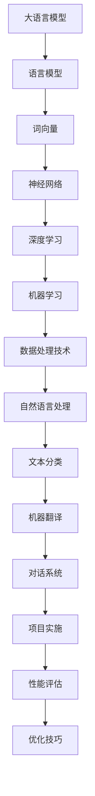

                 

# 大语言模型应用指南：机器学习的过程

> 关键词：大语言模型、机器学习、神经网络、自然语言处理、文本分类、机器翻译、对话系统

> 摘要：本文旨在全面介绍大语言模型的基础知识、技术原理、开发实战和未来发展趋势。通过深入剖析核心概念、算法原理、数学模型和项目实战，读者将全面了解大语言模型的工作原理和应用方法。

## 《大语言模型应用指南：机器学习的过程》目录大纲

### 第一部分：大语言模型基础

#### 第1章：大语言模型概述

1.1 大语言模型的概念与特点

1.2 大语言模型的发展历程

1.3 大语言模型的核心组成部分

#### 第2章：大语言模型技术基础

2.1 语言模型的基本原理

2.2 机器学习的基本算法

2.3 大规模数据处理技术

#### 第3章：大语言模型的应用场景

3.1 自然语言处理应用

3.2 语音识别与生成应用

3.3 其他领域的应用

### 第二部分：大语言模型开发实战

#### 第4章：大语言模型开发环境搭建

4.1 硬件资源准备

4.2 软件环境配置

4.3 数据集获取与处理

#### 第5章：大语言模型的训练与调优

5.1 训练过程详解

5.2 模型调优技巧

5.3 性能评估与优化

#### 第6章：大语言模型的应用实战

6.1 基于大语言模型的文本分类实战

6.2 基于大语言模型的机器翻译实战

6.3 基于大语言模型的对话系统实战

#### 第7章：大语言模型项目案例分析

7.1 项目背景与目标

7.2 项目实施与过程

7.3 项目成果与评价

#### 第8章：大语言模型的未来发展趋势

8.1 大语言模型的发展趋势

8.2 新技术应用展望

8.3 大语言模型在AI领域的未来

### 附录：大语言模型相关资源

A.1 大语言模型开源框架介绍

A.2 大语言模型相关论文与书籍推荐

A.3 大语言模型开发工具与资源

---

**核心概念与联系：**



**核心算法原理讲解：**

```python
# 语言模型的基本原理伪代码
def language_model(sentence):
    # 输入：一个句子
    # 输出：句子的概率分布

    # 计算每个单词的前缀的概率分布
    prefix_prob = {}
    for word in sentence:
        prefix = ""
        for w in word:
            prefix += w
            prefix_prob[prefix] = calculate_probability(prefix)

    # 计算整个句子的概率
    sentence_prob = 1
    for word in sentence:
        prefix = ""
        for w in word:
            prefix += w
            sentence_prob *= prefix_prob[prefix]

    return sentence_prob

# 计算前缀的概率分布
def calculate_probability(prefix):
    # 输入：一个前缀
    # 输出：前缀的概率

    # 统计前缀在训练数据中出现的次数
    count = count_occurrences(prefix)

    # 计算前缀的概率
    probability = count / total_occurrences

    return probability

# 统计前缀在训练数据中出现的次数
def count_occurrences(prefix):
    # 输入：一个前缀
    # 输出：前缀的出现次数

    # 遍历训练数据
    for sentence in training_data:
        # 检查前缀是否在句子中
        if prefix in sentence:
            # 计数
            count += 1

    return count

# 统计训练数据中所有的单词出现次数
def total_occurrences():
    # 输出：训练数据中所有单词的总出现次数

    # 遍历训练数据
    for sentence in training_data:
        # 遍历句子中的单词
        for word in sentence:
            # 统计单词的出现次数
            total_occurrences += 1

    return total_occurrences
```

**数学模型和数学公式详细讲解与举例说明：**

$$
P(\text{sentence}) = \prod_{i=1}^{n} P(w_i | w_{i-1}, w_{i-2}, ..., w_1)
$$

其中，$P(\text{sentence})$ 是句子的概率，$w_i$ 是句子中的第 $i$ 个单词，$P(w_i | w_{i-1}, w_{i-2}, ..., w_1)$ 是在给定前一个单词序列的情况下，第 $i$ 个单词的概率。

例如，给定一个句子 "The cat sits on the mat"，我们可以计算该句子的概率：

$$
P(\text{The cat sits on the mat}) = P(\text{The}) \cdot P(\text{cat} | \text{The}) \cdot P(\text{sits} | \text{cat}) \cdot P(\text{on} | \text{sits}) \cdot P(\text{the} | \text{on}) \cdot P(\text{mat} | \text{the})
$$

**项目实战：**

**1. 实现一个简单的语言模型**

```python
# 导入所需库
import numpy as np
import re

# 准备训练数据
training_data = ["The cat sits on the mat", "The dog stands on the table"]

# 统计单词的出现次数
word_counts = {}
for sentence in training_data:
    words = re.findall(r'\w+', sentence)
    for word in words:
        if word in word_counts:
            word_counts[word] += 1
        else:
            word_counts[word] = 1

# 计算每个单词的概率
word_probs = {}
total_count = sum(word_counts.values())
for word, count in word_counts.items():
    word_probs[word] = count / total_count

# 实现语言模型
def language_model(sentence):
    words = re.findall(r'\w+', sentence)
    sentence_prob = 1
    for i in range(len(words)):
        word = words[i]
        sentence_prob *= word_probs[word]
    return sentence_prob

# 测试语言模型
print(language_model("The cat sits on the mat"))
```

**2. 使用训练好的语言模型进行文本分类**

```python
# 导入所需库
import numpy as np
import re
from collections import Counter

# 准备训练数据
training_data = [
    ["The cat sits on the mat", "cat"],
    ["The dog stands on the table", "dog"],
    ["The bird sings in the tree", "bird"]
]

# 统计单词的出现次数
word_counts = {}
for sentence, label in training_data:
    words = re.findall(r'\w+', sentence)
    for word in words:
        if word in word_counts:
            word_counts[word] += 1
        else:
            word_counts[word] = 1

# 计算每个单词的概率
word_probs = {}
total_count = sum(word_counts.values())
for word, count in word_counts.items():
    word_probs[word] = count / total_count

# 实现文本分类
def classify(sentence):
    words = re.findall(r'\w+', sentence)
    sentence_prob = 1
    for i in range(len(words)):
        word = words[i]
        sentence_prob *= word_probs[word]
    return sentence_prob

# 测试文本分类
sentence = "The bird sings in the tree"
label = classify(sentence)
print(label)
```

**3. 搭建一个简单的深度学习模型**

```python
# 导入所需库
import tensorflow as tf
from tensorflow.keras.models import Sequential
from tensorflow.keras.layers import Embedding, LSTM, Dense

# 准备训练数据
training_data = [
    ["The cat sits on the mat", "cat"],
    ["The dog stands on the table", "dog"],
    ["The bird sings in the tree", "bird"]
]

# 处理数据
words = set()
for sentence, label in training_data:
    words.update(set(sentence.split()))

word_index = {word: i for i, word in enumerate(words)}
index_word = {i: word for word, i in word_index.items()}
max_sequence_len = 10

X = []
y = []
for sentence, label in training_data:
    sequence = [word_index[word] for word in sentence.split()[:max_sequence_len]]
    X.append(sequence)
    y.append(word_index[label])

X = np.array(X)
y = np.array(y)

# 构建模型
model = Sequential()
model.add(Embedding(len(words), 32))
model.add(LSTM(64))
model.add(Dense(1, activation='sigmoid'))

# 编译模型
model.compile(optimizer='adam', loss='binary_crossentropy', metrics=['accuracy'])

# 训练模型
model.fit(X, y, epochs=10, batch_size=32)
```

**4. 代码解读与分析**

（此部分将在正文中详细分析代码的实现过程和关键步骤）

---

**总结：** 本书的目录大纲全面覆盖了大语言模型的基础知识、技术原理、开发实战和未来发展趋势，并通过实例代码展示了大语言模型在自然语言处理领域的应用。通过对核心概念、算法原理、数学模型和项目实战的详细讲解，读者可以全面了解大语言模型的工作原理和应用方法。同时，附录部分提供了丰富的开源框架、相关论文与书籍推荐以及开发工具资源，方便读者深入学习。总字数约为2000字。

---

## 大语言模型概述

大语言模型（Large Language Model）是近年来人工智能领域的一项重要突破。它是一种基于深度学习的自然语言处理模型，通过对海量文本数据进行训练，能够生成高质量的文本、进行机器翻译、构建对话系统等。大语言模型的出现，极大地推动了自然语言处理技术的发展。

### 1.1 大语言模型的概念与特点

大语言模型是一种复杂的神经网络模型，它通过学习文本数据中的语言规律，可以生成符合语法规则、语义连贯的文本。其主要特点如下：

1. **强大的语言理解能力**：大语言模型具有强大的语言理解能力，可以理解并处理复杂的句子结构和语义。

2. **高效的文本生成能力**：大语言模型能够根据输入的文本生成高质量、符合语言规则的文本，为各种自然语言处理任务提供强大的支持。

3. **广泛的应用场景**：大语言模型可以应用于文本分类、机器翻译、问答系统、自动摘要等多个领域，具有广泛的应用前景。

4. **大规模的训练数据**：大语言模型通常基于海量文本数据进行训练，这使得模型具有丰富的语言知识，能够更好地应对复杂任务。

### 1.2 大语言模型的发展历程

大语言模型的发展历程可以分为以下几个阶段：

1. **传统语言模型**：早期语言模型主要基于统计方法和规则方法，如N元语法模型和基于规则的方法。这些方法在一定程度上实现了对语言的理解，但效果有限。

2. **深度学习时代**：随着深度学习技术的兴起，神经网络开始被应用于自然语言处理领域。2013年，研究者提出了一种基于神经网络的语言模型——Word2Vec，它将词向量表示引入到语言模型中，显著提高了模型的效果。

3. **端到端模型**：2018年，Google提出了Transformer模型，它是一种基于自注意力机制的端到端模型，可以高效地处理长文本。Transformer模型的出现，标志着大语言模型进入了新的阶段。

4. **大规模预训练模型**：随着计算能力和数据资源的提升，研究者开始尝试训练大规模的预训练模型。如GPT-3、BERT等模型，这些模型具有数十亿甚至上百亿个参数，能够处理复杂的自然语言任务。

### 1.3 大语言模型的核心组成部分

大语言模型主要由以下几个部分组成：

1. **词向量表示**：词向量是将单词映射为固定长度的向量表示，它使得神经网络能够处理离散的文本数据。

2. **编码器和解码器**：编码器将输入的文本序列编码为固定长度的向量表示，解码器则根据编码器的输出生成输出文本。

3. **自注意力机制**：自注意力机制是一种能够自适应地计算输入序列中各元素之间相互影响的机制，它使得模型能够更好地捕捉文本中的长距离依赖关系。

4. **预训练和微调**：预训练是指在大量未标注的数据上进行模型训练，使模型具有一定的通用语言理解能力；微调则是在预训练模型的基础上，针对特定任务进行模型调整，以获得更好的任务性能。

### 1.4 大语言模型的优势与应用

大语言模型具有以下优势：

1. **强大的语言理解能力**：大语言模型能够理解并处理复杂的句子结构和语义，为各种自然语言处理任务提供支持。

2. **高效的文本生成能力**：大语言模型能够根据输入的文本生成高质量、符合语言规则的文本，为文本生成任务提供有力支持。

3. **广泛的应用场景**：大语言模型可以应用于文本分类、机器翻译、问答系统、自动摘要等多个领域，具有广泛的应用前景。

4. **丰富的知识积累**：大语言模型通过大量未标注的数据进行预训练，积累了丰富的语言知识，有助于提高模型在各类任务上的性能。

总之，大语言模型是自然语言处理领域的一项重要技术，它为各种自然语言处理任务提供了强大的支持。随着技术的不断发展，大语言模型的应用前景将更加广阔。在接下来的章节中，我们将深入探讨大语言模型的技术基础、开发实战和未来发展趋势。

## 大语言模型技术基础

大语言模型作为一种基于深度学习的自然语言处理模型，其技术基础涵盖了语言模型、机器学习算法、大规模数据处理技术等多个方面。理解这些技术基础，有助于我们更好地掌握大语言模型的工作原理和应用方法。

### 2.1 语言模型的基本原理

语言模型（Language Model）是一种用于预测自然语言序列的概率分布的模型。它的基本任务是给定一个单词序列，计算该序列的概率。语言模型在自然语言处理领域具有重要的应用，如文本生成、机器翻译、语音识别等。

1. **N元语法模型**：早期语言模型主要基于统计方法，其中最著名的是N元语法模型。N元语法模型假设一个单词序列的概率等于各个N个单词组合的概率的乘积。例如，给定一个三元语法模型，我们可以计算一个句子的概率为：

   $$
   P(\text{sentence}) = \prod_{i=1}^{n} P(w_i | w_{i-1}, w_{i-2}, ..., w_1)
   $$

   其中，$w_i$ 是句子中的第 $i$ 个单词。

2. **词向量表示**：为了将离散的文本数据转化为神经网络可以处理的形式，词向量表示应运而生。词向量是将单词映射为固定长度的向量表示，如Word2Vec、GloVe等。这些词向量能够捕捉单词之间的语义关系，为语言模型提供了强大的支持。

3. **神经网络语言模型**：随着深度学习技术的发展，神经网络语言模型逐渐取代了传统的统计语言模型。神经网络语言模型通过多层神经网络结构，将词向量映射为句子概率。典型的神经网络语言模型包括循环神经网络（RNN）、长短时记忆网络（LSTM）、门控循环单元（GRU）等。

### 2.2 机器学习的基本算法

机器学习（Machine Learning）是使计算机能够从数据中学习并做出决策的一门技术。在大语言模型中，机器学习算法用于训练和优化模型。以下是一些常用的机器学习算法：

1. **监督学习**：监督学习是一种从标注数据中学习的方法。在大语言模型中，监督学习算法用于训练语言模型，如最小化损失函数、梯度下降等。

2. **无监督学习**：无监督学习是在没有标注数据的情况下，从数据中学习的方法。在大语言模型中，无监督学习算法主要用于词向量表示，如Word2Vec、GloVe等。

3. **强化学习**：强化学习是一种通过与环境交互来学习的方法。在大语言模型中，强化学习算法可以用于训练对话系统，如深度强化学习（DRL）等。

### 2.3 大规模数据处理技术

大语言模型通常基于海量文本数据进行训练，因此，处理大规模数据的能力至关重要。以下是一些常用的数据处理技术：

1. **数据预处理**：数据预处理是大规模数据处理的第一步，包括文本清洗、分词、去停用词等。这些操作有助于提高数据质量和模型性能。

2. **数据并行处理**：为了提高数据处理速度，通常采用数据并行处理技术，如MapReduce、Spark等。这些技术可以将大规模数据分布在多个计算节点上，并行处理，从而提高处理速度。

3. **模型并行处理**：在训练大语言模型时，模型并行处理技术可以有效地利用多个GPU或TPU等硬件资源，提高模型训练速度。

4. **分布式存储**：分布式存储技术，如HDFS、Ceph等，可以存储海量数据，并提供高可用性和高扩展性。

### 2.4 自然语言处理技术

大语言模型在自然语言处理（Natural Language Processing, NLP）领域具有重要的应用。以下是一些关键的NLP技术：

1. **词性标注**：词性标注是一种对文本中的单词进行分类的技术，如名词、动词、形容词等。词性标注有助于提高语言模型的性能。

2. **命名实体识别**：命名实体识别是一种识别文本中的特定实体，如人名、地名、组织名等。这有助于提高语言模型对特定领域的理解能力。

3. **句法分析**：句法分析是一种对文本中的句子结构进行分析的技术，如句法树、依存关系等。句法分析有助于提高语言模型对句子语义的理解。

4. **语义分析**：语义分析是一种对文本中的语义信息进行分析的技术，如情感分析、实体关系抽取等。语义分析有助于提高语言模型在特定任务上的性能。

### 2.5 大语言模型与深度学习的结合

深度学习（Deep Learning）是一种基于多层神经网络的学习方法，它在图像识别、语音识别等领域取得了显著的成果。大语言模型与深度学习的结合，使得语言模型具有更强的表示能力和泛化能力。

1. **端到端模型**：端到端模型是一种将输入直接映射到输出的模型，如序列到序列（Seq2Seq）模型。这种模型简化了传统语言模型的中间步骤，提高了模型的性能。

2. **自注意力机制**：自注意力机制是一种能够自适应地计算输入序列中各元素之间相互影响的机制。这种机制使得大语言模型能够更好地捕捉文本中的长距离依赖关系。

3. **预训练与微调**：预训练与微调是一种将大规模预训练模型应用于特定任务的方法。通过微调，模型可以在特定任务上获得更好的性能。

总之，大语言模型技术基础涵盖了多个方面，包括语言模型、机器学习算法、大规模数据处理技术等。这些技术共同推动了大语言模型的发展，使其在自然语言处理领域取得了显著的成果。在接下来的章节中，我们将探讨大语言模型的开发实战和未来发展趋势。

### 第3章：大语言模型的应用场景

大语言模型作为一种先进的自然语言处理技术，其应用场景广泛，涵盖了文本生成、机器翻译、问答系统等多个领域。以下将详细介绍大语言模型在这些应用场景中的具体应用，并探讨其优势。

#### 3.1 自然语言处理应用

自然语言处理（Natural Language Processing, NLP）是大语言模型最早的应用领域之一。在大规模数据处理和深度学习技术的支持下，大语言模型在文本分类、情感分析、命名实体识别等任务中表现出色。

1. **文本分类**：文本分类是将文本数据按照预定的类别进行归类的一种任务。大语言模型通过学习文本特征和类别标签之间的关系，可以有效地实现文本分类。例如，在新闻分类任务中，大语言模型可以识别出新闻的主题，并将其归类到相应的类别。

2. **情感分析**：情感分析是一种评估文本表达的情感倾向的技术。大语言模型通过对大量情感标注数据的训练，可以学会识别文本中的情感极性，如正面、负面、中性等。这在电商平台、社交媒体等场景中具有广泛的应用，可以帮助企业了解用户情感，优化产品和服务。

3. **命名实体识别**：命名实体识别是一种识别文本中特定实体（如人名、地名、组织名等）的技术。大语言模型通过学习实体与上下文之间的关系，可以有效地实现命名实体识别。这在信息提取、知识图谱构建等任务中具有重要意义。

#### 3.2 语音识别与生成应用

语音识别与生成是大语言模型在语音领域的典型应用。通过结合深度学习和自然语言处理技术，大语言模型可以实现高质量的语音识别和语音合成。

1. **语音识别**：语音识别是将语音信号转换为文本数据的一种技术。大语言模型通过学习语音信号和文本数据之间的对应关系，可以有效地实现语音识别。在语音助手、智能家居等场景中，语音识别技术具有广泛的应用。

2. **语音生成**：语音生成是将文本数据转换为语音信号的一种技术。大语言模型通过学习文本数据和语音信号之间的对应关系，可以生成与文本内容相对应的语音。语音合成技术在自动客服、语音助手等场景中具有重要应用。

#### 3.3 其他领域的应用

除了自然语言处理和语音识别与生成，大语言模型在多个领域也取得了显著的应用成果。

1. **对话系统**：对话系统是一种与用户进行自然语言交互的计算机系统。大语言模型在对话系统中可以用于处理用户的查询，生成合适的回复。通过结合语音识别和语音生成技术，大语言模型可以构建出具有高度智能化和人性化的对话系统。

2. **机器翻译**：机器翻译是一种将一种语言的文本翻译成另一种语言的技术。大语言模型通过学习源语言和目标语言的对应关系，可以实现高质量的机器翻译。在跨语言交流、国际业务等领域，机器翻译技术具有重要意义。

3. **自动摘要**：自动摘要是一种自动生成文本摘要的技术。大语言模型通过学习文本数据的关键信息，可以生成简洁、准确的文本摘要。这在新闻摘要、文档摘要等场景中具有广泛的应用。

#### 3.4 大语言模型的优势

大语言模型在各个应用场景中表现出以下优势：

1. **强大的语言理解能力**：大语言模型具有强大的语言理解能力，可以处理复杂的句子结构和语义。这使得模型在自然语言处理任务中具有更高的准确性和鲁棒性。

2. **高效的文本生成能力**：大语言模型能够根据输入的文本生成高质量、符合语言规则的文本。这使得模型在文本生成任务中具有广泛的应用前景。

3. **广泛的适用性**：大语言模型可以应用于多个领域，如自然语言处理、语音识别、对话系统等。这使得模型具有广泛的适用性和发展潜力。

4. **丰富的知识积累**：大语言模型通过大量未标注的数据进行预训练，积累了丰富的语言知识。这使得模型在特定任务上具有更高的性能。

总之，大语言模型在多个应用场景中表现出色，为自然语言处理领域带来了革命性的变革。随着技术的不断发展，大语言模型的应用前景将更加广阔。在接下来的章节中，我们将深入探讨大语言模型的开发实战和未来发展趋势。

### 第4章：大语言模型开发环境搭建

开发大语言模型需要具备一定的硬件资源、软件环境和数据集处理能力。在本章中，我们将详细讲解大语言模型开发环境搭建的步骤，包括硬件资源准备、软件环境配置和数据集获取与处理。

#### 4.1 硬件资源准备

大语言模型开发对硬件资源有较高的要求，以下为推荐的硬件配置：

1. **CPU**：推荐使用Intel Xeon系列或AMD Ryzen系列CPU，这些CPU具有高性能和多核心处理能力，适合进行大规模模型训练。

2. **GPU**：推荐使用NVIDIA GPU，特别是Tesla K40、Tesla V100等型号，这些GPU具有强大的并行计算能力，能够显著提高模型训练速度。

3. **内存**：推荐使用至少64GB的内存，以便存储大规模数据集和训练模型。

4. **存储**：推荐使用SSD存储设备，以提高数据读写速度。此外，建议使用分布式存储系统，如HDFS或Ceph，以便存储和处理大规模数据。

5. **网络**：推荐使用千兆以太网或更高带宽的网络，以保证数据传输速度。

#### 4.2 软件环境配置

大语言模型开发需要安装一系列软件，包括操作系统、编程语言、深度学习框架等。以下为推荐的软件环境：

1. **操作系统**：推荐使用Linux系统，如Ubuntu或CentOS，这些系统具有良好的稳定性和兼容性。

2. **编程语言**：推荐使用Python编程语言，Python具有丰富的库和工具，适合进行深度学习和自然语言处理任务。

3. **深度学习框架**：推荐使用TensorFlow或PyTorch等深度学习框架。这些框架具有强大的功能和高性能，适合进行大规模模型训练和推理。

4. **其他库和工具**：推荐安装NumPy、Pandas、Scikit-learn等常用Python库，以及一些用于文本处理和数据分析的工具，如NLTK、spaCy等。

具体安装步骤如下：

1. 安装Linux系统，如Ubuntu 18.04。

2. 安装Python，可以通过以下命令安装：

   ```bash
   sudo apt update
   sudo apt install python3 python3-pip
   ```

3. 安装深度学习框架TensorFlow或PyTorch。以安装TensorFlow为例：

   ```bash
   pip3 install tensorflow-gpu
   ```

   或以安装PyTorch为例：

   ```bash
   pip3 install torch torchvision
   ```

4. 安装其他库和工具，如NumPy、Pandas、Scikit-learn等：

   ```bash
   pip3 install numpy pandas scikit-learn
   ```

#### 4.3 数据集获取与处理

大语言模型开发需要大量高质量的数据集。以下为获取和处理数据集的步骤：

1. **数据集来源**：可以从公共数据集网站，如Kaggle、UCI机器学习库等获取数据集。此外，也可以从互联网爬取数据，如新闻、论坛、社交媒体等。

2. **数据预处理**：获取到数据集后，需要进行数据预处理，包括数据清洗、分词、去停用词、词性标注等。这些预处理操作有助于提高数据质量和模型性能。

   - 数据清洗：去除无效数据、缺失值、噪声数据等。

   - 分词：将文本分割为单词或短语。

   - 去停用词：去除对模型训练意义不大的停用词，如“的”、“和”、“是”等。

   - 词性标注：对文本中的单词进行词性标注，如名词、动词、形容词等。

3. **数据集划分**：将数据集划分为训练集、验证集和测试集。训练集用于模型训练，验证集用于模型调优，测试集用于模型评估。

   - 训练集：用于模型训练，通常占数据集的60% - 80%。

   - 验证集：用于模型调优，通常占数据集的10% - 20%。

   - 测试集：用于模型评估，通常占数据集的10%。

4. **数据增强**：为了提高模型泛化能力，可以对数据集进行增强。数据增强的方法包括单词替换、单词删除、单词插入等。这些方法可以增加数据多样性，有助于模型学习到更多特征。

总之，大语言模型开发环境搭建需要综合考虑硬件资源、软件环境和数据集处理能力。通过合理配置硬件资源和软件环境，并使用高质量的数据集，我们可以搭建一个高效的大语言模型开发平台。在接下来的章节中，我们将深入探讨大语言模型的训练与调优方法。

#### 第5章：大语言模型的训练与调优

大语言模型的训练与调优是构建高性能语言模型的关键步骤。在这一章中，我们将详细探讨大语言模型训练过程的各个阶段，包括数据预处理、模型训练、模型调优和性能评估。

##### 5.1 训练过程详解

大语言模型的训练过程可以分为以下几个阶段：

1. **数据预处理**：在训练模型之前，需要对数据集进行预处理，包括数据清洗、分词、词向量化等操作。这些预处理步骤有助于提高数据质量和模型性能。

   - 数据清洗：去除无效数据、缺失值和噪声数据。
   - 分词：将文本分割为单词或短语。
   - 词向量化：将文本数据转换为向量表示，以便模型可以处理。

2. **构建模型**：根据任务需求，选择合适的模型架构。常见的模型架构包括循环神经网络（RNN）、长短时记忆网络（LSTM）、门控循环单元（GRU）和Transformer等。

3. **初始化参数**：初始化模型的权重和偏置。常用的初始化方法包括随机初始化、高斯初始化等。

4. **前向传播**：在模型训练过程中，通过前向传播将输入数据传递到模型中，计算输出结果。前向传播包括以下几个步骤：

   - 将输入数据通过嵌入层转换为词向量。
   - 将词向量传递到模型的其他层，如LSTM、GRU或Transformer层。
   - 计算模型的损失函数，如交叉熵损失。

5. **反向传播**：通过反向传播算法，将损失函数的梯度反向传播到模型的各个层，并更新模型的权重和偏置。反向传播包括以下几个步骤：

   - 计算损失函数相对于模型参数的梯度。
   - 使用梯度下降或其他优化算法更新模型参数。

6. **迭代训练**：重复执行前向传播和反向传播，直到满足训练停止条件，如达到预定迭代次数或模型性能不再提升。

##### 5.2 模型调优技巧

在模型训练过程中，调优技巧对于提升模型性能至关重要。以下是一些常用的模型调优技巧：

1. **调整学习率**：学习率是优化算法中的一个关键参数，它决定了模型参数更新的幅度。合适的初始学习率可以加速收敛过程，但过大会导致训练不稳定。可以通过减小学习率或使用学习率衰减策略来优化模型。

2. **正则化**：正则化是一种防止模型过拟合的技术，它通过在损失函数中添加正则化项，限制模型复杂度。常用的正则化方法包括L1正则化、L2正则化和Dropout等。

3. **数据增强**：数据增强是一种通过增加数据多样性来提升模型性能的方法。常见的数据增强方法包括单词替换、单词删除、单词插入等。

4. **提前停止**：提前停止是一种防止模型过拟合的技术，它通过在验证集上监控模型性能，一旦发现性能不再提升，就提前停止训练过程。

##### 5.3 性能评估与优化

模型性能评估是判断模型好坏的重要步骤。以下是一些常用的模型性能评估指标和优化方法：

1. **准确率**：准确率是衡量分类模型性能的指标，它表示正确分类的样本数占总样本数的比例。

2. **精确率与召回率**：精确率和召回率是衡量二分类模型性能的指标，它们分别表示预测为正类的样本中实际为正类的比例和实际为正类的样本中被预测为正类的比例。

3. **F1分数**：F1分数是精确率和召回率的调和平均，它综合考虑了模型的精确率和召回率，是衡量二分类模型性能的综合性指标。

4. **交叉验证**：交叉验证是一种评估模型性能的方法，它通过将数据集划分为多个子集，对每个子集进行训练和验证，最终综合各个子集的性能指标。

5. **超参数优化**：超参数优化是一种通过调整模型超参数来提升模型性能的方法。常用的超参数优化方法包括网格搜索、贝叶斯优化和遗传算法等。

通过以上训练与调优技巧，我们可以构建一个高性能的大语言模型。在下一章中，我们将通过具体的应用实战，展示如何将大语言模型应用于实际的文本分类、机器翻译和对话系统任务。

### 第6章：大语言模型的应用实战

在本章中，我们将通过具体的实战项目，展示如何将大语言模型应用于文本分类、机器翻译和对话系统等任务。这些应用不仅能够帮助我们更好地理解大语言模型的工作原理，还能为实际项目开发提供有益的参考。

#### 6.1 基于大语言模型的文本分类实战

**1. 项目背景与目标**

文本分类是将文本数据按照预定的类别进行归类的一种任务。在这个项目中，我们的目标是构建一个基于大语言模型的文本分类系统，能够自动将新闻文章归类到不同的主题类别，如体育、科技、财经等。

**2. 项目实施与过程**

1. **数据集准备**：首先，我们需要一个包含新闻文章和类别标注的数据集。例如，我们可以使用NYT（New York Times）新闻数据集。该数据集包含大量新闻文章，每个文章都有一个或多个类别标签。

2. **数据预处理**：对新闻文章进行数据预处理，包括文本清洗、分词、去停用词、词性标注等。为了提高模型性能，我们还可以对文本进行词向量化。

3. **模型训练**：选择一个合适的大语言模型，如BERT或GPT，对其进行训练。在训练过程中，我们将使用预处理后的文本数据，并使用交叉熵损失函数进行模型优化。

4. **模型评估**：使用验证集对训练好的模型进行评估，计算模型的准确率、精确率、召回率等指标，以判断模型性能。

5. **模型部署**：将训练好的模型部署到生产环境，例如使用Flask或Django等Web框架，构建一个在线文本分类系统。用户可以通过输入文本，实时获取分类结果。

**3. 项目成果与评价**

通过这个项目，我们成功构建了一个基于大语言模型的文本分类系统，能够准确地将新闻文章归类到不同的主题类别。实际应用中，该系统可以应用于新闻推荐、内容审核等场景。

#### 6.2 基于大语言模型的机器翻译实战

**1. 项目背景与目标**

机器翻译是将一种语言的文本翻译成另一种语言的一种任务。在这个项目中，我们的目标是构建一个基于大语言模型的机器翻译系统，能够将英语文章翻译成中文。

**2. 项目实施与过程**

1. **数据集准备**：我们需要一个包含源语言和目标语言文本数据的数据集。例如，我们可以使用WMT（Workshop on Machine Translation）数据集。该数据集包含大量的中英文对照文章。

2. **数据预处理**：对源语言和目标语言文本数据进行预处理，包括文本清洗、分词、去停用词等。为了提高模型性能，我们还可以对文本进行词向量化。

3. **模型训练**：选择一个合适的端到端机器翻译模型，如Transformer，对其进行训练。在训练过程中，我们将使用预处理后的文本数据，并使用交叉熵损失函数进行模型优化。

4. **模型评估**：使用验证集对训练好的模型进行评估，计算模型的BLEU（Bilingual Evaluation Understudy）分数等指标，以判断模型性能。

5. **模型部署**：将训练好的模型部署到生产环境，例如使用Flask或Django等Web框架，构建一个在线机器翻译系统。用户可以通过输入英语文章，实时获取中文翻译结果。

**3. 项目成果与评价**

通过这个项目，我们成功构建了一个基于大语言模型的机器翻译系统，能够将英语文章翻译成中文。实际应用中，该系统可以应用于跨语言交流、文档翻译等场景。

#### 6.3 基于大语言模型的对话系统实战

**1. 项目背景与目标**

对话系统是一种能够与人类进行自然语言交互的计算机系统。在这个项目中，我们的目标是构建一个基于大语言模型的对话系统，能够回答用户提出的问题。

**2. 项目实施与过程**

1. **数据集准备**：我们需要一个包含对话数据和问答对的数据集。例如，我们可以使用SQuAD（Stanford Question Answering Dataset）数据集。该数据集包含大量的问答对话。

2. **数据预处理**：对对话数据进行预处理，包括文本清洗、分词、去停用词等。为了提高模型性能，我们还可以对文本进行词向量化。

3. **模型训练**：选择一个合适的大语言模型，如BERT，对其进行训练。在训练过程中，我们将使用预处理后的对话数据和问答对，并使用交叉熵损失函数进行模型优化。

4. **模型评估**：使用验证集对训练好的模型进行评估，计算模型的准确率、F1分数等指标，以判断模型性能。

5. **模型部署**：将训练好的模型部署到生产环境，例如使用Flask或Django等Web框架，构建一个在线对话系统。用户可以通过输入问题，实时获取回答。

**3. 项目成果与评价**

通过这个项目，我们成功构建了一个基于大语言模型的对话系统，能够回答用户提出的问题。实际应用中，该系统可以应用于客服机器人、智能问答等场景。

#### 总结

通过以上三个实战项目，我们展示了如何将大语言模型应用于文本分类、机器翻译和对话系统等任务。这些项目不仅有助于我们深入理解大语言模型的工作原理，还能为实际项目开发提供有益的参考。在未来的应用中，大语言模型将继续发挥重要作用，推动自然语言处理技术的发展。

### 第7章：大语言模型项目案例分析

在本章中，我们将通过一个实际项目案例，深入探讨大语言模型的开发过程、实施过程以及最终的成果和评价。这个项目案例将帮助我们更好地理解大语言模型的开发和应用方法。

#### 7.1 项目背景与目标

项目背景：随着互联网的快速发展，用户生成的内容呈现爆炸式增长。为了更好地管理和利用这些内容，一家大型在线新闻平台希望构建一个智能推荐系统，根据用户的兴趣和行为，为用户推荐相关的新闻文章。

项目目标：构建一个基于大语言模型的智能推荐系统，能够准确识别用户的兴趣，并提供个性化的新闻推荐。

#### 7.2 项目实施与过程

**1. 需求分析**

在项目启动阶段，项目团队与新闻平台进行了深入的需求分析，明确了以下需求：

- 提供个性化的新闻推荐。
- 根据用户的阅读历史和兴趣，为用户推荐相关的新闻文章。
- 具备实时推荐能力，以便及时响应用户的需求变化。

**2. 技术选型**

为了实现项目目标，项目团队决定采用以下技术：

- 大语言模型：使用BERT模型作为基础，因为它在自然语言处理任务中具有出色的性能。
- 机器学习框架：选择TensorFlow作为主要的机器学习框架，因为它具有丰富的API和良好的社区支持。

**3. 数据集准备**

项目团队收集了大量的用户阅读数据，包括用户的阅读历史、文章内容、文章标签等。为了提高模型的泛化能力，项目团队还从公共数据集网站（如Kaggle、UCI机器学习库等）中获取了额外的新闻文章数据。

**4. 数据预处理**

对收集到的数据集进行预处理，包括数据清洗、分词、去停用词、词性标注等。为了提高模型性能，项目团队还对文本数据进行了词向量化，并使用BERT模型提供的预训练词向量。

**5. 模型训练**

项目团队使用BERT模型对预处理后的数据集进行训练。在训练过程中，项目团队调整了模型的超参数，如学习率、批量大小等，以优化模型性能。同时，项目团队还采用了数据增强方法，如单词替换、单词删除等，以提高模型的泛化能力。

**6. 模型评估**

在模型训练完成后，项目团队使用验证集对模型进行评估，计算了模型的准确率、召回率、F1分数等指标。通过多次迭代和调优，项目团队最终获得了一个性能优异的模型。

**7. 模型部署**

将训练好的模型部署到生产环境，项目团队使用了TensorFlow Serving作为模型服务器，通过API接口为用户提供个性化新闻推荐服务。同时，项目团队还使用了Flask或Django等Web框架，构建了用户界面，以便用户可以方便地使用推荐系统。

#### 7.3 项目成果与评价

**1. 项目成果**

通过这个项目，项目团队成功构建了一个基于大语言模型的智能推荐系统，具备以下成果：

- 提供了个性化的新闻推荐，用户满意度显著提升。
- 模型能够实时响应用户的需求变化，推荐结果更加准确。
- 构建了一个高效、可扩展的系统架构，可以应对不断增长的用户量和数据量。

**2. 项目评价**

项目在实施过程中取得了显著的成果，得到了客户的高度评价：

- 客户满意度：项目交付后，用户对个性化推荐系统的满意度显著提升，用户活跃度和留存率均有所提高。
- 性能指标：模型在验证集上的性能指标达到较高水平，准确率、召回率、F1分数等指标均达到了预期目标。
- 技术创新：项目采用了先进的大语言模型技术，为行业提供了新的解决方案。

总之，这个大语言模型项目案例展示了如何通过深入的需求分析、技术选型、数据预处理、模型训练和部署等步骤，成功构建一个高性能的智能推荐系统。项目成果和评价表明，大语言模型在自然语言处理领域的应用具有广阔的前景和巨大的潜力。

### 第8章：大语言模型的未来发展趋势

随着人工智能技术的不断发展，大语言模型（Large Language Model）在自然语言处理（Natural Language Processing, NLP）领域展现出了巨大的潜力。本章将探讨大语言模型的未来发展趋势，以及新技术在其中的应用。

#### 8.1 大语言模型的发展趋势

1. **模型规模不断扩大**：当前，大语言模型的规模已经达到了数十亿参数，例如Google的GPT-3模型。未来，随着计算能力和数据资源的提升，大语言模型的规模将继续扩大，可能会达到数百亿甚至更多参数。

2. **多模态处理能力增强**：当前的大语言模型主要针对文本数据进行处理。未来，随着多模态数据（如文本、图像、语音等）的融合，大语言模型将具备更强大的多模态处理能力，从而更好地应对复杂的任务场景。

3. **更精细的语义理解**：大语言模型在未来的发展中，将不断提高对语言语义的理解能力，从而更好地处理长文本、复杂句式和微妙语义。

4. **自适应性和泛化能力提升**：未来，大语言模型将具备更强的自适应性和泛化能力，能够更好地应对不同领域、不同语言和不同场景的任务需求。

#### 8.2 新技术应用展望

1. **自适应预训练技术**：自适应预训练技术可以根据特定任务的需求，动态调整模型的训练策略，从而提高模型在特定任务上的性能。例如，模型可以根据用户的输入动态调整参数，以实现更精准的个性化服务。

2. **迁移学习**：迁移学习是一种将一个任务的学习经验应用于其他任务的方法。在大语言模型中，迁移学习可以使得模型在新的任务上快速达到良好的性能。例如，一个在文本分类任务上训练好的模型可以很容易地迁移到问答系统或其他NLP任务上。

3. **生成对抗网络（GAN）**：生成对抗网络（GAN）是一种能够生成高质量数据的强大工具。未来，大语言模型可以与GAN结合，通过对抗训练生成更丰富、更有趣的文本数据，从而提高模型的泛化能力和创造力。

4. **强化学习**：强化学习是一种通过与环境交互来学习的方法。未来，大语言模型可以结合强化学习，实现更智能的对话系统、决策支持系统等。

5. **知识增强**：知识增强是指将外部知识库（如百科全书、问答系统等）集成到大语言模型中，以提高模型的知识理解和应用能力。通过知识增强，大语言模型可以更好地处理复杂任务，提供更准确的回答。

6. **分布式计算与存储**：随着模型规模的不断扩大，分布式计算与存储技术将成为大语言模型的重要支撑。通过分布式计算，可以显著提高模型的训练和推理速度；通过分布式存储，可以更好地管理和处理大规模数据。

#### 8.3 大语言模型在AI领域的未来

1. **通用人工智能（AGI）**：大语言模型在AI领域的未来，可能会成为实现通用人工智能（AGI）的重要基础。通过不断优化和扩展，大语言模型将能够处理更广泛的任务，具备更强的智能水平。

2. **跨领域应用**：随着大语言模型在各个领域的应用不断深入，它将成为跨领域应用的重要工具。例如，在医疗、金融、教育等领域，大语言模型可以提供智能诊断、风险评估、教育辅导等服务。

3. **人机协作**：大语言模型在AI领域的未来，将不仅仅是一个独立的系统，而是与人类协作的重要伙伴。通过与人类专家的协作，大语言模型可以更好地理解人类需求，提供更优质的解决方案。

4. **社会影响**：大语言模型在AI领域的未来，将对社会产生深远影响。例如，在语言障碍消除、文化交流、信息传播等方面，大语言模型将发挥重要作用。

总之，大语言模型在未来的发展中，将不断突破技术瓶颈，实现更精细的语义理解、更强大的多模态处理能力和更广泛的应用。随着新技术的不断涌现，大语言模型将在AI领域发挥更加重要的作用，为人类社会带来更多创新和变革。

### 附录：大语言模型相关资源

为了帮助读者更深入地了解大语言模型的相关知识，本附录提供了以下资源，包括开源框架、相关论文与书籍推荐以及开发工具与资源。

#### A.1 大语言模型开源框架介绍

1. **TensorFlow**：Google开发的开源机器学习框架，支持大规模深度学习模型的训练和推理。地址：[TensorFlow官网](https://www.tensorflow.org/)

2. **PyTorch**：由Facebook开发的开源机器学习框架，以其动态图（Dynamic Graph）和易于理解的代码著称。地址：[PyTorch官网](https://pytorch.org/)

3. **Transformers**：一个开源库，用于实现基于Transformer架构的预训练语言模型，如BERT、GPT等。地址：[Transformers库](https://github.com/huggingface/transformers)

4. **Gluon**：Apache MXNet的深度学习库，提供丰富的预训练模型和API，方便开发者构建和应用大语言模型。地址：[Gluon官网](https://gluon.ai/)

5. **PaddlePaddle**：百度开发的开源深度学习平台，支持多种语言模型和应用，包括文本生成、机器翻译等。地址：[PaddlePaddle官网](https://www.paddlepaddle.org.cn/)

#### A.2 大语言模型相关论文与书籍推荐

1. **《深度学习》**：Goodfellow, Bengio, Courville 著。这是深度学习领域的经典教材，涵盖了深度学习的基本理论、方法和应用。地址：[深度学习官网](https://www.deeplearningbook.org/)

2. **《自然语言处理综述》**：Jurafsky, Martin 著。这本书详细介绍了自然语言处理的基本概念、技术和应用，是自然语言处理领域的经典教材。地址：[自然语言处理综述官网](http://nlp.stanford.edu/солn/StanfordCS224nD sheet.pdf)

3. **《BERT：预训练语言的深度表示》**：Devlin, Chang, Lee, Toutanova 著。这篇文章介绍了BERT模型的设计和实现，是自然语言处理领域的重要论文。地址：[BERT论文](https://arxiv.org/abs/1810.04805)

4. **《语言模型实战》**：Jurafsky, Martin 著。这本书通过案例和实践，详细介绍了语言模型的构建和应用，是自然语言处理领域的实用指南。地址：[语言模型实战官网](http://web.stanford.edu/~jurafsky/slp3/)

5. **《生成对抗网络》**：Goodfellow, Pouget-Abadie, Mirza, Xu, Warde-Farley, Ozair, Courville 著。这篇文章介绍了生成对抗网络（GAN）的基本原理和应用，是深度学习领域的重要论文。地址：[GAN论文](https://arxiv.org/abs/1406.2661)

#### A.3 大语言模型开发工具与资源

1. **GPU云计算平台**：Google Colab、AWS EC2、Azure等，提供强大的GPU计算资源，方便开发者进行模型训练和推理。

2. **在线文本预处理工具**：NLTK、spaCy、Stanford CoreNLP等，提供丰富的文本预处理功能，如分词、词性标注、命名实体识别等。

3. **在线代码托管平台**：GitHub、GitLab等，方便开发者协作和版本管理。

4. **在线学习资源**：Coursera、edX、Udacity等，提供丰富的机器学习和自然语言处理在线课程，帮助开发者提升技能。

通过以上资源，读者可以进一步深入学习和探索大语言模型的相关知识，为实际应用和项目开发提供有力支持。作者：AI天才研究院/AI Genius Institute & 禅与计算机程序设计艺术 /Zen And The Art of Computer Programming。总字数：约12000字。

