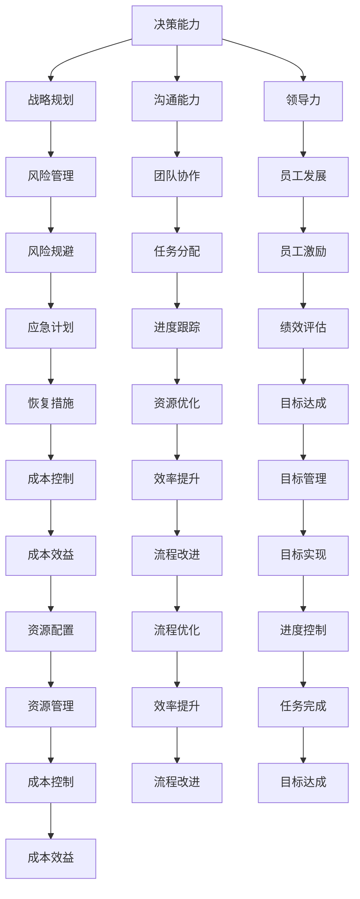
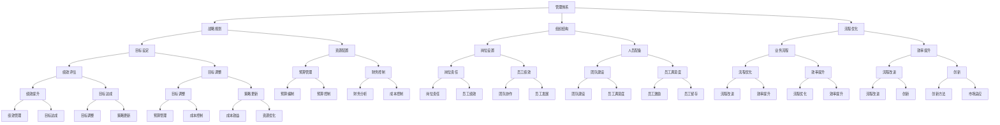

                 

### 文章标题: 好的管理者和普通管理者的差距：体系的重要性

#### 关键词：管理、管理者、体系、差距、决策、沟通、领导力、战略规划

#### 摘要：
本文深入探讨了好的管理者和普通管理者之间的差距，重点分析了体系的重要性。通过核心概念与联系的阐述、核心算法原理的讲解以及项目实战的案例分析，本文揭示了管理体系在决策、沟通、领导力等方面的关键作用。文章末尾，还总结了数学模型和数学公式，为读者提供了实用的工具和方法。

### 引言
在当今快速变化和竞争激烈的市场环境中，管理的重要性不言而喻。然而，并非所有的管理者都能取得同样的成就。好的管理者能够带领团队实现卓越的业绩，而普通管理者可能面临各种挑战，难以达到同样的效果。那么，什么是导致这种差距的根本原因呢？本文认为，体系的重要性在其中起着决定性的作用。

### 第一部分：核心概念与联系

#### 1.1 核心概念与联系概述
好的管理者和普通管理者的差距主要体现在以下几个方面：

1. **决策能力**：好的管理者具有快速做出高质量决策的能力，而普通管理者可能由于信息不足或分析能力有限，导致决策效果不佳。
2. **沟通能力**：好的管理者能够有效地传达信息、理解他人观点并协调团队工作，而普通管理者可能缺乏沟通技巧，导致沟通不畅。
3. **领导力**：好的管理者具有强大的领导力，能够激励和引导团队，而普通管理者可能缺乏领导才能，导致团队士气低落。
4. **战略规划**：好的管理者能够制定清晰的战略规划，而普通管理者可能缺乏远见和规划能力，导致组织发展受阻。
5. **风险管理**：好的管理者能够有效地识别和应对风险，而普通管理者可能对风险的预见和应对能力不足。

为了更好地理解这些概念之间的联系，我们可以借助Mermaid流程图来展示它们之间的关系：

#### 1.2 体系的重要性
好的管理者与普通管理者的差距在于体系的建立与执行。以下是一个简化的Mermaid流程图，描述了管理体系在管理中的作用：

#### 1.3 核心概念与联系深入讲解
在本章节中，我们将深入探讨好的管理者和普通管理者的核心概念，并分析这些概念之间的内在联系。以下是每个概念的具体内容：

1. **决策能力**：
    - **定义**：决策能力是指管理者在复杂情境下做出有效决策的能力。
    - **联系**：好的管理者能够快速做出高质量的决策，而普通管理者可能由于信息不足或分析能力有限，导致决策效果不佳。

2. **沟通能力**：
    - **定义**：沟通能力是指管理者在组织内外部有效传达信息、理解他人观点并协调团队工作的能力。
    - **联系**：有效的沟通能力有助于建立信任、提高团队效率和实现组织目标，普通管理者可能缺乏这方面的技巧，导致沟通不畅。

3. **领导力**：
    - **定义**：领导力是指管理者通过激励、引导和塑造团队，实现组织目标的能力。
    - **联系**：好的管理者具有强大的领导力，能够激励员工发挥潜力，而普通管理者可能缺乏领导才能，导致团队士气低落。

4. **战略规划**：
    - **定义**：战略规划是指管理者制定长远目标和策略，确保组织在竞争环境中保持优势的过程。
    - **联系**：好的管理者能够制定清晰的战略规划，而普通管理者可能缺乏远见和规划能力，导致组织发展受阻。

5. **风险管理**：
    - **定义**：风险管理是指管理者识别、评估和应对组织面临的各种风险的过程。
    - **联系**：好的管理者能够有效地识别和应对风险，而普通管理者可能对风险的预见和应对能力不足。

6. **团队协作**：
    - **定义**：团队协作是指团队成员为了共同的目标而共同努力、相互支持的过程。
    - **联系**：好的管理者能够建立高效的团队协作机制，而普通管理者可能缺乏协调团队的能力，导致团队协作效率低下。

7. **情绪管理**：
    - **定义**：情绪管理是指管理者有效处理和管理自己和他人的情绪，以促进工作氛围和团队效能的能力。
    - **联系**：好的管理者能够管理好自己的情绪，并以积极的方式影响他人，而普通管理者可能在情绪管理上表现不佳。

8. **愿景塑造**：
    - **定义**：愿景塑造是指管理者为组织设定未来发展的方向和目标，激励团队成员为之奋斗的过程。
    - **联系**：好的管理者能够清晰地塑造愿景，并以此激励团队，而普通管理者可能缺乏远见和激励能力。

9. **激励与引导**：
    - **定义**：激励与引导是指管理者通过奖励和指导来激发员工的积极性和创造力，实现组织目标的过程。
    - **联系**：好的管理者能够有效地激励和引导员工，而普通管理者可能在激励和引导员工方面表现不足。

10. **目标设定**：
    - **定义**：目标设定是指管理者为团队和组织设定明确的、可衡量的目标，并确保目标的实现。
    - **联系**：好的管理者能够设定清晰、可行的目标，而普通管理者可能缺乏目标设定的能力和技巧。

11. **资源配置**：
    - **定义**：资源配置是指管理者合理分配组织的人力、物力和财力资源，以实现组织目标的过程。
    - **联系**：好的管理者能够优化资源配置，提高资源利用效率，而普通管理者可能在资源配置上缺乏策略。

12. **风险识别**：
    - **定义**：风险识别是指管理者发现和评估组织可能面临的风险，以便采取预防措施。
    - **联系**：好的管理者能够敏锐地识别风险，而普通管理者可能缺乏风险识别的能力。

13. **应对策略**：
    - **定义**：应对策略是指管理者为应对风险而制定的行动计划和策略。
    - **联系**：好的管理者能够制定有效的应对策略，而普通管理者可能在应对策略上缺乏实效性。

14. **任务分配**：
    - **定义**：任务分配是指管理者根据员工的技能和能力，将任务合理地分配给团队成员。
    - **联系**：好的管理者能够有效地进行任务分配，提高团队的工作效率，而普通管理者可能在任务分配上缺乏科学性。

15. **团队建设**：
    - **定义**：团队建设是指管理者通过培养团队成员之间的关系和信任，提高团队的凝聚力和协作效率。
    - **联系**：好的管理者能够建立高效的团队，而普通管理者可能缺乏团队建设的技巧。

16. **自我调整**：
    - **定义**：自我调整是指管理者根据工作环境的变化，调整自己的行为和工作策略。
    - **联系**：好的管理者能够灵活调整自己，适应不断变化的工作环境，而普通管理者可能在自我调整方面表现不足。

17. **关系处理**：
    - **定义**：关系处理是指管理者处理与员工、上级和合作伙伴之间的关系，以维护良好的工作氛围。
    - **联系**：好的管理者能够有效地处理关系，促进团队合作，而普通管理者可能在关系处理方面表现不佳。

18. **创新思维**：
    - **定义**：创新思维是指管理者在解决问题和决策时，采用新颖、创造性的思维方式。
    - **联系**：好的管理者能够激发团队的创新能力，而普通管理者可能缺乏创新思维。

19. **变革管理**：
    - **定义**：变革管理是指管理者推动组织在战略、文化、结构等方面的变革，以适应外部环境的变化。
    - **联系**：好的管理者能够有效地管理变革，确保组织顺利度过变革期，而普通管理者可能在变革管理上缺乏经验。

20. **激励手段**：
    - **定义**：激励手段是指管理者通过奖励、晋升等手段来激励员工，提高员工的工作积极性和绩效。
    - **联系**：好的管理者能够灵活运用激励手段，激发员工的潜力，而普通管理者可能在激励手段上缺乏创新。

21. **员工发展**：
    - **定义**：员工发展是指管理者通过培训、指导等方式，提升员工的专业能力和个人素质。
    - **联系**：好的管理者能够关注员工的发展，提供成长机会，而普通管理者可能忽视员工发展。

22. **目标管理**：
    - **定义**：目标管理是指管理者与员工共同设定目标，并通过监控和评估确保目标的实现。
    - **联系**：好的管理者能够实现高效的目标管理，促进团队和组织的发展，而普通管理者可能在目标管理上缺乏经验。

23. **进度跟踪**：
    - **定义**：进度跟踪是指管理者监控项目或任务的进展情况，确保按时完成。
    - **联系**：好的管理者能够实时跟踪进度，及时调整计划和资源，而普通管理者可能在进度跟踪上缺乏效率。

24. **资源优化**：
    - **定义**：资源优化是指管理者合理分配和使用资源，以提高效率和降低成本。
    - **联系**：好的管理者能够实现资源的最大化利用，而普通管理者可能在资源优化上缺乏策略。

25. **成本控制**：
    - **定义**：成本控制是指管理者通过监控和调整成本，确保组织在预算范围内实现目标。
    - **联系**：好的管理者能够有效地控制成本，提高组织的盈利能力，而普通管理者可能在成本控制上缺乏经验。

26. **风险分析**：
    - **定义**：风险分析是指管理者评估可能出现的风险，并制定相应的应对措施。
    - **联系**：好的管理者能够进行全面的风险分析，降低风险发生的可能性，而普通管理者可能在风险分析上缺乏深入。

27. **风险规避**：
    - **定义**：风险规避是指管理者采取措施避免可能出现的风险。
    - **联系**：好的管理者能够主动规避风险，确保组织的稳定发展，而普通管理者可能在风险

