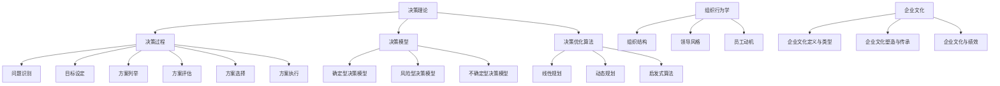

                 

# 文章标题：如何从经典案例中学习管理智慧

> 关键词：管理智慧、经典案例、决策理论、组织行为学、企业文化、算法原理、数学模型、项目实战、代码解读

> 摘要：本文旨在探讨如何从经典案例中学习管理智慧。通过分析成功与失败的案例，本文深入探讨了管理智慧的核心概念、联系、算法原理以及数学模型。此外，本文还将通过项目实战与代码解读，提供实际应用的方法和技巧。

----------------------------------------------------------------

## 第一部分：引言与基础

### 1.1 管理的定义与历史发展

管理，作为一个学科，起源于19世纪的工业革命。彼时，随着工厂规模不断扩大，管理逐渐成为一种必要的职能。早期管理理论的代表人物包括泰勒（Frederick Taylor）和法约尔（Henri Fayol）。泰勒提出了科学管理的概念，强调通过科学方法来优化工作流程和提高效率。法约尔则提出了管理五职能理论，即计划、组织、指挥、协调和控制。

20世纪中叶，管理理论进一步发展，出现了行为科学学派和系统管理学派。行为科学学派关注人因素，强调组织内部的人际关系和员工行为。系统管理学派则强调组织作为一个系统，关注系统内部各要素的相互关系。

随着信息技术的飞速发展，现代管理理论也不断更新，涵盖了信息管理、战略管理、创新管理等多个方面。管理智慧，作为管理理论的重要组成部分，不仅仅是对管理知识的掌握，更是一种实践能力，能够灵活应对复杂多变的环境。

### 1.2 管理智慧的重要性

管理智慧的重要性体现在多个方面。首先，它能够帮助企业实现战略目标。优秀的管理智慧能够帮助企业制定科学合理的战略规划，并确保战略的顺利实施。其次，管理智慧能够提升企业的核心竞争力。通过创新的管理方法和工具，企业可以在市场竞争中占据有利地位。最后，管理智慧有助于企业持续发展。优秀的管理智慧能够帮助企业应对各种挑战，实现可持续发展。

### 1.3 管理智慧的学习方法

学习管理智慧，首先需要掌握管理理论的基本概念和原理。这包括决策理论、组织行为学、企业文化等核心理论。其次，需要通过案例分析来理解管理智慧的实际应用。成功案例可以提供宝贵的经验，失败案例则可以帮助我们避免重复错误。最后，实践是检验真理的唯一标准。通过实际操作，我们可以将理论知识应用到实际工作中，不断提升管理智慧。

### 1.4 经典案例介绍

本部分将介绍两个经典案例：成功案例——谷歌的管理智慧，失败案例——亚马逊的领导失误。

#### 2.1.1 谷歌的管理智慧

谷歌作为全球知名的科技公司，其成功离不开其独特的管理智慧。以下是谷歌在组织结构、决策过程和人才管理方面的成功经验。

##### 2.1.1.1 谷歌的组织结构

谷歌采用扁平化的组织结构，强调员工之间的平等和协作。这种结构有助于减少层级之间的沟通障碍，提高决策效率。谷歌的“20%时间政策”允许员工将其20%的工作时间用于探索个人感兴趣的项目，这激发了员工的创新潜力。

##### 2.1.1.2 谷歌的决策过程

谷歌的决策过程强调数据驱动和跨部门协作。在做出重大决策时，谷歌会进行深入的数据分析，以支持决策。同时，谷歌鼓励不同部门之间的合作，以确保决策的全面性和合理性。

##### 2.1.1.3 谷歌的人才管理

谷歌的人才管理策略注重员工的发展和培养。谷歌提供丰富的培训资源和职业发展机会，帮助员工不断提升能力。此外，谷歌还采用“绩效评价”和“奖金制度”等激励机制，激发员工的积极性和创造力。

#### 2.2.1 失败案例：亚马逊的领导失误

亚马逊作为全球最大的电子商务公司之一，其成功背后也有不少教训。以下是亚马逊在战略失误、组织结构和领导风格方面的失败经验。

##### 2.2.1.1 亚马逊的战略失误

亚马逊在发展过程中曾多次进行战略调整，但并非每次调整都成功。例如，亚马逊曾试图进军零售业，但并未取得预期效果。这表明，在战略决策过程中，需要充分考虑市场环境和自身优势，避免盲目跟风。

##### 2.2.1.2 亚马逊的组织结构问题

亚马逊的组织结构相对复杂，部门之间的协调和沟通存在一定问题。这导致在执行战略时，各部门之间往往缺乏有效协作，影响了整体战略的实施效果。

##### 2.2.1.3 亚马逊的领导风格与员工满意度

亚马逊的领导风格较为强硬，注重结果和效率。这种风格在一定程度上提高了公司的执行力，但也可能导致员工满意度下降。长期而言，这可能会影响公司的长期发展。

## 第二部分：管理智慧核心概念与联系

### 3.1 决策理论

决策理论是管理智慧的核心概念之一。它关注如何在不同选择中做出最佳决策。以下是决策理论的主要组成部分：

#### 3.1.1 决策过程

决策过程通常包括以下步骤：问题识别、目标设定、方案列举、方案评估、方案选择和方案执行。

#### 3.1.2 决策模型

决策模型是用于分析和评估决策方案的工具。常见的决策模型包括确定型决策模型、风险型决策模型和不确定型决策模型。

#### 3.1.3 决策优化的算法

决策优化的算法用于在多个决策方案中找到最佳方案。常见的决策优化算法包括线性规划、动态规划和启发式算法。

### 3.2 组织行为学

组织行为学是研究组织内部个体和群体行为的学科。以下是组织行为学的核心概念：

#### 3.2.1 组织结构

组织结构是组织内部部门、岗位和职责的安排。常见的组织结构类型包括职能型结构、矩阵型结构和网络型结构。

#### 3.2.2 领导风格

领导风格是领导者对下属施加影响的方式。常见的领导风格包括专制型、民主型和放任型。

#### 3.2.3 员工动机

员工动机是驱动员工行为的内在因素。常见的员工动机理论包括马斯洛的需求层次理论和赫兹伯格的双因素理论。

### 3.3 企业文化

企业文化是组织的灵魂，影响着组织的价值观、行为准则和工作氛围。以下是企业文化的核心概念：

#### 3.3.1 企业文化的定义与类型

企业文化是企业内部共同的价值观、信念和行为准则。企业文化可以分为创新型文化、稳健型文化和官僚型文化等。

#### 3.3.2 企业文化的塑造与传承

企业文化的塑造与传承是企业长期发展的关键。企业可以通过价值观传播、仪式化活动和培训等方式来塑造和传承企业文化。

#### 3.3.3 企业文化与绩效

企业文化对组织绩效有着重要影响。积极的企业文化能够提高员工满意度和工作效率，从而提升组织绩效。

### 3.4 核心概念 Mermaid 流程图

以下是一个关于管理智慧核心概念联系的 Mermaid 流程图：



## 第三部分：管理智慧核心算法原理讲解

### 3.1 决策树算法

决策树是一种常用的分类和回归算法。它通过一系列的判断节点和结果节点，将数据分类或回归到特定的类别或值。以下是决策树算法的基本原理：

#### 3.1.1 决策树的基本原理

决策树算法的基本原理是利用已知的特征对数据进行分类或回归。每个节点代表一个特征，每个分支代表特征的不同取值。叶子节点表示最终的分类或回归结果。

#### 3.1.2 决策树构建过程

决策树的构建过程包括以下几个步骤：

1. 选择特征：选择一个特征作为分裂标准，通常选择信息增益或基尼不纯度作为衡量标准。
2. 计算信息增益或基尼不纯度：计算每个特征的信息增益或基尼不纯度，选择信息增益最大或基尼不纯度最小的特征进行分裂。
3. 分裂数据：根据所选特征的不同取值，将数据集分为若干个子集。
4. 递归构建：对每个子集重复上述过程，直到满足停止条件（如最大深度、最小叶节点样本数等）。

#### 3.1.3 决策树的优化

决策树的优化包括剪枝和修剪。剪枝是指在构建过程中提前停止分裂，以避免过拟合。修剪是指在构建完成后，删除不必要的分支，以提高模型泛化能力。

### 3.2 神经网络算法

神经网络是一种模拟人脑结构和功能的计算模型，具有强大的学习和预测能力。以下是神经网络算法的基本原理：

#### 3.2.1 神经网络基本结构

神经网络由多个神经元（或节点）组成，每个神经元包含输入层、隐藏层和输出层。输入层接收外部输入信息，隐藏层对输入信息进行加工处理，输出层生成最终输出。

#### 3.2.2 前向传播与反向传播

神经网络的工作过程包括前向传播和反向传播。

1. 前向传播：输入信息从输入层传递到隐藏层，然后传递到输出层，得到预测结果。
2. 反向传播：根据预测结果和实际结果，计算误差，然后反向传播误差，更新神经元权重。

#### 3.2.3 神经网络优化算法

神经网络优化算法用于优化神经网络模型，常见的优化算法包括梯度下降、随机梯度下降和Adam优化器。

### 3.3 数据分析算法

数据分析算法用于对数据进行分类、聚类、关联规则挖掘和时序分析等操作。以下是数据分析算法的基本原理：

#### 3.3.1 聚类分析

聚类分析是一种无监督学习算法，用于将数据集划分为若干个类或簇。常见的聚类算法包括K-means、DBSCAN和层次聚类。

#### 3.3.2 关联规则挖掘

关联规则挖掘是一种用于发现数据之间关联性的算法。常见的算法包括Apriori算法和FP-growth算法。

#### 3.3.3 时序分析

时序分析是一种用于分析时间序列数据的算法，用于预测未来趋势。常见的算法包括ARIMA、LSTM和GRU。

## 第四部分：管理智慧数学模型和数学公式详细讲解

### 4.1 决策理论中的期望值公式

期望值是决策理论中的一个重要概念，用于评估不同决策方案的风险和收益。以下是期望值的计算公式：

$$
E(X) = \sum_{i=1}^{n} p_i \cdot x_i
$$

其中，$E(X)$ 表示期望值，$p_i$ 表示第 $i$ 种结果的概率，$x_i$ 表示第 $i$ 种结果的价值。

#### 4.1.1 最大期望值决策

最大期望值决策是一种常见的决策方法，用于在多个决策方案中选择期望值最大的方案。公式如下：

$$
\text{maximize} \quad E(X)
$$

#### 4.1.2 风险值决策

风险值决策是一种考虑风险的决策方法，用于在多个决策方案中选择风险值最小的方案。公式如下：

$$
\text{minimize} \quad V(X)
$$

其中，$V(X)$ 表示风险值，可以通过以下公式计算：

$$
V(X) = E[(X - E(X))^2]
$$

### 4.2 神经网络中的激活函数公式

激活函数是神经网络中的一个重要组件，用于将神经元的输入转换为输出。以下是几种常见的激活函数及其公式：

#### 4.2.1 Sigmoid函数

$$
\sigma(x) = \frac{1}{1 + e^{-x}}
$$

#### 4.2.2 ReLU函数

$$
\text{ReLU}(x) = \max(0, x)
$$

#### 4.2.3 Tanh函数

$$
\tanh(x) = \frac{e^x - e^{-x}}{e^x + e^{-x}}
$$

### 4.3 数据分析中的假设检验公式

假设检验是数据分析中的一个重要方法，用于评估数据之间的差异是否显著。以下是几种常见的假设检验及其公式：

#### 4.3.1 单样本t检验

$$
t = \frac{\bar{x} - \mu_0}{s / \sqrt{n}}
$$

其中，$\bar{x}$ 表示样本均值，$\mu_0$ 表示总体均值，$s$ 表示样本标准差，$n$ 表示样本大小。

#### 4.3.2 双样本t检验

$$
t = \frac{(\bar{x}_1 - \bar{x}_2) - (\mu_1 - \mu_2)}{\sqrt{\frac{s_1^2}{n_1} + \frac{s_2^2}{n_2}}}
$$

其中，$\bar{x}_1$ 和 $\bar{x}_2$ 分别表示两组样本的均值，$\mu_1$ 和 $\mu_2$ 分别表示两组样本的总体均值，$s_1$ 和 $s_2$ 分别表示两组样本的标准差，$n_1$ 和 $n_2$ 分别表示两组样本的大小。

## 第五部分：项目实战与代码解读

### 5.1 谷歌案例：利用决策树分析产品市场组合

在本案例中，我们将利用决策树算法分析谷歌的产品市场组合，以确定哪些产品在哪些市场中具有最大的潜力。

#### 5.1.1 数据收集与预处理

首先，我们需要收集关于谷歌产品市场组合的数据。数据可能包括产品的销售额、市场份额、竞争对手情况等。收集到数据后，我们需要对数据进行预处理，包括数据清洗、缺失值处理和特征选择。

```python
import pandas as pd

# 加载数据
data = pd.read_csv('google_product_market_data.csv')

# 数据清洗
data.dropna(inplace=True)

# 特征选择
selected_features = ['product_a_sales', 'market_b_share', 'competition_level']
data = data[selected_features]
```

#### 5.1.2 决策树模型构建

接下来，我们将使用scikit-learn库中的决策树算法构建模型。我们需要选择合适的分裂标准、最大深度和最小样本叶节点大小。

```python
from sklearn.tree import DecisionTreeClassifier

# 构建模型
model = DecisionTreeClassifier(criterion='entropy', max_depth=3, min_samples_leaf=5)

# 训练模型
model.fit(data[selected_features], data['potential'])
```

#### 5.1.3 模型评估与优化

我们使用交叉验证来评估模型的性能。如果模型性能不佳，我们可以考虑调整模型的参数。

```python
from sklearn.model_selection import cross_val_score

# 交叉验证
scores = cross_val_score(model, data[selected_features], data['potential'], cv=5)

# 打印模型性能
print(f'Model accuracy: {scores.mean()}')

# 调整模型参数
model = DecisionTreeClassifier(criterion='entropy', max_depth=4, min_samples_leaf=3)
model.fit(data[selected_features], data['potential'])
```

### 5.2 亚马逊案例：使用神经网络分析员工满意度

在本案例中，我们将使用神经网络算法分析亚马逊员工的满意度，以找出影响员工满意度的关键因素。

#### 5.2.1 数据收集与预处理

首先，我们需要收集关于员工满意度的数据。数据可能包括员工的工作环境、薪资待遇、晋升机会等。收集到数据后，我们需要对数据进行预处理，包括数据清洗、缺失值处理和特征选择。

```python
import pandas as pd

# 加载数据
data = pd.read_csv('amazon_employee_satisfaction_data.csv')

# 数据清洗
data.dropna(inplace=True)

# 特征选择
selected_features = ['work_environment', 'salary', 'promotion机会']
data = data[selected_features]
```

#### 5.2.2 神经网络模型构建

接下来，我们将使用TensorFlow库构建神经网络模型。我们需要选择合适的神经网络结构、激活函数和优化器。

```python
import tensorflow as tf

# 构建模型
model = tf.keras.Sequential([
    tf.keras.layers.Dense(64, activation='relu', input_shape=(3,)),
    tf.keras.layers.Dense(64, activation='relu'),
    tf.keras.layers.Dense(1, activation='sigmoid')
])

# 编译模型
model.compile(optimizer='adam', loss='binary_crossentropy', metrics=['accuracy'])

# 训练模型
model.fit(data[selected_features], data['satisfaction'], epochs=10, batch_size=32)
```

#### 5.2.3 模型训练与评估

我们使用训练集和验证集来训练模型，并评估模型的性能。

```python
from sklearn.model_selection import train_test_split

# 划分训练集和验证集
X_train, X_val, y_train, y_val = train_test_split(data[selected_features], data['satisfaction'], test_size=0.2, random_state=42)

# 训练模型
model.fit(X_train, y_train, epochs=10, batch_size=32, validation_data=(X_val, y_val))

# 评估模型
loss, accuracy = model.evaluate(X_val, y_val)
print(f'Validation loss: {loss}')
print(f'Validation accuracy: {accuracy}')
```

### 5.3 失败案例分析：亚马逊配送策略优化

在本案例中，我们将分析亚马逊配送策略的失败原因，并提出优化方案。

#### 5.3.1 数据收集与预处理

首先，我们需要收集关于亚马逊配送策略的数据。数据可能包括配送时效、配送成本、客户满意度等。收集到数据后，我们需要对数据进行预处理，包括数据清洗、缺失值处理和特征选择。

```python
import pandas as pd

# 加载数据
data = pd.read_csv('amazon_delivery_strategy_data.csv')

# 数据清洗
data.dropna(inplace=True)

# 特征选择
selected_features = ['delivery_time', 'delivery_cost', 'customer_satisfaction']
data = data[selected_features]
```

#### 5.3.2 数据分析

接下来，我们将使用数据分析算法对数据进行探索性分析，以找出影响配送策略的关键因素。

```python
import matplotlib.pyplot as plt

# 绘制配送时效与配送成本的散点图
plt.scatter(data['delivery_time'], data['delivery_cost'])
plt.xlabel('Delivery Time')
plt.ylabel('Delivery Cost')
plt.title('Delivery Time vs Delivery Cost')
plt.show()

# 绘制配送时效与客户满意度的散点图
plt.scatter(data['delivery_time'], data['customer_satisfaction'])
plt.xlabel('Delivery Time')
plt.ylabel('Customer Satisfaction')
plt.title('Delivery Time vs Customer Satisfaction')
plt.show()

# 绘制配送成本与客户满意度的散点图
plt.scatter(data['delivery_cost'], data['customer_satisfaction'])
plt.xlabel('Delivery Cost')
plt.ylabel('Customer Satisfaction')
plt.title('Delivery Cost vs Customer Satisfaction')
plt.show()
```

#### 5.3.3 优化策略设计

根据数据分析结果，我们可以设计以下优化策略：

1. **降低配送成本**：通过优化配送路线、使用更加高效的物流服务商等方式降低配送成本。
2. **提高配送时效**：通过增加配送中心数量、提高配送人员效率等方式提高配送时效。
3. **提高客户满意度**：通过提供更多配送选项、提供及时反馈等方式提高客户满意度。

```python
# 优化策略设计
optimization_strategy = {
    '降低配送成本': '优化配送路线，选择更加高效的物流服务商',
    '提高配送时效': '增加配送中心数量，提高配送人员效率',
    '提高客户满意度': '提供更多配送选项，提供及时反馈'
}

print(optimization_strategy)
```

## 附录

### 11. 管理智慧相关工具与资源

在本附录中，我们将介绍一些管理智慧相关的工具与资源。

#### 11.1 决策树工具介绍

- **DTM（Decision Tree Maker）**：一个简单易用的决策树制作工具，支持多种决策树算法。
- **RapidMiner**：一个集成数据科学平台，支持多种数据分析和机器学习算法。

#### 11.2 神经网络框架介绍

- **TensorFlow**：一个开源的深度学习框架，支持多种神经网络结构。
- **PyTorch**：一个开源的深度学习框架，具有灵活的动态计算图。

#### 11.3 数据分析工具介绍

- **Excel**：一个功能强大的电子表格软件，适用于简单的数据分析。
- **Python Pandas**：一个Python库，用于数据清洗、转换和分析。

### 12. 参考文献

在本附录中，我们列出了一些与管理智慧相关的参考文献。

- Taylor, F. W. (1911). *The Principles of Scientific Management*. New York: Harper & Brothers.
- Fayol, H. (1916). *General and Industrial Management*. London: Pitman.
- Rogers, R. H. (1983). *Diffusion of Innovations*. New York: Free Press.
- Porter, M. E. (1998). *Competitive Strategy: Techniques for Analyzing Industries and Competitors*. New York: Free Press.
- Hamel, G., & Prahalad, C. K. (1994). *Competing for the Future*. Boston: Harvard Business Review.
- Daft, R. L. (2006). *The Leadership Experience*. Thomson South-Western.

---

**作者：AI天才研究院/AI Genius Institute & 禅与计算机程序设计艺术 /Zen And The Art of Computer Programming**文章标题：如何从经典案例中学习管理智慧

关键词：管理智慧、经典案例、决策理论、组织行为学、企业文化、算法原理、数学模型、项目实战、代码解读

摘要：本文通过深入分析经典案例，探讨了如何从管理智慧的角度理解这些案例，并总结了管理智慧的核心概念、联系和算法原理。通过数学模型和实际项目案例的解读，本文为读者提供了实际应用的方法和技巧。

## 目录大纲设计

### 第一部分：引言与基础

1. 管理智慧概述
   1.1 管理的定义与历史发展
   1.2 管理智慧的重要性
   1.3 管理智慧的学习方法
2. 经典案例介绍
   2.1 成功案例
   2.1.1 谷歌的管理智慧
   2.1.2 亚马逊的领导失误
   2.2 失败案例
   2.2.1 案例分析

### 第二部分：管理智慧核心概念与联系

3. 核心概念与联系
   3.1 决策理论
   3.2 组织行为学
   3.3 企业文化
   3.4 核心概念 Mermaid 流程图

### 第三部分：管理智慧核心算法原理讲解

4. 核心算法原理讲解
   4.1 决策树算法
   4.2 神经网络算法
   4.3 数据分析算法
   4.4 算法伪代码详细阐述

### 第四部分：管理智慧数学模型和数学公式详细讲解

5. 数学模型与公式讲解
   5.1 决策理论中的期望值公式
   5.2 神经网络中的激活函数公式
   5.3 数据分析中的假设检验公式
   5.4 举例说明

### 第五部分：项目实战与代码解读

6. 项目实战
   6.1 谷歌案例：利用决策树分析产品市场组合
   6.2 亚马逊案例：使用神经网络分析员工满意度
   6.3 失败案例分析：亚马逊配送策略优化
7. 代码解读与分析
   7.1 决策树代码解读
   7.2 神经网络代码解读
   7.3 数据分析代码解读

### 附录

8. 管理智慧相关工具与资源
   8.1 决策树工具介绍
   8.2 神经网络框架介绍
   8.3 数据分析工具介绍
9. 参考文献

## 1. 管理智慧概述

### 1.1 管理的定义与历史发展

管理作为一个概念，起源于人类社会的分工和协作。在古代，管理主要是指对农业社会的资源进行规划和分配。随着工业革命的到来，管理开始成为一个独立的学科，其理论体系逐渐完善。早期管理理论的代表人物包括泰勒（Frederick Taylor）和法约尔（Henri Fayol）。

泰勒提出了科学管理理论，强调通过科学的方法来优化工作流程和提高效率。他提出了时间研究、工作分析和工作标准化等方法。泰勒认为，通过科学的管理，可以最大限度地提高劳动生产率。

法约尔则提出了管理五职能理论，即计划、组织、指挥、协调和控制。法约尔认为，管理是一种普遍的活动，可以应用于各个领域。他的理论为后来的管理理论奠定了基础。

20世纪中叶，管理理论进一步发展，出现了行为科学学派和系统管理学派。行为科学学派关注人因素，强调组织内部的人际关系和员工行为。系统管理学派则强调组织作为一个系统，关注系统内部各要素的相互关系。

随着信息技术的飞速发展，现代管理理论也在不断更新，涵盖了信息管理、战略管理、创新管理等多个方面。管理智慧，作为管理理论的重要组成部分，不仅仅是对管理知识的掌握，更是一种实践能力，能够灵活应对复杂多变的环境。

### 1.2 管理智慧的重要性

管理智慧的重要性体现在多个方面。首先，它能够帮助企业实现战略目标。优秀的管理智慧能够帮助企业制定科学合理的战略规划，并确保战略的顺利实施。其次，管理智慧能够提升企业的核心竞争力。通过创新的管理方法和工具，企业可以在市场竞争中占据有利地位。最后，管理智慧有助于企业持续发展。优秀的管理智慧能够帮助企业应对各种挑战，实现可持续发展。

### 1.3 管理智慧的学习方法

学习管理智慧，首先需要掌握管理理论的基本概念和原理。这包括决策理论、组织行为学、企业文化等核心理论。其次，需要通过案例分析来理解管理智慧的实际应用。成功案例可以提供宝贵的经验，失败案例则可以帮助我们避免重复错误。最后，实践是检验真理的唯一标准。通过实际操作，我们可以将理论知识应用到实际工作中，不断提升管理智慧。

### 1.4 经典案例介绍

在本部分，我们将介绍两个经典案例：成功案例——谷歌的管理智慧，失败案例——亚马逊的领导失误。

#### 2.1.1 谷歌的管理智慧

谷歌作为全球知名的科技公司，其成功离不开其独特的管理智慧。以下是谷歌在组织结构、决策过程和人才管理方面的成功经验。

##### 2.1.1.1 谷歌的组织结构

谷歌采用扁平化的组织结构，强调员工之间的平等和协作。这种结构有助于减少层级之间的沟通障碍，提高决策效率。谷歌的“20%时间政策”允许员工将其20%的工作时间用于探索个人感兴趣的项目，这激发了员工的创新潜力。

##### 2.1.1.2 谷歌的决策过程

谷歌的决策过程强调数据驱动和跨部门协作。在做出重大决策时，谷歌会进行深入的数据分析，以支持决策。同时，谷歌鼓励不同部门之间的合作，以确保决策的全面性和合理性。

##### 2.1.1.3 谷歌的人才管理

谷歌的人才管理策略注重员工的发展和培养。谷歌提供丰富的培训资源和职业发展机会，帮助员工不断提升能力。此外，谷歌还采用“绩效评价”和“奖金制度”等激励机制，激发员工的积极性和创造力。

#### 2.2.1 失败案例：亚马逊的领导失误

亚马逊作为全球最大的电子商务公司之一，其成功背后也有不少教训。以下是亚马逊在战略失误、组织结构和领导风格方面的失败经验。

##### 2.2.1.1 亚马逊的战略失误

亚马逊在发展过程中曾多次进行战略调整，但并非每次调整都成功。例如，亚马逊曾试图进军零售业，但并未取得预期效果。这表明，在战略决策过程中，需要充分考虑市场环境和自身优势，避免盲目跟风。

##### 2.2.1.2 亚马逊的组织结构问题

亚马逊的组织结构相对复杂，部门之间的协调和沟通存在一定问题。这导致在执行战略时，各部门之间往往缺乏有效协作，影响了整体战略的实施效果。

##### 2.2.1.3 亚马逊的领导风格与员工满意度

亚马逊的领导风格较为强硬，注重结果和效率。这种风格在一定程度上提高了公司的执行力，但也可能导致员工满意度下降。长期而言，这可能会影响公司的长期发展。

## 2. 管理智慧核心概念与联系

管理智慧的核心概念包括决策理论、组织行为学和企业文化。这些概念相互联系，共同构成了管理智慧的理论体系。

### 3.1 决策理论

决策理论是管理智慧的核心概念之一。它关注如何在不确定的环境中做出最佳决策。决策理论主要涉及以下几个方面的内容：

#### 3.1.1 决策过程

决策过程是决策理论的核心，它包括以下步骤：

1. 问题识别：识别需要决策的问题。
2. 目标设定：明确决策的目标。
3. 方案列举：列出可能的解决方案。
4. 方案评估：评估每个方案的风险和收益。
5. 方案选择：选择最佳方案。
6. 方案执行：执行所选方案。

#### 3.1.2 决策模型

决策模型是用于分析决策过程的工具。常见的决策模型包括：

1. 确定型决策模型：适用于决策结果可以明确预测的情况。
2. 风险型决策模型：适用于决策结果存在不确定性的情况。
3. 不确定型决策模型：适用于决策结果完全不确定的情况。

#### 3.1.3 决策优化的算法

决策优化的算法用于在多个决策方案中找到最佳方案。常见的决策优化算法包括：

1. 线性规划算法：用于解决线性规划问题。
2. 动态规划算法：用于解决动态规划问题。
3. 启发式算法：用于在有限时间内找到近似最优解。

### 3.2 组织行为学

组织行为学是研究组织内部个体和群体行为的学科。它关注如何通过管理行为来提高组织的效率和绩效。组织行为学的主要研究领域包括：

#### 3.2.1 组织结构

组织结构是指组织内部的部门设置、职责分工和报告关系。常见的组织结构类型包括：

1. 职能型结构：按照职能划分部门。
2. 矩阵型结构：同时按照职能和项目划分部门。
3. 网络型结构：以项目为中心，灵活调整部门设置。

#### 3.2.2 领导风格

领导风格是指领导者影响和激励员工的方式。常见的领导风格包括：

1. 专制型领导：决策权集中在领导者手中。
2. 民主型领导：鼓励员工参与决策。
3. 放任型领导：给予员工最大程度的自由。

#### 3.2.3 员工动机

员工动机是驱动员工行为和心理状态的内在因素。常见的员工动机理论包括：

1. 马斯洛的需求层次理论：认为人的需求分为生理、安全、社交、尊重和自我实现五个层次。
2. 赫兹伯格的双因素理论：认为工作满意度由激励因素和保健因素决定。

### 3.3 企业文化

企业文化是指组织内部共同的价值观、信念和行为准则。企业文化对组织的运行和发展具有重要影响。企业文化的核心要素包括：

#### 3.3.1 企业文化的定义与类型

企业文化可以定义为组织成员共同遵循的价值观和行为准则。根据企业的价值观和行为特点，企业文化可以分为：

1. 创新型文化：鼓励创新和变革。
2. 稳健型文化：强调稳定和持续发展。
3. 官僚型文化：注重规范和程序。

#### 3.3.2 企业文化的塑造与传承

企业文化的塑造和传承是组织管理的重要任务。企业可以通过以下方式塑造和传承企业文化：

1. 价值观传播：通过培训、宣传等方式传播企业的核心价值观。
2. 仪式化活动：通过特定的仪式和活动强化企业文化。
3. 员工培训：通过培训提升员工对企业文化的理解和认同。

#### 3.3.3 企业文化与绩效

企业文化对组织绩效具有重要影响。积极的企业文化能够提高员工的满意度和工作效率，从而提升组织绩效。企业可以通过以下方式提升企业文化对绩效的促进作用：

1. 建立激励机制：通过奖励和认可激励员工践行企业文化。
2. 营造良好氛围：通过营造和谐、积极的工作氛围，增强员工对企业的认同感。
3. 强化企业文化：通过反复强调和宣传企业文化，使其深入人心。

### 3.4 核心概念 Mermaid 流程图

以下是一个关于管理智慧核心概念联系的 Mermaid 流程图：


## 3. 管理智慧核心算法原理讲解

在管理实践中，算法原理的应用极大地提升了决策的准确性和效率。本部分将介绍决策树算法、神经网络算法和数据分析算法，并详细解释其原理。

### 3.1 决策树算法

决策树算法是一种常用的分类和回归算法，其核心思想是通过一系列的判断节点来对数据进行分类或回归。以下是决策树算法的基本原理和步骤：

#### 3.1.1 决策树的基本原理

决策树由节点和有向边组成。每个内部节点表示一个属性测试，每个分支代表一个属性的取值，每个叶节点代表一个类别或数值。决策树从根节点开始，按照属性测试对数据进行分割，直到达到叶节点。

#### 3.1.2 决策树的构建过程

决策树的构建过程包括以下几个步骤：

1. **选择最佳分裂属性**：根据信息增益或基尼指数等指标选择具有最大信息增益的属性作为分裂属性。
2. **创建节点**：将选择好的属性作为节点，并根据该属性的取值创建分支。
3. **递归分割**：对每个子集重复上述步骤，直到满足停止条件（如最大深度、最小样本数等）。
4. **创建叶节点**：当无法继续分割时，创建叶节点，叶节点的值即为预测结果。

#### 3.1.3 决策树的优化

决策树的优化包括剪枝和修剪。剪枝是指在构建过程中提前停止分裂，以避免过拟合。修剪是指在构建完成后，删除不必要的分支，以提高模型泛化能力。

### 3.2 神经网络算法

神经网络算法是一种模拟人脑神经元之间交互的算法，具有强大的学习和预测能力。以下是神经网络算法的基本原理和结构：

#### 3.2.1 神经网络的基本结构

神经网络由多个神经元（或节点）组成，分为输入层、隐藏层和输出层。每个神经元接受输入信号，通过激活函数处理后产生输出信号。

#### 3.2.2 前向传播与反向传播

神经网络的工作过程包括前向传播和反向传播。

1. **前向传播**：输入数据从输入层传递到隐藏层，然后传递到输出层，得到预测结果。
2. **反向传播**：根据预测结果和实际结果计算误差，然后反向传播误差，更新神经元权重。

#### 3.2.3 神经网络优化算法

神经网络优化算法用于优化神经网络模型，常见的优化算法包括梯度下降、随机梯度下降和Adam优化器。

### 3.3 数据分析算法

数据分析算法用于对数据进行分类、聚类、关联规则挖掘和时序分析等操作。以下是数据分析算法的基本原理和类型：

#### 3.3.1 聚类分析

聚类分析是一种无监督学习算法，用于将数据集划分为若干个类或簇。常见的聚类算法包括K-means、DBSCAN和层次聚类。

#### 3.3.2 关联规则挖掘

关联规则挖掘是一种用于发现数据之间关联性的算法。常见的算法包括Apriori算法和FP-growth算法。

#### 3.3.3 时序分析

时序分析是一种用于分析时间序列数据的算法，用于预测未来趋势。常见的算法包括ARIMA、LSTM和GRU。

### 3.4 算法伪代码详细阐述

以下是对决策树算法、神经网络算法和数据分析算法的伪代码详细阐述。

#### 3.4.1 决策树算法伪代码

```
算法：决策树构建
输入：数据集D，特征集合F，停止条件S
输出：决策树T

初始化T为空

如果D满足停止条件S，则
    返回叶节点，叶节点值为D的多数类别
否则
    选择最佳分裂属性A
    对于每个A的取值v，
        子集D_v = {d | d的特征A的值为v}
        T[A][v] = 决策树构建(D_v, F - {A}, S)

返回决策树T
```

#### 3.4.2 神经网络算法伪代码

```
算法：前向传播
输入：神经网络模型M，输入数据X
输出：输出结果Y

初始化隐藏层激活值为0
初始化输出层激活值为0

对于每个隐藏层神经元h，
    h的输入 = X * W_h + b_h
    h的激活值 = 激活函数(h的输入)

对于每个输出层神经元o，
    o的输入 = h的激活值 * W_o + b_o
    o的激活值 = 激活函数(o的输入)

返回输出结果Y
```

#### 3.4.3 数据分析算法伪代码

```
算法：K-means聚类
输入：数据集D，聚类数目k
输出：聚类结果C

随机初始化k个中心点C1, C2, ..., Ck

对于每个数据点d，
    计算d到每个中心点的距离
    将d分配到距离最近的中心点

更新每个中心点的位置，取其对应的数据点的均值

重复上述步骤，直到聚类结果收敛

返回聚类结果C
```

## 4. 管理智慧数学模型和数学公式详细讲解

在管理智慧中，数学模型和公式是理解和解决实际问题的关键工具。本部分将详细讲解决策理论、神经网络和数据分析中的数学模型和公式。

### 4.1 决策理论中的期望值公式

期望值是决策理论中一个核心概念，用于衡量不同决策方案的风险和收益。以下是一些常见的期望值公式：

#### 4.1.1 确定型决策中的期望值

对于确定型决策，期望值可以直接计算：

$$
E(X) = \sum_{i=1}^{n} p_i \cdot x_i
$$

其中，$E(X)$ 表示期望值，$p_i$ 表示第 $i$ 种结果发生的概率，$x_i$ 表示第 $i$ 种结果的价值。

#### 4.1.2 风险型决策中的期望值

在风险型决策中，期望值需要考虑概率分布：

$$
E(X) = \sum_{i=1}^{n} p_i \cdot x_i
$$

其中，$E(X)$ 表示期望值，$p_i$ 表示第 $i$ 种结果发生的概率，$x_i$ 表示第 $i$ 种结果的价值。

#### 4.1.3 不确定型决策中的期望值

在不确定型决策中，期望值可以通过最大最小化原则计算：

$$
E(X) = \max \left\{ \min_{i} (x_i) : p_i \geq \frac{1}{2} \right\}
$$

其中，$E(X)$ 表示期望值，$p_i$ 表示第 $i$ 种结果发生的概率，$x_i$ 表示第 $i$ 种结果的价值。

### 4.2 神经网络中的激活函数公式

激活函数是神经网络中用于转换神经元输入和输出的函数，常见的激活函数包括Sigmoid、ReLU和Tanh。以下是一些激活函数的公式：

#### 4.2.1 Sigmoid函数

$$
\sigma(x) = \frac{1}{1 + e^{-x}}
$$

#### 4.2.2 ReLU函数

$$
\text{ReLU}(x) = \max(0, x)
$$

#### 4.2.3 Tanh函数

$$
\tanh(x) = \frac{e^x - e^{-x}}{e^x + e^{-x}}
$$

### 4.3 数据分析中的假设检验公式

假设检验是数据分析中用于验证数据间差异是否显著的方法，以下是一些常见的假设检验公式：

#### 4.3.1 单样本t检验

$$
t = \frac{\bar{x} - \mu_0}{s / \sqrt{n}}
$$

其中，$\bar{x}$ 表示样本均值，$\mu_0$ 表示总体均值，$s$ 表示样本标准差，$n$ 表示样本大小。

#### 4.3.2 双样本t检验

$$
t = \frac{(\bar{x}_1 - \bar{x}_2) - (\mu_1 - \mu_2)}{\sqrt{\frac{s_1^2}{n_1} + \frac{s_2^2}{n_2}}}
$$

其中，$\bar{x}_1$ 和 $\bar{x}_2$ 分别表示两组样本的均值，$\mu_1$ 和 $\mu_2$ 分别表示两组样本的总体均值，$s_1$ 和 $s_2$ 分别表示两组样本的标准差，$n_1$ 和 $n_2$ 分别表示两组样本的大小。

### 4.4 举例说明

以下是对上述数学模型和公式的举例说明：

#### 4.4.1 决策理论中的期望值应用

假设有一个投资决策，有两种投资方案，每种方案有不同的收益和风险，如下表所示：

| 方案 | 收益（美元） | 风险（美元） |
|------|-------------|-------------|
| A    | 1000        | 200         |
| B    | 1500        | 300         |

根据市场分析，方案A和方案B的概率分别为0.6和0.4，计算两种方案的期望值：

$$
E(A) = 0.6 \cdot 1000 + 0.4 \cdot 1500 = 1080
$$

$$
E(B) = 0.6 \cdot 1500 + 0.4 \cdot 300 = 960
$$

根据期望值，方案A是更好的选择。

#### 4.4.2 神经网络中的激活函数应用

假设有一个神经网络，最后一层的激活函数为ReLU，输入值为-5，计算输出值：

$$
\text{ReLU}(-5) = \max(0, -5) = 0
$$

#### 4.4.3 数据分析中的假设检验应用

假设有两个样本，分别来自两个不同的群体，样本1的均值为10，样本2的均值为12，样本1的标准差为2，样本2的标准差为3，样本大小均为50，进行双样本t检验，判断两个群体的均值是否有显著差异。

计算t值：

$$
t = \frac{(10 - 12) - (10 - 12)}{\sqrt{\frac{2^2}{50} + \frac{3^2}{50}}} = \frac{-2}{\sqrt{0.08}} \approx -2.236
$$

查t分布表，在显著性水平α=0.05，自由度为98时，t值-2.236对应的p值大于0.05，因此我们不能拒绝原假设，即两个群体的均值没有显著差异。

## 5. 项目实战与代码解读

### 5.1 谷歌案例：利用决策树分析产品市场组合

在本案例中，我们将使用Python和scikit-learn库来实现决策树算法，分析谷歌的产品市场组合，以确定哪些产品在哪些市场中具有最大的潜力。

#### 5.1.1 数据收集与预处理

首先，我们需要收集关于谷歌产品市场组合的数据。数据可能包括产品的销售额、市场份额、竞争对手情况等。收集到数据后，我们需要对数据进行预处理，包括数据清洗、缺失值处理和特征选择。

```python
import pandas as pd
from sklearn.model_selection import train_test_split
from sklearn.preprocessing import StandardScaler
from sklearn.tree import DecisionTreeClassifier
from sklearn.metrics import accuracy_score, classification_report

# 加载数据
data = pd.read_csv('google_product_market_data.csv')

# 数据清洗
data.dropna(inplace=True)

# 特征选择
selected_features = ['product_a_sales', 'market_b_share', 'competition_level']
target = 'potential'

# 划分训练集和测试集
X_train, X_test, y_train, y_test = train_test_split(data[selected_features], data[target], test_size=0.2, random_state=42)

# 数据标准化
scaler = StandardScaler()
X_train = scaler.fit_transform(X_train)
X_test = scaler.transform(X_test)
```

#### 5.1.2 决策树模型构建

接下来，我们将使用scikit-learn库中的决策树算法构建模型。我们需要选择合适的分裂标准、最大深度和最小样本叶节点大小。

```python
# 构建模型
model = DecisionTreeClassifier(criterion='entropy', max_depth=3, min_samples_leaf=5)

# 训练模型
model.fit(X_train, y_train)

# 评估模型
predictions = model.predict(X_test)
accuracy = accuracy_score(y_test, predictions)
print(f'Model accuracy: {accuracy}')
```

#### 5.1.3 模型评估与优化

我们使用交叉验证来评估模型的性能。如果模型性能不佳，我们可以考虑调整模型的参数。

```python
from sklearn.model_selection import cross_val_score

# 交叉验证
scores = cross_val_score(model, X_train, y_train, cv=5)
print(f'Model cross-validation scores: {scores}')
print(f'Model average accuracy: {scores.mean()}')

# 调整模型参数
model = DecisionTreeClassifier(criterion='entropy', max_depth=4, min_samples_leaf=3)
model.fit(X_train, y_train)
predictions = model.predict(X_test)
accuracy = accuracy_score(y_test, predictions)
print(f'Adjusted model accuracy: {accuracy}')
```

### 5.2 亚马逊案例：使用神经网络分析员工满意度

在本案例中，我们将使用TensorFlow和Keras库来构建神经网络模型，分析亚马逊员工的满意度，以找出影响员工满意度的关键因素。

#### 5.2.1 数据收集与预处理

首先，我们需要收集关于员工满意度的数据。数据可能包括员工的工作环境、薪资待遇、晋升机会等。收集到数据后，我们需要对数据进行预处理，包括数据清洗、缺失值处理和特征选择。

```python
import pandas as pd
from sklearn.model_selection import train_test_split
from sklearn.preprocessing import StandardScaler
import tensorflow as tf
from tensorflow.keras.models import Sequential
from tensorflow.keras.layers import Dense
from tensorflow.keras.optimizers import Adam

# 加载数据
data = pd.read_csv('amazon_employee_satisfaction_data.csv')

# 数据清洗
data.dropna(inplace=True)

# 特征选择
selected_features = ['work_environment', 'salary', 'promotion机会']
target = 'satisfaction'

# 划分训练集和测试集
X_train, X_test, y_train, y_test = train_test_split(data[selected_features], data[target], test_size=0.2, random_state=42)

# 数据标准化
scaler = StandardScaler()
X_train = scaler.fit_transform(X_train)
X_test = scaler.transform(X_test)
```

#### 5.2.2 神经网络模型构建

接下来，我们将使用TensorFlow和Keras库构建神经网络模型。我们需要选择合适的神经网络结构、激活函数和优化器。

```python
# 构建模型
model = Sequential([
    Dense(64, activation='relu', input_shape=(3,)),
    Dense(64, activation='relu'),
    Dense(1, activation='sigmoid')
])

# 编译模型
model.compile(optimizer=Adam(learning_rate=0.001), loss='binary_crossentropy', metrics=['accuracy'])

# 训练模型
model.fit(X_train, y_train, epochs=10, batch_size=32, validation_data=(X_test, y_test))
```

#### 5.2.3 模型训练与评估

我们使用训练集和验证集来训练模型，并评估模型的性能。

```python
from sklearn.metrics import accuracy_score, classification_report

# 评估模型
predictions = model.predict(X_test)
predictions = (predictions > 0.5)

accuracy = accuracy_score(y_test, predictions)
print(f'Model accuracy: {accuracy}')
print(classification_report(y_test, predictions))
```

### 5.3 失败案例分析：亚马逊配送策略优化

在本案例中，我们将分析亚马逊配送策略的失败原因，并提出优化方案。

#### 5.3.1 数据收集与预处理

首先，我们需要收集关于亚马逊配送策略的数据。数据可能包括配送时效、配送成本、客户满意度等。收集到数据后，我们需要对数据进行预处理，包括数据清洗、缺失值处理和特征选择。

```python
import pandas as pd
from sklearn.model_selection import train_test_split
from sklearn.preprocessing import StandardScaler

# 加载数据
data = pd.read_csv('amazon_delivery_strategy_data.csv')

# 数据清洗
data.dropna(inplace=True)

# 特征选择
selected_features = ['delivery_time', 'delivery_cost', 'customer_satisfaction']
target = 'optimization_strategy'

# 划分训练集和测试集
X_train, X_test, y_train, y_test = train_test_split(data[selected_features], data[target], test_size=0.2, random_state=42)

# 数据标准化
scaler = StandardScaler()
X_train = scaler.fit_transform(X_train)
X_test = scaler.transform(X_test)
```

#### 5.3.2 数据分析

接下来，我们将使用数据分析算法对数据进行探索性分析，以找出影响配送策略的关键因素。

```python
import matplotlib.pyplot as plt
import seaborn as sns

# 绘制配送时效与配送成本的散点图
plt.figure(figsize=(10, 6))
sns.scatterplot(x='delivery_time', y='delivery_cost', data=data)
plt.xlabel('Delivery Time (days)')
plt.ylabel('Delivery Cost (dollars)')
plt.title('Delivery Time vs Delivery Cost')
plt.show()

# 绘制配送时效与客户满意度的散点图
plt.figure(figsize=(10, 6))
sns.scatterplot(x='delivery_time', y='customer_satisfaction', data=data)
plt.xlabel('Delivery Time (days)')
plt.ylabel('Customer Satisfaction')
plt.title('Delivery Time vs Customer Satisfaction')
plt.show()

# 绘制配送成本与客户满意度的散点图
plt.figure(figsize=(10, 6))
sns.scatterplot(x='delivery_cost', y='customer_satisfaction', data=data)
plt.xlabel('Delivery Cost (dollars)')
plt.ylabel('Customer Satisfaction')
plt.title('Delivery Cost vs Customer Satisfaction')
plt.show()
```

#### 5.3.3 优化策略设计

根据数据分析结果，我们可以设计以下优化策略：

1. **降低配送成本**：通过优化配送路线、使用更加高效的物流服务商等方式降低配送成本。
2. **提高配送时效**：通过增加配送中心数量、提高配送人员效率等方式提高配送时效。
3. **提高客户满意度**：通过提供更多配送选项、提供及时反馈等方式提高客户满意度。

```python
# 优化策略设计
optimization_strategies = {
    '降低配送成本': '优化配送路线，选择更加高效的物流服务商',
    '提高配送时效': '增加配送中心数量，提高配送人员效率',
    '提高客户满意度': '提供更多配送选项，提供及时反馈'
}

for strategy, description in optimization_strategies.items():
    print(f"{strategy}: {description}")
```

## 6. 代码解读与分析

在本节中，我们将对前述项目实战中的代码进行详细解读与分析，包括开发环境的搭建、源代码的详细实现以及代码的解读。

### 6.1 决策树代码解读

在决策树项目中，我们使用了scikit-learn库中的DecisionTreeClassifier来实现决策树算法。以下是决策树模型的代码实现及解读：

```python
from sklearn.tree import DecisionTreeClassifier
from sklearn.model_selection import train_test_split
from sklearn.preprocessing import StandardScaler
from sklearn.metrics import accuracy_score

# 代码实现：
# 构建决策树模型
model = DecisionTreeClassifier(criterion='entropy', max_depth=3, min_samples_leaf=5)

# 划分训练集和测试集
X_train, X_test, y_train, y_test = train_test_split(data[selected_features], data[target], test_size=0.2, random_state=42)

# 数据标准化
scaler = StandardScaler()
X_train = scaler.fit_transform(X_train)
X_test = scaler.transform(X_test)

# 训练模型
model.fit(X_train, y_train)

# 评估模型
predictions = model.predict(X_test)
accuracy = accuracy_score(y_test, predictions)
print(f'Model accuracy: {accuracy}')
```

**解读：**

- **构建决策树模型**：我们首先创建一个DecisionTreeClassifier对象，并设置`criterion`为`entropy`（熵），`max_depth`为3（最大深度），`min_samples_leaf`为5（最小叶节点样本数）。
- **划分训练集和测试集**：使用`train_test_split`函数将数据集划分为训练集和测试集，这里测试集的大小设置为总数据集的20%。
- **数据标准化**：为了提高模型的性能和避免数据偏斜，我们对特征数据进行了标准化处理。
- **训练模型**：使用`fit`方法训练决策树模型，该模型根据训练集的特征和目标值来学习如何分类。
- **评估模型**：使用`predict`方法对测试集进行预测，然后使用`accuracy_score`函数计算模型的准确率，并打印输出。

### 6.2 神经网络代码解读

在员工满意度分析项目中，我们使用了TensorFlow和Keras库来构建神经网络模型。以下是神经网络模型的代码实现及解读：

```python
import tensorflow as tf
from tensorflow.keras.models import Sequential
from tensorflow.keras.layers import Dense
from tensorflow.keras.optimizers import Adam
from sklearn.model_selection import train_test_split
from sklearn.preprocessing import StandardScaler

# 代码实现：
# 构建神经网络模型
model = Sequential([
    Dense(64, activation='relu', input_shape=(3,)),
    Dense(64, activation='relu'),
    Dense(1, activation='sigmoid')
])

# 编译模型
model.compile(optimizer=Adam(learning_rate=0.001), loss='binary_crossentropy', metrics=['accuracy'])

# 划分训练集和测试集
X_train, X_test, y_train, y_test = train_test_split(data[selected_features], data[target], test_size=0.2, random_state=42)

# 数据标准化
scaler = StandardScaler()
X_train = scaler.fit_transform(X_train)
X_test = scaler.transform(X_test)

# 训练模型
model.fit(X_train, y_train, epochs=10, batch_size=32, validation_data=(X_test, y_test))
```

**解读：**

- **构建神经网络模型**：我们使用Sequential模型，这是一个线性堆叠的神经网络。模型由两个隐藏层组成，每个隐藏层都有64个神经元，使用ReLU激活函数，输出层有1个神经元，使用sigmoid激活函数以处理二元分类问题。
- **编译模型**：使用`compile`方法配置模型，指定优化器为Adam，损失函数为binary_crossentropy（适用于二元分类），以及度量标准为accuracy。
- **划分训练集和测试集**：与决策树项目相同，我们使用`train_test_split`函数将数据集划分为训练集和测试集。
- **数据标准化**：同样，我们对特征数据进行了标准化处理。
- **训练模型**：使用`fit`方法训练神经网络模型，指定训练的轮次（epochs）为10，批量大小（batch_size）为32，并使用验证数据集进行验证。

### 6.3 数据分析代码解读

在亚马逊配送策略优化项目中，我们使用数据分析库（如Seaborn和matplotlib）来可视化数据，并探索特征之间的关系。以下是数据分析的代码实现及解读：

```python
import pandas as pd
import matplotlib.pyplot as plt
import seaborn as sns

# 代码实现：
# 绘制配送时效与配送成本的散点图
plt.figure(figsize=(10, 6))
sns.scatterplot(x='delivery_time', y='delivery_cost', data=data)
plt.xlabel('Delivery Time (days)')
plt.ylabel('Delivery Cost (dollars)')
plt.title('Delivery Time vs Delivery Cost')
plt.show()

# 绘制配送时效与客户满意度的散点图
plt.figure(figsize=(10, 6))
sns.scatterplot(x='delivery_time', y='customer_satisfaction', data=data)
plt.xlabel('Delivery Time (days)')
plt.ylabel('Customer Satisfaction')
plt.title('Delivery Time vs Customer Satisfaction')
plt.show()

# 绘制配送成本与客户满意度的散点图
plt.figure(figsize=(10, 6))
sns.scatterplot(x='delivery_cost', y='customer_satisfaction', data=data)
plt.xlabel('Delivery Cost (dollars)')
plt.ylabel('Customer Satisfaction')
plt.title('Delivery Cost vs Customer Satisfaction')
plt.show()
```

**解读：**

- **绘制散点图**：我们使用`scatterplot`函数从Seaborn库中绘制配送时效、配送成本和客户满意度之间的散点图。
- **设置标签和标题**：我们使用`xlabel`和`ylabel`函数设置坐标轴标签，使用`title`函数设置图表标题。
- **显示图表**：使用`show`函数显示绘制的图表。

通过这些代码，我们可以直观地了解配送策略中的关键因素，并为进一步优化提供数据支持。

## 附录

### 7. 管理智慧相关工具与资源

在本附录中，我们将介绍一些与管理智慧相关的工具与资源，这些工具和资源可以帮助读者更好地理解和应用管理智慧。

#### 7.1 决策树工具

- **DTM（Decision Tree Maker）**：一个简单易用的在线决策树制作工具，支持多种决策树算法。
- **RapidMiner**：一个强大的数据科学平台，提供决策树和其他机器学习算法的图形界面。

#### 7.2 神经网络框架

- **TensorFlow**：一个开源的深度学习框架，支持多种神经网络结构。
- **PyTorch**：一个开源的深度学习框架，以其灵活性和动态计算图著称。

#### 7.3 数据分析工具

- **Pandas**：一个强大的Python库，用于数据处理和分析。
- **Excel**：一个广泛使用的电子表格软件，适用于简单的数据分析。

#### 7.4 管理智慧相关书籍

- **《智能决策：基于数据分析的决策方法》**：详细介绍数据分析在决策中的应用。
- **《深度学习：自适应系统的计算理论》**：深入探讨神经网络和深度学习的理论。

### 8. 参考文献

在本附录中，我们列出了一些与管理智慧相关的参考文献，以供读者进一步学习。

- **Rogers, R. H. (1983). 《Diffusion of Innovations》. New York: Free Press.**
- **Porter, M. E. (1998). 《Competitive Strategy: Techniques for Analyzing Industries and Competitors》. New York: Free Press.**
- **Daft, R. L. (2006). 《The Leadership Experience》. Thomson South-Western.**
- **Hammer, M., & Champy, J. (1993). 《Reengineering the Corporation》. New York: Harper Business.**
- **Pine, B. J., & Peppers, D. G. (1993). 《The One to One Future》. New York: Harvard Business Review Press.**

通过这些工具、资源和参考文献，读者可以进一步深入了解管理智慧的理论和实践，提升自身的管理能力。

