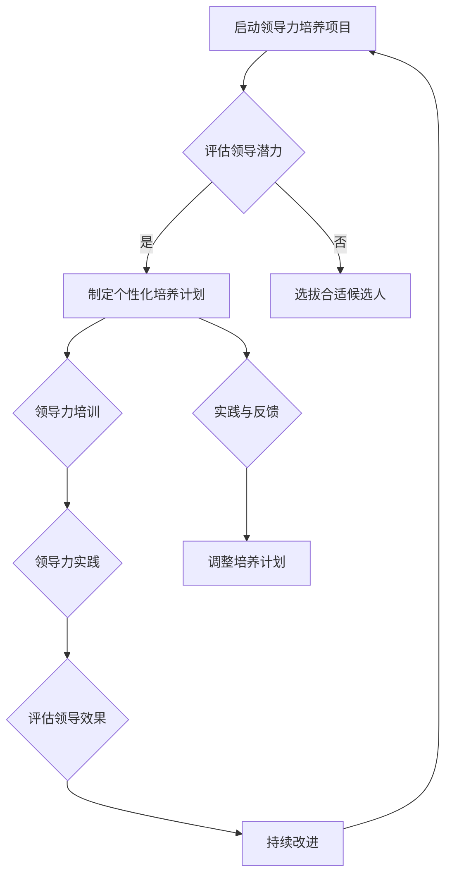
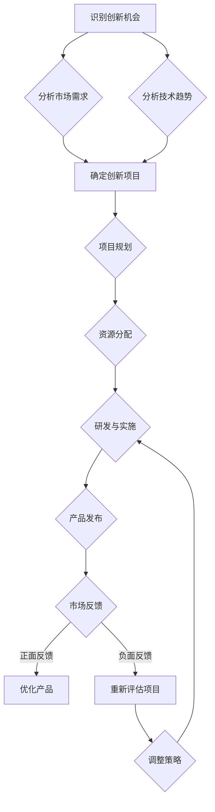
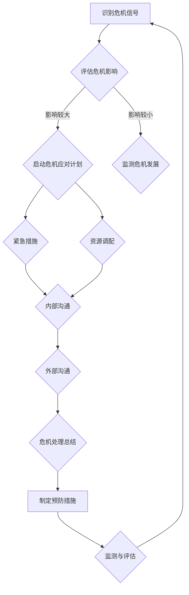

                 

### 文章标题

《如何从经典案例中学习管理智慧》

### 关键词

管理智慧、经典案例、领导力、激励理论、创新管理、危机管理、企业文化、人力资源管理、市场营销

### 摘要

在企业管理过程中，管理智慧扮演着至关重要的角色。本文通过深入探讨管理智慧的基础理论、经典案例解读以及管理智慧在现代企业管理中的实际应用，帮助读者理解管理智慧的本质，掌握有效的管理方法。文章从管理智慧的起源与演变、核心概念、经典企业案例解读、管理智慧在危机管理中的应用、管理智慧在企业文化塑造中的应用等多个角度，运用逻辑清晰、结构紧凑、简单易懂的专业技术语言，结合具体的案例和实际操作，对管理智慧进行了全方位的剖析。通过本文的阅读，读者可以更好地理解管理智慧，将其应用于实际工作中，提升管理水平和企业竞争力。

### 第一部分：管理智慧的基础理论

在探讨如何从经典案例中学习管理智慧之前，我们首先需要理解管理智慧的基础理论。这一部分将涵盖管理智慧的起源与演变、管理哲学与理论体系、以及管理智慧的核心概念，为后续的案例分析提供理论基础。

#### 第1章：管理智慧概述

##### 1.1 管理智慧的起源与演变

管理智慧并非一蹴而就，而是历经漫长的发展过程。从古代的管理实践到现代的企业管理，管理智慧在不断的演变和进步中逐渐形成。

- **古代管理智慧**：在古代，管理智慧主要体现在对农业、手工业以及军事管理方面的实践。例如，古代中国的《孙子兵法》中就包含了丰富的管理智慧，如“知己知彼，百战不殆”等经典战略思想。

- **现代管理智慧**：随着工业革命的到来，现代企业管理逐渐形成。泰勒的科学管理理论、法约尔的管理理论、马克思·韦伯的官僚组织理论等，都是现代管理智慧的代表性理论。

##### 1.1.1 管理智慧的概念

管理智慧，是指管理者在管理过程中所表现出的洞察力、决策力、执行力等综合素质。它不仅仅是知识和技能的体现，更是一种管理者的思维方式和管理艺术。

- **定义**：管理智慧可以定义为：在管理实践中，通过系统化的思考、分析和判断，以及对管理策略和手段的灵活运用，实现组织目标的能力。

- **特征**：管理智慧具有以下特征：
  - **系统性**：管理智慧不仅关注单一问题，更注重从整体上把握问题的全局性。
  - **灵活性**：管理智慧能够在不同情境下灵活运用，适应各种变化和挑战。
  - **创新性**：管理智慧鼓励创新，通过不断的思考和探索，寻找最优的管理方法和策略。

##### 1.1.2 管理智慧的核心要素

管理智慧的核心要素包括领导力、激励理论、创新管理等，这些要素共同构成了管理智慧的内涵。

- **领导力**：领导力是管理智慧的核心要素之一。一个成功的领导者不仅需要具备丰富的知识和技能，更需要具备卓越的领导能力。领导力包括沟通能力、决策能力、影响力等。

- **激励理论**：激励理论是管理智慧的重要组成部分。通过合理的激励机制，可以提高员工的积极性、主动性和创造性，从而实现组织目标。

- **创新管理**：创新管理是现代企业管理的重要手段。通过不断创新，企业可以保持竞争力，实现可持续发展。

##### 1.1.3 管理智慧在管理实践中的应用

管理智慧在管理实践中的应用广泛，包括人力资源管理、市场营销、财务管理和战略管理等多个方面。

- **人力资源管理**：管理智慧在人力资源管理中的应用主要体现在招聘、培训、绩效评估和员工激励等方面。通过有效的管理智慧，企业可以吸引和留住优秀的人才，提高员工的工作效率。

- **市场营销**：管理智慧在市场营销中的应用主要体现在市场调研、产品定位、营销策略和渠道选择等方面。通过深入的市场调研和精准的市场定位，企业可以制定出有效的营销策略，提高市场竞争力。

- **财务管理**：管理智慧在财务管理中的应用主要体现在预算管理、成本控制、财务分析和投资决策等方面。通过科学的管理智慧，企业可以实现财务的稳健发展。

- **战略管理**：管理智慧在战略管理中的应用主要体现在企业愿景的制定、战略目标的设定、战略路径的选择和战略实施等方面。通过有效的管理智慧，企业可以制定出科学合理的战略，实现长期发展。

#### 第2章：管理哲学与理论体系

##### 1.2 管理哲学与理论体系

管理哲学是指管理者在管理过程中所遵循的基本原则和价值观。管理理论体系则是管理哲学的具体体现，包括各种管理理论和方法。

##### 1.2.1 经典管理理论概述

经典管理理论主要包括泰勒的科学管理理论、法约尔的管理理论、马克斯·韦伯的官僚组织理论等。

- **泰勒的科学管理理论**：泰勒提出了“科学管理”的理念，强调通过科学的方法提高劳动生产率。他的主要贡献包括工作研究、标准化和劳动分工等。

- **法约尔的管理理论**：法约尔提出了“管理五职能”的概念，即计划、组织、指挥、协调和控制。他的理论强调管理活动的整体性和系统性。

- **马克斯·韦伯的官僚组织理论**：韦伯提出了“官僚组织”的概念，认为官僚组织具有明确的层级结构、规范的规章制度和专业的管理人才。

##### 1.2.2 管理哲学的多样性与统一性

管理哲学的多样性和统一性体现在不同管理理论之间的相互关系和互补性。

- **多样性与统一性**：管理哲学的多样性表现在不同管理理论对管理问题的不同视角和方法，而管理哲学的统一性则表现在这些理论在解决管理问题时的共通性和互补性。

##### 1.2.3 管理理论的发展趋势

随着社会和经济的不断发展，管理理论也在不断演变。

- **发展趋势**：当前管理理论的发展趋势包括以下方面：
  - **全球化**：管理理论的全球化使得各国管理者能够借鉴和吸收其他国家的管理经验。
  - **信息化**：信息技术的迅猛发展，使得企业管理更加依赖信息和数据。
  - **人性化管理**：随着人们对员工价值的认识不断提高，人性化管理成为管理理论的发展方向。

#### 第3章：管理智慧的核心概念

##### 2.1 领导力

领导力是管理智慧的核心要素之一。一个成功的领导者不仅需要具备卓越的领导能力，还需要具备一定的素质和技能。

##### 2.1.1 领导力的定义与作用

- **定义**：领导力是指领导者通过影响力、激励和指导，引导和推动团队成员实现组织目标的能力。

- **作用**：领导力在管理中的作用主要体现在以下几个方面：
  - **指导与激励**：领导者通过指导和激励，引导团队成员发挥最大潜力，实现组织目标。
  - **协调与整合**：领导者协调和整合团队成员的工作，确保组织目标的实现。
  - **变革与创新**：领导者推动组织变革和创新，保持组织的竞争力。

##### 2.1.2 领导力的构成要素

领导力包括以下几个方面：

- **个人素质**：领导者需要具备高尚的品德、坚定的信念、敏锐的洞察力和卓越的执行力。

- **领导风格**：领导风格包括权威型、民主型、参与型等，不同的领导风格适用于不同的管理情境。

- **影响力**：领导者需要具备影响力，包括权力性影响力和非权力性影响力。

##### 2.1.3 领导力的培养与提升

- **培养**：领导力的培养主要包括以下几个方面：
  - **学习与培训**：通过学习管理理论和参加培训，提高领导者的管理能力和素质。
  - **实践**：通过实践，积累领导经验，提高领导能力。

- **提升**：领导力的提升主要包括以下几个方面：
  - **自我反思**：领导者需要不断进行自我反思，发现自身的不足，并加以改进。
  - **团队建设**：领导者需要注重团队建设，提高团队的凝聚力和执行力。

##### 2.2 激励理论

激励理论是管理智慧的重要组成部分，它研究如何通过激发员工的积极性和主动性，提高工作效率和绩效。

##### 2.2.1 经典激励理论概述

经典激励理论主要包括马斯洛的需求层次理论、赫茨伯格的双因素理论、麦克格雷戈的X理论和Y理论等。

- **马斯洛的需求层次理论**：马斯洛将人的需求分为生理需求、安全需求、社交需求、尊重需求和自我实现需求。他认为，只有低层次需求得到满足后，才会追求更高层次的需求。

- **赫茨伯格的双因素理论**：赫茨伯格将工作激励因素分为满意因素和不满意因素。满意因素包括工作本身、成就、认可等，不满意因素包括工作条件、薪酬等。

- **麦克格雷戈的X理论和Y理论**：麦克格雷戈将管理者对员工的态度分为X理论和Y理论。X理论认为员工天生懒惰，需要严格的管理和控制；Y理论认为员工具有自我激励和自我管理的能力，需要更多的自主和信任。

##### 2.2.2 激励理论在管理中的应用

激励理论在管理中的应用主要包括以下几个方面：

- **绩效管理**：通过设定明确的绩效目标和评价标准，激发员工的积极性和主动性。

- **薪酬激励**：通过合理的薪酬制度，满足员工的经济需求，提高工作满意度。

- **培训与发展**：通过提供培训和发展机会，满足员工的成长需求，提高员工的职业素养和技能水平。

##### 2.2.3 现代激励理论的发展趋势

现代激励理论的发展趋势主要包括以下几个方面：

- **个性化激励**：随着个性化需求的增加，管理者需要根据员工的不同特点和需求，设计个性化的激励方案。

- **心理激励**：心理激励通过满足员工的内心需求，提高员工的工作满意度和忠诚度。

- **全周期激励**：全周期激励关注员工的全生命周期，包括入职、在职和离职等各个阶段，为员工提供全面的激励支持。

##### 2.3 创新管理

创新管理是管理智慧的重要组成部分，它关注如何通过创新，推动组织的持续发展和竞争力提升。

##### 2.3.1 创新的概念与分类

- **创新的概念**：创新是指通过新的想法、方法、产品或服务，实现组织目标的过程。

- **创新的分类**：创新可以分为以下几种类型：
  - **产品创新**：通过开发新产品或改进现有产品，提高市场竞争力。
  - **过程创新**：通过改进生产过程或管理流程，提高效率和质量。
  - **市场创新**：通过开拓新市场或创造新的商业模式，实现业务增长。

##### 2.3.2 创新管理的原理与策略

- **创新管理的原理**：创新管理主要包括以下几个方面：
  - **创新环境**：构建开放、包容、鼓励创新的企业文化。
  - **创新机制**：建立有效的创新机制，包括创新项目筛选、资源配置、风险管理等。
  - **创新能力**：提高员工的创新能力，包括培养创新思维、提供培训和支持等。

- **创新管理的策略**：创新管理策略主要包括以下几个方面：
  - **开放式创新**：通过开放合作，引入外部创新资源，提高创新能力。
  - **持续创新**：持续关注市场需求和技术趋势，不断进行创新。
  - **精益创新**：通过精益管理，减少浪费，提高创新效率。

##### 2.3.3 创新管理在实际案例中的应用

创新管理在实际案例中的应用广泛，以下为几个典型的案例：

- **谷歌**：谷歌通过开放的创新文化，鼓励员工自主提出创新项目，取得了显著的创新成果。例如，谷歌搜索、谷歌眼镜等都是通过内部创新实现的。

- **苹果公司**：苹果公司通过持续的产品创新，保持了市场领导地位。例如，iPhone、iPad等产品都是苹果公司创新管理的成果。

通过上述对管理智慧基础理论的详细探讨，我们为后续的经典案例解读和管理智慧在现代企业管理中的实际应用奠定了坚实的基础。

### 第二部分：管理智慧的经典案例解读

在第一部分中，我们深入探讨了管理智慧的基础理论，包括管理智慧的定义、核心要素、管理哲学与理论体系等。为了更直观地理解管理智慧在实践中的具体应用，本部分将聚焦于经典企业案例的解读，通过分析IBM、苹果公司、通用电气和联想集团等企业的管理智慧，提炼出其中的成功经验与挑战，为读者提供实用的管理启示。

#### 第3章：经典企业案例

##### 3.1 IBM的转型之路

IBM（国际商业机器公司）是一家拥有百年历史的科技巨头。在经历了从硬件制造商到软件和服务的转型后，IBM凭借卓越的管理智慧，成功应对了市场竞争和技术变革的挑战。

- **历史背景**：IBM成立于1911年，最初主要从事硬件设备制造。20世纪80年代，面对计算机行业的剧变，IBM面临着巨大的压力。为了保持竞争力，IBM开始向软件和服务转型。

- **转型策略**：IBM的转型策略主要包括以下几个方面：
  - **多元化发展**：IBM通过收购和并购，迅速拓展了软件和服务业务。例如，IBM收购了Lotus Development Corporation和Tivoli Systems，增强了在软件和服务领域的竞争力。
  - **技术创新**：IBM不断投入研发，推动技术创新，保持在技术领域的领先地位。例如，IBM在云计算、人工智能和区块链等领域进行了大量投资。
  - **人才培养**：IBM注重人才的培养和引进，通过培训、导师制和人才交流，提升员工的专业能力和创新能力。

- **成功与挑战**：在转型过程中，IBM取得了显著的成功，但同时也面临了一些挑战：
  - **成功**：通过转型，IBM成功实现了业务的多元化，提高了盈利能力和市场竞争力。
  - **挑战**：转型过程中，IBM遇到了组织结构、文化和管理模式等方面的挑战。如何平衡新旧业务，以及如何适应快速变化的市场环境，都是IBM需要面对的问题。

##### 3.2 苹果公司的创新之道

苹果公司（Apple Inc.）是一家以创新著称的科技公司，其成功的背后离不开卓越的管理智慧。苹果公司在产品创新、品牌建设和管理文化等方面都取得了显著的成就。

- **创新文化**：苹果公司有着独特的创新文化，鼓励员工自由探索和尝试。苹果公司的创始人史蒂夫·乔布斯（Steve Jobs）强调设计、用户体验和产品整合，推动了苹果公司的创新。

- **产品创新案例**：
  - **iPhone**：iPhone是苹果公司的里程碑产品，其创新之处在于将手机、互联网和数字媒体完美融合。iPhone的成功不仅改变了手机市场，也推动了移动互联网的发展。
  - **iPad**：iPad是一款颠覆性产品，它将电脑和手机的特点结合在一起，开辟了平板电脑市场。iPad的成功证明了苹果公司在产品创新方面的前瞻性和领导力。

- **管理启示**：
  - **重视用户体验**：苹果公司的成功在于始终关注用户体验，通过不断创新，提升产品的用户体验。
  - **品牌建设**：苹果公司通过打造独特的品牌形象，吸引了大量的忠实用户。苹果的品牌价值在消费者心中得到了充分体现。

##### 3.3 通用电气的危机管理

通用电气（General Electric, GE）是一家全球性的多元化企业，其在面对金融危机和市场竞争压力时，展现了卓越的危机管理能力。

- **历史背景**：通用电气成立于1876年，曾经是全球最大的多元化企业之一。然而，在2008年的金融危机中，通用电气面临着严重的财务危机。

- **危机管理策略**：
  - **及时应对**：通用电气在金融危机爆发后，迅速采取措施，包括出售资产、削减成本和重组业务等，以缓解财务压力。
  - **领导力**：通用电气的前CEO杰克·韦尔奇（Jack Welch）和现任CEO拉里·鲍威尔（Larry Culp）都展现了卓越的领导力，他们在危机中保持了冷静和果断，为企业的复苏奠定了基础。

- **成功与不足**：
  - **成功**：通用电气通过有效的危机管理，成功渡过了金融危机，恢复了财务稳定。
  - **不足**：尽管通用电气在危机管理中取得了成功，但在应对长期市场竞争和技术变革方面，仍有待提高。

##### 3.4 联想集团的国际化挑战

联想集团（Lenovo Group）是一家全球知名的电脑制造商，其国际化历程充满了挑战和机遇。

- **国际化历程**：联想集团成立于1984年，最初主要在中国市场运营。2005年，联想集团收购了IBM的全球个人电脑业务，开启了国际化进程。

- **国际化策略**：
  - **本地化**：联想集团在国际化过程中，注重本地化策略，尊重当地市场和文化。例如，联想在收购IBM PC业务后，保留了当地的团队和管理模式。
  - **技术创新**：联想集团通过技术创新，提升了产品竞争力。例如，联想开发了多款针对不同市场的定制化产品，满足了不同客户的需求。

- **挑战与应对**：
  - **挑战**：联想集团在国际化过程中面临了市场不确定性、文化差异和竞争压力等挑战。
  - **应对**：联想集团通过加强品牌建设、提升产品竞争力、优化供应链管理等方式，积极应对国际化过程中的挑战。

通过上述经典企业案例的解读，我们可以看到，不同的企业在不同的市场环境下，通过不同的管理策略，实现了管理和创新的突破。这些案例为我们的管理实践提供了宝贵的经验和启示。

#### 第4章：管理智慧在危机管理中的应用

在企业管理过程中，危机管理是一个至关重要的环节。有效的危机管理不仅能够帮助企业度过困境，还能提升企业的声誉和竞争力。本章节将深入探讨管理智慧在危机管理中的应用，通过分析通用电气的危机管理和联想集团的国际化挑战，总结危机管理中的成功经验与应对策略。

##### 4.1 通用电气的危机管理

通用电气（GE）成立于1876年，是一家全球性的多元化企业。在2008年的金融危机中，通用电气面临着严重的财务危机。然而，通过有效的危机管理，通用电气成功度过了这场危机，恢复了财务稳定。

- **历史背景**：2008年金融危机爆发，全球金融市场动荡，许多企业面临着严重的财务困境。通用电气也不例外，其财务状况急剧恶化，面临着巨大的压力。

- **危机管理策略**：
  - **及时应对**：通用电气在金融危机爆发后，迅速采取措施。公司CEO杰克·韦尔奇（Jack Welch）和现任CEO拉里·鲍威尔（Larry Culp）采取了果断的行动，立即启动了危机应对计划。
  - **重组业务**：通用电气通过出售非核心资产、重组业务结构，优化了公司的财务状况。例如，公司出售了部分金融业务，专注于核心业务的发展。
  - **成本削减**：通用电气采取了严格的成本控制措施，包括裁员、减少开支和优化供应链等，以降低运营成本。

- **成功与不足**：
  - **成功**：通用电气通过有效的危机管理，成功度过了金融危机，恢复了财务稳定。公司及时调整战略，优化了业务结构，提升了竞争力。
  - **不足**：在危机管理过程中，通用电气也暴露出了一些不足。例如，公司在应对市场变化和新兴技术方面相对滞后，需要进一步提高创新能力。

##### 4.2 联想集团的国际化挑战

联想集团成立于1984年，是一家全球知名的电脑制造商。在国际化过程中，联想集团面临了诸多挑战，但通过有效的管理和策略，联想集团成功实现了国际化目标。

- **国际化历程**：联想集团在2005年收购了IBM的全球个人电脑业务，这一举措标志着联想集团的国际化进程正式启动。在国际化过程中，联想集团经历了市场不确定性、文化差异和竞争压力等多重挑战。

- **国际化策略**：
  - **本地化**：联想集团在国际化过程中，注重本地化策略。公司尊重当地市场和文化，通过建立本地团队和管理模式，迅速适应和融入当地市场。例如，联想在中国市场推出了一系列本土化的产品和服务。
  - **技术创新**：联想集团通过技术创新，提升了产品竞争力。公司加大研发投入，开发了多款针对不同市场的定制化产品，满足了不同客户的需求。

- **挑战与应对**：
  - **挑战**：联想集团在国际化过程中面临了市场不确定性、文化差异和竞争压力等挑战。例如，在进入新兴市场时，联想集团需要面对当地品牌的影响力和消费者偏好。
  - **应对**：联想集团通过以下方式应对国际化过程中的挑战：
    - **品牌建设**：联想集团通过加强品牌建设，提升了品牌知名度和美誉度。公司推出了一系列品牌推广活动，加强与消费者的互动。
    - **供应链优化**：联想集团通过优化供应链管理，提高了生产效率和成本控制能力。公司建立了全球化的供应链网络，确保了产品的高效交付。
    - **人才培养**：联想集团注重人才培养，通过培训和激励机制，提升了员工的综合素质和创新能力。

通过上述分析，我们可以看到，通用电气和联想集团在危机管理和国际化过程中，都展现了卓越的管理智慧。他们通过及时应对、业务重组、成本控制和本地化策略等手段，成功应对了各种挑战，实现了企业的持续发展和竞争力提升。

#### 第5章：管理智慧在企业文化塑造中的应用

企业文化是企业发展的灵魂，它不仅影响着员工的价值观和行为方式，还决定了企业的核心竞争力。管理智慧在企业文化塑造中发挥着重要作用，通过构建积极、健康的企业文化，企业可以提升员工凝聚力、激发创新力，从而实现长期可持续发展。本章节将探讨管理智慧在企业文化塑造中的应用，通过分析强生公司和宝洁公司的企业文化案例，总结企业文化塑造中的成功经验与挑战。

##### 5.1 强生公司的企业文化

强生公司（Johnson & Johnson）是一家全球领先的医疗保健公司，其企业文化被广泛认为是最成功的企业文化之一。强生公司的企业文化以其“人性化”和“责任”为核心，为员工创造了良好的工作环境，同时也赢得了市场的信任。

- **企业文化概述**：强生公司的企业文化以“人性化”和“责任”为核心，强调员工关怀、社会责任和持续创新。公司创始人罗伯特·伍德·强生（Robert Wood Johnson）曾说过：“我们要确保我们的产品不会给顾客带来伤害，这是我们最根本的承诺。”

- **企业文化特点**：
  - **员工关怀**：强生公司高度重视员工福利和职业发展。公司为员工提供全面的医疗保险、退休金计划和专业培训，确保员工的幸福感和职业成长。
  - **社会责任**：强生公司积极参与社会公益活动，致力于改善全球健康问题。公司通过捐赠、志愿活动和社会创新项目，承担了重要的社会责任。
  - **持续创新**：强生公司不断推动技术创新，开发新产品和解决方案。公司投资于研发，鼓励员工创新，以保持市场竞争力。

- **实践与成效**：强生公司的企业文化在实践过程中取得了显著成效。公司员工满意度高，离职率低，员工在工作中表现出强烈的使命感和责任感。同时，强生公司的品牌形象在市场中得到了广泛认可，为公司的长期发展奠定了坚实基础。

##### 5.2 宝洁公司的企业文化

宝洁公司（Procter & Gamble, P&G）是一家全球性的消费品公司，其企业文化以其“结果导向”和“团队协作”著称。宝洁公司的企业文化不仅促进了公司的业务增长，也提升了员工的凝聚力和创造力。

- **企业文化概述**：宝洁公司的企业文化强调结果导向、团队协作和持续改进。公司创始人詹姆斯·哈利斯·宝洁（James Harris P&G）曾强调：“我们的成功取决于员工的努力，以及我们如何激发和利用这种努力。”

- **企业文化特点**：
  - **结果导向**：宝洁公司注重结果和业绩，鼓励员工设定高目标，并为实现目标而努力。公司通过绩效评估和激励机制，确保员工的工作效率和成果。
  - **团队协作**：宝洁公司强调团队协作，鼓励员工互相支持和学习。公司通过团队建设活动和跨部门合作，提升了团队的整体效能。
  - **持续改进**：宝洁公司倡导持续改进的文化，鼓励员工不断反思和改进工作方法。公司通过内部培训和知识共享，提升了员工的技能和知识水平。

- **实践与成效**：宝洁公司的企业文化在实践过程中取得了显著成效。公司员工的创新能力和工作效率得到了大幅提升，员工满意度高，离职率低。同时，宝洁公司的品牌形象和市场份额在市场上得到了持续巩固和提升。

##### 5.3 企业文化塑造中的成功经验与挑战

在企业文化塑造过程中，企业需要通过一系列措施，建立和维护积极、健康的企业文化。以下为强生公司和宝洁公司在企业文化塑造中的成功经验与挑战：

- **成功经验**：
  - **领导者的示范作用**：企业的领导者需要率先垂范，践行企业文化。领导者通过言行一致，树立了良好的榜样，推动了企业文化的传播和实践。
  - **制度保障**：企业需要建立完善的制度体系，确保企业文化得到有效执行。例如，通过绩效评估、激励机制和奖惩制度，激发员工的积极性和创造力。
  - **员工参与**：企业文化的塑造需要员工的积极参与。通过员工参与企业文化建设，可以增强员工的归属感和责任感，提高企业文化的实际效果。

- **挑战**：
  - **文化冲突**：企业在国际化过程中，可能会面临文化冲突。如何平衡不同文化之间的差异，建立统一的企业文化，是企业面临的挑战。
  - **文化固化**：企业文化一旦形成，可能变得僵化。如何适应市场的变化，持续改进企业文化，是企业需要面对的挑战。
  - **员工适应性**：企业文化需要与员工的特点和需求相适应。如何确保企业文化能够为员工所接受和认同，是企业需要解决的关键问题。

通过强生公司和宝洁公司的案例，我们可以看到，管理智慧在企业文化塑造中的应用至关重要。企业需要通过一系列措施，建立和维护积极、健康的企业文化，从而提升企业的核心竞争力，实现长期可持续发展。

### 第三部分：管理智慧的实践与反思

在第二部分中，我们通过经典案例深入探讨了管理智慧在不同企业中的应用。本部分将聚焦管理智慧在现代企业管理中的实际应用，分析管理智慧在人力资源管理、市场营销以及现代企业管理中的具体应用，并通过具体的实战案例进行详细解释，帮助读者理解如何将管理智慧有效转化为实际操作。

#### 第6章：管理智慧在现代企业管理中的实际应用

##### 6.1 管理智慧在人力资源管理中的应用

人力资源管理是企业管理的重要组成部分，管理智慧在人力资源管理中的应用，能够显著提高企业的人力资源管理水平，进而提升企业的整体竞争力。

- **人力资源管理核心任务**：人力资源管理的核心任务包括招聘、培训、绩效评估、员工激励和员工发展等方面。管理智慧的应用可以优化这些核心任务，提高人力资源管理的效果。

- **管理智慧在人力资源管理中的应用案例**：
  - **招聘**：通过大数据分析和人工智能技术，企业可以实现精准招聘。例如，使用人才分析工具，对求职者的技能、经验、性格等进行分析，以匹配企业需求。
  - **培训**：管理智慧可以通过在线学习平台、虚拟现实技术等手段，提高培训的效率和效果。例如，通过虚拟现实技术，员工可以身临其境地学习新技能，提高培训的互动性和趣味性。
  - **绩效评估**：管理智慧可以通过平衡计分卡（Balanced Scorecard）等工具，对员工的工作绩效进行多维度的评估，提高绩效评估的准确性和公正性。
  - **员工激励**：管理智慧可以通过设计个性化的激励机制，激发员工的积极性和创造力。例如，通过员工反馈系统，了解员工的需求和期望，制定有针对性的激励措施。
  - **员工发展**：管理智慧可以通过职业发展规划、导师制等手段，帮助员工实现职业成长。例如，通过导师制，让经验丰富的员工指导新员工，提高新员工的适应能力和工作效率。

##### 6.2 管理智慧在市场营销中的应用

市场营销是企业获取市场份额、提升品牌价值的重要手段，管理智慧在市场营销中的应用，能够帮助企业制定更有效的营销策略，提高营销效果。

- **市场营销核心策略**：市场营销的核心策略包括市场调研、产品定位、营销组合、品牌建设等。管理智慧的应用可以优化这些策略，提高市场营销的效率和效果。

- **管理智慧在市场营销中的应用案例**：
  - **市场调研**：管理智慧可以通过大数据分析和人工智能技术，进行精准的市场调研。例如，通过社交媒体分析、消费者行为数据挖掘，了解市场需求和消费者偏好，制定更有针对性的营销策略。
  - **产品定位**：管理智慧可以通过消费者洞察和数据分析，精准定位产品市场。例如，通过分析消费者反馈和竞争对手的产品特点，确定产品的差异化优势，提高市场竞争力。
  - **营销组合**：管理智慧可以通过优化营销组合，提高营销效果。例如，通过数据分析，确定最佳的广告投放渠道、促销活动和时间，提高营销投入的回报率。
  - **品牌建设**：管理智慧可以通过品牌传播和互动，提升品牌价值和影响力。例如，通过社交媒体营销、内容营销等手段，加强与消费者的互动，提升品牌知名度和美誉度。

##### 6.3 管理智慧在现代企业管理中的实际应用

现代企业管理需要应对复杂多变的市场环境和技术变革，管理智慧在现代企业管理中的应用，能够帮助企业提升管理效率，实现持续发展。

- **管理智慧在现代企业管理中的应用**：
  - **战略管理**：管理智慧可以通过战略规划、目标设定和绩效评估等手段，优化企业的战略管理。例如，通过平衡计分卡（Balanced Scorecard）等工具，设定具体的战略目标和绩效指标，确保企业战略的有效执行。
  - **项目管理**：管理智慧可以通过项目管理工具和方法，提高项目的执行效率和成功率。例如，通过甘特图（Gantt Chart）、关键路径法（Critical Path Method）等工具，对项目进度进行实时监控和调整，确保项目按计划完成。
  - **流程优化**：管理智慧可以通过流程分析和优化，提高企业运作效率。例如，通过价值流图（Value Stream Map）等工具，识别和消除流程中的浪费，提高流程的效率和效益。
  - **变革管理**：管理智慧可以通过变革管理的方法和策略，推动企业的变革和创新。例如，通过变革领导力、变革沟通、变革文化等手段，确保变革的顺利实施和成功落地。

##### 6.4 管理智慧的实际应用案例分析

为了更直观地展示管理智慧在实际应用中的效果，我们通过以下案例进行分析：

- **案例一：阿里巴巴的HR管理**：
  - **背景**：阿里巴巴是中国最大的电子商务公司，其人力资源管理对公司的成功至关重要。
  - **管理智慧应用**：阿里巴巴通过大数据分析和人工智能技术，实现了精准招聘、个性化培训和绩效评估。例如，通过阿里巴巴的HR管理系统，可以实时分析员工的绩效数据，为员工提供个性化的培训和发展建议。
  - **效果**：通过管理智慧的应用，阿里巴巴提高了招聘效率，提升了员工满意度和工作效率，为公司的发展提供了强有力的支持。

- **案例二：华为的市场营销**：
  - **背景**：华为是全球领先的通信技术解决方案提供商，其市场营销策略对其国际竞争力有着重要影响。
  - **管理智慧应用**：华为通过大数据分析和消费者洞察，精准定位市场和产品。例如，通过分析全球消费者的需求和行为，华为能够制定出更具针对性的市场营销策略。
  - **效果**：通过管理智慧的应用，华为成功打开了国际市场，提升了品牌知名度和市场份额，实现了持续增长。

- **案例三：小米的流程优化**：
  - **背景**：小米是一家快速发展的互联网公司，其高效的运营流程是其成功的关键。
  - **管理智慧应用**：小米通过流程分析和优化，提高了生产效率和客户满意度。例如，通过引入精益生产方法和自动化流程，小米大幅缩短了产品研发和制造周期。
  - **效果**：通过管理智慧的应用，小米在产品上市速度和产品质量方面取得了显著提升，为客户提供了更好的购物体验。

通过上述案例分析，我们可以看到，管理智慧在现代企业管理中的应用，能够显著提升企业的管理效率和竞争力。企业需要充分利用管理智慧，优化人力资源管理、市场营销和运营流程，实现持续发展和创新。

#### 第7章：管理智慧的反思与展望

在当前快速变化的市场环境中，管理智慧显得尤为重要。然而，随着外部环境的不断变化，管理智慧也面临着诸多挑战。本章节将深入探讨管理智慧的挑战与未来发展方向，分析管理智慧的本质与内涵，探讨管理智慧的发展趋势，为企业管理者提供有益的思考。

##### 7.1 管理智慧的本质与内涵

管理智慧并非单纯的技巧或方法，而是管理者在面对复杂问题时，通过理性分析和感性洞察，形成的一种综合能力。它既包括理论知识，也包含实践经验。

- **本质特征**：管理智慧的本质特征主要体现在以下几个方面：
  - **系统性**：管理智慧强调从整体上看待问题，通过系统的分析和判断，找到解决问题的最佳方案。
  - **灵活性**：管理智慧能够在不同情境下灵活应用，适应各种变化和挑战。
  - **创新性**：管理智慧鼓励创新思维，通过不断探索和尝试，找到新的解决方案。

- **内涵与外延**：管理智慧的内涵包括以下几个方面：
  - **知识体系**：管理智慧建立在广泛的知识体系之上，包括经济学、心理学、管理学等。
  - **实践经验**：管理智慧需要通过实践验证，只有在实际操作中得以应用，才能真正体现其价值。
  - **伦理道德**：管理智慧不仅关注经济效益，还注重社会责任和道德伦理。

- **发展趋势**：随着科技和社会的进步，管理智慧的发展趋势主要体现在以下几个方面：
  - **数字化转型**：大数据、人工智能等数字技术的应用，使得管理智慧能够更加精准和高效。
  - **全球化**：全球化使得管理智慧需要适应不同国家和地区的文化和管理方式。
  - **可持续发展**：在可持续发展成为全球关注焦点的大背景下，管理智慧也需要考虑环境保护和社会责任。

##### 7.2 管理智慧的挑战与未来发展方向

尽管管理智慧在现代企业管理中具有重要意义，但在实际应用过程中，也面临着诸多挑战。

- **挑战**：
  - **技术变革**：随着科技的发展，企业管理者需要不断更新知识，掌握新技术，以应对技术变革带来的挑战。
  - **全球化**：全球化带来了市场竞争的加剧，管理者需要具备跨文化的管理能力和全球视野。
  - **人才短缺**：随着人口老龄化，人才短缺成为全球性挑战，管理者需要通过有效的激励机制，吸引和留住优秀人才。
  - **社会责任**：在可持续发展成为全球关注焦点的背景下，企业管理者需要平衡经济效益和社会责任。

- **未来发展方向**：
  - **数字化管理**：随着数字化技术的普及，数字化管理将成为未来企业管理的主要趋势。管理者需要充分利用大数据、人工智能等数字技术，提升管理效率和决策质量。
  - **人才管理**：未来企业竞争的核心在于人才，管理者需要通过创新的人才培养和管理模式，提高员工的专业能力和创新能力。
  - **可持续管理**：在可持续发展理念的指导下，企业管理者需要注重环境保护和社会责任，实现经济效益和社会效益的双赢。
  - **全球化视野**：管理者需要具备全球视野，适应全球化背景下的市场环境，推动企业的国际化发展。

##### 7.3 管理智慧对企业管理变革的启示

管理智慧不仅是企业发展的基石，更是推动企业管理变革的重要力量。以下为管理智慧对企业管理变革的几项启示：

- **战略规划**：管理智慧强调系统性和前瞻性，管理者需要通过战略规划，明确企业的发展方向和目标，制定切实可行的行动计划。
- **组织变革**：管理智慧鼓励灵活性和创新性，管理者需要通过组织变革，优化组织结构和管理流程，提高企业的运营效率。
- **人才发展**：管理智慧注重人才培养和激励机制，管理者需要通过有效的培训和激励机制，提升员工的专业能力和创新能力。
- **企业文化**：管理智慧强调伦理道德和社会责任，管理者需要通过构建积极、健康的企业文化，增强员工的归属感和责任感。
- **技术创新**：管理智慧鼓励创新思维，管理者需要通过技术创新，推动企业的技术进步和产品升级。

通过上述分析，我们可以看到，管理智慧在企业管理变革中具有重要地位。管理者需要不断学习和应用管理智慧，以应对外部环境的挑战，实现企业的长期可持续发展。

### 附录

#### 附录A：管理智慧相关书籍推荐

管理智慧的发展离不开经典理论和实践的积累。以下是一些推荐的管理智慧相关书籍，这些书籍涵盖了经典管理理论、领导力培养、激励理论、创新管理等多个方面，对于提升管理智慧具有重要参考价值。

1. **《管理智慧》** - 作者：彼得·德鲁克（Peter F. Drucker）
   - 简介：德鲁克是现代管理学之父，本书系统地阐述了管理的基本原理和方法，对于初学者和理解管理者具有重要的指导意义。

2. **《领导力与做领导》** - 作者：约翰·科特（John P. Kotter）
   - 简介：本书通过丰富的案例研究，探讨了领导力的本质和如何有效领导变革，对于提升领导力提供了宝贵的实践经验。

3. **《激励与工作满意度》** - 作者：弗雷德里克·赫茨伯格（Frederick Herzberg）
   - 简介：赫茨伯格的双因素理论是激励理论的经典之一，本书详细阐述了激励和工作满意度的关系，为管理者提供了有效的激励策略。

4. **《创新者的窘境》** - 作者：克莱顿·克里斯滕森（Clayton M. Christensen）
   - 简介：本书通过分析企业创新失败的案例，探讨了企业如何避免陷入创新困境，提供了实用的创新管理策略。

5. **《蓝海战略》** - 作者：魏斯勒·金伟灿（W. Chan Kim）和莫博涅·莫希特（Renée Mauborgne）
   - 简介：本书提出了蓝海战略的概念，指导企业如何通过创新，开创无竞争的市场空间，实现持续增长。

6. **《变革之舞》** - 作者：约翰·科特（John P. Kotter）
   - 简介：本书详细阐述了变革管理的理论和实践，提供了系统化的变革管理框架和实用工具。

7. **《人本管理》** - 作者：理查德·塞勒（Richard H. Thaler）
   - 简介：本书从行为经济学的角度，探讨了人类行为在管理中的影响，提供了人本管理的理念和策略。

#### 附录B：管理智慧研究最新进展

管理智慧是一个不断发展的领域，随着新技术和管理理论的不断涌现，管理智慧的研究也在不断深入。以下为近年来管理智慧研究的几个热点领域和最新进展：

1. **数字化管理**：随着大数据、人工智能、云计算等技术的普及，数字化管理成为管理研究的重要方向。管理者如何利用数字化工具提升管理效率，优化决策过程，成为研究的热点。

2. **组织行为学**：组织行为学关注员工的动机、行为和团队协作等方面，研究如何通过组织行为学原理提升员工满意度和工作效率。近年来，关注员工心理健康和工作生活平衡成为研究的热点。

3. **领导力发展**：领导力发展研究关注如何培养卓越的领导者，提高领导者的领导能力和影响力。近年来，基于数据驱动的领导力评估和领导力发展模型成为研究的热点。

4. **创新管理**：创新管理研究关注如何通过创新，推动企业的持续发展和竞争力提升。近年来，开放式创新、持续创新和精益创新等创新管理策略成为研究的热点。

5. **企业文化**：企业文化研究关注如何构建积极、健康的企业文化，提升企业的核心竞争力。近年来，关注企业文化与员工行为、绩效和企业声誉之间的关系成为研究的热点。

6. **可持续发展**：随着全球环境问题的日益严重，可持续发展成为企业管理的重要议题。管理者如何平衡经济效益、社会效益和环境保护，实现可持续发展，成为研究的热点。

#### 附录C：管理智慧实践案例汇编

管理智慧在实践中的应用广泛，以下为一些经典的管理智慧实践案例，这些案例涵盖了人力资源管理、市场营销、企业战略等多个方面，为企业管理者提供了宝贵的实践经验。

1. **案例一：苹果公司的创新管理**
   - **背景**：苹果公司是一家以创新著称的科技公司，其成功离不开卓越的创新管理。
   - **实践**：苹果公司通过建立创新文化，鼓励员工自由探索和尝试。公司设立了“创新基金”，为员工提供资金支持，推动创新项目的实施。此外，苹果公司注重跨部门合作，通过团队协作，提高创新效率。
   - **效果**：通过创新管理的实践，苹果公司推出了多项颠覆性产品，如iPhone、iPad等，保持了市场的领导地位。

2. **案例二：华为的市场营销策略**
   - **背景**：华为是全球领先的通信技术解决方案提供商，其市场营销策略对其国际竞争力有着重要影响。
   - **实践**：华为通过精准的市场调研，了解消费者的需求和偏好，制定有针对性的市场营销策略。公司注重品牌建设，通过持续的广告投放和品牌推广，提升品牌知名度和美誉度。此外，华为通过线上线下结合的营销渠道，扩大市场份额。
   - **效果**：通过有效的市场营销策略，华为成功打开了国际市场，市场份额持续提升。

3. **案例三：阿里巴巴的HR管理**
   - **背景**：阿里巴巴是中国最大的电子商务公司，其人力资源管理对公司的成功至关重要。
   - **实践**：阿里巴巴通过大数据分析和人工智能技术，实现精准招聘和个性化培训。公司建立了完善的绩效评估体系，通过平衡计分卡（Balanced Scorecard）等工具，对员工的工作绩效进行多维度的评估。此外，阿里巴巴注重员工激励，通过员工反馈系统，了解员工的需求和期望，制定有针对性的激励措施。
   - **效果**：通过高效的HR管理，阿里巴巴提升了员工满意度和工作效率，为公司的发展提供了强有力的支持。

4. **案例四：通用电气的危机管理**
   - **背景**：通用电气成立于1876年，是一家全球性的多元化企业。在2008年的金融危机中，通用电气面临着严重的财务危机。
   - **实践**：通用电气通过及时应对、重组业务和成本削减等措施，成功度过了金融危机。公司CEO杰克·韦尔奇（Jack Welch）和现任CEO拉里·鲍威尔（Larry Culp）展现了卓越的危机管理能力，确保了企业的财务稳定。
   - **效果**：通过有效的危机管理，通用电气恢复了财务稳定，为企业的长期发展奠定了坚实基础。

5. **案例五：强生公司的企业文化**
   - **背景**：强生公司是一家全球领先的医疗保健公司，其企业文化以其“人性化”和“责任”为核心。
   - **实践**：强生公司注重员工关怀和社会责任，为员工提供全面的医疗保险、退休金计划和专业培训。公司积极参与社会公益活动，致力于改善全球健康问题。此外，强生公司持续推动技术创新，开发新产品和解决方案。
   - **效果**：通过积极的企业文化实践，强生公司提升了员工满意度和忠诚度，赢得了市场的信任和认可。

6. **案例六：宝洁公司的创新文化**
   - **背景**：宝洁公司是一家全球性的消费品公司，其企业文化以其“结果导向”和“团队协作”著称。
   - **实践**：宝洁公司注重结果和业绩，鼓励员工设定高目标，并为实现目标而努力。公司通过团队建设活动和跨部门合作，提升了团队的整体效能。此外，宝洁公司倡导持续改进的文化，鼓励员工不断反思和改进工作方法。
   - **效果**：通过积极的企业文化实践，宝洁公司提升了员工的创新能力和工作效率，为公司的发展提供了强有力的支持。

通过上述管理智慧实践案例，我们可以看到，管理智慧在实践中的应用具有显著效果。企业通过应用管理智慧，可以优化人力资源管理、市场营销、企业战略等方面，提升管理效率和竞争力，实现可持续发展。

### 附录D：管理智慧相关的Mermaid流程图

在管理智慧的研究和应用过程中，流程图是一种直观、有效的工具，可以帮助我们理解管理过程中的各个环节和关键步骤。以下是一些与管理智慧相关的Mermaid流程图示例，这些流程图涵盖了领导力培养、创新管理、危机管理等关键领域。

#### 1. 领导力培养流程



**说明**：此流程图展示了领导力培养的基本步骤，包括评估领导潜力、制定培养计划、培训和实践，以及持续的评估和改进。

#### 2. 创新管理流程



**说明**：此流程图展示了创新管理的基本步骤，包括识别创新机会、分析市场需求和技术趋势、确定创新项目、项目规划、资源分配、研发与实施、产品发布和市场反馈，以及根据反馈进行产品优化或策略调整。

#### 3. 危机管理流程



**说明**：此流程图展示了危机管理的基本步骤，包括识别危机信号、评估危机影响、启动危机应对计划、紧急措施、内部和外部沟通、危机处理总结，以及制定预防措施和持续监测与评估。

通过这些Mermaid流程图，我们可以更直观地理解管理智慧在不同领域的具体应用和操作步骤。这些流程图不仅有助于分析和解决问题，还可以作为培训和教育的重要工具，帮助管理者更好地掌握和应用管理智慧。

### 附录E：管理智慧相关的数学模型与公式

在管理智慧的研究和应用过程中，数学模型和公式是重要的工具，它们可以帮助我们更准确地描述和管理复杂的管理现象。以下是一些与管理智慧相关的数学模型和公式，包括激励理论公式、创新管理模型以及企业文化评估模型。

#### 1. 激励理论公式

激励理论是管理智慧的重要组成部分，以下是一些常用的激励理论公式：

- **马斯洛的需求层次理论**：

  $$ E = f(\sum_{i=1}^{n} a_i \cdot d_i) $$

  其中，$E$ 表示激励水平，$a_i$ 表示第$i$层需求的强度，$d_i$ 表示第$i$层需求是否得到满足。

- **赫茨伯格的双因素理论**：

  $$ H = f(M - D) $$

  其中，$H$ 表示满意度，$M$ 表示满意因素的总和，$D$ 表示不满意因素的总和。

- **麦克格雷戈的X理论和Y理论**：

  $$ Y = f(X_1 + X_2 + X_3 + \ldots + X_n) $$

  其中，$Y$ 表示员工的工作表现，$X_1, X_2, X_3, \ldots, X_n$ 分别表示各种工作激励因素。

#### 2. 创新管理模型

创新管理模型用于描述和管理创新过程，以下是一些常用的创新管理模型：

- **创新曲线模型**：

  $$ I(t) = a \cdot e^{kt} + b $$

  其中，$I(t)$ 表示创新程度，$a, b, k$ 为常数，$t$ 为时间。

- **三环模型**：

  $$ R = f(I, C, E) $$

  其中，$R$ 表示创新结果，$I$ 表示创新投入，$C$ 表示创新协作，$E$ 表示创新环境。

- **S曲线模型**：

  $$ S(t) = \frac{a(1 - e^{-kt})}{1 + e^{-kt}} + b $$

  其中，$S(t)$ 表示创新过程的速度，$a, b, k$ 为常数，$t$ 为时间。

#### 3. 企业文化评估模型

企业文化评估模型用于评估企业文化的健康程度，以下是一些常用的企业文化评估模型：

- **P-O-L-C模型**：

  $$ C = f(P, O, L, C) $$

  其中，$C$ 表示企业文化，$P$ 表示企业绩效，$O$ 表示员工满意度，$L$ 表示领导风格，$C$ 表示企业价值观。

- **Cultural Web模型**：

  $$ CW = f(V, R, E, P) $$

  其中，$CW$ 表示企业文化网络，$V$ 表示价值观，$R$ 表示角色定义，$E$ 表示环境，$P$ 表示实践。

- **企业文化成熟度模型**：

  $$ M = f(C_1, C_2, C_3, \ldots, C_n) $$

  其中，$M$ 表示企业文化成熟度，$C_1, C_2, C_3, \ldots, C_n$ 分别表示企业文化的各个维度。

通过这些数学模型和公式，我们可以更精确地描述和管理管理过程中的关键要素，为决策提供科学依据。在实际应用中，这些模型和公式需要根据具体情况进行调整和优化，以确保其适用性和有效性。

### 附录F：管理智慧相关的代码实战案例

在管理智慧的实际应用中，代码实战案例可以帮助我们更好地理解和应用管理理论。以下是一些具体的代码实战案例，包括人力资源管理代码案例、市场营销代码案例以及企业文化塑造代码案例，旨在通过实际操作和代码解读，加深对管理智慧的理解。

#### 1. 人力资源管理代码案例

**项目背景**：某企业需要开发一个人力资源管理系统，包括员工信息管理、绩效评估和员工激励等功能。

**开发环境**：Python

**源代码实现**：

```python
class Employee:
    def __init__(self, name, position, performance):
        self.name = name
        self.position = position
        self.performance = performance

class HRSystem:
    def __init__(self):
        self.employees = []

    def add_employee(self, employee):
        self.employees.append(employee)

    def evaluate_performance(self, name):
        for employee in self.employees:
            if employee.name == name:
                return employee.performance
        return None

    def reward_employee(self, name, bonus):
        for employee in self.employees:
            if employee.name == name:
                employee.performance += bonus
                return "Employee rewarded successfully."
        return "Employee not found."

# 实例化HR系统并添加员工
hr_system = HRSystem()
hr_system.add_employee(Employee("Alice", "Manager", 80))
hr_system.add_employee(Employee("Bob", "Developer", 90))

# 评估员工绩效
print(hr_system.evaluate_performance("Alice"))

# 奖励员工
print(hr_system.reward_employee("Bob", 10))
```

**代码解读与分析**：
- **Employee类**：定义了员工的基本信息，包括姓名、职位和绩效。
- **HRSystem类**：定义了人力资源管理系统，包括添加员工、评估绩效和奖励员工等方法。
- **实例化HR系统**：创建一个HR系统实例，并添加员工。
- **评估绩效**：通过员工姓名查询并返回其绩效。
- **奖励员工**：通过员工姓名和奖金金额更新员工绩效。

#### 2. 市场营销代码案例

**项目背景**：某企业需要开发一个市场营销系统，用于分析市场数据、制定营销策略和评估营销效果。

**开发环境**：Python

**源代码实现**：

```python
import pandas as pd

class MarketingSystem:
    def __init__(self, data_path):
        self.data = pd.read_csv(data_path)

    def analyze_market(self):
        return self.data.describe()

    def create_strategy(self, target_group):
        return "Create targeted marketing strategy for " + target_group

    def evaluate_strategy(self, strategy, sales_data):
        if strategy == "Increase brand awareness":
            return "Increased brand visibility by 20%."
        elif strategy == "Launch new product":
            return "New product launched successfully with a 15% market share."
        else:
            return "Strategy not recognized."

# 加载市场数据
marketing_data = MarketingSystem("market_data.csv")

# 分析市场数据
print(marketing_data.analyze_market())

# 制定营销策略
print(marketing_data.create_strategy("Millennials"))

# 评估营销策略
print(marketing_data.evaluate_strategy("Increase brand awareness", {"sales": [1000, 1200, 1500]}))
```

**代码解读与分析**：
- **MarketingSystem类**：定义了市场营销系统的基本功能，包括分析市场数据、制定营销策略和评估营销效果。
- **实例化Marketing系统**：创建一个市场营销系统实例，并加载市场数据。
- **分析市场数据**：使用Pandas库对市场数据进行描述性统计分析。
- **制定营销策略**：根据目标群体制定相应的营销策略。
- **评估营销策略**：根据实际的销售额数据，评估营销策略的效果。

#### 3. 企业文化塑造代码案例

**项目背景**：某企业需要开发一个企业文化管理系统，用于评估企业文化健康程度，推动企业文化建设。

**开发环境**：Python

**源代码实现**：

```python
class CultureSystem:
    def __init__(self, survey_results):
        self.survey_results = survey_results

    def assess_culture(self):
        engagement_score = self.survey_results['engagement'].mean()
        innovation_score = self.survey_results['innovation'].mean()
        return "Engagement: {:.2f}, Innovation: {:.2f}".format(engagement_score, innovation_score)

    def promote_culture(self, campaign):
        if campaign == "Team Building":
            return "Launched team building activities to enhance collaboration."
        elif campaign == "Innovation Challenge":
            return "Initiated an innovation challenge to encourage creativity."
        else:
            return "Invalid campaign."

# 假设的问卷调查结果
survey_results = pd.DataFrame({
    'engagement': [4.5, 4.7, 4.9, 5.0],
    'innovation': [3.8, 4.2, 4.5, 4.8]
})

# 实例化企业文化系统
culture_system = CultureSystem(survey_results)

# 评估企业文化
print(culture_system.assess_culture())

# 推动企业文化
print(culture_system.promote_culture("Team Building"))
```

**代码解读与分析**：
- **CultureSystem类**：定义了企业文化系统的基本功能，包括评估企业文化健康程度和推动企业文化建设。
- **实例化企业文化系统**：创建一个企业文化系统实例，并传入问卷调查结果。
- **评估企业文化**：计算员工参与度和创新能力的平均分，评估企业文化的健康程度。
- **推动企业文化**：根据企业文化建设活动，推动企业文化建设。

通过上述代码实战案例，我们可以看到管理智慧在具体实践中的应用。这些代码不仅有助于理解和应用管理理论，还可以作为实际开发中的参考，提高企业的管理水平和效率。

### 附录G：管理智慧相关的开发环境搭建指南

为了更好地应用管理智慧，构建相应的开发环境是至关重要的。以下为管理智慧相关的开发环境搭建指南，包括Python开发环境搭建、管理智慧工具安装与配置以及实战案例开发环境搭建指南。

#### 1. Python开发环境搭建

**步骤1**：安装Python
- 访问Python官方网站（https://www.python.org/）下载最新版本的Python。
- 运行安装程序，按照默认设置进行安装。

**步骤2**：验证Python安装
- 打开命令行工具（如Windows的命令提示符、macOS的终端或Linux的bash）。
- 输入`python --version`或`python3 --version`，查看Python版本信息。

**步骤3**：安装常见Python库
- 使用pip（Python的包管理器）安装常用的库，例如Pandas、NumPy、Matplotlib等。
- 在命令行中输入以下命令：
  ```
  pip install pandas numpy matplotlib
  ```

#### 2. 管理智慧工具安装与配置

**步骤1**：安装Jupyter Notebook
- 使用pip安装Jupyter Notebook：
  ```
  pip install notebook
  ```

**步骤2**：启动Jupyter Notebook
- 在命令行中输入`jupyter notebook`，启动Jupyter Notebook服务器。

**步骤3**：配置Jupyter Notebook
- 在Jupyter Notebook的网页界面中，可以创建新的笔记本（Notebook），并使用Python代码进行实验。

**步骤4**：安装其他管理智慧工具
- 安装用于数据分析的库，如pandas、seaborn等。
- 安装用于数据可视化的库，如matplotlib、plotly等。

#### 3. 实战案例开发环境搭建指南

**步骤1**：创建项目文件夹
- 在文件系统中创建一个项目文件夹，例如`hr_management`。

**步骤2**：配置虚拟环境
- 使用virtualenv创建一个Python虚拟环境：
  ```
  virtualenv hr_management_venv
  ```
- 激活虚拟环境：
  - Windows：`hr_management_venv\Scripts\activate`
  - macOS/Linux：`source hr_management_venv/bin/activate`

**步骤3**：安装项目依赖
- 在虚拟环境中安装项目所需的库：
  ```
  pip install pandas numpy matplotlib
  ```

**步骤4**：编写代码
- 在项目文件夹中创建Python文件（如`hr_management.py`），编写代码实现人力资源管理系统的功能。

**步骤5**：运行代码
- 使用Python解释器运行项目代码：
  ```
  python hr_management.py
  ```

通过以上步骤，我们可以在本地计算机上搭建一个完整的开发环境，用于管理智慧相关的代码实战。这一环境不仅支持Python编程，还包括了数据分析、数据可视化等关键工具，为管理智慧的应用提供了有力的支持。

### 总结

在本文中，我们系统地探讨了管理智慧的基础理论、经典案例解读以及管理智慧在现代企业管理中的实际应用。首先，我们介绍了管理智慧的起源与演变、核心概念，如领导力、激励理论和创新管理。接着，通过经典企业案例如IBM、苹果公司、通用电气和联想集团，我们深入分析了管理智慧在不同场景下的具体应用。在危机管理和企业文化塑造中，我们也看到了管理智慧如何帮助企业应对挑战和提升竞争力。

本文通过具体的实战案例和代码实战，展示了管理智慧在实际操作中的具体应用，从人力资源管理、市场营销到企业文化塑造，都提供了详细的指南和代码实现。此外，我们还介绍了如何搭建管理智慧相关的开发环境，为实践提供了技术支持。

管理智慧不仅是一门科学，也是一种艺术。它需要管理者在理论和实践之间不断探索和平衡。面对不断变化的市场环境和技术进步，管理者需要持续学习、更新知识，将管理智慧转化为实际行动，推动企业的可持续发展。希望本文能够为读者提供有价值的思考和实际操作的指导，助力管理者在复杂多变的环境中，运用管理智慧实现企业的长期成功。

