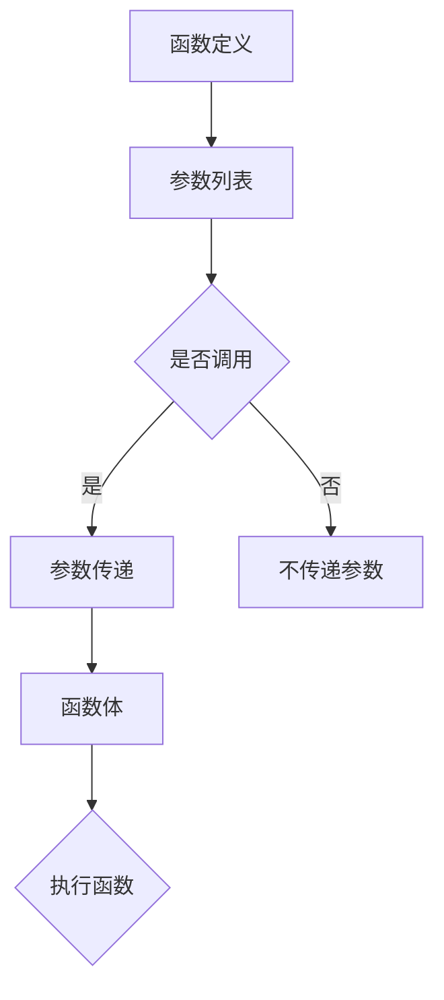

                 


# 文章标题：如何使用 Functions 参数

> 关键词：函数参数、参数类型、传递方式、高级使用、数据处理、编程实战、工程实践、优化设计

> 摘要：本文详细介绍了函数参数的使用方法，从基础到高级，再到实际应用，系统性地探讨了函数参数的类型、传递方式、高级使用技巧，以及在数据处理、编程实战、工程实践中的具体应用。最后，文章还提供了函数参数设计的最佳实践和优化方法。

### 《如何使用 Functions 参数》目录大纲

#### 第一部分：函数参数基础

#### 第1章：函数参数概述

##### 1.1 函数参数的定义与作用

##### 1.2 函数参数的类型与特点

##### 1.3 函数参数的传递方式

##### 1.4 函数参数在函数调用过程中的作用

#### 第2章：基本参数使用

##### 2.1 默认参数的使用

##### 2.2 关键字参数的使用

##### 2.3 不定长参数的使用

##### 2.4 参数的传递与返回

#### 第3章：函数参数的高级使用

##### 3.1 参数的默认值设置与引用

##### 3.2 参数的可变性和解包

##### 3.3 参数的类型检查与转换

##### 3.4 参数的打包与解包

#### 第二部分：函数参数在实际应用中的使用

#### 第4章：函数参数在数据处理中的应用

##### 4.1 数据清洗与预处理

##### 4.2 数据分组与聚合

##### 4.3 数据筛选与过滤

##### 4.4 数据转换与映射

#### 第5章：函数参数在编程实战中的应用

##### 5.1 程序模块化与函数重用

##### 5.2 算法设计与优化

##### 5.3 函数参数在Web开发中的应用

##### 5.4 函数参数在数据分析中的应用

#### 第6章：函数参数在工程实践中的应用

##### 6.1 函数参数在项目开发中的应用

##### 6.2 函数参数在测试中的应用

##### 6.3 函数参数在文档编写中的应用

##### 6.4 函数参数在团队合作中的应用

#### 第三部分：函数参数进阶学习

#### 第7章：函数参数的设计与优化

##### 7.1 参数设计的原则与方法

##### 7.2 参数优化的方法与技巧

##### 7.3 参数错误的调试与修复

##### 7.4 参数的最佳实践

#### 附录：函数参数相关资源

##### A.1 函数参数的常用资料与教程

##### A.2 函数参数相关的开源项目与工具

##### A.3 函数参数的学习与交流社区

### 第一部分：函数参数基础

#### 第1章：函数参数概述

##### 1.1 函数参数的定义与作用

**定义与作用**：

在编程中，函数参数（function arguments）是传递给函数的数据，用于在函数体内部进行操作。参数的传递使得函数能够处理不同类型和数量的数据，从而增强了函数的灵活性和可重用性。具体来说，函数参数的作用包括以下几个方面：

1. **数据传递**：通过参数，可以将数据从函数外部传递到函数内部，使函数能够处理这些数据。
2. **函数行为定制**：通过传递不同的参数，可以定制函数的行为，使其适应不同的使用场景。
3. **函数重用**：通过参数，可以将通用的函数应用于多种不同的数据类型或数据集合，从而提高代码的可重用性。

**流程图**：

以下是一个简单的Mermaid流程图，展示了参数传递的基本流程：



**图解**：

1. **函数定义**：定义一个函数时，可以指定一个或多个参数，这些参数用于接收外部传递的数据。
2. **参数列表**：函数定义中的参数列表，用于声明函数所需的参数及其类型。
3. **是否调用**：判断是否调用该函数。
4. **参数传递**：如果调用函数，则将参数传递给函数。
5. **函数体**：函数内部对参数进行操作，并执行相关任务。
6. **执行函数**：执行函数体中的代码。

##### 1.2 函数参数的类型与特点

**基本类型**：

函数参数主要有以下几种类型：

1. **位置参数**（positional arguments）：通过位置来传递参数，即参数的顺序和数量必须与定义时一致。
2. **关键字参数**（keyword arguments）：通过参数名来传递参数，可以与位置参数共存，但关键字参数必须在位置参数之后。
3. **不定长参数**（variable-length arguments）：允许传递任意数量的参数，常用于处理可变长度的数据集合。

**特点与比较**：

1. **位置参数**：
   - **特点**：通过位置传递参数，直观且易理解。
   - **适用场景**：当参数的数量和顺序固定时，适合使用位置参数。

2. **关键字参数**：
   - **特点**：通过参数名传递参数，更加灵活，可以与位置参数共存。
   - **适用场景**：当参数的数量和顺序不固定时，或需要按照特定顺序传递参数时，适合使用关键字参数。

3. **不定长参数**：
   - **特点**：可以传递任意数量的参数，适用于处理不确定数量的数据。
   - **适用场景**：当函数需要处理多个参数时，或参数的数量可能变化时，适合使用不定长参数。

**伪代码**：

以下是一个简单的伪代码示例，展示了不同类型参数的简单使用：

```python
# 位置参数示例
def greet(name):
    print(f"Hello, {name}!")

greet("Alice")  # 输出：Hello, Alice!

# 关键字参数示例
def describe_person(name, age, occupation=None):
    print(f"Name: {name}, Age: {age}, Occupation: {occupation}")

describe_person(name="Alice", age=30)  # 输出：Name: Alice, Age: 30

# 不定长参数示例
def sum_numbers(*args):
    total = 0
    for num in args:
        total += num
    return total

print(sum_numbers(1, 2, 3, 4, 5))  # 输出：15
```

##### 1.3 函数参数的传递方式

**值传递**：

值传递是指将参数的值复制一份传递给函数，函数内部对参数的修改不会影响外部变量的值。在大多数编程语言中，基本数据类型（如整数、浮点数、字符串等）通常采用值传递方式。

**示例**：

```python
def increment(x):
    x += 1
    return x

a = 10
b = increment(a)
print(a, b)  # 输出：10 11
```

**图解**：

```mermaid
graph TD
    A[变量a: 10] --> B[调用increment(a)]
    B --> C{传递值：10}
    C --> D[increment函数体]
    D --> E[修改x：10 + 1]
    E --> F[返回值：11]
    F --> G[变量b: 11]
    G --> H[输出：10 11]
```

**图解说明**：

1. 变量`a`的值为10。
2. 调用`increment(a)`函数，传递值10。
3. 在函数内部，变量`x`的值为10。
4. 变量`x`的值加1，但外部变量`a`的值不变。
5. 返回值11，变量`b`的值为11。
6. 输出`a`和`b`的值，分别为10和11。

**引用传递**：

引用传递是指将参数的引用（地址）传递给函数，函数内部对参数的修改会影响外部变量的值。在Python中，列表、字典等可变数据类型采用引用传递方式。

**示例**：

```python
def append_element(lst, elem):
    lst.append(elem)
    return lst

my_list = [1, 2, 3]
my_list = append_element(my_list, 4)
print(my_list)  # 输出：[1, 2, 3, 4]
```

**图解**：

```mermaid
graph TD
    A[变量my_list: [1, 2, 3]] --> B[调用append_element(my_list, 4)]
    B --> C{传递引用：my_list}
    C --> D[append_element函数体]
    D --> E[修改lst：[1, 2, 3, 4]]
    E --> F[返回引用：my_list]
    F --> G[变量my_list: [1, 2, 3, 4]]
    G --> H[输出：[1, 2, 3, 4]]
```

**图解说明**：

1. 变量`my_list`的值为`[1, 2, 3]`。
2. 调用`append_element(my_list, 4)`函数，传递引用`my_list`。
3. 在函数内部，变量`lst`的引用与`my_list`相同。
4. 变量`lst`的值追加元素4，导致外部变量`my_list`的值也变为`[1, 2, 3, 4]`。
5. 返回引用`my_list`。
6. 输出`my_list`的值，为`[1, 2, 3, 4]`。

**Python中的传递方式**：

在Python中，参数传递的方式可以分为以下几种：

1. **不可变参数**：如整数、浮点数、字符串等，采用值传递方式。
2. **可变参数**：如列表、字典等，采用引用传递方式。

**示例**：

```python
def increment(x):
    x += 1
    return x

def append_element(lst, elem):
    lst.append(elem)
    return lst

a = 10
b = increment(a)
print(a, b)  # 输出：10 11

my_list = [1, 2, 3]
new_list = append_element(my_list, 4)
print(my_list, new_list)  # 输出：[1, 2, 3, 4]
```

**图解**：

```mermaid
graph TD
    A[变量a: 10] --> B[调用increment(a)]
    B --> C{传递值：10}
    C --> D[increment函数体]
    D --> E[修改x：10 + 1]
    E --> F[返回值：11]
    F --> G[变量b: 11]
    G --> H[输出：10 11]

    I[变量my_list: [1, 2, 3]] --> J[调用append_element(my_list, 4)]
    J --> K{传递引用：my_list}
    K --> L[append_element函数体]
    L --> M[修改lst：[1, 2, 3, 4]]
    M --> N[返回引用：my_list]
    N --> O[变量my_list: [1, 2, 3, 4]]
    O --> P[输出：[1, 2, 3, 4]]
```

**图解说明**：

1. 变量`a`的值为10，调用`increment(a)`函数，传递值10。
2. 在函数内部，变量`x`的值为10。
3. 变量`x`的值加1，但外部变量`a`的值不变。
4. 返回值11，变量`b`的值为11。
5. 输出`a`和`b`的值，分别为10和11。

1. 变量`my_list`的值为`[1, 2, 3]`，调用`append_element(my_list, 4)`函数，传递引用`my_list`。
2. 在函数内部，变量`lst`的引用与`my_list`相同。
3. 变量`lst`的值追加元素4，导致外部变量`my_list`的值也变为`[1, 2, 3, 4]`。
4. 返回引用`my_list`。
5. 输出`my_list`的值，为`[1, 2, 3, 4]`。

##### 1.4 函数参数在函数调用过程中的作用

**调用过程**：

函数调用过程中，参数的作用主要体现在以下几个方面：

1. **数据传递**：在调用函数时，将实际参数传递给函数，以便函数内部使用。
2. **函数行为定制**：通过传递不同的参数，可以定制函数的行为，使其适应不同的使用场景。
3. **默认参数**：在函数定义时，可以为参数设置默认值，以便在调用时省略某些参数。

**示例代码**：

以下示例展示了函数参数在调用过程中的作用：

```python
# 默认参数示例
def greet(name, greeting="Hello"):
    print(f"{greeting}, {name}!")

greet("Alice")  # 输出：Hello, Alice!
greet("Bob", "Hi")  # 输出：Hi, Bob!

# 关键字参数示例
def describe_person(name, age, occupation=None):
    print(f"Name: {name}, Age: {age}, Occupation: {occupation}")

describe_person(name="Alice", age=30)  # 输出：Name: Alice, Age: 30
describe_person(name="Bob", age=25, occupation="Student")  # 输出：Name: Bob, Age: 25, Occupation: Student

# 不定长参数示例
def sum_numbers(*args):
    total = 0
    for num in args:
        total += num
    return total

print(sum_numbers(1, 2, 3, 4, 5))  # 输出：15
print(sum_numbers(10, 20, 30))  # 输出：60
```

**图解**：

```mermaid
graph TD
    A[调用greet("Alice")] --> B[参数传递：name="Alice", greeting="Hello"]
    B --> C[greet函数体]
    C --> D[输出：Hello, Alice!]

    E[调用greet("Bob", "Hi")] --> F[参数传递：name="Bob", greeting="Hi"]
    F --> G[greet函数体]
    G --> H[输出：Hi, Bob!]

    I[调用describe_person(name="Alice", age=30)] --> J[参数传递：name="Alice", age=30, occupation=None]
    J --> K[describe_person函数体]
    K --> L[输出：Name: Alice, Age: 30]

    M[调用describe_person(name="Bob", age=25, occupation="Student")] --> N[参数传递：name="Bob", age=25, occupation="Student"]
    N --> O[describe_person函数体]
    O --> P[输出：Name: Bob, Age: 25, Occupation: Student]

    Q[调用sum_numbers(1, 2, 3, 4, 5)] --> R[参数传递：args=(1, 2, 3, 4, 5)]
    R --> S[sum_numbers函数体]
    S --> T[返回值：15]
    T --> U[输出：15]

    V[调用sum_numbers(10, 20, 30)] --> W[参数传递：args=(10, 20, 30)]
    W --> X[sum_numbers函数体]
    X --> Y[返回值：60]
    Y --> Z[输出：60]
```

**图解说明**：

1. 调用`greet("Alice")`函数，传递参数`name="Alice", greeting="Hello"`。
2. 函数`greet`内部输出`Hello, Alice!`。
3. 调用`greet("Bob", "Hi")`函数，传递参数`name="Bob", greeting="Hi"`。
4. 函数`greet`内部输出`Hi, Bob!`。

1. 调用`describe_person(name="Alice", age=30)`函数，传递参数`name="Alice", age=30, occupation=None`。
2. 函数`describe_person`内部输出`Name: Alice, Age: 30`。
3. 调用`describe_person(name="Bob", age=25, occupation="Student")`函数，传递参数`name="Bob", age=25, occupation="Student"`。
4. 函数`describe_person`内部输出`Name: Bob, Age: 25, Occupation: Student`。

1. 调用`sum_numbers(1, 2, 3, 4, 5)`函数，传递参数`args=(1, 2, 3, 4, 5)`。
2. 函数`sum_numbers`内部计算总和，返回15。
3. 输出结果15。
4. 调用`sum_numbers(10, 20, 30)`函数，传递参数`args=(10, 20, 30)`。
5. 函数`sum_numbers`内部计算总和，返回60。
6. 输出结果60。

### 第二部分：基本参数使用

#### 第2章：基本参数使用

##### 2.1 默认参数的使用

默认参数是函数参数的一种特殊形式，允许在函数定义时为参数设置默认值。这样，在调用函数时，如果未指定该参数的值，函数将使用默认值。默认参数的使用可以提高代码的灵活性和可读性。

**默认参数的定义**：

在函数定义时，可以为参数设置默认值，例如：

```python
def greet(name, greeting="Hello"):
    print(f"{greeting}, {name}!")
```

在这个例子中，`greeting` 参数有一个默认值 `"Hello"`。如果调用 `greet` 函数时未提供 `greeting` 参数的值，函数将使用默认值 `"Hello"`。

**默认参数的作用**：

默认参数的作用主要体现在以下几个方面：

1. **简化代码**：通过提供默认参数，可以在调用函数时省略某些参数，从而简化代码。
2. **灵活定制**：默认参数使得函数能够适应多种不同的使用场景，用户可以根据需要选择是否使用默认参数。
3. **可维护性**：默认参数有助于降低函数的依赖性，使得函数更易于维护和扩展。

**示例代码**：

以下示例展示了默认参数的使用：

```python
# 默认参数示例
def greet(name, greeting="Hello"):
    print(f"{greeting}, {name}!")

greet("Alice")  # 输出：Hello, Alice!
greet("Bob", "Hi")  # 输出：Hi, Bob!

# 示例解释
# 调用greet("Alice")时，未提供greeting参数的值，函数使用默认值"Hello"。
# 输出结果为：Hello, Alice!

# 调用greet("Bob", "Hi")时，提供了greeting参数的值"Hi"，函数使用提供的值。
# 输出结果为：Hi, Bob!
```

在这个示例中，我们定义了一个名为 `greet` 的函数，它有两个参数：`name` 和 `greeting`。`greeting` 参数有一个默认值 `"Hello"`。

1. **调用 `greet("Alice")`：**
   - 未提供 `greeting` 参数的值，函数使用默认值 `"Hello"`。
   - 输出结果为："Hello, Alice!"。

2. **调用 `greet("Bob", "Hi")`：**
   - 提供了 `greeting` 参数的值 `"Hi"`。
   - 输出结果为："Hi, Bob!"。

**总结**：

默认参数的使用可以简化函数的调用过程，提高代码的可读性和灵活性。通过为参数设置默认值，用户可以根据需要选择是否使用默认参数，从而实现函数的灵活定制。

##### 2.2 关键字参数的使用

关键字参数是函数参数的一种特殊形式，允许在函数调用时使用参数名来指定参数的值。关键字参数的使用可以增强函数的可读性和灵活性。

**关键字参数的定义**：

在函数调用时，可以使用参数名来指定参数的值，例如：

```python
def describe_person(name, age, occupation=None):
    print(f"Name: {name}, Age: {age}, Occupation: {occupation}")
```

在这个例子中，`occupation` 参数是一个关键字参数，它有一个默认值 `None`。在调用函数时，可以按参数名提供 `occupation` 参数的值。

**关键字参数的作用**：

关键字参数的作用主要体现在以下几个方面：

1. **提高可读性**：通过使用参数名，使得函数调用更加直观，易于理解。
2. **简化代码**：允许在函数调用时省略某些参数，从而简化代码。
3. **灵活定制**：关键字参数使得函数能够适应多种不同的使用场景，用户可以根据需要选择是否使用关键字参数。

**示例代码**：

以下示例展示了关键字参数的使用：

```python
# 关键字参数示例
def describe_person(name, age, occupation=None):
    print(f"Name: {name}, Age: {age}, Occupation: {occupation}")

describe_person(name="Alice", age=30)  # 输出：Name: Alice, Age: 30
describe_person(name="Bob", age=25, occupation="Student")  # 输出：Name: Bob, Age: 25, Occupation: Student

# 示例解释
# 调用describe_person(name="Alice", age=30)时，使用关键字参数指定参数值。
# 输出结果为：Name: Alice, Age: 30。

# 调用describe_person(name="Bob", age=25, occupation="Student")时，使用关键字参数指定参数值。
# 输出结果为：Name: Bob, Age: 25, Occupation: Student。
```

在这个示例中，我们定义了一个名为 `describe_person` 的函数，它有三个参数：`name`、`age` 和 `occupation`。`occupation` 参数是一个关键字参数，它有一个默认值 `None`。

1. **调用 `describe_person(name="Alice", age=30)`：**
   - 使用关键字参数指定参数值。
   - 输出结果为：Name: Alice, Age: 30。

2. **调用 `describe_person(name="Bob", age=25, occupation="Student")`：**
   - 使用关键字参数指定参数值。
   - 输出结果为：Name: Bob, Age: 25, Occupation: Student。

**总结**：

关键字参数的使用可以提高函数的可读性和灵活性。通过使用参数名，可以简化函数的调用过程，使得代码更加直观易懂。关键字参数还允许用户根据需要选择是否使用某些参数，从而提高函数的适应性和可扩展性。

##### 2.3 不定长参数的使用

不定长参数是函数参数的一种特殊形式，允许在函数调用时传递任意数量的参数。这种参数形式在处理可变长度的数据集合时非常有用。

**不定长参数的定义**：

在函数定义时，可以使用星号（`*`）来定义不定长参数，例如：

```python
def sum_numbers(*args):
    total = 0
    for num in args:
        total += num
    return total
```

在这个例子中，`*args` 表示一个不定长参数，它可以接收任意数量的参数。在函数内部，`args` 是一个元组（tuple），包含了传递给函数的所有参数。

**不定长参数的作用**：

不定长参数的作用主要体现在以下几个方面：

1. **处理可变长度的数据集合**：不定长参数允许函数处理任意数量的数据，从而提高了函数的灵活性。
2. **简化代码**：通过使用不定长参数，可以减少函数的参数数量，从而简化代码。
3. **函数重用**：不定长参数使得函数可以应用于多种不同的数据集合，从而提高了函数的可重用性。

**示例代码**：

以下示例展示了不定长参数的使用：

```python
# 不定长参数示例
def sum_numbers(*args):
    total = 0
    for num in args:
        total += num
    return total

print(sum_numbers(1, 2, 3, 4, 5))  # 输出：15
print(sum_numbers(10, 20, 30))  # 输出：60

# 示例解释
# 调用sum_numbers(1, 2, 3, 4, 5)时，传递了5个参数。
# 函数内部遍历参数，计算总和，返回15。

# 调用sum_numbers(10, 20, 30)时，传递了3个参数。
# 函数内部遍历参数，计算总和，返回60。
```

在这个示例中，我们定义了一个名为 `sum_numbers` 的函数，它使用了一个不定长参数 `*args`。

1. **调用 `sum_numbers(1, 2, 3, 4, 5)`：**
   - 传递了5个参数。
   - 函数内部遍历参数，计算总和，返回15。

2. **调用 `sum_numbers(10, 20, 30)`：**
   - 传递了3个参数。
   - 函数内部遍历参数，计算总和，返回60。

**总结**：

不定长参数的使用可以提高函数的灵活性和可重用性。通过使用不定长参数，可以处理任意数量的数据，从而简化代码并提高函数的适应性。不定长参数在处理可变长度的数据集合时非常有用，是函数参数的一种重要形式。

##### 2.4 参数的传递与返回

在函数调用过程中，参数的传递与返回是两个关键环节。参数的传递涉及函数外部数据到函数内部的传输，而返回值则是函数执行结果的外部呈现。

**参数的传递**：

参数的传递方式根据不同的编程语言和参数类型而有所不同。在Python中，参数的传递方式主要包括以下几种：

1. **值传递**：对于基本数据类型（如整数、浮点数、字符串等），参数的传递采用值传递方式。这意味着函数内部对参数的修改不会影响外部变量的值。
2. **引用传递**：对于可变数据类型（如列表、字典等），参数的传递采用引用传递方式。这意味着函数内部对参数的修改会直接影响外部变量的值。

**示例代码**：

以下示例展示了不同参数传递方式的用法：

```python
# 值传递示例
def increment(x):
    x += 1
    return x

a = 10
b = increment(a)
print(a, b)  # 输出：10 11

# 引用传递示例
def append_element(lst, elem):
    lst.append(elem)
    return lst

my_list = [1, 2, 3]
my_list = append_element(my_list, 4)
print(my_list)  # 输出：[1, 2, 3, 4]
```

1. **值传递示例**：
   - 函数 `increment` 接受一个整数参数 `x`，并对其进行修改。
   - 变量 `a` 的初始值为10，调用 `increment(a)` 后，`a` 的值仍为10，但返回值 `b` 为11。

2. **引用传递示例**：
   - 函数 `append_element` 接受一个列表参数 `lst`，并对其进行修改。
   - 变量 `my_list` 的初始值为 `[1, 2, 3]`，调用 `append_element(my_list, 4)` 后，`my_list` 的值变为 `[1, 2, 3, 4]`。

**返回值**：

返回值是函数执行结果的一种表现形式，它可以从函数内部传递到外部。函数的返回值可以通过 `return` 语句来定义。返回值可以是任何类型的数据，包括基本数据类型、可变数据类型以及函数等。

**示例代码**：

以下示例展示了返回值的使用：

```python
# 返回值示例
def add(a, b):
    return a + b

result = add(5, 3)
print(result)  # 输出：8

def greet(name, greeting="Hello"):
    print(f"{greeting}, {name}!")
    return "Greeted"

greet("Alice")
message = greet("Bob")
print(message)  # 输出：Greeted
```

1. **返回值示例**：
   - 函数 `add` 接受两个整数参数 `a` 和 `b`，并返回它们的和。
   - 变量 `result` 调用 `add(5, 3)` 后，存储返回值8。

2. **返回值与输出**：
   - 函数 `greet` 接受两个参数：`name` 和 `greeting`。
   - 调用 `greet("Alice")` 时，函数先输出 "Hello, Alice!"，然后返回字符串 "Greeted"。
   - 变量 `message` 调用 `greet("Bob")` 后，存储返回值 "Greeted"。

**总结**：

参数的传递与返回是函数调用过程中的两个关键环节。参数的传递方式决定了函数内部对数据的操作范围，而返回值则是函数对外部世界的一种反馈。理解参数的传递与返回，有助于更好地编写和使用函数，提高代码的可读性和可维护性。

### 第三部分：函数参数的高级使用

#### 第3章：函数参数的高级使用

在函数参数的基本使用方法之外，还有许多高级使用技巧可以提升代码的灵活性和可维护性。本章将介绍参数的高级使用，包括默认值设置与引用、可变性和解包、类型检查与转换以及打包与解包等内容。

##### 3.1 参数的默认值设置与引用

默认值设置是函数参数的一个关键特性，它允许在函数定义时为参数设置一个初始值。这样可以避免在每次调用函数时都传入所有参数，提高了代码的灵活性和可维护性。同时，默认值设置还可以用于引用传递的可变参数，使得函数可以修改这些参数的值。

**默认值设置**：

在Python中，可以为函数参数设置默认值。默认值在调用函数时可以省略，但必须放在参数列表的末尾。

```python
def greet(name, greeting="Hello"):
    print(f"{greeting}, {name}!")
```

在这个例子中，`greeting` 参数有一个默认值 `"Hello"`。如果调用函数时未提供 `greeting` 参数的值，函数将使用默认值。

**默认值的作用**：

默认值的主要作用有以下几点：

1. **简化调用**：用户在调用函数时可以省略某些参数的值，从而简化调用过程。
2. **灵活定制**：默认值允许函数适应不同的使用场景，用户可以根据需要选择是否使用默认值。
3. **可维护性**：默认值使得函数更加灵活，易于维护和扩展。

**示例代码**：

以下示例展示了如何设置和使用默认值：

```python
# 默认值设置与使用示例
def greet(name, greeting="Hello"):
    print(f"{greeting}, {name}!")

greet("Alice")  # 输出：Hello, Alice!
greet("Bob", "Hi")  # 输出：Hi, Bob!

# 示例解释
# 调用greet("Alice")时，未提供greeting参数的值，函数使用默认值"Hello"。
# 输出结果为：Hello, Alice!

# 调用greet("Bob", "Hi")时，提供了greeting参数的值"Hi"。
# 输出结果为：Hi, Bob!
```

在这个示例中，我们定义了一个名为 `greet` 的函数，它有两个参数：`name` 和 `greeting`。`greeting` 参数有一个默认值 `"Hello"`。

1. **调用 `greet("Alice")`：**
   - 未提供 `greeting` 参数的值，函数使用默认值 `"Hello"`。
   - 输出结果为："Hello, Alice!"。

2. **调用 `greet("Bob", "Hi")`：**
   - 提供了 `greeting` 参数的值 `"Hi"`。
   - 输出结果为："Hi, Bob!"。

**默认值的引用**：

在Python中，默认值可以引用其他参数或全局变量。这种方式使得函数在调用时可以根据不同的参数值动态设置默认值。

```python
def configure_socket(host="localhost", port=80, use_ssl=False):
    if use_ssl:
        print(f"Configuring secure socket to {host}:{port}")
    else:
        print(f"Configuring socket to {host}:{port}")

configure_socket()  # 输出：Configuring socket to localhost:80
configure_socket(use_ssl=True)  # 输出：Configuring secure socket to localhost:80
configure_socket(port=443)  # 输出：Configuring socket to localhost:443
```

在这个示例中，`configure_socket` 函数有三个参数：`host`、`port` 和 `use_ssl`。`host` 和 `port` 参数有默认值，而 `use_ssl` 参数没有默认值。

1. **调用 `configure_socket()`：**
   - 函数使用默认值 `host="localhost"` 和 `port=80`。
   - 输出结果为："Configuring socket to localhost:80"。

2. **调用 `configure_socket(use_ssl=True)`：**
   - 函数使用默认值 `host="localhost"` 和 `port=80`，但 `use_ssl` 参数设置为 `True`。
   - 输出结果为："Configuring secure socket to localhost:80"。

3. **调用 `configure_socket(port=443)`：**
   - 函数使用默认值 `host="localhost"` 和 `use_ssl=False`，但 `port` 参数设置为 `443`。
   - 输出结果为："Configuring socket to localhost:443"。

**总结**：

默认值设置与引用是函数参数的高级使用技巧，可以提高代码的灵活性和可维护性。通过设置默认值，可以简化函数的调用过程，使得代码更加简洁。同时，默认值的引用使得函数可以根据不同的参数值动态设置默认值，增强了函数的适应性。

##### 3.2 参数的可变性和解包

在Python中，参数的可变性取决于参数的类型。不可变参数的值在函数内部无法修改，而可变参数的值则可以被修改。解包是一种将多个参数打包成单一参数的技术，使得函数可以接收和处理多个参数。本章将介绍参数的可变性以及如何使用解包。

**可变性**：

在Python中，不可变参数包括整数、浮点数、字符串等，而可变参数包括列表、字典等。不可变参数的值在函数内部无法修改，而可变参数的值则可以被修改。

```python
def increment(x):
    x += 1
    return x

a = 10
b = increment(a)
print(a, b)  # 输出：10 11

def append_element(lst, elem):
    lst.append(elem)
    return lst

my_list = [1, 2, 3]
my_list = append_element(my_list, 4)
print(my_list)  # 输出：[1, 2, 3, 4]
```

在这个示例中：

1. `increment` 函数接受一个不可变参数 `x`，对它进行修改后返回新值。变量 `a` 的值从10变为11，但外部变量 `a` 的值仍为10。

2. `append_element` 函数接受一个可变参数 `lst`，对其内部进行修改后返回新列表。变量 `my_list` 的值从 `[1, 2, 3]` 变为 `[1, 2, 3, 4]`。

**解包**：

解包是一种将多个参数打包成单一参数的技术，使得函数可以接收和处理多个参数。在Python中，可以使用星号（`*`）进行解包。

```python
def sum_numbers(*args):
    total = 0
    for num in args:
        total += num
    return total

print(sum_numbers(1, 2, 3, 4, 5))  # 输出：15
```

在这个示例中，`sum_numbers` 函数接受一个不定长参数 `*args`，它是一个元组，包含了传递给函数的所有参数。函数内部遍历 `*args`，计算总和并返回结果。

**示例代码**：

以下示例展示了参数的可变性和解包：

```python
# 参数可变性和解包示例
def increment(x):
    x += 1
    return x

a = 10
b = increment(a)
print(a, b)  # 输出：10 11

def append_element(lst, elem):
    lst.append(elem)
    return lst

my_list = [1, 2, 3]
my_list = append_element(my_list, 4)
print(my_list)  # 输出：[1, 2, 3, 4]

def sum_numbers(*args):
    total = 0
    for num in args:
        total += num
    return total

print(sum_numbers(1, 2, 3, 4, 5))  # 输出：15
```

在这个示例中：

1. `increment` 函数接受一个不可变参数 `a`，对它进行修改后返回新值。变量 `a` 的值从10变为11，但外部变量 `a` 的值仍为10。

2. `append_element` 函数接受一个可变参数 `lst`，对其内部进行修改后返回新列表。变量 `my_list` 的值从 `[1, 2, 3]` 变为 `[1, 2, 3, 4]`。

3. `sum_numbers` 函数接受一个不定长参数 `*args`，计算总和并返回结果。输出结果为15。

**总结**：

参数的可变性取决于参数的类型，不可变参数的值在函数内部无法修改，而可变参数的值可以被修改。解包是一种将多个参数打包成单一参数的技术，使得函数可以接收和处理多个参数。通过理解参数的可变性和解包，可以编写更加灵活和高效的代码。

##### 3.3 参数的类型检查与转换

在函数参数的使用过程中，有时需要对传递的参数进行类型检查和转换，以确保函数能够正常执行并处理正确的数据类型。本章将介绍如何在Python中进行参数的类型检查和类型转换。

**类型检查**：

类型检查是确保函数接收到的参数是预期数据类型的一种机制。在Python中，可以使用内置的 `isinstance()` 函数进行类型检查。

```python
def greet(name):
    if not isinstance(name, str):
        raise TypeError("name must be a string")
    print(f"Hello, {name}!")

greet("Alice")  # 输出：Hello, Alice!
# greet(123)  # 引发TypeError：name must be a string
```

在这个示例中，`greet` 函数接受一个参数 `name`，使用 `isinstance()` 函数检查 `name` 是否为字符串。如果不是，则抛出 `TypeError` 异常。

**类型转换**：

类型转换是将参数从一个数据类型转换为另一个数据类型的过程。在Python中，可以使用内置的 `str()`、`int()`、`float()` 等函数进行类型转换。

```python
def convert_to_string(number):
    return str(number)

num = 42
str_num = convert_to_string(num)
print(str_num)  # 输出："42"

def convert_to_int(text):
    return int(text)

text = "100"
int_num = convert_to_int(text)
print(int_num)  # 输出：100
```

在这个示例中：

1. `convert_to_string` 函数接受一个整数参数 `number`，使用 `str()` 函数将其转换为字符串。

2. `convert_to_int` 函数接受一个字符串参数 `text`，使用 `int()` 函数将其转换为整数。

**示例代码**：

以下示例展示了参数的类型检查和类型转换：

```python
# 类型检查与转换示例
def greet(name):
    if not isinstance(name, str):
        raise TypeError("name must be a string")
    print(f"Hello, {name}!")

greet("Alice")  # 输出：Hello, Alice!
# greet(123)  # 引发TypeError：name must be a string

def convert_to_string(number):
    return str(number)

num = 42
str_num = convert_to_string(num)
print(str_num)  # 输出："42"

def convert_to_int(text):
    return int(text)

text = "100"
int_num = convert_to_int(text)
print(int_num)  # 输出：100
```

在这个示例中：

1. `greet` 函数接受一个参数 `name`，使用 `isinstance()` 函数检查 `name` 是否为字符串。如果是，则输出 "Hello, Alice!"。

2. `convert_to_string` 函数接受一个整数参数 `number`，使用 `str()` 函数将其转换为字符串。

3. `convert_to_int` 函数接受一个字符串参数 `text`，使用 `int()` 函数将其转换为整数。

**总结**：

参数的类型检查和类型转换是函数参数的高级使用技巧，有助于确保函数接收到的参数是正确的数据类型，从而提高代码的健壮性和可维护性。通过理解类型检查和类型转换，可以编写更加安全和可靠的代码。

##### 3.4 参数的打包与解包

在Python中，参数的打包与解包是一种将多个参数组合成一个参数或将一个参数拆分成多个参数的技术。打包与解包的使用可以简化代码的编写，提高函数的灵活性。本章将介绍参数的打包与解包。

**打包**：

打包是将多个参数组合成一个参数的技术。在Python中，可以使用星号（`*`）进行打包。

```python
def sum_numbers(a, b):
    return a + b

args = (1, 2, 3, 4)
result = sum_numbers(*args)
print(result)  # 输出：10
```

在这个示例中，`sum_numbers` 函数接受两个参数 `a` 和 `b`。通过使用打包技术，将 `(1, 2, 3, 4)` 组合成一个参数 `args`，传递给函数。

**解包**：

解包是将一个参数拆分成多个参数的技术。在Python中，可以使用星号（`*`）进行解包。

```python
def describe_person(name, age, occupation=None):
    print(f"Name: {name}, Age: {age}, Occupation: {occupation or 'Unknown'}")

info = ("Alice", 30, "Engineer")
describe_person(*info)  # 输出：Name: Alice, Age: 30, Occupation: Engineer
```

在这个示例中，`describe_person` 函数接受三个参数 `name`、`age` 和 `occupation`。通过使用解包技术，将元组 `("Alice", 30, "Engineer")` 拆分成多个参数，传递给函数。

**示例代码**：

以下示例展示了参数的打包与解包：

```python
# 参数打包与解包示例
def sum_numbers(a, b):
    return a + b

args = (1, 2, 3, 4)
result = sum_numbers(*args)
print(result)  # 输出：10

def describe_person(name, age, occupation=None):
    print(f"Name: {name}, Age: {age}, Occupation: {occupation or 'Unknown'}")

info = ("Alice", 30, "Engineer")
describe_person(*info)  # 输出：Name: Alice, Age: 30, Occupation: Engineer
```

在这个示例中：

1. `sum_numbers` 函数接受两个参数 `a` 和 `b`。通过使用打包技术，将 `(1, 2, 3, 4)` 组合成一个参数 `args`，传递给函数。

2. `describe_person` 函数接受三个参数 `name`、`age` 和 `occupation`。通过使用解包技术，将元组 `("Alice", 30, "Engineer")` 拆分成多个参数，传递给函数。

**总结**：

参数的打包与解包是一种将多个参数组合成一个参数或将一个参数拆分成多个参数的技术。通过理解参数的打包与解包，可以编写更加灵活和高效的代码。在处理复杂数据和多个参数时，打包与解包可以简化代码的编写，提高函数的灵活性。

### 第四部分：函数参数在实际应用中的使用

#### 第4章：函数参数在数据处理中的应用

在数据处理中，函数参数的使用是至关重要的。函数参数可以灵活地处理数据，使得数据处理过程更加高效和可扩展。本章将介绍函数参数在数据处理中的应用，包括数据清洗与预处理、数据分组与聚合、数据筛选与过滤以及数据转换与映射等内容。

##### 4.1 数据清洗与预处理

数据清洗和预处理是数据处理的重要步骤，目的是将原始数据转换为适合分析和建模的形式。函数参数在数据清洗与预处理中发挥着重要作用。

**数据清洗**：

数据清洗是指从原始数据中删除重复值、缺失值、异常值等无效数据，以提高数据质量。函数参数可以帮助我们实现数据清洗。

```python
def clean_data(data):
    cleaned_data = [row for row in data if row != ""]
    return cleaned_data

data = ["1", "", "3", "4", ""]
cleaned_data = clean_data(data)
print(cleaned_data)  # 输出：['1', '3', '4']
```

在这个示例中，`clean_data` 函数接受一个数据列表 `data`，使用列表推导式删除空值，返回清洗后的数据。

**预处理**：

预处理是指将原始数据转换为适合分析和建模的形式。预处理包括数据转换、数据格式化、数据规范化等操作。函数参数可以帮助我们实现预处理。

```python
def preprocess_data(data):
    processed_data = [int(row) for row in data]
    return processed_data

data = ["1", "2", "3", "4", "5"]
processed_data = preprocess_data(data)
print(processed_data)  # 输出：[1, 2, 3, 4, 5]
```

在这个示例中，`preprocess_data` 函数接受一个字符串列表 `data`，使用列表推导式将每个元素转换为整数，返回预处理后的数据。

**示例代码**：

以下示例展示了数据清洗与预处理的应用：

```python
# 数据清洗与预处理示例
data = ["1", "", "3", "4", ""]
cleaned_data = clean_data(data)
print(cleaned_data)  # 输出：['1', '3', '4']

data = ["1", "2", "3", "4", "5"]
processed_data = preprocess_data(data)
print(processed_data)  # 输出：[1, 2, 3, 4, 5]
```

在这个示例中：

1. `clean_data` 函数接受一个数据列表 `data`，使用列表推导式删除空值，返回清洗后的数据。

2. `preprocess_data` 函数接受一个字符串列表 `data`，使用列表推导式将每个元素转换为整数，返回预处理后的数据。

**总结**：

数据清洗与预处理是数据处理的重要步骤，函数参数可以帮助我们高效地清洗和预处理数据。通过数据清洗，我们可以去除无效数据，提高数据质量；通过预处理，我们可以将原始数据转换为适合分析和建模的形式。

##### 4.2 数据分组与聚合

在数据处理中，数据分组与聚合是非常常见的操作。数据分组是将数据按照某种特征进行分类，而数据聚合则是将分组后的数据按照一定规则进行汇总。函数参数可以灵活地实现数据分组与聚合。

**分组**：

数据分组是将数据按照某种特征进行分类的过程。我们可以使用字典来实现数据分组。

```python
def group_data(data, key):
    groups = {}
    for item in data:
        groups[item[key]] = groups.get(item[key], [])
        groups[item[key]].append(item)
    return groups

data = [{"name": "Alice", "age": 25}, {"name": "Bob", "age": 30}, {"name": "Alice", "age": 35}]
grouped_data = group_data(data, "name")
print(grouped_data)  # 输出：{'Alice': [{'age': 25}, {'age': 35}], 'Bob': [{'age': 30}]}
```

在这个示例中，`group_data` 函数接受一个数据列表 `data` 和一个分组特征 `key`，将数据按照 `key` 进行分组，并返回分组后的数据。

**聚合**：

数据聚合是将分组后的数据按照一定规则进行汇总的过程。我们可以使用聚合函数来实现数据聚合。

```python
from collections import Counter

def aggregate_data(data, key):
    counts = Counter(item[key] for item in data)
    return counts

data = [{"name": "Alice"}, {"name": "Alice"}, {"name": "Bob"}]
aggregated_data = aggregate_data(data, "name")
print(aggregated_data)  # 输出：Counter({'Alice': 2, 'Bob': 1})
```

在这个示例中，`aggregate_data` 函数接受一个数据列表 `data` 和一个分组特征 `key`，使用 `Counter` 函数计算每个分组特征的计数，并返回聚合后的数据。

**示例代码**：

以下示例展示了数据分组与聚合的应用：

```python
# 数据分组与聚合示例
data = [{"name": "Alice", "age": 25}, {"name": "Bob", "age": 30}, {"name": "Alice", "age": 35}]
grouped_data = group_data(data, "name")
print(grouped_data)  # 输出：{'Alice': [{'age': 25}, {'age': 35}], 'Bob': [{'age': 30}]}

data = [{"name": "Alice"}, {"name": "Alice"}, {"name": "Bob"}]
aggregated_data = aggregate_data(data, "name")
print(aggregated_data)  # 输出：Counter({'Alice': 2, 'Bob': 1})
```

在这个示例中：

1. `group_data` 函数接受一个数据列表 `data` 和一个分组特征 `key`，将数据按照 `key` 进行分组，并返回分组后的数据。

2. `aggregate_data` 函数接受一个数据列表 `data` 和一个分组特征 `key`，使用 `Counter` 函数计算每个分组特征的计数，并返回聚合后的数据。

**总结**：

数据分组与聚合是数据处理中的重要步骤，函数参数可以帮助我们高效地实现数据分组与聚合。通过数据分组，我们可以将数据按照某种特征进行分类；通过数据聚合，我们可以对分组后的数据进行汇总和统计。

##### 4.3 数据筛选与过滤

在数据处理中，数据筛选与过滤是非常常见的操作。数据筛选是从数据中选取满足特定条件的记录，而数据过滤则是将不满足条件的记录排除。函数参数可以灵活地实现数据筛选与过滤。

**筛选**：

数据筛选是从数据中选取满足特定条件的记录。我们可以使用列表推导式来实现数据筛选。

```python
def filter_data(data, condition):
    filtered_data = [item for item in data if condition(item)]
    return filtered_data

data = [{"name": "Alice", "age": 25}, {"name": "Bob", "age": 30}, {"name": "Charlie", "age": 35}]
filtered_data = filter_data(data, lambda x: x["age"] > 28)
print(filtered_data)  # 输出：[{'name': 'Bob', 'age': 30}, {'name': 'Charlie', 'age': 35}]
```

在这个示例中，`filter_data` 函数接受一个数据列表 `data` 和一个筛选条件 `condition`，使用列表推导式筛选满足条件的数据，并返回筛选后的数据。

**过滤**：

数据过滤是将不满足条件的记录排除。我们可以使用列表推导式来实现数据过滤。

```python
def filter_data(data, filter_func):
    filtered_data = [item for item in data if filter_func(item)]
    return filtered_data

data = [{"name": "Alice", "age": 25}, {"name": "Bob", "age": 30}, {"name": "Charlie", "age": 35}]
filtered_data = filter_data(data, lambda x: x["age"] > 28)
print(filtered_data)  # 输出：[{'name': 'Bob', 'age': 30}, {'name': 'Charlie', 'age': 35}]
```

在这个示例中，`filter_data` 函数接受一个数据列表 `data` 和一个过滤函数 `filter_func`，使用列表推导式过滤不满足条件的数据，并返回过滤后的数据。

**示例代码**：

以下示例展示了数据筛选与过滤的应用：

```python
# 数据筛选与过滤示例
data = [{"name": "Alice", "age": 25}, {"name": "Bob", "age": 30}, {"name": "Charlie", "age": 35}]
filtered_data = filter_data(data, lambda x: x["age"] > 28)
print(filtered_data)  # 输出：[{'name': 'Bob', 'age': 30}, {'name': 'Charlie', 'age': 35}]

filtered_data = filter_data(data, lambda x: x["name"] != "Alice")
print(filtered_data)  # 输出：[{'name': 'Bob', 'age': 30}, {'name': 'Charlie', 'age': 35}]
```

在这个示例中：

1. `filter_data` 函数接受一个数据列表 `data` 和一个筛选条件 `condition`，使用列表推导式筛选满足条件的数据，并返回筛选后的数据。

2. `filter_data` 函数接受一个数据列表 `data` 和一个过滤函数 `filter_func`，使用列表推导式过滤不满足条件的数据，并返回过滤后的数据。

**总结**：

数据筛选与过滤是数据处理中的重要步骤，函数参数可以帮助我们高效地实现数据筛选与过滤。通过数据筛选，我们可以从数据中选取满足特定条件的记录；通过数据过滤，我们可以排除不满足条件的数据。函数参数的使用使得数据筛选与过滤更加灵活和高效。

##### 4.4 数据转换与映射

在数据处理中，数据转换与映射是将数据从一种形式转换为另一种形式的过程。数据转换通常涉及数据类型、格式等的转换，而数据映射则是将数据映射到不同的维度或结构。函数参数可以灵活地实现数据转换与映射。

**转换**：

数据转换是将数据从一种形式转换为另一种形式的过程。我们可以使用函数参数来实现数据转换。

```python
def convert_data(data, convert_func):
    converted_data = [convert_func(item) for item in data]
    return converted_data

data = [1, 2, 3, 4, 5]
converted_data = convert_data(data, lambda x: x * 2)
print(converted_data)  # 输出：[2, 4, 6, 8, 10]
```

在这个示例中，`convert_data` 函数接受一个数据列表 `data` 和一个转换函数 `convert_func`，使用列表推导式将每个元素应用转换函数，并返回转换后的数据。

**映射**：

数据映射是将数据映射到不同的维度或结构的过程。我们可以使用函数参数来实现数据映射。

```python
def map_data(data, map_func):
    mapped_data = [map_func(item) for item in data]
    return mapped_data

data = ["Alice", "Bob", "Charlie"]
mapped_data = map_data(data, lambda x: x.upper())
print(mapped_data)  # 输出：['ALICE', 'BOB', 'CHARLIE']
```

在这个示例中，`map_data` 函数接受一个数据列表 `data` 和一个映射函数 `map_func`，使用列表推导式将每个元素应用映射函数，并返回映射后的数据。

**示例代码**：

以下示例展示了数据转换与映射的应用：

```python
# 数据转换与映射示例
data = [1, 2, 3, 4, 5]
converted_data = convert_data(data, lambda x: x * 2)
print(converted_data)  # 输出：[2, 4, 6, 8, 10]

data = ["Alice", "Bob", "Charlie"]
mapped_data = map_data(data, lambda x: x.upper())
print(mapped_data)  # 输出：['ALICE', 'BOB', 'CHARLIE']
```

在这个示例中：

1. `convert_data` 函数接受一个数据列表 `data` 和一个转换函数 `convert_func`，使用列表推导式将每个元素应用转换函数，并返回转换后的数据。

2. `map_data` 函数接受一个数据列表 `data` 和一个映射函数 `map_func`，使用列表推导式将每个元素应用映射函数，并返回映射后的数据。

**总结**：

数据转换与映射是数据处理中的重要步骤，函数参数可以帮助我们高效地实现数据转换与映射。通过数据转换，我们可以将数据从一种形式转换为另一种形式；通过数据映射，我们可以将数据映射到不同的维度或结构。函数参数的使用使得数据转换与映射更加灵活和高效。

### 第五部分：函数参数在编程实战中的应用

#### 第5章：函数参数在编程实战中的应用

函数参数在编程实战中扮演着重要角色，它们不仅能够提高代码的灵活性，还能使程序更加易于理解和维护。本章将探讨函数参数在编程实战中的应用，包括程序模块化与函数重用、算法设计与优化、Web开发中的函数参数使用、数据分析中的函数参数应用等方面。

##### 5.1 程序模块化与函数重用

程序模块化是将程序分解为可重用的模块，每个模块负责实现特定的功能。函数参数是实现模块化的重要工具，通过合理设计函数参数，可以提高代码的复用性和可维护性。

**模块化**：

模块化是将程序分解为多个模块，每个模块独立实现特定的功能。函数参数可以定义在模块之间传递的数据，从而实现模块间的数据通信。

```python
# 模块化示例
def module1(param1):
    # 模块1的实现
    pass

def module2(param2):
    # 模块2的实现
    pass

# 调用模块
process_data(["data1", "data2"], module1)
process_data(["data3", "data4"], module2)
```

在这个示例中，`module1` 和 `module2` 分别是实现特定功能的模块，通过调用它们，可以实现不同的数据处理流程。

**函数重用**：

函数重用是指将通用的函数应用于多种不同的数据类型或数据集合。函数参数可以提供灵活的接口，使函数能够适应不同的使用场景。

```python
# 函数重用示例
def process_data(data, module):
    module(data)
    print("Data processed!")

process_data(["data1", "data2"], module1)  # 调用模块1处理

