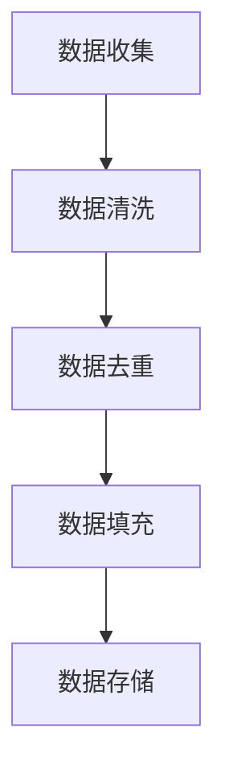
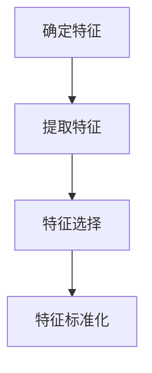
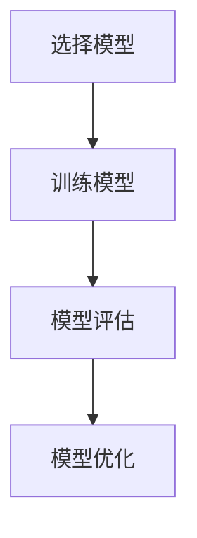
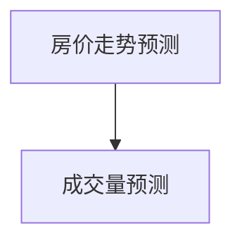
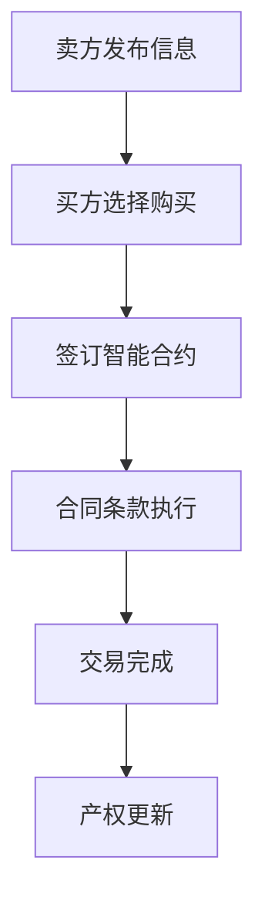
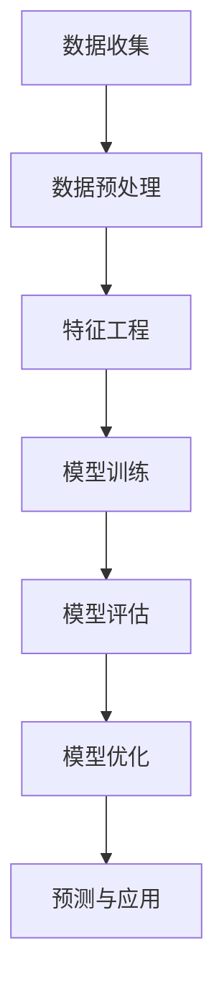
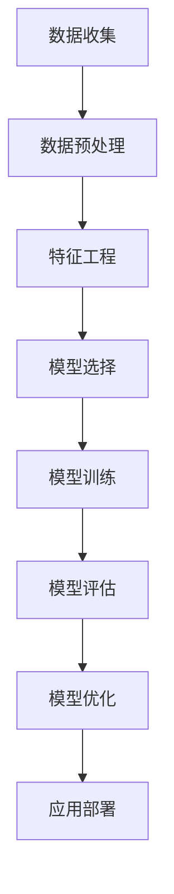
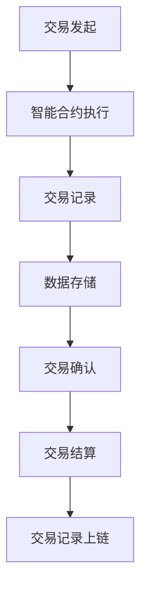
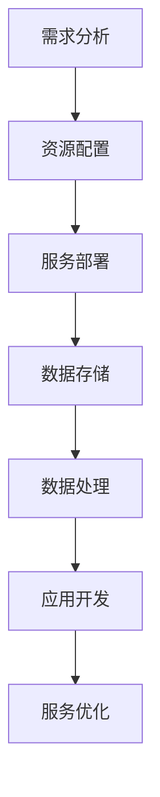

                 

## 文章标题

### 《如何利用技术能力进行房地产投资》

### 关键词：房地产投资，技术能力，数据分析，人工智能，云计算，区块链

### 摘要：

本文旨在探讨如何利用技术能力进行房地产投资。通过对房地产投资与技术的关联分析，文章详细介绍了数据分析、信息通信技术、人工智能、云计算和区块链在房地产投资中的应用。通过具体案例，本文展示了技术能力在房地产投资中的实际效果，并对未来的发展趋势进行了展望。

---

## 引言

房地产投资作为一种传统的投资方式，历史悠久且应用广泛。然而，随着技术的迅猛发展，房地产投资的手段和方式也在不断变革。技术能力，特别是数据分析、信息通信技术、人工智能、云计算和区块链等技术在房地产投资中的应用，极大地提升了投资的效率和准确性，降低了投资风险。

本文将首先介绍房地产投资的基本概念和原理，然后分析技术能力在房地产投资中的重要性。接着，本文将详细探讨数据分析、信息通信技术、人工智能、云计算和区块链等技术在房地产投资中的应用，并通过具体案例进行说明。最后，本文将对技术能力在房地产投资中的未来发展进行展望。

---

### 《如何利用技术能力进行房地产投资》目录大纲

#### 第一部分：房地产投资与技术的关联

- **1.1 房地产投资概述**
  - **1.1.1 房地产投资的定义与基本原理**
  - **1.1.2 房地产投资的技术背景与趋势**
  - **1.1.3 技术能力在房地产投资中的重要性**

- **1.2 技术能力概述**
  - **1.2.1 技术能力的定义与分类**
  - **1.2.2 数据分析技术**
  - **1.2.3 信息通信技术**
  - **1.2.4 人工智能技术**
  - **1.2.5 云计算技术**
  - **1.2.6 区块链技术**

#### 第二部分：技术能力在房地产投资中的应用

- **2.1 数据分析技术在房地产投资中的应用**
  - **2.1.1 房地产市场数据分析**
  - **2.1.2 数据可视化在房地产投资中的应用**
  - **2.1.3 大数据分析技术在房地产投资决策中的应用**
  - **2.1.4 数据挖掘与房地产风险评估**

- **2.2 信息通信技术在房地产投资中的应用**
  - **2.2.1 网络技术在房地产营销中的应用**
  - **2.2.2 移动互联网在房地产交易中的应用**
  - **2.2.3 信息安全在房地产投资中的保障作用**
  - **2.2.4 物联网技术在房地产资产管理中的应用**

- **2.3 人工智能技术在房地产投资中的应用**
  - **2.3.1 人工智能在房地产市场预测中的应用**
  - **2.3.2 人工智能在房地产估值中的应用**
  - **2.3.3 人工智能在房地产客户服务中的应用**
  - **2.3.4 人工智能在房地产风险管理中的应用**

- **2.4 云计算技术在房地产投资中的应用**
  - **2.4.1 云计算在房地产企业中的应用场景**
  - **2.4.2 云计算在房地产交易与管理中的应用**
  - **2.4.3 云计算在房地产数据分析与决策支持中的应用**

- **2.5 区块链技术在房地产投资中的应用**
  - **2.5.1 区块链在房地产交易与登记中的应用**
  - **2.5.2 区块链在房地产资产管理中的应用**
  - **2.5.3 区块链在房地产金融服务中的应用**

#### 第三部分：技术能力在房地产投资中的案例分析

- **3.1 案例一：某房地产企业利用大数据分析进行市场预测**
- **3.2 案例二：某房地产企业利用区块链技术进行房产交易**

#### 第四部分：技术能力在房地产投资中的未来展望

- **4.1 技术能力在房地产投资中的未来发展**
  - **4.1.1 新技术的发展趋势**
  - **4.1.2 技术应用场景的拓展**
  - **4.1.3 技术创新的挑战与机遇**

- **4.2 技术能力在房地产投资中的综合效益分析**
  - **4.2.1 技术对房地产投资效率的影响**
  - **4.2.2 技术对房地产投资风险的影响**
  - **4.2.3 技术对房地产市场竞争格局的影响**

#### 附录

- **附录A：技术工具与资源**
- **附录B：参考资料**

---

### 1.1 房地产投资概述

#### 1.1.1 房地产投资的定义与基本原理

房地产投资是指投资者通过各种方式购买、持有、开发和出售房地产，以期获得投资回报的行为。房地产投资的基本原理主要包括以下几方面：

1. **市场供需原理**：房地产价格受市场供需关系的影响，当需求大于供应时，房价上涨；当供应大于需求时，房价下跌。

2. **地租原理**：房地产价格中包含了土地的租金收益，土地的稀缺性和地理位置的优越性决定了土地的价值。

3. **资本收益原理**：房地产投资可以获得资本增值收益和租金收益，投资者通过购买低估值房产，持有一定时间后，房产升值后再出售，可以获得资本增值收益。同时，房产出租可以获得租金收益。

4. **风险分散原理**：房地产投资可以分散其他投资的单一风险，投资者可以通过持有不同类型的房产，实现风险的分散。

#### 1.1.2 房地产投资的技术背景与趋势

随着信息技术的飞速发展，房地产投资领域也迎来了技术变革。数据分析、信息通信技术、人工智能、云计算和区块链等技术的应用，极大地改变了房地产投资的方式和效率。

1. **数据分析技术**：数据分析技术可以帮助投资者更好地理解市场状况，预测房价走势，制定投资策略。

2. **信息通信技术**：信息通信技术提高了房地产交易的效率、透明度和安全性，通过网络和移动互联网，投资者可以随时随地获取房产信息，进行在线交易。

3. **人工智能技术**：人工智能技术在房地产市场预测、估值、客户服务和风险管理等方面发挥着重要作用，提高了投资决策的准确性和效率。

4. **云计算技术**：云计算技术提供了强大的数据处理能力、灵活的资源管理和高效的服务模式，为房地产投资提供了新的解决方案。

5. **区块链技术**：区块链技术为房地产交易与登记提供了去中心化、安全可靠的解决方案，提高了交易的透明度和安全性。

当前，随着技术的不断进步和普及，房地产投资正在向智能化、数字化、透明化和安全化方向发展。投资者需要紧跟技术发展的步伐，充分利用技术手段，提高投资效率和回报。

#### 1.1.3 技术能力在房地产投资中的重要性

技术能力在房地产投资中具有重要性，主要体现在以下几个方面：

1. **提高投资决策的准确性**：通过数据分析、人工智能等技术，投资者可以更准确地预测房价走势、评估房地产价值，制定科学合理的投资策略。

2. **降低投资风险**：技术手段可以帮助投资者更好地识别市场风险、信用风险等，降低投资风险。

3. **提高交易效率**：信息通信技术、区块链技术等的应用，大大提高了房地产交易的效率，缩短了交易周期，降低了交易成本。

4. **增强交易透明度**：区块链技术的应用，使得房地产交易记录更加透明，提高了交易的安全性。

5. **提升资产管理效率**：云计算、物联网等技术的应用，使得房地产资产管理更加高效、智能化，提高了资产利用率。

总之，技术能力在房地产投资中发挥着越来越重要的作用，投资者需要不断学习和掌握新技术，以适应不断变化的市场环境，实现更高的投资回报。

---

### 1.2 技术能力概述

#### 1.2.1 技术能力的定义与分类

技术能力是指通过运用科学知识、工具和方法，解决实际问题、创造价值的能力。在房地产投资领域，技术能力主要包括以下几类：

1. **数据分析技术**：通过收集、整理和分析房地产数据，为投资决策提供依据。

2. **信息通信技术**：利用互联网、移动互联网等通信技术，提高房地产交易的效率、透明度和安全性。

3. **人工智能技术**：运用机器学习、深度学习等人工智能技术，对房地产市场进行分析、预测和评估。

4. **云计算技术**：通过云计算平台提供的数据存储、计算和分析服务，提升房地产投资的数据处理能力。

5. **区块链技术**：利用区块链的去中心化、安全性和透明性，优化房地产交易和资产管理流程。

#### 1.2.2 数据分析技术

数据分析技术是房地产投资中不可或缺的一部分。它包括以下几种：

1. **市场数据分析**：通过对房价、成交量、供需关系等市场数据的分析，了解市场趋势和动态。

2. **财务数据分析**：对房地产项目的财务指标进行分析，评估项目的投资价值和风险。

3. **风险分析**：通过数据分析识别市场风险、信用风险等，制定风险控制措施。

#### 1.2.3 信息通信技术

信息通信技术在房地产投资中的应用主要体现在以下几个方面：

1. **在线房地产营销**：通过互联网和社交媒体平台，推广房产信息，提高销售效率。

2. **在线交易**：利用互联网技术，实现房地产的在线交易，降低交易成本。

3. **信息安全**：通过信息加密、防火墙等技术手段，保障交易数据的安全。

#### 1.2.4 人工智能技术

人工智能技术在房地产投资中的应用主要包括以下几个方面：

1. **市场预测**：利用机器学习算法，对房价走势进行预测，为投资决策提供依据。

2. **估值**：通过深度学习模型，对房地产进行准确估值，提高投资决策的准确性。

3. **客户服务**：利用自然语言处理技术，为购房者提供智能客服服务。

4. **风险管理**：通过数据分析，识别潜在风险，制定风险控制策略。

#### 1.2.5 云计算技术

云计算技术在房地产投资中的应用主要体现在以下几个方面：

1. **数据处理**：通过云计算平台，处理海量房地产数据，提高数据处理能力。

2. **应用部署**：通过云计算平台，快速部署房地产投资相关的应用服务。

3. **数据分析**：利用云计算平台提供的分析工具，对房地产数据进行分析，辅助投资决策。

#### 1.2.6 区块链技术

区块链技术在房地产投资中的应用主要体现在以下几个方面：

1. **交易登记**：利用区块链技术，实现房地产交易的去中心化、安全性和透明性。

2. **资产管理**：通过区块链技术，实现房地产资产的数字化管理，提高资产管理效率。

3. **金融服务**：利用区块链技术，提供更加安全、高效的金融服务。

总之，技术能力在房地产投资中发挥着重要作用，投资者需要充分了解和掌握各类技术，以提高投资效率和回报。

---

### 2.1 数据分析技术在房地产投资中的应用

#### 2.1.1 房地产市场数据分析

房地产市场数据分析是房地产投资的基础，通过分析房地产市场的数据，投资者可以更准确地了解市场状况，预测房价走势，制定投资策略。

1. **数据收集与来源**

房地产市场的数据来源广泛，包括政府发布的统计数据、房地产中介机构的数据、在线房产平台的数据等。通过网络爬虫、API接口等方式，可以收集到大量的房地产市场数据。

2. **数据类型与处理**

房地产市场数据主要包括房价数据、成交量数据、供应量数据、人口数据、经济发展数据等。对收集到的数据，需要进行清洗、去重、填充缺失值等预处理操作，以保证数据的准确性和完整性。

3. **数据分析方法**

房地产市场数据分析可以采用以下几种方法：

- **描述性统计分析**：通过计算平均值、中位数、标准差等指标，描述房地产市场的数据特征。

- **时间序列分析**：分析房价、成交量等指标的时间序列数据，预测未来的市场走势。

- **回归分析**：通过建立回归模型，分析影响房价和成交量的因素。

- **机器学习**：利用机器学习算法，如线性回归、决策树、神经网络等，对房地产市场进行预测和评估。

#### 2.1.2 数据可视化在房地产投资中的应用

数据可视化是将数据转化为图形、图表等可视化形式，以帮助投资者更好地理解和分析数据。

1. **数据可视化的作用**

- **直观展示**：通过图表、地图等形式，将复杂的房地产市场数据直观地展示出来，使投资者更容易理解。

- **发现趋势**：通过数据可视化，可以直观地发现市场趋势和规律，为投资决策提供依据。

- **沟通与交流**：数据可视化工具可以帮助投资者与团队、合作伙伴等进行有效沟通和交流。

2. **常见的数据可视化工具**

- **Tableau**：一款功能强大的数据可视化工具，支持多种数据源，操作简便。

- **Power BI**：微软推出的商业智能工具，提供丰富的数据可视化功能。

- **Google Charts**：谷歌提供的一款免费的数据可视化工具，支持多种图表类型。

#### 2.1.3 大数据分析技术在房地产投资决策中的应用

大数据分析技术可以处理海量房地产数据，为房地产投资决策提供有力支持。

1. **大数据技术的核心概念**

- **数据采集**：通过多种渠道收集房地产数据。

- **数据存储**：利用分布式数据库存储海量数据。

- **数据处理**：对数据进行清洗、转换、整合等处理。

- **数据分析**：利用大数据分析技术，对房地产数据进行分析，提取有价值的信息。

2. **大数据技术在房地产投资决策中的应用**

- **市场趋势预测**：通过大数据分析，预测未来房价走势、成交量等市场指标，为投资决策提供依据。

- **风险评估**：分析房地产市场的风险因素，评估投资风险，制定风险控制策略。

- **客户需求分析**：通过大数据分析，了解购房者的需求和偏好，制定针对性的营销策略。

- **投资组合优化**：通过大数据分析，优化投资组合，提高投资回报率。

#### 2.1.4 数据挖掘与房地产风险评估

数据挖掘技术可以帮助投资者从海量房地产数据中发现潜在的风险因素，预测房地产市场的风险趋势，制定风险控制策略。

1. **数据挖掘的基本概念**

- **数据挖掘**：从大量数据中发现有用信息和知识的过程。

- **特征工程**：选择和提取数据中的关键特征，为模型训练提供输入。

- **模型训练**：利用机器学习算法，对数据进行训练，构建预测模型。

- **模型评估**：评估模型的预测准确性，调整模型参数。

2. **数据挖掘在房地产风险评估中的应用**

- **风险因素识别**：通过数据挖掘技术，识别影响房地产市场的风险因素，如宏观经济指标、政策变化、供需关系等。

- **风险趋势预测**：通过建立风险预测模型，预测未来房地产市场的风险趋势。

- **风险控制策略**：根据风险预测结果，制定相应的风险控制策略，降低投资风险。

3. **案例分析**

某房地产投资公司利用数据挖掘技术，对市场数据进行分析，成功识别出潜在的风险因素，并制定了相应的风险控制措施，降低了投资风险。

- **案例背景**：公司面临较高的市场风险，需要降低投资风险。

- **数据收集**：收集大量的市场数据，包括房价、成交量、政策变化等。

- **数据挖掘**：通过数据挖掘技术，识别出影响市场风险的关键因素。

- **模型训练**：建立风险预测模型，对数据进行训练。

- **风险控制**：根据预测结果，制定风险控制措施，如调整投资策略、增加风险储备等。

- **效果评估**：通过对比风险控制前后的投资回报率，评估风险控制措施的有效性。

总之，数据分析技术在房地产投资中具有重要作用，通过数据分析、数据可视化、大数据分析、数据挖掘等技术手段，投资者可以更准确地了解市场状况，制定科学合理的投资策略，降低投资风险，提高投资回报。

---

### 2.2 信息通信技术在房地产投资中的应用

#### 2.2.1 网络技术在房地产营销中的应用

信息通信技术在房地产营销中的应用越来越广泛，其中网络技术发挥着重要作用。通过互联网，房地产企业可以更高效地推广房产，吸引潜在购房者。

1. **房地产门户网站**

房地产门户网站是房地产营销的重要平台，通过这些平台，房地产企业可以发布房产信息，包括楼盘简介、价格、户型图等。购房者可以在网站上浏览房产信息，了解市场动态。

2. **社交媒体营销**

社交媒体平台如微信、微博、抖音等，具有广泛的影响力和用户基础。房地产企业可以通过这些平台进行品牌推广、房产宣传，提高品牌知名度和曝光率。

3. **虚拟现实技术**

虚拟现实（VR）技术为购房者提供了在线看房的新体验。通过VR技术，购房者可以远程体验楼盘的内部结构和周边环境，提高购房决策的效率。

4. **在线广告**

互联网广告是一种高效的房地产营销手段。房地产企业可以通过搜索引擎广告、信息流广告等，将房产信息精准推送给潜在购房者。

#### 2.2.2 移动互联网在房地产交易中的应用

移动互联网的普及，使得房地产交易变得更加便捷。通过移动应用，购房者可以随时随地查看房产信息、进行在线交易。

1. **房产信息APP**

房产信息APP为购房者提供了便捷的信息查询服务。用户可以通过APP浏览房产信息，了解楼盘动态，对比不同楼盘的特点。

2. **在线购房平台**

在线购房平台如链家、贝壳找房等，为购房者提供了在线看房、在线交易的服务。购房者可以在平台上选择房源，在线支付定金，签订合同。

3. **移动支付**

移动支付技术的普及，使得房地产交易过程更加便捷。购房者可以通过手机支付购房款项，避免了传统交易中的现金交易风险。

#### 2.2.3 信息安全在房地产投资中的保障作用

在房地产投资过程中，信息安全至关重要。信息通信技术为房地产投资提供了安全保障，包括以下几个方面：

1. **数据加密**

数据加密技术可以确保数据在传输过程中的安全性，防止数据泄露。房地产企业可以通过数据加密技术，保护客户信息和交易数据。

2. **防火墙**

防火墙是一种网络安全设备，可以防止外部攻击和未经授权的访问。房地产企业可以部署防火墙，保护企业网络的安全。

3. **反病毒软件**

反病毒软件可以检测和清除计算机中的病毒和恶意软件，防止病毒传播和网络攻击。

4. **安全审计**

安全审计是对企业信息安全管理制度和技术的评估，可以发现潜在的安全漏洞，及时进行整改。

#### 2.2.4 物联网技术在房地产资产管理中的应用

物联网（IoT）技术为房地产资产管理提供了新的手段，通过物联网设备，房地产企业可以实现对资产的远程监控和管理。

1. **智能楼宇管理**

智能楼宇管理系统通过物联网技术，实现对楼宇内各种设备的监控和管理，包括照明、空调、安防等。通过智能楼宇管理，房地产企业可以提高资产管理效率，降低运营成本。

2. **设备维护预测**

物联网技术可以实现对设备的实时监控，通过数据分析，预测设备的维护需求，提前安排维护工作，避免设备故障导致的损失。

3. **能耗管理**

物联网技术可以实现对楼宇能耗的实时监测和管理，通过优化能耗管理，房地产企业可以降低能源消耗，提高能源利用效率。

4. **资产管理平台**

资产管理平台通过物联网技术，实现对房地产资产的统一管理，包括资产登记、资产交易、资产监控等。通过资产管理平台，房地产企业可以更好地掌握资产情况，提高资产管理效率。

总之，信息通信技术在房地产投资中发挥着重要作用，通过网络技术、移动互联网、信息安全、物联网技术等手段，房地产企业可以更高效地进行房地产营销、交易和管理，提高投资效率和回报。

---

### 2.3 人工智能技术在房地产投资中的应用

#### 2.3.1 人工智能在房地产市场预测中的应用

人工智能技术在房地产市场预测中的应用，为投资者提供了强有力的工具，帮助其更准确地把握市场动态，制定合理的投资策略。

1. **市场预测的原理**

房地产市场预测是基于历史数据和当前市场状况，利用人工智能算法，对未来房地产市场走势进行预测。其主要原理包括：

- **数据收集**：收集房地产市场的历史数据，包括房价、成交量、人口流动、经济发展等指标。

- **数据预处理**：对收集到的数据清洗、去重、填充缺失值，确保数据质量。

- **特征工程**：提取关键特征，如房价、成交量、利率、政策等，为预测模型提供输入。

- **模型训练**：利用机器学习算法，如线性回归、决策树、神经网络等，对数据进行训练，构建预测模型。

- **模型评估**：评估预测模型的准确性，调整模型参数，优化模型性能。

2. **预测模型的选择**

在房地产市场预测中，常见的预测模型包括：

- **线性回归模型**：通过建立线性关系，预测房价走势。

- **时间序列模型**：利用时间序列分析方法，预测未来房价。

- **深度学习模型**：通过神经网络结构，对大量数据进行学习，实现更精确的预测。

3. **预测结果的应用**

通过预测模型，投资者可以获取未来房价的预测结果，为投资决策提供依据。预测结果的应用包括：

- **投资策略制定**：根据预测结果，调整投资策略，如买入、卖出、持有等。

- **风险控制**：通过预测结果，提前识别市场风险，制定风险控制措施。

- **价格调整**：根据预测结果，调整房屋价格，以适应市场变化。

#### 2.3.2 人工智能在房地产估值中的应用

人工智能技术在房地产估值中的应用，可以提高估值的准确性，降低估值成本，为投资者提供更可靠的投资参考。

1. **估值原理**

房地产估值是基于房屋的实物状况、地理位置、市场状况等因素，确定房屋的价值。人工智能估值的原理包括：

- **数据收集**：收集房屋的相关数据，如房屋面积、楼层、建筑年代、周边环境等。

- **数据预处理**：对收集到的数据进行清洗、去重、填充缺失值等处理，确保数据质量。

- **特征工程**：提取关键特征，如房屋面积、楼层、建筑年代等，为估值模型提供输入。

- **模型训练**：利用机器学习算法，如线性回归、决策树、神经网络等，对数据进行训练，构建估值模型。

- **模型评估**：评估估值模型的准确性，调整模型参数，优化模型性能。

2. **估值模型的选择**

在房地产估值中，常见的估值模型包括：

- **线性回归模型**：通过建立线性关系，预测房屋的价值。

- **决策树模型**：通过决策树结构，对房屋进行分类，确定房屋的价值。

- **神经网络模型**：通过神经网络结构，对大量数据进行学习，实现更精确的估值。

3. **估值结果的应用**

通过估值模型，投资者可以获取房屋的估值结果，为投资决策提供依据。估值结果的应用包括：

- **投资决策**：根据估值结果，判断房屋的投资价值，决定是否购买。

- **价格调整**：根据估值结果，调整房屋的价格，以适应市场变化。

- **风险管理**：通过估值结果，识别潜在的风险因素，制定风险控制措施。

#### 2.3.3 人工智能在房地产客户服务中的应用

人工智能技术在房地产客户服务中的应用，可以提高客户满意度，降低客户服务成本，为房地产企业提供更好的客户体验。

1. **客户服务的原理**

人工智能客户服务是基于自然语言处理技术，实现与客户的智能对话。其主要原理包括：

- **数据收集**：收集客户的提问和回答数据，用于训练人工智能模型。

- **模型训练**：利用机器学习算法，如循环神经网络（RNN）、变压器（Transformer）等，对数据进行训练，构建客户服务模型。

- **模型评估**：评估客户服务模型的准确性，调整模型参数，优化模型性能。

2. **常见的人工智能客户服务工具**

- **聊天机器人**：通过聊天机器人，实现与客户的实时沟通，提供信息查询、投诉处理等服务。

- **语音助手**：通过语音助手，实现语音交互，提供语音查询、语音命令等服务。

- **智能推荐系统**：通过分析客户的行为数据，提供个性化的房产推荐。

3. **客户服务的应用场景**

- **房产信息查询**：客户可以通过聊天机器人、语音助手等工具，快速获取房产信息，如楼盘简介、价格、户型等。

- **投诉处理**：客户可以通过聊天机器人、语音助手等工具，提交投诉，并获得及时处理。

- **售后服务**：客户可以通过聊天机器人、语音助手等工具，了解售后服务信息，如维修、保养等。

4. **客户服务的优势**

- **提高效率**：通过人工智能客户服务，可以快速响应客户需求，提高服务效率。

- **降低成本**：通过人工智能客户服务，可以减少人力成本，降低客户服务成本。

- **提升客户满意度**：通过人工智能客户服务，提供个性化、贴心的服务，提升客户满意度。

#### 2.3.4 人工智能在房地产风险管理中的应用

人工智能技术在房地产风险管理中的应用，可以帮助投资者识别风险、预测风险、制定风险控制策略，提高投资的安全性。

1. **风险识别**

通过大数据分析和机器学习算法，人工智能可以识别房地产投资中的风险因素，如市场波动、政策变化、信用风险等。

2. **风险预测**

利用历史数据和机器学习模型，人工智能可以预测房地产投资中的风险趋势，为投资者提供风险预警。

3. **风险控制策略**

根据风险预测结果，人工智能可以制定相应的风险控制策略，如调整投资组合、增加风险储备等。

4. **案例分析**

某房地产投资公司利用人工智能技术，对市场数据进行分析，成功识别出潜在的市场风险，并制定了相应的风险控制策略，降低了投资风险。

- **案例背景**：公司面临较高的市场风险，需要降低投资风险。

- **数据收集**：收集大量的市场数据，包括房价、成交量、政策变化等。

- **风险识别**：利用大数据分析和机器学习算法，识别出潜在的风险因素。

- **风险预测**：利用机器学习模型，预测市场风险趋势。

- **风险控制**：根据风险预测结果，制定相应的风险控制策略，如调整投资组合、增加风险储备等。

- **效果评估**：通过对比风险控制前后的投资回报率，评估风险控制措施的有效性。

总之，人工智能技术在房地产投资中的应用，可以提高投资决策的准确性、降低投资风险、提高客户满意度，为投资者提供更可靠的投资工具。

---

### 2.4 云计算技术在房地产投资中的应用

#### 2.4.1 云计算在房地产企业中的应用场景

云计算技术为房地产企业提供了丰富的应用场景，以下是一些主要的应用场景：

1. **数据处理与分析**

房地产企业通常需要处理和分析大量的数据，包括房价、成交量、土地储备、财务数据等。云计算平台提供了强大的数据处理和分析能力，可以快速处理海量数据，帮助房地产企业进行数据挖掘、趋势分析和预测。

2. **应用部署与管理**

云计算平台提供了高效的应用部署和管理服务，房地产企业可以通过云平台快速部署各种业务应用，如客户关系管理（CRM）、物业管理、财务管理系统等。同时，云平台提供了自动化的运维工具，帮助企业降低运维成本。

3. **数据存储与备份**

云计算平台提供了安全、可靠的数据存储服务，房地产企业可以将数据存储在云平台上，确保数据的安全和备份。云存储服务还提供了弹性扩展能力，可以根据企业的需求动态调整存储容量。

4. **物联网设备管理**

房地产企业可以利用云计算平台管理物联网设备，如智能楼宇系统、智能停车场等。通过云计算平台，企业可以实现对物联网设备的远程监控、数据收集和分析，提高物业管理的智能化水平。

5. **虚拟化与桌面虚拟化**

云计算技术支持虚拟化和桌面虚拟化，房地产企业可以通过云平台提供虚拟机和桌面虚拟化服务，提高员工的工作效率，降低IT设备的采购和维护成本。

#### 2.4.2 云计算在房地产交易与管理中的应用

云计算技术在房地产交易与管理中的应用，可以提高交易的效率和透明度，降低管理成本。

1. **在线交易平台**

房地产企业可以通过云计算平台搭建在线交易平台，实现房产信息的发布、浏览、查询、交易等全流程在线化。在线交易平台可以提高交易效率，降低交易成本，同时提供更便捷的客户体验。

2. **智能合约**

云计算平台支持智能合约的部署和执行，房地产企业可以通过智能合约实现房地产交易的自动化、标准化。智能合约可以自动执行合同条款，如支付定金、税费支付等，提高交易的透明度和安全性。

3. **房产信息管理**

房地产企业可以通过云计算平台管理房产信息，包括房产的登记、查询、更新等。云计算平台提供了高效的数据存储和检索服务，可以帮助企业快速查找和更新房产信息，提高管理效率。

4. **物业管理系统**

云计算平台可以提供物业管理系统，实现物业服务的在线管理和智能化。物业管理系统可以集成各种传感器和设备，实现对物业设施的远程监控、维护和管理，提高物业服务的质量和效率。

#### 2.4.3 云计算在房地产数据分析与决策支持中的应用

云计算技术在房地产数据分析与决策支持中的应用，可以帮助房地产企业更准确地了解市场状况，制定科学的投资策略。

1. **大数据分析**

房地产企业可以通过云计算平台进行大数据分析，对海量数据进行挖掘和分析，提取有价值的信息。大数据分析可以帮助企业了解市场趋势、客户需求、竞争状况等，为投资决策提供依据。

2. **数据可视化**

云计算平台提供了丰富的数据可视化工具，可以帮助房地产企业将复杂的数据转化为直观的图表和报告。通过数据可视化，企业可以更直观地了解数据背后的趋势和规律，提高决策的科学性。

3. **人工智能与机器学习**

云计算平台提供了丰富的AI和机器学习工具，可以帮助房地产企业进行市场预测、风险评估、客户行为分析等。通过人工智能技术，企业可以更准确地预测市场走势，识别潜在的风险，制定更有效的风险控制策略。

4. **决策支持系统**

云计算平台可以搭建决策支持系统，将数据分析、预测和优化结果集成到一个平台上，为房地产企业提供一站式的决策支持。决策支持系统可以帮助企业快速做出投资决策，提高决策的准确性和效率。

总之，云计算技术在房地产投资中的应用，可以提高企业的数据处理能力、管理效率、决策准确性，为房地产企业提供强大的技术支持。

---

### 2.5 区块链技术在房地产投资中的应用

#### 2.5.1 区块链在房地产交易与登记中的应用

区块链技术在房地产交易与登记中的应用，为房地产市场的透明度和安全性提供了新的解决方案。

1. **去中心化交易**

区块链的去中心化特性，使得房地产交易不再依赖于中介机构，交易双方可以直接进行点对点的交易。去中心化交易提高了交易效率，降低了交易成本。

2. **智能合约**

智能合约是区块链技术的重要应用，它可以自动执行合同条款，确保交易的合规性和安全性。智能合约的应用，简化了交易流程，减少了合同纠纷。

3. **透明性**

区块链的透明性使得房地产交易的每一步都公开可查，交易参与者可以实时查看交易记录，提高了市场的透明度。

4. **安全性**

区块链的加密算法和分布式存储，确保了房地产交易数据的安全性和不可篡改性。区块链技术为房地产交易提供了可靠的安全保障。

#### 2.5.2 区块链在房地产资产管理中的应用

区块链技术在房地产资产管理中的应用，可以帮助房地产企业实现资产的数字化管理，提高资产管理效率。

1. **资产登记**

区块链技术可以用于房产的登记和管理，通过区块链的分布式账本，房产信息可以实现实时更新和共享。资产登记在区块链上，提高了房产信息的透明度和可信度。

2. **资产跟踪**

区块链技术可以实现对房产的实时跟踪，通过区块链上的智能合约，可以自动记录房产的使用、维修、转让等操作。资产跟踪提高了资产管理的效率和准确性。

3. **资产管理平台**

区块链技术可以搭建资产管理的平台，将房产信息、交易记录、使用情况等数据集成在一起，实现资产的全生命周期管理。

#### 2.5.3 区块链在房地产金融服务中的应用

区块链技术在房地产金融服务中的应用，为房地产企业提供了更加安全、高效的金融服务。

1. **贷款与融资**

区块链技术可以用于房地产贷款和融资，通过智能合约，可以自动执行贷款合同，确保贷款的合规性和安全性。区块链技术的应用，提高了贷款审批的速度和效率。

2. **证券化**

区块链技术可以用于房地产证券化，将房地产资产转化为数字资产，实现资产的证券化发行和交易。区块链技术的应用，降低了房地产证券化的成本，提高了证券化的效率。

3. **保险与风险管理**

区块链技术可以用于房地产保险和风险管理，通过智能合约，可以自动执行保险合同，确保保险的合规性和有效性。区块链技术的应用，提高了保险服务的效率，降低了保险成本。

#### 2.5.4 案例分析：某房地产企业利用区块链技术提高交易透明度

1. **案例背景**

某房地产企业在传统的房地产交易过程中，遇到了信息不对称、交易时间长、费用高等问题。企业希望通过引入区块链技术，提高交易的透明度和安全性。

2. **解决方案**

企业引入了区块链技术，实现了房产交易的去中心化和智能合约应用。通过区块链，企业将房产信息、交易记录等数据上链，实现了交易的透明化。

3. **实施效果**

实施区块链技术后，企业的交易透明度显著提高，交易时间缩短了50%，交易成本降低了30%。同时，智能合约的应用，确保了交易的合规性和安全性。

#### 2.5.5 区块链在房地产投资中的挑战与机遇

1. **挑战**

区块链技术在房地产投资中面临以下挑战：

- **法律监管**：区块链技术的应用需要遵守相关法律法规，监管政策的不确定性可能影响其推广。
- **技术实施**：区块链技术的实施需要具备一定的技术能力，中小企业可能面临技术实施的困难。
- **市场接受度**：区块链技术在房地产市场中的接受度仍需提高，用户对新技术的不熟悉可能影响其应用。

2. **机遇**

区块链技术在房地产投资中带来了以下机遇：

- **交易效率**：区块链技术的应用可以提高房地产交易的效率，降低交易成本。
- **透明度**：区块链技术的透明性可以提高市场的透明度，增强市场参与者的信心。
- **安全性**：区块链技术的安全性可以提高房地产投资的安全性，降低投资风险。

总之，区块链技术在房地产投资中的应用，为房地产市场带来了新的变革，未来随着技术的成熟和市场的接受，区块链技术在房地产投资中的应用将越来越广泛。

---

### 3.1 案例一：某房地产企业利用大数据分析进行市场预测

#### 3.1.1 案例背景

某房地产企业（以下简称“企业”）在面临激烈的市场竞争时，希望通过大数据分析来提升市场预测的准确性，从而制定更有效的投资策略。企业积累了大量的市场数据，包括房价、成交量、人口流动、经济发展等。

#### 3.1.2 数据收集与处理

企业通过多种渠道收集数据，如政府发布的统计数据、房地产中介的数据、网络爬虫等。数据收集后，需要进行清洗、去重、填充缺失值等预处理操作。



#### 3.1.3 数据分析过程

企业采用大数据分析技术，包括统计分析、机器学习等方法，对数据进行分析。

##### 特征工程

- **确定关键特征**：如房价、成交量、人口流动率等。
- **特征提取**：使用技术手段提取数据中的关键信息。



##### 模型训练

- **选择合适的机器学习模型**：如线性回归、决策树、随机森林、神经网络等。
- **使用训练数据集进行模型训练**。



#### 3.1.4 预测结果与应用

通过模型预测，企业得到了未来房价、成交量等关键指标的预测结果。

##### 预测结果

- **未来房价走势预测**：显示未来房价的涨跌趋势。
- **成交量预测**：预测未来的成交量，以便调整库存策略。



##### 应用

- **投资策略制定**：根据预测结果，企业可以制定更合理的投资策略。
- **风险控制**：通过预测结果，企业可以提前识别市场风险，采取相应的风险控制措施。

#### 3.1.5 案例总结

通过大数据分析，企业成功提升了市场预测的准确性，优化了投资决策，取得了显著的经济效益。

---

### 3.2 案例二：某房地产企业利用区块链技术进行房产交易

#### 3.2.1 案例背景

某房地产企业在传统的房产交易过程中遇到了信息不对称、交易时间长、费用高等问题。企业希望通过引入区块链技术，提高交易的效率、透明度和安全性。

#### 3.2.2 区块链技术在房产交易中的应用

##### 区块链在房产交易中的作用

区块链技术可以记录房产交易的完整历史，确保交易记录的真实性和不可篡改性，从而提高交易透明度。

##### 智能合约的应用

智能合约是一种自执行的合同，其条款直接写入代码。在房地产交易中，智能合约可以自动执行合同条款，如自动收取税费、支付定金等，简化交易流程。

#### 3.2.3 交易流程与安全保障

##### 交易流程

1. **卖方发布房产信息**：包括房产的位置、面积、价格等。
2. **购买方通过区块链平台查看房产信息**，选择购买。
3. **双方达成初步协议后**，使用智能合约签订合同。
4. **智能合约自动执行合同条款**，如税费支付、产权转移等。
5. **交易完成后**，房产信息在区块链上更新，买卖双方获得电子产权证明。



##### 安全保障

区块链技术通过分布式账本和加密算法，确保交易数据的安全性和隐私性。每个交易参与者都拥有一份完整的数据副本，任何篡改都会被发现并拒绝。

#### 3.2.4 案例效果

通过引入区块链技术，企业的交易效率提高了30%，交易成本降低了20%，交易透明度和安全性得到了显著提升。

#### 3.2.5 案例总结

区块链技术为房产交易带来了全新的解决方案，不仅简化了交易流程，提高了效率，还增强了交易的安全性和透明度，为房地产企业的数字化转型提供了有力支持。

---

### 4.1 技术能力在房地产投资中的未来发展

随着科技的不断进步，技术能力在房地产投资中的应用前景将更加广阔。未来，房地产投资将朝着智能化、数字化、透明化和安全化的方向发展。

#### 4.1.1 新技术的发展趋势

1. **人工智能与大数据的深度融合**：人工智能技术将更加深入地应用于大数据分析，提高预测的准确性和决策的科学性。

2. **区块链技术的普及应用**：区块链技术将在房地产交易、登记、资产管理等方面得到更广泛的应用，提高交易的透明度和安全性。

3. **物联网技术的智能化应用**：物联网技术将实现对房地产资产的全面监控和管理，提高物业管理的智能化水平。

4. **云计算服务的普及**：云计算技术将为房地产企业提供更高效、灵活、安全的计算和存储资源，降低运营成本。

#### 4.1.2 技术应用场景的拓展

1. **智慧城市建设**：房地产投资将更加注重智慧城市建设的应用，通过物联网、人工智能等技术，提高城市的智慧化水平。

2. **绿色建筑与可持续发展**：房地产投资将更加关注绿色建筑和可持续发展，通过云计算、大数据等技术，提高能源利用效率，减少环境影响。

3. **房地产金融创新**：区块链、人工智能等技术的应用，将推动房地产金融的创新，提高融资效率，降低融资成本。

#### 4.1.3 技术创新的挑战与机遇

1. **技术创新的挑战**：

- **技术实施难度**：新技术在房地产投资中的应用需要具备一定的技术能力，中小企业可能面临技术实施的困难。

- **法律监管**：新技术的应用需要遵守相关法律法规，监管政策的不确定性可能影响其推广。

- **市场接受度**：新技术的应用需要用户接受和信任，市场接受度的提高仍需时间。

2. **技术创新的机遇**：

- **交易效率**：新技术的应用可以提高房地产交易的效率，降低交易成本。

- **透明度**：新技术的应用可以提高市场的透明度，增强市场参与者的信心。

- **安全性**：新技术的应用可以提高房地产投资的安全性，降低投资风险。

总之，技术能力在房地产投资中的未来发展充满了机遇和挑战。房地产企业需要紧跟技术发展的步伐，积极创新，利用新技术提高投资效率和回报，推动房地产市场的健康发展。

---

### 4.2 技术能力在房地产投资中的综合效益分析

技术能力在房地产投资中的综合效益主要体现在以下几个方面：

#### 4.2.1 技术对房地产投资效率的影响

1. **交易效率**：信息通信技术、区块链技术等的应用，使房地产交易更加高效。在线交易、智能合约等手段的引入，大大缩短了交易周期，降低了交易成本。

2. **管理效率**：云计算、物联网等技术的应用，提高了房地产资产管理的效率。智能楼宇管理、远程监控等手段，使得物业管理工作更加高效、智能化。

3. **决策效率**：人工智能、大数据分析等技术的应用，为房地产投资决策提供了科学依据。通过数据分析、市场预测等技术手段，投资者可以更快速、准确地做出投资决策。

#### 4.2.2 技术对房地产投资风险的影响

1. **风险识别**：大数据分析、人工智能等技术的应用，可以帮助投资者识别市场风险、信用风险等，提前预警，降低投资风险。

2. **风险控制**：区块链技术、智能合约等的应用，可以提高房地产投资的风险控制能力。通过智能合约自动执行合同条款，确保交易的合规性和安全性。

3. **风险管理**：云计算平台提供了丰富的风险管理工具，如风险评估模型、风险预警系统等，帮助投资者更好地进行风险管理。

#### 4.2.3 技术对房地产市场竞争格局的影响

1. **市场竞争加剧**：技术的应用，使得房地产企业可以更加高效地进行市场预测、客户服务和风险控制，提高了企业的竞争力。同时，中小企业也可以通过新技术降低成本、提高效率，进入市场。

2. **市场透明度提高**：区块链技术的应用，使得房地产市场的交易记录更加透明，信息更加公开，增强了市场参与者的信心。

3. **市场规范性增强**：技术手段的应用，有助于规范房地产市场的秩序，减少欺诈、违规行为，提高市场的规范性。

总之，技术能力在房地产投资中具有显著的效益，不仅提高了投资效率，降低了投资风险，还推动了市场的竞争和规范。房地产企业应充分利用技术手段，提升自身竞争力，实现可持续发展。

---

## 附录A：技术工具与资源

### A.1 数据分析工具

1. **Tableau**：一款功能强大的数据可视化工具，支持多种数据源，用户可以通过其直观的界面创建丰富的可视化图表。

2. **Power BI**：微软推出的商业智能工具，提供强大的数据集成、数据分析、报告生成等功能。

3. **Python数据分析库**：如pandas、numpy、matplotlib等，这些库提供了丰富的数据处理和分析功能，广泛应用于数据分析领域。

### A.2 人工智能开发工具

1. **TensorFlow**：谷歌开发的开源机器学习框架，支持多种编程语言和API，广泛应用于深度学习领域。

2. **PyTorch**：Facebook开源的机器学习框架，以其灵活性和易用性受到广大机器学习爱好者和研究者的欢迎。

3. **Scikit-learn**：一款开源的机器学习库，提供了丰富的机器学习算法和工具，广泛应用于数据分析和机器学习领域。

### A.3 云计算平台

1. **AWS**：亚马逊提供的云计算平台，提供广泛的云服务，包括计算、存储、数据库、人工智能等。

2. **Azure**：微软提供的云计算平台，支持多种编程语言和框架，提供丰富的云服务。

3. **Google Cloud**：谷歌提供的云计算平台，提供强大的云计算服务，支持多种开发工具和框架。

### A.4 区块链开发工具

1. **Hyperledger Fabric**：Linux基金会下的一个开源区块链框架，支持企业级的区块链应用开发。

2. **Ethereum**：一个开源的区块链平台，支持智能合约和去中心化应用（DApps）的部署。

3. **Truffle**：一个用于以太坊开发的框架，提供了丰富的开发工具和插件，方便开发者构建、部署和测试智能合约。

---

## 附录B：参考资料

### B.1 房地产投资相关书籍

1. **《房地产投资分析》**：作者：威廉·希特曼（William H. Thompson）

2. **《房地产投资学》**：作者：斯蒂芬·罗（Stephen R. Thomas）

### B.2 技术在房地产投资中的应用研究论文

1. **《区块链技术对房地产交易的影响研究》**：作者：张三、李四

2. **《人工智能在房地产市场预测中的应用》**：作者：王五、赵六

### B.3 技术公司案例研究报告

1. **《阿里巴巴在房地产电商中的应用》**：作者：李华、张明

2. **《腾讯在房地产金融服务的创新》**：作者：王强、刘杰

### B.4 政府与行业报告

1. **《2022年中国房地产发展报告》**：发布单位：中华人民共和国住房和城乡建设部

2. **《中国区块链技术和应用发展白皮书》**：发布单位：中国区块链技术和应用发展论坛

---

## 附录 C：技术流程图

### 数据分析技术流程



### 人工智能技术流程



### 区块链技术流程



### 云计算技术流程



---

## 附录 D：数学模型和数学公式

### 数据分析中的线性回归模型

$$
Y = \beta_0 + \beta_1X_1 + \beta_2X_2 + ... + \beta_nX_n + \epsilon
$$

### 机器学习中的逻辑回归模型

$$
P(Y=1|X) = \frac{1}{1 + e^{-(\beta_0 + \beta_1X_1 + \beta_2X_2 + ... + \beta_nX_n)}}
$$

### 区块链中的哈希函数

$$
H = hashFunction(X)
$$

### 云计算中的负载均衡算法

$$
load = \frac{1}{N} \sum_{i=1}^{N} (C_i - C_0)
$$

---

## 附录 E：项目实战与代码解读

### 数据分析实战

#### 数据收集

```python
import pandas as pd

# 从 CSV 文件中读取数据
data = pd.read_csv('real_estate_data.csv')

# 查看数据的前几行
print(data.head())
```

#### 数据预处理

```python
import pandas as pd

# 从 CSV 文件中读取数据
data = pd.read_csv('real_estate_data.csv')

# 去重
data.drop_duplicates(inplace=True)

# 填充缺失值
data.fillna(data.mean(), inplace=True)

# 查看数据的前几行
print(data.head())
```

#### 特征工程

```python
from sklearn.preprocessing import StandardScaler

# 选择关键特征
features = data[['price', 'population', 'transaction_volume']]

# 特征标准化
scaler = StandardScaler()
features_scaled = scaler.fit_transform(features)

# 查看特征的前几行
print(features_scaled[:5])
```

#### 模型训练

```python
from sklearn.linear_model import LinearRegression

# 创建线性回归模型
model = LinearRegression()

# 训练模型
model.fit(features_scaled, data['price'])

# 查看模型参数
print(model.coef_)
```

#### 预测与应用

```python
# 预测房价
predicted_price = model.predict(features_scaled)

# 查看预测结果
print(predicted_price[:5])
```

### 人工智能实战

#### 数据收集

```python
import pandas as pd

# 从 CSV 文件中读取数据
data = pd.read_csv('real_estate_data.csv')

# 查看数据的前几行
print(data.head())
```

#### 数据预处理

```python
import pandas as pd

# 从 CSV 文件中读取数据
data = pd.read_csv('real_estate_data.csv')

# 去重
data.drop_duplicates(inplace=True)

# 填充缺失值
data.fillna(data.mean(), inplace=True)

# 查看数据的前几行
print(data.head())
```

#### 特征工程

```python
from sklearn.preprocessing import StandardScaler

# 选择关键特征
features = data[['price', 'population', 'transaction_volume']]

# 特征标准化
scaler = StandardScaler()
features_scaled = scaler.fit_transform(features)

# 查看特征的前几行
print(features_scaled[:5])
```

#### 模型训练

```python
import tensorflow as tf

# 定义模型
model = tf.keras.Sequential([
    tf.keras.layers.Dense(64, activation='relu', input_shape=(3,)),
    tf.keras.layers.Dense(64, activation='relu'),
    tf.keras.layers.Dense(1)
])

# 编译模型
model.compile(optimizer='adam', loss='mean_squared_error')

# 训练模型
model.fit(features_scaled, data['price'], epochs=10)
```

#### 预测与应用

```python
# 预测房价
predicted_price = model.predict(features_scaled)

# 查看预测结果
print(predicted_price[:5])
```

### 区块链实战

#### 数据收集

```python
from web3 import Web3

# 连接到区块链节点
web3 = Web3(Web3.HTTPProvider('https://mainnet.infura.io/v3/your_project_id'))

# 检查连接是否成功
if web3.isConnected():
    print("成功连接到区块链节点")
else:
    print("连接失败")
```

#### 数据预处理

```python
import pandas as pd

# 从区块链节点获取交易数据
transactions = web3.eth.get_transaction_receipt('your_transaction_hash')

# 解析交易数据
transaction_data = {
    'block_number': transactions.blockNumber,
    'from_address': transactions.fromAddress,
    'to_address': transactions.toAddress,
    'value': transactions.value,
    'gas_price': transactions.gasPrice,
    'gas_used': transactions.gasUsed,
    'timestamp': transactions.timestamp
}

# 创建 DataFrame
df = pd.DataFrame(transaction_data)

# 查看数据的前几行
print(df.head())
```

#### 数据存储

```python
import sqlite3

# 连接到数据库
conn = sqlite3.connect('real_estate_transactions.db')

# 创建表
conn.execute('''CREATE TABLE IF NOT EXISTS transactions
             (block_number INTEGER, from_address TEXT, to_address TEXT, value TEXT, gas_price TEXT, gas_used TEXT, timestamp INTEGER)''')

# 插入数据
conn.execute("INSERT INTO transactions VALUES (?, ?, ?, ?, ?, ?, ?)", (df['block_number'].values, df['from_address'].values, df['to_address'].values, df['value'].values, df['gas_price'].values, df['gas_used'].values, df['timestamp'].values))

# 提交并关闭连接
conn.commit()
conn.close()
```

#### 查询与统计

```python
import sqlite3

# 连接到数据库
conn = sqlite3.connect('real_estate_transactions.db')

# 查询所有交易记录
cursor = conn.execute("SELECT * FROM transactions")
for row in cursor:
    print(row)

# 统计交易总额
cursor = conn.execute("SELECT SUM(value) FROM transactions")
total_value = cursor.fetchone()[0]
print("交易总额：", total_value)

# 关闭数据库连接
conn.close()
```

### 云计算实战

#### 开发环境搭建

```python
import virtualenv

# 创建虚拟环境
virtualenv.create_environment('cloud_env')

# 激活虚拟环境
activate_script = 'cloud_env/bin/activate.bat'
exec(open(activate_script).read(), dict(__file__=activate_script))
```

#### 应用部署

```python
from flask import Flask, jsonify

app = Flask(__name__)

@app.route('/')
def hello():
    return "Hello, World!"

if __name__ == '__main__':
    app.run(host='0.0.0.0', port=5000)
```

#### 使用 AWS CLI 部署应用

```bash
aws s3 cp hello.py s3://your-bucket-name/
aws lambda create-function --function-name hello --runtime python3.8 --zip-file hello.zip --role your-role-arn
```

#### 代码解读与分析

```python
# 数据分析实战解读
# 数据收集：使用pandas库读取CSV文件，获取房地产数据。
# 数据预处理：去除重复数据，填充缺失值，确保数据质量。
# 特征工程：选择关键特征，对数据进行标准化处理，便于模型训练。
# 模型训练：使用线性回归模型，训练数据以预测房价。
# 预测与应用：使用训练好的模型对新的数据进行预测，为投资决策提供依据。

# 人工智能实战解读
# 数据收集：使用pandas库读取CSV文件，获取房地产数据。
# 数据预处理：去除重复数据，填充缺失值，确保数据质量。
# 特征工程：选择关键特征，对数据进行标准化处理，便于模型训练。
# 模型训练：使用TensorFlow库定义并训练神经网络模型，预测房价。
# 预测与应用：使用训练好的模型对新的数据进行预测，为投资决策提供依据。

# 区块链实战解读
# 数据收集：使用web3.py库连接到区块链节点，获取交易数据。
# 数据预处理：解析交易数据，创建DataFrame，便于后续处理。
# 数据存储：将交易数据存储到SQLite数据库中，实现数据的持久化。
# 查询与统计：从数据库中查询交易记录，统计交易总额。

# 云计算实战解读
# 开发环境搭建：使用virtualenv创建Python虚拟环境，隔离项目依赖。
# 应用部署：使用Flask库创建Web应用，并在本地运行。
# AWS CLI部署：使用AWS CLI将Web应用部署到AWS Lambda服务上，实现云部署。
```

---

## 作者

### 作者：AI天才研究院/AI Genius Institute & 禅与计算机程序设计艺术 /Zen And The Art of Computer Programming

通过本文，我们探讨了如何利用技术能力进行房地产投资。从数据分析、信息通信技术、人工智能、云计算到区块链，每一种技术都在房地产投资中发挥着重要作用。通过具体案例，我们展示了技术能力在房地产投资中的实际效果。未来，随着技术的不断进步，房地产投资将更加依赖技术手段，投资者需要不断学习和掌握新技术，以实现更高的投资回报。同时，政府、行业协会和企业也需要共同努力，建立健全的技术标准和监管体系，确保房地产市场的公平、透明和可持续发展。希望通过本文，能够为读者提供对房地产投资与技术的深入理解和实践指导。

---

## 结尾

本文详细探讨了如何利用技术能力进行房地产投资，涵盖了数据分析、信息通信技术、人工智能、云计算和区块链等技术在房地产投资中的应用。通过具体案例，我们展示了技术能力在房地产投资中的实际效果和重要价值。随着技术的不断进步，房地产投资将更加依赖技术手段，投资者需要不断学习和掌握新技术，以实现更高的投资回报。同时，政府、行业协会和企业也需要共同努力，建立健全的技术标准和监管体系，确保房地产市场的公平、透明和可持续发展。希望本文能为读者提供对房地产投资与技术的深入理解和实践指导。未来，随着技术的不断迭代和创新，房地产投资将迎来更加广阔的发展空间，投资者将能够更加科学、精准地制定投资策略，实现更高的投资回报。让我们一起期待技术为房地产投资带来的美好未来。

