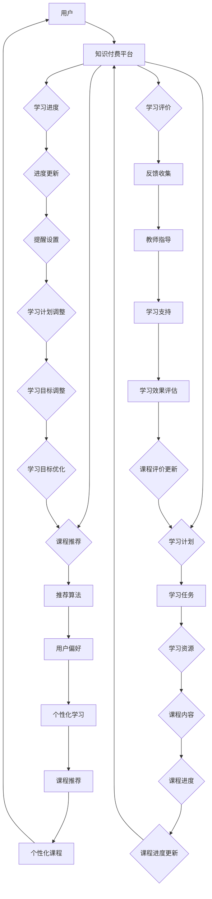

                 

### 文章标题

《如何利用知识付费实现在线学习与在线学习指导？》

### 文章关键词

知识付费，在线学习，在线学习指导，算法，流程图，数学模型，项目实战，开发环境，源代码，代码解读

### 摘要

本文旨在探讨如何利用知识付费机制实现在线学习的有效开展及其在在线学习指导中的应用。首先，我们对知识付费的背景、定义、市场趋势进行了概述，并分析了在线学习的概念、形式以及与知识付费的结合。随后，本文深入讨论了在线学习的理论基础，包括心理学原理和行为学理论，并介绍了常见的在线学习模型与算法。在此基础上，本文详细阐述了在线学习平台的设计与实现，包括平台架构设计、数据库设计与数据结构、用户界面设计与用户体验等方面。此外，本文重点介绍了在线学习指导的理论与实践，包括指导的概念与分类、指导的方法与技巧，并通过案例分析展示了在线学习指导的实际效果。最后，本文对知识付费与在线学习的发展趋势进行了展望，并提出了我国知识付费与在线教育的政策与挑战。

#### 第一部分：知识付费与在线学习概述

##### 第1章：知识付费的兴起与影响

###### 1.1 知识付费的背景和定义

知识付费是指用户为获取特定领域的专业知识或技能，通过付费方式获取相关服务或内容的一种商业模式。知识付费的兴起可以追溯到互联网的普及和在线教育的兴起，用户需求从传统的免费知识获取转向更加专业、有针对性的付费内容。

知识付费的定义主要包括以下几个方面：

1. **内容质量**：知识付费的内容通常具有较高的专业性和实用价值，能够满足用户的学习和成长需求。
2. **用户体验**：知识付费平台注重用户体验，通过个性化推荐、互动交流等功能提升用户的学习体验。
3. **平台运营**：知识付费平台通过精细化运营和多样化盈利模式实现可持续发展。

知识付费的核心要素包括：

1. **优质内容**：内容的质量和实用性是知识付费的核心。
2. **用户数据**：用户数据是知识付费平台的重要资产，用于个性化推荐和用户行为分析。
3. **用户体验**：良好的用户体验能够提高用户粘性和满意度。

知识付费的市场规模与趋势：

近年来，知识付费市场呈现快速增长态势，市场规模逐年扩大。据相关报告显示，全球知识付费市场规模已超过千亿人民币。未来，随着用户对专业知识和技能需求的不断增加，知识付费市场仍有较大的发展空间。

###### 1.2 在线学习的概念与形式

在线学习是指通过互联网技术，实现学习者与学习资源、学习伙伴之间的互动与交流，完成学习目标的一种学习方式。在线学习具有以下特点：

1. **灵活性**：在线学习不受时间和地点的限制，学习者可以随时随地进行学习。
2. **个性化**：在线学习平台能够根据用户需求提供个性化的学习内容和推荐。
3. **互动性**：在线学习平台提供多样化的互动功能，促进学习者之间的交流和协作。

在线学习的类型与特点：

1. **资源型学习**：以学习资源为主，如视频、文档、PPT等。
2. **社交型学习**：以学习者之间的互动为主，如论坛、讨论组、在线聊天等。
3. **互动型学习**：通过线上考试、作业、互动课程等实现学习目标。

在线学习的发展现状与未来趋势：

目前，在线学习已成为教育行业的重要趋势，全球范围内有大量的在线学习平台和课程资源。未来，随着人工智能、大数据等技术的不断进步，在线学习将进一步实现个性化、智能化和多元化发展。

##### 第2章：知识付费与在线学习的结合

###### 2.1 知识付费在线学习平台介绍

知识付费与在线学习的结合，催生了大量在线学习平台。这些平台通过提供付费课程、学习资料和互动功能，满足用户的学习需求。以下是国内外的几个主要知识付费在线学习平台：

1. **国内平台**：

   - **知乎Live**：知乎旗下的知识分享平台，提供各类专业知识讲座和在线课程。
   - **网易云课堂**：网易云旗下的在线学习平台，涵盖编程、设计、职场等多个领域。
   - **腾讯课堂**：腾讯推出的在线教育平台，提供丰富的课程资源。

2. **国外平台**：

   - **Udemy**：全球最大的在线学习平台，提供超过50万门课程。
   - **Coursera**：全球领先的在线学习平台，与多家知名大学合作提供在线课程。
   - **edX**：由哈佛大学和麻省理工学院联合创办的在线学习平台。

知识付费在线学习平台的主要功能与服务包括：

1. **课程内容展示**：平台提供丰富的课程资源，包括视频、文档、PPT等。
2. **学习进度跟踪**：平台能够记录用户的学习进度，并提供学习报告。
3. **社交互动**：平台提供讨论区、问答功能等，促进学习者之间的互动。
4. **学习支持与服务**：平台提供在线客服、技术支持等服务，解决用户在学习过程中遇到的问题。

知识付费在线学习的优势与挑战：

1. **优势**：

   - **个性化学习**：平台根据用户需求推荐课程，提高学习效果。
   - **灵活便捷**：用户可以随时随地进行学习，不受时间和地点限制。
   - **资源丰富**：平台提供丰富的课程资源，满足各类学习需求。

2. **挑战**：

   - **内容质量**：部分课程质量参差不齐，需要用户进行筛选。
   - **用户隐私**：用户数据安全和隐私保护是平台面临的重要问题。
   - **用户留存**：如何提高用户粘性，降低用户流失率，是平台运营的关键挑战。

###### 2.2 知识付费在线学习的优势与挑战

知识付费在线学习具有多方面的优势，同时也面临一定的挑战。

**优势**：

1. **个性化学习体验**：

   知识付费在线学习平台通过用户数据分析，为用户提供个性化的学习内容和推荐。用户可以根据自身需求和兴趣选择适合自己的课程，提高学习效果。

2. **高效学习效果**：

   知识付费在线学习平台提供丰富的学习资源，包括视频、文档、PPT等，用户可以根据自己的学习习惯和偏好进行学习。此外，平台提供的学习进度跟踪和评估功能，可以帮助用户及时了解自己的学习进展，调整学习策略。

3. **互动式学习**：

   知识付费在线学习平台通常提供讨论区、问答功能等，促进学习者之间的互动。用户可以在平台上与其他学习者交流学习心得，分享经验，共同进步。

**挑战**：

1. **内容质量与监管**：

   知识付费在线学习平台上的课程质量参差不齐，部分课程可能缺乏专业性和实用性。平台需要建立严格的课程审核机制，确保课程质量。

2. **用户隐私与数据安全**：

   用户在知识付费在线学习平台上会产生大量的个人信息和数据，如学习记录、支付信息等。平台需要采取有效的数据安全措施，确保用户隐私得到保护。

3. **平台运营与可持续发展**：

   知识付费在线学习平台的运营成本较高，包括课程开发、服务器维护、客服支持等。平台需要通过多样化的盈利模式实现可持续发展，同时确保用户体验。

为应对上述挑战，知识付费在线学习平台可以采取以下策略：

1. **加强课程审核**：

   平台应建立严格的课程审核机制，确保课程质量。可以邀请行业专家对课程进行审核，对课程内容进行筛选和评估。

2. **加强用户数据保护**：

   平台应采取有效的数据安全措施，如数据加密、权限控制等，确保用户隐私得到保护。同时，平台应遵守相关法律法规，规范用户数据的使用。

3. **提高用户粘性**：

   平台可以通过提供优质的学习资源、互动功能、个性化推荐等，提高用户粘性。此外，平台可以开展多样化的市场活动，吸引更多用户。

##### 第3章：在线学习的理论基础

在线学习作为一种新型的学习方式，其理论基础涵盖了心理学、行为学、教育技术学等多个领域。以下将介绍在线学习的理论基础，包括心理学原理、行为学理论和相关学习模型。

###### 3.1 在线学习理论概述

在线学习理论的发展历程可以追溯到20世纪80年代，随着计算机技术和互联网的普及，人们开始探索如何利用网络技术进行学习。以下是一些重要的在线学习理论：

1. **建构主义学习理论**：

   建构主义学习理论认为，学习是一个主动建构知识的过程，学习者通过与环境相互作用，主动构建对世界的理解。建构主义强调学习者的主体性和主动性，强调学习过程中的互动和协作。

2. **行为主义学习理论**：

   行为主义学习理论认为，学习是通过刺激和反应之间的联结建立的。行为主义强调学习的结果和可观察的行为，通过强化和惩罚来塑造学习者的行为。

3. **认知主义学习理论**：

   认知主义学习理论认为，学习是一个内部心理过程，学习者通过感知、理解、记忆和运用知识来构建知识体系。认知主义强调学习者的认知结构和思维过程。

4. **社交建构主义学习理论**：

   社交建构主义学习理论认为，学习是一个社会性过程，学习者通过与他人的互动和合作来建构知识。社交建构主义强调学习者在学习过程中的社交互动和协作。

以上理论为在线学习提供了不同的视角和方法，有助于理解和优化在线学习过程。

###### 3.2 在线学习的心理学原理

在线学习的心理学原理主要包括学习动机、学习策略和学习效果评估等方面。

1. **学习动机**：

   学习动机是推动学习者进行学习的内在动力。在线学习环境中，学习动机可能受到以下因素的影响：

   - **学习目标**：明确的学习目标能够激发学习者的学习动机，提高学习效果。
   - **自我效能感**：学习者对自己完成学习任务的信心和期望，对学习动机有重要影响。
   - **社会支持**：家庭、朋友和教师等社会支持系统对学习动机有积极影响。

2. **学习策略**：

   学习策略是学习者为了提高学习效果而采用的方法和技巧。在线学习中，学习者可能采用以下学习策略：

   - **信息加工策略**：包括筛选、组织、整合和应用信息的方法，如做笔记、思维导图等。
   - **元认知策略**：包括自我监控、自我评估和自我调节的方法，如时间管理、学习计划等。
   - **社会互动策略**：包括与他人交流和协作的方法，如讨论、合作学习等。

3. **学习效果评估**：

   学习效果评估是衡量学习者在线学习成效的重要手段。在线学习中，学习效果评估可能采用以下方法：

   - **形成性评价**：在学习过程中进行的评价，旨在及时反馈学习者的学习情况，帮助学习者调整学习策略。
   - **总结性评价**：在学习结束后进行的评价，旨在总结学习成果，对学习效果进行整体评估。
   - **自我评估**：学习者对自己学习过程的自我评价，有助于提高学习者的自我认知和反思能力。

###### 3.3 在线学习的行为学理论

在线学习的行为学理论主要关注学习者的行为表现和学习过程，包括行为主义学习理论和认知行为主义理论。

1. **行为主义学习理论**：

   行为主义学习理论认为，学习是通过刺激和反应之间的联结建立的。在线学习环境中，行为主义理论的应用主要体现在以下几个方面：

   - **强化**：通过奖励和惩罚来塑造学习者的行为，如完成课程后给予奖励或未完成课程给予惩罚。
   - **条件反射**：通过重复刺激和反应之间的联系，形成条件反射，如通过重复练习来提高学习效果。
   - **行为塑造**：通过逐步建立和强化行为，帮助学习者形成良好的学习习惯。

2. **认知行为主义理论**：

   认知行为主义理论认为，学习不仅仅是行为的变化，还涉及到认知过程的变化。在线学习环境中，认知行为主义理论的应用主要体现在以下几个方面：

   - **认知重建**：通过改变学习者的认知结构和思维方式，提高学习效果。
   - **问题解决**：通过培养学习者的解决问题的能力，提高学习者的学习效果。
   - **认知策略**：通过教授学习者有效的认知策略，提高学习效率。

在线学习的理论基础为在线学习的有效开展提供了理论支持。通过理解在线学习的心理学原理和行为学理论，教育者和学习者可以更好地设计和参与在线学习过程，提高学习效果。

##### 第4章：在线学习平台的设计与实现

在线学习平台的设计与实现是确保在线学习有效开展的关键。本节将详细介绍在线学习平台的设计原则、架构设计、数据库设计与数据结构、用户界面设计与用户体验等方面。

###### 4.1 在线学习平台的设计原则

在线学习平台的设计应遵循以下原则：

1. **用户中心设计**：以用户需求为核心，关注用户的学习体验，确保平台功能和服务能够满足用户需求。

2. **灵活性**：平台应具备灵活的扩展性，能够适应不同类型的学习内容和用户需求。

3. **易用性**：平台界面设计应简洁直观，操作便捷，降低用户的学习成本。

4. **安全性**：确保用户数据和隐私安全，采取有效的安全措施防止数据泄露和攻击。

5. **可扩展性**：平台架构应具备良好的扩展性，能够支持大量用户同时在线学习。

6. **高可用性**：平台应具备高可用性，确保系统稳定运行，减少故障和中断对用户学习的影响。

7. **可维护性**：平台设计应考虑未来维护和升级的便利性，降低维护成本。

###### 4.2 在线学习平台的架构设计

在线学习平台的架构设计是确保平台性能、可扩展性和高可用性的关键。以下是一个典型的在线学习平台架构设计：

1. **前端架构**：

   前端架构主要包括前端界面、前端框架和前端组件。前端界面负责与用户交互，前端框架如React、Vue.js等提供组件化和模块化开发支持，前端组件负责实现具体的界面功能。

2. **后端架构**：

   后端架构主要包括后端服务器、数据库服务器和中间件。后端服务器负责处理业务逻辑，数据库服务器负责存储用户数据和学习数据，中间件如消息队列、缓存等提供系统性能优化支持。

3. **数据存储**：

   数据存储主要包括关系型数据库和NoSQL数据库。关系型数据库如MySQL、PostgreSQL等用于存储用户数据和学习记录，NoSQL数据库如MongoDB等用于存储课程内容和多媒体数据。

4. **中间件**：

   中间件主要包括消息队列、缓存、负载均衡等。消息队列如RabbitMQ、Kafka等用于处理异步消息，缓存如Redis等用于提高系统响应速度，负载均衡如Nginx等用于分发请求，提高系统性能。

5. **服务架构**：

   服务架构主要包括课程服务、用户服务、学习记录服务和通知服务。课程服务负责处理课程相关业务，用户服务负责处理用户登录、注册、权限管理等业务，学习记录服务负责处理学习记录、进度跟踪等业务，通知服务负责处理通知推送、邮件发送等业务。

6. **部署架构**：

   部署架构主要包括本地部署、云部署和容器化部署。本地部署适用于小型团队或实验环境，云部署适用于大规模生产环境，容器化部署如Docker、Kubernetes等提供灵活的部署和扩展方式。

###### 4.3 数据库设计与数据结构

在线学习平台的数据库设计是确保数据存储和管理高效性的关键。以下是一个典型的在线学习平台数据库设计：

1. **用户数据表**：

   用户数据表用于存储用户的基本信息，包括用户ID、用户名、密码、邮箱、电话、角色等字段。

2. **课程数据表**：

   课程数据表用于存储课程的基本信息，包括课程ID、课程名称、课程简介、课程类型、课程时长、课程价格、课程封面等字段。

3. **学习记录数据表**：

   学习记录数据表用于存储用户的学习记录，包括学习记录ID、用户ID、课程ID、学习进度、学习时间、学习状态等字段。

4. **课程内容数据表**：

   课程内容数据表用于存储课程的内容，包括内容ID、课程ID、内容标题、内容描述、内容类型（文本、图片、视频等）、内容URL等字段。

5. **评论数据表**：

   评论数据表用于存储用户对课程的评论，包括评论ID、用户ID、课程ID、评论内容、评论时间等字段。

6. **订单数据表**：

   订单数据表用于存储用户的订单信息，包括订单ID、用户ID、课程ID、订单金额、订单状态等字段。

7. **支付数据表**：

   支付数据表用于存储支付信息，包括支付ID、订单ID、支付金额、支付状态等字段。

8. **通知数据表**：

   通知数据表用于存储通知信息，包括通知ID、用户ID、通知内容、通知时间、通知状态等字段。

数据库设计需要考虑数据完整性、一致性、安全性和可扩展性。关系型数据库如MySQL、PostgreSQL等提供强大的数据管理和查询功能，适用于存储和管理用户数据和学习记录。NoSQL数据库如MongoDB等提供灵活的数据存储和查询方式，适用于存储和管理课程内容和多媒体数据。

###### 4.4 用户界面设计与用户体验

用户界面设计是确保用户在使用在线学习平台时获得良好体验的关键。以下是一些用户界面设计的原则和技巧：

1. **简洁性**：

   界面设计应简洁明了，避免冗余信息和复杂布局，降低用户的学习成本。

2. **一致性**：

   界面设计应保持一致性，包括颜色、字体、按钮样式等，提高用户的认知和操作效率。

3. **易用性**：

   界面设计应关注用户的使用习惯，提供直观的导航和操作界面，降低用户的学习成本。

4. **响应式设计**：

   界面设计应支持多种设备和屏幕尺寸，实现响应式布局，提高用户体验。

5. **交互设计**：

   界面设计应关注用户的交互体验，提供流畅的操作反馈和视觉提示，增强用户的互动感和参与感。

6. **个性化设计**：

   界面设计应根据用户需求和偏好进行个性化调整，提供个性化的学习内容和推荐。

7. **美观性**：

   界面设计应美观大方，符合用户审美，提高用户的满意度和归属感。

用户界面设计工具如Sketch、Figma、Adobe XD等提供丰富的设计功能和原型设计支持，可以帮助设计师实现高质量的用户界面设计。

在线学习平台的设计与实现是一个复杂的过程，需要综合考虑用户需求、技术实现、性能优化和安全保障等多个方面。通过遵循设计原则和设计技巧，可以构建一个功能齐全、用户体验良好的在线学习平台，为用户提供优质的学习体验。

##### 第5章：在线学习指导的理论与实践

在线学习指导是确保学习者能够顺利实现学习目标的重要环节。本节将介绍在线学习指导的概念、分类、主要目标以及指导的方法与技巧。

###### 5.1 在线学习指导的概念与分类

在线学习指导是指在在线学习环境中，通过教师或教育技术人员对学习者提供指导和支持的过程。在线学习指导旨在帮助学习者克服学习障碍，提高学习效果，实现学习目标。

在线学习指导可以按照以下分类进行划分：

1. **教师主导型指导**：

   教师主导型指导是指教师作为学习指导的主体，通过在线平台提供教学资源、组织学习活动、监控学习进度、提供反馈等方式，对学习者进行指导和督促。

2. **学生自主型指导**：

   学生自主型指导是指学习者自己作为学习指导的主体，通过在线平台提供的自我评估、学习计划、学习资源、反馈机制等方式，进行自我指导和自我管理。

3. **社交互动型指导**：

   社交互动型指导是指通过学习者之间的互动和协作，实现相互学习和指导。在线学习平台提供的讨论区、问答功能、学习小组等方式，促进学习者之间的交流和合作。

4. **混合型指导**：

   混合型指导是指将教师主导型指导、学生自主型指导和社交互动型指导相结合，根据学习者的特点和需求，灵活选择和运用不同的指导方式。

在线学习指导的主要目标包括：

1. **提高学习效果**：

   通过在线学习指导，帮助学习者更好地理解和掌握学习内容，提高学习效果。

2. **培养自主学习能力**：

   鼓励学习者自主制定学习计划、自我评估和反馈，培养学习者的自主学习能力。

3. **促进学习者发展**：

   关注学习者的情感需求、社交需求和发展需求，促进学习者的全面发展。

4. **提升学习体验**：

   通过个性化的学习支持和互动式学习环境，提升学习者的学习体验和满意度。

###### 5.2 在线学习指导的方法与技巧

在线学习指导的方法与技巧包括以下几个方面：

1. **教学策略与教学方法**：

   教学策略与教学方法是进行在线学习指导的基础。常见的教学策略包括：

   - **启发式教学**：通过提问、讨论、案例分析等方式，引导学习者主动思考，提高学习兴趣和参与度。
   - **讨论式教学**：组织学习者进行线上讨论，促进观点交流和思维碰撞，提高学习效果。
   - **实践式教学**：通过实际操作、项目实践等方式，使学习者能够将理论知识应用到实际中，提高实践能力。

   教学方法包括：

   - **讲授法**：通过在线直播、视频讲座等方式，传递知识和技能。
   - **讨论法**：通过线上讨论区、学习小组等方式，促进学习者之间的交流和合作。
   - **案例法**：通过实际案例的分析和讨论，帮助学习者理解抽象的理论知识。
   - **实验法**：通过线上实验、模拟操作等方式，提高学习者的实践能力。

2. **学习支持与服务**：

   学习支持与服务是确保学习者顺利完成学习任务的重要保障。常见的支持与服务包括：

   - **学习资源推荐**：根据学习者的需求和兴趣，推荐相关的学习资源，帮助学习者扩展知识面。
   - **学习进度跟踪**：记录学习者的学习进度，提供学习报告和反馈，帮助学习者了解自己的学习状况。
   - **学习问题解答**：提供在线问答服务，及时解答学习者在学习过程中遇到的问题，帮助学习者克服学习障碍。
   - **个性化辅导**：根据学习者的学习需求和问题，提供一对一的个性化辅导，帮助学习者提高学习效果。

3. **评估与反馈机制**：

   评估与反馈机制是确保在线学习指导有效性的重要手段。常见的评估与反馈方式包括：

   - **形成性评估**：在学习过程中进行的评估，旨在及时发现学习者的学习问题和不足，提供改进建议。
   - **总结性评估**：在学习结束后进行的评估，旨在总结学习成果，对学习效果进行整体评价。
   - **自我评估**：学习者对自己的学习过程和成果进行自我评估，提高学习者的自我认知和反思能力。
   - **教师评估**：教师对学习者的学习过程和成果进行评估，提供个性化的反馈和建议。

在线学习指导的方法与技巧需要根据学习者的特点和需求进行灵活运用，以达到最佳的学习效果。通过科学的设计和实践，在线学习指导能够为学习者提供有效支持和帮助，促进学习者的全面发展。

##### 第6章：在线学习案例分析

在线学习案例分析的目的是通过具体的实例，展示在线学习平台的实际应用效果，为读者提供有益的参考和借鉴。本节将介绍两个典型的在线学习案例：知名在线教育平台“Coursera”的案例分析，以及某企业内部在线学习平台建设案例。

###### 6.1 Coursera案例分析

**平台介绍**

Coursera是一家全球领先的在线教育平台，成立于2012年，由斯坦福大学计算机科学教授Andrew Ng等人创办。Coursera与全球100多所顶尖大学和机构合作，提供超过3000门在线课程，涵盖计算机科学、商业管理、健康医学、人文社科等多个领域。

**平台功能与特点**

- **课程内容丰富**：Coursera平台提供大量高质量的在线课程，涵盖多个学科领域，用户可以根据自己的需求和兴趣选择课程。
- **互动性强**：平台提供在线讨论区、问答功能、项目实践等互动功能，促进学习者之间的交流和合作。
- **认证服务**：用户完成课程后，可以选择申请由合作大学颁发的认证证书，提高自己的竞争力。
- **个性化学习**：平台根据用户的学习历史和偏好，推荐适合的课程和学习资源，提高学习效果。
- **灵活便捷**：用户可以随时随地进行学习，不受时间和地点限制。

**成功经验**

- **高质量课程内容**：与全球顶尖大学合作，确保课程内容的高质量和权威性。
- **互动学习模式**：通过线上讨论、问答和项目实践等方式，激发学习者的学习兴趣和参与度。
- **认证服务**：认证证书提高了学习者的竞争力，增加了课程的吸引力。
- **技术支持**：平台采用先进的互联网技术和大数据分析，提供个性化的学习推荐和用户支持。

**挑战**

- **课程质量参差不齐**：尽管与顶尖大学合作，但部分课程质量仍存在差异，需要用户进行筛选。
- **用户隐私保护**：平台需要确保用户数据安全和隐私保护，避免数据泄露和滥用。
- **用户留存率**：如何提高用户留存率，降低用户流失率，是平台面临的重要挑战。

###### 6.2 某企业内部在线学习平台建设案例

**企业背景与需求分析**

某企业是一家大型跨国公司，员工分布在不同的国家和地区。企业为了提升员工的技能和知识水平，决定建设一个内部在线学习平台。企业需求分析包括以下几个方面：

- **技能培训**：企业需要为员工提供各类技能培训课程，包括技术技能、管理技能、业务技能等。
- **知识分享**：企业鼓励员工分享自己的知识和经验，促进内部知识交流和创新。
- **学习管理**：企业需要能够对员工的学习进度、成绩和反馈进行有效管理，确保学习效果。
- **用户权限控制**：企业需要根据员工的角色和权限，提供不同的学习资源和功能。

**平台建设方案与实施**

企业在线学习平台建设方案包括以下几个方面：

- **需求调研**：通过问卷调查、访谈等方式，了解员工的学习需求和期望。
- **系统设计**：根据需求调研结果，设计平台的系统架构、功能模块和用户界面。
- **技术选型**：选择适合的平台开发技术，如前端框架（React、Vue.js等）、后端框架（Spring Boot、Django等）、数据库（MySQL、MongoDB等）等。
- **开发与测试**：根据设计方案，进行平台开发、功能测试和性能测试，确保平台稳定可靠。
- **上线与运营**：平台上线后，进行用户培训、宣传推广和运营维护，确保平台正常运行。

**平台运行效果与评价**

- **学习参与度**：平台上线后，员工积极参与学习，学习参与度显著提高。
- **学习效果**：通过学习平台，员工能够更好地掌握所需技能和知识，提升工作效率和绩效。
- **知识共享**：平台鼓励员工分享知识和经验，促进了内部知识交流和共享，提升了团队整体能力。
- **用户满意度**：用户对平台的功能和服务满意度较高，认为平台对他们的学习和工作有很大的帮助。

**挑战与改进**

- **课程质量**：部分课程质量参差不齐，需要进一步筛选和优化。
- **用户活跃度**：如何提高用户活跃度，降低用户流失率，是平台运营的重要挑战。
- **系统稳定性**：平台需要持续进行性能优化和稳定性提升，确保系统稳定可靠。

通过以上案例分析，可以看出在线学习平台在实际应用中取得了显著成效，但也面临一定的挑战。通过不断优化和改进，在线学习平台将更好地满足用户需求，提升学习效果和用户体验。

##### 第7章：未来趋势与展望

随着互联网技术的不断进步，知识付费和在线学习领域也在快速发展。本节将分析未来知识付费和在线学习的发展趋势，探讨技术进步对知识付费和在线学习的影响，以及教育市场的变化与机遇。

###### 7.1 知识付费与在线学习的发展趋势

1. **个性化学习**：

   个性化学习是未来知识付费和在线学习的重要趋势。通过大数据和人工智能技术，知识付费平台能够根据用户的学习历史、兴趣偏好和需求，推荐个性化的学习内容和资源，提高学习效果和用户满意度。

2. **智能化学习**：

   智能化学习是指利用人工智能技术，如自然语言处理、机器学习等，为学习者提供智能化的学习支持和服务。智能辅导系统、智能推荐系统等将成为未来知识付费和在线学习的重要组成部分。

3. **终身学习**：

   随着知识更新速度的加快，终身学习成为人们适应社会发展的重要方式。知识付费和在线学习将为人们提供持续的学习机会，帮助他们在职业发展和个人成长中不断进步。

4. **混合式学习**：

   混合式学习将线上学习和线下学习相结合，提供更加灵活和多样的学习方式。未来，知识付费和在线学习平台将更多采用混合式学习模式，满足不同学习者的需求。

5. **生态化发展**：

   知识付费和在线学习平台将逐渐形成完整的生态体系，包括课程内容提供商、技术服务提供商、学习社区等，实现资源共享和互利共赢。

###### 7.2 技术进步对知识付费和在线学习的影响

1. **人工智能**：

   人工智能技术将深度影响知识付费和在线学习领域。智能推荐系统、智能辅导系统、自然语言处理技术等将使学习更加个性化、智能化和高效化。

2. **大数据**：

   大数据技术能够收集、存储和分析大量的学习数据，为知识付费和在线学习提供有价值的信息。通过数据分析，平台可以更好地了解用户需求，优化课程内容和运营策略。

3. **区块链**：

   区块链技术为知识付费和在线学习提供了安全、透明的数据管理和交易方式。未来，知识付费平台可能采用区块链技术，实现知识产权保护、智能合约等功能。

4. **虚拟现实（VR）和增强现实（AR）**：

   VR和AR技术将为知识付费和在线学习带来全新的体验。通过虚拟现实和增强现实技术，学习者可以身临其境地参与学习，提高学习兴趣和效果。

5. **物联网（IoT）**：

   物联网技术将实现学习设备的智能化和网络化，为知识付费和在线学习提供更多的可能性。通过物联网设备，学习者可以随时随地访问学习资源，实现无缝学习体验。

###### 7.3 教育市场的变化与机遇

1. **在线教育普及**：

   随着互联网的普及，在线教育已经成为教育市场的重要组成部分。未来，在线教育将继续保持快速发展态势，为知识付费和在线学习带来更多机遇。

2. **职业教育需求增长**：

   随着职场竞争的加剧，职业教育需求持续增长。知识付费和在线学习平台可以提供各类职业技能培训，满足职场人士的学习需求。

3. **个性化学习服务**：

   个性化学习服务成为教育市场的热点。知识付费和在线学习平台可以通过提供个性化学习方案、学习资源和学习支持，满足不同学习者的需求。

4. **教育科技企业崛起**：

   教育科技企业凭借技术创新和市场敏锐度，将在知识付费和在线学习领域获得更多发展机遇。未来，教育科技企业将在教育市场中发挥更加重要的作用。

5. **国际教育合作**：

   国际教育合作将促进知识付费和在线学习的发展。通过与国际顶尖大学和机构的合作，知识付费和在线学习平台可以提供更多高质量的国际化教育资源。

总之，未来知识付费和在线学习将继续快速发展，技术创新和市场需求将为其带来更多机遇和挑战。通过不断创新和优化，知识付费和在线学习平台将更好地满足用户需求，推动教育行业的进步和发展。

##### 第8章：我国知识付费与在线教育的政策与挑战

随着知识付费和在线教育在我国逐渐普及，相关政策法规的制定与实施成为确保行业健康发展的关键。本节将分析我国知识付费与在线教育的政策环境、行业监管与规范化，以及面临的挑战和应对策略。

###### 8.1 政策环境对知识付费和在线教育的影响

我国政府对知识付费和在线教育的支持政策主要体现在以下几个方面：

1. **教育信息化政策**：

   教育信息化政策为知识付费和在线教育提供了政策支持。例如，《国家教育事业发展“十三五”规划》明确提出，要推进教育信息化，加强在线教育资源和平台建设，提高教育质量。

2. **知识付费相关政策**：

   我国政府出台了多项知识付费相关政策，旨在规范知识付费市场，保障消费者权益。例如，《互联网知识付费服务管理规定（征求意见稿）》明确了知识付费服务的基本规范和监管要求。

3. **支持创新创业**：

   政府鼓励创新创业，为知识付费和在线教育领域提供了政策支持。例如，通过创业补贴、税收优惠等政策，鼓励企业和个人投身知识付费和在线教育领域。

4. **网络安全法规**：

   网络安全法等相关法律法规的制定和实施，为知识付费和在线教育提供了安全保障。平台需确保用户数据安全，遵守相关法律法规，防范数据泄露和网络安全风险。

###### 8.2 行业监管与规范化的必要性

知识付费和在线教育行业的快速发展，也带来了一定的监管挑战。为了保障行业的健康发展，行业监管与规范化显得尤为必要：

1. **内容质量监管**：

   平台需要确保课程内容的质量，防止低俗、虚假信息等不良内容的传播。政府需加强对知识付费平台的监管，制定内容审核标准和机制。

2. **用户隐私保护**：

   平台需要加强对用户隐私的保护，遵守相关法律法规，防止用户数据泄露和滥用。平台应采取有效的数据安全措施，保护用户信息安全。

3. **市场监管**：

   政府需加强对知识付费和在线教育市场的监管，防止恶性竞争和不正当行为，保障市场秩序。通过制定行业标准和规范，引导平台提供优质服务。

4. **知识产权保护**：

   知识付费和在线教育领域涉及大量的知识产权，平台需加强对知识产权的保护，防止侵权行为。政府应加大对知识产权侵权的打击力度，维护良好的创新环境。

###### 8.3 知识付费与在线教育发展的挑战与应对策略

尽管知识付费和在线教育在我国取得了显著的发展，但仍然面临一系列挑战：

1. **内容质量参差不齐**：

   部分知识付费平台的课程质量参差不齐，部分课程内容缺乏专业性和实用性。平台需建立严格的课程审核机制，提高课程质量。

2. **用户隐私保护**：

   用户在知识付费和在线教育过程中产生大量的个人信息和数据，隐私保护成为重要挑战。平台需采取有效的数据安全措施，保护用户隐私。

3. **用户留存率**：

   知识付费和在线教育平台的用户留存率较低，如何提高用户粘性是关键挑战。平台需提供优质的学习体验和服务，增强用户满意度。

4. **市场竞争激烈**：

   知识付费和在线教育市场竞争激烈，平台需通过差异化竞争策略，提高市场占有率。平台应关注用户需求，提供个性化的学习解决方案。

5. **政策法规不完善**：

   知识付费和在线教育相关政策法规尚不完善，部分问题亟待解决。政府需加快相关法律法规的制定和实施，为知识付费和在线教育提供有力的政策支持。

为应对上述挑战，知识付费和在线教育平台可以采取以下策略：

1. **提高课程质量**：

   平台需加强课程内容审核，确保课程质量。可以通过邀请行业专家进行课程评审，提高课程的专业性和实用性。

2. **加强用户隐私保护**：

   平台应采取有效的数据安全措施，保护用户隐私。可以采用数据加密、权限控制等技术，确保用户数据安全。

3. **提升用户满意度**：

   平台需提供优质的学习体验和服务，增强用户满意度。可以通过个性化推荐、学习进度跟踪、学习支持等服务，提高用户的学习效果和满意度。

4. **差异化竞争**：

   平台应关注用户需求，提供个性化的学习解决方案。可以通过差异化竞争策略，提高市场占有率，增强品牌影响力。

5. **积极参与政策制定**：

   平台应积极参与知识付费和在线教育相关政策法规的制定，为行业发展提供有益的建议。可以通过行业协会等渠道，与政府部门进行沟通和合作。

总之，我国知识付费与在线教育行业在政策环境、监管和规范化方面取得了一定成果，但仍面临诸多挑战。通过不断优化和改进，行业将能够更好地适应发展趋势，实现健康、可持续的发展。

### 附录

#### 附录A：知识付费与在线学习相关资源

**术语解释**

1. **知识付费**：用户为获取特定领域的专业知识或技能，通过付费方式获取相关服务或内容的一种商业模式。
2. **在线学习**：通过互联网技术，实现学习者与学习资源、学习伙伴之间的互动与交流，完成学习目标的一种学习方式。
3. **个性化学习**：根据学习者的需求和兴趣，提供个性化的学习内容和推荐。
4. **智能化学习**：利用人工智能技术，为学习者提供智能化的学习支持和服务。
5. **混合式学习**：线上学习和线下学习相结合，提供更加灵活和多样的学习方式。
6. **终身学习**：持续的学习过程，以适应社会发展和个人成长的需要。
7. **学习社区**：学习者之间的互动和协作平台，促进知识和经验的分享。

**常用工具与平台介绍**

1. **在线学习平台**：

   - Coursera：提供全球顶尖大学和机构的在线课程，涵盖多个学科领域。
   - Udemy：提供各类在线课程，包括编程、设计、职场等。
   - EdX：由哈佛大学和麻省理工学院联合创办的在线学习平台，提供免费和付费课程。

2. **课程内容管理工具**：

   - Moodle：一个开源的在线学习平台，支持课程管理、学习进度跟踪等功能。
   - Blackboard：一个综合性的在线学习平台，提供课程管理、作业提交、讨论区等功能。
   - Canvas：一个现代化的在线学习平台，支持互动式学习和个性化推荐。

3. **学习数据分析工具**：

   - Google Analytics：用于分析用户行为和流量数据的工具。
   - Tableau：用于数据可视化和报表生成的工具。
   - Power BI：用于数据分析和报表生成的工具。

**学术论文与研究报告**

1. **学术论文**：

   - 知识付费市场的用户行为分析
   - 在线学习的心理学原理与教学方法
   - 智能化在线学习平台的设计与实现
   - 混合式学习的理论与实践

2. **研究报告**：

   - 教育部：中国在线教育发展报告
   - 市场研究公司：知识付费市场研究报告
   - 行业协会：在线教育行业发展报告

#### 附录B：Mermaid流程图

**知识付费与在线学习流程图**



#### 附录C：伪代码与数学模型

**伪代码示例：在线学习算法实现**

```python
Algorithm: OnlineLearningAlgorithm
Input: Dataset D, Parameters P
Output: Trained Model M

Initialize Model M with random Parameters P
for each epoch in D do
  for each example x in D do
    Compute Prediction y^ = M.predict(x)
    Compute Loss L = loss_function(y^, x)
    Update Model M using Gradient Descent
  end for
end for
return Model M
```

**数学模型与公式解释**

$$
\text{LearningRate} = \frac{\Delta \text{Model}}{\Delta \text{Epoch}}
$$

其中，$\text{LearningRate}$表示学习率，$\Delta \text{Model}$表示模型参数的变化量，$\Delta \text{Epoch}$表示迭代周期的变化量。

**举例说明**

**用户行为分析案例**

假设有一个用户行为分析系统，它根据用户的浏览、点击和购买行为来预测用户的行为模式。系统使用以下公式来计算用户行为的可能性：

$$
\text{BehaviorScore} = \frac{\text{ClickCount} + \text{PurchaseCount}}{2}
$$

其中，$\text{ClickCount}$表示用户点击某课程的次数，$\text{PurchaseCount}$表示用户购买某课程的次数。

**代码实现**

```python
def calculate_behavior_score(click_count, purchase_count):
    behavior_score = (click_count + purchase_count) / 2
    return behavior_score

# 示例数据
click_count = 20
purchase_count = 5

# 计算用户行为得分
behavior_score = calculate_behavior_score(click_count, purchase_count)
print(f"用户行为得分：{behavior_score:.2f}")
```

#### 附录D：项目实战案例

**在线学习平台功能实现**

以下是一个简单的在线学习平台用户行为分析功能实现的伪代码示例：

```python
Function AnalyzeUserBehavior(user_id):
  # 获取用户的浏览、点击和购买记录
  user_activities = Database.GetUserActivities(user_id)

  # 计算用户行为得分
  behavior_score = BehaviorAnalyzer.CalculateBehaviorScore(user_activities)

  # 返回用户行为得分
  return behavior_score
```

**学习指导系统开发**

以下是一个简单的学习指导系统个性化学习计划生成的伪代码示例：

```python
Function GenerateLearningPlan(user_id, course_id):
  # 获取用户的学习历史和技能水平
  user_skills = Database.GetUserSkills(user_id)
  course_skills = Database.GetCourseSkills(course_id)

  # 分析用户与课程的匹配度
  skill_matching_scores = LearningPlanGenerator.AnalyzeSkillMatching(user_skills, course_skills)

  # 生成个性化学习计划
  learning_plan = LearningPlanGenerator.GeneratePlan(skill_matching_scores)

  # 返回学习计划
  return learning_plan
```

**开发环境搭建**

以下是一个简单的在线学习平台开发环境搭建的步骤：

1. 安装Python和pip
2. 安装Docker和Docker-Compose
3. 安装前端框架（如React或Vue.js）
4. 安装后端框架（如Flask或Django）
5. 安装数据库（如MySQL或MongoDB）
6. 安装版本控制工具（如Git）
7. 配置开发工具（如Visual Studio Code或PyCharm）
8. 搭建测试环境
9. 搭建生产环境

**源代码详细实现**

以下是一个简单的用户注册模块的源代码实现示例：

```python
class User:
    def __init__(self, username, password, email):
        self.username = username
        self.password = password
        self.email = email

def register_user(username, password, email):
    user = User(username, password, email)
    database.save_user(user)
    return user
```

**代码解读与分析**

这段代码定义了一个`User`类，用于表示用户的基本信息，如用户名、密码和邮箱。`register_user`函数接收用户名、密码和邮箱作为参数，创建一个`User`对象，并将其保存到数据库中。

**性能分析与优化**

1. 数据库性能优化：使用数据库索引和查询优化，提高查询速度。
2. 代码结构优化：使用模块化和面向对象编程，提高代码的可读性和可维护性。
3. 安全性优化：对用户密码进行加密存储，确保用户数据安全。

### 总结

本文从多个角度详细探讨了知识付费与在线学习的结合，包括知识付费的兴起与影响、在线学习的概念与形式、知识付费与在线学习的结合、在线学习与在线学习指导的理论与实践、在线学习案例分析、未来趋势与展望以及我国知识付费与在线教育的政策与挑战。通过介绍知识付费与在线学习的理论基础，如心理学原理和行为学理论，以及在线学习平台的设计与实现，本文为读者提供了一个全面的在线学习指导解决方案。

本文的核心观点包括：

- 知识付费为在线学习提供了付费机制，推动了在线学习的发展。
- 在线学习平台的设计与实现是确保在线学习有效开展的关键。
- 在线学习指导的理论与实践有助于提高学习效果和用户满意度。
- 技术进步为知识付费和在线学习带来了更多机遇和挑战。

通过本文的分析和案例展示，读者可以更好地理解知识付费与在线学习的结合，掌握在线学习指导的方法与技巧，为在线学习平台的运营和用户学习提供有益的参考。未来，知识付费与在线学习将继续快速发展，为教育行业带来更多创新和变革。

**作者：AI天才研究院/AI Genius Institute & 禅与计算机程序设计艺术 /Zen And The Art of Computer Programming**

