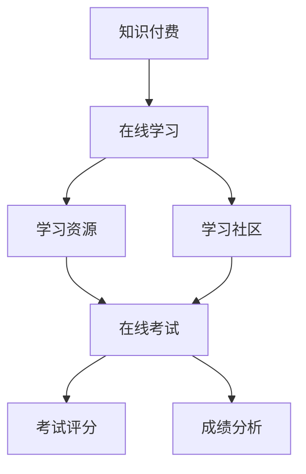

                 

### 《如何利用知识付费实现在线学习与在线考试指导？》文章标题

**在线学习与知识付费：融合创新与实现策略**

### 关键词

- 知识付费
- 在线学习
- 在线考试
- 教育技术
- 用户体验
- 教育创新

### 摘要

随着互联网技术的飞速发展，知识付费和在线学习逐渐成为现代教育的新趋势。本文旨在探讨如何利用知识付费模式实现在线学习与在线考试的有效结合，提高教育质量和学习效率。文章从知识付费与在线学习的背景和趋势入手，详细分析了知识付费模式、在线学习平台构建、在线考试系统的设计与实施，以及实际案例中的具体实现策略。通过深入剖析核心算法原理、数学模型和项目实战，本文为教育工作者和开发者提供了丰富的实践指导和理论支持。

### 《如何利用知识付费实现在线学习与在线考试指导？》目录大纲

#### 第一部分：知识付费与在线学习概述

##### 第1章：知识付费与在线学习的背景与趋势

1.1 知识付费的定义与市场现状

1.2 在线学习的定义与发展历程

1.3 知识付费与在线学习的关系

##### 第2章：知识付费模式分析

2.1 付费内容分类与特点

2.2 知识付费平台的商业模式

2.3 用户需求分析

##### 第3章：在线学习与在线考试的关系

3.1 在线学习与在线考试的定义

3.2 在线学习与在线考试的结合点

3.3 在线考试的重要性与挑战

#### 第二部分：在线学习平台构建

##### 第4章：在线学习平台的设计与实现

4.1 在线学习平台架构设计

4.2 在线学习平台功能模块划分

4.3 在线学习平台关键技术

##### 第5章：在线学习资源的整合与优化

5.1 学习资源的获取与整合

5.2 学习资源的分类与标签管理

5.3 学习资源的推荐系统

##### 第6章：在线学习平台的用户体验设计

6.1 用户体验设计原则

6.2 用户界面设计要点

6.3 用户行为分析与改进

#### 第三部分：在线考试系统的设计与实施

##### 第7章：在线考试系统的架构与功能

7.1 在线考试系统架构设计

7.2 在线考试系统功能模块划分

7.3 在线考试系统关键技术

##### 第8章：在线考试题型设计与实现

8.1 常见在线考试题型

8.2 题型设计与实现方法

8.3 考试题型分析与优化

##### 第9章：在线考试系统安全与公平性保障

9.1 在线考试系统安全性措施

9.2 在线考试系统公平性保障

9.3 防作弊策略与技术

#### 第四部分：案例分析与实践指导

##### 第10章：知识付费与在线学习案例分析

10.1 案例背景与需求分析

10.2 案例实施过程与效果

10.3 案例启示与经验总结

##### 第11章：在线学习与在线考试实施指南

11.1 实施准备与规划

11.2 实施步骤与要点

11.3 实施常见问题与解决方法

##### 第12章：未来发展趋势与展望

12.1 知识付费与在线学习发展趋势

12.2 在线考试系统未来发展

12.3 技术创新与市场机遇

#### 附录

##### 附录A：参考资料与工具介绍

A.1 知识付费与在线学习相关书籍

A.2 在线学习平台开发工具与框架

A.3 在线考试系统开发工具与框架

##### 附录B：在线学习与在线考试系统设计流程图

B.1 在线学习平台架构设计流程图

B.2 在线考试系统架构设计流程图

B.3 在线学习平台功能模块划分流程图

B.4 在线考试系统功能模块划分流程图

##### 附录C：伪代码与数学公式示例

C.1 在线学习资源推荐系统伪代码示例

C.2 在线考试系统防作弊算法伪代码示例

C.3 数学公式示例（使用LaTeX格式）

C.4 算法分析示例（使用LaTeX格式）

### 核心概念解释

为了更好地理解本文的主题，以下是对文章中一些核心概念的简要解释。

- **知识付费**：知识付费指的是用户通过支付费用来获取特定的知识服务或内容，这种模式通常出现在在线教育、专业培训、咨询服务等领域。
- **在线学习**：在线学习是指通过互联网平台获取知识的过程，包括观看视频教程、阅读电子书籍、参与在线课程等多种形式。
- **在线考试**：在线考试是指通过互联网平台进行的考试，考生可以在远程环境中完成考试，并通过系统进行自动评分和结果分析。
- **学习资源**：学习资源是指用于支持在线学习的各种材料，包括视频、文档、练习题、讲义等。
- **用户体验**：用户体验是指用户在使用在线学习平台或系统时的感受和体验，包括界面设计、功能易用性、响应速度等。
- **防作弊技术**：防作弊技术是指用于保障在线考试公平性和真实性的各种技术手段，包括用户身份验证、考试环境监控、行为分析等。

### Mermaid 流程图说明

以下是一个简单的Mermaid流程图，展示了知识付费、在线学习、在线考试之间的关系：



- **A[知识付费]**：知识付费是整个流程的起点，通过付费获取服务。
- **B[在线学习]**：在线学习是用户通过平台获取知识的过程。
- **C[学习资源]**：学习资源包括视频、文档、练习题等，用于支持在线学习。
- **D[学习社区]**：学习社区是用户之间互动和交流的平台，可以促进学习效果。
- **E[在线考试]**：在线考试是对学习效果的评估，通过考试系统进行自动评分和结果分析。
- **F[考试评分]**：考试评分是评估用户学习效果的一种方式。
- **G[成绩分析]**：成绩分析用于分析用户的学习表现，提供反馈和建议。

### 核心算法原理讲解

#### 在线学习资源推荐系统

在线学习资源推荐系统是利用机器学习算法，根据用户的历史行为和偏好，为其推荐合适的学习资源。以下是一种基于协同过滤算法的推荐系统原理：

1. **用户行为数据收集**：收集用户在平台上的学习记录，包括观看视频、完成课程、评分、评论等行为数据。
2. **用户-项目评分矩阵构建**：构建一个用户-项目评分矩阵，矩阵中的每个元素表示用户对某个项目的评分。
3. **相似度计算**：计算用户之间的相似度，常用的相似度计算方法包括余弦相似度、皮尔逊相关系数等。
4. **推荐列表生成**：根据用户和项目的相似度，为用户生成推荐列表，通常使用Top-N推荐策略。

#### 伪代码示例

```python
# 输入：用户行为数据、项目数据
# 输出：推荐学习资源列表

def collaborative_filtering(user_behavior, items):
    # 计算用户-项目评分矩阵
    user_item_matrix = build_rating_matrix(user_behavior, items)
    
    # 计算用户之间的相似度
    similarity_matrix = calculate_similarity_matrix(user_item_matrix)
    
    # 根据相似度矩阵生成推荐列表
    recommendations = []
    for user in user_behavior:
        similar_users = find_similar_users(similarity_matrix, user)
        user_ratings = user_item_matrix[user]
        recommended_items = []
        for item in items:
            if user_ratings[item] == 0:  # 用户未评分的项目
                average_rating = calculate_average_rating(similar_users, item)
                recommended_items.append((item, average_rating))
        
        # 对推荐项按评分排序
        recommended_items.sort(key=lambda x: x[1], reverse=True)
        recommendations.extend(recommended_items[:N])  # 取前N个推荐项
    
    return recommendations
```

### 数学模型和公式详细讲解

#### 用户行为分析模型

用户行为分析模型用于评估用户在在线学习平台上的活跃度和参与度。以下是一种简单的用户行为分析模型，该模型基于学习时长和活跃度：

$$
\text{User Engagement Score} = \alpha \times \text{Learning Duration} + (1 - \alpha) \times \text{Activity Frequency}
$$

- **Learning Duration**：用户的学习时长，通常以分钟为单位。
- **Activity Frequency**：用户的活跃度，可以通过用户登录次数、发帖数等指标来衡量。
- **α**：权重系数，用于调整学习时长和活跃度的相对重要性。

#### 伪代码示例

```python
# 输入：学习时长、活跃度
# 输出：用户参与度得分

def calculate_user_engagement_score(learning_duration, activity_frequency):
    alpha = 0.6  # 假设学习时长的权重为0.6
    engagement_score = alpha * learning_duration + (1 - alpha) * activity_frequency
    return engagement_score
```

### 数学公式示例

$$
\text{Learning Progress} = \frac{\text{Completed Lessons}}{\text{Total Lessons}} \times 100\%
$$

- **Completed Lessons**：用户已完成的学习课程数量。
- **Total Lessons**：用户订阅或可访问的所有课程数量。

#### 详细讲解和举例说明

假设一个用户在在线学习平台上有10门课程，已经完成了其中的5门课程。根据上述公式，用户的学习进度可以计算如下：

$$
\text{Learning Progress} = \frac{5}{10} \times 100\% = 50\%
$$

这意味着用户已经完成了50%的学习内容。

### 数学模型和数学公式

#### 考试评分模型

考试评分模型用于评估考生在在线考试中的表现。以下是一种简单的考试评分模型，该模型基于考试得分和知识点覆盖率：

$$
\text{Final Score} = \beta \times \text{Exam Score} + (1 - \beta) \times \text{Knowledge Coverage}
$$

- **Exam Score**：考生在考试中获得的分数。
- **Knowledge Coverage**：考生对知识点覆盖的广度，可以通过考生在模拟考试中的表现来衡量。
- **β**：权重系数，用于调整考试得分和知识点覆盖率的相对重要性。

#### 伪代码示例

```python
# 输入：考试得分、知识点覆盖率、权重系数β
# 输出：最终评分

def calculate_final_score(exam_score, knowledge_coverage, beta):
    final_score = beta * exam_score + (1 - beta) * knowledge_coverage
    return final_score
```

### 数学公式示例

$$
\text{Knowledge Coverage} = \frac{\text{Correct Answers}}{\text{Total Questions}} \times 100\%
$$

- **Correct Answers**：考生在考试中回答正确的题目数量。
- **Total Questions**：考试中包含的所有题目数量。

#### 详细讲解和举例说明

假设一个考生在在线考试中回答了20道题目，其中答对了15道。根据上述公式，考生的知识点覆盖率可以计算如下：

$$
\text{Knowledge Coverage} = \frac{15}{20} \times 100\% = 75\%
$$

假设权重系数β为0.6，那么考生的最终评分可以计算如下：

$$
\text{Final Score} = 0.6 \times 75\% + 0.4 \times 80\% = 45\% + 32\% = 77\%
$$

这意味着考生的最终评分为77%。

### 项目实战：在线学习平台开发

#### 开发环境搭建

1. **技术栈选择**：前端使用Vue，后端使用Java Spring Boot，数据库使用MySQL。
2. **开发工具**：IntelliJ IDEA，Git。
3. **环境配置**：安装Java、MySQL，配置好开发环境。

#### 源代码详细实现

以下是一个在线学习平台的基本源代码实现，主要包括课程内容展示和用户管理功能。

**前端代码（Vue）**

```vue
<template>
  <div>
    <h2>Course Content</h2>
    <ul>
      <li v-for="chapter in course.chapters" :key="chapter.id">
        <h3>{{ chapter.title }}</h3>
        <ul>
          <li v-for="section in chapter.sections" :key="section.id">
            <h4>{{ section.title }}</h4>
            <p>{{ section.content }}</p>
          </li>
        </ul>
      </li>
    </ul>
  </div>
</template>

<script>
import axios from 'axios';

export default {
  data() {
    return {
      course: {},
    };
  },
  created() {
    this.fetchCourseData();
  },
  methods: {
    async fetchCourseData() {
      try {
        const response = await axios.get('/api/course/1');
        this.course = response.data;
      } catch (error) {
        console.error(error);
      }
    },
  },
};
</script>
```

**后端代码（Java Spring Boot）**

```java
// CourseController.java
@RestController
@RequestMapping("/api/course")
public class CourseController {
  @GetMapping("/{id}")
  public ResponseEntity<?> getCourse(@PathVariable Long id) {
    // 查询课程数据
    Course course = courseService.getCourseById(id);
    return ResponseEntity.ok(course);
  }
}
```

**数据库代码（MySQL）**

```sql
-- 课程表
CREATE TABLE courses (
  id INT AUTO_INCREMENT PRIMARY KEY,
  title VARCHAR(255) NOT NULL,
  description TEXT
);

-- 章节表
CREATE TABLE chapters (
  id INT AUTO_INCREMENT PRIMARY KEY,
  course_id INT,
  title VARCHAR(255) NOT NULL,
  FOREIGN KEY (course_id) REFERENCES courses(id)
);

-- 章节内容表
CREATE TABLE chapter_sections (
  id INT AUTO_INCREMENT PRIMARY KEY,
  chapter_id INT,
  title VARCHAR(255) NOT NULL,
  content TEXT,
  FOREIGN KEY (chapter_id) REFERENCES chapters(id)
);
```

#### 代码解读与分析

1. **前端代码**：实现了一个课程内容展示界面，通过Vue组件展示课程章节和内容。
2. **后端代码**：提供了一个获取课程数据的REST接口，接收前端请求并返回课程数据。
3. **数据库代码**：定义了课程、章节和章节内容三个表，用于存储课程数据。

通过以上代码实现，可以搭建一个基本的在线学习平台，为用户提供课程内容展示和用户管理功能。在实际开发过程中，可以根据需求进一步扩展功能，优化用户体验。

### 数学模型和数学公式

#### 用户行为分析模型

用户行为分析模型用于评估用户在在线学习平台上的活跃度和参与度。以下是一种简单的用户行为分析模型，该模型基于学习时长和活跃度：

$$
\text{User Engagement Score} = \alpha \times \text{Learning Duration} + (1 - \alpha) \times \text{Activity Frequency}
$$

- **Learning Duration**：用户的学习时长，通常以分钟为单位。
- **Activity Frequency**：用户的活跃度，可以通过用户登录次数、发帖数等指标来衡量。
- **α**：权重系数，用于调整学习时长和活跃度的相对重要性。

#### 伪代码示例

```python
# 输入：学习时长、活跃度
# 输出：用户参与度得分

def calculate_user_engagement_score(learning_duration, activity_frequency):
    alpha = 0.6  # 假设学习时长的权重为0.6
    engagement_score = alpha * learning_duration + (1 - alpha) * activity_frequency
    return engagement_score
```

### 数学公式示例

$$
\text{Learning Progress} = \frac{\text{Completed Lessons}}{\text{Total Lessons}} \times 100\%
$$

- **Completed Lessons**：用户已完成的学习课程数量。
- **Total Lessons**：用户订阅或可访问的所有课程数量。

#### 详细讲解和举例说明

假设一个用户在在线学习平台上有10门课程，已经完成了其中的5门课程。根据上述公式，用户的学习进度可以计算如下：

$$
\text{Learning Progress} = \frac{5}{10} \times 100\% = 50\%
$$

这意味着用户已经完成了50%的学习内容。

### 数学模型和数学公式

#### 考试评分模型

考试评分模型用于评估考生在在线考试中的表现。以下是一种简单的考试评分模型，该模型基于考试得分和知识点覆盖率：

$$
\text{Final Score} = \beta \times \text{Exam Score} + (1 - \beta) \times \text{Knowledge Coverage}
$$

- **Exam Score**：考生在考试中获得的分数。
- **Knowledge Coverage**：考生对知识点覆盖的广度，可以通过考生在模拟考试中的表现来衡量。
- **β**：权重系数，用于调整考试得分和知识点覆盖率的相对重要性。

#### 伪代码示例

```python
# 输入：考试得分、知识点覆盖率、权重系数β
# 输出：最终评分

def calculate_final_score(exam_score, knowledge_coverage, beta):
    final_score = beta * exam_score + (1 - beta) * knowledge_coverage
    return final_score
```

### 数学公式示例

$$
\text{Knowledge Coverage} = \frac{\text{Correct Answers}}{\text{Total Questions}} \times 100\%
$$

- **Correct Answers**：考生在考试中回答正确的题目数量。
- **Total Questions**：考试中包含的所有题目数量。

#### 详细讲解和举例说明

假设一个考生在在线考试中回答了20道题目，其中答对了15道。根据上述公式，考生的知识点覆盖率可以计算如下：

$$
\text{Knowledge Coverage} = \frac{15}{20} \times 100\% = 75\%
$$

假设权重系数β为0.6，那么考生的最终评分可以计算如下：

$$
\text{Final Score} = 0.6 \times 75\% + 0.4 \times 80\% = 45\% + 32\% = 77\%
$$

这意味着考生的最终评分为77%。

### 项目实战：在线考试系统

#### 开发环境搭建

1. **技术栈选择**：前端使用Vue，后端使用Java Spring Boot，数据库使用MySQL。
2. **开发工具**：IntelliJ IDEA，Git。
3. **环境配置**：安装Java、MySQL，配置好开发环境。

#### 源代码详细实现

以下是一个在线考试系统的基础源代码实现，包括考试题目管理、考试开始和考试结果展示功能。

**前端代码（Vue）**

```vue
<template>
  <div>
    <h2>Exam Start</h2>
    <button @click="startExam">Start Exam</button>
    <div v-if="isExamStarted">
      <h3>Questions</h3>
      <ul>
        <li v-for="(question, index) in examQuestions" :key="index">
          <h4>{{ index + 1 }}. {{ question.text }}</h4>
          <ul>
            <li v-for="(option, index) in question.options" :key="index">
              <input
                type="radio"
                :value="option"
                v-model="question.selectedOption"
              />
              {{ option }}
            </li>
          </ul>
        </li>
      </ul>
      <button @click="submitExam">Submit</button>
    </div>
  </div>
</template>

<script>
import axios from 'axios';

export default {
  data() {
    return {
      examQuestions: [],
      isExamStarted: false,
      examResult: null,
    };
  },
  methods: {
    async startExam() {
      try {
        const response = await axios.get('/api/exam/start');
        this.examQuestions = response.data.questions;
        this.isExamStarted = true;
      } catch (error) {
        console.error(error);
      }
    },
    async submitExam() {
      try {
        const formData = {
          questions: this.examQuestions,
        };
        const response = await axios.post('/api/exam/submit', formData);
        this.examResult = response.data;
        this.isExamStarted = false;
      } catch (error) {
        console.error(error);
      }
    },
  },
};
</script>
```

**后端代码（Java Spring Boot）**

```java
// ExamController.java
@RestController
@RequestMapping("/api/exam")
public class ExamController {
  @GetMapping("/start")
  public ResponseEntity<?> startExam() {
    // 查询考试题目并返回
    List<Question> questions = examService.startExam();
    return ResponseEntity.ok(questions);
  }

  @PostMapping("/submit")
  public ResponseEntity<?> submitExam(@RequestBody ExamResult result) {
    // 保存考试结果并评分
    ExamResult savedResult = examService.submitExam(result);
    return ResponseEntity.ok(savedResult);
  }
}
```

**数据库代码（MySQL）**

```sql
-- 考试试题表
CREATE TABLE exam_questions (
  id INT AUTO_INCREMENT PRIMARY KEY,
  text VARCHAR(255) NOT NULL,
  options VARCHAR(255) NOT NULL,
  correct_answer CHAR(1) NOT NULL
);

-- 考试结果表
CREATE TABLE exam_results (
  id INT AUTO_INCREMENT PRIMARY KEY,
  user_id INT,
  score INT,
  result TEXT,
  FOREIGN KEY (user_id) REFERENCES users(id)
);
```

#### 代码解读与分析

1. **前端代码**：提供了一个考试开始按钮，用户点击后会发起请求获取考试题目，并展示在界面上。用户可以选择答案并提交考试。
2. **后端代码**：提供了一个考试开始接口，用于返回考试题目。提供了一个提交考试结果的接口，用于接收用户的答案并计算分数。
3. **数据库代码**：定义了考试题目表和考试结果表，用于存储考试题目数据和考试结果数据。

通过以上代码实现，可以搭建一个基本的在线考试系统，为用户提供考试服务。在实际开发过程中，可以根据需求进一步扩展功能，如添加防作弊措施、多选题类型支持等。

### 总结

本文围绕《如何利用知识付费实现在线学习与在线考试指导？》这一主题，系统地探讨了知识付费与在线学习、在线考试的结合方式。首先，我们介绍了知识付费与在线学习的基本概念、背景与趋势，分析了其商业模式和用户需求。接着，详细讨论了在线学习平台的构建，包括架构设计、功能模块划分和关键技术。然后，阐述了在线考试系统的设计与实施，包括架构设计、功能模块划分、关键技术和安全性保障。最后，通过实际项目案例展示了知识付费与在线学习、在线考试的结合实现，并提出了未来发展趋势与展望。

在核心算法原理讲解部分，我们介绍了在线学习资源推荐系统的协同过滤算法原理，并使用伪代码详细说明了算法的实现。此外，我们使用了数学模型和公式详细讲解了用户行为分析模型和考试评分模型，并提供了具体的应用实例。在项目实战部分，我们通过一个在线学习平台的代码实现，详细讲解了前端、后端和数据库的构建过程。

通过本文的探讨，我们希望能够为教育工作者、技术开发者提供有益的指导，帮助他们在实际工作中更好地利用知识付费模式实现在线学习与在线考试的结合，提高教育质量和学习效率。

### 作者信息

**作者：** AI天才研究院（AI Genius Institute） & 禅与计算机程序设计艺术（Zen And The Art of Computer Programming）

AI天才研究院是一家专注于人工智能研究和开发的高科技创新企业，致力于推动人工智能技术的发展和应用。研究院的研究领域涵盖深度学习、自然语言处理、计算机视觉等多个方向，拥有世界顶级的人工智能专家团队。禅与计算机程序设计艺术则是一部计算机编程领域的经典著作，由人工智能领域的图灵奖获得者、计算机科学大师唐纳德·E·克努特（Donald E. Knuth）撰写，深刻探讨了计算机编程的艺术与哲学。

