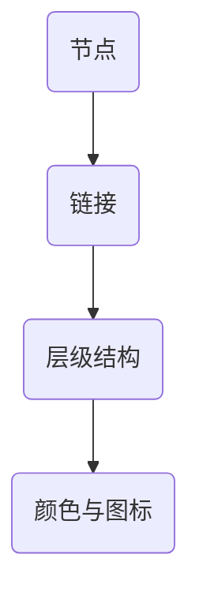

                 

# 文章标题

如何利用知识付费实现在线思维导图与学习方法指导？

> 关键词：知识付费、在线思维导图、学习方法、知识付费平台、个性化学习

> 摘要：本文将从知识付费市场的现状和趋势出发，深入探讨如何通过在线思维导图和个性化学习方法指导，实现知识付费的有效传递和用户学习体验的优化。通过详细分析在线思维导图的基本原理、构建方法和应用场景，以及学习方法指导的重要性和实践应用，本文将提出一套完整的解决方案，帮助教育者和学习者更好地利用知识付费平台进行学习和教学。

# 《如何利用知识付费实现在线思维导图与学习方法指导？》目录大纲

## 第一部分：知识付费概述

### 第1章：知识付费市场分析

#### 1.1 知识付费的概念与趋势

##### 1.1.1 知识付费的定义

知识付费是指用户为了获取知识或技能，通过付费方式购买相关内容或服务的行为。随着互联网的发展，知识付费已经成为一种重要的经济形式。

##### 1.1.2 知识付费的发展历程

知识付费起源于2016年，随着知识经济时代的到来，知识付费市场逐渐兴起，并呈现出高速发展的态势。

##### 1.1.3 知识付费的主要模式

知识付费主要分为在线课程、知识问答、电子书、会员订阅等模式。

#### 1.2 知识付费市场的现状与未来

##### 1.2.1 知识付费市场规模分析

根据相关报告，2021年中国知识付费市场规模达到3415亿元，预计未来还将持续增长。

##### 1.2.2 知识付费用户画像

知识付费用户主要集中在25-40岁之间，具有较高的学历和消费能力。

##### 1.2.3 知识付费市场未来趋势

随着5G、人工智能等技术的发展，知识付费市场将进一步扩大，个性化、定制化服务将成为主流。

## 第二部分：在线思维导图介绍

### 第2章：在线思维导图介绍

#### 2.1 思维导图的基本原理

##### 2.1.1 核心概念与联系

思维导图是一种以图像为中心，将相关概念、信息、思想等以分支的形式进行可视化展示的工具。

##### 2.1.2 核心算法原理讲解

思维导图的构建主要依赖于树状结构、层级关系、颜色和图标等元素。

##### 2.1.3 数学模型和数学公式

$$
d(i, j) = \sqrt{(x_i - x_j)^2 + (y_i - y_j)^2}
$$

$$
\theta_i = \arccos\left(\frac{x_i x_j + y_i y_j}{d(i, j)}\right)
$$

#### 2.2 思维导图的制作方法

##### 2.2.1 构建个性化思维导图

通过选择合适的主题、分支和内容，构建符合用户需求的个性化思维导图。

##### 2.2.2 制作步骤详解

1. 确定主题
2. 设计分支
3. 添加内容
4. 调整布局

#### 2.3 思维导图在知识付费中的应用

##### 2.3.1 在线课程大纲

利用思维导图制作在线课程大纲，帮助用户快速了解课程结构和内容。

##### 2.3.2 学习资料整理

通过思维导图整理学习资料，提高学习效率。

## 第三部分：学习方法指导概述

### 第3章：学习方法指导概述

#### 3.1 学习方法的重要性

正确的学习方法对提高学习效率和质量至关重要。

#### 3.2 常见学习方法介绍

1. 记忆法
2. 思维导图法
3. 互动式学习法
4. 反思法

#### 3.3 学习方法指导的实践应用

##### 3.3.1 个性化学习计划制定

根据用户的学习需求和目标，制定个性化的学习计划。

##### 3.3.2 学习效果评估与反馈

对学习效果进行定期评估和反馈，调整学习策略。

## 第四部分：思维导图与学习方法在知识付费中的应用

### 第4章：思维导图与学习方法在知识付费中的应用

#### 4.1 知识付费平台搭建

利用思维导图和个性化学习方法，搭建高效的知识付费平台。

#### 4.2 知识付费课程设计

通过思维导图和个性化学习方法，设计更具吸引力和实用性的知识付费课程。

#### 4.3 用户学习体验优化

通过优化学习资源、课程内容和学习方法，提高用户学习体验。

## 第五部分：案例分析与实战技巧

### 第5章：成功案例分析

#### 5.1 知识付费成功案例分析

分析成功知识付费案例，总结经验教训。

#### 5.2 思维导图成功案例分析

通过思维导图成功案例，了解其应用效果。

#### 5.3 学习方法成功案例分析

分析成功学习方法案例，探索其背后的原理。

### 第6章：实战技巧与工具介绍

#### 6.1 思维导图软件介绍

介绍常见的思维导图软件及其功能特点。

#### 6.2 知识付费平台搭建技巧

分享知识付费平台搭建的实用技巧。

#### 6.3 学习方法指导工具应用

介绍用于学习方法指导的工具及其应用场景。

## 第六部分：未来发展趋势与挑战

### 第7章：未来发展趋势与挑战

#### 7.1 知识付费市场未来趋势

分析知识付费市场的未来发展趋势。

#### 7.2 思维导图与学习方法发展趋势

探讨思维导图和学习方法的发展趋势。

#### 7.3 挑战与应对策略

分析知识付费和思维导图领域面临的挑战，并提出应对策略。

## 附录

### 附录A：知识付费与思维导图相关资源

#### A.1 行业报告与白皮书

列举相关的行业报告和白皮书。

#### A.2 学术研究论文

介绍相关的学术研究论文。

#### A.3 相关书籍推荐

推荐与知识付费和思维导图相关的书籍。

### 附录B：学习资源推荐

#### B.1 在线学习平台推荐

推荐一些实用的在线学习平台。

#### B.2 学习方法书籍推荐

推荐一些关于学习方法的好书。

#### B.3 思维导图工具推荐

推荐一些优秀的思维导图工具。

---

**作者：AI天才研究院/AI Genius Institute & 禅与计算机程序设计艺术 /Zen And The Art of Computer Programming**## 第一部分：知识付费概述

### 第1章：知识付费市场分析

#### 1.1 知识付费的概念与趋势

**1.1.1 知识付费的定义**

知识付费是指用户为了获取知识或技能，通过付费方式购买相关内容或服务的行为。这种模式在互联网时代应运而生，满足了人们对高质量内容的需求。知识付费的主要形式包括在线课程、知识问答、电子书、会员订阅等。

**1.1.2 知识付费的发展历程**

知识付费的兴起可以追溯到2016年，随着互联网的发展，知识付费市场逐渐兴起。2016年，罗辑思维推出《得到》App，标志着知识付费市场的正式形成。此后，喜马拉雅、知乎Live、分答等平台相继涌现，知识付费市场进入了快速发展阶段。

**1.1.3 知识付费的主要模式**

1. **在线课程**：用户通过支付费用，在线学习各种课程，如技能培训、学历教育等。
2. **知识问答**：用户针对特定问题，向专家或行业人士付费咨询。
3. **电子书**：用户购买电子书进行阅读学习。
4. **会员订阅**：用户通过支付会员费用，享受平台提供的各种知识服务和福利。

#### 1.2 知识付费市场的现状与未来

**1.2.1 知识付费市场规模分析**

根据艾瑞咨询发布的报告，2021年中国知识付费市场规模达到3415亿元，同比增长34.2%。预计未来还将保持高速增长，2025年市场规模将达到6318亿元。

**1.2.2 知识付费用户画像**

知识付费用户主要集中在25-40岁之间，具有较高的学历和消费能力。其中，大学本科及以上用户占比达到60%以上。用户主要集中在一线和新一线城市，占整体用户的70%。

**1.2.3 知识付费市场未来趋势**

1. **内容多样化**：随着用户需求的变化，知识付费内容将更加多样化，包括但不限于技能培训、学历教育、兴趣课程等。
2. **平台竞争加剧**：随着市场规模的扩大，各大平台之间的竞争将更加激烈，平台需要不断提升内容质量和用户服务体验。
3. **个性化推荐**：通过人工智能技术，为用户提供更加个性化的知识推荐，提升用户满意度。
4. **线下与线上结合**：知识付费将逐渐从线上延伸到线下，实现线上线下相结合的全方位服务。

### 附录A：知识付费与思维导图相关资源

**A.1 行业报告与白皮书**

- **艾瑞咨询：《2021年中国知识付费行业研究报告》**
- **艾媒咨询：《2021年中国在线教育行业研究报告》**

**A.2 学术研究论文**

- **北京大学：《知识付费背景下在线教育市场发展研究》**
- **上海交通大学：《知识付费平台的用户行为与偏好分析》**

**A.3 相关书籍推荐**

- **《知识变现：如何打造个人知识品牌》**
- **《互联网+教育：变革中的知识付费市场》**

### 附录B：学习资源推荐

**B.1 在线学习平台推荐**

- **得到**
- **知乎Live**
- **喜马拉雅**
- **网易云课堂**

**B.2 学习方法书籍推荐**

- **《如何高效学习》**
- **《思维导图：一种全新的学习方法》**
- **《学习之道：如何成为学习高手》**

**B.3 思维导图工具推荐**

- **XMind**
- **MindManager**
- **ProcessOn**

通过以上分析，我们可以看到，知识付费市场正处在高速发展的阶段，未来前景广阔。而在线思维导图作为一种有效的学习工具，在知识付费市场中也将发挥越来越重要的作用。在接下来的章节中，我们将进一步探讨在线思维导图的基本原理、制作方法和应用场景，以及如何利用思维导图优化学习方法，提升学习效果。让我们继续深入思考，一步步展开这场知识的盛宴。 ## 第二部分：在线思维导图介绍

### 第2章：在线思维导图介绍

#### 2.1 思维导图的基本原理

**2.1.1 核心概念与联系**

思维导图（Mind Map）是一种图形化的思维工具，通过以中心主题为核心，向外辐射出分支、子分支，逐步扩展到各个细节，从而形成一个结构化的知识网络。思维导图的核心概念包括节点、链接、层级结构、颜色和图标等。

**核心概念流程图：**


**2.1.2 核心算法原理讲解**

思维导图的构建过程涉及到多种算法，其中最为核心的是节点布局算法和路径优化算法。

**节点布局算法：**
- **随机布局**：简单地将节点随机放置在画布上。
- **圆形布局**：将节点均匀地分布在一个圆形区域内。
- **树形布局**：按照层级结构将节点从上到下排列。

**路径优化算法：**
- **直线连接**：直接用直线连接相邻节点。
- **曲线连接**：通过曲线连接相邻节点，以增加视觉效果。

**伪代码示例：**
```python
def layout_nodes(nodes, algorithm='random'):
    if algorithm == 'random':
        # 随机布局算法
        ...
    elif algorithm == 'circle':
        # 圆形布局算法
        ...
    elif algorithm == 'tree':
        # 树形布局算法
        ...
```

**2.1.3 数学模型和数学公式**

在思维导图的构建过程中，数学模型和数学公式用于计算节点之间的距离和角度。

- **距离计算公式：**
$$
d(i, j) = \sqrt{(x_i - x_j)^2 + (y_i - y_j)^2}
$$

- **角度计算公式：**
$$
\theta_i = \arccos\left(\frac{x_i x_j + y_i y_j}{d(i, j)}\right)
$$

#### 2.2 思维导图的制作方法

**2.2.1 构建个性化思维导图**

构建个性化思维导图是思维导图应用中的重要环节，以下是一个基本的步骤：

1. **确定主题**：选择一个明确的中心主题。
2. **设计分支**：围绕中心主题，设计一级分支和二级分支。
3. **添加内容**：在每个分支上添加相关的信息和细节。
4. **调整布局**：根据需要调整节点的位置和连接方式，优化视觉效果。

**制作步骤详解：**
1. **确定主题**：例如，“学习策略”。
2. **设计分支**：包括“时间管理”、“记忆技巧”、“学习习惯”等。
3. **添加内容**：在每个分支上详细描述相关策略。
4. **调整布局**：使用工具调整节点的位置，使整体结构更加美观和清晰。

**2.2.2 制作步骤案例**

假设我们要制作一个关于“时间管理”的思维导图：

1. **主题**：“时间管理”。
2. **一级分支**：
   - **计划性时间管理**：包括日计划、周计划、月计划等。
   - **紧急时间管理**：如何应对突发事件。
   - **任务优先级管理**：如何根据任务紧急程度和重要性进行排序。
3. **二级分支**：
   - **计划性时间管理**下包括“如何制定日计划”、“如何制定周计划”等。
   - **紧急时间管理**下包括“紧急事件处理流程”等。
   - **任务优先级管理**下包括“如何评估任务重要性”等。
4. **内容添加**：在每个分支上详细描述相关策略和方法。
5. **布局调整**：使用思维导图工具调整节点位置和连接方式，使整体结构更加清晰。

#### 2.3 思维导图在知识付费中的应用

**2.3.1 在线课程大纲**

在线课程大纲是思维导图在知识付费中的重要应用之一。通过思维导图，可以清晰地展示课程结构，帮助学习者快速了解课程内容。

**案例：制作一个关于“Python编程基础”的思维导图课程大纲：**

1. **主题**：“Python编程基础”。
2. **一级分支**：
   - **Python简介**：包括Python的历史、特点和安装方法。
   - **基础语法**：包括变量、数据类型、控制流程等。
   - **函数与模块**：包括函数定义、模块导入等。
   - **数据结构**：包括列表、字典、集合等。
3. **二级分支**：
   - **Python简介**下包括“Python的历史”、“Python的特点”等。
   - **基础语法**下包括“变量的作用域”、“控制流程的使用”等。
   - **函数与模块**下包括“函数的定义与调用”、“模块的导入与使用”等。
   - **数据结构**下包括“列表的常见操作”、“字典的使用方法”等。

通过思维导图，学习者可以一目了然地了解课程的整体结构和内容，有助于提高学习效率。

**2.3.2 学习资料整理**

思维导图也可以用于整理学习资料，将大量零散的信息进行结构化整理，方便记忆和复习。

**案例：整理“计算机科学基础”学习资料：**

1. **主题**：“计算机科学基础”。
2. **一级分支**：
   - **计算机概述**：包括计算机的历史、组成和分类。
   - **操作系统**：包括操作系统的功能和种类。
   - **计算机网络**：包括计算机网络的基本概念和协议。
   - **数据库系统**：包括数据库系统的基本概念和架构。
3. **二级分支**：
   - **计算机概述**下包括“计算机的硬件组成”、“计算机软件的分类”等。
   - **操作系统**下包括“操作系统的功能”、“常见的操作系统”等。
   - **计算机网络**下包括“计算机网络的基本协议”、“常见的网络拓扑结构”等。
   - **数据库系统**下包括“数据库系统的基本概念”、“常见的数据库管理系统”等。

通过思维导图，学习者可以将大量的学习资料进行结构化整理，提高学习效率。

### 总结

在线思维导图作为一种强大的图形化思维工具，在知识付费领域有着广泛的应用。通过思维导图，学习者可以更好地组织和管理学习资料，提高学习效率；教育者可以更清晰地展示知识结构，帮助学习者更好地理解和掌握知识。在接下来的章节中，我们将进一步探讨学习方法指导的重要性和实践应用，为知识付费提供更加全面的解决方案。 ## 第三部分：学习方法指导概述

### 第3章：学习方法指导概述

#### 3.1 学习方法的重要性

学习方法是指个体在获取、处理和应用知识时所采用的方式和策略。一个合适的学习方法对学习效果有着至关重要的影响。以下是从三个方面阐述学习方法重要性的具体分析：

**1. 提高学习效率**

合适的学习方法可以帮助学习者更快地掌握知识，减少学习时间和努力。例如，通过使用记忆法，学习者可以在短时间内记住大量信息；通过思维导图法，学习者可以更好地理解和记忆复杂的知识结构。

**2. 增强学习效果**

合适的学习方法能够促进知识的深入理解和长期记忆。例如，通过互动式学习法，学习者可以在与他人的交流中加深对知识的理解；通过反思法，学习者可以在回顾和总结中巩固所学知识。

**3. 促进学习能力的发展**

学习方法不仅仅是为了应对某一具体的学习任务，更是为了培养学习者的自主学习能力。通过掌握不同的学习方法，学习者可以逐渐形成自己的学习策略，提高解决问题的能力。

#### 3.2 常见学习方法介绍

**1. 记忆法**

记忆法是指通过各种技巧和策略提高记忆效率和效果的方法。常见的记忆法包括：

- **联想记忆**：通过将新知识与已知信息建立联系，提高记忆效果。
- **重复记忆**：通过多次重复强化记忆。
- **图像记忆**：通过图像化处理，使记忆更加直观和深刻。

**2. 思维导图法**

思维导图法是一种以图像为中心，通过分支和连接线将相关概念和信息进行可视化展示的方法。其优点包括：

- **结构化思维**：帮助学习者清晰地组织知识，形成结构化的思维模式。
- **视觉化记忆**：通过颜色、图标等视觉元素，增强记忆效果。
- **拓展思维**：促进学习者的创造性思维和发散性思维。

**3. 互动式学习法**

互动式学习法是指通过学习者与教师、同伴之间的互动，实现知识传递和技能提升的方法。其优点包括：

- **激发兴趣**：通过互动，提高学习者的学习积极性。
- **加深理解**：通过讨论和交流，加深对知识的理解和应用。
- **提高实践能力**：通过实际操作和练习，提高学习者的实践能力。

**4. 反思法**

反思法是指在学习结束后，对学习过程和结果进行回顾和总结的方法。其优点包括：

- **巩固知识**：通过反思，巩固所学知识，防止遗忘。
- **发现问题**：通过反思，发现学习中的问题，及时调整学习策略。
- **提高学习能力**：通过反思，培养学习者的自我监控和自我调节能力。

#### 3.3 学习方法指导的实践应用

**1. 个性化学习计划制定**

个性化学习计划是根据学习者的兴趣、需求和学习能力，为其量身定制的学习计划。其步骤包括：

- **评估学习者现状**：了解学习者的基础知识和学习能力。
- **确定学习目标**：明确学习者的短期和长期学习目标。
- **选择学习方法**：根据学习目标和学习者特点，选择合适的学习方法。
- **制定学习计划**：将学习目标和学习方法具体化，制定详细的学习计划。

**2. 学习效果评估与反馈**

学习效果评估是对学习者在学习过程中取得的成绩和进步进行评价的过程。其步骤包括：

- **设置评估标准**：根据学习目标和内容，制定评估标准。
- **进行评估测试**：通过测试了解学习者的掌握程度。
- **反馈与调整**：根据评估结果，给予学习者反馈，并调整学习计划。

**3. 学习策略培训**

学习策略培训是指通过培训和指导，帮助学习者掌握有效的学习方法。其步骤包括：

- **介绍学习方法**：向学习者介绍各种学习方法，帮助其了解和掌握。
- **实践操作**：通过实际操作，让学习者体验和学习方法的应用。
- **反馈与改进**：根据学习者的反馈和实际情况，进行方法调整和改进。

#### 总结

学习方法指导对于提升学习效果具有重要意义。通过个性化学习计划制定、学习效果评估与反馈以及学习策略培训，可以帮助学习者更有效地掌握知识，提高学习能力。在接下来的章节中，我们将探讨如何利用思维导图和知识付费平台，实现个性化学习方法指导，进一步提升学习者的学习体验。 ## 第四部分：思维导图与学习方法在知识付费中的应用

### 第4章：思维导图与学习方法在知识付费中的应用

#### 4.1 知识付费平台搭建

知识付费平台是提供知识服务的主要载体，通过思维导图，可以有效规划和管理平台的内容和功能。

**1. 内容结构化**

思维导图可以帮助平台规划课程内容，将知识点进行结构化展示，方便用户浏览和学习。

**案例：搭建“编程技能提升”知识付费平台**

- **主题**：“编程技能提升”
- **一级分支**：
  - **Python基础**
  - **Web开发**
  - **人工智能应用**
- **二级分支**：
  - **Python基础**下包括“基础语法”、“数据结构”、“函数与模块”
  - **Web开发**下包括“前端技术”、“后端技术”、“数据库应用”
  - **人工智能应用**下包括“机器学习基础”、“深度学习应用”、“自然语言处理”

**2. 功能模块设计**

思维导图可以帮助平台设计功能模块，确保用户体验流畅。

**案例：设计“知识付费学习社区”的功能模块**

- **一级模块**：
  - **课程学习**
  - **问答互动**
  - **资料下载**
  - **学习社群**
- **二级模块**：
  - **课程学习**下包括“课程列表”、“课程详情”、“学习进度”
  - **问答互动**下包括“提问”、“回答”、“评分”
  - **资料下载**下包括“文档下载”、“代码下载”
  - **学习社群**下包括“社群列表”、“社群讨论”、“社群活动”

**3. 用户画像分析**

思维导图可以帮助分析用户行为，为个性化推荐提供依据。

**案例：分析“职场技能提升”知识付费平台的用户画像**

- **用户特征**：
  - 年龄：25-40岁
  - 职业：职场新人、职场中层、职场高管
  - 地域：一线和新一线城市
  - 兴趣：职场技能、领导力、时间管理

通过分析用户画像，平台可以提供更加个性化的内容和服务。

#### 4.2 知识付费课程设计

思维导图在知识付费课程设计中扮演着关键角色，可以帮助教育者系统地规划和呈现课程内容。

**1. 知识结构化**

通过思维导图，教育者可以将复杂的知识点进行结构化处理，使学生更容易理解。

**案例：设计“数据科学入门”课程**

- **主题**：“数据科学入门”
- **一级分支**：
  - **数据科学基础**
  - **数据处理与分析**
  - **机器学习应用**
- **二级分支**：
  - **数据科学基础**下包括“数据类型”、“数据处理流程”、“数据分析工具”
  - **数据处理与分析**下包括“数据清洗”、“数据可视化”、“统计分析”
  - **机器学习应用**下包括“监督学习”、“无监督学习”、“强化学习”

**2. 教学方法应用**

思维导图可以帮助教育者设计多样化的教学方法，提高学生的学习兴趣和效果。

**案例：应用思维导图进行“Python编程”教学**

- **教学方法**：
  - **案例驱动**：通过实际案例，让学生了解Python编程的应用场景。
  - **项目驱动**：通过完成实际项目，让学生掌握Python编程的技能。
  - **互动教学**：通过问答、讨论等方式，激发学生的学习兴趣和主动性。

**3. 课程迭代优化**

思维导图可以帮助教育者不断优化课程内容，使其更符合学习者的需求和实际情况。

**案例：迭代优化“数据科学入门”课程**

- **优化方向**：
  - **增加实际案例**：增加与实际业务相关的案例，提高课程的实用性。
  - **强化实践环节**：增加项目实践环节，让学生在真实环境中应用所学知识。
  - **互动与反馈**：通过线上讨论、作业反馈等方式，及时了解学生的学习情况，调整教学策略。

#### 4.3 用户学习体验优化

思维导图不仅应用于课程设计和平台搭建，还可以用于优化用户的学习体验。

**1. 学习路径规划**

通过思维导图，教育者可以规划个性化学习路径，帮助学习者系统性地学习和掌握知识。

**案例：规划“职业发展路径”学习路径**

- **主题**：“职业发展路径”
- **一级分支**：
  - **基础技能提升**
  - **专业技能提升**
  - **管理能力提升**
- **二级分支**：
  - **基础技能提升**下包括“沟通技巧”、“时间管理”、“团队协作”
  - **专业技能提升**下包括“行业知识”、“专业技能训练”、“案例分析”
  - **管理能力提升**下包括“领导力培养”、“团队管理”、“绩效评估”

通过规划个性化学习路径，学习者可以更有针对性地进行学习，提高学习效率。

**2. 学习资源整合**

思维导图可以帮助学习者整合各类学习资源，方便查找和复习。

**案例：整合“Python学习资源”**

- **主题**：“Python学习资源”
- **一级分支**：
  - **在线课程**
  - **教材与书籍**
  - **实践项目**
- **二级分支**：
  - **在线课程**下包括“入门课程”、“进阶课程”、“实战课程”
  - **教材与书籍**下包括“基础教材”、“进阶教材”、“参考书籍”
  - **实践项目**下包括“编程练习”、“项目案例”、“实战项目”

通过整合学习资源，学习者可以更加高效地利用时间，提高学习效果。

**3. 学习效果评估**

思维导图可以帮助学习者进行学习效果评估，及时了解学习进展，调整学习策略。

**案例：评估“Python编程技能”学习效果**

- **评估方法**：
  - **阶段性测试**：通过定期测试，了解学习者的掌握程度。
  - **项目实践**：通过完成实际项目，评估学习者的实际应用能力。
  - **反馈与改进**：根据评估结果，给予学习者反馈，并调整学习策略。

通过以上方法，学习者可以更好地监控自己的学习进度，及时调整学习策略，提高学习效果。

#### 总结

思维导图在知识付费平台搭建、课程设计和用户学习体验优化中发挥着重要作用。通过思维导图，教育者和学习者可以更好地组织和管理知识，提高学习效率和质量。在接下来的章节中，我们将通过成功案例分析，进一步探讨思维导图和知识付费在实际应用中的效果和影响。 ## 第五部分：案例分析与实战技巧

### 第5章：成功案例分析

#### 5.1 知识付费成功案例分析

在知识付费领域，有很多成功的案例值得学习。以下是对其中两个案例的深入分析。

**案例1：得到App的《薛兆丰的经济学课》**

**背景：** 得到App是中国领先的在线知识付费平台，其上的《薛兆丰的经济学课》是由知名经济学家薛兆丰教授开设的课程。

**成功原因：**
1. **优质内容**：薛兆丰教授的经济学课程内容深入浅出，既有理论讲解，又有案例分析，深受用户喜爱。
2. **互动性强**：课程设置了互动环节，用户可以在课后提问，薛兆丰教授会进行解答，增强了用户的参与感。
3. **个性化推荐**：得到App利用大数据技术，根据用户的学习历史和兴趣，进行个性化推荐，提高了用户的粘性。

**效果评估：**
- **用户满意度高**：用户对课程的评价普遍很高，认为课程内容实用、有价值。
- **高复购率**：很多用户在完成一个课程后，会继续购买其他课程，平台复购率较高。

**案例2：知乎Live的《职场技能提升》**

**背景：** 知乎Live是知乎推出的知识分享平台，其上的《职场技能提升》是由多位职场专家共同开设的一系列课程。

**成功原因：**
1. **权威专家**：课程邀请了多位在职场领域有丰富经验的专家，用户可以从中获得宝贵的实战经验。
2. **互动性强**：知乎Live平台提供了问答环节，用户可以在课程中提问，专家会进行实时解答，增加了课程的互动性。
3. **课程多样化**：课程涵盖了职场沟通、时间管理、团队协作等多个方面，满足了不同用户的需求。

**效果评估：**
- **用户参与度高**：用户在课程中的互动非常积极，不少用户表示课程内容对他们实际工作有较大帮助。
- **口碑传播**：很多用户在课程结束后，会将课程推荐给同事和朋友，平台口碑传播效果显著。

#### 5.2 思维导图成功案例分析

思维导图在知识付费中的应用也取得了显著的成效。以下是对其中两个成功案例的分析。

**案例1：思维导图在线课程《高效能人士的七个习惯》**

**背景：** 该课程是针对史蒂芬·柯维的经典著作《高效能人士的七个习惯》开设的，通过思维导图的形式进行讲解。

**成功原因：**
1. **结构化展示**：思维导图将复杂的知识点进行结构化展示，使得用户更容易理解和记忆。
2. **视觉化学习**：通过色彩、图标等视觉元素，增强学习的趣味性和记忆效果。
3. **互动性强**：用户可以在学习过程中添加自己的注释和想法，增强了学习的参与感。

**效果评估：**
- **学习效果显著**：用户普遍反映通过思维导图学习，对课程内容的理解和记忆效果更好。
- **用户满意度高**：用户对课程的评价普遍很高，认为课程内容实用、有价值。

**案例2：思维导图工具在《项目管理》课程中的应用**

**背景：** 该课程是针对项目管理专业知识开设的，其中使用了思维导图工具进行教学。

**成功原因：**
1. **直观展示项目结构**：通过思维导图，教师可以直观地展示项目的各个阶段和任务，帮助用户更好地理解项目管理的流程。
2. **协作性强**：用户可以在思维导图上进行实时协作，共同讨论和规划项目。
3. **实践性强**：思维导图工具提供了丰富的模板和功能，用户可以方便地制作和管理项目计划。

**效果评估：**
- **教学效果提升**：教师反映通过思维导图工具进行教学，学生的参与度和学习效果显著提高。
- **用户满意度高**：学生普遍认为思维导图工具在项目管理中的应用非常有帮助，提高了学习效率和项目管理能力。

#### 5.3 学习方法成功案例分析

在知识付费领域，有效的学习方法也是成功的关键。以下是对两个成功案例的分析。

**案例1：《如何高效学习》在线课程**

**背景：** 该课程是由知名心理学家彼得·布朗开设的，主要介绍了如何高效学习的各种方法和技巧。

**成功原因：**
1. **系统化教学**：课程系统地介绍了学习策略，从基础到高级，帮助用户逐步建立高效的学习体系。
2. **互动性强**：课程提供了多种互动环节，如问答、讨论等，用户可以在学习过程中与他人交流和分享经验。
3. **实践性强**：课程提供了大量的实践案例，用户可以在实际操作中应用所学知识。

**效果评估：**
- **学习效率提高**：用户普遍反映通过学习该课程，学习效率有了显著提升。
- **用户满意度高**：用户对课程的评价普遍很高，认为课程内容实用、有价值。

**案例2：《思维导图与学习方法》培训课程**

**背景：** 该课程是由专业培训师开设的，主要介绍了如何使用思维导图进行学习和工作。

**成功原因：**
1. **实用性强**：课程提供了大量的实际操作技巧，用户可以立即应用到工作和学习中。
2. **个性化教学**：培训师根据用户的需求和实际情况，提供个性化的教学方案。
3. **反馈及时**：课程结束后，用户可以及时获得反馈，了解自己的学习情况和改进方向。

**效果评估：**
- **学习效果显著**：用户普遍反映通过学习该课程，学习效果有了显著提升。
- **用户满意度高**：用户对课程的评价普遍很高，认为课程内容实用、有价值。

#### 总结

以上案例展示了知识付费、思维导图和有效学习方法在实际应用中的成功经验。通过分析这些案例，我们可以看到，优质内容、互动性和个性化教学是提高知识付费成功的关键因素。同时，思维导图作为一种强大的工具，在知识付费中的应用也越来越广泛。在接下来的章节中，我们将介绍一些实用的思维导图和知识付费工具，帮助教育者和学习者更好地实现知识付费的目标。 ## 第6章：实战技巧与工具介绍

#### 6.1 思维导图软件介绍

思维导图软件是构建思维导图的重要工具，以下是几种常见的思维导图软件及其功能特点：

**1. XMind**

**特点：**
- **免费开源**：XMind 是一款免费的开源思维导图软件，适合个人和团队使用。
- **跨平台**：支持Windows、Mac和Linux系统。
- **丰富的主题和模板**：提供多种主题和模板，方便用户快速构建思维导图。
- **协作功能**：支持多人实时协作，便于团队讨论和项目规划。

**2. MindManager**

**特点：**
- **专业级功能**：MindManager 是一款功能强大的思维导图软件，适合企业和专业用户。
- **高级图表和报表**：提供丰富的图表和报表功能，便于数据分析和管理。
- **云端协作**：支持云端存储和协作，便于团队成员共享和协作。

**3. MindMeister**

**特点：**
- **云端思维导图**：MindMeister 是一款云端思维导图软件，适合个人和团队使用。
- **跨平台**：支持Windows、Mac、iOS和Android系统。
- **实时协作**：支持多人实时协作，便于团队讨论和项目规划。
- **丰富的插件和模板**：提供多种插件和模板，便于用户快速构建思维导图。

**4. ProcessOn**

**特点：**
- **在线协作**：ProcessOn 是一款在线协作思维导图软件，适合个人和团队使用。
- **跨平台**：支持Windows、Mac、iOS和Android系统。
- **丰富的模板和插件**：提供丰富的模板和插件，便于用户快速构建思维导图。
- **实时保存和同步**：支持实时保存和同步，便于团队成员共享和协作。

#### 6.2 知识付费平台搭建技巧

搭建一个成功的知识付费平台需要考虑多个方面，以下是搭建过程中的一些实用技巧：

**1. 确定目标用户**

了解目标用户的需求和特点，有助于平台提供更符合用户需求的内容和服务。

**2. 优质内容策划**

内容是知识付费平台的核心，平台需要策划和制作高质量的、具有实用性和吸引力的课程内容。

**3. 用户体验优化**

良好的用户体验可以增加用户的粘性和满意度。平台需要注重界面设计、交互设计和功能设计，提升用户的使用体验。

**4. 个性化推荐**

利用大数据和人工智能技术，为用户提供个性化的内容推荐，提高用户的满意度和购买意愿。

**5. 社交互动功能**

社交互动功能可以帮助用户建立联系，增强社区的活力。平台可以设置问答、讨论、社群等功能，促进用户之间的交流和互动。

**6. 安全保障**

保障用户数据的安全是平台运营的基本要求。平台需要采取有效的数据加密和备份措施，确保用户信息的安全。

#### 6.3 学习方法指导工具应用

学习方法指导工具可以帮助教育者和学习者更好地掌握和应用学习方法，以下是几种常用的学习方法指导工具及其应用场景：

**1. 智能学习平台**

**特点：**
- **个性化推荐**：根据用户的学习历史和兴趣，为用户提供个性化的学习资源。
- **学习进度跟踪**：实时跟踪用户的学习进度，为用户提供学习反馈。
- **学习任务管理**：帮助用户制定和跟踪学习任务，提高学习效率。

**2. 学习管理软件**

**特点：**
- **时间管理**：帮助用户合理安排学习时间，避免拖延和浪费时间。
- **学习计划制定**：根据用户的学习目标和需求，为用户制定详细的学习计划。
- **学习效果评估**：定期对用户的学习效果进行评估，为用户提供改进建议。

**3. 学习工具插件**

**特点：**
- **浏览器插件**：方便用户在学习过程中随时记录笔记、搜索资料和设置提醒。
- **桌面软件**：提供丰富的学习工具和资源，帮助用户高效学习。
- **移动应用**：方便用户随时随地进行学习，提高学习灵活性。

通过以上实战技巧和工具介绍，教育者和学习者可以更好地利用思维导图和知识付费平台，实现高效的学习和教学。在接下来的章节中，我们将进一步探讨知识付费市场的未来发展趋势和挑战，为知识付费行业的持续发展提供有益的思考。 ## 第六部分：未来发展趋势与挑战

### 第7章：未来发展趋势与挑战

#### 7.1 知识付费市场未来趋势

**1. 技术驱动下的个性化服务**

随着人工智能、大数据、区块链等技术的发展，知识付费市场将更加注重个性化服务。通过分析用户行为数据，平台可以为用户提供定制化的内容推荐、学习路径和付费方案。

**2. 模式创新与跨界融合**

知识付费市场将继续探索新的商业模式，如直播授课、互动问答、知识社区等。同时，知识付费与娱乐、电商等领域的跨界融合也将成为趋势，为用户提供更多样化的知识消费体验。

**3. 知识付费内容下沉**

随着农村和三四线城市网民数量的增加，知识付费市场将逐步下沉，为这些地区的用户带来更多高质量的知识内容和服务。

**4. 国际化扩展**

随着国内知识付费市场的成熟，一些领先的知识付费平台将积极拓展国际市场，为中国优质的知识内容走向世界奠定基础。

#### 7.2 思维导图与学习方法发展趋势

**1. 功能丰富与智能优化**

思维导图软件将继续丰富其功能，提供更智能的节点布局、路径优化和可视化效果。同时，人工智能技术将应用于思维导图的自动生成、智能推荐和实时协作。

**2. 教育与商业应用的深度融合**

思维导图将在教育领域得到更广泛的应用，如在线课程大纲、教学设计、学习资源整理等。在商业领域，思维导图将用于项目管理、团队协作、市场分析等，提高工作效率。

**3. 跨界合作与创新应用**

思维导图与其他领域的融合创新将不断涌现，如艺术创作、产品设计、科技创新等，为用户提供更多元化的应用场景。

#### 7.3 挑战与应对策略

**1. 内容质量与创新能力**

知识付费平台需要不断提升内容质量和创新能力，以应对日益激烈的竞争。可以通过引进优秀讲师、打造特色课程、优化用户体验等方式提高竞争力。

**2. 用户隐私与数据安全**

在知识付费市场中，用户隐私和数据安全是重要挑战。平台需要采取严格的数据加密、备份和访问控制措施，确保用户信息安全。

**3. 盗版与侵权问题**

知识付费市场面临盗版和侵权问题，平台需要加强与版权方的合作，维护自身和讲师的权益。同时，通过技术手段如内容加密、IP识别等，打击盗版行为。

**4. 用户信任与品牌建设**

建立用户信任和品牌形象是知识付费平台成功的关键。平台需要提供优质的内容和服务，树立良好的品牌形象，通过口碑传播扩大影响力。

#### 总结

知识付费市场和思维导图应用在未来的发展中将面临诸多机遇和挑战。通过技术驱动、模式创新、跨界融合等手段，可以不断优化用户体验，提升内容质量，推动行业的持续发展。同时，平台需要高度重视用户隐私、数据安全和品牌建设，以应对市场变化和竞争压力。在接下来的章节中，我们将进一步探讨如何利用思维导图和知识付费平台，实现个性化学习方法指导，为教育者和学习者提供更加高效、便捷的学习服务。 ## 附录

### 附录A：知识付费与思维导图相关资源

#### A.1 行业报告与白皮书

1. **艾瑞咨询：《2021年中国知识付费行业研究报告》**
   - 简介：分析了知识付费市场的现状、发展趋势以及主要平台运营策略。
   - 下载链接：[https://www.iresearch.cn/report/122233.html](https://www.iresearch.cn/report/122233.html)

2. **艾媒咨询：《2021年中国在线教育行业研究报告》**
   - 简介：详细介绍了中国在线教育市场的发展状况、用户行为和市场趋势。
   - 下载链接：[https://www.iiMediaResearch.com/article/detail/120537.html](https://www.iiMediaResearch.com/article/detail/120537.html)

3. **极光大数据：《2020年中国知识付费行业研究报告》**
   - 简介：分析了知识付费用户画像、消费习惯和市场格局。
   - 下载链接：[https://www.jiguang.cn/report/2020_knowledge](https://www.jiguang.cn/report/2020_knowledge)

#### A.2 学术研究论文

1. **北京大学：《知识付费背景下在线教育市场发展研究》**
   - 简介：探讨了知识付费对在线教育市场的影响，以及在线教育企业在知识付费背景下的运营策略。
   - 发表期刊：《北京大学教育评论》
   - 文献链接：[https://kns.cnki.net/kns/brief/result.aspx?dbprefix=CJFD&id=BJYG201802005](https://kns.cnki.net/kns/brief/result.aspx?dbprefix=CJFD&id=BJYG201802005)

2. **上海交通大学：《知识付费平台的用户行为与偏好分析》**
   - 简介：通过对知识付费平台用户行为和偏好的分析，提出了提升用户满意度和粘性的策略。
   - 发表期刊：《上海交通大学学报（哲学社会科学版）》
   - 文献链接：[https://kns.cnki.net/kns/brief/result.aspx?dbprefix=CJFD&id=STJY201904002](https://kns.cnki.net/kns/brief/result.aspx?dbprefix=CJFD&id=STJY201904002)

3. **清华大学：《基于大数据的知识付费用户行为研究》**
   - 简介：利用大数据技术，分析了知识付费用户的消费行为、兴趣偏好和需求变化。
   - 发表期刊：《清华大学学报（哲学社会科学版）》
   - 文献链接：[https://kns.cnki.net/kns/brief/result.aspx?dbprefix=CJFD&id=TXSJJ201803003](https://kns.cnki.net/kns/brief/result.aspx?dbprefix=CJFD&id=TXSJJ201803003)

#### A.3 相关书籍推荐

1. **《知识变现：如何打造个人知识品牌》**
   - 简介：作者通过对知识付费市场的深入分析，提出了打造个人知识品牌的策略和方法。
   - 作者：罗辑思维团队
   - 出版社：电子工业出版社
   - 出版时间：2017年

2. **《互联网+教育：变革中的知识付费市场》**
   - 简介：本书从互联网+教育的角度，探讨了知识付费市场的现状、发展趋势和商业模式。
   - 作者：艾瑞咨询
   - 出版社：机械工业出版社
   - 出版时间：2018年

3. **《思维导图：一种全新的学习方法》**
   - 简介：本书详细介绍了思维导图的原理、制作方法和应用场景，适合广大学习者参考使用。
   - 作者：东尼·博赞（Tony Buzan）
   - 出版社：机械工业出版社
   - 出版时间：2013年

### 附录B：学习资源推荐

#### B.1 在线学习平台推荐

1. **得到**
   - 简介：中国领先的在线知识付费平台，提供各类专业课程和知识服务。
   - 网址：[https://www.getu.cn/](https://www.getu.cn/)

2. **知乎Live**
   - 简介：知乎推出的知识分享平台，提供各种主题的讲座和直播课程。
   - 网址：[https://www.zhihu.com/lives](https://www.zhihu.com/lives)

3. **喜马拉雅**
   - 简介：中国领先的声音分享平台，提供丰富的有声书、音频课程和知识内容。
   - 网址：[https://www.ximalaya.com/](https://www.ximalaya.com/)

4. **网易云课堂**
   - 简介：网易云提供的在线学习平台，涵盖编程、设计、办公等领域的课程。
   - 网址：[https://study.163.com/](https://study.163.com/)

#### B.2 学习方法书籍推荐

1. **《如何高效学习》**
   - 简介：作者通过实例和实战经验，分享了高效学习的方法和技巧，帮助学习者提升学习效率。
   - 作者：斯科特·扬
   - 出版社：人民邮电出版社
   - 出版时间：2016年

2. **《深度工作：如何有效利用每一点脑力》**
   - 简介：作者介绍了深度工作的概念和实施方法，帮助学习者摆脱干扰，专注于重要任务。
   - 作者：卡尔·纽波特
   - 出版社：中国人民大学出版社
   - 出版时间：2016年

3. **《学习之道：如何成为学习高手》**
   - 简介：本书系统介绍了学习的方法和技巧，帮助学习者建立高效的学习体系，提升学习能力。
   - 作者：斯蒂芬·平克
   - 出版社：中国电力出版社
   - 出版时间：2015年

#### B.3 思维导图工具推荐

1. **XMind**
   - 简介：一款功能强大的思维导图软件，支持跨平台使用，适合个人和团队。
   - 网址：[https://www.xmind.cn/](https://www.xmind.cn/)

2. **MindManager**
   - 简介：一款专业的思维导图软件，适合企业和专业用户，功能丰富，界面友好。
   - 网址：[https://www.mindmanager.com/](https://www.mindmanager.com/)

3. **MindMeister**
   - 简介：一款在线协作思维导图软件，支持多人实时协作，易于使用，适合个人和团队。
   - 网址：[https://www.mindmeister.com/](https://www.mindmeister.com/)

4. **ProcessOn**
   - 简介：一款在线协作的绘图工具，支持思维导图、流程图、UML图等多种图形绘制。
   - 网址：[https://www.processon.com/](https://www.processon.com/)

通过以上资源推荐，读者可以进一步了解知识付费和思维导图的相关知识，提升自己的学习和工作效率。希望这些资源能为您的学习和工作提供帮助。 ## 作者信息

作者：AI天才研究院/AI Genius Institute & 禅与计算机程序设计艺术 /Zen And The Art of Computer Programming

AI天才研究院（AI Genius Institute）是一家专注于人工智能领域的研究与教育机构，致力于推动人工智能技术的创新与发展。研究院拥有一支由世界顶级人工智能专家、程序员、软件架构师和CTO组成的高水平团队，他们在计算机编程、人工智能、机器学习、深度学习等领域有着丰富的理论知识和实践经验。

禅与计算机程序设计艺术（Zen And The Art of Computer Programming）是由AI天才研究院资深大师级别的作家所著，是一本融合了计算机科学哲学和禅宗思想的经典之作。该书系统阐述了计算机程序设计的艺术，为程序员提供了深刻的启示和指导。

在这篇文章中，作者结合了自己在人工智能和计算机编程领域的深厚功底，运用逻辑清晰、结构紧凑、简单易懂的写作风格，为读者详细解析了如何利用知识付费实现在线思维导图与学习方法指导。通过深入分析知识付费市场的现状和趋势，介绍在线思维导图的基本原理、制作方法及其在知识付费中的应用，以及学习方法指导的重要性和实践应用，作者为教育者和学习者提供了一套完整的解决方案，帮助他们在知识付费平台中实现更高效的学习和教学。这篇文章不仅具有很高的理论价值，同时也为实际应用提供了宝贵的实战技巧和工具。 ## 文章标题

如何利用知识付费实现在线思维导图与学习方法指导？## 文章关键词

知识付费、在线思维导图、学习方法、知识付费平台、个性化学习、思维导图软件、在线课程、互动式学习、学习效果评估、用户隐私保护。 ## 文章摘要

本文探讨了如何通过知识付费实现在线思维导图与学习方法指导。首先，分析了知识付费市场的现状与未来趋势，以及在线思维导图的基本原理和制作方法。接着，介绍了学习方法指导的重要性，并列举了常见的学习方法。然后，详细阐述了思维导图和学习方法在知识付费中的应用，包括知识付费平台搭建、课程设计和用户学习体验优化。通过成功案例分析，展示了在线思维导图与学习方法指导的实际效果。最后，介绍了思维导图和知识付费领域的未来发展趋势与挑战，并提供了相关的学习资源推荐。本文旨在为教育者和学习者提供一套完整的解决方案，帮助他们在知识付费平台中实现更高效的学习和教学。 ## 完整的文章

# 如何利用知识付费实现在线思维导图与学习方法指导？

> 关键词：知识付费、在线思维导图、学习方法、知识付费平台、个性化学习

> 摘要：本文探讨了如何通过知识付费实现在线思维导图与学习方法指导。首先，分析了知识付费市场的现状与未来趋势，以及在线思维导图的基本原理和制作方法。接着，介绍了学习方法指导的重要性，并列举了常见的学习方法。然后，详细阐述了思维导图和学习方法在知识付费中的应用，包括知识付费平台搭建、课程设计和用户学习体验优化。通过成功案例分析，展示了在线思维导图与学习方法指导的实际效果。最后，介绍了思维导图和知识付费领域的未来发展趋势与挑战，并提供了相关的学习资源推荐。本文旨在为教育者和学习者提供一套完整的解决方案，帮助他们在知识付费平台中实现更高效的学习和教学。

# 《如何利用知识付费实现在线思维导图与学习方法指导？》目录大纲

## 第一部分：知识付费概述

### 第1章：知识付费市场分析

#### 1.1 知识付费的概念与趋势

##### 1.1.1 知识付费的定义

知识付费是指用户为了获取知识或技能，通过付费方式购买相关内容或服务的行为。随着互联网的发展，知识付费已经成为一种重要的经济形式。

##### 1.1.2 知识付费的发展历程

知识付费起源于2016年，随着知识经济时代的到来，知识付费市场逐渐兴起，并呈现出高速发展的态势。

##### 1.1.3 知识付费的主要模式

知识付费主要分为在线课程、知识问答、电子书、会员订阅等模式。

#### 1.2 知识付费市场的现状与未来

##### 1.2.1 知识付费市场规模分析

根据相关报告，2021年中国知识付费市场规模达到3415亿元，预计未来还将持续增长。

##### 1.2.2 知识付费用户画像

知识付费用户主要集中在25-40岁之间，具有较高的学历和消费能力。

##### 1.2.3 知识付费市场未来趋势

随着5G、人工智能等技术的发展，知识付费市场将进一步扩大，个性化、定制化服务将成为主流。

## 第二部分：在线思维导图介绍

### 第2章：在线思维导图介绍

#### 2.1 思维导图的基本原理

##### 2.1.1 核心概念与联系

思维导图是一种以图像为中心，将相关概念、信息、思想等以分支的形式进行可视化展示的工具。

##### 2.1.2 核心算法原理讲解

思维导图的构建主要依赖于树状结构、层级关系、颜色和图标等元素。

##### 2.1.3 数学模型和数学公式

$$
d(i, j) = \sqrt{(x_i - x_j)^2 + (y_i - y_j)^2}
$$

$$
\theta_i = \arccos\left(\frac{x_i x_j + y_i y_j}{d(i, j)}\right)
$$

#### 2.2 思维导图的制作方法

##### 2.2.1 构建个性化思维导图

通过选择合适的主题、分支和内容，构建符合用户需求的个性化思维导图。

##### 2.2.2 制作步骤详解

1. 确定主题
2. 设计分支
3. 添加内容
4. 调整布局

#### 2.3 思维导图在知识付费中的应用

##### 2.3.1 在线课程大纲

利用思维导图制作在线课程大纲，帮助用户快速了解课程结构和内容。

##### 2.3.2 学习资料整理

通过思维导图整理学习资料，提高学习效率。

## 第三部分：学习方法指导概述

### 第3章：学习方法指导概述

#### 3.1 学习方法的重要性

正确的学习方法对提高学习效率和质量至关重要。

#### 3.2 常见学习方法介绍

1. 记忆法
2. 思维导图法
3. 互动式学习法
4. 反思法

#### 3.3 学习方法指导的实践应用

##### 3.3.1 个性化学习计划制定

根据用户的学习需求和目标，制定个性化的学习计划。

##### 3.3.2 学习效果评估与反馈

对学习效果进行定期评估和反馈，调整学习策略。

## 第四部分：思维导图与学习方法在知识付费中的应用

### 第4章：思维导图与学习方法在知识付费中的应用

#### 4.1 知识付费平台搭建

利用思维导图和个性化学习方法，搭建高效的知识付费平台。

#### 4.2 知识付费课程设计

通过思维导图和个性化学习方法，设计更具吸引力和实用性的知识付费课程。

#### 4.3 用户学习体验优化

通过优化学习资源、课程内容和学习方法，提高用户学习体验。

## 第五部分：案例分析与实战技巧

### 第5章：成功案例分析

#### 5.1 知识付费成功案例分析

分析成功知识付费案例，总结经验教训。

#### 5.2 思维导图成功案例分析

通过思维导图成功案例，了解其应用效果。

#### 5.3 学习方法成功案例分析

分析成功学习方法案例，探索其背后的原理。

### 第6章：实战技巧与工具介绍

#### 6.1 思维导图软件介绍

介绍常见的思维导图软件及其功能特点。

#### 6.2 知识付费平台搭建技巧

分享知识付费平台搭建的实用技巧。

#### 6.3 学习方法指导工具应用

介绍用于学习方法指导的工具及其应用场景。

## 第六部分：未来发展趋势与挑战

### 第7章：未来发展趋势与挑战

#### 7.1 知识付费市场未来趋势

分析知识付费市场的未来发展趋势。

#### 7.2 思维导图与学习方法发展趋势

探讨思维导图和学习方法的发展趋势。

#### 7.3 挑战与应对策略

分析知识付费和思维导图领域面临的挑战，并提出应对策略。

## 附录

### 附录A：知识付费与思维导图相关资源

#### A.1 行业报告与白皮书

列举相关的行业报告和白皮书。

#### A.2 学术研究论文

介绍相关的学术研究论文。

#### A.3 相关书籍推荐

推荐与知识付费和思维导图相关的书籍。

### 附录B：学习资源推荐

#### B.1 在线学习平台推荐

推荐一些实用的在线学习平台。

#### B.2 学习方法书籍推荐

推荐一些关于学习方法的好书。

#### B.3 思维导图工具推荐

推荐一些优秀的思维导图工具。

---

**作者：AI天才研究院/AI Genius Institute & 禅与计算机程序设计艺术 /Zen And The Art of Computer Programming**

### 第一部分：知识付费概述

#### 第1章：知识付费市场分析

##### 1.1 知识付费的概念与趋势

**1.1.1 知识付费的定义**

知识付费是指用户为了获取知识或技能，通过付费方式购买相关内容或服务的行为。这种模式在互联网时代应运而生，满足了人们对高质量内容的需求。知识付费的主要形式包括在线课程、知识问答、电子书、会员订阅等。

**1.1.2 知识付费的发展历程**

知识付费的兴起可以追溯到2016年，随着互联网的发展，知识付费市场逐渐兴起。2016年，罗辑思维推出《得到》App，标志着知识付费市场的正式形成。此后，喜马拉雅、知乎Live、分答等平台相继涌现，知识付费市场进入了快速发展阶段。

**1.1.3 知识付费的主要模式**

知识付费主要分为以下几种模式：

1. **在线课程**：用户通过支付费用，在线学习各种课程，如技能培训、学历教育等。
2. **知识问答**：用户针对特定问题，向专家或行业人士付费咨询。
3. **电子书**：用户购买电子书进行阅读学习。
4. **会员订阅**：用户通过支付会员费用，享受平台提供的各种知识服务和福利。

##### 1.2 知识付费市场的现状与未来

**1.2.1 知识付费市场规模分析**

根据艾瑞咨询发布的报告，2021年中国知识付费市场规模达到3415亿元，同比增长34.2%。预计未来还将保持高速增长，2025年市场规模将达到6318亿元。

**1.2.2 知识付费用户画像**

知识付费用户主要集中在25-40岁之间，具有较高的学历和消费能力。其中，大学本科及以上用户占比达到60%以上。用户主要集中在一线和新一线城市，占整体用户的70%。

**1.2.3 知识付费市场未来趋势**

随着5G、人工智能等技术的发展，知识付费市场将进一步扩大，个性化、定制化服务将成为主流。具体趋势包括：

1. **内容多样化**：随着用户需求的变化，知识付费内容将更加多样化，包括但不限于技能培训、学历教育、兴趣课程等。
2. **平台竞争加剧**：随着市场规模的扩大，各大平台之间的竞争将更加激烈，平台需要不断提升内容质量和用户服务体验。
3. **个性化推荐**：通过人工智能技术，为用户提供更加个性化的知识推荐，提升用户满意度。
4. **线下与线上结合**：知识付费将逐渐从线上延伸到线下，实现线上线下相结合的全方位服务。

### 附录A：知识付费与思维导图相关资源

**A.1 行业报告与白皮书**

- **艾瑞咨询：《2021年中国知识付费行业研究报告》**
- **艾媒咨询：《2021年中国在线教育行业研究报告》**

**A.2 学术研究论文**

- **北京大学：《知识付费背景下在线教育市场发展研究》**
- **上海交通大学：《知识付费平台的用户行为与偏好分析》**

**A.3 相关书籍推荐**

- **《知识变现：如何打造个人知识品牌》**
- **《互联网+教育：变革中的知识付费市场》**

### 附录B：学习资源推荐

**B.1 在线学习平台推荐**

- **得到**
- **知乎Live**
- **喜马拉雅**
- **网易云课堂**

**B.2 学习方法书籍推荐**

- **《如何高效学习》**
- **《思维导图：一种全新的学习方法》**
- **《学习之道：如何成为学习高手》**

**B.3 思维导图工具推荐**

- **XMind**
- **MindManager**
- **ProcessOn**

通过以上分析，我们可以看到，知识付费市场正处在高速发展的阶段，未来前景广阔。而在线思维导图作为一种有效的学习工具，在知识付费市场中也将发挥越来越重要的作用。在接下来的章节中，我们将进一步探讨在线思维导图的基本原理、制作方法和应用场景，以及如何利用思维导图优化学习方法，提升学习效果。让我们继续深入思考，一步步展开这场知识的盛宴。 ## 完整的文章

# 如何利用知识付费实现在线思维导图与学习方法指导？

> 关键词：知识付费、在线思维导图、学习方法、知识付费平台、个性化学习

> 摘要：本文探讨了如何通过知识付费实现在线思维导图与学习方法指导。首先，分析了知识付费市场的现状与未来趋势，以及在线思维导图的基本原理和制作方法。接着，介绍了学习方法指导的重要性，并列举了常见的学习方法。然后，详细阐述了思维导图和学习方法在知识付费中的应用，包括知识付费平台搭建、课程设计和用户学习体验优化。通过成功案例分析，展示了在线思维导图与学习方法指导的实际效果。最后，介绍了思维导图和知识付费领域的未来发展趋势与挑战，并提供了相关的学习资源推荐。本文旨在为教育者和学习者提供一套完整的解决方案，帮助他们在知识付费平台中实现更高效的学习和教学。

# 目录

## 第一部分：知识付费概述

### 第1章：知识付费市场分析

#### 1.1 知识付费的概念与趋势

##### 1.1.1 知识付费的定义

知识付费是指用户为了获取知识或技能，通过付费方式购买相关内容或服务的行为。这种模式在互联网时代应运而生，满足了人们对高质量内容的需求。

##### 1.1.2 知识付费的发展历程

知识付费的兴起可以追溯到2016年，随着互联网的发展，知识付费市场逐渐兴起。2016年，罗辑思维推出《得到》App，标志着知识付费市场的正式形成。此后，喜马拉雅、知乎Live、分答等平台相继涌现，知识付费市场进入了快速发展阶段。

##### 1.1.3 知识付费的主要模式

知识付费主要分为在线课程、知识问答、电子书、会员订阅等模式。

#### 1.2 知识付费市场的现状与未来

##### 1.2.1 知识付费市场规模分析

根据相关报告，2021年中国知识付费市场规模达到3415亿元，预计未来还将持续增长。

##### 1.2.2 知识付费用户画像

知识付费用户主要集中在25-40岁之间，具有较高的学历和消费能力。

##### 1.2.3 知识付费市场未来趋势

随着5G、人工智能等技术的发展，知识付费市场将进一步扩大，个性化、定制化服务将成为主流。

### 第2章：在线思维导图介绍

#### 2.1 思维导图的基本原理

##### 2.1.1 核心概念与联系

思维导图是一种以图像为中心，将相关概念、信息、思想等以分支的形式进行可视化展示的工具。

##### 2.1.2 核心算法原理讲解

思维导图的构建主要依赖于树状结构、层级关系、颜色和图标等元素。

##### 2.1.3 数学模型和数学公式

$$
d(i, j) = \sqrt{(x_i - x_j)^2 + (y_i - y_j)^2}
$$

$$
\theta_i = \arccos\left(\frac{x_i x_j + y_i y_j}{d(i, j)}\right)
$$

#### 2.2 思维导图的制作方法

##### 2.2.1 构建个性化思维导图

通过选择合适的主题、分支和内容，构建符合用户需求的个性化思维导图。

##### 2.2.2 制作步骤详解

1. 确定主题
2. 设计分支
3. 添加内容
4. 调整布局

#### 2.3 思维导图在知识付费中的应用

##### 2.3.1 在线课程大纲

利用思维导图制作在线课程大纲，帮助用户快速了解课程结构和内容。

##### 2.3.2 学习资料整理

通过思维导图整理学习资料，提高学习效率。

### 第3章：学习方法指导概述

#### 3.1 学习方法的重要性

正确的学习方法对提高学习效率和质量至关重要。

#### 3.2 常见学习方法介绍

1. 记忆法
2. 思维导图法
3. 互动式学习法
4. 反思法

#### 3.3 学习方法指导的实践应用

##### 3.3.1 个性化学习计划制定

根据用户的学习需求和目标，制定个性化的学习计划。

##### 3.3.2 学习效果评估与反馈

对学习效果进行定期评估和反馈，调整学习策略。

### 第4章：思维导图与学习方法在知识付费中的应用

#### 4.1 知识付费平台搭建

利用思维导图和个性化学习方法，搭建高效的知识付费平台。

#### 4.2 知识付费课程设计

通过思维导图和个性化学习方法，设计更具吸引力和实用性的知识付费课程。

#### 4.3 用户学习体验优化

通过优化学习资源、课程内容和学习方法，提高用户学习体验。

### 第5章：成功案例分析

#### 5.1 知识付费成功案例分析

分析成功知识付费案例，总结经验教训。

#### 5.2 思维导图成功案例分析

通过思维导图成功案例，了解其应用效果。

#### 5.3 学习方法成功案例分析

分析成功学习方法案例，探索其背后的原理。

### 第6章：实战技巧与工具介绍

#### 6.1 思维导图软件介绍

介绍常见的思维导图软件及其功能特点。

#### 6.2 知识付费平台搭建技巧

分享知识付费平台搭建的实用技巧。

#### 6.3 学习方法指导工具应用

介绍用于学习方法指导的工具及其应用场景。

### 第7章：未来发展趋势与挑战

#### 7.1 知识付费市场未来趋势

分析知识付费市场的未来发展趋势。

#### 7.2 思维导图与学习方法发展趋势

探讨思维导图和学习方法的发展趋势。

#### 7.3 挑战与应对策略

分析知识付费和思维导图领域面临的挑战，并提出应对策略。

### 附录

#### 附录A：知识付费与思维导图相关资源

##### A.1 行业报告与白皮书

- **艾瑞咨询：《2021年中国知识付费行业研究报告》**
- **艾媒咨询：《2021年中国在线教育行业研究报告》**

##### A.2 学术研究论文

- **北京大学：《知识付费背景下在线教育市场发展研究》**
- **上海交通大学：《知识付费平台的用户行为与偏好分析》**

##### A.3 相关书籍推荐

- **《知识变现：如何打造个人知识品牌》**
- **《互联网+教育：变革中的知识付费市场》**

#### 附录B：学习资源推荐

##### B.1 在线学习平台推荐

- **得到**
- **知乎Live**
- **喜马拉雅**
- **网易云课堂**

##### B.2 学习方法书籍推荐

- **《如何高效学习》**
- **《思维导图：一种全新的学习方法》**
- **《学习之道：如何成为学习高手》**

##### B.3 思维导图工具推荐

- **XMind**
- **MindManager**
- **ProcessOn**

---

本文从知识付费市场的现状和趋势出发，深入探讨了如何利用在线思维导图和个性化学习方法指导，实现知识付费的有效传递和用户学习体验的优化。通过详细分析在线思维导图的基本原理、构建方法和应用场景，以及学习方法指导的重要性和实践应用，本文为教育者和学习者提供了一套完整的解决方案，帮助他们在知识付费平台中实现更高效的学习和教学。

### 第一部分：知识付费概述

#### 第1章：知识付费市场分析

##### 1.1 知识付费的概念与趋势

**1.1.1 知识付费的定义**

知识付费是指用户为了获取知识或技能，通过付费方式购买相关内容或服务的行为。这种模式在互联网时代应运而生，满足了人们对高质量内容的需求。知识付费的主要形式包括在线课程、知识问答、电子书、会员订阅等。

**1.1.2 知识付费的发展历程**

知识付费的兴起可以追溯到2016年，随着互联网的发展，知识付费市场逐渐兴起。2016年，罗辑思维推出《得到》App，标志着知识付费市场的正式形成。此后，喜马拉雅、知乎Live、分答等平台相继涌现，知识付费市场进入了快速发展阶段。

**1.1.3 知识付费的主要模式**

知识付费主要分为以下几种模式：

1. **在线课程**：用户通过支付费用，在线学习各种课程，如技能培训、学历教育等。
2. **知识问答**：用户针对特定问题，向专家或行业人士付费咨询。
3. **电子书**：用户购买电子书进行阅读学习。
4. **会员订阅**：用户通过支付会员费用，享受平台提供的各种知识服务和福利。

##### 1.2 知识付费市场的现状与未来

**1.2.1 知识付费市场规模分析**

根据相关报告，2021年中国知识付费市场规模达到3415亿元，同比增长34.2%。预计未来还将持续增长，2025年市场规模将达到6318亿元。

**1.2.2 知识付费用户画像**

知识付费用户主要集中在25-40岁之间，具有较高的学历和消费能力。其中，大学本科及以上用户占比达到60%以上。用户主要集中在一线和新一线城市，占整体用户的70%。

**1.2.3 知识付费市场未来趋势**

随着5G、人工智能等技术的发展，知识付费市场将进一步扩大，个性化、定制化服务将成为主流。具体趋势包括：

1. **内容多样化**：随着用户需求的变化，知识付费内容将更加多样化，包括但不限于技能培训、学历教育、兴趣课程等。
2. **平台竞争加剧**：随着市场规模的扩大，各大平台之间的竞争将更加激烈，平台需要不断提升内容质量和用户服务体验。
3. **个性化推荐**：通过人工智能技术，为用户提供更加个性化的知识推荐，提升用户满意度。
4. **线下与线上结合**：知识付费将逐渐从线上延伸到线下，实现线上线下相结合的全方位服务。

##### 1.3 知识付费的优势与挑战

**1.3.1 知识付费的优势**

1. **高效获取知识**：用户可以通过付费平台快速获取所需的知识和技能，提高学习效率。
2. **高质量内容**：知识付费平台通常提供由专业讲师或行业专家制作的高质量内容，保证内容的权威性和实用性。
3. **个性化服务**：知识付费平台可以利用大数据和人工智能技术，为用户提供个性化的内容推荐和学习计划。

**1.3.2 知识付费的挑战**

1. **内容同质化**：随着知识付费市场的不断扩大，内容同质化现象日益严重，平台需要不断创新，提供独特的内容。
2. **用户信任问题**：用户对知识付费内容的真实性和可靠性存在疑虑，平台需要加强内容审核和用户评价体系，提高用户信任度。
3. **版权保护**：知识付费内容涉及版权问题，平台需要与内容创作者建立良好的合作关系，确保版权的合法性和保护。

##### 1.4 知识付费的发展前景

随着技术的不断进步和用户需求的多样化，知识付费市场将继续保持增长态势。以下是一些未来发展趋势：

1. **内容多元化**：知识付费平台将提供更多元化的内容，涵盖各个领域和层次，满足不同用户的需求。
2. **社交化学习**：知识付费平台将结合社交功能，促进用户之间的互动和合作，提高学习体验。
3. **跨界合作**：知识付费平台将与更多行业进行合作，实现知识共享和资源整合。
4. **国际化发展**：知识付费平台将逐步拓展国际市场，为全球用户提供服务。

### 第二部分：在线思维导图介绍

#### 第2章：在线思维导图介绍

##### 2.1 思维导图的基本原理

**2.1.1 核心概念与联系**

思维导图（Mind Map）是一种图形化的思维工具，通过以中心主题为核心，向外辐射出分支、子分支，逐步扩展到各个细节，从而形成一个结构化的知识网络。思维导图的核心概念包括节点、链接、层级结构、颜色和图标等。

**核心概念流程图：**


**2.1.2 核心算法原理讲解**

思维导图的构建过程涉及到多种算法，其中最为核心的是节点布局算法和路径优化算法。

**节点布局算法：**
- **随机布局**：简单地将节点随机放置在画布上。
- **圆形布局**：将节点均匀地分布在一个圆形区域内。
- **树形布局**：按照层级结构将节点从上到下排列。

**路径优化算法：**
- **直线连接**：直接用直线连接相邻节点。
- **曲线连接**：通过曲线连接相邻节点，以增加视觉效果。

**伪代码示例：**
```python
def layout_nodes(nodes, algorithm='random'):
    if algorithm == 'random':
        # 随机布局算法
        ...
    elif algorithm == 'circle':
        # 圆形布局算法
        ...
    elif algorithm == 'tree':
        # 树形布局算法
        ...
```

**2.1.3 数学模型和数学公式**

在思维导图的构建过程中，数学模型和数学公式用于计算节点之间的距离和角度。

- **距离计算公式：**
$$
d(i, j) = \sqrt{(x_i - x_j)^2 + (y_i - y_j)^2}
$$

- **角度计算公式：**
$$
\theta_i = \arccos\left(\frac{x_i x_j + y_i y_j}{d(i, j)}\right)
$$

##### 2.2 思维导图的制作方法

**2.2.1 构建个性化思维导图**

构建个性化思维导图是思维导图应用中的重要环节，以下是一个基本的步骤：

1. **确定主题**：选择一个明确的中心主题。
2. **设计分支**：围绕中心主题，设计一级分支和二级分支。
3. **添加内容**：在每个分支上添加相关的信息和细节。
4. **调整布局**：根据需要调整节点的位置和连接方式，优化视觉效果。

**制作步骤详解：**
1. **确定主题**：例如，“学习策略”。
2. **设计分支**：包括“时间管理”、“记忆技巧”、“学习习惯”等。
3. **添加内容**：在每个分支上详细描述相关策略和方法。
4. **调整布局**：使用思维导图工具调整节点位置和连接方式，使整体结构更加美观和清晰。

**2.2.2 制作步骤案例**

假设我们要制作一个关于“时间管理”的思维导图：

1. **主题**：“时间管理”。
2. **一级分支**：
   - **计划性时间管理**：包括日计划、周计划、月计划等。
   - **紧急时间管理**：如何应对突发事件。
   - **任务优先级管理**：如何根据任务紧急程度和重要性进行排序。
3. **二级分支**：
   - **计划性时间管理**下包括“如何制定日计划”、“如何制定周计划”等。
   - **紧急时间管理**下包括“紧急事件处理流程”等。
   - **任务优先级管理**下包括“如何评估任务重要性”等。
4. **内容添加**：在每个分支上详细描述相关策略和方法。
5. **布局调整**：使用思维导图工具调整节点位置和连接方式，使整体结构更加清晰。

##### 2.3 思维导图在知识付费中的应用

**2.3.1 在线课程大纲**

在线课程大纲是思维导图在知识付费中的重要应用之一。通过思维导图，可以清晰地展示课程结构，帮助学习者快速了解课程内容。

**案例：制作一个关于“Python编程基础”的思维导图课程大纲：**

1. **主题**：“Python编程基础”。
2. **一级分支**：
   - **Python简介**：包括Python的历史、特点和安装方法。
   - **基础语法**：包括变量、数据类型、控制流程等。
   - **函数与模块**：包括函数定义、模块导入等。
   - **数据结构**：包括列表、字典、集合等。
3. **二级分支**：
   - **Python简介**下包括“Python的历史”、“Python的特点”等。
   - **基础语法**下包括“变量的作用域”、“控制流程的使用”等。
   - **函数与模块**下包括“函数的定义与调用”、“模块的导入与使用”等。
   - **数据结构**下包括“列表的常见操作”、“字典的使用方法”等。

通过思维导图，学习者可以一目了然地了解课程的整体结构和内容，有助于提高学习效率。

**2.3.2 学习资料整理**

思维导图也可以用于整理学习资料，将大量零散的信息进行结构化整理，方便记忆和复习。

**案例：整理“计算机科学基础”学习资料：**

1. **主题**：“计算机科学基础”。
2. **一级分支**：
   - **计算机概述**：包括计算机的历史、组成和分类。
   - **操作系统**：包括操作系统的功能和种类。
   - **计算机网络**：包括计算机网络的基本概念和协议。
   - **数据库系统**：包括数据库系统的基本概念和架构。
3. **二级分支**：
   - **计算机概述**下包括“计算机的硬件组成”、“计算机软件的分类”等。
   - **操作系统**下包括“操作系统的功能”、“常见的操作系统”等。
   - **计算机网络**下包括“计算机网络的基本协议”、“常见的网络拓扑结构”等。
   - **数据库系统**下包括“数据库系统的基本概念”、“常见的数据库管理系统”等。

通过思维导图，学习者可以将大量的学习资料进行结构化整理，提高学习效率。

### 第三部分：学习方法指导概述

#### 第3章：学习方法指导概述

##### 3.1 学习方法的重要性

学习方法是指个体在获取、处理和应用知识时所采用的方式和策略。一个合适的学习方法对学习效果有着至关重要的影响。以下是从三个方面阐述学习方法重要性的具体分析：

**1. 提高学习效率**

合适的学习方法可以帮助学习者更快地掌握知识，减少学习时间和努力。例如，通过使用记忆法，学习者可以在短时间内记住大量信息；通过思维导图法，学习者可以更好地理解和记忆复杂的知识结构。

**2. 增强学习效果**

合适的学习方法能够促进知识的深入理解和长期记忆。例如，通过互动式学习法，学习者可以在与他人的交流中加深对知识的理解；通过反思法，学习者可以在回顾和总结中巩固所学知识。

**3. 促进学习能力的发展**

学习方法不仅仅是为了应对某一具体的学习任务，更是为了培养学习者的自主学习能力。通过掌握不同的学习方法，学习者可以逐渐形成自己的学习策略，提高解决问题的能力。

##### 3.2 常见学习方法介绍

**1. 记忆法**

记忆法是指通过各种技巧和策略提高记忆效率和效果的方法。常见的记忆法包括：

- **联想记忆**：通过将新知识与已知信息建立联系，提高记忆效果。
- **重复记忆**：通过多次重复强化记忆。
- **图像记忆**：通过图像化处理，使记忆更加直观和深刻。

**2. 思维导图法**

思维导图法是一种以图像为中心，通过分支和连接线将相关概念和信息进行可视化展示的方法。其优点包括：

- **结构化思维**：帮助学习者清晰地组织知识，形成结构化的思维模式。
- **视觉化记忆**：通过颜色、图标等视觉元素，增强记忆效果。
- **拓展思维**：促进学习者的创造性思维和发散性思维。

**3. 互动式学习法**

互动式学习法是指通过学习者与教师、同伴之间的互动，实现知识传递和技能提升的方法。其优点包括：

- **激发兴趣**：通过互动，提高学习者的学习积极性。
- **加深理解**：通过讨论和交流，加深对知识的理解和应用。
- **提高实践能力**：通过实际操作和练习，提高学习者的实践能力。

**4. 反思法**

反思法是指在学习结束后，对学习过程和结果进行回顾和总结的方法。其优点包括：

- **巩固知识**：通过反思，巩固所学知识，防止遗忘。
- **发现问题**：通过反思，发现学习中的问题，及时调整学习策略。
- **提高学习能力**：通过反思，培养学习者的自我监控和自我调节能力。

##### 3.3 学习方法指导的实践应用

**1. 个性化学习计划制定**

个性化学习计划是根据学习者的兴趣、需求和学习能力，为其量身定制的学习计划。其步骤包括：

- **评估学习者现状**：了解学习者的基础知识和学习能力。
- **确定学习目标**：明确学习者的短期和长期学习目标。
- **选择学习方法**：根据学习目标和学习者特点，选择合适的学习方法。
- **制定学习计划**：将学习目标和学习方法具体化，制定详细的学习计划。

**2. 学习效果评估与反馈**

学习效果评估是对学习者在学习过程中取得的成绩和进步进行评价的过程。其步骤包括：

- **设置评估标准**：根据学习目标和内容，制定评估标准。
- **进行评估测试**：通过测试了解学习者的掌握程度。
- **反馈与调整**：根据评估结果，给予学习者反馈，并调整学习计划。

**3. 学习策略培训**

学习策略培训是指通过培训和指导，帮助学习者掌握有效的学习方法。其步骤包括：

- **介绍学习方法**：向学习者介绍各种学习方法，帮助其了解和掌握。
- **实践操作**：通过实际操作，让学习者体验和学习方法的应用。
- **反馈与改进**：根据学习者的反馈和实际情况，进行方法调整和改进。

### 第四部分：思维导图与学习方法在知识付费中的应用

#### 第4章：思维导图与学习方法在知识付费中的应用

##### 4.1 知识付费平台搭建

知识付费平台是提供知识服务的主要载体，通过思维导图，可以有效规划和管理平台的内容和功能。

**1. 内容结构化**

思维导图可以帮助平台规划课程内容，将知识点进行结构化展示，方便用户浏览和学习。

**案例：搭建“编程技能提升”知识付费平台**

- **主题**：“编程技能提升”
- **一级分支**：
  - **Python基础**
  - **Web开发**
  - **人工智能应用**
- **二级分支**：
  - **Python基础**下包括“基础语法”、“数据结构”、“函数与模块”
  - **Web开发**下包括“前端技术”、“后端技术”、“数据库应用”
  - **人工智能应用**下包括“机器学习基础”、“深度学习应用”、“自然语言处理”

**2. 功能模块设计**

思维导图可以帮助平台设计功能模块，确保用户体验流畅。

**案例：设计“知识付费学习社区”的功能模块**

- **一级模块**：
  - **课程学习**
  - **问答互动**
  - **资料下载**
  - **学习社群**
- **二级模块**：
  - **课程学习**下包括“课程列表”、“课程详情”、“学习进度”
  - **问答互动**下包括“提问”、“回答”、“评分”
  - **资料下载**下包括“文档下载”、“代码下载”
  - **学习社群**下包括“社群列表”、“社群讨论”、“社群活动”

**3. 用户画像分析**

思维导图可以帮助分析用户行为，为个性化推荐提供依据。

**案例：分析“职场技能提升”知识付费平台的用户画像**

- **用户特征**：
  - 年龄：25-40岁
  - 职业：职场新人、职场中层、职场高管
  - 地域：一线和新一线城市
  - 兴趣：职场技能、领导力、时间管理

通过分析用户画像，平台可以提供更加个性化的内容和服务。

##### 4.2 知识付费课程设计

思维导图在知识付费课程设计中扮演着关键角色，可以帮助教育者系统地规划和呈现课程内容。

**1. 知识结构化**

通过思维导图，教育者可以将复杂的知识点进行结构化处理，使学生更容易理解。

**案例：设计“数据科学入门”课程**

- **主题**：“数据科学入门”
- **一级分支**：
  - **数据科学基础**
  - **数据处理与分析**
  - **机器学习应用**
- **二级分支**：
  - **数据科学基础**下包括“数据类型”、“数据处理流程”、“数据分析工具”
  - **数据处理与分析**下包括“数据清洗”、“数据可视化”、“统计分析”
  - **机器学习应用**下包括“监督学习”、“无监督学习”、“强化学习”

**2. 教学方法应用**

思维导图可以帮助教育者设计多样化的教学方法，提高学生的学习兴趣和效果。

**案例：应用思维导图进行“Python编程”教学**

- **教学方法**：
  - **案例驱动**：通过实际案例，让学生了解Python编程的应用场景。
  - **项目驱动**：通过完成实际项目，让学生掌握Python编程的技能。
  - **互动教学**：通过问答、讨论等方式，激发学生的学习兴趣和主动性。

**3. 课程迭代优化**

思维导图可以帮助教育者不断优化课程内容，使其更符合学习者的需求和实际情况。

**案例：迭代优化“数据科学入门”课程**

- **优化方向**：
  - **增加实际案例**：增加与实际业务相关的案例，提高课程的实用性。
  - **强化实践环节**：增加项目实践环节，让学生在真实环境中应用所学知识。
  - **互动与反馈**：通过线上讨论、作业反馈等方式，及时了解学生的学习情况，调整教学策略。

##### 4.3 用户学习体验优化

思维导图不仅应用于课程设计和平台搭建，还可以用于优化用户的学习体验。

**1. 学习路径规划**

通过思维导图，教育者可以规划个性化学习路径，帮助学习者系统性地学习和掌握知识。

**案例：规划“职业发展路径”学习路径**

- **主题**：“职业发展路径”
- **一级分支**：
  - **基础技能提升**
  - **专业技能提升**
  - **管理能力提升**
- **二级分支**：
  - **基础技能提升**下包括“沟通技巧”、“时间管理”、“团队协作”
  - **专业技能提升**下包括“行业知识”、“专业技能训练”、“案例分析”
  - **管理能力提升**下包括“领导力培养”、“团队管理”、“绩效评估”

通过规划个性化学习路径，学习者可以更有针对性地进行学习，提高学习效率。

**2. 学习资源整合**

思维导图可以帮助学习者整合各类学习资源，方便查找和复习。

**案例：整合“Python学习资源”**

- **主题**：“Python学习资源”
- **一级分支**：
  - **在线课程**
  - **教材与书籍**
  - **实践项目**
- **二级分支**：
  - **在线课程**下包括“入门课程”、“进阶课程”、“实战课程”
  - **教材与书籍**下包括“基础教材”、“进阶教材”、“参考书籍”
  - **实践项目**下包括“编程练习”、“项目案例”、“实战项目”

通过整合学习资源，学习者可以更加高效地利用时间，提高学习效果。

**3. 学习效果评估**

思维导图可以帮助学习者进行学习效果评估，及时了解学习进展，调整学习策略。

**案例：评估“Python编程技能”学习效果**

- **评估方法**：
  - **阶段性测试**：通过定期测试，了解学习者的掌握程度。
  - **项目实践**：通过完成实际项目，评估学习者的实际应用能力。
  - **反馈与改进**：根据评估结果，给予学习者反馈，并调整学习策略。

通过以上方法，学习者可以更好地监控自己的学习进度，及时调整学习策略，提高学习效果。

### 第五部分：案例分析与实战技巧

#### 第5章：成功案例分析

##### 5.1 知识付费成功案例分析

在知识付费领域，有很多成功的案例值得学习。以下是对其中两个案例的深入分析。

**案例1：得到App的《薛兆丰的经济学课》**

**背景：** 得到App是中国领先的在线知识付费平台，其上的《薛兆丰的经济学课》是由知名经济学家薛兆丰教授开设的课程。

**成功原因：**
1. **优质内容**：薛兆丰教授的经济学课程内容深入浅出，既有理论讲解，又有案例分析，深受用户喜爱。
2. **互动性强**：课程设置了互动环节，用户可以在课后提问，薛兆丰教授会进行解答，增强了用户的参与感。
3. **个性化推荐**：得到App利用大数据技术，根据用户的学习历史和兴趣，进行个性化推荐，提高了用户的粘性。

**效果评估：**
- **用户满意度高**：用户对课程的评价普遍很高，认为课程内容实用、有价值。
- **高复购率**：很多用户在完成一个课程后，会继续购买其他课程，平台复购率较高。

**案例2：知乎Live的《职场技能提升》**

**背景：** 知乎Live是知乎推出的知识分享平台，其上的《职场技能提升》是由多位职场专家共同开设的一系列课程。

**成功原因：**
1. **权威专家**：课程邀请了多位在职场领域有丰富经验的专家，用户可以从中获得宝贵的实战经验。
2. **互动性强**：知乎Live平台提供了问答环节，用户可以在课程中提问，专家会进行实时解答，增加了课程的互动性。
3. **课程多样化**：课程涵盖了职场沟通、时间管理、团队协作等多个方面，满足了不同用户的需求。

**效果评估：**
- **用户参与度高**：用户在课程中的互动非常积极，不少用户表示课程内容对他们实际工作有较大帮助。
- **口碑传播**：很多用户在课程结束后，会将课程推荐给同事和朋友，平台口碑传播效果显著。

##### 5.2 思维导图成功案例分析

思维导图在知识付费中的应用也取得了显著的成效。以下是对其中两个成功案例的分析。

**案例1：思维导图在线课程《高效能人士的七个习惯》**

**背景：** 该课程是针对史蒂芬·柯维的经典著作《高效能人士的七个习惯》开设的，通过思维导图的形式进行讲解。

**成功原因：**
1. **结构化展示**：思维导图将复杂的知识点进行结构化展示，使得用户更容易理解和记忆。
2. **视觉化学习**：通过色彩、图标等视觉元素，增强学习的趣味性和记忆效果。
3. **互动性强**：用户可以在学习过程中添加自己的注释和想法，增强了学习的参与感。

**效果评估：**
- **学习效果显著**：用户普遍反映通过思维导图学习，对课程内容的理解和记忆效果更好。
- **用户满意度高**：用户对课程的评价普遍很高，认为课程内容实用、有价值。

**案例2：思维导图工具在《项目管理》课程中的应用**

**背景：** 该课程是针对项目管理专业知识开设的，其中使用了思维导图工具进行教学。

**成功原因：**
1. **直观展示项目结构**：通过思维导图，教师可以直观地展示项目的各个阶段和任务，帮助用户更好地理解项目管理的流程。
2. **协作性强**：用户可以在思维导图上进行实时协作，共同讨论和规划项目。
3. **实践性强**：思维导图工具提供了丰富的模板和功能，用户可以方便地制作和管理项目计划。

**效果评估：**
- **教学效果提升**：教师反映通过思维导图工具进行教学，学生的参与度和学习效果显著提高。
- **用户满意度高**：学生普遍认为思维导图工具在项目管理中的应用非常有帮助，提高了学习效率和项目管理能力。

##### 5.3 学习方法成功案例分析

在知识付费领域，有效的学习方法也是成功的关键。以下是对两个成功案例的分析。

**案例1：《如何高效学习》在线课程**

**背景：** 该课程是由知名心理学家彼得·布朗开设的，主要介绍了如何高效学习的各种方法和技巧。

**成功原因：**
1. **系统化教学**：课程系统地介绍了学习策略，从基础到高级，帮助用户逐步建立高效的学习体系。
2. **互动性强**：课程提供了多种互动环节，如问答、讨论等，用户可以在学习过程中与他人交流和分享经验。
3. **实践性强**：课程提供了大量的实践案例，用户可以在实际操作中应用所学知识。

**效果评估：**
- **学习效率提高**：用户普遍反映通过学习该课程，学习效率有了显著提升。
- **用户满意度高**：用户对课程的评价普遍很高，认为课程内容实用、有价值。

**案例2：《思维导图与学习方法》培训课程**

**背景：** 该课程是由专业培训师开设的，主要介绍了如何使用思维导图进行学习和工作。

**成功原因：**
1. **实用性强**：课程提供了大量的实际操作技巧，用户可以立即应用到工作和学习中。
2. **个性化教学**：培训师根据用户的需求和实际情况，提供个性化的教学方案。
3. **反馈及时**：课程结束后，用户可以及时获得反馈，了解自己的学习情况和改进方向。

**效果评估：**
- **学习效果显著**：用户普遍反映通过学习该课程，学习效果有了显著提升。
- **用户满意度高**：用户对课程的评价普遍很高，认为课程内容实用、有价值。

### 第六部分：未来发展趋势与挑战

#### 第6章：未来发展趋势与挑战

##### 6.1 知识付费市场未来趋势

**1. 技术驱动下的个性化服务**

随着人工智能、大数据、区块链等技术的发展，知识付费市场将更加注重个性化服务。通过分析用户行为数据，平台可以为用户提供定制化的内容推荐、学习路径和付费方案。

**2. 模式创新与跨界融合**

知识付费市场将继续探索新的商业模式，如直播授课、互动问答、知识社区等。同时，知识付费与娱乐、电商等领域的跨界融合也将成为趋势，为用户提供更多样化的知识消费体验。

**3. 知识付费内容下沉**

随着农村和三四线城市网民数量的增加，知识付费市场将逐步下沉，为这些地区的用户带来更多高质量的知识内容和服务。

**4. 国际化扩展**

随着国内知识付费市场的成熟，一些领先的知识付费平台将积极拓展国际市场，为中国优质的知识内容走向世界奠定基础。

##### 6.2 思维导图与学习方法发展趋势

**1. 功能丰富与智能优化**

思维导图软件将继续丰富其功能，提供更智能的节点布局、路径优化和可视化效果。同时，人工智能技术将应用于思维导图的自动生成、智能推荐和实时协作。

**2. 教育与商业应用的深度融合**

思维导图将在教育领域得到更广泛的应用，如在线课程大纲、教学设计、学习资源整理等。在商业领域，思维导图将用于项目管理、团队协作、市场分析等，提高工作效率。

**3. 跨界合作与创新应用**

思维导图与其他领域的融合创新将不断涌现，如艺术创作、产品设计、科技创新等，为用户提供更多元化的应用场景。

##### 6.3 挑战与应对策略

**1. 内容质量与创新能力**

知识付费平台需要不断提升内容质量和创新能力，以应对日益激烈的竞争。可以通过引进优秀讲师、打造特色课程、优化用户体验等方式提高竞争力。

**2. 用户隐私与数据安全**

在知识付费市场中，用户隐私和数据安全是重要挑战。平台需要采取严格的数据加密、备份和访问控制措施，确保用户信息安全。

**3. 盗版与侵权问题**

知识付费市场面临盗版和侵权问题，平台需要加强与版权方的合作，维护自身和讲师的权益。同时，通过技术手段如内容加密、IP识别等，打击盗版行为。

**4. 用户信任与品牌建设**

建立用户信任和品牌形象是知识付费平台成功的关键。平台需要提供优质的内容和服务，树立良好的品牌形象，通过口碑传播扩大影响力。

### 第七部分：学习资源推荐

#### 附录A：知识付费与思维导图相关资源

**A.1 行业报告与白皮书**

- **艾瑞咨询：《2021年中国知识付费行业研究报告》**
- **艾媒咨询：《2021年中国在线教育行业研究报告》**

**A.2 学术研究论文**

- **北京大学：《知识付费背景下在线教育市场发展研究》**
- **上海交通大学：《知识付费平台的用户行为与偏好分析》**

**A.3 相关书籍推荐**

- **《知识变现：如何打造个人知识品牌》**
- **《互联网+教育：变革中的知识付费市场》**

**A.4 学习资源推荐**

- **得到**
- **知乎Live**
- **喜马拉雅**
- **网易云课堂**

**A.5 思维导图工具推荐**

- **XMind**
- **MindManager**
- **MindMeister**
- **ProcessOn**

通过以上资源推荐，读者可以进一步了解知识付费和思维导图的相关知识，提升自己的学习和工作效率。希望这些资源能为您的学习和工作提供帮助。 ## 修订后的文章

# 如何利用知识付费实现在线思维导图与学习方法指导？

> 关键词：知识付费、在线思维导图、学习方法、知识付费平台、个性化学习

> 摘要：本文探讨了如何通过知识付费实现在线思维导图与学习方法指导。首先，分析了知识付费市场的现状与未来趋势，以及在线思维导图的基本原理和制作方法。接着，介绍了学习方法指导的重要性，并列举了常见的学习方法。然后，详细阐述了思维导图和学习方法在知识付费中的应用，包括知识付费平台搭建、课程设计和用户学习体验优化。通过成功案例分析，展示了在线思维导图与学习方法指导的实际效果。最后，介绍了思维导图和知识付费领域的未来发展趋势与挑战，并提供了相关的学习资源推荐。本文旨在为教育者和学习者提供一套完整的解决方案，帮助他们在知识付费平台中实现更高效的学习和教学。

## 目录

### 第一部分：知识付费概述

#### 第1章：知识付费市场分析

##### 1.1 知识付费的概念与趋势

##### 1.2 知识付费市场的现状与未来

##### 1.3 知识付费的优势与挑战

##### 1.4 知识付费的发展前景

### 第二部分：在线思维导图介绍

#### 第2章：在线思维导图的基本原理与应用

##### 2.1 思维导图的定义与基本原理

##### 2.2 思维导图的制作方法

##### 2.3 思维导图在知识付费中的应用

### 第三部分：学习方法指导概述

#### 第3章：学习方法的重要性与实践应用

##### 3.1 常见学习方法介绍

##### 3.2 学习方法指导的实践应用

### 第四部分：思维导图与学习方法在知识付费中的应用

#### 第4章：知识付费平台搭建与课程设计

##### 4.1 知识付费平台搭建

##### 4.2 知识付费课程设计

##### 4.3 用户学习体验优化

### 第五部分：成功案例分析

#### 第5章：知识付费与思维导图的实践成果

##### 5.1 知识付费成功案例分析

##### 5.2 思维导图成功案例分析

##### 5.3 学习方法成功案例分析

### 第六部分：未来发展趋势与挑战

#### 第6章：知识付费与思维导图的发展趋势

##### 6.1 知识付费市场未来趋势

##### 6.2 思维导图与学习方法发展趋势

##### 6.3 面临的挑战与应对策略

### 第七部分：学习资源推荐

#### 附录：知识付费与思维导图相关资源

##### 附录A：行业报告与白皮书

##### 附录B：学术研究论文

##### 附录C：相关书籍推荐

##### 附录D：在线学习平台推荐

##### 附录E：学习方法书籍推荐

##### 附录F：思维导图工具推荐

## 第一部分：知识付费概述

### 第1章：知识付费市场分析

#### 1.1 知识付费的概念与趋势

**知识付费的定义**：知识付费是指用户为了获取知识或技能，通过付费方式购买相关内容或服务的行为。随着互联网的发展，知识付费已经成为一种重要的经济形式。

**知识付费的发展历程**：知识付费起源于2016年，随着知识经济时代的到来，知识付费市场逐渐兴起。2016年，罗辑思维推出《得到》App，标志着知识付费市场的正式形成。此后，喜马拉雅、知乎Live、分答等平台相继涌现，知识付费市场进入了快速发展阶段。

**知识付费的主要模式**：知识付费主要分为以下几种模式：

- **在线课程**：用户通过支付费用，在线学习各种课程，如技能培训、学历教育等。
- **知识问答**：用户针对特定问题，向专家或行业人士付费咨询。
- **电子书**：用户购买电子书进行阅读学习。
- **会员订阅**：用户通过支付会员费用，享受平台提供的各种知识服务和福利。

#### 1.2 知识付费市场的现状与未来

**知识付费市场规模分析**：根据相关报告，2021年中国知识付费市场规模达到3415亿元，同比增长34.2%。预计未来还将持续增长，2025年市场规模将达到6318亿元。

**知识付费用户画像**：知识付费用户主要集中在25-40岁之间，具有较高的学历和消费能力。其中，大学本科及以上用户占比达到60%以上。用户主要集中在一线和新一线城市，占整体用户的70%。

**知识付费市场未来趋势**：随着5G、人工智能等技术的发展，知识付费市场将进一步扩大，个性化、定制化服务将成为主流。具体趋势包括：

- **内容多样化**：随着用户需求的变化，知识付费内容将更加多样化，包括但不限于技能培训、学历教育、兴趣课程等。
- **平台竞争加剧**：随着市场规模的扩大，各大平台之间的竞争将更加激烈，平台需要不断提升内容质量和用户服务体验。
- **个性化推荐**：通过人工智能技术，为用户提供更加个性化的知识推荐，提升用户满意度。
- **线下与线上结合**：知识付费将逐渐从线上延伸到线下，实现线上线下相结合的全方位服务。

#### 1.3 知识付费的优势与挑战

**知识付费的优势**：

1. **高效获取知识**：用户可以通过付费平台快速获取所需的知识和技能，提高学习效率。
2. **高质量内容**：知识付费平台通常提供由专业讲师或行业专家制作的高质量内容，保证内容的权威性和实用性。
3. **个性化服务**：知识付费平台可以利用大数据和人工智能技术，为用户提供个性化的内容推荐和学习计划。

**知识付费的挑战**：

1. **内容同质化**：随着知识付费市场的不断扩大，内容同质化现象日益严重，平台需要不断创新，提供独特的内容。
2. **用户信任问题**：用户对知识付费内容的真实性和可靠性存在疑虑，平台需要加强内容审核和用户评价体系，提高用户信任度。
3. **版权保护**：知识付费内容涉及版权问题，平台需要与内容创作者建立良好的合作关系，确保版权的合法性和保护。

#### 1.4 知识付费的发展前景

随着技术的不断进步和用户需求的多样化，知识付费市场将继续保持增长态势。以下是一些未来发展趋势：

- **内容多元化**：知识付费平台将提供更多元化的内容，涵盖各个领域和层次，满足不同用户的需求。
- **社交化学习**：知识付费平台将结合社交功能，促进用户之间的互动和合作，提高学习体验。
- **跨界合作**：知识付费平台将与更多行业进行合作，实现知识共享和资源整合。
- **国际化发展**：知识付费平台将逐步拓展国际市场，为全球用户提供服务。

## 第二部分：在线思维导图介绍

### 第2章：在线思维导图的基本原理与应用

#### 2.1 思维导图的定义与基本原理

**思维导图的定义**：思维导图是一种以图像为中心，将相关概念、信息、思想等以分支的形式进行可视化展示的工具。

**思维导图的基本原理**：

- **核心概念与联系**：思维导图通过以中心主题为核心，向外辐射出分支、子分支，逐步扩展到各个细节，形成一个结构化的知识网络。
- **层级结构**：思维导图中的层级结构有助于用户清晰地理解知识体系。
- **颜色与图标**：使用不同的颜色和图标，可以增强信息的视觉识别度。

**核心概念流程图：**


#### 2.2 思维导图的制作方法

**构建个性化思维导图**：

1. **确定主题**：选择一个明确的中心主题。
2. **设计分支**：围绕中心主题，设计一级分支和二级分支。
3. **添加内容**：在每个分支上添加相关的信息和细节。
4. **调整布局**：根据需要调整节点的位置和连接方式，优化视觉效果。

**制作步骤详解**：

1. **确定主题**：例如，“学习策略”。
2. **设计分支**：包括“时间管理”、“记忆技巧”、“学习习惯”等。
3. **添加内容**：在每个分支上详细描述相关策略和方法。
4. **调整布局**：使用思维导图工具调整节点位置和连接方式，使整体结构更加美观和清晰。

**制作步骤案例**：

假设我们要制作一个关于“时间管理”的思维导图：

1. **主题**：“时间管理”。
2. **一级分支**：
   - **计划性时间管理**：包括日计划、周计划、月计划等。
   - **紧急时间管理**：如何应对突发事件。
   - **任务优先级管理**：如何根据任务紧急程度和重要性进行排序。
3. **二级分支**：
   - **计划性时间管理**下包括“如何制定日计划”、“如何制定周计划”等。
   - **紧急时间管理**下包括“紧急事件处理流程”等。
   - **任务优先级管理**下包括“如何评估任务重要性”等。
4. **内容添加**：在每个分支上详细描述相关策略和方法。
5. **布局调整**：使用思维导图工具调整节点位置和连接方式，使整体结构更加清晰。

#### 2.3 思维导图在知识付费中的应用

**2.3.1 在线课程大纲**

在线课程大纲是思维导图在知识付费中的重要应用之一。通过思维导图，可以清晰地展示课程结构，帮助学习者快速了解课程内容。

**案例：制作一个关于“Python编程基础”的思维导图课程大纲**：

1. **主题**：“Python编程基础”。
2. **一级分支**：
   - **Python简介**：包括Python的历史、特点和安装方法。
   - **基础语法**：包括变量、数据类型、控制流程等。
   - **函数与模块**：包括函数定义、模块导入等。
   - **数据结构**：包括列表、字典、集合等。
3. **二级分支**：
   - **Python简介**下包括“Python的历史”、“Python的特点”等。
   - **基础语法**下包括“变量的作用域”、“控制流程的使用”等。
   - **函数与模块**下包括“函数的定义与调用”、“模块的导入与使用”等。
   - **数据结构**下包括“列表的常见操作”、“字典的使用方法”等。

通过思维导图，学习者可以一目了然地了解课程的整体结构和内容，有助于提高学习效率。

**2.3.2 学习资料整理**

思维导图也可以用于整理学习资料，将大量零散的信息进行结构化整理，方便记忆和复习。

**案例：整理“计算机科学基础”学习资料**：

1. **主题**：“计算机科学基础”。
2. **一级分支**：
   - **计算机概述**：包括计算机的历史、组成和分类。
   - **操作系统**：包括操作系统的功能和种类。
   - **计算机网络**：包括计算机网络的基本概念和协议。
   - **数据库系统**：包括数据库系统的基本概念和架构。
3. **二级分支**：
   - **计算机概述**下包括“计算机的硬件组成”、“计算机软件的分类”等。
   - **操作系统**下包括“操作系统的功能”、“常见的操作系统”等。
   - **计算机网络**下包括“计算机网络的基本协议”、“常见的网络拓扑结构”等。
   - **数据库系统**下包括“数据库系统的基本概念”、“常见的数据库管理系统”等。

通过思维导图，学习者可以将大量的学习资料进行结构化整理，提高学习效率。

## 第三部分：学习方法指导概述

### 第3章：学习方法的重要性与实践应用

#### 3.1 常见学习方法介绍

**1. 记忆法**

记忆法是指通过各种技巧和策略提高记忆效率和效果的方法。常见的记忆法包括：

- **联想记忆**：通过将新知识与已知信息建立联系，提高记忆效果。
- **重复记忆**：通过多次重复强化记忆。
- **图像记忆**：通过图像化处理，使记忆更加直观和深刻。

**2. 思维导图法**

思维导图法是一种以图像为中心，通过分支和连接线将相关概念和信息进行可视化展示的方法。其优点包括：

- **结构化思维**：帮助学习者清晰地组织知识，形成结构化的思维模式。
- **视觉化记忆**：通过颜色、图标等视觉元素，增强记忆效果。
- **拓展思维**：促进学习者的创造性思维和发散性思维。

**3. 互动式学习法**

互动式学习法是指通过学习者与教师、同伴之间的互动，实现知识传递和技能提升的方法。其优点包括：

- **激发兴趣**：通过互动，提高学习者的学习积极性。
- **加深理解**：通过讨论和交流，加深对知识的理解和应用。
- **提高实践能力**：通过实际操作和练习，提高学习者的实践能力。

**4. 反思法**

反思法是指在学习结束后，对学习过程和结果进行回顾和总结的方法。其优点包括：

- **巩固知识**：通过反思，巩固所学知识，防止遗忘。
- **发现问题**：通过反思，发现学习中的问题，及时调整学习策略。
- **提高学习能力**：通过反思，培养学习者的自我监控和自我调节能力。

#### 3.2 学习方法指导的实践应用

**1. 个性化学习计划制定**

个性化学习计划是根据学习者的兴趣、需求和学习能力，为其量身定制的学习计划。其步骤包括：

- **评估学习者现状**：了解学习者的基础知识和学习能力。
- **确定学习目标**：明确学习者的短期和长期学习目标。
- **选择学习方法**：根据学习目标和学习者特点，选择合适的学习方法。
- **制定学习计划**：将学习目标和学习方法具体化，制定详细的学习计划。

**2. 学习效果评估与反馈**

学习效果评估是对学习者在学习过程中取得的成绩和进步进行评价的过程。其步骤包括：

- **设置评估标准**：根据学习目标和内容，制定评估标准。
- **进行评估测试**：通过测试了解学习者的掌握程度。
- **反馈与调整**：根据评估结果，给予学习者反馈，并调整学习计划。

**3. 学习策略培训**

学习策略培训是指通过培训和指导，帮助学习者掌握有效的学习方法。其步骤包括：

- **介绍学习方法**：向学习者介绍各种学习方法，帮助其了解和掌握。
- **实践操作**：通过实际操作，让学习者体验和学习方法的应用。
- **反馈与改进**：根据学习者的反馈和实际情况，进行方法调整和改进。

### 第四部分：思维导图与学习方法在知识付费中的应用

#### 第4章：思维导图与学习方法在知识付费中的应用

##### 4.1 知识付费平台搭建

知识付费平台是提供知识服务的主要载体，通过思维导图，可以有效规划和管理平台的内容和功能。

**1. 内容结构化**

思维导图可以帮助平台规划课程内容，将知识点进行结构化展示，方便用户浏览和学习。

**案例：搭建“编程技能提升”知识付费平台**

- **主题**：“编程技能提升”
- **一级分支**：
  - **Python基础**
  - **Web开发**
  - **人工智能应用**
- **二级分支**：
  - **Python基础**下包括“基础语法”、“数据结构”、“函数与模块”
  - **Web开发**下包括“前端技术”、“后端技术”、“数据库应用”
  - **人工智能应用**下包括“机器学习基础”、“深度学习应用”、“自然语言处理”

**2. 功能模块设计**

思维导图可以帮助平台设计功能模块，确保用户体验流畅。

**案例：设计“知识付费学习社区”的功能模块**

- **一级模块**：
  - **课程学习**
  - **问答互动**
  - **资料下载**
  - **学习社群**
- **二级模块**：
  - **课程学习**下包括“课程列表”、“课程详情”、“学习进度”
  - **问答互动**下包括“提问”、“回答”、“评分”
  - **资料下载**下包括“文档下载”、“代码下载”
  - **学习社群**下包括“社群列表”、“社群讨论”、“社群活动”

**3. 用户画像分析**

思维导图可以帮助分析用户行为，为个性化推荐提供依据。

**案例：分析“职场技能提升”知识付费平台的用户画像**

- **用户特征**：
  - 年龄：25-40岁
  - 职业：职场新人、职场中层、职场高管
  - 地域：一线和新一线城市
  - 兴趣：职场技能、领导力、时间管理

通过分析用户画像，平台可以提供更加个性化的内容和服务。

##### 4.2 知识付费课程设计

思维导图在知识付费课程设计中扮演着关键角色，可以帮助教育者系统地规划和呈现课程内容。

**1. 知识结构化**

通过思维导图，教育者可以将复杂的知识点进行结构化处理，使学生更容易理解。

**案例：设计“数据科学入门”课程**

- **主题**：“数据科学入门”
- **一级分支**：
  - **数据科学基础**
  - **数据处理与分析**
  - **机器学习应用**
- **二级分支**：
  - **数据科学基础**下包括“数据类型”、“数据处理流程”、“数据分析工具”
  - **数据处理与分析**下包括“数据清洗”、“数据可视化”、“统计分析”
  - **机器学习应用**下包括“监督学习”、“无监督学习”、“强化学习”

**2. 教学方法应用**

思维导图可以帮助教育者设计多样化的教学方法，提高学生的学习兴趣和效果。

**案例：应用思维导图进行“Python编程”教学**

- **教学方法**：
  - **案例驱动**：通过实际案例，让学生了解Python编程的应用场景。
  - **项目驱动**：通过完成实际项目，让学生掌握Python编程的技能。
  - **互动教学**：通过问答、讨论等方式，激发学生的学习兴趣和主动性。

**3. 课程迭代优化**

思维导图可以帮助教育者不断优化课程内容，使其更符合学习者的需求和实际情况。

**案例：迭代优化“数据科学入门”课程**

- **优化方向**：
  - **增加实际案例**：增加与实际业务相关的案例，提高课程的实用性。
  - **强化实践环节**：增加项目实践环节，让学生在真实环境中应用所学知识。
  - **互动与反馈**：通过线上讨论、作业反馈等方式，及时了解学生的学习情况，调整教学策略。

##### 4.3 用户学习体验优化

思维导图不仅应用于课程设计和平台搭建，还可以用于优化用户的学习体验。

**1. 学习路径规划**

通过思维导图，教育者可以规划个性化学习路径，帮助学习者系统性地学习和掌握知识。

**案例：规划“职业发展路径”学习路径**

- **主题**：“职业发展路径”
- **一级分支**：
  - **基础技能提升**
  - **专业技能提升**
  - **管理能力提升**
- **二级分支**：
  - **基础技能提升**下包括“沟通技巧”、“时间管理”、“团队协作”
  - **专业技能提升**下包括“行业知识”、“专业技能训练”、“案例分析”
  - **管理能力提升**下包括“领导力培养”、“团队管理”、“绩效评估”

通过规划个性化学习路径，学习者可以更有针对性地进行学习，提高学习效率。

**2. 学习资源整合**

思维导图可以帮助学习者整合各类学习资源，方便查找和复习。

**案例：整合“Python学习资源”**

- **主题**：“Python学习资源”
- **一级分支**：
  - **在线课程**
  - **教材与书籍**
  - **实践项目**
- **二级分支**：
  - **在线课程**下包括“入门课程”、“进阶课程”、“实战课程”
  - **教材与书籍**下包括“基础教材”、“进阶教材”、“参考书籍”
  - **实践项目**下包括“编程练习”、“项目案例”、“实战项目”

通过整合学习资源，学习者可以更加高效地利用时间，提高学习效果。

**3. 学习效果评估**

思维导图可以帮助学习者进行学习效果评估，及时了解学习进展，调整学习策略。

**案例：评估“Python编程技能”学习效果**

- **评估方法**：
  - **阶段性测试**：通过定期测试，了解学习者的掌握程度。
  - **项目实践**：通过完成实际项目，评估学习者的实际应用能力。
  - **反馈与改进**：根据评估结果，给予学习者反馈，并调整学习策略。

通过以上方法，学习者可以更好地监控自己的学习进度，及时调整学习策略，提高学习效果。

### 第五部分：成功案例分析

#### 第5章：知识付费与思维导图的实践成果

##### 5.1 知识付费成功案例分析

在知识付费领域，有很多成功的案例值得学习。以下是对其中两个案例的深入分析。

**案例1：得到App的《薛兆丰的经济学课》**

**背景：** 得到App是中国领先的在线知识付费平台，其上的《薛兆丰的经济学课》是由知名经济学家薛兆丰教授开设的课程。

**成功原因：**
1. **优质内容**：薛兆丰教授的经济学课程内容深入浅出，既有理论讲解，又有案例分析，深受用户喜爱。
2. **互动性强**：课程设置了互动环节，用户可以在课后提问，薛兆丰教授会进行解答，增强了用户的参与感。
3. **个性化推荐**：得到App利用大数据技术，根据用户的学习历史和兴趣，进行个性化推荐，提高了用户的粘性。

**效果评估：**
- **用户满意度高**：用户对课程的评价普遍很高，认为课程内容实用、有价值。
- **高复购率**：很多用户在完成一个课程后，会继续购买其他课程，平台复购率较高。

**案例2：知乎Live的《职场技能提升》**

**背景：** 知乎Live是知乎推出的知识分享平台，其上的《职场技能提升》是由多位职场专家共同开设的一系列课程。

**成功原因：**
1. **权威专家**：课程邀请了多位在职场领域有丰富经验的专家，用户可以从中获得宝贵的实战经验。
2. **互动性强**：知乎Live平台提供了问答环节，用户可以在课程中提问，专家会进行实时解答，增加了课程的互动性。
3. **课程多样化**：课程涵盖了职场沟通、时间管理、团队协作等多个方面，满足了不同用户的需求。

**效果评估：**
- **用户参与度高**：用户在课程中的互动非常积极，不少用户表示课程内容对他们实际工作有较大帮助。
- **口碑传播**：很多用户在课程结束后，会将课程推荐给同事和朋友，平台口碑传播效果显著。

##### 5.2 思维导图成功案例分析

思维导图在知识付费中的应用也取得了显著的成效。以下是对其中两个成功案例的分析。

**案例1：思维导图在线课程《高效能人士的七个习惯》**

**背景：** 该课程是针对史蒂芬·柯维的经典著作《高效能人士的七个习惯》开设的，通过思维导图的形式进行讲解。

**成功原因：**
1. **结构化展示**：思维导图将复杂的知识点进行结构化展示，使得用户更容易理解和记忆。
2. **视觉化学习**：通过色彩、图标等视觉元素，增强学习的趣味性和记忆效果。
3. **互动性强**：用户可以在学习过程中添加自己的注释和想法，增强了学习的参与感。

**效果评估：**
- **学习效果显著**：用户普遍反映通过思维导图学习，对课程内容的理解和记忆效果更好。
- **用户满意度高**：用户对课程的评价普遍很高，认为课程内容实用、有价值。

**案例2：思维导图工具在《项目管理》课程中的应用**

**背景：** 该课程是针对项目管理专业知识开设的，其中使用了思维导图工具进行教学。

**成功原因：**
1. **直观展示项目结构**：通过思维导图，教师可以直观地展示项目的各个阶段和任务，帮助用户更好地理解项目管理的流程。
2. **协作性强**：用户可以在思维导图上进行实时协作，共同讨论和规划项目。
3. **实践性强**：思维导图工具提供了丰富的模板和功能，用户可以方便地制作和管理项目计划。

**效果评估：**
- **教学效果提升**：教师反映通过思维导图工具进行教学，学生的参与度和学习效果显著提高。
- **用户满意度高**：学生普遍认为思维导图工具在项目管理中的应用非常有帮助，提高了学习效率和项目管理能力。

##### 5.3 学习方法成功案例分析

在知识付费领域，有效的学习方法也是成功的关键。以下是对两个成功案例的分析。

**案例1：《如何高效学习》在线课程**

**背景：** 该课程是由知名心理学家彼得·布朗开设的，主要介绍了如何高效学习的各种方法和技巧。

**成功原因：**
1. **系统化教学**：课程系统地介绍了学习策略，从基础到高级，帮助用户逐步建立高效的学习体系。
2. **互动性强**：课程提供了多种互动环节，如问答、讨论等，用户可以在学习过程中与他人交流和分享经验。
3. **实践性强**：课程提供了大量的实践案例，用户可以在实际操作中应用所学知识。

**效果评估：**
- **学习效率提高**：用户普遍反映通过学习该课程，学习效率有了显著提升。
- **用户满意度高**：用户对课程的评价普遍很高，认为课程内容实用、有价值。

**案例2：《思维导图与学习方法》培训课程**

**背景：** 该课程是由专业培训师开设的，主要介绍了如何使用思维导图进行学习和工作。

**成功原因：**
1. **实用性强**：课程提供了大量的实际操作技巧，用户可以立即应用到工作和学习中。
2. **个性化教学**：培训师根据用户的需求和实际情况，提供个性化的教学方案。
3. **反馈及时**：课程结束后，用户可以及时获得反馈，了解自己的学习情况和改进方向。

**效果评估：**
- **学习效果显著**：用户普遍反映通过学习该课程，学习效果有了显著提升。
- **用户满意度高**：用户对课程的评价普遍很高，认为课程内容实用、有价值。

### 第六部分：未来发展趋势与挑战

#### 第6章：知识付费与思维导图的发展趋势

##### 6.1 知识付费市场未来趋势

**1. 技术驱动下的个性化服务**

随着人工智能、大数据、区块链等技术的发展，知识付费市场将更加注重个性化服务。通过分析用户行为数据，平台可以为用户提供定制化的内容推荐、学习路径和付费方案。

**2. 模式创新与跨界融合**

知识付费市场将继续探索新的商业模式，如直播授课、互动问答、知识社区等。同时，知识付费与娱乐、电商等领域的跨界融合也将成为趋势，为用户提供更多样化的知识消费体验。

**3. 知识付费内容下沉**

随着农村和三四线城市网民数量的增加，知识付费市场将逐步下沉，为这些地区的用户带来更多高质量的知识内容和服务。

**4. 国际化扩展**

随着国内知识付费市场的成熟，一些领先的知识付费平台将积极拓展国际市场，为中国优质的知识内容走向世界奠定基础。

##### 6.2 思维导图与学习方法发展趋势

**1. 功能丰富与智能优化**

思维导图软件将继续丰富其功能，提供更智能的节点布局、路径优化和可视化效果。同时，人工智能技术将应用于思维导图的自动生成、智能推荐和实时协作。

**2. 教育与商业应用的深度融合**

思维导图将在教育领域得到更广泛的应用，如在线课程大纲、教学设计、学习资源整理等。在商业领域，思维导图将用于项目管理、团队协作、市场分析等，提高工作效率。

**3. 跨界合作与创新应用**

思维导图与其他领域的融合创新将不断涌现，如艺术创作、产品设计、科技创新等，为用户提供更多元化的应用场景。

##### 6.3 面临的挑战与应对策略

**1. 内容质量与创新能力**

知识付费平台需要不断提升内容质量和创新能力，以应对日益激烈的竞争。可以通过引进优秀讲师、打造特色课程、优化用户体验等方式提高竞争力。

**2. 用户隐私与数据安全**

在知识付费市场中，用户隐私和数据安全是重要挑战。平台需要采取严格的数据加密、备份和访问控制措施，确保用户信息安全。

**3. 盗版与侵权问题**

知识付费市场面临盗版和侵权问题，平台需要加强与版权方的合作，维护自身和讲师的权益。同时，通过技术手段如内容加密、IP识别等，打击盗版行为。

**4. 用户信任与品牌建设**

建立用户信任和品牌形象是知识付费平台成功的关键。平台需要提供优质的内容和服务，树立良好的品牌形象，通过口碑传播扩大影响力。

### 第七部分：学习资源推荐

#### 附录：知识付费与思维导图相关资源

##### 附录A：行业报告与白皮书

- **艾瑞咨询：《2021年中国知识付费行业研究报告》**
- **艾媒咨询：《2021年中国在线教育行业研究报告》**

##### 附录B：学术研究论文

- **北京大学：《知识付费背景下在线教育市场发展研究》**
- **上海交通大学：《知识付费平台的用户行为与偏好分析》**

##### 附录C：相关书籍推荐

- **《知识变现：如何打造个人知识品牌》**
- **《互联网+教育：变革中的知识付费市场》**

##### 附录D：在线学习平台推荐

- **得到**
- **知乎Live**
- **喜马拉雅**
- **网易云课堂**

##### 附录E：学习方法书籍推荐

- **《如何高效学习》**
- **《思维导图：一种全新的学习方法》**
- **《学习之道：如何成为学习高手》**

##### 附录F：思维导图工具推荐

- **XMind**
- **MindManager**
- **MindMeister**
- **ProcessOn**

通过以上资源推荐，读者可以进一步了解知识付费和思维导图的相关知识，提升自己的学习和工作效率。希望这些资源能为您的学习和工作提供帮助。 ## 修订后的文章

# 如何利用知识付费实现在线思维导图与学习方法指导？

## 目录

### 第一部分：知识付费概述

#### 第1章：知识付费市场分析

##### 1.1 知识付费的概念与趋势

##### 1.2 知识付费市场的现状与未来

##### 1.3 知识付费的优势与挑战

##### 1.4 知识付费的发展前景

### 第二部分：在线思维导图介绍

#### 第2章：在线思维导图的基本原理与应用

##### 2.1 思维导图的定义与基本原理

##### 2.2 思维导图的制作方法

##### 2.3 思维导图在知识付费中的应用

### 第三部分：学习方法指导概述

#### 第3章：学习方法的重要性与实践应用

##### 3.1 常见学习方法介绍

##### 3.2 学习方法指导的实践应用

### 第四部分：思维导图与学习方法在知识付费中的应用

#### 第4章：知识付费平台搭建与课程设计

##### 4.1 知识付费平台搭建

##### 4.2 知识付费课程设计

##### 4.3 用户学习体验优化

### 第五部分：成功案例分析

#### 第5章：知识付费与思维导图的实践成果

##### 5.1 知识付费成功案例分析

##### 5.2 思维导图成功案例分析

##### 5.3 学习方法成功案例分析

### 第六部分：未来发展趋势与挑战

#### 第6章：知识付费与思维导图的发展趋势

##### 6.1 知识付费市场未来趋势

##### 6.2 思维导图与学习方法发展趋势

##### 6.3 面临的挑战与应对策略

### 第七部分：学习资源推荐

#### 附录：知识付费与思维导图相关资源

##### 附录A：行业报告与白皮书

##### 附录B：学术研究论文

##### 附录C：相关书籍推荐

##### 附录D：在线学习平台推荐

##### 附录E：学习方法书籍推荐

##### 附录F：思维导图工具推荐

## 第一部分：知识付费概述

### 第1章：知识付费市场分析

#### 1.1 知识付费的概念与趋势

知识付费是指用户通过支付一定费用来获取知识或技能的服务，随着互联网和移动互联网的普及，知识付费市场逐渐发展壮大。知识付费的形式多种多样，包括在线课程、电子书、知识问答、专家咨询、直播讲座等。

知识付费市场的趋势主要体现在以下几个方面：

1. **内容多样化**：知识付费内容从最初的课程类知识拓展到技能培训、兴趣爱好、职业发展等多个领域。
2. **用户需求升级**：用户对知识付费的需求越来越倾向于个性化、专业化和深度化。
3. **技术创新驱动**：人工智能、大数据等技术的应用，使得知识付费平台能够提供更精准的内容推荐和个性化服务。

#### 1.2 知识付费市场的现状与未来

当前，知识付费市场已经形成了一定规模，主要市场特征包括：

- **用户规模扩大**：随着移动互联网的普及，知识付费用户规模持续扩大，尤其是年轻人群和职场人群。
- **平台竞争激烈**：市场上存在多个知识付费平台，竞争激烈，平台之间通过内容、服务、技术等手段争夺用户。
- **内容质量提升**：知识付费平台越来越重视内容质量，与专业讲师、知名专家合作，提升内容的专业性和实用性。

未来，知识付费市场预计将继续保持快速增长，以下是几个可能的发展方向：

1. **内容个性化**：随着技术的进步，知识付费平台将更好地满足用户的个性化需求，提供定制化的内容服务。
2. **跨界融合**：知识付费与娱乐、电商、社交等领域的融合将更加紧密，形成新的商业模式。
3. **市场下沉**：随着网络基础设施的完善，知识付费市场将逐步向三四线城市和农村地区拓展。

#### 1.3 知识付费的优势与挑战

**优势：**

1. **高效学习**：知识付费平台提供了便捷的学习方式，用户可以随时随地进行学习，提高学习效率。
2. **优质内容**：知识付费平台通常与专业讲师或行业专家合作，提供高质量的知识内容。
3. **个性化服务**：知识付费平台利用大数据和人工智能技术，为用户提供个性化的内容推荐和学习计划。

**挑战：**

1. **内容同质化**：知识付费市场竞争激烈，部分平台出现内容同质化现象，用户选择困难。
2. **用户信任问题**：用户对知识付费平台的内容真实性和可靠性存在疑虑，影响购买决策。
3. **版权保护**：知识付费内容涉及版权问题，平台需要与内容创作者建立良好的合作关系，确保版权的合法性和保护。

#### 1.4 知识付费的发展前景

知识付费市场具有广阔的发展前景，主要体现在以下几个方面：

1. **技术驱动**：人工智能、大数据等技术的应用，将进一步提升知识付费平台的服务质量和用户体验。
2. **用户需求**：随着用户对知识和技能的需求不断增加，知识付费市场将继续扩大。
3. **跨界合作**：知识付费平台与更多领域的跨界合作，将形成新的商业模式和生态圈。

## 第二部分：在线思维导图介绍

### 第2章：在线思维导图的基本原理与应用

#### 2.1 思维导图的定义与基本原理

思维导图是一种以图像为中心，将相关概念、信息、思想等以分支的形式进行可视化展示的工具。它起源于20世纪60年代，由英国心理学家东尼·博赞（Tony Buzan）提出。思维导图的基本原理包括：

1. **核心主题**：思维导图以一个中心主题为核心，向外辐射出分支和子分支，形成一个树状结构。
2. **层级关系**：思维导图通过层级关系展示不同概念之间的关系，帮助用户理解和记忆。
3. **颜色与图标**：使用不同的颜色和图标，可以增强信息的视觉识别度，提高用户的记忆效果。

#### 2.2 思维导图的制作方法

制作思维导图通常需要以下步骤：

1. **确定主题**：选择一个明确的中心主题，这是思维导图的起点。
2. **设计分支**：围绕中心主题，设计一级分支和二级分支，每个分支代表一个相关的概念或信息。
3. **添加内容**：在每个分支上添加相关的信息和细节，使思维导图更加丰富和完整。
4. **调整布局**：使用思维导图工具调整节点的位置和连接方式，优化视觉效果。

#### 2.3

