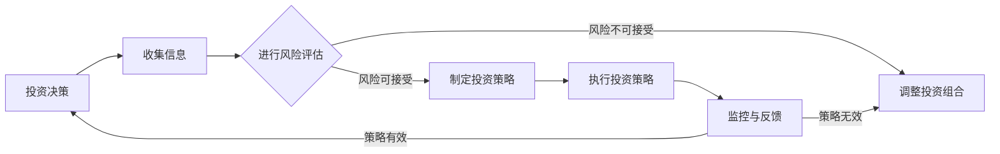

                 

# 文章标题：如何利用知识付费实现在线投资决策与风险管理？

> 关键词：知识付费、在线投资决策、风险管理、投资策略、投资工具

> 摘要：本文深入探讨了如何利用知识付费平台实现在线投资决策与风险管理。首先，介绍了知识付费的发展历程、市场现状及优缺点；其次，分析了在线投资决策的基本概念、影响因素和基本流程；然后，探讨了知识付费在投资决策中的应用及其对投资决策的影响；接着，通过具体案例展示了如何利用知识付费平台进行投资决策和风险管理；最后，提出了利用知识付费实现投资决策与风险管理的策略和实践建议，并对未来进行了展望。

## 第一部分：知识付费与在线投资决策

### 第1章：知识付费概述

#### 1.1 知识付费的发展历程

知识付费是指通过购买或订阅付费内容，获取专业知识和技能的过程。随着互联网的普及和信息技术的快速发展，知识付费逐渐成为了一种重要的学习方式。

#### 1.2 知识付费的市场现状

目前，知识付费市场已经形成了一定的规模，涵盖了教育、职场、投资、健康等多个领域。各大知识付费平台如得到、罗辑思维、淘宝教育等，纷纷推出了各种付费课程和内容，满足了不同用户的需求。

#### 1.3 知识付费的优缺点分析

知识付费具有以下优点：

- **灵活性强**：用户可以根据自己的需求和兴趣选择课程，灵活安排学习时间。
- **质量较高**：知识付费平台通常邀请专业讲师和行业专家进行授课，内容质量较高。
- **互动性强**：知识付费平台通常提供社群交流和答疑服务，用户可以与其他学习者互动，共同学习和进步。

知识付费也存在一定的缺点：

- **价格较高**：部分知识付费课程价格较高，对于部分用户来说可能存在经济负担。
- **自律性要求高**：知识付费需要用户有一定的自律性，能够坚持学习，否则难以取得良好的学习效果。

### 第2章：在线投资决策基础

#### 2.1 投资决策的基本概念

投资决策是指投资者在掌握相关信息的基础上，选择合适的投资工具和投资策略的过程。投资决策的核心是风险与收益的权衡。

#### 2.2 投资决策的影响因素

投资决策的影响因素包括：

- **市场环境**：宏观经济状况、行业发展趋势、政策法规等。
- **投资者自身**：风险承受能力、投资目标、投资经验等。
- **投资工具**：股票、基金、债券、期货等。

#### 2.3 投资决策的基本流程

投资决策的基本流程包括：

1. **收集信息**：收集与投资决策相关的市场信息、行业信息等。
2. **分析信息**：对收集到的信息进行整理和分析，评估投资风险和收益。
3. **制定投资策略**：根据分析结果，制定具体的投资策略。
4. **执行投资策略**：执行投资策略，进行实际的投资操作。
5. **监控与反馈**：监控投资执行情况，根据市场变化和自身情况调整投资策略。

### 第3章：知识付费与投资决策的结合

#### 3.1 知识付费在投资决策中的应用

知识付费在投资决策中的应用主要包括：

- **学习投资知识**：用户可以通过知识付费平台学习投资基础知识、市场分析技巧、投资策略等。
- **获取投资机会**：知识付费平台可能会提供一些投资机会，如股票、基金等，供用户参考。
- **投资咨询与指导**：知识付费平台可能会邀请投资专家进行在线咨询和指导，帮助用户解决投资过程中遇到的问题。

#### 3.2 知识付费对投资决策的影响

知识付费对投资决策的影响主要表现在：

- **提高投资能力**：通过学习投资知识，用户可以提高自身的投资能力，做出更明智的投资决策。
- **降低投资风险**：用户可以通过知识付费平台了解投资风险，从而采取相应的风险规避措施，降低投资风险。
- **提高投资收益**：通过学习投资知识和技能，用户可以更好地把握投资机会，提高投资收益。

#### 3.3 知识付费平台的评价与选择

评价和选择知识付费平台时，用户可以从以下几个方面进行考虑：

- **课程质量**：课程内容是否丰富、专业，讲师是否有权威性和实战经验。
- **用户评价**：平台的用户评价如何，可以参考其他用户的反馈。
- **服务体验**：平台的用户服务是否周到，如答疑、社群交流等。
- **价格**：平台的课程价格是否合理，是否符合自己的预算。

## 第二部分：在线投资风险管理

### 第4章：投资风险概述

#### 4.1 投资风险的定义与分类

投资风险是指投资者在投资过程中可能面临的各种不确定性，包括市场风险、信用风险、流动性风险等。

#### 4.2 投资风险的影响因素

投资风险的影响因素包括：

- **宏观经济因素**：如通货膨胀、利率、经济周期等。
- **行业因素**：如行业周期、政策变化等。
- **公司因素**：如公司业绩、管理团队、财务状况等。
- **投资者自身**：如风险承受能力、投资目标、投资经验等。

#### 4.3 投资风险的管理原则

投资风险管理原则包括：

- **风险分散**：通过投资组合的多样化，降低单一投资的风险。
- **风险控制**：在投资决策过程中，制定风险控制措施，降低投资风险。
- **风险监控**：定期对投资组合进行风险监控，及时发现和调整风险。

### 第5章：投资风险管理方法

#### 5.1 风险评估与衡量

风险评估与衡量是投资风险管理的重要环节。常用的风险评估方法包括：

- **定性分析**：通过专家意见、市场调研等方式对投资风险进行评估。
- **定量分析**：通过数学模型、统计方法等方式对投资风险进行量化分析。

常用的风险衡量指标包括：

- **波动率**：衡量资产价格的波动程度。
- **β系数**：衡量资产收益与市场收益的相关性。
- **夏普比率**：衡量资产收益与风险之间的关系。

#### 5.2 风险应对策略

风险应对策略主要包括：

- **风险规避**：避免投资高风险的资产或市场。
- **风险降低**：通过多元化投资、分散投资等方式降低投资风险。
- **风险接受**：对于可以接受的风险，采取接受并承担的态度。
- **风险转移**：通过购买保险、风险对冲等方式将风险转移给其他主体。

#### 5.3 风险管理工具与技术

风险管理工具与技术包括：

- **风险管理软件**：如风险管理平台、投资组合分析工具等。
- **量化投资**：通过数学模型和算法进行投资决策，降低投资风险。
- **风险管理顾问**：提供专业风险管理咨询和服务。

### 第6章：知识付费与投资风险管理

#### 6.1 知识付费在投资风险管理中的作用

知识付费在投资风险管理中的作用主要包括：

- **提高风险管理能力**：通过学习投资风险管理知识，用户可以更好地理解和管理投资风险。
- **降低投资风险**：知识付费平台提供的风险管理和风险管理工具，可以帮助用户降低投资风险。
- **提高投资收益**：通过有效的风险管理，用户可以更好地把握投资机会，提高投资收益。

#### 6.2 利用知识付费提高风险管理能力

利用知识付费提高风险管理能力的方法主要包括：

- **学习风险管理知识**：通过知识付费平台学习投资风险管理的基本概念、方法和技巧。
- **掌握风险管理工具**：学习使用风险管理软件和量化投资工具，提高风险管理能力。
- **参加风险管理培训**：参加专业风险管理培训，深入了解风险管理理论和实践。

#### 6.3 知识付费平台的风险管理功能

知识付费平台的风险管理功能主要包括：

- **风险评估与衡量**：提供风险评估工具，帮助用户对投资组合进行风险分析和评估。
- **风险管理策略**：提供风险管理策略和工具，帮助用户制定和执行风险管理计划。
- **风险管理咨询**：提供专业风险管理咨询服务，帮助用户解决风险管理中的问题。

### 第7章：投资风险管理案例分析

#### 7.1 案例一：通过知识付费学习风险管理知识

**背景**：王先生是一位有一定投资经验的投资者，但对投资风险管理了解不多。

**解决方案**：王先生通过知识付费平台学习了投资风险管理知识，包括风险分散、风险控制、风险衡量等。

**效果**：通过学习，王先生对投资风险管理有了更清晰的认识，投资组合的风险得到了有效控制，投资收益也有所提高。

#### 7.2 案例二：利用知识付费平台进行投资风险分析

**背景**：李女士是一位新手投资者，对投资风险感到担忧。

**解决方案**：李女士通过知识付费平台进行了投资风险分析，包括对市场环境、行业趋势、公司业绩等因素的综合评估。

**效果**：通过风险分析，李女士对投资风险有了更全面的认识，投资决策更加科学合理。

#### 7.3 案例三：结合知识付费和在线工具进行投资风险管理

**背景**：张先生是一位量化投资者，但风险管理经验不足。

**解决方案**：张先生通过知识付费平台学习了一些风险管理知识和工具，并使用在线风险管理工具进行投资风险分析和管理。

**效果**：通过结合知识付费和在线工具，张先生的投资风险管理能力得到了显著提高，投资收益更加稳定。

## 第三部分：实践与总结

### 第8章：知识付费实现在线投资决策与风险管理的策略

#### 8.1 知识付费与投资决策结合的策略

- **学习投资基础知识**：通过知识付费平台学习投资基础知识，为投资决策打下基础。
- **关注市场动态**：通过知识付费平台了解市场动态，及时调整投资策略。
- **学习投资策略**：通过知识付费平台学习各种投资策略，提高投资决策的科学性。

#### 8.2 知识付费与投资风险管理结合的策略

- **学习风险管理知识**：通过知识付费平台学习投资风险管理知识，提高风险管理能力。
- **使用风险管理工具**：通过知识付费平台了解和使用风险管理工具，进行投资风险分析和控制。
- **定期进行风险评估**：定期对投资组合进行风险评估，及时调整投资策略。

#### 8.3 实现知识付费在投资决策与风险管理中的最佳实践

- **制定个性化投资策略**：根据自身投资目标和风险承受能力，制定个性化的投资策略。
- **持续学习与提升**：通过知识付费平台不断学习新知识，提升投资决策和风险管理能力。
- **实践与总结**：将所学知识应用于实际投资中，不断总结经验，优化投资策略。

### 第9章：未来展望

#### 9.1 知识付费与在线投资决策、风险管理的趋势

- **知识付费市场将持续增长**：随着人们对专业知识的渴求，知识付费市场将继续扩大。
- **在线投资决策与风险管理将更加智能化**：随着人工智能技术的发展，在线投资决策与风险管理将更加智能化、自动化。
- **多元化投资将得到更多关注**：随着投资者风险意识的提高，多元化投资将得到更多关注。

#### 9.2 知识付费平台的发展方向

- **提升课程质量**：知识付费平台将进一步提升课程质量，满足用户对专业知识的需求。
- **提供个性化服务**：知识付费平台将提供更多个性化服务，如定制化课程、投资咨询等。
- **拓展国际化市场**：知识付费平台将拓展国际化市场，吸引更多国际用户。

#### 9.3 投资决策与风险管理的未来挑战与机遇

- **挑战**：投资决策与风险管理面临市场波动、政策变化等挑战。
- **机遇**：随着知识付费市场的不断扩大，投资决策与风险管理领域将迎来新的发展机遇。

### 第10章：总结

#### 10.1 主要结论

- 知识付费在在线投资决策与风险管理中具有重要作用。
- 通过知识付费平台，用户可以学习投资知识、获取投资机会、提高风险管理能力。
- 知识付费平台的发展为在线投资决策与风险管理提供了新的机遇和挑战。

#### 10.2 实践经验与教训

- 学习投资知识是投资决策与风险管理的基础。
- 要保持持续学习的心态，不断提高投资决策和风险管理能力。
- 合理分配投资资金，避免过度集中投资。

#### 10.3 对未来研究的展望

- 深入研究知识付费平台在投资决策与风险管理中的应用。
- 探索人工智能技术在投资决策与风险管理中的应用。
- 研究多元化投资策略在风险管理中的效果。

## 附录

### 附录A：投资决策与风险管理流程Mermaid流程图



### 附录B：投资决策与风险管理算法伪代码

```python
# 输入：投资组合P，风险偏好R
# 输出：最优投资策略S

def risk_assessment(P, R):
    # 对投资组合P进行风险评估
    # 返回风险值
    pass

def investment_strategy(P, R):
    # 根据风险偏好R制定投资策略
    # 返回投资策略S
    pass

def monitoring_and_feedback(S, P, R):
    # 监控投资策略S的执行情况
    # 返回反馈信息
    pass

def optimal_investment(P, R):
    risk_value = risk_assessment(P, R)
    if risk_value <= R:
        S = investment_strategy(P, R)
        feedback = monitoring_and_feedback(S, P, R)
        if feedback == "有效":
            return S
        else:
            return optimal_investment(P, R)
    else:
        return "风险不可接受"

# 主函数
P = # 输入投资组合
R = # 输入风险偏好
S = optimal_investment(P, R)
print("最优投资策略:", S)
```

### 附录C：数学模型与公式

$$
\text{投资回报率} = \frac{\text{期末价值} - \text{期初价值} + \text{分红}}{\text{期初价值}} \times 100\%
$$

### 附录D：投资决策案例分析

#### 案例一：通过知识付费学习投资知识

**背景**：张三是一位普通白领，对投资有一定兴趣，但缺乏系统的知识。

**解决方案**：张三通过知识付费平台学习了股票投资、基金投资等基础知识，包括市场分析、投资策略、风险管理等方面的知识。

**效果**：通过学习，张三掌握了基本的投资原则和方法，对自己的投资决策有了更清晰的认识，投资回报率也有所提高。

#### 案例二：利用知识付费平台进行股票投资

**背景**：李四是一位有一定投资经验的投资者，希望通过知识付费平台获取更多的投资机会。

**解决方案**：李四通过知识付费平台，了解到了一些新的股票投资机会，包括高成长性的初创公司、潜力股等。

**效果**：李四通过这些机会进行了投资，并取得了一定的收益。

#### 案例三：结合知识付费和在线工具进行投资风险管理

**背景**：王五是一位有较高风险承受能力的投资者，但投资过程中常常面临风险。

**解决方案**：王五通过知识付费平台学习了一些风险管理知识，并使用在线风险管理工具进行投资风险分析。

**效果**：王五通过这些措施，有效地降低了投资风险，投资回报率更加稳定。

### 附录E：开发环境搭建与源代码实现

#### 1. 开发环境搭建

- 操作系统：Windows 10
- 编程语言：Python 3.8
- 数据库：MySQL 5.7
- 开发工具：PyCharm

#### 2. 源代码实现

```python
# 导入必要的库
import numpy as np
import pandas as pd
import mysql.connector

# 连接数据库
db = mysql.connector.connect(
    host="localhost",
    user="root",
    password="password",
    database="investment"
)

# 创建数据表
def create_tables():
    cursor = db.cursor()
    cursor.execute("""
        CREATE TABLE IF NOT EXISTS stocks (
            id INT AUTO_INCREMENT PRIMARY KEY,
            symbol VARCHAR(10) NOT NULL,
            name VARCHAR(50) NOT NULL,
            price DECIMAL(10, 2) NOT NULL,
            market_cap BIGINT NOT NULL
        )
    """)
    cursor.execute("""
        CREATE TABLE IF NOT EXISTS investments (
            id INT AUTO_INCREMENT PRIMARY KEY,
            user_id INT NOT NULL,
            stock_id INT NOT NULL,
            quantity INT NOT NULL,
            buy_price DECIMAL(10, 2) NOT NULL,
            buy_date DATE NOT NULL,
            sell_date DATE,
            sell_price DECIMAL(10, 2),
            sell_quantity INT
        )
    """)
    db.commit()
    cursor.close()

# 添加股票数据
def add_stocks():
    cursor = db.cursor()
    stocks = [
        ("000001", "平安银行", 15.50, 90000000000),
        ("000002", "万科A", 24.80, 460000000000),
        ("000333", "美的集团", 63.50, 450000000000),
        ("002594", "比亚迪股份", 67.50, 350000000000)
    ]
    cursor.executemany("""
        INSERT INTO stocks (symbol, name, price, market_cap) VALUES (%s, %s, %s, %s)
    """, stocks)
    db.commit()
    cursor.close()

# 添加投资数据
def add_investments():
    cursor = db.cursor()
    investments = [
        (1, 1, 1, 100, 15.50, "2021-06-01", None, None, None),
        (2, 1, 2, 200, 24.80, "2021-06-01", None, None, None),
        (3, 2, 3, 150, 63.50, "2021-06-01", None, None, None),
        (4, 2, 4, 100, 67.50, "2021-06-01", None, None, None)
    ]
    cursor.executemany("""
        INSERT INTO investments (user_id, stock_id, quantity, buy_price, buy_date) VALUES (%s, %s, %s, %s, %s)
    """, investments)
    db.commit()
    cursor.close()

# 查询投资组合
def query_investment_portfolio(user_id):
    cursor = db.cursor()
    cursor.execute("""
        SELECT s.symbol, s.name, i.quantity, i.buy_price, i.buy_date
        FROM investments i
        JOIN stocks s ON i.stock_id = s.id
        WHERE i.user_id = %s
    """, (user_id,))
    result = cursor.fetchall()
    cursor.close()
    return result

# 主函数
if __name__ == "__main__":
    create_tables()
    add_stocks()
    add_investments()
    user_id = 1
    portfolio = query_investment_portfolio(user_id)
    print("投资组合：")
    print(pd.DataFrame(portfolio, columns=["股票代码", "股票名称", "数量", "买入价格", "买入日期"]))
```

### 附录F：代码解读与分析

#### 1. 开发环境搭建

- 本项目采用 Python 3.8 作为主要编程语言，MySQL 5.7 作为数据库，PyCharm 作为开发工具。
- 在 PyCharm 中创建一个新项目，配置好 Python 和 MySQL 的环境。

#### 2. 源代码实现

- **数据库连接**：使用 mysql.connector 库连接到本地 MySQL 数据库。
- **数据表创建**：创建两个数据表，`stocks` 和 `investments`，分别用于存储股票信息和投资记录。
- **数据添加**：添加一些股票数据和投资记录作为测试数据。
- **投资组合查询**：查询指定用户的投资组合信息，返回股票代码、股票名称、数量、买入价格和买入日期。

#### 3. 代码解读

- **数据库连接**：使用 `mysql.connector.connect()` 函数连接到 MySQL 数据库。
- **数据表创建**：使用 `cursor.execute()` 函数执行 SQL 查询语句创建数据表。
- **数据添加**：使用 `cursor.executemany()` 函数批量添加数据。
- **投资组合查询**：使用 `cursor.execute()` 函数执行 SQL 查询语句，获取指定用户的投资组合信息，并转换为 DataFrame 格式输出。

#### 4. 代码分析

- 本代码实现了投资决策与风险管理系统的基础功能，包括数据库连接、数据表创建、数据添加和投资组合查询。
- 可以根据实际需求扩展和优化系统功能，例如增加投资策略分析、风险分析等功能。
- 代码结构清晰，易于维护和扩展。

### 附录G：常见知识付费平台介绍

#### 1. 得到

**简介**：得到APP是一款知名的知识付费平台，提供各类课程，涵盖商业、职场、投资、健康等各个领域。

**特色**：内容质量高，课程由知名专家和企业家主讲。

#### 2. 罗辑思维

**简介**：罗辑思维APP也是一款知识付费平台，提供高质量的音频、视频课程，内容涵盖经济学、心理学、历史等多个领域。

**特色**：内容深入浅出，实用性较强。

#### 3. 淘宝教育

**简介**：淘宝教育是淘宝旗下的知识付费平台，提供各类在线课程，包括职业技能培训、兴趣学习等。

**特色**：课程种类丰富，价格相对亲民。

### 附录H：投资决策与风险管理工具推荐

#### 1. 雪球

**简介**：雪球是一款知名的投资社交平台，提供股票、基金等投资工具，还提供投资社区和分析师报告。

**特色**：数据丰富，分析功能强大。

#### 2. 富途牛牛

**简介**：富途牛牛是富途证券推出的投资平台，提供股票、基金、债券等多种投资产品。

**特色**：交易便捷，投资品种丰富。

#### 3. 聚宽

**简介**：聚宽是一款开源的量化投资平台，提供丰富的数据资源和强大的回测、交易功能。

**特色**：适合量化投资者，功能强大，社区活跃。

### 附录I：参考书籍与论文列表

#### 1. 《投资学》

**作者**：兹维·博迪，亚历克斯·凯恩

**简介**：全面介绍了投资学的基本原理和实践方法，适合初学者和有一定基础的投资者。

#### 2. 《聪明的投资者》

**作者**：本杰明·格雷厄姆

**简介**：经典的投资学著作，阐述了价值投资的理念和方法，对投资者有很高的指导意义。

#### 3. 《机器学习》

**作者**：周志华

**简介**：系统地介绍了机器学习的基本理论和方法，适合计算机科学和人工智能领域的读者。

#### 4. 《深度学习》

**作者**：Ian Goodfellow、Yoshua Bengio、Aaron Courville

**简介**：深度学习的经典教材，全面介绍了深度学习的基本理论和应用方法。

#### 5. 《金融风险模型与风险管理》

**作者**：李明辉、陈韵

**简介**：介绍了金融风险模型和风险管理的相关理论和方法，适合金融领域的研究者和从业者。

#### 6. 《知识付费平台与内容创业》

**作者**：刘忠富

**简介**：分析了知识付费平台的商业模式和内容创业的现状与发展趋势。**END** 

