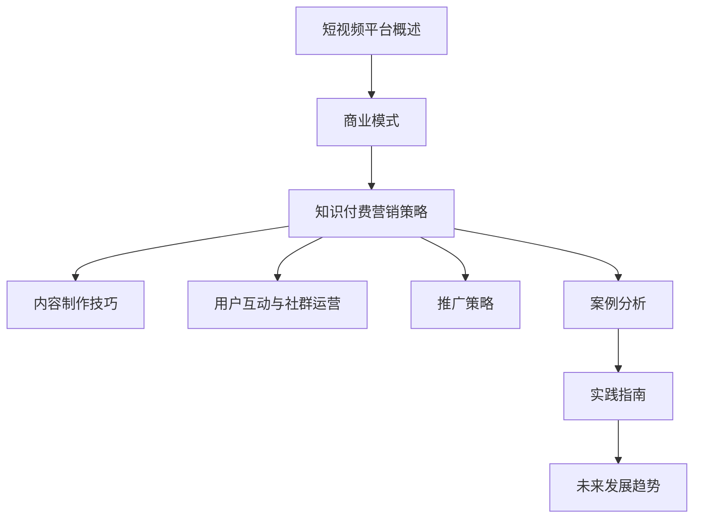

                 

## 文章标题

《如何利用短视频平台进行知识付费营销》

> 关键词：短视频平台、知识付费、营销策略、内容制作、用户互动、案例分析、未来趋势

> 摘要：本文旨在探讨如何利用短视频平台进行知识付费营销。通过对短视频平台的发展、知识付费模式、营销策略、内容制作技巧、用户互动与社群运营、推广策略以及成功案例的深入分析，为读者提供一份详尽的短视频知识付费营销指南。

----------------------------------------------------------------

### 《如何利用短视频平台进行知识付费营销》目录大纲

#### 第一部分：短视频平台概述

**第1章：短视频平台的发展与现状**

- **1.1 短视频平台的定义与分类**
- **1.2 我国短视频平台的发展历程**
- **1.3 短视频平台的用户特征与需求**

**第2章：短视频平台的商业模式**

- **2.1 短视频平台的盈利模式**
- **2.2 知识付费在短视频平台的应用**
- **2.3 短视频平台的知识付费模式分析**

#### 第二部分：知识付费营销策略

**第3章：知识付费营销的核心概念**

- **3.1 营销目标设定**
- **3.2 受众定位与分析**
- **3.3 内容策略制定**

**第4章：短视频内容制作技巧**

- **4.1 短视频内容类型及选择**
- **4.2 视频拍摄与剪辑技巧**
- **4.3 视频标题、封面与标签策略**

**第5章：用户互动与社群运营**

- **5.1 用户评论与反馈处理**
- **5.2 社群互动策略**
- **5.3 用户增长与留存策略**

**第6章：短视频平台推广策略**

- **6.1 自媒体营销**
- **6.2 KOL营销**
- **6.3 短视频广告投放策略**

**第7章：案例分析：成功知识付费短视频营销案例解析**

- **7.1 案例背景介绍**
- **7.2 案例分析**
- **7.3 案例启示与经验总结**

#### 第三部分：实践与总结

**第8章：知识付费营销实践指南**

- **8.1 营销流程与执行步骤**
- **8.2 风险与应对策略**
- **8.3 数据分析与优化**

**第9章：短视频知识付费营销的未来发展趋势**

- **9.1 技术发展对短视频知识付费营销的影响**
- **9.2 市场竞争态势分析**
- **9.3 未来发展趋势预测**

**附录：短视频平台与知识付费营销资源汇总**

- **附录1：常用短视频平台介绍**
- **附录2：知识付费工具与资源推荐**
- **附录3：短视频知识付费营销相关书籍与文章推荐**

### 核心概念与联系

为了更好地理解短视频平台知识付费营销的核心概念，我们可以通过以下 Mermaid 流程图来展示它们之间的联系。

该流程图清晰地展示了短视频平台知识付费营销的核心环节，从平台概述、商业模式、营销策略、内容制作、用户互动、推广策略到案例分析，最终形成实践指南并展望未来发展趋势。每一个环节都是相互关联的，共同构成了一个完整的短视频知识付费营销体系。

----------------------------------------------------------------

### 第一部分：短视频平台概述

#### 第1章：短视频平台的发展与现状

##### 1.1 短视频平台的定义与分类

短视频平台是指基于互联网技术，提供短视频内容创作、发布和观看服务的平台。这些平台通过移动应用的形式，让用户能够随时随地创作、上传和分享短视频。短视频平台的定义和分类可以从多个角度来理解。

从内容类型来看，短视频平台可以分为以下几类：

- **娱乐类**：这类短视频平台主要提供搞笑、才艺、美妆等娱乐性质的内容，如抖音（国际版TikTok）、快手等。
- **教育类**：这类短视频平台侧重于知识传授和技能学习，如哔哩哔哩（Bilibili）、知乎等。
- **生活类**：这类短视频平台主要提供生活技巧、美食、旅游等内容，如小红书、美拍等。
- **资讯类**：这类短视频平台侧重于提供新闻、时事、财经等资讯，如头条、网易号等。

从商业模式来看，短视频平台可以分为以下几种类型：

- **广告模式**：平台通过展示广告获得收益，如抖音、快手等。
- **付费模式**：平台提供付费内容，用户购买后才能观看，如知乎Live、网易云课堂等。
- **电商模式**：平台通过短视频进行商品推广，实现商品销售，如淘宝直播、京东短视频等。

##### 1.2 我国短视频平台的发展历程

我国短视频平台的发展历程可以追溯到2010年左右，当时以微视、优酷等为代表的短视频平台开始兴起。然而，真正的爆发期是在2016年以后，这一时期涌现出了许多代表性的短视频平台，如抖音、快手等。

- **2016年**：抖音上线，标志着短视频平台进入高速发展阶段。同年，快手也完成了新一轮融资，进一步扩大了市场份额。
- **2017年**：短视频平台迎来爆发期，各类短视频应用层出不穷，用户数量迅速增长。
- **2018年**：短视频平台开始向多元化方向发展，不仅有娱乐类内容，还涉及教育、生活、资讯等多个领域。
- **2019年**：短视频平台市场规模进一步扩大，用户数量和时长持续增长。同时，短视频平台开始探索知识付费模式，为用户提供更多有价值的内容。

##### 1.3 短视频平台的用户特征与需求

短视频平台的用户特征和需求随着平台的发展也在不断变化。根据相关数据显示，目前短视频平台的用户主要集中在以下几类人群：

- **年轻用户**：短视频平台的用户年龄普遍较低，主要集中在18-35岁之间，这部分用户具有较高的消费能力和活跃度。
- **都市白领**：短视频平台为都市白领提供了消遣和放松的方式，他们经常利用碎片化时间观看短视频。
- **三四五线城市用户**：随着移动互联网的普及，三四五线城市用户也逐渐成为短视频平台的重要用户群体。
- **知识需求用户**：随着短视频平台的内容日益丰富，越来越多的用户开始关注知识类内容，如技能培训、职业发展等。

用户需求主要体现在以下几个方面：

- **娱乐需求**：用户希望通过观看短视频获取快乐和放松。
- **知识需求**：用户希望通过短视频学习新知识和技能。
- **社交需求**：用户希望通过短视频建立社交联系，分享生活体验。
- **消费需求**：用户希望通过短视频发现和购买商品。

综上所述，短视频平台的发展与现状为我们提供了丰富的营销机遇。了解短视频平台的定义、分类、发展历程以及用户特征与需求，将有助于我们更好地利用短视频平台进行知识付费营销。

----------------------------------------------------------------

### 第二部分：知识付费营销策略

#### 第3章：知识付费营销的核心概念

##### 3.1 营销目标设定

在短视频平台进行知识付费营销，首先需要明确营销目标。营销目标设定应遵循以下原则：

1. **明确性**：目标应具体、可衡量，避免模糊不清。
2. **可达性**：目标应具有实际可行性，符合现实条件。
3. **相关性**：目标应与整体营销战略相一致，有助于实现企业长期发展。

常见的营销目标包括：

- **用户增长**：通过吸引新用户，增加平台活跃用户数。
- **内容销量**：提升付费内容的销量，增加平台收入。
- **品牌认知度**：提高品牌在目标受众中的知名度。
- **用户粘性**：增强用户对平台的忠诚度，提高用户留存率。

##### 3.2 受众定位与分析

在进行知识付费营销时，受众定位与分析至关重要。以下是受众定位与分析的步骤：

1. **市场调研**：通过问卷调查、用户访谈等方式，了解目标受众的基本情况，如年龄、性别、职业、收入水平等。
2. **用户画像**：根据市场调研结果，绘制用户画像，明确目标受众的特征和需求。
3. **受众细分**：将目标受众分为多个群体，如学生、职场新人、专业人士等，以便制定有针对性的营销策略。
4. **数据分析**：利用大数据技术，分析用户行为数据，如观看时长、点赞数、分享数等，了解用户的兴趣和行为模式。

##### 3.3 内容策略制定

内容策略制定是知识付费营销的核心。以下是内容策略制定的步骤：

1. **内容定位**：根据受众定位和分析结果，明确内容主题和方向，如职业技能培训、兴趣特长培养等。
2. **内容形式**：结合短视频特点，选择合适的内容形式，如教程、讲座、案例分析等。
3. **内容规划**：制定内容发布计划，确保内容的持续性和连贯性，避免用户流失。
4. **内容优化**：根据用户反馈和数据分析结果，不断优化内容，提高用户满意度和转化率。

#### 实践与总结

在设定营销目标时，应充分考虑短视频平台的用户特征和需求，确保目标的明确性和可达性。在进行受众定位与分析时，要充分利用市场调研和数据分析工具，深入挖掘用户需求和兴趣点。在制定内容策略时，要紧跟用户需求，注重内容的质量和创新性，以提高用户满意度和转化率。

通过以上步骤，我们可以为短视频平台的知识付费营销制定一份科学、有效的策略，助力企业在竞争激烈的市场中脱颖而出。

----------------------------------------------------------------

### 第4章：短视频内容制作技巧

##### 4.1 短视频内容类型及选择

短视频内容类型多样，选择适合的内容类型对于吸引目标受众至关重要。以下是几种常见的短视频内容类型及其特点：

- **教育型内容**：这类内容主要通过短视频传授知识、技能和经验，如课程教学、职业技能培训等。教育型内容具有较高的知识价值和实用性，适合追求自我提升和职业发展的受众。
- **娱乐型内容**：这类内容以娱乐为主，如搞笑短片、才艺表演、美食制作等。娱乐型内容能够迅速吸引用户的注意力，提高观看时长和互动率。
- **生活分享型内容**：这类内容通过分享日常生活、旅行体验等，展现个人生活和价值观，如旅游攻略、美妆教程、家居装饰等。生活分享型内容能够建立用户之间的情感连接，增强用户粘性。
- **资讯型内容**：这类内容提供新闻、时事、财经等资讯，如新闻简报、行业动态等。资讯型内容能够满足用户获取信息的需求，提高用户对平台的依赖度。

在选择内容类型时，应考虑以下因素：

- **受众需求**：根据受众定位和分析结果，选择受众感兴趣的内容类型。
- **平台特点**：不同短视频平台用户群体和内容风格不同，应选择与平台特点相符的内容类型。
- **个人特长**：根据内容创作者的个人特长和经验，选择能够充分发挥自身优势的内容类型。

##### 4.2 视频拍摄与剪辑技巧

短视频的拍摄与剪辑技巧对于提高视频质量和用户体验至关重要。以下是几个关键点：

- **画面构图**：合理利用画面空间，遵循三分法、对称构图等原则，确保画面美观、均衡。
- **光线与色彩**：充分利用自然光，避免逆光和暗光场景；合理运用色彩搭配，提高画面层次感。
- **音效处理**：确保音频清晰、无噪音，必要时添加背景音乐和音效，增强观看体验。
- **拍摄角度**：灵活运用不同角度，展示内容的多样性和吸引力。
- **剪辑节奏**：通过剪辑技巧调整视频节奏，使视频紧凑、流畅，避免冗余和拖沓。

以下是几种常用的剪辑技巧：

- **切换**：合理使用切换效果，如淡入淡出、滑动切换等，使视频画面过渡自然。
- **叠加**：通过叠加图像、文字、动画等元素，增加视频的视觉效果和趣味性。
- **音效**：利用音效增强视频氛围，如笑声、掌声、音乐等。
- **特效**：使用视频编辑软件提供的特效功能，如滤镜、转场、动画等，丰富视频内容。

##### 4.3 视频标题、封面与标签策略

视频标题、封面和标签是吸引用户点击的重要因素。以下是几个关键点：

- **标题**：简洁明了，突出视频核心内容和价值，避免夸张和误导。
- **封面**：选择高清、吸引人的封面图片，突出视频主题，提高点击率。
- **标签**：合理使用标签，涵盖视频关键词，提高视频在平台上的搜索和推荐概率。

以下是一些建议：

- **关键词研究**：通过分析同类视频标题和标签，了解热门关键词和趋势，为视频制定合适的标签。
- **创意标题**：结合热点事件、用户兴趣和视频内容，创造有趣、有吸引力的标题。
- **封面优化**：封面图片要与视频内容相关，避免使用模糊、低质量图片。

通过以上技巧，我们可以制作出高质量、具有吸引力的短视频内容，提高用户满意度和转化率。

----------------------------------------------------------------

### 第5章：用户互动与社群运营

##### 5.1 用户评论与反馈处理

用户评论与反馈是短视频平台知识付费营销的重要环节。以下是用户评论与反馈处理的关键点：

1. **及时回复**：及时回复用户的评论和反馈，展示企业的关注和诚意，增强用户满意度和忠诚度。
2. **积极引导**：针对负面评论，采取积极引导策略，化解用户的不满情绪，避免负面舆论的扩散。
3. **数据分析**：收集和分析用户反馈，了解用户需求和痛点，优化内容和服务。
4. **互动激励**：通过互动激励措施，如点赞、评论奖励等，鼓励用户积极参与互动，提高社区活跃度。

##### 5.2 社群互动策略

社群互动策略旨在增强用户对平台的依赖和忠诚度。以下是几个关键点：

1. **建立社群**：根据用户需求和兴趣，建立不同类型的社群，如学习交流群、兴趣爱好群等。
2. **内容分享**：鼓励用户在社群中分享知识和经验，提高社群的活跃度和价值。
3. **活动策划**：定期举办线上或线下活动，如讲座、培训、沙龙等，增加用户粘性。
4. **互动激励**：通过活动奖励、积分兑换等机制，激发用户参与社群互动的积极性。

##### 5.3 用户增长与留存策略

用户增长与留存策略是短视频平台知识付费营销的关键。以下是几个关键点：

1. **吸引新用户**：通过广告投放、社交媒体宣传、合作伙伴推广等手段，吸引新用户关注和注册。
2. **优化用户体验**：持续优化平台功能和服务，提高用户满意度，降低用户流失率。
3. **用户留存激励**：通过优惠券、会员制度、专属课程等手段，提高用户留存率。
4. **数据分析**：收集和分析用户行为数据，了解用户需求和偏好，为用户提供个性化推荐和服务。

通过以上策略，我们可以有效管理用户互动，提升社群活跃度，实现用户增长与留存，为短视频平台的知识付费营销奠定坚实基础。

----------------------------------------------------------------

### 第6章：短视频平台推广策略

##### 6.1 自媒体营销

自媒体营销是指通过自有渠道（如微信公众号、微博、知乎等）进行内容创作和传播，以提升品牌知名度和用户转化。以下是自媒体营销的关键策略：

1. **内容创作**：结合短视频内容特点，创作有趣、有价值、有创意的图文或视频内容，吸引用户关注。
2. **渠道选择**：根据目标受众的偏好，选择合适的自媒体平台进行内容发布，如图文类平台适合发布教程、心得，视频类平台适合发布短视频。
3. **互动互动**：积极与用户互动，回应用户评论和私信，增强用户黏性。
4. **跨平台运营**：在多个自媒体平台同步发布内容，扩大传播范围，提高品牌知名度。

##### 6.2 KOL营销

KOL（Key Opinion Leader）营销是指通过与具有影响力的意见领袖合作，借助他们的粉丝群体传播品牌信息。以下是KOL营销的关键策略：

1. **选择合适的KOL**：根据品牌定位和目标受众，选择具有相关领域影响力的KOL，如行业专家、网红、自媒体大号等。
2. **内容共创**：与KOL合作创作内容，利用他们的影响力吸引目标受众，提高内容传播效果。
3. **互动互动**：与KOL保持密切互动，建立长期合作关系，共同提升品牌影响力。
4. **监测效果**：跟踪KOL营销的效果，如关注人数、点赞数、评论数等，及时调整策略。

##### 6.3 短视频广告投放策略

短视频广告投放是提升品牌曝光和转化的重要手段。以下是短视频广告投放的关键策略：

1. **定位目标受众**：根据受众画像和需求，精准定位目标受众，提高广告投放的精准度。
2. **广告形式选择**：根据广告目标，选择合适的广告形式，如视频广告、互动广告、信息流广告等。
3. **广告内容创作**：创作有趣、有创意、有吸引力的广告内容，提高用户点击率和转化率。
4. **投放时间和地域**：根据目标受众的行为习惯和地域分布，选择最佳的广告投放时间和地域，提高广告效果。
5. **监测和优化**：实时监测广告投放效果，如点击率、转化率、投放成本等，及时调整广告策略。

通过以上推广策略，我们可以有效提升短视频平台的知识付费营销效果，实现品牌知名度和用户转化率的提升。

----------------------------------------------------------------

### 第7章：案例分析：成功知识付费短视频营销案例解析

#### 7.1 案例背景介绍

本案例将分析一家知名教育机构在抖音平台进行知识付费营销的成功案例。该教育机构致力于提供职场技能培训，如PPT制作、时间管理、沟通技巧等。在短视频平台上，该机构通过创意内容制作和精准营销，取得了显著的成果。

#### 7.2 案例分析

**1. 内容策略**

该教育机构在内容创作上采取了以下策略：

- **主题明确**：每条短视频围绕一个具体的职场技能主题，如“5分钟学会高效PPT排版技巧”。
- **实用性强**：内容注重实用性和实操性，提供具体的操作步骤和技巧，帮助用户快速掌握知识。
- **互动性**：鼓励用户在评论区提问，针对用户的问题进行后续内容创作，提高用户参与度。

**2. 用户互动**

该教育机构注重与用户的互动，通过以下方式提升用户满意度：

- **及时回复**：工作人员在评论区及时回复用户提问，提供解答和指导。
- **点赞与评论激励**：通过点赞和评论激励用户互动，提高评论区的活跃度。
- **定期举办互动活动**：如每周一次的“问答时间”，邀请用户提出问题，机构专家进行解答。

**3. 推广策略**

在推广策略上，该教育机构采取了以下措施：

- **KOL合作**：与行业内的知名KOL合作，借助他们的粉丝群体扩大品牌影响力。
- **广告投放**：在抖音平台进行精准广告投放，针对目标受众进行定向推广。
- **内容传播**：利用自媒体渠道，如微信公众号、微博等，将短视频内容进行二次传播，扩大覆盖范围。

#### 7.3 案例启示与经验总结

**1. 内容为王**

优质的内容是知识付费营销的核心。短视频内容应具备明确的主题、实用的技巧和互动性，以提高用户满意度和转化率。

**2. 用户互动**

与用户的互动是提高用户满意度和忠诚度的关键。及时回复用户提问、提供专业解答和鼓励用户参与互动，有助于建立良好的用户关系。

**3. 精准营销**

精准的推广策略是提升品牌曝光和用户转化的关键。通过KOL合作、广告投放和内容传播，实现精准定位和广泛覆盖。

**4. 数据分析**

持续进行数据分析，了解用户需求和偏好，优化内容策略和推广策略，以提高营销效果。

通过以上案例分析，我们可以得出结论：成功知识付费短视频营销需要内容为王、用户互动、精准营销和数据分析，这些策略共同作用，为短视频平台的知识付费营销提供了有力支持。

----------------------------------------------------------------

### 第三部分：实践与总结

#### 第8章：知识付费营销实践指南

##### 8.1 营销流程与执行步骤

知识付费营销实践需要遵循以下流程和执行步骤：

1. **需求分析**：通过市场调研和数据分析，明确目标受众的需求和痛点。
2. **内容策划**：根据需求分析结果，制定内容策划方案，包括内容主题、形式、发布计划等。
3. **内容制作**：按照策划方案，制作高质量的短视频内容，确保内容具有实用性和吸引力。
4. **发布与推广**：将内容发布到短视频平台，并通过广告投放、KOL合作、自媒体传播等方式进行推广。
5. **用户互动**：积极与用户互动，回复用户提问，收集反馈，优化内容和服务。
6. **数据分析**：收集用户行为数据，分析营销效果，优化营销策略。
7. **持续优化**：根据数据分析结果，不断调整和优化内容、推广策略，提高用户满意度和转化率。

##### 8.2 风险与应对策略

知识付费营销过程中可能面临以下风险：

1. **内容同质化**：应对策略：通过差异化内容策划和创意制作，提高内容的独特性和吸引力。
2. **用户流失**：应对策略：通过用户互动、社群运营和用户留存激励，提高用户满意度和忠诚度。
3. **营销效果不佳**：应对策略：优化广告投放策略、内容推广渠道和用户互动方式，提高营销效果。
4. **数据隐私问题**：应对策略：加强数据安全保护措施，确保用户数据的安全和隐私。

##### 8.3 数据分析与优化

数据分析是知识付费营销的核心环节。以下是数据分析与优化的关键步骤：

1. **数据收集**：收集用户行为数据，如观看时长、点赞数、评论数、分享数等。
2. **数据清洗**：对收集到的数据进行清洗和整理，确保数据质量。
3. **数据可视化**：使用可视化工具，如图表、仪表盘等，将数据转化为易于理解的图形化展示。
4. **数据分析**：对数据进行分析，识别用户需求和偏好，优化内容策划和推广策略。
5. **A/B测试**：通过A/B测试，验证不同策略的效果，选出最佳方案。
6. **持续优化**：根据数据分析结果和A/B测试结果，不断调整和优化内容、推广策略，提高用户满意度和转化率。

通过以上实践指南，我们可以为短视频平台的知识付费营销提供有力支持，实现营销目标的有效达成。

----------------------------------------------------------------

### 第9章：短视频知识付费营销的未来发展趋势

#### 9.1 技术发展对短视频知识付费营销的影响

随着科技的快速发展，短视频知识付费营销也将受到以下技术的影响：

1. **人工智能与大数据**：人工智能和大数据技术的应用，将使短视频平台能够更精准地分析用户行为，提供个性化推荐，提高营销效果。
2. **5G网络**：5G网络的普及将提高短视频的观看体验，减少卡顿和加载时间，为知识付费营销提供更好的基础设施。
3. **虚拟现实（VR）与增强现实（AR）**：VR和AR技术的应用，将使短视频内容更加生动、互动性更强，提高用户的参与度和沉浸感。
4. **区块链技术**：区块链技术可以确保用户数据的安全和隐私，提高用户对知识付费平台的信任度。

#### 9.2 市场竞争态势分析

短视频知识付费市场竞争激烈，主要体现在以下几个方面：

1. **平台竞争**：抖音、快手、哔哩哔哩等主流短视频平台不断加大知识付费领域的投入，争夺市场份额。
2. **内容竞争**：优质的内容创作者和机构不断涌现，竞争激烈，平台需要通过优化用户体验和内容推荐机制，提高用户粘性。
3. **技术竞争**：平台之间的技术竞争，如推荐算法、用户数据分析等，将决定谁能更好地满足用户需求，提高营销效果。

#### 9.3 未来发展趋势预测

基于当前的技术发展和市场竞争态势，短视频知识付费营销将呈现以下发展趋势：

1. **个性化推荐**：随着人工智能和大数据技术的发展，短视频平台将实现更加精准的个性化推荐，提高用户满意度和转化率。
2. **内容多元化**：短视频平台将提供更多元化的知识内容，如职业发展、兴趣爱好、健康生活等，满足不同用户的需求。
3. **互动性增强**：短视频平台将加强用户互动，如直播教学、社群交流等，提高用户的参与度和忠诚度。
4. **跨界合作**：短视频平台将与其他领域的企业和机构进行跨界合作，如电商、游戏等，实现共赢发展。

通过以上分析，我们可以预见，短视频知识付费营销将在未来继续快速发展，为用户和企业带来更多机遇和挑战。

----------------------------------------------------------------

### 附录：短视频平台与知识付费营销资源汇总

#### 附录1：常用短视频平台介绍

1. **抖音（Douyin）**：全球最受欢迎的短视频平台之一，用户数量庞大，内容丰富多样。
2. **快手（Kuaishou）**：以农村和三四五线城市用户为主的短视频平台，用户活跃度高。
3. **哔哩哔哩（Bilibili）**：以二次元文化为主的短视频平台，用户群体年轻，具有较高消费能力。
4. **小红书（Xiaohongshu）**：以生活分享为主的短视频平台，用户注重品质生活。

#### 附录2：知识付费工具与资源推荐

1. **腾讯课堂**：提供丰富的在线课程，涵盖职业技能、兴趣爱好等多个领域。
2. **网易云课堂**：提供专业的在线学习资源，包括编程、设计、语言等多个领域。
3. **知乎Live**：知名问答社区，提供高质量的语音直播课程。
4. **得到App**：提供专业的知识付费内容，涵盖商业、投资、科技等多个领域。

#### 附录3：短视频知识付费营销相关书籍与文章推荐

1. **《短视频营销：实战策略与案例分析》**：详细介绍了短视频营销的理论和实践方法。
2. **《短视频运营实战：从入门到精通》**：全面讲解了短视频平台的运营技巧和策略。
3. **《知识付费：打造个人品牌，实现财富增长》**：探讨知识付费的发展趋势和实战案例。
4. **《抖音运营攻略：打造爆款短视频的秘诀》**：提供了丰富的抖音运营经验和技巧。

通过以上资源汇总，读者可以更全面地了解短视频平台与知识付费营销的相关知识和实践方法，为自身的营销工作提供有力支持。

----------------------------------------------------------------

### 总结

本文从短视频平台概述、知识付费营销策略、短视频内容制作技巧、用户互动与社群运营、短视频平台推广策略以及成功案例解析等多个角度，详细探讨了如何利用短视频平台进行知识付费营销。通过本文的阅读，读者可以：

1. **了解短视频平台的发展历程和用户特征**：认识短视频平台的基本概念和分类，了解我国短视频平台的发展历程以及不同类型短视频平台的用户特征与需求。
2. **掌握知识付费营销的核心概念和策略**：明确营销目标设定、受众定位与分析、内容策略制定等核心概念，并了解如何通过内容制作、用户互动和社群运营等策略，提升短视频知识付费营销的效果。
3. **学习短视频内容制作技巧**：掌握短视频内容类型及选择、视频拍摄与剪辑技巧、视频标题、封面与标签策略，提高短视频内容的吸引力。
4. **了解短视频平台推广策略**：掌握自媒体营销、KOL营销、短视频广告投放策略等推广手段，提高品牌知名度和用户转化率。
5. **借鉴成功案例分析**：通过分析成功案例，了解知识付费营销的实战经验和启示，为自身的营销工作提供参考。

短视频平台知识付费营销是一个不断发展的领域，随着科技的进步和市场环境的变化，未来将出现更多新的机遇和挑战。希望读者能够结合本文的内容，结合自身的实际情况，不断创新和实践，实现短视频知识付费营销的成功。

