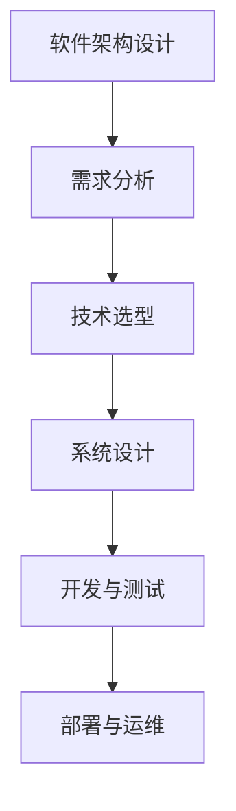

                 

# 文章标题：如何利用编程技能开发千万用户级应用

> 关键词：编程技能、应用开发、架构设计、用户体验、数据驱动、持续交付

> 摘要：本文将深入探讨如何利用编程技能开发千万用户级应用。从编程技能基础、应用开发实践、千万用户级应用的实践、案例分析以及未来展望五个部分，全面解析开发千万用户级应用所需的技术知识、实践经验和前瞻性思考。

### 《如何利用编程技能开发千万用户级应用》目录大纲

# 第一部分：编程技能基础

## 1.1 编程技能概述

### 1.1.1 编程技能的重要性

- **编程技能的核心地位**：编程技能是现代信息技术产业的核心，是构建一切数字应用的基础。
- **影响范围**：编程技能不仅影响技术领域，还渗透到金融、医疗、教育等多个行业。

### 1.1.2 编程语言的选择

- **编程语言的分类**：系统编程语言、应用编程语言、脚本语言等。
- **常用编程语言**：Python、Java、C++、JavaScript等。

### 1.1.3 编程基础知识

- **基本语法与结构**：变量、数据类型、控制结构、函数、模块等。

## 1.2 数据结构与算法

### 1.2.1 常见数据结构

- **数组**：线性结构，支持随机访问。
- **链表**：线性结构，支持顺序访问。
- **栈与队列**：线性结构，支持特定顺序访问。

### 1.2.2 算法复杂度分析

- **时间复杂度**：算法运行时间与数据规模的关系。
- **空间复杂度**：算法占用内存与数据规模的关系。

### 1.2.3 算法设计技巧

- **分治策略**：将大问题分解成小问题求解。
- **动态规划**：通过重叠子问题的解法来优化算法。

## 1.3 设计模式与架构

### 1.3.1 设计模式概述

- **设计模式**：解决特定问题的通用解决方案。
- **分类**：创建型、结构型、行为型设计模式。

### 1.3.2 常见设计模式

- **单例模式**：确保一个类只有一个实例。
- **工厂模式**：根据参数创建对象实例。
- **观察者模式**：对象间的一对多依赖关系。

### 1.3.3 架构设计原则

- **模块化**：将系统划分为多个功能模块。
- **解耦**：降低模块间的依赖性。
- **高内聚低耦合**：提高模块内聚度，降低模块间耦合度。

## 1.4 版本控制与代码管理

### 1.4.1 Git简介

- **Git**：分布式版本控制系统。
- **特点**：快速、高效、支持远程协作。

### 1.4.2 Git基本操作

- **初始化仓库**：`git init`
- **添加文件**：`git add`
- **提交更改**：`git commit`
- **推送至远程仓库**：`git push`

### 1.4.3 代码审查与协作开发

- **代码审查**：提高代码质量。
- **协作开发**：多人协同工作。

## 1.5 测试与调试

### 1.5.1 单元测试

- **单元测试**：对单个模块或函数进行测试。
- **测试框架**：JUnit、pytest等。

### 1.5.2 集成测试

- **集成测试**：对多个模块进行联合测试。

### 1.5.3 调试技巧

- **断点调试**：逐行执行代码，查看变量值。
- **日志调试**：输出关键信息，帮助定位问题。

# 第二部分：应用开发实践

## 2.1 应用架构设计

### 2.1.1 应用架构概述

- **应用架构**：应用系统的整体结构。
- **重要性**：影响应用的性能、可扩展性、可维护性。

### 2.1.2 微服务架构

- **微服务架构**：将应用拆分为多个独立服务。
- **优势**：高可扩展性、高容错性、灵活的部署。

### 2.1.3 容器化与Docker

- **容器化**：将应用及其依赖打包为一个容器。
- **Docker**：最流行的容器化技术。

## 2.2 前端开发

### 2.2.1 HTML与CSS

- **HTML**：网页内容结构。
- **CSS**：网页样式设计。

### 2.2.2 JavaScript基础

- **JavaScript**：网页交互脚本语言。
- **基础语法**：变量、数据类型、控制结构等。

### 2.2.3 前端框架（如Vue.js、React）

- **Vue.js**：渐进式JavaScript框架。
- **React**：用于构建用户界面的JavaScript库。

## 2.3 后端开发

### 2.3.1 Web框架（如Flask、Django）

- **Flask**：Python微框架。
- **Django**：Python全栈框架。

### 2.3.2 RESTful API设计

- **RESTful API**：基于HTTP协议的API设计规范。
- **设计原则**：统一接口、无状态性等。

### 2.3.3 数据库设计与优化（如MySQL、MongoDB）

- **MySQL**：关系型数据库。
- **MongoDB**：文档型数据库。

## 2.4 缓存与消息队列

### 2.4.1 Redis缓存

- **Redis**：高性能的键值存储。
- **应用场景**：会话缓存、全文搜索等。

### 2.4.2 消息队列（如RabbitMQ、Kafka）

- **消息队列**：异步消息通信系统。
- **应用场景**：分布式系统、消息驱动架构等。

## 2.5 性能优化与安全

### 2.5.1 性能优化策略

- **负载均衡**：分布式系统中的关键策略。
- **缓存技术**：提高系统响应速度。

### 2.5.2 安全漏洞与防护

- **常见漏洞**：SQL注入、XSS攻击等。
- **防护措施**：加密、验证等。

## 2.6 高并发处理与分布式系统

### 2.6.1 高并发处理

- **技术手段**：异步处理、负载均衡等。

### 2.6.2 分布式系统原理

- **分布式系统**：由多个节点组成的系统。
- **原理**：数据一致性、容错性等。

### 2.6.3 分布式系统架构设计

- **架构模式**：主从架构、对等架构等。

# 第三部分：千万用户级应用的实践

## 3.1 应用增长策略

### 3.1.1 用户增长策略

- **增长引擎**：推送、活动等。

### 3.1.2 数据分析与用户行为研究

- **数据分析**：用户行为、需求分析等。
- **用户画像**：基于数据分析的用户分类。

### 3.1.3 社交化与社区运营

- **社交化**：社交功能设计。
- **社区运营**：活跃用户、用户反馈等。

## 3.2 用户体验设计

### 3.2.1 用户体验设计概述

- **用户体验**：用户与应用的交互体验。
- **设计原则**：简洁、直观、易用等。

### 3.2.2 信息架构与界面设计

- **信息架构**：应用的结构设计。
- **界面设计**：视觉设计。

### 3.2.3 交互设计

- **交互设计**：用户与应用的交互流程。

## 3.3 数据驱动决策

### 3.3.1 数据驱动决策概述

- **数据驱动决策**：基于数据分析和用户反馈做出决策。

### 3.3.2 用户画像与细分

- **用户画像**：用户属性和行为特征。
- **用户细分**：根据用户特征进行分类。

### 3.3.3 数据分析与报告

- **数据分析**：数据收集、处理、可视化。
- **报告**：数据驱动的业务决策。

## 3.4 持续交付与部署

### 3.4.1 持续集成与持续交付

- **持续集成**：代码合并与自动化测试。
- **持续交付**：自动化部署。

### 3.4.2 自动化部署

- **自动化部署**：减少人工干预，提高部署效率。

### 3.4.3 容器化与Kubernetes

- **容器化**：将应用及其依赖打包为容器。
- **Kubernetes**：容器编排工具。

## 3.5 持续优化与迭代

### 3.5.1 应用性能优化

- **性能优化**：系统瓶颈分析、性能调优。

### 3.5.2 功能迭代与产品更新

- **功能迭代**：用户需求、市场趋势等。
- **产品更新**：持续改进、迭代优化。

### 3.5.3 用户反馈与迭代优化

- **用户反馈**：收集用户意见、改进应用。

# 第四部分：案例分析

## 4.1 案例分析概述

### 4.1.1 千万用户级应用案例分析意义

- **学习借鉴**：了解成功应用的架构设计、技术实现和运营策略。
- **实战经验**：积累开发千万用户级应用的实战经验。

### 4.1.2 案例选择标准

- **用户规模**：千万级以上。
- **业务复杂度**：涉及多种技术领域。
- **运营效果**：用户活跃度高、市场认可度好。

## 4.2 案例一：微博

### 4.2.1 微博应用架构

- **前端架构**：Vue.js框架。
- **后端架构**：Django框架。
- **数据库架构**：MySQL数据库。

### 4.2.2 微博技术实现

- **内容发布**：RESTful API设计。
- **用户关系**：Friendship图数据库。

### 4.2.3 微博运营策略

- **内容运营**：热点话题、用户互动。
- **增长策略**：用户推荐、广告投放。

## 4.3 案例二：淘宝

### 4.3.1 淘宝应用架构

- **前端架构**：React框架。
- **后端架构**：Django框架。
- **数据库架构**：MySQL数据库。

### 4.3.2 淘宝技术实现

- **商品信息**：搜索引擎技术。
- **交易流程**：分布式系统架构。

### 4.3.3 淘宝运营策略

- **用户增长**：优惠活动、用户推荐。
- **内容运营**：商品推广、商家扶持。

## 4.4 案例三：抖音

### 4.4.1 抖音应用架构

- **前端架构**：Vue.js框架。
- **后端架构**：Django框架。
- **数据库架构**：MongoDB数据库。

### 4.4.2 抖音技术实现

- **短视频发布**：短视频处理技术。
- **内容推荐**：基于内容的推荐算法。

### 4.4.3 抖音运营策略

- **用户增长**：社交互动、内容多样化。
- **增长策略**：短视频挑战、明星效应。

## 4.5 案例四：微信

### 4.5.1 微信应用架构

- **前端架构**：React框架。
- **后端架构**：Django框架。
- **数据库架构**：MySQL数据库。

### 4.5.2 微信技术实现

- **即时通讯**：WebSocket技术。
- **社交网络**：Friendship图数据库。

### 4.5.3 微信运营策略

- **用户增长**：社交互动、平台多样化。
- **增长策略**：小程序、广告推广。

# 第五部分：未来展望

## 5.1 编程技能的未来趋势

### 5.1.1 新兴编程语言

- **Python**：在数据科学、人工智能领域广泛应用。
- **Go**：在云计算、分布式系统领域受到关注。

### 5.1.2 编程技能需求变化

- **全栈开发**：掌握多种技术。
- **跨领域能力**：结合人工智能、物联网等新技术。

### 5.1.3 编程教育变革

- **在线教育**：普及编程知识。
- **项目驱动**：培养实践能力。

## 5.2 应用开发的未来方向

### 5.2.1 人工智能在应用开发中的角色

- **自动化**：提高开发效率。
- **智能化**：提升用户体验。

### 5.2.2 物联网与智能硬件的应用

- **智能家居**：连接各种智能设备。
- **工业互联网**：提升生产效率。

### 5.2.3 区块链技术的应用

- **去中心化**：重构信任机制。
- **智能合约**：自动化交易。

## 5.3 应用开发的挑战与机遇

### 5.3.1 技术挑战

- **性能优化**：高并发、大数据处理。
- **安全性**：数据安全、系统安全。

### 5.3.2 市场机遇

- **新应用场景**：5G、区块链等新技术带来的新应用。
- **国际化**：拓展海外市场。

### 5.3.3 社会责任与伦理

- **隐私保护**：用户数据安全。
- **伦理问题**：人工智能伦理问题。

## 附录：编程资源与工具

### 附录 A：编程资源与工具概述

- **书籍**：《代码大全》、《算法导论》等。
- **在线课程**：Coursera、edX等。
- **工具**：Visual Studio Code、Git等。

### 附录 B：主流编程语言学习资源

- **Python**：Python教程、Fluent Python等。
- **Java**：Java核心技术、Effective Java等。
- **C++**：C++ Primer、Effective C++等。

### 附录 C：开发工具与平台介绍

- **Docker**：Docker官方文档。
- **Kubernetes**：Kubernetes官方文档。

### 附录 D：开源框架与库介绍

- **Vue.js**：Vue官方文档。
- **React**：React官方文档。

### Mermaid 流程图示例



### 算法原理讲解与伪代码示例

#### 排序算法之快速排序

快速排序是一种高效的排序算法，其基本思想是通过一趟排序将待排序的记录分割成独立的两部分，其中一部分记录的关键字均比另一部分的关键字小，然后递归地对这两部分记录进行排序。

**伪代码：**

```pseudocode
procedure QuickSort(A[0...n-1], low, high)
    if low < high
        then
            pivotIndex = partition(A, low, high)
            QuickSort(A, low, pivotIndex - 1)
            QuickSort(A, pivotIndex + 1, high)
```

### 数学模型与公式示例

#### 最小生成树

$$
MST(W) = \min \left\{ \sum_{(u,v) \in E} w(u,v) : T \text{ 是 G 的子图，且 T 是一棵树} \right\}
$$

其中，\( W \) 是加权无向图 \( G \) 的边权重集合，\( T \) 是 \( G \) 的一个子图。

### 代码解读与分析

#### 示例：使用Python实现快速排序算法

```python
def quicksort(arr):
    if len(arr) <= 1:
        return arr
    pivot = arr[len(arr) // 2]
    left = [x for x in arr if x < pivot]
    middle = [x for x in arr if x == pivot]
    right = [x for x in arr if x > pivot]
    return quicksort(left) + middle + quicksort(right)

# 测试
arr = [3,6,8,10,1,2,1]
print(quicksort(arr))
```

**代码解读：**
1. 快速排序函数接受一个数组作为输入。
2. 如果数组长度小于等于1，则返回该数组，因为单个元素本身就是排序的。
3. 选择中间的元素作为支点。
4. 使用列表推导式将数组分成三个部分：小于支点的元素、等于支点的元素和大于支点的元素。
5. 对小于支点的部分和大于支点的部分递归调用快速排序函数。
6. 将结果合并并返回。

**代码分析：**
- 这种方法的时间复杂度为 \( O(n\log n) \)，平均情况下优于其他排序算法。
- 使用了额外的内存空间，不适合大数据集。

---

这篇文章只是一个框架，详细的解释和案例需要根据实际情况进一步填充和深化。每一部分都应该提供具体的例子、代码和分析，以便读者能够更好地理解每个概念和技术的应用。请注意，在撰写文章时，确保每个小节的内容都是丰富和具体的，以符合文章的完整性和深度要求。同时，务必遵循文章格式和字数要求，确保文章的可读性和专业性。

