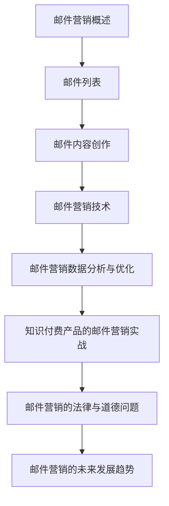

                 

### 文章标题：如何利用邮件营销推广知识付费产品

> 关键词：邮件营销、知识付费产品、营销策略、用户心理、数据分析、效果优化

摘要：本文将深入探讨如何通过邮件营销来推广知识付费产品。从基础理论到实际操作，我们将逐步分析邮件营销的概念、目标、策略、工具和技术，并提供详细的案例解析，帮助读者理解和掌握邮件营销在知识付费产品推广中的核心应用。

### 目录大纲

1. **邮件营销基础**
   1.1. 邮件营销概述
   1.2. 邮件营销与传统营销的区别
   1.3. 邮件营销的目标与策略
2. **构建有效的邮件列表**
   2.1. 收集邮件地址的合法途径
   2.2. 邮件列表的维护与管理
   2.3. 邮件列表的质量评估
3. **邮件内容创作**
   3.1. 邮件内容的构成
   3.2. 邮件营销文案设计
   3.3. 邮件营销的心理学
4. **邮件营销技术**
   4.1. 邮件营销工具与平台
   4.2. 邮件营销自动化策略
   4.3. 邮件营销数据分析与优化
5. **知识付费产品的邮件营销实战**
   5.1. 知识付费产品的特点与营销策略
   5.2. 构建知识付费产品的邮件营销计划
   5.3. 邮件营销案例解析
6. **邮件营销的法律与道德问题**
   6.1. 邮件营销的法律法规
   6.2. 邮件营销的道德标准
   6.3. 邮件营销的未来发展趋势
7. **附录**
   7.1. 邮件营销资源与工具
   7.2. 邮件营销常见问题解答

### 第一部分：邮件营销基础

#### 1.1 邮件营销概述

**核心概念与联系**

首先，我们需要明确邮件营销的定义。邮件营销是一种通过电子邮件向目标客户发送信息、宣传产品或服务的营销手段。其核心概念包括邮件列表、邮件内容、发送频率、目标受众等。


**核心算法原理讲解**

邮件营销的成功依赖于多方面的算法和策略，以下是一些关键算法原理：

1. **邮件列表构建算法**：
   - **增量式收集**：通过网站注册、活动参与等方式逐步增加邮件列表。
   - **过滤算法**：使用机器学习技术对邮件地址的有效性进行过滤。

2. **邮件内容优化算法**：
   - **自然语言处理（NLP）**：用于生成引人入胜的邮件标题和正文。
   - **分词与词频统计**：用于分析邮件内容的关键词和频率。

3. **邮件营销自动化算法**：
   - **触发式邮件**：根据用户行为自动发送相关邮件。
   - **漏斗分析**：通过跟踪用户行为预测转化率，优化邮件营销策略。

4. **数据分析与优化算法**：
   - **机器学习分类**：用于分析邮件的打开率、点击率等指标，进行分类和预测。
   - **回归分析**：用于评估邮件营销的效果，优化邮件内容和发送时间。

**数学模型和数学公式 & 详细讲解 & 举例说明**

1. **打开率和点击率计算公式**：

   - **打开率（Open Rate）**：
     $$
     \text{Open Rate} = \frac{\text{打开邮件的用户数}}{\text{发送邮件的用户总数}} \times 100\%
     $$
   
   - **点击率（Click-Through Rate, CTR）**：
     $$
     \text{CTR} = \frac{\text{点击链接的用户数}}{\text{打开邮件的用户总数}} \times 100\%
     $$

   **举例说明**：

   - 假设发送了1000封邮件，有300封被打开，其中100个用户点击了链接。
   - 打开率计算：
     $$
     \text{Open Rate} = \frac{300}{1000} \times 100\% = 30\%
     $$
   - 点击率计算：
     $$
     \text{CTR} = \frac{100}{300} \times 100\% = 33.33\%
     $$

**项目实战**

1. **邮件列表构建**

   **环境搭建**：

   - 使用Python编程语言，借助Pandas库进行数据处理。

   **代码实现**：

   ```python
   import pandas as pd

   # 假设有一个包含用户行为数据的CSV文件
   data = pd.read_csv('user_data.csv')

   # 过滤出有效的邮件地址
   valid_emails = data[data['email_validity'] == 'valid']['email'].tolist()

   # 存储有效的邮件列表
   with open('email_list.txt', 'w') as file:
       for email in valid_emails:
           file.write(email + '\n')
   ```

   **代码解读**：

   - 导入Pandas库进行数据处理。
   - 读取CSV文件中的用户行为数据。
   - 过滤出有效的邮件地址，存储在一个列表中。
   - 将有效的邮件地址写入文本文件中，便于后续邮件发送。

2. **邮件内容优化**

   **环境搭建**：

   - 使用Python编程语言，结合NLP库如NLTK或TextBlob进行邮件内容分析。

   **代码实现**：

   ```python
   from textblob import TextBlob

   # 假设有一个包含邮件内容的文本文件
   with open('email_content.txt', 'r') as file:
       email_text = file.read()

   # 分析邮件内容的情感倾向
   blob = TextBlob(email_text)
   sentiment = blob.sentiment

   # 打印分析结果
   print(f"邮件内容的情感倾向：{sentiment.polarity}")
   print(f"邮件内容的情感强度：{sentiment.subjectivity}")
   ```

   **代码解读**：

   - 导入TextBlob库进行文本分析。
   - 读取邮件内容的文本文件。
   - 使用TextBlob分析邮件内容的情感倾向和情感强度。
   - 打印分析结果，帮助优化邮件内容。

### 第二部分：邮件内容创作

#### 3.1 邮件内容的构成

邮件内容是邮件营销的核心，其构成包括标题、正文和附件等部分。一个成功的邮件内容应具备吸引读者的标题、清晰简洁的正文以及必要的附件。


**邮件标题的写作技巧**：

- 突出关键信息：邮件标题应简洁明了，突出邮件的主题和关键信息。
- 创造好奇心：使用好奇或引人入胜的标题，激发读者的阅读兴趣。
- 避免过度营销：避免使用过于夸张或虚假的标题，以免引起读者的反感。

**邮件正文的撰写原则**：

- 清晰简洁：正文应避免冗长和复杂的句子，确保信息传达清晰易懂。
- 分段撰写：将正文内容分段，使用标题或小标题来组织信息。
- 引导行动：在正文中明确引导读者采取行动，如点击链接、注册课程等。

**邮件附件的使用策略**：

- 附件类型：根据邮件内容选择合适的附件类型，如PDF文件、PPT、视频等。
- 附件大小：确保附件大小适中，以免影响邮件的发送速度和打开速度。
- 附件说明：在邮件正文中对附件进行简要说明，方便读者了解附件的内容。

### 第三部分：邮件营销技术

#### 6.1 邮件营销工具与平台

邮件营销的成功离不开有效的工具和平台。以下是一些常用的邮件营销工具和平台：

- **HubSpot**：提供全面的邮件营销功能，包括自动化、分析等。
- **Mailchimp**：易于使用，适合小型企业的邮件营销需求。
- **Sendinblue**：提供多种营销工具，包括电子邮件、短信、社交媒体等。
- **Constant Contact**：适合中小型企业的邮件营销平台。

**邮件营销平台的搭建与使用**：

- **搭建步骤**：
  1. 注册并登录邮件营销平台。
  2. 创建邮件模板，包括标题、正文和布局。
  3. 添加订阅者，可以从现有列表或手动导入。
  4. 设置自动化流程，如订阅确认邮件、生日邮件等。
  5. 添加追踪代码，监控邮件的打开率和点击率。

- **使用策略**：
  1. 定期测试和优化邮件模板。
  2. 使用A/B测试比较不同邮件的效果。
  3. 根据订阅者的行为和兴趣进行个性化邮件。

### 第四部分：知识付费产品的邮件营销实战

#### 8.1 知识付费产品的特点与营销策略

知识付费产品具有以下特点：

- **专业性**：知识付费产品通常提供专业领域的高质量内容。
- **长期性**：知识付费产品往往需要用户持续学习和实践。
- **互动性**：知识付费产品可能包括互动环节，如在线讨论、答疑等。

针对这些特点，知识付费产品的邮件营销策略应包括：

- **内容营销**：通过定期发送高质量的内容邮件，建立品牌信任。
- **互动营销**：鼓励用户参与互动，如问卷调查、在线讨论等。
- **个性化营销**：根据用户的行为和兴趣发送个性化的邮件。

#### 8.2 构建知识付费产品的邮件营销计划

构建知识付费产品的邮件营销计划应包括以下步骤：

- **确定邮件营销目标**：明确邮件营销的目标，如增加订阅量、提高用户活跃度等。
- **制定邮件营销计划**：制定邮件发送的时间表，包括每周或每月的邮件主题和内容。
- **邮件营销日程安排**：合理安排邮件发送的时间，避免频繁发送导致用户反感。

### 第五部分：邮件营销的法律与道德问题

#### 11.1 邮件营销的法律法规

邮件营销需要遵守相关法律法规，如《中华人民共和国网络安全法》和《中华人民共和国广告法》等。以下是一些关键点：

- **邮件发送权限**：确保用户同意接收邮件，未经用户同意不得发送邮件。
- **邮件内容规范**：邮件内容应符合相关法律法规的要求，不得包含违法信息。
- **用户数据保护**：妥善保护用户数据，不得泄露用户个人信息。

#### 12.1 道德营销的重要性

道德营销是邮件营销的重要组成部分，其重要性体现在：

- **提升品牌形象**：道德营销有助于提升品牌形象，增强用户信任。
- **维护用户权益**：道德营销关注用户权益，减少用户反感，提高用户满意度。

#### 13.1 邮件营销的未来发展趋势

随着技术的发展，邮件营销将呈现以下趋势：

- **个性化营销**：基于用户行为和兴趣进行个性化邮件发送，提高营销效果。
- **人工智能应用**：利用人工智能技术优化邮件营销流程，提高效率。
- **跨渠道整合**：结合社交媒体、短信等其他渠道，实现跨渠道营销。

### 附录

#### 附录A：邮件营销资源与工具

- **主流邮件营销工具对比**：
  - **HubSpot**：功能全面，适合大型企业。
  - **Mailchimp**：操作简单，适合小型企业。
  - **Sendinblue**：多种营销工具，适合多元化营销需求。

- **邮件营销资源推荐**：
  - **电子邮件营销指南**：提供全面的邮件营销策略和实践。
  - **电子邮件营销社区**：分享邮件营销经验和技巧。

- **邮件营销社区与学习资源**：
  - **Mailchimp学习中心**：提供邮件营销教程和案例。
  - **HubSpot营销学院**：提供免费营销资源和学习课程。

#### 附录B：邮件营销常见问题解答

- **如何提高邮件送达率？**
  - 确保邮件服务器信誉良好。
  - 使用专业的邮件营销工具。
  - 定期清理无效邮件地址。

- **邮件营销中的数据隐私问题如何解决？**
  - 遵守相关法律法规，如《通用数据保护条例》（GDPR）。
  - 明确告知用户数据使用目的，取得用户同意。

- **邮件营销效果不佳怎么办？**
  - 分析数据，找出问题所在。
  - 调整邮件内容和发送时间。
  - 优化邮件营销策略。

### 核心概念与联系

**Mermaid 流程图**



### 作者信息

**作者：AI天才研究院/AI Genius Institute & 禅与计算机程序设计艺术 /Zen And The Art of Computer Programming**

