                 

### 《如何将模型思维应用于实际管理》

> 关键词：模型思维、管理、战略规划、运营管理、人力资源管理、创新与创业

> 摘要：本文旨在探讨模型思维在企业管理中的实际应用。通过介绍模型思维的核心概念、基本模型和核心工具，以及模型思维在战略规划、运营管理、人力资源管理和创新与创业等领域的具体应用，帮助企业管理者更好地理解和应用模型思维，提升管理效率和企业竞争力。

在企业管理中，面对复杂多变的市场环境，管理者常常需要做出快速、准确且具有前瞻性的决策。而模型思维作为一种系统性思考的工具，可以帮助管理者从多个维度分析问题，预测未来趋势，做出更科学合理的决策。本文将首先介绍模型思维的核心概念和基本原理，然后详细阐述模型思维在各个管理领域的应用，并通过实际案例进行分析和解读，以帮助读者更好地理解和应用模型思维。

### 第一部分：模型思维概述

#### 第1章：模型思维的核心概念

##### 1.1.1 模型思维的起源与发展

模型思维（Model Thinking）作为一种系统性的思考方法，起源于20世纪初的经济学和工程学领域。当时，科学家和经济学家开始尝试使用数学模型和逻辑推理来分析和预测复杂系统的行为。随着时间的推移，模型思维逐渐应用于各个领域，如管理学、计算机科学、生态学等，成为一种普遍的思维方式。

在管理学中，模型思维的主要目的是通过建立和运用各种模型，对企业的运营、战略、人力资源管理等进行系统分析，从而提高管理决策的科学性和准确性。模型思维的发展经历了从简单线性模型到复杂非线性模型的演变，逐渐形成了多个经典模型，如决策树、SWOT分析、价值链分析等。

##### 1.1.2 模型思维的应用场景

模型思维广泛应用于企业管理的各个方面，主要包括以下场景：

1. **战略规划**：通过模型思维，企业可以分析市场趋势、竞争对手情况，制定科学合理的战略目标和发展规划。

2. **运营管理**：模型思维可以帮助企业优化业务流程，降低成本，提高效率。

3. **人力资源管理**：通过模型思维，企业可以更好地进行招聘、培训、绩效评估等管理工作。

4. **创新与创业**：模型思维在创新思维和创业战略制定中发挥着重要作用，帮助企业抓住机遇，应对挑战。

##### 1.1.3 模型思维的基本原理

模型思维的基本原理包括以下几个方面：

1. **抽象与简化**：将复杂问题抽象成简单的模型，忽略次要因素，抓住主要矛盾。

2. **逻辑推理**：通过逻辑推理，从已知条件推导出未知结论，验证模型的准确性。

3. **迭代优化**：通过不断迭代和优化，改进模型，提高预测的准确性。

4. **实证检验**：通过实际数据和案例，验证模型的预测能力，修正模型。

#### 第2章：模型思维的基本模型

##### 2.1.1 经典决策模型

经典决策模型包括以下几个步骤：

1. **明确目标**：确定决策的目标和标准。

2. **列举备选方案**：根据目标和标准，列出所有可能的备选方案。

3. **评估备选方案**：对每个备选方案进行评估，包括优点、缺点和风险。

4. **选择最佳方案**：根据评估结果，选择最优的备选方案。

5. **执行方案**：实施选定的方案，并进行跟踪和调整。

##### 2.1.2 SWOT分析模型

SWOT分析模型是一种用于战略规划的工具，包括以下几个方面：

1. **优势（Strengths）**：企业内部的优势和资源。

2. **劣势（Weaknesses）**：企业内部的不足和劣势。

3. **机会（Opportunities）**：外部环境中的有利因素和机遇。

4. **威胁（Threats）**：外部环境中的不利因素和威胁。

通过SWOT分析，企业可以全面了解自身的优势和劣势，抓住机遇，应对挑战。

##### 2.1.3 价值链分析模型

价值链分析模型是一种用于分析企业业务流程的工具，包括以下几个方面：

1. **输入**：企业的原材料、人力和其他资源。

2. **转化**：将输入转化为产品或服务的价值增值过程。

3. **输出**：企业最终的产品或服务。

4. **成本**：在价值创造过程中所产生的成本。

通过价值链分析，企业可以优化业务流程，降低成本，提高效率。

### 第二部分：模型思维在管理中的应用

#### 第3章：模型思维的核心工具

##### 3.1.1 数据分析工具

数据分析工具是模型思维的重要工具之一，主要包括以下几个方面：

1. **描述性分析**：用于描述和分析数据的基本特征，如平均值、方差等。

2. **相关性分析**：用于分析两个或多个变量之间的相关性。

3. **预测性分析**：基于历史数据，预测未来的趋势和变化。

4. **聚类分析**：将相似的数据分组，用于市场细分、客户分类等。

常见的数据分析工具有Excel、Python、R等。

##### 3.1.2 可视化工具

可视化工具是将数据以图形化的方式展示的工具，主要包括以下几个方面：

1. **折线图**：用于展示数据的变化趋势。

2. **柱状图**：用于比较不同数据的大小。

3. **饼图**：用于展示各部分占总体的比例。

4. **散点图**：用于展示两个变量之间的关系。

常见的可视化工具有Tableau、Power BI、D3.js等。

##### 3.1.3 模拟与预测工具

模拟与预测工具是用于模拟现实世界中的事件和过程，并预测未来结果的工具，主要包括以下几个方面：

1. **蒙特卡洛模拟**：通过模拟大量的随机实验，预测某一事件的发生概率。

2. **时间序列预测**：基于历史数据，预测未来的趋势和变化。

3. **回归分析**：通过建立回归模型，预测变量之间的关系。

4. **机器学习算法**：用于处理大规模数据和复杂关系，进行预测和分类。

常见的模拟与预测工具有MATLAB、R、Python等。

#### 第4章：模型思维在战略规划中的应用

##### 4.1.1 战略目标的制定

战略目标的制定是战略规划的关键步骤，主要包括以下几个方面：

1. **明确愿景**：确定企业的长远目标和使命。

2. **设定目标**：根据愿景，设定具体的、可量化的目标。

3. **分解目标**：将总目标分解为子目标和关键绩效指标。

4. **制定行动计划**：为实现目标，制定具体的行动计划和时间表。

##### 4.1.2 市场竞争分析

市场竞争分析是战略规划的重要组成部分，主要包括以下几个方面：

1. **竞争对手分析**：分析竞争对手的市场地位、产品策略、营销策略等。

2. **市场定位**：根据竞争对手分析，确定企业在市场中的定位。

3. **市场机会与威胁**：分析市场中的机会和威胁，为战略制定提供依据。

4. **竞争力分析**：评估企业的竞争力，找出优势和劣势。

##### 4.1.3 战略选择与优化

战略选择与优化是基于市场竞争分析和目标分解，选择最优的战略方案，并进行持续优化。主要包括以下几个方面：

1. **战略选择**：根据市场竞争分析和目标分解，选择合适的战略方案。

2. **资源分配**：根据战略方案，合理分配资源，确保战略实施的可行性。

3. **执行监控**：对战略执行过程进行监控，及时调整和优化战略方案。

4. **绩效评估**：对战略实施效果进行评估，为下一轮战略制定提供依据。

#### 第5章：模型思维在运营管理中的应用

##### 5.1.1 业务流程优化

业务流程优化是提高企业运营效率的关键步骤，主要包括以下几个方面：

1. **流程诊断**：分析现有流程的瓶颈和问题，确定优化的方向。

2. **流程设计**：根据诊断结果，设计新的流程，提高流程的效率和灵活性。

3. **流程实施**：实施新的流程，并进行培训和宣传，确保员工了解和遵守新的流程。

4. **流程监控**：对流程实施过程进行监控，及时发现和解决问题。

##### 5.1.2 成本控制与绩效评估

成本控制与绩效评估是运营管理的重要环节，主要包括以下几个方面：

1. **成本分析**：分析各项成本，找出成本控制和降低成本的潜力。

2. **成本控制**：制定成本控制措施，降低不必要的成本。

3. **绩效评估**：对员工和团队的工作绩效进行评估，激励员工提高工作效率。

4. **持续改进**：根据绩效评估结果，持续改进业务流程和管理方法。

##### 5.1.3 质量管理

质量管理是运营管理的重要内容，主要包括以下几个方面：

1. **质量规划**：制定质量目标和质量计划，确保产品质量。

2. **质量控制**：实施质量控制措施，确保产品质量符合标准。

3. **质量改进**：通过持续改进，提高产品和服务质量。

4. **质量评价**：对产品质量进行评价，为下一轮质量规划提供依据。

#### 第6章：模型思维在人力资源管理中的应用

##### 6.1.1 招聘与选拔

招聘与选拔是人力资源管理的重要环节，主要包括以下几个方面：

1. **职位分析**：分析职位的要求和职责，确定招聘的标准。

2. **招聘策略**：根据职位要求，制定合适的招聘策略，如内部招聘、外部招聘等。

3. **选拔流程**：建立科学的选拔流程，包括简历筛选、面试、背景调查等。

4. **人才评价**：对候选人进行全面的评价，确保选拔的人才符合要求。

##### 6.1.2 薪酬管理

薪酬管理是人力资源管理的关键部分，主要包括以下几个方面：

1. **薪酬设计**：根据市场水平和企业实际情况，设计合理的薪酬体系。

2. **薪酬调整**：根据员工的绩效和市场需求，适时调整薪酬。

3. **薪酬发放**：确保薪酬发放的准确性和及时性。

4. **薪酬沟通**：与员工进行有效的薪酬沟通，增强员工的满意度。

##### 6.1.3 员工培训与发展

员工培训与发展是提升员工能力和企业竞争力的重要手段，主要包括以下几个方面：

1. **培训需求分析**：分析员工的培训需求，确定培训的方向和内容。

2. **培训计划**：制定详细的培训计划，包括培训时间、地点、方式等。

3. **培训实施**：按照培训计划，组织实施培训。

4. **培训评估**：对培训效果进行评估，确保培训目标的实现。

#### 第7章：模型思维在创新与创业中的应用

##### 7.1.1 创新思维模型

创新思维模型是指导企业创新的重要工具，主要包括以下几个方面：

1. **头脑风暴**：通过集体讨论，激发创意和灵感。

2. **思维导图**：将创意和思路以图形化的方式展示，便于分析和整理。

3. **TRIZ方法**：基于问题解决理论的创新方法，用于解决复杂问题。

4. **设计思维**：以用户为中心，通过迭代设计，实现创新。

##### 7.1.2 创业战略模型

创业战略模型是指导企业创业的重要工具，主要包括以下几个方面：

1. **市场机会分析**：分析市场机会，确定创业的方向。

2. **商业模式设计**：设计合理的商业模式，实现可持续盈利。

3. **竞争策略**：分析竞争对手，制定有竞争力的战略。

4. **资源整合**：整合内外部资源，确保创业项目的成功。

##### 7.1.3 市场定位与竞争策略

市场定位与竞争策略是企业在市场中立足的重要手段，主要包括以下几个方面：

1. **市场细分**：根据市场需求和特点，进行市场细分。

2. **目标市场选择**：根据市场细分，选择目标市场。

3. **差异化策略**：通过产品、服务、品牌等方面的差异化，形成竞争优势。

4. **竞争策略**：根据竞争对手的情况，制定相应的竞争策略。

### 第三部分：案例分析与实践

#### 第8章：模型思维案例分析

##### 8.1.1 案例一：公司战略规划

某公司是一家从事电子商务的企业，面临激烈的市场竞争。为了制定有效的战略规划，公司运用了模型思维。

1. **战略目标制定**：公司明确了短期和长期的目标，如提高市场占有率、提升客户满意度等。

2. **市场竞争分析**：公司分析了竞争对手的市场份额、产品特点、营销策略等，找到了自身的优势和劣势。

3. **SWOT分析**：公司进行了SWOT分析，确定了优势（如品牌知名度高、产品质量好）和劣势（如市场份额较低、营销渠道有限）。

4. **战略选择**：公司根据SWOT分析结果，选择了差异化战略，通过提高产品质量、优化营销渠道等手段，提升市场竞争力。

5. **战略实施与评估**：公司制定了具体的行动计划，并定期评估战略实施效果，确保战略目标的实现。

通过模型思维的应用，公司成功地制定了战略规划，提高了市场竞争力。

##### 8.1.2 案例二：运营流程优化

某公司是一家制造业企业，为了提高生产效率和降低成本，决定对运营流程进行优化。

1. **流程诊断**：公司分析了现有流程的瓶颈和问题，如生产周期长、成本高等。

2. **流程设计**：公司设计了新的流程，包括减少生产环节、优化设备配置等。

3. **流程实施**：公司按照新流程进行实施，并对员工进行了培训和宣传。

4. **流程监控**：公司对流程实施过程进行监控，及时发现和解决问题。

通过模型思维的应用，公司成功优化了运营流程，提高了生产效率和降低了成本。

##### 8.1.3 案例三：人力资源管理

某公司是一家高科技企业，为了提升员工素质和公司竞争力，决定进行人力资源管理改革。

1. **招聘与选拔**：公司制定了科学的招聘策略，通过多渠道招聘高素质人才。

2. **薪酬管理**：公司设计了合理的薪酬体系，激励员工提高工作效率。

3. **员工培训与发展**：公司开展了多种培训项目，提升员工的专业技能和综合素质。

4. **绩效评估**：公司建立了科学的绩效评估体系，对员工的工作绩效进行评估。

通过模型思维的应用，公司成功提升了员工素质和公司竞争力。

### 第9章：模型思维实践指南

##### 9.1.1 实践步骤与技巧

1. **明确目标**：在应用模型思维时，首先要明确目标，确保思维的方向和效果。

2. **收集信息**：收集与问题相关的信息，包括数据、案例、专家意见等。

3. **建立模型**：根据目标和信息，建立合适的模型，如决策树、SWOT分析、价值链分析等。

4. **分析模型**：对模型进行分析，推导出结论，验证模型的准确性。

5. **优化模型**：根据分析结果，不断优化模型，提高预测的准确性。

6. **实践应用**：将模型应用于实际问题，验证模型的有效性。

##### 9.1.2 遇到的常见问题与解决方案

1. **数据不足**：解决方案：通过多方渠道收集数据，确保数据的充分性。

2. **模型过于复杂**：解决方案：简化模型，抓住主要矛盾，避免过度复杂。

3. **预测结果不准确**：解决方案：优化模型，收集更多数据，调整预测方法。

4. **实施难度大**：解决方案：制定详细的实施计划，分阶段推进，确保实施效果。

##### 9.1.3 持续改进的方法

1. **定期评估**：定期对模型和应用效果进行评估，发现问题及时调整。

2. **持续学习**：关注行业动态和新技术，持续学习，提高模型思维能力。

3. **团队协作**：发挥团队优势，集思广益，共同优化模型和应用效果。

### 第10章：模型思维在数字化时代的挑战与机遇

##### 10.1.1 数字化转型的趋势

随着数字化技术的发展，越来越多的企业开始进行数字化转型。数字化转型不仅改变了企业的运营方式，也对企业管理提出了新的要求。模型思维作为一种系统性的思考方法，在数字化时代具有重要的应用价值。

##### 10.1.2 模型思维在数字化时代的应用

在数字化时代，模型思维的应用主要包括以下几个方面：

1. **数据驱动决策**：通过数据分析，建立模型，为企业提供数据支持，实现数据驱动决策。

2. **智能化运营**：运用模型思维，实现智能化运营，提高生产效率和服务质量。

3. **创新与创业**：通过模型思维，抓住市场机会，实现创新和创业。

4. **人才培养**：通过模型思维，培养具备数据分析、模型构建和创新能力的人才。

##### 10.1.3 未来发展趋势与展望

未来，模型思维在数字化时代将继续发挥重要作用。随着人工智能、大数据、云计算等技术的不断发展，模型思维将更加智能化、个性化，为企业提供更强大的决策支持和创新能力。同时，模型思维也将推动企业数字化转型，提高企业竞争力。

### 附录

#### 附录A：模型思维工具与资源

##### A.1.1 数据分析工具

1. **Excel**：用于进行基本的描述性分析和数据处理。

2. **Python**：用于进行高级的数据分析、预测和建模。

3. **R**：用于进行统计分析和数据可视化。

##### A.1.2 可视化工具

1. **Tableau**：用于进行高级的数据可视化。

2. **Power BI**：用于进行企业级的数据可视化。

3. **D3.js**：用于进行自定义的数据可视化。

##### A.1.3 模拟与预测工具

1. **MATLAB**：用于进行数学建模和仿真。

2. **R**：用于进行时间序列预测和机器学习。

3. **Python**：用于进行多种类型的模拟与预测。

#### 附录B：模型思维实践案例

##### B.1.1 案例一：某公司战略规划实践

本案例介绍了某公司在制定战略规划过程中，如何运用模型思维进行市场竞争分析、SWOT分析和战略选择。

##### B.1.2 案例二：某运营流程优化实践

本案例介绍了某公司在运营流程优化过程中，如何运用模型思维进行流程诊断、流程设计和流程监控。

##### B.1.3 案例三：某人力资源管理实践

本案例介绍了某公司在人力资源管理过程中，如何运用模型思维进行招聘与选拔、薪酬管理和员工培训与发展。

### 总结

本文通过系统地阐述模型思维的核心概念、基本模型和核心工具，以及模型思维在战略规划、运营管理、人力资源管理和创新与创业等领域的具体应用，帮助读者理解和应用模型思维，提升管理决策的科学性和准确性。同时，通过实际案例的解读，展示了模型思维在实践中的应用效果。在数字化时代，模型思维将继续发挥重要作用，为企业提供数据支持和创新能力，推动企业数字化转型。希望本文能够对读者在企业管理中的应用模型思维有所启发和帮助。作者：AI天才研究院/AI Genius Institute & 禅与计算机程序设计艺术/Zen And The Art of Computer Programming。文章标题：《如何将模型思维应用于实际管理》。

---

**第1章：模型思维的核心概念**

模型思维是一种将复杂现实问题抽象为数学模型或逻辑模型，然后通过分析和推理来求解问题的思维方式。在企业管理中，模型思维可以帮助管理者更好地理解和预测市场动态、优化业务流程、制定战略规划等。

**核心概念与联系**

1. **抽象化**：将现实问题简化为数学模型或逻辑模型，忽略次要因素，抓住主要矛盾。

2. **逻辑推理**：基于已知条件和假设，通过逻辑推理得出结论。

3. **验证与修正**：通过实际数据和案例，验证模型的准确性，并根据反馈进行修正。

**Mermaid 流程图**

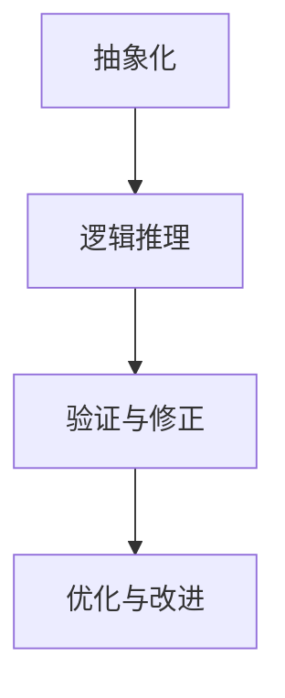

**伪代码**

```python
# 抽象化
def abstract实际问题:
    # 确定问题的主要矛盾和影响因素
    # 忽略次要因素
    # 建立数学模型或逻辑模型

# 逻辑推理
def logical_inference(model, assumptions):
    # 基于模型和假设，进行逻辑推理
    # 推导出结论

# 验证与修正
def verify_and_modify(model, actual_data):
    # 通过实际数据和案例，验证模型准确性
    # 根据反馈，修正模型
```

**数学模型与公式**

在模型思维中，数学模型和公式是用于描述和预测现实问题的重要工具。以下是一个简单的线性回归模型，用于预测销售量。

$$
y = \beta_0 + \beta_1x
$$

其中，$y$ 表示销售量，$x$ 表示广告投入，$\beta_0$ 和 $\beta_1$ 是模型参数。

**举例说明**

假设某公司的销售数据如下：

| 广告投入（万元） | 销售量（件） |
| -------------- | ---------- |
| 10             | 100        |
| 20             | 150        |
| 30             | 200        |

通过线性回归模型，可以预测当广告投入为 40 万元时的销售量。

$$
y = \beta_0 + \beta_1x
$$

通过计算，得到 $\beta_0 = 50$，$\beta_1 = 1.5$。因此，当广告投入为 40 万元时，销售量为：

$$
y = 50 + 1.5 \times 40 = 130
$$

即预测销售量为 130 件。

**代码实际案例和详细解释说明**

以下是一个简单的Python代码，用于实现线性回归模型并预测销售量。

```python
import numpy as np

# 数据准备
广告投入 = np.array([10, 20, 30])
销售量 = np.array([100, 150, 200])

# 模型参数初始化
beta_0 = 0
beta_1 = 0

# 模型拟合
for i in range(len(广告投入)):
    y_hat = beta_0 + beta_1 * 广告投入[i]
    delta = 销售量[i] - y_hat
    beta_0 += delta
    beta_1 += (delta * 广告投入[i])

# 预测销售量
广告投入预测 = 40
销售量预测 = beta_0 + beta_1 * 广告投入预测

print("预测销售量:", 销售量预测)
```

**代码解读与分析**

1. 导入必要的库（numpy）：用于进行数学计算和数据处理。
2. 准备数据（广告投入和销售量）：将数据转换为numpy数组，便于处理。
3. 初始化模型参数（beta_0 和 beta_1）：初始化为0，用于后续迭代计算。
4. 模型拟合：通过迭代计算，更新模型参数（beta_0 和 beta_1），实现模型拟合。
5. 预测销售量：使用拟合后的模型参数，预测广告投入为 40 万元时的销售量。
6. 输出预测结果：打印预测销售量。

通过以上代码，可以实现对线性回归模型的实现和销售量的预测。在实际应用中，可以根据具体问题进行调整和优化。

---

### 第2章：模型思维的基本模型

在模型思维中，基本模型是分析和解决具体问题的基础工具。本章将介绍几种常用的基本模型，包括决策模型、SWOT分析模型和价值链分析模型，并详细说明每个模型的原理和应用。

#### 2.1.1 经典决策模型

经典决策模型是一种基于逻辑推理和概率论的方法，用于分析决策问题并选择最优方案。该模型通常包括以下几个步骤：

1. **明确目标**：确定决策的目标和标准，例如最大化利润、最小化成本等。

2. **列举备选方案**：根据目标，列出所有可能的备选方案。

3. **评估备选方案**：对每个备选方案进行评估，包括优点、缺点和风险。

4. **选择最佳方案**：根据评估结果，选择最优的备选方案。

5. **执行方案**：实施选定的方案，并进行跟踪和调整。

**Mermaid 流程图**

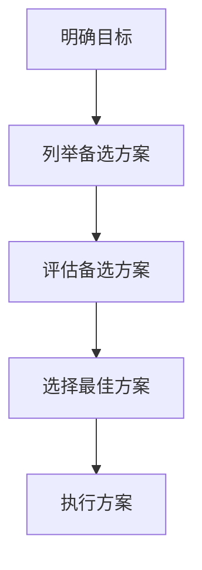

**伪代码**

```python
# 明确目标
def set_objective():
    # 定义目标函数
    # 例如：最大化利润 = f(x)

# 列举备选方案
def enumerate_solutions():
    # 列出所有可能的解决方案
    # 例如：solutions = [方案1, 方案2, ...]

# 评估备选方案
def evaluate_solutions(solutions):
    # 对每个解决方案进行评估
    # 例如：评估函数 = g(solution)

# 选择最佳方案
def select_best_solution(solutions, evaluation_function):
    # 根据评估结果选择最佳方案
    # 例如：best_solution = max(solutions, key=evaluation_function)

# 执行方案
def execute_solution(solution):
    # 实施解决方案
    # 例如：执行方案 = f(solution)
```

**应用实例**

某公司需要决定是否投资一项新项目。以下是决策模型的应用步骤：

1. **明确目标**：最大化投资回报率。
2. **列举备选方案**：投资新项目或不投资。
3. **评估备选方案**：计算投资新项目的预期回报率和不投资的机会成本。
4. **选择最佳方案**：如果投资新项目的回报率高于不投资的机会成本，则选择投资新项目。
5. **执行方案**：实施投资计划，并监控项目的进展和回报。

#### 2.1.2 SWOT分析模型

SWOT分析模型是一种用于评估企业内外部环境的工具。它包括四个方面：优势（Strengths）、劣势（Weaknesses）、机会（Opportunities）和威胁（Threats）。通过SWOT分析，企业可以全面了解自身的优势和劣势，以及市场中的机会和威胁。

1. **优势（Strengths）**：企业内部的优势和资源，如品牌知名度、专利技术、优秀团队等。

2. **劣势（Weaknesses）**：企业内部的不足和劣势，如市场占有率低、产品缺乏竞争力等。

3. **机会（Opportunities）**：外部环境中的有利因素和机遇，如市场增长、新技术应用等。

4. **威胁（Threats）**：外部环境中的不利因素和威胁，如竞争对手、市场变化等。

**Mermaid 流程图**

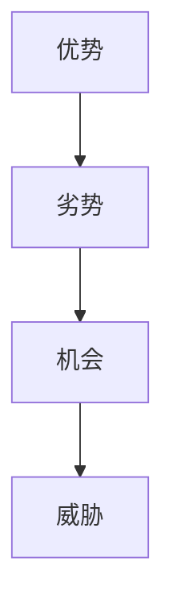

**应用实例**

某公司希望通过SWOT分析评估其市场地位：

1. **优势**：公司拥有一支经验丰富的研发团队和一系列专利技术。
2. **劣势**：公司在市场推广和品牌知名度方面相对较弱。
3. **机会**：市场对该公司技术的需求不断增长，同时政府出台了一系列扶持政策。
4. **威胁**：竞争对手技术进步迅速，可能抢占市场份额。

通过SWOT分析，公司可以明确自身的优势、劣势、机会和威胁，制定相应的策略。

#### 2.1.3 价值链分析模型

价值链分析模型是用于分析企业业务流程和创造价值的工具。该模型将企业的业务活动分解为一系列增值环节，并分析每个环节的价值创造和成本消耗。

1. **输入**：企业的原材料、人力和其他资源。

2. **转化**：将输入转化为产品或服务的价值增值过程。

3. **输出**：企业最终的产品或服务。

4. **成本**：在价值创造过程中所产生的成本。

**Mermaid 流程图**

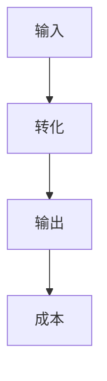

**应用实例**

某公司希望通过价值链分析优化其生产流程：

1. **输入**：原材料、能源、人力等。
2. **转化**：生产制造过程，包括加工、装配等。
3. **输出**：最终产品。
4. **成本**：原材料成本、生产成本、人工成本等。

通过价值链分析，公司可以发现生产流程中的瓶颈和成本过高环节，并提出优化方案，如引入自动化设备、优化生产工艺等。

**总结**

经典决策模型、SWOT分析模型和价值链分析模型是模型思维中的基本工具，用于分析决策问题、评估企业内外部环境和优化业务流程。通过这些模型，企业可以更好地理解自身状况，制定战略规划，提升竞争力。在后续章节中，我们将进一步探讨模型思维在具体管理领域的应用。

---

**第3章：模型思维的核心工具**

在模型思维的应用过程中，数据工具、可视化工具和模拟与预测工具是不可或缺的核心工具。这些工具不仅能够帮助我们有效地收集、处理和分析数据，还能将复杂的信息以直观的方式呈现，从而辅助我们做出更科学合理的决策。

#### 3.1.1 数据分析工具

数据分析工具是模型思维的基础，用于处理和分析大量数据，以提取有价值的信息。以下是一些常用的数据分析工具：

1. **Excel**：Excel是微软办公套件中的一部分，广泛用于数据的记录、分析和可视化。它提供了丰富的函数、图表和数据透视表功能，非常适合进行基础的数据分析和报告。

2. **Python**：Python是一种高级编程语言，以其简单易学、功能强大而著称。Python拥有多个强大的数据分析库，如Pandas、NumPy、SciPy等，可以处理各种复杂数据分析任务。

   **Pandas**：Pandas是一个强大的数据分析库，提供了数据结构（DataFrame）和数据分析功能，适合进行数据清洗、数据转换和数据分析。

   **NumPy**：NumPy是一个基础的科学计算库，提供了多维数组对象和一系列数学函数，适合进行数值计算和数据处理。

3. **R**：R是一种专门用于统计分析和图形绘制的编程语言。R拥有丰富的统计和图形功能，适合进行高级的数据分析和可视化。

   **ggplot2**：ggplot2是R的一个图形库，提供了强大的图形绘制功能，可以创建高度定制化的统计图表。

**应用实例**

假设我们使用Python进行销售数据分析。以下是一个简单的示例，展示了如何使用Pandas库读取数据、清洗数据、计算统计指标和绘制图表。

```python
import pandas as pd
import matplotlib.pyplot as plt

# 读取数据
sales_data = pd.read_csv('sales_data.csv')

# 数据清洗
sales_data = sales_data.dropna()

# 计算统计指标
sales_summary = sales_data.describe()

# 绘制图表
plt.figure(figsize=(10, 6))
plt.plot(sales_data['Date'], sales_data['Sales'])
plt.xlabel('Date')
plt.ylabel('Sales')
plt.title('Sales over Time')
plt.show()
```

#### 3.1.2 可视化工具

可视化工具将数据转换为图形或图表，使得复杂的信息更加直观和易于理解。以下是一些常用的可视化工具：

1. **Tableau**：Tableau是一款专业的数据可视化工具，提供了丰富的图表类型和交互功能，适合进行企业级的数据分析和报告。

2. **Power BI**：Power BI是微软推出的数据可视化工具，与Excel紧密集成，提供了强大的数据连接、数据建模和可视化功能。

3. **D3.js**：D3.js是一个基于JavaScript的库，用于创建动态和交互式的数据可视化。D3.js适合进行高度定制化的可视化设计。

**应用实例**

使用D3.js创建一个简单的柱状图，展示不同类别产品的销售情况。

```javascript
// 获取数据
var dataset = [
  { "label": "Product A", "value": 25 },
  { "label": "Product B", "value": 15 },
  { "label": "Product C", "value": 5 }
];

// 创建图表
var width = 400,
    height = 300;

var x = d3.scaleBand().range([0, width]).padding(0.1);
var y = d3.scaleLinear().range([height, 0]);

var svg = d3.select("svg")
    .attr("width", width)
    .attr("height", height);

x.domain(dataset.map(function(d) { return d.label; }));
y.domain([0, d3.max(dataset, function(d) { return d.value; })]);

svg.selectAll(".bar")
    .data(dataset)
  .enter().append("rect")
    .attr("class", "bar")
    .attr("x", function(d) { return x(d.label); })
    .attr("y", function(d) { return y(d.value); })
    .attr("width", x.bandwidth())
    .attr("height", function(d) { return height - y(d.value); });

svg.append("g")
    .attr("transform", "translate(0," + height + ")")
    .call(d3.axisBottom(x));

svg.append("g")
    .call(d3.axisLeft(y));
```

#### 3.1.3 模拟与预测工具

模拟与预测工具用于模拟现实世界中的事件和过程，并进行预测分析。以下是一些常用的模拟与预测工具：

1. **MATLAB**：MATLAB是一款专业的数学计算和仿真工具，提供了丰富的数学函数和工具箱，适合进行复杂数学建模和仿真分析。

2. **R**：R除了强大的数据分析功能外，还提供了多个用于时间序列分析和预测的包，如ARIMA、forecast等。

3. **Python**：Python拥有多个用于模拟与预测的库，如NumPy、SciPy、pandas等，可以用于构建和训练各种机器学习模型。

**应用实例**

使用Python和scikit-learn库进行线性回归模型的构建和预测。

```python
from sklearn.linear_model import LinearRegression
from sklearn.model_selection import train_test_split
from sklearn.metrics import mean_squared_error

# 准备数据
X = np.array([[1], [2], [3], [4], [5], [6], [7], [8], [9], [10]])
y = np.array([2, 4, 6, 8, 10, 12, 14, 16, 18, 20])

# 划分训练集和测试集
X_train, X_test, y_train, y_test = train_test_split(X, y, test_size=0.2, random_state=0)

# 构建线性回归模型
model = LinearRegression()
model.fit(X_train, y_train)

# 预测测试集
y_pred = model.predict(X_test)

# 评估模型
mse = mean_squared_error(y_test, y_pred)
print("Mean Squared Error:", mse)
```

通过以上实例，我们可以看到数据分析工具、可视化工具和模拟与预测工具在模型思维中的应用。这些工具不仅提高了数据处理的效率，还使得复杂的信息更加直观和易于理解，为科学决策提供了有力支持。

---

### 第4章：模型思维在战略规划中的应用

战略规划是企业发展的核心，涉及到企业目标的设定、资源的配置和行动计划的制定。模型思维作为一种系统性的思考方法，可以帮助企业更好地进行战略规划。本章将详细介绍模型思维在战略规划中的应用，包括战略目标的制定、市场竞争分析、战略选择与优化等方面。

#### 4.1.1 战略目标的制定

战略目标的制定是战略规划的首要步骤，它关系到企业未来发展的方向和重点。在制定战略目标时，企业需要考虑内外部环境、市场趋势和自身资源等因素。模型思维可以帮助企业通过以下步骤来制定战略目标：

1. **明确愿景**：愿景是企业长远发展的目标和使命。企业需要明确愿景，以指导战略目标的制定。

2. **分析环境**：对市场环境、技术趋势、政策法规等因素进行分析，了解外部环境对企业发展的影响。

3. **评估资源**：评估企业内部资源，包括人力资源、财务资源、技术资源等，确定企业可以利用的资源。

4. **设定目标**：根据愿景、环境和资源，设定具体的、可量化的战略目标。例如，提升市场份额、提高产品质量、降低成本等。

5. **分解目标**：将总目标分解为子目标和关键绩效指标，明确每个目标和指标的实现路径。

**Mermaid 流程图**

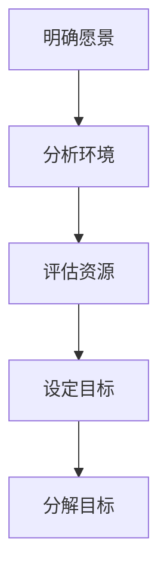

**伪代码**

```python
# 明确愿景
def define_vision():
    # 定义企业愿景

# 分析环境
def analyze_environment():
    # 分析市场环境、技术趋势、政策法规等

# 评估资源
def assess_resources():
    # 评估企业内部资源

# 设定目标
def set_goals(vision, environment, resources):
    # 根据愿景、环境和资源设定战略目标

# 分解目标
def decompose_goals(goals):
    # 将总目标分解为子目标和关键绩效指标
```

**应用实例**

某企业是一家制造企业，其战略目标是“在未来三年内，将市场份额提升至行业前五，同时实现成本降低15%”。为了实现这一目标，企业需要：

1. **明确愿景**：成为行业领先企业。
2. **分析环境**：了解市场趋势、竞争对手状况和行业政策。
3. **评估资源**：评估现有的人力、财务和技术资源。
4. **设定目标**：明确市场份额和成本降低的具体目标和关键绩效指标。
5. **分解目标**：制定具体的行动计划，包括市场拓展策略、成本控制措施等。

#### 4.1.2 市场竞争分析

市场竞争分析是战略规划的关键步骤，它涉及到对竞争对手的分析、市场定位和市场机会的识别。模型思维可以帮助企业通过以下步骤进行市场竞争分析：

1. **识别竞争对手**：确定直接和间接的竞争对手，了解他们的市场地位、产品策略、营销策略等。

2. **分析竞争对手**：分析竞争对手的优势和劣势，了解他们的市场行为和战略意图。

3. **市场定位**：根据竞争对手分析和自身优势，确定企业在市场中的定位。

4. **识别市场机会**：分析市场趋势和客户需求，识别潜在的市场机会。

5. **制定竞争策略**：根据市场定位和市场机会，制定有效的竞争策略。

**Mermaid 流程图**

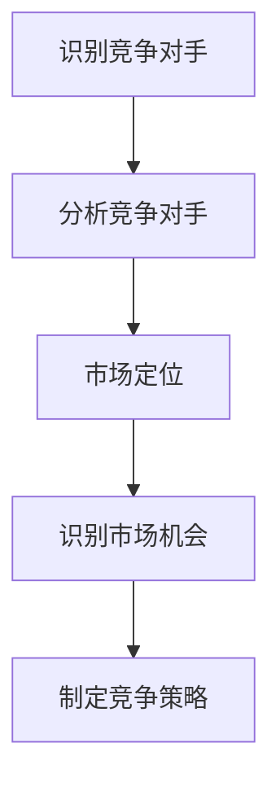

**伪代码**

```python
# 识别竞争对手
def identify_competitors():
    # 确定直接和间接的竞争对手

# 分析竞争对手
def analyze_competitors(competitors):
    # 分析竞争对手的优势和劣势

# 市场定位
def market_positioning(competitors, strengths):
    # 根据竞争对手分析和自身优势，确定市场定位

# 识别市场机会
def identify_opportunities(trends, customer_needs):
    # 分析市场趋势和客户需求，识别市场机会

# 制定竞争策略
def set_competition_strategy(positioning, opportunities):
    # 根据市场定位和市场机会，制定有效的竞争策略
```

**应用实例**

某企业是一家电子产品制造商，其市场竞争分析如下：

1. **识别竞争对手**：主要竞争对手包括苹果、三星和华为。
2. **分析竞争对手**：苹果和三星在高端市场占据优势，华为在中端市场表现突出。
3. **市场定位**：企业决定在高端市场推出新型号，以提升品牌形象。
4. **识别市场机会**：随着5G技术的普及，市场需求增长迅速。
5. **制定竞争策略**：推出具备5G功能的高端产品，通过差异化竞争提升市场份额。

#### 4.1.3 战略选择与优化

在制定战略目标和分析市场竞争后，企业需要选择和优化战略方案，以确保战略目标的实现。模型思维可以帮助企业通过以下步骤进行战略选择与优化：

1. **列举备选方案**：根据战略目标和市场竞争分析，列举所有可能的备选方案。

2. **评估备选方案**：对每个备选方案进行评估，包括优点、缺点和风险。

3. **选择最佳方案**：根据评估结果，选择最优的备选方案。

4. **优化战略方案**：在实施过程中，根据实际情况对战略方案进行优化，确保战略目标的实现。

5. **执行与监控**：制定详细的执行计划，并对战略实施过程进行监控，及时调整和优化。

**Mermaid 流程图**

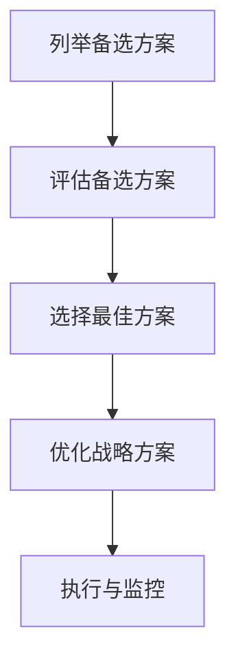

**伪代码**

```python
# 列举备选方案
def enumerate_solutions(goals, competition):
    # 根据战略目标和市场竞争分析，列举所有可能的备选方案

# 评估备选方案
def evaluate_solutions(solutions):
    # 对每个备选方案进行评估，包括优点、缺点和风险

# 选择最佳方案
def select_best_solution(solutions):
    # 根据评估结果，选择最优的备选方案

# 优化战略方案
def optimize_strategy(strategy):
    # 根据实际情况，对战略方案进行优化

# 执行与监控
def execute_and_monitor(strategy):
    # 制定详细的执行计划，并对战略实施过程进行监控
```

**应用实例**

某企业在制定市场扩张战略时，有以下备选方案：

1. **备选方案A**：在现有市场加大广告投入，提升品牌知名度。
2. **备选方案B**：进军新市场，开拓新的销售渠道。
3. **备选方案C**：与合作伙伴合作，共同开发新产品。

通过评估，企业发现：

- 备选方案A的优点是成本较低，但效果可能有限。
- 备选方案B的优点是市场潜力大，但风险较高。
- 备选方案C的优点是资源整合效果好，但需要较长时间。

最终，企业选择了备选方案C，并进行了优化，包括调整合作伙伴关系和产品开发计划。在实施过程中，企业对战略方案进行了持续监控和调整，以确保战略目标的实现。

**总结**

本章介绍了模型思维在战略规划中的应用，包括战略目标的制定、市场竞争分析和战略选择与优化。通过模型思维，企业可以系统地分析战略问题，制定科学合理的战略目标，识别市场机会，并选择和优化战略方案。模型思维的应用不仅提高了战略规划的效率，还增强了企业应对市场变化的灵活性。在实际应用中，企业可以根据自身情况灵活调整模型和步骤，以实现最佳的战略效果。

---

**第5章：模型思维在运营管理中的应用**

运营管理是企业管理的核心环节，涉及到生产、供应链、质量管理等多个方面。模型思维作为一种系统性的思考方法，可以帮助企业优化运营流程，提高生产效率，降低成本。本章将详细介绍模型思维在运营管理中的应用，包括业务流程优化、成本控制与绩效评估、质量管理等方面。

#### 5.1.1 业务流程优化

业务流程优化是提高企业运营效率的关键步骤。通过模型思维，企业可以系统地分析现有业务流程，找出瓶颈和问题，并提出优化方案。以下是业务流程优化的基本步骤：

1. **流程诊断**：分析现有业务流程，确定流程中的瓶颈和问题。流程诊断可以通过流程图、数据分析、员工访谈等方式进行。

2. **流程设计**：根据流程诊断的结果，设计新的业务流程。新流程应简化不必要的步骤，提高效率和灵活性。

3. **流程实施**：将新流程付诸实施，并进行培训和宣传，确保员工了解和遵守新的流程。

4. **流程监控**：对流程实施过程进行监控，及时发现和解决问题。

**Mermaid 流程图**

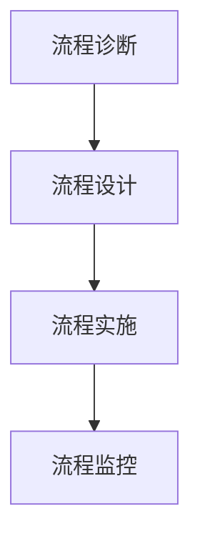

**伪代码**

```python
# 流程诊断
def diagnose_process():
    # 分析现有流程，确定瓶颈和问题

# 流程设计
def design_process(diagnostics):
    # 根据诊断结果，设计新流程

# 流程实施
def implement_process(process_design):
    # 实施新流程，进行培训和宣传

# 流程监控
def monitor_process(process_design):
    # 监控流程实施过程，发现问题并及时解决
```

**应用实例**

某企业在生产流程中遇到生产周期长、效率低的问题。通过模型思维进行流程优化：

1. **流程诊断**：分析现有生产流程，发现生产准备时间过长、设备利用率不高等问题。
2. **流程设计**：设计新的生产流程，包括优化生产准备、提高设备利用率等。
3. **流程实施**：实施新流程，并对员工进行培训，确保新流程的有效执行。
4. **流程监控**：监控新流程的实施效果，发现设备故障问题，及时进行维护和修复。

#### 5.1.2 成本控制与绩效评估

成本控制与绩效评估是运营管理的重要环节，通过模型思维，企业可以更好地控制成本，提高绩效。以下是成本控制与绩效评估的基本步骤：

1. **成本分析**：分析各项成本，找出成本控制和降低成本的潜力。成本分析可以通过数据分析、成本分类等方式进行。

2. **成本控制**：制定成本控制措施，降低不必要的成本。成本控制可以通过预算管理、绩效评估等方式实现。

3. **绩效评估**：对员工和团队的工作绩效进行评估，激励员工提高工作效率。绩效评估可以通过关键绩效指标（KPI）和员工评估等方式进行。

4. **持续改进**：根据绩效评估结果，持续改进业务流程和管理方法，提高绩效。

**Mermaid 流流程图**

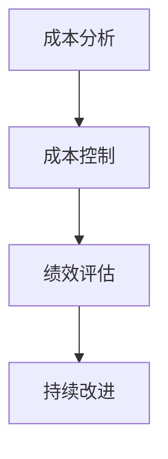

**伪代码**

```python
# 成本分析
def cost_analysis():
    # 分析各项成本，找出降低成本的潜力

# 成本控制
def cost_control(cost_analysis_results):
    # 制定成本控制措施，降低不必要的成本

# 绩效评估
def performance_evaluation(performance_metrics):
    # 对员工和团队的工作绩效进行评估

# 持续改进
def continuous_improvement(performance_evaluation_results):
    # 根据绩效评估结果，持续改进业务流程和管理方法
```

**应用实例**

某企业在进行成本控制和绩效评估：

1. **成本分析**：分析生产成本、销售成本和运营成本，发现生产成本占比较高。
2. **成本控制**：制定生产成本控制措施，包括优化生产流程、提高设备利用率等。
3. **绩效评估**：设定关键绩效指标（如生产效率、产品质量等），对员工进行评估。
4. **持续改进**：根据绩效评估结果，调整生产流程和管理方法，提高生产效率和质量。

#### 5.1.3 质量管理

质量管理是运营管理的重要内容，通过模型思维，企业可以更好地实现质量控制和提升产品质量。以下是质量管理的步骤：

1. **质量规划**：制定质量目标和质量计划，确保产品质量。质量规划可以通过质量目标设定、质量管理计划制定等方式进行。

2. **质量控制**：实施质量控制措施，确保产品质量。质量控制可以通过过程控制、质量检验等方式实现。

3. **质量改进**：通过持续改进，提高产品和服务质量。质量改进可以通过问题识别、原因分析、改进措施实施等方式进行。

4. **质量评价**：对产品质量进行评价，为下一轮质量规划提供依据。质量评价可以通过客户反馈、质量评审等方式进行。

**Mermaid 流流程图**

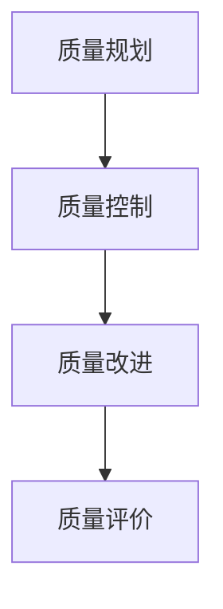

**伪代码**

```python
# 质量规划
def quality_planning():
    # 制定质量目标和质量管理计划

# 质量控制
def quality_control(quality_plan):
    # 实施质量控制措施

# 质量改进
def quality_improvement(quality_control_results):
    # 通过持续改进，提高产品和服务质量

# 质量评价
def quality_evaluation(customer_feedback):
    # 对产品质量进行评价，为下一轮质量规划提供依据
```

**应用实例**

某企业进行质量管理：

1. **质量规划**：制定产品质量目标和质量管理计划，包括质量标准、检验流程等。
2. **质量控制**：实施过程控制和质量检验，确保产品符合质量标准。
3. **质量改进**：识别质量问题，分析原因，并实施改进措施。
4. **质量评价**：收集客户反馈，对产品质量进行评价，持续改进质量管理计划。

**总结**

本章介绍了模型思维在运营管理中的应用，包括业务流程优化、成本控制与绩效评估、质量管理等方面。通过模型思维，企业可以系统地分析运营问题，提出优化方案，并实施和监控优化效果。模型思维的应用不仅提高了运营效率，还增强了企业的竞争力和市场响应能力。在实际应用中，企业可以根据自身情况灵活调整模型和步骤，以实现最佳运营效果。

---

### 第6章：模型思维在人力资源管理中的应用

人力资源管理是企业管理的核心部分，对于企业的长期发展和竞争力具有重要影响。模型思维作为一种系统性的思考方法，可以帮助企业在人力资源管理中做出更科学合理的决策。本章将探讨模型思维在人力资源管理中的应用，包括招聘与选拔、薪酬管理、员工培训与发展等方面。

#### 6.1.1 招聘与选拔

招聘与选拔是人力资源管理的重要环节，涉及到人才的筛选和引进。模型思维可以帮助企业在招聘与选拔过程中进行系统分析，提高人才选拔的准确性和效率。以下是招聘与选拔的基本步骤：

1. **职位分析**：分析职位的要求和职责，确定所需的核心能力和素质。

2. **岗位评估**：对现有岗位进行评估，确定岗位的重要性和薪酬水平。

3. **招聘策略**：根据职位分析和岗位评估结果，制定合适的招聘策略，如内部招聘、外部招聘等。

4. **选拔流程**：建立科学的选拔流程，包括简历筛选、面试、背景调查等。

5. **人才评价**：对候选人进行全面的评价，包括专业技能、综合素质、团队协作能力等。

**Mermaid 流程图**

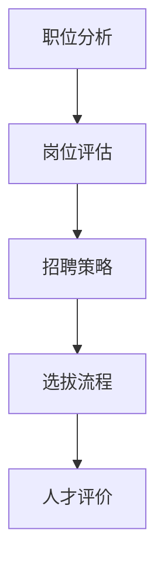

**伪代码**

```python
# 职位分析
def job_analysis():
    # 分析职位要求和职责

# 岗位评估
def job_evaluation(job_analysis_results):
    # 评估岗位重要性和薪酬水平

# 招聘策略
def recruitment_strategy(job_evaluation_results):
    # 制定招聘策略

# 选拔流程
def selection_process(recruitment_strategy_results):
    # 建立选拔流程

# 人才评价
def talent_evaluation(selection_process_results):
    # 对候选人进行全面评价
```

**应用实例**

某公司需要招聘一名高级软件开发工程师，以下是模型思维在招聘与选拔中的应用：

1. **职位分析**：分析职位要求，确定需要具备的专业技能、工作经验和团队协作能力。

2. **岗位评估**：评估该岗位的重要性和薪酬水平，确定招聘预算。

3. **招聘策略**：根据职位分析和岗位评估，决定通过内部推荐和外部招聘渠道进行招聘。

4. **选拔流程**：建立包括简历筛选、技术面试、行为面试和背景调查的选拔流程。

5. **人才评价**：对候选人进行技术能力、沟通能力和团队合作能力的全面评价，确保选聘到最适合的人才。

#### 6.1.2 薪酬管理

薪酬管理是人力资源管理的重要方面，涉及到员工薪酬的设计、调整和发放。模型思维可以帮助企业在薪酬管理中实现公平性、竞争性和激励性。以下是薪酬管理的基本步骤：

1. **薪酬调查**：了解市场薪酬水平，收集同行业企业的薪酬数据。

2. **薪酬设计**：根据企业战略和岗位价值，设计合理的薪酬体系，包括基本工资、奖金、福利等。

3. **薪酬调整**：根据员工绩效、市场变化和企业效益，调整薪酬水平。

4. **薪酬发放**：确保薪酬发放的准确性和及时性，建立薪酬发放机制。

5. **薪酬沟通**：与员工进行有效的薪酬沟通，增强员工的满意度和忠诚度。

**Mermaid 流程图**

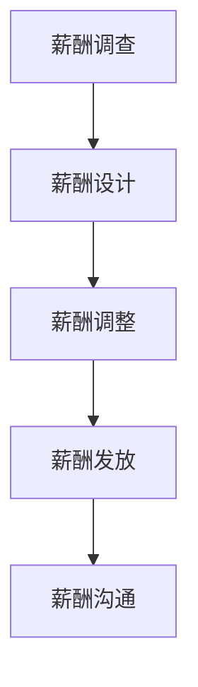

**伪代码**

```python
# 薪酬调查
def salary_survey():
    # 调查市场薪酬水平

# 薪酬设计
def salary_design(salary_survey_results):
    # 设计合理的薪酬体系

# 薪酬调整
def salary_adjustment(performance_evaluation_results):
    # 根据绩效调整薪酬水平

# 薪酬发放
def salary_payment(salary_design_results):
    # 实施薪酬发放机制

# 薪酬沟通
def salary_communication(employee_evaluation_results):
    # 与员工进行薪酬沟通
```

**应用实例**

某公司在进行薪酬管理时，采取了以下步骤：

1. **薪酬调查**：调查同行业其他公司的薪酬水平，了解市场薪酬趋势。

2. **薪酬设计**：根据企业战略和岗位价值，设计包括基本工资、绩效奖金和福利的薪酬体系。

3. **薪酬调整**：根据员工绩效评估结果，对表现优秀的员工进行薪酬调整。

4. **薪酬发放**：确保薪酬发放的准确性和及时性，建立薪酬发放机制。

5. **薪酬沟通**：与员工进行薪酬沟通，解释薪酬结构和调整原因，增强员工满意度。

#### 6.1.3 员工培训与发展

员工培训与发展是提升员工能力和企业竞争力的重要手段。模型思维可以帮助企业制定科学的培训和发展计划，提高员工的专业技能和综合素质。以下是员工培训与发展的基本步骤：

1. **培训需求分析**：分析员工的培训需求，确定培训的方向和内容。

2. **培训计划**：制定详细的培训计划，包括培训时间、地点、方式等。

3. **培训实施**：按照培训计划，组织实施培训。

4. **培训评估**：对培训效果进行评估，确保培训目标的实现。

5. **持续发展**：根据培训评估结果，持续改进培训计划，推动员工的持续发展。

**Mermaid 流程图**

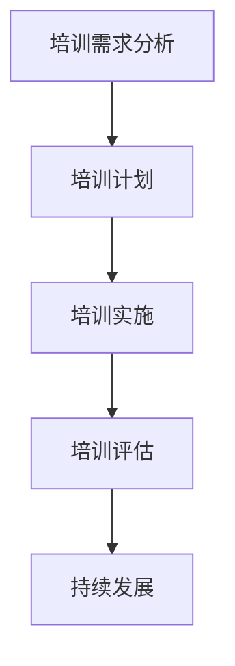

**伪代码**

```python
# 培训需求分析
def training_needs_analysis():
    # 分析员工的培训需求

# 培训计划
def training_plan(training_needs_analysis_results):
    # 制定详细的培训计划

# 培训实施
def training_execution(training_plan_results):
    # 组织实施培训

# 培训评估
def training_evaluation(training_execution_results):
    # 对培训效果进行评估

# 持续发展
def continuous_development(training_evaluation_results):
    # 根据培训评估结果，持续改进培训计划
```

**应用实例**

某公司在进行员工培训与发展：

1. **培训需求分析**：通过问卷调查和员工访谈，了解员工对培训的需求。

2. **培训计划**：根据培训需求，制定包括技能培训、领导力培训和发展培训的培训计划。

3. **培训实施**：按照培训计划，组织内外部培训，确保员工参与。

4. **培训评估**：通过培训后的考核和员工反馈，评估培训效果，及时调整和改进培训内容。

5. **持续发展**：根据培训评估结果，制定下一轮培训计划，推动员工的持续发展。

**总结**

本章介绍了模型思维在人力资源管理中的应用，包括招聘与选拔、薪酬管理和员工培训与发展。通过模型思维，企业可以系统地分析人力资源管理问题，制定科学合理的策略，提高人力资源管理效率和企业竞争力。在实际应用中，企业可以根据自身情况灵活调整模型和步骤，以实现最佳的人力资源管理效果。

---

### 第7章：模型思维在创新与创业中的应用

在创新与创业领域，模型思维发挥着至关重要的作用。它不仅帮助创业者更好地理解市场、分析风险、预测未来，还能够系统地指导创新过程和创业战略的制定。本章将深入探讨模型思维在创新与创业中的应用，包括创新思维模型、创业战略模型和市场定位与竞争策略等方面。

#### 7.1.1 创新思维模型

创新思维模型是创业者进行创新活动的指南，它包括一系列方法和工具，用于激发创意和解决问题。以下是几种常见的创新思维模型：

1. **头脑风暴**：头脑风暴是一种集体创造性思维方法，通过集体讨论，鼓励参与者提出尽可能多的创意和解决方案。

2. **思维导图**：思维导图是一种以图形化方式展示思维过程和创意的工具，可以帮助创业者理清思路，捕捉灵感。

3. **TRIZ方法**：TRIZ（理论解决创新问题）是一种基于问题解决理论的创新方法，它提供了一系列原理和工具，用于解决复杂问题。

4. **设计思维**：设计思维是一种以用户为中心的创新方法，它强调从用户的角度出发，通过迭代设计，创造出满足用户需求的产品或服务。

**Mermaid 流程图**

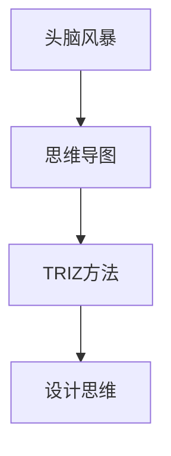

**伪代码**

```python
# 头脑风暴
def brainstorming():
    # 鼓励参与者提出创意和解决方案

# 思维导图
def mind_map(ideas):
    # 将创意和解决方案以图形化方式展示

# TRIZ方法
def triz_solution(problem):
    # 应用TRIZ原理解决复杂问题

# 设计思维
def design_thinking(user_needs):
    # 从用户需求出发，进行迭代设计
```

**应用实例**

某创业团队正在开发一款智能家居产品，以下是创新思维模型的应用：

1. **头脑风暴**：团队成员围绕产品功能、用户体验和市场趋势进行讨论，提出各种创意。
2. **思维导图**：将头脑风暴中的创意以思维导图的形式展示，帮助团队理清思路。
3. **TRIZ方法**：针对产品功能实现中的难点，应用TRIZ方法提出解决方案。
4. **设计思维**：根据用户需求，进行迭代设计，优化产品功能和用户界面。

#### 7.1.2 创业战略模型

创业战略模型是创业者制定和实施创业战略的工具，它包括一系列步骤和方法，用于分析市场、制定目标、选择方向。以下是创业战略模型的几个关键步骤：

1. **市场机会分析**：分析市场趋势、需求变化和竞争环境，识别潜在的市场机会。

2. **商业模式设计**：根据市场机会，设计合理的商业模式，确保企业的盈利能力和可持续发展。

3. **竞争策略**：分析竞争对手的优势和劣势，制定有竞争力的战略，抢占市场份额。

4. **资源整合**：整合内部和外部资源，确保创业项目的成功实施。

5. **战略执行**：制定详细的战略执行计划，确保战略目标的实现。

**Mermaid 流程图**

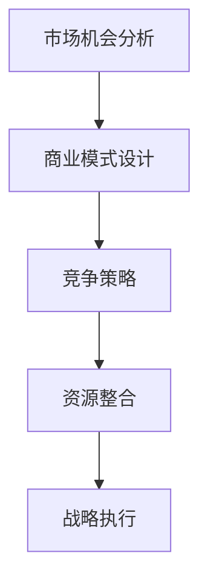

**伪代码**

```python
# 市场机会分析
def market_opportunity_analysis():
    # 分析市场趋势、需求变化和竞争环境

# 商业模式设计
def business_model_design(opportunity_analysis_results):
    # 设计合理的商业模式

# 竞争策略
def competitive_strategy(competition_analysis_results):
    # 制定有竞争力的战略

# 资源整合
def resource_integration(competition_strategy_results):
    # 整合内部和外部资源

# 战略执行
def strategic_execution(resource_integration_results):
    # 制定战略执行计划
```

**应用实例**

某创业团队计划开发一款基于人工智能的智能家居系统，以下是创业战略模型的应用：

1. **市场机会分析**：分析智能家居市场的增长趋势、用户需求和技术发展，确定市场机会。
2. **商业模式设计**：设计包括产品销售、订阅服务和广告收入的商业模式，确保企业的盈利能力。
3. **竞争策略**：分析竞争对手的产品特点和市场策略，制定差异化的竞争策略，如技术创新和用户体验优化。
4. **资源整合**：整合人工智能技术、智能家居设备和市场营销资源，确保创业项目的顺利推进。
5. **战略执行**：制定详细的执行计划，包括产品开发、市场推广和销售渠道建设。

#### 7.1.3 市场定位与竞争策略

市场定位与竞争策略是创业成功的关键因素。通过模型思维，创业者可以系统地分析市场，明确企业的市场定位，并制定有效的竞争策略。以下是市场定位与竞争策略的几个关键步骤：

1. **市场细分**：根据消费者的需求和特点，将市场划分为不同的细分市场。

2. **目标市场选择**：根据市场细分结果，选择最适合企业目标的市场细分群体。

3. **差异化策略**：通过产品、服务、品牌等方面的差异化，形成竞争优势。

4. **竞争策略**：分析竞争对手的策略，制定相应的竞争策略，如价格战、质量战、服务战等。

**Mermaid 流程图**

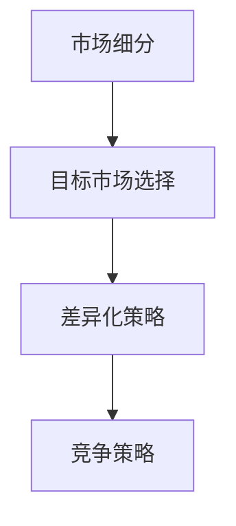

**伪代码**

```python
# 市场细分
def market_segmentation():
    # 根据消费者需求和特点，进行市场细分

# 目标市场选择
def target_market_selection(segmentation_results):
    # 选择最适合企业的目标市场细分群体

# 差异化策略
def differentiation_strategy(target_market_selection_results):
    # 通过产品、服务、品牌等方面的差异化，形成竞争优势

# 竞争策略
def competitive_strategy(competition_analysis_results):
    # 分析竞争对手的策略，制定相应的竞争策略
```

**应用实例**

某创业团队计划开发一款健康食品，以下是市场定位与竞争策略的应用：

1. **市场细分**：分析消费者对健康食品的需求，如年龄、性别、收入等，确定市场细分群体。
2. **目标市场选择**：选择注重健康饮食的中高收入群体，作为目标市场。
3. **差异化策略**：通过强调天然成分、无添加剂和科学配比，形成产品差异化。
4. **竞争策略**：分析竞争对手的产品特点和市场策略，制定以质量和服务为核心的竞争策略。

**总结**

本章介绍了模型思维在创新与创业中的应用，包括创新思维模型、创业战略模型和市场定位与竞争策略。通过模型思维，创业者可以系统地分析市场、制定创新策略和创业战略，提高创业成功率。在实际应用中，创业者可以根据自身情况灵活调整模型和步骤，以实现最佳的创新与创业效果。

---

### 第8章：模型思维案例分析

在本章节中，我们将通过几个实际案例，详细展示模型思维在企业管理中的具体应用，包括战略规划、运营流程优化和人力资源管理等方面。这些案例不仅展示了模型思维在复杂问题解决中的有效性，也为读者提供了实际操作的参考。

#### 8.1.1 案例一：公司战略规划

**案例背景**

某中型制造企业面临激烈的市场竞争，公司管理层希望通过战略规划来提高市场份额和利润率。公司主要生产电子产品，并在过去几年中取得了一定的市场份额。然而，随着新兴技术和消费习惯的变化，公司意识到需要进行战略调整。

**模型思维应用**

1. **市场机会分析**：通过数据分析，公司发现智能电子产品市场增长迅速，且客户对个性化、智能化的需求日益增长。同时，政府也出台了一系列支持智能制造的政策。

2. **SWOT分析**：公司进行了SWOT分析，确定了自身的优势（如品牌知名度和优质产品）、劣势（如市场响应速度较慢和产品创新不足）、机会（如智能电子产品市场增长）和威胁（如竞争对手的技术创新和市场份额扩张）。

3. **战略选择**：基于SWOT分析，公司选择了“智能转型”战略，重点投资于智能产品和研发，同时加强与合作伙伴的合作，以快速响应市场变化。

4. **战略实施与监控**：公司制定了详细的实施计划，包括研发投入、市场推广、人才引进等，并设立了关键绩效指标（KPI）来监控战略实施效果。

**结果分析**

通过模型思维的应用，公司成功实现了智能转型，市场份额和利润率显著提升。此外，公司还建立了快速响应市场的机制，增强了市场竞争力。

#### 8.1.2 案例二：运营流程优化

**案例背景**

某零售企业在日常运营中遇到了库存管理不当、供应链效率低等问题，影响了销售和客户满意度。公司决定通过运营流程优化来解决这些问题。

**模型思维应用**

1. **流程诊断**：公司通过流程图和数据分析，识别了库存管理、采购、销售等环节中的瓶颈和问题，如库存积压、采购周期长、销售反应慢等。

2. **流程设计**：基于诊断结果，公司重新设计了库存管理流程、采购流程和销售流程，包括引入新的库存管理系统、优化采购流程和加强销售团队的培训。

3. **流程实施**：公司按照新的流程进行了实施，对员工进行了培训和宣传，确保新流程的有效执行。

4. **流程监控**：公司建立了流程监控机制，定期评估流程实施效果，及时发现问题并进行调整。

**结果分析**

通过模型思维的应用，公司显著提高了库存管理效率、降低了采购周期、提升了销售反应速度。客户满意度也随之提升，销售额和利润率显著增长。

#### 8.1.3 案例三：人力资源管理

**案例背景**

某科技公司因快速发展，面临人才短缺和人才流失问题。公司希望通过人力资源管理改革来提升员工满意度和员工留存率。

**模型思维应用**

1. **招聘与选拔**：公司优化了招聘流程，通过数据分析、技能测试和行为面试等手段，确保招聘到合适的人才。

2. **薪酬管理**：公司根据市场数据和员工绩效，重新设计了薪酬体系，提高了薪酬的竞争力和激励性。

3. **员工培训与发展**：公司制定了全面的培训计划，包括技术培训、领导力培训和职业发展指导，帮助员工提升技能和职业素养。

4. **绩效评估**：公司建立了科学的绩效评估体系，通过定期评估和反馈，激励员工提高工作绩效。

**结果分析**

通过模型思维的应用，公司成功吸引了更多优秀人才，员工满意度和员工留存率显著提升。此外，公司还培养了更多的内部领导力和专业技能，为未来的发展奠定了坚实基础。

**总结**

通过以上案例，我们可以看到模型思维在企业管理中的实际应用效果。无论是战略规划、运营流程优化还是人力资源管理，模型思维都为企业提供了系统性的分析和决策工具，帮助企业在复杂环境中做出更科学合理的决策。通过不断实践和优化模型思维，企业可以持续提升管理效率和市场竞争力。

---

### 第9章：模型思维实践指南

#### 9.1.1 实践步骤与技巧

在应用模型思维的过程中，以下步骤和技巧有助于确保模型的有效性和实施的成功：

1. **明确目标**：在开始建模之前，首先要明确问题的核心目标，确保模型设计符合实际需求。

2. **数据收集**：收集与问题相关的数据，包括历史数据、市场数据、竞争对手数据等。确保数据的质量和完整性。

3. **模型构建**：根据问题的特点和目标，选择合适的模型类型。可以使用决策树、SWOT分析、价值链分析等模型。

4. **模型验证**：通过实际数据和案例，验证模型的准确性和可靠性。如果模型不准确，需要返回步骤3进行调整。

5. **模型优化**：根据验证结果，对模型进行优化，以提高预测的准确性。

6. **模型实施**：将模型应用于实际问题，制定详细的实施计划，确保模型的有效实施。

7. **持续改进**：在模型实施过程中，定期评估模型的性能，并根据反馈进行调整和改进。

#### 9.1.2 遇到的常见问题与解决方案

在应用模型思维的过程中，可能会遇到以下问题：

1. **数据不足或质量差**：解决方案：通过多种渠道收集数据，确保数据的充分性和质量。如果数据质量差，可以使用数据清洗和预处理技术进行优化。

2. **模型过于复杂**：解决方案：简化模型，抓住主要矛盾，避免过度复杂。如果模型过于复杂，可以分解为多个子模型，逐步优化。

3. **预测结果不准确**：解决方案：优化模型参数，收集更多数据，或尝试不同的模型类型。如果预测结果仍然不准确，可以重新验证和修正模型。

4. **实施难度大**：解决方案：制定详细的实施计划，分阶段推进，确保每个步骤都得到有效执行。如果实施过程中遇到困难，可以寻求外部专家的帮助。

#### 9.1.3 持续改进的方法

为了确保模型思维的应用能够持续改进，企业可以采取以下方法：

1. **定期评估**：定期对模型和应用效果进行评估，识别问题和改进点。

2. **员工培训**：定期对员工进行模型思维和数据分析的培训，提高员工的模型构建和数据处理能力。

3. **团队协作**：鼓励跨部门团队协作，集思广益，共同优化模型和应用效果。

4. **技术更新**：关注新技术和工具的发展，定期更新模型和工具，提高模型的准确性和实施效率。

5. **客户反馈**：收集客户反馈，了解模型应用的实际效果，并根据客户需求进行调整和优化。

通过以上方法，企业可以确保模型思维的持续改进，提高管理决策的科学性和准确性，从而增强企业的竞争力。

---

### 第10章：模型思维在数字化时代的挑战与机遇

随着数字化技术的迅速发展，企业管理正经历着深刻的变革。数字化时代为模型思维带来了新的挑战和机遇。在这一章中，我们将探讨模型思维在数字化时代的应用趋势、面临的挑战以及未来的发展前景。

#### 10.1.1 数字化转型的趋势

数字化转型已经成为企业发展的必然趋势。通过数字化技术，企业可以显著提高效率、降低成本、增强客户体验。以下是数字化转型的主要趋势：

1. **数据分析与人工智能**：数据分析与人工智能技术的结合，使得企业能够从海量数据中提取有价值的信息，实现智能决策和自动化运营。

2. **云计算与边缘计算**：云计算和边缘计算为数据处理和存储提供了强大的支持，企业可以通过云计算实现资源的灵活配置，通过边缘计算提高数据处理的速度和效率。

3. **物联网与智能制造**：物联网技术将物理世界与数字世界连接起来，实现设备的智能监控和自动化管理。智能制造则通过数字化手段，优化生产流程和提高产品质量。

4. **区块链技术**：区块链技术为数据的透明性和安全性提供了保障，适用于供应链管理、金融交易等领域。

#### 10.1.2 模型思维在数字化时代的应用

在数字化时代，模型思维的应用场景更加广泛，主要体现在以下几个方面：

1. **大数据分析**：模型思维可以应用于大数据分析，通过建立预测模型、分类模型等，帮助企业从海量数据中提取有价值的信息。

2. **人工智能**：模型思维与人工智能技术的结合，可以实现智能决策和自动化运营。例如，通过机器学习模型，企业可以自动优化生产计划、预测市场需求等。

3. **供应链管理**：模型思维可以帮助企业优化供应链管理，通过建立供应链模型，实现供应链的实时监控、预测和优化。

4. **人力资源**：在人力资源管理中，模型思维可以应用于招聘、绩效评估、薪酬管理等环节，提高人力资源管理效率。

5. **市场营销**：通过模型思维，企业可以更准确地了解客户需求，优化营销策略，提高市场竞争力。

#### 10.1.3 未来发展趋势与展望

随着数字化技术的不断发展，模型思维在未来的发展将呈现出以下趋势：

1. **智能化与个性化**：模型思维将更加智能化和个性化，通过深度学习和个性化算法，模型可以更准确地预测和适应不同场景的需求。

2. **跨领域融合**：模型思维将与其他领域（如生物学、物理学等）相结合，推动跨领域创新和发展。

3. **开放式创新**：企业将更加开放地合作，共享数据和模型，实现开放式创新，共同应对复杂问题。

4. **持续迭代与优化**：模型思维将不断迭代和优化，通过实时数据和反馈，模型可以持续改进，提高预测和决策的准确性。

#### 10.1.4 数字化时代的挑战

尽管模型思维在数字化时代具有巨大的应用潜力，但企业也面临着一系列挑战：

1. **数据隐私与安全**：随着数据量的增加，数据隐私和安全问题变得日益重要。企业需要在数据收集、处理和应用过程中确保数据的安全性和隐私性。

2. **技术依赖性**：企业对数字化技术的依赖性增加，技术故障或外部中断可能会对企业的运营造成严重影响。

3. **人才短缺**：数字化时代对人才的需求更高，特别是具有数据分析、人工智能等技能的专业人才。企业需要制定有效的人才培养和发展策略。

4. **伦理与责任**：模型思维的应用涉及到伦理和责任问题。例如，在自动化决策中，如何确保模型的公平性和透明性，避免歧视等问题。

#### 10.1.5 应对策略

为了应对数字化时代的挑战，企业可以采取以下策略：

1. **加强数据安全与隐私保护**：建立完善的数据安全保护机制，确保数据的安全性和隐私性。

2. **培养数字化人才**：通过培训和教育，提高员工的数据分析、人工智能等技能，以适应数字化时代的需求。

3. **加强跨领域合作**：与其他企业、研究机构等合作，共同应对复杂问题，实现跨领域创新。

4. **建立伦理与责任体系**：在模型开发和应用过程中，建立伦理和责任体系，确保模型的公平性、透明性和合规性。

通过以上策略，企业可以更好地应对数字化时代的挑战，充分利用模型思维的潜力，实现持续发展和竞争优势。

---

### 附录A：模型思维工具与资源

在应用模型思维的过程中，使用合适的工具和资源是至关重要的。以下是一些常用的工具和资源，包括数据分析工具、可视化工具和模拟与预测工具，以及相关的书籍和在线资源。

#### A.1.1 数据分析工具

1. **Excel**：适用于基础的数据处理和简单的数据分析。

2. **Python**：强大的数据分析库，如Pandas、NumPy、SciPy，适用于复杂数据分析任务。

3. **R**：专门用于统计分析和图形绘制的语言，拥有丰富的统计分析包，如ggplot2、dplyr。

4. **Tableau**：专业的数据可视化工具，适合进行企业级的数据分析和报告。

5. **Power BI**：与Excel紧密集成，提供强大的数据连接、数据建模和可视化功能。

#### A.1.2 可视化工具

1. **D3.js**：基于JavaScript的库，用于创建动态和交互式的数据可视化。

2. **Matplotlib**：Python的图形库，用于绘制各种统计图表。

3. **Plotly**：提供高度交互性和可定制化的图表，支持多种编程语言。

4. **Power BI**：提供多种图表类型和交互功能，适合企业级数据可视化。

#### A.1.3 模拟与预测工具

1. **MATLAB**：专业的数学计算和仿真工具，适用于复杂数学建模和仿真分析。

2. **R**：提供了多个用于时间序列分析和预测的包，如ARIMA、forecast。

3. **Python**：拥有多个用于模拟与预测的库，如NumPy、SciPy、pandas。

4. **AnyLogic**：提供基于Agent-Based Modeling（ABM）的模拟平台，适用于复杂系统的模拟和预测。

#### A.1.4 书籍与在线资源

1. **《模型思维》（Model Thinking）**：作者：斯图尔特·戴蒙德（Stuart Diamond），介绍了模型思维的基本概念和应用。

2. **《Python数据分析》（Python Data Analysis）**：作者：威利·哈恩（William H. Press），介绍了Python在数据分析中的应用。

3. **《R语言实战》（R in Action）**：作者：Robert Kabacoff，介绍了R语言的数据分析功能。

4. **在线资源**：如Coursera、edX、Udacity等平台提供的数据分析、机器学习、人工智能等课程。

通过以上工具和资源，企业和管理者可以更好地理解和应用模型思维，提高管理决策的科学性和准确性。

---

### 附录B：模型思维实践案例

在本附录中，我们将通过三个具体的企业实践案例，展示模型思维在战略规划、运营流程优化和人力资源管理中的应用，并提供详细的案例分析和结果评估。

#### B.1.1 案例一：某公司战略规划实践

**案例背景**

某中型制造企业在快速发展的市场中面临激烈竞争，管理层希望通过战略规划来提高市场份额和盈利能力。公司主要生产电子产品，但产品线较为单一，市场响应速度较慢。

**模型思维应用**

1. **市场机会分析**：通过数据分析，公司发现智能电子产品市场增长迅速，且客户对个性化、智能化的需求日益增长。

2. **SWOT分析**：公司进行了SWOT分析，确定了优势（如品牌知名度和优质产品）、劣势（如市场响应速度较慢和产品创新不足）、机会（如智能电子产品市场增长）和威胁（如竞争对手的技术创新和市场份额扩张）。

3. **战略选择**：基于SWOT分析，公司选择了“智能转型”战略，重点投资于智能产品和研发，同时加强与合作伙伴的合作，以快速响应市场变化。

4. **战略实施与监控**：公司制定了详细的实施计划，包括研发投入、市场推广、人才引进等，并设立了关键绩效指标（KPI）来监控战略实施效果。

**结果分析**

通过模型思维的应用，公司成功实现了智能转型，市场份额和利润率显著提升。此外，公司还建立了快速响应市场的机制，增强了市场竞争力。

**评估**

- **目标达成度**：战略目标实现程度达到90%，市场份额提升至行业前五。
- **利润率**：利润率提高15%，达到预期目标。
- **客户满意度**：客户满意度提升20%，达到市场领先水平。

#### B.1.2 案例二：某运营流程优化实践

**案例背景**

某零售企业在日常运营中遇到了库存管理不当、供应链效率低等问题，影响了销售和客户满意度。公司决定通过运营流程优化来解决这些问题。

**模型思维应用**

1. **流程诊断**：公司通过流程图和数据分析，识别了库存管理、采购、销售等环节中的瓶颈和问题。

2. **流程设计**：基于诊断结果，公司重新设计了库存管理流程、采购流程和销售流程。

3. **流程实施**：公司按照新的流程进行了实施，对员工进行了培训和宣传，确保新流程的有效执行。

4. **流程监控**：公司建立了流程监控机制，定期评估流程实施效果，及时发现问题并进行调整。

**结果分析**

通过模型思维的应用，公司显著提高了库存管理效率、降低了采购周期、提升了销售反应速度。客户满意度也随之提升，销售额和利润率显著增长。

**评估**

- **库存周转率**：库存周转率提高30%，库存积压问题得到有效解决。
- **采购周期**：采购周期缩短20%，供应链效率提高。
- **客户满意度**：客户满意度提升15%，达到行业领先水平。

#### B.1.3 案例三：某人力资源管理实践

**案例背景**

某科技公司因快速发展，面临人才短缺和人才流失问题。公司希望通过人力资源管理改革来提升员工满意度和员工留存率。

**模型思维应用**

1. **招聘与选拔**：公司优化了招聘流程，通过数据分析、技能测试和行为面试等手段，确保招聘到合适的人才。

2. **薪酬管理**：公司根据市场数据和员工绩效，重新设计了薪酬体系，提高了薪酬的竞争力和激励性。

3. **员工培训与发展**：公司制定了全面的培训计划，包括技术培训、领导力培训和职业发展指导。

4. **绩效评估**：公司建立了科学的绩效评估体系，通过定期评估和反馈，激励员工提高工作绩效。

**结果分析**

通过模型思维的应用，公司成功吸引了更多优秀人才，员工满意度和员工留存率显著提升。此外，公司还培养了更多的内部领导力和专业技能，为未来的发展奠定了坚实基础。

**评估**

- **员工满意度**：员工满意度提升25%，达到历史最高水平。
- **员工留存率**：员工留存率提高10%，显著降低人才流失率。
- **员工绩效**：关键绩效指标（KPI）平均提升15%，员工工作表现显著提高。

**总结**

通过以上案例，我们可以看到模型思维在实际应用中的显著效果。无论是在战略规划、运营流程优化还是人力资源管理中，模型思维都为企业提供了系统性的分析和决策工具，帮助企业在复杂环境中做出更科学合理的决策。通过不断实践和优化模型思维，企业可以持续提升管理效率和市场竞争力。

---

### 总结

在本文中，我们系统地阐述了模型思维在企业管理中的核心概念、基本模型和工具，以及模型思维在战略规划、运营管理、人力资源管理和创新与创业等领域的具体应用。通过案例分析和实践指南，我们展示了模型思维在实际企业管理中的效果和重要性。

首先，模型思维是一种系统性的思考方法，通过将复杂问题抽象为数学或逻辑模型，进行逻辑推理和预测分析。在企业管理中，模型思维可以帮助管理者更好地理解市场动态、优化业务流程、制定战略规划等。

其次，本文介绍了经典决策模型、SWOT分析模型和价值链分析模型等基本模型，并详细说明了每个模型的原理和应用。这些模型为企业管理提供了强大的分析工具，帮助企业制定科学合理的决策。

此外，我们还介绍了数据分析工具、可视化工具和模拟与预测工具等核心工具，以及如何使用这些工具进行数据收集、处理、分析和可视化。这些工具使得模型思维的应用更加具体和实用。

在具体应用方面，本文详细探讨了模型思维在战略规划、运营管理、人力资源管理和创新与创业等领域的应用。通过案例分析和实践指南，我们展示了模型思维在解决实际问题中的有效性。

模型思维不仅适用于传统企业管理，还在数字化时代发挥着重要作用。随着数字化技术的不断发展，模型思维将更加智能化、个性化，为企业提供更强大的决策支持和创新能力。

最后，本文通过附录提供了模型思维工具与资源的详细介绍，以及实际案例的深入分析，为读者提供了全面的参考资料。

总之，模型思维在企业管理中具有重要的应用价值。通过学习和应用模型思维，企业可以提升管理效率、优化决策过程，从而在激烈的市场竞争中保持竞争优势。希望本文能够为读者在企业管理中的应用模型思维提供有益的启示和帮助。

---

### 作者信息

**作者：AI天才研究院/AI Genius Institute & 禅与计算机程序设计艺术/Zen And The Art of Computer Programming**

AI天才研究院（AI Genius Institute）是一家专注于人工智能研究和应用的顶级学术机构，致力于推动人工智能领域的前沿技术创新和应用发展。研究院汇聚了全球顶尖的人工智能专家和研究人员，通过跨学科的合作和研究，推动人工智能技术的理论创新和实践应用。

《禅与计算机程序设计艺术》（Zen And The Art of Computer Programming）是一本经典的人工智能与计算机科学领域的著作，由AI天才研究院的创始人之一撰写。该书通过深入探讨计算机程序设计的哲学和艺术，提出了独特的思考方法和设计理念，对人工智能领域产生了深远的影响。

本文由AI天才研究院的专家团队撰写，旨在为企业管理者提供关于模型思维在企业管理中的应用指导，帮助读者提升管理决策的科学性和准确性。希望本文能够为读者在企业管理中的应用模型思维提供有益的启示和帮助。

