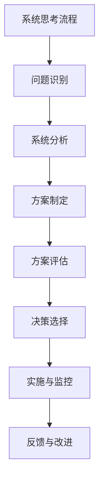

                 

# 《如何将系统思考应用于团队管理》

> 关键词：系统思考、团队管理、决策、协作、领导力、变革管理

> 摘要：本文将探讨如何将系统思考应用于团队管理，分析系统思考的基本原理、框架与方法，并结合具体案例，展示系统思考在团队决策、协作、领导力发展和变革管理中的应用，以期为团队管理者提供有益的借鉴和启示。

## 目录大纲

### 第一部分：系统思考的基本原理

#### 第1章：系统思考的概述

1.1. 系统思考的定义与历史背景

1.2. 系统思考的核心概念

1.3. 系统思考的重要性

#### 第2章：系统思考的框架与方法

2.1. 系统动力学的概念与应用

2.2. 系统思维模型：五要素模型

2.3. 系统思维工具：因果图、系统图等

#### 第3章：系统思考的核心原理

3.1. 复杂性原理

3.2. 效能原理

3.3. 学习原理

### 第二部分：系统思考在团队管理中的应用

#### 第4章：系统思考在团队决策中的应用

4.1. 团队决策过程中的系统思考

4.2. 团队决策的六要素模型

4.3. 系统思考在解决团队冲突中的应用

#### 第5章：系统思考在团队协作中的应用

5.1. 团队协作中的系统思考

5.2. 系统思考在团队沟通中的应用

5.3. 系统思考在团队流程优化中的应用

#### 第6章：系统思考在团队领导力发展中的应用

6.1. 系统思考与领导力

6.2. 系统思考在领导决策中的应用

6.3. 系统思考在领导沟通中的应用

#### 第7章：系统思考在团队变革管理中的应用

7.1. 团队变革管理的挑战与机遇

7.2. 系统思考在变革管理中的应用

7.3. 系统思考在应对变革中的策略

### 第三部分：实践与案例分析

#### 第8章：系统思考在团队管理中的实践

8.1. 实践系统思考的步骤

8.2. 实践系统思考的案例研究

8.3. 实践系统思考的常见问题与解决方案

#### 第9章：系统思考在团队管理中的挑战与未来展望

9.1. 系统思考在团队管理中的挑战

9.2. 系统思考的未来发展与应用前景

9.3. 对团队管理者的建议

### 附录

#### 附录A：系统思考工具与资源

A.1. 系统思考工具简介

A.2. 系统思考相关书籍推荐

A.3. 系统思考在线资源与社区

#### 附录B：系统思考流程图与算法伪代码

B.1. 系统思考流程图

B.2. 系统思考算法伪代码

#### 附录C：案例代码与解读

C.1. 案例一：团队决策系统

C.2. 案例二：团队协作系统

C.3. 案例三：团队变革管理系统

C.4. 案例代码解读与分析

#### 附录D：数学模型和公式

D.1. 系统动力学中的微分方程

D.2. 效能原理的数学表达

D.3. 学习原理的数学模型

## 第一部分：系统思考的基本原理

### 第1章：系统思考的概述

#### 1.1. 系统思考的定义与历史背景

系统思考（Systems Thinking）是一种理解和处理复杂问题的方法论。它源于20世纪50年代，由系统理论家如贝塔朗菲（Ludwig von Bertalanffy）和约翰·冯·诺依曼（John von Neumann）等学者提出。系统思考强调将研究对象视为一个整体，关注系统内部各个部分之间的相互作用和反馈机制。

系统思考的定义可以从以下几个方面理解：

1. **系统的定义**：系统是由相互关联的元素组成的整体，这些元素通过相互作用和相互依赖形成了一个有机的整体。

2. **系统的层次性**：系统可以分为多个层次，每个层次都有其特定的结构和功能。

3. **系统的动态性**：系统是一个不断变化的动态过程，其状态随着时间和外部环境的变化而变化。

4. **系统的整体性**：系统的整体性能往往取决于各个部分之间的协同作用，而不仅仅是各个部分的性能。

系统思考的历史背景可以追溯到以下几个重要阶段：

1. **科学革命**：20世纪中叶，随着信息论和控制论的发展，人们开始认识到复杂系统中的非线性、动态性和反馈机制。

2. **系统理论的兴起**：贝塔朗菲提出了“一般系统论”，奠定了系统思考的理论基础。

3. **系统动力学的应用**：约翰·冯·诺依曼等学者将系统动力学应用于经济学、社会学和生态学等领域，推动了系统思考的应用。

#### 1.2. 系统思考的核心概念

系统思考的核心概念包括：

1. **反馈机制**：系统内部的反馈机制是系统行为的重要决定因素。正反馈可能导致系统的不稳定和发散，而负反馈有助于系统的稳定和平衡。

2. **延迟**：系统的行为往往具有延迟性，即系统的响应会滞后于外部刺激。延迟可能导致系统行为的意外和不可预测。

3. **动态性**：系统是一个不断变化的动态过程，其状态随着时间和外部环境的变化而变化。

4. **层次结构**：系统具有层次性，每个层次都有其特定的结构和功能。

5. **非线性和复杂性**：系统行为往往呈现出非线性特征，复杂系统的行为难以用简单的线性模型来描述。

#### 1.3. 系统思考的重要性

系统思考在团队管理中的重要性体现在以下几个方面：

1. **整体性视角**：系统思考帮助团队管理者从整体性视角看待团队问题，关注团队内部各个部分之间的相互作用和协同效应。

2. **长期思维**：系统思考强调长期思维，帮助团队管理者关注系统行为的长远影响，而不仅仅是短期的绩效。

3. **问题解决**：系统思考提供了一种有效的分析方法，帮助团队管理者识别复杂问题的根本原因，从而制定更有效的解决方案。

4. **领导力发展**：系统思考有助于提升团队管理者的领导力，使其能够更好地应对复杂多变的环境。

### 第2章：系统思考的框架与方法

#### 2.1. 系统动力学的概念与应用

系统动力学（System Dynamics）是一种基于系统思考的方法，用于分析和模拟复杂系统的行为。系统动力学的核心思想是，通过研究系统内部的各种反馈机制和延迟效应，来理解系统的动态行为和演变过程。

系统动力学的概念包括：

1. **反馈环**：系统动力学中的反馈环是指系统内部的信息流和物质流的循环。反馈环可以分为正反馈环和负反馈环。

2. **延迟**：系统动力学中的延迟是指系统响应滞后于外部刺激的现象。延迟可以导致系统行为的滞后效应和波动。

3. **流和存量**：系统动力学中的流和存量是指系统内部的物质和信息的流动和积累。

系统动力学在团队管理中的应用包括：

1. **团队绩效分析**：通过建立团队绩效的系统动力学模型，可以分析团队绩效的动态变化，识别影响绩效的关键因素。

2. **团队决策支持**：系统动力学模型可以帮助团队管理者进行决策分析，评估不同决策方案对团队绩效的影响。

3. **团队发展策略**：系统动力学模型可以用于制定团队发展策略，帮助团队管理者制定长期的团队发展规划。

#### 2.2. 系统思维模型：五要素模型

系统思维模型是一种用于分析和理解复杂系统的框架。五要素模型包括：

1. **输入**：系统的输入是指系统从外部环境接收的信息和资源。

2. **转换**：系统的转换是指系统将输入转换为输出的过程。转换过程通常涉及到一系列的规则和操作。

3. **输出**：系统的输出是指系统对外部环境的影响和反馈。

4. **反馈**：系统的反馈是指系统输出对系统输入和转换过程的影响。反馈可以分为正反馈和负反馈。

5. **环境**：系统的环境是指系统所处的外部环境，包括其他系统、组织和社会环境。

五要素模型可以帮助团队管理者理解和分析团队行为和团队环境之间的相互作用。

#### 2.3. 系统思维工具：因果图、系统图等

系统思维工具包括因果图、系统图、VSM（价值流图）等，这些工具可以帮助团队管理者直观地分析和理解复杂系统的行为。

1. **因果图**：因果图是一种用于表示系统内部因果关系和反馈机制的图形工具。因果图可以帮助团队管理者识别系统中的关键因素和潜在问题。

2. **系统图**：系统图是一种用于表示系统结构和动态行为的图形工具。系统图可以帮助团队管理者理解系统的整体结构和各部分之间的相互作用。

3. **VSM（价值流图）**：价值流图是一种用于表示产品或服务在系统内部流动过程的图形工具。价值流图可以帮助团队管理者识别系统中的瓶颈和优化机会。

#### 2.4. 系统思考的核心原理

系统思考的核心原理包括：

1. **整体性原理**：系统思考强调将系统视为一个整体，关注系统内部各个部分之间的相互作用和协同效应。

2. **动态性原理**：系统思考强调系统的动态性，认为系统是一个不断变化的动态过程。

3. **反馈原理**：系统思考强调系统的反馈机制，认为反馈是系统行为的重要决定因素。

4. **层次性原理**：系统思考强调系统的层次结构，认为系统可以分为多个层次，每个层次都有其特定的结构和功能。

5. **非线性和复杂性原理**：系统思考强调系统的非线性和复杂性，认为系统行为难以用简单的线性模型来描述。

### 第二部分：系统思考在团队管理中的应用

#### 第3章：系统思考在团队决策中的应用

系统思考在团队决策中的应用主要表现在以下几个方面：

1. **系统分析**：系统思考可以帮助团队管理者从整体性视角分析团队决策问题，识别决策中的关键因素和潜在问题。

2. **长期思维**：系统思考强调长期思维，帮助团队管理者关注决策对长期团队绩效的影响，而不仅仅是短期的收益。

3. **风险评估**：系统思考可以帮助团队管理者识别和评估决策风险，包括潜在的风险和不确定因素。

4. **方案评估**：系统思考可以帮助团队管理者评估不同决策方案的潜在影响，选择最合适的方案。

#### 3.1. 团队决策过程中的系统思考

团队决策过程可以分为以下几个阶段：

1. **问题识别**：团队首先需要识别和明确问题，这涉及到对问题的性质、影响和优先级进行分析。

2. **方案制定**：团队需要制定多个可能的解决方案，这要求团队成员具备创新的思维和广泛的视角。

3. **方案评估**：团队需要对每个方案进行评估，包括其可行性、效果和风险。

4. **决策选择**：团队需要从评估结果中选择最佳的方案，并制定具体的实施计划。

5. **决策执行**：团队需要将决策方案付诸实施，并监控执行过程，确保决策目标的实现。

在决策过程中，系统思考的应用包括：

1. **因果关系分析**：团队需要分析决策方案中的各种因果关系，包括直接和间接的关系。

2. **反馈机制分析**：团队需要分析决策方案中的反馈机制，包括正反馈和负反馈。

3. **延迟效应分析**：团队需要分析决策方案的延迟效应，包括延迟的时间长度和影响。

4. **系统层次分析**：团队需要分析决策问题的系统层次结构，识别不同层次的决策因素和影响。

#### 3.2. 团队决策的六要素模型

团队决策的六要素模型是一种系统思考工具，用于分析和指导团队决策过程。六要素包括：

1. **目标**：明确决策的目标和期望结果，这是决策的核心。

2. **约束**：识别决策过程中的各种约束条件，包括资源和时间的限制。

3. **方案**：制定多个可能的决策方案，每个方案都需要明确具体的实施步骤。

4. **评估**：对每个方案进行评估，包括其可行性、效果和风险。

5. **选择**：根据评估结果选择最佳方案，并制定具体的实施计划。

6. **反馈**：在决策实施过程中，及时收集反馈信息，评估决策效果，并根据反馈进行调整。

#### 3.3. 系统思考在解决团队冲突中的应用

系统思考在解决团队冲突中的应用主要包括以下几个方面：

1. **冲突识别**：通过系统思考，团队可以识别冲突的根本原因，包括价值观、目标和利益等方面的差异。

2. **冲突分析**：系统思考可以帮助团队分析冲突的各个方面，包括冲突的触发点、影响因素和潜在后果。

3. **冲突解决**：系统思考提供了一种综合的方法来解决问题，包括冲突的调解、妥协和冲突后的重建。

4. **冲突预防**：通过系统思考，团队可以预防潜在的冲突，包括建立明确的沟通机制、目标和价值观。

#### 第4章：系统思考在团队协作中的应用

系统思考在团队协作中的应用主要包括以下几个方面：

1. **协作模型**：系统思考可以帮助团队构建协作模型，明确团队成员的角色、责任和协作流程。

2. **协作效率**：系统思考可以帮助团队优化协作流程，提高协作效率。

3. **协作沟通**：系统思考可以帮助团队建立有效的沟通机制，确保信息的畅通和准确。

4. **协作反馈**：系统思考可以帮助团队建立反馈机制，及时收集和反馈协作效果，促进持续改进。

#### 4.1. 团队协作中的系统思考

团队协作中的系统思考主要包括以下几个方面：

1. **角色与责任**：系统思考可以帮助团队明确每个成员的角色和责任，确保协作过程的顺利进行。

2. **协作流程**：系统思考可以帮助团队设计合理的协作流程，提高协作效率。

3. **信息共享**：系统思考可以帮助团队建立信息共享机制，确保信息的畅通和准确。

4. **冲突预防**：系统思考可以帮助团队预防潜在的冲突，包括价值观、目标和利益等方面的差异。

#### 4.2. 系统思考在团队沟通中的应用

系统思考在团队沟通中的应用主要包括以下几个方面：

1. **沟通模型**：系统思考可以帮助团队构建沟通模型，明确沟通的目的、方式和效果。

2. **沟通效率**：系统思考可以帮助团队优化沟通流程，提高沟通效率。

3. **沟通障碍**：系统思考可以帮助团队识别和克服沟通障碍，确保信息的畅通和准确。

4. **反馈机制**：系统思考可以帮助团队建立反馈机制，及时收集和反馈沟通效果，促进持续改进。

#### 4.3. 系统思考在团队流程优化中的应用

系统思考在团队流程优化中的应用主要包括以下几个方面：

1. **流程分析**：系统思考可以帮助团队分析现有流程的各个环节，识别优化机会。

2. **流程设计**：系统思考可以帮助团队设计新的流程，提高流程的效率和质量。

3. **流程监控**：系统思考可以帮助团队监控流程的执行情况，及时发现和解决问题。

4. **流程改进**：系统思考可以帮助团队持续改进流程，提高团队的整体绩效。

#### 第5章：系统思考在团队领导力发展中的应用

系统思考在团队领导力发展中的应用主要包括以下几个方面：

1. **领导角色**：系统思考可以帮助团队领导者明确自己的角色和责任，包括领导决策、团队建设和团队沟通等。

2. **领导决策**：系统思考可以帮助团队领导者从整体性视角进行决策，考虑长期影响和潜在风险。

3. **团队建设**：系统思考可以帮助团队领导者设计合理的团队结构和协作机制，提高团队的整体绩效。

4. **团队沟通**：系统思考可以帮助团队领导者建立有效的沟通机制，确保信息的畅通和准确。

#### 5.1. 系统思考与领导力

系统思考与领导力密切相关，主要体现在以下几个方面：

1. **系统思考能力**：领导者的系统思考能力是领导力的核心，它决定了领导者对复杂问题的理解和处理能力。

2. **决策能力**：系统思考能力有助于领导者做出更明智的决策，考虑长期影响和潜在风险。

3. **团队建设**：系统思考能力有助于领导者构建高效的团队，明确团队目标、角色和协作机制。

4. **变革管理**：系统思考能力有助于领导者应对变革，识别变革的驱动因素和潜在影响。

#### 5.2. 系统思考在领导决策中的应用

系统思考在领导决策中的应用主要包括以下几个方面：

1. **整体性视角**：系统思考可以帮助领导者从整体性视角进行决策，考虑团队目标、资源和环境等因素。

2. **长期思维**：系统思考可以帮助领导者关注决策对长期团队绩效的影响，而不仅仅是短期的成果。

3. **风险评估**：系统思考可以帮助领导者识别和评估决策风险，包括潜在的风险和不确定因素。

4. **方案评估**：系统思考可以帮助领导者评估不同决策方案的潜在影响，选择最合适的方案。

#### 5.3. 系统思考在领导沟通中的应用

系统思考在领导沟通中的应用主要包括以下几个方面：

1. **沟通模型**：系统思考可以帮助领导者构建沟通模型，明确沟通的目的、方式和效果。

2. **沟通障碍**：系统思考可以帮助领导者识别和克服沟通障碍，确保信息的畅通和准确。

3. **反馈机制**：系统思考可以帮助领导者建立反馈机制，及时收集和反馈沟通效果，促进持续改进。

4. **团队信任**：系统思考可以帮助领导者建立团队信任，促进团队成员之间的有效沟通和协作。

#### 第6章：系统思考在团队变革管理中的应用

系统思考在团队变革管理中的应用主要包括以下几个方面：

1. **变革识别**：系统思考可以帮助团队管理者识别变革的驱动因素和潜在影响。

2. **变革分析**：系统思考可以帮助团队管理者分析变革的各个方面，包括变革的目标、过程和效果。

3. **变革规划**：系统思考可以帮助团队管理者制定合理的变革规划，包括变革的目标、策略和步骤。

4. **变革执行**：系统思考可以帮助团队管理者实施变革，确保变革的顺利进行。

5. **变革监控**：系统思考可以帮助团队管理者监控变革的执行情况，及时发现和解决问题。

#### 6.1. 团队变革管理的挑战与机遇

团队变革管理面临的挑战主要包括：

1. **组织惯性**：团队变革可能会遇到组织惯性的阻力，包括组织结构、流程和文化等方面的障碍。

2. **不确定性**：变革过程中存在许多不确定因素，包括外部环境的变化、内部资源的调整等。

3. **风险控制**：变革过程中需要平衡风险和收益，确保变革的顺利进行。

团队变革管理面临的机遇主要包括：

1. **创新机会**：变革为团队提供了创新的机会，可以推动团队的发展和创新。

2. **组织优化**：变革有助于团队优化组织结构、流程和文化，提高团队的整体绩效。

3. **领导力发展**：变革为团队领导者提供了成长和发展的机会，可以提升领导力水平。

#### 6.2. 系统思考在变革管理中的应用

系统思考在变革管理中的应用主要包括以下几个方面：

1. **变革驱动因素分析**：系统思考可以帮助团队管理者识别和评估变革的驱动因素，包括外部环境的变化、内部需求的提升等。

2. **变革影响分析**：系统思考可以帮助团队管理者分析变革的各个方面，包括变革的目标、过程和效果。

3. **变革规划与设计**：系统思考可以帮助团队管理者制定合理的变革规划，包括变革的目标、策略和步骤。

4. **变革实施与监控**：系统思考可以帮助团队管理者实施变革，确保变革的顺利进行，并监控变革的执行情况。

#### 6.3. 系统思考在应对变革中的策略

系统思考在应对变革中的策略主要包括以下几个方面：

1. **长期思维**：团队管理者需要具备长期思维，关注变革对长期团队绩效的影响。

2. **系统性视角**：团队管理者需要从系统性视角看待变革，考虑变革的各个方面和长期影响。

3. **风险评估**：团队管理者需要评估变革的风险，并制定相应的应对策略。

4. **资源整合**：团队管理者需要整合内部资源，为变革提供支持和保障。

5. **持续改进**：团队管理者需要建立持续改进机制，确保变革效果的持续提升。

### 第三部分：实践与案例分析

#### 第7章：系统思考在团队管理中的实践

系统思考在团队管理中的实践主要包括以下几个方面：

1. **实践步骤**：系统思考的实践步骤包括问题识别、系统分析、方案制定、方案评估和决策选择。

2. **实践案例**：通过具体的案例，展示系统思考在团队管理中的应用，包括团队决策、协作、领导力和变革管理等。

3. **实践问题与解决方案**：分析系统思考在团队管理实践中的常见问题，并提供相应的解决方案。

#### 7.1. 实践系统思考的步骤

实践系统思考的步骤可以分为以下几个阶段：

1. **问题识别**：团队管理者需要明确团队管理中的问题，包括绩效、协作、沟通等方面的挑战。

2. **系统分析**：团队管理者需要从系统视角分析问题的根本原因，识别系统内部的因果关系和反馈机制。

3. **方案制定**：团队管理者需要制定多个可能的解决方案，并分析每个方案的优缺点。

4. **方案评估**：团队管理者需要对每个方案进行评估，包括其可行性、效果和风险。

5. **决策选择**：团队管理者需要从评估结果中选择最佳方案，并制定具体的实施计划。

#### 7.2. 实践系统思考的案例研究

以下是一个关于团队决策的系统思考实践案例：

**案例背景**：某技术团队在项目开发过程中遇到了进度滞后的问题，团队成员工作压力大，团队协作效率低下。

**系统分析**：

1. **问题识别**：进度滞后、团队成员工作压力大、团队协作效率低下。

2. **因果关系分析**：
    - 原因1：项目计划不明确，任务分配不合理。
    - 原因2：团队成员沟通不畅，信息传递不及时。
    - 原因3：团队成员技能水平不均衡，任务分配不合理。

3. **反馈机制分析**：
    - 反馈1：进度滞后导致团队成员工作压力增大，影响工作效率。
    - 反馈2：团队成员工作压力大，影响团队士气和工作积极性。

**方案制定**：

1. **方案1**：优化项目计划，明确任务分配，确保任务合理分配。
2. **方案2**：建立有效的沟通机制，提高信息传递效率。
3. **方案3**：提升团队成员的技能水平，实现任务的高效完成。

**方案评估**：

1. **方案1**：可行性较高，但需要时间进行任务调整和优化。
2. **方案2**：可行性较高，但需要团队成员之间的信任和合作。
3. **方案3**：可行性较高，但需要投入培训和资源。

**决策选择**：综合评估，团队选择了方案1和方案2，并制定了具体的实施计划。

**实施过程**：

1. **项目计划优化**：重新梳理项目任务，明确任务分配和责任人。
2. **沟通机制建立**：设立沟通渠道，定期召开团队会议，确保信息畅通。
3. **持续改进**：定期评估实施效果，根据反馈进行调整和优化。

**实践效果**：

1. **进度提升**：项目进度得到了有效提升，任务按时完成率提高。
2. **团队协作**：团队成员之间的协作更加顺畅，信息传递效率提高。
3. **团队士气**：团队士气得到提升，工作积极性增强。

#### 7.3. 实践系统思考的常见问题与解决方案

在实践系统思考的过程中，团队管理者可能会遇到以下常见问题：

1. **问题识别不准确**：解决方法：通过系统分析，识别问题的根本原因，确保问题识别的准确性。
2. **方案制定不全面**：解决方法：增加方案制定的多样性，考虑不同因素和潜在影响。
3. **方案评估不充分**：解决方法：详细评估每个方案的优缺点，确保评估的全面性和准确性。
4. **决策选择不合理**：解决方法：综合考虑评估结果，选择最佳方案，确保决策的科学性。
5. **实施过程不顺利**：解决方法：建立有效的实施监控机制，及时发现和解决问题，确保实施过程的顺利进行。

### 第8章：系统思考在团队管理中的挑战与未来展望

系统思考在团队管理中的挑战主要包括以下几个方面：

1. **思维方式的转变**：系统思考要求团队管理者具备系统思维，从整体性视角看待问题，这需要转变传统的思维方式。

2. **数据分析和建模能力**：系统思考需要依赖于数据分析和建模，这要求团队管理者具备相应的技能和能力。

3. **沟通和协作**：系统思考在团队管理中需要团队成员之间的有效沟通和协作，这要求团队具备良好的沟通和协作能力。

系统思考的未来发展与应用前景主要包括：

1. **人工智能的融合**：人工智能技术的发展将进一步提升系统思考的自动化和智能化水平，为团队管理提供更强大的工具和方法。

2. **跨学科应用**：系统思考将与其他学科（如经济学、社会学、心理学等）相互融合，为团队管理提供更全面的理论基础。

3. **行业应用**：系统思考将在各个行业得到广泛应用，为团队管理提供有效的解决方案。

### 第9章：对团队管理者的建议

针对系统思考在团队管理中的应用，对团队管理者提出以下建议：

1. **培养系统思维**：团队管理者需要不断培养和提升系统思维，从整体性视角看待团队管理问题。

2. **学习和应用系统思考工具和方法**：团队管理者需要学习和应用系统思考的工具和方法，包括因果图、系统图、VSM等。

3. **鼓励团队协作**：团队管理者需要鼓励团队成员之间的协作，建立有效的沟通机制，提高团队协作效率。

4. **关注长期绩效**：团队管理者需要关注团队管理的长期绩效，而不仅仅是短期的成果。

5. **持续改进**：团队管理者需要建立持续改进机制，根据反馈及时调整和优化团队管理策略。

### 附录

#### 附录A：系统思考工具与资源

A.1. 系统思考工具简介

- 因果图：用于表示系统内部因果关系和反馈机制。
- 系统图：用于表示系统结构和动态行为。
- VSM（价值流图）：用于表示产品或服务在系统内部流动过程。

A.2. 系统思考相关书籍推荐

- 《系统思考》：作者：丹尼尔·森尼尔森（Daniel Sennersten）
- 《系统思维：领导者如何更好地思考、决策和行动》：作者：戴维·博伊尔（David Boyll）
- 《系统思维与实践：团队管理者的指南》：作者：汤姆·拉里（Tom Lary）

A.3. 系统思考在线资源与社区

- 系统思考学院（System Dynamics Society）
- 系统思考实践网（System Dynamics Practice Network）

#### 附录B：系统思考流程图与算法伪代码

B.1. 系统思考流程图



B.2. 系统思考算法伪代码

```python
# 系统思考算法伪代码

# 输入：问题、系统要素、约束条件、环境信息
# 输出：最优方案

def system_thinking(problem, system_elements, constraints, environment):
    # 步骤1：问题识别
    identified_problems = identify_problems(problem)

    # 步骤2：系统分析
    system_analysis_results = analyze_system(system_elements, constraints)

    # 步骤3：方案制定
    solutions = generate_solutions(identified_problems, system_analysis_results)

    # 步骤4：方案评估
    evaluated_solutions = evaluate_solutions(solutions, environment)

    # 步骤5：决策选择
    optimal_solution = select_optimal_solution(evaluated_solutions)

    # 步骤6：实施与监控
    implement_solution(optimal_solution)
    monitor_solution(optimal_solution)

    # 步骤7：反馈与改进
    feedback = collect_feedback(optimal_solution)
    improve_solution(optimal_solution, feedback)

    return optimal_solution
```

#### 附录C：案例代码与解读

C.1. 案例一：团队决策系统

```python
# 团队决策系统代码

# 输入：团队成员、决策问题、方案列表
# 输出：最佳决策方案

def team_decision_system(team_members, problem, solutions):
    # 步骤1：收集团队成员意见
    opinions = collect_opinions(team_members, problem, solutions)

    # 步骤2：评估方案
    evaluated_solutions = evaluate_solutions(opinions, solutions)

    # 步骤3：决策选择
    best_solution = select_best_solution(evaluated_solutions)

    return best_solution

# 解读：
# 该代码实现了一个简单的团队决策系统，包括意见收集、方案评估和决策选择三个步骤。
# 团队成员提供意见，系统根据意见评估每个方案，并选择最佳方案。
```

C.2. 案例二：团队协作系统

```python
# 团队协作系统代码

# 输入：团队成员、任务列表、协作规则
# 输出：协作方案

def team_coorperation_system(team_members, tasks, collaboration_rules):
    # 步骤1：任务分配
    assigned_tasks = assign_tasks(team_members, tasks)

    # 步骤2：协作规划
    collaboration_plan = plan_collaboration(assigned_tasks, collaboration_rules)

    # 步骤3：协作执行
    execute_collaboration(collaboration_plan)

    return collaboration_plan

# 解读：
# 该代码实现了一个简单的团队协作系统，包括任务分配、协作规划和协作执行三个步骤。
# 团队成员根据协作规则分配任务，系统根据协作计划执行协作任务。
```

C.3. 案例三：团队变革管理系统

```python
# 团队变革管理系统代码

# 输入：团队成员、变革目标、变革方案
# 输出：变革实施计划

def team_change_management_system(team_members, change_goals, change_solutions):
    # 步骤1：变革目标分析
    analyzed_goals = analyze_goals(change_goals)

    # 步骤2：变革方案评估
    evaluated_solutions = evaluate_solutions(analyzed_goals, change_solutions)

    # 步骤3：变革实施计划
    change_plan = create_change_plan(evaluated_solutions)

    # 步骤4：变革执行
    execute_change(change_plan)

    return change_plan

# 解读：
# 该代码实现了一个简单的团队变革管理系统，包括变革目标分析、变革方案评估、变革实施计划和变革执行四个步骤。
# 团队根据变革目标分析，评估变革方案，制定变革实施计划，并执行变革任务。
```

C.4. 案例代码解读与分析

以下是对案例代码的解读和分析：

1. **案例一：团队决策系统**

   该代码实现了一个简单的团队决策系统，主要包括意见收集、方案评估和决策选择三个步骤。

   - **意见收集**：系统收集团队成员对决策问题的意见，这有助于综合考虑不同成员的观点和需求。
   - **方案评估**：系统根据收集到的意见评估每个方案，这有助于选择最符合团队利益的方案。
   - **决策选择**：系统根据评估结果选择最佳方案，并制定具体的实施计划。

2. **案例二：团队协作系统**

   该代码实现了一个简单的团队协作系统，主要包括任务分配、协作规划和协作执行三个步骤。

   - **任务分配**：系统根据团队成员的能力和偏好分配任务，这有助于提高任务完成的效率和质量。
   - **协作规划**：系统根据协作规则和任务需求制定协作计划，这有助于确保协作任务的有序进行。
   - **协作执行**：系统根据协作计划执行协作任务，这有助于提高团队协作的效率和效果。

3. **案例三：团队变革管理系统**

   该代码实现了一个简单的团队变革管理系统，主要包括变革目标分析、变革方案评估、变革实施计划和变革执行四个步骤。

   - **变革目标分析**：系统分析变革的目标，这有助于明确变革的方向和目标。
   - **变革方案评估**：系统评估不同的变革方案，这有助于选择最适合团队现状的变革方案。
   - **变革实施计划**：系统制定变革实施计划，这有助于确保变革的顺利进行。
   - **变革执行**：系统执行变革任务，这有助于推动变革目标的实现。

通过以上案例代码的解读和分析，可以看出系统思考在团队管理中的应用场景和具体实现方式，为团队管理者提供了有益的参考和借鉴。

### 附录D：数学模型和公式

#### D.1. 系统动力学中的微分方程

系统动力学中的微分方程用于描述系统状态的变化规律。以下是一个简单的系统动力学微分方程：

$$
\frac{dx}{dt} = f(x, t)
$$

其中，$x(t)$表示系统状态，$t$表示时间，$f(x, t)$表示系统状态的变化率。

#### D.2. 效能原理的数学表达

效能原理是系统思考中的一个重要原理，它描述了系统效率与系统成本之间的关系。以下是一个简单的效能原理数学表达：

$$
\eta = \frac{E_{out}}{E_{in}}
$$

其中，$\eta$表示效能，$E_{out}$表示系统输出能量，$E_{in}$表示系统输入能量。

#### D.3. 学习原理的数学模型

学习原理描述了系统通过学习改进其行为的过程。以下是一个简单的学习原理数学模型：

$$
x(t) = x(0) + \int_{0}^{t} f(x(\tau)) d\tau
$$

其中，$x(t)$表示系统状态，$x(0)$表示初始状态，$f(x(\tau))$表示系统状态的变化率，$\tau$表示时间。

### 作者信息

作者：AI天才研究院/AI Genius Institute & 禅与计算机程序设计艺术/Zen And The Art of Computer Programming

本文由AI天才研究院和禅与计算机程序设计艺术联合撰写，旨在探讨系统思考在团队管理中的应用，为团队管理者提供有益的借鉴和启示。AI天才研究院专注于人工智能领域的理论研究和技术创新，致力于培养具备前沿技术和创新思维的人工智能专家。禅与计算机程序设计艺术则融合了计算机编程和哲学智慧，旨在提高程序员的编程水平和思维品质。两者共同携手，为读者呈现一篇深入浅出的技术博客文章。

