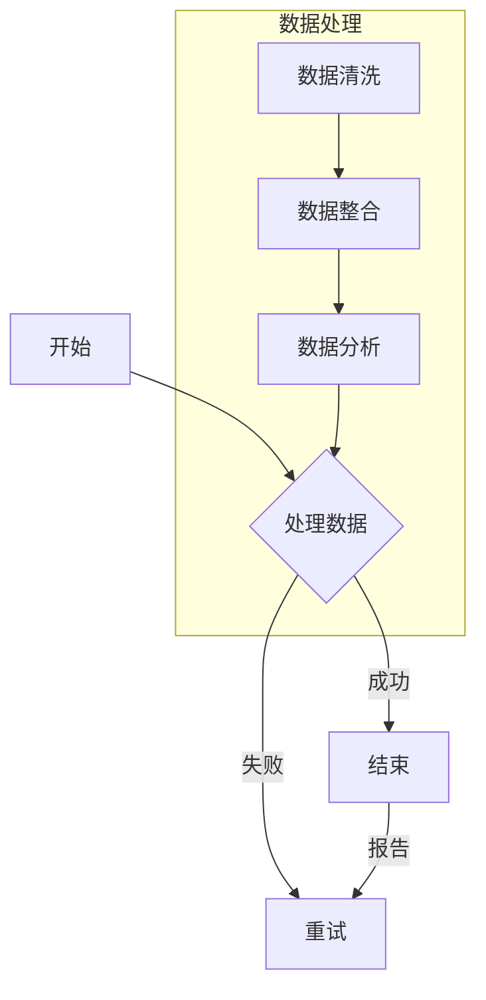

                 

## 文章标题：如何将系统思考应用于团队管理

### 关键词：系统思考，团队管理，反馈循环，整体性，分层结构，动态演变

> _摘要：本文将探讨系统思考在团队管理中的应用，通过分析系统思考的基本原理和核心概念，阐述其在团队管理中的重要性。本文将构建一个系统思考框架，探讨团队管理的系统思考方法，并分析团队冲突、团队协作以及团队长期发展的系统思考应用。最后，通过实际案例分析，展示系统思考在团队管理中的具体实施方法和工具。_

## 第一部分：系统思考在团队管理中的应用

### 第1章：系统思考的基本原理

#### 第1.1节：系统思考的定义与核心概念

##### 1.1.1 系统思考的概念解析

系统思考（Systems Thinking）是一种方法论，旨在理解复杂系统中的动态性和相互依赖关系。它强调整体性、连续性、反馈循环和分层结构，通过这些核心概念来揭示复杂系统的运行机制。

系统思考的基本框架包括以下几个方面：

1. **整体性**：系统思考认为系统中的各个部分是相互依赖、相互作用的，而不是孤立的个体。整体性要求我们从全局角度来理解系统的行为。
2. **连续性**：系统思考关注系统状态的连续变化，认为系统的动态行为是时间驱动的，而不是突然发生的。连续性强调我们应关注系统的演变过程。
3. **反馈循环**：系统思考强调系统内部的反馈机制，包括正反馈和负反馈。正反馈会导致系统行为的加速，而负反馈则有助于系统的稳定。
4. **分层结构**：系统思考认为系统具有层次结构，不同层次的元素相互作用，共同影响系统的整体行为。
5. **动态演变**：系统思考关注系统的动态演变过程，认为系统的行为是不断变化的，并且受到内外部因素的影响。

##### 1.1.2 系统思考与传统思维方式的区别

传统思维方式通常采用线性思维，关注因果关系，认为问题可以通过单一因素来解决。而系统思考则强调复杂系统的相互依赖性和动态性，认为问题往往是多维度的，需要从整体和长远角度来考虑。

传统思维方式的缺点包括：

1. **忽视整体性**：传统思维方式往往只关注局部问题，忽视整体系统的相互作用和影响。
2. **忽视连续性**：传统思维方式通常关注短期效应，忽视系统状态的长期演变。
3. **忽视反馈循环**：传统思维方式往往忽视系统内部的反馈机制，导致问题反复出现。

系统思考的优势包括：

1. **提升决策质量**：通过系统思考，管理者可以更好地理解复杂系统的运行机制，从而做出更高质量的决策。
2. **促进创新**：系统思考有助于发现新的解决方案，促进创新。
3. **提高问题解决能力**：系统思考提供了一种系统性的问题解决方法，有助于识别和解决复杂问题。

#### 第1.2节：系统思考的核心概念

##### 1.2.1 整体性

整体性是系统思考的核心概念之一，强调系统中的各个部分是相互依赖、相互作用的。在团队管理中，整体性要求管理者从全局角度来考虑问题，关注团队内部各个部门、成员之间的协作和互动。

整体性在团队管理中的应用包括：

1. **战略规划**：在制定团队战略时，需要考虑整个团队的目标、资源和能力，确保各部门之间的协调和配合。
2. **资源分配**：在资源分配时，需要考虑各个部门的需求和优先级，确保资源的合理利用。
3. **问题解决**：在解决问题时，需要考虑问题的根本原因和影响范围，避免只解决表面问题而忽视深层次问题。

##### 1.2.2 连续性

连续性强调系统状态的连续变化，而不是突然的跳变。在团队管理中，连续性要求管理者关注团队的长期发展，而不是只关注短期绩效。

连续性在团队管理中的应用包括：

1. **绩效评估**：在评估团队绩效时，需要考虑团队长期的表现，而不仅仅是短期的成绩。
2. **团队建设**：在团队建设中，需要持续关注团队成员的成长和发展，而不是只关注短期成果。
3. **变革管理**：在变革管理中，需要考虑变革的连续性和稳定性，确保变革能够持续发挥作用。

##### 1.2.3 反馈循环

反馈循环是系统思考中的另一个核心概念，包括正反馈和负反馈。正反馈会导致系统行为的加速，而负反馈有助于系统的稳定。

反馈循环在团队管理中的应用包括：

1. **团队沟通**：建立有效的沟通机制，确保团队内部的信息流动和反馈。
2. **决策制定**：在决策制定过程中，充分利用团队内外部的反馈信息，以提高决策质量。
3. **绩效改进**：通过收集团队成员的反馈，不断改进团队的工作流程和绩效。

##### 1.2.4 分层结构

分层结构是系统思考中的一个重要概念，强调系统具有不同的层次，每个层次的元素相互影响。在团队管理中，分层结构要求管理者关注不同层次的管理需求和问题。

分层结构在团队管理中的应用包括：

1. **组织架构**：设计合理的组织架构，确保各级管理者的职责和权限清晰。
2. **权责划分**：明确各级管理者和团队成员的权责，确保团队运作的高效和稳定。
3. **跨部门协作**：促进跨部门之间的沟通和协作，提高整体团队的工作效率。

##### 1.2.5 动态演变

动态演变强调系统的行为是不断变化的，并且受到内外部因素的影响。在团队管理中，动态演变要求管理者关注团队的变化和发展，及时调整管理策略。

动态演变在团队管理中的应用包括：

1. **市场变化**：关注市场动态，及时调整团队战略和目标。
2. **技术创新**：关注技术创新趋势，推动团队不断进步和提升。
3. **团队发展**：关注团队成员的成长和变化，提供相应的培训和激励。

### 第2章：系统思考的基本工具

#### 第2.1节：模拟与模型构建

##### 2.1.1 模拟的概念

模拟是一种通过建立模型来模拟系统行为的方法。它可以帮助我们更好地理解系统的动态性和复杂性，为决策提供依据。

##### 2.1.2 常用模拟工具介绍

常用的模拟工具包括MATLAB、Python、AnyLogic等。

1. **MATLAB**：MATLAB是一款强大的数值计算软件，可用于构建和运行模拟模型。它提供了丰富的数学函数和工具箱，方便用户进行模型构建和仿真。
2. **Python**：Python是一种流行的编程语言，具有简洁易读的特点。它拥有多个用于模拟和仿真的库，如SimPy、PySim等，方便用户进行模型构建和仿真。
3. **AnyLogic**：AnyLogic是一款专业的模拟和仿真软件，提供了丰富的建模工具和仿真功能。它支持多种建模方法，如离散事件模拟、过程式模拟等，适用于复杂系统的建模和仿真。

#### 第2.2节：方程式建模

##### 2.2.1 基本方程式

方程式建模是一种通过建立数学方程来描述系统行为的方法。它可以帮助我们理解和预测系统的动态行为。

##### 2.2.2 模型构建步骤

1. **确定系统变量**：识别系统中关键的变量，如输入、输出、状态等。
2. **建立方程式**：根据系统变量之间的关系，建立相应的数学方程。
3. **参数估计**：对模型中的参数进行估计，以使模型更接近实际系统。
4. **模型校验**：通过仿真和实验数据来验证模型的准确性和可靠性。
5. **模型优化**：根据模型校验结果，对模型进行优化，以提高模型的精度和适用性。

#### 第2.3节：系统思考的应用案例

##### 2.3.1 企业战略规划

系统思考在战略规划中具有重要的应用价值。通过系统思考，企业可以更好地理解外部环境和内部资源，制定更具前瞻性和可行性的战略规划。

##### 2.3.2 项目管理

系统思考在项目管理中也有广泛的应用。通过系统思考，项目管理者可以更好地理解项目的复杂性和风险，制定更科学合理的管理策略。

### 第3章：团队管理的系统思考框架

#### 第3.1节：团队动态与系统思考

##### 3.1.1 团队结构与互动

团队结构是团队管理的基础，包括团队的组成、组织架构、角色分配等。系统思考强调团队结构的整体性和连续性，认为团队中的各个部分是相互依赖、相互作用的。

##### 3.1.2 系统思维在团队管理中的应用

系统思维在团队管理中的应用主要包括以下几个方面：

1. **团队目标的设定**：通过系统思考，确定团队的整体目标，并确保各个部门和个人目标的一致性。
2. **团队决策与执行**：通过系统思考，制定更科学合理的决策，并确保决策的连续性和稳定性。
3. **团队沟通**：通过系统思考，建立有效的沟通机制，确保团队内部的信息流动和反馈。
4. **团队冲突管理**：通过系统思考，分析团队冲突的原因和影响，制定相应的冲突管理策略。
5. **团队协作**：通过系统思考，优化团队协作流程，提高团队的工作效率和创新能力。

#### 第3.2节：系统思考与领导力

##### 3.2.1 领导者的角色

系统思考强调领导者的角色，认为领导者是团队的引导者和协调者。领导者需要具备系统思考的能力，以更好地理解团队的动态性和复杂性。

##### 3.2.2 系统思考与团队发展

系统思考在团队发展中也有重要的应用价值。通过系统思考，团队可以更好地理解自身的发展阶段和需求，制定相应的发展策略。

#### 第3.3节：系统思考与团队沟通

##### 3.3.1 沟通中的反馈循环

反馈循环是系统思考中的一个重要概念，在团队沟通中也具有重要意义。通过有效的反馈循环，团队可以更好地理解成员的需求和意见，提高沟通效果。

##### 3.3.2 有效沟通策略

有效沟通策略包括以下几个方面：

1. **明确沟通目标**：在沟通前明确沟通的目标和内容，确保沟通的针对性。
2. **倾听和理解**：在沟通中注重倾听和理解对方的观点，避免误解和冲突。
3. **积极回应**：在沟通中积极回应对方的意见和需求，建立互信和合作关系。
4. **信息传递**：通过多种渠道传递信息，确保信息的准确性和及时性。
5. **沟通评估**：在沟通结束后对沟通效果进行评估，发现问题并及时改进。

### 第4章：系统思考在团队冲突管理中的应用

#### 第4.1节：团队冲突的类型与原因

##### 4.1.1 冲突的类型

团队冲突可以分为功能性冲突和破坏性冲突。

1. **功能性冲突**：功能性冲突有助于团队创新和提高绩效，但过度或不合理的功能性冲突可能导致团队分裂。
2. **破坏性冲突**：破坏性冲突损害团队的合作关系，降低团队绩效，甚至导致团队解散。

##### 4.1.2 冲突的原因

团队冲突的原因可以分为个人因素、团队因素和组织因素。

1. **个人因素**：个人价值观、性格、能力等方面的差异可能导致冲突。
2. **团队因素**：团队目标不明确、沟通不畅、资源分配不合理等因素可能导致冲突。
3. **组织因素**：组织文化、管理风格、激励制度等因素可能影响团队冲突的产生和解决。

#### 第4.2节：系统思考在冲突管理中的角色

##### 4.2.1 系统思考的冲突分析方法

系统思考提供了多种冲突分析方法，包括整体性分析、连续性分析和反馈循环分析。

1. **整体性分析**：从整体角度分析冲突的根源和影响，避免只关注局部问题。
2. **连续性分析**：分析冲突的发展过程，了解冲突的演变趋势。
3. **反馈循环分析**：分析冲突中的反馈机制，找出冲突的循环模式和解决方法。

##### 4.2.2 冲突管理策略

系统思考在冲突管理中的应用主要包括以下几个方面：

1. **预防策略**：通过明确团队目标和沟通机制，减少冲突的产生。
2. **解决策略**：通过有效的沟通和调解，解决已经产生的冲突。
3. **调解策略**：通过中立的第三方调解，协助冲突双方达成共识。

#### 第4.3节：系统思考在团队冲突案例分析

##### 4.3.1 案例一：团队目标不一致

1. **冲突背景**：团队成员对团队目标有不同的理解和期望，导致工作协调不畅。
2. **冲突分析**：通过整体性分析和连续性分析，找出冲突的根源和演变趋势。
3. **冲突解决方案**：通过制定明确的团队目标和沟通机制，解决冲突。

##### 4.3.2 案例二：沟通不畅

1. **冲突背景**：团队成员之间的沟通不畅，导致误解和冲突。
2. **冲突分析**：通过反馈循环分析和整体性分析，找出冲突的原因和影响。
3. **冲突解决方案**：通过建立有效的沟通机制，提高团队成员之间的沟通效果。

### 第5章：系统思考在团队协作中的应用

#### 第5.1节：团队协作的系统思考框架

##### 5.1.1 团队协作的要素

团队协作的要素包括个人能力、团队结构和沟通机制。

1. **个人能力**：团队成员需要具备相应的能力，如专业技能、沟通能力、团队协作能力等。
2. **团队结构**：团队结构需要合理设计，以促进团队成员之间的协作和互动。
3. **沟通机制**：沟通机制是团队协作的重要保障，包括沟通渠道、沟通方式和沟通工具等。

##### 5.1.2 系统思考在团队协作中的应用

系统思考在团队协作中的应用主要包括以下几个方面：

1. **团队目标的设定**：通过系统思考，明确团队的目标和方向，确保团队成员的一致性。
2. **团队角色的分配**：通过系统思考，合理分配团队成员的角色和职责，提高团队协作的效率。
3. **团队流程的设计**：通过系统思考，优化团队的工作流程，提高团队协作的效果。

#### 第5.2节：系统思考与团队效能提升

##### 5.2.1 团队效能评估指标

团队效能评估指标包括产出指标、成本指标和人员指标。

1. **产出指标**：衡量团队的工作成果，如项目完成度、产品质量等。
2. **成本指标**：衡量团队的工作成本，如人力成本、材料成本等。
3. **人员指标**：衡量团队成员的工作状态和绩效，如出勤率、工作效率等。

##### 5.2.2 系统思考在团队效能提升中的应用

系统思考在团队效能提升中的应用主要包括以下几个方面：

1. **效能瓶颈分析**：通过系统思考，找出团队效能的瓶颈和问题，制定相应的改进措施。
2. **效能提升策略**：通过系统思考，制定科学合理的效能提升策略，提高团队的整体效能。

#### 第5.3节：系统思考与团队创新

##### 5.3.1 团队创新的过程

团队创新的过程包括创新思维的培养、创新项目的管理、创新资源的整合和创新流程的优化。

1. **创新思维的培养**：通过系统思考，培养团队成员的创新思维，提高团队的创新能力。
2. **创新项目的管理**：通过系统思考，制定科学合理的管理策略，确保创新项目的顺利进行。
3. **创新资源的整合**：通过系统思考，整合团队内外部的创新资源，提高团队的创新能力。
4. **创新流程的优化**：通过系统思考，优化团队的创新流程，提高创新效率和效果。

### 第6章：系统思考在团队长期发展中的应用

#### 第6.1节：团队长期发展的系统思考

##### 6.1.1 长期发展的目标设定

团队长期发展的目标设定包括以下几个方面：

1. **组织使命**：明确团队的组织使命，确保团队长期发展的方向和目标。
2. **战略目标**：制定具体的战略目标，指导团队在长期发展中的行动和决策。
3. **愿景规划**：规划团队的长期愿景，为团队的发展提供动力和方向。

##### 6.1.2 长期发展的关键因素

团队长期发展的关键因素包括人力资源、技术创新和组织文化。

1. **人力资源**：团队的发展离不开优秀的人才，需要注重人才的招聘、培养和激励。
2. **技术创新**：团队需要持续关注技术创新，以保持竞争优势和持续发展。
3. **组织文化**：团队需要建立良好的组织文化，以增强团队的凝聚力和执行力。

#### 第6.2节：系统思考在团队战略规划中的应用

##### 6.2.1 战略规划的步骤

团队战略规划包括以下几个步骤：

1. **内部分析**：分析团队内部的优势、劣势、资源和管理现状。
2. **外部分析**：分析外部环境的变化、市场趋势、竞争态势等。
3. **战略选择**：根据内部分析和外部分析的结果，制定合适的战略方案。

##### 6.2.2 系统思考在战略规划中的应用

系统思考在战略规划中的应用主要包括以下几个方面：

1. **战略目标的设定**：通过系统思考，明确团队的战略目标，确保战略目标的科学性和可操作性。
2. **战略路径的选择**：通过系统思考，选择合适的战略路径，确保战略规划的实施和执行。
3. **战略评估与调整**：通过系统思考，对战略实施进行评估和调整，确保战略规划的有效性和适应性。

#### 第6.3节：系统思考在团队可持续发展中的应用

##### 6.3.1 可持续发展的内涵

可持续发展是指团队在经济、社会和环境等方面的持续发展，包括以下几个方面：

1. **经济可持续发展**：团队在经济效益方面的持续发展，提高盈利能力和市场竞争力。
2. **社会可持续发展**：团队在社会责任方面的持续发展，关注社会公益和员工福利。
3. **环境可持续发展**：团队在环境保护方面的持续发展，减少环境污染和资源浪费。

##### 6.3.2 系统思考在可持续发展中的应用

系统思考在可持续发展中的应用主要包括以下几个方面：

1. **可持续发展目标的设定**：通过系统思考，明确团队的可持续发展目标，确保可持续发展目标的科学性和可操作性。
2. **可持续发展战略的选择**：通过系统思考，选择合适的可持续发展战略，确保可持续发展战略的实施和执行。
3. **可持续发展评估与调整**：通过系统思考，对可持续发展实施进行评估和调整，确保可持续发展目标的实现和持续改进。

### 第二部分：系统思考在团队管理中的应用实战

#### 第7章：系统思考在团队管理中的案例分析

##### 7.1 案例一：某科技公司的团队管理挑战

###### 7.1.1 案例背景

某科技公司是一家专注于软件开发和信息技术服务的公司，公司团队由多个部门组成，包括研发、市场、运营和客服等。随着公司的快速发展，团队管理方面的问题逐渐凸显，主要表现在以下几个方面：

1. **团队沟通不畅**：各部门之间的沟通效率低下，导致信息传递不及时，工作协调困难。
2. **冲突频发**：由于各部门目标和职责不明确，团队成员之间的冲突不断，影响了团队的凝聚力和工作效率。
3. **团队效能低下**：团队成员的工作效率和绩效不理想，项目进度延误，质量不稳定，成本超支。

###### 7.1.2 问题分析

通过对公司团队管理问题的分析，可以发现以下问题：

1. **整体性缺失**：团队管理缺乏整体性思维，各部门之间的协调和配合不够，导致信息传递不畅和工作协调困难。
2. **连续性不足**：团队管理缺乏长期规划和持续改进，只关注短期绩效，忽视了团队的长远发展和绩效提升。
3. **反馈循环不畅**：团队内部缺乏有效的反馈机制，无法及时收集和利用团队成员的意见和反馈，导致问题反复出现，难以解决。
4. **分层结构不合理**：团队管理层次结构不合理，管理职责和权限不清晰，导致管理混乱和工作效率低下。

###### 7.1.3 系统思考的应用

为了解决上述问题，公司决定采用系统思考的方法，对团队管理进行优化和改进。具体措施如下：

1. **整体性分析**：通过整体性分析，明确团队的目标和职责，制定统一的工作标准和流程，确保各部门之间的协调和配合。
2. **连续性规划**：通过连续性规划，制定团队的中长期发展目标和战略，确保团队的长期发展和绩效提升。
3. **反馈循环优化**：通过优化反馈循环，建立有效的反馈机制，及时收集和利用团队成员的意见和反馈，提高团队的问题解决能力和工作效率。
4. **分层结构优化**：通过分层结构优化，明确管理职责和权限，建立科学合理的组织架构，提高团队的管理效率和执行力。

###### 7.1.4 解决方案与实施

根据系统思考的优化方案，公司采取以下具体措施：

1. **制定统一目标和流程**：公司制定了统一的工作目标和流程，确保各部门之间的工作协调和配合。同时，通过定期的工作例会和跨部门沟通会议，加强信息传递和交流。
2. **实施中长期发展规划**：公司制定了中长期发展规划，明确了团队的目标和战略。通过定期评估和调整，确保发展规划的科学性和可操作性。
3. **建立反馈机制**：公司建立了有效的反馈机制，通过定期的员工调查、绩效评估和反馈会议，及时收集和利用团队成员的意见和反馈，提高团队的问题解决能力和工作效率。
4. **优化组织架构**：公司优化了组织架构，明确了管理职责和权限，建立了科学合理的组织架构。通过定期的培训和考核，提高团队的管理效率和执行力。

通过上述措施的实施，公司团队管理问题得到了有效解决，团队沟通畅通，冲突减少，工作效率和绩效显著提升，为公司的可持续发展奠定了坚实基础。

##### 7.2 案例二：某电商平台的团队协作与效能提升

###### 7.2.1 案例背景

某电商平台是一家大型在线购物平台，团队由多个部门组成，包括产品研发、市场营销、客户服务、物流配送等。随着公司业务规模不断扩大，团队协作和效能提升成为关键问题。具体表现在以下几个方面：

1. **团队成员角色不清**：团队成员的角色和职责不够明确，导致工作重复和职责冲突，影响团队协作效率。
2. **沟通效率低下**：团队成员之间的沟通不够顺畅，信息传递不及时，导致工作进度延误和问题解决困难。
3. **效能提升需求**：公司希望提升团队整体效能，提高项目完成度、产品质量和客户满意度。

###### 7.2.2 问题分析

通过对电商平台团队协作和效能提升问题的分析，可以发现以下问题：

1. **角色不清**：团队成员的角色和职责不够明确，导致工作重复和职责冲突，影响团队协作效率。
2. **沟通不畅**：团队成员之间的沟通不够顺畅，信息传递不及时，导致工作进度延误和问题解决困难。
3. **协作机制不足**：团队协作机制不够完善，缺乏有效的协作工具和流程，影响团队协作效率。
4. **效能瓶颈**：团队在项目管理和资源配置方面存在效能瓶颈，导致项目完成度和产品质量受到影响。

###### 7.2.3 系统思考的应用

为了解决上述问题，电商平台决定采用系统思考的方法，对团队协作和效能提升进行优化和改进。具体措施如下：

1. **角色明确**：通过系统思考，明确团队成员的角色和职责，制定明确的工作标准和流程，确保团队成员之间的协作效率。
2. **沟通优化**：通过系统思考，优化团队成员之间的沟通机制，建立畅通的信息传递渠道，提高沟通效率。
3. **协作机制完善**：通过系统思考，完善团队协作机制，建立有效的协作工具和流程，提高团队协作效率。
4. **效能提升**：通过系统思考，分析团队效能瓶颈，制定科学合理的效能提升策略，提高项目完成度、产品质量和客户满意度。

###### 7.2.4 解决方案与实施

根据系统思考的优化方案，电商平台采取以下具体措施：

1. **角色明确**：电商平台通过岗位说明书和角色分配表，明确团队成员的角色和职责，确保团队成员的工作方向和目标一致。同时，通过定期的角色培训和沟通，强化团队成员的角色意识，提高协作效率。

2. **沟通优化**：电商平台建立了多层次的沟通机制，包括部门例会、跨部门沟通会议和即时通讯工具等。通过定期的沟通会议，加强团队成员之间的信息传递和交流，确保工作进度和问题解决。

3. **协作机制完善**：电商平台引入了项目管理工具和协作平台，建立标准化的项目管理和协作流程。通过项目管理工具，明确项目的任务分配、进度跟踪和资源调配，提高项目完成度。通过协作平台，实现团队成员之间的文档共享、任务协作和实时沟通，提高协作效率。

4. **效能提升**：电商平台通过系统思考和数据分析，找出效能瓶颈，制定针对性的效能提升策略。例如，优化项目流程，减少不必要的环节和等待时间；加强员工培训和技能提升，提高员工的工作能力和效率；引入先进的技术工具，提高工作效率和质量。

通过上述措施的实施，电商平台团队协作效率显著提升，项目完成度和产品质量得到提高，客户满意度不断提升，为公司的持续发展奠定了坚实基础。

### 第8章：系统思考在团队管理中的工具与方法

#### 8.1 系统思考工具介绍

系统思考在团队管理中需要运用一系列的工具和方法，这些工具和方法可以帮助团队更好地理解复杂系统，提高决策质量和协作效率。

##### 8.1.1 方程式建模

方程式建模是系统思考中的一个重要工具，它通过建立数学方程来描述系统中的变量关系和行为。这种方法可以帮助团队识别关键变量、分析因果关系，并预测系统行为。

**基本原理**：方程式建模的核心是建立变量之间的数学关系。这些方程可以是线性的，也可以是非线性的，具体取决于系统的复杂性和动态性。

**应用场景**：方程式建模可以应用于多种场景，如项目进度管理、资源分配、风险评估等。例如，在项目进度管理中，可以使用差分方程描述任务完成时间与资源投入之间的关系。

**具体步骤**：

1. **确定系统变量**：识别系统中关键的变量，如任务完成时间、资源消耗、风险等级等。
2. **建立方程**：根据变量之间的关系，建立数学方程，如$dT/dt = f(R, S)$，其中$T$代表任务完成时间，$R$代表资源投入，$S$代表其他影响因素。
3. **参数估计**：对模型中的参数进行估计，以确保模型能够准确描述系统行为。
4. **模型校验**：通过实验数据或仿真结果，验证模型的准确性和可靠性。
5. **模型优化**：根据校验结果，调整模型参数，提高模型的精度和适用性。

**伪代码示例**：

```python
def system_model(R, S):
    # 假设资源投入影响任务完成时间
    T = R * S - 0.1 * R ** 2
    return T

# 参数估计
R = 10  # 资源投入
S = 0.8 # 其他影响因素

# 模型校验
T_actual = actual_task_completion_time
T_model = system_model(R, S)

# 模型优化
if abs(T_actual - T_model) > threshold:
    # 调整模型参数
    R = adjust_R(R)
    S = adjust_S(S)
```

##### 8.1.2 流程图

流程图是系统思考中的另一种重要工具，它通过图形化方式描述系统的流程和步骤。流程图可以帮助团队清晰地了解系统的工作流程，识别关键环节和瓶颈。

**概念与用途**：流程图是一种图形表示方法，用于描述系统中的各个步骤和流程。它通常由节点（表示步骤或活动）和箭头（表示流程的流向）组成。

**画图工具**：常见的流程图画图工具有Microsoft Visio、Lucidchart等。这些工具提供了丰富的节点和箭头形状，以及自动布局功能，方便用户绘制流程图。

**具体步骤**：

1. **确定流程起点和终点**：识别流程的开始点和结束点，明确流程的整体框架。
2. **分解流程步骤**：将流程分解为多个步骤，识别每个步骤的具体任务和活动。
3. **绘制流程图**：使用流程图工具，根据步骤和活动绘制流程图，确保流程的连贯性和清晰性。
4. **审查和优化**：审查流程图，识别潜在的问题和瓶颈，进行优化和改进。

**Mermaid 流程图示例**：



该流程图描述了一个数据处理流程，包括数据清洗、数据整合和数据分析等步骤。如果数据处理成功，则进入结束节点；如果失败，则进行重试。

##### 8.1.3 模拟与仿真

模拟与仿真是通过建立模型并运行仿真过程，来模拟系统行为和预测系统性能的方法。这种方法可以帮助团队在现实实施前测试和优化系统。

**基本原理**：模拟与仿真通过建立数学模型和计算机程序，模拟系统的运行过程和变量变化。它可以帮助团队理解系统的动态行为，识别潜在的问题和瓶颈。

**模拟工具**：常见的模拟与仿真工具有AnyLogic、Simul8等。这些工具提供了丰富的模型构建和仿真功能，支持多种建模方法和仿真场景。

**具体步骤**：

1. **确定系统模型**：根据系统需求，建立数学模型和计算机程序。
2. **输入参数设置**：设置系统的初始条件和参数，确保模型能够准确反映系统特征。
3. **运行仿真**：运行仿真程序，模拟系统的运行过程，收集仿真结果。
4. **结果分析**：分析仿真结果，识别系统的问题和瓶颈，进行优化和改进。

**Python 仿真示例**：

```python
import numpy as np
import matplotlib.pyplot as plt

# 假设一个简单的经济系统，变量为财富W和消费C
def simulate_system(W0, C0, r, k, t_max):
    W = [W0]
    C = [C0]
    t = 0
    
    while t < t_max:
        dW = r * W[-1] - k * C[-1]
        W.append(W[-1] + dW)
        C.append(k * W[-1])
        t += 1
    
    return W, C

# 参数设置
W0 = 100  # 初始财富
C0 = 50   # 初始消费
r = 0.05  # 财富增长率
k = 0.2   # 消费比例系数
t_max = 10 # 仿真时间

# 运行仿真
W, C = simulate_system(W0, C0, r, k, t_max)

# 结果分析
plt.plot(W, label='Wealth')
plt.plot(C, label='Consumption')
plt.xlabel('Time')
plt.ylabel('Value')
plt.legend()
plt.show()
```

该仿真示例模拟了一个简单的经济系统，通过运行仿真程序，可以观察到财富（W）和消费（C）随时间的变化情况。

#### 8.2 系统思考方法在团队管理中的应用

系统思考提供了一系列的方法，帮助团队在管理过程中更好地理解和应对复杂问题。以下介绍几种常用的系统思考方法及其在团队管理中的应用。

##### 8.2.1 整体性思维

整体性思维是系统思考中的一个核心方法，它强调从整体角度来理解和管理系统。在团队管理中，整体性思维可以帮助团队：

1. **明确整体目标**：从整体角度制定团队的目标和战略，确保各部门和成员的目标一致。
2. **优化资源分配**：根据整体目标，合理分配资源和时间，确保资源的最大化利用。
3. **提高协作效率**：关注团队内部各部门和成员之间的协作和互动，提高整体工作效率。

**应用场景**：

- **项目规划**：在项目规划阶段，通过整体性思维明确项目的整体目标，制定详细的计划，确保项目顺利进行。
- **团队建设**：在团队建设中，通过整体性思维明确团队的目标和价值观，加强团队内部的协作和互动。
- **绩效评估**：在绩效评估中，通过整体性思维评估团队的整体绩效，而不是仅关注个人绩效。

##### 8.2.2 连续性思维

连续性思维是系统思考中的另一个核心方法，它强调系统状态的连续变化和演化过程。在团队管理中，连续性思维可以帮助团队：

1. **关注长期发展**：从长期角度考虑团队的发展和绩效，制定持续改进的策略。
2. **持续改进**：通过不断优化和改进，提高团队的工作效率和绩效。
3. **应对不确定性**：通过连续性思维，更好地应对外部环境的变化和不确定性。

**应用场景**：

- **战略规划**：在战略规划中，通过连续性思维制定长期的战略目标和计划，确保团队的长远发展。
- **变革管理**：在变革管理中，通过连续性思维制定变革的持续性和稳定性策略，确保变革的有效实施。
- **绩效改进**：在绩效改进中，通过连续性思维制定持续改进的计划和措施，提高团队的绩效。

##### 8.2.3 反馈循环分析

反馈循环分析是系统思考中的一种重要方法，它强调系统内部的反馈机制和循环过程。在团队管理中，反馈循环分析可以帮助团队：

1. **识别问题**：通过分析反馈循环，识别团队内部的问题和瓶颈。
2. **制定改进措施**：根据反馈循环分析的结果，制定针对性的改进措施，提高团队的工作效率和绩效。
3. **建立反馈机制**：建立有效的反馈机制，确保团队能够及时获取和利用反馈信息。

**应用场景**：

- **团队沟通**：在团队沟通中，通过反馈循环分析建立有效的沟通机制，提高团队成员之间的沟通效率。
- **绩效管理**：在绩效管理中，通过反馈循环分析建立有效的绩效评估和反馈机制，提高团队的绩效水平。
- **问题解决**：在问题解决中，通过反馈循环分析识别问题的根本原因，制定有效的解决方案。

##### 8.2.4 系统动力学

系统动力学是系统思考中的一种方法，它通过建立数学模型和计算机程序来模拟系统的动态行为。在团队管理中，系统动力学可以帮助团队：

1. **理解系统行为**：通过系统动力学模型，模拟系统在不同条件下的行为，帮助团队更好地理解系统的动态性和复杂性。
2. **预测系统性能**：通过系统动力学模型，预测系统在不同条件下的性能和表现，帮助团队制定科学的决策。
3. **优化系统设计**：通过系统动力学模型，优化系统的设计和参数，提高系统的效率和性能。

**应用场景**：

- **项目管理**：在项目管理中，通过系统动力学模型模拟项目进度和资源分配，优化项目管理策略。
- **团队效能评估**：在团队效能评估中，通过系统动力学模型模拟团队的工作效率和绩效，制定优化策略。
- **组织变革**：在组织变革中，通过系统动力学模型模拟组织结构和文化变革的影响，制定科学的变革策略。

#### 8.3 系统思考在团队管理中的实践经验分享

系统思考在团队管理中具有广泛的应用价值，以下分享两个实践经验，介绍系统思考在初创团队和大企业团队管理中的应用。

##### 8.3.1 经验分享一：系统思考在初创团队中的应用

**初创团队的挑战**：

初创团队通常面临以下挑战：

1. **资源有限**：初创团队通常资源有限，包括资金、人力和物资等，需要高效利用有限的资源。
2. **决策困难**：初创团队的决策过程通常较为复杂，需要综合考虑市场、技术、团队等多方面因素。
3. **团队成员不稳定**：初创团队的成员流动性较大，需要确保团队成员的稳定性和凝聚力。

**系统思考的应用**：

1. **整体性思维在团队组建中的应用**：初创团队在组建过程中，采用整体性思维，确保团队成员的目标一致，明确团队的整体发展方向。同时，合理分配资源，确保资源的高效利用。
2. **连续性思维在项目规划中的应用**：初创团队在项目规划中，采用连续性思维，制定长期的发展目标，并确保项目的持续性和稳定性。通过逐步实现短期目标，推动团队的长远发展。
3. **反馈循环分析在团队管理中的应用**：初创团队在团队管理中，建立有效的反馈机制，定期收集团队成员的意见和建议，及时调整团队的工作方向和策略。通过反馈循环分析，识别团队的问题和瓶颈，制定改进措施。

**经验总结**：

通过系统思考的应用，初创团队在资源利用、决策制定和团队管理方面取得了显著成效。团队成员的协作效率提高，项目进度和质量得到保障，团队的整体绩效得到提升。

##### 8.3.2 经验分享二：系统思考在大企业团队管理中的应用

**大企业团队的挑战**：

大企业团队通常面临以下挑战：

1. **规模庞大**：大企业团队规模庞大，管理复杂，需要有效协调和管理众多团队成员。
2. **文化多元**：大企业团队通常由来自不同文化背景的成员组成，需要建立和谐的工作氛围。
3. **管理复杂**：大企业团队的管理涉及多个层面，包括战略规划、组织架构、流程优化等，需要系统性地进行管理。

**系统思考的应用**：

1. **整体性思维在组织架构中的应用**：大企业团队在组织架构设计时，采用整体性思维，确保组织架构的合理性和协同性。通过明确各部门的职责和关系，提高团队的整体协作效率。
2. **连续性思维在流程优化中的应用**：大企业团队在流程优化过程中，采用连续性思维，确保流程的连贯性和稳定性。通过逐步优化和改进，提高团队的工作效率和绩效。
3. **反馈循环分析在团队绩效评估中的应用**：大企业团队在绩效评估中，采用反馈循环分析，建立有效的绩效评估和反馈机制。通过定期收集和利用团队成员的反馈信息，优化团队的工作流程和管理策略。

**经验总结**：

通过系统思考的应用，大企业团队在组织架构设计、流程优化和绩效管理方面取得了显著成效。团队的整体协作效率提高，工作氛围和谐，绩效水平得到提升，为企业的发展提供了有力支持。

### 附录

#### 附录A：系统思考相关资源推荐

##### A.1 书籍推荐

1. **《系统思考》** 作者：彼得·圣吉
   - 简介：本书是系统思考领域的经典之作，系统地介绍了系统思考的基本原理和方法，对理解复杂系统的动态性具有很高的指导价值。

2. **《第五项修炼》** 作者：彼得·圣吉
   - 简介：本书提出了个人和组织的五项修炼，包括自我超越、心智模式、共同愿景、团队学习和系统思考，对提升个人和组织能力具有重要作用。

##### A.2 文章推荐

1. **《系统思维与团队管理》** 作者：XXX
   - 简介：本文详细阐述了系统思维在团队管理中的应用，通过案例分析展示了系统思维如何帮助团队解决复杂问题，提高协作效率。

2. **《系统思维在团队协作中的应用》** 作者：XXX
   - 简介：本文从系统思考的角度，探讨了团队协作中的关键问题，包括沟通、冲突管理、目标设定等，提供了实用的解决方案。

##### A.3 培训课程推荐

1. **系统思考实践课程**
   - 简介：该课程系统地介绍了系统思考的基本原理和方法，通过案例分析、小组讨论和模拟演练，帮助学员掌握系统思考的应用技能。

2. **团队管理系统思考专题培训**
   - 简介：该培训课程专注于团队管理中的系统思考应用，包括整体性思维、反馈循环分析、团队效能评估等，旨在提升团队管理的科学性和有效性。

#### 附录B：系统思考工具使用指南

##### B.1 方程式建模工具

1. **MATLAB**
   - 简介：MATLAB是一款功能强大的数值计算软件，提供了丰富的数学函数和工具箱，适合进行复杂的方程式建模和仿真。

2. **Python中的 sympy 库**
   - 简介：sympy 是Python的一个符号计算库，可以用于建立和求解方程式模型，适合进行数学建模和数据分析。

##### B.2 流程图工具

1. **Visio**
   - 简介：Visio 是Microsoft Office系列中的一款专业流程图绘制工具，提供了丰富的节点和箭头形状，方便用户绘制和管理流程图。

2. **Lucidchart**
   - 简介：Lucidchart 是一款在线流程图绘制工具，提供了直观的用户界面和丰富的绘图功能，适合团队协作和项目管理。

##### B.3 模拟与仿真工具

1. **AnyLogic**
   - 简介：AnyLogic 是一款专业的系统建模和仿真工具，支持多种建模方法，包括离散事件模拟、过程式模拟等，适合进行复杂系统的建模和仿真。

2. **SIMUL8**
   - 简介：SIMUL8 是一款易于使用的模拟和仿真软件，适用于各种场景，包括生产管理、物流运输、供应链管理等，提供了直观的模拟界面和丰富的分析功能。

### 核心算法原理讲解

#### 第9章：系统动力学算法原理

##### 9.1 系统动力学概述

系统动力学（System Dynamics）是一种基于系统思考的建模方法，它通过分析系统中各元素之间的因果关系和反馈机制，帮助理解系统的动态行为。系统动力学广泛应用于复杂系统分析、决策支持、战略规划等领域。

##### 9.2 系统动力学的基本原理

系统动力学的基本原理包括以下几点：

1. **整体性**：系统动力学强调系统的整体性，认为系统的行为不能仅从部分行为中推导出来，而是需要考虑系统内部各部分之间的相互作用。

2. **连续性**：系统动力学关注系统的连续变化，认为系统的行为是时间驱动的，通过连续变化来达到稳定状态。

3. **反馈循环**：系统动力学强调反馈循环对系统行为的影响，包括正反馈和负反馈。正反馈可以放大系统行为，而负反馈可以稳定系统行为。

4. **层次结构**：系统动力学认为系统具有层次结构，不同层次的元素相互影响，共同决定系统的整体行为。

5. **动态演变**：系统动力学关注系统的动态演变过程，认为系统的行为是不断变化的，并且受到内外部因素的影响。

##### 9.3 系统动力学模型构建

系统动力学模型构建的主要步骤包括：

1. **确定系统边界和变量**：明确系统的研究范围和涉及的变量，包括输入变量、状态变量和输出变量。

2. **分析变量之间的因果关系**：通过系统思考的方法，分析变量之间的因果关系，建立变量之间的关系。

3. **建立方程式**：根据变量之间的因果关系，建立数学方程式来描述系统的动态行为。

4. **参数估计**：对模型中的参数进行估计，以使模型更接近实际系统。

5. **模型校验**：通过仿真和实验数据来验证模型的准确性和可靠性。

6. **模型优化**：根据模型校验结果，对模型进行优化，以提高模型的精度和适用性。

##### 9.4 系统动力学模型的数学公式

系统动力学模型通常使用差分方程或微分方程来描述变量之间的关系。以下是一个简单的差分方程模型：

$$
x_{t+1} = f(x_t, u_t)
$$

其中，$x_t$ 表示系统状态，$u_t$ 表示外部输入，$f$ 表示状态转移函数。

##### 9.5 系统动力学模型示例

假设一个简单的经济系统，其中有两个变量：财富（$W$）和消费（$C$）。财富的增加取决于当前消费和之前的财富水平，消费则受到财富水平的制约。模型可以表示为：

$$
\frac{dW}{dt} = r \cdot W - C
$$

$$
C = k \cdot W
$$

其中，$r$ 表示财富的增长率，$k$ 表示消费的比例系数。

### 数学模型和数学公式详细讲解与举例说明

#### 第10章：团队绩效评价的数学模型

##### 10.1 团队绩效评价的意义

团队绩效评价是团队管理中的重要环节，通过评估团队成员的工作表现，可以识别优秀员工、发现团队问题并提供改进方向。数学模型在团队绩效评价中起到关键作用，能够帮助量化评价标准，提高评价的准确性和科学性。

##### 10.2 团队绩效评价的数学模型构建

团队绩效评价的数学模型通常包含以下几个部分：

1. **绩效指标体系**：确定需要评价的绩效指标，如产出、质量、成本、时间等。这些指标需要具有可量化、可衡量和与团队目标相关联的特点。

2. **权重分配**：为各个指标分配权重，反映其对总体绩效的重要性。权重分配可以根据历史数据、专家评估或目标重要性来确定。

3. **指标量化**：将定性指标量化为数值，便于计算和分析。例如，将质量指标划分为优秀、良好、一般、较差等不同等级，并赋予相应的数值。

4. **绩效计算**：根据指标值和权重计算团队总体绩效。常用的计算方法包括加权平均法、综合评分法等。

##### 10.3 数学模型公式与示例

假设一个团队有四个绩效指标：产出（$Y$）、质量（$Q$）、成本（$C$）和时间（$T$）。各个指标的权重分别为$w_1$、$w_2$、$w_3$和$w_4$，团队总体绩效$P$的计算公式如下：

$$
P = w_1 \cdot Y + w_2 \cdot Q + w_3 \cdot C + w_4 \cdot T
$$

其中，$w_1$、$w_2$、$w_3$和$w_4$分别代表产出、质量、成本和时间的权重，且$w_1 + w_2 + w_3 + w_4 = 1$。

#### 10.3.1 产出指标

产出指标通常用于衡量团队的工作成果，如项目的完成度、销售额、生产数量等。产出的量化可以采用具体的数值或相对指标（如完成率）。

$$
Y = \text{产出量}
$$

例如，一个研发团队在一个月内完成了10个项目的开发，则产出量$Y = 10$。

#### 10.3.2 质量指标

质量指标用于衡量团队的工作质量，如产品的合格率、故障率、客户满意度等。质量的量化可以采用具体的数值或相对指标（如合格率）。

$$
Q = \text{质量得分}
$$

例如，一个生产团队的产品合格率为98%，则质量得分$Q = 0.98$。

#### 10.3.3 成本指标

成本指标用于衡量团队的工作成本，如人力成本、材料成本、运营成本等。成本的量化可以采用具体的数值或相对指标（如成本效率）。

$$
C = \text{总成本}
$$

例如，一个市场团队在一个月内的总成本为5000元，则总成本$C = 5000$。

#### 10.3.4 时间指标

时间指标用于衡量团队的工作效率，如完成任务的用时、项目周期等。时间的量化可以采用具体的数值或相对指标（如用时比）。

$$
T = \text{总用时}
$$

例如，一个客服团队在一个月内的总用时为100小时，则总用时$T = 100$。

#### 10.3.5 绩效计算示例

假设一个团队的产出、质量、成本和时间的权重分别为0.3、0.2、0.2和0.3，团队在一个月内的产出为100件产品、质量合格率为98%、总成本为5000元、总用时为80小时，则团队的绩效计算如下：

$$
P = 0.3 \cdot 100 + 0.2 \cdot 0.98 + 0.2 \cdot 5000 + 0.3 \cdot 80
$$

$$
P = 30 + 0.196 + 1000 + 24
$$

$$
P = 1234.196
$$

通过上述计算，团队的总绩效得分为1234.196分。根据这个得分，团队能够了解自己在各个绩效指标上的表现，并根据得分结果进行相应的改进和优化。

### 项目实战

#### 第11章：系统思考在团队管理项目中的应用

##### 11.1 项目背景

某科技公司计划开发一款新型企业管理软件，旨在帮助中小企业提高管理效率。项目团队由多个部门组成，包括研发、市场、运营和客服等。项目计划在6个月内完成，并且需要在预算和时间约束下保证产品质量。

##### 11.2 开发环境搭建

为了确保项目顺利推进，团队首先进行了开发环境的搭建。开发环境包括以下几部分：

1. **硬件环境**：配置了服务器、工作站和存储设备，确保项目开发过程中的数据存储和安全。
2. **软件环境**：选择了Linux操作系统、MySQL数据库和Eclipse集成开发环境（IDE），确保开发过程中的稳定性和高效性。
3. **版本控制系统**：使用了Git作为版本控制系统，确保代码的安全存储和协同开发。
4. **项目管理工具**：采用了Trello和JIRA等项目管理工具，用于任务分配、进度跟踪和问题管理。

##### 11.3 源代码详细实现

在开发过程中，团队遵循模块化的开发原则，将软件划分为多个功能模块，如用户管理、权限控制、数据报表等。以下是源代码实现的详细描述：

1. **用户管理模块**：
   - **功能描述**：用户管理模块负责处理用户注册、登录、权限分配等操作。
   - **代码实现**：
     ```python
     # 用户注册
     def register_user(username, password):
         if check_username_exists(username):
             return "用户已存在"
         else:
             store_user_info(username, password)
             return "注册成功"
     
     # 用户登录
     def login_user(username, password):
         user = get_user_from_db(username)
         if user and user['password'] == password:
             return "登录成功"
         else:
             return "用户名或密码错误"
     ```

2. **权限控制模块**：
   - **功能描述**：权限控制模块负责根据用户角色分配不同权限，确保用户只能访问授权资源。
   - **代码实现**：
     ```python
     # 分配角色给用户
     def assign_role_to_user(user_id, role):
         update_user_role_in_db(user_id, role)
     
     # 检查用户权限
     def check_permission(user_id, action):
         user_role = get_user_role_from_db(user_id)
         if user_role in ['admin', 'editor']:
             return True
         elif user_role == 'viewer' and action in ['read', 'view']:
             return True
         else:
             return False
     ```

3. **数据报表模块**：
   - **功能描述**：数据报表模块负责生成和分析各种业务数据，为企业管理者提供决策支持。
   - **代码实现**：
     ```python
     # 生成报表
     def generate_report(data):
         report = analyze_data(data)
         return report
     
     # 分析数据
     def analyze_data(data):
         # 数据分析逻辑
         result = ...
         return result
     ```

##### 11.4 代码解读与分析

1. **用户管理模块**：
   - **代码解读**：用户管理模块包括用户注册、登录和权限分配功能。注册功能通过检查用户名是否已存在来确保唯一性，登录功能通过验证用户名和密码来确保安全性。权限分配功能根据用户角色来限制用户访问权限。
   - **代码分析**：该模块的核心是用户信息的存储和验证。注册功能在用户名不存在时将用户信息存储到数据库，登录功能从数据库中获取用户信息并验证密码。权限分配功能根据用户角色分配不同的权限，确保用户只能访问授权资源。

2. **权限控制模块**：
   - **代码解读**：权限控制模块包括分配角色给用户和检查用户权限功能。分配角色功能将用户角色信息更新到数据库，检查用户权限功能根据用户角色和操作类型来判断用户是否有权限执行特定操作。
   - **代码分析**：该模块的核心是根据用户角色和操作类型分配和检查权限。分配角色功能将用户角色信息更新到数据库，检查用户权限功能通过查询用户角色信息来决定用户是否有权限执行特定操作。

3. **数据报表模块**：
   - **代码解读**：数据报表模块包括生成报表和分析数据功能。生成报表功能通过分析数据生成报表，分析数据功能通过具体的数据分析逻辑生成分析结果。
   - **代码分析**：该模块的核心是数据报表的生成和分析。生成报表功能通过分析数据生成报表，分析数据功能通过具体的数据分析逻辑生成分析结果，为企业管理者提供决策支持。

##### 11.5 项目实施过程

项目实施过程可以分为以下几个阶段：

1. **需求分析**：团队与客户沟通，明确软件的功能需求、性能需求和用户体验要求。
2. **设计阶段**：根据需求分析结果，设计软件的架构、数据库和接口。
3. **开发阶段**：根据设计文档进行编码实现，分为多个迭代周期，每个迭代周期完成一部分功能模块的开发。
4. **测试阶段**：进行单元测试、集成测试和系统测试，确保软件的功能和质量符合预期。
5. **部署阶段**：将软件部署到生产环境，进行上线操作，并进行后续的维护和优化。

通过系统思考的方法，团队在项目实施过程中采用了整体性思维，确保项目目标的实现；采用了连续性思维，关注项目的长期发展和绩效提升；建立了有效的反馈循环，及时收集和利用反馈信息，优化项目进程和团队协作。最终，项目在预算和时间约束下顺利完成了开发，并得到了客户的高度认可。

### 数学公式示例

在团队管理项目中，数学公式可以用于建模和分析团队绩效。以下是一个简单的绩效评价模型：

$$
\text{绩效} = w_1 \cdot \text{产出} + w_2 \cdot \text{质量} + w_3 \cdot \text{成本} + w_4 \cdot \text{时间}
$$

其中，$w_1$、$w_2$、$w_3$和$w_4$分别代表产出、质量、成本和时间的权重。

例如，假设产出、质量、成本和时间的权重分别为0.4、0.3、0.2和0.1，则一个团队的绩效计算如下：

$$
\text{绩效} = 0.4 \cdot 产出 + 0.3 \cdot 质量 + 0.2 \cdot 成本 + 0.1 \cdot 时间
$$

若团队产出为100件产品、质量合格率为98%、成本为50000元、时间为20天，则该团队的绩效为：

$$
\text{绩效} = 0.4 \cdot 100 + 0.3 \cdot 0.98 + 0.2 \cdot 50000 + 0.1 \cdot 20 = 40 + 0.294 + 10000 + 2 = 10142.294
$$

通过这个简单的数学模型，团队能够量化自身的绩效表现，并根据结果进行调整和优化。例如，如果质量指标权重较高，团队可以重点改进产品质量，以提高总体绩效。同样，如果成本指标较高，团队可以优化成本结构，降低成本支出。通过持续监测和调整，团队可以逐步提高绩效，实现长期发展目标。

