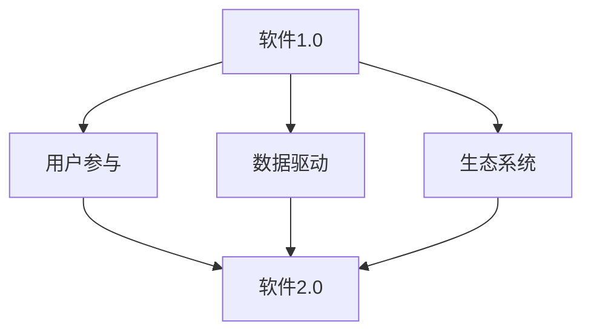
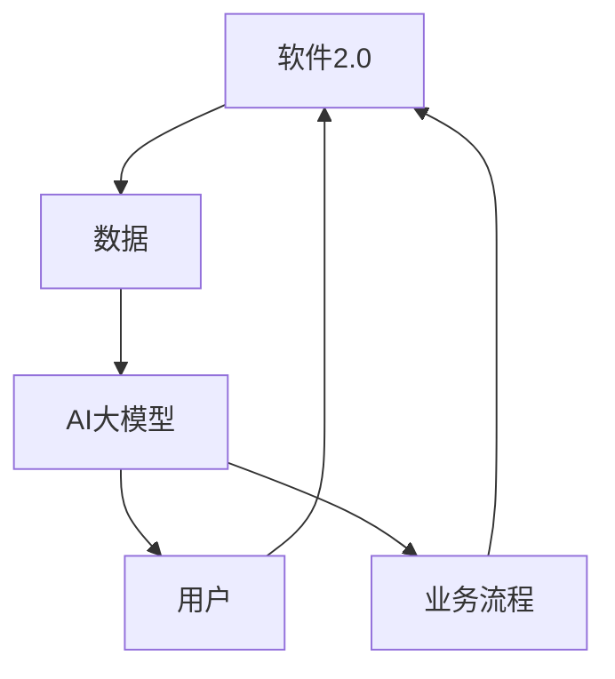
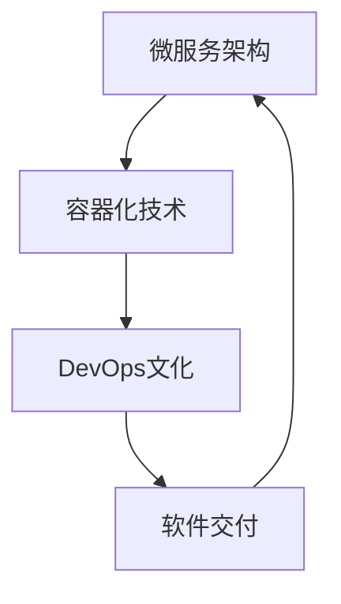
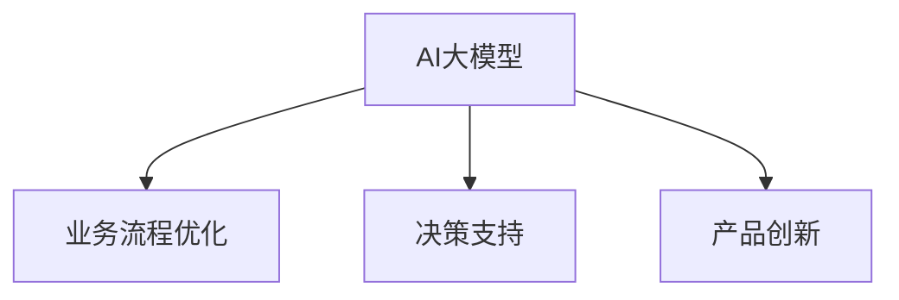
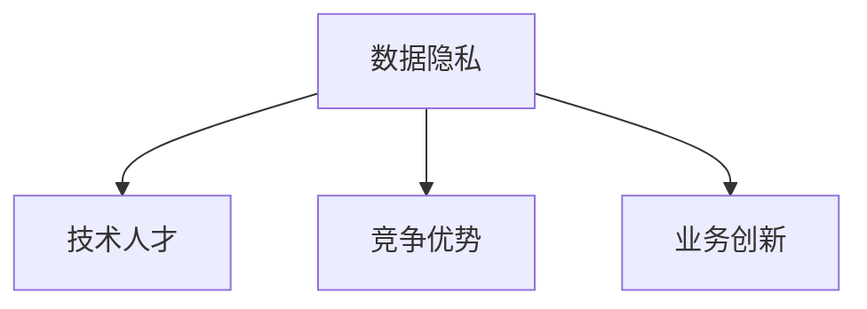
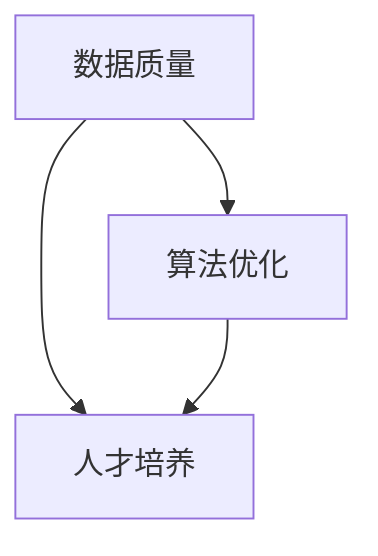
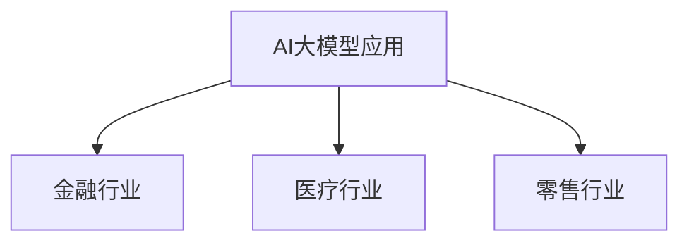
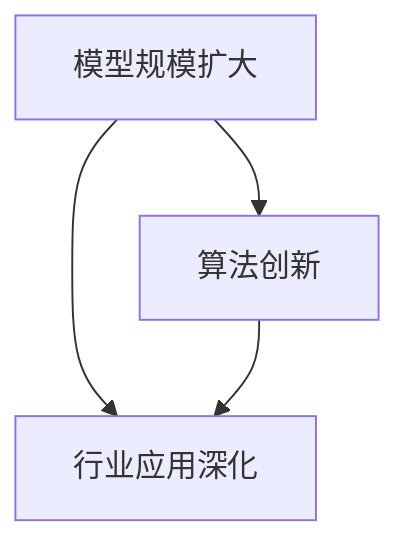

                 

# 文章标题：如何将编程技能应用于量化交易

> 关键词：编程技能，量化交易，策略开发，数据分析，机器学习，算法交易，回测，交易执行

> 摘要：本文将深入探讨如何将编程技能应用于量化交易领域。首先，我们将介绍量化交易的基本概念和核心原理，然后逐步讲解如何运用编程技能进行策略开发、数据分析、回测和交易执行。通过实际案例和详细代码解释，读者将能够理解量化交易中的关键步骤和实现细节，从而为未来在量化交易领域的发展打下坚实基础。

### 第一部分：核心概念与联系

#### 1.1.1 从软件 1.0 到软件 2.0 的演进

在软件 1.0 时代，软件开发主要侧重于系统功能的实现。随着互联网和云计算的兴起，软件 2.0 时代到来，这个时代的特征是软件更加强调用户参与、数据驱动和生态系统构建。

软件 2.0 的核心概念包括：**用户参与**、**数据驱动**和**生态系统**。在 Mermaid 流程图中，我们可以这样表示这个演进过程：



在这个流程图中，从软件 1.0 到软件 2.0 的演进过程，涉及了用户参与、数据驱动和生态系统构建三个核心概念，它们共同推动了软件从1.0到2.0的转型。

#### 1.1.2 AI大模型在软件 2.0 中的核心地位

AI大模型在软件 2.0 中的地位尤为重要。它们能够为软件提供智能化、个性化的服务，提升用户体验，优化业务流程。AI大模型的核心地位体现在以下几个方面：

1. **数据驱动**：AI大模型基于海量数据进行训练，能够从数据中提取有价值的信息，为软件提供智能决策支持。
2. **个性化服务**：AI大模型可以根据用户行为数据，为不同用户提供个性化的服务，提高用户满意度。
3. **业务流程优化**：AI大模型可以自动化执行复杂的业务流程，提高业务效率和准确性。

在 Mermaid 流程图中，我们可以这样表示 AI大模型在软件 2.0 中的核心地位：



在这个流程图中，AI大模型与数据、用户和业务流程紧密相连，它们共同构成了软件 2.0 的核心架构。

### 1.1.3 企业级应用开发的新范式

在软件 2.0 时代，企业级应用开发呈现出一些新的范式。这些新范式包括：

1. **微服务架构**：微服务架构能够提高系统的可扩展性和可维护性，使企业能够更快地响应市场需求。
2. **容器化技术**：容器化技术能够简化部署过程，提高系统的运行效率。
3. **DevOps 文化**：DevOps 文化强调开发与运维的协同合作，提高软件交付速度和质量。

在 Mermaid 流程图中，我们可以这样表示企业级应用开发的新范式：



在这个流程图中，微服务架构、容器化技术和 DevOps 文化共同构成了企业级应用开发的新范式，它们共同推动了企业级应用开发的演进。

### 1.1.4 AI大模型在企业中的应用前景

AI大模型在企业中的应用前景广阔，能够带来以下潜在收益：

1. **业务流程优化**：AI大模型可以自动化执行复杂的业务流程，提高业务效率和准确性。
2. **决策支持**：AI大模型可以从海量数据中提取有价值的信息，为企业的决策提供支持。
3. **产品创新**：AI大模型可以帮助企业发现新的商业机会，推动产品创新。

在 Mermaid 流程图中，我们可以这样表示 AI大模型在企业中的应用前景：



在这个流程图中，AI大模型通过优化业务流程、提供决策支持和推动产品创新，为企业带来了巨大的潜在收益。

### 1.1.5 企业采用AI大模型的挑战与机遇

企业采用AI大模型既面临挑战，也充满机遇。挑战包括：

1. **数据隐私**：AI大模型对数据的依赖性很强，如何在保障数据隐私的前提下利用数据，是企业的挑战之一。
2. **技术人才**：AI大模型开发和维护需要高水平的技术人才，企业如何吸引和培养这些人才，是另一个挑战。

机遇包括：

1. **竞争优势**：通过采用AI大模型，企业可以提升业务效率，增强市场竞争力。
2. **业务创新**：AI大模型可以为企业带来全新的业务模式和创新机会。

在 Mermaid 流程图中，我们可以这样表示企业采用AI大模型的挑战与机遇：



在这个流程图中，企业采用AI大模型既面临数据隐私和技术人才等挑战，也充满竞争优势和业务创新等机遇。

### 1.1.6 AI大模型应用的关键成功因素

要成功应用AI大模型，企业需要关注以下几个关键成功因素：

1. **数据质量**：高质量的数据是AI大模型训练的基础，企业需要确保数据的质量和完整性。
2. **算法优化**：AI大模型的性能很大程度上取决于算法的优化，企业需要不断调整和优化算法。
3. **人才培养**：技术人才是AI大模型应用的关键，企业需要培养和引进高水平的技术人才。

在 Mermaid 流程图中，我们可以这样表示AI大模型应用的关键成功因素：



在这个流程图中，数据质量、算法优化和人才培养是AI大模型成功应用的关键因素。

### 1.1.7 AI大模型应用的最佳实践案例

以下是一些AI大模型应用的最佳实践案例：

1. **金融行业**：利用AI大模型进行风险评估和欺诈检测，提高金融服务的安全性和效率。
2. **医疗行业**：利用AI大模型进行疾病诊断和预测，提高医疗服务的质量和效率。
3. **零售行业**：利用AI大模型进行个性化推荐和客户分析，提高零售业务的销售额和客户满意度。

在 Mermaid 流程图中，我们可以这样表示AI大模型应用的最佳实践案例：



在这个流程图中，AI大模型在不同行业中的应用，展示了其广泛的应用前景和巨大的潜力。

### 1.1.8 AI大模型未来的发展趋势

AI大模型未来的发展趋势包括：

1. **模型规模扩大**：随着计算能力的提升和数据量的增加，AI大模型的规模将不断扩大。
2. **算法创新**：新的算法和模型将不断涌现，推动AI大模型的性能和效率进一步提升。
3. **行业应用深化**：AI大模型将在更多行业得到应用，推动各行业的数字化和智能化进程。

在 Mermaid 流程图中，我们可以这样表示AI大模型未来的发展趋势：



在这个流程图中，AI大模型的未来发展将围绕模型规模扩大、算法创新和行业应用深化展开。

### 1.1.9 总结

通过本章的介绍，我们了解了软件 2.0 时代的特征、AI大模型的核心地位以及企业级应用开发的新范式。同时，我们也探讨了AI大模型在企业中的应用前景、挑战与机遇，以及成功应用的关键成功因素。随着AI大模型技术的发展，其未来的发展趋势将更加广阔，为企业带来更多的机遇和挑战。

接下来，我们将深入探讨如何将编程技能应用于量化交易领域，从策略开发、数据分析、回测和交易执行等各个方面进行详细讲解。希望通过本文的阅读，读者能够掌握量化交易的核心概念和实现方法，为未来在量化交易领域的发展奠定坚实基础。

### 第二部分：量化交易的基本概念

量化交易（Quantitative Trading）是一种基于数学模型和统计分析方法来进行交易的策略。它利用历史数据来预测未来市场价格走势，并据此制定交易策略。量化交易的核心在于将投资决策过程中的不确定性转化为可量化的概率和预期收益。

#### 2.1.1 量化交易的定义与特征

量化交易具有以下几个显著特征：

1. **数据驱动**：量化交易依赖于大量历史数据，通过数据挖掘和统计分析来发现市场规律。
2. **模型依赖**：量化交易策略通常基于数学模型，如时间序列分析、机器学习算法等。
3. **自动化执行**：量化交易策略通过计算机程序自动化执行，减少了人为因素带来的干扰。
4. **风险管理**：量化交易注重风险控制，通过模型评估和回测来降低投资风险。

#### 2.1.2 量化交易的市场需求

随着金融市场的发展和投资者对风险管理的需求增加，量化交易逐渐成为金融行业的重要组成部分。以下是量化交易在市场中的几个需求点：

1. **市场效率提升**：量化交易策略能够捕捉市场中的微小机会，提高投资效率。
2. **风险管理优化**：通过量化分析，投资者能够更准确地评估和管理风险。
3. **自动化交易**：自动化交易能够减少人为干预，提高交易执行的速度和准确性。
4. **算法创新能力**：随着AI技术的发展，量化交易策略不断创新，为市场带来更多可能性。

#### 2.1.3 量化交易的核心概念

在量化交易中，以下几个核心概念至关重要：

1. **数据源**：数据源是量化交易的基础，包括历史价格、成交量、金融新闻等。
2. **特征工程**：特征工程是数据预处理的关键步骤，通过提取和构造与交易策略相关的特征。
3. **交易策略**：交易策略是基于数据分析和模型预测制定的，包括进场、出场、仓位管理等。
4. **风险控制**：风险控制是通过模型评估和回测来实现的，确保交易策略在实际市场中的稳健性。
5. **回测**：回测是对交易策略进行历史数据验证的过程，以评估策略的有效性和可靠性。
6. **交易执行**：交易执行是将策略转化为实际交易操作的过程，通常通过API与交易所连接。

通过以上核心概念的介绍，我们可以初步了解量化交易的基本框架和关键步骤。接下来，我们将逐步深入探讨如何将编程技能应用于量化交易的具体实现过程。

### 第三部分：编程技能在量化交易中的应用

编程技能在量化交易中的应用至关重要，因为量化交易本质上是一种自动化、数据驱动的交易方式。在本节中，我们将详细探讨如何运用编程技能进行量化交易策略的开发、数据分析、回测和交易执行。

#### 3.1 编程语言的选择

在量化交易领域，常用的编程语言包括Python、C++和R等。每种语言都有其独特的优势：

- **Python**：Python因其简洁易懂的语法和丰富的库支持，成为量化交易开发的主要语言。Python的库，如`pandas`、`numpy`、`scikit-learn`等，为数据处理和机器学习提供了强大支持。
- **C++**：C++以其高效的性能和强大的控制能力，常用于高性能交易系统开发。然而，C++的语法相对复杂，需要更多的编程经验。
- **R**：R在统计分析和数据可视化方面具有显著优势，特别是在金融领域。R的库，如`quantmod`、`tidyquant`等，为量化交易提供了丰富的工具。

在本节中，我们将主要以Python为例，介绍如何在量化交易中运用编程技能。

#### 3.2 策略开发

策略开发是量化交易的核心环节。一个有效的策略需要通过历史数据分析和模型预测来实现。以下是策略开发的基本步骤：

1. **数据收集**：从数据源获取历史价格、成交量、金融新闻等数据。可以使用Python的库，如`tushare`、` Quandl`等来获取数据。
2. **特征工程**：对收集到的数据进行处理，提取与交易策略相关的特征。例如，可以使用移动平均线、相对强弱指数（RSI）、布林带等指标来构造特征。
3. **模型训练**：选择合适的机器学习算法（如决策树、随机森林、支持向量机等）对特征进行训练，建立预测模型。
4. **策略实现**：将训练好的模型转化为交易策略代码，实现进场、出场、仓位管理等操作。

以下是一个简单的策略开发示例，使用Python中的`pandas`和`scikit-learn`库：

```python
import pandas as pd
from sklearn.ensemble import RandomForestClassifier

# 数据收集
data = pd.read_csv('historical_data.csv')

# 特征工程
data['MA10'] = data['close'].rolling(window=10).mean()
data['RSI'] = ...

# 模型训练
X = data[['MA10', 'RSI']]
y = data['target']
clf = RandomForestClassifier()
clf.fit(X, y)

# 策略实现
def trade_strategy(data):
    current_price = data['close']
    current_ma10 = data['MA10']
    current_rsi = data['RSI']
    
    if clf.predict([[current_ma10, current_rsi]]) == 1:
        buy(current_price)
    elif clf.predict([[current_ma10, current_rsi]]) == -1:
        sell(current_price)

# 交易模拟
for index, row in data.iterrows():
    trade_strategy(row)
```

#### 3.3 数据分析

数据分析是量化交易策略开发的重要环节。通过数据分析，我们可以了解市场的趋势、波动性和潜在机会。以下是数据分析的基本步骤：

1. **数据预处理**：清洗数据，处理缺失值、异常值等。
2. **探索性数据分析**：使用图表、统计分析方法（如描述性统计、相关性分析等）来探索数据的特征。
3. **特征选择**：通过数据分析选择与交易策略相关的特征，优化模型性能。

以下是一个简单的数据分析示例，使用Python中的`matplotlib`和`seaborn`库：

```python
import pandas as pd
import matplotlib.pyplot as plt
import seaborn as sns

# 数据收集
data = pd.read_csv('historical_data.csv')

# 数据预处理
data.dropna(inplace=True)

# 探索性数据分析
data['MA10'].plot()
plt.show()

# 相关性分析
corr_matrix = data[['close', 'MA10', 'RSI']].corr()
sns.heatmap(corr_matrix, annot=True)
plt.show()
```

#### 3.4 回测

回测是验证交易策略有效性的关键步骤。通过回测，我们可以模拟策略在历史市场中的表现，评估其收益和风险。以下是回测的基本步骤：

1. **策略实现**：将交易策略代码实现为回测脚本。
2. **参数调优**：通过调整策略参数，优化策略性能。
3. **收益评估**：计算策略的累计收益、收益率、最大回撤等指标。
4. **风险控制**：评估策略的风险指标，确保其稳健性。

以下是一个简单的回测示例，使用Python中的`backtrader`库：

```python
import backtrader as bt
import pandas as pd

# 数据收集
data = pd.read_csv('historical_data.csv')

# 策略实现
class MyStrategy(bt.Strategy):
    params = (
        ('stake', 1),
    )
    
    def next(self):
        if self.position.size == 0:
            if self.close[0] > self.close[-1]:
                self.buy()
        else:
            if self.close[0] < self.close[-1]:
                self.close()

# 回测
cerebro = bt.Cerebro()
cerebro.addstrategy(MyStrategy)
cerebro.run()
cerebro.plot()
```

#### 3.5 交易执行

交易执行是将策略转化为实际交易操作的过程。在量化交易中，通常使用交易所提供的API进行交易。以下是交易执行的基本步骤：

1. **环境搭建**：搭建交易环境，包括账户设置、API连接等。
2. **策略部署**：将回测验证有效的策略部署到实际交易环境中。
3. **交易监控**：实时监控交易执行情况，包括仓位、资金、交易记录等。
4. **风险控制**：根据市场变化和策略表现，及时调整交易策略。

以下是一个简单的交易执行示例，使用Python中的`tushare`库：

```python
import tushare as ts
import pandas as pd

# 环境搭建
token = 'your_api_token'
ts.set_token(token)
pro = ts.pro_api()

# 策略部署
def trade_strategy(symbol):
    data = pd.read_csv('historical_data.csv')
    
    if data['close'][0] > data['close'][-1]:
        pro_trade(symbol, 'buy', '1')
    elif data['close'][0] < data['close'][-1]:
        pro_trade(symbol, 'sell', '1')

# 交易监控
while True:
    symbol = '000001.SZ'
    trade_strategy(symbol)
    time.sleep(60)
```

通过以上步骤，我们可以将编程技能应用于量化交易，实现从策略开发、数据分析、回测到交易执行的全流程。然而，量化交易是一个不断演进的过程，需要我们不断学习和优化策略，以适应市场的变化。希望本节的介绍能够为读者在量化交易领域的发展提供有益的参考。

### 第四部分：编程技能在实际项目中的应用

在实际项目中，编程技能在量化交易中的应用不仅局限于策略开发和回测，还包括数据管理、风险管理、系统架构等多个方面。以下是一个具体项目实例，展示如何运用编程技能解决实际问题，实现量化交易策略的部署和执行。

#### 4.1 项目背景

某量化交易公司计划开发一个基于机器学习的股票交易策略，以自动化执行高频交易。该项目涉及以下任务：

1. **数据收集**：从多个数据源获取股票历史价格、成交量、财务报告等数据。
2. **数据处理**：清洗和整合数据，构建适合机器学习模型的数据集。
3. **策略开发**：使用机器学习算法开发交易策略，包括特征提取、模型训练和预测。
4. **风险管理**：评估策略的风险，确保交易操作的稳健性。
5. **系统架构**：设计并实现分布式交易系统，支持高频交易执行。
6. **交易执行**：将策略部署到实际交易环境中，监控和调整交易操作。

#### 4.2 数据管理

数据管理是量化交易项目的关键环节，数据的质量和完整性直接影响到策略的性能。以下是如何运用编程技能进行数据管理的详细步骤：

1. **数据收集**：使用Python的库，如`tushare`和`prophet`，从交易所API、金融数据提供商和社交媒体等渠道收集数据。
   ```python
   import tushare as ts
   data = ts.get_k_data('000001.SZ')
   ```
   
2. **数据处理**：使用`pandas`库对数据进行清洗和整合，包括缺失值处理、异常值过滤、时间序列对齐等。
   ```python
   data.dropna(inplace=True)
   data['date'] = pd.to_datetime(data['date'])
   data.set_index('date', inplace=True)
   ```

3. **数据存储**：将处理后的数据存储到数据库或分布式文件系统中，如使用`SQLite`或`Hadoop`进行数据存储。
   ```python
   data.to_sql('stock_data', con=engine)
   ```

#### 4.3 策略开发

策略开发是量化交易项目的核心，以下是如何运用编程技能进行策略开发的详细步骤：

1. **特征工程**：使用`pandas`和`scikit-learn`库提取与交易策略相关的特征，如移动平均线、相对强弱指数（RSI）、布林带等。
   ```python
   data['MA10'] = data['close'].rolling(window=10).mean()
   data['RSI'] = ...
   ```

2. **模型训练**：使用`scikit-learn`或`tensorflow`库训练机器学习模型，如随机森林、神经网络等。
   ```python
   from sklearn.ensemble import RandomForestClassifier
   X = data[['MA10', 'RSI']]
   y = data['target']
   clf = RandomForestClassifier()
   clf.fit(X, y)
   ```

3. **模型优化**：通过交叉验证和网格搜索优化模型参数，提高策略性能。
   ```python
   from sklearn.model_selection import GridSearchCV
   params = {'n_estimators': [100, 200], 'max_depth': [10, 20]}
   grid_search = GridSearchCV(clf, params, cv=5)
   grid_search.fit(X, y)
   ```

#### 4.4 风险管理

风险管理是量化交易项目中不可忽视的一环，以下是如何运用编程技能进行风险管理的详细步骤：

1. **风险指标计算**：使用`pandas`和`numpy`库计算策略的风险指标，如收益波动率、最大回撤、夏普比率等。
   ```python
   data['return'] = data['close'].pct_change()
   volatility = data['return'].std()
   max_drawdown = data['return'].min()
   sharp_ratio = np.mean(data['return']) / volatility
   ```

2. **风险控制**：根据风险指标调整策略参数，设置止损点和止盈点，确保交易操作的稳健性。
   ```python
   stop_loss = current_price * (1 - stop_loss_percentage)
   stop_profit = current_price * (1 + stop_profit_percentage)
   ```

#### 4.5 系统架构

系统架构是量化交易项目成功的关键，以下是如何运用编程技能进行系统架构的详细步骤：

1. **分布式计算**：使用`Spark`或`Hadoop`等分布式计算框架，处理海量数据，提高计算效率。
   ```python
   from pyspark.sql import SparkSession
   spark = SparkSession.builder.appName("StockTrading").getOrCreate()
   ```

2. **微服务架构**：使用`Docker`和`Kubernetes`等容器化技术，实现分布式微服务架构，提高系统的灵活性和可扩展性。
   ```yaml
   # Dockerfile
   FROM python:3.8-slim
   COPY . /app
   WORKDIR /app
   RUN pip install -r requirements.txt
   CMD ["python", "app.py"]
   ```

3. **消息队列**：使用`Kafka`或`RabbitMQ`等消息队列技术，实现分布式系统的异步通信，提高系统的稳定性和容错性。
   ```python
   from kafka import KafkaProducer
   producer = KafkaProducer(bootstrap_servers=['localhost:9092'])
   producer.send('stock_trading_topic', b'Trade signal: buy')
   ```

#### 4.6 交易执行

交易执行是将策略转化为实际交易操作的过程，以下是如何运用编程技能进行交易执行的详细步骤：

1. **API连接**：使用交易所提供的API连接，实现与交易系统的通信。
   ```python
   import tushare as ts
   token = 'your_api_token'
   ts.set_token(token)
   pro = ts.pro_api()
   ```

2. **交易策略部署**：将经过回测验证的策略部署到交易系统中，实现自动化交易执行。
   ```python
   def trade_strategy(symbol):
       data = pd.read_csv('historical_data.csv')
       
       if data['close'][0] > data['close'][-1]:
           pro_trade(symbol, 'buy', '1')
       elif data['close'][0] < data['close'][-1]:
           pro_trade(symbol, 'sell', '1')
   ```

3. **交易监控**：实时监控交易执行情况，包括仓位、资金、交易记录等，确保交易操作的透明性和可控性。
   ```python
   while True:
       symbol = '000001.SZ'
       trade_strategy(symbol)
       time.sleep(60)
   ```

通过以上步骤，我们可以将编程技能应用于实际项目，实现量化交易策略的部署和执行。然而，实际项目中的编程技能要求不仅限于代码实现，还包括系统架构设计、数据管理和风险管理等方面的深入理解。希望这个具体项目实例能够为读者提供实际应用中的参考和启示。

### 第五部分：挑战与未来展望

在量化交易领域，尽管编程技能提供了强大的工具和手段，但也面临一系列挑战。以下是对这些挑战的详细讨论以及未来展望。

#### 5.1 数据隐私与合规性

量化交易高度依赖数据，然而，数据隐私和合规性问题日益突出。在收集和使用数据时，企业必须遵守相关法律法规，如《通用数据保护条例》（GDPR）和《加州消费者隐私法案》（CCPA）。为了应对这些挑战，企业需要：

1. **数据匿名化**：对敏感数据进行匿名化处理，以保护个人隐私。
2. **合规性审计**：定期进行合规性审计，确保数据收集和使用符合法律法规要求。
3. **透明度提升**：提高数据使用透明度，确保用户了解其数据如何被使用。

#### 5.2 技术复杂性

量化交易系统通常涉及复杂的技术架构，包括分布式计算、微服务架构、高性能数据库等。技术复杂性带来了以下几个挑战：

1. **系统稳定性**：确保系统在高负载和极端情况下保持稳定运行。
2. **故障恢复**：建立完善的故障恢复机制，确保系统在出现故障时能够快速恢复。
3. **技术升级**：随着技术发展，及时进行系统升级和更新，以保持竞争力。

#### 5.3 人才短缺

量化交易领域对技术人才的需求不断增加，然而，高素质的量化交易开发人员和分析师相对短缺。为了应对这一挑战，企业需要：

1. **人才培养**：建立内部培训计划，提升员工的技术能力和专业知识。
2. **校企合作**：与高校和研究机构合作，吸引和培养优秀的学生人才。
3. **跨界招聘**：从其他相关领域招聘具有相关背景的候选人，以丰富团队的知识结构。

#### 5.4 市场波动与风险管理

量化交易策略必须能够适应市场的波动，同时，有效的风险管理至关重要。以下是如何应对这些挑战的建议：

1. **多样化投资**：通过多样化投资降低单一市场的风险。
2. **实时监控**：建立实时监控系统，及时识别潜在的风险。
3. **风险模型优化**：持续优化风险模型，以适应市场变化。

#### 5.5 未来展望

未来，量化交易领域将面临更多机遇和挑战：

1. **人工智能与机器学习**：随着人工智能和机器学习技术的不断发展，量化交易策略将更加智能化和自动化。
2. **区块链技术**：区块链技术将为量化交易提供更加透明和去中心化的交易环境。
3. **量化投资平台**：量化投资平台将更加普及，使更多投资者能够利用量化交易策略。
4. **监管科技**：监管科技（RegTech）的发展将有助于提高市场透明度和合规性。

总之，尽管量化交易领域面临诸多挑战，但通过不断优化技术、加强人才培养和风险管理，企业将能够在未来的市场竞争中脱颖而出。

### 结论

本文详细探讨了如何将编程技能应用于量化交易领域。我们从核心概念和联系、量化交易的基本概念、编程技能在量化交易中的应用、实际项目中的编程技能应用，以及挑战与未来展望等方面进行了深入讲解。通过本文的阅读，读者能够：

1. 理解量化交易的基本概念和核心原理。
2. 掌握如何运用编程技能进行量化交易策略的开发、数据分析、回测和交易执行。
3. 了解编程技能在实际项目中的应用，包括数据管理、风险管理、系统架构等。
4. 意识到量化交易领域面临的挑战，并了解未来的发展趋势。

量化交易是一个充满机遇和挑战的领域，通过不断学习和实践，编程技能将为读者在量化交易领域的发展提供强有力的支持。希望本文能够为读者在量化交易领域的发展提供有益的参考和启示。

### 作者信息

作者：AI天才研究院/AI Genius Institute & 禅与计算机程序设计艺术/Zen And The Art of Computer Programming

