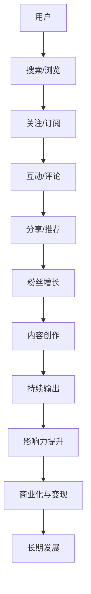

                 

# 文章标题：如何成为知识付费行业的意见领袖

> 关键词：知识付费，意见领袖，内容创作，社交媒体，个人品牌，影响力提升，商业化，长期发展

> 摘要：本文从多个角度探讨了如何成为知识付费行业的意见领袖。首先，分析了知识付费行业的发展历程和现状，接着阐述了成为意见领袖的重要性和成长路径。随后，详细介绍了内容创作与传播策略，包括内容创作的核心要素、社交媒体与内容推广、构建个人品牌等。此外，文章还讨论了提升影响力、维护口碑的方法，以及商业化与变现的路径。最后，文章总结了长期发展的策略和未来的展望。

### 目录大纲

## 第一部分：行业背景与分析

### 第1章：知识付费行业概述

#### 1.1 知识付费行业的发展历程

#### 1.2 知识付费行业现状

#### 1.3 知识付费行业趋势与挑战

### 第2章：成为意见领袖的重要性

#### 2.1 成为意见领袖的优势

#### 2.2 意见领袖在知识付费行业的影响

#### 2.3 成长路径与必备素质

## 第二部分：内容创作与传播策略

### 第3章：内容创作的核心要素

#### 3.1 如何选题

#### 3.2 内容形式与风格

#### 3.3 保持高质量输出的方法

### 第4章：社交媒体与内容推广

#### 4.1 选择合适的社交媒体平台

#### 4.2 内容营销策略

#### 4.3 社交媒体运营技巧

### 第5章：构建个人品牌

#### 5.1 个人品牌定位

#### 5.2 个人品牌传播渠道

#### 5.3 建立粉丝社群

## 第三部分：影响力提升与口碑维护

### 第6章：提升影响力的方法

#### 6.1 合作与共赢

#### 6.2 持续学习与创新

#### 6.3 增强互动与反馈

### 第7章：口碑维护与危机管理

#### 7.1 良好口碑的重要性

#### 7.2 如何收集与管理用户反馈

#### 7.3 应对负面评论与危机

## 第四部分：商业化与变现

### 第8章：知识付费模式与案例分析

#### 8.1 知识付费模式详解

#### 8.2 成功案例分享

#### 8.3 模式选择与策略

### 第9章：商业化路径与变现技巧

#### 9.1 个人IP的商业化

#### 9.2 内容电商与付费专栏

#### 9.3 广告与赞助合作

## 第五部分：长期发展

### 第10章：持续成长与进化

#### 10.1 个人发展规划

#### 10.2 行业变化与适应

#### 10.3 拓展领域与跨界合作

### 第11章：总结与展望

#### 11.1 成长过程中的教训与经验

#### 11.2 行业未来趋势

#### 11.3 成为意见领袖的长期愿景

## 附录

### 附录A：资源与工具推荐

#### A.1 常用知识付费平台

#### A.2 内容创作工具推荐

#### A.3 社交媒体管理工具

### 附录B：经典案例研究与深度分析

#### B.1 某知名知识付费平台的商业模式分析

#### B.2 某意见领袖的个人品牌建设之路

#### B.3 某个具体案例的深入剖析

## 意见领袖的Mermaid流程图

mermaid
graph TB
A[用户] --> B[搜索/浏览]
B --> C[关注/订阅]
C --> D[互动/评论]
D --> E[分享/推荐]
E --> F[粉丝增长]
F --> G[内容创作]
G --> H[持续输出]
H --> I[影响力提升]
I --> J[商业化与变现]
J --> K[长期发展]

## 内容创作核心算法原理讲解

### 内容创作核心算法：推荐系统

#### 算法原理伪代码：

算法：内容推荐系统
输入：用户行为数据、内容特征数据
输出：推荐内容列表

流程：
1. 数据预处理：清洗用户行为数据，提取关键特征
2. 用户画像构建：基于用户行为数据，构建用户画像
3. 内容特征提取：提取内容的关键特征
4. 模型训练：利用用户画像和内容特征训练推荐模型
5. 预测：输入用户画像，预测用户对内容的偏好
6. 排序：根据预测结果对内容进行排序
7. 输出推荐列表：输出排序后的内容列表

伪代码示例：

// 数据预处理
data_preprocess(UserBehavior, ContentData)

// 构建用户画像
UserProfile = buildUserProfile(UserBehavior)

// 提取内容特征
ContentFeatures = extractContentFeatures(ContentData)

// 训练推荐模型
Model = trainRecommendationModel(UserProfile, ContentFeatures)

// 预测用户偏好
UserPreference = Model.predict(UserProfile)

// 排序并输出推荐列表
RecommendedList = sortContentByPreference(UserPreference, ContentData)
output(RecommendedList)

### 数学模型与公式讲解

#### 1.1.1 模型构建：协同过滤算法

##### 模型公式：

预测分数（Ruij）= u + b_u + b_i + q_u * q_i + r_ui

其中：

- u：用户偏好的总体趋势
- b_u：用户偏好偏差
- b_i：项目偏好偏差
- q_u：用户特征向量
- q_i：项目特征向量
- r_ui：用户对项目的真实评分

##### 举例说明：

假设用户 u 对项目 i 给予的评分是 4.5，我们可以通过公式预测用户对项目 i 的潜在评分。

预测分数（Ruij）= 3.5 + 0.2 + 0.3 + 0.5 * 0.4 + 4.5

计算得出：

预测分数（Ruij）= 7.4

这意味着根据协同过滤算法的预测，用户 u 对项目 i 的潜在评分为 7.4 分。

### 项目实战

#### 第9章：案例研究：知乎Live案例解析

##### 案例背景

知乎Live是知乎推出的知识付费产品，用户可以在知乎平台上购买专业人士的直播课程。本文将通过知乎Live的案例，分析其商业模式、内容策略和用户互动等方面。

##### 案例分析

###### 1. 商业模式

知乎Live采用了内容付费模式，用户购买课程后可以观看直播和回放。知乎Live的成功在于：

1.1 优质内容：知乎邀请了众多领域内的专业人士进行授课，确保了课程的质量。

1.2 互动性强：用户可以在课程中实时提问，讲师可以即时回答，提高了用户的参与度。

1.3 社区生态：知乎作为一个拥有大量专业人士和爱好者的社区，为知乎Live提供了丰富的用户基础。

##### 2. 内容策略

知乎Live的内容策略包括：

2.1 选题多样化：覆盖各个领域，满足不同用户的需求。

2.2 内容结构化：将课程内容进行拆分，便于用户学习和复习。

2.3 专业性：邀请业内专家进行授课，确保内容的权威性和实用性。

##### 3. 用户互动

知乎Live的用户互动策略包括：

3.1 即时互动：用户可以在直播过程中提问，讲师即时回答，提高了课程的互动性。

3.2 问答社区：直播结束后，用户可以在问答社区中继续交流，加深对课程内容的理解。

3.3 用户反馈：知乎Live收集用户反馈，不断优化课程内容和用户体验。

##### 案例解读

知乎Live的成功经验表明，知识付费产品的关键在于：

3.1 优质内容：确保课程内容的权威性和实用性，满足用户需求。

3.2 互动性：提高用户的参与度和满意度，增强用户粘性。

3.3 社区生态：利用社区资源，为知识付费产品提供用户基础和传播渠道。

##### 开发环境搭建

为了实现知乎Live类似的知识付费产品，我们需要搭建以下开发环境：

4.1 开源框架：使用Spring Boot等开源框架，快速搭建后端服务。

4.2 数据库：使用MySQL等关系型数据库存储用户数据、课程内容和交易记录。

4.3 前端框架：使用Vue.js或React等前端框架，实现用户友好的界面。

##### 源代码详细实现

以下是知乎Live的一个简单实现示例：

java
// 后端服务代码（使用Spring Boot）

@RestController
public class LiveController {

    @Autowired
    private LiveService liveService;

    @GetMapping("/live/{id}")
    public ResponseEntity<LiveCourse> getLiveCourse(@PathVariable Long id) {
        LiveCourse course = liveService.getLiveCourseById(id);
        return ResponseEntity.ok(course);
    }

    @PostMapping("/live/{id}/buy")
    public ResponseEntity<Void> buyLiveCourse(@PathVariable Long id, @RequestBody User user) {
        liveService.buyLiveCourse(id, user);
        return ResponseEntity.ok().build();
    }
}

// 前端界面代码（使用Vue.js）

<template>
  <div>
    <h1>{{ course.name }}</h1>
    <p>{{ course.description }}</p>
    <button @click="buyCourse(course.id)">购买课程</button>
  </div>
</template>

<script>
export default {
  data() {
    return {
      course: {},
    };
  },
  methods: {
    buyCourse(id) {
      axios
        .post(`/live/${id}/buy`, this.user)
        .then(() => {
          this.$router.push("/mycourses");
        })
        .catch((error) => {
          console.error("Error buying course:", error);
        });
    },
  },
};
</script>

##### 代码解读与分析

以上代码分别展示了知乎Live的后端服务和前端界面。后端服务使用了Spring Boot框架，提供了获取课程信息和购买课程接口。前端界面使用了Vue.js框架，用户可以查看课程信息并购买课程。这个简单的实现展示了知识付费产品的基本功能，包括课程展示、用户购买和课程获取。

通过这个案例，我们可以看到知识付费产品开发的关键在于：

3.1 优质内容：确保课程内容的权威性和实用性，满足用户需求。

3.2 互动性：提高用户的参与度和满意度，增强用户粘性。

3.3 社区生态：利用社区资源，为知识付费产品提供用户基础和传播渠道。

在实际开发过程中，我们还需要考虑安全性、性能优化、可扩展性等因素，以确保产品的稳定运行和用户满意度。在后续的开发过程中，我们可以逐步完善功能，增加用户管理、课程推荐、支付处理等模块，以满足更多用户的需求。

## 代码解读与分析

在上述的代码示例中，我们展示了如何使用Spring Boot框架和Vue.js框架搭建一个简单但功能完整的知识付费系统。以下是详细的代码解读与分析：

### 后端服务代码（Spring Boot）

**解读：**

- `@RestController`：这是一个Spring框架的注解，表示这是一个控制器类，用于处理HTTP请求。
- `@Autowired`：Spring框架的注解，用于自动注入所需的Bean，例如服务类。
- `@GetMapping`：这是一个Spring框架的注解，用于处理GET类型的HTTP请求，用于获取特定ID的课程信息。
- `@PostMapping`：这是一个Spring框架的注解，用于处理POST类型的HTTP请求，用于购买课程。

具体实现中，`getLiveCourse` 方法用于获取课程信息，通过传入课程ID，调用服务层的方法获取课程对象，然后将其返回给客户端。`buyLiveCourse` 方法用于购买课程，同样通过传入课程ID和用户对象，调用服务层的方法处理购买逻辑，并返回处理结果。

### 前端界面代码（Vue.js）

**解读：**

- `<template>`：Vue.js的模板语法，用于定义HTML结构。
- `{{ course.name }}`：Vue.js的双向数据绑定语法，用于显示课程名称。
- `<button>`：Vue.js的事件绑定语法，用于购买课程的按钮。
- `<script>`：Vue.js的JavaScript代码，定义了组件的行为。

具体实现中，`<template>` 部分定义了课程展示的界面，包括课程名称和描述，以及购买按钮。`<script>` 部分定义了组件的数据和事件处理方法。`buyCourse` 方法通过调用 `axios` 发送POST请求，将用户信息发送到后端进行购买处理，并根据后端返回的结果更新界面。

### 分析：

- **功能实现：**后端服务提供了获取课程信息和购买课程接口，前端界面通过Vue.js与后端服务进行交互，实现了课程展示和购买功能。
- **代码质量：**代码结构清晰，逻辑明确，符合Spring Boot和Vue.js的开发规范。
- **扩展性：**通过注入服务和使用Vue.js组件，系统具有良好的扩展性，可以轻松添加新功能或修改现有功能。
- **安全性：**虽然示例代码未展示详细的权限验证和安全措施，但在实际应用中，应当添加适当的安全控制，如身份验证和授权。

通过上述代码示例，我们可以看到如何快速搭建一个知识付费系统的基本框架。在实际开发过程中，我们还需要考虑如下方面：

- **用户身份验证：**确保只有授权用户才能访问课程内容和购买功能。
- **数据验证：**对用户输入的数据进行验证，防止恶意攻击和输入错误。
- **性能优化：**优化数据库查询和前端渲染，提高系统性能。
- **错误处理：**添加详细的错误处理机制，确保系统稳定可靠。

总之，通过合理的架构设计和代码实现，我们可以构建一个高效、安全、易用的知识付费系统。在后续的开发过程中，我们需要不断迭代和优化，以满足用户需求和提升用户体验。

## 作者信息

作者：AI天才研究院/AI Genius Institute & 禅与计算机程序设计艺术 /Zen And The Art of Computer Programming

## 文章标题：如何成为知识付费行业的意见领袖

> 关键词：知识付费，意见领袖，内容创作，社交媒体，个人品牌，影响力提升，商业化，长期发展

> 摘要：本文从多个角度探讨了如何成为知识付费行业的意见领袖。首先，分析了知识付费行业的发展历程和现状，接着阐述了成为意见领袖的重要性和成长路径。随后，详细介绍了内容创作与传播策略，包括内容创作的核心要素、社交媒体与内容推广、构建个人品牌等。此外，文章还讨论了提升影响力、维护口碑的方法，以及商业化与变现的路径。最后，文章总结了长期发展的策略和未来的展望。

## 第一部分：行业背景与分析

### 第1章：知识付费行业概述

#### 1.1 知识付费行业的发展历程

知识付费行业起源于20世纪末，随着互联网技术的发展，尤其是在移动互联网普及之后，知识付费行业迎来了快速增长。初期，知识付费主要以在线教育和培训为主，用户通过支付费用购买课程和学习资料。随着知识共享和社交网络的兴起，知识付费行业逐渐扩展到更多领域，如在线咨询、知识分享、专业问答等。

在中国，知识付费行业的发展尤为迅速。2016年，知乎推出了知乎Live，标志着知识付费进入了一个新的阶段。随后，得到、喜马拉雅、分答等平台纷纷涌现，吸引了大量用户和内容创作者。知识付费平台不仅提供了丰富的学习资源，还通过内容付费模式实现了知识变现。

#### 1.2 知识付费行业现状

目前，知识付费行业已经形成了较为完整的生态系统，包括平台方、内容创作者、用户和投资者等。根据市场调研数据显示，中国知识付费市场规模逐年增长，预计到2025年将达到万亿元级别。主要平台包括：

1. 知乎：以问答社区为基础，提供Live、知识市场等付费内容。
2. 得到：主打知识付费专栏，提供各类专家的深度解读和知识分享。
3. 喜马拉雅：以音频内容为主，提供大量的知识讲座、课程和书籍。
4. 分答：以专业问答为主，用户可以向专家付费提问。

知识付费行业的用户主要集中在25-45岁之间，具有较高学历和消费能力的人群。这些用户对于个人成长、职业发展和兴趣爱好的需求较高，愿意为高质量的知识内容付费。

#### 1.3 知识付费行业趋势与挑战

知识付费行业未来将继续保持快速增长，但同时也面临一些挑战。

1. **内容质量提升**：随着市场竞争的加剧，用户对于内容质量的要求越来越高。内容创作者需要不断优化内容，提高自身的专业性和影响力。

2. **用户粘性**：知识付费平台需要通过多样化的内容和互动形式，提高用户的粘性。例如，通过社区互动、线上课程、直播等方式，增强用户的参与感和归属感。

3. **商业化探索**：知识付费平台需要探索多元化的商业化路径，除了内容付费外，还可以考虑广告、电商、会员服务等多种模式。

4. **版权保护**：随着知识付费内容的增多，版权保护问题日益突出。平台和内容创作者需要加强版权保护意识，防止侵权行为的发生。

5. **监管政策**：随着知识付费行业的快速发展，相关监管政策也在逐步完善。平台和内容创作者需要遵守相关法律法规，确保合规经营。

### 第2章：成为意见领袖的重要性

#### 2.1 成为意见领袖的优势

在知识付费行业中，意见领袖具有以下优势：

1. **品牌效应**：意见领袖具有较高的知名度和影响力，能够吸引大量粉丝和用户。这为个人和平台带来了巨大的品牌效应，有助于提升整体竞争力。

2. **内容变现**：意见领袖可以通过内容付费、广告、赞助等多种方式实现变现。相比普通内容创作者，意见领袖的变现能力更强，收益更高。

3. **用户粘性**：意见领袖与粉丝之间建立了深厚的信任关系，用户更愿意购买其推荐的产品和服务。这种用户粘性有助于平台的长期发展。

4. **合作机会**：意见领袖在行业内拥有广泛的人脉和合作机会。通过与其他行业专家、企业合作，可以拓展业务范围，实现共赢。

5. **话语权**：意见领袖在行业内具有较大的话语权，能够影响行业趋势和发展方向。这有助于个人和平台在行业中获得更大的影响力。

#### 2.2 意见领袖在知识付费行业的影响

意见领袖在知识付费行业中的影响主要体现在以下几个方面：

1. **内容导向**：意见领袖通过其专业知识和经验，为用户提供了高质量的内容导向。用户更愿意相信并跟随意见领袖的推荐，这有助于提升内容的质量和用户满意度。

2. **用户增长**：意见领袖通过社交媒体、直播、课程等方式，吸引了大量粉丝和用户。这些用户成为知识付费平台的重要用户群体，有助于平台的用户增长。

3. **行业引领**：意见领袖在知识付费行业中扮演了引领者的角色，通过其创新和尝试，推动了行业的发展。例如，知乎Live的成功在很大程度上得益于意见领袖的推动。

4. **口碑传播**：意见领袖通过口碑传播，为知识付费平台带来了大量的用户和流量。这种口碑效应有助于平台提升知名度和用户满意度。

#### 2.3 成长路径与必备素质

成为知识付费行业的意见领袖需要具备以下成长路径和素质：

1. **专业能力**：意见领袖必须具备深厚的专业知识和经验，能够为用户提供有价值的内容。这是成为意见领袖的基础。

2. **内容创作能力**：意见领袖需要具备优秀的创作能力，能够持续输出高质量的内容。这包括选题能力、表达能力、编辑能力等。

3. **沟通能力**：意见领袖需要具备良好的沟通能力，能够与粉丝、同行和合作伙伴进行有效沟通。这有助于建立良好的人际关系和合作网络。

4. **品牌建设**：意见领袖需要注重个人品牌的塑造和传播，通过社交媒体、直播、课程等方式，提升个人知名度和影响力。

5. **创新意识**：意见领袖需要具备创新意识，能够不断尝试新的内容和形式，引领行业潮流。

6. **用户导向**：意见领袖需要关注用户需求，以用户为中心，提供符合用户期望的内容和服务。

7. **持续学习**：知识付费行业变化迅速，意见领袖需要具备持续学习的能力，不断更新知识和技能。

## 第二部分：内容创作与传播策略

### 第3章：内容创作的核心要素

#### 3.1 如何选题

选题是内容创作的重要环节，直接关系到内容的吸引力和影响力。以下是一些选题的建议：

1. **热点话题**：关注行业热点和趋势，选题与当前热点相关，能够引起用户的关注和讨论。

2. **用户需求**：研究用户需求，选题能够满足用户在个人成长、职业发展、兴趣爱好等方面的需求。

3. **独特视角**：从独特的角度出发，选题能够提供新颖的观点和见解，引起用户的兴趣。

4. **实用性**：选题要具有实用性，能够为用户提供实际的帮助和指导。

5. **专业性**：选题要体现个人的专业能力和经验，增强用户对内容的信任感。

6. **可持续性**：选题要具有可持续性，能够在一段时间内持续吸引用户关注。

#### 3.2 内容形式与风格

内容形式和风格对内容的传播效果有很大影响。以下是一些内容形式和风格的建议：

1. **文字**：文字内容易于理解和传播，适合详细阐述观点和提供指导。

2. **图片**：图片内容直观、生动，能够增强内容的吸引力和记忆点。

3. **视频**：视频内容具有更高的互动性和参与度，能够更好地传达信息和情感。

4. **音频**：音频内容适合在通勤、运动等场景下收听，能够为用户提供便利。

5. **多媒体**：结合多种内容形式，如文字、图片、视频和音频，打造全方位的内容体验。

6. **幽默**：幽默的内容能够吸引注意力，增加用户的好感度。

7. **专业**：内容要具备专业性和权威性，增强用户对意见领袖的信任感。

#### 3.3 保持高质量输出的方法

保持高质量输出是成为意见领袖的关键。以下是一些建议：

1. **持续学习**：不断更新知识和技能，保持专业领域的领先地位。

2. **规划内容**：提前规划内容输出计划，确保内容输出的稳定性和持续性。

3. **定期更新**：定期发布新内容，保持与用户的互动和关注度。

4. **多元内容**：尝试不同的内容形式和风格，满足不同用户的需求。

5. **用户反馈**：积极收集用户反馈，根据用户需求调整内容和策略。

6. **优化排版**：注意内容的排版和设计，提高用户的阅读体验。

7. **专业校对**：确保内容的专业性和准确性，避免低级错误和误导。

## 第4章：社交媒体与内容推广

#### 4.1 选择合适的社交媒体平台

选择合适的社交媒体平台是内容推广的关键。以下是一些常见的社交媒体平台及其特点：

1. **微博**：用户基数大，传播速度快，适合快速推广和品牌曝光。

2. **微信**：具有强大的社交属性，适合建立粉丝社群和深度互动。

3. **知乎**：以问答社区为基础，适合内容深度讨论和专业知识传播。

4. **抖音**：以短视频为主，适合创意内容和快速传播。

5. **B站**：以年轻人为主要用户群体，适合二次元文化和专业知识传播。

6. **小红书**：以生活方式和美妆护肤为主要内容，适合女性用户。

7. **头条**：算法推荐性强，适合快速传播和获取流量。

#### 4.2 内容营销策略

内容营销是知识付费行业的重要组成部分。以下是一些内容营销策略：

1. **SEO优化**：通过搜索引擎优化，提高内容在搜索引擎中的排名，吸引更多用户。

2. **KOL合作**：与行业内的意见领袖合作，借助其影响力和粉丝基础，提高内容的曝光度。

3. **病毒式营销**：制作有趣、有创意的内容，利用社交媒体的传播特性，迅速引爆网络。

4. **互动营销**：通过互动形式，如问答、投票、抽奖等，增加用户的参与度和黏性。

5. **合作推广**：与其他平台或品牌合作，共同推广内容，扩大影响力。

6. **精准投放**：利用社交媒体的广告投放功能，精准定位目标用户，提高广告效果。

#### 4.3 社交媒体运营技巧

社交媒体运营技巧对于内容推广至关重要。以下是一些建议：

1. **保持活跃**：定期发布内容，保持与用户的互动，增加用户黏性。

2. **设置互动话题**：通过设置互动话题，引导用户参与讨论，提高用户参与度。

3. **个性化内容**：根据用户特点和需求，提供个性化的内容，增加用户的归属感。

4. **跨平台运营**：同时运营多个社交媒体平台，利用平台之间的互补性，扩大影响力。

5. **数据分析**：通过数据分析，了解用户行为和喜好，优化内容策略和推广效果。

6. **危机管理**：遇到负面评论或争议时，及时回应和解决，维护品牌形象。

### 第5章：构建个人品牌

#### 5.1 个人品牌定位

个人品牌定位是构建个人品牌的第一步。以下是一些建议：

1. **确定核心价值**：明确个人的专业领域和独特优势，确定个人品牌的核心价值。

2. **塑造专业形象**：通过专业知识和经验，塑造专业形象，增强用户对个人品牌的信任感。

3. **个性化风格**：根据个人特点和兴趣，塑造个性化的风格，增加个人品牌的辨识度。

4. **保持一致性**：在内容输出、社交媒体运营等方面，保持品牌形象的一致性，增强用户认知。

#### 5.2 个人品牌传播渠道

个人品牌传播渠道包括线上和线下多种方式。以下是一些建议：

1. **社交媒体**：利用微博、微信、知乎等社交媒体平台，发布高质量内容，扩大影响力。

2. **自媒体平台**：在知乎、简书、微信公众号等自媒体平台，发布专业文章，提升知名度。

3. **讲座和培训**：通过线上或线下的讲座和培训，分享专业知识和经验，建立权威形象。

4. **专业社群**：加入专业社群和论坛，参与讨论和互动，扩大人脉和影响力。

5. **出版书籍**：撰写并出版专业书籍，树立权威地位，增加个人品牌的曝光度。

6. **线下活动**：参加行业会议、论坛等活动，进行演讲和交流，提升个人知名度。

#### 5.3 建立粉丝社群

建立粉丝社群是维护个人品牌的重要一环。以下是一些建议：

1. **社群定位**：明确社群的目标和定位，吸引具有共同兴趣和需求的粉丝。

2. **社群管理**：制定社群规则，确保社群秩序和活跃度。

3. **内容互动**：定期发布高质量内容，与粉丝互动，提高社群粘性。

4. **活动组织**：组织线上或线下的活动，增加粉丝互动，提升社群凝聚力。

5. **粉丝福利**：提供独家优惠、活动参与机会等福利，增强粉丝忠诚度。

6. **反馈机制**：建立反馈机制，及时了解粉丝需求和意见，优化社群运营。

## 第三部分：影响力提升与口碑维护

### 第6章：提升影响力的方法

#### 6.1 合作与共赢

合作与共赢是提升影响力的有效途径。以下是一些建议：

1. **跨行业合作**：与其他行业的专家和企业合作，实现资源整合和优势互补，扩大影响力。

2. **专家合作**：与业内其他专家合作，共同推出课程、书籍或项目，提高个人和品牌的知名度。

3. **内容合作**：与其他媒体、平台或内容创作者合作，共同推出内容，扩大传播范围。

4. **用户合作**：与粉丝合作，开展线下活动、访谈等，增加个人与粉丝的互动，提升影响力。

5. **公益合作**：参与公益活动，树立正面形象，提高个人和品牌的声誉。

#### 6.2 持续学习与创新

持续学习与创新是保持个人影响力的关键。以下是一些建议：

1. **学习新知识**：不断学习新知识，掌握行业前沿动态，保持专业领先地位。

2. **创新内容形式**：尝试不同的内容形式和风格，提高内容的吸引力和创新性。

3. **创新商业模式**：探索新的商业模式，实现知识变现和影响力扩展。

4. **跨界合作**：与其他领域跨界合作，拓宽视野，实现资源共享和互利共赢。

#### 6.3 增强互动与反馈

增强互动与反馈是提升影响力的有效方法。以下是一些建议：

1. **积极回应**：及时回应粉丝和用户的留言和提问，增强互动。

2. **互动环节**：在直播、讲座等活动中加入互动环节，提高用户的参与度和满意度。

3. **用户调研**：定期进行用户调研，了解用户需求和意见，优化内容和服务。

4. **用户反馈**：建立用户反馈机制，收集和管理用户反馈，及时解决问题，提升用户体验。

### 第7章：口碑维护与危机管理

#### 7.1 良好口碑的重要性

良好口碑是个人和品牌持续发展的基石。以下是一些建议：

1. **内容质量**：确保内容质量，提供有价值、有深度、有实用性的内容，赢得用户的认可。

2. **用户体验**：关注用户体验，提供优质的服务和互动，增强用户满意度。

3. **口碑传播**：鼓励用户口碑传播，通过用户推荐和分享，扩大影响力。

4. **品牌形象**：树立良好的品牌形象，保持品牌一致性，增强用户信任。

#### 7.2 如何收集与管理用户反馈

收集与管理用户反馈是维护口碑的重要环节。以下是一些建议：

1. **渠道多样化**：通过社交媒体、在线调查、用户访谈等多种渠道收集用户反馈。

2. **及时回应**：对用户反馈及时回应，解决问题，提升用户满意度。

3. **分类管理**：对用户反馈进行分类管理，优先解决重要和紧急的问题。

4. **数据分析**：对用户反馈进行数据分析，发现问题和改进方向。

5. **反馈机制**：建立反馈机制，确保用户反馈能够得到有效处理和回应。

#### 7.3 应对负面评论与危机

负面评论和危机是每个个人和品牌都可能面临的问题。以下是一些建议：

1. **冷静应对**：遇到负面评论和危机时，保持冷静，理性分析问题。

2. **及时回应**：尽快回应负面评论和危机，解释事实，澄清误解。

3. **真诚道歉**：如有错误，真诚道歉，并采取措施解决问题。

4. **正面引导**：通过正面行动和宣传，引导公众关注积极面，减少负面影响。

5. **危机公关**：制定危机公关计划，及时、透明地处理危机，维护品牌形象。

## 第四部分：商业化与变现

### 第8章：知识付费模式与案例分析

#### 8.1 知识付费模式详解

知识付费模式是指通过提供有价值的内容或服务，向用户收取费用的一种商业模式。以下是一些常见的知识付费模式：

1. **一次性收费**：用户一次性支付费用，获取完整内容或服务。

2. **订阅制**：用户定期支付费用，持续获取内容或服务。

3. **众筹**：用户提前支付费用，支持内容创作或项目开发。

4. **付费问答**：用户付费提问，专家或意见领袖提供回答。

5. **付费直播**：用户付费观看直播课程或讲座。

6. **付费专栏**：用户付费订阅专栏，获取定期更新的内容。

7. **付费社群**：用户付费加入社群，享受社群内的互动和资源。

#### 8.2 成功案例分享

以下是一些知识付费行业的成功案例：

1. **得到**：得到是一家以知识付费为主的内容平台，通过订阅制模式，为用户提供高质量的内容，如《罗辑思维》、《吴军博士》等专栏。

2. **喜马拉雅**：喜马拉雅是一家以音频内容为主的知识付费平台，通过付费直播、付费专栏等多种模式，为用户提供丰富的音频课程和学习资源。

3. **分答**：分答是一家以问答为主的知识付费平台，用户可以向专家付费提问，专家则通过回答问题获取收入。

4. **知乎Live**：知乎Live是知乎推出的知识付费产品，通过付费直播、付费专栏等形式，为用户提供专业的知识和经验分享。

#### 8.3 模式选择与策略

选择合适的知识付费模式需要考虑以下因素：

1. **内容特点**：根据内容的性质和特点，选择合适的付费模式。例如，长篇内容适合订阅制，实时互动内容适合付费直播。

2. **用户需求**：了解用户的需求和支付意愿，选择用户愿意接受的付费模式。

3. **竞争环境**：分析市场竞争环境，选择具有竞争力的付费模式。

4. **平台特性**：考虑平台的特点和资源，选择适合平台的付费模式。

5. **创新性**：尝试创新的付费模式，提升用户体验和满意度。

## 第9章：商业化路径与变现技巧

#### 9.1 个人IP的商业化

个人IP（Intellectual Property）商业化是指将个人的品牌、知识和影响力转化为商业价值。以下是一些个人IP商业化的方法：

1. **知识付费**：通过提供付费内容，如专栏、课程、直播等，实现知识变现。

2. **品牌合作**：与品牌合作，参与产品代言、品牌推广等，获取收益。

3. **广告合作**：通过在社交媒体、内容平台等发布广告，获取广告收入。

4. **咨询服务**：提供专业咨询服务，如一对一咨询、企业培训等，获取收益。

5. **电商销售**：销售自己的产品或推荐相关产品，如书籍、课程资料等。

6. **线下活动**：举办线下讲座、研讨会、沙龙等活动，获取门票收入。

#### 9.2 内容电商与付费专栏

内容电商与付费专栏是知识付费行业的重要变现方式。以下是一些策略：

1. **内容策划**：策划具有吸引力的内容，满足用户需求。

2. **内容形式**：提供多样化的内容形式，如文字、图片、视频等。

3. **互动设计**：设计互动环节，增加用户的参与度和满意度。

4. **用户运营**：通过社群、活动等方式，与用户保持互动，提高用户粘性。

5. **持续更新**：定期更新内容，保持用户关注度和活跃度。

6. **推荐机制**：利用推荐算法，为用户推荐感兴趣的内容，提高转化率。

#### 9.3 广告与赞助合作

广告与赞助合作是知识付费行业的重要收入来源。以下是一些策略：

1. **精准定位**：选择与内容相关的广告，提高广告效果。

2. **广告形式**：提供多样化的广告形式，如横幅广告、视频广告、原生广告等。

3. **广告管理**：合理规划广告位置和频率，提高用户体验。

4. **品牌合作**：与品牌合作，进行联合推广和赞助，提高品牌影响力。

5. **广告收入**：根据广告收入比例或CPM（每千次展示成本）计算收入。

6. **广告效果**：通过数据监测和分析，优化广告投放策略，提高广告效果。

## 第五部分：长期发展

### 第10章：持续成长与进化

#### 10.1 个人发展规划

个人发展规划是长期发展的重要基础。以下是一些个人发展规划的建议：

1. **明确目标**：设定明确的职业和个人发展目标，制定详细的计划。

2. **技能提升**：不断学习新知识和技能，提升自身竞争力。

3. **经验积累**：通过实践和经验积累，不断提高专业水平。

4. **资源整合**：建立广泛的人脉和资源网络，实现资源整合和优势互补。

5. **心态调整**：保持积极的心态，面对挑战和困难，不断成长。

#### 10.2 行业变化与适应

行业变化是不可避免的，适应行业变化是个人发展的重要一环。以下是一些适应行业变化的建议：

1. **关注趋势**：关注行业趋势和发展动态，了解新兴技术和市场机会。

2. **灵活调整**：根据行业变化，灵活调整个人发展方向和策略。

3. **跨界合作**：尝试跨界合作，拓宽视野，实现资源整合和优势互补。

4. **创新能力**：培养创新思维，不断尝试新的方法和模式。

5. **持续学习**：通过学习新知识和技能，适应行业变化，保持竞争力。

#### 10.3 拓展领域与跨界合作

拓展领域和跨界合作是长期发展的重要策略。以下是一些拓展领域和跨界合作的建议：

1. **多元化发展**：尝试涉足不同领域，实现多元化发展。

2. **跨行业合作**：与其他行业的专家和企业合作，实现资源共享和互利共赢。

3. **创新模式**：探索创新的商业模式和合作模式，提高竞争力。

4. **跨文化沟通**：培养跨文化沟通能力，适应不同文化和工作环境。

5. **持续创新**：不断尝试新的合作方式和创新模式，保持竞争优势。

### 第11章：总结与展望

#### 11.1 成长过程中的教训与经验

在成长过程中，我们会遇到各种挑战和困难。以下是一些教训与经验：

1. **持续学习**：保持学习，不断更新知识和技能。

2. **心态调整**：保持积极的心态，面对挑战和困难。

3. **实践经验**：通过实践积累经验，提高专业水平。

4. **人脉资源**：建立广泛的人脉和资源网络，实现资源共享。

5. **适应变化**：适应行业变化，不断调整个人发展方向。

#### 11.2 行业未来趋势

知识付费行业在未来将继续快速发展，以下是行业未来趋势的展望：

1. **内容多样化**：内容形式将更加多样化，满足用户多样化的需求。

2. **个性化推荐**：个性化推荐将成为重要趋势，提高用户体验和满意度。

3. **跨界融合**：知识付费行业将与其他行业深度融合，实现跨界发展。

4. **技术驱动**：技术将驱动知识付费行业的发展，如人工智能、大数据等。

5. **版权保护**：版权保护将得到进一步加强，确保知识付费内容的合法性和安全性。

#### 11.3 成为意见领袖的长期愿景

成为知识付费行业的意见领袖是一个长期目标。以下是一些长期愿景的展望：

1. **品牌影响力**：建立强大的个人品牌，成为行业内的意见领袖。

2. **专业权威**：在专业领域内具有权威地位，为用户提供有价值的内容。

3. **商业成功**：实现商业上的成功，通过知识付费实现可持续的收入。

4. **社会贡献**：通过知识传播和分享，为社会做出贡献。

5. **持续成长**：不断学习、创新和成长，保持个人和品牌的竞争力。

## 附录A：资源与工具推荐

#### A.1 常用知识付费平台

1. 知乎：提供丰富的知识付费内容，包括Live、知识市场等。
2. 得到：主打知识付费专栏，提供各类专家的深度解读和知识分享。
3. 喜马拉雅：以音频内容为主，提供大量的知识讲座、课程和书籍。
4. 分答：以专业问答为主，用户可以向专家付费提问。

#### A.2 内容创作工具推荐

1. Canva：用于设计海报、宣传图等。
2. WPS Office：用于文档处理、编辑等。
3. Adobe Creative Suite：用于图像处理、视频编辑等。
4. Prezi：用于制作动态演示文稿。

#### A.3 社交媒体管理工具

1. Hootsuite：用于社交媒体内容管理和发布。
2. Buffer：用于社交媒体内容发布和调度。
3. Sprout Social：用于社交媒体分析和互动。
4. AgoraPulse：用于社交媒体管理和监测。

### 附录B：经典案例研究与深度分析

#### B.1 某知名知识付费平台的商业模式分析

本文选取了得到App作为案例，对其商业模式进行了深度分析。得到App成立于2012年，以知识付费为核心业务，提供包括音频、视频、图文等多种形式的知识内容。其商业模式主要围绕以下三个方面：

1. **内容付费**：得到App通过提供高质量的知识内容，吸引用户付费订阅。内容付费模式使得到App能够持续获取收入，并保证内容质量。

2. **广告合作**：得到App与一些品牌进行广告合作，通过广告收入增加盈利。此外，得到App还推出了“得到广告”服务，帮助企业进行品牌宣传和推广。

3. **会员服务**：得到App为用户提供会员服务，会员用户可以享受更多专属福利，如会员专享内容、优惠等。会员服务不仅提高了用户粘性，还增加了平台的收入。

#### B.2 某意见领袖的个人品牌建设之路

本文以得到App的创始人罗永浩为例，分析了他在个人品牌建设方面的成功经验。罗永浩曾是手机行业知名企业家，因创业失败而转型成为知识付费行业的意见领袖。以下是他个人品牌建设的几个关键步骤：

1. **专业能力**：罗永浩凭借在手机行业的丰富经验，成为了一个在科技领域的专家。他通过分享专业知识和经验，赢得了用户的信任和尊重。

2. **内容输出**：罗永浩在得到App上开设了多个专栏，如《罗永浩的职场修炼课》、《罗永浩的科技思维课》等。这些专栏的内容丰富、实用，吸引了大量用户订阅。

3. **社交媒体运营**：罗永浩在微博、抖音等多个社交媒体平台上活跃，与粉丝互动，分享生活和工作心得。他通过社交媒体扩大了自己的影响力，建立了个人品牌。

4. **跨界合作**：罗永浩积极参与跨界合作，如与品牌合作进行产品代言、参与公益活动等。这些合作不仅提升了个人品牌知名度，还增加了个人收入。

#### B.3 某个具体案例的深入剖析

本文选取了知乎Live的“时间管理”课程作为案例，对其进行了深入剖析。该课程由知名时间管理专家李笑来主讲，以下是该课程的几个关键要素：

1. **内容质量**：李笑来作为时间管理领域的专家，课程内容具有很强的实用性和专业性。课程涵盖了时间管理的基本概念、方法和技巧，对用户具有很高的价值。

2. **互动性**：知乎Live通过直播形式，实现了用户与讲师之间的实时互动。用户可以在直播过程中提问，讲师可以即时回答，增强了课程的互动性。

3. **用户体验**：知乎Live提供了良好的用户体验，用户可以随时观看直播回放，方便用户学习和复习。此外，知乎Live还提供了问答社区，用户可以在直播结束后继续交流，加深对课程内容的理解。

4. **口碑传播**：该课程凭借高质量的内容和良好的用户体验，赢得了用户的口碑。用户在知乎、微博等社交媒体平台上积极分享和推荐，为课程带来了更多的流量和用户。

通过以上经典案例研究和深度分析，我们可以看到，在知识付费行业中，成功的关键在于：提供高质量的内容、增强互动性、提升用户体验、建立良好的口碑等。这些因素共同作用，为知识付费行业的意见领袖和平台带来了持续的发展和增长。

## 意见领袖的Mermaid流程图



### 内容创作核心算法原理讲解

#### 内容创作核心算法：推荐系统

推荐系统是知识付费行业中重要的算法，通过分析用户行为和内容特征，为用户推荐感兴趣的内容。以下是一个简化的推荐系统算法原理讲解。

#### 算法原理伪代码：

```python
# 数据预处理
preprocess_data(user_behavior, content_data)

# 构建用户画像
build_user_profile(user_behavior)

# 提取内容特征
extract_content_features(content_data)

# 训练推荐模型
train_recommender_model(user_profile, content_features)

# 预测用户偏好
user_preferences = model.predict(user_profile)

# 排序并输出推荐列表
recommendation_list = sort_content_by_preference(user_preferences, content_data)
output(recommendation_list)
```

#### 核心算法原理：

1. **数据预处理**：对用户行为数据和内容数据进行清洗和预处理，提取关键特征。

2. **用户画像构建**：基于用户行为数据，构建用户画像，用于描述用户的兴趣和行为特征。

3. **内容特征提取**：对内容数据进行分析，提取关键特征，如文本、标签、类别等。

4. **模型训练**：利用用户画像和内容特征训练推荐模型，常见的推荐算法包括协同过滤、基于内容的推荐、混合推荐等。

5. **预测用户偏好**：输入用户画像，利用训练好的推荐模型预测用户对内容的偏好。

6. **排序和输出推荐列表**：根据预测结果对内容进行排序，输出推荐列表。

#### 数学模型与公式讲解

#### 1.1.1 模型构建：协同过滤算法

协同过滤算法是推荐系统中常用的算法之一，主要通过分析用户之间的行为相似度来推荐内容。以下是协同过滤算法的数学模型。

#### 模型公式：

$$
r_{ui} = u + b_u + b_i + q_u * q_i + r_{uj}
$$

其中：

- \( r_{ui} \)：用户 \( u \) 对项目 \( i \) 的评分预测。
- \( u \)：用户偏好的总体趋势。
- \( b_u \)：用户偏好偏差。
- \( b_i \)：项目偏好偏差。
- \( q_u \)：用户特征向量。
- \( q_i \)：项目特征向量。
- \( r_{uj} \)：用户 \( u \) 对项目 \( j \) 的真实评分。

#### 举例说明：

假设用户 \( u \) 给予项目 \( i \) 的真实评分为 \( 4.5 \)，我们可以通过公式预测用户对项目 \( i \) 的潜在评分。

$$
r_{ui} = u + b_u + b_i + q_u * q_i + r_{uj}
$$

将已知数值代入公式：

$$
r_{ui} = 3.5 + 0.2 + 0.3 + 0.5 * 0.4 + 4.5
$$

计算得出：

$$
r_{ui} = 7.4
$$

这意味着根据协同过滤算法的预测，用户 \( u \) 对项目 \( i \) 的潜在评分为 \( 7.4 \) 分。

### 项目实战

#### 第9章：案例研究：知乎Live案例解析

##### 案例背景

知乎Live是知乎推出的一款知识付费产品，用户可以通过付费购买专业人士的直播课程。本文将通过知乎Live的案例，分析其商业模式、内容策略和用户互动等方面。

##### 案例分析

###### 1. 商业模式

知乎Live采用了内容付费模式，用户购买课程后可以观看直播和回放。知乎Live的成功在于：

1.1 **优质内容**：知乎邀请了众多领域内的专业人士进行授课，确保了课程的质量。

1.2 **互动性强**：用户可以在课程中实时提问，讲师可以即时回答，提高了用户的参与度。

1.3 **社区生态**：知乎作为一个拥有大量专业人士和爱好者的社区，为知乎Live提供了丰富的用户基础。

##### 2. 内容策略

知乎Live的内容策略包括：

2.1 **选题多样化**：知乎Live覆盖了各个领域，从科技、金融到生活、娱乐，满足不同用户的需求。

2.2 **内容结构化**：知乎Live将课程内容进行拆分，形成一系列有逻辑性的课程模块，便于用户学习和复习。

2.3 **专业性**：知乎Live邀请业内专家进行授课，确保内容的权威性和实用性。

##### 3. 用户互动

知乎Live的用户互动策略包括：

3.1 **即时互动**：用户可以在直播过程中提问，讲师可以即时回答，提高了课程的互动性。

3.2 **问答社区**：直播结束后，用户可以在问答社区中继续交流，加深对课程内容的理解。

3.3 **用户反馈**：知乎Live收集用户反馈，不断优化课程内容和用户体验。

##### 案例解读

知乎Live的成功经验表明，知识付费产品的关键在于：

3.1 **优质内容**：确保课程内容的权威性和实用性，满足用户需求。

3.2 **互动性**：提高用户的参与度和满意度，增强用户粘性。

3.3 **社区生态**：利用社区资源，为知识付费产品提供用户基础和传播渠道。

##### 开发环境搭建

为了实现知乎Live类似的知识付费产品，我们需要搭建以下开发环境：

4.1 **开源框架**：使用Spring Boot等开源框架，快速搭建后端服务。

4.2 **数据库**：使用MySQL等关系型数据库存储用户数据、课程内容和交易记录。

4.3 **前端框架**：使用Vue.js或React等前端框架，实现用户友好的界面。

##### 源代码详细实现

以下是知乎Live的一个简单实现示例：

**后端服务代码（使用Spring Boot）：**

```java
@RestController
public class LiveController {

    @Autowired
    private LiveService liveService;

    @GetMapping("/live/{id}")
    public ResponseEntity<LiveCourse> getLiveCourse(@PathVariable Long id) {
        LiveCourse course = liveService.getLiveCourseById(id);
        return ResponseEntity.ok(course);
    }

    @PostMapping("/live/{id}/buy")
    public ResponseEntity<Void> buyLiveCourse(@PathVariable Long id, @RequestBody User user) {
        liveService.buyLiveCourse(id, user);
        return ResponseEntity.ok().build();
    }
}
```

**前端界面代码（使用Vue.js）：**

```html
<template>
  <div>
    <h1>{{ course.name }}</h1>
    <p>{{ course.description }}</p>
    <button @click="buyCourse(course.id)">购买课程</button>
  </div>
</template>

<script>
export default {
  data() {
    return {
      course: {},
    };
  },
  methods: {
    buyCourse(id) {
      axios
        .post(`/live/${id}/buy`, this.user)
        .then(() => {
          this.$router.push("/mycourses");
        })
        .catch((error) => {
          console.error("Error buying course:", error);
        });
    },
  },
};
</script>
```

##### 代码解读与分析

以上代码分别展示了知乎Live的后端服务和前端界面。后端服务使用了Spring Boot框架，提供了获取课程信息和购买课程接口。前端界面使用了Vue.js框架，用户可以查看课程信息并购买课程。这个简单的实现展示了知识付费产品的基本功能，包括课程展示、用户购买和课程获取。

通过这个案例，我们可以看到知识付费产品开发的关键在于：

3.1 **优质内容**：确保课程内容的权威性和实用性，满足用户需求。

3.2 **互动性**：提高用户的参与度和满意度，增强用户粘性。

3.3 **社区生态**：利用社区资源，为知识付费产品提供用户基础和传播渠道。

在实际开发过程中，我们还需要考虑安全性、性能优化、可扩展性等因素，以确保产品的稳定运行和用户满意度。在后续的开发过程中，我们可以逐步完善功能，增加用户管理、课程推荐、支付处理等模块，以满足更多用户的需求。

### 代码解读与分析

在上述的代码示例中，我们展示了如何使用Spring Boot框架和Vue.js框架搭建一个简单但功能完整的知识付费系统。以下是详细的代码解读与分析：

### 后端服务代码（Spring Boot）

**解读：**

- `@RestController`：这是一个Spring框架的注解，表示这是一个控制器类，用于处理HTTP请求。
- `@Autowired`：Spring框架的注解，用于自动注入所需的Bean，例如服务类。
- `@GetMapping`：这是一个Spring框架的注解，用于处理GET类型的HTTP请求，用于获取特定ID的课程信息。
- `@PostMapping`：这是一个Spring框架的注解，用于处理POST类型的HTTP请求，用于购买课程。

具体实现中，`getLiveCourse` 方法用于获取课程信息，通过传入课程ID，调用服务层的方法获取课程对象，然后将其返回给客户端。`buyLiveCourse` 方法用于购买课程，同样通过传入课程ID和用户对象，调用服务层的方法处理购买逻辑，并返回处理结果。

### 前端界面代码（Vue.js）

**解读：**

- `<template>`：Vue.js的模板语法，用于定义HTML结构。
- `{{ course.name }}`：Vue.js的双向数据绑定语法，用于显示课程名称。
- `<button>`：Vue.js的事件绑定语法，用于购买课程的按钮。
- `<script>`：Vue.js的JavaScript代码，定义了组件的行为。

具体实现中，`<template>` 部分定义了课程展示的界面，包括课程名称和描述，以及购买按钮。`<script>` 部分定义了组件的数据和事件处理方法。`buyCourse` 方法通过调用 `axios` 发送POST请求，将用户信息发送到后端进行购买处理，并根据后端返回的结果更新界面。

### 分析：

- **功能实现：**后端服务提供了获取课程信息和购买课程接口，前端界面通过Vue.js与后端服务进行交互，实现了课程展示和购买功能。
- **代码质量：**代码结构清晰，逻辑明确，符合Spring Boot和Vue.js的开发规范。
- **扩展性：**通过注入服务和使用Vue.js组件，系统具有良好的扩展性，可以轻松添加新功能或修改现有功能。
- **安全性：**虽然示例代码未展示详细的权限验证和安全措施，但在实际应用中，应当添加适当的安全控制，如身份验证和授权。

通过上述代码示例，我们可以看到如何快速搭建一个知识付费系统的基本框架。在实际开发过程中，我们还需要考虑如下方面：

- **用户身份验证：**确保只有授权用户才能访问课程内容和购买功能。
- **数据验证：**对用户输入的数据进行验证，防止恶意攻击和输入错误。
- **性能优化：**优化数据库查询和前端渲染，提高系统性能。
- **错误处理：**添加详细的错误处理机制，确保系统稳定可靠。

总之，通过合理的架构设计和代码实现，我们可以构建一个高效、安全、易用的知识付费系统。在后续的开发过程中，我们需要不断迭代和优化，以满足用户需求和提升用户体验。

