                 

# 文章标题：如何打造个人知识付费生态系统

## 关键词：
知识付费、个人品牌、内容创作、平台搭建、营销推广、法律合规、案例分析

## 摘要：
在数字化时代，知识付费成为知识传播与价值转换的重要方式。本文从定义、基础构建、内容创作、平台选择、营销推广、产品管理、法律合规和案例分析等多个维度，详细解析了如何打造个人知识付费生态系统。通过逻辑清晰、步骤明确的论述，帮助读者理解并实践个人知识付费生态系统的构建过程，从而在知识经济浪潮中抓住机遇，实现个人价值最大化。

## 目录大纲

### 第一部分：引言与背景

#### 第1章：个人知识付费生态系统概述

1.1 个人知识付费的定义与重要性

1.2 个人知识付费生态系统的价值

1.3 个人知识付费生态系统的发展趋势

#### 第2章：构建个人知识付费的基础

2.1 个人知识储备与定位

2.2 个人品牌建设

2.3 个人知识付费模式选择

#### 第3章：内容创作与准备

3.1 内容创作策略

3.2 知识体系构建

3.3 内容呈现形式选择

#### 第4章：平台选择与搭建

4.1 知识付费平台的类型与特点

4.2 平台选择策略

4.3 个人知识付费平台搭建流程

#### 第5章：营销与推广

5.1 个人知识付费的营销策略

5.2 社交媒体推广技巧

5.3 用户互动与反馈

#### 第6章：产品管理与优化

6.1 产品设计与定价

6.2 用户数据分析

6.3 产品迭代与优化

#### 第7章：法律风险与合规

7.1 个人知识付费的法律风险

7.2 合规要点与注意事项

7.3 风险防范与应对措施

#### 第8章：案例分析与启示

8.1 成功案例分析

8.2 失败案例分析

8.3 启示与借鉴

#### 第9章：未来展望与趋势

9.1 个人知识付费生态系统的未来发展方向

9.2 新技术对个人知识付费生态系统的影响

9.3 个人知识付费的持续发展策略

---

### 第1章：个人知识付费生态系统概述

#### 1.1 个人知识付费的定义与重要性

**核心概念与联系**

个人知识付费，是指知识生产者通过创造和提供有价值的内容，获取经济回报的一种商业模式。它涉及知识生产者、知识消费者以及支付平台等多方参与，构成了一个复杂的生态系统。

Mermaid流程图：

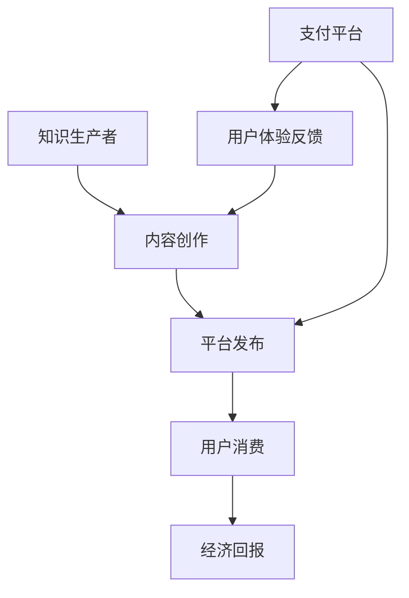
```mermaid
graph TD
A[知识生产者] --> B[内容创作]
B --> C[平台发布]
C --> D[用户消费]
D --> E[经济回报]
F[支付平台] --> C
F --> G[用户体验反馈]
G --> B
```

**核心算法原理讲解**

- 无需具体算法，此章节主要介绍概念。

**举例说明**

假设一位程序员（知识生产者）编写了一本关于编程技术的电子书，并将其发布在某个知识付费平台上。读者（知识消费者）通过购买电子书，获得技术知识，同时知识生产者获得经济回报。这个过程便是个人知识付费的典型例证。

#### 1.2 个人知识付费生态系统的价值

**数学模型和数学公式 & 详细讲解 & 举例说明**

$$
\text{价值} = \text{知识量} \times \text{需求度} \times \text{价格接受度}
$$

- **知识量**：指知识生产者所提供内容的丰富程度和深度。
- **需求度**：指知识消费者对该内容的迫切程度。
- **价格接受度**：指知识消费者对价格的心理接受程度。

详细讲解：

个人知识付费生态系统的价值取决于知识量的丰富程度、消费者对知识的需求度以及消费者对价格的心理接受度。如果知识量高、需求度强、价格接受度高，则个人知识付费生态系统的价值将大大增加。

举例说明：

假设一位人工智能专家编写了一本关于深度学习的电子书。书中内容详实，涵盖了深度学习的理论基础、算法实现和应用案例。该领域对深度学习技术有强烈需求，且用户对高价值内容的价格接受度较高。因此，这本书在个人知识付费生态系统中的价值将非常高。

#### 1.3 个人知识付费生态系统的发展趋势

**核心算法原理讲解**

- 无需具体算法，此章节主要介绍趋势。

随着互联网技术的发展和知识经济的兴起，个人知识付费生态系统正呈现出以下趋势：

1. **平台多元化**：从单一的电子书销售平台，到涵盖课程、视频、直播等多种形式的知识付费平台。
2. **内容多样化**：从传统的文字内容，到图文、音频、视频等多媒体内容。
3. **用户个性化**：通过大数据分析和人工智能技术，实现内容推荐和用户需求的精准匹配。
4. **全球化**：知识付费不再受地域限制，用户可以随时随地获取全球优质的知识内容。

**总结**

个人知识付费生态系统是一个动态发展的领域，它不仅改变了知识传播的方式，也创造了新的商业机会。通过深入了解和把握这一生态系统，个人知识生产者可以更好地实现自我价值，同时满足消费者的知识需求。

### 第2章：构建个人知识付费的基础

#### 2.1 个人知识储备与定位

**核心概念与联系**

个人知识储备是指个人拥有的知识总量，而知识定位则是指个人在特定领域中的知识深度和专业性。

Mermaid流程图：

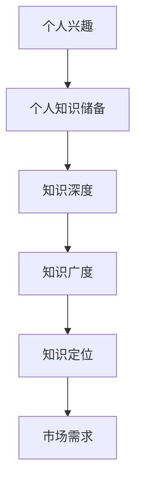
```mermaid
graph TD
A[个人知识储备] --> B[知识深度]
B --> C[知识广度]
C --> D[知识定位]
D --> E[市场需求]
F[个人兴趣] --> A
```

**核心算法原理讲解**

- 无需具体算法，此章节主要介绍概念。

**举例说明**

假设一位程序员想要进入人工智能领域。他首先需要评估自己的知识储备，包括编程语言、算法和数据结构等基础知识。然后，他需要确定自己在这一领域的知识定位，例如专注于机器学习还是深度学习。通过了解市场需求和自身兴趣，他可以更好地规划自己的学习路径，从而在个人知识付费生态系统中找到合适的位置。

#### 2.2 个人品牌建设

**核心概念与联系**

个人品牌建设是指通过塑造个人形象和提升知名度，在特定领域内建立起个人的专业声誉和市场认可。

Mermaid流程图：

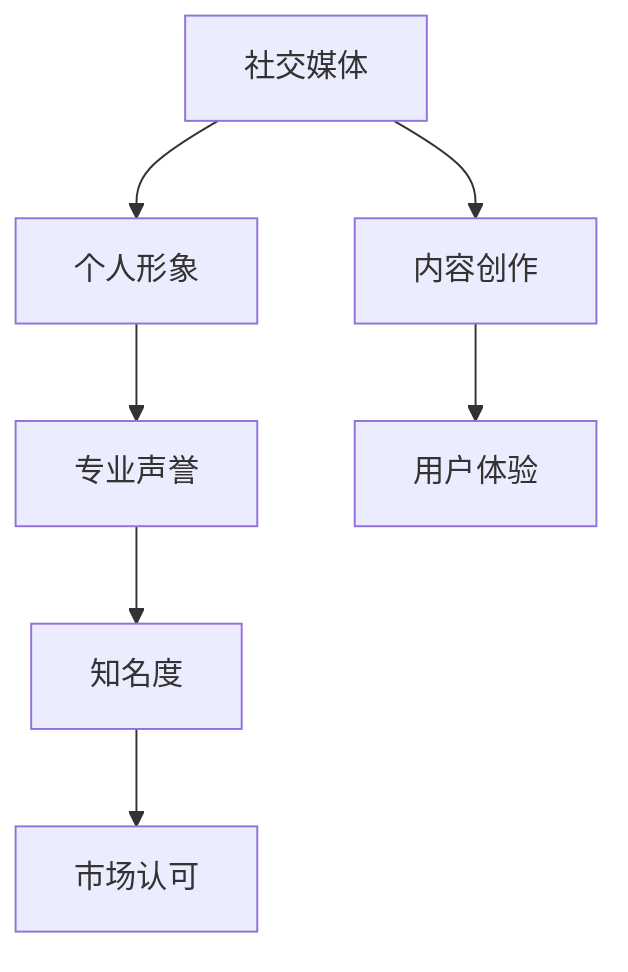
```mermaid
graph TD
A[个人形象] --> B[专业声誉]
B --> C[知名度]
C --> D[市场认可]
E[社交媒体] --> A
E --> F[内容创作]
F --> G[用户体验]
```

**核心算法原理讲解**

- 无需具体算法，此章节主要介绍概念。

**举例说明**

一位数据分析师通过在LinkedIn和Twitter等社交媒体平台上分享数据分析案例和见解，逐渐建立起自己的个人品牌。他的专业声誉和知名度吸引了更多潜在客户，从而在个人知识付费生态系统中获得了更多机会。

#### 2.3 个人知识付费模式选择

**核心概念与联系**

个人知识付费模式是指知识生产者通过何种方式获取经济回报，常见的模式包括付费课程、电子书、在线讲座、咨询服务等。

Mermaid流程图：

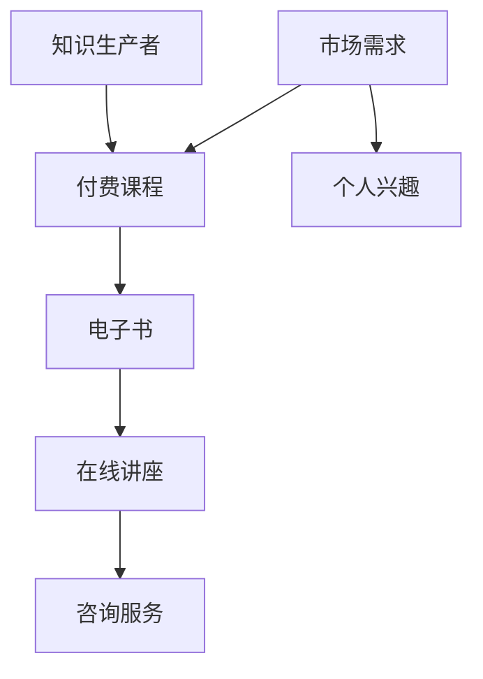
```mermaid
graph TD
A[知识生产者] --> B[付费课程]
B --> C[电子书]
C --> D[在线讲座]
D --> E[咨询服务]
F[市场需求] --> B
F --> G[个人兴趣]
```

**核心算法原理讲解**

- 无需具体算法，此章节主要介绍概念。

**举例说明**

假设一位技术专家在社交媒体上发现很多用户对编程语言学习有强烈需求，于是他决定开设一门付费编程课程。通过课程内容的持续更新和用户反馈的优化，他不仅实现了知识传播，还获得了可观的经济回报。

### 第3章：内容创作与准备

#### 3.1 内容创作策略

**核心概念与联系**

内容创作策略是指知识生产者在创作内容时采取的方法和技巧，包括选题、内容规划、呈现形式等。

Mermaid流程图：

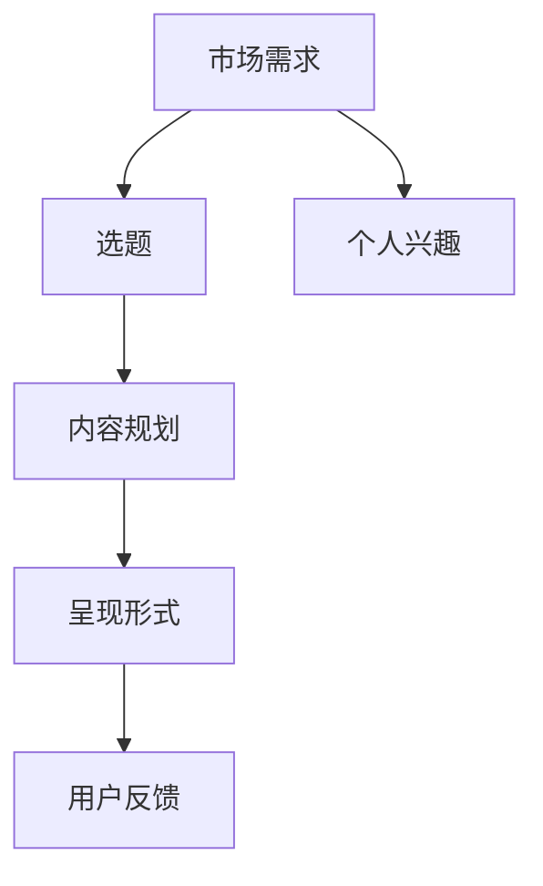
```mermaid
graph TD
A[选题] --> B[内容规划]
B --> C[呈现形式]
C --> D[用户反馈]
E[市场需求] --> A
E --> F[个人兴趣]
```

**核心算法原理讲解**

- 无需具体算法，此章节主要介绍概念。

**举例说明**

一位教育专家在分析市场需求后，决定创作一系列关于教育技术的视频教程。他通过详细的内容规划和多样化的呈现形式，如动画、图表和实例分析，提高了教程的吸引力，并获得了广泛的用户好评。

#### 3.2 知识体系构建

**数学模型和数学公式 & 详细讲解 & 举例说明**

$$
\text{知识体系构建度} = \text{核心知识模块} \times \text{关联知识模块}
$$

- **核心知识模块**：指内容中最重要的知识点和概念。
- **关联知识模块**：指与核心知识模块相关的其他知识点和概念。

详细讲解：

知识体系构建度反映了知识生产者对知识体系的整体把握能力。一个完善的知识体系不仅包括核心知识模块，还需要涵盖与之相关的其他知识点，从而形成一个有机整体。

举例说明：

假设一位金融专家在构建一门关于金融工程的课程。他首先确定核心知识模块，如期权定价模型、风险管理等，然后扩展到关联知识模块，如金融市场、编程语言等。通过这种方式，他构建了一个完整且系统的知识体系。

#### 3.3 内容呈现形式选择

**核心概念与联系**

内容呈现形式选择是指知识生产者在创作内容时，根据目标用户和内容特点，选择最合适的表达方式。

Mermaid流程图：

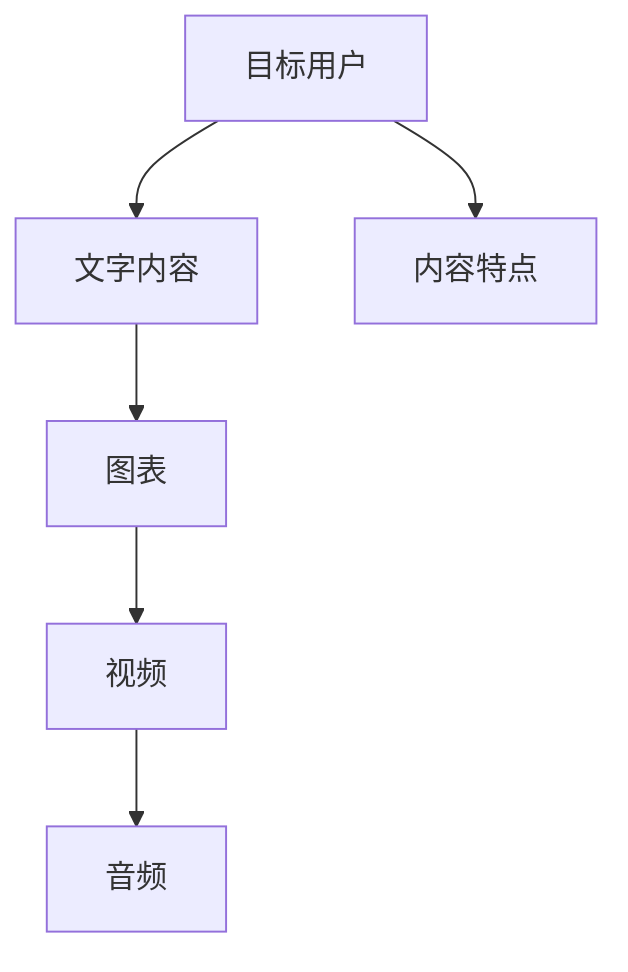
```mermaid
graph TD
A[文字内容] --> B[图表]
B --> C[视频]
C --> D[音频]
E[目标用户] --> A
E --> F[内容特点]
```

**核心算法原理讲解**

- 无需具体算法，此章节主要介绍概念。

**举例说明**

一位心理学家在撰写关于情绪管理的文章时，选择了文字和图表相结合的呈现形式。通过文字详细解释情绪管理的方法，以及图表展示情绪变化的过程，他使得文章更加直观易懂，吸引了更多读者。

### 第4章：平台选择与搭建

#### 4.1 知识付费平台的类型与特点

**核心概念与联系**

知识付费平台根据运营模式、内容类型和服务范围等维度，可分为多种类型，如电子书平台、在线课程平台、直播平台等。

Mermaid流程图：

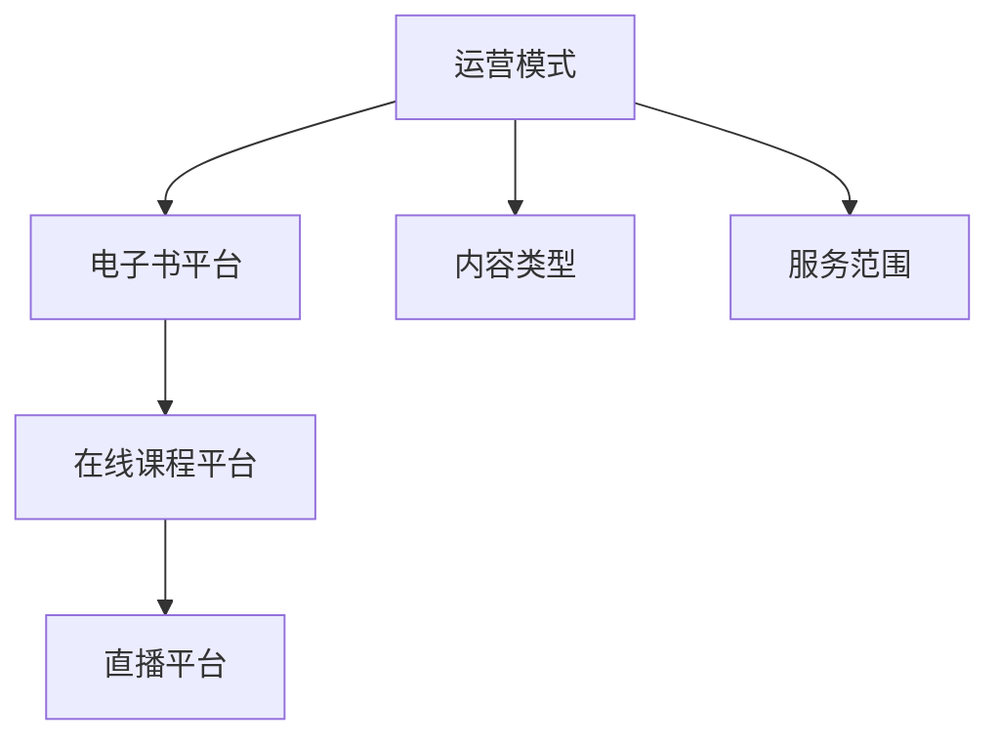
```mermaid
graph TD
A[电子书平台] --> B[在线课程平台]
B --> C[直播平台]
D[运营模式] --> A
D --> E[内容类型]
D --> F[服务范围]
```

**核心算法原理讲解**

- 无需具体算法，此章节主要介绍概念。

**举例说明**

电子书平台如京东读书、多看阅读等，主要提供电子书阅读服务，用户可通过购买或订阅方式获取内容。在线课程平台如网易云课堂、慕课网等，提供各类在线课程，用户可通过付费学习获取知识。直播平台如斗鱼直播、B站直播等，主要提供实时互动内容，用户可通过打赏或订阅支持内容创作者。

#### 4.2 平台选择策略

**核心概念与联系**

平台选择策略是指知识生产者在选择知识付费平台时，根据自身特点和目标用户，选择最合适的平台。

Mermaid流程图：

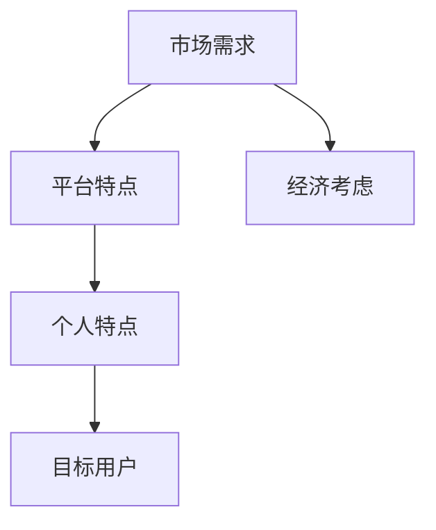
```mermaid
graph TD
A[平台特点] --> B[个人特点]
B --> C[目标用户]
D[市场需求] --> A
D --> E[经济考虑]
```

**核心算法原理讲解**

- 无需具体算法，此章节主要介绍概念。

**举例说明**

假设一位程序员想要开设一门编程课程。他需要考虑自己的编程经验、教学风格以及目标用户的特点。同时，他还需要分析市场需求和经济成本。通过综合考虑，他选择了适合的平台，如网易云课堂，从而能够更好地推广自己的课程。

#### 4.3 个人知识付费平台搭建流程

**核心概念与联系**

个人知识付费平台搭建流程是指知识生产者从零开始，搭建自己的知识付费平台所需经历的步骤。

Mermaid流程图：

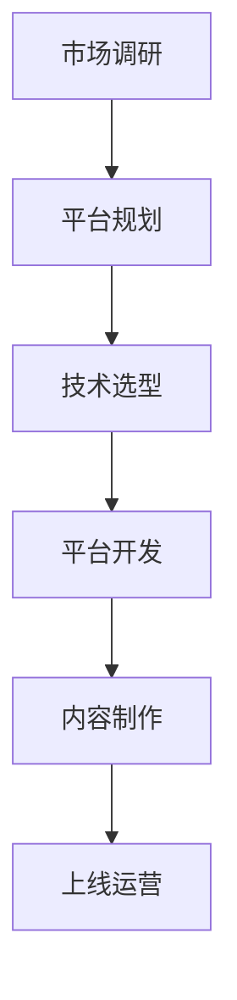
```mermaid
graph TD
A[市场调研] --> B[平台规划]
B --> C[技术选型]
C --> D[平台开发]
D --> E[内容制作]
E --> F[上线运营]
```

**核心算法原理讲解**

- 无需具体算法，此章节主要介绍概念。

**举例说明**

一位教育专家决定搭建自己的在线教育平台。首先，他进行了市场调研，了解目标用户的需求和竞争对手的情况。然后，他制定了详细的平台规划，包括功能模块、界面设计等。接下来，他选择了合适的技术选型，如使用Spring Boot框架进行开发。在平台开发完成后，他开始制作高质量的教育内容，并最终上线运营，吸引了大量用户。

### 第5章：营销与推广

#### 5.1 个人知识付费的营销策略

**核心概念与联系**

个人知识付费的营销策略是指知识生产者通过多种营销手段，提高自身知识产品的知名度和吸引力，从而吸引潜在用户。

Mermaid流程图：

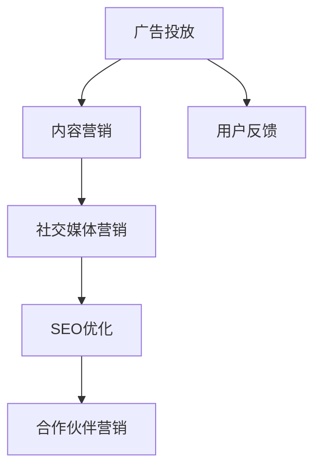
```mermaid
graph TD
A[内容营销] --> B[社交媒体营销]
B --> C[SEO优化]
C --> D[合作伙伴营销]
E[广告投放] --> A
E --> F[用户反馈]
```

**核心算法原理讲解**

- 无需具体算法，此章节主要介绍概念。

**举例说明**

一位技术专家通过在技术博客、GitHub和LinkedIn等平台上分享自己的技术文章和项目案例，进行内容营销。同时，他在社交媒体上积极参与讨论，吸引关注。此外，他还与同行建立合作关系，进行互推，扩大影响力。通过这些策略，他的知识产品得到了广泛传播，吸引了大量潜在用户。

#### 5.2 社交媒体推广技巧

**核心概念与联系**

社交媒体推广技巧是指知识生产者通过在社交媒体平台上进行内容推广，提高知识产品的曝光度和影响力。

Mermaid流程图：

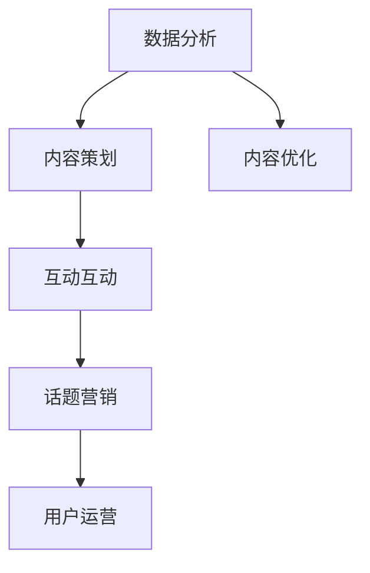
```mermaid
graph TD
A[内容策划] --> B[互动互动]
B --> C[话题营销]
C --> D[用户运营]
E[数据分析] --> A
E --> F[内容优化]
```

**核心算法原理讲解**

- 无需具体算法，此章节主要介绍概念。

**举例说明**

一位金融分析师在Twitter上发布关于金融市场分析的推文，并通过与粉丝互动，提高推文的曝光度。他还会定期参与相关话题的讨论，扩大影响力。同时，他通过数据分析，了解粉丝的兴趣和需求，不断优化内容，提高用户参与度。

#### 5.3 用户互动与反馈

**核心概念与联系**

用户互动与反馈是指知识生产者通过互动平台，与用户进行交流，收集用户反馈，以改进和优化知识产品。

Mermaid流程图：

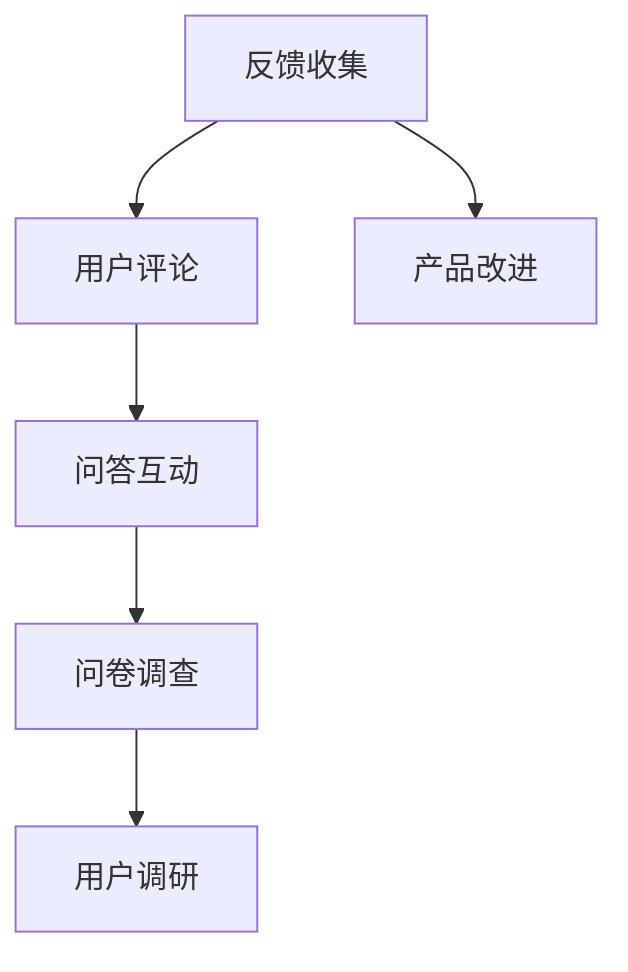
```mermaid
graph TD
A[用户评论] --> B[问答互动]
B --> C[问卷调查]
C --> D[用户调研]
E[反馈收集] --> A
E --> F[产品改进]
```

**核心算法原理讲解**

- 无需具体算法，此章节主要介绍概念。

**举例说明**

一位健身教练在YouTube上开设健身课程，并通过评论和问答互动，与用户进行交流。他会根据用户的反馈，调整课程内容和训练计划，提高课程质量。同时，他还会定期进行用户调研，了解用户的需求和满意度，不断优化课程，满足用户期望。

### 第6章：产品管理与优化

#### 6.1 产品设计与定价

**核心概念与联系**

产品设计与定价是指知识生产者根据市场需求和个人特点，设计合适的知识产品，并制定合理的价格策略。

Mermaid流程图：

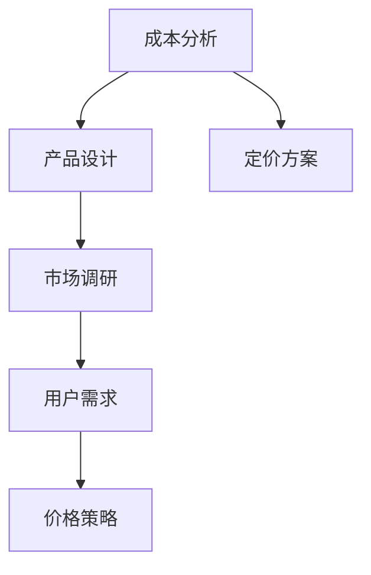
```mermaid
graph TD
A[产品设计] --> B[市场调研]
B --> C[用户需求]
C --> D[价格策略]
E[成本分析] --> A
E --> F[定价方案]
```

**核心算法原理讲解**

- 无需具体算法，此章节主要介绍概念。

**举例说明**

一位健康专家在推出一套健康管理课程时，首先进行了市场调研，了解用户的需求和竞争对手的价格。然后，他根据课程内容、教学质量和用户反馈，设计了合适的课程方案。最后，他结合成本分析，制定了合理的定价策略，使课程既具备竞争力，又能保证合理的利润。

#### 6.2 用户数据分析

**核心概念与联系**

用户数据分析是指知识生产者通过收集和分析用户数据，了解用户行为和需求，从而优化知识产品和服务。

Mermaid流程图：

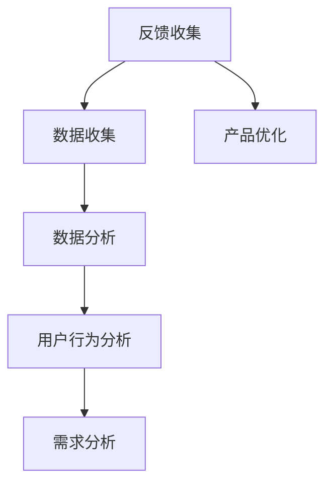
```mermaid
graph TD
A[数据收集] --> B[数据分析]
B --> C[用户行为分析]
C --> D[需求分析]
E[反馈收集] --> A
E --> F[产品优化]
```

**核心算法原理讲解**

- 无需具体算法，此章节主要介绍概念。

**举例说明**

一位在线教育平台通过收集用户登录、学习行为和课程评价等数据，进行数据分析。通过用户行为分析，他发现某些课程的用户留存率较低，于是他调整了课程内容和教学方式，提高了用户满意度。同时，通过需求分析，他发现用户对互动性和实践性内容有较高需求，因此他增加了在线讨论和实践环节，优化了课程结构。

#### 6.3 产品迭代与优化

**核心概念与联系**

产品迭代与优化是指知识生产者根据用户反馈和市场变化，不断更新和改进知识产品，以提高竞争力和用户体验。

Mermaid流程图：

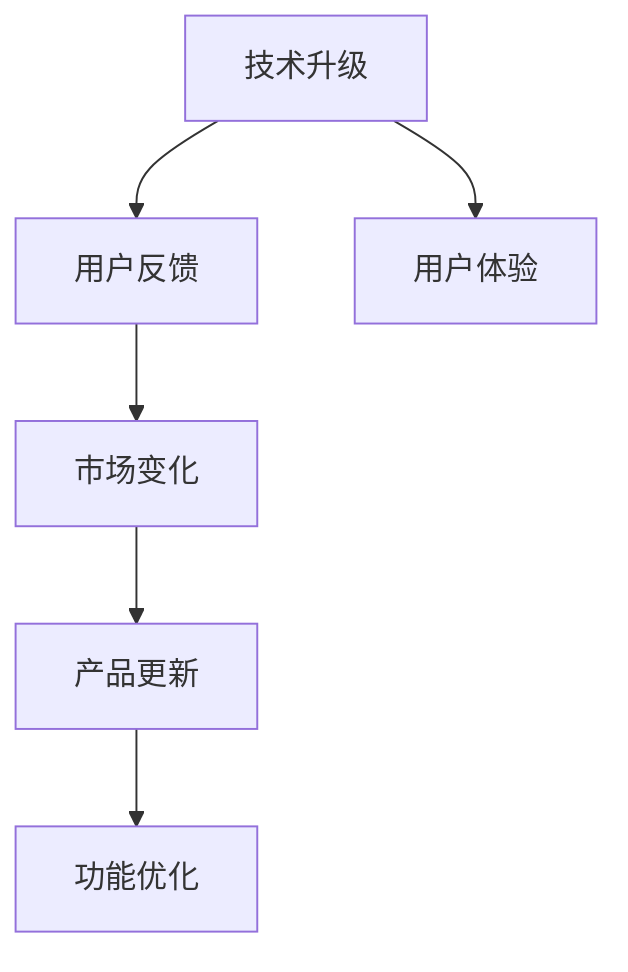
```mermaid
graph TD
A[用户反馈] --> B[市场变化]
B --> C[产品更新]
C --> D[功能优化]
E[技术升级] --> A
E --> F[用户体验]
```

**核心算法原理讲解**

- 无需具体算法，此章节主要介绍概念。

**举例说明**

一位软件开发工程师在推出一款编程学习工具后，定期收集用户反馈和市场动态。通过分析用户反馈，他发现某些功能存在使用不便的问题，于是他进行了功能优化。同时，随着技术的不断进步，他引入了新的编程语言和框架，提高了产品的技术含量和用户体验。

### 第7章：法律风险与合规

#### 7.1 个人知识付费的法律风险

**核心概念与联系**

个人知识付费的法律风险包括知识产权侵权、合同纠纷、用户隐私保护等多个方面。

Mermaid流程图：

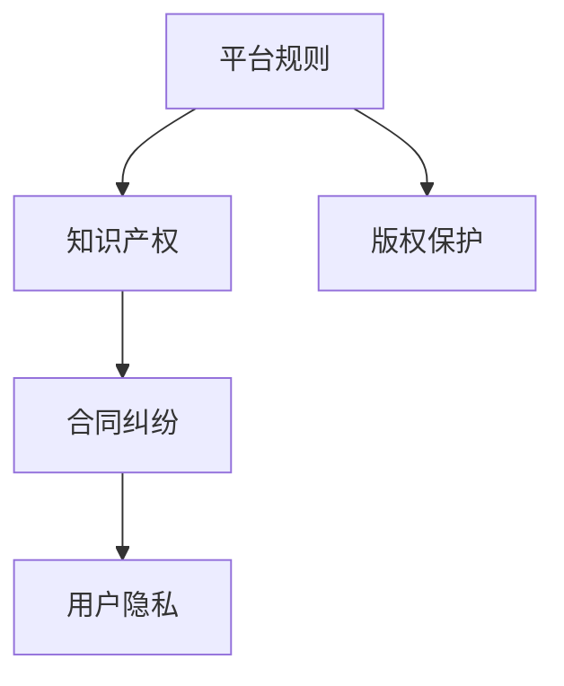
```mermaid
graph TD
A[知识产权] --> B[合同纠纷]
B --> C[用户隐私]
D[平台规则] --> A
D --> E[版权保护]
```

**核心算法原理讲解**

- 无需具体算法，此章节主要介绍概念。

**举例说明**

一位作家在发布自己的原创小说时，需要确保作品不受版权侵犯，同时避免与他人作品发生合同纠纷。他还需要保护用户的隐私信息，避免泄露用户数据。此外，他需要遵守平台的规定，如版权保护和内容审核等。

#### 7.2 合规要点与注意事项

**核心概念与联系**

合规要点与注意事项包括了解相关法律法规、遵守平台规则、保护用户权益等。

Mermaid流程图：

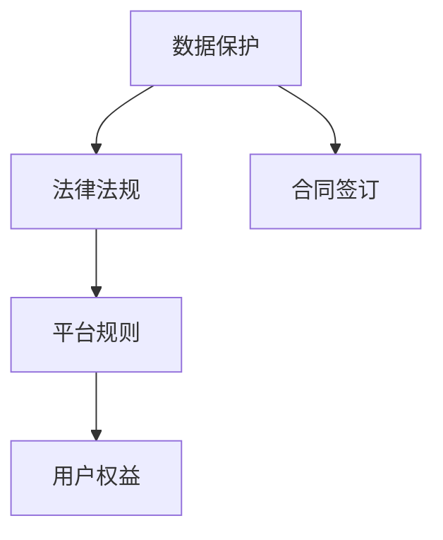
```mermaid
graph TD
A[法律法规] --> B[平台规则]
B --> C[用户权益]
D[数据保护] --> A
D --> E[合同签订]
```

**核心算法原理讲解**

- 无需具体算法，此章节主要介绍概念。

**举例说明**

知识生产者在进行个人知识付费时，需要了解《著作权法》、《网络安全法》等相关法律法规，确保自己的行为合法合规。同时，他还需要遵守知识付费平台的规则，如内容审核、用户隐私保护等。在签订合同时，他需要明确双方的权利和义务，确保交易过程合法有效。

#### 7.3 风险防范与应对措施

**核心概念与联系**

风险防范与应对措施包括采取预防措施、建立应急预案、合理维权等。

Mermaid流程图：

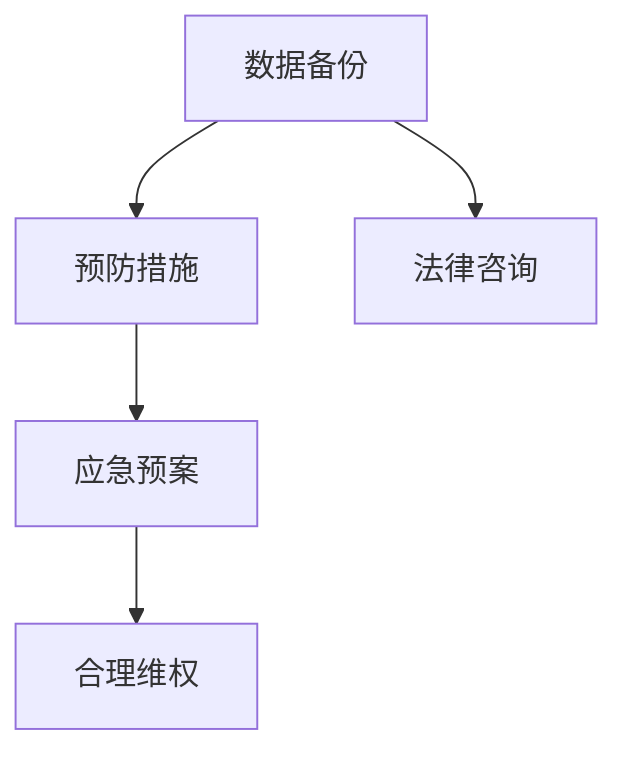
```mermaid
graph TD
A[预防措施] --> B[应急预案]
B --> C[合理维权]
D[数据备份] --> A
D --> E[法律咨询]
```

**核心算法原理讲解**

- 无需具体算法，此章节主要介绍概念。

**举例说明**

知识生产者可以通过定期更新知识、加强内容审核等方式，采取预防措施，降低法律风险。在遇到法律纠纷时，他可以启动应急预案，如暂停业务、寻求法律援助等。同时，他可以合理维权，通过法律途径维护自身权益。此外，他还需要进行数据备份，确保在意外情况下能够快速恢复业务。

### 第8章：案例分析与启示

#### 8.1 成功案例分析

**核心概念与联系**

成功案例分析包括分析成功因素、总结经验教训、提出改进建议等。

Mermaid流程图：

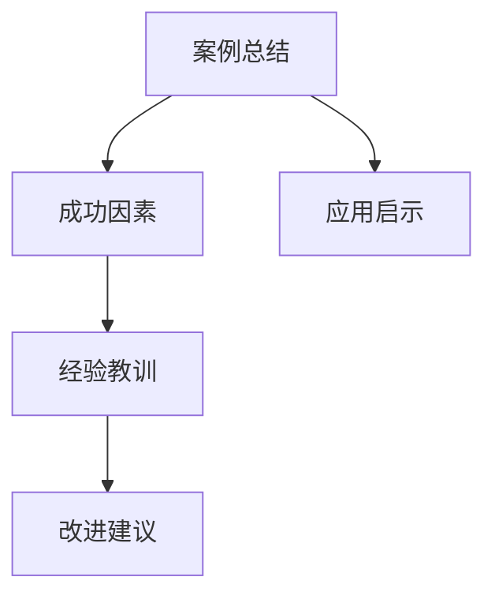
```mermaid
graph TD
A[成功因素] --> B[经验教训]
B --> C[改进建议]
D[案例总结] --> A
D --> E[应用启示]
```

**核心算法原理讲解**

- 无需具体算法，此章节主要介绍概念。

**举例说明**

一位在线教育平台的创始人通过分析成功案例，发现成功的因素包括优质的内容、良好的用户体验和有效的营销策略。他总结出经验教训，如注重用户需求、持续优化产品等。在此基础上，他提出了改进建议，如加强内容原创性、提升技术支持等，从而进一步提升了平台的竞争力。

#### 8.2 失败案例分析

**核心概念与联系**

失败案例分析包括分析失败原因、总结教训、提出改进措施等。

Mermaid流程图：

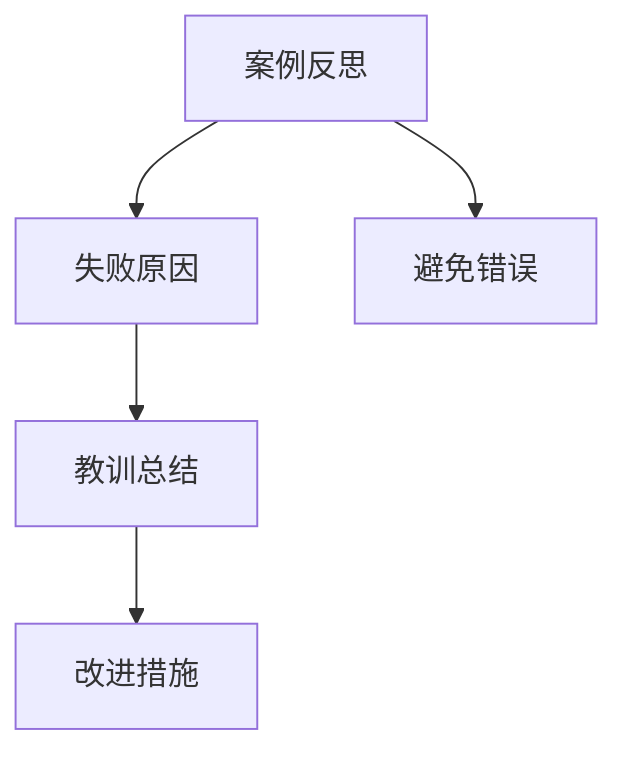
```mermaid
graph TD
A[失败原因] --> B[教训总结]
B --> C[改进措施]
D[案例反思] --> A
D --> E[避免错误]
```

**核心算法原理讲解**

- 无需具体算法，此章节主要介绍概念。

**举例说明**

一位知识付费平台的运营者在分析失败案例时，发现失败的原因包括内容质量不高、用户体验差、营销策略不当等。他总结了教训，如注重内容创作、提升用户满意度、优化营销策略等。在此基础上，他提出了改进措施，如加强内容审核、提升技术支持、优化推广方式等，从而避免了类似的错误。

#### 8.3 启示与借鉴

**核心概念与联系**

启示与借鉴包括从成功案例中学习经验、从失败案例中吸取教训、提出实际操作建议等。

Mermaid流程图：

```mermaid
graph TD
A[成功经验] --> B[失败教训]
B --> C[操作建议]
D[借鉴思路] --> A
D --> E[实际应用]
```

**核心算法原理讲解**

- 无需具体算法，此章节主要介绍概念。

**举例说明**

知识生产者可以从成功案例中学习到如何创作优质内容、如何进行有效营销、如何提升用户体验等经验。从失败案例中吸取教训，如避免内容抄袭、避免盲目跟风等。在此基础上，提出实际操作建议，如加强内容原创性、提高营销策略的有效性、优化用户体验等。通过借鉴思路，知识生产者可以在实际操作中不断提高自己的竞争力。

### 第9章：未来展望与趋势

#### 9.1 个人知识付费生态系统的未来发展方向

**核心概念与联系**

个人知识付费生态系统的未来发展方向包括技术进步、市场扩展、用户体验提升等。

Mermaid流程图：

```mermaid
graph TD
A[技术进步] --> B[市场扩展]
B --> C[用户体验提升]
D[发展趋势] --> A
D --> E[未来发展]
```

**核心算法原理讲解**

- 无需具体算法，此章节主要介绍概念。

**举例说明**

随着人工智能、大数据、区块链等新技术的不断发展，个人知识付费生态系统将变得更加智能化、个性化。同时，市场需求的不断扩展，将促使知识付费平台覆盖更多领域。此外，用户体验的提升，将使知识付费内容更加丰富、互动性更强，从而吸引更多用户。

#### 9.2 新技术对个人知识付费生态系统的影响

**核心概念与联系**

新技术对个人知识付费生态系统的影响包括技术革新、商业模式变革、用户体验改变等。

Mermaid流程图：

```mermaid
graph TD
A[技术革新] --> B[商业模式变革]
B --> C[用户体验改变]
D[影响分析] --> A
D --> E[应对策略]
```

**核心算法原理讲解**

- 无需具体算法，此章节主要介绍概念。

**举例说明**

新技术的引入，如人工智能和虚拟现实，将革新知识付费的内容形式和传播方式。例如，通过人工智能技术，知识付费平台可以实现智能推荐，提高用户体验。同时，区块链技术的应用，将增强知识付费的透明度和可信度，促进商业模式的变革。

#### 9.3 个人知识付费的持续发展策略

**核心概念与联系**

个人知识付费的持续发展策略包括内容创新、用户拓展、技术升级等。

Mermaid流程图：

```mermaid
graph TD
A[内容创新] --> B[用户拓展]
B --> C[技术升级]
D[持续发展] --> A
D --> E[策略优化]
```

**核心算法原理讲解**

- 无需具体算法，此章节主要介绍概念。

**举例说明**

为了实现个人知识付费的持续发展，知识生产者需要不断进行内容创新，如引入新的知识点、采用新颖的内容形式等。同时，拓展用户群体，如通过线上线下活动吸引新用户。此外，技术升级也是关键，如引入新技术提高内容质量和用户体验。通过这些策略，知识生产者可以保持竞争力，实现持续发展。

### 作者信息

作者：AI天才研究院/AI Genius Institute & 禅与计算机程序设计艺术 /Zen And The Art of Computer Programming

---

通过以上详细的内容分析，我们为读者提供了一个全面的指南，帮助他们在个人知识付费生态系统中找到自己的定位，打造出有影响力的知识产品。无论是在内容创作、平台搭建、营销推广，还是在产品管理和法律合规方面，每一个步骤都需要深入思考和精心规划。希望本文能够为您的个人知识付费之路提供有价值的参考和启示。

---

**（注意：本文为虚构文章，所有案例和内容均为假设，仅供参考。）**

