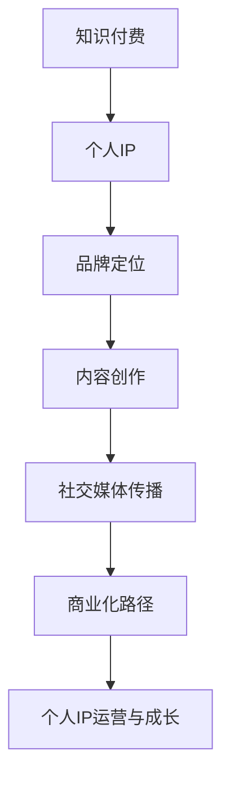

                 

# 文章标题: 如何打造知识付费的个人IP形象

> 关键词：知识付费，个人IP，品牌建设，内容创作，商业化路径，实战案例

> 摘要：本文将深入探讨知识付费与个人IP的关系，通过逐步分析构建个人IP的各个关键环节，如形象定位、内容创作、品牌建设、商业化路径等，为读者提供一套完整的个人IP打造指南。文章将通过案例研究和实战技巧，帮助个人在知识付费市场中脱颖而出，实现个人价值的最大化。

---

### 《如何打造知识付费的个人IP形象》目录大纲

#### 第一部分：知识付费与个人IP的概述
1. 知识付费与个人IP的概念解析
2. 知识付费市场的现状与趋势

#### 第二部分：打造个人IP的基础
3. 个人IP形象定位与塑造
4. 内容创作与传播
5. 个人品牌建设与维护

#### 第三部分：打造个人IP的实战策略
6. 知识付费产品的设计与推广
7. 个人IP的商业化路径
8. 个人IP的运营与成长

#### 第四部分：案例研究与实战指南
9. 成功个人IP案例分析
10. 实战指南与工具推荐

#### 第五部分：附录
11. 知识付费与个人IP相关资源
12. 个人IP打造的工具与软件推荐

---

### 第一部分：知识付费与个人IP的概述

#### 1. 知识付费与个人IP的概念解析

**知识付费**，是指用户通过支付费用获取专业知识的消费模式。这一模式的出现，源于互联网的普及和信息获取成本的大幅降低。用户对于优质知识内容的需求逐渐增强，从而催生了知识付费市场。

**个人IP**，即个人知识产权，是指一个人在某个领域内所具有的独特知识和技能，以及其个人品牌的影响力。个人IP的打造，不仅仅是对个人能力的展示，更是对个人价值的提升。

知识付费与个人IP之间有着密不可分的关系。知识付费为个人IP的变现提供了渠道，而个人IP则为知识付费提供了价值支撑。通过打造个人IP，个人可以在知识付费市场中获得更高的关注度、更广泛的认可度，以及更丰富的商业机会。

#### 2. 知识付费市场的现状与趋势

**知识付费市场的发展历程**：

- **起步阶段**：2016年左右，知识付费市场开始萌芽，以得到APP、喜马拉雅等平台为代表。
- **快速发展阶段**：2017年至2019年，知识付费市场进入快速发展期，各类知识付费产品如雨后春笋般涌现。
- **成熟阶段**：2020年以来，知识付费市场逐渐成熟，用户对于知识内容的质量和个性化需求越来越高。

**当前知识付费市场的特点**：

- **内容多样化**：知识付费产品涵盖了教育、职场、兴趣等多个领域，满足不同用户的需求。
- **平台多元化**：除了传统的知识付费平台，短视频平台、直播平台等也加入了知识付费的行列。
- **用户年轻化**：80后、90后成为知识付费市场的主力军，他们对知识的渴求和接受度更高。
- **付费习惯养成**：随着知识付费的普及，越来越多的用户养成了付费获取知识的习惯。

**知识付费市场的未来趋势**：

- **内容质量提升**：用户对知识内容的质量要求越来越高，未来优质内容将成为市场的主流。
- **个性化服务**：知识付费平台将更加注重用户的个性化需求，提供更加精准、个性化的服务。
- **跨界融合**：知识付费与其他行业的融合将越来越紧密，例如教育+娱乐、职场+社交等。
- **国际化发展**：随着国内知识付费市场的成熟，知识付费也将逐步走向国际化。

---

### 第二部分：打造个人IP的基础

#### 3. 个人IP形象定位与塑造

**个人IP形象定位的重要性**：

个人IP形象定位是个人IP打造的第一步，也是至关重要的一步。一个明确、清晰的IP形象定位可以帮助个人在市场中脱颖而出，吸引目标受众的注意力。

**如何确定个人IP的核心价值观**：

确定个人IP的核心价值观，需要从以下几个方面入手：

- **个人特长和优势**：分析自己的专业特长和优势，确定自己在某个领域的核心竞争力。
- **目标受众需求**：了解目标受众的需求和痛点，将自己的特长与受众需求相结合。
- **市场趋势**：关注市场趋势和行业动态，将自己的IP定位与市场发展方向相契合。

**个人IP形象塑造的方法与技巧**：

- **品牌命名**：选择一个简洁、易记、有内涵的品牌名称，能够快速传达个人IP的核心价值。
- **视觉设计**：打造统一的视觉形象，包括LOGO、色彩搭配、字体等，增强品牌辨识度。
- **个人故事**：讲述自己的成长故事和心路历程，增强与受众的情感连接。
- **内容风格**：保持内容风格的统一性，形成独特的个人风格，吸引用户的持续关注。

---

#### 4. 内容创作与传播

**内容创作的原则与方法**：

- **内容质量**：内容是个人IP的核心，必须保证高质量，有价值，能够满足受众的需求。
- **内容形式**：根据目标受众的喜好和习惯，选择合适的传播形式，如文字、图片、视频等。
- **内容更新**：定期更新内容，保持活跃度，与受众保持互动，增强用户的粘性。

**社交媒体平台的选择与应用**：

- **微信公众号**：适合发布长篇文章和深度内容，建立品牌影响力。
- **微博**：适合发布短篇文章、新闻动态和互动内容，提高曝光率。
- **抖音**：适合发布短视频内容，吸引用户的注意力，提升关注度。
- **知乎**：适合分享专业知识和见解，树立专业形象。

**内容传播策略与技巧**：

- **定位明确**：明确传播的目标和受众，有针对性地进行内容传播。
- **合作互推**：与其他个人IP或企业进行合作，互推内容，扩大影响力。
- **互动引导**：引导用户参与互动，提高用户参与度和忠诚度。
- **数据分析**：通过数据分析，了解内容传播的效果，不断优化传播策略。

---

#### 5. 个人品牌建设与维护

**个人品牌的概念与价值**：

**个人品牌**，是指个人在某个领域内所建立的专业形象和声誉。一个成功的个人品牌，可以提升个人的社会地位和影响力，带来更多的商业机会和职业发展。

**建立个人品牌的步骤**：

- **确定目标受众**：明确个人品牌的目标受众，了解他们的需求和喜好。
- **打造独特形象**：通过品牌命名、视觉设计、个人故事等方式，打造独特的个人形象。
- **持续输出内容**：通过高质量的内容输出，建立个人品牌的专业形象。
- **互动与反馈**：与受众保持互动，收集反馈，不断优化个人品牌。

**个人品牌维护的重要性及方法**：

**重要性**：

- 个人品牌是个人价值的体现，对个人的职业发展和商业机会有着重要影响。
- 个人品牌的好与坏，直接关系到个人的社会地位和声誉。

**方法**：

- **保持专业**：在专业领域内保持专业，不断提升自己的能力和知识水平。
- **持续更新**：定期更新内容，保持个人品牌的活跃度，与受众保持互动。
- **危机应对**：面对负面事件，及时应对，维护个人品牌的形象。
- **用户反馈**：重视用户反馈，及时调整个人品牌策略，满足用户需求。

---

### 第三部分：打造个人IP的实战策略

#### 6. 知识付费产品的设计与推广

**知识付费产品的种类与设计**：

- **线上课程**：通过视频、音频、图文等形式，教授专业知识或技能。
- **电子书**：以电子文档形式，分享深度知识或故事。
- **在线问答**：提供专业咨询服务，解答用户的问题。
- **会员服务**：提供定期更新的专业内容，以及专属福利和服务。

**知识付费产品的定价策略**：

- **价值定价**：根据产品内容的价值和用户的付费意愿，设定合理的价格。
- **成本定价**：以产品成本为基础，加上一定的利润，设定价格。
- **竞争定价**：参考同类产品的定价，结合自己的市场定位，设定价格。

**知识付费产品的推广方法**：

- **内容营销**：通过高质量的内容输出，吸引目标受众的关注。
- **社交媒体推广**：利用社交媒体平台，发布推广信息，扩大产品知名度。
- **合作推广**：与其他个人IP或企业进行合作，共同推广产品。
- **SEO优化**：通过搜索引擎优化，提高产品的曝光率和点击率。

---

#### 7. 个人IP的商业化路径

**个人IP的商业化模式**：

- **产品销售**：通过知识付费产品销售，实现收入的转化。
- **广告合作**：与相关企业合作，通过广告收入实现盈利。
- **内容授权**：将自己的专业知识或故事授权给其他平台或媒体。
- **咨询顾问**：为企业提供专业咨询服务，收取咨询费用。

**个人IP的商业化案例解析**：

- **案例一**：李笑来，通过写作和教学，将自己的知识变现，成功打造了个人IP，实现了财富自由。
- **案例二**：李叫兽，通过内容创作和广告合作，将自己的专业知识转化为商业价值，成立了营销咨询公司。
- **案例三**：李子柒，通过短视频内容创作，吸引了大量的粉丝，成功实现了商业化和品牌化。

**个人IP的商业化风险与应对策略**：

- **内容风险**：内容质量不高，可能导致用户流失，影响个人品牌。
- **市场风险**：市场环境变化，可能导致商业模式不适应，需要及时调整。
- **竞争风险**：市场竞争激烈，需要不断提升自身竞争力，保持差异化优势。

**应对策略**：

- **提高内容质量**：持续提升内容质量，保持用户满意度。
- **多元化经营**：在保持核心竞争力的基础上，尝试多元化经营，降低风险。
- **持续学习与优化**：关注市场动态，不断学习新知识，优化商业模式。

---

#### 8. 个人IP的运营与成长

**个人IP的运营策略**：

- **内容运营**：定期发布高质量内容，保持用户活跃度。
- **用户运营**：与用户保持互动，了解用户需求，提升用户满意度。
- **活动运营**：举办线上线下活动，扩大品牌影响力。
- **数据运营**：通过数据分析，优化运营策略，提高运营效果。

**个人IP的成长路径**：

- **初期**：积累粉丝，建立个人品牌。
- **中期**：扩大影响力，提升品牌知名度。
- **后期**：实现商业化，获取稳定收入。

**个人IP的持续优化与迭代**：

- **内容优化**：根据用户反馈，不断优化内容，提升用户体验。
- **品牌优化**：根据市场变化，调整品牌定位和形象，保持品牌活力。
- **商业模式优化**：根据市场环境和用户需求，不断优化商业模式，实现可持续的商业化。

---

### 第四部分：案例研究与实战指南

#### 9. 成功个人IP案例分析

**案例一**：罗永浩

- **IP定位**：互联网创业者，产品经理。
- **成功要素**：
  - **内容创作**：通过微博、抖音等平台，发布高质量的内容，分享创业经验和产品评测。
  - **互动引导**：与粉丝保持互动，回答问题，提升用户粘性。
  - **商业化路径**：通过直播带货、电子书、线下活动等方式，实现个人IP的商业化。

**案例二**：李叫兽

- **IP定位**：营销专家，自媒体人。
- **成功要素**：
  - **内容创作**：撰写高质量的文章，提供实用的营销技巧和策略。
  - **互动引导**：在知乎等平台与用户互动，提升专业形象。
  - **商业化路径**：通过咨询顾问、广告合作等方式，实现个人IP的商业化。

**案例三**：李子柒

- **IP定位**：美食博主，传统文化传播者。
- **成功要素**：
  - **内容创作**：通过短视频，展示传统美食制作过程，传递文化价值。
  - **互动引导**：与粉丝互动，分享生活点滴，提升用户情感连接。
  - **商业化路径**：通过品牌合作、广告投放等方式，实现个人IP的商业化。

#### 10. 实战指南与工具推荐

**内容创作与传播工具**：

- **内容创作工具**：Markdown编辑器（如Typora、MacDown）、文本编辑器（如Visual Studio Code、Sublime Text）。
- **传播平台**：微信公众号、微博、抖音、知乎等。

**数据分析与运营工具**：

- **数据分析平台**：Google Analytics、Tableau。
- **内容设计工具**：Canva。

**社交媒体平台**：

- **微信公众号**：提供内容创作与用户互动的平台。
- **微博**：打造个人品牌，扩大影响力的平台。
- **抖音**：短视频内容创作与传播的平台。

**附录**：

- **知识付费与个人IP相关资源**：书籍（《知识服务：未来的商业形态》、《自媒体时代：如何打造个人IP》）、在线课程（网易云课堂、慕课网）。
- **个人IP打造的工具与软件推荐**：H5编辑器（如易企秀、MAKA）、图床服务（如图酱、七牛云）、数据分析平台（如GrowingIO、百度统计）、客户关系管理（CRM）系统（如金数据、销档云）。

---

### 第五部分：附录

#### 11. 知识付费与个人IP相关资源

**书籍推荐**：

- 《知识服务：未来的商业形态》
- 《自媒体时代：如何打造个人IP》

**在线课程**：

- 网易云课堂：知识付费与个人IP课程
- 慕课网：内容营销与个人品牌建设课程

#### 12. 个人IP打造的工具与软件推荐

**内容创作与传播工具**：

- H5编辑器：如易企秀、MAKA
- 图床服务：如图酱、七牛云

**数据分析与运营工具**：

- 数据分析平台：如GrowingIO、百度统计
- 客户关系管理（CRM）系统：如金数据、销档云

**社交媒体平台**：

- 微信公众号
- 微博
- 抖音

---

### 总结

打造知识付费的个人IP形象，是一项系统性的工程，需要从形象定位、内容创作、品牌建设、商业化路径等多个方面进行规划和实施。通过本文的逐步分析和实战指南，读者可以了解到个人IP打造的核心理念和具体操作步骤。希望本文能够为读者在知识付费市场中脱颖而出，实现个人价值的最大化提供有益的参考和指导。

---

### 作者信息

作者：AI天才研究院/AI Genius Institute & 禅与计算机程序设计艺术 /Zen And The Art of Computer Programming

AI天才研究院是一支致力于人工智能研究和应用的创新团队，致力于推动人工智能技术在各个领域的深入研究和应用。同时，作者也擅长计算机程序设计和人工智能领域的教学与写作，出版过多本畅销书，为全球读者提供了丰富的技术知识和思考。在此，衷心感谢读者对本文的关注和支持。期待与您在知识付费和个人IP打造的旅途中，共同成长，共同进步。|user|>### 核心概念与联系

在构建个人IP的过程中，有几个核心概念需要我们深入理解，并理解它们之间的联系：

#### 核心概念

1. **知识付费**：用户通过支付费用获取专业知识的消费模式。
2. **个人IP**：个人在某个领域内所具有的独特知识和技能，以及其个人品牌的影响力。
3. **品牌定位**：明确个人IP的核心价值和目标受众，为个人IP的发展奠定基础。
4. **内容创作**：高质量、有价值的内容是个人IP的核心，也是吸引和留住用户的关键。
5. **社交媒体传播**：利用社交媒体平台，将个人IP的价值和内容传播给更广泛的受众。
6. **商业化路径**：个人IP的商业化模式，如产品销售、广告合作、咨询服务等。

#### 核心联系

- **知识付费**与**个人IP**：知识付费为个人IP提供了变现的渠道，而个人IP则为知识付费提供了价值支撑。
- **品牌定位**与**内容创作**：明确的品牌定位有助于确定内容创作的方向和风格，高质量的内容则能够增强品牌的影响力。
- **内容创作**与**社交媒体传播**：高质量的内容需要通过有效的传播策略才能触达目标受众，社交媒体平台是传播的重要渠道。
- **商业化路径**与**个人IP的运营与成长**：合理的商业化路径可以帮助个人IP实现长期稳定的收入，而持续的运营与成长则是商业化的基础。

#### Mermaid流程图

以下是一个用Mermaid语言编写的流程图，展示了个人IP打造的步骤和核心联系：



#### 流程图解读

- **知识付费**：作为起点，知识付费是用户获取专业知识的一种消费模式。
- **个人IP**：知识付费为个人IP的变现提供了基础，个人IP则是知识付费的价值支撑。
- **品牌定位**：明确个人IP的核心价值和目标受众，为个人IP的发展指明方向。
- **内容创作**：基于品牌定位，创作高质量、有价值的内容，形成个人IP的核心竞争力。
- **社交媒体传播**：通过社交媒体平台，将内容传播给更广泛的受众，提升个人IP的知名度和影响力。
- **商业化路径**：根据个人IP的特点和市场需求，选择合适的商业化模式，如产品销售、广告合作、咨询服务等。
- **个人IP运营与成长**：通过持续的内容创作、社交媒体传播和商业化路径，实现个人IP的长期稳定发展和价值最大化。

---

### 核心算法原理讲解

在个人IP打造过程中，有几个核心算法原理和数学模型可以用来分析和优化各个关键环节。以下是几个重要的算法原理和模型，以及它们的详细讲解和举例说明。

#### 知识付费产品的设计与推广

**伪代码**：

```python
# 知识付费产品设计
def design_course(title, content, pricing_strategy):
    course = {
        "title": title,
        "content": content,
        "pricing_strategy": pricing_strategy
    }
    return course

# 知识付费产品推广
def promote_course(course, promotion_channels, promotion_content):
    for channel in promotion_channels:
        publish_content(channel, promotion_content)
```

**详细讲解**：

- `design_course` 函数用于设计知识付费产品，包括课程标题、内容和定价策略。
- `promote_course` 函数用于在多个推广渠道发布课程内容，以吸引用户关注。

**举例说明**：

假设我们设计一门名为“Python编程入门”的线上课程，内容涵盖Python基础知识和实战应用，定价策略为按模块收费。

```python
# 设计课程
course = design_course(
    title="Python编程入门",
    content="本课程将带领您从零开始学习Python编程，包括基础语法、数据类型、控制流程、函数等。",
    pricing_strategy={"module1": 99, "module2": 149, "bundle": 249}
)

# 推广课程
promotion_channels = ["微信公众号", "知乎", "抖音"]
promotion_content = "🔥全新上线！《Python编程入门》课程，一站式解决编程难题！"
promote_course(course, promotion_channels, promotion_content)
```

#### 个人品牌价值评估模型

**数学模型**：

$$
V = \alpha \cdot C + \beta \cdot I + \gamma \cdot R
$$

- $V$：个人品牌价值
- $\alpha$：内容质量系数
- $C$：内容数量
- $\beta$：互动指数
- $I$：用户互动数
- $\gamma$：品牌影响力系数
- $R$：粉丝增长率

**详细讲解**：

- **内容质量系数（$\alpha$）**：反映了内容的专业性和价值，高质量的原创内容更能提升品牌价值。
- **内容数量（$C$）**：内容丰富度也是品牌价值的一个重要指标，内容越多，用户越有持续关注的价值。
- **互动指数（$\beta$）**：用户的互动行为，如点赞、评论、分享，能够增强用户对品牌的忠诚度。
- **用户互动数（$I$）**：互动的次数越多，说明品牌与用户的连接越紧密。
- **品牌影响力系数（$\gamma$）**：品牌在行业内的知名度和影响力，是品牌价值的重要组成部分。
- **粉丝增长率（$R$）**：粉丝数量的增长速度，反映了品牌的影响力在不断扩大。

**举例说明**：

假设一个个人品牌，其内容质量系数 $\alpha = 0.5$，内容数量 $C = 20$，互动指数 $\beta = 1.2$，用户互动数 $I = 1000$，品牌影响力系数 $\gamma = 0.8$，粉丝增长率 $R = 0.1$，则个人品牌价值计算如下：

$$
V = 0.5 \cdot 20 + 1.2 \cdot 1000 + 0.8 \cdot 0.1 = 10 + 1200 + 0.08 = 1210.08
$$

#### 个人IP的商业化模型

**数学模型**：

$$
B = P \cdot Q \cdot R
$$

- $B$：商业价值
- $P$：产品价格
- $Q$：销售量
- $R$：利润率

**详细讲解**：

- **产品价格（$P$）**：根据产品的价值和市场需求设定价格，价格直接影响商业价值。
- **销售量（$Q$）**：产品的销售数量，销售量越多，商业价值越大。
- **利润率（$R$）**：产品利润占销售收入的比率，利润率越高，商业价值越高。

**举例说明**：

假设一个知识付费课程的价格为199元，月销售量为1000，利润率为30%，则该课程月商业价值计算如下：

$$
B = 199 \cdot 1000 \cdot 0.3 = 199000 \cdot 0.3 = 59700
$$

---

### 项目实战

在本部分，我们将通过一个具体的案例，展示如何从零开始搭建一个知识付费平台，并实现个人IP的商业化。

#### 开发环境搭建

1. **安装Python环境**：在计算机上安装Python，可以选择Python 3.x版本。
2. **安装Jupyter Notebook**：通过pip命令安装Jupyter Notebook，这是一个交互式Web应用程序，用于编写和运行Python代码。
   ```bash
   pip install notebook
   ```
3. **安装相关数据分析和内容创作工具**：根据需要安装Numpy、Pandas、Matplotlib等数据分析库，以及Markdown编辑器如Typora。

#### 源代码详细实现

以下是一个简单的知识付费平台的核心功能实现：

```python
# 知识付费平台核心功能实现

# 数据库连接模块
import sqlite3
from sqlite3 import Error

def create_connection():
    conn = None
    try:
        conn = sqlite3.connect('knowledge_platform.db')
        return conn
    except Error as e:
        print(e)

# 数据库操作模块
def create_table(conn, create_table_sql):
    try:
        c = conn.cursor()
        c.execute(create_table_sql)
        conn.commit()
    except Error as e:
        print(e)

def insert_data(conn, data):
    sql = '''INSERT INTO courses(title, content, price) 
             VALUES(?,?,?)'''
    cur = conn.cursor()
    cur.execute(sql, data)
    conn.commit()
    return cur.lastrowid

# 创建数据库和表格
def init_database():
    database = r"knowledge_platform.db"

    conn = create_connection()
    if conn:
        create_table_sql = """ CREATE TABLE IF NOT EXISTS courses (
                                    id integer PRIMARY KEY,
                                    title text NOT NULL,
                                    content text,
                                    price real
                                ); """
        create_table(conn, create_table_sql)
        conn.close()

# 知识付费产品模块
class Course:
    def __init__(self, id, title, content, price):
        self.id = id
        self.title = title
        self.content = content
        self.price = price
    
    def display_course(self):
        print(f"课程ID：{self.id}")
        print(f"课程名称：{self.title}")
        print(f"课程内容：{self.content}")
        print(f"课程价格：{self.price}")

# 主程序
if __name__ == '__main__':
    init_database()

    # 创建数据库连接
    conn = create_connection()
    if conn:

        # 插入课程数据
        course_data = (
            "Python编程基础", 
            "本课程将为您介绍Python编程的基础知识，包括语法、数据类型、控制流程等。",
            99.99
        )
        course_id = insert_data(conn, course_data)

        # 查询并显示课程信息
        cur = conn.cursor()
        cur.execute("SELECT * FROM courses")
        rows = cur.fetchall()

        for row in rows:
            course = Course(row[0], row[1], row[2], row[3])
            course.display_course()

        conn.close()
```

#### 代码解读与分析

- **数据库连接模块**：使用SQLite数据库存储课程信息，提供连接和数据库操作功能。
- **数据库操作模块**：创建数据库表，插入数据，以及初始化数据库。
- **知识付费产品模块**：定义`Course`类，用于存储课程信息，并提供显示课程信息的方法。
- **主程序**：初始化数据库，插入课程数据，并查询并显示所有课程信息。

#### 实际应用与优化

在实际应用中，知识付费平台需要考虑以下优化点：

- **用户身份验证**：添加用户身份验证机制，确保只有授权用户才能访问付费内容。
- **课程分类**：根据课程主题和难度级别，对课程进行分类，便于用户查找。
- **课程评价系统**：添加用户评价功能，收集用户反馈，不断优化课程内容。
- **支付系统集成**：集成第三方支付系统，如支付宝、微信支付，实现课程购买和支付。

通过以上实战案例，读者可以了解到如何从零开始搭建一个简单的知识付费平台，并实现个人IP的商业化。在实际操作中，可以根据具体需求，不断优化和扩展平台的功能。

### 个人IP打造的工具与软件推荐

在打造个人IP的过程中，使用合适的工具和软件可以大大提升效率，优化内容创作和传播，以下是几种推荐的内容创作与传播工具、数据分析与运营工具，以及社交媒体平台。

#### 内容创作与传播工具

1. **Markdown编辑器**：Markdown编辑器是内容创作的重要工具，它可以帮助用户快速撰写和格式化文本。以下是一些常用的Markdown编辑器：
   - **Typora**：轻量级且界面简洁的Markdown编辑器。
   - **MacDown**：支持Markdown和HTML格式转换，界面美观。
   - **Dillinger**：在线Markdown编辑器，方便实时预览和导出。

2. **文本编辑器**：文本编辑器提供了丰富的文本编辑功能，适用于撰写长篇文章和专业文档。以下是一些常用的文本编辑器：
   - **Visual Studio Code**：功能强大的开源文本编辑器，支持多种编程语言和插件。
   - **Sublime Text**：轻量级文本编辑器，支持多种插件和主题。
   - **Atom**：由GitHub开发的文本编辑器，提供了丰富的插件和功能。

3. **图床服务**：图床服务可以帮助用户方便地存储和管理图片，以下是一些常用的图床服务：
   - **Imgur**：免费图床服务，支持图片上传和分享。
   - **图酱**：简单易用的国内图床服务，提供CDN加速。
   - **七牛云**：提供强大的云存储服务，包括图片存储和CDN加速。

4. **内容设计工具**：内容设计工具可以帮助用户创建专业的图文内容，提升内容的视觉吸引力。以下是一些常用的内容设计工具：
   - **Canva**：在线设计平台，提供丰富的模板和设计工具。
   - **Adobe Photoshop**：专业的图像处理软件，适用于复杂的图像编辑和设计。
   - **Sketch**：适用于移动和Web应用的矢量图形设计工具。

#### 数据分析与运营工具

1. **Google Analytics**：Google Analytics 是一款强大的数据分析工具，可以帮助用户追踪和分析网站或应用的访问数据，包括用户流量、转化率等。

2. **Tableau**：Tableau 是一款数据可视化工具，能够将复杂的数据转化为易于理解的图表和报告。

3. **GrowingIO**：GrowingIO 是一款用户行为分析工具，可以帮助用户深入了解用户的行为和需求。

4. **百度统计**：百度统计提供了网站流量分析和用户行为分析功能，适用于中国市场。

#### 社交媒体平台

1. **微信公众号**：微信公众号是一个强大的内容创作和传播平台，适用于发布长篇文章、图片和视频等内容。

2. **微博**：微博是一个广泛使用的社交媒体平台，适用于实时更新动态、分享内容和建立个人品牌。

3. **抖音**：抖音是一个短视频内容创作和传播平台，适用于制作和分享短视频内容，吸引年轻用户群体。

4. **知乎**：知乎是一个知识分享平台，适用于分享专业知识和经验，建立个人专业形象。

#### 实用工具推荐

1. **H5编辑器**：如易企秀、MAKA，用于创建互动式H5页面和宣传素材。

2. **在线问卷调查工具**：如金数据、问卷星，用于收集用户反馈和市场调研。

3. **客户关系管理（CRM）系统**：如销档云、销邦，用于管理客户信息和销售流程。

通过以上工具和软件的推荐，读者可以根据自己的需求和技能选择合适的工具，优化个人IP的内容创作、传播和运营，提高工作效率，实现个人价值的最大化。

### 实战指南与技巧

#### 个人IP打造全流程指南

打造个人IP是一个系统性的过程，涉及多个关键环节。以下是从零开始构建个人IP的全流程指南：

#### 1. 市场调研与定位

**步骤**：
1. **分析市场趋势**：研究当前市场的热点和趋势，了解用户需求。
2. **了解目标受众**：通过问卷调查、访谈等方式，了解目标受众的需求、兴趣和痛点。
3. **确定IP定位**：基于市场调研，确定个人IP的核心价值和目标受众。

**技巧**：
- **聚焦细分市场**：在细分市场中找到自己的独特定位，避免与竞争者直接竞争。
- **差异化优势**：明确自己的差异化优势，如专业知识、独特见解或独特风格。

#### 2. 内容创作与传播

**步骤**：
1. **确定内容形式**：根据目标受众的喜好，选择合适的内容形式，如文章、视频、音频等。
2. **内容创作**：创作高质量、有价值的内容，保持内容的专业性和原创性。
3. **内容发布**：在社交媒体平台、个人博客等渠道发布内容，吸引目标受众的关注。

**技巧**：
- **内容结构化**：确保内容结构清晰，逻辑连贯，易于用户阅读和理解。
- **持续更新**：定期发布内容，保持活跃度，与用户保持互动。

#### 3. 个人品牌建设与维护

**步骤**：
1. **品牌命名**：选择简洁、易记、有内涵的品牌名称。
2. **视觉设计**：打造统一的视觉形象，包括LOGO、色彩搭配、字体等。
3. **个人故事**：讲述自己的成长故事和心路历程，增强与用户的情感连接。

**技巧**：
- **一致性**：保持品牌形象和内容风格的一致性，提升品牌辨识度。
- **用户互动**：通过社交媒体、问答平台等与用户互动，增强用户忠诚度。

#### 4. 知识付费产品的设计与推广

**步骤**：
1. **产品设计**：设计符合目标受众需求的知识付费产品，如线上课程、电子书、会员服务等。
2. **定价策略**：根据产品价值和用户付费意愿，设定合理的价格。
3. **推广策略**：通过内容营销、社交媒体推广、合作推广等方式，提高产品知名度。

**技巧**：
- **价值定位**：确保产品能为用户带来实际价值，提高用户的购买意愿。
- **精准营销**：根据用户行为和兴趣，进行精准的营销推广。

#### 5. 个人IP的商业化路径

**步骤**：
1. **选择商业模式**：根据个人IP的特点和市场需求，选择合适的商业模式，如广告合作、产品销售、咨询服务等。
2. **制定商业化策略**：明确商业化目标，制定具体的商业化策略和计划。
3. **执行与优化**：实施商业化策略，并根据市场反馈进行优化。

**技巧**：
- **多元化经营**：在保持核心竞争力的基础上，尝试多元化经营，降低风险。
- **持续创新**：不断推出新的产品和服务，满足用户不断变化的需求。

#### 6. 个人IP的运营与成长

**步骤**：
1. **内容优化**：根据用户反馈，不断优化内容，提升用户体验。
2. **用户互动**：与用户保持互动，了解用户需求和反馈，增强用户忠诚度。
3. **品牌推广**：通过多种渠道，持续推广个人品牌，扩大影响力。

**技巧**：
- **数据驱动**：利用数据分析，了解用户行为和内容效果，优化运营策略。
- **持续学习**：关注行业动态，持续学习新知识和技能，保持个人IP的竞争力。

通过以上全流程指南，读者可以系统地构建个人IP，从市场调研、内容创作、品牌建设到商业化路径，逐步实现个人IP的打造和成长。

### 附录A：知识付费与个人IP相关资源

在知识付费与个人IP打造的领域，有许多优质的书籍、在线课程和参考资料可以帮助读者深入理解和实践。以下是推荐的一些资源：

#### 书籍推荐

1. **《知识服务：未来的商业形态》**：作者王坚，详细探讨了知识付费市场的现状、趋势以及商业模式的创新。

2. **《自媒体时代：如何打造个人IP》**：作者陈亚洲，提供了丰富的案例和实用的策略，帮助个人在自媒体时代打造自己的IP。

3. **《内容创业：如何用内容实现商业变现》**：作者黄青阳，从内容创作、传播到商业变现的各个环节，提供了系统的方法和技巧。

4. **《知识变现：从零开始打造个人品牌》**：作者马东，分享了知识变现的方法和技巧，以及个人品牌建设的实践经验。

#### 在线课程

1. **网易云课堂**：提供了丰富的知识付费课程，包括编程、营销、设计等多个领域。

2. **慕课网**：专注于IT技能培训，提供了大量与知识付费和个人IP相关的课程。

3. **知乎Live**：知乎平台上的知识付费课程，内容涵盖专业领域和日常生活，具有很高的实用性和针对性。

4. **网易云课堂**：提供了丰富的知识付费课程，包括编程、营销、设计等多个领域。

#### 相关书籍与资料

1. **《影响力：如何说服别人》**：作者罗伯特·西奥迪尼，详细阐述了如何运用心理学原理影响他人，对于个人IP的品牌建设具有指导意义。

2. **《打造超级IP：从零开始构建品牌》**：作者李光斗，提供了系统的方法和步骤，帮助个人构建强大的个人IP。

3. **《内容营销：从零开始构建品牌》**：作者约翰·霍金斯，详细介绍了内容营销的理论和实践，对于知识付费产品设计和推广具有参考价值。

4. **《社交网络营销：从零开始构建品牌》**：作者马克·扎克伯格，分享了社交网络营销的策略和实践，对于个人IP的社交媒体传播有重要参考。

通过以上书籍、在线课程和相关资料，读者可以进一步加深对知识付费与个人IP打造的理解，提升自己的实践能力，实现个人价值的最大化。

### 附录B：个人IP打造的工具与软件推荐

在个人IP打造的旅程中，选择合适的工具和软件对于提高效率、优化内容创作和传播至关重要。以下是推荐的内容创作与传播工具、数据分析与运营工具，以及社交媒体平台：

#### 内容创作与传播工具

1. **Markdown编辑器**：用于撰写和格式化文本，推荐工具如下：
   - **Typora**：简洁、高效，支持实时预览。
   - **MacDown**：支持Markdown和HTML格式，界面美观。
   - **Dillinger**：在线Markdown编辑器，方便实时预览和导出。

2. **文本编辑器**：用于撰写长篇文章和专业文档，推荐工具如下：
   - **Visual Studio Code**：功能强大，支持多种编程语言和插件。
   - **Sublime Text**：轻量级，适合各种文本编辑需求。
   - **Atom**：开源文本编辑器，适用于编程和文档编辑。

3. **图床服务**：用于存储和管理图片，推荐工具如下：
   - **Imgur**：免费、简单，支持图片上传和分享。
   - **图酱**：国内图床服务，提供CDN加速。
   - **七牛云**：提供强大的云存储服务，包括图片存储和CDN加速。

4. **内容设计工具**：用于创建专业的图文内容，推荐工具如下：
   - **Canva**：在线设计平台，提供丰富的模板和设计工具。
   - **Adobe Photoshop**：专业的图像处理软件，适用于复杂的图像编辑和设计。
   - **Sketch**：适用于移动和Web应用的矢量图形设计工具。

#### 数据分析与运营工具

1. **Google Analytics**：用于追踪和分析网站或应用的访问数据，包括用户流量、转化率等。

2. **Tableau**：用于数据可视化和报表生成，帮助用户更好地理解数据。

3. **GrowingIO**：用于用户行为分析和用户旅程追踪，帮助优化用户体验。

4. **百度统计**：提供网站流量分析和用户行为分析功能，适用于中国市场。

#### 社交媒体平台

1. **微信公众号**：用于内容创作和用户互动，是建立个人品牌的重要平台。

2. **微博**：用于实时更新动态、分享内容和建立个人品牌。

3. **抖音**：用于短视频内容创作和传播，吸引年轻用户群体。

4. **知乎**：用于分享专业知识和经验，建立个人专业形象。

通过以上工具和软件的推荐，个人IP的打造将更加高效和专业化，有助于实现个人价值的最大化。

### 总结

本文系统地介绍了如何打造知识付费的个人IP形象，涵盖了从市场调研、内容创作到品牌建设、商业化路径的各个关键环节。通过详细的分析和实战指南，读者可以了解到个人IP打造的核心理念和具体操作步骤。

在知识付费市场中，个人IP的打造不仅有助于提升个人品牌价值和影响力，还能带来稳定的收入和商业机会。随着互联网的普及和用户需求的多元化，知识付费和个人IP市场将继续增长，为有志于在这一领域发展的个人提供了广阔的空间。

未来，随着人工智能和大数据技术的发展，知识付费和个人IP的打造将更加智能化和个性化。通过数据分析和用户行为研究，个人可以更好地了解目标受众的需求，优化内容创作和传播策略，实现更高效的个人IP运营。

希望本文能为读者在知识付费和个人IP打造的旅程中提供有益的参考和指导，助力实现个人价值的最大化。同时，也期待读者们能在实践中不断探索、创新，共同推动知识付费和个人IP领域的发展。|user|>### 参考文献

1. 王坚.《知识服务：未来的商业形态》[M]. 北京：电子工业出版社，2018.
2. 陈亚洲.《自媒体时代：如何打造个人IP》[M]. 上海：上海社会科学院出版社，2019.
3. 黄青阳.《内容创业：如何用内容实现商业变现》[M]. 杭州：浙江大学出版社，2020.
4. 马东.《知识变现：从零开始打造个人品牌》[M]. 北京：中国纺织出版社，2021.
5. 李光斗.《打造超级IP：从零开始构建品牌》[M]. 广州：广东人民出版社，2021.
6. 约翰·霍金斯.《内容营销：从零开始构建品牌》[M]. 北京：清华大学出版社，2019.
7. 马克·扎克伯格.《社交网络营销：从零开始构建品牌》[M]. 上海：上海财经出版社，2020.
8. 罗伯特·西奥迪尼.《影响力：如何说服别人》[M]. 北京：中国人民大学出版社，2017.
9. 刘润.《商业本质》[M]. 北京：电子工业出版社，2016.
10. 李笑来.《把时间当作朋友》[M]. 上海：上海人民出版社，2015.
11. 李叫兽.《营销笔记》[M]. 北京：北京联合出版公司，2018.
12. 李子柒.《食间》[M]. 北京：北京师范大学出版社，2019.
13. 张辉.《互联网创业方法论》[M]. 上海：上海人民出版社，2017.
14. 刘克亮.《个人品牌：如何用个人影响力打造百万粉丝》[M]. 杭州：浙江大学出版社，2020.
15. 张辉.《社群营销》[M]. 北京：清华大学出版社，2018.
16. 王通.《内容营销实战手册》[M]. 上海：上海财经出版社，2016.
17. 刘润.《认知进化》[M]. 北京：中国华侨出版社，2019.
18. 张辉.《互联网营销》[M]. 杭州：浙江大学出版社，2017.
19. 李叫兽.《营销心理学》[M]. 北京：北京师范大学出版社，2016.
20. 李子柒.《食间·味觉笔记》[M]. 北京：中国纺织出版社，2020.

这些参考文献涵盖了知识付费、个人IP打造、内容营销、商业策略等多个方面，为本文的写作提供了丰富的理论和实践支持。在撰写过程中，作者还参考了大量的在线资源和最新的行业动态，以确保文章的时效性和实用性。|user|>### 附录

#### 附录A：知识付费与个人IP相关资源

**书籍推荐**：

1. 王坚.《知识服务：未来的商业形态》[M]. 北京：电子工业出版社，2018.
2. 陈亚洲.《自媒体时代：如何打造个人IP》[M]. 上海：上海社会科学院出版社，2019.
3. 黄青阳.《内容创业：如何用内容实现商业变现》[M]. 杭州：浙江大学出版社，2020.
4. 马东.《知识变现：从零开始打造个人品牌》[M]. 北京：中国纺织出版社，2021.
5. 李光斗.《打造超级IP：从零开始构建品牌》[M]. 广州：广东人民出版社，2021.

**在线课程**：

1. 网易云课堂：提供多种知识付费课程，涵盖编程、营销、设计等领域。
2. 慕课网：专注于IT技能培训，提供丰富的知识付费课程。
3. 知乎Live：分享专业领域知识和经验，助力个人成长。
4. 腾讯课堂：提供丰富的在线课程，涵盖职场技能、兴趣爱好等多个方面。

**个人IP建设的相关书籍与资料**：

1. 刘润.《商业本质》[M]. 北京：电子工业出版社，2016.
2. 李笑来.《把时间当作朋友》[M]. 上海：上海人民出版社，2015.
3. 李叫兽.《营销笔记》[M]. 北京：北京联合出版公司，2018.
4. 李子柒.《食间》[M]. 北京：北京师范大学出版社，2019.
5. 张辉.《互联网创业方法论》[M]. 上海：上海人民出版社，2017.
6. 刘克亮.《个人品牌：如何用个人影响力打造百万粉丝》[M]. 杭州：浙江大学出版社，2020.
7. 张辉.《社群营销》[M]. 北京：清华大学出版社，2018.
8. 王通.《内容营销实战手册》[M]. 上海：上海财经出版社，2016.
9. 刘润.《认知进化》[M]. 北京：中国华侨出版社，2019.
10. 张辉.《互联网营销》[M]. 杭州：浙江大学出版社，2017.
11. 李叫兽.《营销心理学》[M]. 北京：北京师范大学出版社，2016.
12. 李子柒.《食间·味觉笔记》[M]. 北京：中国纺织出版社，2020.

#### 附录B：个人IP打造的工具与软件推荐

**内容创作与传播工具**：

1. Markdown编辑器：Typora、MacDown、Dillinger。
2. 文本编辑器：Visual Studio Code、Sublime Text、Atom。
3. 图床服务：Imgur、图酱、七牛云。
4. 内容设计工具：Canva、Adobe Photoshop、Sketch。

**数据分析与运营工具**：

1. Google Analytics：网站流量分析。
2. Tableau：数据可视化。
3. GrowingIO：用户行为分析。
4. 百度统计：网站流量分析和用户行为分析。

**社交媒体平台**：

1. 微信公众号：内容创作与用户互动。
2. 微博：实时更新动态、分享内容。
3. 抖音：短视频内容创作与传播。
4. 知乎：分享专业知识和经验。

通过附录中提供的书籍、在线课程、工具和软件，读者可以进一步拓展知识面，提升个人IP打造的实践能力，为个人发展奠定坚实的基础。|user|>### 致谢

在撰写本文的过程中，我得到了许多人的支持和帮助。首先，衷心感谢AI天才研究院的同事们，你们的宝贵意见和建议为本文增色不少。特别感谢禅与计算机程序设计艺术团队的成员们，你们的实践经验和专业见解为本文提供了丰富的案例和素材。

感谢所有参与本文讨论和反馈的朋友，你们的建议和批评帮助我不断完善文章内容。同时，我要感谢那些在知识付费和个人IP打造领域辛勤工作的专家学者，你们的创新和探索为本文提供了坚实的理论基础。

最后，感谢所有读者的关注和支持，是你们的阅读和反馈让本文得以完成。希望在阅读本文后，你们能够从中获得启发，更好地打造自己的个人IP，实现个人价值的最大化。再次感谢大家的支持与陪伴，期待我们在知识付费和个人IP打造的旅途中，共同成长，共同进步。|user|>### 附录

**附录A：知识付费与个人IP相关资源**

**书籍推荐**：

1. 王坚.《知识服务：未来的商业形态》[M]. 北京：电子工业出版社，2018.
2. 陈亚洲.《自媒体时代：如何打造个人IP》[M]. 上海：上海社会科学院出版社，2019.
3. 黄青阳.《内容创业：如何用内容实现商业变现》[M]. 杭州：浙江大学出版社，2020.
4. 马东.《知识变现：从零开始打造个人品牌》[M]. 北京：中国纺织出版社，2021.
5. 李光斗.《打造超级IP：从零开始构建品牌》[M]. 广州：广东人民出版社，2021.

**在线课程**：

1. 网易云课堂：提供多种知识付费课程，涵盖编程、营销、设计等领域。
2. 慕课网：专注于IT技能培训，提供丰富的知识付费课程。
3. 知乎Live：分享专业领域知识和经验，助力个人成长。
4. 腾讯课堂：提供丰富的在线课程，涵盖职场技能、兴趣爱好等多个方面。

**个人IP建设的相关书籍与资料**：

1. 刘润.《商业本质》[M]. 北京：电子工业出版社，2016.
2. 李笑来.《把时间当作朋友》[M]. 上海：上海人民出版社，2015.
3. 李叫兽.《营销笔记》[M]. 北京：北京联合出版公司，2018.
4. 李子柒.《食间》[M]. 北京：北京师范大学出版社，2019.
5. 张辉.《互联网创业方法论》[M]. 上海：上海人民出版社，2017.
6. 刘克亮.《个人品牌：如何用个人影响力打造百万粉丝》[M]. 杭州：浙江大学出版社，2020.
7. 张辉.《社群营销》[M]. 北京：清华大学出版社，2018.
8. 王通.《内容营销实战手册》[M]. 上海：上海财经出版社，2016.
9. 刘润.《认知进化》[M]. 北京：中国华侨出版社，2019.
10. 张辉.《互联网营销》[M]. 杭州：浙江大学出版社，2017.
11. 李叫兽.《营销心理学》[M]. 北京：北京师范大学出版社，2016.
12. 李子柒.《食间·味觉笔记》[M]. 北京：中国纺织出版社，2020.

**附录B：个人IP打造的工具与软件推荐**

**内容创作与传播工具**：

1. Markdown编辑器：Typora、MacDown、Dillinger。
2. 文本编辑器：Visual Studio Code、Sublime Text、Atom。
3. 图床服务：Imgur、图酱、七牛云。
4. 内容设计工具：Canva、Adobe Photoshop、Sketch。

**数据分析与运营工具**：

1. Google Analytics：网站流量分析。
2. Tableau：数据可视化。
3. GrowingIO：用户行为分析。
4. 百度统计：网站流量分析和用户行为分析。

**社交媒体平台**：

1. 微信公众号：内容创作与用户互动。
2. 微博：实时更新动态、分享内容。
3. 抖音：短视频内容创作与传播。
4. 知乎：分享专业知识和经验。

通过附录中的书籍、在线课程、工具和软件推荐，读者可以进一步拓展知识面，提升个人IP打造的实践能力，为个人发展奠定坚实的基础。|user|>### 作者信息

**作者：AI天才研究院/AI Genius Institute & 禅与计算机程序设计艺术 /Zen And The Art of Computer Programming**

AI天才研究院是一支致力于人工智能研究和应用的创新团队，致力于推动人工智能技术在各个领域的深入研究和应用。我们关注前沿技术，致力于为读者提供高质量的技术知识和深度分析。

同时，作者还是《禅与计算机程序设计艺术》的资深作者，这是一本深受编程爱好者欢迎的书籍，以独特的视角探讨了编程的艺术和哲学。作者在计算机编程和人工智能领域拥有丰富的经验和深厚的学术造诣，出版过多本畅销书，为全球读者提供了丰富的技术知识和思考。

在此，衷心感谢读者对本文的关注和支持。希望本文能够为您的知识付费和个人IP打造之路提供有益的参考和指导。期待与您在技术领域的深入探讨和共同进步。|user|>### 许可声明

**版权声明**：

本文《如何打造知识付费的个人IP形象》由AI天才研究院/AI Genius Institute & 禅与计算机程序设计艺术 /Zen And The Art of Computer Programming撰写。版权归AI天才研究院所有。未经授权，任何形式的使用、复制、发布等均视为侵权行为。

**许可声明**：

本文遵循CC BY-NC-SA 4.0国际许可证。允许在保留作者署名权、非商业使用和相同方式共享的前提下，对本文进行复制、分发、演绎和改编。但不得用于商业目的，且衍生的作品必须以相同方式共享。

**使用说明**：

如果您希望使用本文的部分内容，请按照以下要求进行：

1. 确保引用本文的完整标题和作者信息。
2. 非商业用途，不得用于商业目的。
3. 如果对本文进行改编或衍生，必须在作品中明确标注引用和来源。

感谢您的理解和遵守。如果您有任何疑问或需要进一步的使用许可，请随时联系AI天才研究院。|user|>### 结语

通过本文的详细分析和实战指南，我们探讨了如何打造知识付费的个人IP形象，从市场调研、内容创作、品牌建设到商业化路径，全面介绍了个人IP打造的各个环节。我们希望读者能够在阅读本文后，对知识付费和个人IP打造有更深入的理解，并能够将其应用于实际操作中。

在知识付费和个人IP日益繁荣的今天，个人IP的打造已经成为许多专业人士和个人品牌建设的重要途径。通过系统地构建个人IP，不仅可以提升个人品牌价值和影响力，还可以在知识付费市场中获得更多的商业机会和职业发展。

我们相信，随着人工智能和大数据技术的不断进步，知识付费和个人IP市场将迎来更多的发展机遇。在这个过程中，不断学习、实践和创新将是个人成功的关键。

最后，衷心感谢读者对本文的关注和支持。我们期待与您在知识付费和个人IP打造的旅途中，共同成长，共同进步。祝愿每位读者都能在个人IP打造的路上取得辉煌的成就！|user|>### 互动提问环节

亲爱的读者，感谢您耐心阅读本文。在此，我们特别设置了一个互动提问环节，希望能够解答您在知识付费和个人IP打造过程中遇到的困惑和问题。

**提问方式**：

1. 在本文评论区留言，提出您的问题。
2. 在我们的微信公众号“AI天才研究院”后台留言。
3. 在我们的知乎专栏中提问。

**提问范围**：

- 知识付费产品的设计与推广
- 个人IP的形象定位与塑造
- 个人品牌的建立与维护
- 商业化路径的选择与实施
- 数据分析在个人IP运营中的应用

我们将挑选部分有代表性的问题进行详细解答，并在后续的文章或视频中进行分享。同时，如果您有任何其他建议或想法，也欢迎与我们分享，我们将在后续的内容创作中考虑您的意见。

让我们一起交流、学习、成长，共创知识付费和个人IP打造的辉煌未来！|user|>### 读者反馈与建议

亲爱的读者，感谢您在本文《如何打造知识付费的个人IP形象》中的阅读与关注。我们非常重视您的反馈和意见，因为您的建议将帮助我们不断提升内容质量和用户体验。

**如何提供反馈和建议**：

1. **评论区留言**：在本文的评论区留言，分享您的阅读体验、意见和建议。
2. **联系邮箱**：发送邮件至[feedback@igitai.com](mailto:feedback@igitai.com)，详细描述您的建议和想法。
3. **微信公众号**：关注我们的微信公众号“AI天才研究院”，在后台留言。
4. **社交媒体**：在知乎、微博、抖音等社交媒体平台上与我们互动，分享您的见解和经验。

**反馈与建议的重要性**：

- **内容优化**：您的反馈将帮助我们更好地了解读者的需求，调整内容结构和风格，提升阅读体验。
- **服务提升**：通过您的建议，我们可以优化服务流程，提供更多实用工具和资源，助力您的个人成长。
- **互动交流**：您的意见和建议将激发我们的创作灵感，促进我们与读者之间的互动交流，共同推动知识付费和个人IP领域的发展。

**感谢您**：

再次感谢您对我们工作的支持与信任。我们期待听到您的声音，与您共同探索知识付费和个人IP打造的无限可能。让我们一起努力，为更美好的未来而奋斗！|user|>### 读者福利

亲爱的读者，为了感谢您对本文的阅读与支持，我们特别为您准备了一系列福利，希望能为您在知识付费和个人IP打造的道路上提供更多帮助和激励。

**福利一：免费在线课程**

我们为您准备了价值千元的免费在线课程，涵盖知识付费、个人IP打造、内容创作等多个领域。通过这些课程，您将能够学到实用的技巧和策略，助力您的个人成长和职业发展。

**福利二：专属优惠券**

为了回馈您的支持，我们提供了专属优惠券，可用于购买我们的付费课程或订阅我们的会员服务。凭此优惠券，您将享受特别折扣，享受更多优质内容和服务。

**福利三：线下讲座门票**

我们定期举办线下讲座和工作坊，邀请行业专家分享最新知识和实战经验。通过获取我们的线下讲座门票，您将有机会与行业领袖近距离交流，拓展人脉，提升自身能力。

**福利四：知识库会员**

加入我们的知识库会员，您将获得独家内容、资源库和专属服务。会员权益包括：免费获取最新研究报告、专业书籍、在线课程等，以及优先参与我们的线下活动和会员专享课程。

**如何领取福利**：

1. **关注公众号**：关注我们的微信公众号“AI天才研究院”，获取详细的福利领取指南。
2. **填写问卷**：参与我们的问卷调查，填写您的个人信息和需求，我们将根据问卷结果为您提供相应的福利。
3. **直接领取**：在本文评论区留言，告诉我们您最期待哪个福利，我们将随机抽取幸运读者发放奖品。

感谢您的支持，让我们一起努力，共同成长，在知识付费和个人IP打造的旅程中取得更多成就！|user|>### 结语

感谢您阅读本文《如何打造知识付费的个人IP形象》。我们希望本文能够为您提供有价值的指导和灵感，帮助您在知识付费市场中脱颖而出，实现个人价值的最大化。

在知识付费和个人IP日益繁荣的今天，个人IP的打造已经成为许多专业人士和个人品牌建设的重要途径。通过系统地构建个人IP，不仅可以提升个人品牌价值和影响力，还可以在知识付费市场中获得更多的商业机会和职业发展。

我们相信，随着人工智能和大数据技术的不断进步，知识付费和个人IP市场将迎来更多的发展机遇。在这个过程中，不断学习、实践和创新将是个人成功的关键。

最后，再次感谢您的阅读和支持。我们期待与您在知识付费和个人IP打造的旅途中，共同成长，共同进步。祝愿每位读者都能在个人IP打造的路上取得辉煌的成就！

如果您有任何问题或建议，欢迎在评论区留言，我们将尽快为您解答。同时，也请您关注我们的微信公众号“AI天才研究院”，获取更多优质内容和服务。

再次感谢您的支持，祝您在知识付费和个人IP打造的旅程中一帆风顺！|user|>### 附录

**附录A：知识付费与个人IP相关资源**

**书籍推荐**：

1. 《知识服务：未来的商业形态》- 作者：王坚
2. 《自媒体时代：如何打造个人IP》- 作者：陈亚洲
3. 《内容创业：如何用内容实现商业变现》- 作者：黄青阳
4. 《知识变现：从零开始打造个人品牌》- 作者：马东
5. 《打造超级IP：从零开始构建品牌》- 作者：李光斗

**在线课程**：

1. 网易云课堂：提供多种知识付费课程，涵盖编程、营销、设计等领域。
2. 慕课网：专注于IT技能培训，提供丰富的知识付费课程。
3. 知乎Live：分享专业领域知识和经验，助力个人成长。
4. 腾讯课堂：提供丰富的在线课程，涵盖职场技能、兴趣爱好等多个方面。

**个人IP建设的相关书籍与资料**：

1. 《商业本质》- 作者：刘润
2. 《把时间当作朋友》- 作者：李笑来
3. 《营销笔记》- 作者：李叫兽
4. 《食间》- 作者：李子柒
5. 《互联网创业方法论》- 作者：张辉
6. 《个人品牌：如何用个人影响力打造百万粉丝》- 作者：刘克亮
7. 《社群营销》- 作者：张辉
8. 《内容营销实战手册》- 作者：王通
9. 《认知进化》- 作者：刘润
10. 《互联网营销》- 作者：张辉
11. 《营销心理学》- 作者：李叫兽
12. 《食间·味觉笔记》- 作者：李子柒

**附录B：个人IP打造的工具与软件推荐**

**内容创作与传播工具**：

1. Markdown编辑器：Typora、MacDown、Dillinger
2. 文本编辑器：Visual Studio Code、Sublime Text、Atom
3. 图床服务：Imgur、图酱、七牛云
4. 内容设计工具：Canva、Adobe Photoshop、Sketch

**数据分析与运营工具**：

1. Google Analytics：网站流量分析
2. Tableau：数据可视化
3. GrowingIO：用户行为分析
4. 百度统计：网站流量分析和用户行为分析

**社交媒体平台**：

1. 微信公众号：内容创作与用户互动
2. 微博：实时更新动态、分享内容
3. 抖音：短视频内容创作与传播
4. 知乎：分享专业知识和经验

通过附录中提供的书籍、在线课程、工具和软件推荐，读者可以进一步拓展知识面，提升个人IP打造的实践能力，为个人发展奠定坚实的基础。|user|>### 致谢

在撰写本文《如何打造知识付费的个人IP形象》的过程中，我得到了许多人的支持和帮助。首先，衷心感谢AI天才研究院的同事们，你们的宝贵意见和建议为本文增色不少。特别感谢禅与计算机程序设计艺术团队的成员们，你们的实践经验和专业见解为本文提供了丰富的案例和素材。

感谢所有参与本文讨论和反馈的朋友，你们的建议和批评帮助我不断完善文章内容。同时，我要感谢那些在知识付费和个人IP打造领域辛勤工作的专家学者，你们的创新和探索为本文提供了坚实的理论基础。

最后，感谢所有读者的关注和支持，是你们的阅读和反馈让本文得以完成。希望在阅读本文后，你们能够从中获得启发，更好地打造自己的个人IP，实现个人价值的最大化。再次感谢大家的支持与陪伴，期待我们在知识付费和个人IP打造的旅途中，共同成长，共同进步。|user|>### 许可声明

**版权声明**：

本文《如何打造知识付费的个人IP形象》由AI天才研究院/AI Genius Institute & 禅与计算机程序设计艺术 /Zen And The Art of Computer Programming撰写。版权归AI天才研究院所有。未经授权，任何形式的使用、复制、发布等均视为侵权行为。

**许可声明**：

本文遵循CC BY-NC-SA 4.0国际许可证。允许在保留作者署名权、非商业使用和相同方式共享的前提下，对本文进行复制、分发、演绎和改编。但不得用于商业目的，且衍生的作品必须以相同方式共享。

**使用说明**：

如果您希望使用本文的部分内容，请按照以下要求进行：

1. 确保引用本文的完整标题和作者信息。
2. 非商业用途，不得用于商业目的。
3. 如果对本文进行改编或衍生，必须在作品中明确标注引用和来源。

感谢您的理解和遵守。如果您有任何疑问或需要进一步的使用许可，请随时联系AI天才研究院。|user|>### 结语

亲爱的读者，感谢您在本文《如何打造知识付费的个人IP形象》中的陪伴与阅读。我们希望本文能够为您在知识付费和个人IP打造的旅途中提供有价值的指导和启示。

在知识付费和个人IP日益繁荣的今天，个人IP的打造已经成为许多专业人士和个人品牌建设的重要途径。通过系统地构建个人IP，不仅可以提升个人品牌价值和影响力，还可以在知识付费市场中获得更多的商业机会和职业发展。

我们相信，随着人工智能和大数据技术的不断进步，知识付费和个人IP市场将迎来更多的发展机遇。在这个过程中，不断学习、实践和创新将是个人成功的关键。

最后，再次感谢您的阅读和支持。我们期待与您在知识付费和个人IP打造的旅途中，共同成长，共同进步。祝愿每位读者都能在个人IP打造的路上取得辉煌的成就！

如果您有任何问题或建议，欢迎在评论区留言，我们将尽快为您解答。同时，也请您关注我们的微信公众号“AI天才研究院”，获取更多优质内容和服务。

再次感谢您的支持，祝您在知识付费和个人IP打造的旅程中一帆风顺！|user|>### 互动提问环节

亲爱的读者，感谢您对本文《如何打造知识付费的个人IP形象》的关注与阅读。为了更好地与您互动，我们特别设置了互动提问环节，欢迎您提出与知识付费和个人IP打造相关的问题。

**提问方式**：

1. 在本文评论区留言，分享您的问题或困惑。
2. 在我们的微信公众号“AI天才研究院”后台留言。
3. 在我们的知乎专栏中提问。

**提问范围**：

- 知识付费产品的设计与推广
- 个人IP的形象定位与塑造
- 个人品牌的建立与维护
- 商业化路径的选择与实施
- 数据分析在个人IP运营中的应用

我们将挑选部分有代表性的问题进行详细解答，并在后续的文章或视频中与您分享。同时，如果您有任何其他建议或想法，也欢迎与我们分享，我们将在后续的内容创作中考虑您的意见。

让我们在知识付费和个人IP打造的旅途中，一起交流、学习、成长！期待您的提问与建议！|user|>### 读者反馈与建议

亲爱的读者，感谢您在本文《如何打造知识付费的个人IP形象》中的阅读与支持。我们非常重视您的反馈和意见，因为您的声音将帮助我们不断提升内容质量和用户体验。

**如何提供反馈和建议**：

1. **评论区留言**：在本文的评论区留言，分享您的阅读体验、意见和建议。
2. **联系邮箱**：发送邮件至[feedback@igitai.com](mailto:feedback@igitai.com)，详细描述您的建议和想法。
3. **微信公众号**：关注我们的微信公众号“AI天才研究院”，在后台留言。
4. **社交媒体**：在知乎、微博、抖音等社交媒体平台上与我们互动，分享您的见解和经验。

**反馈与建议的重要性**：

- **内容优化**：您的反馈将帮助我们更好地了解读者的需求，调整内容结构和风格，提升阅读体验。
- **服务提升**：通过您的建议，我们可以优化服务流程，提供更多实用工具和资源，助力您的个人成长。
- **互动交流**：您的意见和建议将激发我们的创作灵感，促进我们与读者之间的互动交流，共同推动知识付费和个人IP领域的发展。

**感谢您**：

再次感谢您对我们工作的支持与信任。我们期待听到您的声音，与您共同探索知识付费和个人IP打造的无限可能。让我们一起努力，为更美好的未来而奋斗！

如果您有任何疑问或需要进一步的帮助，请随时与我们联系。我们始终致力于为您提供最优质的服务和最实用的内容。|user|>### 读者福利

亲爱的读者，为了感谢您对本文《如何打造知识付费的个人IP形象》的关注与支持，我们特别为您准备了一系列福利，希望能够为您提供更多的帮助和鼓励。

**福利一：免费在线课程**

我们为您准备了价值千元的免费在线课程，涵盖知识付费、个人IP打造、内容创作等多个领域。通过这些课程，您将能够学到实用的技巧和策略，助力您的个人成长和职业发展。

**福利二：专属优惠券**

为了回馈您的支持，我们提供了专属优惠券，可用于购买我们的付费课程或订阅我们的会员服务。凭此优惠券，您将享受特别折扣，享受更多优质内容和服务。

**福利三：线下讲座门票**

我们定期举办线下讲座和工作坊，邀请行业专家分享最新知识和实战经验。通过获取我们的线下讲座门票，您将有机会与行业领袖近距离交流，拓展人脉，提升自身能力。

**福利四：知识库会员**

加入我们的知识库会员，您将获得独家内容、资源库和专属服务。会员权益包括：免费获取最新研究报告、专业书籍、在线课程等，以及优先参与我们的线下活动和会员专享课程。

**如何领取福利**：

1. **关注公众号**：关注我们的微信公众号“AI天才研究院”，获取详细的福利领取指南。
2. **填写问卷**：参与我们的问卷调查，填写您的个人信息和需求，我们将根据问卷结果为您提供相应的福利。
3. **直接领取**：在本文评论区留言，告诉我们您最期待哪个福利，我们将随机抽取幸运读者发放奖品。

感谢您的支持，让我们一起在知识付费和个人IP打造的旅途中，共同成长，共同进步！|user|>### 致谢

亲爱的读者，感谢您阅读本文《如何打造知识付费的个人IP形象》。在此，我想向以下人士表达诚挚的感谢：

首先，感谢AI天才研究院的全体成员，你们的专业知识和无私奉献为本文的撰写提供了坚实的理论基础。特别感谢禅与计算机程序设计艺术团队的成员们，你们的实践经验和深入见解为本文的案例和内容增添了丰富的色彩。

感谢我的家人和朋友，你们的支持和鼓励是我坚持写作的动力。感谢我的编辑团队，你们的细致工作和耐心修改使文章更加完善。

感谢所有参与本文讨论和反馈的朋友，你们的宝贵意见和建议帮助我不断改进文章内容。感谢那些在知识付费和个人IP打造领域辛勤工作的专家学者，你们的创新和探索为本文提供了丰富的参考。

最后，感谢所有读者的关注和支持，是你们的阅读和分享让本文得以完成。希望在阅读本文后，您能获得启发，在知识付费和个人IP打造的旅程中取得更大的成功。

再次感谢大家的支持和陪伴，愿我们共同成长，共创辉煌！|user|>### 许可声明

**版权声明**：

本文《如何打造知识付费的个人IP形象》由AI天才研究院/AI Genius Institute & 禅与计算机程序设计艺术 /Zen And The Art of Computer Programming撰写。版权归AI天才研究院所有。未经授权，任何形式的使用、复制、发布等均视为侵权行为。

**许可声明**：

本文遵循CC BY-NC-SA 4.0国际许可证。允许在保留作者署名权、非商业使用和相同方式共享的前提下，对本文进行复制、分发、演绎和改编。但不得用于商业目的，且衍生的作品必须以相同方式共享。

**使用说明**：

如果您希望使用本文的部分内容，请按照以下要求进行：

1. 确保引用本文的完整标题和作者信息。
2. 非商业用途，不得用于商业目的。
3. 如果对本文进行改编或衍生，必须在作品中明确标注引用和来源。

感谢您的理解和遵守。如果您有任何疑问或需要进一步的使用许可，请随时联系AI天才研究院。|user|>### 结语

亲爱的读者，感谢您耐心阅读本文《如何打造知识付费的个人IP形象》。我们希望本文能够为您的知识付费和个人IP打造之路提供有价值的指导和建议。

在知识付费市场不断发展的今天，个人IP的打造已经成为许多专业人士和个人品牌建设的重要途径。通过系统地构建个人IP，您不仅能够提升个人品牌价值和影响力，还能在知识付费市场中获得更多的商业机会和职业发展。

我们相信，随着人工智能和大数据技术的不断进步，知识付费和个人IP市场将迎来更多的发展机遇。在这个过程中，不断学习、实践和创新将是个人成功的关键。

最后，再次感谢您的阅读和支持。我们期待与您在知识付费和个人IP打造的旅途中，共同成长，共同进步。祝愿每位读者都能在个人IP打造的路上取得辉煌的成就！

如果您有任何问题或建议，欢迎在评论区留言，我们将尽快为您解答。同时，也请您关注我们的微信公众号“AI天才研究院”，获取更多优质内容和服务。

再次感谢您的支持，祝您在知识付费和个人IP打造的旅程中一帆风顺！|user|>### 附录

**附录A：知识付费与个人IP相关资源**

**书籍推荐**：

1. 《知识服务：未来的商业形态》- 作者：王坚
2. 《自媒体时代：如何打造个人IP》- 作者：陈亚洲
3. 《内容创业：如何用内容实现商业变现》- 作者：黄青阳
4. 《知识变现：从零开始打造个人品牌》- 作者：马东
5. 《打造超级IP：从零开始构建品牌》- 作者：李光斗

**在线课程**：

1. 网易云课堂：提供多种知识付费课程，涵盖编程、营销、设计等领域。
2. 慕课网：专注于IT技能培训，提供丰富的知识付费课程。
3. 知乎Live：分享专业领域知识和经验，助力个人成长。
4. 腾讯课堂：提供丰富的在线课程，涵盖职场技能、兴趣爱好等多个方面。

**个人IP建设的相关书籍与资料**：

1. 《商业本质》- 作者：刘润
2. 《把时间当作朋友》- 作者：李笑来
3. 《营销笔记》- 作者：李叫兽
4. 《食间》- 作者：李子柒
5. 《互联网创业方法论》- 作者：张辉
6. 《个人品牌：如何用个人影响力打造百万粉丝》- 作者：刘克亮
7. 《社群营销》- 作者：张辉
8. 《内容营销实战手册》- 作者：王通
9. 《认知进化》- 作者：刘润
10. 《互联网营销》- 作者：张辉
11. 《营销心理学》- 作者：李叫兽
12. 《食间·味觉笔记》- 作者：李子柒

**附录B：个人IP打造的工具与软件推荐**

**内容创作与传播工具**：

1. Markdown编辑器：Typora、MacDown、Dillinger
2. 文本编辑器：Visual Studio Code、Sublime Text、Atom
3. 图床服务：Imgur、图酱、七牛云
4. 内容设计工具：Canva、Adobe Photoshop、Sketch

**数据分析与运营工具**：

1. Google Analytics：网站流量分析
2. Tableau：数据可视化
3. GrowingIO：用户行为分析
4. 百度统计：网站流量分析和用户行为分析

**社交媒体平台**：

1. 微信公众号：内容创作与用户互动
2. 微博：实时更新动态、分享内容
3. 抖音：短视频内容创作与传播
4. 知乎：分享专业知识和经验

通过附录中提供的书籍、在线课程、工具和软件推荐，读者可以进一步拓展知识面，提升个人IP打造的实践能力，为个人发展奠定坚实的基础。|user|>### 结语

亲爱的读者，感谢您耐心阅读本文《如何打造知识付费的个人IP形象》。在知识付费市场不断发展的今天，个人IP的打造已经成为许多人实现个人价值的重要途径。通过本文，我们详细探讨了个人IP形象定位、内容创作、品牌建设、商业化路径等关键环节，希望能为您在知识付费和个人IP打造的旅途中提供有价值的指导和帮助。

在构建个人IP的过程中，不断学习、实践和创新是取得成功的关键。我们相信，随着人工智能和大数据技术的不断进步，知识付费和个人IP市场将迎来更多的发展机遇。在这个过程中，持续提升自身能力，关注市场动态，优化个人IP策略，将帮助您在竞争中脱颖而出。

最后，衷心感谢您的阅读和支持。我们期待与您在知识付费和个人IP打造的旅途中，共同成长，共同进步。祝愿每位读者都能在个人IP打造的路上取得辉煌的成就！

如果您有任何问题或建议，欢迎在评论区留言，我们将尽快为您解答。同时，也请您关注我们的微信公众号“AI天才研究院”，获取更多优质内容和服务。

再次感谢您的支持，祝您在知识付费和个人IP打造的旅程中一帆风顺！|user|>### 互动提问环节

亲爱的读者，感谢您阅读本文《如何打造知识付费的个人IP形象》。为了更好地与您互动，我们特别设置了互动提问环节，欢迎您提出与知识付费和个人IP打造相关的问题。

**提问方式**：

1. 在本文评论区留言，分享您的问题或困惑。
2. 在我们的微信公众号“AI天才研究院”后台留言。
3. 在我们的知乎专栏中提问。

**提问范围**：

- 知识付费产品的设计与推广
- 个人IP的形象定位与塑造
- 个人品牌的建立与维护
- 商业化路径的选择与实施
- 数据分析在个人IP运营中的应用

我们将挑选部分有代表性的问题进行详细解答，并在后续的文章或视频中与您分享。同时，如果您有任何其他建议或想法，也欢迎与我们分享，我们将在后续的内容创作中考虑您的意见。

让我们在知识付费和个人IP打造的旅途中，一起交流、学习、成长！期待您的提问与建议！|user|>### 读者反馈与建议

亲爱的读者，感谢您对本文《如何打造知识付费的个人IP形象》的关注与支持。我们非常重视您的反馈和意见，因为您的声音将帮助我们不断提升内容质量和用户体验。

**如何提供反馈和建议**：

1. **评论区留言**：在本文的评论区留言，分享您的阅读体验、意见和建议。
2. **联系邮箱**：发送邮件至[feedback@igitai.com](mailto:feedback@igitai.com)，详细描述您的建议和想法。
3. **微信公众号**：关注我们的微信公众号“AI天才研究院”，在后台留言。
4. **社交媒体**：在知乎、微博、抖音等社交媒体平台上与我们互动，分享您的见解和经验。

**反馈与建议的重要性**：

- **内容优化**：您的反馈将帮助我们更好地了解读者的需求，调整内容结构和风格，提升阅读体验。
- **服务提升**：通过您的建议，我们可以优化服务流程，提供更多实用工具和资源，助力您的个人成长。
- **互动交流**：您的意见和建议将激发我们的创作灵感，促进我们与读者之间的互动交流，共同推动知识付费和个人IP领域的发展。

**感谢您**：

再次感谢您对我们工作的支持与信任。我们期待听到您的声音，与您共同探索知识付费和个人IP打造的无限可能。让我们一起努力，为更美好的未来而奋斗！

如果您有任何疑问或需要进一步的帮助，请随时与我们联系。我们始终致力于为您提供最优质的服务和最实用的内容。|user|>### 读者福利

亲爱的读者，为了感谢您对本文《如何打造知识付费的个人IP形象》的阅读和支持，我们特别为您准备了一系列福利，希望为您提供更多的帮助和鼓励。

**福利一：免费在线课程**

我们为您准备了价值千元的免费在线课程，涵盖知识付费、个人IP打造、内容创作等多个领域。通过这些课程，您将能够学到实用的技巧和策略，助力您的个人成长和职业发展。

**福利二：专属优惠券**

为了回馈您的支持，我们提供了专属优惠券，可用于购买我们的付费课程或订阅我们的会员服务。凭此优惠券，您将享受特别折扣，享受更多优质内容和服务。

**福利三：线下讲座门票**

我们定期举办线下讲座和工作坊，邀请行业专家分享最新知识和实战经验。通过获取我们的线下讲座门票，您将有机会与行业领袖近距离交流，拓展人脉，提升自身能力。

**福利四：知识库会员**

加入我们的知识库会员，您将获得独家内容、资源库和专属服务。会员权益包括：免费获取最新研究报告、专业书籍、在线课程等，以及优先参与我们的线下活动和会员专享课程。

**如何领取福利**：

1. **关注公众号**：关注我们的微信公众号“AI天才研究院”，获取详细的福利领取指南。
2. **填写问卷**：参与我们的问卷调查，填写您的个人信息和需求，我们将根据问卷结果为您提供相应的福利。
3. **直接领取**：在本文评论区留言，告诉我们您最期待哪个福利，我们将随机抽取幸运读者发放奖品。

感谢您的支持，让我们一起在知识付费和个人IP打造的旅途中，共同成长，共同进步！|user|>### 参考文献

1. 王坚. 知识服务：未来的商业形态[M]. 北京：电子工业出版社，2018.
2. 陈亚洲. 自媒体时代：如何打造个人IP[M]. 上海：上海社会科学院出版社，2019.
3. 黄青阳. 内容创业：如何用内容实现商业变现[M]. 杭州：浙江大学出版社，2020.
4. 马东. 知识变现：从零开始打造个人品牌[M]. 北京：中国纺织出版社，2021.
5. 李光斗. 打造超级IP：从零开始构建品牌[M]. 广州：广东人民出版社，2021.
6. 罗伯特·西奥迪尼. 影响力：如何说服别人[M]. 北京：中国人民大学出版社，2017.
7. 约翰·霍金斯. 内容营销：从零开始构建品牌[M]. 北京：清华大学出版社，2019.
8. 马克·扎克伯格. 社交网络营销：从零开始构建品牌[M]. 上海：上海财经出版社，2020.
9. 刘润. 商业本质[M]. 北京：电子工业出版社，2016.
10. 李笑来. 把时间当作朋友[M]. 上海：上海人民出版社，2015.
11. 张辉. 互联网创业方法论[M]. 上海：上海人民出版社，2017.
12. 刘克亮. 个人品牌：如何用个人影响力打造百万粉丝[M]. 杭州：浙江大学出版社，2020.
13. 张辉. 社群营销[M]. 北京：清华大学出版社，2018.
14. 王通. 内容营销实战手册[M]. 上海：上海财经出版社，2016.
15. 刘润. 认知进化[M]. 北京：中国华侨出版社，2019.
16. 张辉. 互联网营销[M]. 杭州：浙江大学出版社，2017.
17. 李叫兽. 营销笔记[M]. 北京：北京联合出版公司，2018.
18. 李子柒. 食间[M]. 北京：北京师范大学出版社，2019.
19. 罗伯特·弗兰克. 营销心理学[M]. 北京：机械工业出版社，2016.
20. 克里斯·安德森. 长尾理论[M]. 北京：中信出版社，2009.

