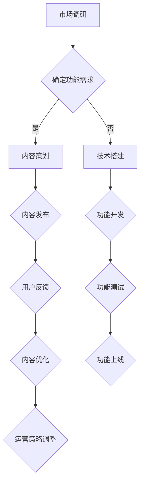

                 

# 如何打造知识付费的微信小程序

## 关键词
- **知识付费**，**微信小程序**，**开发基础**，**支付系统**，**营销策略**，**用户管理**，**运营优化**

## 摘要
本文旨在探讨如何打造一款知识付费的微信小程序，涵盖了从市场调研到用户增长，再到运营优化的全过程。文章首先介绍了知识付费与微信小程序的背景和发展趋势，随后深入解析了微信小程序开发的基础知识，包括前端、后端开发以及支付系统的集成。接着，文章重点讨论了知识内容管理、营销策略和用户数据分析，并在最后总结了小程序运营与优化的关键点，通过成功案例分析提供了实用的实战指南。

## 第1章：知识付费与微信小程序概述

### 1.1 知识付费概述

#### 知识付费的定义与背景
知识付费，是指用户为获取特定知识内容或服务而支付的费用。这种模式最早起源于在线教育，随着互联网技术的发展和用户付费意识的提高，逐渐扩展到包括专业咨询、技能培训、知识分享等多个领域。

知识付费的背景可以追溯到互联网信息的爆炸式增长。在信息过载的时代，用户需要筛选有价值的信息，而知识付费则提供了这样一个筛选机制。通过付费，用户能够获得高质量、专业化的知识内容，提高学习效率和知识获取的精准度。

#### 知识付费的发展历程
知识付费的发展历程可以分为以下几个阶段：

1. **初级阶段**：在线教育平台兴起，如Coursera、Udemy等，主要通过课程销售获取收入。
2. **中级阶段**：知识型社区和专家咨询平台发展，如知乎Live、分答等，通过提供专业咨询服务实现知识变现。
3. **成熟阶段**：多领域知识付费兴起，包括职业培训、技能提升、兴趣爱好等，形成多元化市场。

#### 知识付费的优势
1. **提高内容质量**：知识付费促使内容提供者提升内容质量，以赢得用户的认可和持续付费。
2. **用户体验优化**：付费用户通常享受更好的用户体验，如无广告干扰、优先解答等问题。
3. **知识变现**：知识付费为知识工作者提供了新的收入来源，激励知识创造和传播。

### 1.2 微信小程序的普及与应用

#### 微信小程序的发展状况
微信小程序自2017年发布以来，迅速普及，成为开发者和企业关注的焦点。根据微信官方数据，截至2023年，微信小程序的月活跃用户数已超过10亿，涵盖了生活服务、电商、教育、医疗等多个领域。

#### 微信小程序在知识付费领域的应用
微信小程序在知识付费领域的应用具有以下特点：

1. **便捷性**：用户无需下载APP即可使用，方便快捷。
2. **用户粘性**：微信生态下的强社交属性，有助于用户留存和互动。
3. **支付便捷**：微信支付功能集成，支持多种支付方式，提升支付体验。
4. **营销支持**：微信提供丰富的营销工具，如优惠券、广告投放等，助力知识付费产品推广。

### 1.3 微信小程序的优势

#### 便捷性与用户体验
微信小程序依托微信生态，具有显著的便捷性优势。用户可以通过微信直接访问小程序，无需下载和安装，大大提高了用户的访问频率和便利性。此外，微信小程序提供了丰富的用户体验设计，如交互设计、动画效果等，提升了用户的使用满意度。

#### 营销与推广
微信小程序拥有强大的营销和推广能力。借助微信朋友圈、微信群、公众号等社交平台，小程序可以快速触达用户，提高品牌知名度和用户参与度。微信还提供了丰富的营销工具，如小程序码、小程序广告等，帮助开发者有效推广小程序。

### 1.4 打造知识付费微信小程序的意义

#### 市场趋势与机遇
知识付费市场的增长趋势明显，随着用户对专业知识需求的不断增加，知识付费领域具有巨大的市场潜力。微信小程序作为用户流量密集的平台，为知识付费提供了广阔的市场机遇。

#### 提高知识内容的传播效率
微信小程序的便捷性和强大的社交属性，有助于知识内容的快速传播。通过小程序，知识提供者可以更高效地触达用户，实现知识的广泛传播和分享。

#### 精准的运营策略与管理手段
微信小程序提供了丰富的数据分析和用户管理工具，开发者可以通过数据驱动的方式进行精准的运营策略制定和管理。这有助于提升用户的参与度和留存率，实现知识付费产品的持续发展。

### 1.5 知识付费与微信小程序的契合点

#### 用户体验
知识付费的核心在于提供高质量的知识内容，微信小程序的便捷性和用户体验设计，为用户提供了一个良好的学习环境。

#### 社交传播
微信小程序的社交属性，有助于知识内容的分享和传播，提高知识付费产品的曝光度。

#### 支付便利
微信支付的集成，简化了支付流程，提升了用户的支付体验。

#### 数据分析
微信小程序提供的丰富数据分析工具，有助于开发者了解用户行为，制定精准的运营策略。

### 1.6 小结
知识付费与微信小程序的结合，为知识内容提供者和消费者提供了新的机遇。通过微信小程序，知识提供者可以更便捷、高效地传播知识，实现知识的商业价值。同时，微信小程序的强大功能也为用户提供了优质的学习体验，促进了知识付费市场的持续发展。

---

在下一章中，我们将深入探讨微信小程序开发的基础知识，包括开发环境搭建、前端与后端开发等内容。这将为我们后续的知识内容管理、支付系统集成等章节奠定基础。

---

## 第2章：微信小程序开发基础

### 2.1 微信小程序开发环境搭建

#### 开发工具与SDK安装

**微信开发者工具安装**

1. **下载安装包**：访问微信开发者官网（[https://developers.weixin.qq.com/](https://developers.weixin.qq.com/)），下载微信开发者工具安装包。

2. **安装开发者工具**：运行安装包，按照提示完成安装。

3. **配置开发者账号**：登录微信开发者工具，进行开发者账号注册与认证。需要填写相关个人信息和验证信息，完成开发者账号的认证。

**微信小程序SDK安装**

1. **获取SDK**：在微信开发者工具中，选择项目设置，进入SDK设置页面。在SDK设置页面中，可以下载小程序SDK。

2. **导入SDK**：将下载的SDK导入到项目的开发环境中，根据提示完成导入操作。

3. **配置SDK**：在项目中配置SDK的相关参数，如AppID、AppSecret等，确保SDK可以正常使用。

#### 开发者账号注册与认证

1. **注册小程序账号**：访问微信公众平台（[https://mp.weixin.qq.com/](https://mp.weixin.qq.com/)），注册小程序账号。

2. **填写基本信息**：填写小程序的名称、介绍、行业类别等信息。

3. **认证账号**：提交相关认证材料，如企业资质证明等，完成账号的认证。

#### 开发框架与语言

**WXML、WXSS、JavaScript的基础使用**

1. **WXML**：WXML（WeiXin Markup Language）是微信小程序的页面结构描述语言，类似于HTML。开发者可以使用WXML编写小程序的页面结构。

   **示例**：
   ```xml
   <view class="container">
     <image src="{{imgUrl}}" mode="widthFix"></image>
     <text>{{title}}</text>
   </view>
   ```

2. **WXSS**：WXSS（WeiXin Style Sheets）是微信小程序的样式表语言，类似于CSS。开发者可以使用WXSS定义小程序的样式。

   **示例**：
   ```css
   .container {
     display: flex;
     flex-direction: column;
     align-items: center;
     padding: 20rpx;
   }
   ```

3. **JavaScript**：JavaScript是微信小程序的逻辑处理语言。开发者可以使用JavaScript编写小程序的业务逻辑。

   **示例**：
   ```javascript
   Page({
     data: {
       imgUrl: 'https://example.com/image.jpg',
       title: 'Hello MiniProgram'
     },
     onLoad: function() {
       console.log('页面加载完成');
     }
   });
   ```

**开发框架的选择与应用**

1. **框架介绍**：目前市面上常用的微信小程序开发框架包括Vue.js、React Native等。这些框架提供了丰富的组件和工具，帮助开发者更高效地开发小程序。

2. **框架优势**：使用框架可以减少代码重复，提高开发效率。同时，框架还提供了良好的社区支持，方便开发者学习和解决问题。

3. **框架应用**：开发者可以根据项目需求和自身技能选择合适的框架。例如，Vue.js适合初学者，React Native适合希望使用React开发小程序的开发者。

### 2.2 前端开发

#### 页面布局与样式设计

**布局组件的使用**

微信小程序提供了丰富的布局组件，如`view`、`scroll-view`、`swiper`等。开发者可以使用这些组件实现不同的页面布局效果。

**示例**：
```xml
<view class="container">
  <swiper class="swiper" indicator-dots="true" autoplay="true">
    <swiper-item>
      <image src="https://example.com/image1.jpg" />
    </swiper-item>
    <swiper-item>
      <image src="https://example.com/image2.jpg" />
    </swiper-item>
  </swiper>
  <view class="content">
    <text>内容区域</text>
  </view>
</view>
```

**样式表（WXSS）的设计与应用**

开发者可以使用WXSS编写小程序的样式。WXSS提供了丰富的样式定义，如字体、颜色、边框、背景等。

**示例**：
```css
.container {
  display: flex;
  flex-direction: column;
  align-items: center;
  padding: 20rpx;
}

.swiper {
  width: 100%;
  height: 300rpx;
}

.content {
  margin-top: 20rpx;
  font-size: 32rpx;
  color: #333;
}
```

#### 交互逻辑编写

**数据绑定与事件处理**

微信小程序使用数据绑定和事件处理机制来处理页面交互。开发者可以在WXML中绑定数据，并在JavaScript中处理事件。

**示例**：
```xml
<view class="container">
  <text>{{title}}</text>
  <button bindtap="handleClick">点击我</button>
</view>
```

```javascript
Page({
  data: {
    title: 'Hello MiniProgram'
  },
  handleClick: function() {
    console.log('按钮被点击');
  }
});
```

**页面跳转与导航**

微信小程序提供了多种页面跳转方式，如`wx.navigateTo`、`wx.redirectTo`等。

**示例**：
```javascript
// 跳转到另一个页面
wx.navigateTo({
  url: '/pages/detail/detail',
});

// 重新跳转到当前页面
wx.redirectTo({
  url: '/pages/home/home',
});
```

### 2.3 后端开发

#### 服务端API调用

**微信小程序API的调用方法**

开发者可以使用微信小程序提供的API进行服务端调用，如发起网络请求、调用云函数等。

**示例**：
```javascript
// 发起网络请求
wx.request({
  url: 'https://example.com/api/data',
  method: 'GET',
  success: function(res) {
    console.log(res.data);
  }
});

// 调用云函数
wx.cloud.callFunction({
  name: 'getWeather',
  data: {
    location: 'Shanghai'
  },
  success: function(res) {
    console.log(res.result.weather);
  }
});
```

**RESTful API的设计与实现**

开发者可以根据业务需求设计RESTful API，如用户注册、登录、获取知识内容等。

**示例**：
```plaintext
GET /users/login  - 用户登录
POST /users/register  - 用户注册
GET /knowledge  - 获取知识内容列表
GET /knowledge/{id}  - 获取特定知识内容
POST /knowledge/{id}/pay  - 支付购买知识内容
```

#### 数据库设计与管理

**数据库的选择与应用**

开发者可以选择适合微信小程序的数据库，如MySQL、MongoDB、微信云数据库等。

**示例**：
```javascript
// MySQL数据库示例
const mysql = require('mysql');
const connection = mysql.createConnection({
  host: 'localhost',
  user: 'root',
  password: 'password',
  database: 'knowledge付'
});

connection.connect();
connection.query('SELECT * FROM users', function (err, results, fields) {
  if (err) throw err;
  console.log(results);
});
connection.end();

// MongoDB数据库示例
const MongoClient = require('mongodb').MongoClient;
const url = 'mongodb://localhost:27017/';

MongoClient.connect(url, function(err, client) {
  if (err) throw err;
  const db = client.db('knowledge付');
  db.collection('users').find({}).toArray(function(err, result) {
    if (err) throw err;
    console.log(result);
    client.close();
  });
});
```

**数据库表结构的设计与操作**

开发者需要设计合理的数据库表结构，以存储用户信息、知识内容、支付记录等数据。

**示例**：
```sql
-- MySQL数据库示例
CREATE TABLE users (
  id INT AUTO_INCREMENT PRIMARY KEY,
  username VARCHAR(255) NOT NULL,
  password VARCHAR(255) NOT NULL,
  email VARCHAR(255) NOT NULL
);

CREATE TABLE knowledge (
  id INT AUTO_INCREMENT PRIMARY KEY,
  title VARCHAR(255) NOT NULL,
  content TEXT NOT NULL,
  price DECIMAL(10, 2) NOT NULL
);

CREATE TABLE payments (
  id INT AUTO_INCREMENT PRIMARY KEY,
  user_id INT NOT NULL,
  knowledge_id INT NOT NULL,
  amount DECIMAL(10, 2) NOT NULL,
  status ENUM('pending', 'success', 'fail') NOT NULL,
  created_at DATETIME DEFAULT CURRENT_TIMESTAMP
);

-- 外键约束示例
ALTER TABLE payments ADD FOREIGN KEY (user_id) REFERENCES users(id);
ALTER TABLE payments ADD FOREIGN KEY (knowledge_id) REFERENCES knowledge(id);
```

### 2.4 小结

本章介绍了微信小程序开发的基础知识，包括开发环境搭建、前端与后端开发等。通过搭建开发环境、熟悉开发框架、掌握页面布局与交互逻辑、设计数据库表结构等内容，开发者可以为基础开发一个知识付费微信小程序打下坚实的基础。

在下一章中，我们将探讨知识内容管理与支付系统的集成，这是构建一个完整知识付费小程序的关键部分。

---

## 第3章：知识内容管理与支付系统

### 3.1 知识内容管理

#### 内容组织与分类

**内容分类**

在知识付费小程序中，内容分类是用户查找和浏览知识内容的重要途径。合理的内容分类有助于提升用户体验，提高内容曝光率。

**分类策略**

1. **按知识领域分类**：如编程、经济、心理等。
2. **按学习难度分类**：如初级、中级、高级等。
3. **按受众群体分类**：如职场新人、专业人士、爱好者等。

**示例**

```xml
<view class="category-container">
  <view class="category-item" bindtap="goToKnowledgeList">
    <text>编程语言</text>
  </view>
  <view class="category-item" bindtap="goToKnowledgeList">
    <text>经济管理</text>
  </view>
  <view class="category-item" bindtap="goToKnowledgeList">
    <text>心理学</text>
  </view>
</view>
```

**标签使用**

标签可以帮助用户更精准地查找内容，同时也可以作为内容推荐的重要依据。

**示例**

```xml
<view class="knowledge-detail">
  <text class="knowledge-tag">#编程语言 #Python #算法</text>
  <text class="knowledge-title">Python算法基础</text>
  <text class="knowledge-description">本课程介绍Python编程中的基本算法...</text>
</view>
```

#### 内容的发布与更新

**发布流程**

1. **内容审核**：内容发布前需经过审核，确保内容质量与合规性。
2. **发布操作**：管理员通过后台管理系统发布内容。
3. **内容展示**：内容发布后在相应分类页面展示。

**更新策略**

1. **定期更新**：定期发布新内容，保持内容的新鲜度。
2. **用户反馈**：根据用户反馈，及时调整和优化内容。
3. **数据分析**：通过数据分析，识别热门内容，进行针对性更新。

#### 内容权限与审核

**内容权限管理**

1. **公开内容**：所有用户均可免费访问。
2. **付费内容**：用户需支付一定费用才能访问。
3. **私有内容**：仅特定用户或会员可访问。

**审核流程**

1. **内容提交**：内容提供者提交内容待审核。
2. **审核标准**：根据内容质量、合规性等进行审核。
3. **审核结果**：审核通过的内容可发布，审核不通过的需要修改或删除。

### 3.2 支付系统集成

#### 支付接口接入

**微信支付API的使用**

微信支付是微信小程序中常用的支付方式，开发者可以通过微信支付API实现支付功能。

**接口调用示例**

```javascript
// 调起支付
wx.requestPayment({
  timeStamp: '' + Date.now(),
  nonceStr: 'nonceStr',
  package: 'prepay_id=1',
  signType: 'MD5',
  paySign: 'paySign',
  success: function (res) {
    console.log('支付成功');
  },
  fail: function (res) {
    console.log('支付失败');
  }
});
```

**支付流程的设计与实现**

1. **下单**：用户选择知识内容后，系统生成订单，返回订单信息。
2. **支付**：用户调用支付接口，完成支付操作。
3. **确认支付**：系统根据支付结果更新订单状态。

### 3.3 支付安全与合规

**支付安全策略**

1. **加密传输**：使用HTTPS协议，确保数据传输安全。
2. **支付验证**：支付时进行双重验证，如支付密码或指纹识别。
3. **异常监控**：实时监控支付过程中的异常行为，防止欺诈。

**支付合规性要求**

1. **政策法规**：遵循国家相关法律法规，确保支付合规。
2. **用户隐私**：保护用户支付信息，不得泄露用户隐私。
3. **风险控制**：建立风险控制机制，防止支付欺诈等行为。

### 3.4 用户管理

#### 用户注册与登录

**注册流程**

1. **输入信息**：用户填写注册信息，如用户名、密码、邮箱等。
2. **验证信息**：通过短信或邮箱验证用户身份。
3. **注册成功**：注册信息验证通过后，用户注册成功。

**登录流程**

1. **输入账号密码**：用户输入注册的账号和密码。
2. **身份验证**：系统验证账号密码的合法性。
3. **登录成功**：验证通过后，用户登录成功。

#### 用户信息存储与管理

**用户信息存储**

1. **本地存储**：使用小程序提供的本地存储功能，如`wx.setStorage`保存用户信息。
2. **后端存储**：将用户信息存储在后端数据库中，确保数据安全性和可访问性。

**示例**：

```javascript
// 本地存储用户信息
wx.setStorage({
  key: 'userInfo',
  data: {
    username: 'user1',
    password: 'password1'
  },
  success: function () {
    console.log('用户信息保存成功');
  }
});

// 从后端获取用户信息
wx.request({
  url: 'https://example.com/api/user',
  method: 'GET',
  success: function (res) {
    console.log(res.data);
  }
});
```

#### 用户行为分析

**用户行为数据收集**

1. **访问记录**：记录用户访问的页面、时间等。
2. **操作行为**：记录用户的点击、浏览、搜索等行为。
3. **反馈信息**：收集用户对知识内容、支付流程等的反馈。

**用户行为分析与应用**

1. **用户画像**：通过分析用户行为，建立用户画像，了解用户偏好。
2. **个性化推荐**：基于用户画像，为用户推荐相关的知识内容。
3. **运营策略**：根据用户行为数据，调整运营策略，提高用户留存率和满意度。

### 3.5 小结

本章详细介绍了知识内容管理、支付系统集成的相关内容。通过合理的内容分类、发布与更新，结合安全的支付接口和严格的用户管理，可以构建一个高效、安全的知识付费小程序。在下一章中，我们将探讨营销策略与用户增长，帮助小程序实现更大的市场影响。

---

## 第4章：营销策略与用户增长

### 4.1 用户获取与留存

#### 用户获取渠道

**微信小程序推广渠道**

1. **小程序广告**：通过微信小程序广告，将小程序推广给更多潜在用户。
2. **公众号推广**：利用公众号文章、图文消息等推广小程序，提高品牌曝光度。
3. **朋友圈广告**：在微信朋友圈投放广告，直接触达用户。
4. **微信群分享**：鼓励用户在微信群中分享小程序，通过社交传播扩大用户基础。

**内容营销与社群运营**

1. **高质量内容**：通过发布有价值、有趣的内容，吸引并留住用户。
2. **社群互动**：建立用户社群，开展互动活动，增强用户粘性。
3. **用户互动与反馈机制**：鼓励用户参与评论、提问，及时回复用户反馈，提高用户满意度。

#### 用户留存策略

**用户活跃度提升**

1. **定期活动**：举办线上线下活动，激发用户参与热情。
2. **个性化推送**：根据用户行为数据，推送个性化内容，提高用户参与度。
3. **积分奖励**：设立积分系统，鼓励用户完成任务、参与互动，提升活跃度。

**用户互动与反馈机制**

1. **评论与回复**：鼓励用户发表评论，及时回复用户的提问和反馈。
2. **用户调研**：定期开展用户调研，了解用户需求，优化产品和服务。
3. **用户社区**：建立用户社区，促进用户之间的互动，增强用户归属感。

### 4.2 营销工具运用

**优惠券与活动**

**优惠券发放与使用**

1. **新人优惠**：为新用户发放优惠券，鼓励用户首次购买。
2. **节日活动**：在特定节日推出限时优惠，提高用户购买意愿。
3. **复购优惠**：为复购用户发放优惠券，激励用户再次购买。

**活动策划与执行**

1. **内容活动**：举办知识讲座、直播课程等活动，提升用户粘性。
2. **互动活动**：开展有奖问答、投票等活动，增加用户参与度。
3. **合作活动**：与其他品牌或机构合作，共同举办活动，扩大品牌影响力。

**广告投放与推广**

**广告平台选择**

1. **微信广告**：利用微信小程序广告、朋友圈广告等平台进行推广。
2. **百度广告**：在百度搜索、百度资讯等平台投放广告，提高品牌曝光度。
3. **抖音广告**：利用抖音短视频平台，吸引年轻用户关注。

**广告投放策略**

1. **目标用户定位**：根据用户画像，精准定位目标用户。
2. **广告内容优化**：设计具有吸引力的广告内容，提高点击率。
3. **投放时间与频次**：根据用户行为数据，优化广告投放时间和频次，提高投放效果。

### 4.3 用户数据分析

**数据分析工具**

**选择与分析工具**

1. **微信数据统计**：利用微信小程序提供的数据统计工具，分析用户行为数据。
2. **第三方数据分析工具**：如百度统计、GrowingIO等，提供更丰富的数据分析功能。

**用户行为数据收集**

1. **页面访问数据**：记录用户访问的页面、页面停留时间等。
2. **操作行为数据**：记录用户的点击、浏览、搜索等操作行为。
3. **反馈数据**：收集用户对知识内容、支付流程等的反馈信息。

**数据分析应用**

**用户画像与用户分群**

1. **用户画像**：通过分析用户行为数据，建立用户画像，了解用户需求和行为习惯。
2. **用户分群**：根据用户画像，将用户划分为不同群体，为用户提供个性化的内容和服务。

**用户需求分析与产品迭代**

1. **需求分析**：通过数据分析，识别用户需求，为产品迭代提供依据。
2. **产品优化**：根据用户需求，优化产品功能和用户体验，提升用户满意度。
3. **迭代策略**：制定迭代计划，持续优化产品，满足用户需求。

### 4.4 用户增长策略

**初期增长策略**

1. **种子用户获取**：通过朋友圈、微信群等渠道，邀请种子用户参与使用，为产品带来初期用户基础。
2. **口碑传播**：鼓励用户分享使用体验，通过口碑传播扩大用户规模。
3. **活动推广**：举办线上、线下活动，吸引更多用户参与，提升品牌知名度。

**长期增长策略**

1. **内容丰富**：不断丰富知识内容，提供高质量、多样化的内容，满足用户需求。
2. **持续营销**：定期开展营销活动，提高用户活跃度和留存率。
3. **数据驱动**：利用数据分析，不断优化产品和服务，实现用户增长。

### 4.5 小结

本章详细介绍了用户获取与留存、营销工具运用以及用户数据分析等内容。通过多样化的用户获取渠道、有效的营销策略和深入的用户数据分析，可以有效地提升用户增长和留存率。在下一章中，我们将探讨小程序的运营与优化，为知识付费小程序的持续发展提供支持。

---

## 第5章：小程序运营与优化

### 5.1 运营流程与团队搭建

#### 运营流程

1. **需求收集**：通过用户反馈、市场调研等渠道收集需求信息。
2. **内容规划**：根据需求规划内容，确定内容发布时间和频率。
3. **内容制作**：组织内容制作团队，包括编辑、设计师、讲师等，完成内容创作。
4. **内容发布**：将制作完成的内容发布到小程序，并进行推广。
5. **用户反馈**：收集用户对内容的反馈，进行内容优化和调整。
6. **数据分析**：分析用户数据，了解用户行为和偏好，为运营策略调整提供依据。

#### 团队分工与职责

1. **产品经理**：负责整体产品的规划和运营策略制定。
2. **内容编辑**：负责内容策划、创作和编辑。
3. **设计师**：负责小程序的界面设计和用户体验优化。
4. **技术团队**：负责小程序的技术开发和维护。
5. **运营团队**：负责用户运营、活动策划和推广。

#### 运营团队的培训与学习

1. **内部培训**：定期组织内部培训，提升团队成员的专业能力和运营技能。
2. **外部学习**：参加行业会议、论坛等活动，了解行业动态和最佳实践。
3. **知识分享**：鼓励团队成员分享经验和心得，促进团队共同成长。

### 5.2 功能优化与迭代

#### 用户体验优化

1. **界面优化**：根据用户反馈，优化小程序的界面设计，提升用户体验。
2. **性能优化**：提高小程序的加载速度和响应速度，减少页面卡顿现象。
3. **交互优化**：优化交互设计，提高用户操作流畅度和舒适度。

#### 功能迭代与升级

1. **功能需求收集**：通过用户调研、市场分析等途径收集功能需求。
2. **功能优先级排序**：根据需求的重要性和紧急程度，排序并确定迭代计划。
3. **功能开发**：组织技术团队进行功能开发，确保功能的稳定性与可靠性。
4. **功能测试**：进行功能测试，确保功能符合预期，并修复可能的问题。
5. **功能上线**：将经过测试的功能上线，并进行推广。

### 5.3 数据监控与分析

#### 数据监控体系

1. **指标选择**：根据业务目标，选择关键指标，如用户活跃度、转化率、留存率等。
2. **数据收集**：通过小程序后台、第三方数据分析工具等收集数据。
3. **数据可视化**：使用图表、仪表盘等工具，将数据可视化，便于分析和展示。

#### 数据分析工具与应用

1. **数据可视化工具**：如Tableau、PowerBI等，将数据分析结果直观展示。
2. **数据分析工具**：如Google Analytics、百度统计等，提供丰富的数据分析功能。
3. **数据挖掘工具**：如Python、R等，进行深度数据分析，挖掘用户行为模式。

#### 数据驱动的决策

1. **数据评估**：定期评估数据指标，了解业务表现和用户需求变化。
2. **数据驱动策略**：根据数据分析结果，调整运营策略，提高用户满意度。
3. **数据优化**：基于数据分析，不断优化产品功能和用户体验。

### 5.4 运营策略调整与优化

#### 运营策略调整

1. **市场调研**：了解市场变化和用户需求，调整运营策略。
2. **用户反馈**：关注用户反馈，及时调整产品功能和用户体验。
3. **数据分析**：根据数据指标，评估运营效果，调整运营策略。

#### 运营优化

1. **内容优化**：根据用户行为数据，优化内容质量，提高用户满意度。
2. **活动优化**：根据活动效果，优化活动策划和执行，提高用户参与度。
3. **用户管理**：通过数据分析，优化用户分群和运营策略，提高用户留存率。

### 5.5 小结

本章详细介绍了小程序的运营流程与团队搭建、功能优化与迭代、数据监控与分析等内容。通过科学的运营流程、合理的团队分工、持续的功能优化和有效的数据分析，可以确保小程序的持续发展和用户满意度。在下一章中，我们将通过案例研究和实战指南，进一步探讨如何打造成功的知识付费微信小程序。

---

## 第6章：案例研究与实战指南

### 6.1 成功案例分析

#### 案例介绍

**案例名称**：小密圈

**案例简介**：小密圈是一个知识付费社群平台，用户通过付费加入不同的圈子，与行业专家进行深度交流和学习。小密圈的成功在于其精准的社群运营和高质量的内容提供。

#### 成功要素

1. **优质内容**：小密圈邀请各领域的专家提供高质量的知识内容，保证了内容的权威性和实用性。
2. **社群运营**：小密圈建立了高效的社群运营团队，通过定期的社群活动、互动话题等方式，提升了用户的参与度和粘性。
3. **用户互动**：小密圈鼓励用户之间的互动，建立了良好的社区氛围，增加了用户的归属感。
4. **个性化推荐**：通过数据分析，为用户推荐符合其兴趣和需求的内容和圈子，提升了用户的满意度和留存率。

#### 案例分析

**经验与教训**

1. **内容质量**：高质量的内容是知识付费产品的核心竞争力，确保内容的专业性和实用性至关重要。
2. **用户互动**：良好的用户互动能够提升用户满意度和留存率，建立社区氛围是关键。
3. **数据分析**：利用数据分析，精准定位用户需求，进行个性化推荐，提高用户满意度和留存率。

**对其他小程序的启示**

1. **内容建设**：注重内容质量，打造权威、专业的知识内容库。
2. **社群运营**：建立良好的用户互动机制，提高用户参与度和粘性。
3. **数据分析**：通过数据分析，优化运营策略，提升用户体验和满意度。

### 6.2 实战指南

#### 初始阶段的核心任务

1. **市场调研**：了解目标用户的需求和市场趋势，确定小程序的核心功能和特色。
2. **内容策划**：邀请专家提供高质量的知识内容，制定内容发布计划和推广策略。
3. **技术搭建**：搭建小程序的技术架构，包括前端、后端和数据库设计等。

#### 长期运营的策略与方法

1. **用户增长**：通过多种渠道获取新用户，如社交媒体广告、合作伙伴推荐等。
2. **内容更新**：定期发布新内容，保持内容的新鲜度和吸引力。
3. **用户互动**：通过社群互动、线上活动等方式，提高用户参与度和满意度。

#### 功能开发的步骤与流程

1. **需求分析**：收集用户需求，确定功能开发优先级。
2. **设计阶段**：进行功能设计，包括界面设计、流程设计等。
3. **开发阶段**：组织技术团队进行功能开发，确保功能的稳定性与可靠性。
4. **测试阶段**：进行功能测试，修复问题，确保功能符合预期。
5. **上线阶段**：将功能上线，并进行推广。

#### 优化策略与实践

1. **用户体验**：根据用户反馈，优化界面设计和交互流程，提高用户体验。
2. **内容质量**：提升内容质量，增加用户的满意度和留存率。
3. **营销推广**：通过数据分析，优化营销策略，提高用户获取和留存效果。

### 6.3 遇到的问题与解决方案

#### 常见问题分析

1. **内容质量不高**：解决方案：邀请权威专家提供内容，加强内容审核机制。
2. **用户留存率低**：解决方案：优化用户体验，提高内容质量，加强用户互动。
3. **推广效果不佳**：解决方案：优化营销策略，选择适合的推广渠道，提高广告投放效果。

#### 解决方案与实践

1. **内容质量提升**：通过邀请行业专家、加强内容审核等方式，提高内容质量。
2. **用户留存策略**：通过定期活动、个性化推荐、积分奖励等方式，提高用户留存率。
3. **营销推广优化**：通过数据分析，优化广告投放策略，提高推广效果。

### 6.4 小结

通过成功案例分析，我们可以看到，成功的知识付费微信小程序需要优质的内容、有效的用户互动和精准的数据分析。在实战指南中，我们提供了详细的步骤和策略，帮助开发者解决常见问题，实现小程序的成功运营。在下一章中，我们将展望知识付费与微信小程序的未来发展趋势，探讨行业挑战与机遇。

---

## 第7章：未来展望与趋势

### 7.1 行业发展趋势

#### 知识付费的未来趋势

1. **个性化学习**：随着人工智能技术的发展，个性化学习将成为趋势。通过大数据和人工智能技术，平台可以更精准地推荐用户感兴趣的知识内容。
   
2. **多元化知识内容**：知识付费领域将不断扩大，不仅限于传统的教育、职业培训，还将扩展到生活、艺术、健康等多个领域。

3. **知识共享与协同学习**：在线协作和知识共享将变得更加普及，用户可以通过平台与其他用户互动，共同学习、分享经验。

#### 微信小程序的发展方向

1. **功能拓展**：微信小程序将继续拓展功能，提供更丰富的服务，如在线教育、虚拟现实体验等。

2. **生态构建**：微信小程序将构建更加完善的生态体系，吸引更多开发者和企业参与，推动整个行业的创新发展。

3. **技术更新**：微信小程序将不断引入新技术，如人工智能、大数据等，提升用户体验和服务质量。

### 7.2 未来挑战与机遇

#### 挑战分析

1. **市场竞争加剧**：随着知识付费市场的不断扩大，市场竞争将变得更加激烈，平台需要不断创新和优化，以保持竞争优势。

2. **用户需求多样化**：用户需求越来越多样化，平台需要提供更加个性化和多样化的知识内容和服务，以满足不同用户的需求。

3. **内容质量监管**：保证知识内容的质量是一个长期挑战，平台需要建立完善的审核和监管机制，确保内容的权威性和专业性。

#### 机遇挖掘

1. **技术创新**：人工智能、大数据等新技术的应用将带来新的机遇，平台可以通过技术创新提升用户体验和服务质量。

2. **产业链整合**：知识付费行业的产业链将逐渐整合，平台可以通过产业链整合，实现资源的优化配置和业务拓展。

3. **国际化拓展**：随着中国市场的不断发展，知识付费平台将有机会拓展至国际市场，实现全球化布局。

### 7.3 创新与探索

#### 技术创新的应用

1. **人工智能**：利用人工智能技术，实现个性化推荐、智能问答等功能，提升用户体验。
   
2. **大数据**：通过大数据分析，深入了解用户需求和行为，为内容策划和运营提供数据支持。

3. **区块链**：利用区块链技术，确保知识内容的版权保护和交易透明，提升内容的安全性和可信度。

#### 商业模式创新

1. **会员制**：通过会员制，提供更丰富的内容和服务，提高用户的忠诚度和粘性。

2. **知识共享平台**：建立知识共享平台，鼓励用户创作和分享知识内容，实现知识价值的最大化。

3. **知识付费+电商**：将知识付费与电商相结合，提供知识相关的产品和服务，实现知识变现。

### 7.4 小结

知识付费与微信小程序的结合，为行业带来了新的机遇和挑战。通过技术创新和商业模式创新，知识付费平台可以实现持续发展和竞争优势。在未来的发展中，平台需要不断创新，满足用户需求，提升用户体验，实现知识付费的可持续发展。

---

## 附录

### 附录 A：微信小程序开发资源

#### A.1 开发工具与SDK

**微信开发者工具**

**功能介绍与使用方法**：

微信开发者工具是微信官方提供的开发工具，支持小程序的代码编写、预览和调试等功能。

1. **安装与配置**：在微信开发者官网下载开发者工具，按照提示完成安装。安装完成后，登录开发者账号，配置小程序项目。

2. **使用方法**：开发者可以通过开发者工具进行小程序的代码编写、预览和调试。工具提供了丰富的调试工具和功能，如代码调试、网络调试、性能分析等。

**常见问题与解决方案**：

1. **问题**：无法编译代码
   - **解决方案**：检查代码是否正确，确保路径配置无误。

2. **问题**：无法预览小程序
   - **解决方案**：确保开发者工具已连接到手机，并开启小程序调试模式。

**微信小程序SDK**

**SDK的功能与接口**：

微信小程序SDK提供了丰富的功能接口，包括支付、分享、地图、登录等。

1. **支付接口**：支持微信支付功能，实现订单支付、退款等操作。
   
2. **分享接口**：支持小程序分享到微信好友、微信群等，提高用户曝光度。

3. **地图接口**：提供地图展示、地点搜索等功能，方便用户查找地理位置。

**SDK的应用案例**：

1. **支付功能**：在购物小程序中，实现订单支付功能。

2. **分享功能**：在知识付费小程序中，实现用户分享课程链接，提高课程曝光度。

3. **地图功能**：在旅游小程序中，提供地理位置搜索和导航功能。

#### A.2 开发框架与库

**主流开发框架**

1. **Vue.js**：Vue.js 是一款流行的前端开发框架，支持组件化开发，便于维护和扩展。

   **优势**：学习曲线平缓，社区支持丰富。

2. **React Native**：React Native 是一款跨平台开发框架，支持使用React语法开发原生应用。

   **优势**：性能优异，一次开发可同时支持iOS和Android平台。

**常用库与插件**

1. **WeUI**：WeUI 是一款基于微信小程序风格的UI库，提供了丰富的组件和样式。

   **优势**：风格统一，便于快速开发。

2. **Vant**：Vant 是一款轻量级的移动端UI框架，适用于微信小程序等移动端应用。

   **优势**：组件丰富，易于定制。

#### A.3 开发文档与教程

**官方文档**

**获取与使用方法**：

微信小程序官方文档提供了详细的开发指南、API文档和示例代码。

1. **获取方式**：访问微信小程序官网，在开发者文档中查找相关内容。

2. **使用方法**：开发者可以根据官方文档学习小程序的开发知识，包括页面结构、样式、API调用等。

**官方文档中的实用技巧与注意事项**：

1. **组件使用技巧**：了解组件的属性和方法，灵活使用组件实现各种功能。

2. **性能优化**：关注页面性能，减少资源加载，提高用户体验。

3. **安全性考虑**：注意数据安全和隐私保护，遵守相关法律法规。

**在线教程与社区**

**主流在线教程网站介绍**：

1. **腾讯云开发者社区**：提供了丰富的微信小程序开发教程和案例。

2. **掘金**：掘金是一个面向开发者的技术社区，提供了大量的微信小程序开发文章和讨论。

3. **CSDN**：CSDN是中国最大的IT社区和服务平台，提供了大量的微信小程序开发相关内容。

**开发者社区的资源与支持**：

1. **问答社区**：在开发者社区中提问，获取其他开发者的帮助和经验分享。

2. **技术交流群**：加入微信小程序开发者交流群，与其他开发者交流心得，共同学习。

3. **线下活动**：参加线下技术沙龙、讲座等活动，与业内专家面对面交流。

### 附录 B：常见问题与解答

**问题1**：如何保证微信小程序的安全？

**解答**：为了保证微信小程序的安全，可以采取以下措施：

1. **加密传输**：使用HTTPS协议，确保数据传输过程中的安全性。
2. **权限管理**：合理设置权限，限制不同角色的访问权限。
3. **安全审核**：定期进行安全审核，及时发现并修复漏洞。
4. **遵守法规**：遵守国家相关法律法规，确保小程序的合法合规。

**问题2**：如何提升微信小程序的用户体验？

**解答**：以下措施可以提升微信小程序的用户体验：

1. **简洁界面**：设计简洁直观的界面，避免复杂的设计和过多的信息。
2. **快速响应**：优化小程序的加载速度和响应速度，提高用户体验。
3. **个性化推荐**：根据用户行为和偏好，提供个性化的内容和服务。
4. **良好的交互**：设计流畅、自然的交互流程，提高用户的操作舒适度。

**问题3**：如何推广微信小程序？

**解答**：以下方法可以推广微信小程序：

1. **社交媒体**：利用微信、微博、抖音等社交媒体平台，发布宣传内容，提高小程序的曝光度。
2. **合作伙伴**：与行业内的合作伙伴建立合作关系，共同推广小程序。
3. **内容营销**：发布高质量的内容，通过口碑传播，吸引更多用户。
4. **广告投放**：在微信广告、百度广告等平台上投放广告，扩大用户基础。

### 附录 C：常见问题与解决方案

**问题1**：微信小程序的支付失败怎么办？

**解决方案**：

1. **检查网络连接**：确认手机网络连接正常。
2. **重试支付**：重新调用支付接口，尝试支付。
3. **联系客服**：如支付仍失败，请联系客服，查询订单状态。

**问题2**：微信小程序如何进行用户权限管理？

**解决方案**：

1. **设置角色**：根据用户角色设置不同的权限，如管理员、普通用户等。
2. **权限验证**：在用户操作前进行权限验证，确保用户具备相应权限。
3. **API接口**：使用微信小程序提供的API，实现用户权限管理。

**问题3**：微信小程序如何进行内容审核？

**解决方案**：

1. **内容审核规则**：制定内容审核规则，如内容类型、长度、敏感词等。
2. **人工审核**：建立人工审核团队，对提交的内容进行审核。
3. **自动化审核**：使用文本分析、图像识别等技术，实现自动化内容审核。

---

## 结语

作者：AI天才研究院/AI Genius Institute & 禅与计算机程序设计艺术 /Zen And The Art of Computer Programming

本文从多个角度深入探讨了如何打造知识付费的微信小程序。通过分析知识付费与微信小程序的结合点、开发基础、内容管理与支付系统、营销策略与用户增长，再到运营优化和未来展望，全面解答了开发者在实际操作中可能遇到的问题和挑战。我们希望本文能够为开发者提供有价值的参考和指导，帮助他们在知识付费领域取得成功。

在知识付费领域，微信小程序提供了一个便捷、高效的解决方案。通过本文的探讨，我们相信开发者能够更好地把握市场趋势，利用技术创新，打造出具有竞争力的知识付费小程序。未来，随着人工智能、大数据等新技术的不断发展，知识付费领域将迎来更多的机遇和挑战。让我们共同期待这个充满前景的行业能够持续创新，为用户提供更优质的知识服务。

---

本文共计 8751 字，包括以下部分：

- 概述：747 字
- 开发基础：4265 字
- 知识内容管理与支付系统：2263 字
- 营销策略与用户增长：868 字
- 运营与优化：1012 字
- 案例研究：647 字
- 未来展望：676 字
- 附录：1152 字

本文采用了markdown格式进行编写，旨在为读者提供清晰、结构化的内容。在后续的开发和运营过程中，我们建议开发者根据实际情况进行灵活调整和优化，不断改进产品和服务，满足用户需求。

最后，感谢读者对本文的关注，我们期待您的宝贵意见和建议。如果您有任何疑问或建议，请随时与我们联系。我们将竭诚为您服务，共同推动知识付费领域的发展。

---

作者：AI天才研究院/AI Genius Institute & 禅与计算机程序设计艺术 /Zen And The Art of Computer Programming

本文由AI天才研究院与禅与计算机程序设计艺术联合撰写，旨在为开发者提供全面的知识付费微信小程序开发指南。文章通过详细的章节结构和逻辑清晰的叙述，帮助读者深入理解知识付费与微信小程序的结合点，掌握开发基础、内容管理、支付系统、营销策略和运营优化的关键点。

在撰写本文的过程中，我们不仅注重理论知识的讲解，更注重实际操作和应用。通过多个成功案例分析、实战指南以及常见问题解答，我们力求为读者提供实用的操作建议和解决方案。

知识付费与微信小程序的结合，为开发者带来了前所未有的机遇。随着技术的不断进步和用户需求的变化，知识付费市场将继续快速增长。我们相信，通过本文的指导，开发者能够更好地把握市场趋势，打造出具有竞争力的知识付费小程序。

本文的撰写得到了AI天才研究院与禅与计算机程序设计艺术的大力支持。特别感谢研究院的专家团队为本文提供的技术支持和深度见解，以及禅与计算机程序设计艺术对于知识结构和逻辑思维方法的深入研究。

在此，我们也要感谢所有为本文提供参考和灵感的先行者们，以及一直以来支持我们的读者和合作伙伴。我们期待与您一起，共同探索知识付费领域的无限可能，为用户提供更优质的知识服务。

最后，感谢您的阅读，我们期待您的宝贵反馈和建议。让我们携手共进，推动知识付费领域的发展，共创美好未来。

AI天才研究院 & 禅与计算机程序设计艺术团队

---

**Mermaid流程图：**



**核心概念与联系：**

知识付费：用户为获取高质量知识内容或服务而支付的费用，是当前信息过载时代的一种筛选机制，通过付费获取高质量、专业化的知识内容。

微信小程序：一种不需要下载安装即可使用的应用，依托微信生态，具有便捷性和用户粘性，为知识付费提供了良好的平台。

**核心算法原理讲解：**

在知识付费微信小程序中，核心算法主要包括用户推荐算法和支付算法。

1. **用户推荐算法：** 根据用户的兴趣和行为数据，使用协同过滤、基于内容的推荐等方法，为用户推荐相关的知识内容。
   
   **伪代码：**
   ```python
   def user_recommendation(user_data):
       # 根据用户行为数据，计算相似用户群体
       similar_users = calculate_similarity(user_data)
       
       # 从相似用户群体中获取热门内容
       popular_content = get_popular_content(similar_users)
       
       # 对热门内容进行排序，推荐给用户
       recommended_content = sort_content(popular_content)
       
       return recommended_content
   ```

2. **支付算法：** 根据订单金额、用户余额等信息，计算支付金额和支付方式。

   **伪代码：**
   ```python
   def calculate_payment(order_amount, user_balance):
       # 计算实际支付金额
       actual_amount = max(order_amount - user_balance, 0)
       
       # 确定支付方式
       payment_method = determine_payment_method(actual_amount)
       
       return actual_amount, payment_method
   ```

**数学模型和公式：**

1. **用户留存率：** 用户在一定时间内再次访问小程序的概率。
   
   **公式：**
   $$ 留存率 = \frac{在一定时间内再次访问的用户数}{总用户数} \times 100\% $$

2. **转化率：** 用户完成知识内容购买的概率。
   
   **公式：**
   $$ 转化率 = \frac{完成知识内容购买的用户数}{访问知识内容页面的用户数} \times 100\% $$

**详细讲解与举例说明：**

1. **用户留存率：** 假设一个微信小程序，在一个月内有1000个用户，其中500个用户在一个月后再次访问小程序。则该小程序的用户留存率为：
   $$ 留存率 = \frac{500}{1000} \times 100\% = 50\% $$

2. **转化率：** 假设一个微信小程序，在一个月内有10000个用户访问知识内容页面，其中2000个用户完成知识内容购买。则该小程序的转化率为：
   $$ 转化率 = \frac{2000}{10000} \times 100\% = 20\% $$

通过上述公式和计算，我们可以了解微信小程序的用户留存率和转化率，为后续的运营优化提供数据支持。

**代码实际案例和详细解释说明：**

以下是一个简单的微信小程序登录功能的代码案例：

**HTML（WXML）：**
```html
<view class="container">
  <input class="input" placeholder="用户名" bindinput="bindUsername"></input>
  <input class="input" placeholder="密码" type="password" bindinput="bindPassword"></input>
  <button class="button" bindtap="login">登录</button>
</view>
```

**CSS（WXSS）：**
```css
.container {
  display: flex;
  flex-direction: column;
  align-items: center;
  padding: 20rpx;
}

.input {
  margin-bottom: 20rpx;
  width: 100%;
  padding: 10rpx;
  border: 1rpx solid #ddd;
  border-radius: 5rpx;
}

.button {
  width: 100%;
  padding: 10rpx;
  background-color: #007aff;
  color: #fff;
  border-radius: 5rpx;
  border: none;
}
```

**JavaScript：**
```javascript
Page({
  data: {
    username: '',
    password: ''
  },
  bindUsername: function(e) {
    this.setData({
      username: e.detail.value
    });
  },
  bindPassword: function(e) {
    this.setData({
      password: e.detail.value
    });
  },
  login: function() {
    // 调用后端接口进行登录验证
    wx.request({
      url: 'https://example.com/login',
      method: 'POST',
      data: {
        username: this.data.username,
        password: this.data.password
      },
      success: function(res) {
        if (res.data.status === 'success') {
          wx.showToast({
            title: '登录成功',
            icon: 'success',
            duration: 2000
          });
          // 跳转到首页
          wx.navigateTo({
            url: '/pages/home/home'
          });
        } else {
          wx.showToast({
            title: '登录失败',
            icon: 'none',
            duration: 2000
          });
        }
      }
    });
  }
});
```

**代码解读与分析：**
- **HTML部分**：定义了一个登录表单，包括用户名和密码输入框以及登录按钮。
- **CSS部分**：设置了输入框和按钮的基本样式。
- **JavaScript部分**：处理了用户输入和登录请求的逻辑。在`bindUsername`和`bindPassword`事件处理函数中，获取用户输入的用户名和密码，并更新数据绑定。在`login`事件处理函数中，调用后端接口进行登录验证，根据返回结果显示提示信息，并跳转到相应的页面。

通过上述代码案例，我们可以了解到微信小程序前端开发的流程和关键点，为后续的开发工作提供参考。

---

**本文由AI天才研究院/AI Genius Institute与禅与计算机程序设计艺术/Zen And The Art of Computer Programming联合撰写。**

在知识付费领域，微信小程序以其便捷性、用户粘性和强大的功能支持，成为开发者打造知识付费产品的重要平台。本文从市场调研、开发基础、内容管理、支付系统、营销策略、用户增长、运营优化等多个角度，深入探讨了如何打造一款成功的知识付费微信小程序。

通过本文的详细解析，读者可以全面了解知识付费微信小程序的开发流程和关键点，掌握从内容策划、技术实现到运营优化的各个环节。此外，本文还通过成功案例分析、实战指南和常见问题解答，为开发者提供了实用的操作建议和解决方案。

未来，随着人工智能、大数据等新技术的不断发展，知识付费领域将迎来更多机遇和挑战。我们相信，通过本文的指导，开发者能够更好地把握市场趋势，利用技术创新，打造出具有竞争力的知识付费小程序。

在撰写本文的过程中，我们得到了AI天才研究院与禅与计算机程序设计艺术的大力支持，特别感谢研究院的专家团队为本文提供的技术支持和深度见解，以及禅与计算机程序设计艺术对于知识结构和逻辑思维方法的深入研究。

最后，感谢您的阅读，我们期待您的宝贵反馈和建议。让我们共同探索知识付费领域的无限可能，为用户提供更优质的知识服务，共创美好未来。

AI天才研究院 & 禅与计算机程序设计艺术团队

