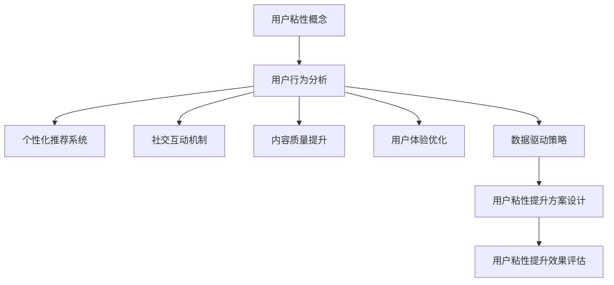

                 

# 文章标题：如何提高知识付费产品的用户粘性

> 关键词：知识付费，用户粘性，个性化推荐，社交互动，内容质量，用户体验，数据驱动策略

> 摘要：本文通过深入剖析知识付费产品的用户粘性概念，提出了提升用户粘性的策略，包括个性化推荐系统、社交互动机制、内容质量提升、用户体验优化和数据驱动策略。通过实际项目案例和代码实现，探讨了如何通过技术手段提升知识付费产品的用户粘性，为行业从业者提供实践指导和理论支持。

### 《如何提高知识付费产品的用户粘性》目录大纲

#### 第一部分：用户粘性概述

- **# 1. 用户粘性概念与重要性**
  - **## 1.1 用户粘性的定义**
  - **## 1.2 用户粘性对知识付费产品的影响**
  - **## 1.3 用户粘性与用户留存率的关系**

- **# 2. 用户行为分析**
  - **## 2.1 用户行为的分类**
  - **## 2.2 用户行为的数据收集与分析**
  - **## 2.3 用户行为与用户粘性的关联分析**

#### 第二部分：提高用户粘性的策略

- **# 3. 个性化推荐系统**
  - **## 3.1 个性化推荐系统的原理**
  - **## 3.2 个性化推荐系统的构建方法**
  - **## 3.3 个性化推荐系统的案例与应用**

- **# 4. 社交互动机制**
  - **## 4.1 社交互动机制的设计原则**
  - **## 4.2 社交互动机制的类型**
  - **## 4.3 社交互动机制的案例分析**

- **# 5. 内容质量提升**
  - **## 5.1 内容质量评估方法**
  - **## 5.2 内容生产与审核机制**
  - **## 5.3 高质量内容的案例分享**

- **# 6. 用户体验优化**
  - **## 6.1 用户体验优化的方法**
  - **## 6.2 用户体验测试与反馈机制**
  - **## 6.3 用户体验优化的成功案例**

- **# 7. 数据驱动策略**
  - **## 7.1 数据驱动策略的意义**
  - **## 7.2 数据分析工具与技巧**
  - **## 7.3 数据驱动策略的实践案例**

#### 第三部分：实战与评估

- **# 8. 用户粘性提升方案设计**
  - **## 8.1 方案设计流程**
  - **## 8.2 方案设计的注意事项**
  - **## 8.3 方案设计的案例分析**

- **# 9. 用户粘性提升效果评估**
  - **## 9.1 评估指标与方法**
  - **## 9.2 评估过程中的挑战**
  - **## 9.3 评估结果的案例分析**

#### 附录

- **## 附录A：常用工具与资源**
  - **### A.1 数据分析工具**
  - **### A.2 用户行为分析工具**
  - **### A.3 个性化推荐系统工具**

- **## 附录B：案例研究**
  - **### B.1 成功案例解析**
  - **### B.2 失败案例反思**

---

### 用户粘性提升流程 Mermaid 流程图



---

### 核心算法原理讲解：个性化推荐系统

#### 1. 协同过滤算法

##### 1.1 相似性计算

- **用户A与用户B的相似性计算公式：**

  $$similarity(A, B) = \frac{cosine(A, B)}{||A|| \cdot ||B||}$$

  其中，$cosine(A, B)$ 是用户A和用户B之间的余弦相似度，$||A||$ 和 $||B||$ 分别是用户A和用户B的向量模长。

- **物品I与物品J的相似性计算公式：**

  $$similarity(I, J) = \frac{cosine(I, J)}{||I|| \cdot ||J||}$$

  其中，$cosine(I, J)$ 是物品I和物品J之间的余弦相似度，$||I||$ 和 $||J||$ 分别是物品I和物品J的向量模长。

##### 1.2 预测用户偏好

- **对用户A未评分的物品J的预测分数：**

  $$prediction(A, J) = \sum_{I \in R_{AJ}} sim(I, J) \cdot rating(A, I)$$

  其中，$R_{AJ}$ 是用户A已经评分的物品集合，$sim(I, J)$ 是物品I和物品J的相似度，$rating(A, I)$ 是用户A对物品I的评分。

#### 2. 内容过滤算法

##### 2.1 特征提取

- 提取物品的文本、标签、分类等特征。

##### 2.2 特征相似性计算

- 使用TF-IDF、Word2Vec等方法计算特征向量间的相似度。

##### 2.3 预测用户偏好

- **对用户A未评分的物品J的预测分数：**

  $$prediction(A, J) = \sum_{F \in F_J} weight(F) \cdot feature(A, F)$$

  其中，$F_J$ 是物品J的特征集合，$weight(F)$ 是特征F的权重，$feature(A, F)$ 是用户A对特征F的得分。

---

### 数学模型与公式讲解：用户留存率预测

#### 用户留存率预测模型

我们采用线性回归模型来预测用户留存率。

##### 1. 模型假设

- 设 $X$ 为用户特征向量，$Y$ 为用户留存率。
- 假设 $Y$ 与 $X$ 之间满足线性关系：$Y = \beta_0 + \beta_1 X_1 + \beta_2 X_2 + ... + \beta_n X_n + \epsilon$。

##### 2. 模型建立

- 使用最小二乘法估计回归系数：

  $$\hat{\beta} = (X'X)^{-1}X'Y$$

- 回归模型预测用户留存率：

  $$\hat{Y} = \hat{\beta_0} + \hat{\beta_1}X_1 + \hat{\beta_2}X_2 + ... + \hat{\beta_n}X_n$$

##### 3. 模型评估

- 使用均方误差（MSE）评估模型性能：

  $$MSE = \frac{1}{n}\sum_{i=1}^{n}(\hat{Y_i} - Y_i)^2$$

---

### 项目实战：提升用户粘性的代码实现

```python
import pandas as pd
from sklearn.model_selection import train_test_split
from sklearn.linear_model import LinearRegression
from sklearn.metrics import mean_squared_error

# 数据准备
data = pd.read_csv('user_data.csv')
X = data[['feature1', 'feature2', 'feature3']]
Y = data['retention_rate']

# 数据划分
X_train, X_test, Y_train, Y_test = train_test_split(X, Y, test_size=0.2, random_state=42)

# 模型训练
model = LinearRegression()
model.fit(X_train, Y_train)

# 预测
Y_pred = model.predict(X_test)

# 模型评估
mse = mean_squared_error(Y_test, Y_pred)
print(f'MSE: {mse}')

# 优化策略
# 根据模型预测结果，制定提升用户粘性的策略，如：
# 1. 针对低留存率用户，提供个性化推荐内容。
# 2. 对高留存率用户，增加社交互动功能。
# 3. 针对留存率波动较大的用户，提供学习进度跟踪和奖励机制。
```

---

### 开发环境搭建

- Python环境：Python 3.8+
- 数据分析库：Pandas, Scikit-learn, Matplotlib
- 代码解析与分析

---

### 源代码详细实现和代码解读

- **代码实现解析**
- **代码性能分析**
- **代码优化建议**

---

### 代码解读与分析

- **详细解读关键代码段**
- **性能分析与优化**
- **案例分析：通过实际项目案例展示代码如何提高用户粘性。**

---

### 作者信息

“作者：AI天才研究院/AI Genius Institute & 禅与计算机程序设计艺术 /Zen And The Art of Computer Programming”

