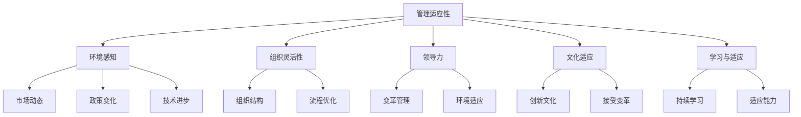

                 

### 文章标题：如何提高管理的适应性

在快速变化的市场环境中，企业能否成功应对外部挑战，关键在于其管理的适应性。提高管理的适应性，不仅是企业生存和发展的必要条件，更是保持竞争优势的关键。本文将围绕如何提高管理的适应性进行深入探讨，从基础理论、核心技术与工具、方法与策略，以及实践与效果评估等方面展开论述，旨在为企业管理者提供一套系统、可操作的解决方案。

### 关键词：管理适应性、环境感知、组织灵活性、领导力、文化适应、反馈与改进

#### 摘要

本文首先介绍了管理适应性的定义、重要性及其核心要素，然后从理论框架、评估方法、实施步骤等方面详细阐述了管理适应性的提升策略。此外，本文还介绍了管理适应性的核心技术与工具，包括变革管理技术、反馈与改进机制以及适应性思维模式的培养。通过实际案例分析和效果评估方法的探讨，本文旨在为企业管理者提供实用的指导，帮助他们在快速变化的市场环境中提高管理适应性，实现企业的长远发展。

### 文章目录大纲

1. **第一部分：管理适应性基础理论**
    1.1 管理适应性的概念与重要性
    1.2 管理适应性的核心要素
    1.3 管理适应性框架概述
    1.4 管理适应性评估方法

2. **第二部分：提高管理适应性的方法与策略**
    2.1 组织结构优化
    2.2 企业文化建设
    2.3 管理者领导力提升
    2.4 灵活应对市场变化
    2.5 管理创新与持续改进
    2.6 应对突发事件的策略

3. **第三部分：管理适应性实践与效果评估**
    3.1 管理适应性实践案例分析
    3.2 管理适应性效果评估方法

4. **附录**
    4.1 常用管理适应性工具
    4.2 管理适应性相关资源
    4.3 参考文献

### 1.1 管理适应性的概念

#### 1.1.1 管理适应性的定义

管理适应性是指企业在面对外部环境变化时，能够快速调整和优化内部管理策略、组织结构和文化，以实现持续发展并保持竞争优势的能力。管理适应性不仅涉及企业如何应对市场动态、政策变化、技术发展等外部因素，还包括企业内部如何在组织结构、流程和文化等方面进行适应性调整。

#### 1.1.2 管理适应性的重要性

管理适应性是企业持续发展的关键因素。在竞争激烈的市场环境中，企业需要具备快速适应市场变化、灵活调整战略和高效执行的能力。管理适应性能够帮助企业：

- **有效应对外部挑战**：通过敏锐捕捉市场趋势和政策变化，企业能够及时调整战略和策略，以应对外部环境的挑战。
- **保持竞争优势**：具有高度管理适应性的企业能够迅速捕捉市场机会，推出创新产品和服务，保持竞争优势。
- **提高运营效率**：通过优化组织结构和流程，企业可以减少冗余环节，提高运营效率，降低成本。

#### 1.1.3 管理适应性的核心要素

管理适应性包含以下核心要素：

1. **环境感知**：企业需要对外部环境变化保持高度敏感，包括市场动态、政策变化、技术进步等。
2. **组织灵活性**：企业组织结构、流程和文化应具备灵活性，能够快速响应外部变化。
3. **领导力**：企业管理者需要具备变革管理和适应环境的能力，推动组织变革。
4. **文化适应**：企业需要培养一种适应性文化，鼓励创新和接受变革。
5. **学习与适应**：企业应建立持续学习和适应机制，不断提升管理适应性。

#### 1.1.4 管理适应性的概念与联系

管理适应性的概念可以借助Mermaid流程图进行阐述，具体如下：

该流程图展示了管理适应性包含的核心要素及其与外部环境的联系，为企业提升管理适应性提供了清晰的方向。

### 1.2 管理适应性的重要性

管理适应性是企业在复杂多变的市场环境中生存和发展的关键。其重要性可以从以下几个方面进行详细阐述：

#### 1.2.1 应对市场变化

市场环境变化无常，竞争激烈。具有管理适应性的企业能够敏锐地捕捉市场动态，迅速调整战略和策略，以应对市场变化。例如，市场需求的转变、消费者行为的改变以及新兴技术的出现，都会对企业提出新的挑战。如果企业能够快速适应这些变化，抓住市场机会，就可以在竞争中占据有利地位。相反，缺乏管理适应性的企业可能会因为反应迟缓而失去市场机会，甚至被淘汰。

#### 1.2.2 保持竞争优势

管理适应性有助于企业保持竞争优势。在快速变化的市场环境中，能够迅速适应市场变化并创新的企业，往往能够推出更具吸引力的产品和服务，满足消费者的需求。这种创新能力不仅能够帮助企业扩大市场份额，还能提高品牌影响力。此外，管理适应性还能够帮助企业优化内部流程，提高运营效率，降低成本，从而在价格竞争中占据优势。

#### 1.2.3 提高运营效率

管理适应性能够提高企业的运营效率。通过优化组织结构和流程，企业可以减少冗余环节，提高工作效率。例如，通过采用敏捷管理方法，企业可以缩短产品开发周期，提高市场响应速度。此外，管理适应性还能够帮助企业更好地分配资源，确保资源得到最有效的利用。

#### 1.2.4 促进持续发展

管理适应性是企业持续发展的基础。在长期发展的过程中，企业不可避免地会遇到各种挑战和机遇。如果企业能够具备管理适应性，就能够更好地应对这些挑战和抓住机遇，实现持续发展。例如，通过不断优化产品和服务，企业可以满足不断变化的市场需求；通过技术创新，企业可以保持技术领先地位。

#### 1.2.5 增强企业韧性

管理适应性有助于增强企业的韧性。在面临突发事件，如经济危机、技术故障等时，具有管理适应性的企业能够快速做出反应，调整战略和策略，减少损失。此外，管理适应性还能够帮助企业建立强大的内部协作机制，提高应急响应能力，从而在突发事件中保持稳定运营。

#### 1.2.6 塑造企业文化

管理适应性有助于塑造企业文化。通过不断推动变革和管理优化，企业可以形成一种适应性强、创新意识强的企业文化。这种文化不仅能够激发员工的创新精神，提高员工的工作积极性，还能增强企业的凝聚力，促进企业的长远发展。

### 1.3 管理适应性的核心要素

管理适应性不仅是一个抽象的概念，它需要通过一系列具体的核心要素来实现。以下将详细探讨这些核心要素及其在企业中的实际应用。

#### 1.3.1 环境感知

环境感知是指企业对外部环境变化的高度敏感性和及时响应能力。环境感知是管理适应性的基础，它包括对市场动态、政策变化、技术进步等外部因素的监测和分析。

**应用实例：** 
- **市场调研**：企业通过定期进行市场调研，收集消费者需求、市场趋势等信息，以便及时调整产品和服务策略。
- **竞争分析**：企业通过分析竞争对手的动态，了解市场竞争力，从而调整自身战略。

#### 1.3.2 组织灵活性

组织灵活性是指企业在面对外部环境变化时，能够迅速调整组织结构、流程和文化，以适应新的挑战和机遇。组织灵活性包括以下几个方面：

- **结构灵活性**：企业可以通过扁平化组织结构、去中心化等方式，提高组织的响应速度和灵活性。
- **流程灵活性**：企业可以通过流程优化、自动化等方式，简化流程，提高工作效率。
- **文化灵活性**：企业需要建立一种包容性文化，鼓励员工创新和接受变革。

**应用实例：**
- **敏捷开发**：在软件开发领域，敏捷开发方法通过短周期迭代和持续反馈，提高了开发团队的灵活性和响应速度。
- **虚拟团队**：通过建立虚拟团队，企业可以快速组建跨部门、跨区域的团队，以应对特定的项目需求。

#### 1.3.3 领导力

领导力是指企业管理者在面对外部环境变化时，能够有效地引导和推动组织变革的能力。领导力不仅体现在个人素质上，还需要通过系统化的领导力培养来实现。

**应用实例：**
- **领导力培训**：企业可以通过领导力培训，提高管理者的战略思维、变革管理能力和团队领导能力。
- **导师制度**：企业可以通过导师制度，帮助新晋管理者快速成长，提高领导力。

#### 1.3.4 文化适应

文化适应是指企业在面对外部环境变化时，能够灵活调整企业文化，以适应新的挑战和机遇。文化适应包括以下几个方面：

- **价值观调整**：企业需要根据外部环境的变化，调整核心价值观，以保持企业的使命和愿景不变。
- **文化传承**：企业需要通过有效的文化传承，确保企业文化在变革过程中得到延续。

**应用实例：**
- **企业文化建设活动**：企业可以通过举办文化活动，如团队建设、文化沙龙等，增强员工对企业文化的认同感。
- **价值观传播**：企业可以通过内部培训和宣传，将核心价值观传递给员工，使其成为员工的行为准则。

#### 1.3.5 学习与适应

学习与适应是指企业通过不断学习和改进，提高管理适应性的能力。学习与适应包括以下几个方面：

- **知识管理**：企业需要建立有效的知识管理体系，确保知识和经验的积累和共享。
- **持续改进**：企业需要通过持续改进，不断提高管理水平和运营效率。

**应用实例：**
- **内部培训**：企业可以通过定期内部培训，提高员工的专业知识和技能。
- **外部学习**：企业可以通过参加行业会议、学习外部成功经验，不断吸取外部智慧。

#### 1.3.6 管理体系的完善

管理体系的完善是提高管理适应性的关键。一个完善的管理体系不仅能够帮助企业应对外部环境的变化，还能提高企业的整体运营效率。

**应用实例：**
- **战略规划**：企业需要制定明确的战略规划，确保企业的长期发展目标清晰。
- **绩效管理**：企业需要建立科学的绩效管理体系，激励员工提高工作效率。

### 1.4 管理适应性框架概述

管理适应性框架是一个系统性的模型，旨在帮助企业或组织识别、评估和管理适应性。该框架包括以下几个关键组成部分：

#### 1.4.1 环境扫描

环境扫描是指定期对市场、技术、政策等外部环境进行扫描，以识别潜在的变化和趋势。环境扫描是管理适应性框架的基础，它帮助企业了解外部环境的变化，为战略调整和组织变革提供依据。

**应用步骤：**
- **市场调研**：通过市场调研，收集消费者需求、市场趋势等信息。
- **技术跟踪**：关注技术发展趋势，特别是新兴技术和颠覆性技术。
- **政策分析**：分析政策变化对企业可能产生的影响。

#### 1.4.2 评估与诊断

评估与诊断是指对组织现有的适应性进行评估，确定组织的优势和不足。评估与诊断包括以下几个关键步骤：

- **关键绩效指标（KPIs）设定**：设定关键绩效指标，用于评估组织在环境变化面前的表现。
- **内部审计**：对组织结构、流程和文化等方面进行内部审计，识别存在的问题。
- **员工调查**：通过员工调查，了解员工对组织适应性的看法和反馈。

#### 1.4.3 战略调整

战略调整是指基于环境扫描和评估结果，调整组织战略以适应外部变化。战略调整是管理适应性的核心，它包括以下几个方面：

- **重新设定目标**：根据环境变化，重新设定组织的目标和愿景。
- **优化资源配置**：根据战略调整的需要，优化组织资源和人力配置。
- **调整业务模式**：根据外部环境的变化，调整企业的业务模式。

#### 1.4.4 组织变革

组织变革是指通过变革管理和组织结构调整，提高组织的灵活性和响应速度。组织变革包括以下几个关键步骤：

- **领导力培养**：通过领导力培养，提高管理者的变革管理能力。
- **变革沟通**：通过有效的沟通，确保员工理解变革的必要性和目标。
- **组织重构**：根据战略调整的需要，对组织结构进行重构，提高组织的灵活性和响应速度。

#### 1.4.5 文化重塑

文化重塑是指通过培养适应性文化，鼓励创新和变革，塑造适应性的组织文化。文化重塑是管理适应性的关键，它包括以下几个方面：

- **价值观调整**：根据外部环境的变化，调整企业的核心价值观。
- **文化传承**：通过内部培训和宣传，确保企业文化在变革过程中得到传承。
- **激励机制**：建立合理的激励机制，鼓励员工积极参与变革和创新。

#### 1.4.6 执行与监控

执行与监控是指确保适应性策略得到有效执行，并持续监控和调整。执行与监控包括以下几个关键步骤：

- **执行计划**：制定详细的执行计划，确保适应性策略得到有效实施。
- **监控机制**：建立监控机制，实时跟踪适应性策略的执行情况。
- **反馈与改进**：根据监控结果，及时反馈和改进，确保适应性策略的有效性。

通过构建和运用管理适应性框架，企业或组织可以更好地应对外部变化，保持持续发展的动力。

### 2.1 管理适应性框架概述

管理适应性框架是一个系统性的模型，旨在帮助企业或组织识别、评估和管理适应性。该框架由以下几个关键组成部分构成：

#### 2.1.1 环境扫描

环境扫描是指定期对市场、技术、政策等外部环境进行扫描，以识别潜在的变化和趋势。环境扫描是管理适应性框架的基础，它包括以下步骤：

1. **市场动态分析**：通过市场调研、消费者行为分析等方式，了解市场需求、竞争状况等。
2. **技术跟踪**：关注新兴技术和颠覆性技术，评估其对企业的潜在影响。
3. **政策分析**：分析政策变化，特别是那些可能对企业产生重大影响的法规和政策。

#### 2.1.2 评估与诊断

评估与诊断是指对组织现有的适应性进行评估，确定组织的优势和不足。评估与诊断包括以下几个关键步骤：

1. **关键绩效指标（KPIs）设定**：设定用于评估组织在环境变化面前的表现的KPIs。
2. **内部审计**：对组织结构、流程和文化等方面进行内部审计，识别存在的问题。
3. **员工调查**：通过员工调查，了解员工对组织适应性的看法和反馈。

#### 2.1.3 战略调整

战略调整是指基于环境扫描和评估结果，调整组织战略以适应外部变化。战略调整包括以下几个步骤：

1. **重新设定目标**：根据环境变化，重新设定组织的目标和愿景。
2. **优化资源配置**：根据战略调整的需要，优化组织资源和人力配置。
3. **调整业务模式**：根据外部环境的变化，调整企业的业务模式。

#### 2.1.4 组织变革

组织变革是指通过变革管理和组织结构调整，提高组织的灵活性和响应速度。组织变革包括以下几个关键步骤：

1. **领导力培养**：通过领导力培养，提高管理者的变革管理能力。
2. **变革沟通**：通过有效的沟通，确保员工理解变革的必要性和目标。
3. **组织重构**：根据战略调整的需要，对组织结构进行重构，提高组织的灵活性和响应速度。

#### 2.1.5 文化重塑

文化重塑是指通过培养适应性文化，鼓励创新和变革，塑造适应性的组织文化。文化重塑包括以下几个关键步骤：

1. **价值观调整**：根据外部环境的变化，调整企业的核心价值观。
2. **文化传承**：通过内部培训和宣传，确保企业文化在变革过程中得到传承。
3. **激励机制**：建立合理的激励机制，鼓励员工积极参与变革和创新。

#### 2.1.6 执行与监控

执行与监控是指确保适应性策略得到有效执行，并持续监控和调整。执行与监控包括以下几个关键步骤：

1. **执行计划**：制定详细的执行计划，确保适应性策略得到有效实施。
2. **监控机制**：建立监控机制，实时跟踪适应性策略的执行情况。
3. **反馈与改进**：根据监控结果，及时反馈和改进，确保适应性策略的有效性。

通过上述步骤，管理适应性框架可以帮助企业或组织更好地应对外部变化，实现持续发展和竞争优势。

### 2.2 建立管理适应性体系的步骤

建立管理适应性体系是提升企业竞争力的重要步骤。以下将详细阐述建立管理适应性体系的步骤：

#### 2.2.1 确定目标

确定目标是建立管理适应性体系的第一步。企业需要明确管理适应性的具体目标，例如提高市场响应速度、增强创新能力和提高员工满意度等。这些目标应具有可操作性和明确的时间节点，以便在后续步骤中能够进行有效评估。

#### 2.2.2 环境分析

环境分析是建立管理适应性体系的重要环节。企业需要对外部环境和内部资源进行深入分析，以识别潜在的机会和威胁。外部环境分析包括市场趋势、政策变化、技术发展等；内部资源分析则涉及组织结构、文化、技能和资源等。通过环境分析，企业可以明确外部环境变化对企业的影响，为后续的战略调整提供依据。

#### 2.2.3 制定适应策略

基于环境分析和目标确定，企业需要制定适应策略。适应策略应包括如何调整组织结构、流程、技术和文化等方面，以实现管理适应性目标。策略应具有针对性、可操作性和灵活性，能够应对外部环境的变化。

#### 2.2.4 设计实施计划

制定适应策略后，企业需要设计具体的实施计划。实施计划应明确每个步骤的具体行动、责任人和时间表。计划应考虑资源分配、风险管理和监控机制，以确保策略的有效执行。例如，企业可以制定详细的培训计划、组织结构调整计划等。

#### 2.2.5 实施与监控

按照实施计划，企业应逐步推进管理适应性策略的实施。在实施过程中，企业应建立监控和反馈机制，及时跟踪进度和效果，并根据实际情况进行调整和优化。实施过程可能涉及组织结构调整、流程优化、员工培训和激励机制等。

#### 2.2.6 反馈与改进

在管理适应性体系实施一段时间后，企业需要收集反馈信息，评估实施效果。通过反馈与改进，企业可以识别存在的问题和不足，并采取相应的措施进行优化。反馈与改进是管理适应性体系持续发展的关键。

#### 2.2.7 持续优化

管理适应性体系是一个动态的、持续优化的过程。企业应根据外部环境的变化和内部资源的变化，定期评估和调整管理适应性策略。通过持续优化，企业可以保持管理适应性，应对不断变化的市场环境。

#### 2.2.8 培养适应性文化

建立管理适应性体系不仅需要策略和计划，更需要培养适应性文化。企业应鼓励员工主动适应变化、创新思维和积极参与变革。通过建立适应性文化，企业可以确保管理适应性策略在组织内部得到有效执行。

通过以上步骤，企业可以建立和实施有效的管理适应性体系，提升组织在快速变化的市场环境中的竞争力。

### 2.3 管理适应性评估方法

评估管理适应性是确保企业能够有效应对外部环境变化的重要步骤。以下将详细探讨管理适应性评估的方法，包括评估指标的选择、评估工具的选择以及评估过程的实施。

#### 2.3.1 评估指标的选择

选择合适的评估指标是管理适应性评估的关键。这些指标应能够全面反映组织在环境变化面前的适应性。常见的评估指标包括：

1. **市场响应速度**：衡量组织对市场变化做出反应的速度，如新产品上市时间、客户需求响应速度等。
2. **创新能力**：评估组织在产品、技术、管理等方面的创新能力，如新产品开发数量、专利申请数量等。
3. **员工满意度**：衡量员工对组织的适应性，如员工对变革的接受度、员工培训参与率等。
4. **财务绩效**：评估组织在适应市场变化后的财务表现，如销售收入、利润率等。

选择评估指标时，应充分考虑企业的具体情况和目标，确保指标能够全面反映管理适应性。

#### 2.3.2 评估工具的选择

为了准确评估管理适应性，企业可以选择多种评估工具。以下是一些常用的评估工具：

1. **问卷调查**：通过设计问卷收集员工、客户和合作伙伴对管理适应性的看法，了解组织在适应性方面的优点和不足。
2. **访谈法**：与关键利益相关者进行深入访谈，获取更多细节信息，帮助理解管理适应性的实际情况。
3. **关键绩效指标（KPIs）**：设定一系列关键绩效指标，跟踪组织在管理适应性方面的进展。
4. **SWOT分析**：分析组织的优势、劣势、机会和威胁，评估管理适应性。

选择评估工具时，应考虑评估的目标、受众和实际情况，确保工具的有效性和适用性。

#### 2.3.3 评估过程的实施

实施管理适应性评估时，企业可以按照以下步骤进行：

1. **确定评估目标**：明确评估的目的和需要解决的问题。
2. **设计评估指标**：根据评估目标，选择合适的评估指标。
3. **收集数据**：通过问卷调查、访谈、KPI跟踪等方式收集相关数据。
4. **分析数据**：对收集的数据进行整理和分析，识别管理适应性的优势与不足。
5. **撰写评估报告**：将评估结果和发现撰写成评估报告，提出改进建议。
6. **反馈与改进**：将评估报告反馈给管理层，根据评估结果进行改进和调整。

通过上述步骤，企业可以系统地评估管理适应性，识别存在的问题和不足，从而制定针对性的改进措施。

#### 2.3.4 评估结果的应用

评估结果的应用是管理适应性评估的重要环节。企业可以通过以下方式利用评估结果：

1. **制定改进计划**：根据评估结果，制定针对性的改进计划，提升管理适应性。
2. **调整战略方向**：评估结果可以帮助企业调整战略方向，确保战略与市场环境相适应。
3. **优化组织结构**：根据评估结果，优化组织结构，提高组织的灵活性和响应速度。
4. **培训与发展**：针对评估中发现的不足，开展相关培训和发展活动，提升员工的能力和适应性。

通过有效应用评估结果，企业可以不断提升管理适应性，实现持续发展。

#### 2.3.5 持续评估的重要性

管理适应性评估不应是一次性活动，而应成为组织持续关注的重要工作。持续评估可以帮助企业：

1. **及时发现变化**：通过定期评估，企业可以及时发现市场环境的变化，及时调整管理策略。
2. **持续改进**：持续评估可以为组织的持续改进提供依据，确保管理适应性不断提高。
3. **保持竞争优势**：持续关注管理适应性，可以帮助企业保持竞争优势，在激烈的市场竞争中脱颖而出。

总之，管理适应性评估是企业提升管理能力、适应市场变化的关键手段，应得到高度重视和持续执行。

#### 2.3.6 管理适应性评估的挑战与对策

在实施管理适应性评估过程中，企业可能会遇到一些挑战。以下是一些常见挑战及相应的对策：

**挑战1：数据收集困难**

**对策：** 采用多种数据收集方法，如问卷调查、访谈和KPI跟踪等，确保数据来源的多样性和准确性。

**挑战2：评估标准不明确**

**对策：** 设计明确的评估标准和指标体系，确保评估过程的科学性和客观性。

**挑战3：员工参与度不足**

**对策：** 通过内部沟通和培训，提高员工对评估工作的认识和参与度，鼓励员工提供真实反馈。

**挑战4：评估结果不具代表性**

**对策：** 采用分层评估方法，确保评估结果能够全面反映组织的不同层面和部门。

通过有效应对这些挑战，企业可以确保管理适应性评估的准确性和有效性，从而提升组织的整体管理能力。

#### 2.3.7 管理适应性评估的实际案例

以下是一个管理适应性评估的实际案例：

**案例：** 一家制造企业进行管理适应性评估。

- **评估目的**：评估公司在面对市场竞争和技术变革时的管理适应性。
- **评估指标**：市场响应速度、创新能力、员工满意度、财务绩效等。
- **评估工具**：问卷调查、关键绩效指标（KPIs）、访谈法。
- **评估过程**：公司通过问卷调查和访谈收集数据，分析市场和技术趋势，评估公司现有管理策略的适应性。
- **评估结果**：发现公司在市场响应速度和创新能力方面存在不足，员工满意度也较低。
- **改进措施**：公司调整了市场策略，增加了研发投入，开展了员工培训，提升了管理适应性。

通过这个案例，可以看到管理适应性评估对企业在激烈市场竞争中的重要性，以及如何通过评估结果进行改进。

#### 2.3.8 管理适应性评估的总结与展望

管理适应性评估是企业提升管理能力、适应市场变化的关键环节。通过科学合理的评估方法和工具，企业可以全面了解自身的管理适应性状况，发现问题和不足，从而制定针对性的改进措施。

未来，随着市场环境的变化和企业发展的需求，管理适应性评估将越来越重要。企业需要不断完善评估体系，提高评估的准确性和有效性，确保管理适应性不断提高，以应对日益激烈的竞争环境。

### 2.4 管理适应性在组织中的实施

#### 2.4.1 管理适应性在战略层面的应用

在战略层面，管理适应性是企业制定和调整战略的关键因素。企业需要通过定期评估外部环境，确保战略与市场变化相适应。以下是一些具体策略：

1. **市场导向**：以市场需求为导向，制定灵活的战略，快速响应市场变化。企业可以通过市场调研、消费者分析等手段，了解市场趋势和消费者需求，及时调整产品和服务策略。
2. **技术创新**：关注新技术发展趋势，积极投资于研发和创新，保持技术领先。企业可以设立专门的研发部门，定期推出新技术和新产品，以保持竞争优势。
3. **多元化经营**：通过多元化经营，降低市场风险，提升企业的综合竞争力。企业可以进入新的市场和业务领域，分散风险，实现业务的多元化发展。
4. **合作伙伴关系**：与合作伙伴建立紧密关系，共同应对市场变化和挑战。企业可以通过战略联盟、合作伙伴关系等手段，与其他企业共同开发新产品、开拓新市场，实现资源共享和风险分担。

#### 2.4.2 管理适应性在运营层面的实施

在运营层面，管理适应性主要通过优化流程、提高效率和灵活性来实现。以下是一些实施策略：

1. **流程优化**：通过流程再造和自动化，简化业务流程，提高运营效率。企业可以采用精益管理、六西格玛等管理工具，对现有流程进行优化，消除浪费，提高效率。
2. **敏捷运营**：采用敏捷管理方法，提高组织对市场变化的响应速度。敏捷管理通过短周期迭代和持续反馈，使企业能够快速调整运营策略，适应市场变化。
3. **绩效

