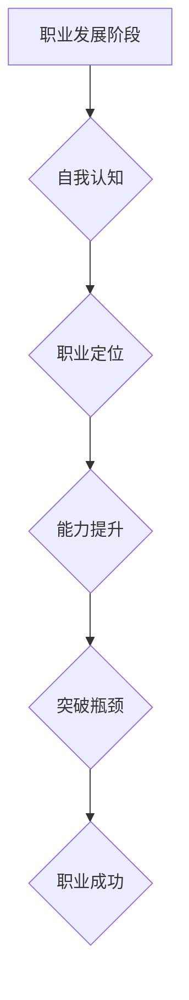
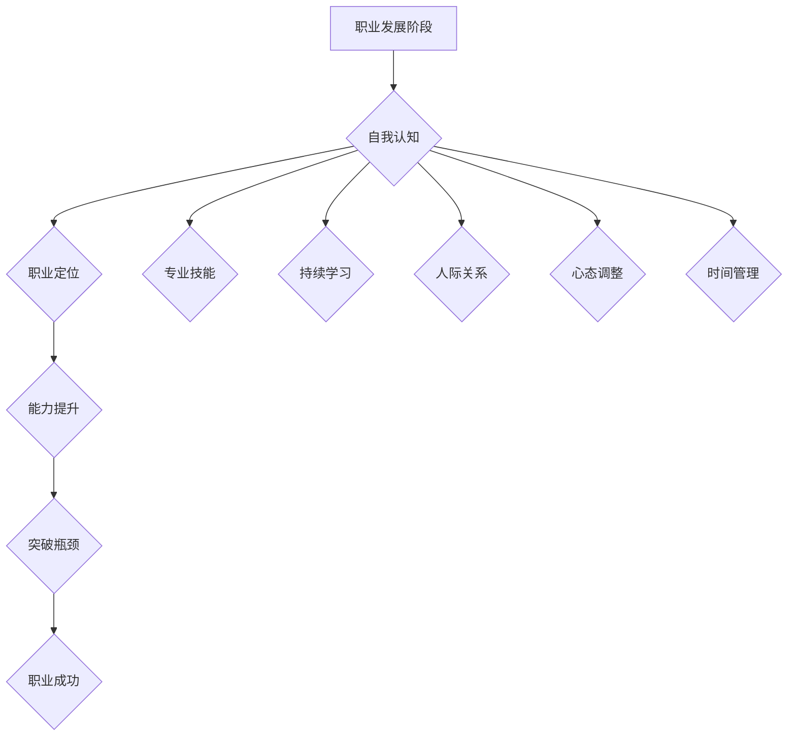

                 

# 《如何突破职业瓶颈达到巅峰》

> 关键词：职业发展、瓶颈、自我认知、专业技能、领导力、时间管理

> 摘要：本文旨在探讨如何突破职业瓶颈，实现职业生涯的巅峰。通过理论分析和实战经验分享，为职业人士提供一套切实可行的策略与方法，助力他们在职场中不断成长与突破。

## 《如何突破职业瓶颈达到巅峰》目录大纲

## 第一部分：职业发展理论篇

### 第1章：职业发展的理论框架

#### 1.1 职业发展的阶段与特点

#### 1.2 职业规划与自我认知

#### 1.3 职业成功的关键因素

### 第2章：职业瓶颈的成因与识别

#### 2.1 职业瓶颈的表现形式

#### 2.2 职业瓶颈的心理因素

#### 2.3 职业瓶颈的环境因素

### 第3章：突破职业瓶颈的策略与方法

#### 3.1 自我激励与心态调整

#### 3.2 提升专业技能与知识

#### 3.3 拓展人际关系与资源

### 第4章：职业发展的核心能力建设

#### 4.1 领导力与团队管理

#### 4.2 沟通表达与影响力

#### 4.3 创新思维与解决问题能力

### 第5章：职业转型与多元化发展

#### 5.1 职业转型的路径与策略

#### 5.2 多元化发展的机会与挑战

#### 5.3 跨界融合与创新能力

## 第二部分：实战经验分享篇

### 第6章：行业专家的职业发展之路

#### 6.1 行业专家的职业生涯规划

#### 6.2 职业瓶颈的突破经验

#### 6.3 职业巅峰的成就与启示

### 第7章：实战案例分析与借鉴

#### 7.1 成功突破职业瓶颈的案例

#### 7.2 失败案例中的教训与反思

#### 7.3 案例分析与个人启示

## 第三部分：提升职业素养篇

### 第8章：时间管理与工作效率

#### 8.1 时间管理的原则与方法

#### 8.2 提升工作效率的技巧

#### 8.3 高效工作的心理调适

### 第9章：领导力与团队建设

#### 9.1 领导力的重要性

#### 9.2 领导力的发展与实践

#### 9.3 团队建设与沟通协作

### 第10章：职业形象与人际交往

#### 10.1 职业形象的重要性

#### 10.2 人际交往的技巧

#### 10.3 职场关系的管理

## 附录

### 附录A：参考资料与推荐读物

#### A.1 相关书籍推荐

#### A.2 在线课程与教程

#### A.3 行业报告与研究报告

### 附录B：实用工具与资源

#### B.1 职业规划工具

#### B.2 时间管理工具

#### B.3 领导力发展工具

## 职业发展的 Mermaid 流�程图

## 第一部分：职业发展理论篇

### 第1章：职业发展的理论框架

职业发展是一个复杂且动态的过程，涉及多个阶段和多种因素。为了更好地理解职业发展的规律，我们需要构建一个理论框架来指导我们的职业规划与实践。

#### 1.1 职业发展的阶段与特点

职业发展通常可以分为以下几个阶段：

1. **探索阶段**：这是职业发展的初期，个体开始了解不同的职业选择，尝试找到自己的兴趣和擅长的领域。
   
2. **建立阶段**：在这个阶段，个体开始专注于某个特定的职业领域，积累相关知识和技能，逐步建立自己的职业身份。

3. **稳定阶段**：随着经验和能力的积累，个体在职业领域中找到了自己的位置，达到了相对稳定的工作状态。

4. **成长阶段**：在稳定阶段之后，个体可能会寻求新的挑战和机遇，进一步提升自己的职业高度。

5. **成熟阶段**：在这个阶段，个体已经在职业领域中取得了显著的成就，开始发挥领导力和影响力。

6. **退休阶段**：随着年龄的增长，个体逐渐减少工作投入，准备退出职场。

#### 1.2 职业规划与自我认知

职业规划是职业发展的基础，它涉及到个体对自身兴趣、能力和职业目标的认知与规划。自我认知是职业规划的核心，它包括以下几个方面：

1. **兴趣爱好**：了解自己的兴趣所在，有助于找到自己愿意投入时间和精力的职业领域。

2. **能力评估**：评估自己在专业技能、沟通能力、团队合作等方面的表现，以确定自己在职业发展中的优势和劣势。

3. **职业目标**：明确自己的职业目标，包括短期目标和长期目标，以指导自己的职业发展路径。

4. **价值观**：了解自己的价值观，有助于找到与自身价值观相匹配的职业环境。

#### 1.3 职业成功的关键因素

职业成功的因素多种多样，但以下几个关键因素尤为重要：

1. **专业技能**：具备扎实的专业技能是职业成功的基石，它有助于个体在职场中脱颖而出。

2. **持续学习**：随着技术的快速变革，持续学习成为职业发展的必要条件。只有不断更新知识和技能，才能适应职场的变化。

3. **人际关系**：良好的人际关系是职业成功的重要保障。通过建立广泛的人脉网络，个体可以获得更多的职业机会和资源。

4. **心态调整**：积极的心态有助于个体克服职业发展中的困难和挑战，保持持续的动力和热情。

5. **时间管理**：有效的时间管理可以提升工作效率，使个体有更多的时间用于自我提升和职业发展。

#### 1.4 职业发展的Mermaid流程图

为了更好地理解职业发展的过程，我们可以使用Mermaid流程图来展示各个阶段和关键因素之间的关系。

通过以上理论框架的构建，我们可以更系统地理解职业发展的规律，为自己的职业规划提供指导。在接下来的章节中，我们将进一步探讨职业瓶颈的成因与识别，以及突破职业瓶颈的策略与方法。

### 第2章：职业瓶颈的成因与识别

职业瓶颈是职业发展过程中常见的现象，它可能会限制个人的职业成长和发展。了解职业瓶颈的成因和识别方法，对于突破瓶颈、实现职业巅峰具有重要意义。

#### 2.1 职业瓶颈的表现形式

职业瓶颈的表现形式多种多样，常见的有以下几种：

1. **职业停滞**：在职业生涯中，个体可能会发现自己的职位和薪资长期没有明显提升，工作内容也趋于重复和单调和乏味。

2. **能力受限**：随着行业的发展和技术的进步，个体可能会发现自己的技能和知识储备无法满足工作需求，导致工作效果不佳。

3. **职业倦怠**：长时间从事重复性和高压力的工作，个体可能会出现疲劳、失去动力和兴趣，甚至产生职业倦怠感。

4. **晋升无望**：在组织中，个体可能会发现自己无法获得晋升机会，即使工作表现优秀，也无法得到认可和重用。

5. **职业发展路径不明**：个体可能会对未来的职业发展感到迷茫，不确定自己的发展方向和目标，导致职业规划不明确。

#### 2.2 职业瓶颈的心理因素

职业瓶颈的产生与个体的心理因素密切相关。以下是一些常见的心理因素：

1. **自我限制**：个体可能会对自己的能力产生怀疑，认为自己无法胜任更高层次的职位或更复杂的任务，从而限制了自己的职业发展。

2. **恐惧失败**：个体可能会害怕失败和挑战，害怕面对新环境和新的工作内容，从而选择停留在舒适区，不敢突破瓶颈。

3. **自我效能感低**：个体可能会对自己的工作能力和成就感到不满，认为自己无法达到职业成功的标准，从而失去了继续努力的信心。

4. **职业倦怠**：长时间的重复性工作和高强度的工作压力，可能导致个体产生职业倦怠感，从而影响工作效率和职业发展。

5. **心理压力**：职场竞争激烈，个体可能会面临来自同事、上司和客户的压力，这些压力可能导致个体产生焦虑和不安，影响职业发展。

#### 2.3 职业瓶颈的环境因素

除了心理因素，职业瓶颈的产生还受到外部环境因素的影响。以下是一些常见的环境因素：

1. **组织结构**：组织结构不合理、管理制度不完善，可能导致个体在工作中遇到障碍，无法发挥自己的才能。

2. **资源限制**：组织资源有限，如资金、人力和技术等，可能限制了个体职业发展的机会。

3. **市场变化**：行业和市场环境的变化，如技术革新和市场竞争加剧，可能对个体的职业发展产生影响。

4. **政策法规**：政策法规的变化，如税收政策、劳动法规等，可能对个体的职业发展产生直接影响。

5. **外部压力**：家庭、朋友和社会的期望和压力，也可能对个体的职业发展产生负面影响。

#### 2.4 识别职业瓶颈的方法

要识别职业瓶颈，个体可以从以下几个方面入手：

1. **自我反思**：定期进行自我反思，分析自己在职业发展中的表现和成就，找出存在的问题和瓶颈。

2. **与同事和上司交流**：与同事和上司交流，了解他们在职业发展中的意见和建议，发现自己的盲点和不足。

3. **职业规划咨询**：寻求职业规划师的帮助，进行专业的职业规划评估，找出职业瓶颈的具体原因。

4. **职业发展调查**：通过行业报告、专业论坛和社交媒体等渠道，了解行业趋势和职业发展方向，判断自己的职业瓶颈是否与行业环境有关。

5. **心理测试**：通过心理测试，了解自己的心理状态和职业倾向，找出可能影响职业发展的心理因素。

通过以上方法，个体可以更准确地识别职业瓶颈，为突破瓶颈提供有力的依据。在下一章中，我们将探讨突破职业瓶颈的策略与方法，帮助个体实现职业巅峰。

### 第3章：突破职业瓶颈的策略与方法

突破职业瓶颈是实现职业巅峰的关键一步。通过有效的策略和方法，个体可以在职业发展中找到新的机遇，实现自我提升和职业飞跃。以下是一些具体的策略和方法：

#### 3.1 自我激励与心态调整

自我激励是突破职业瓶颈的重要动力。以下是一些自我激励的方法：

1. **设定明确目标**：明确自己的职业目标，制定具体的行动计划，并定期进行评估和调整。明确的目标有助于保持动力和方向。

2. **正面思考**：保持积极的心态，相信自己有能力克服职业瓶颈。通过正面思考，增强自信心和抗压能力。

3. **自我奖励**：在实现小目标后，给予自己适当的奖励，如休息一天、购买心仪的物品等，以增强成就感和动力。

4. **与成功人士交流**：与行业内的成功人士交流，学习他们的经验和智慧，获取职业发展的启示和动力。

心态调整是实现职业突破的内在动力。以下是一些建议：

1. **接受现实**：承认自己目前面临的困难和挑战，接受现状，为解决问题做好准备。

2. **学会放松**：通过运动、冥想、阅读等方式，学会放松自己，减轻压力和焦虑。

3. **积极应对**：面对困难和挑战，采取积极的态度去应对，寻找解决问题的方法。

4. **保持耐心**：职业突破往往需要时间和努力，保持耐心，相信自己能够逐步实现目标。

#### 3.2 提升专业技能与知识

提升专业技能和知识是突破职业瓶颈的关键。以下是一些建议：

1. **持续学习**：利用业余时间学习新的知识和技能，如参加培训课程、阅读专业书籍、在线学习等。

2. **实践应用**：将所学知识和技能应用到实际工作中，通过实践来提升自己的能力和水平。

3. **参加行业活动**：参加行业会议、研讨会、技术交流等活动，了解行业动态，拓展人脉资源。

4. **项目经验**：积极参与各种项目，通过项目经验积累，提升自己的项目管理和团队合作能力。

5. **专业认证**：考取相关的专业证书，如PMP、CISSP等，提升自己的专业水平和市场竞争力。

#### 3.3 拓展人际关系与资源

人际关系和资源在职业发展中起着至关重要的作用。以下是一些建议：

1. **建立人脉网络**：通过社交活动、行业会议等方式，积极拓展人脉网络，结识更多的行业人士。

2. **维护人际关系**：定期与亲朋好友、同事和行业人士保持联系，通过沟通和互动，维护良好的人际关系。

3. **分享经验和知识**：积极参与行业论坛、专业社群等，分享自己的经验和知识，提升个人影响力。

4. **利用外部资源**：利用外部资源，如导师、职业规划师、职业发展中心等，获取职业发展的指导和支持。

5. **跨部门合作**：积极参与跨部门的合作项目，通过跨部门合作，拓展自己的视野和资源。

#### 3.4 开发新技能与创新能力

在快速变化的职场环境中，开发新技能和创新能力是实现职业突破的重要途径。以下是一些建议：

1. **跨学科学习**：学习跨学科的知识和技能，如管理学、心理学、技术等，提升自己的综合素质。

2. **创新思维**：培养创新思维，通过发散思维、逆向思维等方法，寻找新的解决方案。

3. **项目创新**：在项目中引入创新元素，如新的技术、方法或流程，提升项目的价值和影响力。

4. **创业尝试**：尝试创业或参与创业项目，通过创业实践，提升自己的领导能力和商业敏锐度。

5. **参与开源项目**：参与开源项目，通过贡献代码和分享经验，提升自己的技术能力和知名度。

通过以上策略和方法，个体可以逐步突破职业瓶颈，实现职业巅峰。在下一章中，我们将探讨职业发展的核心能力建设，为职业人士提供更加深入的指导。

### 第4章：职业发展的核心能力建设

在职业发展中，核心能力的建设至关重要。这些能力不仅能够帮助个体在现有职位上更加出色地表现，还能为未来的职业发展奠定坚实的基础。以下是几个关键的能力建设方向：

#### 4.1 领导力与团队管理

领导力是职业发展中的重要能力，它不仅关系到个人的职业晋升，还直接影响团队和组织的绩效。以下是一些建设领导力的方法：

1. **树立榜样**：通过自己的行为和决策，树立良好的榜样，赢得团队成员的尊重和信任。

2. **明确目标**：设定清晰的团队目标，并确保团队成员理解并致力于实现这些目标。

3. **激励团队**：运用激励机制，如奖励、认可等，激发团队成员的积极性和创造力。

4. **沟通协作**：建立有效的沟通机制，确保信息的透明和畅通，促进团队协作。

5. **培养下属**：关注团队成员的成长和发展，提供培训和发展机会，提升团队的整体能力。

#### 4.2 沟通表达与影响力

良好的沟通能力和表达能力是职业成功的关键。以下是一些建设沟通表达能力的建议：

1. **倾听他人**：倾听是沟通的基础，通过倾听他人，可以更好地理解对方的需求和想法。

2. **清晰表达**：在表达时，尽量清晰、简洁地传达信息，避免使用复杂的术语和难以理解的语言。

3. **情绪管理**：在沟通中，保持冷静和理性，避免情绪化的言论，以免影响沟通效果。

4. **非语言沟通**：注意使用肢体语言、面部表情等非语言沟通方式，增强沟通的影响力。

5. **寻求反馈**：主动寻求他人的反馈，通过反馈来提升自己的沟通技巧和表达能力。

#### 4.3 创新思维与解决问题能力

在快速变化的职场环境中，创新能力是保持竞争力的关键。以下是一些建设创新思维和解决问题能力的方法：

1. **培养好奇心**：保持对未知事物的好奇心，勇于尝试新的想法和方法。

2. **多角度思考**：从不同的角度和维度思考问题，寻找多样化的解决方案。

3. **跨学科融合**：学习跨学科的知识和技能，通过融合不同的学科，创造新的创新点。

4. **实践应用**：将创新思维应用到实际工作中，通过实践来验证和优化创新方案。

5. **反思与总结**：定期反思自己的工作，总结经验教训，不断提升自己的解决问题能力。

通过以上核心能力建设，个体可以在职业发展中更加游刃有余，不断提升自己的职业高度。在下一章中，我们将探讨职业转型与多元化发展的策略，帮助职业人士在新的领域中实现突破。

#### 4.4 职业转型与多元化发展

职业转型与多元化发展是职业人士在职业生涯中保持活力和竞争力的重要手段。通过转型和多元化发展，个体可以在新的领域中找到新的机遇，实现职业的二次飞跃。以下是一些策略和路径：

#### 5.1 职业转型的路径与策略

职业转型需要充分的规划和准备，以下是一些具体的路径和策略：

1. **了解市场需求**：首先，要了解目标行业或领域的市场需求和发展趋势，选择具有潜力的转型方向。

2. **技能评估与提升**：对自己现有的技能进行评估，识别与目标领域相关的技能差距，并通过学习或培训来提升这些技能。

3. **建立人脉**：在目标领域中建立人脉网络，通过参加行业活动、加入专业社群等方式，拓宽职业转型的人脉资源。

4. **实践积累**：通过实习、兼职或志愿服务等方式，积累目标领域的实践经验，提升自己的实际操作能力。

5. **转型策略**：根据个人情况和市场需求，制定合适的转型策略。例如，可以采取逐步转型的方式，在现有职位中逐渐引入目标领域的职责，或者选择直接转型到目标领域。

#### 5.2 多元化发展的机会与挑战

多元化发展意味着个体在多个领域中具备能力和经验，这为职业发展带来了诸多机会，但同时也面临一定的挑战：

1. **增加职业选择**：多元化发展使得个体在面对职业变动和挑战时，有更多的选择和应对策略。

2. **提升竞争力**：多元化的技能和经验使个体在职场中具备更强的竞争力和适应性。

3. **拓宽视野**：多元化发展有助于个体拓宽视野，了解不同领域的运作方式和思维模式，提升综合能力。

4. **管理复杂度**：多元化发展可能带来复杂度增加，个体需要有效管理时间和资源，确保各项事务的协调和平衡。

5. **平衡专业与兴趣**：在多元化发展的过程中，个体需要平衡专业领域和兴趣领域，确保两者都能得到充分的发展。

#### 5.3 跨界融合与创新能力

跨界融合和创新能力是多元化发展的核心。以下是一些建议：

1. **跨学科学习**：通过学习跨学科的知识和技能，提升自己的跨界能力。

2. **创新思维**：培养创新思维，通过发散思维、逆向思维等方法，寻找跨界融合的创新点。

3. **实践应用**：将跨界知识应用到实际工作中，通过实践来验证和优化创新方案。

4. **合作与共享**：与不同领域的人士合作，通过共享知识和经验，实现跨界融合和创新能力。

5. **勇于尝试**：在多元化发展的过程中，勇于尝试新事物和新方法，不断探索和突破。

通过职业转型与多元化发展，职业人士可以在新的领域中找到新的机遇，实现职业的二次飞跃。在下一章中，我们将通过行业专家的职业发展之路，分享他们的职业转型与多元化发展的经验和启示。

### 第6章：行业专家的职业发展之路

在职业发展的道路上，行业专家们通过自身的努力和智慧，不断突破职业瓶颈，最终实现了职业生涯的巅峰。以下是一位行业专家的职业发展之路及其经验和启示。

#### 6.1 行业专家的职业生涯规划

这位行业专家在职业生涯初期就明确了自身的职业规划。首先，他通过对自身兴趣和能力的评估，选择了自己热爱并擅长的领域。接着，他制定了详细的职业目标，包括短期和长期的目标。短期目标主要集中在提升专业技能和知识，长期目标则是成为行业内的专家和领导者。

#### 6.2 职业瓶颈的突破经验

在职业发展的过程中，这位专家也遇到了职业瓶颈。面对瓶颈，他没有选择退缩，而是采取了一系列有效的策略：

1. **持续学习**：他通过参加培训课程、阅读专业书籍和在线学习等方式，不断提升自己的专业技能和知识水平。

2. **实践应用**：他将所学知识和技能应用到实际工作中，通过实践来验证和提升自己的能力。

3. **跨界合作**：他积极参与跨界合作项目，与不同领域的人士交流，拓宽自己的视野和思维方式。

4. **心态调整**：他保持积极的心态，面对困难和挑战时，能够保持冷静和理性，寻求解决问题的方法。

#### 6.3 职业巅峰的成就与启示

经过多年的努力，这位专家最终实现了职业巅峰。他成为行业内公认的技术专家和领导者，领导了多个重大项目的成功实施，并在行业内发表了多篇重要论文。他的职业成就为其他职业人士提供了宝贵的启示：

1. **专业执着**：在职业发展的道路上，专业执着是成功的关键。只有对自身专业领域有深入的理解和热爱，才能在职业中取得卓越的成绩。

2. **持续学习**：在快速变化的职场环境中，持续学习是保持竞争力的必要条件。通过不断学习，个体可以不断更新知识和技能，适应职场的变化。

3. **跨界思维**：跨界思维能够帮助个体拓宽视野，发现新的机遇和解决方案。在多元化发展的时代，跨界思维越来越重要。

4. **心态调整**：积极的心态能够帮助个体面对职业发展的挑战和困难，保持持续的动力和热情。

通过这位行业专家的职业发展之路，我们可以看到，职业瓶颈并非无法突破，关键在于个体的努力和智慧。在下一章中，我们将通过实战案例，进一步探讨如何成功突破职业瓶颈。

### 第7章：实战案例分析与借鉴

#### 7.1 成功突破职业瓶颈的案例

案例一：李明的职业转型之路

李明是一位资深的技术专家，在一家大型互联网公司担任高级技术经理。然而，随着时间的推移，他发现自己对现有工作产生了厌倦感，且在工作中遇到了职业发展的瓶颈。为了寻求新的职业机会，他决定进行职业转型。

**转型过程：**

1. **了解市场需求**：李明首先研究了市场上新兴的领域，如人工智能和大数据，并确定这些领域具有巨大的发展潜力。

2. **技能评估与提升**：他通过参加在线课程和培训，迅速提升了在人工智能和大数据方面的技能。

3. **建立人脉**：李明积极参加行业会议和交流活动，结识了多位在人工智能领域有影响力的专家，建立了良好的人脉网络。

4. **实践积累**：他主动参与了一些人工智能项目，通过实际工作积累了宝贵的经验。

5. **逐步转型**：李明在现有职位中逐渐引入人工智能和大数据的职责，为转型奠定了基础。

**成功因素：**

- **明确目标**：李明在转型之初就设定了明确的职业目标，并制定了详细的行动计划。
- **持续学习**：他通过不断学习新技能，提升了自身的竞争力。
- **实践积累**：通过实际项目，他积累了宝贵的经验，增强了在目标领域的信心。

案例二：王丽的多元化发展之路

王丽是一位具有多年市场营销经验的职业人士。在职业生涯中，她不仅积累了丰富的市场营销技能，还通过跨学科学习，掌握了财务管理、项目管理等领域的知识。她通过多元化发展，实现了职业的二次飞跃。

**发展过程：**

1. **跨学科学习**：王丽通过自学和参加培训，学习了财务管理、项目管理等跨学科知识。

2. **多元化实践**：她在工作中逐渐引入跨学科的知识，参与项目管理、财务分析等多元化的工作。

3. **跨界合作**：她与公司内的其他部门合作，通过跨部门项目，提升了多元化能力。

4. **创新思维**：她通过创新思维，提出了多个具有市场前景的项目提案，得到了公司的认可。

**成功因素：**

- **跨学科知识**：王丽的多元化发展得益于其跨学科知识的积累。
- **创新思维**：她的创新思维使她在多元化发展中能够提出具有前瞻性的项目和策略。

#### 7.2 失败案例中的教训与反思

尽管成功的案例鼓舞人心，但失败的经历同样重要。以下是一例失败案例及其教训：

案例三：张强的职业倦怠之路

张强是一位在软件开发领域有着多年经验的技术专家。由于长时间从事重复性的工作，他逐渐对工作失去了热情，并产生了职业倦怠感。最终，他在公司内部晋升无望，选择了辞职。

**失败原因：**

1. **职业倦怠**：长时间的重复性工作使张强对工作失去了兴趣，产生了职业倦怠感。

2. **缺乏自我激励**：张强没有找到有效的自我激励方法，缺乏持续进步的动力。

3. **技能停滞**：随着时间的推移，张强的技能没有及时更新，与市场需求产生了脱节。

**教训与反思：**

- **预防职业倦怠**：职业人士需要找到有效的方法来预防职业倦怠，如定期调整工作内容、寻找工作乐趣等。
- **持续学习**：职业人士需要不断学习新技能和知识，以保持自身的竞争力。
- **自我激励**：找到适合自己的自我激励方法，保持持续进步的动力。

#### 7.3 案例分析与个人启示

通过以上成功和失败的案例，我们可以得出以下启示：

1. **明确目标**：设定明确的职业目标是成功突破职业瓶颈的第一步。目标能够为职业发展提供方向和动力。

2. **持续学习**：持续学习是职业发展的必要条件。通过不断更新知识和技能，个体能够适应职场的变化，保持竞争力。

3. **实践积累**：通过实际工作积累经验，是提升能力和信心的关键。实践中的挑战和问题能够帮助个体更好地理解和掌握知识。

4. **心态调整**：积极的心态能够帮助个体面对职业发展的挑战和困难。保持冷静和理性，寻求解决问题的方法，是突破瓶颈的关键。

5. **预防职业倦怠**：职业倦怠是职业瓶颈的一个重要原因。通过调整工作内容、寻找工作乐趣等方法，可以预防职业倦怠，保持职业活力。

通过以上案例的分析，职业人士可以更好地理解职业瓶颈的成因和突破方法，为自己的职业发展提供有益的借鉴。

### 第8章：时间管理与工作效率

在职业生涯中，时间管理和工作效率的提升对于职业人士来说至关重要。有效的时间管理不仅能够提高工作效率，还能为个人提供更多自我提升和休闲的时间。

#### 8.1 时间管理的原则与方法

时间管理的原则主要包括以下几点：

1. **目标导向**：将时间管理建立在明确的目标基础上。确保所有的时间投入都是为了实现既定的职业和个人目标。

2. **优先级排序**：确定任务的优先级，将重要且紧急的任务放在首位，确保关键任务能够及时完成。

3. **合理分配**：合理分配每天的时间，确保工作、学习和休息之间的平衡。

4. **避免拖延**：及时处理任务，避免拖延，防止任务堆积导致压力增加。

5. **持续优化**：不断回顾和优化时间管理的方法，通过实践和反思，提升时间管理的效率。

以下是一些具体的时间管理方法：

1. **时间日志记录**：记录每天的时间花费，了解自己的时间分配情况，找出时间浪费的环节。

2. **任务清单**：每天早上列出当天的任务清单，将任务分解为具体的小步骤，确保任务能够有条不紊地完成。

3. **番茄工作法**：使用番茄工作法（Pomodoro Technique）来提高工作效率。将工作时间划分为25分钟的工作块，每个工作块后休息5分钟，每完成四个工作块后休息 longer，以保证长时间工作的效率。

4. **避免干扰**：在工作时避免干扰，如关闭社交媒体通知、手机静音等，专注于当前任务。

5. **定期回顾**：定期回顾时间管理的效果，调整和优化时间管理策略。

#### 8.2 提升工作效率的技巧

提升工作效率的技巧主要包括以下几点：

1. **任务分解**：将大任务分解为小任务，每个小任务都有明确的完成标准，以便于跟踪和完成。

2. **自动化工具**：利用自动化工具和软件，如项目管理工具、电子邮件过滤工具、日程安排工具等，减少手动操作，提高工作效率。

3. **优先处理**：优先处理紧急且重要的任务，避免紧急但不重要的任务占用过多时间。

4. **集中处理**：集中时间处理相同类型的任务，减少切换任务带来的时间浪费。

5. **团队协作**：与团队成员有效协作，明确每个人的职责和任务，确保项目能够高效推进。

6. **学习高效人士的习惯**：学习高效人士的时间管理技巧和工作习惯，借鉴他们的方法，提升自己的工作效率。

#### 8.3 高效工作的心理调适

高效工作不仅需要技巧和方法，还需要良好的心理调适。以下是一些建议：

1. **保持积极心态**：积极的心态能够帮助职业人士更好地应对工作中的挑战和压力，保持工作效率。

2. **合理安排休息**：适当安排休息时间，避免长时间连续工作导致的疲劳和效率下降。

3. **情绪管理**：学会管理自己的情绪，避免负面情绪影响工作效率。

4. **自我激励**：通过自我激励，如设定小目标、奖励自己等，保持工作的动力。

5. **减压技巧**：学会使用减压技巧，如深呼吸、冥想、运动等，缓解工作压力。

通过时间管理和工作效率的提升，职业人士可以更好地应对职业挑战，实现职业目标。在下一章中，我们将探讨领导力与团队建设，帮助职业人士在职业生涯中发挥更大的影响力。

### 第9章：领导力与团队建设

领导力是职业发展中的重要能力，它不仅影响个人的职业生涯，还对团队的绩效和组织的发展产生深远影响。以下将探讨领导力的重要性、发展领导力的方法以及团队建设与沟通协作的技巧。

#### 9.1 领导力的重要性

领导力是领导者引导和激励团队，实现共同目标的能力。它的重要性体现在以下几个方面：

1. **团队凝聚力**：领导力能够增强团队的凝聚力，使团队成员在共同目标下协同工作，形成合力。

2. **决策效率**：领导力有助于领导者做出明智的决策，提高决策的效率和质量。

3. **创新能力**：领导力鼓励团队成员发挥创意，推动创新思维，为组织带来新的发展机遇。

4. **员工满意度**：有效的领导能够提升员工的满意度和忠诚度，减少员工流失率。

5. **组织绩效**：领导力直接影响组织的绩效，优秀的领导能够带领团队实现更高的目标。

#### 9.2 领导力的发展与实践

发展领导力需要通过不断学习和实践。以下是一些建议：

1. **自我认知**：领导者需要了解自己的优势和不足，通过自我反思和评估，不断提升自我认知。

2. **沟通能力**：有效的沟通是领导力的核心，领导者需要具备良好的沟通能力，确保信息传达的准确性和及时性。

3. **激励团队**：领导者需要了解团队成员的需求和动机，通过激励措施，激发团队成员的积极性和创造力。

4. **决策能力**：领导者需要具备良好的决策能力，能够在复杂和不确定的环境下做出明智的决策。

5. **团队建设**：领导者需要关注团队建设，通过活动和互动，增强团队成员之间的信任和协作。

6. **学习与成长**：领导者需要保持持续学习的态度，通过阅读、培训和实践，不断提升自己的领导力。

#### 9.3 团队建设与沟通协作

团队建设是领导力的重要组成部分，有效的团队建设能够提升团队的凝聚力和工作效率。以下是一些建议：

1. **明确目标**：团队建设从明确团队目标开始，确保团队成员对目标有清晰的认识和承诺。

2. **分工协作**：合理分工，明确每个成员的职责和任务，确保团队成员能够各司其职，协同工作。

3. **信任与尊重**：建立信任和尊重的基础，使团队成员能够在开放和包容的氛围中合作。

4. **沟通渠道**：建立有效的沟通渠道，确保信息畅通，团队成员能够及时了解项目进展和问题。

5. **反馈与支持**：定期进行团队反馈，鼓励团队成员提出建议和意见，并提供必要的支持和帮助。

6. **激励机制**：制定激励机制，如奖励、表彰等，鼓励团队成员积极参与团队建设，提升团队士气。

通过领导力的发展和实践，职业人士可以更好地领导团队，提升团队绩效，实现组织目标。在下一章中，我们将探讨职业形象与人际交往的重要性，以及如何提升职业素养。

### 第10章：职业形象与人际交往

职业形象和人际交往在职业发展中起着至关重要的作用。良好的职业形象能够提升个人在职场中的竞争力，而有效的人际交往则有助于建立广泛的人脉网络和良好的职场关系。

#### 10.1 职业形象的重要性

职业形象是指个人在职场中的外在表现和内在素质，包括仪表、言行、态度等。良好的职业形象有助于以下几点：

1. **增强自信心**：良好的职业形象能够提升个人的自信心，使其在职场中更加从容和自信地面对各种挑战。

2. **提升职场竞争力**：职业形象良好的个人更容易获得职场机会和认可，提升个人的职场竞争力。

3. **建立信任**：职业形象能够传递出专业和可信的信号，帮助个人建立与同事、上司和客户之间的信任关系。

4. **展现专业素养**：良好的职业形象反映了个人的专业素养和敬业精神，有助于在职场中树立良好的专业形象。

#### 10.2 人际交往的技巧

人际交往是职场中不可或缺的一部分，良好的人际交往能力能够帮助职业人士建立广泛的人脉网络和良好的职场关系。以下是一些建议：

1. **主动沟通**：积极主动地与同事、上司和客户进行沟通，了解他们的需求和期望，建立良好的人际关系。

2. **倾听他人**：在人际交往中，倾听他人的意见和需求是非常重要的，通过倾听可以更好地理解他人，建立信任。

3. **展现诚意**：在与他人交往时，展现真诚和诚意，避免虚伪和做作，赢得他人的尊重和信任。

4. **掌握沟通技巧**：学会运用不同的沟通技巧，如积极倾听、清晰表达、恰当的非语言沟通等，提升沟通效果。

5. **建立关系**：通过参与团队活动、社交聚会等方式，积极建立和维持人际关系，拓展人脉网络。

6. **维护关系**：在建立人际关系后，需要定期维护和更新关系，如发送节日问候、关心对方的生活等，保持关系的稳定和发展。

#### 10.3 职场关系的管理

有效的职场关系管理能够帮助职业人士在职场中更好地应对各种挑战，以下是一些建议：

1. **明确职责**：在职场中，明确每个人的职责和任务，避免职责重叠和冲突，确保工作的高效推进。

2. **沟通与协作**：鼓励团队成员之间的沟通与协作，确保信息的透明和畅通，提升团队的整体工作效率。

3. **冲突管理**：学会有效地处理职场冲突，通过沟通和协商，找到解决问题的方法，避免冲突升级。

4. **建立信任**：在职场中建立信任关系，通过诚信和责任感，赢得同事的信任和支持。

5. **合理反馈**：给予团队成员合理的反馈和评价，鼓励他们的优点，指出改进的方向，促进个人和团队的发展。

通过提升职业形象和人际交往能力，职业人士可以在职场中树立良好的形象，建立广泛的人脉网络，提升自己的职业素养。在下一章中，我们将总结全文，回顾核心要点，并给出具体的行动指南。

## 全文总结与行动指南

在《如何突破职业瓶颈达到巅峰》这篇文章中，我们系统地探讨了职业发展的理论框架、职业瓶颈的成因与识别、突破瓶颈的策略与方法、核心能力建设以及职业转型与多元化发展。以下是全文的核心要点和行动指南：

### 核心要点

1. **职业发展的理论框架**：了解职业发展的阶段与特点，进行有效的职业规划与自我认知，明确职业目标。
2. **职业瓶颈的成因与识别**：认识到职业瓶颈的表现形式和心理、环境因素，学会识别职业瓶颈。
3. **突破职业瓶颈的策略与方法**：通过自我激励、心态调整、提升专业技能、拓展人际关系等策略，突破职业瓶颈。
4. **核心能力建设**：注重领导力、沟通表达、创新思维与解决问题能力等核心能力的发展。
5. **职业转型与多元化发展**：通过了解市场需求、技能提升、建立人脉和实践积累，实现职业转型和多元化发展。

### 行动指南

1. **自我评估与规划**：定期进行自我评估，明确自己的职业目标和发展方向，制定详细的职业规划。
2. **持续学习与提升**：保持对行业动态和新技术的好奇心，通过学习新知识和技能，提升自己的竞争力。
3. **积极心态与时间管理**：培养积极的心态，合理安排时间，提高工作效率，避免职业倦怠。
4. **建立人脉与资源**：积极参加行业活动和社交聚会，拓展人际关系，积累职场资源。
5. **创新思维与解决问题**：培养创新思维，通过实践和跨学科学习，提升解决问题的能力。
6. **职业形象与人际交往**：注重个人职业形象，提升人际交往能力，建立广泛的职场关系。

通过以上行动指南，职业人士可以逐步突破职业瓶颈，实现职业巅峰。在未来的职业生涯中，不断追求自我提升和成长，迎接更多的挑战和机遇。

## 附录

### 附录A：参考资料与推荐读物

#### A.1 相关书籍推荐

1. 《成功的秘密》（拿破仑·希尔著）
2. 《高效能人士的七个习惯》（史蒂芬·柯维著）
3. 《职场心理学》（菲利普·津巴多著）
4. 《深度工作》（卡尔·纽波特著）
5. 《跨界创新》（陈春花著）

#### A.2 在线课程与教程

1. Coursera上的《职业规划与个人发展》
2. Udemy上的《时间管理与工作效率提升》
3. LinkedIn Learning的《领导力与团队管理》
4. edX上的《职业转型与多元化发展》

#### A.3 行业报告与研究报告

1. 智联招聘《2021年中国职场人职业发展调研报告》
2. 华为《2021年全球领导力报告》
3. 清华大学《中国职场人心理健康报告》

### 附录B：实用工具与资源

#### B.1 职业规划工具

1. Trello（项目管理工具）
2. Asana（任务管理工具）
3. Evernote（笔记管理工具）
4. LinkedIn（职业社交平台）
5. GitHub（代码托管平台）

#### B.2 时间管理工具

1. Todoist（任务清单管理）
2. Google Calendar（日程安排）
3. RescueTime（时间跟踪与分析）
4. Focus@Will（专注力提升软件）

#### B.3 领导力发展工具

1. Leadership IQ（领导力评估工具）
2. L&D Advisor（学习与发展顾问平台）
3. Leadership Development（领导力发展在线课程）
4. AMA（美国管理协会）的领导力课程

通过以上参考资料与工具，职业人士可以更加系统地提升自己的职业素养和综合能力，为职业发展奠定坚实的基础。在未来的职业生涯中，持续学习和自我提升将使您在职场中更加游刃有余，实现职业生涯的巅峰。作者：AI天才研究院/AI Genius Institute & 禅与计算机程序设计艺术 /Zen And The Art of Computer Programming。

