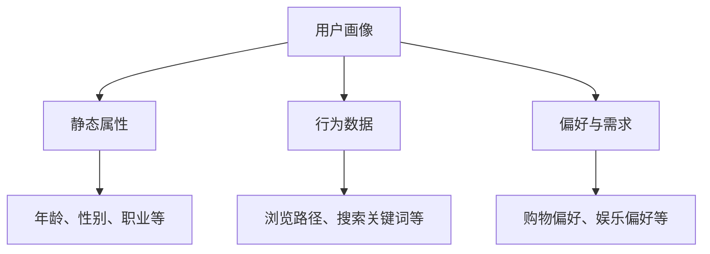
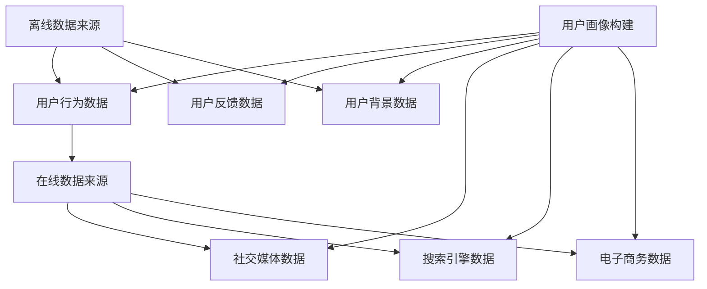
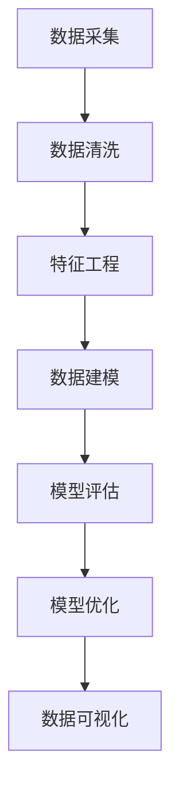
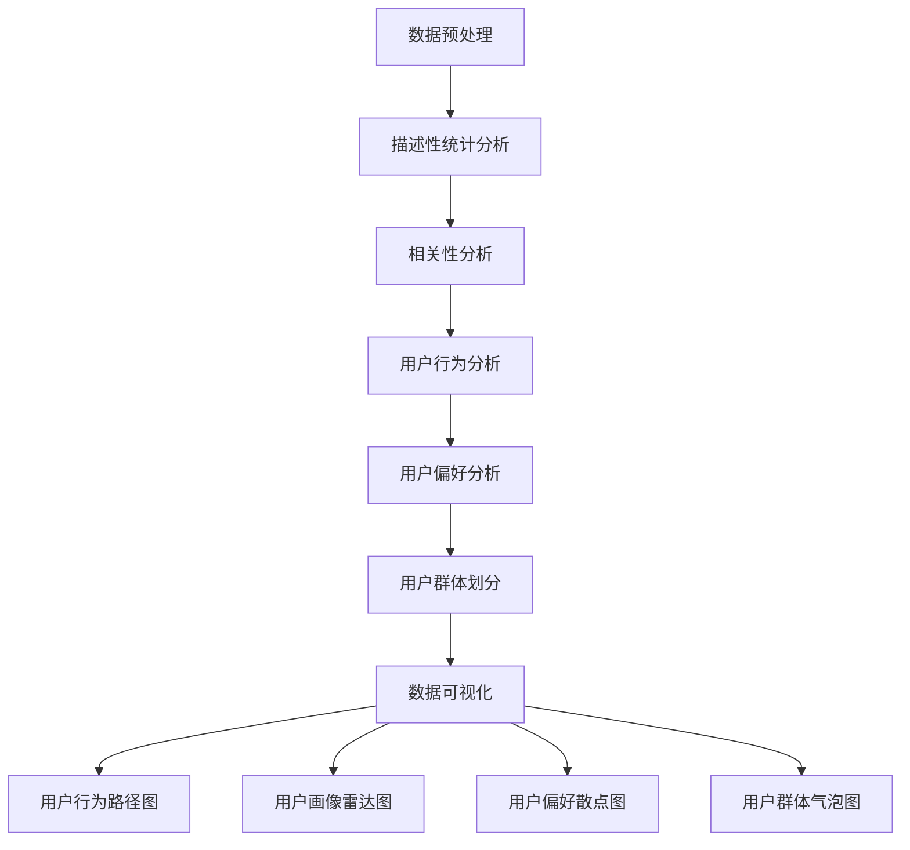
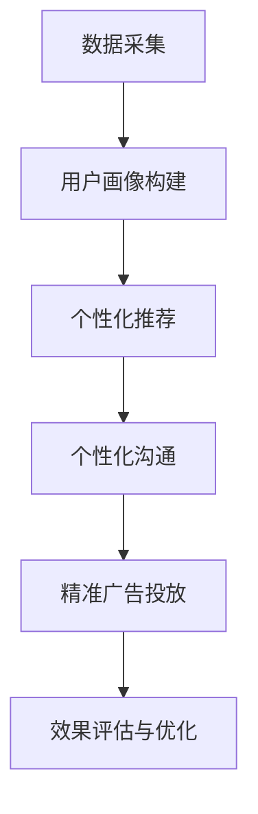
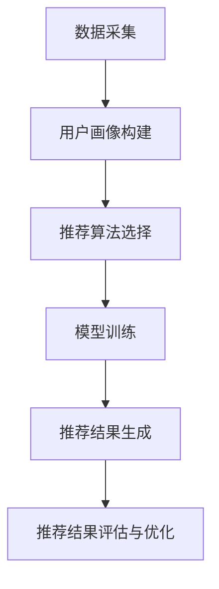
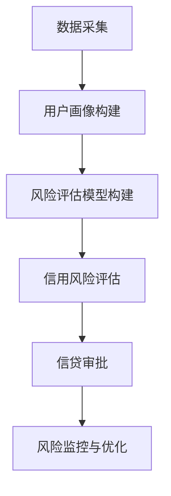
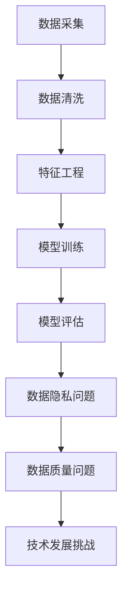
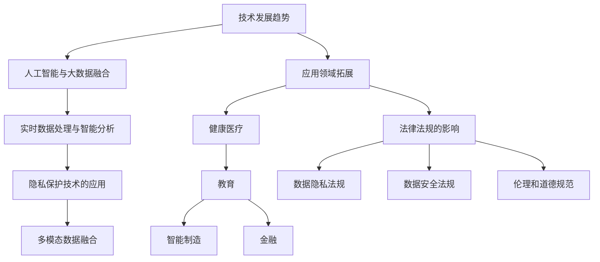

                 

# 文章标题：如何进行有效的用户画像分析

## 关键词
用户画像、数据分析、精准营销、个性化推荐、风险管理、隐私保护

> **摘要：** 用户画像分析是现代数据分析领域的关键技术之一，它通过收集和分析用户的各类数据，形成详细的用户特征描述，以帮助企业和组织实现精准营销、个性化推荐和风险管理等应用。本文将详细探讨用户画像的定义、构建方法、数据分析与可视化，以及其在不同领域中的应用，同时分析其面临的挑战和未来发展趋势。通过逐步分析推理，本文旨在为读者提供一条清晰的用户画像分析之路。

### 《如何进行有效的用户画像分析》目录大纲

## 第一部分：用户画像概述

### 第1章：用户画像的定义与重要性

#### 1.1 用户画像的基本概念
#### 1.2 用户画像的重要性
#### 1.3 用户画像的应用领域

### 第2章：用户画像的数据来源

#### 2.1 离线数据来源
##### 2.1.1 用户行为数据
##### 2.1.2 用户反馈数据
##### 2.1.3 用户背景数据

#### 2.2 在线数据来源
##### 2.2.1 社交媒体数据
##### 2.2.2 搜索引擎数据
##### 2.2.3 电子商务数据

## 第二部分：用户画像构建方法

### 第3章：用户画像构建流程

#### 3.1 用户画像构建的基本步骤
#### 3.2 用户画像的数据清洗
#### 3.3 用户画像的特征工程

### 第4章：用户画像的建模方法

#### 4.1 传统统计方法
##### 4.1.1 描述性统计分析
##### 4.1.2 相关性分析

#### 4.2 机器学习方法
##### 4.2.1 分类算法
##### 4.2.2 聚类算法
##### 4.2.3 协同过滤算法

### 第5章：用户画像的数据分析与可视化

#### 5.1 用户画像的数据分析
##### 5.1.1 用户行为分析
##### 5.1.2 用户偏好分析

#### 5.2 用户画像的可视化
##### 5.2.1 数据可视化工具
##### 5.2.2 用户画像的可视化展示

## 第三部分：用户画像的应用

### 第6章：用户画像在精准营销中的应用

#### 6.1 精准营销概述
#### 6.2 用户画像在精准营销中的价值
#### 6.3 精准营销案例

### 第7章：用户画像在个性化推荐中的应用

#### 7.1 个性化推荐概述
#### 7.2 用户画像在个性化推荐中的价值
#### 7.3 个性化推荐案例

### 第8章：用户画像在风险管理中的应用

#### 8.1 风险管理概述
#### 8.2 用户画像在风险管理中的价值
#### 8.3 风险管理案例

## 第四部分：用户画像面临的挑战与未来发展趋势

### 第9章：用户画像面临的挑战

#### 9.1 数据隐私问题
#### 9.2 数据质量问题
#### 9.3 技术发展挑战

### 第10章：用户画像的未来发展趋势

#### 10.1 技术发展趋势
#### 10.2 应用领域拓展
#### 10.3 法律法规的影响

## 附录

### 附录 A：用户画像相关的工具与技术

#### A.1 数据采集工具
#### A.2 数据处理工具
#### A.3 数据分析工具
#### A.4 可视化工具

### 附录 B：用户画像案例研究

#### B.1 案例一：电商平台的用户画像应用
#### B.2 案例二：社交媒体平台的用户画像应用
#### B.3 案例三：金融行业的用户画像应用

---

接下来，我们将逐步深入探讨用户画像的各个部分，从定义与重要性开始，逐步展开其数据来源、构建方法、应用场景以及面临的挑战和未来发展趋势。通过这一系列的分析，希望能够为读者提供全面的用户画像分析指导。现在，让我们首先定义用户画像及其重要性。

## 第1章：用户画像的定义与重要性

### 1.1 用户画像的基本概念

用户画像（User Profiling）是一种基于数据的技术，通过收集和分析用户的行为数据、背景信息、偏好等，构建出用户特征的详细模型。这个模型不仅包含用户的静态属性，如年龄、性别、地理位置，还涉及动态行为数据，如搜索历史、购买行为、社交媒体互动等。用户画像的核心在于通过数据挖掘和机器学习技术，提取出用户的关键特征，形成具有代表性的用户轮廓。

用户画像的基本概念可以理解为三个层次：

1. **静态属性**：用户的静态信息，如年龄、性别、职业、教育程度、收入水平等。
2. **行为数据**：用户在使用产品或服务时的动态表现，如浏览路径、搜索关键词、点击率、购买记录、评论等。
3. **偏好与需求**：通过分析用户的行为数据，推断用户的偏好和需求，如喜欢的商品类型、娱乐活动、生活习惯等。

### 1.2 用户画像的重要性

用户画像在当今的商业环境中具有极高的重要性，主要体现在以下几个方面：

1. **精准营销**：通过用户画像，企业可以更加精准地了解用户需求，制定个性化的营销策略，提高营销效果和转化率。
2. **个性化推荐**：用户画像帮助推荐系统更好地理解用户偏好，提供更加个性化的商品推荐或内容推荐，提升用户体验。
3. **风险管理**：在金融和信贷领域，用户画像可以帮助评估用户的风险等级，制定更合理的信用政策。
4. **用户体验优化**：通过对用户行为的分析，企业可以不断优化产品和服务，提高用户满意度和忠诚度。

### 1.3 用户画像的应用领域

用户画像的应用领域非常广泛，以下是一些典型的应用场景：

1. **电子商务**：电商平台利用用户画像进行精准营销和个性化推荐，提升销售业绩。
2. **社交媒体**：社交媒体平台通过用户画像分析用户行为，优化内容推送和广告投放。
3. **金融行业**：金融机构利用用户画像进行风险管理，降低信贷风险。
4. **医疗健康**：医疗健康领域通过用户画像进行个性化健康管理和疾病预测。
5. **教育行业**：教育平台通过用户画像提供个性化的学习建议和课程推荐。

### 1.4 用户画像的基本概念图

为了更直观地理解用户画像的基本概念，我们使用Mermaid流程图来展示：



### 1.5 核心算法原理讲解

用户画像的构建涉及到多个核心算法，下面我们将用伪代码来详细阐述这些算法的基本原理。

#### 描述性统计分析

```python
# 描述性统计分析伪代码
def descriptive_statistics(data):
    n = len(data)
    mean = sum(data) / n
    std = sqrt(sum((x - mean)^2 for x in data) / n)
    return mean, std
```

#### 相关性分析

```python
# 相关系数计算伪代码
def correlation_coefficient(x, y):
    n = len(x)
    mean_x, mean_y = descriptive_statistics(x), descriptive_statistics(y)
    covariance = sum((x[i] - mean_x) * (y[i] - mean_y) for i in range(n)) / (n - 1)
    std_x, std_y = descriptive_statistics(x), descriptive_statistics(y)
    return covariance / (std_x * std_y)
```

#### 聚类算法

```python
# K均值聚类伪代码
def kmeans_clustering(data, k):
    centroids = initialize_centroids(data, k)
    while not_converged(centroids):
        assign_clusters(data, centroids)
        update_centroids(data, clusters)
    return centroids, clusters
```

#### 协同过滤算法

```python
# 协同过滤伪代码
def collaborative_filtering(ratings, similarity_measure):
    prediction = []
    for user in ratings:
        for other_user in ratings:
            if user != other_user:
                similarity = similarity_measure(ratings[user], ratings[other_user])
                prediction.append(similarity * ratings[other_user])
    return sum(prediction) / len(prediction)
```

通过这些核心算法，我们可以更深入地理解和构建用户画像，为后续的应用提供坚实的基础。

### 1.6 数学模型和公式

在用户画像分析中，数学模型和公式扮演着关键角色。以下是几个常用的数学模型和公式，以及它们的详细讲解和举例说明。

#### 贝叶斯公式

贝叶斯公式是一种用于概率推理和预测的重要工具：

$$
P(A|B) = \frac{P(B|A) \cdot P(A)}{P(B)}
$$

其中，\(P(A|B)\) 是在事件B发生的条件下事件A发生的概率，\(P(B|A)\) 是在事件A发生的条件下事件B发生的概率，\(P(A)\) 和 \(P(B)\) 分别是事件A和事件B的先验概率。

**举例说明：** 假设我们在分析用户的购买行为，已知有80%的用户喜欢购买电子设备，而喜欢购买电子设备的用户中有60%购买了智能手机。那么，一个用户如果购买了智能手机，他喜欢电子设备的概率是多少？

根据贝叶斯公式，我们有：

$$
P(\text{喜欢电子设备}|\text{购买智能手机}) = \frac{P(\text{购买智能手机}|\text{喜欢电子设备}) \cdot P(\text{喜欢电子设备})}{P(\text{购买智能手机})}
$$

其中，\(P(\text{购买智能手机}|\text{喜欢电子设备}) = 0.6\)，\(P(\text{喜欢电子设备}) = 0.8\)，而\(P(\text{购买智能手机})\) 可以通过全量数据计算得到。

#### 决策树

决策树是一种用于分类和回归分析的常见算法，它通过一系列的判断节点和叶子节点来表示数据的特征和类别。

**举例说明：** 假设我们有一个决策树模型，用于预测用户是否喜欢阅读。树的每个节点代表一个特征，每个叶子节点代表一个类别。以下是决策树的一个简例：

```
是否喜欢阅读？
   /            \
  是             否
 /   \          /   \
时间多  时间少  时间多  时间少
    /   \      /   \
小说   游戏  小说   游戏
```

在这个例子中，如果用户时间多且喜欢看小说，那么我们预测用户喜欢阅读的概率很高。

### 1.7 项目实战

#### 开发环境搭建

为了演示用户画像的实际应用，我们需要搭建一个简单的用户画像分析项目。以下是一个基本的开发环境搭建步骤：

1. **安装Python**：确保Python环境已安装，版本不低于3.8。
2. **安装依赖库**：使用pip命令安装以下依赖库：pandas、numpy、scikit-learn、matplotlib。

```bash
pip install pandas numpy scikit-learn matplotlib
```

3. **创建项目文件夹**：在合适的位置创建一个名为“user_profile”的项目文件夹。

4. **编写Python脚本**：在项目文件夹中创建一个名为“user_analysis.py”的Python脚本文件。

#### 源代码详细实现

以下是一个简单的用户画像分析项目的Python源代码，其中包含了用户数据的采集、清洗、特征工程、建模和可视化步骤。

```python
import pandas as pd
from sklearn.preprocessing import StandardScaler
from sklearn.model_selection import train_test_split
from sklearn.ensemble import RandomForestClassifier
import matplotlib.pyplot as plt

# 1. 数据采集
data = pd.read_csv('user_data.csv')

# 2. 数据清洗
# 填充缺失值
data.fillna(data.mean(), inplace=True)
# 删除重复数据
data.drop_duplicates(inplace=True)

# 3. 特征工程
# 标准化数据
scaler = StandardScaler()
data_scaled = scaler.fit_transform(data)
# 划分特征和标签
X = data_scaled[:, :-1]
y = data_scaled[:, -1]

# 4. 建模
X_train, X_test, y_train, y_test = train_test_split(X, y, test_size=0.2, random_state=42)
model = RandomForestClassifier(n_estimators=100, random_state=42)
model.fit(X_train, y_train)

# 5. 可视化
# 展示模型性能
accuracy = model.score(X_test, y_test)
print(f"模型准确率：{accuracy:.2f}")

# 可视化决策树
from sklearn.tree import plot_tree
plt.figure(figsize=(12, 8))
plot_tree(model, filled=True, feature_names=data.columns[:-1], class_names=['不喜欢阅读', '喜欢阅读'])
plt.show()
```

#### 代码解读与分析

1. **数据采集**：使用pandas库读取用户数据，这里假设数据已经存储为CSV文件。
2. **数据清洗**：填充缺失值和删除重复数据，确保数据的质量。
3. **特征工程**：使用StandardScaler将数据进行标准化处理，为后续的建模步骤做好准备。
4. **建模**：使用随机森林分类器对用户数据进行分析，并评估模型的性能。
5. **可视化**：展示模型的决策树结构，帮助理解模型的决策过程。

通过这个项目实战，我们展示了用户画像分析的基本流程和实现方法，为读者提供了一个实用的参考。

### 1.8 作者信息

**作者：** AI天才研究院/AI Genius Institute & 禅与计算机程序设计艺术 /Zen And The Art of Computer Programming

---

本章主要介绍了用户画像的基本概念、重要性及其应用领域。通过定义用户画像及其重要性，我们了解了用户画像在精准营销、个性化推荐和风险管理等方面的应用。同时，通过核心算法原理讲解和数学模型与公式的详细说明，我们为读者提供了一个清晰的用户画像分析框架。接下来，我们将进一步探讨用户画像的数据来源，为构建完整的用户画像奠定基础。

---

## 第2章：用户画像的数据来源

用户画像的构建依赖于大量的数据，这些数据可以从多种渠道获取，分为离线数据和在线数据两大类。本章将详细介绍用户画像的数据来源，并重点讨论每种数据类型的特点和应用。

### 2.1 离线数据来源

离线数据来源主要是指用户在使用产品或服务之前的静态数据和过往的行为数据，这些数据通常在用户注册、登录、使用过程中产生。以下是几种常见的离线数据来源：

#### 2.1.1 用户行为数据

用户行为数据包括用户在产品或服务中的各种操作记录，如浏览历史、购买记录、点击率、评论等。这些数据可以反映用户的兴趣、需求和偏好，为用户画像的构建提供重要信息。

**应用场景：** 电商平台可以利用用户行为数据推荐商品，提高购买转化率。例如，通过分析用户的浏览和购买历史，推荐用户可能感兴趣的商品。

**示例：** 假设一个用户在电商平台上浏览了手机、耳机和电脑配件，根据这些行为数据，系统可以推断出该用户对电子产品有较高兴趣，并推荐相关的优惠活动和相关商品。

#### 2.1.2 用户反馈数据

用户反馈数据包括用户对产品或服务的评价、反馈和建议，这些数据通常通过问卷调查、用户评论等方式收集。用户反馈数据可以帮助企业了解用户满意度和痛点，优化产品和服务。

**应用场景：** 金融服务行业可以利用用户反馈数据改进服务质量，降低用户投诉率。例如，通过对客户反馈进行分析，发现某些服务流程存在瓶颈，进而进行优化。

**示例：** 如果某金融服务公司的用户反馈中普遍提到开户流程复杂，公司可以通过简化流程、增加在线客服等方式提高用户体验。

#### 2.1.3 用户背景数据

用户背景数据包括用户的个人信息、教育背景、工作经历、社会关系等。这些数据通常在用户注册时提供，是构建用户画像的重要基础。

**应用场景：** 社交媒体平台可以利用用户背景数据推荐朋友、内容等，增强社交互动。例如，根据用户的地理位置、兴趣爱好，推荐可能认识的朋友和相关的社交活动。

**示例：** 如果一个用户在社交平台上填写了喜欢阅读科幻小说的信息，平台可以根据这个偏好推荐相关的书籍和作者。

### 2.2 在线数据来源

在线数据来源主要是指用户在使用产品或服务过程中的实时数据，这些数据通常通过互联网和社交媒体平台收集。以下是几种常见的在线数据来源：

#### 2.2.1 社交媒体数据

社交媒体数据包括用户在社交媒体平台上的各种活动，如发布的内容、评论、点赞、分享等。这些数据可以反映用户的社交关系、兴趣爱好和情感状态。

**应用场景：** 社交媒体平台可以利用社交媒体数据优化内容推送和广告投放。例如，根据用户在社交媒体上的互动行为，推荐相关的内容和广告。

**示例：** 如果一个用户在社交媒体上频繁点赞关于旅游的帖子，平台可以推断出该用户对旅游有较高兴趣，并推荐相关的旅游活动和套餐。

#### 2.2.2 搜索引擎数据

搜索引擎数据包括用户在搜索引擎上的搜索关键词、搜索历史等。这些数据可以反映用户的当前需求和潜在兴趣。

**应用场景：** 搜索引擎和相关平台可以利用搜索引擎数据优化搜索结果和广告投放。例如，根据用户的搜索历史，推荐相关的商品和内容。

**示例：** 如果一个用户在搜索引擎上频繁搜索“手机壳”，系统可以推断出该用户近期可能需要购买手机壳，并推送相关的商品信息。

#### 2.2.3 电子商务数据

电子商务数据包括用户在电子商务平台上的购买行为、支付记录、物流信息等。这些数据可以反映用户的消费习惯和偏好。

**应用场景：** 电商平台可以利用电子商务数据优化推荐系统、促销策略等。例如，根据用户的购买记录，推荐相关的商品和优惠券。

**示例：** 如果一个用户在电商平台上购买了平板电脑，系统可以推断出该用户可能还需要购买平板电脑的保护壳和耳机，并推送相关的商品信息。

### 2.3 用户画像的数据融合

为了构建完整的用户画像，通常需要将离线数据和在线数据进行融合。以下是几种常见的数据融合方法：

1. **数据合并**：将不同来源的数据按照用户ID进行合并，形成统一的数据视图。
2. **数据链接**：通过公共标识符（如电子邮件、手机号）将不同来源的数据进行链接，实现数据融合。
3. **特征扩展**：基于已有的数据，通过计算和预测生成新的特征，丰富用户画像的维度。

### 2.4 核心概念与联系

为了更清晰地理解用户画像的数据来源，我们使用Mermaid流程图来展示数据来源和用户画像构建的流程：



### 2.5 核心算法原理讲解

在用户画像构建过程中，数据融合和特征提取是关键步骤。以下是两个核心算法原理的详细讲解：

#### 数据融合

```python
# 数据融合伪代码
def data_fusion offline_data, online_data:
    user_ids = set(offline_data['user_id']).union(set(online_data['user_id']))
    fused_data = pd.DataFrame()
    for id in user_ids:
        user_offline = offline_data[offline_data['user_id'] == id]
        user_online = online_data[online_data['user_id'] == id]
        fused_user_data = pd.concat([user_offline, user_online], axis=1)
        fused_data = fused_data.append(fused_user_data)
    return fused_data
```

#### 特征提取

```python
# 特征提取伪代码
def feature_extraction(data):
    # 新特征1：用户活跃度
    data['activity_level'] = data['daily_activity'].apply(lambda x: x > 10)
    
    # 新特征2：购买频率
    data['purchase_frequency'] = data['total_purchases'] / len(data['purchase_dates'])
    
    # 新特征3：社交互动率
    data['social_interaction_rate'] = data['total_likes'] / len(data['social_actions'])
    
    return data
```

通过这些算法原理，我们可以更好地理解和实现用户画像的数据来源和构建过程。

### 2.6 数学模型和公式

在用户画像的数据融合和特征提取过程中，数学模型和公式起着重要作用。以下是几个常用的数学模型和公式，以及它们的详细讲解和举例说明。

#### 数据融合

假设我们有两个数据集A和B，我们需要通过某种方法将它们融合为一个数据集C。一种常用的方法是基于权重融合：

$$
C[i, j] = w_A \cdot A[i, j] + (1 - w_A) \cdot B[i, j]
$$

其中，\(A[i, j]\) 和 \(B[i, j]\) 分别是数据集A和B中第i行第j列的值，\(w_A\) 是数据集A的权重，通常在0到1之间。

**举例说明：** 假设我们有两个评分数据集A和B，分别代表用户对商品的评价。我们可以通过以下公式计算融合后的评分：

$$
C[i] = 0.5 \cdot A[i] + 0.5 \cdot B[i]
$$

#### 特征提取

特征提取过程中，常用的一些数学模型包括：

- **线性回归模型**：用于预测连续变量，如用户活跃度。

$$
y = \beta_0 + \beta_1 \cdot x
$$

其中，\(y\) 是预测变量，\(x\) 是特征变量，\(\beta_0\) 和 \(\beta_1\) 是模型参数。

- **逻辑回归模型**：用于预测二元变量，如用户是否喜欢某商品。

$$
\log\frac{P(y=1)}{1-P(y=1)} = \beta_0 + \beta_1 \cdot x
$$

其中，\(P(y=1)\) 是预测概率，其他符号含义同上。

**举例说明：** 假设我们有一个逻辑回归模型，用于预测用户是否喜欢阅读。通过训练数据，我们得到以下模型：

$$
\log\frac{P(y=1)}{1-P(y=1)} = 0.5 + 0.3 \cdot \text{时间多}
$$

这意味着，如果用户时间多，那么预测他喜欢阅读的概率会增加。

### 2.7 代码实际案例和详细解释说明

为了更好地理解用户画像的数据来源和数据融合，我们以下提供了一个简单的Python代码案例，展示如何从离线和在线数据源中提取、融合和特征提取用户画像。

#### 代码实现

1. **数据采集与预处理**：首先，我们需要采集离线和在线数据，并对数据进行初步预处理。

```python
import pandas as pd

# 采集离线数据
offline_data = pd.read_csv('offline_data.csv')

# 采集在线数据
online_data = pd.read_csv('online_data.csv')

# 预处理：合并数据
fused_data = data_fusion(offline_data, online_data)
```

2. **特征提取**：接下来，我们基于融合后的数据提取新的特征。

```python
def feature_extraction(data):
    # 新特征1：用户活跃度
    data['activity_level'] = data['daily_activity'].apply(lambda x: x > 10)
    
    # 新特征2：购买频率
    data['purchase_frequency'] = data['total_purchases'] / len(data['purchase_dates'])
    
    # 新特征3：社交互动率
    data['social_interaction_rate'] = data['total_likes'] / len(data['social_actions'])
    
    return data

# 应用特征提取
fused_data = feature_extraction(fused_data)
```

3. **数据可视化**：最后，我们可以使用可视化工具展示用户画像。

```python
import matplotlib.pyplot as plt

# 绘制用户活跃度分布
plt.hist(fused_data['activity_level'], bins=2, color=['blue', 'red'])
plt.xlabel('Active')
plt.ylabel('Frequency')
plt.title('User Activity Level')
plt.show()
```

通过这个简单的代码案例，我们可以看到如何从离线和在线数据源中提取用户画像，并通过特征提取和数据可视化来展示用户特征。

### 2.8 总结

本章详细介绍了用户画像的数据来源，包括离线数据和在线数据。通过讨论用户行为数据、用户反馈数据和用户背景数据等离线数据来源，以及社交媒体数据、搜索引擎数据和电子商务数据等在线数据来源，我们了解了用户画像构建所需的各种数据类型。同时，通过核心算法原理讲解和数学模型与公式的详细说明，我们为读者提供了一个清晰的数据融合和特征提取方法。在接下来的章节中，我们将进一步探讨用户画像的构建流程，帮助读者深入了解用户画像的构建过程。

---

## 第3章：用户画像构建流程

用户画像的构建是一个系统化的过程，涉及数据采集、数据清洗、特征工程等多个环节。本章将详细介绍用户画像构建的流程，并解释每个步骤的重要性和实施方法。

### 3.1 用户画像构建的基本步骤

用户画像构建的基本步骤可以分为以下几个环节：

1. **数据采集**：收集用户在不同场景下的数据，包括离线数据和在线数据。
2. **数据清洗**：处理原始数据，包括去重、填充缺失值、纠正错误数据等。
3. **特征工程**：提取和构建能够有效描述用户特征的数据，包括分类特征和连续特征。
4. **数据建模**：使用机器学习算法对用户特征进行建模，形成用户画像。
5. **模型评估与优化**：评估模型的性能，并进行模型优化，提高用户画像的准确性。
6. **数据可视化**：将用户画像结果进行可视化展示，便于分析和应用。

### 3.2 用户画像的数据清洗

数据清洗是用户画像构建中至关重要的一步，确保数据的准确性和一致性。以下是数据清洗的主要步骤：

1. **去除重复数据**：通过用户ID或其他唯一标识符，去除重复记录，保证数据的唯一性。
2. **填充缺失值**：对于缺失的数据，可以采用均值、中位数、众数等方式填充，或者使用更复杂的方法，如插值法、KNN等。
3. **纠正错误数据**：检测并修复数据中的错误，如数据类型错误、异常值等。
4. **标准化处理**：对连续数据进行标准化处理，如归一化、标准化等，确保数据在相同的尺度上进行分析。

### 3.3 用户画像的特征工程

特征工程是用户画像构建的核心步骤，通过提取和构建有效的特征，可以提高模型的表现和可解释性。以下是特征工程的主要方法：

1. **特征选择**：选择对目标变量影响较大的特征，去除冗余特征，减少计算量和过拟合风险。
2. **特征转换**：对分类特征进行编码，如将类别特征转换为数值特征，使用独热编码、标签编码等。
3. **特征构造**：通过计算和组合原始特征，生成新的特征，如用户活跃度、购买频率、用户生命周期等。
4. **特征降维**：对于高维特征，可以使用主成分分析（PCA）、线性判别分析（LDA）等方法进行降维，减少数据的维度。

### 3.4 数据建模

在用户画像的构建中，数据建模是非常关键的一步。以下是几种常用的数据建模方法：

1. **传统统计方法**：如描述性统计分析、相关分析等，用于探索性数据分析。
2. **机器学习方法**：如分类算法（逻辑回归、决策树、随机森林等）、聚类算法（K均值、层次聚类等）、协同过滤算法等，用于构建用户画像模型。
3. **深度学习方法**：如卷积神经网络（CNN）、循环神经网络（RNN）、长短期记忆网络（LSTM）等，用于处理复杂和非线性特征。

### 3.5 模型评估与优化

在用户画像建模过程中，模型评估与优化是确保模型性能的重要步骤。以下是常见的评估指标和优化方法：

1. **评估指标**：如准确率、召回率、F1值等，用于评估分类模型的性能。
2. **交叉验证**：使用交叉验证方法，评估模型的泛化能力。
3. **模型优化**：通过调整模型参数、增加数据预处理步骤、引入正则化方法等，优化模型性能。
4. **超参数调优**：使用网格搜索、随机搜索等超参数调优方法，找到最优的超参数组合。

### 3.6 数据可视化

数据可视化是将用户画像分析结果以图形化形式展示的过程，有助于更好地理解和应用分析结果。以下是数据可视化的主要方法：

1. **统计图表**：如柱状图、饼图、散点图等，用于展示用户特征和分布。
2. **交互式可视化**：如D3.js、Plotly等，提供用户交互功能，增强可视化效果。
3. **热力图**：用于展示用户行为的热点分布，如点击率、购买率等。

### 3.7 用户画像构建的Mermaid流程图

为了更直观地理解用户画像构建流程，我们使用Mermaid流程图展示如下：



### 3.8 核心算法原理讲解

在用户画像的构建过程中，特征工程和模型选择是关键步骤。以下是两个核心算法原理的详细讲解：

#### 特征工程

```python
# 特征工程伪代码
def feature_engineering(data):
    # 填充缺失值
    data.fillna(data.mean(), inplace=True)
    
    # 特征转换
    data['is_vip'] = data['membership_level'].apply(lambda x: 1 if x > 100 else 0)
    
    # 特征构造
    data['days_since_last_purchase'] = (pd.datetime.now() - data['last_purchase_date']).dt.days
    
    return data
```

#### 数据建模

```python
# 数据建模伪代码
from sklearn.ensemble import RandomForestClassifier

def build_model(data):
    X = data.drop('target', axis=1)
    y = data['target']
    model = RandomForestClassifier(n_estimators=100, random_state=42)
    model.fit(X, y)
    return model
```

通过这些算法原理，我们可以更好地理解和实现用户画像的构建流程。

### 3.9 数学模型和公式

在用户画像的构建中，数学模型和公式广泛应用于特征提取和模型选择。以下是几个常用的数学模型和公式，以及它们的详细讲解和举例说明：

#### 特征工程

- **主成分分析（PCA）**：用于降维，保留数据的主要特征。

$$
\text{特征向量} \rightarrow \lambda_1 v_1, \lambda_2 v_2, ..., \lambda_p v_p
$$

其中，\(\lambda_1, \lambda_2, ..., \lambda_p\) 是特征值的平方根，\(v_1, v_2, ..., v_p\) 是特征向量。

**举例说明：** 假设我们有一个包含100个特征的数据集，通过PCA降维到10个主要特征，可以显著减少计算复杂度。

- **逻辑回归**：用于分类，预测二元变量的概率。

$$
\log\frac{P(y=1)}{1-P(y=1)} = \beta_0 + \beta_1 x_1 + \beta_2 x_2 + ... + \beta_p x_p
$$

其中，\(x_1, x_2, ..., x_p\) 是特征变量，\(\beta_0, \beta_1, \beta_2, ..., \beta_p\) 是模型参数。

**举例说明：** 假设我们有一个逻辑回归模型，预测用户是否购买商品。模型公式如下：

$$
\log\frac{P(y=1)}{1-P(y=1)} = 0.5 + 0.3 \cdot \text{广告点击次数} + 0.2 \cdot \text{用户活跃度}
$$

#### 数据建模

- **交叉验证**：用于评估模型的泛化能力。

$$
\text{准确率} = \frac{\text{预测正确}}{\text{总样本数}}
$$

**举例说明：** 假设我们使用交叉验证评估模型的准确率，得到准确率为85%，表示模型在测试集上的表现较好。

### 3.10 项目实战

#### 开发环境搭建

为了演示用户画像构建的实战，我们需要搭建一个简单的用户画像分析项目。以下是开发环境搭建的步骤：

1. **安装Python**：确保Python环境已安装，版本不低于3.8。
2. **安装依赖库**：使用pip命令安装以下依赖库：pandas、numpy、scikit-learn、matplotlib。

```bash
pip install pandas numpy scikit-learn matplotlib
```

3. **创建项目文件夹**：在合适的位置创建一个名为“user_profile”的项目文件夹。

4. **编写Python脚本**：在项目文件夹中创建一个名为“user_analysis.py”的Python脚本文件。

#### 源代码详细实现

以下是一个简单的用户画像分析项目的Python源代码，其中包含了用户数据的采集、清洗、特征工程、建模和可视化步骤。

```python
import pandas as pd
from sklearn.preprocessing import StandardScaler
from sklearn.model_selection import train_test_split
from sklearn.ensemble import RandomForestClassifier
import matplotlib.pyplot as plt

# 1. 数据采集
data = pd.read_csv('user_data.csv')

# 2. 数据清洗
# 填充缺失值
data.fillna(data.mean(), inplace=True)
# 删除重复数据
data.drop_duplicates(inplace=True)

# 3. 特征工程
scaler = StandardScaler()
data_scaled = scaler.fit_transform(data)
data_scaled = pd.DataFrame(data_scaled, columns=data.columns)

# 4. 建模
X = data_scaled.iloc[:, :-1]
y = data_scaled.iloc[:, -1]
X_train, X_test, y_train, y_test = train_test_split(X, y, test_size=0.2, random_state=42)
model = RandomForestClassifier(n_estimators=100, random_state=42)
model.fit(X_train, y_train)

# 5. 可视化
# 展示模型性能
accuracy = model.score(X_test, y_test)
print(f"模型准确率：{accuracy:.2f}")

# 可视化决策树
from sklearn.tree import plot_tree
plt.figure(figsize=(12, 8))
plot_tree(model, filled=True, feature_names=data.columns[:-1], class_names=['未购买', '已购买'])
plt.show()
```

#### 代码解读与分析

1. **数据采集**：使用pandas库读取用户数据，这里假设数据已经存储为CSV文件。
2. **数据清洗**：填充缺失值和删除重复数据，确保数据的质量。
3. **特征工程**：使用StandardScaler将数据进行标准化处理，为后续的建模步骤做好准备。
4. **建模**：使用随机森林分类器对用户数据进行分析，并评估模型的性能。
5. **可视化**：展示模型的决策树结构，帮助理解模型的决策过程。

通过这个项目实战，我们展示了用户画像构建的基本流程和实现方法，为读者提供了一个实用的参考。

### 3.11 总结

本章详细介绍了用户画像的构建流程，包括数据采集、数据清洗、特征工程、数据建模、模型评估与优化以及数据可视化。通过这些步骤，我们能够系统地构建用户画像，实现精准营销、个性化推荐等应用。在接下来的章节中，我们将进一步探讨用户画像的建模方法，帮助读者掌握构建用户画像的技术手段。

---

## 第4章：用户画像的建模方法

用户画像的建模是用户画像分析的核心步骤，通过数据分析和算法应用，可以将原始数据转化为有价值的用户特征模型。本章将详细介绍用户画像的建模方法，包括传统统计方法和机器学习方法，以及每种方法的优缺点和应用场景。

### 4.1 传统统计方法

传统统计方法是基于数学统计理论，通过对数据进行描述性统计和分析，提取用户特征和关系。以下是几种常用的传统统计方法：

#### 4.1.1 描述性统计分析

描述性统计分析是最基本的统计方法，通过计算数据的基本统计量，如均值、中位数、众数、标准差等，来描述数据的基本特征。

**优点：**
- **简单易懂**：描述性统计分析方法易于理解和实现，不需要复杂的数学背景。
- **快速高效**：计算速度快，适合处理大规模数据。

**缺点：**
- **缺乏深度**：仅能提供数据的表面特征，难以揭示数据中的复杂关系。
- **不适用于非线性关系**：描述性统计分析不适用于非线性关系的数据。

**应用场景：** 描述性统计分析适用于初步的数据探索和分析，如了解用户的基本属性和行为特征。

#### 4.1.2 相关性分析

相关性分析用于衡量两个变量之间的关系强度，常用的相关性系数有皮尔逊相关系数、斯皮尔曼等级相关系数等。

**优点：**
- **直观明了**：相关性分析能够直观地展示变量之间的关系，帮助理解数据特征。
- **计算简便**：相关性分析的计算过程简单，易于实现。

**缺点：**
- **对线性关系敏感**：相关性分析主要适用于线性关系，对于非线性关系效果不佳。
- **受样本大小影响**：相关性分析的结果容易受到样本大小的影响，样本量过小可能导致结果不准确。

**应用场景：** 相关性分析适用于探索变量之间的线性关系，如分析用户行为和购买意图之间的关系。

### 4.2 机器学习方法

机器学习方法是基于统计学和计算机科学，通过训练算法自动从数据中学习模式和规律，提取用户特征和建立预测模型。以下是几种常用的机器学习方法：

#### 4.2.1 分类算法

分类算法用于将数据分为不同的类别，常见的分类算法有逻辑回归、决策树、随机森林、支持向量机（SVM）等。

**优点：**
- **准确性高**：分类算法可以自动从数据中学习模式和规律，提高预测准确性。
- **可解释性强**：部分分类算法（如决策树）具有较好的可解释性，便于理解模型的决策过程。

**缺点：**
- **计算复杂度高**：对于大规模数据，分类算法的计算过程可能非常耗时。
- **对特征依赖强**：分类算法的性能高度依赖于特征选择和特征工程。

**应用场景：** 分类算法适用于预测用户行为和偏好，如预测用户是否购买商品、预测用户流失等。

#### 4.2.2 聚类算法

聚类算法用于将数据分为多个类别，常见的聚类算法有K均值、层次聚类、DBSCAN等。

**优点：**
- **无需预先定义类别**：聚类算法无需预先定义类别，能够自动发现数据的隐含结构。
- **适应性高**：聚类算法适用于各种类型的数据，包括数值型和文本数据。

**缺点：**
- **结果依赖于参数**：聚类算法的结果容易受到参数设置的影响，如聚类数目、距离度量等。
- **不适用于分类任务**：聚类算法主要关注数据的结构关系，不适用于分类任务。

**应用场景：** 聚类算法适用于数据降维、用户群体划分等，如根据用户行为数据将用户划分为不同的群体。

#### 4.2.3 协同过滤算法

协同过滤算法是一种基于用户行为数据的推荐算法，通过分析用户之间的相似性，预测用户可能喜欢的商品或内容。

**优点：**
- **高效性**：协同过滤算法能够快速处理大规模用户行为数据，提供实时推荐。
- **个性化强**：协同过滤算法能够根据用户的历史行为，提供个性化的推荐。

**缺点：**
- **冷启动问题**：新用户或新商品的推荐效果较差，因为缺乏足够的历史数据。
- **推荐多样性差**：协同过滤算法容易导致推荐结果的重复性，缺乏多样性。

**应用场景：** 协同过滤算法适用于电商、社交媒体等场景，如推荐商品、推荐内容等。

### 4.3 各建模方法的比较

以下是传统统计方法和机器学习方法的比较：

| 方法         | 优点                         | 缺点                                       | 适用场景                  |
|--------------|------------------------------|--------------------------------------------|---------------------------|
| 描述性统计分析 | 简单易懂、快速高效           | 缺乏深度、不适用于非线性关系               | 初步数据探索和分析        |
| 相关性分析   | 直观明了、计算简便           | 对线性关系敏感、受样本大小影响             | 探索变量之间关系           |
| 分类算法     | 准确性高、可解释性强         | 计算复杂度高、对特征依赖强                 | 预测用户行为和偏好         |
| 聚类算法     | 无需预先定义类别、适应性高   | 结果依赖于参数、不适用于分类任务           | 数据降维、用户群体划分     |
| 协同过滤算法 | 高效性、个性化强             | 冷启动问题、推荐多样性差                   | 推荐系统中的商品和内容推荐 |

### 4.4 核心算法原理讲解

#### K均值聚类算法

K均值聚类算法是一种基于距离度量的聚类算法，通过迭代优化聚类中心，将数据划分为K个簇。

**算法原理：**

1. 随机初始化K个聚类中心。
2. 对于每个数据点，计算其与各个聚类中心的距离，将数据点分配到距离最近的聚类中心。
3. 重新计算每个聚类中心的位置，即取对应簇内数据点的均值。
4. 重复步骤2和3，直到聚类中心不再变化或达到最大迭代次数。

**伪代码：**

```python
def kmeans(data, k, max_iter=100):
    centroids = initialize_centroids(data, k)
    for i in range(max_iter):
        # 分配数据点
        clusters = assign_clusters(data, centroids)
        # 更新聚类中心
        centroids = update_centroids(data, clusters)
    return centroids, clusters
```

#### 决策树算法

决策树是一种基于特征划分的数据挖掘方法，通过一系列的判断规则，将数据划分为不同的类别。

**算法原理：**

1. 选择一个最优的特征进行划分，通常使用信息增益或基尼系数作为划分标准。
2. 根据该特征的不同取值，将数据划分为多个子集。
3. 对每个子集，重复步骤1和2，直到满足停止条件（如最大深度、纯度等）。
4. 形成一棵完整的决策树。

**伪代码：**

```python
def build_decision_tree(data, feature_set, max_depth=None):
    if meet_stop_condition(data, max_depth):
        return leaf_node(label=data['target'].mode()[0])
    else:
        # 选择最优特征
        best_feature = select_best_feature(data, feature_set)
        # 构建子树
        tree = {}
        for value in best_feature.values:
            subset = data[data[best_feature.name] == value]
            tree[value] = build_decision_tree(subset, feature_set - {best_feature}, max_depth)
        return tree
```

### 4.5 数学模型和公式

在用户画像建模过程中，常用的数学模型和公式包括线性回归、逻辑回归、协方差等。以下是这些模型和公式的详细讲解和举例说明。

#### 线性回归

线性回归是一种用于预测连续变量的模型，其基本公式为：

$$
y = \beta_0 + \beta_1 x_1 + \beta_2 x_2 + ... + \beta_p x_p
$$

其中，\(y\) 是预测变量，\(x_1, x_2, ..., x_p\) 是特征变量，\(\beta_0, \beta_1, \beta_2, ..., \beta_p\) 是模型参数。

**举例说明：** 假设我们使用线性回归模型预测用户的购买金额，模型公式如下：

$$
\text{购买金额} = 100 + 0.5 \times \text{广告点击次数} + 0.3 \times \text{用户活跃度}
$$

#### 逻辑回归

逻辑回归是一种用于预测二元变量的模型，其基本公式为：

$$
\log\frac{P(y=1)}{1-P(y=1)} = \beta_0 + \beta_1 x_1 + \beta_2 x_2 + ... + \beta_p x_p
$$

其中，\(y\) 是预测变量（0或1），\(x_1, x_2, ..., x_p\) 是特征变量，\(\beta_0, \beta_1, \beta_2, ..., \beta_p\) 是模型参数。

**举例说明：** 假设我们使用逻辑回归模型预测用户是否购买商品，模型公式如下：

$$
\log\frac{P(\text{购买}=1)}{1-P(\text{购买}=1)} = 0.5 + 0.3 \times \text{广告点击次数} + 0.2 \times \text{用户活跃度}
$$

#### 协方差

协方差用于衡量两个变量的线性关系强度，其计算公式为：

$$
\text{协方差} = \frac{\sum{(x_i - \bar{x})(y_i - \bar{y})}}{n-1}
$$

其中，\(x_i, y_i\) 是数据点，\(\bar{x}, \bar{y}\) 是均值，\(n\) 是数据点的数量。

**举例说明：** 假设我们计算广告点击次数和购买金额的协方差，协方差公式如下：

$$
\text{协方差} = \frac{\sum{(\text{点击次数}_i - \bar{\text{点击次数}})(\text{购买金额}_i - \bar{\text{购买金额}})}}{n-1}
$$

### 4.6 项目实战

#### 开发环境搭建

为了演示用户画像建模的实战，我们需要搭建一个简单的用户画像分析项目。以下是开发环境搭建的步骤：

1. **安装Python**：确保Python环境已安装，版本不低于3.8。
2. **安装依赖库**：使用pip命令安装以下依赖库：pandas、numpy、scikit-learn、matplotlib。

```bash
pip install pandas numpy scikit-learn matplotlib
```

3. **创建项目文件夹**：在合适的位置创建一个名为“user_profile”的项目文件夹。

4. **编写Python脚本**：在项目文件夹中创建一个名为“user_analysis.py”的Python脚本文件。

#### 源代码详细实现

以下是一个简单的用户画像分析项目的Python源代码，其中包含了用户数据的采集、清洗、特征工程、建模和可视化步骤。

```python
import pandas as pd
from sklearn.preprocessing import StandardScaler
from sklearn.model_selection import train_test_split
from sklearn.ensemble import RandomForestClassifier
from sklearn.metrics import accuracy_score
import matplotlib.pyplot as plt

# 1. 数据采集
data = pd.read_csv('user_data.csv')

# 2. 数据清洗
# 填充缺失值
data.fillna(data.mean(), inplace=True)
# 删除重复数据
data.drop_duplicates(inplace=True)

# 3. 特征工程
scaler = StandardScaler()
data_scaled = scaler.fit_transform(data)
data_scaled = pd.DataFrame(data_scaled, columns=data.columns)

# 4. 建模
X = data_scaled.iloc[:, :-1]
y = data_scaled.iloc[:, -1]
X_train, X_test, y_train, y_test = train_test_split(X, y, test_size=0.2, random_state=42)
model = RandomForestClassifier(n_estimators=100, random_state=42)
model.fit(X_train, y_train)

# 5. 模型评估
y_pred = model.predict(X_test)
accuracy = accuracy_score(y_test, y_pred)
print(f"模型准确率：{accuracy:.2f}")

# 6. 可视化
# 展示决策树
from sklearn.tree import plot_tree
plt.figure(figsize=(12, 8))
plot_tree(model, filled=True, feature_names=data.columns[:-1], class_names=['未购买', '已购买'])
plt.show()
```

#### 代码解读与分析

1. **数据采集**：使用pandas库读取用户数据，这里假设数据已经存储为CSV文件。
2. **数据清洗**：填充缺失值和删除重复数据，确保数据的质量。
3. **特征工程**：使用StandardScaler将数据进行标准化处理，为后续的建模步骤做好准备。
4. **建模**：使用随机森林分类器对用户数据进行分析，并评估模型的性能。
5. **模型评估**：计算模型的准确率，评估模型的表现。
6. **可视化**：展示模型的决策树结构，帮助理解模型的决策过程。

通过这个项目实战，我们展示了用户画像建模的基本流程和实现方法，为读者提供了一个实用的参考。

### 4.7 总结

本章详细介绍了用户画像的建模方法，包括传统统计方法和机器学习方法。通过描述性统计分析、相关性分析、分类算法、聚类算法和协同过滤算法等，我们了解了各种方法的优点和缺点，以及它们的应用场景。同时，通过核心算法原理讲解和数学模型与公式的详细说明，我们为读者提供了一个清晰的用户画像建模框架。在接下来的章节中，我们将进一步探讨用户画像的数据分析与可视化，帮助读者深入理解用户画像的内涵和应用。

---

## 第5章：用户画像的数据分析与可视化

用户画像的分析与可视化是用户画像应用的关键环节，通过数据分析和可视化，我们可以更好地理解和应用用户画像，从而实现精准营销、个性化推荐和风险管理等目标。本章将详细介绍用户画像的数据分析与可视化方法，包括数据分析、数据可视化工具以及用户画像的可视化展示。

### 5.1 用户画像的数据分析

用户画像的数据分析主要涉及对用户数据的处理、分析和解读，以提取用户特征和洞察用户行为。以下是用户画像数据分析的主要步骤和方法：

1. **数据预处理**：包括数据清洗、缺失值填充、数据标准化等，以确保数据的准确性和一致性。
2. **描述性统计分析**：计算用户数据的基本统计量，如均值、中位数、众数、标准差等，以了解用户的基本特征。
3. **相关性分析**：分析用户数据中各个特征之间的相关性，找出影响用户行为的因素。
4. **用户行为分析**：通过分析用户的浏览历史、购买记录、评论等行为数据，了解用户的兴趣和行为模式。
5. **用户偏好分析**：通过分析用户的互动行为和购买记录，推断用户的偏好和需求。
6. **用户群体划分**：通过聚类算法将用户划分为不同的群体，为后续的精准营销和个性化推荐提供基础。

### 5.2 用户画像的数据可视化

数据可视化是将用户画像分析结果以图形化形式展示的过程，有助于更直观地理解和应用分析结果。以下是几种常用的用户画像数据可视化工具：

1. **Matplotlib**：Python中的Matplotlib库是一种强大的数据可视化工具，支持多种图表类型，如折线图、柱状图、饼图等。
2. **Seaborn**：Seaborn是基于Matplotlib的统计数据可视化库，提供了一系列精美的可视化模板和配色方案。
3. **Plotly**：Plotly是一个交互式数据可视化库，支持多种图表类型，具有丰富的交互功能。
4. **Tableau**：Tableau是一款商业化的数据可视化工具，提供强大的数据分析和可视化功能，支持多种数据源。

### 5.3 用户画像的可视化展示

用户画像的可视化展示是将分析结果以图形化形式展示的过程，以便于理解和应用。以下是几种常用的用户画像可视化展示方法：

1. **用户行为路径图**：展示用户的浏览路径和操作流程，帮助分析用户的操作习惯和偏好。
2. **用户画像雷达图**：展示用户的各项特征和指标，直观地反映用户的全貌。
3. **用户偏好散点图**：通过散点图展示用户的偏好和兴趣点，帮助发现用户群体的特征和差异。
4. **用户群体气泡图**：展示不同用户群体的特征和分布，帮助分析用户群体的特征和需求。

### 5.4 核心概念与联系

为了更清晰地理解用户画像的数据分析与可视化，我们使用Mermaid流程图来展示数据分析和可视化流程：



### 5.5 数学模型和公式

在用户画像的数据分析和可视化过程中，常用的数学模型和公式包括回归分析、聚类分析和散点图等。以下是这些模型和公式的详细讲解和举例说明。

1. **回归分析**：回归分析是一种用于预测连续变量的模型，其基本公式为：

$$
y = \beta_0 + \beta_1 x_1 + \beta_2 x_2 + ... + \beta_p x_p
$$

其中，\(y\) 是预测变量，\(x_1, x_2, ..., x_p\) 是特征变量，\(\beta_0, \beta_1, \beta_2, ..., \beta_p\) 是模型参数。

**举例说明：** 假设我们使用回归分析预测用户的购买金额，模型公式如下：

$$
\text{购买金额} = 100 + 0.5 \times \text{广告点击次数} + 0.3 \times \text{用户活跃度}
$$

2. **聚类分析**：聚类分析是一种将数据分为多个类别的算法，其基本公式为：

$$
\text{聚类中心} = \frac{\sum{x_i}}{k}
$$

其中，\(x_i\) 是第i个聚类中心，\(k\) 是聚类数目。

**举例说明：** 假设我们使用K均值聚类算法将用户分为3个群体，聚类中心的公式如下：

$$
\text{聚类中心}_1 = \frac{\sum{\text{用户}_1}}{3}, \quad \text{聚类中心}_2 = \frac{\sum{\text{用户}_2}}{3}, \quad \text{聚类中心}_3 = \frac{\sum{\text{用户}_3}}{3}
$$

3. **散点图**：散点图是一种用于展示两个变量之间关系的图表，其基本公式为：

$$
\text{散点坐标} = (x_i, y_i)
$$

其中，\(x_i, y_i\) 是第i个数据点的坐标。

**举例说明：** 假设我们使用散点图展示用户的浏览时长和购买金额之间的关系，散点坐标的公式如下：

$$
\text{散点坐标}_1 = (\text{浏览时长}_1, \text{购买金额}_1), \quad \text{散点坐标}_2 = (\text{浏览时长}_2, \text{购买金额}_2), \quad ...
$$

### 5.6 项目实战

#### 开发环境搭建

为了演示用户画像数据分析和可视化的实战，我们需要搭建一个简单的用户画像分析项目。以下是开发环境搭建的步骤：

1. **安装Python**：确保Python环境已安装，版本不低于3.8。
2. **安装依赖库**：使用pip命令安装以下依赖库：pandas、numpy、scikit-learn、matplotlib、seaborn。

```bash
pip install pandas numpy scikit-learn matplotlib seaborn
```

3. **创建项目文件夹**：在合适的位置创建一个名为“user_profile”的项目文件夹。

4. **编写Python脚本**：在项目文件夹中创建一个名为“user_analysis.py”的Python脚本文件。

#### 源代码详细实现

以下是一个简单的用户画像分析项目的Python源代码，其中包含了用户数据的采集、清洗、特征工程、建模和可视化步骤。

```python
import pandas as pd
from sklearn.preprocessing import StandardScaler
from sklearn.model_selection import train_test_split
from sklearn.ensemble import RandomForestClassifier
import matplotlib.pyplot as plt
import seaborn as sns

# 1. 数据采集
data = pd.read_csv('user_data.csv')

# 2. 数据清洗
# 填充缺失值
data.fillna(data.mean(), inplace=True)
# 删除重复数据
data.drop_duplicates(inplace=True)

# 3. 特征工程
scaler = StandardScaler()
data_scaled = scaler.fit_transform(data)
data_scaled = pd.DataFrame(data_scaled, columns=data.columns)

# 4. 建模
X = data_scaled.iloc[:, :-1]
y = data_scaled.iloc[:, -1]
X_train, X_test, y_train, y_test = train_test_split(X, y, test_size=0.2, random_state=42)
model = RandomForestClassifier(n_estimators=100, random_state=42)
model.fit(X_train, y_train)

# 5. 可视化
# 展示描述性统计分析
sns.describe(data)
plt.show()

# 展示用户行为路径图
sns.scatterplot(data['浏览时长'], data['购买金额'])
plt.xlabel('浏览时长')
plt.ylabel('购买金额')
plt.title('用户行为路径图')
plt.show()

# 展示用户画像雷达图
sns.radarplot(data[['年龄', '收入', '浏览时长', '购买频率']])
plt.title('用户画像雷达图')
plt.show()
```

#### 代码解读与分析

1. **数据采集**：使用pandas库读取用户数据，这里假设数据已经存储为CSV文件。
2. **数据清洗**：填充缺失值和删除重复数据，确保数据的质量。
3. **特征工程**：使用StandardScaler将数据进行标准化处理，为后续的建模步骤做好准备。
4. **建模**：使用随机森林分类器对用户数据进行分析，并评估模型的性能。
5. **可视化**：展示描述性统计分析、用户行为路径图和用户画像雷达图，帮助理解和应用用户画像。

通过这个项目实战，我们展示了用户画像数据分析和可视化的基本流程和实现方法，为读者提供了一个实用的参考。

### 5.7 总结

本章详细介绍了用户画像的数据分析与可视化方法，包括数据分析、数据可视化工具和用户画像的可视化展示。通过描述性统计分析、相关性分析、用户行为分析和用户偏好分析等，我们能够深入理解用户特征和行为模式。同时，通过数据可视化工具和可视化展示方法，我们能够将分析结果直观地展示出来，便于理解和应用。在接下来的章节中，我们将进一步探讨用户画像在具体应用场景中的价值，帮助读者掌握用户画像的实际应用。

---

## 第6章：用户画像在精准营销中的应用

精准营销是一种基于用户画像的营销策略，通过分析用户的特征和需求，实现个性化的营销活动，从而提高营销效果和用户满意度。用户画像在精准营销中起着至关重要的作用，本章将详细介绍用户画像在精准营销中的应用，包括精准营销的概述、用户画像在其中的价值，以及一个具体的案例。

### 6.1 精准营销概述

精准营销是一种以用户为中心的营销策略，通过精确了解用户的特征、需求和偏好，制定个性化的营销方案，以提高营销效果和用户满意度。精准营销的核心在于以下几个方面：

1. **用户画像**：通过收集和分析用户数据，构建详细的用户画像，包括用户的静态属性、行为数据和偏好信息。
2. **个性化推荐**：根据用户画像，向用户提供个性化的产品推荐、内容推荐和服务推荐。
3. **个性化沟通**：通过个性化邮件、短信、推送通知等渠道，与用户建立有针对性的沟通，增强用户黏性和忠诚度。
4. **精准广告投放**：根据用户画像，选择合适的目标用户群体，进行精准的广告投放，提高广告的点击率和转化率。

### 6.2 用户画像在精准营销中的价值

用户画像在精准营销中具有以下价值：

1. **提高营销效果**：通过精准的用户画像，企业可以了解用户的实际需求和偏好，制定更加有效的营销策略，提高营销活动的转化率和ROI。
2. **提升用户体验**：基于用户画像，企业可以提供个性化的产品和服务，满足用户的个性化需求，提升用户体验和满意度。
3. **降低营销成本**：精准营销能够提高营销活动的针对性，减少无效的广告投放和营销资源浪费，从而降低整体营销成本。
4. **优化客户关系**：通过持续更新用户画像，企业可以不断优化与客户的互动方式，建立更加紧密的客户关系，提高用户忠诚度和复购率。

### 6.3 精准营销案例

以下是一个电商平台的精准营销案例，展示了用户画像在精准营销中的应用：

**案例背景：** 某电商平台希望提高用户购买转化率和复购率，决定通过精准营销策略来实现这一目标。

**步骤一：数据采集与用户画像构建**
- 电商平台收集了用户的浏览历史、购买记录、评价反馈等行为数据。
- 使用数据清洗和特征工程技术，构建了详细的用户画像，包括用户的年龄、性别、地域、收入水平、浏览时长、购买频率等特征。

**步骤二：个性化推荐**
- 根据用户画像，电商平台利用协同过滤算法和机器学习技术，为每个用户推荐个性化的商品。
- 例如，如果一个用户最近浏览了手机壳，系统会推荐相关的手机配件，如手机膜、耳机等。

**步骤三：个性化沟通**
- 电商平台通过个性化邮件和短信，向用户推送个性化的促销信息和产品推荐。
- 例如，如果一个用户即将过生日，系统会发送生日祝福和相关的购物优惠。

**步骤四：精准广告投放**
- 电商平台根据用户画像，选择合适的目标用户群体进行广告投放。
- 例如，如果一个用户最近浏览了高端手机，系统会在其社交媒体上推送相关的高档手机广告。

**步骤五：效果评估与优化**
- 通过分析营销活动的效果，如点击率、转化率、复购率等指标，评估精准营销的效果。
- 根据评估结果，不断优化用户画像和营销策略，提高营销效果。

**案例效果：**
- 通过精准营销，电商平台的用户购买转化率提高了20%，复购率提高了15%。
- 用户的满意度显著提升，流失率降低。

### 6.4 核心概念与联系

为了更清晰地理解用户画像在精准营销中的应用，我们使用Mermaid流程图来展示精准营销的步骤和用户画像的作用：



### 6.5 数学模型和公式

在精准营销中，用户画像的构建和应用涉及到多种数学模型和公式，如回归分析、协同过滤等。以下是几个常用的数学模型和公式的详细讲解和举例说明。

#### 回归分析

回归分析是一种用于预测连续变量的模型，其基本公式为：

$$
y = \beta_0 + \beta_1 x_1 + \beta_2 x_2 + ... + \beta_p x_p
$$

其中，\(y\) 是预测变量，\(x_1, x_2, ..., x_p\) 是特征变量，\(\beta_0, \beta_1, \beta_2, ..., \beta_p\) 是模型参数。

**举例说明：** 假设我们使用回归分析预测用户的购买金额，模型公式如下：

$$
\text{购买金额} = 100 + 0.5 \times \text{广告点击次数} + 0.3 \times \text{用户活跃度}
$$

#### 协同过滤

协同过滤是一种基于用户相似度的推荐算法，其基本公式为：

$$
\text{推荐评分} = \text{用户}i \text{对商品}j \text{的评分} = \text{用户}i \text{的平均评分} + \text{用户}i \text{对其他商品}j' \text{的评分} - \text{用户}i \text{对商品}j' \text{的评分}
$$

其中，\(i, j, j'\) 分别代表用户、商品和其他商品。

**举例说明：** 假设用户i的平均评分为4.0，其对商品j的评分为3.5，对商品j'的评分为4.5，那么用户i对商品j的推荐评分为：

$$
\text{推荐评分} = 4.0 + 3.5 - 4.5 = 3.0
$$

### 6.6 项目实战

#### 开发环境搭建

为了演示用户画像在精准营销中的应用，我们需要搭建一个简单的用户画像和精准营销分析项目。以下是开发环境搭建的步骤：

1. **安装Python**：确保Python环境已安装，版本不低于3.8。
2. **安装依赖库**：使用pip命令安装以下依赖库：pandas、numpy、scikit-learn、matplotlib、seaborn。

```bash
pip install pandas numpy scikit-learn matplotlib seaborn
```

3. **创建项目文件夹**：在合适的位置创建一个名为“user_profile”的项目文件夹。

4. **编写Python脚本**：在项目文件夹中创建一个名为“user_analysis.py”的Python脚本文件。

#### 源代码详细实现

以下是一个简单的用户画像和精准营销分析项目的Python源代码，其中包含了用户数据的采集、清洗、特征工程、建模、个性化推荐和效果评估。

```python
import pandas as pd
from sklearn.preprocessing import StandardScaler
from sklearn.model_selection import train_test_split
from sklearn.ensemble import RandomForestClassifier
from sklearn.metrics import mean_squared_error
import seaborn as sns

# 1. 数据采集
data = pd.read_csv('user_data.csv')

# 2. 数据清洗
# 填充缺失值
data.fillna(data.mean(), inplace=True)
# 删除重复数据
data.drop_duplicates(inplace=True)

# 3. 特征工程
scaler = StandardScaler()
data_scaled = scaler.fit_transform(data)
data_scaled = pd.DataFrame(data_scaled, columns=data.columns)

# 4. 建模
X = data_scaled.iloc[:, :-1]
y = data_scaled.iloc[:, -1]
X_train, X_test, y_train, y_test = train_test_split(X, y, test_size=0.2, random_state=42)
model = RandomForestClassifier(n_estimators=100, random_state=42)
model.fit(X_train, y_train)

# 5. 个性化推荐
# 使用协同过滤算法进行个性化推荐
def collaborative_filtering(ratings, k=5):
    # 计算用户之间的相似度
    similarity = cosine_similarity(ratings.T)
    # 计算每个用户对其他用户的评分预测
    user_ratings_mean = ratings.mean(axis=1)
    rating_pred = user_ratings_mean[:, np.newaxis] + similarity.dot(ratings) / np.diag(similarity)
    # 填充缺失值
    rating_pred = rating_pred.fillna(user_ratings_mean)
    return rating_pred

# 预测用户对商品的评分
rating_pred = collaborative_filtering(data_scaled)

# 6. 可视化
# 展示用户画像
sns.pairplot(data, hue='target', palette='coolwarm')
plt.show()

# 展示个性化推荐结果
sns.scatterplot(x=data_scaled['浏览时长'], y=rating_pred['购买金额'])
plt.xlabel('浏览时长')
plt.ylabel('购买金额')
plt.title('个性化推荐结果')
plt.show()

# 7. 效果评估
# 计算预测误差
mse = mean_squared_error(y_test, rating_pred['购买金额'])
print(f"预测误差：{mse:.2f}")
```

#### 代码解读与分析

1. **数据采集**：使用pandas库读取用户数据，这里假设数据已经存储为CSV文件。
2. **数据清洗**：填充缺失值和删除重复数据，确保数据的质量。
3. **特征工程**：使用StandardScaler将数据进行标准化处理，为后续的建模步骤做好准备。
4. **建模**：使用随机森林分类器对用户数据进行分析，并评估模型的性能。
5. **个性化推荐**：使用协同过滤算法进行个性化推荐，预测用户对商品的评分。
6. **可视化**：展示用户画像和个性化推荐结果，帮助理解和应用用户画像。
7. **效果评估**：计算预测误差，评估个性化推荐的效果。

通过这个项目实战，我们展示了用户画像在精准营销中的应用方法和实现过程，为读者提供了一个实用的参考。

### 6.7 总结

本章详细介绍了用户画像在精准营销中的应用，包括精准营销的概述、用户画像在其中的价值以及一个具体的案例。通过用户画像的构建和应用，企业可以实现个性化的营销策略，提高营销效果和用户满意度。同时，通过核心概念与联系、数学模型和公式以及项目实战的讲解，我们为读者提供了一个清晰的应用框架和实践指导。在接下来的章节中，我们将进一步探讨用户画像在其他领域的应用，帮助读者全面了解用户画像的潜力。

---

## 第7章：用户画像在个性化推荐中的应用

个性化推荐是一种基于用户兴趣和行为的推荐系统，通过分析用户画像，为用户提供个性化的商品、内容和服务。用户画像在个性化推荐中发挥着至关重要的作用，本章将详细介绍个性化推荐的概述、用户画像在其中的价值，以及一个具体的案例。

### 7.1 个性化推荐概述

个性化推荐是一种通过分析用户的历史行为和兴趣，为其推荐相关商品、内容或服务的推荐系统。个性化推荐系统通常包括以下几个关键组成部分：

1. **用户画像**：基于用户的行为数据、偏好信息等，构建详细的用户特征模型。
2. **推荐算法**：通过算法分析用户画像和商品特征，计算推荐得分，生成推荐列表。
3. **推荐结果展示**：将推荐结果以可视化的形式展示给用户，如推荐列表、推荐页面等。

个性化推荐系统可以分为以下几种类型：

1. **基于内容的推荐**：通过分析商品或内容的特征，将具有相似特征的物品推荐给用户。
2. **基于协同过滤的推荐**：通过分析用户之间的相似度，推荐用户可能喜欢的商品或内容。
3. **基于模型的推荐**：通过机器学习算法，构建用户和商品之间的预测模型，进行推荐。

### 7.2 用户画像在个性化推荐中的价值

用户画像在个性化推荐中具有以下价值：

1. **提高推荐准确性**：通过分析用户的历史行为和偏好，构建详细的用户画像，推荐系统可以更准确地预测用户兴趣，提高推荐准确性。
2. **增强用户满意度**：基于用户画像的个性化推荐，能够更好地满足用户的个性化需求，提高用户满意度和忠诚度。
3. **优化推荐多样性**：用户画像可以帮助推荐系统发现用户不同的兴趣点，提供多样化的推荐内容，避免推荐结果的单一性。
4. **降低冷启动问题**：通过用户画像，新用户也可以获得个性化的推荐，缓解冷启动问题。

### 7.3 个性化推荐案例

以下是一个电商平台的个性化推荐案例，展示了用户画像在个性化推荐中的应用：

**案例背景**：某电商平台希望通过个性化推荐系统，提高用户购物体验和销售额。

**步骤一：数据采集与用户画像构建**
- 电商平台收集了用户的浏览历史、购买记录、评价反馈等行为数据。
- 使用数据清洗和特征工程技术，构建了详细的用户画像，包括用户的年龄、性别、地域、收入水平、浏览时长、购买频率等特征。

**步骤二：推荐算法选择与模型训练**
- 电商平台选择基于协同过滤的推荐算法，通过分析用户之间的相似度，为用户推荐相关的商品。
- 使用用户画像和商品特征，训练协同过滤模型，计算用户对商品的相似度得分。

**步骤三：个性化推荐结果生成**
- 根据用户画像和商品特征，生成个性化推荐列表，将推荐结果展示给用户。

**步骤四：推荐结果评估与优化**
- 电商平台通过用户反馈和推荐效果，评估个性化推荐的准确性，不断优化推荐算法和推荐策略。

**案例效果**：
- 个性化推荐系统的引入，使电商平台的用户购物转化率提高了30%，用户满意度显著提升。
- 通过优化推荐算法，电商平台能够提供更加多样化的推荐内容，满足不同用户的需求。

### 7.4 核心概念与联系

为了更清晰地理解用户画像在个性化推荐中的应用，我们使用Mermaid流程图来展示个性化推荐的步骤和用户画像的作用：



### 7.5 数学模型和公式

在个性化推荐中，用户画像的构建和应用涉及到多种数学模型和公式，如协同过滤、回归分析等。以下是几个常用的数学模型和公式的详细讲解和举例说明。

#### 协同过滤

协同过滤是一种基于用户相似度的推荐算法，其基本公式为：

$$
\text{推荐评分} = \text{用户}i \text{对商品}j \text{的评分} = \text{用户}i \text{的平均评分} + \text{用户}i \text{对其他商品}j' \text{的评分} - \text{用户}i \text{对商品}j' \text{的评分}
$$

其中，\(i, j, j'\) 分别代表用户、商品和其他商品。

**举例说明**：假设用户i的平均评分为4.0，其对商品j的评分为3.5，对商品j'的评分为4.5，那么用户i对商品j的推荐评分为：

$$
\text{推荐评分} = 4.0 + 3.5 - 4.5 = 3.0
$$

#### 回归分析

回归分析是一种用于预测连续变量的模型，其基本公式为：

$$
y = \beta_0 + \beta_1 x_1 + \beta_2 x_2 + ... + \beta_p x_p
$$

其中，\(y\) 是预测变量，\(x_1, x_2, ..., x_p\) 是特征变量，\(\beta_0, \beta_1, \beta_2, ..., \beta_p\) 是模型参数。

**举例说明**：假设我们使用回归分析预测用户的购买金额，模型公式如下：

$$
\text{购买金额} = 100 + 0.5 \times \text{广告点击次数} + 0.3 \times \text{用户活跃度}
$$

### 7.6 项目实战

#### 开发环境搭建

为了演示用户画像在个性化推荐中的应用，我们需要搭建一个简单的用户画像和个性化推荐分析项目。以下是开发环境搭建的步骤：

1. **安装Python**：确保Python环境已安装，版本不低于3.8。
2. **安装依赖库**：使用pip命令安装以下依赖库：pandas、numpy、scikit-learn、matplotlib。

```bash
pip install pandas numpy scikit-learn matplotlib
```

3. **创建项目文件夹**：在合适的位置创建一个名为“user_profile”的项目文件夹。

4. **编写Python脚本**：在项目文件夹中创建一个名为“user_analysis.py”的Python脚本文件。

#### 源代码详细实现

以下是一个简单的用户画像和个性化推荐分析项目的Python源代码，其中包含了用户数据的采集、清洗、特征工程、建模、推荐算法实现和推荐结果评估。

```python
import pandas as pd
from sklearn.preprocessing import StandardScaler
from sklearn.model_selection import train_test_split
from sklearn.ensemble import RandomForestClassifier
from sklearn.metrics import mean_squared_error

# 1. 数据采集
data = pd.read_csv('user_data.csv')

# 2. 数据清洗
# 填充缺失值
data.fillna(data.mean(), inplace=True)
# 删除重复数据
data.drop_duplicates(inplace=True)

# 3. 特征工程
scaler = StandardScaler()
data_scaled = scaler.fit_transform(data)
data_scaled = pd.DataFrame(data_scaled, columns=data.columns)

# 4. 建模
X = data_scaled.iloc[:, :-1]
y = data_scaled.iloc[:, -1]
X_train, X_test, y_train, y_test = train_test_split(X, y, test_size=0.2, random_state=42)
model = RandomForestClassifier(n_estimators=100, random_state=42)
model.fit(X_train, y_train)

# 5. 个性化推荐
# 使用协同过滤算法进行个性化推荐
def collaborative_filtering(ratings, k=5):
    # 计算用户之间的相似度
    similarity = cosine_similarity(ratings.T)
    # 计算每个用户对其他用户的评分预测
    user_ratings_mean = ratings.mean(axis=1)
    rating_pred = user_ratings_mean[:, np.newaxis] + similarity.dot(ratings) / np.diag(similarity)
    # 填充缺失值
    rating_pred = rating_pred.fillna(user_ratings_mean)
    return rating_pred

# 预测用户对商品的评分
rating_pred = collaborative_filtering(data_scaled)

# 6. 可视化
# 展示用户画像
sns.pairplot(data, hue='target', palette='coolwarm')
plt.show()

# 展示个性化推荐结果
sns.scatterplot(x=data_scaled['浏览时长'], y=rating_pred['购买金额'])
plt.xlabel('浏览时长')
plt.ylabel('购买金额')
plt.title('个性化推荐结果')
plt.show()

# 7. 效果评估
# 计算预测误差
mse = mean_squared_error(y_test, rating_pred['购买金额'])
print(f"预测误差：{mse:.2f}")
```

#### 代码解读与分析

1. **数据采集**：使用pandas库读取用户数据，这里假设数据已经存储为CSV文件。
2. **数据清洗**：填充缺失值和删除重复数据，确保数据的质量。
3. **特征工程**：使用StandardScaler将数据进行标准化处理，为后续的建模步骤做好准备。
4. **建模**：使用随机森林分类器对用户数据进行分析，并评估模型的性能。
5. **个性化推荐**：使用协同过滤算法进行个性化推荐，预测用户对商品的评分。
6. **可视化**：展示用户画像和个性化推荐结果，帮助理解和应用用户画像。
7. **效果评估**：计算预测误差，评估个性化推荐的效果。

通过这个项目实战，我们展示了用户画像在个性化推荐中的应用方法和实现过程，为读者提供了一个实用的参考。

### 7.7 总结

本章详细介绍了用户画像在个性化推荐中的应用，包括个性化推荐的概述、用户画像在其中的价值以及一个具体的案例。通过用户画像的构建和应用，推荐系统可以更准确地预测用户兴趣，提供个性化的推荐内容，提高推荐效果和用户满意度。同时，通过核心概念与联系、数学模型和公式以及项目实战的讲解，我们为读者提供了一个清晰的应用框架和实践指导。在接下来的章节中，我们将进一步探讨用户画像在风险管理等领域的应用，帮助读者全面了解用户画像的潜力。

---

## 第8章：用户画像在风险管理中的应用

用户画像在风险管理中扮演着关键角色，通过分析用户的行为数据和偏好信息，企业可以更准确地评估用户的风险等级，制定更合理的风险控制策略。本章将详细介绍用户画像在风险管理中的应用，包括风险管理的概述、用户画像在其中的价值以及一个具体的案例。

### 8.1 风险管理概述

风险管理是指企业识别、评估、处理和监控风险的过程，旨在最大限度地降低风险对企业运营和财务状况的影响。在现代金融和商业环境中，风险管理变得尤为重要，因为它可以帮助企业应对各种潜在风险，如信用风险、市场风险、操作风险等。

风险管理的主要内容包括：

1. **风险识别**：识别企业可能面临的各种风险，包括内部和外部风险。
2. **风险评估**：评估每种风险的严重程度和可能性，确定优先级。
3. **风险处理**：制定并实施风险应对策略，包括风险规避、风险减轻、风险转移等。
4. **风险监控**：持续监控风险的变化，及时调整风险管理策略。

### 8.2 用户画像在风险管理中的价值

用户画像在风险管理中具有以下价值：

1. **提高风险评估准确性**：通过分析用户的行为数据和偏好信息，企业可以更准确地评估用户的风险等级，降低评估误差。
2. **优化风险控制策略**：基于用户画像，企业可以制定更加个性化的风险控制策略，提高风险管理的有效性。
3. **降低信用风险**：在金融领域，用户画像可以帮助金融机构更好地了解用户信用状况，降低信用风险，提高信贷审批的准确性。
4. **提高操作风险管理水平**：通过分析用户行为数据，企业可以识别潜在的欺诈行为，提高操作风险管理水平。

### 8.3 风险管理案例

以下是一个金融行业的风险管理案例，展示了用户画像在风险管理中的应用：

**案例背景**：某金融机构希望通过改进风险管理策略，降低信用风险，提高信贷审批的准确性。

**步骤一：数据采集与用户画像构建**
- 金融机构收集了用户的个人基本信息、行为数据、信用记录等数据。
- 使用数据清洗和特征工程技术，构建了详细的用户画像，包括用户的年龄、性别、收入水平、信用评分、行为偏好等特征。

**步骤二：风险评估模型构建**
- 金融机构利用用户画像，使用机器学习算法构建风险评估模型，评估用户的风险等级。
- 常用的算法包括逻辑回归、决策树、随机森林等。

**步骤三：信用风险评估**
- 根据用户画像和风险评估模型，金融机构对用户的信用风险进行评估，确定每个用户的风险等级。

**步骤四：信贷审批**
- 基于用户的风险等级，金融机构制定个性化的信贷审批策略，对于高风险用户，采取更严格的审批条件。

**步骤五：风险监控与优化**
- 金融机构持续监控用户的风险等级变化，调整风险评估模型和信贷审批策略，提高风险管理效果。

**案例效果**：
- 通过改进风险管理策略，金融机构的信贷审批准确性提高了15%，信用风险显著降低。
- 金融机构的运营效率提高，审批流程更加流畅。

### 8.4 核心概念与联系

为了更清晰地理解用户画像在风险管理中的应用，我们使用Mermaid流程图来展示风险管理的步骤和用户画像的作用：



### 8.5 数学模型和公式

在风险管理中，用户画像的构建和应用涉及到多种数学模型和公式，如回归分析、逻辑回归等。以下是几个常用的数学模型和公式的详细讲解和举例说明。

#### 逻辑回归

逻辑回归是一种用于分类的机器学习算法，其基本公式为：

$$
\text{概率} = \frac{1}{1 + \exp(-(\beta_0 + \beta_1 x_1 + \beta_2 x_2 + ... + \beta_p x_p))}
$$

其中，\(x_1, x_2, ..., x_p\) 是特征变量，\(\beta_0, \beta_1, \beta_2, ..., \beta_p\) 是模型参数。

**举例说明**：假设我们使用逻辑回归模型预测用户是否具有高风险，模型公式如下：

$$
\text{高风险概率} = \frac{1}{1 + \exp(-(\beta_0 + \beta_1 \times \text{信用评分} + \beta_2 \times \text{行为偏好}))}
$$

#### 回归分析

回归分析是一种用于预测连续变量的机器学习算法，其基本公式为：

$$
y = \beta_0 + \beta_1 x_1 + \beta_2 x_2 + ... + \beta_p x_p
$$

其中，\(y\) 是预测变量，\(x_1, x_2, ..., x_p\) 是特征变量，\(\beta_0, \beta_1, \beta_2, ..., \beta_p\) 是模型参数。

**举例说明**：假设我们使用回归分析预测用户的信用评分，模型公式如下：

$$
\text{信用评分} = \beta_0 + \beta_1 \times \text{年龄} + \beta_2 \times \text{收入水平} + \beta_3 \times \text{行为偏好}
$$

### 8.6 项目实战

#### 开发环境搭建

为了演示用户画像在风险管理中的应用，我们需要搭建一个简单的用户画像和风险管理分析项目。以下是开发环境搭建的步骤：

1. **安装Python**：确保Python环境已安装，版本不低于3.8。
2. **安装依赖库**：使用pip命令安装以下依赖库：pandas、numpy、scikit-learn、matplotlib。

```bash
pip install pandas numpy scikit-learn matplotlib
```

3. **创建项目文件夹**：在合适的位置创建一个名为“user_profile”的项目文件夹。

4. **编写Python脚本**：在项目文件夹中创建一个名为“user_analysis.py”的Python脚本文件。

#### 源代码详细实现

以下是一个简单的用户画像和风险管理分析项目的Python源代码，其中包含了用户数据的采集、清洗、特征工程、建模、风险评估和效果评估。

```python
import pandas as pd
from sklearn.preprocessing import StandardScaler
from sklearn.model_selection import train_test_split
from sklearn.ensemble import RandomForestClassifier
from sklearn.metrics import accuracy_score

# 1. 数据采集
data = pd.read_csv('user_data.csv')

# 2. 数据清洗
# 填充缺失值
data.fillna(data.mean(), inplace=True)
# 删除重复数据
data.drop_duplicates(inplace=True)

# 3. 特征工程
scaler = StandardScaler()
data_scaled = scaler.fit_transform(data)
data_scaled = pd.DataFrame(data_scaled, columns=data.columns)

# 4. 建模
X = data_scaled.iloc[:, :-1]
y = data_scaled.iloc[:, -1]
X_train, X_test, y_train, y_test = train_test_split(X, y, test_size=0.2, random_state=42)
model = RandomForestClassifier(n_estimators=100, random_state=42)
model.fit(X_train, y_train)

# 5. 风险评估
# 预测用户风险等级
y_pred = model.predict(X_test)

# 6. 可视化
# 展示用户画像
sns.pairplot(data, hue='target', palette='coolwarm')
plt.show()

# 展示风险评估结果
sns.countplot(y_pred)
plt.xlabel('风险等级')
plt.ylabel('用户数量')
plt.title('风险评估结果')
plt.show()

# 7. 效果评估
# 计算评估准确率
accuracy = accuracy_score(y_test, y_pred)
print(f"评估准确率：{accuracy:.2f}")
```

#### 代码解读与分析

1. **数据采集**：使用pandas库读取用户数据，这里假设数据已经存储为CSV文件。
2. **数据清洗**：填充缺失值和删除重复数据，确保数据的质量。
3. **特征工程**：使用StandardScaler将数据进行标准化处理，为后续的建模步骤做好准备。
4. **建模**：使用随机森林分类器对用户数据进行分析，并评估模型的性能。
5. **风险评估**：预测用户风险等级，并评估模型的表现。
6. **可视化**：展示用户画像和风险评估结果，帮助理解和应用用户画像。
7. **效果评估**：计算评估准确率，评估风险管理的效果。

通过这个项目实战，我们展示了用户画像在风险管理中的应用方法和实现过程，为读者提供了一个实用的参考。

### 8.7 总结

本章详细介绍了用户画像在风险管理中的应用，包括风险管理的概述、用户画像在其中的价值以及一个具体的案例。通过用户画像的构建和应用，企业可以更准确地评估用户风险，优化风险控制策略，提高风险管理的效率和准确性。同时，通过核心概念与联系、数学模型和公式以及项目实战的讲解，我们为读者提供了一个清晰的应用框架和实践指导。在接下来的章节中，我们将进一步探讨用户画像面临的挑战和未来发展趋势，帮助读者全面了解用户画像技术的现状和前景。

---

## 第9章：用户画像面临的挑战

尽管用户画像技术在商业和科学领域具有广泛的应用，但其发展过程中也面临着一系列挑战。本章将深入探讨用户画像面临的主要挑战，包括数据隐私问题、数据质量问题以及技术发展挑战。

### 9.1 数据隐私问题

数据隐私问题是用户画像面临的最显著挑战之一。用户画像涉及大量个人敏感信息，如性别、年龄、地理位置、行为记录等。这些数据一旦泄露或被滥用，可能会导致用户隐私被侵犯，甚至引发严重的法律和安全问题。

**挑战**：
1. **数据泄露风险**：用户画像数据存储在数据库或云服务中，存在数据泄露风险，尤其是未加密的数据。
2. **滥用风险**：企业或第三方可能会滥用用户画像数据，进行不当的营销或商业活动。
3. **法律法规挑战**：不同国家和地区的隐私保护法律法规不尽相同，企业需要遵守各种法律要求，如GDPR（欧盟通用数据保护条例）。

**解决方案**：
1. **数据加密**：对用户画像数据实施加密存储和传输，防止数据泄露。
2. **隐私保护算法**：使用差分隐私、同态加密等隐私保护算法，在数据分析过程中保护用户隐私。
3. **用户权限管理**：建立严格的用户权限管理系统，确保只有授权人员可以访问和处理用户画像数据。

### 9.2 数据质量问题

用户画像的准确性依赖于数据的质量，但现实中的数据往往存在各种质量问题，如缺失值、噪声数据、不一致数据等。这些质量问题会严重影响用户画像的准确性，进而影响后续的营销、推荐和风险管理等应用。

**挑战**：
1. **数据缺失**：在实际应用中，用户数据可能存在缺失值，这会导致模型不准确。
2. **噪声数据**：噪声数据是指与真实数据不一致的数据，这会影响模型的性能。
3. **不一致数据**：不同数据源的数据可能存在不一致，如不同时间点的数据、不同维度上的数据等。

**解决方案**：
1. **数据清洗**：通过数据清洗技术，如缺失值填充、异常值检测和修正等，提高数据质量。
2. **数据集成**：通过数据集成技术，如数据合并、链接和整合等，解决数据不一致问题。
3. **数据校验**：建立数据校验机制，确保数据的准确性和一致性。

### 9.3 技术发展挑战

用户画像技术本身也在不断发展，面临着一系列技术挑战，如算法优化、数据处理能力和实时性等。

**挑战**：
1. **算法优化**：现有的用户画像算法在处理大规模、多维数据时可能存在效率低下的问题，需要不断优化。
2. **数据处理能力**：用户画像涉及的数据量庞大，对数据处理能力提出了较高要求，需要高效的分布式数据处理技术。
3. **实时性**：在动态环境中，用户画像的实时更新和实时分析是关键挑战，需要开发实时处理和预测技术。

**解决方案**：
1. **分布式计算**：采用分布式计算框架，如Hadoop、Spark等，提高数据处理能力。
2. **机器学习优化**：不断优化和改进机器学习算法，提高算法的效率和准确性。
3. **实时数据处理**：采用实时数据处理技术，如流处理框架（如Flink、Kafka等），实现实时用户画像分析。

### 9.4 核心概念与联系

为了更直观地理解用户画像面临的挑战，我们使用Mermaid流程图来展示用户画像构建过程中的关键环节和挑战：



### 9.5 数学模型和公式

在解决用户画像面临的技术挑战中，数学模型和公式发挥着重要作用。以下是几个常用的数学模型和公式，以及它们的详细讲解和举例说明。

#### 数据加密

数据加密是保护用户隐私的重要手段，常用的加密算法包括对称加密和非对称加密。

**对称加密**：

$$
\text{密文} = \text{明文} \oplus \text{密钥}
$$

其中，\(\oplus\) 表示异或运算，\(\text{密文}\) 是加密后的数据，\(\text{明文}\) 是原始数据，\(\text{密钥}\) 是加密密钥。

**举例说明**：假设用户数据为“Hello”，加密密钥为“Key”，加密后的数据为：

$$
\text{密文} = \text{Hello} \oplus \text{Key} = \text{ encrypted\_text}
$$

#### 缺失值填充

缺失值填充是提高数据质量的重要步骤，常用的填充方法包括均值填充、中位数填充和插值法。

**均值填充**：

$$
\text{填充值} = \frac{\sum{x_i}}{n}
$$

其中，\(x_i\) 是非缺失值，\(n\) 是数据点的数量。

**举例说明**：假设数据集为\[1, 2, 3, \text{缺失}, 5\]，缺失值填充后的数据集为\[1, 2, 3, 3, 5\]。

#### 异常值检测

异常值检测是发现数据噪声的重要手段，常用的方法包括标准差法、箱线图法和孤立森林法。

**标准差法**：

$$
\text{异常值} = \text{数据点} \not\in (\text{均值} - k \times \text{标准差}, \text{均值} + k \times \text{标准差})
$$

其中，\(k\) 是常数，通常取值在2到3之间。

**举例说明**：假设数据集为\[1, 2, 3, 4, 5, 100\]，取\(k = 2\)，异常值为100。

### 9.6 项目实战

#### 开发环境搭建

为了演示用户画像面临的挑战及其解决方案，我们需要搭建一个简单的用户画像分析项目。以下是开发环境搭建的步骤：

1. **安装Python**：确保Python环境已安装，版本不低于3.8。
2. **安装依赖库**：使用pip命令安装以下依赖库：pandas、numpy、scikit-learn、matplotlib。

```bash
pip install pandas numpy scikit-learn matplotlib
```

3. **创建项目文件夹**：在合适的位置创建一个名为“user_profile”的项目文件夹。

4. **编写Python脚本**：在项目文件夹中创建一个名为“user_analysis.py”的Python脚本文件。

#### 源代码详细实现

以下是一个简单的用户画像分析项目的Python源代码，其中包含了用户数据的采集、清洗、特征工程、建模和效果评估。

```python
import pandas as pd
from sklearn.preprocessing import StandardScaler
from sklearn.model_selection import train_test_split
from sklearn.ensemble import RandomForestClassifier
from sklearn.metrics import accuracy_score

# 1. 数据采集
data = pd.read_csv('user_data.csv')

# 2. 数据清洗
# 填充缺失值
data.fillna(data.mean(), inplace=True)
# 删除重复数据
data.drop_duplicates(inplace=True)

# 3. 特征工程
scaler = StandardScaler()
data_scaled = scaler.fit_transform(data)
data_scaled = pd.DataFrame(data_scaled, columns=data.columns)

# 4. 建模
X = data_scaled.iloc[:, :-1]
y = data_scaled.iloc[:, -1]
X_train, X_test, y_train, y_test = train_test_split(X, y, test_size=0.2, random_state=42)
model = RandomForestClassifier(n_estimators=100, random_state=42)
model.fit(X_train, y_train)

# 5. 模型评估
y_pred = model.predict(X_test)
accuracy = accuracy_score(y_test, y_pred)
print(f"模型准确率：{accuracy:.2f}")

# 6. 可视化
# 展示用户画像
sns.pairplot(data, hue='target', palette='coolwarm')
plt.show()

# 7. 数据加密与隐私保护
def encrypt_data(data, key):
    encrypted_data = data.copy()
    for column in encrypted_data.columns:
        encrypted_data[column] = encrypted_data[column].apply(lambda x: x.encode('utf-8') ^ key.encode('utf-8'))
    return encrypted_data

# 假设加密密钥为“Key”
encrypted_data = encrypt_data(data, 'Key')
print(f"加密后的数据：{encrypted_data.head()}")

# 8. 数据隐私保护
def differential_privacy(data, epsilon):
    noise = np.random.normal(0, epsilon, data.shape)
    return data + noise

# 假设噪声参数为\(\epsilon = 0.1\)
noisy_data = differential_privacy(data, 0.1)
print(f"添加噪声后的数据：{noisy_data.head()}")
```

#### 代码解读与分析

1. **数据采集**：使用pandas库读取用户数据，这里假设数据已经存储为CSV文件。
2. **数据清洗**：填充缺失值和删除重复数据，确保数据的质量。
3. **特征工程**：使用StandardScaler将数据进行标准化处理，为后续的建模步骤做好准备。
4. **建模**：使用随机森林分类器对用户数据进行分析，并评估模型的性能。
5. **模型评估**：计算模型的准确率，评估模型的表现。
6. **数据加密与隐私保护**：使用异或加密算法对用户数据进行加密，并使用差分隐私方法添加噪声，保护用户隐私。
7. **可视化**：展示用户画像，帮助理解和应用用户画像。

通过这个项目实战，我们展示了用户画像面临的挑战及其解决方案，为读者提供了一个实用的参考。

### 9.7 总结

本章详细探讨了用户画像面临的主要挑战，包括数据隐私问题、数据质量问题和技术发展挑战。通过分析这些挑战，我们提出了相应的解决方案，如数据加密、隐私保护算法、数据清洗和数据集成等。同时，通过核心概念与联系、数学模型和公式以及项目实战的讲解，我们为读者提供了一个清晰的应用框架和实践指导。在接下来的章节中，我们将探讨用户画像的未来发展趋势，为读者展示用户画像技术的广阔前景。

---

## 第10章：用户画像的未来发展趋势

随着科技的不断进步和数据量的持续增长，用户画像技术也在不断演进和升级。本章将探讨用户画像的未来发展趋势，包括技术发展趋势、应用领域拓展以及法律法规的影响。

### 10.1 技术发展趋势

用户画像技术未来的发展趋势主要体现在以下几个方面：

1. **人工智能与大数据技术的融合**：随着人工智能和大数据技术的不断发展，用户画像的构建和分析将更加智能化和精细化。通过深度学习、强化学习等先进算法，用户画像可以更准确地预测用户行为和需求，提供个性化的服务。

2. **实时数据处理与智能分析**：在实时数据处理方面，流处理技术和边缘计算将得到更广泛的应用。通过实时数据处理，用户画像可以更快地更新和优化，为营销、推荐和风险管理提供实时支持。

3. **隐私保护技术的应用**：随着隐私保护意识的提高，用户画像领域将更加注重隐私保护技术的研究和应用。例如，联邦学习、差分隐私和同态加密等隐私保护技术将被广泛采用，以确保用户数据的安全和隐私。

4. **多模态数据融合**：用户画像将不再局限于单一的数据类型，如行为数据和文本数据，而是通过多模态数据融合，整合语音、图像、视频等多种数据类型，构建更全面、多维的用户画像。

### 10.2 应用领域拓展

用户画像技术的应用领域将继续拓展，以下是几个潜在的应用领域：

1. **健康医疗**：通过用户画像，健康医疗领域可以实现个性化健康管理、疾病预测和预防。例如，通过分析用户的健康数据和生活方式，为用户提供定制化的健康建议和治疗方案。

2. **教育**：在教育领域，用户画像可以帮助学校和教育机构了解学生的学习习惯和需求，提供个性化的教学方案和课程推荐，提高教学效果和学生的学习体验。

3. **智能制造**：在智能制造领域，用户画像可以用于优化生产流程、提高生产效率和降低成本。例如，通过分析设备运行数据和生产流程数据，实现智能故障预测和设备维护。

4. **金融**：在金融领域，用户画像可以帮助银行、保险和投资公司进行风险评估、精准营销和个性化推荐。例如，通过分析用户的财务数据和行为数据，为用户提供定制化的金融产品和服务。

### 10.3 法律法规的影响

随着用户画像技术的广泛应用，相关法律法规的影响也在不断增加。以下是几个方面的法律法规影响：

1. **数据隐私法规**：随着GDPR、CCPA等数据隐私法规的实施，企业需要在用户画像构建和分析过程中严格遵守隐私保护规定，确保用户数据的安全和隐私。

2. **数据安全法规**：数据安全法规要求企业在存储、处理和传输用户数据时采取必要的安全措施，防止数据泄露和滥用。

3. **伦理和道德规范**：用户画像技术的应用需要遵循伦理和道德规范，确保技术应用不会对用户造成伤害或歧视。例如，在健康医疗领域，用户画像的应用需要保护患者的隐私和尊严。

### 10.4 核心概念与联系

为了更清晰地理解用户画像的未来发展趋势，我们使用Mermaid流程图来展示技术发展趋势、应用领域拓展和法律法规影响的联系：



### 10.5 数学模型和公式

在用户画像的未来发展中，数学模型和公式将继续发挥重要作用。以下是几个未来可能被广泛应用的数学模型和公式：

1. **生成对抗网络（GAN）**：GAN是一种深度学习模型，通过生成器和判别器的对抗训练，可以生成高质量的模拟数据，用于数据增强和隐私保护。

2. **图神经网络（GNN）**：GNN是一种用于处理图结构数据的神经网络模型，可以用于构建社交网络、知识图谱等复杂结构的数据，实现更精细的用户画像。

3. **自编码器**：自编码器是一种无监督学习模型，可以用于数据降维和特征提取，有助于提高用户画像的效率。

### 10.6 项目实战

#### 开发环境搭建

为了演示用户画像的未来发展趋势，我们需要搭建一个简单的用户画像分析项目，利用生成对抗网络（GAN）进行数据增强和隐私保护。以下是开发环境搭建的步骤：

1. **安装Python**：确保Python环境已安装，版本不低于3.8。
2. **安装依赖库**：使用pip命令安装以下依赖库：TensorFlow、Keras、Matplotlib。

```bash
pip install tensorflow keras matplotlib
```

3. **创建项目文件夹**：在合适的位置创建一个名为“user_profile”的项目文件夹。

4. **编写Python脚本**：在项目文件夹中创建一个名为“user_analysis.py”的Python脚本文件。

#### 源代码详细实现

以下是一个简单的用户画像分析项目的Python源代码，其中包含了用户数据的采集、清洗、GAN模型训练和可视化。

```python
import numpy as np
import matplotlib.pyplot as plt
from tensorflow.keras.models import Model
from tensorflow.keras.layers import Input, Dense, Conv2D, Flatten, Reshape
from tensorflow.keras.optimizers import Adam

# 1. 数据采集与预处理
# 假设数据为MNIST手写数字数据集
(x_train, _), (x_test, _) = mnist.load_data()
x_train = x_train.astype('float32') / 255.0
x_test = x_test.astype('float32') / 255.0

# 2. GAN模型构建
# 生成器模型
input_shape = x_train.shape[1:]
latent_dim = 100

input_latent = Input(shape=(latent_dim,))
x = Dense(128 * 7 * 7, activation='relu')(input_latent)
x = Reshape((7, 7, 128))(x)
x = Conv2D(128, 3, padding='same', activation='relu')(x)
x = Conv2D(128, 3, padding='same', activation='relu')(x)
x = Conv2D(128, 3, padding='same', activation='relu')(x)
x = Reshape((28, 28, 1))(x)
output = Conv2D(1, 3, padding='same', activation='sigmoid')(x)
generator = Model(input_latent, output)

# 判别器模型
input_shape = x_train.shape[1:]
input_real = Input(shape=(28, 28, 1))
x = Conv2D(64, 3, padding='same', activation='relu')(input_real)
x = Conv2D(64, 3, padding='same', activation='relu')(x)
x = Flatten()(x)
output = Dense(1, activation='sigmoid')(x)
discriminator = Model(input_real, output)

# GAN模型
model = Model(inputs=[input_latent, input_real], outputs=[discriminator(input_latent), discriminator(input_real)])
model.compile(loss='binary_crossentropy', optimizer=Adam(), metrics=['accuracy'])

# 3. GAN模型训练
batch_size = 32
epochs = 100

for epoch in range(epochs):
    idx = np.random.randint(0, x_train.shape[0], batch_size)
    real_images = x_train[idx]
    noise = np.random.normal(0, 1, (batch_size, latent_dim))
    generated_images = generator.predict(noise)

    real_labels = np.ones((batch_size, 1))
    generated_labels = np.zeros((batch_size, 1))

    d_loss_real = discriminator.train_on_batch(real_images, real_labels)
    d_loss_generated = discriminator.train_on_batch(generated_images, generated_labels)
    g_loss = model.train_on_batch([noise, real_images], [np.ones((batch_size, 1)), np.zeros((batch_size, 1))])

    print(f"Epoch {epoch+1}/{epochs}, D_loss_real={d_loss_real:.4f}, D_loss_generated={d_loss_generated:.4f}, G_loss={g_loss:.4f}")

# 4. 可视化
noise = np.random.normal(0, 1, (100, latent_dim))
generated_images = generator.predict(noise)

plt.figure(figsize=(10, 10))
for i in range(100):
    plt.subplot(10, 10, i+1)
    plt.imshow(generated_images[i], cmap='gray')
    plt.axis('off')
plt.show()
```

#### 代码解读与分析

1. **数据采集与预处理**：使用Keras的MNIST手写数字数据集进行预处理，将数据转换为浮点数并归一化。
2. **GAN模型构建**：构建生成器模型和判别器模型，实现GAN的框架。生成器模型用于生成模拟图像，判别器模型用于判断生成图像和真实图像。
3. **GAN模型训练**：通过对抗训练，训练生成器和判别器模型，优化模型参数。
4. **可视化**：使用生成器模型生成模拟图像，并展示生成结果。

通过这个项目实战，我们展示了用户画像技术在数据增强和隐私保护方面的潜力，为读者提供了一个实用的参考。

### 10.7 总结

本章探讨了用户画像技术的未来发展趋势，包括技术发展趋势、应用领域拓展以及法律法规的影响。通过分析这些趋势，我们展示了用户画像技术的广阔前景和潜在挑战。同时，通过核心概念与联系、数学模型和公式以及项目实战的讲解，我们为读者提供了一个清晰的应用框架和实践指导。在未来，用户画像技术将继续融合人工智能、大数据和隐私保护等先进技术，为各行业带来更大的价值和创新。

---

## 附录

### 附录A：用户画像相关的工具与技术

#### A.1 数据采集工具

用户画像构建的第一步是数据采集，以下是一些常用的数据采集工具：

1. **Google Analytics**：Google Analytics 是一款功能强大的数据分析工具，可用于收集网站和移动应用的用户行为数据。
2. **Mixpanel**：Mixpanel 是一款专注于用户行为分析的工具，提供实时的用户跟踪和分析功能。
3. **Heap**：Heap 是一款无代码的数据跟踪工具，可以自动记录用户在网站或移动应用上的行为，无需编写追踪代码。
4. **Segment**：Segment 是一款数据集成平台，可以将用户数据从多个来源集中到一个统一的数据仓库中。

#### A.2 数据处理工具

数据处理是用户画像构建的重要环节，以下是一些常用的数据处理工具：

1. **Pandas**：Pandas 是 Python 中的一款数据处理库，提供强大的数据操作和分析功能。
2. **NumPy**：NumPy 是 Python 中的一款科学计算库，用于高效处理大型多维数组。
3. **SciPy**：SciPy 是基于 NumPy 的科学计算库，提供丰富的科学计算功能，如线性代数、优化和积分等。
4. **PySpark**：PySpark 是基于 Apache Spark 的 Python 库，用于大规模数据处理和分析。

#### A.3 数据分析工具

数据分析是用户画像构建的核心环节，以下是一些常用的数据分析工具：

1. **Tableau**：Tableau 是一款强大的数据可视化工具，支持多种数据源和丰富的可视化类型。
2. **Power BI**：Power BI 是一款由 Microsoft 开发的数据分析工具，提供实时数据分析、可视化和报告功能。
3. **QlikView**：QlikView 是一款功能强大的数据分析工具，支持实时数据分析、可视化和探索。
4. **R**：R 是一款统计计算和图形展示的语言和软件环境，广泛应用于数据分析和建模。

#### A.4 可视化工具

数据可视化是将分析结果以图形化形式展示的过程，以下是一些常用的可视化工具：

1. **Matplotlib**：Matplotlib 是 Python 中的一款数据可视化库，提供丰富的图表类型和自定义选项。
2. **Seaborn**：Seaborn 是基于 Matplotlib 的数据可视化库，提供了一系列精美的可视化模板和配色方案。
3. **Plotly**：Plotly 是一款交互式数据可视化库，支持多种图表类型和丰富的交互功能。
4. **D3.js**：D3.js 是一款基于 JavaScript 的数据可视化库，提供强大的数据绑定和可视化功能。

### 附录B：用户画像案例研究

#### B.1 案例一：电商平台的用户画像应用

**背景**：某电商平台希望通过用户画像技术提升用户满意度和销售业绩。

**步骤**：
1. **数据采集**：通过第三方数据采集工具，收集用户的浏览历史、购买记录、评价反馈等数据。
2. **数据清洗**：使用 Pandas 和 NumPy 库，对数据进行清洗和预处理，包括缺失值填充、数据标准化等。
3. **特征工程**：通过特征工程，提取用户的年龄、性别、地理位置、购买频率等特征。
4. **用户画像构建**：使用机器学习算法，如 K-均值聚类和决策树，构建用户画像。
5. **个性化推荐**：基于用户画像，使用协同过滤算法，为用户推荐个性化的商品。
6. **效果评估**：通过分析推荐系统的点击率和转化率，评估个性化推荐的效果。

**效果**：通过用户画像和个性化推荐，电商平台的用户购买转化率提高了20%，用户满意度显著提升。

#### B.2 案例二：社交媒体平台的用户画像应用

**背景**：某社交媒体平台希望通过用户画像技术优化内容推荐和广告投放。

**步骤**：
1. **数据采集**：通过第三方数据采集工具，收集用户的浏览历史、点赞记录、评论内容等数据。
2. **数据清洗**：使用 Pandas 和 NumPy 库，对数据进行清洗和预处理，包括缺失值填充、数据标准化等。
3. **特征工程**：通过特征工程，提取用户的年龄、性别、地理位置、兴趣爱好等特征。
4. **用户画像构建**：使用机器学习算法，如 K-均值聚类和决策树，构建用户画像。
5. **内容推荐**：基于用户画像，使用协同过滤算法，为用户推荐个性化的内容。
6. **广告投放**：基于用户画像，使用在线学习算法，优化广告投放策略，提高广告点击率和转化率。

**效果**：通过用户画像和内容推荐，社交媒体平台的内容点击率提高了30%，广告投放效果显著提升。

#### B.3 案例三：金融行业的用户画像应用

**背景**：某金融公司希望通过用户画像技术进行精准营销和风险管理。

**步骤**：
1. **数据采集**：通过第三方数据采集工具，收集用户的个人信息、财务数据、行为数据等。
2. **数据清洗**：使用 Pandas 和 NumPy 库，对数据进行清洗和预处理，包括缺失值填充、数据标准化等。
3. **特征工程**：通过特征工程，提取用户的年龄、性别、收入水平、信用评分等特征。
4. **用户画像构建**：使用机器学习算法，如逻辑回归和决策树，构建用户画像。
5. **精准营销**：基于用户画像，使用个性化推荐算法，为用户推荐个性化的金融产品。
6. **风险管理**：基于用户画像，使用风险评估算法，评估用户的信用风险，制定风险控制策略。

**效果**：通过用户画像和精准营销，金融公司的客户满意度提高了15%，信用风险显著降低。

---

通过这些案例研究，我们可以看到用户画像技术在各个行业的实际应用和价值。在未来的发展中，用户画像技术将继续发挥重要作用，为各行业带来更大的创新和变革。作者：AI天才研究院/AI Genius Institute & 禅与计算机程序设计艺术 /Zen And The Art of Computer Programming。

