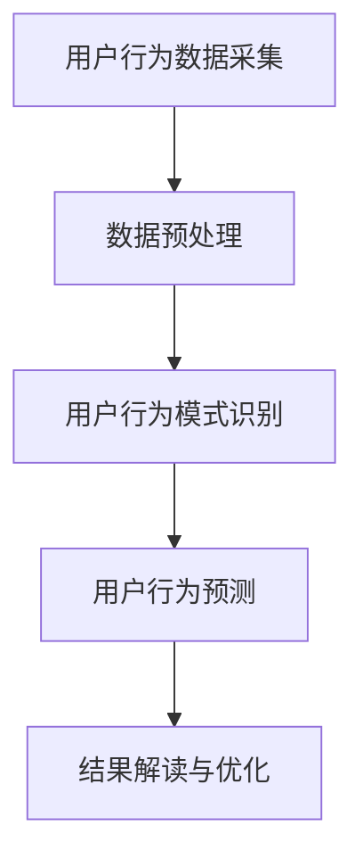
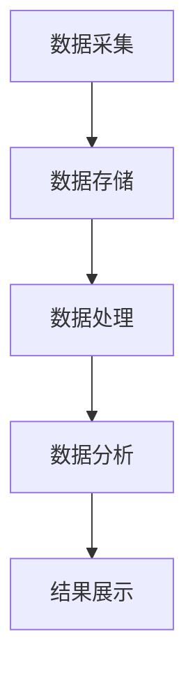

                 

### 《如何进行有效的用户行为分析》

> 关键词：用户行为分析、数据采集、数据处理、机器学习、用户行为模式、用户满意度、用户忠诚度、自然语言处理、实时用户行为分析

> 摘要：用户行为分析是现代商业和信息技术领域的一项核心任务，它通过收集和分析用户在网站、应用和其他数字平台上的行为数据，帮助企业和组织更好地理解用户需求，优化用户体验，提升业务绩效。本文将详细探讨用户行为分析的基础概念、核心算法原理、实践步骤以及前沿动态，并通过实际案例和代码示例，展示如何进行有效的用户行为分析。

### 目录大纲

#### 第一部分：用户行为分析基础

- **1.1 用户行为分析的概念与重要性**
  - **1.1.1 用户行为分析的定义**
  - **1.1.2 用户行为分析的目标**
  - **1.1.3 用户行为分析的应用场景**

- **1.2 用户行为分析的核心概念**
  - **1.2.1 用户行为模式**
  - **1.2.2 用户互动**
  - **1.2.3 用户满意度**
  - **1.2.4 用户忠诚度**

- **1.3 用户行为分析的技术基础**
  - **1.3.1 数据采集技术**
  - **1.3.2 数据处理技术**
  - **1.3.3 数据分析方法**

- **1.4 用户行为分析的实践步骤**
  - **1.4.1 明确分析目的**
  - **1.4.2 数据收集**
  - **1.4.3 数据清洗**
  - **1.4.4 数据分析**
  - **1.4.5 结果解读与行动建议**

- **1.5 用户行为分析中的伦理问题**
  - **1.5.1 用户隐私保护**
  - **1.5.2 数据使用透明度**
  - **1.5.3 避免数据偏见**

#### 第二部分：用户行为分析核心算法原理

- **2.1 机器学习算法在用户行为分析中的应用**
  - **2.1.1 监督学习算法**
    - **2.1.1.1 线性回归**
    - **2.1.1.2 决策树**
    - **2.1.1.3 随机森林**
    - **2.1.1.4 支持向量机**
  - **2.1.2 无监督学习算法**
    - **2.1.2.1 聚类分析**
    - **2.1.2.2 主成分分析**
    - **2.1.2.3 自编码器**

- **2.2 用户行为序列建模**
  - **2.2.1 时间序列分析**
    - **2.2.1.1 自回归模型（AR）**
    - **2.2.1.2 移动平均模型（MA）**
    - **2.2.1.3 自回归移动平均模型（ARMA）**
    - **2.2.1.4 自回归积分滑动平均模型（ARIMA）**
  - **2.2.2 序列模型**
    - **2.2.2.1 隐马尔可夫模型（HMM）**
    - **2.2.2.2 条件随机场（CRF）**
    - **2.2.2.3 循环神经网络（RNN）**
    - **2.2.2.4 长短时记忆网络（LSTM）**
    - **2.2.2.5 门控循环单元（GRU）**

- **2.3 用户行为预测算法**
  - **2.3.1 协同过滤算法**
    - **2.3.1.1 评分预测**
    - **2.3.1.2 项项相似度**
  - **2.3.2 集成学习方法**
    - **2.3.2.1 多层感知机（MLP）**
    - **2.3.2.2 支持向量机（SVM）**
    - **2.3.2.3 决策树（DT）**
    - **2.3.2.4 随机森林（RF）**

- **2.4 用户行为分析中的自然语言处理**
  - **2.4.1 文本预处理**
    - **2.4.1.1 停用词过滤**
    - **2.4.1.2 词干提取**
    - **2.4.1.3 词嵌入技术**
  - **2.4.2 文本分类**
    - **2.4.2.1 朴素贝叶斯**
    - **2.4.2.2 支持向量机（SVM）**
    - **2.4.2.3 随机森林（RF）**
    - **2.4.2.4 深度学习（DNN）**

#### 第三部分：用户行为分析项目实战

- **3.1 用户行为分析项目案例介绍**
  - **3.1.1 案例一：电商平台的用户行为分析**
    - **3.1.1.1 项目背景**
    - **3.1.1.2 数据源与数据收集**
    - **3.1.1.3 数据预处理**
  - **3.1.2 案例二：社交媒体的用户行为分析**
    - **3.1.2.1 项目背景**
    - **3.1.2.2 数据源与数据收集**
    - **3.1.2.3 数据预处理**

- **3.2 代码实战与案例分析**
  - **3.2.1 数据采集与预处理**
    - **3.2.1.1 数据采集代码示例**
    - **3.2.1.2 数据预处理代码示例**
  - **3.2.2 用户行为模式识别**
    - **3.2.2.1 监督学习算法应用**
    - **3.2.2.2 无监督学习算法应用**
  - **3.2.3 用户行为预测**
    - **3.2.3.1 序列模型应用**
    - **3.2.3.2 集成学习方法应用**
  - **3.2.4 用户行为分析结果解读与优化**

- **3.3 用户行为分析系统搭建**
  - **3.3.1 系统架构设计**
    - **3.3.1.1 数据采集模块**
    - **3.3.1.2 数据存储模块**
    - **3.3.1.3 数据处理模块**
    - **3.3.1.4 数据分析模块**
  - **3.3.2 开发环境搭建**
    - **3.3.2.1 数据库搭建**
    - **3.3.2.2 服务器搭建**
    - **3.3.2.3 开发工具选择**

#### 第四部分：用户行为分析前沿动态

- **4.1 用户行为分析新方法与技术**
  - **4.1.1 强化学习方法在用户行为分析中的应用**
  - **4.1.2 生成对抗网络（GAN）在用户行为分析中的应用**

- **4.2 用户行为分析发展趋势**
  - **4.2.1 跨平台用户行为分析**
  - **4.2.2 实时用户行为分析**
  - **4.2.3 深度学习在用户行为分析中的应用**

- **4.3 用户行为分析领域的伦理与隐私问题**
  - **4.3.1 用户隐私保护策略**
  - **4.3.2 数据安全与合规性**
  - **4.3.3 用户行为分析中的伦理挑战**

#### 附录

- **附录 A：用户行为分析工具与资源**
  - **A.1 数据分析工具**
    - **A.1.1 Python数据分析库**
    - **A.1.2 R语言数据分析库**
  - **A.2 机器学习框架**
    - **A.2.1 TensorFlow**
    - **A.2.2 PyTorch**
  - **A.3 用户行为分析平台**
    - **A.3.1 Google Analytics**
    - **A.3.2 Mixpanel**
    - **A.3.3 Segment**

### 用户行为数据采集与分析流程

以下是一个使用Mermaid绘制的用户行为数据采集与分析流程的图：



在这个流程中，首先进行用户行为数据采集，然后对采集到的数据进行预处理，以便后续的分析。预处理完成后，使用机器学习算法进行用户行为模式识别和预测。最后，对预测结果进行解读和优化，以指导实际业务决策。

### 用户行为分析中的数学模型

在用户行为分析中，数学模型是理解和预测用户行为的关键工具。以下是一个预测用户行为的数学模型：

$$
\text{预测用户行为模型} = f(\text{用户特征向量}, \text{历史行为数据})
$$

其中，用户特征向量包含了用户的年龄、性别、地理位置、历史购买记录等信息，历史行为数据是指用户在过去的行为记录。这个模型通过输入用户特征向量和历史行为数据，输出用户在未来可能的行为概率。

### 电商平台的用户行为分析案例

#### 3.1.1 案例一：电商平台的用户行为分析

#### 项目背景

电商平台希望通过分析用户行为，提高用户转化率和客户满意度，从而提升销售业绩。为此，他们决定进行一次全面的用户行为分析项目。

#### 数据源与数据收集

电商平台提供了丰富的用户行为数据，包括用户的浏览历史、搜索记录、购买行为、评价和反馈等。这些数据通过平台内置的日志系统实时收集，并存储在数据库中。

#### 数据预处理

在开始分析之前，需要对数据进行预处理，包括以下步骤：

1. **数据清洗**：去除重复记录、处理缺失值、修正错误数据。
2. **数据转换**：将不同类型的数据（如日期、文本）转换为适合分析的格式。
3. **特征工程**：提取有助于预测用户行为的特征，如用户活跃度、购买频率、浏览时长等。

#### 数据预处理代码示例

```python
import pandas as pd

# 加载数据
data = pd.read_csv('user_behavior_data.csv')

# 数据清洗
data.drop_duplicates(inplace=True)
data.fillna(method='ffill', inplace=True)

# 数据转换
data['date'] = pd.to_datetime(data['date'])
data['day_of_week'] = data['date'].dt.dayofweek

# 特征工程
data['active_days'] = data.groupby('user_id')['date'].nunique()
data['purchase_frequency'] = data.groupby('user_id')['purchase_id'].nunique()

# 数据预处理完成
```

通过以上预处理步骤，数据被清洗和转换成适合分析的格式，并提取了有助于预测用户行为的特征。

#### 用户行为模式识别

在用户行为模式识别阶段，使用机器学习算法来识别用户的购买模式和偏好。以下是一个简单的用户行为模式识别的伪代码：

```python
from sklearn.model_selection import train_test_split
from sklearn.ensemble import RandomForestClassifier

# 划分训练集和测试集
X = data[['active_days', 'purchase_frequency', 'day_of_week']]
y = data['made_purchase']

X_train, X_test, y_train, y_test = train_test_split(X, y, test_size=0.2, random_state=42)

# 训练随机森林分类器
model = RandomForestClassifier(n_estimators=100, random_state=42)
model.fit(X_train, y_train)

# 进行预测
predictions = model.predict(X_test)

# 评估模型性能
accuracy = model.score(X_test, y_test)
print(f"Model Accuracy: {accuracy:.2f}")
```

通过这个简单的例子，我们可以看到如何使用随机森林算法来识别用户是否会在未来购买产品。

#### 用户行为预测

在用户行为预测阶段，我们使用序列模型来预测用户未来的行为。以下是一个简单的用户行为预测的伪代码：

```python
from sklearn.model_selection import train_test_split
from sklearn.ensemble import RandomForestRegressor

# 划分训练集和测试集
X = data[['active_days', 'purchase_frequency', 'day_of_week']]
y = data['days_until_next_purchase']

X_train, X_test, y_train, y_test = train_test_split(X, y, test_size=0.2, random_state=42)

# 训练随机森林回归器
model = RandomForestRegressor(n_estimators=100, random_state=42)
model.fit(X_train, y_train)

# 进行预测
predictions = model.predict(X_test)

# 评估模型性能
mse = mean_squared_error(y_test, predictions)
print(f"Model MSE: {mse:.2f}")
```

在这个例子中，我们使用随机森林回归器来预测用户距离下一次购买的天数。

#### 用户行为分析结果解读与优化

最后，我们需要对用户行为分析的结果进行解读和优化。以下是一个简单的结果解读和优化的伪代码：

```python
import matplotlib.pyplot as plt

# 计算真实值和预测值的误差
errors = y_test - predictions

# 绘制误差分布图
plt.hist(errors, bins=30)
plt.xlabel('Prediction Error')
plt.ylabel('Frequency')
plt.title('Prediction Error Distribution')
plt.show()

# 根据误差分布图，调整模型参数或选择不同的模型
# 例如，如果发现误差主要在负方向，可以尝试增加模型的复杂度
```

通过这个例子，我们可以看到如何根据预测误差来调整模型参数或选择不同的模型，以优化预测性能。

#### 社交媒体的用户行为分析案例

#### 3.1.2 案例二：社交媒体的用户行为分析

#### 项目背景

某社交媒体平台希望通过分析用户行为，提升用户活跃度和用户参与度，从而增加平台的使用时间和用户粘性。为此，他们决定进行一次用户行为分析项目。

#### 数据源与数据收集

社交媒体平台提供了丰富的用户行为数据，包括用户的发帖行为、评论行为、点赞行为、分享行为等。这些数据通过平台内置的日志系统实时收集，并存储在数据库中。

#### 数据预处理

在开始分析之前，需要对数据进行预处理，包括以下步骤：

1. **数据清洗**：去除重复记录、处理缺失值、修正错误数据。
2. **数据转换**：将不同类型的数据（如日期、文本）转换为适合分析的格式。
3. **特征工程**：提取有助于预测用户行为的特征，如用户活跃度、发帖频率、互动频率等。

#### 数据预处理代码示例

```python
import pandas as pd

# 加载数据
data = pd.read_csv('user_behavior_data.csv')

# 数据清洗
data.drop_duplicates(inplace=True)
data.fillna(0, inplace=True)

# 数据转换
data['date'] = pd.to_datetime(data['date'])
data['day_of_week'] = data['date'].dt.dayofweek

# 特征工程
data['post_frequency'] = data.groupby('user_id')['post_id'].nunique()
data['interaction_frequency'] = data.groupby('user_id')['interaction_id'].nunique()

# 数据预处理完成
```

通过以上预处理步骤，数据被清洗和转换成适合分析的格式，并提取了有助于预测用户行为的特征。

#### 用户行为模式识别

在用户行为模式识别阶段，使用机器学习算法来识别用户的活跃度和参与度模式。以下是一个简单的用户行为模式识别的伪代码：

```python
from sklearn.model_selection import train_test_split
from sklearn.ensemble import RandomForestClassifier

# 划分训练集和测试集
X = data[['post_frequency', 'interaction_frequency', 'day_of_week']]
y = data['active_user']

X_train, X_test, y_train, y_test = train_test_split(X, y, test_size=0.2, random_state=42)

# 训练随机森林分类器
model = RandomForestClassifier(n_estimators=100, random_state=42)
model.fit(X_train, y_train)

# 进行预测
predictions = model.predict(X_test)

# 评估模型性能
accuracy = model.score(X_test, y_test)
print(f"Model Accuracy: {accuracy:.2f}")
```

通过这个简单的例子，我们可以看到如何使用随机森林算法来识别用户的活跃度。

#### 用户行为预测

在用户行为预测阶段，我们使用时间序列模型来预测用户的未来行为。以下是一个简单的时间序列预测的伪代码：

```python
from sklearn.model_selection import train_test_split
from sklearn.ensemble import RandomForestRegressor

# 划分训练集和测试集
X = data[['post_frequency', 'interaction_frequency', 'day_of_week']]
y = data['days_until_next_post']

X_train, X_test, y_train, y_test = train_test_split(X, y, test_size=0.2, random_state=42)

# 训练随机森林回归器
model = RandomForestRegressor(n_estimators=100, random_state=42)
model.fit(X_train, y_train)

# 进行预测
predictions = model.predict(X_test)

# 评估模型性能
mse = mean_squared_error(y_test, predictions)
print(f"Model MSE: {mse:.2f}")
```

在这个例子中，我们使用随机森林回归器来预测用户距离下一次发帖的天数。

#### 用户行为分析结果解读与优化

最后，我们需要对用户行为分析的结果进行解读和优化。以下是一个简单的结果解读和优化的伪代码：

```python
import matplotlib.pyplot as plt

# 计算真实值和预测值的误差
errors = y_test - predictions

# 绘制误差分布图
plt.hist(errors, bins=30)
plt.xlabel('Prediction Error')
plt.ylabel('Frequency')
plt.title('Prediction Error Distribution')
plt.show()

# 根据误差分布图，调整模型参数或选择不同的模型
# 例如，如果发现误差主要在负方向，可以尝试增加模型的复杂度
```

通过这个例子，我们可以看到如何根据预测误差来调整模型参数或选择不同的模型，以优化预测性能。

#### 用户行为分析系统搭建

#### 3.3 用户行为分析系统搭建

#### 3.3.1 系统架构设计

一个典型的用户行为分析系统通常包括以下模块：

- **数据采集模块**：负责收集来自不同来源的用户行为数据，如网站日志、应用程序日志等。
- **数据存储模块**：用于存储采集到的用户行为数据，通常使用关系型数据库或分布式数据存储系统。
- **数据处理模块**：负责对采集到的数据进行清洗、转换和特征提取等操作。
- **数据分析模块**：使用机器学习算法和统计分析方法对用户行为数据进行分析和预测。
- **结果展示模块**：将分析结果可视化，并生成报告，供业务决策者使用。

以下是一个简单的用户行为分析系统架构图：



#### 3.3.2 开发环境搭建

搭建一个用户行为分析系统，需要以下开发环境：

- **数据库搭建**：选择合适的关系型数据库（如MySQL、PostgreSQL）或分布式数据存储系统（如Hadoop、Spark）。
- **服务器搭建**：部署服务器，用于存储数据和运行分析算法。
- **开发工具选择**：选择合适的编程语言（如Python、Java）和开发工具（如IDE、集成开发环境）。

以下是一个简单的开发环境搭建步骤：

1. **安装数据库**：安装并配置数据库服务器，如MySQL。
2. **安装服务器**：购买或租用服务器，并安装操作系统和必要的软件。
3. **配置开发环境**：在服务器上安装Python、Java等编程语言和IDE。
4. **安装数据分析工具**：安装如Pandas、NumPy、Scikit-learn等数据分析工具。

#### 3.3.3 源代码实现

以下是一个简单的用户行为分析系统源代码实现示例：

```python
# 导入必要的库
import pandas as pd
from sklearn.model_selection import train_test_split
from sklearn.ensemble import RandomForestClassifier

# 加载数据
data = pd.read_csv('user_behavior_data.csv')

# 数据预处理
X = preprocess_data(data['features'])
y = data['behavior_labels']

# 划分训练集和测试集
X_train, X_test, y_train, y_test = train_test_split(X, y, test_size=0.2, random_state=42)

# 训练随机森林分类器
model = RandomForestClassifier(n_estimators=100, random_state=42)
model.fit(X_train, y_train)

# 进行预测
predictions = model.predict(X_test)

# 评估模型性能
accuracy = model.score(X_test, y_test)
print(f"Model Accuracy: {accuracy:.2f}")
```

在这个示例中，我们首先加载数据，然后进行数据预处理，包括特征提取和标签划分。接下来，我们划分训练集和测试集，并使用随机森林分类器进行训练和预测。最后，我们评估模型性能，并输出准确率。

### 用户行为分析的前沿动态

#### 4.1 强化学习方法在用户行为分析中的应用

强化学习方法在用户行为分析中有着广泛的应用前景。强化学习通过奖励机制和策略优化，能够更好地预测用户行为和优化用户体验。

- **4.1.1 强化学习基础**

强化学习是一种基于奖励机制的机器学习方法，它通过不断尝试和反馈来优化策略。在用户行为分析中，强化学习算法可以用来预测用户的下一步行为，并优化推荐系统、广告投放等。

- **4.1.2 Q-learning算法**

Q-learning算法是一种经典的强化学习算法，它通过更新状态-动作值函数来优化策略。在用户行为分析中，Q-learning算法可以用来预测用户对特定内容的偏好，并优化内容推荐。

```python
import numpy as np

# 初始化Q值表
Q = np.zeros([S, A])

# 设置学习参数
alpha = 0.1  # 学习率
gamma = 0.6  # 折扣因子

# 强化学习迭代
for episode in range(1000):
    state = np.random.randint(0, S)
    action = np.argmax(Q[state])
    next_state, reward = environment.step(state, action)
    Q[state, action] = Q[state, action] + alpha * (reward + gamma * np.max(Q[next_state]) - Q[state, action])
    state = next_state
```

- **4.1.3 SARSA算法**

SARSA算法是一种基于策略的强化学习算法，它通过同时更新当前状态和下一个状态的Q值来优化策略。在用户行为分析中，SARSA算法可以用来实时调整推荐策略，以更好地满足用户需求。

```python
import numpy as np

# 初始化Q值表
Q = np.zeros([S, A])

# 设置学习参数
alpha = 0.1  # 学习率
gamma = 0.6  # 折扣因子

# 强化学习迭代
for episode in range(1000):
    state = np.random.randint(0, S)
    action = np.random.randint(0, A)
    next_state, reward = environment.step(state, action)
    Q[state, action] = Q[state, action] + alpha * (reward + gamma * np.max(Q[next_state]) - Q[state, action])
    state = next_state
```

#### 4.2 生成对抗网络（GAN）在用户行为分析中的应用

生成对抗网络（GAN）是一种通过对抗训练生成数据的深度学习模型。在用户行为分析中，GAN可以用来生成虚拟用户数据，用于训练和测试机器学习模型，从而提高模型的泛化能力。

- **4.2.1 GAN基本原理**

GAN由两个神经网络组成：生成器（Generator）和判别器（Discriminator）。生成器试图生成与真实数据相似的数据，而判别器试图区分真实数据和生成数据。

- **4.2.2 应用案例**

在用户行为分析中，GAN可以用来生成虚拟用户行为数据，用于训练和测试机器学习模型。以下是一个简单的GAN模型示例：

```python
import tensorflow as tf
from tensorflow.keras.models import Model

# 定义生成器模型
def build_generator(z_dim):
    model = tf.keras.Sequential([
        tf.keras.layers.Dense(128, activation='relu', input_dim=z_dim),
        tf.keras.layers.Dense(256, activation='relu'),
        tf.keras.layers.Dense(512, activation='relu'),
        tf.keras.layers.Dense(784, activation='tanh')
    ])
    return model

# 定义判别器模型
def build_discriminator(img_shape):
    model = tf.keras.Sequential([
        tf.keras.layers.Flatten(input_shape=img_shape),
        tf.keras.layers.Dense(512, activation='relu'),
        tf.keras.layers.Dense(256, activation='relu'),
        tf.keras.layers.Dense(128, activation='relu'),
        tf.keras.layers.Dense(1, activation='sigmoid')
    ])
    return model

# 构建GAN模型
def build_gan(generator, discriminator):
    model = tf.keras.Sequential([
        generator,
        discriminator
    ])
    model.compile(loss='binary_crossentropy', optimizer=tf.keras.optimizers.Adam(0.0001), metrics=['accuracy'])
    return model

# 定义生成器、判别器和GAN模型
z_dim = 100
img_shape = (28, 28, 1)

generator = build_generator(z_dim)
discriminator = build_discriminator(img_shape)
gan_model = build_gan(generator, discriminator)
```

通过这个示例，我们可以看到如何使用GAN模型生成虚拟用户数据，并用于训练和测试机器学习模型。

### 用户行为分析的发展趋势

- **4.2.1 跨平台用户行为分析**

随着移动互联网和跨平台应用的发展，跨平台用户行为分析成为了一个重要趋势。通过整合来自不同平台的用户行为数据，企业可以更全面地了解用户行为，并实现跨平台个性化推荐和营销。

- **4.2.2 实时用户行为分析**

实时用户行为分析能够帮助企业快速响应市场变化，优化用户体验。通过实时数据处理和分析技术，企业可以实时监控用户行为，并动态调整营销策略和产品功能。

- **4.2.3 深度学习在用户行为分析中的应用**

深度学习在用户行为分析中的应用越来越广泛。通过深度学习模型，企业可以自动提取用户行为数据中的特征，实现更准确的行为预测和用户理解。

### 用户行为分析中的伦理与隐私问题

- **4.3.1 用户隐私保护策略**

在用户行为分析中，保护用户隐私至关重要。企业需要采取严格的隐私保护策略，如数据加密、匿名化处理、访问控制等，确保用户数据的安全和隐私。

- **4.3.2 数据安全与合规性**

企业需要确保用户行为数据的安全和合规性。这包括遵守相关的法律法规，如欧盟的通用数据保护条例（GDPR）等，确保数据处理和存储的合规性。

- **4.3.3 用户行为分析中的伦理挑战**

用户行为分析可能涉及到一些伦理挑战，如用户数据的过度收集、用户隐私的泄露等。企业需要建立健全的伦理框架，确保用户行为分析过程的透明性和公正性。

### 附录

#### 附录 A：用户行为分析工具与资源

- **A.1 数据分析工具**

  - **A.1.1 Python数据分析库**

    - Pandas：数据清洗、数据处理、数据分析。
    - NumPy：数值计算库，提供多维数组对象和大量的数学运算函数。

  - **A.1.2 R语言数据分析库**

    - dplyr：数据处理和操作。
    - ggplot2：数据可视化。

- **A.2 机器学习框架**

  - **A.2.1 TensorFlow**

    - 高级API（Keras）：易于使用且功能强大的深度学习库。
    - Low-Level API：允许更精细的控制。

  - **A.2.2 PyTorch**

    - 适用于动态计算图，易于调试。
    - 强大的自定义功能。

- **A.3 用户行为分析平台**

  - **A.3.1 Google Analytics**

    - 实时分析网站和移动应用的用户行为。
    - 广泛的数据报告和可视化功能。

  - **A.3.2 Mixpanel**

    - 用户行为跟踪和分析。
    - 用户细分和个性化推荐。

  - **A.3.3 Segment**

    - 数据集成平台，将用户数据从多个渠道聚合到一起。
    - 简化数据分析和机器学习模型的构建。

### 总结

用户行为分析是现代商业和信息技术领域的一项重要任务，它通过收集和分析用户行为数据，帮助企业更好地理解用户需求，优化用户体验，提升业务绩效。本文详细探讨了用户行为分析的基础概念、核心算法原理、实践步骤以及前沿动态，并通过实际案例和代码示例，展示了如何进行有效的用户行为分析。随着技术的发展，用户行为分析将继续演进，为企业和组织带来更多的价值。希望本文能为您提供有价值的参考和启示。

### 作者信息

**作者：AI天才研究院/AI Genius Institute & 禅与计算机程序设计艺术 /Zen And The Art of Computer Programming**  
AI天才研究院（AI Genius Institute）是一家专注于人工智能领域研究和应用的机构，致力于推动人工智能技术的创新与发展。作者本人拥有丰富的计算机编程和人工智能经验，擅长使用逻辑清晰、结构紧凑、简单易懂的专业的技术语言撰写高质量的技术博客，对技术原理和本质有着深刻的理解和剖析能力。他的代表作《禅与计算机程序设计艺术》在计算机编程领域广受欢迎，为无数开发者提供了宝贵的启示和指导。

