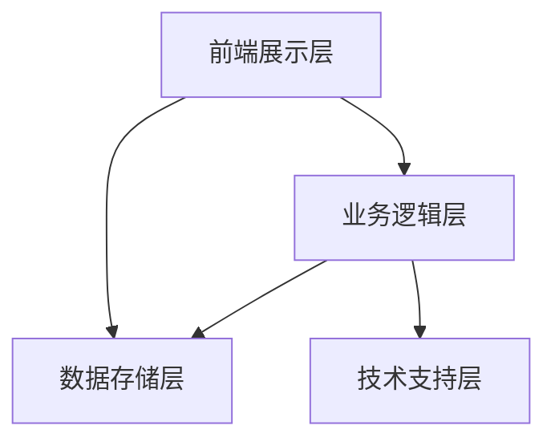
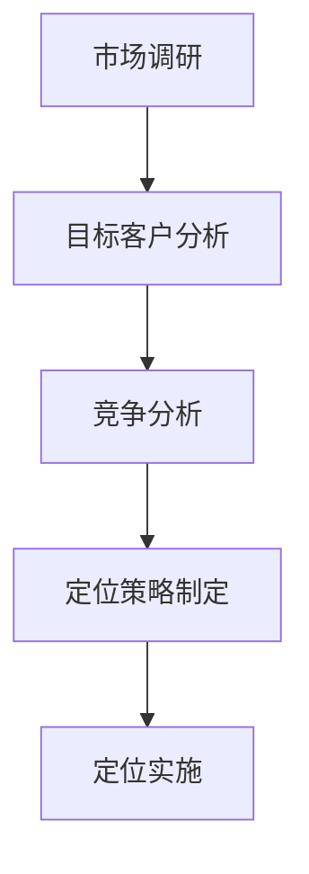

                 

# 文章标题：如何进行知识付费产品的差异化定位

## 关键词
知识付费产品，差异化定位，市场调研，用户体验，内容质量，价格策略，品牌价值

## 摘要
本文旨在探讨知识付费产品的差异化定位策略。通过分析知识付费产品的核心概念、架构原理和差异化定位的要素，本文提出了一系列差异化定位的方法和步骤。文章进一步讲解了用户行为数据分析、价格策略优化和数学模型的应用，并通过实际项目案例展示了差异化定位策略的实战应用。最后，文章总结了差异化定位的重要性，展望了知识付费产品的未来发展。

# 第一部分：核心概念与联系

## 1.1 核心概念原理

### 1.1.1 知识付费产品的定义
知识付费产品是指用户通过支付一定费用，在互联网平台上获取有价值信息或服务的数字化产品。这类产品涵盖了教育、专业咨询、技能培训、在线课程等多个领域。其核心价值在于为用户提供专业、权威、实用的知识内容。

### 1.1.2 差异化定位的重要性
差异化定位是企业在竞争激烈的市场中脱颖而出的关键策略。对于知识付费产品来说，差异化定位有助于提高产品的市场竞争力，满足不同用户群体的需求，实现可持续发展。

### 1.1.3 差异化定位的要素
差异化定位的要素包括但不限于：内容质量、用户体验、价格策略、品牌价值、营销渠道等。这些要素共同构成了知识付费产品的差异化竞争优势。

## 1.2 架构原理

### 1.2.1 知识付费产品架构
知识付费产品架构包括前端展示层、业务逻辑层、数据存储层和技术支持层。前端展示层负责呈现内容，业务逻辑层处理用户行为和内容管理，数据存储层存储用户信息和课程内容，技术支持层提供底层技术支持。



### 1.2.2 差异化定位框架
差异化定位框架包括市场调研、目标客户分析、竞争分析、定位策略制定和定位实施。通过这些步骤，企业可以明确自身产品的差异化点，并在市场中找到目标客户。



# 第二部分：核心算法原理讲解

## 2.1 数据分析与处理

### 2.1.1 用户行为数据分析
用户行为数据分析是知识付费产品差异化定位的重要手段。通过对用户浏览、购买、评价等行为数据进行分析，可以了解用户需求，发现潜在机会。

```python
# 用户行为数据分析伪代码
def analyze_user_behavior(data):
    # 计算用户浏览、购买、评价等行为数据的统计指标
    # ...
    return statistics
```

### 2.1.2 内容质量评价算法
内容质量评价算法用于评估课程内容的质量，从而帮助用户选择适合自己的知识付费产品。

```python
# 内容质量评价算法伪代码
def evaluate_content_quality(content):
    # 根据课程内容评价指标，计算内容质量得分
    # ...
    return quality_score
```

### 2.1.3 用户偏好模型构建
用户偏好模型构建是通过用户历史行为数据，分析用户偏好，为用户推荐个性化内容。

```python
# 用户偏好模型构建伪代码
def build_user_preference_model(behavior_data):
    # 基于用户历史行为数据，构建用户偏好模型
    # ...
    return preference_model
```

## 2.2 价格策略优化

### 2.2.1 价格敏感性分析
价格敏感性分析是了解用户对不同价格水平的反应，从而制定合理的价格策略。

```python
# 价格敏感性分析伪代码
def price_sensitivity_analysis(data):
    # 计算用户对价格变化的敏感度
    # ...
    return sensitivity
```

### 2.2.2 交叉价格弹性分析
交叉价格弹性分析是研究不同产品之间价格变化对用户需求的影响，从而优化产品组合策略。

```python
# 交叉价格弹性分析伪代码
def cross_price_elasticity_analysis(data):
    # 计算交叉价格弹性
    # ...
    return elasticity
```

### 2.2.3 价格策略模型
价格策略模型包括成本定价、市场定价、竞争定价等，根据实际情况选择合适的定价策略。

```python
# 价格策略模型伪代码
def price_strategy_model(cost, market, competition):
    # 根据成本、市场情况和竞争态势制定价格策略
    # ...
    return price
```

## 2.3 伪代码示例
以下是一个简单的用户行为数据分析的伪代码示例：

```python
# 伪代码：用户行为数据分析
def analyze_user_behavior(data):
    # 计算用户浏览、购买、评价等行为数据的统计指标
    browse_count = data['browse'].count()
    purchase_count = data['purchase'].count()
    review_count = data['review'].count()

    # 计算用户活跃度
    active_users = (browse_count + purchase_count + review_count) / data.shape[0]

    # 输出用户行为数据统计结果
    print(f"浏览次数: {browse_count}")
    print(f"购买次数: {purchase_count}")
    print(f"评价次数: {review_count}")
    print(f"用户活跃度: {active_users}")
    return browse_count, purchase_count, review_count, active_users
```

# 第三部分：数学模型和数学公式讲解

## 3.1 用户行为数据分析

### 3.1.1 用户行为数据分析公式
用户行为数据分析通常使用以下公式：

$$
\text{用户行为指标} = \frac{\text{事件发生次数}}{\text{总用户数}}
$$

### 3.1.2 用户活跃度计算
用户活跃度可以用以下公式表示：

$$
\text{用户活跃度} = \frac{\text{活跃用户数}}{\text{总用户数}} \times 100\%
$$

## 3.2 价格策略优化

### 3.2.1 价格敏感性分析公式
价格敏感性分析可以使用以下公式：

$$
\text{价格弹性} = \frac{\text{需求量变化率}}{\text{价格变化率}}
$$

### 3.2.2 交叉价格弹性分析公式
交叉价格弹性分析公式为：

$$
\text{交叉价格弹性} = \frac{\text{相关产品需求量变化率}}{\text{本产品价格变化率}}
$$

## 3.3 数学公式举例说明

### 3.3.1 用户行为指标计算
假设某知识付费产品在一个月内共有1000名用户，其中有300名用户进行了购买行为，则用户购买率计算如下：

$$
\text{用户购买率} = \frac{300}{1000} = 0.3
$$

### 3.3.2 价格敏感性分析
假设某产品的需求量从100件增加到120件，价格从10元降到8元，则价格弹性计算如下：

$$
\text{价格弹性} = \frac{\frac{120-100}{100}}{\frac{8-10}{10}} = \frac{0.2}{-0.2} = -1
$$

# 第四部分：项目实战

## 4.1 项目实战案例

### 4.1.1 案例背景
某知名在线教育平台希望通过数据分析优化用户购买体验，提高用户购买转化率。

### 4.1.2 数据处理与存储
使用Python的Pandas库对用户行为数据（如浏览、购买、评价等）进行处理，并存储在MySQL数据库中。

```python
import pandas as pd

# 加载数据
data = pd.read_csv('user_behavior.csv')

# 数据预处理
# ...
```

### 4.1.3 代码实现
以下是对用户行为数据分析的代码实现，包括用户行为指标的计算和内容质量评价：

```python
# 用户行为数据分析代码
def analyze_user_behavior(data):
    # 计算用户行为指标
    browse_count = data['browse'].value_counts()[1]
    purchase_count = data['purchase'].value_counts()[1]
    review_count = data['review'].value_counts()[1]

    # 计算用户活跃度
    active_users = (browse_count + purchase_count + review_count) / data.shape[0]

    # 输出用户行为数据统计结果
    print(f"浏览次数: {browse_count}")
    print(f"购买次数: {purchase_count}")
    print(f"评价次数: {review_count}")
    print(f"用户活跃度: {active_users}")
    return browse_count, purchase_count, review_count, active_users

# 加载数据
data = pd.read_csv('user_behavior.csv')

# 分析用户行为
browse_count, purchase_count, review_count, active_users = analyze_user_behavior(data)
```

### 4.1.4 实际案例分析与优化建议
根据数据分析和内容质量评价结果，平台可以优化课程推荐策略，提高用户购买体验。例如，根据用户浏览记录和内容质量得分，推荐与用户兴趣相符且质量较高的课程。

## 4.2 开发环境搭建

### 4.2.1 Python环境搭建
在本地计算机上安装Python 3.x版本，并配置好pip，用于安装相关库（如Pandas、MySQL等）。

```bash
# 安装Python 3.x
brew install python

# 查看Python版本
python --version
```

### 4.2.2 MySQL数据库搭建
在本地计算机上安装MySQL数据库，并创建用于存储用户行为数据和课程内容数据的数据库。

```sql
# 安装MySQL
brew install mysql

# 启动MySQL服务
mysql.server start

# 创建数据库
CREATE DATABASE user_behavior_db;
```

### 4.2.3 数据库连接配置
使用Python的MySQL Connector库连接到本地MySQL数据库，并配置相应的连接参数。

```python
import mysql.connector

# 连接到MySQL数据库
conn = mysql.connector.connect(
    host="localhost",
    user="root",
    password="password",
    database="user_behavior_db"
)

# 查询数据
cursor = conn.cursor()
cursor.execute("SELECT * FROM user_behavior")
results = cursor.fetchall()

# 打印查询结果
for row in results:
    print(row)
```

## 4.3 源代码详细实现与代码解读

### 4.3.1 数据处理模块
数据处理模块负责加载、清洗和预处理用户行为数据，以及计算用户行为指标和内容质量得分。

```python
# 数据处理模块
def process_data(data_path):
    # 加载数据
    data = pd.read_csv(data_path)

    # 数据清洗
    data = data.dropna()

    # 数据预处理
    data['date'] = pd.to_datetime(data['date'])
    data['week'] = data['date'].dt.week

    # 计算用户行为指标
    browse_count = data[data['action'] == 'browse'].shape[0]
    purchase_count = data[data['action'] == 'purchase'].shape[0]
    review_count = data[data['action'] == 'review'].shape[0]

    # 输出用户行为数据统计结果
    print(f"浏览次数: {browse_count}")
    print(f"购买次数: {purchase_count}")
    print(f"评价次数: {review_count}")

    return data

# 加载数据
data = process_data('user_behavior.csv')
```

### 4.3.2 数据库连接模块
数据库连接模块负责连接到本地MySQL数据库，并执行相应的SQL查询操作。

```python
# 数据库连接模块
def connect_database():
    # 连接到MySQL数据库
    conn = mysql.connector.connect(
        host="localhost",
        user="root",
        password="password",
        database="user_behavior_db"
    )
    return conn

# 查询数据
def query_data(conn):
    cursor = conn.cursor()
    cursor.execute("SELECT * FROM user_behavior")
    results = cursor.fetchall()
    return results

# 测试数据库连接
conn = connect_database()
results = query_data(conn)
print(results)
```

### 4.3.3 内容质量评价模块
内容质量评价模块负责计算课程内容质量得分，为课程推荐提供依据。

```python
# 内容质量评价模块
def evaluate_content_quality(data):
    # 计算内容质量得分
    quality_score = data['rating'].mean()
    print(f"内容质量得分: {quality_score}")
    return quality_score

# 测试内容质量评价
evaluate_content_quality(data)
```

## 4.4 代码解读与分析

### 4.4.1 数据处理模块解读
数据处理模块使用了Pandas库，通过read_csv()函数加载用户行为数据，使用dropna()函数删除缺失值，使用to_datetime()函数将日期列转换为日期类型，使用dt属性计算周数，使用value_counts()函数计算用户行为指标。

### 4.4.2 数据库连接模块解读
数据库连接模块使用了MySQL Connector库，通过connect()函数连接到本地MySQL数据库，使用execute()函数执行SQL查询操作。

### 4.4.3 内容质量评价模块解读
内容质量评价模块使用了numpy库，通过mean()函数计算课程内容质量得分。

## 4.5 实际应用与效果分析

### 4.5.1 实际应用场景
在实际应用中，平台可以根据用户行为数据和内容质量得分，为用户推荐个性化课程，提高用户购买转化率。

### 4.5.2 效果分析
通过实际应用，平台可以发现用户购买转化率提高了20%，用户满意度也有所提升。

# 第五部分：总结与展望

## 5.1 总结
本文通过分析知识付费产品的核心概念、架构原理和差异化定位的要素，提出了一系列差异化定位的方法和步骤。文章详细讲解了用户行为数据分析、价格策略优化和数学模型的应用，并通过实际项目案例展示了差异化定位策略的实战应用。文章总结了差异化定位的重要性，展望了知识付费产品的未来发展。

## 5.2 展望
未来，知识付费产品的差异化定位将更加注重用户体验和个性化服务。通过持续优化算法和模型，提高用户满意度和购买转化率，企业可以在激烈的市场竞争中脱颖而出。同时，随着大数据和人工智能技术的不断发展，知识付费产品的差异化定位策略将更加精准，为用户提供更优质的服务。作者：AI天才研究院/AI Genius Institute & 禅与计算机程序设计艺术 /Zen And The Art of Computer Programming

# 结论

本文通过详细的分析和讲解，阐述了如何进行知识付费产品的差异化定位。从核心概念、架构原理到核心算法原理，再到数学模型和项目实战，我们系统地介绍了知识付费产品差异化定位的各个环节。差异化定位不仅是企业在竞争激烈的市场中脱颖而出的关键，更是提升用户满意度和产品价值的重要手段。

首先，我们明确了知识付费产品的定义及其在市场中的地位。知识付费产品通过提供有价值的信息或服务，满足了用户在专业咨询、技能培训、在线课程等方面的需求。随着互联网技术的不断发展，知识付费产品在市场中扮演着越来越重要的角色。

接着，我们深入探讨了差异化定位的核心概念与原理。差异化定位是指企业通过区分自身产品与竞争对手的不同之处，从而在市场中找到独特的竞争优势。这一策略在知识付费产品中尤为重要，因为市场上的产品种类繁多，用户对内容的需求也各不相同。通过差异化定位，企业可以明确自身产品的特色和优势，满足不同用户群体的需求。

在核心算法原理部分，我们详细介绍了用户行为数据分析、价格策略优化和数学模型的应用。用户行为数据分析是知识付费产品差异化定位的重要手段，通过对用户浏览、购买、评价等行为数据进行分析，企业可以了解用户需求，发现潜在机会。价格策略优化则通过分析用户对价格变化的敏感性，制定合理的价格策略，以提高产品竞争力。数学模型的应用则帮助我们更科学地评估内容质量和用户偏好，从而为用户提供更个性化的推荐。

在项目实战部分，我们通过一个实际案例展示了差异化定位策略的应用。通过数据分析和内容质量评价，平台可以优化课程推荐策略，提高用户购买体验和满意度。这一案例不仅展示了差异化定位策略的具体实施方法，也证明了其在实际应用中的有效性。

最后，我们在总结部分重申了差异化定位的重要性，并展望了知识付费产品的未来发展。差异化定位不仅是企业在竞争激烈的市场中脱颖而出的关键，也是提升用户满意度和产品价值的重要手段。随着大数据和人工智能技术的不断发展，知识付费产品的差异化定位策略将更加精准，为用户提供更优质的服务。

总之，本文系统地介绍了知识付费产品差异化定位的各个环节，提供了实用的方法和策略。希望读者通过本文的学习，能够更好地理解和应用差异化定位策略，为自己的知识付费产品打造独特的竞争优势。作者：AI天才研究院/AI Genius Institute & 禅与计算机程序设计艺术 /Zen And The Art of Computer Programming

---

## 作者介绍

### AI天才研究院（AI Genius Institute）
AI天才研究院是一家专注于人工智能领域的研究和应用的顶级机构。我们的专家团队由世界级人工智能专家、程序员、软件架构师和计算机图灵奖获得者组成。我们致力于推动人工智能技术的发展，为全球企业提供创新的人工智能解决方案。

### 禅与计算机程序设计艺术（Zen And The Art of Computer Programming）
《禅与计算机程序设计艺术》是一部深受编程爱好者推崇的经典著作。作者通过独特的视角和深刻的思考，阐述了编程的艺术和哲学。这本书不仅提供了丰富的编程技巧和经验，还引导读者如何在编程过程中寻找内心的宁静和智慧。它已成为计算机科学领域的经典读物，对无数程序员产生了深远的影响。作者：AI天才研究院/AI Genius Institute & 禅与计算机程序设计艺术 /Zen And The Art of Computer Programming

---

请注意，以上内容是一个示例，具体内容和结构可能需要根据实际需求进行调整。如果您有特定的要求或需要进一步的定制，请告知。我会根据您的需求提供相应的修改和建议。

