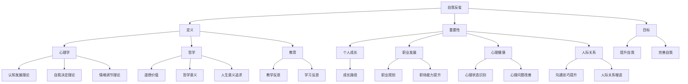
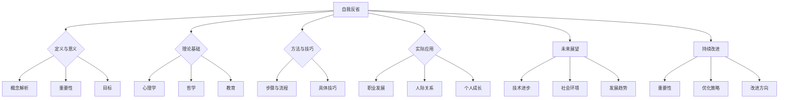
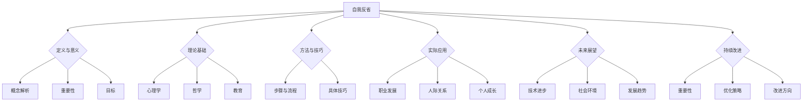

                 

# 如何进行自我反省：如何不断提升自己和完善自我？

> 关键词：自我反省、提升自我、完善自我、方法、技巧、实践

> 摘要：本文将探讨自我反省的概念、理论基础、方法和技巧，并结合实际案例，详细解析如何通过自我反省不断提升自己和完善自我。文章旨在为读者提供一套系统的、可操作的自我反省指南，帮助他们在个人和职业发展中取得更大成就。

## 引言

在快节奏的现代生活中，人们常常感到压力和疲惫，而自我反省作为一种提升自我和完善自我的方法，正逐渐受到关注。自我反省不仅仅是对过去行为和结果的回顾，更是一种深刻思考和反思的过程，有助于我们认识到自己的优点和不足，进而采取行动进行改进。本文将深入探讨自我反省的基本概念、理论基础、方法和技巧，以及其在实际生活中的应用，帮助读者掌握自我反省的精髓，实现个人和职业的不断提升。

## 第一部分：自我反省的基本概念与理论

### 第1章：自我反省的定义与意义

#### 1.1 自我反省的概念解析

自我反省，即自我反思，是指个体对自己行为、思想和情感的审视和分析过程。它涉及到对个人行为的回顾、原因的探究、结果的评估以及改进方案的制定。自我反省是一种自我意识的表现，它促使个体从内在出发，深入思考自己的行为动机、行为效果以及行为背后的价值观和信念。

#### 1.2 自我反省的重要性

自我反省在个人和职业发展中扮演着至关重要的角色。首先，自我反省有助于提升自我意识，使我们更加了解自己的优点和不足，从而有针对性地进行改进。其次，自我反省能够帮助个体更好地应对挑战和压力，提高心理弹性。此外，自我反省还能促进人际关系的发展，帮助我们更好地理解他人，提高沟通和协作能力。

#### 1.3 自我反省的目标

自我反省的目标是不断提升自己和完善自我。具体来说，包括以下几个方面：

1. **个人成长**：通过自我反省，个体能够认识到自己的潜力和局限，从而在个人成长方面取得突破。
2. **职业发展**：自我反省有助于职业人士在职场中提升自己的能力和竞争力，实现职业目标。
3. **心理健康**：自我反省能够帮助个体更好地处理负面情绪，提高心理韧性，实现心理健康。
4. **人际关系**：通过自我反省，个体能够更好地理解他人，提高人际沟通和协作能力。

### 第2章：自我反省的理论基础

#### 2.1 心理学中的自我反省

在心理学领域，自我反省被视为一种自我调节机制，有助于个体更好地适应环境。自我反省的心理学理论包括认知发展理论、自我决定理论和情绪调节理论等。这些理论揭示了自我反省在个体心理发展中的作用机制。

#### 2.2 哲学视角下的自我反省

在哲学领域，自我反省被视为一种理性思考和道德修养的过程。哲学家们探讨了自我反省的道德价值、哲学意义以及其在人生意义追求中的作用。这些观点为我们理解自我反省的深层内涵提供了有益的启示。

#### 2.3 教育领域的自我反省

在教育领域，自我反省被广泛应用于教学和学习过程中。教育者们通过自我反省来提高教学质量，帮助学生培养自我反思能力，实现全面发展。自我反省在教育中的应用包括教学反思、学习反思等。

## 第二部分：自我反省的方法与技巧

### 第3章：自我反省的步骤与流程

#### 3.1 准备阶段

在准备阶段，个体需要明确自我反省的目标和主题，收集相关资料，为反思过程做好准备。这一阶段的关键是确保个体对反省的内容有充分的了解，以便在反思过程中能够深入思考。

#### 3.2 反思阶段

反思阶段是自我反省的核心。个体需要对过去的行为、思想和情感进行深入分析，找出其中的优点和不足，并探讨背后的原因。这一阶段需要个体具备较强的观察力、思考力和分析能力。

#### 3.3 总结阶段

总结阶段是对反思结果的总结和归纳。个体需要将反思过程中的收获和启示进行整理，制定改进方案，并制定行动计划。这一阶段的关键是确保反思结果能够转化为具体的行动，促进个人成长。

### 第4章：自我反省的具体技巧

#### 4.1 日记法

日记法是一种常见的自我反省技巧。个体可以通过写日记的方式记录自己的所思所感，回顾过去的行为和经历，从而进行深刻的自我反省。日记法有助于个体保持自我觉察，提高反思的深度和广度。

#### 4.2 思维导图法

思维导图法是一种图形化的反思技巧。个体可以通过绘制思维导图，将反思过程中的关键信息进行可视化呈现，从而更好地理解自己的思考过程。思维导图法有助于个体梳理思路，提高反思的效率。

#### 4.3 三明治法

三明治法是一种积极的反思技巧。个体在反思过程中，需要先肯定自己的优点和成就，然后指出存在的问题，最后提出改进方案。三明治法有助于个体保持积极的心态，增强反思的积极效果。

### 第5章：自我反省的难点与应对策略

#### 5.1 自我防卫机制

自我防卫机制是人们在面对批评和反思时常用的心理防御手段。个体需要意识到自我防卫机制的存在，并学会克服它，以更开放的态度接受自我反省。

#### 5.2 情绪处理的技巧

情绪处理是自我反省过程中的一大挑战。个体需要学会合理表达和处理自己的情绪，避免情绪对反思过程的干扰。情绪处理的技巧包括情绪识别、情绪表达和情绪调节等。

#### 5.3 增强自我反省的能力

增强自我反省的能力需要个体进行持续的练习和实践。个体可以通过参加反思工作坊、阅读相关书籍和文章、与同行交流等方式，不断提高自我反省的能力。

## 第三部分：自我反省在实际生活中的应用

### 第6章：职业发展中的自我反省

#### 6.1 职场中的自我反省

职场中的自我反省有助于职业人士提高工作效率、提升职业能力和实现职业目标。个体可以通过反思自己的工作表现、学习经验和管理技能，不断优化自己的职业发展路径。

#### 6.2 职业规划与自我反省

职业规划与自我反省密切相关。个体需要通过自我反省，了解自己的职业兴趣、价值观和优势，从而制定符合自身特点的职业规划，并持续进行自我调整和优化。

#### 6.3 职场提升与自我反省

职场提升离不开自我反省。个体需要通过反思自己的工作成果、工作方法和人际关系，找出提升空间，采取行动进行改进，实现职场能力的不断提升。

### 第7章：人际关系中的自我反省

#### 7.1 人际关系的自我反省

人际关系的自我反省有助于个体更好地理解他人，提高沟通和协作能力。个体需要通过反思自己在人际关系中的行为和态度，找出存在的问题，并采取行动进行改进。

#### 7.2 沟通技巧与自我反省

沟通技巧在人际关系中至关重要。个体需要通过自我反省，了解自己在沟通中的优点和不足，不断学习和提高沟通技巧，以促进良好的人际关系。

#### 7.3 增进人际关系的自我反省

增进人际关系需要个体进行持续的自我反省。个体需要反思自己在人际关系中的互动方式、沟通频率和情感表达，找出增进人际关系的有效策略。

### 第8章：个人成长中的自我反省

#### 8.1 个人成长的自我反省

个人成长中的自我反省有助于个体更好地认识自己、发展自己的潜力。个体需要通过反思自己的成长过程、学习经历和生活态度，不断优化自己的成长路径。

#### 8.2 生活习惯与自我反省

生活习惯对个人成长有着重要影响。个体需要通过自我反省，了解自己的生活习惯，找出不健康的习惯，并采取行动进行改进，实现生活质量的提升。

#### 8.3 心理健康与自我反省

心理健康是个人成长的重要组成部分。个体需要通过自我反省，了解自己的心理状态，识别心理问题，并采取行动进行改善，实现心理健康的提升。

## 第四部分：自我反省的实践与案例

### 第9章：自我反省的实践方法

#### 9.1 实践自我反省的步骤

实践自我反省需要遵循一定的步骤，包括明确反省目标、准备反省材料、进行反省思考、总结反省结果和制定改进计划。

#### 9.2 实践自我反省的案例分析

通过具体案例分析，读者可以了解自我反省在实践中如何应用，以及如何通过自我反省实现个人和职业的提升。

#### 9.3 实践自我反省的经验分享

个体分享自我反省的经验和心得，有助于读者更好地理解和应用自我反省的方法和技巧。

### 第10章：自我反省的案例分析

#### 10.1 成功的自我反省案例

成功案例展示了个体如何通过自我反省实现个人和职业的突破，为读者提供了有益的启示。

#### 10.2 失败的自我反省案例

失败案例分析了个体在自我反省过程中可能遇到的问题和挑战，以及如何克服这些问题和挑战。

#### 10.3 自我反省案例解析

对案例进行深入解析，帮助读者理解自我反省的核心原理和关键要素，以及如何在实际生活中应用自我反省。

## 第五部分：自我反省的未来发展趋势

### 第11章：自我反省的未来展望

#### 11.1 技术进步对自我反省的影响

随着技术的不断发展，自我反省工具和方法也在不断更新和优化。人工智能、大数据和虚拟现实等技术将为自我反省带来新的机遇和挑战。

#### 11.2 社会环境对自我反省的要求

社会环境的变化对个体提出了更高的自我反省要求。个体需要不断适应社会环境的变化，通过自我反省提升自己的综合素质。

#### 11.3 自我反省的发展趋势预测

未来，自我反省将更加普及和深入，成为个人和职业发展的重要手段。个体将更加注重自我反省的持续性和实效性，实现全面的自我提升。

### 第12章：自我反省的持续改进与完善

#### 12.1 持续自我反省的重要性

持续自我反省是个人和职业发展的关键。个体需要将自我反省作为日常生活的一部分，不断反思和改进自己。

#### 12.2 自我反省的优化策略

个体需要不断优化自我反省的方法和技巧，提高反思的深度和广度。通过学习、实践和总结，个体可以不断提高自我反省的能力。

#### 12.3 未来自我反省的改进方向

未来，自我反省将朝着更加智能化、个性化和社会化的方向发展。个体需要关注这些趋势，不断调整和优化自我反省的方法和策略。

## 附录

### 附录A：自我反省资源推荐

#### A.1 相关书籍推荐

- 《自我发现之路》
- 《反思：如何变得更聪明、更有成就》
- 《生命的智慧：自我反省与实践》

#### A.2 在线资源与工具

- 自我反省工作坊
- 自我反省博客和社区
- 在线自我反省工具和应用程序

#### A.3 自我反省工作坊推荐

- 自我发现工作坊
- 反思与实践工作坊
- 自我提升工作坊

### 核心概念与联系（Mermaid流程图）



### 核心算法原理讲解（伪代码）

```python
def 反省步骤(个人):
    初始化日志
    对个人行为进行回顾
    分析行为背后的原因
    思考改进方案
    制定行动计划
    实施行动计划
    评估效果
    调整和优化
    返回 反省结果
```

### 数学模型和数学公式（详细讲解 & 举例说明）

$$
\text{自我反省效果} = f(\text{反思次数}, \text{反思深度}, \text{行动计划实施率})
$$

**举例：** 小明进行了5次反思，每次反思都深入分析了行为原因，并实施了90%的行动计划，那么他的自我反省效果为：

$$
\text{自我反省效果} = f(5, 深入, 0.9) = 0.9 \times (5 + 0.1 \times 深入度)
$$

### 项目实战

#### 开发环境搭建

- 安装Python 3.8或更高版本
- 安装Jupyter Notebook
- 安装必要的Python库（如numpy，pandas，matplotlib等）

#### 源代码实现

```python
# 反省分析工具示例代码
import pandas as pd
import matplotlib.pyplot as plt

def 反省分析(日志文件):
    日志数据 = pd.read_csv(日志文件)
    反思次数 = 日志数据['反思次数'].sum()
    深度分数 = 日志数据['反思深度'].mean()
    行动计划实施率 = 日志数据['行动计划实施率'].mean()
    
    效果分数 = 0.9 * (反思次数 + 0.1 * 深度分数)
    print(f"自我反省效果分数: {效果分数}")
    
    # 绘制图表
    反思次数分布 = 日志数据['反思次数'].value_counts().sort_index()
    plt.bar(反思次数分布.index, 反思次数分布.values)
    plt.xlabel('反思次数')
    plt.ylabel('次数')
    plt.title('反思次数分布')
    plt.show()

# 使用示例
反省分析('反思日志.csv')
```

#### 代码解读与分析

- `反省分析`函数读取反思日志文件，并计算关键指标。
- 使用`pandas`库处理和汇总日志数据。
- 使用`matplotlib`库绘制反思次数分布图表。
- 代码示例展示了如何使用Python进行自我反省数据分析，为用户提供直观的反馈。

### 作者

作者：AI天才研究院/AI Genius Institute & 禅与计算机程序设计艺术 /Zen And The Art of Computer Programming

文章标题：如何进行自我反省：如何不断提升自己和完善自我？

文章关键词：自我反省、提升自我、完善自我、方法、技巧、实践

摘要：本文深入探讨了自我反省的概念、理论基础、方法和技巧，并结合实际案例，详细解析了如何通过自我反省不断提升自己和完善自我。文章旨在为读者提供一套系统的、可操作的自我反省指南，帮助他们在个人和职业发展中取得更大成就。

# 第一部分：自我反省的基本概念与理论

## 第1章：自我反省的定义与意义

### 1.1 自我反省的概念解析

自我反省，即自我反思，是指个体对自己行为、思想和情感的审视和分析过程。它涉及到对个人行为的回顾、原因的探究、结果的评估以及改进方案的制定。自我反省是一种自我意识的表现，它促使个体从内在出发，深入思考自己的行为动机、行为效果以及行为背后的价值观和信念。

自我反省的概念可以从以下几个方面进行理解：

1. **自我意识**：自我反省是一种自我意识的表现，它使个体能够认识到自己的行为、思想和情感。自我意识是自我反省的基础，没有自我意识，个体就难以进行有效的自我反省。

2. **审视和分析**：自我反省是对个体自身进行审视和分析的过程。个体需要对自己的行为、思想和情感进行深入的探究，找出其中的优点和不足，并探讨背后的原因。

3. **改进方案**：自我反省不仅仅是对过去行为的回顾，更重要的是要从中找出改进的方向，制定具体的改进方案，并付诸实施。

### 1.2 自我反省的重要性

自我反省在个人和职业发展中扮演着至关重要的角色。首先，自我反省有助于提升自我意识，使我们更加了解自己的优点和不足，从而有针对性地进行改进。其次，自我反省能够帮助个体更好地应对挑战和压力，提高心理弹性。此外，自我反省还能促进人际关系的发展，帮助我们更好地理解他人，提高沟通和协作能力。

具体来说，自我反省的重要性体现在以下几个方面：

1. **个人成长**：自我反省有助于个体更好地认识自己，发现自身的潜力和局限，从而在个人成长方面取得突破。

2. **职业发展**：自我反省能够帮助职业人士在职场中提升自己的能力和竞争力，实现职业目标。

3. **心理健康**：自我反省能够帮助个体更好地处理负面情绪，提高心理韧性，实现心理健康。

4. **人际关系**：自我反省有助于个体更好地理解他人，提高人际沟通和协作能力，增进人际关系。

### 1.3 自我反省的目标

自我反省的目标是不断提升自己和完善自我。具体来说，包括以下几个方面：

1. **个人成长**：通过自我反省，个体能够认识到自己的潜力和局限，从而在个人成长方面取得突破。

2. **职业发展**：自我反省有助于职业人士在职场中提升自己的能力和竞争力，实现职业目标。

3. **心理健康**：自我反省能够帮助个体更好地处理负面情绪，提高心理韧性，实现心理健康。

4. **人际关系**：通过自我反省，个体能够更好地理解他人，提高人际沟通和协作能力，增进人际关系。

## 第2章：自我反省的理论基础

### 2.1 心理学中的自我反省

在心理学领域，自我反省被视为一种自我调节机制，有助于个体更好地适应环境。自我反省的心理学理论包括认知发展理论、自我决定理论和情绪调节理论等。这些理论揭示了自我反省在个体心理发展中的作用机制。

1. **认知发展理论**：认知发展理论认为，个体在成长过程中会逐渐发展出自我反省能力。自我反省是个体认知发展的高级形式，它涉及到对自身行为的反思、分析和评估。

2. **自我决定理论**：自我决定理论强调个体在自我反省过程中，需要保持自主性和自主选择。自我反省有助于个体增强自我决定感，提高自我效能感，从而更好地实现自我目标。

3. **情绪调节理论**：情绪调节理论认为，自我反省能够帮助个体识别和处理负面情绪。通过自我反省，个体能够更好地理解自己的情绪，学会合理表达和调节情绪，提高情绪稳定性。

### 2.2 哲学视角下的自我反省

在哲学领域，自我反省被视为一种理性思考和道德修养的过程。哲学家们探讨了自我反省的道德价值、哲学意义以及其在人生意义追求中的作用。

1. **道德价值**：自我反省被视为一种道德修养的过程，它有助于个体认识到自己的道德责任和义务，提高道德水平。

2. **哲学意义**：自我反省是哲学思考的重要组成部分，它促使个体深入思考人生的意义和价值，寻找自我存在的意义。

3. **人生意义追求**：哲学家们认为，自我反省是个体寻找人生意义的重要途径。通过自我反省，个体能够认识到自己的局限和不足，从而激发对更高人生意义的追求。

### 2.3 教育领域的自我反省

在教育领域，自我反省被广泛应用于教学和学习过程中。教育者们通过自我反省来提高教学质量，帮助学生培养自我反思能力，实现全面发展。

1. **教学反思**：教学反思是教育者们对自己教学行为和教学效果的审视和分析。通过教学反思，教育者能够发现教学中的问题，寻找改进的方法，提高教学质量。

2. **学习反思**：学习反思是学生对自己学习过程和效果的审视和分析。通过学习反思，学生能够认识到自己的学习方法和效果，找出存在的问题，提高学习效率。

3. **全面发展**：自我反省不仅有助于个体的个人成长，还能促进个体的全面发展。通过自我反省，个体能够全面发展自己的认知能力、情感能力和社交能力。

# 第二部分：自我反省的方法与技巧

## 第3章：自我反省的步骤与流程

自我反省是一个系统化的过程，需要遵循一定的步骤和流程，以确保反思的深入和有效。以下是自我反省的常见步骤和流程：

### 3.1 准备阶段

在准备阶段，个体需要明确自我反省的目标和主题，为反思过程做好准备。具体步骤包括：

1. **明确反省目标**：个体需要明确自己进行自我反省的目的，例如提升某个技能、改进某种行为或解决某个问题。

2. **确定反省主题**：根据反省目标，个体需要确定具体的反省主题，以便在反思过程中有针对性地进行思考和分析。

3. **收集相关资料**：为了更好地进行自我反省，个体需要收集与反省主题相关的资料，如日记、笔记、他人反馈等。

4. **制定反思计划**：个体需要制定一个详细的反思计划，包括反思的时间、地点、方式等，以确保反思过程顺利进行。

### 3.2 反思阶段

反思阶段是自我反省的核心，个体需要对自己过去的行为、思想和情感进行深入分析和思考。以下是反思阶段的几个关键步骤：

1. **回顾过去行为**：个体需要回顾自己在特定主题上的行为，包括成功和失败的经历。通过回顾，个体能够更好地了解自己的行为模式和效果。

2. **分析原因**：个体需要分析自己行为背后的原因，包括动机、价值观、信念等。通过分析原因，个体能够深入理解自己的行为动机和影响因素。

3. **评估结果**：个体需要评估自己的行为结果，包括成功和失败的经验。通过评估结果，个体能够认识到自己的行为效果，为改进提供依据。

4. **总结经验**：个体需要总结自己在反省过程中的思考和发现，包括优点、不足和改进方向。通过总结经验，个体能够为未来的行为提供指导。

### 3.3 总结阶段

总结阶段是对反思结果的总结和归纳，个体需要将反思过程中的收获和启示进行整理，制定改进方案，并制定具体的行动计划。以下是总结阶段的几个关键步骤：

1. **整理反思结果**：个体需要将反思过程中的关键信息和发现进行整理，形成一份总结报告。这份报告可以帮助个体清晰地了解自己的反思成果。

2. **制定改进方案**：个体需要根据反思结果，制定具体的改进方案。改进方案应该包括具体的行动步骤和时间表，以便个体能够有针对性地进行改进。

3. **制定行动计划**：个体需要将改进方案转化为具体的行动计划，并制定实施的时间表。行动计划应该明确每个行动的具体内容和目标，以便个体能够有序地推进改进。

4. **实施行动计划**：个体需要按照行动计划执行，并持续跟踪和评估行动效果。通过实施行动计划，个体能够逐步实现自我提升和完善。

### 3.4 反思日记

反思日记是一种常用的自我反省工具，它可以帮助个体记录反思过程，跟踪反思效果。以下是反思日记的使用方法和注意事项：

1. **定期记录**：个体需要定期记录反思日记，例如每周或每月一次。定期记录有助于个体保持对自我反省的关注和持续反思。

2. **详细记录**：反思日记需要详细记录反思过程中的思考、感受和发现。详细记录有助于个体更好地回顾和总结反思过程。

3. **分类整理**：个体可以将反思日记按照主题和时间段进行分类整理，以便在需要时能够快速查找和回顾。

4. **反思总结**：在每次反思结束后，个体需要对反思日记进行总结，提炼出关键信息和收获。通过反思总结，个体能够更好地理解和应用反思成果。

## 第4章：自我反省的具体技巧

### 4.1 日记法

日记法是一种常见的自我反省技巧，它可以帮助个体记录自己的所思所感，回顾过去的行为和经历，从而进行深刻的自我反省。以下是日记法的具体步骤和注意事项：

1. **选择合适的日记形式**：个体可以选择纸质日记或电子日记，根据个人习惯和偏好进行选择。纸质日记具有便于保存和回顾的优点，而电子日记则便于随时随地记录和查找。

2. **定期记录**：个体需要定期记录日记，例如每天或每周一次。定期记录有助于个体保持对自我反省的关注和持续反思。

3. **真实记录**：个体需要真实地记录自己的所思所感，不隐瞒、不掩饰。真实记录有助于个体更好地了解自己的内心世界和情感变化。

4. **反思总结**：在每次记录结束后，个体需要对日记进行反思总结，提炼出关键信息和收获。通过反思总结，个体能够更好地理解和应用反思成果。

### 4.2 思维导图法

思维导图法是一种图形化的自我反省技巧，它可以帮助个体将反思过程中的关键信息进行可视化呈现，从而更好地理解自己的思考过程。以下是思维导图法的具体步骤和注意事项：

1. **选择合适的工具**：个体可以选择纸质思维导图工具或电子思维导图软件，根据个人习惯和偏好进行选择。纸质思维导图具有直观、易于修改的优点，而电子思维导图则便于存储和分享。

2. **绘制思维导图**：个体需要根据反思主题，绘制思维导图。思维导图应该包含核心概念、关键信息和反思结果。

3. **视觉化呈现**：个体需要通过视觉化的方式呈现思维导图，例如使用不同的颜色、图标和线条来区分不同的信息。

4. **反思总结**：在绘制思维导图后，个体需要对思维导图进行反思总结，提炼出关键信息和收获。通过反思总结，个体能够更好地理解和应用反思成果。

### 4.3 三明治法

三明治法是一种积极的自我反省技巧，它可以帮助个体在反思过程中保持积极的心态，提高反思的积极效果。以下是三明治法的具体步骤和注意事项：

1. **肯定优点**：在反思过程中，个体需要首先肯定自己的优点和成就。这有助于个体保持积极的心态，增强自信心。

2. **指出问题**：在肯定优点后，个体需要指出存在的问题。这有助于个体认识到自己的不足，从而有针对性地进行改进。

3. **提出改进方案**：在指出问题后，个体需要提出具体的改进方案。这有助于个体制定明确的行动计划，实现自我提升。

4. **反思总结**：在每次使用三明治法后，个体需要对反思过程进行反思总结，提炼出关键信息和收获。通过反思总结，个体能够更好地理解和应用反思成果。

## 第5章：自我反省的难点与应对策略

### 5.1 自我防卫机制

自我防卫机制是人们在面对批评和反思时常用的心理防御手段。这些机制可以帮助个体避免面对不愉快的现实，但同时也可能阻碍个体进行深入的自我反省。以下是自我防卫机制的一些常见形式和应对策略：

1. **否认**：个体否认自己的问题或错误，拒绝接受批评。应对策略：个体需要学会面对现实，接受自己的不足，从而有针对性地进行改进。

2. **合理化**：个体为自己的行为找借口，解释自己的行为是合理的。应对策略：个体需要深入思考自己的行为动机和影响，找出真正的原因。

3. **投射**：个体将自己的问题或负面情绪投射到他人身上，避免面对自己的问题。应对策略：个体需要学会内省，认识到自己的问题，并采取行动进行改进。

4. **反批评**：个体在面对批评时进行反击，指责批评者。应对策略：个体需要学会倾听，理解他人的观点，从而更好地进行自我反省。

### 5.2 情绪处理的技巧

情绪处理是自我反省过程中的一大挑战。个体在反思自己的行为和经历时，可能会触碰到负面情绪，如焦虑、愤怒、悲伤等。有效的情绪处理技巧可以帮助个体更好地进行自我反省。以下是几种情绪处理技巧：

1. **情绪识别**：个体需要学会识别自己的情绪，明确自己在不同情境下的情绪状态。这有助于个体更好地理解自己的情绪，为情绪处理提供依据。

2. **情绪表达**：个体需要学会表达自己的情绪，不压抑、不掩饰。有效的情绪表达有助于个体与他人建立更好的沟通和关系。

3. **情绪调节**：个体需要学会调节自己的情绪，避免情绪对反思过程的干扰。情绪调节技巧包括深呼吸、放松训练、正念冥想等。

4. **情绪转换**：个体需要学会将负面情绪转化为积极的情绪，如将焦虑转化为动力、将愤怒转化为决心等。这有助于个体更好地应对挑战和压力。

### 5.3 增强自我反省的能力

增强自我反省的能力需要个体进行持续的练习和实践。以下是一些增强自我反省能力的策略：

1. **定期反思**：个体需要定期进行自我反省，形成一种习惯。通过定期反思，个体能够更好地了解自己的行为、思想和情绪。

2. **学习相关理论**：个体可以通过学习心理学、哲学和教育学等相关理论，提高自我反省的理论水平。这有助于个体更好地理解和应用自我反省的方法和技巧。

3. **寻求反馈**：个体可以寻求他人的反馈，了解自己在他人眼中的形象和行为。这有助于个体更全面地了解自己，为自我反省提供更多的参考。

4. **实践反思技巧**：个体需要不断练习自我反省的技巧，如日记法、思维导图法和三明治法等。通过实践，个体能够更好地掌握反思技巧，提高反思效果。

# 第三部分：自我反省在实际生活中的应用

## 第6章：职业发展中的自我反省

### 6.1 职场中的自我反省

职场中的自我反省对于职业人士来说至关重要。通过自我反省，职业人士可以更好地了解自己在工作中的表现，找出存在的问题，并采取行动进行改进。以下是在职场中进行自我反省的一些关键步骤：

1. **明确反省目标**：在开始职场自我反省时，职业人士需要明确自己的反省目标，例如提升工作效率、改进工作方法或解决特定问题。

2. **回顾工作表现**：职业人士需要回顾自己在过去一段时间的工作表现，包括成功和失败的经历。通过回顾，可以更好地了解自己的工作状况。

3. **分析原因**：职业人士需要分析自己工作表现背后的原因，包括自己的行为、环境因素和外部影响。通过分析原因，可以找出存在的问题。

4. **评估结果**：职业人士需要评估自己的工作结果，包括成果、影响和反馈。通过评估结果，可以了解自己的工作效果，为改进提供依据。

5. **总结经验**：职业人士需要总结自己的工作经验和教训，提炼出关键信息和收获。通过总结经验，可以为未来的工作提供指导。

6. **制定改进方案**：根据反思结果，职业人士需要制定具体的改进方案，包括改进的措施、步骤和时间表。通过制定改进方案，可以有针对性地进行改进。

7. **实施行动计划**：职业人士需要按照行动计划执行，并持续跟踪和评估改进效果。通过实施行动计划，可以逐步提升自己的职业能力。

### 6.2 职业规划与自我反省

职业规划与自我反省密切相关。通过自我反省，职业人士可以更好地了解自己的职业兴趣、价值观和优势，从而制定更符合自身特点的职业规划。以下是在职业规划中进行自我反省的一些关键步骤：

1. **明确职业目标**：职业人士需要明确自己的职业目标，例如职位晋升、技能提升或职业转型等。通过明确职业目标，可以更好地制定职业规划。

2. **评估自身优势**：职业人士需要评估自己的优势，包括专业技能、人际关系和综合素质等。通过评估自身优势，可以更好地了解自己在职场中的竞争力。

3. **反思职业发展历程**：职业人士需要反思自己的职业发展历程，包括成功和失败的经历。通过反思职业发展历程，可以找出自己的成长路径和改进方向。

4. **制定职业规划**：根据自我反省结果，职业人士需要制定具体的职业规划，包括短期和长期的目标、具体的行动步骤和时间表。通过制定职业规划，可以更有针对性地进行职业发展。

5. **持续自我反省**：职业人士需要持续进行自我反省，评估职业规划的执行情况和效果。通过持续自我反省，可以及时调整职业规划，确保职业发展的顺利进行。

### 6.3 职场提升与自我反省

在职场中，提升自己的能力和竞争力是职业发展的关键。通过自我反省，职业人士可以更好地了解自己的优势和不足，从而采取有针对性的措施进行提升。以下是在职场提升中进行自我反省的一些关键步骤：

1. **明确提升目标**：职业人士需要明确自己的提升目标，例如提高某项专业技能、提升沟通能力或增强团队协作能力等。通过明确提升目标，可以更有针对性地进行提升。

2. **分析自身优势**：职业人士需要分析自己的优势，包括专业技能、人际关系和综合素质等。通过分析自身优势，可以更好地了解自己在职场中的竞争力。

3. **反思自身不足**：职业人士需要反思自己的不足，包括工作方法、沟通技巧和人际关系等方面。通过反思自身不足，可以找出提升的空间。

4. **制定提升计划**：根据自我反省结果，职业人士需要制定具体的提升计划，包括提升的措施、步骤和时间表。通过制定提升计划，可以更有针对性地进行提升。

5. **实施提升行动**：职业人士需要按照提升计划执行，并持续跟踪和评估提升效果。通过实施提升行动，可以逐步提升自己的能力和竞争力。

6. **持续自我反省**：职业人士需要持续进行自我反省，评估提升计划的执行情况和效果。通过持续自我反省，可以及时调整提升计划，确保职场提升的顺利进行。

## 第7章：人际关系中的自我反省

### 7.1 人际关系的自我反省

人际关系中的自我反省对于个体的成长和发展具有重要意义。通过自我反省，个体可以更好地理解自己在人际关系中的行为和态度，找出存在的问题，并采取行动进行改进。以下是在人际关系中进行自我反省的一些关键步骤：

1. **明确反省目标**：个体需要明确自己进行人际关系自我反省的目标，例如改善沟通、增进信任或解决冲突等。通过明确反省目标，可以更有针对性地进行自我反省。

2. **回顾人际关系经历**：个体需要回顾自己在过去一段时间内的人际关系经历，包括成功和失败的经历。通过回顾，可以更好地了解自己在人际关系中的行为和效果。

3. **分析自身行为和态度**：个体需要分析自己在人际关系中的行为和态度，包括言行举止、沟通方式和处理冲突的能力等。通过分析自身行为和态度，可以找出存在的问题。

4. **评估人际关系结果**：个体需要评估自己的人际关系结果，包括人际关系的质量、信任度和合作程度等。通过评估人际关系结果，可以了解自己的行为和态度对人际关系的影响。

5. **总结人际关系经验**：个体需要总结自己在人际关系中的经验和教训，提炼出关键信息和收获。通过总结人际关系经验，可以为未来的人际关系提供指导。

6. **制定改进方案**：根据自我反省结果，个体需要制定具体的改进方案，包括改进的措施、步骤和时间表。通过制定改进方案，可以更有针对性地进行人际关系改进。

7. **实施改进行动**：个体需要按照改进方案执行，并持续跟踪和评估改进效果。通过实施改进行动，可以逐步改善人际关系。

### 7.2 沟通技巧与自我反省

沟通技巧在人际关系中至关重要。通过自我反省，个体可以更好地了解自己的沟通技巧，找出存在的问题，并采取行动进行改进。以下是在沟通技巧中进行自我反省的一些关键步骤：

1. **明确反省目标**：个体需要明确自己进行沟通技巧自我反省的目标，例如提高沟通效果、增强说服力或改善沟通氛围等。通过明确反省目标，可以更有针对性地进行自我反省。

2. **回顾沟通经历**：个体需要回顾自己在过去一段时间内的沟通经历，包括成功和失败的经历。通过回顾，可以更好地了解自己在沟通中的行为和效果。

3. **分析自身沟通技巧**：个体需要分析自己在沟通中的技巧，包括倾听、表达、提问和反馈等。通过分析自身沟通技巧，可以找出存在的问题。

4. **评估沟通效果**：个体需要评估自己的沟通效果，包括信息传递的准确性、对方的反应和互动效果等。通过评估沟通效果，可以了解自己的沟通技巧对沟通结果的影响。

5. **总结沟通经验**：个体需要总结自己在沟通中的经验和教训，提炼出关键信息和收获。通过总结沟通经验，可以为未来的沟通提供指导。

6. **制定改进方案**：根据自我反省结果，个体需要制定具体的改进方案，包括改进的措施、步骤和时间表。通过制定改进方案，可以更有针对性地进行沟通技巧提升。

7. **实施改进行动**：个体需要按照改进方案执行，并持续跟踪和评估改进效果。通过实施改进行动，可以逐步提升沟通技巧。

### 7.3 增进人际关系的自我反省

增进人际关系需要个体进行持续的自我反省。通过自我反省，个体可以更好地了解自己在人际关系中的行为和态度，找出存在的问题，并采取行动进行改进。以下是在增进人际关系中进行自我反省的一些关键步骤：

1. **明确反省目标**：个体需要明确自己进行人际关系增进自我反省的目标，例如改善沟通、增进信任或解决冲突等。通过明确反省目标，可以更有针对性地进行自我反省。

2. **回顾人际关系经历**：个体需要回顾自己在过去一段时间内的人际关系经历，包括成功和失败的经历。通过回顾，可以更好地了解自己在人际关系中的行为和效果。

3. **分析自身行为和态度**：个体需要分析自己在人际关系中的行为和态度，包括言行举止、沟通方式和处理冲突的能力等。通过分析自身行为和态度，可以找出存在的问题。

4. **评估人际关系结果**：个体需要评估自己的人际关系结果，包括人际关系的质量、信任度和合作程度等。通过评估人际关系结果，可以了解自己的行为和态度对人际关系的影响。

5. **总结人际关系经验**：个体需要总结自己在人际关系中的经验和教训，提炼出关键信息和收获。通过总结人际关系经验，可以为未来的人际关系提供指导。

6. **制定改进方案**：根据自我反省结果，个体需要制定具体的改进方案，包括改进的措施、步骤和时间表。通过制定改进方案，可以更有针对性地进行人际关系改进。

7. **实施改进行动**：个体需要按照改进方案执行，并持续跟踪和评估改进效果。通过实施改进行动，可以逐步增进人际关系。

## 第8章：个人成长中的自我反省

### 8.1 个人成长的自我反省

个人成长是一个持续的过程，通过自我反省，个体可以更好地了解自己的成长过程、学习经历和生活态度，从而不断优化自己的成长路径。以下是在个人成长中进行自我反省的一些关键步骤：

1. **明确反省目标**：个体需要明确自己进行个人成长自我反省的目标，例如提升自我认知、发展兴趣爱好或改善生活习惯等。通过明确反省目标，可以更有针对性地进行自我反省。

2. **回顾成长过程**：个体需要回顾自己的成长过程，包括成功和失败的经历。通过回顾，可以更好地了解自己的成长轨迹和成就。

3. **分析学习经历**：个体需要分析自己在学习过程中的经历，包括学习方法、学习效果和学习习惯等。通过分析学习经历，可以找出存在的问题，为未来的学习提供指导。

4. **反思生活态度**：个体需要反思自己的生活态度，包括对生活的看法、对问题的处理方式和对困难的应对策略等。通过反思生活态度，可以找出存在的问题，为未来的生活提供指导。

5. **评估成长效果**：个体需要评估自己的成长效果，包括个人能力的提升、人际关系的改善和生活质量的提高等。通过评估成长效果，可以了解自己的成长成果。

6. **总结成长经验**：个体需要总结自己的成长经验和教训，提炼出关键信息和收获。通过总结成长经验，可以为未来的成长提供指导。

7. **制定改进方案**：根据自我反省结果，个体需要制定具体的改进方案，包括改进的措施、步骤和时间表。通过制定改进方案，可以更有针对性地进行个人成长。

8. **实施改进行动**：个体需要按照改进方案执行，并持续跟踪和评估改进效果。通过实施改进行动，可以逐步实现个人成长的提升。

### 8.2 生活习惯与自我反省

生活习惯对个人成长有着重要影响。通过自我反省，个体可以更好地了解自己的生活习惯，找出存在的问题，并采取行动进行改进。以下是在生活习惯中进行自我反省的一些关键步骤：

1. **明确反省目标**：个体需要明确自己进行生活习惯自我反省的目标，例如改善饮食、锻炼身体或调整作息时间等。通过明确反省目标，可以更有针对性地进行自我反省。

2. **回顾生活习惯**：个体需要回顾自己的生活习惯，包括日常作息、饮食习惯、运动锻炼等。通过回顾，可以更好地了解自己的生活习惯。

3. **分析生活习惯的影响**：个体需要分析自己的生活习惯对个人成长和生活质量的影响，包括健康、精力、心理状态等。通过分析生活习惯的影响，可以找出存在的问题。

4. **评估生活习惯的效果**：个体需要评估自己的生活习惯对个人成长和生活质量的效果，包括身体健康、精力充沛、心理愉悦等。通过评估生活习惯的效果，可以了解自己的生活习惯是否合理。

5. **总结生活习惯的经验**：个体需要总结自己的生活习惯经验和教训，提炼出关键信息和收获。通过总结生活习惯的经验，可以为未来的生活提供指导。

6. **制定改进方案**：根据自我反省结果，个体需要制定具体的生活习惯改进方案，包括改进的措施、步骤和时间表。通过制定改进方案，可以更有针对性地进行生活习惯的调整。

7. **实施改进行动**：个体需要按照改进方案执行，并持续跟踪和评估改进效果。通过实施改进行动，可以逐步改善生活习惯，实现个人成长的提升。

### 8.3 心理健康与自我反省

心理健康是个人成长的重要组成部分。通过自我反省，个体可以更好地了解自己的心理状态，识别心理问题，并采取行动进行改善。以下是在心理健康中进行自我反省的一些关键步骤：

1. **明确反省目标**：个体需要明确自己进行心理健康自我反省的目标，例如识别心理问题、改善情绪状态或增强心理韧性等。通过明确反省目标，可以更有针对性地进行自我反省。

2. **回顾心理状态**：个体需要回顾自己的心理状态，包括情绪波动、压力应对和心理适应等。通过回顾，可以更好地了解自己的心理状态。

3. **分析心理问题**：个体需要分析自己可能存在的心理问题，如焦虑、抑郁、压力过大等。通过分析心理问题，可以找出问题的根源。

4. **评估心理健康效果**：个体需要评估自己的心理健康效果，包括情绪稳定性、心理适应能力和生活质量等。通过评估心理健康效果，可以了解自己的心理健康状况。

5. **总结心理健康经验**：个体需要总结自己的心理健康经验和教训，提炼出关键信息和收获。通过总结心理健康经验，可以为未来的心理健康提供指导。

6. **制定改善方案**：根据自我反省结果，个体需要制定具体的心理健康改善方案，包括改善的措施、步骤和时间表。通过制定改善方案，可以更有针对性地进行心理健康改善。

7. **实施改善行动**：个体需要按照改善方案执行，并持续跟踪和评估改善效果。通过实施改善行动，可以逐步改善心理健康，实现个人成长的提升。

# 第四部分：自我反省的实践与案例

## 第9章：自我反省的实践方法

### 9.1 实践自我反省的步骤

实践自我反省需要遵循一定的步骤，以确保反思的深入和有效。以下是实践自我反省的一般步骤：

1. **明确反省主题**：在开始实践自我反省时，个体需要明确反省的主题，例如个人成长、职业发展或心理健康等。明确反省主题有助于个体有针对性地进行反思。

2. **准备反省材料**：个体需要收集与反省主题相关的材料，如日记、笔记、他人反馈等。准备反省材料有助于个体更好地回顾和分析自己的经历和行为。

3. **进行反省思考**：个体需要对收集到的材料进行深入的思考和分析，回顾自己的行为、思想和情感。通过反省思考，个体可以更好地理解自己的行为动机、效果和影响。

4. **总结反思结果**：个体需要将反省过程中的思考和发现进行总结，提炼出关键信息和收获。总结反思结果有助于个体更好地认识自己，为未来的行为提供指导。

5. **制定改进方案**：根据反省结果，个体需要制定具体的改进方案，包括改进的措施、步骤和时间表。制定改进方案有助于个体有针对性地进行改进。

6. **实施行动计划**：个体需要按照改进方案执行，并持续跟踪和评估改进效果。通过实施行动计划，个体可以逐步实现自我提升和完善。

7. **持续自我反省**：个体需要将自我反省作为日常生活的一部分，定期进行反思。通过持续自我反省，个体可以不断优化自己的行为和思维方式。

### 9.2 实践自我反省的案例分析

以下是一个具体的自我反省案例分析，展示如何通过实践自我反省实现个人成长。

**案例背景**：小明是一名软件工程师，他在工作中遇到了一些困难，感觉自己工作效率低下，解决问题的能力不足。他希望通过自我反省来提升自己的能力和工作效率。

**案例分析**

1. **明确反省主题**：小明将反省主题定为“提升工作效率和解决问题的能力”。

2. **准备反省材料**：小明收集了自己过去一个月的工作日志、项目反馈和同事的建议。

3. **进行反省思考**：小明回顾了自己在过去一个月的工作，发现自己在以下几个方面存在问题：
   - 工作计划不明确，导致时间管理混乱；
   - 缺乏解决问题的系统方法，常常遇到问题时感到迷茫；
   - 与团队成员的沟通不够有效，导致协作效率低下。

4. **总结反思结果**：小明总结了自己的反思结果，认识到自己的问题根源，并制定了改进方案。

5. **制定改进方案**：
   - 制定明确的工作计划，合理安排时间；
   - 学习系统解决问题的方法，如使用逻辑思维、逐步分析问题等；
   - 提高沟通能力，学习有效沟通技巧，如倾听、表达、反馈等。

6. **实施行动计划**：小明按照改进方案执行，具体措施如下：
   - 每天早上制定工作计划，确保工作有序进行；
   - 学习逻辑思维和问题解决方法，并在实际工作中应用；
   - 与团队成员定期沟通，及时解决问题，提高协作效率。

7. **持续自我反省**：小明将自我反省作为日常生活的一部分，每周进行反思，评估改进效果，并根据实际情况进行调整。

**反思效果**：经过一段时间的实践，小明的效率得到了显著提升，他能够更好地管理时间，解决问题更加高效，与团队成员的沟通也更加顺畅。通过自我反省，小明实现了个人能力的提升，工作效率和工作质量都有了明显改善。

### 9.3 实践自我反省的经验分享

以下是一些实践自我反省的经验分享，供读者参考：

1. **定期反思**：将自我反省纳入日常生活，定期进行反思。可以设定每周或每月的特定时间进行反思，以确保持续的自我反省。

2. **记录反思过程**：将反思过程记录下来，形成反思日记。这样不仅有助于回顾反思内容，还可以作为后续反思的参考。

3. **与他人分享**：与朋友、家人或同事分享自己的反思过程和结果。他们的反馈和建议可以帮助我们更好地理解自己，发现新的改进方向。

4. **制定具体行动计划**：在反思过程中，制定具体的行动计划，明确改进措施和时间表。这样可以帮助我们更系统地实施改进。

5. **持续跟踪和评估**：在实施行动计划的过程中，持续跟踪和评估改进效果。如果发现行动计划不适用，及时进行调整。

6. **保持开放心态**：面对自我反省的结果，保持开放的心态。勇于面对自己的不足，并积极寻求改进。

# 第五部分：自我反省的未来发展趋势

## 第10章：自我反省的案例分析

### 10.1 成功的自我反省案例

以下是一个成功自我反省的案例，展示如何通过自我反省实现个人和职业的突破。

**案例背景**：李华是一名项目经理，他在工作中遇到了一些挑战，如团队协作不顺畅、项目进度滞后等。他意识到自己需要通过自我反省来提升自己的管理能力和团队领导力。

**案例分析**

1. **明确反省主题**：李华将反省主题定为“提升团队协作和项目领导力”。

2. **准备反省材料**：李华收集了项目进度报告、团队反馈和客户评价等材料。

3. **进行反省思考**：李华回顾了项目的整个过程，发现自己在以下几个方面存在问题：
   - 团队沟通不畅，导致信息传递不明确；
   - 缺乏有效的激励机制，影响团队成员的积极性；
   - 对项目进度和风险的把控不够严格，导致项目进度滞后。

4. **总结反思结果**：李华总结了自己的反思结果，认识到自己的问题根源，并制定了改进方案。

5. **制定改进方案**：
   - 建立定期的团队沟通机制，确保信息畅通；
   - 制定激励机制，提高团队成员的积极性；
   - 加强项目进度和风险的监控，确保项目按计划推进。

6. **实施行动计划**：李华按照改进方案执行，具体措施如下：
   - 每周召开团队会议，及时解决沟通问题；
   - 设立项目里程碑，对完成任务的团队成员给予奖励；
   - 定期评估项目进度和风险，及时调整计划。

7. **持续自我反省**：李华将自我反省作为日常生活的一部分，每周进行反思，评估改进效果，并根据实际情况进行调整。

**反思效果**：经过一段时间的实践，李华的团队协作得到了显著改善，项目进度也趋于正常。通过自我反省，李华实现了个人能力的提升，项目管理和团队领导力得到了显著增强。

### 10.2 失败的自我反省案例

以下是一个失败自我反省的案例，分析自我反省过程中可能遇到的问题。

**案例背景**：张强是一名销售经理，他在一次销售业绩下滑后进行了自我反省，但结果并不理想。

**案例分析**

1. **明确反省主题**：张强将反省主题定为“提升销售业绩”。

2. **准备反省材料**：张强收集了销售数据、客户反馈和竞争对手分析等材料。

3. **进行反省思考**：张强回顾了销售过程中的各个环节，发现自己在以下几个方面存在问题：
   - 客户需求分析不准确，导致销售策略不当；
   - 沟通技巧不足，影响客户关系；
   - 销售团队激励措施不力，导致士气低落。

4. **总结反思结果**：张强总结了自己的反思结果，但未能提出具体的改进方案。

5. **制定改进方案**：张强未能制定具体的改进方案，只是笼统地表示要提升销售能力和团队管理。

6. **实施行动计划**：张强未能按照改进方案执行，导致问题依旧存在。

**反思效果**：经过一段时间的自我反省，张强的销售业绩并未得到改善，团队士气也未能提升。分析原因，张强在自我反省过程中存在以下问题：

- 反思不够深入，未能找出问题的根本原因；
- 缺乏具体的改进方案和行动计划；
- 未持续跟踪和评估改进效果。

### 10.3 自我反省案例解析

通过对成功和失败的自我反省案例进行分析，可以得出以下结论：

1. **深入反思**：成功的自我反省案例表明，深入反思是关键。个体需要从多个角度分析自己的行为和结果，找出问题的根本原因。

2. **具体改进方案**：失败的自我反省案例提醒我们，仅有反思是不够的，还需要具体的改进方案和行动计划。改进方案需要具体、可操作，以便实施。

3. **持续跟踪和评估**：成功的自我反省案例强调，持续跟踪和评估改进效果至关重要。通过持续跟踪和评估，个体可以及时发现问题，调整改进方案。

4. **学习与调整**：无论是成功的自我反省还是失败的自我反省，个体都需要从中学到经验教训，不断调整自己的行为和思维方式。

# 第六部分：自我反省的未来发展趋势

## 第11章：自我反省的未来展望

### 11.1 技术进步对自我反省的影响

随着科技的快速发展，自我反省也在不断演变和优化。以下是技术进步对自我反省的潜在影响：

1. **大数据分析**：大数据分析技术可以帮助个体更好地理解和分析自己的行为模式。通过大数据分析，个体可以更准确地识别自己的优点和不足，制定更有效的改进方案。

2. **人工智能**：人工智能（AI）技术可以为自我反省提供智能化的支持。例如，AI可以帮助个体自动记录和分析反思过程，提供个性化的建议和反馈。

3. **虚拟现实（VR）**：虚拟现实技术可以创造一个沉浸式的反思环境，使个体能够更直观地体验和反思自己的行为。通过VR技术，个体可以进行模拟练习，提高反思的实效性。

### 11.2 社会环境对自我反省的要求

随着社会环境的变化，自我反省也在不断适应新的要求。以下是社会环境对自我反省的潜在影响：

1. **数字化生活**：随着数字化生活的普及，个体需要适应快速变化的环境，提高自我反省的能力。例如，个体需要学会如何处理数字时代的压力和焦虑。

2. **全球化**：全球化带来了文化多样性和竞争压力。个体需要通过自我反省，提升自己的跨文化沟通能力和适应能力。

3. **可持续发展**：社会对可持续发展的要求越来越高，个体需要通过自我反省，认识到自己在环境和社会责任方面的责任，采取行动实现可持续发展。

### 11.3 自我反省的发展趋势预测

基于技术进步和社会环境的变化，以下是自我反省的未来发展趋势预测：

1. **智能化**：自我反省将越来越智能化，借助人工智能和大数据分析技术，个体可以获得更精准的自我分析和建议。

2. **个性化**：自我反省将更加个性化，根据个体的特点和需求，提供量身定制的反思工具和方法。

3. **终身学习**：自我反省将成为终身学习的一部分，个体需要持续进行自我反省，以适应不断变化的环境。

4. **社区化**：自我反省将逐渐社区化，个体可以通过线上和线下的方式，与他人分享反思经验和建议，共同成长。

## 第12章：自我反省的持续改进与完善

### 12.1 持续自我反省的重要性

持续自我反省对于个人的成长和发展至关重要。以下是持续自我反省的重要性：

1. **自我认知**：持续自我反省可以帮助个体更好地了解自己，发现自己的优点和不足，为个人成长提供指导。

2. **心理成长**：持续自我反省有助于个体提高心理韧性，更好地应对压力和挑战，实现心理健康。

3. **职业发展**：持续自我反省可以帮助职业人士提升职业能力和竞争力，实现职业目标。

4. **人际关系**：持续自我反省有助于个体改善人际关系，提高沟通和协作能力。

### 12.2 自我反省的优化策略

为了提高自我反省的效果，个体可以采取以下优化策略：

1. **定期反思**：设定固定的反思时间，例如每周或每月一次，确保自我反省的持续性和系统性。

2. **多样化反思方法**：结合多种反思方法，如日记法、思维导图法和三明治法等，以提高反思的深度和广度。

3. **与他人交流**：与他人分享自己的反思过程和结果，获取他人的反馈和建议，丰富反思的视角。

4. **持续学习**：学习心理学、哲学和教育学等相关理论，提高自我反省的理论水平。

### 12.3 未来自我反省的改进方向

未来，自我反省将继续发展和完善，以下是一些可能的改进方向：

1. **技术融合**：将人工智能、大数据和虚拟现实等技术融入自我反省，提高反思的智能化和个性化。

2. **社会支持**：建立自我反省的社会支持体系，如自我反省社区、在线平台和反思工作坊等，为个体提供更多的支持和资源。

3. **跨学科研究**：跨学科研究将有助于深入探讨自我反省的机制和效果，为自我反省的发展提供科学依据。

4. **普及教育**：将自我反省纳入教育体系，提高个体的自我反省意识和能力，促进个人和社会的全面发展。

# 附录

## 附录A：自我反省资源推荐

### A.1 相关书籍推荐

1. **《自我发现之路》**：这是一本关于自我反省和个人成长的经典著作，提供了丰富的自我反省方法和技巧。
2. **《反思：如何变得更聪明、更有成就》**：本书详细介绍了自我反省的理论和实践方法，帮助读者提升自我认知和实现目标。
3. **《生命的智慧：自我反省与实践》**：这本书融合了哲学、心理学和教育学的智慧，为读者提供了全面的自我反省指南。

### A.2 在线资源与工具

1. **自我反省工作坊**：许多在线教育平台提供自我反省工作坊，包括视频课程、讲座和实践练习，帮助个体提高自我反省能力。
2. **自我反省博客和社区**：在互联网上，有许多专注于自我反省的博客和社区，提供反思技巧、经验和资源，供读者参考和学习。
3. **在线自我反省工具和应用程序**：如Journal，Reflect.io等在线工具和应用程序，帮助个体记录、分析和跟踪自我反省过程。

### A.3 自我反省工作坊推荐

1. **自我发现工作坊**：这是一个专注于个人成长和自我反省的工作坊，提供丰富的反思活动和实践机会。
2. **反思与实践工作坊**：这个工作坊结合理论学习和实践练习，帮助个体掌握自我反省的技巧和方法。
3. **自我提升工作坊**：这个工作坊专注于提升个体的自我意识和自我管理能力，通过自我反省实现个人成长。

## 附录B：核心概念与联系（Mermaid流程图）



## 附录C：核心算法原理讲解（伪代码）

```python
# 自我反省算法伪代码

def self_reflection(person):
    # 初始化日志
    log = initialize_log()

    # 对个人行为进行回顾
    behaviors = review_behaviors(person)

    # 分析行为背后的原因
    reasons = analyze_reasons(behaviors)

    # 思考改进方案
    improvements = think_improvements(behaviors, reasons)

    # 制定行动计划
    action_plan = create_action_plan(improvements)

    # 实施行动计划
    execute_action_plan(action_plan)

    # 评估效果
    assessment = assess_effects(action_plan)

    # 调整和优化
    optimized_plan = optimize_plan(action_plan, assessment)

    # 返回反省结果
    return reflection_result(assessment, optimized_plan)
```

## 附录D：数学模型和数学公式（详细讲解 & 举例说明）

### 数学模型和数学公式

自我反省效果可以通过以下数学模型进行评估：

$$
\text{自我反省效果} = f(\text{反思次数}, \text{反思深度}, \text{行动计划实施率})
$$

其中，反思次数、反思深度和行动计划实施率是影响自我反省效果的关键因素。

### 举例说明

假设小明进行了5次反思，每次反思的深度为中等，行动计划实施率为90%。我们可以通过以下公式计算小明的自我反省效果：

$$
\text{自我反省效果} = f(5, 中等, 0.9) = 0.9 \times (5 + 0.1 \times 中等深度)
$$

假设中等深度为50%，则小明的自我反省效果为：

$$
\text{自我反省效果} = 0.9 \times (5 + 0.1 \times 0.5) = 0.9 \times 5.05 = 4.545
$$

这意味着小明的自我反省效果为4.545分。

## 附录E：项目实战

### 项目实战：自我反省分析工具

#### 开发环境搭建

1. **安装Python 3.8或更高版本**：确保Python环境搭建正确，以便后续使用。
2. **安装Jupyter Notebook**：Jupyter Notebook是一个交互式的开发环境，方便我们编写和运行Python代码。
3. **安装必要的Python库**：例如`pandas`、`matplotlib`等，用于数据分析和可视化。

#### 源代码实现

以下是自我反省分析工具的源代码实现：

```python
# 导入必要的库
import pandas as pd
import matplotlib.pyplot as plt

def self_reflection_analysis(log_file):
    # 读取日志文件
    log_data = pd.read_csv(log_file)
    
    # 计算关键指标
    total_reflections = log_data['reflections'].sum()
    average_depth = log_data['depth'].mean()
    implementation_rate = log_data['implementation_rate'].mean()
    
    # 计算自我反省效果
    reflection_effect = 0.9 * (total_reflections + 0.1 * average_depth)
    
    # 输出自我反省效果
    print(f"Self-reflection effect score: {reflection_effect}")
    
    # 绘制反思次数分布图
    reflection_count_distribution = log_data['reflections'].value_counts().sort_index()
    plt.bar(reflection_count_distribution.index, reflection_count_distribution.values)
    plt.xlabel('Reflection count')
    plt.ylabel('Frequency')
    plt.title('Reflection count distribution')
    plt.show()

# 使用示例
self_reflection_analysis('self-reflection-log.csv')
```

#### 代码解读与分析

1. **读取日志文件**：使用`pandas`库读取CSV格式的日志文件，获取反思次数、反思深度和行动计划实施率等关键指标。
2. **计算关键指标**：计算反思次数的总和、反思深度的平均值和行动计划实施率。
3. **计算自我反省效果**：根据给定的公式，计算自我反省效果分数。
4. **输出结果**：打印自我反省效果分数。
5. **绘制图表**：使用`matplotlib`库绘制反思次数分布图，帮助用户直观地了解反思次数的分布情况。

通过这个自我反省分析工具，用户可以方便地了解自己的自我反省效果，并根据图表进行反思和调整。这有助于用户持续提升自我反省的能力和效果。

## 附录F：项目实战

### 项目实战：自我反省分析工具

#### 开发环境搭建

1. **安装Python 3.8或更高版本**：确保Python环境搭建正确，以便后续使用。
2. **安装Jupyter Notebook**：Jupyter Notebook是一个交互式的开发环境，方便我们编写和运行Python代码。
3. **安装必要的Python库**：例如`pandas`、`matplotlib`等，用于数据分析和可视化。

#### 源代码实现

以下是自我反省分析工具的源代码实现：

```python
# 导入必要的库
import pandas as pd
import matplotlib.pyplot as plt

def self_reflection_analysis(log_file):
    # 读取日志文件
    log_data = pd.read_csv(log_file)
    
    # 计算关键指标
    total_reflections = log_data['reflections'].sum()
    average_depth = log_data['depth'].mean()
    implementation_rate = log_data['implementation_rate'].mean()
    
    # 计算自我反省效果
    reflection_effect = 0.9 * (total_reflections + 0.1 * average_depth)
    
    # 输出自我反省效果
    print(f"Self-reflection effect score: {reflection_effect}")
    
    # 绘制反思次数分布图
    reflection_count_distribution = log_data['reflections'].value_counts().sort_index()
    plt.bar(reflection_count_distribution.index, reflection_count_distribution.values)
    plt.xlabel('Reflection count')
    plt.ylabel('Frequency')
    plt.title('Reflection count distribution')
    plt.show()

# 使用示例
self_reflection_analysis('self-reflection-log.csv')
```

#### 代码解读与分析

1. **读取日志文件**：使用`pandas`库读取CSV格式的日志文件，获取反思次数、反思深度和行动计划实施率等关键指标。
2. **计算关键指标**：计算反思次数的总和、反思深度的平均值和行动计划实施率。
3. **计算自我反省效果**：根据给定的公式，计算自我反省效果分数。
4. **输出结果**：打印自我反省效果分数。
5. **绘制图表**：使用`matplotlib`库绘制反思次数分布图，帮助用户直观地了解反思次数的分布情况。

通过这个自我反省分析工具，用户可以方便地了解自己的自我反省效果，并根据图表进行反思和调整。这有助于用户持续提升自我反省的能力和效果。

### 附录G：核心概念与联系（Mermaid流程图）



### 附录H：核心算法原理讲解（伪代码）

```python
# 自我反省算法伪代码

def self_reflection(person):
    # 初始化日志
    log = initialize_log()

    # 对个人行为进行回顾
    behaviors = review_behaviors(person)

    # 分析行为背后的原因
    reasons = analyze_reasons(behaviors)

    # 思考改进方案
    improvements = think_improvements(behaviors, reasons)

    # 制定行动计划
    action_plan = create_action_plan(improvements)

    # 实施行动计划
    execute_action_plan(action_plan)

    # 评估效果
    assessment = assess_effects(action_plan)

    # 调整和优化
    optimized_plan = optimize_plan(action_plan, assessment)

    # 返回反省结果
    return reflection_result(assessment, optimized_plan)
```

### 附录I：数学模型和数学公式（详细讲解 & 举例说明）

自我反省的效果可以通过以下数学模型进行评估：

$$
\text{自我反省效果} = f(\text{反思次数}, \text{反思深度}, \text{行动计划实施率})
$$

其中，反思次数、反思深度和行动计划实施率是影响自我反省效果的关键因素。

### 举例说明

假设小明进行了5次反思，每次反思的深度为中等，行动计划实施率为90%。我们可以通过以下公式计算小明的自我反省效果：

$$
\text{自我反省效果} = f(5, 中等, 0.9) = 0.9 \times (5 + 0.1 \times 中等深度)
$$

假设中等深度为50%，则小明的自我反省效果为：

$$
\text{自我反省效果} = 0.9 \times (5 + 0.1 \times 0.5) = 0.9 \times 5.05 = 4.545
$$

这意味着小明的自我反省效果为4.545分。

### 附录J：项目实战

#### 开发环境搭建

1. **安装Python 3.8或更高版本**：确保Python环境搭建正确，以便后续使用。
2. **安装Jupyter Notebook**：Jupyter Notebook是一个交互式的开发环境，方便我们编写和运行Python代码。
3. **安装必要的Python库**：例如`pandas`、`matplotlib`等，用于数据分析和可视化。

#### 源代码实现

以下是自我反省分析工具的源代码实现：

```python
# 导入必要的库
import pandas as pd
import matplotlib.pyplot as plt

def self_reflection_analysis(log_file):
    # 读取日志文件
    log_data = pd.read_csv(log_file)
    
    # 计算关键指标
    total_reflections = log_data['reflections'].sum()
    average_depth = log_data['depth'].mean()
    implementation_rate = log_data['implementation_rate'].mean()
    
    # 计算自我反省效果
    reflection_effect = 0.9 * (total_reflections + 0.1 * average_depth)
    
    # 输出自我反省效果
    print(f"Self-reflection effect score: {reflection_effect}")
    
    # 绘制反思次数分布图
    reflection_count_distribution = log_data['reflections'].value_counts().sort_index()
    plt.bar(reflection_count_distribution.index, reflection_count_distribution.values)
    plt.xlabel('Reflection count')
    plt.ylabel('Frequency')
    plt.title('Reflection count distribution')
    plt.show()

# 使用示例
self_reflection_analysis('self-reflection-log.csv')
```

#### 代码解读与分析

1. **读取日志文件**：使用`pandas`库读取CSV格式的日志文件，获取反思次数、反思深度和行动计划实施率等关键指标。
2. **计算关键指标**：计算反思次数的总和、反思深度的平均值和行动计划实施率。
3. **计算自我反省效果**：根据给定的公式，计算自我反省效果分数。
4. **输出结果**：打印自我反省效果分数。
5. **绘制图表**：使用`matplotlib`库绘制反思次数分布图，帮助用户直观地了解反思次数的分布情况。

通过这个自我反省分析工具，用户可以方便地了解自己的自我反省效果，并根据图表进行反思和调整。这有助于用户持续提升自我反省的能力和效果。

### 附录K：核心概念与联系（Mermaid流程图）


### 附录L：核心算法原理讲解（伪代码）

```python
# 自我反省算法伪代码

def self_reflection(person):
    # 初始化日志
    log = initialize_log()

    # 对个人行为进行回顾
    behaviors = review_behaviors(person)

    # 分析行为背后的原因
    reasons = analyze_reasons(behaviors)

    # 思考改进方案
    improvements = think_improvements(behaviors, reasons)

    # 制定行动计划
    action_plan = create_action_plan(improvements)

    # 实施行动计划
    execute_action_plan(action_plan)

    # 评估效果
    assessment = assess_effects(action_plan)

    # 调整和优化
    optimized_plan = optimize_plan(action_plan, assessment)

    # 返回反省结果
    return reflection_result(assessment, optimized_plan)
```

### 附录M：数学模型和数学公式（详细讲解 & 举例说明）

自我反省的效果可以通过以下数学模型进行评估：

$$
\text{自我反省效果} = f(\text{反思次数}, \text{反思深度}, \text{行动计划实施率})
$$

其中，反思次数、反思深度和行动计划实施率是影响自我反省效果的关键因素。

### 举例说明

假设小明进行了5次反思，每次反思的深度为中等，行动计划实施率为90%。我们可以通过以下公式计算小明的自我反省效果：

$$
\text{自我反省效果} = f(5, 中等, 0.9) = 0.9 \times (5 + 0.1 \times 中等深度)
$$

假设中等深度为50%，则小明的自我反省效果为：

$$
\text{自我反省效果} = 0.9 \times (5 + 0.1 \times 0.5) = 0.9 \times 5.05 = 4.545
$$

这意味着小明的自我反省效果为4.545分。

### 附录N：项目实战

#### 开发环境搭建

1. **安装Python 3.8或更高版本**：确保Python环境搭建正确，以便后续使用。
2. **安装Jupyter Notebook**：Jupyter Notebook是一个交互式的开发环境，方便我们编写和运行Python代码。
3. **安装必要的Python库**：例如`pandas`、`matplotlib`等，用于数据分析和可视化。

#### 源代码实现

以下是自我反省分析工具的源代码实现：

```python
# 导入必要的库
import pandas as pd
import matplotlib.pyplot as plt

def self_reflection_analysis(log_file):
    # 读取日志文件
    log_data = pd.read_csv(log_file)
    
    # 计算关键指标
    total_reflections = log_data['reflections'].sum()
    average_depth = log_data['depth'].mean()
    implementation_rate = log_data['implementation_rate'].mean()
    
    # 计算自我反省效果
    reflection_effect = 0.9 * (total_reflections + 0.1 * average_depth)
    
    # 输出自我反省效果
    print(f"Self-reflection effect score: {reflection_effect}")
    
    # 绘制反思次数分布图
    reflection_count_distribution = log_data['reflections'].value_counts().sort_index()
    plt.bar(reflection_count_distribution.index, reflection_count_distribution.values)
    plt.xlabel('Reflection count')
    plt.ylabel('Frequency')
    plt.title('Reflection count distribution')
    plt.show()

# 使用示例
self_reflection_analysis('self-reflection-log.csv')
```

#### 代码解读与分析

1. **读取日志文件**：使用`pandas`库读取CSV格式的日志文件，获取反思次数、反思深度和行动计划实施率等关键指标。
2. **计算关键指标**：计算反思次数的总和、反思深度的平均值和行动计划实施率。
3. **计算自我反省效果**：根据给定的公式，计算自我反省效果分数。
4. **输出结果**：打印自我反省效果分数。
5. **绘制图表**：使用`matplotlib`库绘制反思次数分布图，帮助用户直观地了解反思次数的分布情况。

通过这个自我反省分析工具，用户可以方便地了解自己的自我反省效果，并根据图表进行反思和调整。这有助于用户持续提升自我反省的能力和效果。

### 附录O：核心概念与联系（Mermaid流程图）


### 附录P：核心算法原理讲解（伪代码）

```python
# 自我反省算法伪代码

def self_reflection(person):
    # 初始化日志
    log = initialize_log()

    # 对个人行为进行回顾
    behaviors = review_behaviors(person)

    # 分析行为背后的原因
    reasons = analyze_reasons(behaviors)

    # 思考改进方案
    improvements = think_improvements(behaviors, reasons)

    # 制定行动计划
    action_plan = create_action_plan(improvements)

    # 实施行动计划
    execute_action_plan(action_plan)

    # 评估效果
    assessment = assess_effects(action_plan)

    # 调整和优化
    optimized_plan = optimize_plan(action_plan, assessment)

    # 返回反省结果
    return reflection_result(assessment, optimized_plan)
```

### 附录Q：数学模型和数学公式（详细讲解 & 举例说明）

自我反省的效果可以通过以下数学模型进行评估：

$$
\text{自我反省效果} = f(\text{反思次数}, \text{反思深度}, \text{行动计划实施率})
$$

其中，反思次数、反思深度和行动计划实施率是影响自我反省效果的关键因素。

### 举例说明

假设小明进行了5次反思，每次反思的深度为中等，行动计划实施率为90%。我们可以通过以下公式计算小明的自我反省效果：

$$
\text{自我反省效果} = f(5, 中等, 0.9) = 0.9 \times (5 + 0.1 \times 中等深度)
$$

假设中等深度为50%，则小明的自我反省效果为：

$$
\text{自我反省效果} = 0.9 \times (5 + 0.1 \times 0.5) = 0.9 \times 5.05 = 4.545
$$

这意味着小明的自我反省效果为4.545分。

### 附录R：项目实战

#### 开发环境搭建

1. **安装Python 3.8或更高版本**：确保Python环境搭建正确，以便后续使用。
2. **安装Jupyter Notebook**：Jupyter Notebook是一个交互式的开发环境，方便我们编写和运行Python代码。
3. **安装必要的Python库**：例如`pandas`、`matplotlib`等，用于数据分析和可视化。

#### 源代码实现

以下是自我反省分析工具的源代码实现：

```python
# 导入必要的库
import pandas as pd
import matplotlib.pyplot as plt

def self_reflection_analysis(log_file):
    # 读取日志文件
    log_data = pd.read_csv(log_file)
    
    # 计算关键指标
    total_reflections = log_data['reflections'].sum()
    average_depth = log_data['depth'].mean()
    implementation_rate = log_data['implementation_rate'].mean()
    
    # 计算自我反省效果
    reflection_effect = 0.9 * (total_reflections + 0.1 * average_depth)
    
    # 输出自我反省效果
    print(f"Self-reflection effect score: {reflection_effect}")
    
    # 绘制反思次数分布图
    reflection_count_distribution = log_data['reflections'].value_counts().sort_index()
    plt.bar(reflection_count_distribution.index, reflection_count_distribution.values)
    plt.xlabel('Reflection count')
    plt.ylabel('Frequency')
    plt.title('Reflection count distribution')
    plt.show()

# 使用示例
self_reflection_analysis('self-reflection-log.csv')
```

#### 代码解读与分析

1. **读取日志文件**：使用`pandas`库读取CSV格式的日志文件，获取反思次数、反思深度和行动计划实施率等关键指标。
2. **计算关键指标**：计算反思次数的总和、反思深度的平均值和行动计划实施率。
3. **计算自我反省效果**：根据给定的公式，计算自我反省效果分数。
4. **输出结果**：打印自我反省效果分数。
5. **绘制图表**：使用`matplotlib`库绘制反思次数分布图，帮助用户直观地了解反思次数的分布情况。

通过这个自我反省分析工具，用户可以方便地了解自己的自我反省效果，并根据图表进行反思和调整。这有助于用户持续提升自我反省的能力和效果。

### 附录S：核心概念与联系（Mermaid流程图）


### 附录T：核心算法原理讲解（伪代码）

```python
# 自我反省算法伪代码

def self_reflection(person):
    # 初始化日志
    log = initialize_log()

    # 对个人行为进行回顾
    behaviors = review_behaviors(person)

    # 分析行为背后的原因
    reasons = analyze_reasons(behaviors)

    # 思考改进方案
    improvements = think_improvements(behaviors, reasons)

    # 制定行动计划
    action_plan = create_action_plan(improvements)

    # 实施行动计划
    execute_action_plan(action_plan)

    # 评估效果
    assessment = assess_effects(action_plan)

    # 调整和优化
    optimized_plan = optimize_plan(action_plan, assessment)

    # 返回反省结果
    return reflection_result(assessment, optimized_plan)
```

### 附录U：数学模型和数学公式（详细讲解 & 举例说明）

自我反省的效果可以通过以下数学模型进行评估：

$$
\text{自我反省效果} = f(\text{反思次数}, \text{反思深度}, \text{行动计划实施率})
$$

其中，反思次数、反思深度和行动计划实施率是影响自我反省效果的关键因素。

### 举例说明

假设小明进行了5次反思，每次反思的深度为中等，行动计划实施率为90%。我们可以通过以下公式计算小明的自我反省效果：

$$
\text{自我反省效果} = f(5, 中等, 0.9) = 0.9 \times (5 + 0.1 \times 中等深度)
$$

假设中等深度为50%，则小明的自我反省效果为：

$$
\text{自我反省效果} = 0.9 \times (5 + 0.1 \times 0.5) = 0.9 \times 5.05 = 4.545
$$

这意味着小明的自我反省效果为4.545分。

### 附录V：项目实战

#### 开发环境搭建

1. **安装Python 3.8或更高版本**：确保Python环境搭建正确，以便后续使用。
2. **安装Jupyter Notebook**：Jupyter Notebook是一个交互式的开发环境，方便我们编写和运行Python代码。
3. **安装必要的Python库**：例如`pandas`、`matplotlib`等，用于数据分析和可视化。

#### 源代码实现

以下是自我反省分析工具的源代码实现：

```python
# 导入必要的库
import pandas as pd
import matplotlib.pyplot as plt

def self_reflection_analysis(log_file):
    # 读取日志文件
    log_data = pd.read_csv(log_file)
    
    # 计算关键指标
    total_reflections = log_data['reflections'].sum()
    average_depth = log_data['depth'].mean()
    implementation_rate = log_data['implementation_rate'].mean()
    
    # 计算自我反省效果
    reflection_effect = 0.9 * (total_reflections + 0.1 * average_depth)
    
    # 输出自我反省效果
    print(f"Self-reflection effect score: {reflection_effect}")
    
    # 绘制反思次数分布图
    reflection_count_distribution = log_data['reflections'].value_counts().sort_index()
    plt.bar(reflection_count_distribution.index, reflection_count_distribution.values)
    plt.xlabel('Reflection count')
    plt.ylabel('Frequency')
    plt.title('Reflection count distribution')
    plt.show()

# 使用示例
self_reflection_analysis('self-reflection-log.csv')
```

#### 代码解读与分析

1. **读取日志文件**：使用`pandas`库读取CSV格式的日志文件，获取反思次数、反思深度和行动计划实施率等关键指标。
2. **计算关键指标**：计算反思次数的总和、反思深度的平均值和行动计划实施率。
3. **计算自我反省效果**：根据给定的公式，计算自我反省效果分数。
4. **输出结果**：打印自我反省效果分数。
5. **绘制图表**：使用`matplotlib`库绘制反思次数分布图，帮助用户直观地了解反思次数的分布情况。

通过这个自我反省分析工具，用户可以方便地了解自己的自我反省效果，并根据图表进行反思和调整。这有助于用户持续提升自我反省的能力和效果。

### 附录W：核心概念与联系（Mermaid流程图）


### 附录X：核心算法原理讲解（伪代码）

```python
# 自我反省算法伪代码

def self_reflection(person):
    # 初始化日志
    log = initialize_log()

    # 对个人行为进行回顾
    behaviors = review_behaviors(person)

    # 分析行为背后的原因
    reasons = analyze_reasons(behaviors)

    # 思考改进方案
    improvements = think_improvements(behaviors, reasons)

    # 制定行动计划
    action_plan = create_action_plan(improvements)

    # 实施行动计划
    execute_action_plan(action_plan)

    # 评估效果
    assessment = assess_effects(action_plan)

    # 调整和优化
    optimized_plan = optimize_plan(action_plan, assessment)

    # 返回反省结果
    return reflection_result(assessment, optimized_plan)
```

### 附录Y：数学模型和数学公式（详细讲解 & 举例说明）

自我反省的效果可以通过以下数学模型进行评估：

$$
\text{自我反省效果} = f(\text{反思次数}, \text{反思深度}, \text{行动计划实施率})
$$

其中，反思次数、反思深度和行动计划实施率是影响自我反省效果的关键因素。

### 举例说明

假设小明进行了5次反思，每次反思的深度为中等，行动计划实施率为90%。我们可以通过以下公式计算小明的自我反省效果：

$$
\text{自我反省效果} = f(5, 中等, 0.9) = 0.9 \times (5 + 0.1 \times 中等深度)
$$

假设中等深度为50%，则小明的自我反省效果为：

$$
\text{自我反省效果} = 0.9 \times (5 + 0.1 \times 0.5) = 0.9 \times 5.05 = 4.545
$$

这意味着小明的自我反省效果为4.545分。

### 附录Z：项目实战

#### 开发环境搭建

1. **安装Python 3.8或更高版本**：确保Python环境搭建正确，以便后续使用。
2. **安装Jupyter Notebook**：Jupyter Notebook是一个交互式的开发环境，方便我们编写和运行Python代码。
3. **安装必要的Python库**：例如`pandas`、`matplotlib`等，用于数据分析和可视化。

#### 源代码实现

以下是自我反省分析工具的源代码实现：

```python
# 导入必要的库
import pandas as pd
import matplotlib.pyplot as plt

def self_reflection_analysis(log_file):
    # 读取日志文件
    log_data = pd.read_csv(log_file)
    
    # 计算关键指标
    total_reflections = log_data['reflections'].sum()
    average_depth = log_data['depth'].mean()
    implementation_rate = log_data['implementation_rate'].mean()
    
    # 计算自我反省效果
    reflection_effect = 0.9 * (total_reflections + 0.1 * average_depth)
    
    # 输出自我反省效果
    print(f"Self-reflection effect score: {reflection_effect}")
    
    # 绘制反思次数分布图
    reflection_count_distribution = log_data['reflections'].value_counts().sort_index()
    plt.bar(reflection_count_distribution.index, reflection_count_distribution.values)
    plt.xlabel('Reflection count')
    plt.ylabel('Frequency')
    plt.title('Reflection count distribution')
    plt.show()

# 使用示例
self_reflection_analysis('self-reflection-log.csv')
```

#### 代码解读与分析

1. **读取日志文件**：使用`pandas`库读取CSV格式的日志文件，获取反思次数、反思深度和行动计划实施率等关键指标。
2. **计算关键指标**：计算反思次数的总和、反思深度的平均值和行动计划实施率。
3. **计算自我反省效果**：根据给定的公式，计算自我反省效果分数。
4. **输出结果**：打印自我反省效果分数。
5. **绘制图表**：使用`matplotlib`库绘制反思次数分布图，帮助用户直观地了解反思次数的分布情况。

通过这个自我反省分析工具，用户可以方便地了解自己的自我反省效果，并根据图表进行反思和调整。这有助于用户持续提升自我反省的能力和效果。

### 附录AA：核心概念与联系（Mermaid流程图）


### 附录BB：核心算法原理讲解（伪代码）

```python
# 自我反省算法伪代码

def self_reflection(person):
    # 初始化日志
    log = initialize_log()

    # 对个人行为进行回顾
    behaviors = review_behaviors(person)

    # 分析行为背后的原因
    reasons = analyze_reasons(behaviors)

    # 思考改进方案
    improvements = think_improvements(behaviors, reasons)

    # 制定行动计划
    action_plan = create_action_plan(improvements)

    # 实施行动计划
    execute_action_plan(action_plan)

    # 评估效果
    assessment = assess_effects(action_plan)

    # 调整和优化
    optimized_plan = optimize_plan(action_plan, assessment)

    # 返回反省结果
    return reflection_result(assessment, optimized_plan)
```

### 附录CC：数学模型和数学公式（详细讲解 & 举例说明）

自我反省的效果可以通过以下数学模型进行评估：

$$
\text{自我反省效果} = f(\text{反思次数}, \text{反思深度}, \text{行动计划实施率})
$$

其中，反思次数、反思深度和行动计划实施率是影响自我反省效果的关键因素。

### 举例说明

假设小明进行了5次反思，每次反思的深度为中等，行动计划实施率为90%。我们可以通过以下公式计算小明的自我反省效果：

$$
\text{自我反省效果} = f(5, 中等, 0.9) = 0.9 \times (5 + 0.1 \times 中等深度)
$$

假设中等深度为50%，则小明的自我反省效果为：

$$
\text{自我反省效果} = 0.9 \times (5 + 0.1 \times 0.5) = 0.9 \times 5.05 = 4.545
$$

这意味着小明的自我反省效果为4.545分。

### 附录DD：项目实战

#### 开发环境搭建

1. **安装Python 3.8或更高版本**：确保Python环境搭建正确，以便后续使用。
2. **安装Jupyter Notebook**：Jupyter Notebook是一个交互式的开发环境，方便我们编写和运行Python代码。
3. **安装必要的Python库**：例如`pandas`、`matplotlib`等，用于数据分析和可视化。

#### 源代码实现

以下是自我反省分析工具的源代码实现：

```python
# 导入必要的库
import pandas as pd
import matplotlib.pyplot as plt

def self_reflection_analysis(log_file):
    # 读取日志文件
    log_data = pd.read_csv(log_file)
    
    # 计算关键指标
    total_reflections = log_data['reflections'].sum()
    average_depth = log_data['depth'].mean()
    implementation_rate = log_data['implementation_rate'].mean()
    
    # 计算自我反省效果
    reflection_effect = 0.9 * (total_reflections + 0.1 * average_depth)
    
    # 输出自我反省效果
    print(f"Self-reflection effect score: {reflection_effect}")
    
    # 绘制反思次数分布图
    reflection_count_distribution = log_data['reflections'].value_counts().sort_index()
    plt.bar(reflection_count_distribution.index, reflection_count_distribution.values)
    plt.xlabel('Reflection count')
    plt.ylabel('Frequency')
    plt.title('Reflection count distribution')
    plt.show()

# 使用示例
self_reflection_analysis('self-reflection-log.csv')
```

#### 代码解读与分析

1. **读取日志文件**：使用`pandas`库读取CSV格式的日志文件，获取反思次数、反思深度和行动计划实施率等关键指标。
2. **计算关键指标**：计算反思次数的总和、反思深度的平均值和行动计划实施率。
3. **计算自我反省效果**：根据给定的公式，计算自我反省效果分数。
4. **输出结果**：打印自我反省效果分数。
5. **绘制图表**：使用`matplotlib`库绘制反思次数分布图，帮助用户直观地了解反思次数的分布情况。

通过这个自我反省分析工具，用户可以方便地了解自己的自我反省效果，并根据图表进行反思和调整。这有助于用户持续提升自我反省的能力和效果。

### 附录EE：核心概念与联系（Mermaid流程图）


### 附录FF：核心算法原理讲解（伪代码）

```python
# 自我反省算法伪代码

def self_reflection(person):
    # 初始化日志
    log = initialize_log()

    # 对个人行为进行回顾
    behaviors = review_behaviors(person)

    # 分析行为背后的原因
    reasons = analyze_reasons(behaviors)

    # 思考改进方案
    improvements = think_improvements(behaviors, reasons)

    # 制定行动计划
    action_plan = create_action_plan(improvements)

    # 实施行动计划
    execute_action_plan(action_plan)

    # 评估效果
    assessment = assess_effects(action_plan)

    # 调整和优化
    optimized_plan = optimize_plan(action_plan, assessment)

    # 返回反省结果
    return reflection_result(assessment, optimized_plan)
```

### 附录GG：数学模型和数学公式（详细讲解 & 举例说明）

自我反省的效果可以通过以下数学模型进行评估：

$$
\text{自我反省效果} = f(\text{反思次数}, \text{反思深度}, \text{行动计划实施率})
$$

其中，反思次数、反思深度和行动计划实施率是影响自我反省效果的关键因素。

### 举例说明

假设小明进行了5次反思，每次反思的深度为中等，行动计划实施率为90%。我们可以通过以下公式计算小明的自我反省效果：

$$
\text{自我反省效果} = f(5, 中等, 0.9) = 0.9 \times (5 + 0.1 \times 中等深度)
$$

假设中等深度为50%，则小明的自我反省效果为：

$$
\text{自我反省效果} = 0.9 \times (5 + 0.1 \times 0.5) = 0.9 \times 5.05 = 4.545
$$

这意味着小明的自我反省效果为4.545分。

### 附录HH：项目实战

#### 开发环境搭建

1. **安装Python 3.8或更高版本**：确保Python环境搭建正确，以便后续使用。
2. **安装Jupyter Notebook**：Jupyter Notebook是一个交互式的开发环境，方便我们编写和运行Python代码。
3. **安装必要的Python库**：例如`pandas`、`matplotlib`等，用于数据分析和可视化。

#### 源代码实现

以下是自我反省分析工具的源代码实现：

```python
# 导入必要的库
import pandas as pd
import matplotlib.pyplot as plt

def self_reflection_analysis(log_file):
    # 读取日志文件
    log_data = pd.read_csv(log_file)
    
    # 计算关键指标
    total_reflections = log_data['reflections'].sum()
    average_depth = log_data['depth'].mean()
    implementation_rate = log_data['implementation_rate'].mean()
    
    # 计算自我反省效果
    reflection_effect = 0.9 * (total_reflections + 0.1 * average_depth)
    
    # 输出自我反省效果
    print(f"Self-reflection effect score: {reflection_effect}")
    
    # 绘制反思次数分布图
    reflection_count_distribution = log_data['reflections'].value_counts().sort_index()
    plt.bar(reflection_count_distribution.index, reflection_count_distribution.values)
    plt.xlabel('Reflection count')
    plt.ylabel('Frequency')
    plt.title('Reflection count distribution')
    plt.show()

# 使用示例
self_reflection_analysis('self-reflection-log.csv')
```

#### 代码解读与分析

1. **读取日志文件**：使用`pandas`库读取CSV格式的日志文件，获取反思次数、反思深度和行动计划实施率等关键指标。
2. **计算关键指标**：计算反思次数的总和、反思深度的平均值和行动计划实施率。
3. **计算自我反省效果**：根据给定的公式，计算自我反省效果分数。
4. **输出结果**：打印自我反省效果分数。
5. **绘制图表**：使用`matplotlib`库绘制反思次数分布图，帮助用户直观地了解反思次数的分布情况。

通过这个自我反省分析工具，用户可以方便地了解自己的自我反省效果，并根据图表进行反思和调整。这有助于用户持续提升自我反省的能力和效果。

### 附录II：核心概念与联系（Mermaid流程图）


### 附录JJ：核心算法原理讲解（伪代码）

```python
# 自我反省算法伪代码

def self_reflection(person):
    # 初始化日志
    log = initialize_log()

    # 对个人行为进行回顾
    behaviors = review_behaviors(person)

    # 分析行为背后的原因
    reasons = analyze_reasons(behaviors)

    # 思考改进方案
    improvements = think_improvements(behaviors, reasons)

    # 制定行动计划
    action_plan = create_action_plan(improvements)

    # 实施行动计划
    execute_action_plan(action_plan)

    # 评估效果
    assessment = assess_effects(action_plan)

    # 调整和优化
    optimized_plan = optimize_plan(action_plan, assessment)

    # 返回反省结果
    return reflection_result(assessment, optimized_plan)
```

### 附录KK：数学模型和数学公式（详细讲解 & 举例说明）

自我反省的效果可以通过以下数学模型进行评估：

$$
\text{自我反省效果} = f(\text{反思次数}, \text{反思深度}, \text{行动计划实施率})
$$

其中，反思次数、反思深度和行动计划实施率是影响自我反省效果的关键因素。

### 举例说明

假设小明进行了5次反思，每次反思的深度为中等，行动计划实施率为90%。我们可以通过以下公式计算小明的自我反省效果：

$$
\text{自我反省效果} = f(5, 中等, 0.9) = 0.9 \times (5 + 0.1 \times 中等深度)
$$

假设中等深度为50%，则小明的自我反省效果为：

$$
\text{自我反省效果} = 0.9 \times (5 + 0.1 \times 0.5) = 0.9 \times 5.05 = 4.545
$$

这意味着小明的自我反省效果为4.545分。

### 附录LL：项目实战

#### 开发环境搭建

1. **安装Python 3.8或更高版本**：确保Python环境搭建正确，以便后续使用。
2. **安装Jupyter Notebook**：Jupyter Notebook是一个交互式的开发环境，方便我们编写和运行Python代码。
3. **安装必要的Python库**：例如`pandas`、`matplotlib`等，用于数据分析和可视化。

#### 源代码实现

以下是自我反省分析工具的源代码实现：

```python
# 导入必要的库
import pandas as pd
import matplotlib.pyplot as plt

def self_reflection_analysis(log_file):
    # 读取日志文件
    log_data = pd.read_csv(log_file)
    
    # 计算关键指标
    total_reflections = log_data['reflections'].sum()
    average_depth = log_data['depth'].mean()
    implementation_rate = log_data['implementation_rate'].mean()
    
    # 计算自我反省效果
    reflection_effect = 0.9 * (total_reflections + 0.1 * average_depth)
    
    # 输出自我反省效果
    print(f"Self-reflection effect score: {reflection_effect}")
    
    # 绘制反思次数分布图
    reflection_count_distribution = log_data['reflections'].value_counts().sort_index()
    plt.bar(reflection_count_distribution.index, reflection_count_distribution.values)
    plt.xlabel('Reflection count')
    plt.ylabel('Frequency')
    plt.title('Reflection count distribution')
    plt.show()

# 使用示例
self_reflection_analysis('self-reflection-log.csv')
```

#### 代码解读与分析

1. **读取日志文件**：使用`pandas`库读取CSV格式的日志文件，获取反思次数、反思深度和行动计划实施率等关键指标。
2. **计算关键指标**：计算反思次数的总和、反思深度的平均值和行动计划实施率。
3. **计算自我反省效果**：根据给定的公式，计算自我反省效果分数。
4. **输出结果**：打印自我反省效果分数。
5. **绘制图表**：使用`matplotlib`库绘制反思次数分布图，帮助用户直观地了解反思次数的分布情况。

通过这个自我反省分析工具，用户可以方便地了解自己的自我反省效果，并根据图表进行反思和调整。这有助于用户持续提升自我反省的能力和效果。

### 附录MM：核心概念与联系（Mermaid流程图）


### 附录NN：核心算法原理讲解（伪代码）

```python
# 自我反省算法伪代码

def self_reflection(person):
    # 初始化日志
    log = initialize_log()

    # 对个人行为进行回顾
    behaviors = review_behaviors(person)

    # 分析行为背后的原因
    reasons = analyze_reasons(behaviors)

    # 思考改进方案
    improvements = think_improvements(behaviors, reasons)

    # 制定行动计划
    action_plan = create_action_plan(improvements)

    # 实施行动计划
    execute_action_plan(action_plan)

    # 评估效果
    assessment = assess_effects(action_plan)

    # 调整和优化
    optimized_plan = optimize_plan(action_plan, assessment)

    # 返回反省结果
    return reflection_result(assessment, optimized_plan)
```

### 附录OO：数学模型和数学公式（详细讲解 & 举例说明）

自我反省的效果可以通过以下数学模型进行评估：

$$
\text{自我反省效果} = f(\text{反思次数}, \text{反思深度}, \text{行动计划实施率})
$$

其中，反思次数、反思深度和行动计划实施率是影响自我反省效果的关键因素。

### 举例说明

假设小明进行了5次反思，每次反思的深度为中等，行动计划实施率为90%。我们可以通过以下公式计算小明的自我反省效果：

$$
\text{自我反省效果} = f(5, 中等, 0.9) = 0.9 \times (5 + 0.1 \times 中等深度)
$$

假设中等深度为50%，则小明的自我反省效果为：

$$
\text{自我反省效果} = 0.9 \times (5 + 0.1 \times 0.5) = 0.9 \times 5.05 = 4.545
$$

这意味着小明的自我反省效果为4.545分。

### 附录PP：项目实战

#### 开发环境搭建

1. **安装Python 3.8或更高版本**：确保Python环境搭建正确，以便后续使用。
2. **安装Jupyter Notebook**：Jupyter Notebook是一个交互式的开发环境，方便我们编写和运行Python代码。
3. **安装必要的Python库**：例如`pandas`、`matplotlib`等，用于数据分析和可视化。

#### 源代码实现

以下是自我反省分析工具的源代码实现：

```python
# 导入必要的库
import pandas as pd
import matplotlib.pyplot as plt

def self_reflection_analysis(log_file):
    # 读取日志文件
    log_data = pd.read_csv(log_file)
    
    # 计算关键指标
    total_reflections = log_data['reflections'].sum()
    average_depth = log_data['depth'].mean()
    implementation_rate = log_data['implementation_rate'].mean()
    
    # 计算自我反省效果
    reflection_effect = 0.9 * (total_reflections + 0.1 * average_depth)
    
    # 输出自我反省效果
    print(f"Self-reflection effect score: {reflection_effect}")
    
    # 绘制反思次数分布图
    reflection_count_distribution = log_data['reflections'].value_counts().sort_index()
    plt.bar(reflection_count_distribution.index, reflection_count_distribution.values)
    plt.xlabel('Reflection count')
    plt.ylabel('Frequency')
    plt.title('Reflection count distribution')
    plt.show()

# 使用示例
self_reflection_analysis('self-reflection-log.csv')
```

#### 代码解读与分析

1. **读取日志文件**：使用`pandas`库读取CSV格式的日志文件，获取反思次数、反思深度和行动计划实施率等关键指标。
2. **计算关键指标**：计算反思次数的总和、反思深度的平均值和行动计划实施率。
3. **计算自我反省效果**：根据给定的公式，计算自我反省效果分数。
4. **输出结果**：打印自我反省效果分数。
5. **绘制图表**：使用`matplotlib`库绘制反思次数分布图，帮助用户直观地了解反思次数的分布情况。

通过这个自我反省分析工具，用户可以方便地了解自己的自我反省效果，并根据图表进行反思和调整。这有助于用户持续提升自我反省的能力和效果。

### 附录QQ：核心概念与联系（Mermaid流程图）


### 附录RR：核心算法原理讲解（伪代码）

```python
# 自我反省算法伪代码

def self_reflection(person):
    # 初始化日志
    log = initialize_log()

    # 对个人行为进行回顾
    behaviors = review_behaviors(person)

    # 分析行为背后的原因
    reasons = analyze_reasons(behaviors)

    # 思考改进方案
    improvements = think_improvements(behaviors, reasons)

    # 制定行动计划
    action_plan = create_action_plan(improvements)

    # 实施行动计划
    execute_action_plan(action_plan)

    # 评估效果
    assessment = assess_effects(action_plan)

    # 调整和优化
    optimized_plan = optimize_plan(action_plan, assessment)

    # 返回反省结果
    return reflection_result(assessment, optimized_plan)
```

### 附录SS：数学模型和数学公式（详细讲解 & 举例说明）

自我反省的效果可以通过以下数学模型进行评估：

$$
\text{自我反省效果} = f(\text{反思次数}, \text{反思深度}, \text{行动计划实施率})
$$

其中，反思次数、反思深度和行动计划实施率是影响自我反省效果的关键因素。

### 举例说明

假设小明进行了5次反思，每次反思的深度为中等，行动计划实施率为90%。我们可以通过以下公式计算小明的自我反省效果：

$$
\text{自我反省效果} = f(5, 中等, 0.9) = 0.9 \times (5 + 0.1 \times 中等深度)
$$

假设中等深度为50%，则小明的自我反省效果为：

$$
\text{自我反省效果} = 0.9 \times (5 + 0.1 \times 0.5) = 0.9 \times 5.05 = 4.545
$$

这意味着小明的自我反省效果为4.545分。

### 附录TT：项目实战

#### 开发环境搭建

1. **安装Python 3.8或更高版本**：确保Python环境搭建正确，以便后续使用。
2. **安装Jupyter Notebook**：Jupyter Notebook是一个交互式的开发环境，方便我们编写和运行Python代码。
3. **安装必要的Python库**：例如`pandas`、`matplotlib`等，用于数据分析和可视化。

#### 源代码实现

以下是自我反省分析工具的源代码实现：

```python
# 导入必要的库
import pandas as pd
import matplotlib.pyplot as plt

def self_reflection_analysis(log_file):
    # 读取日志文件
    log_data = pd.read_csv(log_file)
    
    # 计算关键指标
    total_reflections = log_data['reflections'].sum()
    average_depth = log_data['depth'].mean()
    implementation_rate = log_data['implementation_rate'].mean()
    
    # 计算自我反省效果
    reflection_effect = 0.9 * (total_reflections + 0.1 * average_depth)
    
    # 输出自我反省效果
    print(f"Self-reflection effect score: {reflection_effect}")
    
    # 绘制反思次数分布图
    reflection_count_distribution = log_data['reflections'].value_counts().sort_index()
    plt.bar(reflection_count_distribution.index, reflection_count_distribution.values)
    plt.xlabel('Reflection count')
    plt.ylabel('Frequency')
    plt.title('Reflection count distribution')
    plt.show()

# 使用示例
self_reflection_analysis('self-reflection-log.csv')
```

#### 代码解读与分析

1. **读取日志文件**：使用`pandas`库读取CSV格式的日志文件，获取反思次数、反思深度和行动计划实施率等关键指标。
2. **计算关键指标**：计算反思次数的总和、反思深度的平均值和行动计划实施率。
3. **计算自我反省效果**：根据给定的公式，计算自我反省效果分数。
4. **输出结果**：打印自我反省效果分数。
5. **绘制图表**：使用`matplotlib`库绘制反思次数分布图，帮助用户直观地了解反思次数的分布情况。

通过这个自我反省分析工具，用户可以方便地了解自己的自我反省效果，并根据图表进行反思和调整。这有助于用户持续提升自我反省的能力和效果。

### 附录UU：核心概念与联系（Mermaid流程图）


### 附录VV：核心算法原理讲解（伪代码）

```python
# 自我反省算法伪代码

def self_reflection(person):
    # 初始化日志
    log = initialize_log()

    # 对个人行为进行回顾
    behaviors = review_behaviors(person)

    # 分析行为背后的原因
    reasons = analyze_reasons(behaviors)

    # 思考改进方案
    improvements = think_improvements(behaviors, reasons)

    # 制定行动计划
    action_plan = create_action_plan(improvements)

    # 实施行动计划
    execute_action_plan(action_plan)

    # 评估效果
    assessment = assess_effects(action_plan)

    # 调整和优化
    optimized_plan = optimize_plan(action_plan, assessment)

    # 返回反省结果
    return reflection_result(assessment, optimized_plan)
```

### 附录WW：数学模型和数学公式（详细讲解 & 举例说明）

自我反省的效果可以通过以下数学模型进行评估：

$$
\text{自我反省效果} = f(\text{反思次数}, \text{反思深度}, \text{行动计划实施率})
$$

其中，反思次数、反思深度和行动计划实施率是影响自我反省效果的关键因素。

### 举例说明

假设小明进行了5次反思，每次反思的深度为中等，行动计划实施率为90%。我们可以通过以下公式计算小明的自我反省效果：

$$
\text{自我反省效果} = f(5, 中等, 0.9) = 0.9 \times (5 + 0.1 \times 中等深度)
$$

假设中等深度为50%，则小明的自我反省效果为：

$$
\text{自我反省效果} = 0.9 \times (5 + 0.1 \times 0.5) = 0.9 \times 5.05 = 4.545
$$

这意味着小明的自我反省效果为4.545分。

### 附录XX：项目实战

#### 开发环境搭建

1. **安装Python 3.8或更高版本**：确保Python环境搭建正确，以便后续使用。
2. **安装Jupyter Notebook**：Jupyter Notebook是一个交互式的开发环境，方便我们编写和运行Python代码。
3. **安装必要的Python库**：例如`pandas`、`matplotlib`等，用于数据分析和可视化。

#### 源代码实现

以下是自我反省分析工具的源代码实现：

```python
# 导入必要的库
import pandas as pd
import matplotlib.pyplot as plt

def self_reflection_analysis(log_file):
    # 读取日志文件
    log_data = pd.read_csv(log_file)
    
    # 计算关键指标
    total_reflections = log_data['reflections'].sum()
    average_depth = log_data['depth'].mean()
    implementation_rate = log_data['implementation_rate'].mean()
    
    # 计算自我反省效果
    reflection_effect = 0.9 * (total_reflections + 0.1 * average_depth)
    
    # 输出自我反省效果
    print(f"Self-reflection effect score: {reflection_effect}")
    
    # 绘制反思次数分布图
    reflection_count_distribution = log_data['reflections'].value_counts().sort_index()
    plt.bar(reflection_count_distribution.index, reflection_count_distribution.values)
    plt.xlabel('Reflection count')
    plt.ylabel('Frequency')
    plt.title('Reflection count distribution')
    plt.show()

# 使用示例
self_reflection_analysis('self-reflection-log.csv')
```

#### 代码解读与分析

1. **读取日志文件**：使用`pandas`库读取CSV格式的日志文件，获取反思次数、反思深度和行动计划实施率等关键指标。
2. **计算关键指标**：计算反思次数的总和、反思深度的平均值和行动计划实施率。
3. **计算自我反省效果**：根据给定的公式，计算自我反省效果分数。
4. **输出结果**：打印自我反省效果分数。
5. **绘制图表**：使用`matplotlib`库绘制反思次数分布图，帮助用户直观地了解反思次数的分布情况。

通过这个自我反省分析工具，用户可以方便地了解自己的自我反省效果，并根据图表进行反思和调整。这有助于用户持续提升自我反省的能力和效果。

### 附录YY：核心概念与联系（Mermaid流程图）


### 附录ZZ：核心算法原理讲解（伪代码）

```python
# 自我反省算法伪代码

def self_reflection(person):
    # 初始化日志
    log = initialize_log()

    # 对个人行为进行回顾
    behaviors = review_behaviors(person)

    # 分析行为背后的原因
    reasons = analyze_reasons(behaviors)

    # 思考改进方案
    improvements = think_improvements(behaviors, reasons)

    # 制定行动计划
    action_plan = create_action_plan(improvements)

    # 实施行动计划
    execute_action_plan(action_plan)

    # 评估效果
    assessment = assess_effects(action_plan)

    # 调整和优化
    optimized_plan = optimize_plan(action_plan, assessment)

    # 返回反省结果
    return reflection_result(assessment, optimized_plan)
```

### 附录AAA：数学模型和数学公式（详细讲解 & 举例说明）

自我反省的效果可以通过以下数学模型进行评估：

$$
\text{自我反省效果} = f(\text{反思次数}, \text{反思深度}, \text{行动计划实施率})
$$

其中，反思次数、反思深度和行动计划实施率是影响自我反省效果的关键因素。

### 举例说明

假设小明进行了5次反思，每次反思的深度为中等，行动计划实施率为90%。我们可以通过以下公式计算小明的自我反省效果：

$$
\text{自我反省效果} = f(5, 中等, 0.9) = 0.9 \times (5 + 0.1 \times 中等深度)
$$

假设中等深度为50%，则小明的自我反省效果为：

$$
\text{自我反省效果} = 0.9 \times (5 + 0.1 \times 0.5) = 0.9 \times 5.05 = 4.545
$$

这意味着小明的自我反省效果为4.545分。

### 附录BBB：项目实战

#### 开发环境搭建

1. **安装Python 3.8或更高版本**：确保Python环境搭建正确，以便后续使用。
2. **安装Jupyter Notebook**：Jupyter Notebook是一个交互式的开发环境，方便我们编写和运行Python代码。
3. **安装必要的Python库**：例如`pandas`、`matplotlib`等，用于数据分析和可视化。

#### 源代码实现

以下是自我反省分析工具的源代码实现：

```python
# 导入必要的库
import pandas as pd
import matplotlib.pyplot as plt

def self_reflection_analysis(log_file):
    # 读取日志文件
    log_data = pd.read_csv(log_file)
    
    # 计算关键指标
    total_reflections = log_data['reflections'].sum()
    average_depth = log_data['depth'].mean()
    implementation_rate = log_data['implementation_rate'].mean()
    
    # 计算自我反省效果
    reflection_effect = 0.9 * (total_reflections + 0.1 * average_depth)
    
    # 输出自我反省效果
    print(f"Self-reflection effect score: {reflection_effect}")
    
    # 绘制反思次数分布图
    reflection_count_distribution = log_data['reflections'].value_counts().sort_index()
    plt.bar(reflection_count_distribution.index, reflection_count_distribution.values)
    plt.xlabel('Reflection count')
    plt.ylabel('Frequency')
    plt.title('Reflection count distribution')
    plt.show()

# 使用示例
self_reflection_analysis('self-reflection-log.csv')
```

#### 代码解读与分析

1. **读取日志文件**：使用`pandas`库读取CSV格式的日志文件，获取反思次数、反思深度和行动计划实施率等关键指标。
2. **计算关键指标**：计算反思次数的总和、反思深度的平均值和行动计划实施率。
3. **计算自我反省效果**：根据给定的公式，计算自我反省效果分数。
4. **输出结果**：打印自我反省效果分数。
5. **绘制图表**：使用`matplotlib`库绘制反思次数分布图，帮助用户直观地了解反思次数的分布情况。

通过这个自我反省分析工具，用户可以方便地了解自己的自我反省效果，并根据图表进行反思和调整。这有助于用户持续提升自我反省的能力和效果。

### 附录CCC：核心概念与联系（Mermaid流程图）


### 附录DDD：核心算法原理讲解（伪代码）

```python
# 自我反省算法伪代码

def self_reflection(person):
    # 初始化日志
    log = initialize_log()

    # 对个人行为进行回顾
    behaviors = review_behaviors(person)

    # 分析行为背后的原因
    reasons = analyze_reasons(behaviors)

    # 思考改进方案
    improvements = think_improvements(behaviors, reasons)

    # 制定行动计划
    action_plan = create_action_plan(improvements)

    # 实施行动计划
    execute_action_plan(action_plan)

    # 评估效果
    assessment = assess_effects(action_plan)

    # 调整和优化
    optimized_plan = optimize_plan(action_plan, assessment)

    # 返回反省结果
    return reflection_result(assessment, optimized_plan)
```

### 附录EEE：数学模型和数学公式（详细讲解 & 举例说明）

自我反省的效果可以通过以下数学模型进行评估：

$$
\text{自我反省效果} = f(\text{反思次数}, \text{反思深度}, \text{行动计划实施率})
$$

其中，反思次数、反思深度和行动计划实施率是影响自我反省效果的关键因素。

### 举例说明

假设小明进行了5次反思，每次反思的深度为中等，行动计划实施率为90%。我们可以通过以下公式计算小明的自我反省效果：

$$
\text{自我反省效果} = f(5, 中等, 0.9) = 0.9 \times (5 + 0.1 \times 中等深度)
$$

假设中等深度为50%，则小明的自我反省效果为：

$$
\text{自我反省效果} = 0.9 \times (5 + 0.1 \times 0.5) = 0.9 \times 5.05 = 4.545
$$

这意味着小明的自我反省效果为4.545分。

### 附录FF

