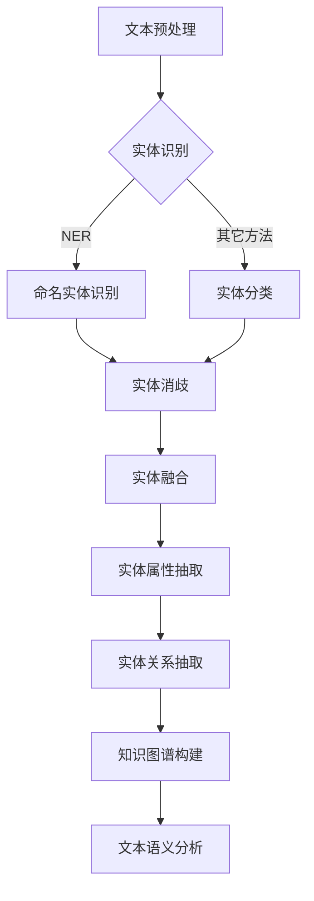
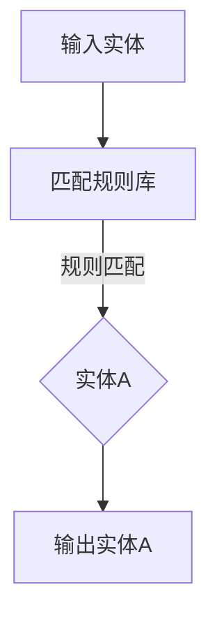
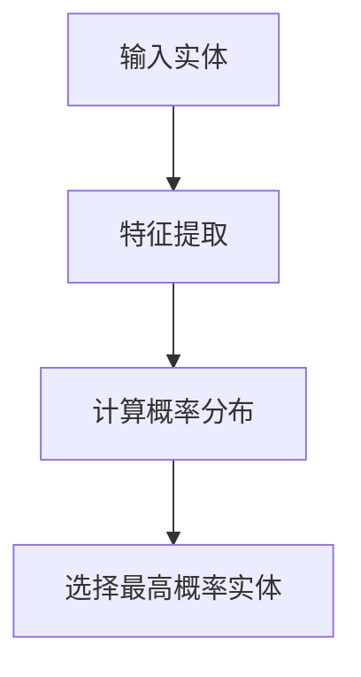
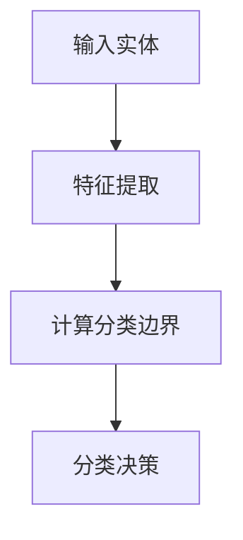
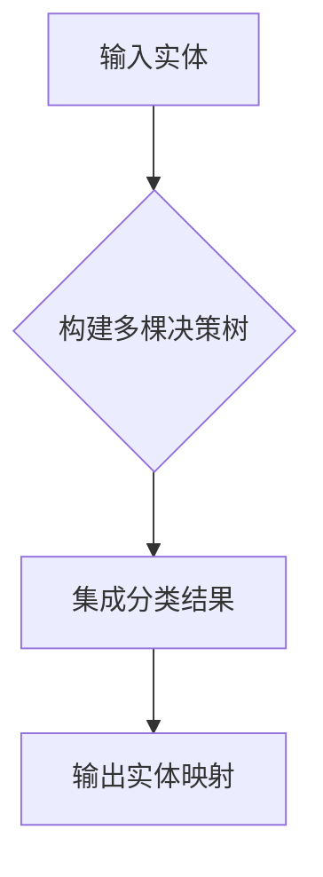
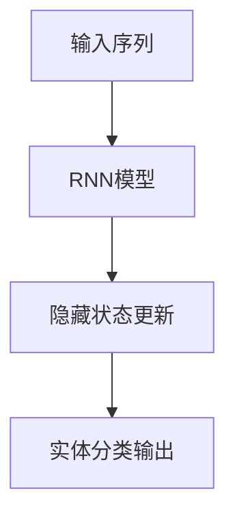
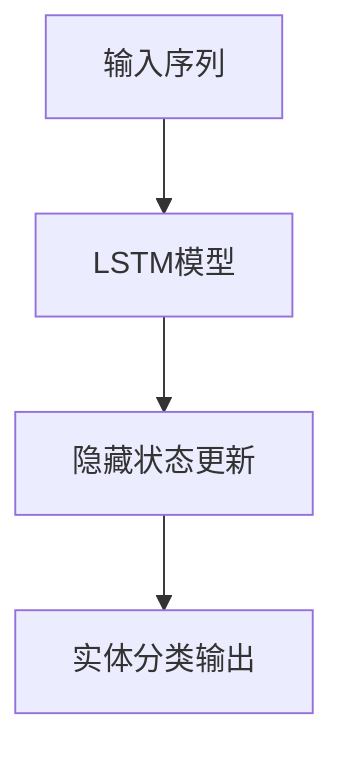
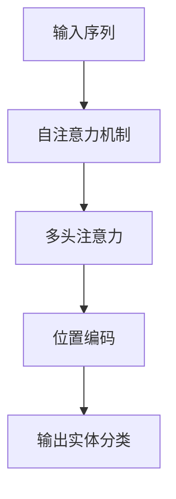
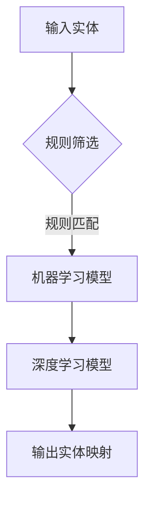
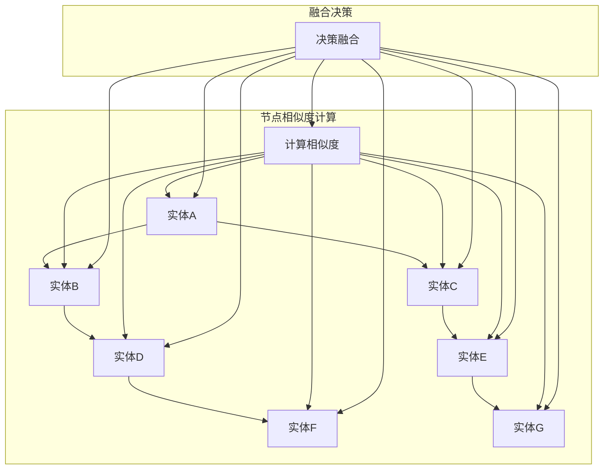

                 

## 文章标题：实体链接

实体链接（Entity Linking）是自然语言处理（NLP）领域的一项关键技术，旨在将文本中的实体（如人名、地点、组织等）与知识库中的实际实体进行匹配和映射。本文将深入探讨实体链接的核心概念、技术方法及其在实际应用中的重要性。

> 关键词：实体链接，命名实体识别，知识图谱，深度学习，多任务学习，迁移学习

### 摘要

本文首先介绍了实体链接的定义及其在自然语言处理中的重要性。随后，我们详细阐述了实体链接技术的发展历程，包括基于规则的方法、基于统计的方法以及基于深度学习的方法。接着，本文重点讨论了实体识别与分类、实体消歧与融合等关键技术，并分析了其在搜索引擎、文本语义分析、知识图谱构建等应用场景中的作用。此外，本文还探讨了跨语言实体链接的挑战和解决方案，以及深度学习、多任务学习和迁移学习等前沿技术方法在实体链接中的应用。最后，本文总结了实体链接技术的未来发展方向，并提供了相关的工具和资源。

## 目录大纲

### 第一部分：实体链接基础

#### 第1章：实体链接概述

- 1.1 实体链接的定义与重要性
- 1.2 实体链接的发展历程
- 1.3 实体链接的应用场景
- 1.4 实体链接的技术框架

#### 第2章：实体识别与分类

- 2.1 实体识别的基本概念
- 2.2 实体识别方法与算法
- 2.3 实体分类方法与算法
- 2.4 实体识别与分类的性能评估

#### 第3章：实体消歧与融合

- 3.1 实体消歧的概念与挑战
- 3.2 实体消歧方法与算法
- 3.3 实体融合方法与算法

### 第二部分：实体链接应用案例

#### 第4章：搜索引擎中的实体链接

- 4.1 搜索引擎中的实体链接作用
- 4.2 搜索引擎中的实体链接方法
- 4.3 搜索引擎中的实体链接优化策略

#### 第5章：文本语义分析中的实体链接

- 5.1 文本语义分析中的实体链接应用
- 5.2 文本语义分析中的实体链接方法
- 5.3 文本语义分析中的实体链接挑战与解决方案

#### 第6章：知识图谱构建中的实体链接

- 6.1 知识图谱的概念与作用
- 6.2 知识图谱构建中的实体链接方法
- 6.3 知识图谱构建中的实体链接挑战与解决方案

#### 第7章：跨语言实体链接

- 7.1 跨语言实体链接的挑战
- 7.2 跨语言实体链接方法与算法
- 7.3 跨语言实体链接应用场景与案例分析

### 第三部分：实体链接技术研究前沿

#### 第8章：实体链接中的深度学习方法

- 8.1 深度学习在实体链接中的应用
- 8.2 基于深度学习的实体识别方法
- 8.3 基于深度学习的实体消歧方法

#### 第9章：实体链接中的多任务学习

- 9.1 多任务学习的概念与优势
- 9.2 多任务学习在实体链接中的应用
- 9.3 多任务学习的挑战与解决方案

#### 第10章：实体链接中的迁移学习

- 10.1 迁移学习的概念与优势
- 10.2 迁移学习在实体链接中的应用
- 10.3 迁移学习的挑战与解决方案

#### 第11章：实体链接中的图神经网络

- 11.1 图神经网络的基本概念
- 11.2 图神经网络在实体链接中的应用
- 11.3 图神经网络在实体链接中的挑战与解决方案

#### 第12章：未来实体链接技术研究方向

- 12.1 实体链接技术的未来发展
- 12.2 实体链接技术面临的挑战
- 12.3 未来实体链接技术研究方向

#### 附录

- 附录 A：实体链接相关工具与资源
- 附录 B：常用代码与算法实现

## 第一部分：实体链接基础

### 第1章：实体链接概述

实体链接是指将自然语言文本中的实体（如人名、地点、组织等）与外部知识库中的实际实体进行匹配和映射的过程。它是连接文本信息和知识库信息的重要桥梁，对于提升文本处理和语义理解的能力具有重要意义。

### 1.1 实体链接的定义与重要性

#### 定义

实体链接（Entity Linking），也称为命名实体识别（Named Entity Recognition，NER）或实体识别（Entity Recognition），是指从文本中识别出具有特定意义的实体，并为其分配一个唯一的标识符或标签，以便与知识库中的实体进行匹配和映射。

实体链接通常包括以下几个关键步骤：

1. **实体识别**：从文本中识别出可能的实体，如人名、地点、组织等。
2. **实体分类**：对识别出的实体进行分类，确定其实体类型。
3. **实体消歧**：解决实体指代歧义问题，将文本中的实体与知识库中的实体进行准确映射。
4. **实体融合**：将同一实体的不同表达形式进行合并，提高实体链接的准确性。

#### 重要性

实体链接在自然语言处理和知识图谱构建中扮演着重要角色，其重要性主要体现在以下几个方面：

1. **信息检索优化**：实体链接技术可以帮助搜索引擎更准确地理解用户查询，提高搜索结果的相关性和准确性。
2. **知识图谱构建**：实体链接是实现知识图谱构建的重要步骤，有助于构建更完整和准确的实体关系网络。
3. **文本语义分析**：实体链接技术有助于提高文本语义分析的效果，为问答系统、情感分析等应用提供支持。
4. **跨语言处理**：实体链接技术在跨语言文本处理中扮演重要角色，有助于实现不同语言文本之间的语义对齐。

### 1.2 实体链接的发展历程

实体链接技术经历了从简单规则匹配到基于机器学习再到深度学习的演变过程。主要可以分为以下几个阶段：

#### 基于规则的方法

早期的实体链接主要依赖于手动定义的规则和词典，如命名实体识别（NER）系统。这种方法简单但受限于规则库的覆盖范围和灵活性。

1. **手工定义规则**：根据实体特征，设计特定的匹配规则。
2. **词典匹配**：利用预定义的实体词典，对文本进行匹配。

#### 基于统计的方法

随着语料库的积累和统计学习方法的兴起，基于统计的实体链接方法开始出现，如基于隐马尔可夫模型（HMM）和条件随机场（CRF）的方法。

1. **隐马尔可夫模型（HMM）**：利用状态转移概率和发射概率进行实体识别。
2. **条件随机场（CRF）**：在HMM的基础上，引入序列上下文信息，提高识别准确率。

#### 基于深度学习的方法

近年来，深度学习技术在实体链接领域取得了显著进展，如基于循环神经网络（RNN）和变压器（Transformer）的方法。

1. **循环神经网络（RNN）**：利用RNN的序列建模能力，对文本进行逐词编码，然后进行实体识别。
2. **卷积神经网络（CNN）**：利用CNN的局部特征提取能力，对文本进行特征提取，然后进行实体识别。
3. **变压器（Transformer）**：利用自注意力机制，对文本进行全局建模，实现高效的实体识别。

### 1.3 实体链接的应用场景

实体链接技术在多个领域有着广泛的应用，主要包括：

1. **搜索引擎**：通过实体链接技术，搜索引擎可以更准确地理解用户查询，提高搜索结果的相关性和准确性。
2. **知识图谱构建**：实体链接是实现知识图谱构建的重要步骤，有助于构建更完整和准确的实体关系网络。
3. **问答系统**：实体链接有助于提高问答系统的回答准确性，通过对问题中的实体进行链接，可以更好地理解问题的语义。
4. **文本语义分析**：实体链接技术有助于提高文本语义分析的效果，为情感分析、文本分类等应用提供支持。
5. **跨语言处理**：实体链接在跨语言文本处理中扮演重要角色，有助于实现不同语言文本之间的语义对齐。

### 1.4 实体链接的技术框架

实体链接技术框架主要包括以下几个关键组件：

1. **实体识别**：从文本中识别出可能的实体，通常采用命名实体识别（NER）技术。
2. **实体分类**：对识别出的实体进行分类，确定其实体类型。
3. **实体消歧**：解决实体指代歧义问题，将文本中的实体与知识库中的实体进行匹配和映射。
4. **实体融合**：将同一实体的不同表达形式进行合并，提高实体链接的准确性。
5. **实体属性抽取**：从实体链接的文本中提取实体的属性信息，如人名的出生日期、地点的行政区划等。
6. **实体关系抽取**：识别实体之间的相互关系，如人物关系、组织关系等。

通过以上技术框架，实体链接技术能够有效地提高文本处理和语义理解的效果，为各个应用领域提供支持。``````

### 1.5 实体链接与相关技术的联系

实体链接技术与其他自然语言处理（NLP）技术密切相关，下面将介绍实体链接与命名实体识别（NER）、知识图谱、文本语义分析等技术的联系。

#### 实体链接与命名实体识别（NER）

命名实体识别（NER）是实体链接的基础步骤。NER旨在从文本中识别出具有特定意义的实体，如人名、地点、组织等。NER的输出结果为文本中的每个实体及其边界，为后续的实体链接提供了必要的数据支持。

实体链接与NER之间的联系在于：

- **NER作为前处理**：NER作为实体链接的前处理步骤，为实体链接提供了识别出的实体及其边界信息。
- **NER与实体消歧**：NER识别出的实体可能存在指代歧义，需要通过实体消歧技术解决。实体消歧依赖于NER的识别结果，以确定实体的实际指代。

#### 实体链接与知识图谱

知识图谱是一种结构化的知识表示形式，通过实体、关系和属性的连接，构建出一个全面、准确的知识网络。实体链接与知识图谱之间的联系在于：

- **知识图谱作为实体链接的后处理**：实体链接将文本中的实体映射到知识图谱中的实际实体，通过知识图谱提供更多的实体属性和关系信息。
- **实体链接与知识图谱构建**：实体链接是实现知识图谱构建的重要步骤，有助于构建更完整和准确的实体关系网络。

#### 实体链接与文本语义分析

文本语义分析旨在理解文本的语义信息，包括情感分析、文本分类、问答系统等。实体链接与文本语义分析之间的联系在于：

- **实体链接作为文本语义分析的前处理**：实体链接技术可以为文本语义分析提供更准确的实体信息，有助于提高文本语义分析的效果。
- **实体链接与文本语义理解**：实体链接有助于提高文本语义分析的效果，为问答系统、情感分析等应用提供支持。

通过以上联系，可以看出实体链接技术在自然语言处理领域的重要地位，为多个NLP任务提供基础支持。

### 1.6 实体链接技术的 Mermaid 流程图

为了更清晰地展示实体链接技术的整体流程，我们使用 Mermaid 图形语法绘制了一个流程图，如下所示：



在上面的流程图中，A 表示文本预处理，B 表示实体识别，C 表示命名实体识别，D 表示实体分类，E 表示实体消歧，F 表示实体融合，G 表示实体属性抽取，H 表示实体关系抽取，I 表示知识图谱构建，J 表示文本语义分析。通过这个流程图，我们可以更直观地了解实体链接技术在整个自然语言处理流程中的作用。``````

### 1.7 实体链接中的核心算法原理讲解

实体链接技术的核心在于将文本中的实体与知识库中的实际实体进行匹配和映射。在这个过程中，核心算法主要分为实体识别、实体分类、实体消歧、实体融合和实体关系抽取等几个方面。以下将详细讲解这些核心算法的原理，并使用伪代码进行阐述。

#### 1.7.1 实体识别（Named Entity Recognition，NER）

实体识别是实体链接的第一步，旨在从文本中识别出具有特定意义的实体，如人名、地点、组织等。常见的实体识别算法包括基于规则的方法、基于统计的方法和基于深度学习的方法。

**基于规则的方法**：
```python
def rule_based_ner(text):
    rules = load_rules()  # 加载预定义的实体识别规则
    entities = []
    tokens = tokenize(text)  # 分词
    for token in tokens:
        for rule in rules:
            if matches_rule(token, rule):
                entities.append((token, rule['type']))
                break
    return entities

def matches_rule(token, rule):
    # 判断token是否满足规则
    # 例如：判断token是否是人名
    return True or False

def tokenize(text):
    # 分词操作
    return [token for token in text.split()]
```

**基于统计的方法**：
```python
def statistical_ner(text):
    model = load_model()  # 加载训练好的统计模型
    entities = []
    tokens = tokenize(text)
    for token in tokens:
        entity_type = model.predict_entity_type(token)
        entities.append((token, entity_type))
    return entities
```

**基于深度学习的方法**：
```python
def deep_learning_ner(text):
    model = load_model()  # 加载训练好的深度学习模型
    entities = []
    tokens = tokenize(text)
    token_embeddings = model.encode(tokens)
    entity_types = model.predict_entity_types(token_embeddings)
    for token, entity_type in zip(tokens, entity_types):
        entities.append((token, entity_type))
    return entities
```

#### 1.7.2 实体分类（Entity Classification）

实体分类是对识别出的实体进行分类，确定其实体类型，如人名、地点、组织等。常见的实体分类算法包括朴素贝叶斯分类器、支持向量机（SVM）和随机森林（Random Forest）等。

**朴素贝叶斯分类器**：
```python
def naive_bayes_classifier(entities):
    model = load_model()  # 加载训练好的朴素贝叶斯分类器模型
    entity_types = []
    for entity in entities:
        entity_type = model.predict(entity)
        entity_types.append(entity_type)
    return entity_types
```

**支持向量机（SVM）**：
```python
def svm_classifier(entities):
    model = load_model()  # 加载训练好的SVM模型
    entity_types = []
    for entity in entities:
        entity_features = extract_features(entity)
        entity_type = model.predict(entity_features)
        entity_types.append(entity_type)
    return entity_types

def extract_features(entity):
    # 从实体中提取特征
    return [feature for feature in entity]
```

**随机森林（Random Forest）**：
```python
def random_forest_classifier(entities):
    model = load_model()  # 加载训练好的随机森林模型
    entity_types = []
    for entity in entities:
        entity_features = extract_features(entity)
        entity_type = model.predict(entity_features)
        entity_types.append(entity_type)
    return entity_types
```

#### 1.7.3 实体消歧（Entity Disambiguation）

实体消歧是指解决实体指代歧义问题，将文本中的实体与知识库中的实体进行准确映射。常见的实体消歧算法包括基于规则的方法、基于机器学习的方法和基于深度学习的方法。

**基于规则的方法**：
```python
def rule_based_disambiguation(entities):
    disambiguators = load_disambiguators()  # 加载预定义的实体消歧规则
    matched_entities = []
    for entity in entities:
        matched_entity = disambiguate(entity, disambiguators)
        matched_entities.append(matched_entity)
    return matched_entities

def disambiguate(entity, disambiguators):
    # 根据实体和规则进行消歧
    return matched_entity
```

**基于机器学习的方法**：
```python
def machine_learning_disambiguation(entities):
    model = load_model()  # 加载训练好的机器学习模型
    matched_entities = []
    for entity in entities:
        entity_features = extract_features(entity)
        matched_entity = model.predict(entity_features)
        matched_entities.append(matched_entity)
    return matched_entities
```

**基于深度学习的方法**：
```python
def deep_learning_disambiguation(entities):
    model = load_model()  # 加载训练好的深度学习模型
    matched_entities = []
    for entity in entities:
        entity_features = model.encode(entity)
        matched_entity = model.predict(entity_features)
        matched_entities.append(matched_entity)
    return matched_entities
```

#### 1.7.4 实体融合（Entity Fusion）

实体融合是指将同一实体的不同表达形式进行合并，提高实体链接的准确性。常见的实体融合算法包括基于词典的方法、基于图论的方法和基于深度学习的方法。

**基于词典的方法**：
```python
def dictionary_based_fusion(entities):
    fusion_dict = load_dictionary()  # 加载预定义的实体融合词典
    fused_entities = []
    for entity in entities:
        fused_entity = fuse_entity(entity, fusion_dict)
        fused_entities.append(fused_entity)
    return fused_entities

def fuse_entity(entity, fusion_dict):
    # 根据实体和词典进行融合
    return fused_entity
```

**基于图论的方法**：
```python
def graph_based_fusion(entities):
    graph = create_graph(entities)  # 创建实体图
    fused_entities = []
    for node in graph.nodes:
        fused_entity = fuse_nodes(node, graph)
        fused_entities.append(fused_entity)
    return fused_entities

def fuse_nodes(node, graph):
    # 根据节点和图进行融合
    return fused_entity
```

**基于深度学习的方法**：
```python
def deep_learning_fusion(entities):
    model = load_model()  # 加载训练好的深度学习模型
    fused_entities = []
    for entity in entities:
        entity_features = model.encode(entity)
        fused_entity = model.predict(entity_features)
        fused_entities.append(fused_entity)
    return fused_entities
```

通过以上算法，实体链接技术能够有效地将文本中的实体与知识库中的实际实体进行匹配和映射，从而提高文本处理和语义理解的效果。``````

### 1.8 数学模型和公式 & 详细讲解 & 举例说明

在实体链接过程中，许多算法和模型都基于特定的数学模型和公式。以下将详细介绍一些关键模型及其公式，并使用LaTeX格式进行展示。

#### 1.8.1 隐马尔可夫模型（HMM）

隐马尔可夫模型（HMM）是一种基于状态转移概率和观测概率的统计模型，用于序列数据的标注。

**状态转移概率**：
$$
P(s_t|s_{t-1}) = \frac{P(s_{t-1})P(s_t|s_{t-1})}{P(s_{t-1})}
$$
其中，$s_t$ 表示第 $t$ 个状态，$s_{t-1}$ 表示第 $t-1$ 个状态，$P(s_t|s_{t-1})$ 表示从状态 $s_{t-1}$ 转移到状态 $s_t$ 的概率。

**观测概率**：
$$
P(o_t|s_t) = \frac{P(s_t)P(o_t|s_t)}{P(s_t)}
$$
其中，$o_t$ 表示第 $t$ 个观测值，$s_t$ 表示第 $t$ 个状态，$P(o_t|s_t)$ 表示在状态 $s_t$ 下产生观测值 $o_t$ 的概率。

**贝叶斯公式**：
$$
P(s_t|o_1, o_2, ..., o_t) = \frac{P(o_1, o_2, ..., o_t|s_t)P(s_t)}{P(o_1, o_2, ..., o_t)}
$$
其中，$s_t$ 表示第 $t$ 个状态，$o_1, o_2, ..., o_t$ 表示观测序列，$P(s_t|o_1, o_2, ..., o_t)$ 表示在观测序列 $o_1, o_2, ..., o_t$ 下状态 $s_t$ 的概率。

**举例说明**：

假设我们有一个简单的HMM，其中有两个状态：A和B，以及两个观测值：0和1。状态转移概率和观测概率如下表所示：

| 状态 | 转移概率 $P(s_t|s_{t-1})$ | 观测概率 $P(o_t|s_t)$ |
|------|-----------------------|---------------------|
| A    | 0.7                   | 0.4                 |
| B    | 0.3                   | 0.6                 |

给定一个观测序列为 0,1,1,0，使用Viterbi算法可以计算最优状态序列。

#### 1.8.2 条件随机场（CRF）

条件随机场（CRF）是一种用于序列标注的概率模型，可以处理带有依赖关系的序列数据。

**特征函数**：
$$
\psi(x_i, y_i) = \sum_{j} \phi_j(x_i, y_i, y_{i-1})
$$
其中，$x_i$ 表示第 $i$ 个观测值，$y_i$ 表示第 $i$ 个状态，$\phi_j(x_i, y_i, y_{i-1})$ 表示特征函数。

**条件概率**：
$$
P(y|x) = \frac{1}{Z} \exp \left( \sum_{i} \sum_{j} \theta_j \psi(x_i, y_i, y_{i-1}) \right)
$$
其中，$Z$ 表示规范化常数，$\theta_j$ 表示特征函数的权重。

**举例说明**：

假设我们有一个简单的CRF模型，其中有两个状态：A和B，以及两个特征函数：$f_1(x_i, y_i, y_{i-1})$ 和 $f_2(x_i, y_i, y_{i-1})$。特征函数和权重如下表所示：

| 特征函数 | $f_1(x_i, y_i, y_{i-1})$ | $f_2(x_i, y_i, y_{i-1})$ |
|----------|-----------------------|-----------------------|
| A        | 1                     | 0                     |
| B        | 0                     | 1                     |
| 权重     | $\theta_1 = 0.5$      | $\theta_2 = 0.5$      |

给定一个观测序列为 0,1,1,0，使用CRF模型可以计算每个状态的概率。

#### 1.8.3 循环神经网络（RNN）

循环神经网络（RNN）是一种用于处理序列数据的神经网络模型，可以捕获序列中的长期依赖关系。

**状态更新公式**：
$$
h_t = \sigma(W_h \cdot [h_{t-1}, x_t] + b_h)
$$
其中，$h_t$ 表示第 $t$ 个隐藏状态，$x_t$ 表示第 $t$ 个输入，$W_h$ 和 $b_h$ 分别表示权重和偏置，$\sigma$ 表示激活函数。

**输出公式**：
$$
y_t = W_o \cdot h_t + b_o
$$
其中，$y_t$ 表示第 $t$ 个输出，$W_o$ 和 $b_o$ 分别表示输出权重和偏置。

**举例说明**：

假设我们有一个简单的RNN模型，输入序列为 [1, 2, 3]，隐藏层和输出层的权重分别为 $W_h = [1, 1]$ 和 $W_o = [1, 1]$，偏置分别为 $b_h = [1, 1]$ 和 $b_o = [1, 1]$，激活函数为ReLU。计算隐藏状态和输出。

- 输入序列：[1, 2, 3]
- 初始隐藏状态：$h_0 = [0, 0]$
- 计算隐藏状态：
  $$ h_1 = \sigma(W_h \cdot [h_0, x_1] + b_h) = \sigma([1 \cdot 0 + 1 \cdot 1 + 1], [1, 1]) = [1, 1] $$
  $$ h_2 = \sigma(W_h \cdot [h_1, x_2] + b_h) = \sigma([1 \cdot 1 + 1 \cdot 2 + 1], [1, 1]) = [1, 2] $$
  $$ h_3 = \sigma(W_h \cdot [h_2, x_3] + b_h) = \sigma([1 \cdot 1 + 1 \cdot 3 + 1], [1, 1]) = [1, 3] $$
- 计算输出：
  $$ y_1 = W_o \cdot h_1 + b_o = [1, 1] \cdot [1, 1] + [1, 1] = [2, 2] $$
  $$ y_2 = W_o \cdot h_2 + b_o = [1, 1] \cdot [1, 2] + [1, 1] = [2, 3] $$
  $$ y_3 = W_o \cdot h_3 + b_o = [1, 1] \cdot [1, 3] + [1, 1] = [2, 4] $$

通过上述数学模型和公式的详细讲解及举例说明，我们可以更好地理解实体链接技术中的关键算法原理。这些模型和公式为实体链接的实现提供了理论基础，有助于构建高效、准确的实体链接系统。``````
### 第2章：实体识别与分类

实体识别（Named Entity Recognition，NER）和实体分类（Named Entity Classification，NEC）是实体链接（Entity Linking）技术中的两个核心环节。本章将详细探讨实体识别与分类的基本概念、方法与算法，并分析其性能评估指标。

#### 2.1 实体识别的基本概念

实体识别是指从自然语言文本中识别出具有特定意义的实体，如人名、地点、组织、时间等。实体识别的目标是确定文本中每个单词或短语的实体类别，并将其标注出来。

**实体识别的关键要素**：

1. **实体类型**：常见的实体类型包括人名（PER）、地点（LOC）、组织（ORG）、时间（TIME）等。
2. **实体边界**：确定实体在文本中的起始和结束位置。
3. **实体识别率**：评估实体识别任务中正确识别的实体数量与总实体数量的比例。

**实体识别的挑战**：

1. **实体歧义**：同一词语在不同上下文中可能表示不同的实体，导致识别难度增加。
2. **长实体识别**：长实体（如地名、机构名）在文本中可能被分割。
3. **罕见实体识别**：罕见实体在训练数据中较少，识别难度较大。

#### 2.2 实体识别方法与算法

实体识别方法可以分为以下几类：

**基于规则的方法**

基于规则的方法通过预定义的规则和词典，对文本中的词语进行标注。这种方法简单高效，但受限于规则库的覆盖范围，容易产生漏检和误检。

1. **手工定义规则**：根据实体特征，设计特定的匹配规则。
2. **词典匹配**：利用预定义的实体词典，对文本进行匹配。

**基于统计的方法**

基于统计的方法通过分析大量标注数据，学习实体识别模式。常见的方法包括：

1. **隐马尔可夫模型（HMM）**：利用状态转移概率和发射概率进行实体识别。
2. **条件随机场（CRF）**：在HMM的基础上，引入序列上下文信息，提高识别准确率。

**基于深度学习的方法**

基于深度学习的方法近年来在实体识别任务中取得了显著进展。主要方法包括：

1. **循环神经网络（RNN）**：利用RNN的序列建模能力，对文本进行逐词编码，然后进行实体识别。
2. **卷积神经网络（CNN）**：利用CNN的局部特征提取能力，对文本进行特征提取，然后进行实体识别。
3. **长短期记忆网络（LSTM）**：LSTM是RNN的一种改进，能够更好地处理长距离依赖问题。

**伪代码示例**

以下是一个简单的基于规则和HMM的实体识别伪代码示例：

```python
# 基于规则的方法
def rule_based_ner(text):
    rules = load_rules()
    entities = []
    tokens = tokenize(text)
    for token in tokens:
        for rule in rules:
            if matches_rule(token, rule):
                entities.append((token, rule['type']))
                break
    return entities

# 基于HMM的方法
def hmm_ner(text):
    model = load_hmm_model()
    entities = []
    tokens = tokenize(text)
    for token in tokens:
        entity_type = model.predict_entity_type(token)
        entities.append((token, entity_type))
    return entities
```

#### 2.3 实体分类方法与算法

实体分类是对识别出的实体进行分类，确定其实体类型。实体分类的目的是将实体映射到预定义的实体类别标签中。

**实体分类的关键要素**：

1. **分类标签**：根据实体类型，定义相应的分类标签，如人名（PER）、地点（LOC）等。
2. **分类模型**：训练分类模型，对实体进行类型预测。

**实体分类方法与算法**

实体分类方法主要可以分为以下几类：

1. **朴素贝叶斯分类器（Naive Bayes）**：利用贝叶斯定理，通过特征概率计算实体类别。
2. **支持向量机（SVM）**：通过最大化分类边界，进行分类预测。
3. **随机森林（Random Forest）**：利用多棵决策树进行集成学习，提高分类性能。
4. **深度学习分类模型**：利用深度学习模型，如卷积神经网络（CNN）、循环神经网络（RNN）等，进行实体分类。

**伪代码示例**

以下是一个简单的朴素贝叶斯分类器和SVM分类的伪代码示例：

```python
# 朴素贝叶斯分类器
def naive_bayes_classifier(entities):
    model = load_naive_bayes_model()
    entity_types = []
    for entity in entities:
        entity_type = model.predict(entity)
        entity_types.append(entity_type)
    return entity_types

# 支持向量机分类器
def svm_classifier(entities):
    model = load_svm_model()
    entity_types = []
    for entity in entities:
        entity_features = extract_features(entity)
        entity_type = model.predict(entity_features)
        entity_types.append(entity_type)
    return entity_types
```

#### 2.4 实体识别与分类的性能评估

实体识别与分类的性能评估主要通过以下指标进行：

1. **准确率（Accuracy）**：正确识别或分类的实体数量与总实体数量的比例。
2. **召回率（Recall）**：正确识别或分类的实体数量与实际实体数量的比例。
3. **F1值（F1-score）**：综合考虑准确率和召回率，用于评估分类模型的整体性能。

**性能评估公式**

- **准确率**：
  $$
  \text{Accuracy} = \frac{\text{正确识别/分类的实体数量}}{\text{总实体数量}}
  $$

- **召回率**：
  $$
  \text{Recall} = \frac{\text{正确识别/分类的实体数量}}{\text{实际实体数量}}
  $$

- **F1值**：
  $$
  \text{F1-score} = 2 \times \frac{\text{准确率} \times \text{召回率}}{\text{准确率} + \text{召回率}}
  $$

通过以上方法与算法，实体识别与分类可以为后续的实体链接任务提供基础支持，提高文本处理和语义理解的效果。本章的核心概念和算法原理，以及性能评估指标，为构建高效的实体识别与分类系统提供了理论基础。``````
### 2.5 实体识别与分类的性能评估指标

在实体识别与分类任务中，性能评估是评估算法优劣的重要手段。性能评估主要通过以下指标进行：

#### 2.5.1 准确率（Accuracy）

准确率是指正确识别或分类的实体数量与总实体数量的比例。公式如下：

$$
\text{Accuracy} = \frac{\text{正确识别/分类的实体数量}}{\text{总实体数量}}
$$

**示例**：

假设我们有一个文本段落，其中包含10个实体，我们的实体识别算法识别出了8个实体，其中有7个实体被正确识别。那么准确率为：

$$
\text{Accuracy} = \frac{7}{10} = 0.7 \text{ 或 } 70\%
$$

#### 2.5.2 召回率（Recall）

召回率是指正确识别或分类的实体数量与实际实体数量的比例。公式如下：

$$
\text{Recall} = \frac{\text{正确识别/分类的实体数量}}{\text{实际实体数量}}
$$

**示例**：

在上述示例中，假设实际存在的实体数量为9个，我们的算法正确识别了7个实体。那么召回率为：

$$
\text{Recall} = \frac{7}{9} \approx 0.78 \text{ 或 } 78\%
$$

#### 2.5.3 F1值（F1-score）

F1值是准确率和召回率的调和平均值，用于综合考虑这两个指标。公式如下：

$$
\text{F1-score} = 2 \times \frac{\text{准确率} \times \text{召回率}}{\text{准确率} + \text{召回率}}
$$

**示例**：

在上述示例中，准确率为70%，召回率为78%，那么F1值为：

$$
\text{F1-score} = 2 \times \frac{0.7 \times 0.78}{0.7 + 0.78} \approx 0.76 \text{ 或 } 76\%
$$

#### 2.5.4 实际应用中的评估方法

在实际应用中，我们通常使用以下方法来评估实体识别与分类的性能：

1. **交叉验证**：通过将数据集划分为多个子集，对每个子集进行训练和测试，计算平均值来评估模型性能。
2. **混淆矩阵**：展示每个类别被正确分类和错误分类的情况，帮助分析模型在不同类别上的性能。
3. **精确率与召回率**：精确率是指正确识别的实体中实际为该类别的比例，公式为：

   $$
   \text{Precision} = \frac{\text{正确识别的实体数量}}{\text{识别为该类别的实体数量}}
   $$

通过以上性能评估指标，我们可以全面了解实体识别与分类算法的优劣，并根据评估结果调整模型参数，优化算法性能。

### 2.6 实体识别与分类在文本处理中的应用

实体识别与分类在文本处理中具有广泛的应用，主要包括以下几个方面：

1. **信息提取**：通过实体识别与分类，可以从大量文本数据中提取出关键信息，如人名、地点、组织等。
2. **语义理解**：实体识别与分类有助于提高文本语义理解的能力，为问答系统、情感分析等任务提供支持。
3. **知识图谱构建**：实体识别与分类是实现知识图谱构建的基础，有助于构建更完整和准确的实体关系网络。
4. **搜索引擎优化**：通过实体识别与分类，可以提高搜索引擎的搜索效果，实现更准确的搜索结果。

总之，实体识别与分类在文本处理中扮演着重要角色，通过性能评估和实际应用，我们可以不断提高算法的准确性和实用性。``````
### 3.1 实体消歧的概念与挑战

实体消歧（Entity Disambiguation）是指从文本中识别出的多个可能的实体中，选择最合适的实体进行映射和链接的过程。其目的是解决实体指代歧义问题，提高实体链接的准确性和可靠性。

#### 概念

实体消歧的关键在于理解文本中的实体引用与知识库中的实体之间的对应关系。在实体识别过程中，文本中可能会出现多个与知识库中实体匹配的候选实体，这些实体在不同的上下文中可能指代同一个实体。实体消歧的目标是确定这些候选实体中哪个是实际指代的实体。

**实体消歧的核心要素**：

1. **候选实体**：从实体识别过程中获得的多个可能匹配的实体。
2. **上下文信息**：用于辅助消歧的信息，如实体名称、实体属性、上下文句法关系等。
3. **实体映射**：将候选实体映射到知识库中的实际实体。

#### 挑战

实体消歧面临以下主要挑战：

1. **实体歧义**：同一实体在不同上下文中可能指代不同的实体，例如，"IBM" 可能指代科技公司或某个具体的公司。
2. **长距离依赖**：实体消歧需要处理长距离依赖关系，例如，某个实体可能在句子或文档的较远位置得到明确的指代。
3. **罕见实体**：罕见实体在知识库中可能没有详细的属性信息，导致消歧难度增加。
4. **数据稀缺**：实体消歧需要大量的标注数据进行训练，但高质量的数据获取困难。

#### 消歧过程

实体消歧通常包括以下步骤：

1. **候选实体生成**：从实体识别结果中提取可能的候选实体。
2. **上下文分析**：结合上下文信息，评估候选实体与实际实体的关联度。
3. **属性匹配**：利用实体属性信息，如年龄、地点、职业等，进行候选实体的筛选和排序。
4. **关系推理**：根据实体之间的关系，如亲属关系、工作关系等，进行进一步的消歧。
5. **模型预测**：利用机器学习或深度学习模型，对候选实体进行概率预测，选择最合适的实体进行映射。

### 挑战分析

#### 实体歧义

实体歧义是实体消歧中最常见和最复杂的问题。实体歧义导致多个候选实体可能与文本中的实体匹配，从而增加了消歧的难度。例如，"Michael" 可能指代多人，如迈克尔·乔丹（Michael Jordan）或迈克尔·杰克逊（Michael Jackson）。

**解决策略**：

1. **上下文分析**：利用上下文信息，如句法结构、实体名称、同义词等，减少歧义。
2. **知识图谱**：利用知识图谱中的实体关系和属性信息，辅助消歧过程。
3. **实体分类**：对候选实体进行分类，根据实体类型减少歧义。

#### 长距离依赖

长距离依赖指的是实体消歧需要处理跨文档或跨句子中的实体指代。例如，"she" 可能在较远的句子中指代某个特定的人物。

**解决策略**：

1. **注意力机制**：利用注意力机制，关注重要的上下文信息，减少长距离依赖的影响。
2. **长序列模型**：使用能够处理长序列的模型，如变换器（Transformer），提高长距离依赖的处理能力。
3. **共指消解算法**：结合共指消解算法，如指代消解（Coreference Resolution），处理长距离依赖问题。

#### 罕见实体

罕见实体在知识库中可能没有详细的属性信息，导致消歧难度增加。例如，"Aviatur" 可能是一个罕见的地名或组织名。

**解决策略**：

1. **知识图谱扩展**：通过扩展知识图谱，增加罕见实体的属性信息，提高消歧能力。
2. **众包数据收集**：利用众包平台，收集罕见实体的属性信息，丰富知识库。
3. **迁移学习**：利用迁移学习，将已有模型的特征迁移到罕见实体上，提高消歧性能。

#### 数据稀缺

高质量的数据是实体消歧算法训练的基础。数据稀缺会导致模型性能下降，特别是在罕见实体和长距离依赖处理方面。

**解决策略**：

1. **数据增强**：通过数据增强技术，如数据扩充、数据扰动等，生成更多训练样本。
2. **半监督学习**：利用少量标注数据，结合未标注数据，通过半监督学习提高模型性能。
3. **在线学习**：通过在线学习，利用用户反馈和实际应用中的新数据，动态调整模型。

通过以上分析和解决策略，实体消歧技术可以更好地应对挑战，提高实体链接的准确性和可靠性。``````
### 3.2 实体消歧方法与算法

实体消歧是实体链接过程中的关键步骤，其目标是从多个可能的实体候选中选出最合适的实体进行映射。以下将详细介绍几种常见的实体消歧方法与算法，包括基于规则的方法、基于机器学习的方法和基于深度学习的方法。

#### 3.2.1 基于规则的方法

**手工定义规则**：

基于规则的方法是实体消歧的早期方法，通过手工定义一系列规则来匹配和筛选实体。这些规则通常基于实体名称、上下文信息、同义词词典等特征。例如，如果实体名称包含“总统”，则该实体可能是指一个国家的领导人。



**优点**：规则方法简单直观，易于实现。

**缺点**：规则库维护成本高，且难以处理复杂和罕见的实体。

#### 3.2.2 基于机器学习的方法

**朴素贝叶斯分类器**：

朴素贝叶斯分类器是基于贝叶斯定理的一种简单有效的分类算法。它通过计算实体候选的概率分布，选择概率最高的实体作为映射结果。



**优点**：算法简单，适用于高维特征空间。

**缺点**：假设特征独立，可能忽略特征间的相关性。

**支持向量机（SVM）**：

支持向量机是一种强大的分类算法，通过最大化分类边界，将实体候选映射到不同的类别。



**优点**：适用于高维特征空间，分类边界明确。

**缺点**：训练时间较长，对于大规模数据集可能较慢。

**随机森林（Random Forest）**：

随机森林是一种基于决策树的集成学习方法，通过构建多棵决策树，提高分类的准确性和鲁棒性。



**优点**：提高分类性能，减少过拟合。

**缺点**：计算复杂度较高，对大规模数据集可能较慢。

#### 3.2.3 基于深度学习的方法

**循环神经网络（RNN）**：

循环神经网络是一种序列建模模型，能够处理长距离依赖问题，适用于实体消歧任务。



**优点**：能够处理长距离依赖，捕捉上下文信息。

**缺点**：训练时间较长，对于大规模数据集可能较慢。

**长短期记忆网络（LSTM）**：

长短期记忆网络是RNN的一种改进，能够更好地处理长序列数据。



**优点**：能够处理长序列数据，减少梯度消失问题。

**缺点**：参数复杂，计算成本高。

**变换器（Transformer）**：

变换器是一种基于自注意力机制的模型，能够高效地处理长文本序列。



**优点**：计算效率高，能够捕捉长距离依赖。

**缺点**：模型参数较大，训练成本高。

**实体消歧的混合方法**：

在实际应用中，常常结合多种方法进行实体消歧，以提高准确性和鲁棒性。例如，可以先使用基于规则的方法进行初步筛选，然后使用机器学习或深度学习模型进行进一步的消歧。



通过上述方法与算法的介绍，我们可以看到实体消歧技术的发展历程，从简单的规则方法到复杂的机器学习模型，再到先进的深度学习模型。每种方法都有其独特的优势和应用场景，在实际应用中可以根据具体需求选择合适的方法。``````
### 3.3 实体融合方法与算法

实体融合（Entity Fusion）是实体链接过程中的另一个关键环节，旨在将同一实体的不同表达形式进行合并，以确保实体在知识库中的表示一致。实体融合可以提高实体链接的准确性，避免因为实体表达形式不同而导致的信息丢失或错误。以下将详细介绍几种常见的实体融合方法与算法。

#### 3.3.1 基于词典的方法

基于词典的方法是实体融合的早期方法，通过预定义的实体词典将不同的实体表达形式进行匹配和融合。这种方法依赖于词典的完整性和准确性。

**词典匹配算法**：

1. **基于字符串匹配**：通过字符串匹配算法（如模糊匹配、模糊字符串搜索等）将文本中的实体表达形式与词典中的实体名称进行匹配。
2. **基于词嵌入**：利用词嵌入技术（如Word2Vec、BERT等）将实体表达形式转换为向量表示，然后计算向量之间的相似度，选择最相似的实体进行融合。

**优点**：简单高效，适用于小规模和特定领域的实体融合。

**缺点**：依赖于词典的覆盖范围和准确性，对于罕见实体或新出现的实体表达形式效果较差。

#### 3.3.2 基于图论的方法

基于图论的方法通过构建实体及其表达形式的图结构，利用图算法进行实体融合。这种方法能够处理复杂的实体关系和表达形式。

**图论方法的基本步骤**：

1. **图构建**：将实体及其不同的表达形式表示为图中的节点，将实体之间的关系表示为图中的边。
2. **相似度计算**：计算图中节点之间的相似度，通常使用基于文本相似度（如余弦相似度、Jaccard相似度等）或基于图结构（如基于路径的相似度、基于聚类系数的相似度等）的方法。
3. **融合决策**：根据节点相似度进行融合决策，将相似度较高的节点合并为一个实体。

**常见算法**：

1. **基于社区发现的实体融合**：通过社区发现算法（如Louvain算法、Girvan-Newman算法等）识别出实体表达形式之间的社区结构，然后基于社区结构进行融合。
2. **基于图嵌入的实体融合**：使用图嵌入技术（如节点嵌入、图嵌入等）将实体及其表达形式转换为向量表示，然后利用相似度度量进行融合。

**优点**：能够处理复杂的实体关系和表达形式，适用于大规模和多样化的实体融合。

**缺点**：计算复杂度较高，对计算资源要求较高。

#### 3.3.3 基于深度学习的方法

基于深度学习的方法利用神经网络模型对实体及其表达形式进行建模和融合。这种方法能够自动学习实体特征和关系，提高实体融合的准确性。

**深度学习方法的基本步骤**：

1. **特征提取**：使用深度学习模型（如卷积神经网络（CNN）、循环神经网络（RNN）、变换器（Transformer）等）从文本中提取实体表达形式的特征。
2. **融合模型**：构建深度学习模型，将实体表达形式的特征进行融合，输出实体的统一表示。
3. **融合决策**：利用融合模型对实体表达形式进行融合，选择最合适的表达形式进行合并。

**常见算法**：

1. **基于注意力机制的实体融合**：使用注意力机制（如自注意力、多头注意力等）对实体表达形式的特征进行加权融合，提高融合的准确性。
2. **基于图神经网络的实体融合**：使用图神经网络（如图卷积网络（GCN）、图变换器（GAT）等）对实体及其表达形式进行建模和融合，利用图结构信息提高融合效果。

**优点**：能够自动学习实体特征和关系，适用于大规模和多样化的实体融合。

**缺点**：模型参数较多，训练成本较高。

#### 实例说明

以下是一个简单的基于图论的实体融合算法实例：



在这个例子中，我们有五个实体及其不同的表达形式。通过计算节点相似度，我们可以确定哪些实体表达形式应该进行融合，最后输出融合后的实体表示。

通过以上方法与算法的介绍，我们可以看到实体融合技术在实体链接中的应用非常重要。不同的方法适用于不同的场景，实际应用中可以根据具体需求选择合适的方法。``````
### 4.1 搜索引擎中的实体链接作用

在搜索引擎中，实体链接扮演着至关重要的角色，它能够显著提升搜索结果的相关性和准确性，优化用户体验。实体链接通过将用户查询中的关键词与知识库中的实际实体进行映射，使得搜索引擎能够更智能地理解用户意图，从而提供更为精准的搜索结果。以下从几个方面详细探讨实体链接在搜索引擎中的作用：

#### 提升搜索结果的相关性

通过实体链接，搜索引擎能够识别用户查询中的关键实体，并将它们与知识库中的实体进行匹配。这种匹配有助于搜索引擎理解用户查询的真正意图，从而提供更加相关的搜索结果。例如，当用户输入“迈克尔·乔丹”时，搜索引擎可以识别出这是一个具体的人名实体，并将搜索结果聚焦于与迈克尔·乔丹相关的信息，而不是泛泛的信息。

#### 优化搜索结果的排序

实体链接还能够影响搜索结果的排序。通过分析实体之间的关联关系和实体的属性信息，搜索引擎可以更好地理解每个搜索结果的相关性。例如，当一个页面包含与用户查询相关的多个实体时，搜索引擎可能会优先展示这个页面。此外，实体链接还可以帮助搜索引擎识别出高质量的网站和权威的信息源，从而提高搜索结果的排序质量。

#### 提高搜索建议的准确性

实体链接技术还可以为用户提供更准确的搜索建议。当用户输入部分查询时，搜索引擎可以利用实体链接技术预测用户可能想要搜索的完整实体，并提供相应的搜索建议。例如，当用户输入“苹果”时，搜索引擎可以识别出这是一个苹果公司（Apple Inc.）的实体，并建议用户输入“苹果公司”以获取更精确的结果。

#### 丰富搜索结果展示

实体链接技术能够为搜索结果添加额外的信息，如实体简介、相关图片、地理位置等，从而丰富用户的搜索体验。例如，当用户搜索某个地点时，搜索引擎可以展示该地点的地图、历史信息、附近景点等，使得用户能够更全面地了解相关信息。

#### 改善广告投放

实体链接技术还可以提高广告投放的准确性。通过识别用户查询中的关键实体，搜索引擎可以更精确地定位广告受众，提高广告投放的效果。例如，当用户搜索某个品牌时，搜索引擎可以针对性地展示该品牌的广告，从而提高广告的点击率和转化率。

总之，实体链接在搜索引擎中的应用不仅提升了搜索结果的相关性和准确性，还优化了用户的搜索体验，提高了广告投放的效果。随着实体链接技术的不断发展，它将在搜索引擎领域发挥越来越重要的作用。``````
### 4.2 搜索引擎中的实体链接方法

在搜索引擎中实现实体链接，需要通过一系列的方法和技术将用户查询中的关键词与知识库中的实体进行准确映射。以下详细介绍几种常见的实体链接方法：

#### 4.2.1 基于词典的方法

基于词典的方法是实体链接的一种简单而有效的方法。这种方法依赖于一个预定义的实体词典，其中包含了各种实体的名称和对应的标识符。当用户查询输入到搜索引擎时，系统会首先利用词典进行匹配，将查询中的关键词映射到词典中的实体。

**词典匹配算法**：

1. **精确匹配**：直接将查询中的关键词与词典中的实体名称进行精确匹配，适用于常见的、已知的实体。
2. **模糊匹配**：当查询中的关键词与词典中的实体名称不完全匹配时，使用模糊匹配算法（如Levenshtein距离）寻找最接近的匹配实体。

**优点**：实现简单，速度快。

**缺点**：依赖于词典的完整性，难以处理未预见的实体或罕见实体。

#### 4.2.2 基于规则的方法

基于规则的方法通过设计一系列的匹配规则，对查询中的关键词进行解析和匹配。这些规则可以根据实体类型、上下文信息等条件进行定制，从而提高实体链接的准确性。

**规则匹配算法**：

1. **实体类型规则**：根据查询中的关键词的实体类型（如人名、地点、组织等）应用特定的规则进行匹配。
2. **上下文规则**：利用查询的上下文信息，如句子结构、同义词、地理位置等，进一步缩小匹配范围。

**优点**：灵活性高，适用于特定领域。

**缺点**：规则库需要不断维护和更新，否则可能导致匹配失败。

#### 4.2.3 基于机器学习的方法

基于机器学习的方法通过训练大量标注数据，学习查询与实体之间的映射关系。这种方法能够自动从数据中提取特征，提高实体链接的准确性和泛化能力。

**机器学习算法**：

1. **朴素贝叶斯分类器**：通过计算查询与实体之间的条件概率，选择概率最高的实体作为映射结果。
2. **支持向量机（SVM）**：通过最大化分类边界，将查询映射到相应的实体类别。
3. **随机森林（Random Forest）**：利用多棵决策树进行集成学习，提高实体链接的准确性和鲁棒性。

**优点**：自动提取特征，适用于大规模数据。

**缺点**：训练时间较长，对标注数据依赖较大。

#### 4.2.4 基于深度学习的方法

基于深度学习的方法利用神经网络模型对查询与实体之间的映射关系进行建模。这种方法能够自动捕捉查询和实体之间的复杂关系，提高实体链接的准确性和效率。

**深度学习算法**：

1. **循环神经网络（RNN）**：利用RNN的序列建模能力，对查询进行逐词编码，然后进行实体识别和分类。
2. **卷积神经网络（CNN）**：利用CNN的局部特征提取能力，对查询进行特征提取，然后进行实体识别。
3. **变换器（Transformer）**：利用自注意力机制，对查询进行全局建模，实现高效的实体链接。

**优点**：能够自动提取特征，适用于大规模和复杂的查询。

**缺点**：模型参数较多，计算成本高。

#### 4.2.5 基于图神经网络的方法

基于图神经网络（GNN）的方法通过构建实体及其关系的信息图，利用图神经网络进行实体链接。这种方法能够有效地捕捉实体之间的关系，提高实体链接的准确性。

**图神经网络算法**：

1. **图卷积网络（GCN）**：通过图卷积操作，将实体及其关系的信息进行融合，提高实体链接的准确性。
2. **图变换器（GAT）**：利用图变换器，对实体及其关系的信息进行自适应建模，实现高效的实体链接。

**优点**：能够捕捉实体之间的复杂关系。

**缺点**：计算复杂度较高，对图数据的依赖较大。

总之，搜索引擎中的实体链接方法多种多样，不同的方法适用于不同的场景。通过结合多种方法，搜索引擎可以实现更准确的实体链接，提升搜索体验。``````
### 4.3 搜索引擎中的实体链接优化策略

为了进一步提高搜索引擎中实体链接的准确性和效率，可以采取一系列优化策略。以下详细介绍几种常见的优化策略：

#### 4.3.1 实体词典的动态更新

实体词典是实体链接的核心组成部分，它决定了实体链接的准确性。为了确保词典的准确性和实时性，可以采取以下策略：

1. **定期更新**：定期对实体词典进行更新，添加新的实体名称和对应的标识符。
2. **在线学习**：利用用户查询和行为数据，动态调整词典中的实体名称和标识符，提高词典的适应性。
3. **众包数据收集**：通过众包平台收集用户提交的新实体名称和标识符，丰富实体词典。

#### 4.3.2 利用上下文信息

上下文信息对于实体链接的准确性至关重要。通过结合上下文信息，可以更好地理解用户查询的意图，从而提高实体链接的准确性。

1. **词法特征**：利用词性标注、词频统计等信息，

