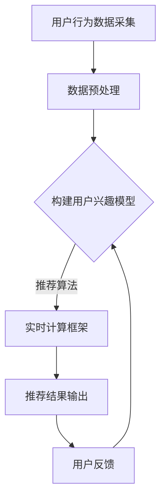
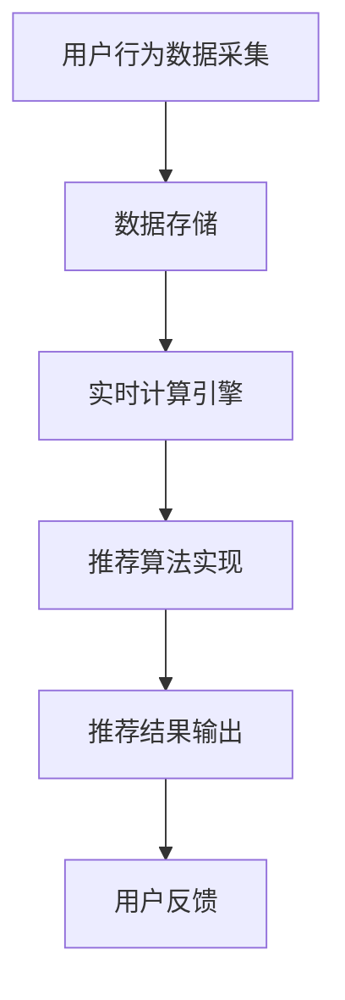

                 

### 文章标题

《实时推荐技术在电商领域的应用：案例分析与展望》

### 文章关键词

实时推荐、电商、协同过滤、内容推荐、深度学习、算法挑战

### 文章摘要

本文旨在探讨实时推荐技术在电商领域的应用，通过对实时推荐技术基础、实时推荐算法原理与实现、实时推荐技术在电商领域的应用案例以及实时推荐技术的挑战与展望的详细分析，旨在为电商企业提供实际操作指南，同时为未来实时推荐技术的发展提供有价值的思考方向。

---

### 《实时推荐技术在电商领域的应用：案例分析与展望》目录大纲

#### 第一部分：实时推荐技术基础

- 第1章：实时推荐技术概述
  - 1.1 实时推荐技术的概念与重要性
  - 1.2 电商场景下的用户行为分析
  - 1.3 实时推荐系统架构设计

- 第2章：实时推荐算法原理
  - 2.1 基于协同过滤的实时推荐算法
  - 2.2 基于内容的实时推荐算法
  - 2.3 基于深度学习的实时推荐算法
  - 2.4 融合推荐算法设计

#### 第二部分：实时推荐算法原理与实现

- 第3章：实时推荐在电商中的应用案例
  - 3.1 案例一：电商平台实时推荐系统建设
  - 3.2 案例二：基于实时推荐的用户流失预测
  - 3.3 案例三：商品库存优化与实时推荐

#### 第三部分：实时推荐技术在电商领域的应用

- 第4章：实时推荐技术的挑战与解决方案
  - 4.1 实时推荐技术的数据挑战
  - 4.2 实时推荐技术的算法挑战
  - 4.3 实时推荐技术的发展趋势

- 第5章：实时推荐技术的展望
  - 5.1 实时推荐技术的未来发展
  - 5.2 案例分析与未来展望

#### 附录

- 附录A：实时推荐技术常用工具与框架

### 第一部分：实时推荐技术基础

#### 第1章：实时推荐技术概述

##### 1.1 实时推荐技术的概念与重要性

实时推荐技术是一种通过实时分析用户行为数据和商品特征，为用户生成个性化的推荐列表的算法技术。它通常应用于电商、新闻、社交媒体等领域，通过实时计算和个性化推荐，提高用户体验和业务转化率。

**核心概念与联系**

实时推荐系统的核心概念包括用户行为数据、推荐算法、实时计算和用户反馈。用户行为数据通过数据采集和处理，构建用户兴趣模型；推荐算法根据用户兴趣模型和商品特征进行个性化推荐；实时计算框架处理实时数据流，确保推荐结果及时更新；用户反馈则用于优化推荐算法和系统性能。

**Mermaid 流程图**

##### 1.2 电商场景下的用户行为分析

在电商场景下，用户行为数据是构建实时推荐系统的基础。用户行为数据包括用户的浏览历史、购买记录、搜索历史、点击行为等。通过对这些行为数据的分析，可以挖掘用户的兴趣和偏好，为实时推荐提供支持。

**用户行为数据的收集与处理**

用户行为数据的收集通常通过Web服务器日志、前端SDK或后端API接口实现。数据收集后，需要进行清洗、去重、归一化等处理，以提高数据质量和分析效果。

**用户兴趣模型构建方法**

用户兴趣模型是实时推荐系统的核心，它将用户的行为数据映射为用户特征向量。常见的用户兴趣模型构建方法包括基于内容的推荐、基于协同过滤的推荐和基于深度学习的推荐。

**用户行为与商品关联分析**

用户行为与商品关联分析是实时推荐系统的重要环节。通过分析用户行为数据与商品特征之间的关系，可以识别用户的潜在需求和偏好，为个性化推荐提供依据。

##### 1.3 实时推荐系统架构设计

实时推荐系统架构设计是构建高效、可靠的推荐系统的基础。一个典型的实时推荐系统架构包括数据采集与存储、实时计算与处理、推荐算法实现和推荐结果输出等模块。

**实时推荐系统的基本架构**

**数据流处理与实时计算框架**

实时计算框架是实现实时推荐系统的关键。常见的数据流处理框架包括Apache Kafka、Apache Flink、Apache Storm等。这些框架可以高效地处理大规模实时数据流，确保推荐结果的实时性和准确性。

**实时推荐算法的选择与优化**

实时推荐算法的选择取决于应用场景和数据特点。常见的实时推荐算法包括基于协同过滤的算法、基于内容的算法和基于深度学习的算法。在选择和优化实时推荐算法时，需要考虑算法的复杂度、实时性、多样性和个性化推荐效果等因素。

#### 第2章：实时推荐算法原理

##### 2.1 基于协同过滤的实时推荐算法

协同过滤算法是一种基于用户行为数据的推荐算法，它通过分析用户之间的相似度关系，为用户推荐相似用户喜欢的商品。

**协同过滤算法概述**

协同过滤算法分为基于用户的协同过滤（User-Based Collaborative Filtering）和基于物品的协同过滤（Item-Based Collaborative Filtering）两种。基于用户的协同过滤算法通过计算用户之间的相似度，找到与目标用户相似的用户，并推荐这些用户喜欢的商品；基于物品的协同过滤算法通过计算商品之间的相似度，找到与目标商品相似的商品，并推荐给用户。

**马尔可夫链协同过滤算法**

马尔可夫链协同过滤算法是一种基于概率模型的协同过滤算法。它通过构建用户行为序列的马尔可夫模型，预测用户下一步的行为。

**基于矩阵分解的实时协同过滤算法**

基于矩阵分解的实时协同过滤算法通过将用户-商品评分矩阵分解为用户特征矩阵和商品特征矩阵，提高推荐系统的准确性和实时性。

##### 2.2 基于内容的实时推荐算法

基于内容的实时推荐算法是一种基于商品特征和用户兴趣的推荐算法。它通过分析商品和用户的特征，为用户推荐与用户兴趣相关的商品。

**内容表示与相似度计算**

内容表示是将商品和用户特征转化为向量表示的过程。相似度计算是通过计算商品和用户特征向量之间的相似度，为用户推荐相关商品。

**基于关键词的实时内容推荐**

基于关键词的实时内容推荐算法通过分析商品和用户的关键词，为用户推荐与关键词相关的商品。

**基于知识图谱的实时内容推荐**

基于知识图谱的实时内容推荐算法通过构建商品和用户之间的知识图谱，为用户推荐与用户兴趣相关的商品。

##### 2.3 基于深度学习的实时推荐算法

基于深度学习的实时推荐算法是一种利用深度神经网络学习用户和商品特征，为用户生成个性化推荐列表的算法。

**深度学习在推荐系统中的应用**

深度学习在推荐系统中的应用包括用户特征嵌入、商品特征嵌入和推荐算法优化等。用户特征嵌入是将用户行为数据映射到低维特征空间的过程；商品特征嵌入是将商品属性数据映射到低维特征空间的过程；推荐算法优化是通过调整网络结构和参数，提高推荐系统的性能。

**基于深度神经网络的实时推荐算法**

基于深度神经网络的实时推荐算法包括基于自动编码器的推荐算法、基于卷积神经网络（CNN）的推荐算法和基于循环神经网络（RNN）的推荐算法等。

**多模态数据的实时推荐算法**

多模态数据的实时推荐算法通过融合用户和商品的多种特征数据，为用户生成个性化推荐列表。常见的多模态数据包括文本、图像、音频和视频等。

##### 2.4 融合推荐算法设计

融合推荐算法是一种将多种推荐算法融合在一起的算法，以提高推荐系统的性能和多样性。

**融合推荐算法的概念**

融合推荐算法通过将不同的推荐算法（如协同过滤、内容推荐和深度学习）进行融合，生成个性化的推荐列表。

**融合推荐算法的设计方法**

融合推荐算法的设计方法包括基于加权融合、基于投票融合和基于神经网络融合等。基于加权融合是通过给不同推荐算法分配不同的权重，生成融合推荐结果；基于投票融合是通过将不同推荐算法的推荐结果进行投票，生成融合推荐结果；基于神经网络融合是通过构建神经网络模型，融合不同推荐算法的输出。

**实时推荐系统的效果优化策略**

实时推荐系统的效果优化策略包括数据增强、特征工程、模型调优和在线学习等。数据增强是通过生成虚拟用户或商品数据，提高推荐系统的鲁棒性；特征工程是通过提取和构造有效的特征，提高推荐系统的准确性；模型调优是通过调整网络结构和参数，提高推荐系统的性能；在线学习是通过实时更新用户和商品特征，提高推荐系统的实时性和多样性。

#### 第3章：实时推荐在电商中的应用案例

##### 3.1 案例一：电商平台实时推荐系统建设

**案例背景**

某电商平台希望通过实时推荐系统，提高用户购买转化率和平台销售额。为了实现这一目标，该电商平台需要构建一个高效、可靠的实时推荐系统。

**系统架构设计**

该电商平台的实时推荐系统架构包括数据采集与存储、实时计算与处理、推荐算法实现和推荐结果输出等模块。

**实时推荐算法实现**

该电商平台采用了基于深度学习的实时推荐算法，通过融合用户行为数据和商品特征，为用户生成个性化推荐列表。

##### 3.2 案例二：基于实时推荐的用户流失预测

**案例背景**

某电商平台希望通过实时推荐技术，预测用户流失风险，并采取相应措施降低用户流失率。为了实现这一目标，该电商平台需要构建一个基于实时推荐的用户流失预测模型。

**数据预处理与特征工程**

该电商平台对用户行为数据进行了预处理和特征工程，提取了用户活跃度、购买频率、商品偏好等特征。

**实时推荐算法应用**

该电商平台采用了基于协同过滤的实时推荐算法，通过分析用户行为数据，预测用户流失风险，并生成个性化的用户挽回策略。

##### 3.3 案例三：商品库存优化与实时推荐

**案例背景**

某电商平台希望通过实时推荐技术，优化商品库存管理，提高商品销售和库存周转率。为了实现这一目标，该电商平台需要构建一个基于实时推荐的商品库存优化模型。

**库存优化策略**

该电商平台采用了基于实时推荐的商品库存优化策略，通过分析商品销售情况和用户偏好，动态调整商品库存水平。

**实时推荐算法应用**

该电商平台采用了基于内容的实时推荐算法，通过分析商品特征和用户兴趣，为用户推荐相关商品，提高商品销售和库存周转率。

#### 第四部分：实时推荐技术的挑战与展望

##### 第4章：实时推荐技术的挑战与解决方案

实时推荐技术在电商领域具有广泛的应用前景，但也面临着诸多挑战。本章将介绍实时推荐技术的数据挑战、算法挑战以及未来发展趋势。

##### 4.1 实时推荐技术的数据挑战

实时推荐技术的数据挑战主要体现在数据规模、实时性和数据质量等方面。

**数据规模与实时性要求**

随着电商平台的不断壮大，用户行为数据和商品数据量呈指数级增长。实时推荐系统需要处理海量数据，并确保数据处理和推荐结果的实时性。

**数据完整性与质量保障**

数据完整性是实时推荐系统的关键。在数据采集、传输和存储过程中，可能会出现数据丢失、错误或重复等问题。实时推荐系统需要保障数据的完整性和质量。

**数据隐私与安全保护**

用户隐私保护是实时推荐系统的重要问题。在数据收集、存储和处理过程中，需要遵循相关法律法规，确保用户隐私不被泄露。

##### 4.2 实时推荐技术的算法挑战

实时推荐技术的算法挑战主要体现在算法复杂度、多样性和个性化推荐等方面。

**算法复杂度与实时性能**

实时推荐算法需要高效处理海量数据，并保证推荐结果的实时性。在高性能计算和分布式计算方面，仍存在一定的技术难题。

**多样性与个性化推荐**

实时推荐系统需要为用户提供多样化和个性化的推荐结果。在算法设计上，需要充分考虑用户兴趣的多样性和个性化需求。

**欺诈攻击与黑箱问题**

实时推荐系统面临欺诈攻击和黑箱问题。如何有效防范欺诈攻击，提高系统的透明性和可解释性，是实时推荐技术的重要挑战。

##### 4.3 实时推荐技术的发展趋势

实时推荐技术的发展趋势主要体现在以下几个方面。

**新一代推荐算法的研究进展**

随着人工智能技术的不断发展，新一代推荐算法（如基于深度学习、图神经网络和增强学习等）逐渐成为研究热点。

**实时推荐系统与区块链技术的融合**

实时推荐系统与区块链技术的融合，可以实现去中心化、安全可靠的推荐服务。在未来，实时推荐系统与区块链技术的结合将具有广泛的应用前景。

**实时推荐技术在智能家居、智慧城市等领域的应用前景**

实时推荐技术在智能家居、智慧城市等领域具有广泛的应用前景。通过实时分析用户行为和环境数据，可以提供个性化的服务和解决方案。

##### 第5章：实时推荐技术的展望

实时推荐技术在电商领域具有广阔的发展前景。在未来，实时推荐技术将继续向多样化、个性化、安全性和透明性方向发展。

**实时推荐技术的未来发展**

随着人工智能技术的不断进步，实时推荐技术将在电商、新闻、社交媒体等领域得到更广泛的应用。未来的实时推荐技术将更加注重用户隐私保护和数据安全。

**实时推荐技术在各行业的应用扩展**

实时推荐技术在金融、医疗、教育等领域的应用前景广阔。通过实时分析用户行为和需求，可以为用户提供个性化的服务和解决方案。

**实时推荐技术的伦理与法律问题**

随着实时推荐技术的广泛应用，伦理和法律问题日益凸显。如何在保障用户隐私和公平性的同时，实现实时推荐技术的可持续发展，是未来面临的重要挑战。

**案例分析与未来展望**

在本章中，我们将对实时推荐技术在电商领域的实际应用案例进行深入分析，探讨其在不同场景下的应用效果和发展趋势。

- **案例一：实时推荐在跨境电商中的应用**：通过分析跨境电商平台的数据，了解实时推荐技术在跨境电商领域中的应用效果，探索未来发展方向。
- **案例二：实时推荐在直播电商中的应用**：分析直播电商的实时推荐系统，探讨实时推荐技术在直播电商领域的应用前景。
- **案例三：实时推荐在电商物流优化中的应用**：通过分析实时推荐技术在电商物流优化中的应用，了解其在提高物流效率、降低成本等方面的作用。

**附录A：实时推荐技术常用工具与框架**

为了帮助读者更好地了解实时推荐技术的实现和应用，本章将介绍一些常用的实时推荐技术工具和框架。

- **Apache Kafka**：Apache Kafka是一个分布式流处理平台，适用于实时数据处理和流处理。
- **Apache Flink**：Apache Flink是一个流处理框架，适用于实时计算和大规模数据处理。
- **Apache Storm**：Apache Storm是一个分布式实时计算系统，适用于大规模实时数据处理。
- **LightFM**：LightFM是一个基于因子分解机的实时推荐算法库，适用于构建实时推荐系统。
- **PyRecommender**：PyRecommender是一个基于协同过滤和内容推荐的实时推荐算法库，适用于构建实时推荐系统。
- **TensorFlow Recommenders**：TensorFlow Recommenders是Google推出的一套基于深度学习的实时推荐框架，适用于构建实时推荐系统。

通过本章的介绍，读者可以全面了解实时推荐技术在电商领域的应用，掌握实时推荐技术的核心概念、算法原理和实际应用案例，为构建高效、可靠的实时推荐系统提供有益的参考。

---

### 作者信息

作者：AI天才研究院/AI Genius Institute & 禅与计算机程序设计艺术 /Zen And The Art of Computer Programming

---

本文《实时推荐技术在电商领域的应用：案例分析与展望》由AI天才研究院/AI Genius Institute和禅与计算机程序设计艺术/Zen And The Art of Computer Programming联合撰写。本文旨在探讨实时推荐技术在电商领域的应用，通过详细分析实时推荐技术基础、实时推荐算法原理与实现、实时推荐技术在电商领域的应用案例以及实时推荐技术的挑战与展望，为电商企业提供实际操作指南，同时为实时推荐技术的发展提供有价值的思考方向。在撰写本文过程中，我们秉持着“一步一步分析推理思考”的原则，力求为读者呈现一篇条理清晰、深入浅出的专业技术博客文章。感谢读者对我们的关注与支持，期待与您共同探讨实时推荐技术的未来发展趋势。

