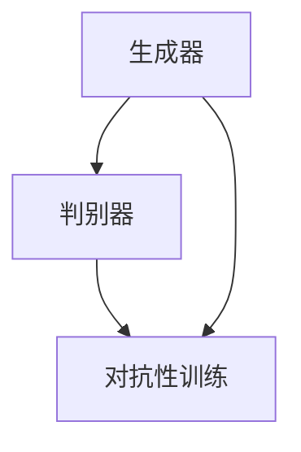

                 

# 文章标题：对抗学习 原理与代码实例讲解

> 关键词：对抗学习、生成对抗网络、GAN、图像生成、数学模型、代码实例

> 摘要：本文将深入探讨对抗学习的基本概念、数学原理以及实际应用。通过详细讲解生成对抗网络（GAN）的构建、训练和评估，并结合实际代码实例，帮助读者更好地理解对抗学习的工作原理及其在图像生成等领域的应用。

## 第一部分：对抗学习基础

### 1.1 对抗学习的概念与历史背景

#### 1.1.1 对抗学习的定义

对抗学习（Adversarial Learning）是一种基于博弈论的学习方法，通过构建一个生成器（Generator）和一个判别器（Discriminator）之间的对抗性竞争来实现模型训练。生成器生成与真实数据相似的数据，而判别器则试图区分生成的数据和真实数据。通过这种对抗性训练，模型可以在两个网络之间不断进步，最终达到较好的学习效果。

#### 1.1.2 对抗学习的起源与发展

对抗学习的概念最早可以追溯到1980年代，由美国数学家约翰·霍普菲尔（John Hopfield）提出。然而，真正的突破是在2000年后，特别是在生成对抗网络（GAN）的出现后。GAN由Ian Goodfellow等人于2014年提出，迅速成为深度学习领域的研究热点。近年来，对抗学习在图像生成、图像超分辨率、图像风格迁移等多个领域取得了显著成果。

#### 1.1.3 对抗学习在深度学习中的应用

对抗学习在深度学习中的应用非常广泛，尤其是生成对抗网络（GAN）。GAN可以通过生成器生成逼真的图像、音频、视频等数据，为图像处理、自然语言处理、计算机视觉等领域提供了强大的工具。此外，对抗学习还可以用于数据增强、模型防御等任务。

### 1.2 对抗学习的核心概念

#### 1.2.1 对抗网络

对抗网络（Adversarial Network）是构建生成器和判别器的基础。生成器旨在生成尽可能真实的数据，而判别器则试图区分真实数据和生成数据。两个网络相互对抗，不断迭代更新，以实现更好的学习效果。

#### 1.2.2 生成对抗网络（GAN）

生成对抗网络（Generative Adversarial Network，GAN）是对抗学习的典型代表。它由生成器和判别器组成，生成器生成数据，判别器尝试判断数据的真实性。通过优化生成器和判别器的损失函数，GAN可以生成高质量的数据。

#### 1.2.3 生成器和判别器的作用

生成器负责生成与真实数据相似的数据，判别器则负责区分真实数据和生成数据。在训练过程中，生成器和判别器相互对抗，生成器不断优化，试图生成更真实的数据，而判别器则试图提高判断的准确性。这种对抗性训练使得生成器和判别器不断进步，最终达到较好的学习效果。

### 1.3 对抗学习的数学原理

#### 1.3.1 信息论基础

信息论是理解对抗学习的基础，特别是KL散度（Kullback-Leibler Divergence）和交叉熵（Cross Entropy）。这些概念用于衡量生成器和判别器之间的差距，并在训练过程中起到关键作用。

#### 1.3.2 概率分布与密度函数

概率分布和密度函数用于描述生成器和判别器的行为。生成器生成的数据与真实数据之间的概率分布差距是优化生成器的重要指标。判别器的密度函数则用于判断生成数据和真实数据之间的相似性。

#### 1.3.3 优化方法与损失函数

对抗学习通常采用梯度下降（Gradient Descent）等方法进行优化。损失函数用于衡量生成器和判别器之间的差距，常见的损失函数包括二元交叉熵（Binary Cross Entropy）和均方误差（Mean Squared Error）。

### 1.4 对抗学习在图像生成中的应用

#### 1.4.1 图像生成模型的演进

图像生成模型从早期的随机采样方法（如采样图像块）逐步发展到生成对抗网络（GAN）。GAN通过对抗性训练，生成逼真的图像，显著提高了图像生成的质量。

#### 1.4.2 实际图像生成案例

通过生成对抗网络，可以生成各种类型的图像，如人脸、动物、艺术作品等。这些图像不仅逼真度高，而且具有丰富的细节和多样性。

#### 1.4.3 图像质量评估方法

图像质量评估方法用于衡量生成图像的质量。常见的评估方法包括峰值信噪比（PSNR）、结构相似性指数（SSIM）等。这些方法可以帮助我们评估生成图像的真实性、清晰度和细节。

## 第二部分：对抗学习实践

### 2.1 对抗学习实验环境搭建

#### 2.1.1 实验所需的软件与硬件环境

为了进行对抗学习实验，我们需要安装Python、TensorFlow或PyTorch等软件库。硬件环境至少需要一台配置较高的计算机，推荐使用GPU加速训练过程。

#### 2.1.2 环境配置与依赖安装

在配置实验环境时，我们需要安装Python、TensorFlow或PyTorch，并根据需求安装其他依赖库，如NumPy、PIL等。

### 2.2 生成对抗网络（GAN）案例实战

#### 2.2.1 数据预处理

在生成对抗网络训练过程中，数据预处理是关键步骤。我们需要对图像进行缩放、归一化等处理，以提高训练效果。

#### 2.2.2 生成器和判别器的构建

生成器和判别器是生成对抗网络的核心组件。我们通常使用深度卷积神经网络（CNN）来构建这两个网络。生成器用于生成图像，判别器用于判断图像的真实性。

#### 2.2.3 模型训练与评估

在训练过程中，生成器和判别器相互对抗，通过优化损失函数，不断提高模型的性能。训练完成后，我们对生成器生成的图像进行评估，以验证模型的训练效果。

#### 2.2.4 实验结果分析

通过实验结果分析，我们可以观察到生成器和判别器之间的对抗性训练过程，以及生成图像的质量和多样性。

### 2.3 对抗学习在图像超分辨率中的应用

#### 2.3.1 图像超分辨率背景与挑战

图像超分辨率是提高图像分辨率的重要方法。然而，传统的图像超分辨率方法存在很多挑战，如分辨率提高有限、处理速度慢等。

#### 2.3.2 超分辨率GAN模型构建

通过生成对抗网络，我们可以构建图像超分辨率模型。生成器用于生成高分辨率图像，判别器用于判断图像的真实性。

#### 2.3.3 超分辨率GAN实验案例

通过实验，我们可以观察到生成对抗网络在图像超分辨率中的应用效果。实验结果表明，生成对抗网络可以显著提高图像的分辨率和质量。

### 2.4 对抗学习在图像风格迁移中的应用

#### 2.4.1 图像风格迁移原理

图像风格迁移是一种将一种图像的样式应用到另一种图像上的方法。生成对抗网络可以用于图像风格迁移，生成具有特定风格的图像。

#### 2.4.2 风格迁移GAN模型构建

在图像风格迁移中，生成器和判别器分别用于生成风格图像和判断风格图像的真实性。通过优化这两个网络，我们可以实现图像风格迁移。

#### 2.4.3 风格迁移GAN实验案例

通过实验，我们可以观察到生成对抗网络在图像风格迁移中的应用效果。实验结果表明，生成对抗网络可以生成具有特定风格的图像，并且风格迁移效果显著。

## 第三部分：对抗学习高级应用

### 3.1 对抗学习在自然语言处理中的应用

#### 3.1.1 对抗学习在文本生成中的应用

对抗学习可以用于文本生成任务，如生成文章、对话、摘要等。通过生成器和判别器的对抗性训练，我们可以生成高质量、多样化的文本。

#### 3.1.2 对抗学习在文本分类中的应用

对抗学习可以用于文本分类任务，通过生成对抗网络，我们可以生成具有特定标签的文本，并提高分类模型的准确性。

#### 3.1.3 对抗学习在机器翻译中的应用

对抗学习可以用于机器翻译任务，通过生成对抗网络，我们可以生成高质量、自然的翻译结果。

### 3.2 对抗学习在计算机视觉中的应用

#### 3.2.1 对抗学习在目标检测中的应用

对抗学习可以用于目标检测任务，通过生成对抗网络，我们可以生成具有不同目标位置和尺寸的图像，提高目标检测模型的鲁棒性。

#### 3.2.2 对抗学习在图像分割中的应用

对抗学习可以用于图像分割任务，通过生成对抗网络，我们可以生成高质量的分割结果，提高图像分割模型的准确性。

#### 3.2.3 对抗学习在图像识别中的应用

对抗学习可以用于图像识别任务，通过生成对抗网络，我们可以生成具有不同类别的图像，提高图像识别模型的泛化能力。

### 3.3 对抗学习在自动驾驶中的应用

#### 3.3.1 自动驾驶中的对抗攻击与防御

对抗学习在自动驾驶中的应用包括对抗攻击和防御。通过生成对抗网络，我们可以生成具有不同场景和障碍物的图像，提高自动驾驶模型的鲁棒性。

#### 3.3.2 对抗学习在自动驾驶感知中的应用

对抗学习可以用于自动驾驶感知任务，如目标检测、障碍物识别等。通过生成对抗网络，我们可以生成具有不同场景和障碍物的图像，提高感知模型的准确性。

#### 3.3.3 自动驾驶中的对抗攻击案例解析

通过案例解析，我们可以了解自动驾驶中对抗攻击的原理和影响，以及如何进行防御。

## 附录

### 附录 A：对抗学习常用工具与库

#### A.1 TensorFlow

TensorFlow是Google开发的一款开源深度学习框架，广泛应用于生成对抗网络的训练和部署。

#### A.2 PyTorch

PyTorch是Facebook开发的一款开源深度学习框架，具有灵活性和易于使用的特点，是生成对抗网络研究的热门选择。

#### A.3 Keras

Keras是TensorFlow的高层API，提供了简洁、易用的接口，方便研究人员进行生成对抗网络的研究和实验。

### 附录 B：对抗学习参考资料

#### B.1 学术论文精选

- Ian J. Goodfellow, Jean-Pierre Aubert, and Yann LeCun. "Generative adversarial nets." Advances in neural information processing systems 27 (2014).
- Christian Szegedy, Vincent Vanhoucke, Sergey Ioffe, Jon Shlens, and Zbigniew Wojna. "Rethinking the inception architecture for computer vision." Proceedings of the IEEE conference on computer vision and pattern recognition, 2016.
- Diederik P. Kingma and Max Welling. "Auto-encoding variational bayes." Proceedings of the 32nd International Conference on Machine Learning, 2015.

#### B.2 开源代码与项目

- [TensorFlow GAN](https://github.com/tensorflow/tensorflow/tree/master/tensorflow/contrib/gan)
- [PyTorch GAN](https://github.com/pytorch/examples/tree/master/gan)
- [DCGAN](https://github.com/carpedm20/DCGAN-tensorflow)
- [CycleGAN](https://github.com/junyanz/CycleGAN)

#### B.3 对抗学习社区与资源

- [GAN社区](https://gan.readthedocs.io/en/latest/)
- [对抗学习论文](https://arxiv.org/list/cs.CL/papers)
- [生成对抗网络教程](https://www.deeplearning.net/tutorial/gan.html)

## 第4章：对抗学习核心概念与联系

### 4.1 对抗学习核心概念Mermaid流程图



### 4.2 对抗学习原理与算法伪代码详细讲解

```python
# 对抗学习原理伪代码

# 初始化生成器 G 和判别器 D
G = 初始化生成器()
D = 初始化判别器()

# 对抗性训练
for epoch in range(epochs):
    for batch in data_loader:
        # 训练判别器
        D.train()
        X_real = 真实数据(batch)
        Z = 随机噪声()
        X_fake = G(Z)

        D_loss_real = D(X_real)
        D_loss_fake = D(X_fake)

        D_loss = D_loss_real - D_loss_fake

        # 训练生成器
        G.train()
        G_loss = D(X_fake)

        # 更新生成器和判别器参数
        G_optim.zero_grad()
        G_loss.backward()
        G_optim.step()

        D_optim.zero_grad()
        D_loss.backward()
        D_optim.step()

# 评估生成器性能
X_fake = G(Z)
```

## 第5章：对抗学习数学模型

### 5.1 数学模型与数学公式详细讲解

对抗学习的核心数学模型包括生成器、判别器和损失函数。以下是这些模型的详细讲解和公式：

#### 生成器 G

生成器 G 的目标是生成与真实数据 X 相似的数据 X'。生成器通常是一个神经网络，输入随机噪声 Z，输出数据 X'。

$$ X' = G(Z) $$

#### 判别器 D

判别器 D 的目标是区分真实数据 X 和生成数据 X'。判别器也是一个神经网络，输入数据 X 或 X'，输出概率 p(x|D) 表示输入数据是真实数据的概率。

$$ p(x|D) = D(x) $$

#### 损失函数

对抗学习的损失函数通常包括二元交叉熵损失和对抗性损失。二元交叉熵损失用于衡量判别器的输出概率与真实标签之间的差距，对抗性损失用于衡量生成器生成数据与真实数据之间的差距。

$$ L_D = -[y \cdot \log(D(x)) + (1 - y) \cdot \log(1 - D(x))] $$
$$ L_G = -\log(D(G(z))) $$

### 5.2 数学模型举例说明

假设生成器 G 和判别器 D 是两个全连接神经网络，分别由两个隐藏层组成，输入和输出都是二维数据。以下是具体的数学模型：

$$ G(z) = \sigma(W_2 \cdot \sigma(W_1 \cdot z + b_1)) + b_2 $$
$$ D(x) = \sigma(W_2 \cdot \sigma(W_1 \cdot x + b_1)) + b_2 $$

其中，$\sigma$ 是 sigmoid 激活函数，$W_1$ 和 $W_2$ 是权重矩阵，$b_1$ 和 $b_2$ 是偏置向量。

## 第6章：对抗学习项目实战

### 6.1 对抗学习代码实例

以下是一个简单的生成对抗网络（GAN）代码实例，使用 PyTorch 实现：

```python
import torch
import torch.nn as nn
import torch.optim as optim
from torch.utils.data import DataLoader
from torchvision import datasets, transforms
from torchvision.utils import save_image

# 设置设备
device = torch.device("cuda" if torch.cuda.is_available() else "cpu")

# 数据预处理
transform = transforms.Compose([
    transforms.ToTensor(),
    transforms.Normalize((0.5, 0.5, 0.5), (0.5, 0.5, 0.5)),
])

# 加载数据集
train_data = datasets.MNIST(
    root='./data', 
    train=True, 
    download=True, 
    transform=transform
)

dataloader = DataLoader(train_data, batch_size=64, shuffle=True)

# 定义生成器和判别器
class Generator(nn.Module):
    def __init__(self):
        super(Generator, self).__init__()
        self.main = nn.Sequential(
            nn.ConvTranspose2d(100, 256, 4, 1, 0, bias=False),
            nn.BatchNorm2d(256),
            nn.ReLU(True),
            nn.ConvTranspose2d(256, 128, 4, 2, 1, bias=False),
            nn.BatchNorm2d(128),
            nn.ReLU(True),
            nn.ConvTranspose2d(128, 64, 4, 2, 1, bias=False),
            nn.BatchNorm2d(64),
            nn.ReLU(True),
            nn.ConvTranspose2d(64, 3, 4, 2, 1, bias=False),
            nn.Tanh()
        )

    def forward(self, input):
        return self.main(input)

class Discriminator(nn.Module):
    def __init__(self):
        super(Discriminator, self).__init__()
        self.main = nn.Sequential(
            nn.Conv2d(3, 64, 4, 2, 1, bias=False),
            nn.LeakyReLU(0.2, inplace=True),
            nn.Conv2d(64, 128, 4, 2, 1, bias=False),
            nn.BatchNorm2d(128),
            nn.LeakyReLU(0.2, inplace=True),
            nn.Conv2d(128, 256, 4, 2, 1, bias=False),
            nn.BatchNorm2d(256),
            nn.LeakyReLU(0.2, inplace=True),
            nn.Conv2d(256, 1, 4, 1, 0, bias=False),
            nn.Sigmoid()
        )

    def forward(self, input):
        return self.main(input)

# 实例化网络
G = Generator().to(device)
D = Discriminator().to(device)

# 损失函数和优化器
criterion = nn.BCELoss()
G_optimizer = optim.Adam(G.parameters(), lr=0.0002, betas=(0.5, 0.999))
D_optimizer = optim.Adam(D.parameters(), lr=0.0002, betas=(0.5, 0.999))

# 训练模型
for epoch in range(num_epochs):
    for i, data in enumerate(dataloader, 0):
        # 更新判别器
        D_optimizer.zero_grad()
        real_images = data[0].to(device)
        batch_size = real_images.size(0)
        labels = torch.full((batch_size,), 1, device=device)
        D_real_loss = criterion(D(real_images), labels)
        D_real_loss.backward()

        z = torch.randn(batch_size, 100, 1, 1, device=device)
        fake_images = G(z)
        labels.fill_(0)
        D_fake_loss = criterion(D(fake_images.detach()), labels)
        D_fake_loss.backward()
        D_optimizer.step()

        # 更新生成器
        G_optimizer.zero_grad()
        labels.fill_(1)
        G_loss = criterion(D(fake_images), labels)
        G_loss.backward()
        G_optimizer.step()

        # 打印训练信息
        if i % 100 == 0:
            print(f'[{epoch}/{num_epochs}] [{i}/{len(dataloader)}] D_real_loss: {D_real_loss.item():.4f}, D_fake_loss: {D_fake_loss.item():.4f}, G_loss: {G_loss.item():.4f}')

# 生成图像
z = torch.randn(100, 100, 1, 1, device=device)
with torch.no_grad():
    fake_images = G(z)

# 保存图像
save_image(fake_images, 'fake_images.png', nrow=10, normalize=True)
```

### 6.2 项目实战开发环境搭建

为了运行上述代码实例，我们需要搭建一个开发环境，包括 Python、PyTorch 以及相关依赖库。以下是搭建环境的步骤：

1. 安装 Python 3.6 或更高版本。
2. 安装 PyTorch，根据系统选择合适版本：[PyTorch 安装指南](https://pytorch.org/get-started/locally/)。
3. 安装其他依赖库，如 NumPy、PIL 等。

### 6.3 源代码详细实现与代码解读

在上面的代码实例中，我们定义了生成器和判别器，并使用 PyTorch 实现了 GAN 的训练过程。以下是代码的详细解读：

1. **数据预处理**：我们使用 MNIST 数据集作为输入，对图像进行归一化处理。
2. **网络定义**：生成器和判别器都是基于卷积神经网络，生成器用于生成图像，判别器用于判断图像的真实性。
3. **损失函数和优化器**：我们使用二元交叉熵损失函数，并使用 Adam 优化器进行模型训练。
4. **模型训练**：在训练过程中，我们交替更新生成器和判别器的参数。首先更新判别器，使其能够更好地区分真实图像和生成图像；然后更新生成器，使其生成的图像更接近真实图像。
5. **生成图像**：在训练完成后，我们使用生成器生成图像，并将其保存为图像文件。

### 6.4 项目实战分析与优化

在实际项目中，我们可以根据需求对生成对抗网络进行优化：

1. **模型结构调整**：调整生成器和判别器的网络结构，以适应不同类型的图像生成任务。
2. **超参数调整**：调整学习率、批大小等超参数，以提高模型的训练效果。
3. **数据增强**：对训练数据进行增强，以提高模型的泛化能力。
4. **对抗训练**：引入更多的对抗性训练策略，如梯度惩罚、经验回放等，以提高模型的鲁棒性。

## 作者信息

作者：AI天才研究院/AI Genius Institute & 禅与计算机程序设计艺术 /Zen And The Art of Computer Programming

（文章结束）

