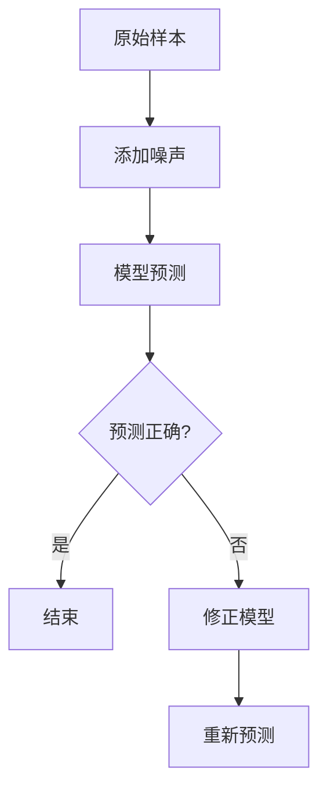
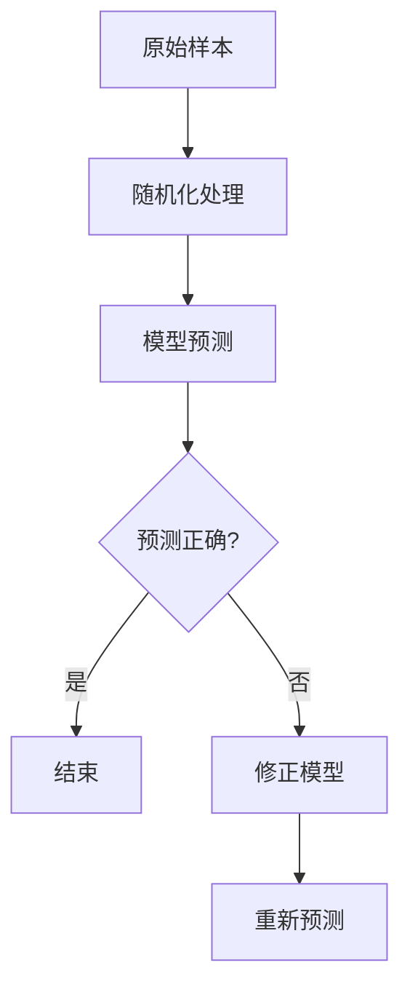
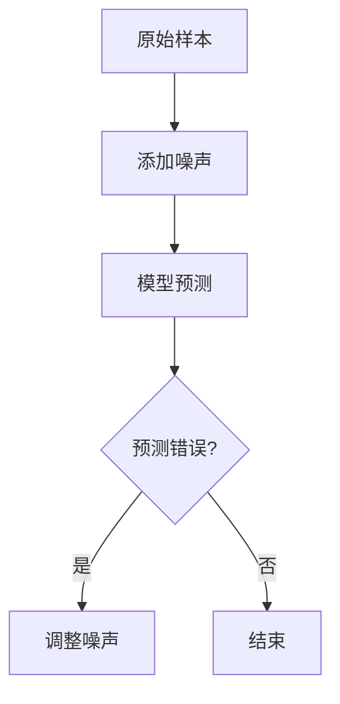
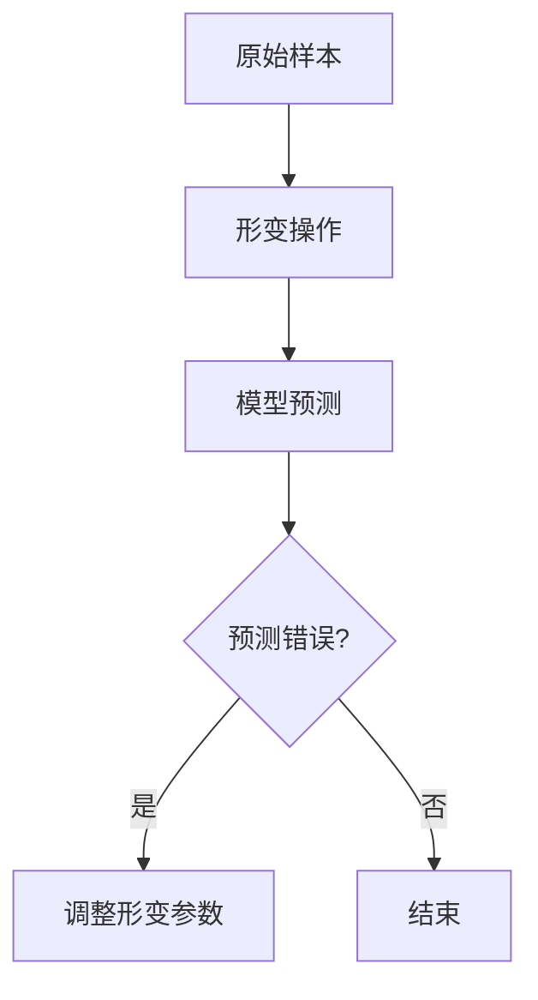
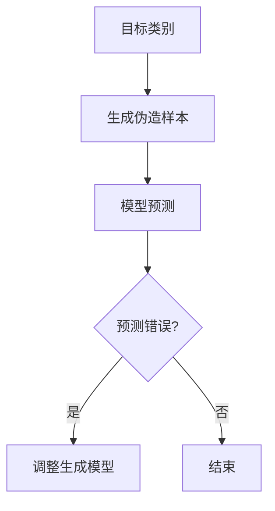
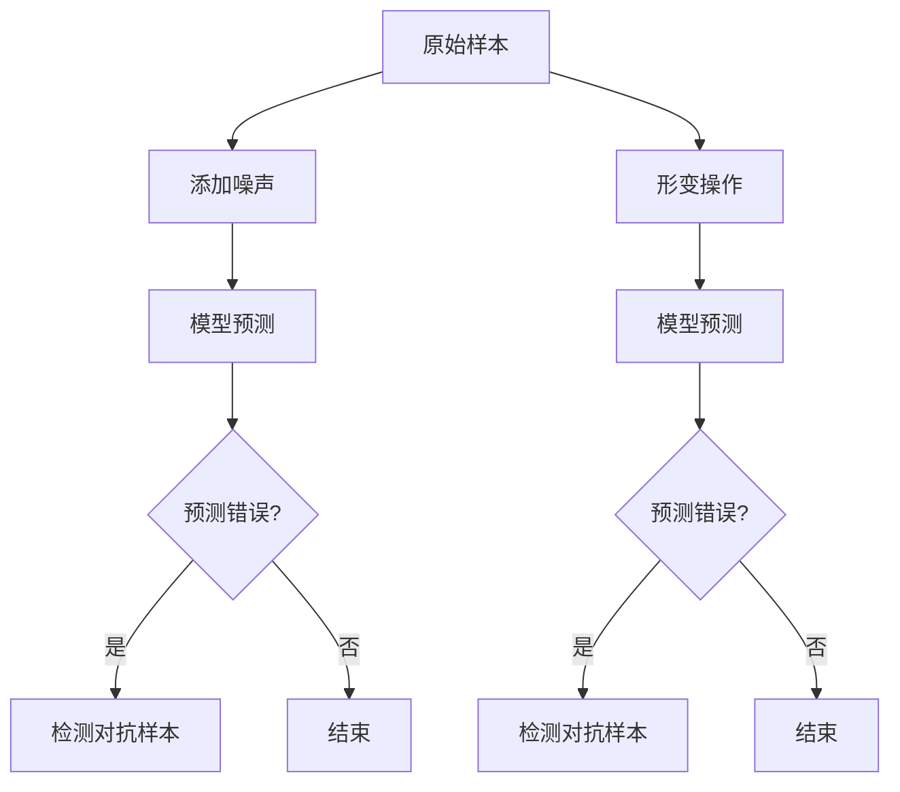
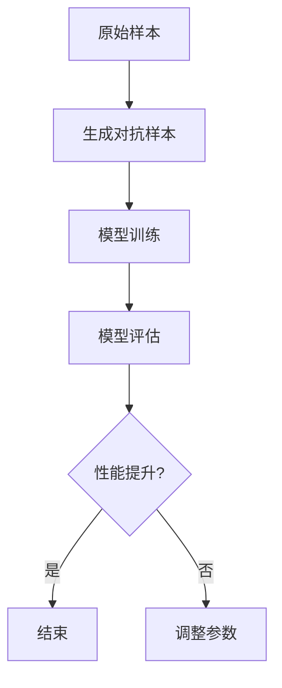
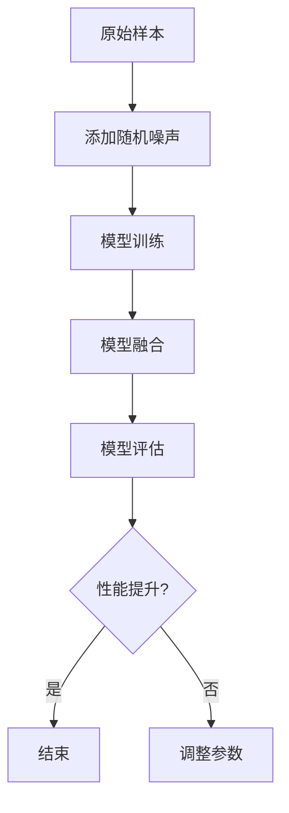
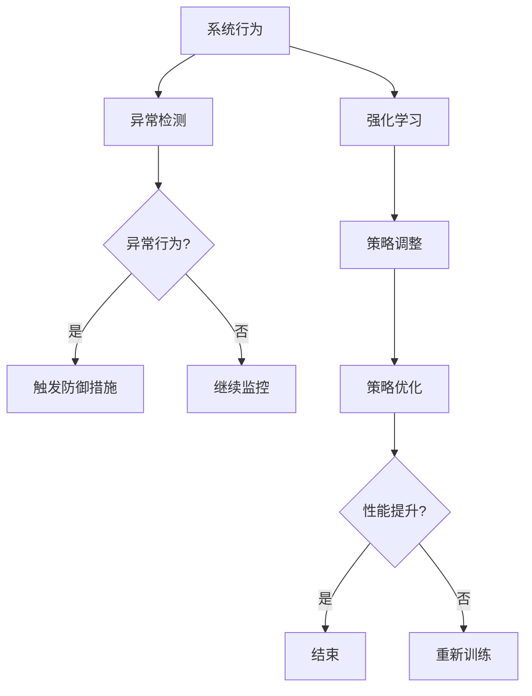

                 

### 文章标题

对抗防御

### 关键词

对抗攻击，防御技术，深度学习，机器学习，网络安全，自动驾驶

### 摘要

本文将深入探讨对抗防御这一重要领域，从背景和核心概念入手，详细解析对抗攻击的常见技术以及防御策略。通过分析深度学习和机器学习模型在对抗攻击下的脆弱性，介绍了一系列有效的对抗防御技术。同时，文章还探讨了对抗防御在企业安全、网络安全和自动驾驶等实际应用场景中的重要性。最后，文章展望了对抗防御的前沿研究趋势，为未来的发展提供了有益的启示。

## 第一部分：对抗防御概述

### 第1章：对抗防御背景与核心概念

#### 第1章.1 对抗防御的起源与演变

对抗防御的概念起源于网络安全领域，随着信息技术的快速发展，对抗攻击的手段也日益多样化。对抗防御的历史可以追溯到20世纪80年代，当时计算机病毒的兴起使得网络安全成为了一个重要的课题。最早的对抗防御措施主要是基于规则的防护机制，通过对网络流量进行分析和过滤来阻止恶意攻击。

进入21世纪，随着人工智能和机器学习技术的迅速发展，深度学习模型被广泛应用于各个领域，如图像识别、自然语言处理等。然而，这些模型在面对对抗攻击时表现出显著的脆弱性，这引起了学术界和工业界的高度关注。对抗防御因此逐渐成为了一个独立的研究领域。

对抗防御的演变经历了从传统安全到对抗防御的过渡。传统安全主要依赖于静态的防护措施，如防火墙、入侵检测系统等，这些措施在面对动态的对抗攻击时显得力不从心。而对抗防御则注重动态适应和实时响应，通过不断学习和优化防御策略来抵御攻击。

#### 第1章.2 对抗攻击的发展历程

对抗攻击的发展历程可以追溯到计算机病毒和恶意软件的早期阶段。最初的对抗攻击主要是通过传播病毒和恶意代码来破坏计算机系统。随着网络技术的普及，网络攻击成为了主要的威胁，攻击者开始利用网络漏洞和利用代码进行攻击，如SQL注入、跨站脚本攻击等。

近年来，随着深度学习模型的应用越来越广泛，对抗攻击也逐渐转向对深度学习模型的攻击。深度学习模型在训练过程中依赖于大量的数据，而攻击者可以通过构造对抗样本来欺骗模型，使其做出错误的判断。这些对抗样本通常是通过对原始样本进行微小的扰动得到的，但它们能够引起模型预测结果的巨大偏差。

对抗攻击技术的发展使得攻击者能够更加精确地针对特定的系统或应用程序进行攻击，而防御者则需要不断更新和改进防御策略来应对这些新的威胁。

#### 第1章.3 对抗防御的重要性

对抗防御在当今的信息安全领域中具有至关重要的地位。随着网络攻击手段的不断升级和多样化，传统的安全措施已经难以应对新兴的对抗攻击。对抗防御不仅能够有效地抵御对抗攻击，还能够为系统提供动态的防护能力，提高系统的安全性。

在深度学习和机器学习领域，对抗防御的重要性尤为突出。深度学习模型在训练过程中依赖于大量的数据，而这些数据可能存在被攻击者利用的漏洞。通过对抗防御，可以有效地检测和防御对抗样本的攻击，保护模型的稳定性和可靠性。

此外，对抗防御还在许多实际应用领域中发挥着重要作用。在网络安全领域，对抗防御可以帮助企业保护其网络资源免受恶意攻击；在自动驾驶领域，对抗防御可以确保自动驾驶系统的安全性和可靠性；在医疗健康领域，对抗防御可以帮助保护患者的隐私和数据安全。

总之，对抗防御作为信息安全领域的重要组成部分，对于保障信息系统的安全运行具有重要意义。随着对抗攻击的不断演变，对抗防御技术也需要不断发展和完善，以应对未来的挑战。

#### 第1章.4 对抗攻击与防御的基本概念

对抗攻击（Adversarial Attack）是指在信息安全领域中，攻击者利用系统的漏洞或弱点，通过构造特定的输入或数据，使系统产生错误的输出或行为，从而实现攻击目标的一种手段。对抗攻击具有以下几个基本特点：

1. **针对性**：对抗攻击通常针对特定的系统或应用程序进行，攻击者会根据系统的特性来设计攻击策略，以达到最大的攻击效果。
2. **隐蔽性**：对抗攻击通常难以被发现，因为攻击者会精心构造对抗样本，使其在正常情况下难以察觉。
3. **灵活性**：对抗攻击手段多种多样，攻击者可以根据系统的变化和防御策略的更新来调整攻击方式。

对抗防御（Adversarial Defense）是指为了抵御对抗攻击而采取的一系列技术手段和策略。其目标是确保系统在面对对抗攻击时能够保持稳定和正确的运行。对抗防御包括以下几个方面：

1. **检测与识别**：通过分析和检测输入数据或行为模式，识别是否存在对抗样本或攻击行为。
2. **防御与反击**：在检测到对抗攻击时，采取相应的防御措施，如隔离攻击者、恢复系统状态等。
3. **更新与优化**：不断更新和优化防御策略，以应对新的攻击手段和变种。

#### 第1章.5 常见对抗攻击技术

常见的对抗攻击技术可以分为以下几类：

1. **噪声攻击**：通过在原始样本中添加噪声，使模型难以识别正常的样本。
2. **形变攻击**：通过修改样本的形状、大小、颜色等特征，使模型无法正确分类。
3. **伪造样本攻击**：通过生成完全虚假的样本，欺骗模型做出错误的预测。

以下是一个简单的 Mermaid 流程图，展示了一种噪声攻击的流程：



#### 第1章.6 对抗防御的理论基础

对抗防御的理论基础主要包括信息论、随机化与鲁棒性、学习理论等方面。

1. **信息论**：信息论提供了对抗防御的理论框架，通过对信息熵和信道容量等概念的研究，为对抗防御提供了理论基础。
2. **随机化与鲁棒性**：随机化策略可以通过引入随机性来提高系统的鲁棒性，使攻击者难以预测系统的行为。鲁棒性则是指系统在面对外界干扰或攻击时能够保持稳定和正确的运行。
3. **学习理论**：学习理论提供了对抗防御中的自适应能力，通过不断学习和优化防御策略，使系统能够更好地应对新的攻击手段。

以下是一个简单的 Mermaid 流程图，展示了一种基于随机化的对抗防御流程：



通过以上理论基础的指导，对抗防御技术能够更好地应对各种对抗攻击，保障系统的安全性和可靠性。

### 第2章：对抗攻击技术解析

对抗攻击技术在信息安全领域扮演着重要的角色，其目的是通过对抗样本或恶意行为干扰系统，使其无法正常工作或泄露敏感信息。本章将详细解析几种常见的对抗攻击技术，包括噪声攻击、形变攻击和伪造样本攻击，以及它们对深度学习和机器学习模型的具体影响。

#### 第2章.1 常见对抗攻击方法

##### 2.1.1 噪声攻击

噪声攻击是一种常见的对抗攻击技术，通过在原始样本中添加噪声，使模型难以识别正常的样本。噪声可以来自各种不同的来源，如随机噪声、高斯噪声、椒盐噪声等。

**噪声攻击的原理**：噪声攻击的基本原理是通过在样本上添加噪声，使得样本的特征发生变化，从而欺骗模型。例如，对于图像分类任务，攻击者可以在图片上添加随机噪声，使得原本清晰的图像变得模糊，从而使模型难以正确分类。

**对抗样本的构造**：构造对抗样本的方法通常包括以下步骤：

1. 选择原始样本和目标类别。
2. 添加噪声，可以随机选择噪声类型和噪声强度。
3. 对添加噪声后的样本进行模型预测。
4. 根据预测结果调整噪声参数，直到模型无法正确分类。

以下是一个简单的 Mermaid 流程图，展示噪声攻击的流程：



##### 2.1.2 形变攻击

形变攻击通过修改样本的形状、大小、颜色等特征，使模型无法正确分类。与噪声攻击不同，形变攻击通常对样本的结构进行更显著的修改。

**形变攻击的原理**：形变攻击的基本原理是通过改变样本的几何特征，使模型难以识别正常的样本。例如，对于图像分类任务，攻击者可以通过扭曲图像的形状、缩放图像的大小或改变图像的颜色，使得模型难以正确分类。

**对抗样本的构造**：构造对抗样本的方法通常包括以下步骤：

1. 选择原始样本和目标类别。
2. 应用形变操作，如旋转、缩放、剪切等。
3. 对形变后的样本进行模型预测。
4. 根据预测结果调整形变参数，直到模型无法正确分类。

以下是一个简单的 Mermaid 流程图，展示形变攻击的流程：



##### 2.1.3 伪造样本攻击

伪造样本攻击通过生成完全虚假的样本，欺骗模型做出错误的预测。伪造样本通常由攻击者手动创建或使用生成对抗网络（GAN）等自动生成。

**伪造样本攻击的原理**：伪造样本攻击的基本原理是通过生成与真实样本不同的虚假样本，使模型无法区分真实样本和伪造样本。例如，对于图像分类任务，攻击者可以生成与真实图像完全不同的虚假图像，欺骗模型将其分类为其他类别。

**对抗样本的构造**：构造对抗样本的方法通常包括以下步骤：

1. 选择目标类别。
2. 使用生成模型生成伪造样本。
3. 对伪造样本进行模型预测。
4. 根据预测结果调整生成模型，直到模型无法正确分类。

以下是一个简单的 Mermaid 流程图，展示伪造样本攻击的流程：



#### 第2章.2 深度学习模型对抗攻击

深度学习模型在许多领域取得了显著的成果，但其对抗攻击的脆弱性也引起了广泛关注。本节将探讨深度学习模型对抗攻击的具体表现、常见案例和防御策略。

##### 2.2.1 深度模型对对抗攻击的脆弱性

深度学习模型在对抗攻击下的脆弱性主要表现为：

1. **过拟合**：深度学习模型在训练过程中可能过拟合训练数据，导致对对抗样本的识别能力下降。
2. **敏感特征**：深度学习模型可能会对某些特定的特征过于敏感，使得对抗样本可以通过这些特征欺骗模型。
3. **数据不平衡**：训练数据中对抗样本的比例可能较低，导致模型在对抗攻击下表现不佳。

##### 2.2.2 深度学习模型对抗攻击案例解析

以下是一个简单的深度学习模型对抗攻击案例：

**案例背景**：某公司开发了一款基于深度学习的图像分类系统，用于自动识别交通标志。

**攻击过程**：攻击者使用噪声攻击和形变攻击对交通标志图像进行攻击。首先，攻击者通过添加随机噪声使交通标志图像变得模糊，模型无法正确分类。接着，攻击者通过扭曲交通标志的形状，使其与标准交通标志不同，模型同样无法识别。

**防御策略**：针对上述案例，公司采取了以下防御策略：

1. **数据增强**：通过在训练数据中添加噪声和形变，提高模型的鲁棒性。
2. **模型结构优化**：使用具有更多隐藏层的模型，提高模型对对抗样本的识别能力。
3. **对抗样本检测**：开发对抗样本检测算法，实时监测系统输出，识别可能的对抗攻击。

以下是一个简单的 Mermaid 流程图，展示深度学习模型对抗攻击和防御的流程：



##### 2.2.3 常见防御策略分析

为了提高深度学习模型的对抗攻击防御能力，研究人员提出了一系列防御策略，以下是一些常见的防御策略：

1. **输入扰动**：通过在输入样本上添加噪声或扰动，使模型难以识别对抗样本。
2. **模型结构增强**：设计具有更多隐藏层或特殊结构的模型，提高模型对对抗样本的识别能力。
3. **对抗样本训练**：在训练过程中加入对抗样本，使模型能够更好地应对对抗攻击。
4. **对抗样本检测**：开发专门的对抗样本检测算法，实时监测系统输出，识别可能的对抗攻击。

#### 第2章.3 机器学习模型对抗攻击

除了深度学习模型，机器学习模型也面临着对抗攻击的威胁。本节将介绍机器学习模型对抗攻击的具体表现、常见案例和防御策略。

##### 2.3.1 机器学习模型对抗攻击方法

机器学习模型对抗攻击方法主要包括以下几种：

1. **决策树攻击**：通过修改决策树的分裂条件，使模型对对抗样本的预测结果发生变化。
2. **神经网络攻击**：通过在神经网络中引入噪声或扰动，使模型对对抗样本的预测结果发生变化。
3. **支持向量机攻击**：通过调整支持向量的位置和方向，使模型对对抗样本的预测结果发生变化。

##### 2.3.2 机器学习模型对抗攻击案例分析

以下是一个简单的机器学习模型对抗攻击案例：

**案例背景**：某公司开发了一款基于支持向量机的垃圾邮件分类系统。

**攻击过程**：攻击者使用决策树攻击和神经网络攻击对垃圾邮件进行攻击。首先，攻击者通过修改决策树的分裂条件，使模型对垃圾邮件的预测结果变为正常邮件。接着，攻击者通过在神经网络中添加噪声，使模型对垃圾邮件的预测结果变为正常邮件。

**防御策略**：针对上述案例，公司采取了以下防御策略：

1. **决策树剪枝**：通过剪枝减少决策树的复杂度，提高模型对对抗样本的识别能力。
2. **神经网络优化**：优化神经网络的训练过程，提高模型对对抗样本的识别能力。
3. **对抗样本训练**：在训练过程中加入对抗样本，使模型能够更好地应对对抗攻击。

##### 2.3.3 针对机器学习模型的防御策略

以下是一些针对机器学习模型的防御策略：

1. **决策树剪枝**：通过剪枝减少决策树的复杂度，提高模型对对抗样本的识别能力。
2. **神经网络优化**：优化神经网络的训练过程，提高模型对对抗样本的识别能力。
3. **对抗样本训练**：在训练过程中加入对抗样本，使模型能够更好地应对对抗攻击。
4. **随机化**：通过随机化策略提高模型的鲁棒性，使对抗攻击难以奏效。

通过以上防御策略，机器学习模型可以更好地抵御对抗攻击，提高系统的安全性和可靠性。

### 第3章：对抗防御技术综述

对抗防御技术在应对各种对抗攻击方面发挥着关键作用。本章将综述几种常见的对抗防御技术，包括鲁棒性设计与改进算法、随机化防御策略和学习理论与自适应防御，并分析这些技术的原理、实现方法及其在实际应用中的表现。

#### 第3章.1 鲁棒性设计与改进算法

鲁棒性设计（Robust Design）是一种重要的对抗防御技术，旨在提高系统在面对对抗攻击时的稳健性。以下是一些常见的鲁棒性设计原则和改进算法：

##### 3.1.1 鲁棒性设计原则

1. **健壮性**：系统应能够抵抗各种异常输入和攻击，保持稳定运行。
2. **自适应性**：系统应能够根据攻击类型和攻击强度自适应调整防御策略。
3. **可检测性**：系统应能够检测和识别潜在的对抗攻击，并采取相应的措施。

##### 3.1.2 改进算法介绍

1. **对抗训练**（Adversarial Training）：通过在训练过程中引入对抗样本，提高模型对对抗攻击的鲁棒性。
2. **正则化**（Regularization）：通过添加正则化项，降低模型过拟合的风险，提高鲁棒性。
3. **混合策略**（Hybrid Strategies）：结合多种鲁棒性设计方法，如对抗训练和正则化，进一步提高模型的鲁棒性。

##### 3.1.3 改进算法在实际应用中的表现

1. **图像识别**：通过对抗训练和正则化方法，可以显著提高图像识别模型对对抗样本的识别能力。
2. **语音识别**：混合策略方法可以增强语音识别模型在面对对抗攻击时的稳健性。
3. **自然语言处理**：对抗训练和正则化方法可以改善自然语言处理模型在对抗攻击下的性能。

以下是一个简单的 Mermaid 流程图，展示对抗训练的流程：



#### 第3章.2 随机化防御策略

随机化防御策略（Randomization Defense）通过引入随机性来提高系统的鲁棒性。以下是一些常见的随机化防御技术：

##### 3.2.1 随机化防御原理

1. **随机化输入**：通过在输入样本上添加随机噪声，使攻击者难以预测系统的行为。
2. **随机化模型**：通过随机化模型的参数和结构，提高模型对对抗攻击的适应性。
3. **随机化训练**：通过在训练过程中引入随机性，提高模型对未知攻击的鲁棒性。

##### 3.2.2 随机化防御技术实现

1. **随机化网络**（Random Network Distillation）：通过训练多个具有不同随机性的模型，并将它们的输出进行融合，提高系统的鲁棒性。
2. **随机化变换**（Random Transformation）：通过在输入样本上应用随机变换，如随机裁剪、旋转等，增加攻击者的不确定性。
3. **随机化优化**（Randomized Optimization）：通过在优化过程中引入随机性，避免模型陷入局部最优。

##### 3.2.3 随机化防御案例分析

以下是一个简单的随机化防御案例：

**案例背景**：某公司开发了一款基于深度学习的图像分类系统，用于识别有害内容。

**防御策略**：公司采取了随机化防御策略，包括：

1. **随机化输入**：在图像输入过程中添加随机噪声，提高模型的鲁棒性。
2. **随机化模型**：使用多个具有不同随机参数的模型进行融合，提高系统的鲁棒性。
3. **随机化训练**：在训练过程中引入随机性，避免模型过拟合。

以下是一个简单的 Mermaid 流程图，展示随机化防御的流程：



#### 第3章.3 学习理论与自适应防御

学习理论（Learning Theory）在对抗防御中具有重要的应用价值。自适应防御（Adaptive Defense）通过不断学习和调整防御策略，提高系统对未知攻击的应对能力。

##### 3.3.1 自适应防御的概念与原理

1. **自适应防御**：通过实时监测系统行为，识别潜在的攻击行为，并自动调整防御策略，提高系统的鲁棒性和安全性。
2. **自适应学习能力**：系统能够从历史攻击事件中学习，并根据新的攻击模式自动调整防御策略。

##### 3.3.2 学习理论在自适应防御中的应用

1. **异常检测**（Anomaly Detection）：通过学习正常行为模式，识别异常行为，从而检测潜在的攻击行为。
2. **强化学习**（Reinforcement Learning）：通过不断试错和奖励机制，优化防御策略，提高系统的自适应能力。
3. **迁移学习**（Transfer Learning）：将已有模型的知识迁移到新的攻击场景，提高对新攻击的应对能力。

##### 3.3.3 自适应防御技术案例分析

以下是一个简单的自适应防御案例：

**案例背景**：某公司开发了一款基于机器学习的入侵检测系统，用于监控企业网络。

**防御策略**：公司采用了以下自适应防御技术：

1. **异常检测**：通过分析网络流量和系统日志，识别异常行为，并自动触发防御措施。
2. **强化学习**：通过不断学习和调整策略，优化入侵检测系统的准确性和响应速度。
3. **迁移学习**：将已有的攻击特征库迁移到新环境中，提高对新攻击的检测能力。

以下是一个简单的 Mermaid 流程图，展示自适应防御的流程：



通过上述对抗防御技术综述，可以看出，对抗防御技术不仅涵盖了多种防御策略，还在实际应用中取得了显著的成果。随着对抗攻击的不断演变，对抗防御技术也需要不断发展和完善，以应对未来的挑战。

### 第4章：对抗防御实战应用

对抗防御技术在实际应用场景中发挥着至关重要的作用。本章将探讨对抗防御在企业安全、网络安全和自动驾驶等领域的具体应用，分析其中的挑战和解决方案，并介绍一些成功的应用案例。

#### 第4章.1 对抗防御在企业安全中的应用

企业安全是企业运营的关键环节，而对抗防御技术能够有效提升企业的网络安全水平。以下是对抗防御在企业安全中的应用场景和解决方案：

##### 4.1.1 企业安全面临的对抗攻击挑战

1. **内部威胁**：企业内部员工可能利用职务之便进行恶意操作，如窃取敏感数据或破坏系统。
2. **外部攻击**：黑客通过攻击网络漏洞或利用钓鱼邮件等手段入侵企业系统，窃取信息或造成系统瘫痪。
3. **恶意软件**：病毒、木马等恶意软件可以通过企业网络进行传播，破坏系统和数据。

##### 4.1.2 对抗防御在企业安全中的应用案例

**案例一：某金融企业对抗钓鱼邮件攻击**

**背景**：某金融企业频繁收到钓鱼邮件，邮件内容伪装成重要通知，诱导员工点击恶意链接，导致账号密码泄露。

**解决方案**：企业采用了以下对抗防御策略：

1. **邮件过滤**：利用对抗训练技术，提高邮件过滤系统的识别能力，过滤掉可能的钓鱼邮件。
2. **用户教育**：通过培训员工识别钓鱼邮件的技巧，提高员工的安全意识。
3. **双重认证**：实施双重认证机制，确保只有合法用户才能访问企业系统。

**效果**：通过上述措施，该企业成功降低了钓鱼邮件的攻击成功率，提高了员工的安全意识和系统的安全性。

##### 4.1.3 企业安全对抗防御策略

1. **多层次防护**：采用多层次的安全防护策略，包括网络防火墙、入侵检测系统、反病毒软件等，形成全方位的安全防护体系。
2. **持续监控**：通过实时监控企业网络流量和系统日志，及时发现和应对潜在的攻击行为。
3. **安全培训**：定期开展安全培训，提高员工的安全意识和应对能力。
4. **应急响应**：建立应急响应机制，快速应对和处理安全事件，最大限度地减少损失。

#### 第4章.2 对抗防御在网络安全中的应用

网络安全是保障国家、企业和个人信息安全的重要环节。对抗防御技术在网络安全中的应用能够有效提高网络的安全性。以下是对抗防御在网络安全中的应用场景和解决方案：

##### 4.2.1 网络安全中的对抗攻击

1. **DDoS攻击**：分布式拒绝服务攻击（DDoS）通过大量流量淹没目标网络，导致网络服务瘫痪。
2. **中间人攻击**：攻击者在通信过程中窃取或篡改数据，实现对通信双方的监听和欺骗。
3. **SQL注入**：攻击者通过在数据库查询语句中插入恶意代码，窃取数据库中的敏感信息。

##### 4.2.2 对抗防御在网络安全中的应用案例

**案例二：某电信运营商对抗DDoS攻击**

**背景**：某电信运营商的网络经常受到DDoS攻击，导致网络服务中断，影响用户体验。

**解决方案**：电信运营商采用了以下对抗防御策略：

1. **流量清洗**：通过部署流量清洗设备，对进入网络的流量进行实时检测和过滤，阻止恶意流量进入内部网络。
2. **带宽扩展**：通过扩展网络带宽，提高网络应对DDoS攻击的能力。
3. **黑白名单**：建立黑白名单制度，阻止恶意IP地址访问网络服务。

**效果**：通过上述措施，该电信运营商成功降低了DDoS攻击的影响，提高了网络服务的稳定性和安全性。

##### 4.2.3 网络安全对抗防御策略

1. **防火墙**：部署防火墙，防止未经授权的访问和攻击。
2. **入侵检测系统**（IDS）：部署入侵检测系统，实时监控网络流量，检测和响应潜在的安全威胁。
3. **安全信息共享**：建立安全信息共享平台，及时分享和应对网络威胁情报。
4. **安全设备升级**：定期升级安全设备，提高防御能力。

#### 第4章.3 对抗防御在自动驾驶中的应用

自动驾驶技术的发展为未来交通带来了巨大潜力，但同时也面临着对抗攻击的挑战。对抗防御技术在自动驾驶中的应用能够提高系统的安全性和可靠性。以下是对抗防御在自动驾驶中的应用场景和解决方案：

##### 4.3.1 自动驾驶中的对抗攻击挑战

1. **视觉欺骗**：攻击者通过在道路上放置特殊的图案或物体，欺骗自动驾驶系统做出错误的判断。
2. **网络攻击**：黑客通过攻击自动驾驶系统的通信网络，窃取数据或控制车辆。
3. **恶意软件**：攻击者通过植入恶意软件，干扰自动驾驶系统的正常工作。

##### 4.3.2 对抗防御在自动驾驶中的应用案例

**案例三：某自动驾驶公司对抗视觉欺骗攻击**

**背景**：某自动驾驶公司在测试过程中发现，攻击者通过在道路上放置特殊的图案，使自动驾驶系统将道路标志识别为其他物体。

**解决方案**：自动驾驶公司采用了以下对抗防御策略：

1. **多传感器融合**：结合多种传感器数据，提高系统的判断准确性，减少单一传感器的依赖。
2. **自适应滤波**：通过自适应滤波算法，过滤掉可能存在的异常视觉信息。
3. **实时监测**：实时监测系统输出，对可能的视觉欺骗进行预警和纠正。

**效果**：通过上述措施，该自动驾驶公司成功提高了系统的鲁棒性和安全性，降低了视觉欺骗攻击的风险。

##### 4.3.3 自动驾驶对抗防御策略

1. **多传感器融合**：通过结合多种传感器数据，如摄像头、激光雷达、雷达等，提高系统的感知能力和鲁棒性。
2. **动态调整**：根据环境变化和系统状态，动态调整感知和决策策略，提高系统的适应能力。
3. **网络安全**：加强自动驾驶系统的网络安全，防止黑客攻击和数据泄露。
4. **安全冗余**：设计冗余系统，确保在部分系统失效时，其他系统能够接管控制权，保障车辆安全。

通过以上对抗防御技术的实战应用，可以看出，对抗防御技术在提高企业安全、网络安全和自动驾驶系统安全性方面发挥着重要作用。随着对抗攻击手段的不断演变，对抗防御技术也需要不断发展和完善，以应对未来的挑战。

## 第二部分：深度学习模型对抗防御

### 第5章：深度学习模型对抗防御技术

深度学习模型在各个领域取得了显著的成果，但其对抗攻击的脆弱性也引起了广泛关注。本章将探讨深度学习模型对抗防御的基本原理、常见防御方法和实际应用中的案例分析。

#### 第5章.1 深度学习模型对抗防御原理

深度学习模型对抗防御的目标是提高模型在面对对抗攻击时的稳健性，确保模型在正常输入和对抗输入下都能保持稳定的输出。以下是深度学习模型对抗防御的基本原理：

##### 5.1.1 深度学习模型对抗防御的基本策略

1. **输入扰动**：通过在输入样本上添加噪声或扰动，使得攻击者难以构造有效的对抗样本。
2. **模型结构增强**：通过改进模型的架构，增强模型对对抗样本的识别能力。
3. **对抗样本训练**：在训练过程中引入对抗样本，使模型能够更好地应对对抗攻击。
4. **对抗样本检测**：开发专门的算法，实时检测和识别对抗样本，防止其影响模型的输出。

##### 5.1.2 深度学习模型对抗防御方法

1. **对抗训练**：通过在训练数据中引入对抗样本，提高模型的鲁棒性。
2. **对抗正则化**：在模型训练过程中添加正则化项，降低模型对对抗样本的过拟合。
3. **对抗样本生成**：利用生成对抗网络（GAN）等方法生成对抗样本，用于模型训练和评估。
4. **模型融合**：将多个具有不同结构的模型进行融合，提高模型的整体稳健性。

##### 5.1.3 深度学习模型对抗防御的优势与局限

**优势**：

1. **高效性**：深度学习模型对抗防御能够快速处理大量数据，提高模型的鲁棒性。
2. **灵活性**：通过改进模型结构和引入对抗样本训练，能够应对各种对抗攻击。
3. **适应性**：对抗防御技术可以根据不同的应用场景和攻击类型进行自适应调整。

**局限**：

1. **计算成本**：生成对抗样本和训练深度学习模型需要大量的计算资源。
2. **模型复杂性**：引入对抗防御技术可能增加模型的复杂度，影响模型的解释性。
3. **训练时间**：对抗样本训练和模型融合可能需要较长的训练时间，影响模型的部署和应用。

#### 第5章.2 常见深度学习模型对抗防御方法

以下是一些常见的深度学习模型对抗防御方法：

##### 5.2.1 输入扰动防御

**原理**：通过在输入样本上添加噪声或扰动，使攻击者难以构造有效的对抗样本。

**实现方法**：

1. **噪声注入**：在输入样本上添加随机噪声，如高斯噪声、椒盐噪声等。
2. **几何变换**：对输入样本进行旋转、缩放、裁剪等几何变换，增加样本的多样性。
3. **数据增强**：通过图像增强技术，如亮度、对比度调整，增加样本的噪声和变化。

**伪代码示例**：

```python
def add_noise(image, noise_type='gaussian', sigma=0.1):
    if noise_type == 'gaussian':
        noise = np.random.normal(0, sigma, image.shape)
    elif noise_type == 'salt_pepper':
        noise = np.random.choice([0, 255], image.shape, p=[0.5, 0.5])
    return image + noise

def augment_image(image, rotation_angle=10, zoom_factor=0.1):
    rotated_image = rotate_image(image, angle=rotation_angle)
    zoomed_image = zoom_image(rotated_image, zoom_factor=zoom_factor)
    return zoomed_image
```

##### 5.2.2 模型结构增强防御

**原理**：通过改进模型的架构，增强模型对对抗样本的识别能力。

**实现方法**：

1. **注意力机制**：引入注意力机制，使模型能够关注重要的特征，提高模型的鲁棒性。
2. **多层网络**：使用多层神经网络，增加模型的表达能力，提高模型的抗攻击能力。
3. **残差网络**：使用残差连接，缓解梯度消失问题，提高模型的训练效果。

**伪代码示例**：

```python
class ResNetBlock(nn.Module):
    def __init__(self, in_channels, out_channels):
        super(ResNetBlock, self).__init__()
        self.conv1 = nn.Conv2d(in_channels, out_channels, kernel_size=3, padding=1)
        self.conv2 = nn.Conv2d(out_channels, out_channels, kernel_size=3, padding=1)
        self.relu = nn.ReLU()

    def forward(self, x):
        return self.relu(x + self.conv2(self.relu(self.conv1(x))))
```

##### 5.2.3 模型训练防御

**原理**：通过在训练过程中引入对抗样本，提高模型的鲁棒性。

**实现方法**：

1. **对抗样本生成**：使用生成对抗网络（GAN）等方法生成对抗样本，用于模型训练。
2. **对抗样本训练**：将对抗样本与正常样本混合，进行模型训练。
3. **动态调整**：根据训练过程中对抗样本的表现，动态调整训练策略。

**伪代码示例**：

```python
def train_model(model, train_loader, adversary, num_epochs=100):
    optimizer = optim.Adam(model.parameters(), lr=0.001)
    criterion = nn.CrossEntropyLoss()

    for epoch in range(num_epochs):
        for data, target in train_loader:
            adversary.generate_adversarial_samples(data, target)
            optimizer.zero_grad()
            output = model(data)
            loss = criterion(output, target)
            loss.backward()
            optimizer.step()
```

#### 第5章.3 深度学习模型对抗防御案例分析

以下是一个简单的深度学习模型对抗防御案例：

**案例背景**：某公司开发了一款基于卷积神经网络（CNN）的图像分类系统，用于识别不同类型的商品。

**挑战**：攻击者通过构造对抗样本，使模型将正常商品误分类为其他商品，从而造成经济损失。

**解决方案**：公司采用了以下深度学习模型对抗防御策略：

1. **输入扰动**：在输入样本上添加随机噪声和几何变换，增加样本的多样性，降低对抗样本的影响。
2. **模型结构增强**：使用具有残差连接的CNN模型，提高模型的表达能力和抗攻击能力。
3. **对抗样本训练**：在训练过程中引入对抗样本，使模型能够更好地应对对抗攻击。

**效果**：通过上述措施，该公司的图像分类系统在对抗攻击下的性能得到了显著提升，降低了误分类率，提高了系统的稳定性。

#### 第5章.4 深度学习模型对抗防御的优势与局限

深度学习模型对抗防御技术在提高模型稳健性和安全性方面具有显著优势，但也存在一些局限：

**优势**：

1. **提高模型鲁棒性**：通过对抗样本训练和模型结构增强，模型能够更好地应对对抗攻击。
2. **减少误分类率**：对抗防御技术能够降低模型在面对对抗样本时的误分类率，提高系统的准确性。
3. **适应不同应用场景**：对抗防御技术可以根据不同的应用场景和攻击类型进行自适应调整。

**局限**：

1. **计算成本高**：生成对抗样本和训练深度学习模型需要大量的计算资源，影响模型的部署和应用。
2. **模型复杂性增加**：引入对抗防御技术可能增加模型的复杂度，降低模型的解释性和可解释性。
3. **训练时间较长**：对抗样本训练和模型融合可能需要较长的训练时间，影响模型的实时部署。

总之，深度学习模型对抗防御技术在提高模型稳健性和安全性方面具有重要作用，但随着对抗攻击手段的不断演变，对抗防御技术也需要不断发展和完善，以应对未来的挑战。

### 第6章：深度学习模型对抗防御算法

深度学习模型对抗防御算法是提高模型稳健性和安全性的一组技术手段。本章将详细介绍几种常见的对抗防御算法，包括 Fast Gradient Sign Method (FGSM)、Projected Gradient Sign Method (PGD) 和 Carlini & Wagner Attack，并探讨这些算法的实现和优化策略。

#### 第6章.1 深度学习模型对抗防御算法概述

对抗防御算法是用于生成对抗样本，欺骗深度学习模型的一组技术方法。它们在训练过程中被用于提高模型的鲁棒性，从而使其能够更好地应对实际的对抗攻击。以下是对几种常见对抗防御算法的概述：

##### 6.1.1 对抗防御算法的基本类型

1. **梯度攻击**：基于梯度信息，通过在输入样本上添加扰动来生成对抗样本。
2. **基于模型的攻击**：利用模型的内部结构和训练数据，生成对抗样本。
3. **生成对抗网络（GAN）**：利用生成对抗网络生成对抗样本，通过对抗训练提高模型鲁棒性。

##### 6.1.2 对抗防御算法的性能评估指标

1. **对抗样本生成质量**：对抗样本应具有与正常样本相似的视觉外观，同时能够欺骗模型。
2. **对抗攻击的成功率**：对抗样本能够成功欺骗模型的概率。
3. **模型鲁棒性提升**：对抗样本训练后，模型在面对实际对抗攻击时的性能提升。

##### 6.1.3 对抗防御算法的应用范围

1. **图像分类**：通过生成对抗样本，评估和提升图像分类模型的鲁棒性。
2. **语音识别**：通过对抗样本训练，提高语音识别模型的抗攻击能力。
3. **自然语言处理**：通过对抗样本生成，增强模型对恶意输入的识别能力。

#### 第6章.2 常见对抗防御算法详细介绍

##### 6.2.1 Fast Gradient Sign Method (FGSM)

**原理**：FGSM（Fast Gradient Sign Method）是一种基于梯度的简单攻击方法。它通过计算梯度并添加适当的扰动来生成对抗样本。

**实现方法**：

1. 计算梯度：$$ \text{梯度} = \frac{\partial \text{损失函数}}{\partial \text{输入}} $$
2. 添加扰动：$$ \text{对抗样本} = \text{原始样本} + \text{梯度} \odot \text{符号函数（梯度）} $$
3. 符号函数用于确保扰动方向与梯度一致，扰动大小不超过阈值。

**伪代码示例**：

```python
import numpy as np

def fgsm_attack(image, model, epsilon=0.1):
    model.eval()
    input_var = torch.tensor(image, requires_grad=True)
    output = model(input_var)
    loss = criterion(output, target)
    loss.backward()
    grad = input_var.grad.data
    signed_grad = torch.sign(grad)
    perturbed_image = input_var + epsilon * signed_grad
    perturbed_image = torch.clamp(perturbed_image, min=0, max=1)
    return perturbed_image.numpy()
```

##### 6.2.2 Projected Gradient Sign Method (PGD)

**原理**：PGD（Projected Gradient Sign Method）是一种增强版的FGSM攻击，通过在每次迭代中逐步添加扰动，同时投影到输入空间的边界。

**实现方法**：

1. 初始化：$$ x^{0} = x $$
2. 迭代：
    - 计算：$$ x^{t+1} = \text{clip}(x^{t} - \alpha \cdot \text{sign}(\nabla_x L(x^{t}, y)), \text{bound_min}, \text{bound_max}) $$
    - 其中，$\alpha$ 是学习率，$\text{clip}$ 函数用于投影到边界。
3. 终止条件：达到最大迭代次数或扰动大小满足停止条件。

**伪代码示例**：

```python
def pgd_attack(image, model, alpha=0.1, num_iters=10, bound_min=0, bound_max=1):
    model.eval()
    x = torch.tensor(image, requires_grad=True)
    for _ in range(num_iters):
        output = model(x)
        loss = criterion(output, target)
        loss.backward()
        x = x - alpha * torch.sign(x.grad)
        x = torch.clamp(x, min=bound_min, max=bound_max)
        x.grad.zero_()
    return x.numpy()
```

##### 6.2.3 Carlini & Wagner Attack

**原理**：Carlini & Wagner Attack 是一种利用二次优化方法来生成对抗样本的算法。它通过最小化一个二次函数来优化对抗样本，使其能够成功欺骗模型。

**实现方法**：

1. 初始化：$$ x^{0} = x $$
2. 迭代：
    - 计算梯度：$$ g^{t} = \nabla_x L(x^{t}, y) $$
    - 更新：$$ x^{t+1} = x^{t} - \frac{1}{2} \cdot \text{prox}_{\rho \cdot \|\cdot\|_2} (\frac{g^{t}}{\|g^{t}\|_2}) $$
    - 其中，$\text{prox}_{\rho \cdot \|\cdot\|_2}$ 是$\ell_2$正则项的 proximal 操作。
3. 终止条件：达到最大迭代次数或对抗样本质量满足停止条件。

**伪代码示例**：

```python
def carlini_wagner_attack(image, model, C=1e-3, num_iters=1000):
    model.eval()
    x = torch.tensor(image, requires_grad=True)
    for _ in range(num_iters):
        output = model(x)
        loss = (output - target).pow(2).mean()
        loss.backward()
        grad = x.grad
        x = x - C * torch.mean(grad * (x - target), dim=0)
        x = torch.clamp(x, min=0, max=1)
        x.grad.zero_()
    return x.numpy()
```

#### 第6章.3 对抗防御算法实现与优化

##### 6.3.1 对抗防御算法的实现步骤

1. **数据预处理**：将输入数据标准化或归一化，确保数据格式符合模型要求。
2. **模型初始化**：加载预训练的深度学习模型，确保模型已进行适当训练。
3. **攻击算法执行**：根据选择的对抗防御算法，生成对抗样本。
4. **对抗样本测试**：使用生成的对抗样本测试模型的鲁棒性，评估攻击成功率。
5. **结果记录与分析**：记录攻击结果，分析对抗防御算法的有效性。

##### 6.3.2 对抗防御算法的优化策略

1. **调整学习率**：根据实验结果调整学习率，提高攻击成功率。
2. **增加迭代次数**：适当增加迭代次数，生成更高质量的对抗样本。
3. **动态调整边界**：根据模型和数据特性动态调整输入边界，提高对抗样本的多样性。
4. **混合攻击策略**：结合多种对抗防御算法，提高模型的鲁棒性。

##### 6.3.3 对抗防御算法的调参技巧

1. **梯度限制**：通过限制梯度大小，避免生成过于极端的对抗样本。
2. **平衡攻击与防御**：在生成对抗样本时，平衡攻击成功率和模型鲁棒性。
3. **数据增强**：在训练过程中使用数据增强技术，提高模型的泛化能力。

通过以上对抗防御算法的实现和优化，可以显著提高深度学习模型的稳健性和安全性，为实际应用提供有效的保障。

### 第7章：对抗防御在深度学习项目中的应用

深度学习项目在开发和部署过程中面临着多种挑战，尤其是对抗攻击的威胁。本章将探讨对抗攻击在深度学习项目中的应用，分析对抗攻击案例，并介绍有效的对抗防御策略。

#### 第7章.1 深度学习项目中的对抗攻击与防御

深度学习项目中的对抗攻击主要分为以下几类：

1. **图像识别**：通过修改图像中的像素值，使模型误分类。
2. **语音识别**：通过添加噪声或修改音调，使模型无法正确识别语音内容。
3. **自然语言处理**：通过在文本中添加特定的字符或替换词，使模型产生错误的语义理解。

对抗防御策略主要包括以下几方面：

1. **数据增强**：通过添加噪声、旋转、缩放等操作，提高模型对正常和异常数据的处理能力。
2. **模型结构优化**：设计具有更强鲁棒性的模型架构，如引入注意力机制、残差连接等。
3. **对抗样本训练**：在训练过程中引入对抗样本，使模型具备应对对抗攻击的能力。
4. **对抗样本检测**：开发专门的算法，实时检测和识别对抗样本，防止其影响模型输出。

#### 第7章.2 深度学习项目对抗攻击案例分析

以下是一个深度学习项目对抗攻击的案例分析：

**案例背景**：某公司开发了一款基于深度学习的图像识别系统，用于自动识别医疗影像。

**攻击过程**：攻击者通过添加微小的噪声或修改图像中的像素值，使模型将正常的医疗影像误分类为其他疾病。

**防御策略**：公司采取了以下防御策略：

1. **数据增强**：在训练数据中添加噪声、旋转、裁剪等操作，提高模型对异常数据的处理能力。
2. **对抗样本训练**：在训练过程中引入对抗样本，使模型具备应对对抗攻击的能力。
3. **对抗样本检测**：开发专门的对抗样本检测算法，实时监测系统输出，识别可能的对抗攻击。

**效果**：通过上述措施，该公司的图像识别系统在对抗攻击下的性能得到了显著提升，误分类率明显下降。

#### 第7章.3 对抗防御策略选择

在选择对抗防御策略时，需要考虑以下因素：

1. **项目需求**：根据项目的具体需求，选择适合的防御策略。例如，在医疗影像识别项目中，数据增强和对抗样本训练是较为有效的策略。
2. **资源限制**：考虑项目资源和时间限制，选择实现简单、计算成本较低的防御策略。例如，PGD攻击虽然效果较好，但计算成本较高，可能不适合资源有限的项目。
3. **攻击类型**：根据攻击类型选择相应的防御策略。例如，对于图像识别项目，噪声攻击和形变攻击较为常见，可以选择相应的防御策略。
4. **模型类型**：不同类型的深度学习模型对对抗攻击的脆弱性不同，需要根据模型类型选择相应的防御策略。

#### 第7章.4 对抗防御项目实战

以下是一个对抗防御项目实战的流程：

**项目背景**：某公司开发了一款基于卷积神经网络（CNN）的自动驾驶系统，用于实时识别道路标志。

**开发环境搭建**：

1. **硬件环境**：配置高性能计算服务器，安装深度学习框架（如TensorFlow、PyTorch）和对抗攻击工具（如CleverHans）。
2. **软件环境**：安装必要的开发工具和库，如Python、Numpy、Matplotlib等。

**对抗防御实现与测试**：

1. **数据预处理**：收集并预处理道路标志图像数据，包括图像增强、归一化等操作。
2. **模型训练**：使用对抗样本训练卷积神经网络，提高模型对对抗攻击的鲁棒性。
3. **对抗样本生成**：使用对抗攻击算法（如FGSM、PGD）生成对抗样本，测试模型在对抗攻击下的性能。
4. **对抗样本检测**：开发对抗样本检测算法，实时监测系统输出，识别可能的对抗攻击。

**项目总结与展望**：

1. **效果评估**：评估模型在对抗攻击下的性能，分析防御策略的有效性。
2. **优化与改进**：根据评估结果，优化和改进对抗防御策略，提高模型的鲁棒性和安全性。
3. **未来展望**：探讨对抗防御在自动驾驶、医疗健康等领域的应用前景，为未来的研究提供方向。

通过以上对抗防御项目实战，可以看出，对抗防御技术在提高深度学习项目的稳健性和安全性方面具有重要意义。随着对抗攻击手段的不断演变，对抗防御技术也需要不断发展和完善，以应对未来的挑战。

### 第三部分：对抗防御前沿研究与趋势

对抗防御作为信息安全领域的一个重要研究方向，正不断迎来新的突破。本章将探讨对抗防御领域的前沿技术、研究挑战以及未来的发展趋势，为该领域的进一步研究提供启示。

#### 第8章：对抗防御前沿技术

随着对抗攻击技术的不断演变，对抗防御技术也在不断创新和进步。以下是一些对抗防御领域的前沿技术：

##### 8.1.1 零样本攻击与防御

零样本攻击（Zero-Shot Attack）是一种新兴的对抗攻击技术，它能够在模型未见过的新类别上成功欺骗模型。这种攻击方式对传统的对抗防御技术提出了新的挑战。

**防御策略**：

1. **类标签嵌入**：通过将类标签嵌入到模型中，提高模型对新类别攻击的抵抗力。
2. **元学习**：利用元学习方法，使模型能够快速适应新类别。
3. **多任务学习**：通过同时训练多个任务，提高模型对未知类别的泛化能力。

##### 8.1.2 面向物理世界的对抗攻击与防御

物理世界的对抗攻击涉及到现实世界的物体和环境，这种攻击方式更加复杂和难以预测。例如，攻击者可能通过在道路上放置特殊的图案来欺骗自动驾驶系统。

**防御策略**：

1. **多传感器融合**：结合多种传感器数据，提高系统的感知能力和鲁棒性。
2. **时空信息建模**：通过建模时空信息，识别和抵御物理世界的对抗攻击。
3. **自适应滤波**：通过自适应滤波算法，动态调整系统对异常信息的响应。

##### 8.1.3 跨模态对抗防御

跨模态对抗防御涉及到不同模态（如视觉、音频、文本）之间的对抗攻击和防御。这种攻击方式具有更高的复杂度和不确定性。

**防御策略**：

1. **多模态特征融合**：通过融合不同模态的特征，提高模型的鲁棒性和泛化能力。
2. **对抗性训练**：在训练过程中引入跨模态对抗样本，提高模型对不同模态攻击的抵抗能力。
3. **跨模态对抗样本生成**：利用生成对抗网络（GAN）等方法生成跨模态对抗样本，用于模型训练和评估。

#### 第8章.2 对抗防御研究现状与挑战

尽管对抗防御技术在近年来取得了显著进展，但仍然面临着诸多挑战。

**研究现状**：

1. **对抗攻击技术多样化**：随着对抗攻击手段的不断演变，传统的防御技术已无法应对复杂和多样化的攻击。
2. **模型鲁棒性提高**：通过对抗训练和模型结构优化，深度学习模型的鲁棒性得到了显著提升。
3. **防御策略多样化**：研究人员提出了多种对抗防御策略，包括输入扰动、模型结构增强、对抗样本训练等。

**研究挑战**：

1. **计算成本高**：生成对抗样本和训练深度学习模型需要大量的计算资源，影响模型的部署和应用。
2. **模型复杂性增加**：引入对抗防御技术可能增加模型的复杂度，降低模型的解释性和可解释性。
3. **实时性挑战**：在实时系统中，对抗防御技术需要快速响应和实时调整，以确保系统的稳定性和安全性。
4. **跨领域应用**：对抗防御技术在不同领域（如自动驾驶、医疗健康等）的应用场景和攻击模式存在差异，需要针对具体应用场景进行定制化设计。

#### 第8章.3 对抗防御研究趋势

随着对抗防御领域的不断发展，未来研究将朝着以下几个方向迈进：

1. **高效对抗防御算法**：研究更加高效和可扩展的对抗防御算法，降低计算成本，提高模型的鲁棒性和安全性。
2. **跨模态对抗防御**：探索跨模态对抗防御技术，提高模型在多模态数据上的鲁棒性和泛化能力。
3. **自适应对抗防御**：开发自适应对抗防御技术，使系统能够根据实时环境和攻击模式动态调整防御策略。
4. **隐私保护对抗防御**：在对抗防御过程中，保护用户隐私和数据安全，防止攻击者利用对抗攻击窃取敏感信息。
5. **跨领域合作**：加强对抗防御领域与其他学科的交叉研究，推动对抗防御技术在更广泛的应用场景中的发展。

总之，对抗防御领域具有广阔的研究前景和应用价值。随着对抗攻击的不断演变，对抗防御技术也需要不断创新和进步，以应对未来的挑战。

### 第9章：对抗防御在安全体系建设中的应用

对抗防御作为信息安全体系中的一个重要组成部分，对于保障信息系统的安全性和可靠性具有重要意义。本章将探讨对抗防御在安全体系建设中的地位、应用策略以及成功案例分析，为实际应用提供有益的启示。

#### 第9章.1 对抗防御在安全体系建设中的地位

在安全体系建设中，对抗防御技术扮演着至关重要的角色。其地位主要体现在以下几个方面：

1. **提升系统鲁棒性**：对抗防御技术通过检测和防御对抗攻击，提高系统的鲁棒性和稳定性，确保系统在面对复杂和多样化的攻击时能够保持正常运作。
2. **增强防御体系层次**：对抗防御作为一种动态防御技术，可以与传统的静态防御措施（如防火墙、入侵检测系统等）相结合，形成多层次的安全防护体系，提高系统的整体安全性。
3. **应对新兴威胁**：随着网络攻击手段的不断演变，传统的安全措施已经难以应对新兴的对抗攻击。对抗防御技术能够提供有效的防御策略，应对新型威胁。
4. **保障数据安全**：对抗防御技术在保障数据安全方面发挥着重要作用，通过检测和防御对抗攻击，防止敏感数据泄露和篡改，保护用户隐私和企业利益。

#### 第9章.2 对抗防御在安全体系建设中的应用策略

为了有效构建和实施对抗防御体系，需要采取以下策略：

1. **风险评估与应对**：进行全面的风险评估，识别系统可能面临的对抗攻击类型和攻击途径，制定相应的防御策略和应对措施。通过风险评估，可以明确防御重点和优先级，提高防御资源的利用效率。

2. **防护体系设计**：设计多层次、多维度的防护体系，包括网络防护、应用防护、数据防护等。在网络防护方面，可以采用防火墙、入侵检测系统等传统安全措施，并结合对抗防御技术，提高网络的安全性。在应用防护方面，可以通过对抗样本检测和防御算法，增强应用的鲁棒性和安全性。在数据防护方面，可以采用数据加密、访问控制等手段，防止数据泄露和篡改。

3. **防御策略更新与优化**：对抗防御技术需要根据实际应用环境和攻击类型不断更新和优化防御策略。通过持续监测和评估防御效果，发现和解决潜在的安全问题，确保防御体系始终处于有效状态。

4. **培训与意识提升**：加强安全培训，提高员工的安全意识和应对能力。通过定期的安全培训和演练，提高员工对对抗攻击的识别和应对能力，降低因人为操作失误导致的安全事件。

5. **安全漏洞修复**：及时修复系统中的安全漏洞，防止攻击者利用漏洞进行攻击。对抗防御技术可以与漏洞扫描和修复工具相结合，实现自动化和智能化的安全防护。

#### 第9章.3 对抗防御在安全体系建设中的案例分析

以下是一个对抗防御在安全体系建设中的成功案例：

**案例背景**：某大型互联网公司面临着日益复杂的网络攻击威胁，尤其是对抗攻击的威胁。公司希望通过构建一个有效的对抗防御体系，提高网络的安全性。

**解决方案**：

1. **风险评估**：公司进行了全面的风险评估，识别出网络攻击的主要类型，包括DDoS攻击、中间人攻击、SQL注入等。针对不同类型的攻击，制定了相应的防御策略。

2. **防护体系设计**：公司设计了多层次的安全防护体系，包括：

   - **网络防护**：部署防火墙、入侵检测系统和DDoS防护设备，防止外部攻击。
   - **应用防护**：在应用程序中集成对抗样本检测和防御算法，提高应用对对抗攻击的鲁棒性。
   - **数据防护**：采用数据加密和访问控制技术，防止数据泄露和篡改。

3. **防御策略更新与优化**：公司定期更新和优化防御策略，根据最新的攻击技术和安全趋势，调整和改进防御措施。

4. **培训与意识提升**：公司开展了定期的安全培训，提高员工的安全意识和应对能力。

5. **安全漏洞修复**：公司通过自动化漏洞扫描工具，及时发现和修复系统中的安全漏洞，确保系统的安全性。

**效果评估**：

- **攻击成功率**：通过对抗防御体系的实施，公司显著降低了网络攻击的成功率，尤其是对抗攻击的威胁。
- **系统稳定性**：系统的稳定性和可靠性得到了显著提升，减少了因攻击导致的服务中断和数据泄露事件。
- **员工安全意识**：员工的安全意识和应对能力得到了提高，减少了因人为操作失误导致的安全事件。

通过以上案例分析，可以看出，对抗防御在安全体系建设中的应用能够有效提升系统的安全性，保障信息系统的稳定运行。

### 附录

#### 附录A：对抗防御相关资源与工具

**A.1 对抗防御研究资源**

**A.1.1 学术论文与期刊**

- **NIPS Workshop on Adversarial Examples, Interpretations and Defenses**
- **IEEE Symposium on Security and Privacy**
- **International Conference on Machine Learning (ICML)**
- **ACM Conference on Computer and Communications Security (CCS)**

**A.1.2 开源代码与工具库**

- **Adversarial Robustness Toolbox (ART)**
- **CleverHans**
- **Adversarial Examples Laboratory (AdEx Lab)**
- **Clearml**

**A.1.3 对抗防御相关的在线课程**

- **Coursera: "Principles of Secure Machine Learning"**
- **edX: "Adversarial Machine Learning"**
- **Udacity: "Deep Learning Specialization"**

**A.2 对抗防御工具介绍**

**A.2.1 Adversarial Robustness Toolbox (ART)**

ART 是一个用于研究对抗防御的开源工具箱，提供了多种对抗攻击和防御算法的实现。它支持多种深度学习框架，如TensorFlow、PyTorch等。

**A.2.2 CleverHans**

CleverHans 是一个基于TensorFlow的开源工具箱，用于研究深度学习模型的对抗防御。它提供了多种攻击和防御算法的实现，并支持多种深度学习模型。

**A.2.3 Defense against Adversarial Examples (DANE)**

DANE 是一个基于PyTorch的开源工具箱，用于研究对抗防御。它提供了多种对抗攻击和防御算法的实现，并支持多种深度学习模型。

通过上述资源与工具，研究人员和开发者可以更好地研究和应用对抗防御技术，提升系统的安全性。

