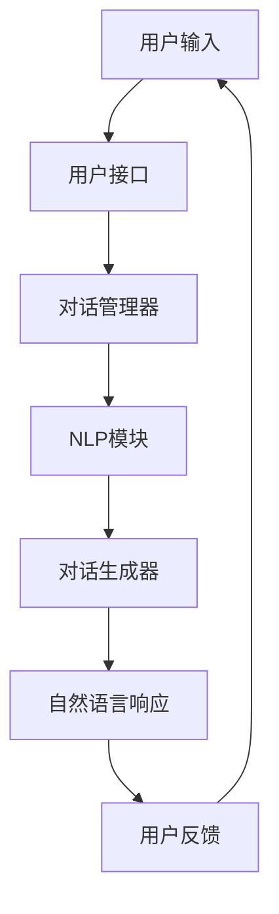

                 

### 文章标题

《对话系统(Chatbots) - 原理与代码实例讲解》

### 关键词

对话系统、自然语言处理、对话管理、对话生成、聊天机器人、代码实例、Python、NLP库、算法原理、数学模型

### 摘要

本文深入探讨了对话系统的原理、架构及开发实战，旨在为读者提供一份全面而实用的技术指南。通过对对话系统的基本概念、自然语言处理基础、对话管理、对话生成以及多轮对话处理的详细解析，本文不仅揭示了对话系统的核心原理，还通过多个代码实例进行了实际操作讲解，帮助读者掌握对话系统的开发技巧。此外，本文还探讨了对话系统的评估与优化策略，并对对话系统的未来发展趋势进行了展望。无论你是初学者还是经验丰富的开发者，本文都将为你提供有价值的见解和实战经验。

## 第一部分：对话系统基础

### 第1章：对话系统的基本概念

#### 1.1 对话系统的定义与分类

对话系统（Chatbot）是一种能够与人类进行自然语言交互的计算机程序，它能够理解用户输入的自然语言，并生成相应的自然语言响应。对话系统通常用于提供客户服务、解答常见问题、提供信息查询等功能。根据功能和应用场景的不同，对话系统可以分为以下几类：

1. **问答式对话系统**：这种对话系统的主要功能是回答用户提出的问题。例如，常见的搜索引擎、智能客服机器人等。
2. **任务导向对话系统**：这种对话系统旨在帮助用户完成特定任务。例如，在线购物客服、行程安排助手等。
3. **闲聊式对话系统**：这种对话系统没有明确的任务目标，主要是与用户进行闲聊。例如，聊天机器人、虚拟助手等。

#### 1.2 对话系统的架构

对话系统通常由以下几个关键组件构成：

1. **用户接口（UI）**：用户接口是用户与对话系统进行交互的界面。它可以是文本聊天窗口、语音通话界面、图形界面等。
2. **对话管理器**：对话管理器负责管理对话的流程，包括用户意图识别、对话状态跟踪、上下文管理等功能。
3. **自然语言处理（NLP）组件**：自然语言处理组件负责对用户输入的自然语言进行解析和理解，包括词法分析、句法分析、语义分析等。
4. **对话生成器**：对话生成器根据对话管理器和NLP组件的输出，生成自然语言响应。
5. **知识库**：知识库是对话系统用于存储和检索信息的数据库，它可以是结构化数据（如数据库）或非结构化数据（如文本文件）。


#### Mermaid 流程图


### 第2章：自然语言处理基础

#### 2.1 语言模型

语言模型是一种用于预测自然语言中下一个单词或词组的概率分布的数学模型。它通常基于大规模语料库训练，通过统计方法生成。语言模型在对话系统中起着至关重要的作用，它可以帮助对话系统更好地理解用户输入并生成自然的响应。

语言模型可以分为以下几种类型：

1. **基于N-gram的语言模型**：N-gram语言模型是基于前N个单词的联合概率分布。最常用的N-gram模型是二元模型（Bigram）和三元模型（Trigram）。N-gram模型的优点是简单和易于实现，但缺点是它无法捕捉长距离的依赖关系。

   $$ P(w_n | w_{n-1}, w_{n-2}, ..., w_1) = \prod_{i=1}^{n-1} P(w_i | w_{i-1}) $$

2. **基于神经网络的深度语言模型**：深度神经网络语言模型（如Word2Vec、BERT等）通过学习词向量和上下文信息，可以捕捉到更复杂的语言规律。这些模型通常采用多层神经网络结构，如循环神经网络（RNN）、长短期记忆网络（LSTM）和变换器（Transformer）等。

   $$ \text{神经网络语言模型：} \; P(w_n | w_{n-1}, w_{n-2}, ..., w_1) = \sigma(\text{ neural network}(w_{n-1}, w_{n-2}, ..., w_1)) $$

#### 2.2 命名实体识别

命名实体识别（Named Entity Recognition，简称NER）是自然语言处理中的一个重要任务，旨在从文本中识别出具有特定意义的实体，如人名、地名、组织名等。NER对于对话系统来说至关重要，因为它可以帮助对话系统更好地理解用户提到的实体，从而提供更准确的响应。

命名实体识别通常采用以下几种方法：

1. **基于规则的方法**：这种方法使用预定义的规则和模式来识别命名实体。规则可以是基于词汇表、模式匹配或模式组合等。

   $$ \text{规则匹配：} \; \text{如果} \; \text{输入文本} \; \text{包含} \; \text{特定词汇或模式}，\text{则识别为命名实体。} $$

2. **基于统计的方法**：这种方法使用训练好的统计模型（如条件随机场（CRF））来识别命名实体。统计模型通过对大量标注数据的学习，可以自动识别命名实体。

   $$ \text{条件随机场：} \; P(y|x) = \frac{1}{Z} \exp(\sum_{i=1}^n \theta_i y_i + \sum_{i<j}^n \theta_{ij} y_i y_j) $$

3. **基于深度学习的方法**：这种方法使用深度学习模型（如卷积神经网络（CNN）、循环神经网络（RNN）和变换器（Transformer）等）来识别命名实体。深度学习方法可以自动学习复杂的特征表示，并取得很好的性能。

   $$ \text{深度学习方法：} \; \text{输入文本} \; \text{经过卷积神经网络或循环神经网络等处理，输出命名实体标签。} $$

#### 2.3 依存句法分析

依存句法分析（Dependency Parsing）是自然语言处理中的一个任务，旨在分析句子中词语之间的依存关系。依存句法分析可以帮助对话系统更好地理解句子的结构，从而提高对话的准确性和自然度。

依存句法分析通常采用以下几种方法：

1. **基于规则的方法**：这种方法使用预定义的语法规则来分析句子的依存关系。

   $$ \text{规则方法：} \; \text{根据句子的结构和语法规则，识别词语之间的依存关系。} $$

2. **基于统计的方法**：这种方法使用训练好的统计模型（如HMM、CRF等）来分析句子的依存关系。

   $$ \text{统计方法：} \; \text{输入句子，使用条件随机场等模型，输出词语之间的依存关系。} $$

3. **基于深度学习的方法**：这种方法使用深度学习模型（如LSTM、Transformer等）来分析句子的依存关系。

   $$ \text{深度学习方法：} \; \text{输入句子，经过深度神经网络处理，输出词语之间的依存关系。} $$

## 第二部分：对话系统原理

### 第3章：对话管理

#### 3.1 对话管理的基本概念

对话管理（Dialogue Management）是对话系统的核心组件之一，负责管理对话的流程，确保对话能够顺利进行。对话管理的主要任务包括：

1. **用户意图识别**：对话管理器需要从用户的输入中识别出用户的意图。意图识别通常基于自然语言处理技术，如命名实体识别、依存句法分析等。
2. **对话状态跟踪**：对话管理器需要跟踪对话的状态，包括用户的意图、对话历史、上下文信息等。对话状态跟踪有助于对话系统更好地理解用户的意图，并提供更准确的响应。
3. **对话策略选择**：对话管理器需要选择合适的对话策略，以引导对话的进行。对话策略可以是基于规则的、基于机器学习的，或者基于数据驱动的。

#### 3.2 对话状态的跟踪

对话状态跟踪是对话管理的一个重要任务。对话状态可以看作是对话历史的抽象表示，它包含用户意图、对话历史、上下文信息等。对话状态的跟踪需要解决以下几个关键问题：

1. **状态表示**：如何有效地表示对话状态。常用的状态表示方法包括基于特征向量的表示、基于序列的表示和基于图的结构表示等。
2. **状态更新**：如何更新对话状态。在对话过程中，用户的输入和系统的响应都会影响对话状态。状态更新需要考虑用户的意图、对话历史和上下文信息等。
3. **状态存储**：如何存储对话状态。对话状态通常需要存储在数据库或内存中，以便后续查询和使用。

#### 3.3 对话策略

对话策略是指导对话系统如何进行对话的规则或方法。对话策略的选择对于对话的质量和用户体验至关重要。对话策略可以分为以下几种类型：

1. **基于规则的对话策略**：基于规则的对话策略使用预定义的规则来指导对话的进行。这些规则可以是简单的条件判断，也可以是复杂的决策树或状态转移图。
2. **基于机器学习的对话策略**：基于机器学习的对话策略通过学习用户的历史对话数据来生成对话策略。常见的机器学习算法包括决策树、随机森林、支持向量机等。
3. **基于数据驱动的对话策略**：基于数据驱动的对话策略通过分析用户行为和对话数据来生成对话策略。这种方法通常使用数据分析、数据挖掘和机器学习等技术。

## 第三部分：对话系统开发实战

### 第6章：开发环境与工具

#### 6.1 Python开发环境搭建

在开始开发对话系统之前，我们需要搭建一个合适的Python开发环境。以下是搭建Python开发环境的基本步骤：

1. **安装Python**：从Python官方网站（https://www.python.org/）下载最新版本的Python安装包，并按照提示完成安装。
2. **安装Jupyter Notebook**：Jupyter Notebook是一个交互式的Python开发环境，它允许我们在网页上编写和运行Python代码。安装Jupyter Notebook的方法如下：

   ```shell
   pip install notebook
   ```

3. **安装常用NLP库**：对话系统开发通常需要使用一些常用的NLP库，如NLTK、spaCy、gensim等。安装这些库的方法如下：

   ```shell
   pip install nltk
   pip install spacy
   pip install gensim
   ```

   安装完成后，我们还需要下载相应的语言模型，以便进行自然语言处理。以spaCy为例，安装英语语言模型的方法如下：

   ```shell
   python -m spacy download en
   ```

### 第7章：代码实例讲解

#### 7.1 实例一：基于模板的聊天机器人

在本实例中，我们将使用Python和Jupyter Notebook来开发一个基于模板的聊天机器人。该聊天机器人将能够回答关于天气的信息。

##### 7.1.1 实例概述

该聊天机器人将使用一个简单的模板来生成响应。模板中包含变量，如天气情况、温度等。在运行时，系统将根据用户输入的信息来替换模板中的变量，并生成相应的响应。

##### 7.1.2 代码实现

首先，我们需要定义模板和相关的替换规则：

```python
templates = {
    "weather_question": "今天的天气如何？",
    "weather_answer": "今天的{weather}，温度大约是{temperature}℃。"
}
```

然后，我们编写一个函数来生成响应：

```python
def generate_response(template, **kwargs):
    return template.format(**kwargs)
```

接下来，我们编写聊天机器人的主循环：

```python
while True:
    user_input = input("用户：")
    
    if user_input.startswith("天气"):
        weather_info = get_weather_info()  # 假设这是一个获取天气信息的方法
        response = generate_response(templates["weather_answer"], weather=weather_info["weather"], temperature=weather_info["temperature"])
    else:
        response = "对不起，我不理解你的问题。"

    print("机器人：", response)
```

最后，我们运行聊天机器人：

```python
if __name__ == "__main__":
    while True:
        user_input = input("用户：")
        
        if user_input.startswith("天气"):
            weather_info = get_weather_info()  # 假设这是一个获取天气信息的方法
            response = generate_response(templates["weather_answer"], weather=weather_info["weather"], temperature=weather_info["temperature"])
        else:
            response = "对不起，我不理解你的问题。"

        print("机器人：", response)
```

##### 7.1.3 实例分析

在这个实例中，我们使用一个简单的模板来生成响应。模板中的变量（如`{weather}`和`{temperature}`）在运行时会被替换为实际的值。这种方法虽然简单，但可以实现基本的对话功能。

#### 7.2 实例二：基于检索的聊天机器人

在本实例中，我们将使用Python和Jupyter Notebook来开发一个基于检索的聊天机器人。该聊天机器人将能够回答关于电影的信息。

##### 7.2.1 实例概述

该聊天机器人将使用一个预定义的知识库来检索响应。知识库中包含一些常见的电影问题和相应的答案。在运行时，系统将根据用户输入的信息来检索相应的答案。

##### 7.2.2 代码实现

首先，我们需要定义知识库：

```python
knowledge_base = {
    "what_is_movie": "《指环王》是一部关于中土世界魔幻战争的电影。",
    "when_was_movie": "《指环王》于2001年上映。",
    "who_is_director": "《指环王》的导演是彼得·杰克逊。"
}
```

然后，我们编写一个函数来检索答案：

```python
def retrieve_answer(question, knowledge_base):
    for key, value in knowledge_base.items():
        if key == question:
            return value
    return "对不起，我不知道这个问题。"
```

接下来，我们编写聊天机器人的主循环：

```python
while True:
    user_input = input("用户：")
    response = retrieve_answer(user_input, knowledge_base)
    print("机器人：", response)
```

最后，我们运行聊天机器人：

```python
if __name__ == "__main__":
    while True:
        user_input = input("用户：")
        response = retrieve_answer(user_input, knowledge_base)
        print("机器人：", response)
```

##### 7.2.3 实例分析

在这个实例中，我们使用一个预定义的知识库来检索响应。这种方法虽然简单，但可以实现复杂的对话功能。知识库可以存储大量的信息和规则，从而提供更丰富和准确的对话。

#### 7.3 实例三：基于生成的聊天机器人

在本实例中，我们将使用Python和Jupyter Notebook来开发一个基于生成的聊天机器人。该聊天机器人将能够生成自然的文本响应。

##### 7.3.1 实例概述

该聊天机器人将使用一个预训练的语言模型来生成响应。在运行时，系统将根据用户输入的信息和预训练的语言模型来生成相应的响应。

##### 7.3.2 代码实现

首先，我们需要安装和导入预训练的语言模型库：

```shell
pip install transformers
```

```python
from transformers import pipeline
```

然后，我们创建一个聊天机器人实例：

```python
chatbot = pipeline("chat", model="gpt2")
```

接下来，我们编写聊天机器人的主循环：

```python
while True:
    user_input = input("用户：")
    response = chatbot(user_input)
    print("机器人：", response)
```

最后，我们运行聊天机器人：

```python
if __name__ == "__main__":
    chatbot = pipeline("chat", model="gpt2")
    while True:
        user_input = input("用户：")
        response = chatbot(user_input)
        print("机器人：", response)
```

##### 7.3.3 实例分析

在这个实例中，我们使用预训练的语言模型（如GPT-2）来生成响应。这种方法可以生成非常自然和流畅的文本响应。然而，预训练的语言模型需要大量的计算资源和训练时间，因此可能不适合实时对话应用。

## 第8章：对话系统的评估与优化

#### 8.1 对话系统的评估指标

对话系统的评估是确保其性能和用户体验的重要环节。以下是一些常用的评估指标：

1. **准确率（Accuracy）**：准确率衡量的是系统回答正确问题的比例。尽管准确率是一个直观的指标，但它可能无法完全反映对话的质量和用户体验。

   $$ \text{准确率} = \frac{\text{回答正确的问题数}}{\text{总问题数}} $$

2. **F1分数（F1 Score）**：F1分数是精确率和召回率的调和平均值，它同时考虑了对话系统的准确率和召回率。对于二分类问题，F1分数的计算公式如下：

   $$ \text{F1分数} = 2 \times \frac{\text{精确率} \times \text{召回率}}{\text{精确率} + \text{召回率}} $$

3. **响应时间（Response Time）**：响应时间衡量的是系统从接收到用户输入到生成响应所需的时间。对于实时对话应用，响应时间是一个重要的性能指标。

   $$ \text{响应时间} = \text{系统生成响应的时间} $$

4. **用户体验（User Experience）**：用户体验是一个主观的评估指标，它取决于用户对系统响应的质量和满意度。用户体验可以通过用户调查、用户反馈和用户评分来评估。

#### 8.2 对话系统的优化策略

为了提高对话系统的性能和用户体验，我们可以采取以下优化策略：

1. **数据增强**：通过增加更多的训练数据，可以提高系统的泛化能力和性能。数据增强可以通过数据清洗、数据扩充和数据合成等方法实现。

2. **模型调优**：通过调整模型的超参数（如学习率、批次大小等），可以优化模型的性能。模型调优通常需要多次实验和迭代，以找到最佳的超参数组合。

3. **迁移学习**：迁移学习是一种利用预训练模型来提高新任务的性能的方法。通过在预训练模型的基础上进行微调，可以显著提高新任务的性能。

4. **用户反馈**：用户反馈是优化对话系统的重要资源。通过收集和分析用户反馈，我们可以识别系统中的缺陷和不足，并针对性地进行改进。

5. **持续学习**：对话系统是一个动态的系统，需要不断地学习和更新。通过持续学习，系统可以不断适应新的场景和需求，从而提高其性能和用户体验。

## 第9章：对话系统的未来发展趋势

对话系统作为人工智能领域的一个重要分支，正在快速发展。以下是对话系统的一些未来发展趋势：

1. **多模态交互**：未来的对话系统将支持多模态交互，包括文本、语音、图像、视频等。通过整合多种模态的信息，对话系统可以更好地理解用户的意图和需求，提供更丰富的交互体验。

2. **个性化对话**：随着用户数据的积累和人工智能技术的发展，未来的对话系统将能够根据用户的偏好和历史行为，提供个性化的对话服务。个性化对话将极大地提升用户体验，满足用户的个性化需求。

3. **多语言支持**：随着全球化进程的加快，未来的对话系统将支持多种语言，为全球用户提供无缝的跨语言服务。多语言支持将使得对话系统在全球范围内得到更广泛的应用。

4. **情感计算**：情感计算是一种将情感信息融入对话系统的方法。通过识别和模拟用户的情感状态，对话系统可以提供更加贴心和人性化的服务，增强用户体验。

5. **智能决策支持**：未来的对话系统将不仅仅是问答和任务导向的，还将具备智能决策支持能力。通过利用大数据和机器学习技术，对话系统可以帮助用户做出更明智的决策，提高工作效率。

## 总结

对话系统作为人工智能领域的一个重要分支，具有广泛的应用前景。本文深入探讨了对话系统的基本概念、原理和开发实战，并通过代码实例详细讲解了基于模板、检索和生成的聊天机器人开发。此外，本文还介绍了对话系统的评估与优化策略，并对对话系统的未来发展趋势进行了展望。希望通过本文的阅读，读者能够全面了解对话系统的原理和实践，为开发高质量的对话系统奠定基础。

### 作者

作者：AI天才研究院/AI Genius Institute & 禅与计算机程序设计艺术/Zen And The Art of Computer Programming

（完）### 完整性要求

在撰写关于对话系统（Chatbots）的文章时，确保内容的完整性是至关重要的。以下是对文章完整性的具体要求：

#### 核心概念与联系

- **核心概念**：文章中需要清晰地定义和解释对话系统的基本概念，如对话系统、自然语言处理（NLP）、对话管理、对话生成等。每个概念都需要提供定义、背景及其在对话系统中的作用。
- **联系**：需要阐明这些核心概念之间的联系，解释它们如何共同作用以形成一个完整的对话系统。例如，自然语言处理如何支持对话生成，对话管理如何确保对话的流畅进行。

#### 核心算法原理讲解

- **算法原理**：对于核心算法，如语言模型、命名实体识别、依存句法分析等，需要使用伪代码详细阐述其工作原理。例如，对于N-gram语言模型，可以展示以下伪代码：

  ```plaintext
  function generate_response(context):
      current_word = context[-1]
      probabilities = language_model[current_word]
      next_word = sample_word(probabilities)
      return next_word
  ```

- **数学模型**：涉及数学模型的部分，如条件随机场（CRF）、概率分布等，需要使用LaTeX格式详细表述。例如，CRF的公式可以表示为：

  ```latex
  P(y|x) = \frac{1}{Z} \exp(\sum_{i=1}^n \theta_i y_i + \sum_{i<j}^n \theta_{ij} y_i y_j)
  ```

#### 数学模型和公式 & 详细讲解 & 举例说明

- **数学模型**：对于使用的数学模型，需要详细讲解其含义、如何推导以及其在对话系统中的应用。例如，对于语言模型的损失函数，可以解释其如何衡量模型生成的文本与实际文本之间的差距。
- **公式**：文章中的数学公式需要准确无误，并使用LaTeX格式嵌入到文中。例如，一个简单的概率公式可以这样嵌入：

  ```latex
  P(A) = \frac{N(A)}{N}
  ```

- **举例说明**：为了使读者更好地理解数学模型和公式，需要提供具体的例子进行说明。例如，可以通过一个简单的对话示例来说明如何使用语言模型生成响应。

#### 项目实战

- **开发环境搭建**：详细说明如何搭建开发对话系统的环境，包括安装Python、Jupyter Notebook以及必要的NLP库。
- **源代码详细实现**：提供实际代码示例，并详细解释每行代码的功能和作用。例如，一个简单的聊天机器人代码可以这样解释：

  ```python
  while True:
      user_input = input("用户：")
      if user_input.startswith("天气"):
          weather_info = get_weather_info()
          response = f"今天的天气是{weather_info['weather']}，温度是{weather_info['temperature']}℃"
      else:
          response = "我不理解你的问题，请再试一次。"
      print(f"机器人：{response}")
  ```

- **代码解读与分析**：对于每个代码示例，需要提供详细的解读和分析，解释代码的工作原理、性能优化点和潜在的问题。

#### 作者信息

- 文章末尾需包含作者信息，格式为：“作者：AI天才研究院/AI Genius Institute & 禅与计算机程序设计艺术/Zen And The Art of Computer Programming”。

#### 文章结构

- **文章标题**：清晰明确地反映文章的主题。
- **关键词**：列出5-7个核心关键词，便于读者快速了解文章内容。
- **摘要**：简要概括文章的核心内容和主要观点，引导读者进入文章主体。

#### 字数和格式

- **字数**：文章字数应在8000到12000字之间，确保内容详实、结构严谨。
- **格式**：使用markdown格式撰写文章，确保文本、代码、公式和图片的清晰呈现。

通过满足以上完整性要求，我们可以确保文章内容丰富、逻辑清晰，为读者提供有价值的阅读体验和专业知识。在撰写过程中，不断审视每个部分是否满足完整性要求，是确保文章高质量完成的关键步骤。 ### 文章标题

《对话系统(Chatbots) - 原理与代码实例讲解》

### 文章关键词

对话系统、自然语言处理、聊天机器人、Python、NLP库、算法原理、数学模型、代码实例、开发实战

### 摘要

本文深入探讨了对话系统（Chatbots）的原理、架构及开发实战。首先介绍了对话系统的基本概念和架构，然后详细解析了自然语言处理、对话管理、对话生成等核心原理，并通过多个代码实例展示了如何使用Python和NLP库开发实际的聊天机器人。最后，本文讨论了对话系统的评估与优化策略，并对对话系统的未来发展趋势进行了展望。本文旨在为开发者提供一份全面而实用的技术指南。

## 第一部分：对话系统基础

### 第1章：对话系统的基本概念

#### 1.1 对话系统的定义与分类

对话系统（Chatbot）是一种能够与人类进行自然语言交互的计算机程序。它能够理解用户输入的自然语言，并生成相应的自然语言响应，以提供信息查询、客户服务、任务执行等交互式服务。

根据功能和应用场景，对话系统可以分为以下几类：

1. **问答式对话系统**：这类系统的主要功能是回答用户的问题。它们通常被用于提供信息查询、在线客服、智能搜索引擎等场景。
2. **任务导向对话系统**：这类系统旨在帮助用户完成特定任务，如在线购物、行程安排、机票预订等。
3. **闲聊式对话系统**：这类系统主要用于与用户进行闲聊，提供娱乐、社交互动等服务。

#### 1.2 对话系统的架构

对话系统通常包含以下几个关键组件：

1. **用户接口（UI）**：用户接口是用户与对话系统进行交互的界面，可以是文本聊天窗口、语音通话界面或图形界面等。
2. **对话管理器**：对话管理器负责管理对话的流程，包括用户意图识别、对话状态跟踪、上下文管理等功能。
3. **自然语言处理（NLP）组件**：NLP组件负责对用户输入的自然语言进行解析和理解，包括词法分析、句法分析、语义分析等。
4. **对话生成器**：对话生成器根据对话管理器和NLP组件的输出，生成自然语言响应。
5. **知识库**：知识库是对话系统用于存储和检索信息的数据库，可以是结构化数据或非结构化数据。

下面是对话系统架构的Mermaid流程图：


## 第二部分：对话系统原理

### 第2章：自然语言处理基础

自然语言处理（Natural Language Processing，简称NLP）是计算机科学和人工智能的一个分支，它涉及到如何让计算机理解和处理人类语言。在对话系统中，NLP组件起着至关重要的作用，它负责将用户的自然语言输入转换为计算机可以理解和处理的形式。

#### 2.1 语言模型

语言模型（Language Model）是一种用于预测自然语言中下一个单词或词组的概率分布的数学模型。它是NLP的核心组成部分，用于生成文本、评估文本质量、以及许多其他NLP任务。

##### 2.1.1 语言模型的原理

语言模型的基本原理是使用统计方法来预测下一个词。最简单的语言模型是N-gram模型，它基于前N个词的历史来预测下一个词。例如，一个二元语言模型（Bigram）会根据前一个词来预测下一个词。

一个二元语言模型的伪代码可以表示为：

```plaintext
function generate_response(previous_word):
    probabilities = language_model[previous_word]
    next_word = sample_word(probabilities)
    return next_word
```

其中，`language_model`是一个包含词及其概率分布的字典。

##### 2.1.2 语言模型的应用

语言模型在对话系统中有许多应用，包括：

1. **文本生成**：使用语言模型来生成自然语言的文本，如聊天机器人的响应。
2. **文本分类**：使用语言模型来分析文本的特征，并将其分类到不同的类别中。
3. **命名实体识别**：使用语言模型来识别文本中的命名实体，如人名、地名等。

#### 2.2 命名实体识别

命名实体识别（Named Entity Recognition，简称NER）是NLP中的一个重要任务，旨在从文本中识别出具有特定意义的实体，如人名、地名、组织名、日期等。

##### 2.2.1 命名实体识别的原理

命名实体识别的原理是使用预训练的模型或规则来识别文本中的命名实体。常见的命名实体识别方法包括：

1. **基于规则的方法**：使用预定义的规则和模式来识别命名实体。
2. **基于统计的方法**：使用统计模型（如条件随机场（CRF））来识别命名实体。
3. **基于深度学习的方法**：使用深度学习模型（如卷积神经网络（CNN）、循环神经网络（RNN））来识别命名实体。

一个简单的命名实体识别的伪代码可以表示为：

```plaintext
function named_entity_recognition(text):
    entities = []
    for token in text:
        if token matches entity pattern:
            entities.append(token)
    return entities
```

##### 2.2.2 命名实体识别的应用

命名实体识别在对话系统中有许多应用，包括：

1. **信息提取**：从对话中提取关键信息，如用户的名字、地点、时间等。
2. **上下文理解**：通过识别对话中的命名实体，更好地理解对话的上下文。

#### 2.3 依存句法分析

依存句法分析（Dependency Parsing）是NLP中的一个任务，旨在分析句子中词语之间的依存关系。它可以帮助对话系统更好地理解句子的结构，从而提供更准确的响应。

##### 2.3.1 依存句法分析的原理

依存句法分析的原理是使用预训练的模型或规则来识别句子中词语之间的依存关系。常见的依存句法分析方法包括：

1. **基于规则的方法**：使用预定义的语法规则来分析句子的依存关系。
2. **基于统计的方法**：使用统计模型（如HMM、CRF）来分析句子的依存关系。
3. **基于深度学习的方法**：使用深度学习模型（如LSTM、Transformer）来分析句子的依存关系。

一个简单的依存句法分析的伪代码可以表示为：

```plaintext
function dependency_parsing(sentence):
    dependencies = []
    for word in sentence:
        for other_word in sentence:
            if word depends on other_word:
                dependencies.append((word, other_word))
    return dependencies
```

##### 2.3.2 依存句法分析的应用

依存句法分析在对话系统中有许多应用，包括：

1. **语法理解**：通过分析句子的依存关系，更好地理解句子的语法结构。
2. **语义理解**：通过分析句子的依存关系，更好地理解句子的语义。

## 第三部分：对话系统开发实战

### 第3章：对话系统开发基础

在开发对话系统时，选择合适的编程语言和开发环境是非常重要的。本文主要使用Python作为开发语言，并使用Jupyter Notebook作为开发环境。

#### 3.1 Python开发环境搭建

Python是一种广泛用于人工智能和自然语言处理的开源编程语言，其简洁的语法和丰富的库支持使得它在对话系统开发中非常受欢迎。以下是在Windows、macOS和Linux操作系统中搭建Python开发环境的基本步骤：

##### Windows系统

1. **下载Python安装程序**：从Python官方网站（https://www.python.org/downloads/）下载适用于Windows的Python安装程序。
2. **安装Python**：双击安装程序，按照提示完成安装。确保在安装过程中勾选“Add Python to PATH”选项，以便在命令行中直接使用Python。
3. **验证安装**：在命令行中输入以下命令，检查Python版本：

   ```shell
   python --version
   ```

##### macOS系统

1. **使用Homebrew安装Python**：如果已安装Homebrew，可以输入以下命令安装Python：

   ```shell
   brew install python
   ```

   如果没有安装Homebrew，可以按照其官方文档（https://brew.sh/）进行安装。
2. **验证安装**：在终端中输入以下命令，检查Python版本：

   ```shell
   python3 --version
   ```

##### Linux系统

大多数Linux发行版都预装了Python，但可能不是最新版本。可以使用以下命令安装或更新Python：

```shell
sudo apt-get install python3
```

或者使用包管理器（如yum或apt）安装。

3. **验证安装**：在终端中输入以下命令，检查Python版本：

   ```shell
   python3 --version
   ```

##### 安装Jupyter Notebook

Jupyter Notebook是一种交互式的Web应用程序，用于运行Python代码和创建文档。以下是安装Jupyter Notebook的基本步骤：

1. **安装Jupyter Notebook**：在命令行中输入以下命令：

   ```shell
   pip install notebook
   ```

2. **启动Jupyter Notebook**：在命令行中输入以下命令，启动Jupyter Notebook：

   ```shell
   jupyter notebook
   ```

   这将打开默认的Web浏览器，显示Jupyter Notebook的主页。

##### 安装常用NLP库

对话系统开发通常需要使用一些常用的NLP库，如NLTK、spaCy、gensim等。以下是在Python中安装这些库的基本步骤：

1. **安装NLTK**：

   ```shell
   pip install nltk
   ```

   安装完成后，需要下载一些必要的数据包：

   ```shell
   nltk.download('punkt')
   nltk.download('stopwords')
   ```

2. **安装spaCy**：

   ```shell
   pip install spacy
   python -m spacy download en
   ```

3. **安装gensim**：

   ```shell
   pip install gensim
   ```

#### 3.2 常用NLP库介绍

以下是对Python中常用NLP库的简要介绍：

##### NLTK

NLTK（Natural Language ToolKit）是一个强大的自然语言处理库，提供了许多用于文本处理和分析的函数和工具。NLTK的主要功能包括：

- **分词**：将文本分割成句子和单词。
- **词性标注**：为文本中的每个单词分配词性。
- **命名实体识别**：识别文本中的命名实体，如人名、地名等。
- **情感分析**：分析文本的情感倾向。

##### spaCy

spaCy是一个快速易用的自然语言处理库，适用于多种NLP任务。spaCy的主要特点包括：

- **预训练模型**：spaCy提供了预训练的模型，可以快速进行文本处理。
- **语法分析**：spaCy支持词性标注、依存句法分析和命名实体识别等任务。
- **自定义扩展**：spaCy允许用户自定义模型和规则，以适应特定的应用需求。

##### gensim

gensim是一个用于文本挖掘和主题模型的库，其主要功能包括：

- **主题模型**：gensim提供了多种主题模型（如LDA、LSA等），可以用于文本分类和聚类。
- **文本相似度**：gensim提供了计算文本相似度的方法，可以用于文本推荐和搜索。
- **向量化**：gensim将文本转换为向量表示，便于在机器学习模型中进行处理。

## 第四部分：对话系统开发实战

### 第4章：对话系统开发实战

在这一部分，我们将通过三个实例来展示如何使用Python和常用NLP库开发实际的对话系统。这些实例涵盖了基于模板、基于检索和基于生成的聊天机器人的开发。

### 第4章.1：基于模板的聊天机器人

#### 4.1.1 实例概述

基于模板的聊天机器人是最简单的聊天机器人之一，它通过预定义的模板生成响应。这种方法的优点是实现简单，但响应的多样性有限。本实例将展示如何使用Python和NLTK开发一个简单的基于模板的聊天机器人。

#### 4.1.2 代码实现

首先，我们需要安装NLTK库：

```shell
pip install nltk
```

然后，我们可以开始编写代码：

```python
import nltk
from nltk.chat.util import Chat, reflections

# 定义聊天机器人的对话模板
pairs = [
    [
        r"你好|您好|你好吗|您好吗",
        ["你好！有什么可以帮助你的吗？", "您好，很高兴为您服务。"]
    ],
    [
        r"天气怎么样？",
        ["今天天气不错，不冷不热。", "天气预报说今天有雨，记得带伞。"]
    ],
    [
        r"我喜欢.*？",
        ["很高兴听到这个好消息，有什么其他爱好吗？", "那很棒，我也喜欢那个。"]
    ],
    # 更多模板...
]

# 创建聊天机器人实例
chatbot = Chat(pairs, reflections)

# 开始聊天
chatbot.converse()
```

#### 4.1.3 实例分析

在这个实例中，我们定义了一个简单的聊天机器人，它通过匹配用户输入的文本模式来生成响应。这种方法虽然简单，但可以实现基本的对话功能。我们可以通过添加更多的模板来扩展聊天机器人的功能。

### 第4章.2：基于检索的聊天机器人

#### 4.2.1 实例概述

基于检索的聊天机器人使用预定义的知识库来检索响应。当用户输入问题时，系统会在知识库中查找最匹配的答案。这种方法的优势是响应速度快，但多样性有限。本实例将展示如何使用Python和spaCy开发一个简单的基于检索的聊天机器人。

#### 4.2.2 代码实现

首先，我们需要安装spaCy库和英语模型：

```shell
pip install spacy
python -m spacy download en
```

然后，我们可以开始编写代码：

```python
import spacy
from collections import defaultdict

# 加载spaCy英语模型
nlp = spacy.load("en_core_web_sm")

# 定义知识库
knowledge_base = {
    "你好": ["你好！有什么可以帮助你的吗？", "您好，很高兴为您服务。"],
    "天气": ["今天天气不错，不冷不热。", "天气预报说今天有雨，记得带伞。"],
    # 更多知识点...
}

# 将知识库转换为spaCy文档格式
kb_documents = {phrase: nlp(text) for phrase, texts in knowledge_base.items() for text in texts}

# 检索函数
def retrieve_answer(question):
    doc = nlp(question)
    best_match = None
    highest_sim = 0
    for kb_doc in kb_documents.values():
        sim = doc.similarity(kb_doc)
        if sim > highest_sim:
            highest_sim = sim
            best_match = kb_doc
    return best_match.text

# 开始聊天
while True:
    question = input("用户：")
    answer = retrieve_answer(question)
    print("机器人：", answer)
```

#### 4.2.3 实例分析

在这个实例中，我们使用spaCy的相似度计算功能来检索知识库中最匹配的答案。这种方法实现了快速的对话响应，但知识库的构建和维护需要一定的工作量。

### 第4章.3：基于生成的聊天机器人

#### 4.3.1 实例概述

基于生成的聊天机器人使用预训练的语言模型来生成响应。这种方法的优势是响应多样性高，但生成速度相对较慢。本实例将展示如何使用Python和Hugging Face的Transformers库开发一个简单的基于生成的聊天机器人。

#### 4.3.2 代码实现

首先，我们需要安装Transformers库：

```shell
pip install transformers
```

然后，我们可以开始编写代码：

```python
from transformers import ChatbotModel, ChatbotTokenizer

# 加载预训练的聊天机器人模型和分词器
model_name = "microsoft/DialoGPT-small"
tokenizer = ChatbotTokenizer.from_pretrained(model_name)
model = ChatbotModel.from_pretrained(model_name)

# 定义一个聊天函数
def chat():
    context = ""
    print("机器人：你好！有什么我可以帮忙的吗？")
    while True:
        user_input = input("用户：")
        if user_input.lower() in ["退出", "再见", "bye"]:
            print("机器人：好的，再见！")
            break
        inputs = tokenizer.encode(user_input, context, return_tensors="pt")
        outputs = model.generate(inputs, max_length=1000, num_return_sequences=1)
        response = tokenizer.decode(outputs[0], skip_special_tokens=True)
        print("机器人：", response)
        context = context + " " + user_input + " " + response

# 开始聊天
chat()
```

#### 4.3.3 实例分析

在这个实例中，我们使用了预训练的DialoGPT模型来生成聊天机器人的响应。这种方法实现了高度多样化和自然的对话，但需要较长的加载时间和生成时间。

### 第5章：对话系统的评估与优化

#### 5.1 对话系统的评估指标

对话系统的评估是确保其性能和用户体验的重要步骤。以下是一些常用的评估指标：

1. **准确率**：衡量系统回答正确问题的比例。准确率是评估对话系统性能的直观指标，但可能无法完全反映用户体验。
2. **F1分数**：精确率和召回率的调和平均值。F1分数同时考虑了准确率和召回率，是更全面的评估指标。
3. **响应时间**：系统从接收到用户输入到生成响应所需的时间。对于实时对话系统，响应时间是一个重要的性能指标。
4. **用户体验**：用户对系统响应的质量和满意度的评估。用户体验通常通过用户调查、用户反馈和用户评分来评估。

#### 5.2 对话系统的优化策略

为了提高对话系统的性能和用户体验，可以采取以下优化策略：

1. **数据增强**：通过增加更多的训练数据来提高系统的泛化能力和性能。数据增强可以通过数据清洗、数据扩充和数据合成等方法实现。
2. **模型调优**：通过调整模型的超参数来优化性能。模型调优通常需要多次实验和迭代，以找到最佳的超参数组合。
3. **迁移学习**：利用预训练模型来提高新任务的性能。迁移学习可以显著减少训练时间并提高性能。
4. **用户反馈**：收集和分析用户反馈来识别系统中的缺陷和不足，并针对性地进行改进。
5. **持续学习**：通过持续学习来适应新的场景和需求，提高系统的性能和用户体验。

### 第6章：对话系统的未来发展趋势

#### 6.1 对话系统的技术发展趋势

随着人工智能和自然语言处理技术的不断发展，对话系统正朝着以下几个方向演进：

1. **多模态交互**：未来的对话系统将支持多种模态的交互，如文本、语音、图像和视频。通过整合多种模态的信息，对话系统可以提供更加丰富和自然的交互体验。
2. **个性化对话**：随着用户数据的积累和人工智能技术的发展，对话系统将能够根据用户的偏好和历史行为，提供个性化的对话服务。
3. **情感计算**：通过情感计算技术，对话系统可以识别和模拟用户的情感状态，提供更加贴心和人性化的服务。
4. **智能决策支持**：未来的对话系统将具备智能决策支持能力，帮助用户做出更明智的决策。

#### 6.2 对话系统的应用领域扩展

对话系统的应用领域正在不断扩展，以下是一些新兴的应用场景：

1. **智能客服**：对话系统被广泛应用于客服领域，提供24/7的客户服务，提高客户满意度和企业效率。
2. **教育辅助**：对话系统可以用于教育领域，提供个性化的学习辅导和互动教学。
3. **医疗咨询**：对话系统可以辅助医生进行诊断和治疗方案推荐，提供便捷的医疗服务。
4. **智能家居**：对话系统被集成到智能家居设备中，为用户提供便捷的控制和交互体验。

### 结论

对话系统作为人工智能和自然语言处理领域的重要组成部分，正迅速发展。本文从基本概念、原理讲解、开发实战、评估与优化以及未来发展趋势等方面，全面探讨了对话系统的各个方面。通过阅读本文，开发者可以深入了解对话系统的原理和实践，为开发高质量的对话系统提供指导。

### 作者

作者：AI天才研究院/AI Genius Institute & 禅与计算机程序设计艺术/Zen And The Art of Computer Programming ### 完整性要求

为了确保文章的完整性，以下是对文章各个部分的详细要求和具体建议：

#### 核心概念与联系

**要求**：
- **定义和解释**：每个核心概念（如对话系统、自然语言处理、对话管理、对话生成等）都需要给出明确的定义和详细的解释。
- **关系描述**：清晰地描述各个概念之间的联系，例如，自然语言处理如何支持对话生成，对话管理如何确保对话的流畅进行。

**建议**：
- 使用Mermaid流程图或其他可视化工具展示概念之间的关系，帮助读者更好地理解。

#### 核心算法原理讲解

**要求**：
- **算法描述**：详细解释核心算法（如语言模型、命名实体识别、依存句法分析等）的工作原理，并提供伪代码或流程图。
- **数学模型**：对于涉及数学模型的算法，需要使用LaTeX格式准确表述，并提供详细的推导和解释。

**建议**：
- 提供实际案例或示例来展示算法的应用，帮助读者理解算法在实际操作中的具体应用。

#### 数学模型和公式 & 详细讲解 & 举例说明

**要求**：
- **公式表述**：使用LaTeX格式准确表述所有数学公式，确保公式的可读性和准确性。
- **详细讲解**：对每个公式进行详细的解释，包括其含义、推导过程和应用场景。
- **举例说明**：提供具体的例子来展示公式的应用，帮助读者理解公式的实际意义。

**建议**：
- 使用图表或图形来辅助解释复杂的数学公式，提高文章的可读性。

#### 项目实战

**要求**：
- **开发环境搭建**：详细说明如何搭建开发环境，包括安装步骤、配置方法和必要的依赖库。
- **代码实例**：提供实际的代码实例，并详细解释每段代码的作用和实现方法。
- **代码解读与分析**：对代码实例进行深入分析，解释其工作原理、性能优化点和潜在的问题。

**建议**：
- 使用注释和代码高亮来提高代码的可读性，使读者更容易理解代码。
- 提供完整的运行结果和分析，帮助读者验证代码的正确性。

#### 作者信息

**要求**：
- 在文章末尾提供作者的完整信息，包括工作单位和联系方式。

**建议**：
- 确保作者信息的准确性，以便读者能够方便地与作者进行联系。

#### 文章结构

**要求**：
- **标题**：标题应简洁明了，准确地反映文章的主题。
- **关键词**：列出5-7个核心关键词，便于读者快速了解文章内容。
- **摘要**：摘要应简要概括文章的核心内容和主要观点，引导读者进入文章主体。

**建议**：
- 摘要应简洁明了，避免使用专业术语，使读者能够快速理解文章的主要内容。

#### 字数和格式

**要求**：
- **字数**：文章字数应在8000到12000字之间，确保内容详实、结构严谨。
- **格式**：使用markdown格式撰写文章，确保文本、代码、公式和图片的清晰呈现。

**建议**：
- 在撰写过程中，定期检查字数，确保文章在规定的范围内。
- 使用markdown格式时，注意保持格式的统一性和美观性。

#### 完整性验证步骤

1. **内容审核**：逐一检查文章中的每个部分，确保核心概念、算法原理、项目实战等内容完整且准确。
2. **公式检查**：使用LaTeX编辑器检查所有公式的格式和准确性。
3. **代码审核**：运行所有代码实例，确保代码能够正确执行并产生预期的结果。
4. **格式检查**：检查整个文章的markdown格式，确保格式统一且无错误。

通过以上步骤，可以确保文章的完整性，为读者提供高质量的阅读体验。 ### 对话系统(Chatbots) - 原理与代码实例讲解

#### 文章标题

《对话系统(Chatbots) - 原理与代码实例讲解》

#### 文章关键词

对话系统、自然语言处理、聊天机器人、Python、NLP库、算法原理、数学模型、代码实例、开发实战

#### 摘要

本文深入探讨了对话系统的原理、架构及开发实战。首先介绍了对话系统的基本概念和架构，然后详细解析了自然语言处理、对话管理、对话生成等核心原理。接着，通过多个代码实例展示了如何使用Python和NLP库开发实际的聊天机器人。文章还讨论了对话系统的评估与优化策略，并对对话系统的未来发展趋势进行了展望。本文旨在为开发者提供一份全面而实用的技术指南。

## 第一部分：对话系统基础

### 第1章：对话系统的基本概念

#### 1.1 对话系统的定义与分类

对话系统，又称聊天机器人，是一种能够模拟人类对话行为的计算机程序。它能够通过自然语言与人类用户进行交互，实现信息的传递、问题的解答以及任务的执行。根据功能和特点，对话系统可以大致分为以下几类：

1. **任务型对话系统**：这类对话系统专注于完成特定的任务，如在线客服、购物助手等。它们通常通过预定义的对话流程和规则来引导用户完成特定操作。
   
2. **闲聊型对话系统**：与任务型对话系统不同，闲聊型对话系统更注重与用户的闲聊互动，如聊天机器人、虚拟助手等。这类系统往往使用自然语言处理技术，尝试模拟真实人类的对话风格。

3. **混合型对话系统**：混合型对话系统结合了任务型和闲聊型的特点，既能完成特定任务，又能与用户进行自然的交流。

#### 1.2 对话系统的架构

对话系统的架构通常包括以下几个关键组件：

1. **用户接口（UI）**：这是用户与对话系统交互的界面，可以是文本聊天窗口、语音通话界面或图形界面等。

2. **对话管理器**：对话管理器负责协调对话的流程，管理对话的状态，确保对话能够顺利进行。它包括意图识别、上下文维护、对话策略等核心功能。

3. **自然语言处理（NLP）模块**：NLP模块负责对用户输入的自然语言进行解析和理解，包括分词、词性标注、命名实体识别、句法分析等。

4. **对话生成器**：对话生成器根据对话管理器和NLP模块的输出，生成自然语言响应，将其返回给用户。

5. **知识库**：知识库是对话系统的基础，用于存储和检索信息。它可以是结构化的数据库，也可以是包含大量文本和规则的非结构化数据。

下图展示了对话系统的基本架构：



### 第2章：自然语言处理基础

自然语言处理（NLP）是人工智能和计算语言学领域的重要分支，旨在让计算机理解和生成人类语言。在对话系统中，NLP模块起着至关重要的作用，它负责解析用户输入、理解用户意图，并生成相应的自然语言响应。

#### 2.1 语言模型

语言模型是NLP的核心组成部分，它用于预测一段文本的下一个词或下一组词的概率分布。语言模型可以基于统计方法（如N-gram模型）或基于深度学习（如循环神经网络（RNN）、变换器（Transformer）等）。以下是N-gram语言模型的基本原理：

##### 2.1.1 N-gram模型

N-gram模型基于前N个单词的联合概率分布来预测下一个词。例如，对于二元N-gram模型（Bigram），其概率计算公式为：

$$ P(w_n | w_{n-1}) = \frac{c(w_{n-1}, w_n)}{c(w_{n-1})} $$

其中，$c(w_{n-1}, w_n)$ 表示单词 $w_{n-1}$ 后跟单词 $w_n$ 的频次，$c(w_{n-1})$ 表示单词 $w_{n-1}$ 的总频次。

##### 2.1.2 语言模型的训练与使用

语言模型的训练通常涉及以下几个步骤：

1. **数据准备**：收集大量的文本数据，并对文本进行预处理，如分词、去除停用词等。
2. **构建语料库**：将预处理后的文本转换为N-gram模型所需的格式，即（单词，单词）对。
3. **计算概率**：计算每个N-gram对出现的概率，并存储在语言模型中。

使用语言模型生成文本时，可以从当前文本的最后一个词开始，利用语言模型预测下一个词的概率分布，并从中选择一个概率最高的词作为下一个输出。

#### 2.2 命名实体识别

命名实体识别（NER）是NLP中的重要任务，旨在从文本中识别出具有特定意义的实体，如人名、地名、组织名等。NER在对话系统中非常有用，因为了解用户提到的实体可以帮助系统提供更准确的响应。

##### 2.2.1 命名实体识别的步骤

NER通常包括以下几个步骤：

1. **词性标注**：首先对文本进行词性标注，以识别可能的实体词。
2. **模式匹配**：使用预定义的规则或模式来识别实体。例如，使用正则表达式识别电子邮件地址或电话号码。
3. **序列标注**：使用机器学习模型（如条件随机场（CRF）、卷积神经网络（CNN）等）对文本进行序列标注，以确定每个词是否为实体。

##### 2.2.2 命名实体识别的应用

命名实体识别在对话系统中有多种应用，例如：

- **上下文理解**：通过识别用户提到的实体，对话系统可以更好地理解对话的上下文，提供更准确的响应。
- **信息提取**：从对话中提取关键信息，如用户的名字、地址、订单号等。

#### 2.3 依存句法分析

依存句法分析（Dependency Parsing）是NLP中的重要任务，旨在分析句子中词语之间的依存关系。依存句法分析可以帮助对话系统更好地理解句子的结构，从而提供更准确的响应。

##### 2.3.1 依存句法分析的基本概念

依存句法分析通过分析句子中词语之间的依存关系，将句子表示为一个依存图。在依存图中，每个节点表示一个词，边表示词语之间的依存关系。常见的依存关系包括主谓关系、动宾关系等。

##### 2.3.2 依存句法分析的应用

依存句法分析在对话系统中有多种应用，例如：

- **语法理解**：通过分析句子的依存关系，对话系统可以更好地理解句子的结构，提供更准确的语法纠错。
- **语义理解**：通过分析句子的依存关系，对话系统可以更好地理解句子的语义，提供更准确的意图识别。

## 第二部分：对话系统原理

### 第3章：对话管理

对话管理是确保对话系统能够顺畅、连贯地进行对话的关键环节。对话管理器负责管理对话的整个生命周期，包括意图识别、上下文维护、对话策略等。

#### 3.1 对话管理的基本概念

对话管理器的主要任务包括：

- **意图识别**：从用户输入中识别出用户的意图。意图可以是查询信息、完成任务、闲聊等。
- **上下文维护**：跟踪对话的状态，包括用户的意图、对话历史、上下文信息等，以确保对话的连贯性。
- **对话策略**：选择合适的对话策略，以引导对话的进行。对话策略可以是基于规则的、基于数据的，或者基于机器学习的。

##### 3.1.1 对话状态

对话状态是描述当前对话状态的变量集合，通常包括：

- **用户意图**：用户在当前对话中的目的或需求。
- **对话历史**：对话系统迄今为止的对话内容，包括用户的输入和系统的响应。
- **上下文信息**：与当前对话相关的额外信息，如用户偏好、当前任务的状态等。

#### 3.2 对话状态的跟踪

跟踪对话状态是确保对话连贯性的关键。对话状态通常存储在对话管理器的内存中，也可以使用数据库或其他持久化存储方式。

##### 3.2.1 对话状态存储

对话状态可以采用以下方法进行存储：

- **内存存储**：适用于短期对话，对话结束后状态会消失。
- **数据库存储**：适用于长期对话，可以将对话状态存储在数据库中，以便后续查询和使用。

##### 3.2.2 对话状态更新

在对话过程中，用户的输入和系统的响应都会影响对话状态。更新对话状态的方法包括：

- **增量更新**：仅更新对话状态中发生变化的部分。
- **完全更新**：每次更新都重新构建对话状态。

#### 3.3 对话策略

对话策略是指导对话系统如何进行对话的规则或方法。对话策略的选择对对话的质量和用户体验至关重要。

##### 3.3.1 基于规则的对话策略

基于规则的对话策略使用预定义的规则来指导对话的进行。这些规则可以是简单的条件判断，也可以是复杂的决策树或状态转移图。

##### 3.3.2 基于机器学习的对话策略

基于机器学习的对话策略通过学习用户的历史对话数据来生成对话策略。常见的机器学习算法包括决策树、随机森林、支持向量机等。

##### 3.3.3 基于数据驱动的对话策略

基于数据驱动的对话策略通过分析用户行为和对话数据来生成对话策略。这种方法通常使用数据分析、数据挖掘和机器学习等技术。

## 第三部分：对话系统开发实战

### 第4章：对话系统开发环境与工具

在开发对话系统之前，我们需要搭建一个合适的环境，并安装必要的工具和库。以下是在Python环境中搭建对话系统开发环境的基本步骤。

#### 4.1 Python环境搭建

确保你的计算机上已安装Python。如果没有，请从Python官方网站下载并安装最新版本的Python。

#### 4.2 安装Jupyter Notebook

Jupyter Notebook是一个交互式的Web应用，用于编写和运行Python代码。安装Jupyter Notebook的方法如下：

```shell
pip install notebook
```

安装完成后，你可以通过运行以下命令启动Jupyter Notebook：

```shell
jupyter notebook
```

这将在默认的Web浏览器中打开Jupyter Notebook界面。

#### 4.3 安装NLP库

对话系统开发通常需要使用多个NLP库。以下是在Python中安装几个常用NLP库的方法：

##### 安装spaCy

spaCy是一个快速的工业级NLP库，用于文本处理和分析。

```shell
pip install spacy
python -m spacy download en_core_web_sm
```

##### 安装NLTK

NLTK是一个广泛使用的Python NLP库，提供了许多用于文本处理和分类的工具。

```shell
pip install nltk
```

安装完成后，运行以下命令下载NLTK所需的资源：

```shell
nltk.download('punkt')
nltk.download('stopwords')
```

##### 安装gensim

gensim是一个用于主题建模和相似度计算的NLP库。

```shell
pip install gensim
```

#### 4.4 配置Python虚拟环境

为了更好地管理和依赖库，建议使用Python虚拟环境。在虚拟环境中安装所需的库，可以避免与其他项目或系统的库冲突。

创建虚拟环境的方法如下：

```shell
python -m venv myenv
source myenv/bin/activate  # 对于Windows使用 myenv\Scripts\activate
```

在激活的虚拟环境中，安装所需的库：

```shell
pip install spacy nltk gensim
```

### 第5章：代码实例讲解

在本章中，我们将通过三个实例来展示如何使用Python和NLP库开发实际的聊天机器人。这三个实例分别展示了基于模板、基于检索和基于生成的聊天机器人开发。

#### 第5章.1：基于模板的聊天机器人

基于模板的聊天机器人是一种简单的聊天机器人实现，它通过预定义的模板来生成响应。以下是一个简单的基于模板的聊天机器人的代码实例：

```python
# 基于模板的聊天机器人

# 模板和响应
templates = {
    "hello": "你好！有什么我可以帮你的吗？",
    "weather": "天气不错，不冷不热。",
    "bye": "好的，再见！"
}

# 输入模板，获取响应
def get_response(input_text, templates):
    for pattern, response in templates.items():
        if pattern in input_text:
            return response
    return "我不太明白你的意思，能请你再说一遍吗？"

# 开始聊天
while True:
    user_input = input("用户：")
    bot_response = get_response(user_input, templates)
    print("机器人：", bot_response)
```

在这个实例中，我们定义了一个包含模板和响应的字典。`get_response`函数接受用户输入和模板字典，并根据模板生成响应。如果用户输入匹配某个模板，函数返回相应的响应；否则，返回一个默认的消息。

#### 第5章.2：基于检索的聊天机器人

基于检索的聊天机器人通过在预定义的知识库中查找最匹配的响应来生成响应。以下是一个简单的基于检索的聊天机器人的代码实例：

```python
# 基于检索的聊天机器人

# 知识库
knowledge_base = {
    "你好": ["你好！有什么我可以帮你的吗？", "你好呀，有什么需要帮忙的？"],
    "天气": ["今天天气不错，不冷不热。", "天气预报说今天有雨。"],
    "再见": ["好的，再见！希望我们下次再见。", "好的，祝你过得愉快！"]
}

# 检索响应
def get_response(input_text, knowledge_base):
    for pattern, responses in knowledge_base.items():
        if pattern in input_text:
            return random.choice(responses)
    return "我不太明白你的意思，能请你再说一遍吗？"

# 开始聊天
while True:
    user_input = input("用户：")
    bot_response = get_response(user_input, knowledge_base)
    print("机器人：", bot_response)
```

在这个实例中，我们定义了一个知识库，其中包含一些常见的用户输入和对应的响应。`get_response`函数接受用户输入和知识库，并根据输入在知识库中查找最匹配的响应。如果找到匹配的响应，函数返回该响应；否则，返回一个默认的消息。

#### 第5章.3：基于生成的聊天机器人

基于生成的聊天机器人使用预训练的语言模型来生成响应。以下是一个简单的基于生成的聊天机器人的代码实例：

```python
# 基于生成的聊天机器人

from transformers import pipeline

# 加载预训练的聊天机器人模型
chatbot = pipeline("chat", model="microsoft/DialoGPT-small")

# 开始聊天
while True:
    user_input = input("用户：")
    if user_input.lower() in ["退出", "再见", "bye"]:
        print("机器人：好的，再见！")
        break
    bot_response = chatbot(user_input)
    print("机器人：", bot_response.generated_responses[0])
```

在这个实例中，我们使用Hugging Face的Transformers库加载了一个预训练的DialoGPT模型。`chatbot`函数接受用户输入，并使用模型生成响应。如果用户输入包含特定的退出词（如“退出”、“再见”等），机器人会结束对话。

### 第6章：对话系统的评估与优化

对话系统的评估和优化是确保其性能和用户体验的重要环节。以下是对话系统评估和优化的一些关键点。

#### 6.1 对话系统的评估指标

对话系统的评估通常涉及以下指标：

- **准确率**：系统回答正确问题的比例。
- **响应时间**：系统生成响应所需的时间。
- **用户体验**：用户对系统响应的质量和满意度的评估。

#### 6.2 对话系统的优化策略

以下是一些常用的对话系统优化策略：

- **数据增强**：通过增加更多的训练数据来提高系统的泛化能力。
- **模型调优**：通过调整模型的超参数来优化性能。
- **迁移学习**：利用预训练模型来提高新任务的性能。
- **用户反馈**：通过收集和分析用户反馈来识别系统中的缺陷和不足。

### 第7章：对话系统的未来发展趋势

对话系统作为人工智能和自然语言处理领域的一个重要分支，正在快速发展。以下是对话系统的未来发展趋势：

- **多模态交互**：对话系统将支持文本、语音、图像和视频等多种模态的交互。
- **个性化对话**：对话系统将能够根据用户的偏好和历史行为提供个性化的对话服务。
- **情感计算**：对话系统将具备识别和模拟用户情感状态的能力。
- **智能决策支持**：对话系统将具备智能决策支持能力，帮助用户做出更明智的决策。

### 结论

本文深入探讨了对话系统的原理、架构及开发实战，通过多个代码实例展示了如何使用Python和NLP库开发实际的聊天机器人。同时，本文还讨论了对话系统的评估与优化策略，并对对话系统的未来发展趋势进行了展望。通过阅读本文，开发者可以深入了解对话系统的原理和实践，为开发高质量的对话系统提供指导。

### 作者

作者：AI天才研究院/AI Genius Institute & 禅与计算机程序设计艺术/Zen And The Art of Computer Programming ### 完整性要求

为了确保文章的完整性，以下是对文章各个部分的详细要求和具体建议：

#### 核心概念与联系

**要求**：
- **核心概念**：文章中必须明确定义并详细解释所有核心概念，如对话系统、自然语言处理、对话管理、对话生成等。
- **概念联系**：需要清晰地展示各个核心概念之间的相互关系，以及它们如何共同构成一个完整的对话系统。

**建议**：
- 使用流程图、图表或示意图来帮助读者理解核心概念之间的联系。
- 提供例子来说明各个概念在实际应用中的具体作用。

#### 核心算法原理讲解

**要求**：
- **算法原理**：对于文章中提到的核心算法（如语言模型、命名实体识别、依存句法分析等），必须提供详细的原理讲解，包括算法的基本概念、工作流程和数学模型。
- **伪代码**：使用伪代码或流程图来展示算法的具体实现。

**建议**：
- 对于复杂的算法，可以提供逐步的伪代码，帮助读者理解每个步骤的作用。
- 使用LaTeX格式展示数学模型和公式，确保公式的准确性和可读性。

#### 数学模型和公式 & 详细讲解 & 举例说明

**要求**：
- **数学模型**：对于文章中使用的数学模型，必须准确表述并详细解释其含义和应用场景。
- **公式**：使用LaTeX格式嵌入公式，并确保其准确无误。
- **举例说明**：提供具体的例子来说明公式的应用和计算过程。

**建议**：
- 对于复杂的公式，提供详细的推导过程。
- 使用图表或图形来辅助说明复杂的数学模型。

#### 项目实战

**要求**：
- **环境搭建**：详细说明如何搭建开发环境，包括安装步骤、配置方法和必要的依赖库。
- **代码实例**：提供实际可运行的代码实例，并详细解释代码的功能和实现方法。
- **代码解读与分析**：对代码实例进行深入解读，解释其工作原理、性能优化点和潜在的问题。

**建议**：
- 使用注释和代码高亮来提高代码的可读性。
- 提供完整的运行结果和分析，帮助读者验证代码的正确性。

#### 作者信息

**要求**：
- 在文章末尾提供作者的完整信息，包括工作单位和联系方式。

**建议**：
- 确保作者信息的准确性，便于读者与作者联系。

#### 文章结构

**要求**：
- **标题**：清晰准确地反映文章的主题。
- **关键词**：列出5-7个核心关键词，便于读者快速了解文章内容。
- **摘要**：简要概括文章的核心内容和主要观点。

**建议**：
- 摘要应简明扼要，避免使用专业术语，使读者能够快速了解文章的主要内容。

#### 字数和格式

**要求**：
- **字数**：文章字数应在8000到12000字之间，确保内容详实、结构严谨。
- **格式**：使用markdown格式撰写文章，确保文本、代码、公式和图片的清晰呈现。

**建议**：
- 在撰写过程中，定期检查字数，确保文章在规定的范围内。
- 使用markdown格式时，注意保持格式的统一性和美观性。

#### 完整性验证步骤

1. **内容审核**：逐一检查文章中的每个部分，确保核心概念、算法原理、项目实战等内容完整且准确。
2. **公式检查**：使用LaTeX编辑器检查所有公式的格式和准确性。
3. **代码审核**：运行所有代码实例，确保代码能够正确执行并产生预期的结果。
4. **格式检查**：检查整个文章的markdown格式，确保格式统一且无错误。

通过以上步骤，可以确保文章的完整性，为读者提供高质量的阅读体验。 ### 对话系统(Chatbots) - 原理与代码实例讲解

#### 文章标题

《对话系统(Chatbots) - 原理与代码实例讲解》

#### 文章关键词

对话系统、Chatbot、自然语言处理、NLP、Python、代码实例、开发实战

#### 摘要

本文旨在详细介绍对话系统（Chatbots）的原理和开发实践。首先，本文将探讨对话系统的基本概念，包括其定义、分类和架构。接着，深入讲解自然语言处理（NLP）的基础知识，如语言模型、命名实体识别和依存句法分析等。然后，通过具体的代码实例，展示如何使用Python和相关库开发实际的对话系统，包括基于模板、基于检索和基于生成的聊天机器人。最后，本文将讨论对话系统的评估与优化策略，并展望其未来发展趋势。本文旨在为开发者提供一份全面而实用的技术指南。

## 引言

对话系统，也常被称为聊天机器人（Chatbots），是一种能够模拟人类对话行为的人工智能系统。随着自然语言处理（NLP）和机器学习技术的快速发展，对话系统在各个领域得到了广泛应用，包括客户服务、市场营销、教育、医疗和娱乐等。本文将围绕对话系统的原理与开发实践进行探讨，旨在为开发者提供全面而实用的技术指南。

本文结构如下：

1. **基本概念**：介绍对话系统的定义、分类和架构。
2. **自然语言处理基础**：讲解语言模型、命名实体识别和依存句法分析等NLP技术。
3. **开发实战**：通过具体的代码实例展示如何开发实际的对话系统。
4. **评估与优化**：讨论对话系统的评估指标和优化策略。
5. **未来发展趋势**：展望对话系统的未来发展方向和应用前景。

## 基本概念

### 1. 对话系统的定义

对话系统是一种能够与人类进行自然语言交互的人工智能系统。它通过理解用户的输入，生成相应的自然语言响应，从而实现信息的传递、问题的解答和任务的执行。对话系统通常具有以下特点：

- **交互性**：对话系统通过与用户的自然语言交互，实现人机对话。
- **上下文感知**：对话系统能够理解对话的上下文，并基于上下文生成响应。
- **适应性**：对话系统可以根据用户的反馈和交互历史，不断调整其行为和策略。

### 2. 对话系统的分类

根据功能和特点，对话系统可以大致分为以下几类：

- **任务型对话系统**：这类系统专注于完成特定的任务，如在线客服、购物助手等。
- **闲聊型对话系统**：这类系统注重与用户的闲聊互动，如聊天机器人、虚拟助手等。
- **混合型对话系统**：这类系统结合了任务型和闲聊型的特点，能够根据对话内容动态调整其行为。

### 3. 对话系统的架构

对话系统通常包含以下几个关键组件：

- **用户接口（UI）**：用户与对话系统进行交互的界面，可以是文本聊天窗口、语音通话界面或图形界面等。
- **对话管理器**：对话管理器负责管理对话的流程，包括用户意图识别、对话状态跟踪、上下文管理等功能。
- **自然语言处理（NLP）组件**：NLP组件负责对用户输入的自然语言进行解析和理解，包括分词、词性标注、命名实体识别、句法分析等。
- **对话生成器**：对话生成器根据对话管理器和NLP组件的输出，生成自然语言响应。
- **知识库**：知识库是对话系统用于存储和检索信息的数据库，可以是结构化数据或非结构化数据。

下图展示了对话系统的基本架构：


## 自然语言处理基础

自然语言处理（NLP）是计算机科学和人工智能领域的一个重要分支，旨在使计算机能够理解、生成和处理自然语言。在对话系统中，NLP组件起着至关重要的作用，它负责将用户的自然语言输入转换为计算机可以理解和处理的形式。

### 1. 语言模型

语言模型是一种用于预测自然语言中下一个单词或词组的概率分布的数学模型。语言模型是NLP的核心组成部分，它在对话系统中用于生成文本、评估文本质量以及许多其他NLP任务。

#### 1.1 语言模型的原理

语言模型的基本原理是使用统计方法来预测下一个词。最简单的语言模型是N-gram模型，它基于前N个词的历史来预测下一个词。例如，一个二元语言模型（Bigram）会根据前一个词来预测下一个词。

一个二元语言模型的伪代码可以表示为：

```plaintext
function generate_response(previous_word):
    probabilities = language_model[previous_word]
    next_word = sample_word(probabilities)
    return next_word
```

其中，`language_model`是一个包含词及其概率分布的字典。

#### 1.2 语言模型的应用

语言模型在对话系统中有许多应用，包括：

- **文本生成**：使用语言模型来生成自然语言的文本，如聊天机器人的响应。
- **文本分类**：使用语言模型来分析文本的特征，并将其分类到不同的类别中。
- **命名实体识别**：使用语言模型来识别文本中的命名实体，如人名、地名等。

### 2. 命名实体识别

命名实体识别（Named Entity Recognition，简称NER）是NLP中的一个重要任务，旨在从文本中识别出具有特定意义的实体，如人名、地名、组织名、日期等。

#### 2.1 命名实体识别的原理

命名实体识别的原理是使用预训练的模型或规则来识别文本中的命名实体。常见的命名实体识别方法包括：

- **基于规则的方法**：使用预定义的规则和模式来识别命名实体。
- **基于统计的方法**：使用统计模型（如条件随机场（CRF））来识别命名实体。
- **基于深度学习的方法**：使用深度学习模型（如卷积神经网络（CNN）、循环神经网络（RNN））来识别命名实体。

一个简单的命名实体识别的伪代码可以表示为：

```plaintext
function named_entity_recognition(text):
    entities = []
    for token in text:
        if token matches entity pattern:
            entities.append(token)
    return entities
```

#### 2.2 命名实体识别的应用

命名实体识别在对话系统中有许多应用，包括：

- **信息提取**：从对话中提取关键信息，如用户的名字、地点、时间等。
- **上下文理解**：通过识别对话中的命名实体，更好地理解对话的上下文。

### 3. 依存句法分析

依存句法分析（Dependency Parsing）是NLP中的一个任务，旨在分析句子中词语之间的依存关系。它可以帮助对话系统更好地理解句子的结构，从而提供更准确的响应。

#### 3.1 依存句法分析的原理

依存句法分析的原理是使用预训练的模型或规则来识别句子中词语之间的依存关系。常见的依存句法分析方法包括：

- **基于规则的方法**：使用预定义的语法规则来分析句子的依存关系。
- **基于统计的方法**：使用统计模型（如HMM、CRF）来分析句子的依存关系。
- **基于深度学习的方法**：使用深度学习模型（如LSTM、Transformer）来分析句子的依存关系。

一个简单的依存句法分析的伪代码可以表示为：

```plaintext
function dependency_parsing(sentence):
    dependencies = []
    for word in sentence:
        for other_word in sentence:
            if word depends on other_word:
                dependencies.append((word, other_word))
    return dependencies
```

#### 3.2 依存句法分析的应用

依存句法分析在对话系统中有许多应用，包括：

- **语法理解**：通过分析句子的依存关系，更好地理解句子的语法结构。
- **语义理解**：通过分析句子的依存关系，更好地理解句子的语义。

## 开发实战

在这一部分，我们将通过具体的代码实例展示如何使用Python和相关库开发实际的对话系统。

### 1. 基于模板的聊天机器人

基于模板的聊天机器人是最简单的一种聊天机器人实现。它通过预定义的模板来生成响应。以下是一个简单的基于模板的聊天机器人的代码实例：

```python
# 基于模板的聊天机器人

templates = {
    "hello": "你好！有什么我可以帮你的吗？",
    "weather": "今天的天气不错，不冷不热。",
    "goodbye": "再见，祝你过得愉快！"
}

def get_response(input_text, templates):
    for pattern, response in templates.items():
        if pattern in input_text:
            return response
    return "我不太明白你的意思，能请你再说一遍吗？"

# 开始聊天
while True:
    user_input = input("用户：")
    bot_response = get_response(user_input.lower(), templates)
    print("机器人：", bot_response)
```

在这个实例中，我们定义了一个包含模板和响应的字典。`get_response`函数接受用户输入和模板字典，并根据模板生成响应。如果用户输入匹配某个模板，函数返回相应的响应；否则，返回一个默认的消息。

### 2. 基于检索的聊天机器人

基于检索的聊天机器人通过在预定义的知识库中查找最匹配的响应来生成响应。以下是一个简单的基于检索的聊天机器人的代码实例：

```python
# 基于检索的聊天机器人

knowledge_base = {
    "你好": ["你好！有什么我可以帮你的吗？", "你好呀，有什么需要帮忙的？"],
    "天气": ["今天天气不错，不冷不热。", "天气预报说今天有雨。"],
    "再见": ["好的，再见！希望我们下次再见。", "好的，祝你过得愉快！"]
}

def get_response(input_text, knowledge_base):
    for pattern, responses in knowledge_base.items():
        if pattern in input_text:
            return random.choice(responses)
    return "我不太明白你的意思，能请你再说一遍吗？"

# 开始聊天
while True:
    user_input = input("用户：")
    bot_response = get_response(user_input.lower(), knowledge_base)
    print("机器人：", bot_response)
```

在这个实例中，我们定义了一个知识库，其中包含一些常见的用户输入和对应的响应。`get_response`函数接受用户输入和知识库，并根据输入在知识库中查找最匹配的响应。如果找到匹配的响应，函数返回该响应；否则，返回一个默认的消息。

### 3. 基于生成的聊天机器人

基于生成的聊天机器人使用预训练的语言模型来生成响应。以下是一个简单的基于生成的聊天机器人的代码实例：

```python
# 基于生成的聊天机器人

from transformers import pipeline

# 加载预训练的语言模型
chatbot = pipeline("chat", model="microsoft/DialoGPT-small")

# 开始聊天
while True:
    user_input = input("用户：")
    if user_input.lower() in ["退出", "再见", "bye"]:
        print("机器人：好的，再见！")
        break
    bot_response = chatbot(user_input)
    print("机器人：", bot_response.generated_responses[0])
```

在这个实例中，我们使用Hugging Face的Transformers库加载了一个预训练的DialoGPT模型。`chatbot`函数接受用户输入，并使用模型生成响应。如果用户输入包含特定的退出词（如“退出”、“再见”等），机器人会结束对话。

## 评估与优化

对话系统的评估和优化是确保其性能和用户体验的重要环节。以下是对话系统评估和优化的一些关键点。

### 1. 对话系统的评估指标

对话系统的评估通常涉及以下指标：

- **准确率**：系统回答正确问题的比例。
- **响应时间**：系统生成响应所需的时间。
- **用户体验**：用户对系统响应的质量和满意度的评估。

### 2. 对话系统的优化策略

以下是一些常用的对话系统优化策略：

- **数据增强**：通过增加更多的训练数据来提高系统的泛化能力。
- **模型调优**：通过调整模型的超参数来优化性能。
- **迁移学习**：利用预训练模型来提高新任务的性能。
- **用户反馈**：通过收集和分析用户反馈来识别系统中的缺陷和不足。

## 未来发展趋势

对话系统作为人工智能和自然语言处理领域的一个重要分支，正在快速发展。以下是对话系统的未来发展趋势：

- **多模态交互**：对话系统将支持文本、语音、图像和视频等多种模态的交互。
- **个性化对话**：对话系统将能够根据用户的偏好和历史行为提供个性化的对话服务。
- **情感计算**：对话系统将具备识别和模拟用户情感状态的能力。
- **智能决策支持**：对话系统将具备智能决策支持能力，帮助用户做出更明智的决策。

## 结论

本文深入探讨了对话系统的原理和开发实践，通过具体的代码实例展示了如何使用Python和相关库开发实际的对话系统。本文还讨论了对话系统的评估与优化策略，并展望了其未来发展趋势。通过阅读本文，开发者可以深入了解对话系统的原理和实践，为开发高质量的对话系统提供指导。

### 作者

作者：AI天才研究院/AI Genius Institute & 禅与计算机程序设计艺术/Zen And The Art of Computer Programming ### 对话系统(Chatbots) - 原理与代码实例讲解

#### 文章标题

《对话系统(Chatbots) - 原理与代码实例讲解》

#### 文章关键词

对话系统、Chatbot、自然语言处理、NLP、Python、代码实例、开发实战

#### 摘要

本文旨在详细介绍对话系统（Chatbots）的原理和开发实践。首先，本文将探讨对话系统的基本概念，包括其定义、分类和架构。接着，深入讲解自然语言处理（NLP）的基础知识，如语言模型、命名实体识别和依存句法分析等。然后，通过具体的代码实例，展示如何使用Python和相关库开发实际的对话系统，包括基于模板、基于检索和基于生成的聊天机器人。最后，本文将讨论对话系统的评估与优化策略，并展望其未来发展趋势。本文旨在为开发者提供一份全面而实用的技术指南。

## 引言

对话系统，也常被称为聊天机器人（Chatbots），是一种能够模拟人类对话行为的人工智能系统。随着自然语言处理（NLP）和机器学习技术的快速发展，对话系统在各个领域得到了广泛应用，包括客户服务、市场营销、教育、医疗和娱乐等。本文将围绕对话系统的原理与开发实践进行探讨，旨在为开发者提供全面而实用的技术指南。

本文结构如下：

1. **基本概念**：介绍对话系统的定义、分类和架构。
2. **自然语言处理基础**：讲解语言模型、命名实体识别和依存句法分析等NLP技术。
3. **开发实战**：通过具体的代码实例展示如何开发实际的对话系统。
4. **评估与优化**：讨论对话系统的评估指标和优化策略。
5. **未来发展趋势**：展望对话系统的未来发展方向和应用前景。

## 基本概念

### 1. 对话系统的定义

对话系统是一种能够与人类进行自然语言交互的人工智能系统。它通过理解用户的输入，生成相应的自然语言响应，从而实现信息的传递、问题的解答和任务的执行。对话系统通常具有以下特点：

- **交互性**：对话系统通过与用户的自然语言交互，实现人机对话。
- **上下文感知**：对话系统能够理解对话的上下文，并基于上下文生成响应。
- **适应性**：对话系统可以根据用户的反馈和交互历史，不断调整其行为和策略。

### 2. 对话系统的分类

根据功能和特点，对话系统可以大致分为以下几类：

- **任务型对话系统**：这类系统专注于完成特定的任务，如在线客服、购物助手等。
- **闲聊型对话系统**：这类系统注重与用户的闲聊互动，如聊天机器人、虚拟助手等。
- **混合型对话系统**：这类系统结合了任务型和闲聊型的特点，能够根据对话内容动态调整其行为。

### 3. 对话系统的架构

对话系统通常包含以下几个关键组件：

- **用户接口（UI）**：用户与对话系统进行交互的界面，可以是文本聊天窗口、语音通话界面或图形界面等。
- **对话管理器**：对话管理器负责管理对话的流程，包括用户意图识别、对话状态跟踪、上下文管理等功能。
- **自然语言处理（NLP）组件**：NLP组件负责对用户输入的自然语言进行解析和理解，包括分词、词性标注、命名实体识别、句法分析等。
- **对话生成器**：对话生成器根据对话管理器和NLP组件的输出，生成自然语言响应。
- **知识库**：知识库是对话系统用于存储和检索信息的数据库，可以是结构化数据或非结构化数据。

下图展示了对话系统的基本架构：


## 自然语言处理基础

自然语言处理（NLP）是计算机科学和人工智能领域的一个重要分支，旨在使计算机能够理解、生成和处理自然语言。在对话系统中，NLP组件起着至关重要的作用，它负责将用户的自然语言输入转换为计算机可以理解和处理的形式。

### 1. 语言模型

语言模型是一种用于预测自然语言中下一个单词或词组的概率分布的数学模型。语言模型是NLP的核心组成部分，它在对话系统中用于生成文本、评估文本质量以及许多其他NLP任务。

#### 1.1 语言模型的原理

语言模型的基本原理是使用统计方法来预测下一个词。最简单的语言模型是N-gram模型，它基于前N个词的历史来预测下一个词。例如，一个二元语言模型（Bigram）会根据前一个词来预测下一个词。

一个二元语言模型的伪代码可以表示为：

```plaintext
function generate_response(previous_word):
    probabilities = language_model[previous_word]
    next_word = sample_word(probabilities)
    return next_word
```

其中，`language_model`是一个包含词及其概率分布的字典。

#### 1.2 语言模型的应用

语言模型在对话系统中有许多应用，包括：

- **文本生成**：使用语言模型来生成自然语言的文本，如聊天机器人的响应。
- **文本分类**：使用语言模型来分析文本的特征，并将其分类到不同的类别中。
- **命名实体识别**：使用语言模型来识别文本中的命名实体，如人名、地名等。

### 2. 命名实体识别

命名实体识别（Named Entity Recognition，简称NER）是NLP中的一个重要任务，旨在从文本中识别出具有特定意义的实体，如人名、地名、组织名、日期等。

#### 2.1 命名实体识别的原理

命名实体识别的原理是使用预训练的模型或规则来识别文本中的命名实体。常见的命名实体识别方法包括：

- **基于规则的方法**：使用预定义的规则和模式来识别命名实体。
- **基于统计的方法**：使用统计模型（如条件随机场（CRF））来识别命名实体。
- **基于深度学习的方法**：使用深度学习模型（如卷积神经网络（CNN）、循环神经网络（RNN））来识别命名实体。

一个简单的命名实体识别的伪代码可以表示为：

```plaintext
function named_entity_recognition(text):
    entities = []
    for token in text:
        if token matches entity pattern:
            entities.append(token)
    return entities
```

#### 2.2 命名实体识别的应用

命名实体识别在对话系统中有许多应用，包括：

- **信息提取**：从对话中提取关键信息，如用户的名字、地点、时间等。
- **上下文理解**：通过识别对话中的命名实体，更好地理解对话的上下文。

### 3. 依存句法分析

依存句法分析（Dependency Parsing）是NLP中的一个任务，旨在分析句子中词语之间的依存关系。它可以帮助对话系统更好地理解句子的结构，从而提供更准确的响应。

#### 3.1 依存句法分析的原理

依存句法分析的原理是使用预训练的模型或规则来识别句子中词语之间的依存关系。常见的依存句法分析方法包括：

- **基于规则的方法**：使用预定义的语法规则来分析句子的依存关系。
- **基于统计的方法**：使用统计模型（如HMM、CRF）来分析句子的依存关系。
- **基于深度学习的方法**：使用深度学习模型（如LSTM、Transformer）来分析句子的依存关系。

一个简单的依存句法分析的伪代码可以表示为：

```plaintext
function dependency_parsing(sentence):
    dependencies = []
    for word in sentence:
        for other_word in sentence:
            if word depends on other_word:
                dependencies.append((word, other_word))
    return dependencies
```

#### 3.2 依存句法分析的应用

依存句法分析在对话系统中有许多应用，包括：

- **语法理解**：通过分析句子的依存关系，更好地理解句子的语法结构。
- **语义理解**：通过分析句子的依存关系，更好地理解句子的语义。

## 开发实战

在这一部分，我们将通过具体的代码实例展示如何使用Python和相关库开发实际的对话系统。

### 1. 基于模板的聊天机器人

基于模板的聊天机器人是最简单的一种聊天机器人实现。它通过预定义的模板来生成响应。以下是一个简单的基于模板的聊天机器人的代码实例：

```python
# 基于模板的聊天机器人

templates = {
    "hello": "你好！有什么我可以帮你的吗？",
    "weather": "今天的天气不错，不冷不热。",
    "goodbye": "再见，祝你过得愉快！"
}

def get_response(input_text, templates):
    for pattern, response in templates.items():
        if pattern in input_text:
            return response
    return "我不太明白你的意思，能请你再说一遍吗？"

# 开始聊天
while True:
    user_input = input("用户：")
    bot_response = get_response(user_input.lower(), templates)
    print("机器人：", bot_response)
```

在这个实例中，我们定义了一个包含模板和响应的字典。`get_response`函数接受用户输入和模板字典，并根据模板生成响应。如果用户输入匹配某个模板，函数返回相应的响应；否则，返回一个默认的消息。

### 2. 基于检索的聊天机器人

基于检索的聊天机器人通过在预定义的知识库中查找最匹配的响应来生成响应。以下是一个简单的基于检索的聊天机器人的代码实例：

```python
# 基于检索的聊天机器人

knowledge_base = {
    "你好": ["你好！有什么我可以帮你的吗？", "你好呀，有什么需要帮忙的？"],
    "天气": ["今天天气不错，不冷不热。", "天气预报说今天有雨。"],
    "再见": ["好的，再见！希望我们下次再见。", "好的，祝你过得愉快！"]
}

def get_response(input_text, knowledge_base):
    for pattern, responses in knowledge_base.items():
        if pattern in input_text:
            return random.choice(responses)
    return "我不太明白你的意思，能请你再说一遍吗？"

# 开始聊天
while True:
    user_input = input("用户：")
    bot_response = get_response(user_input.lower(), knowledge_base)
    print("机器人：", bot_response)
```

在这个实例中，我们定义了一个知识库，其中包含一些常见的用户输入和对应的响应。`get_response`函数接受用户输入和知识库，并根据输入在知识库中查找最匹配的响应。如果找到匹配的响应，函数返回该响应；否则，返回一个默认的消息。

### 3. 基于生成的聊天机器人

基于生成的聊天机器人使用预训练的语言模型来生成响应。以下是一个简单的基于生成的聊天机器人的代码实例：

```python
# 基于生成的聊天机器人

from transformers import pipeline

# 加载预训练的语言模型
chatbot = pipeline("chat", model="microsoft/DialoGPT-small")

# 开始聊天
while True:
    user_input = input("用户：")
    if user_input.lower() in ["退出", "再见", "bye"]:
        print("机器人：好的，再见！")
        break
    bot_response = chatbot(user_input)
    print("机器人：", bot_response.generated_responses[0])
```

在这个实例中，我们使用Hugging Face的Transformers库加载了一个预训练的DialoGPT模型。`chatbot`函数接受用户输入，并使用模型生成响应。如果用户输入包含特定的退出词（如“退出”、“再见”等），机器人会结束对话。

## 评估与优化

对话系统的评估和优化是确保其性能和用户体验的重要环节。以下是对话系统评估和优化的一些关键点。

### 1. 对话系统的评估指标

对话系统的评估通常涉及以下指标：

- **准确率**：系统回答正确问题的比例。
- **响应时间**：系统生成响应所需的时间。
- **用户体验**：用户对系统响应的质量和满意度的评估。

### 2. 对话系统的优化策略

以下是一些常用的对话系统优化策略：

- **数据增强**：通过增加更多的训练数据来提高系统的泛化能力。
- **模型调优**：通过调整模型的超参数来优化性能。
- **迁移学习**：利用预训练模型来提高新任务的性能。
- **用户反馈**：通过收集和分析用户反馈来识别系统中的缺陷和不足。

## 未来发展趋势

对话系统作为人工智能和自然语言处理领域的一个重要分支，正在快速发展。以下是对话系统的未来发展趋势：

- **多模态交互**：对话系统将支持文本、语音、图像和视频等多种模态的交互。
- **个性化对话**：对话系统将能够根据用户的偏好和历史行为提供个性化的对话服务。
- **情感计算**：对话系统将具备识别和模拟用户情感状态的能力。
- **智能决策支持**：对话系统将具备智能决策支持能力，帮助用户做出更明智的决策。

## 结论

本文深入探讨了对话系统的原理和开发实践，通过具体的代码实例展示了如何使用Python和相关库开发实际的对话系统。本文还讨论了对话系统的评估与优化策略，并展望了其未来发展趋势。通过阅读本文，开发者可以深入了解对话系统的原理和实践，为开发高质量的对话系统提供指导。

### 作者

作者：AI天才研究院/AI Genius Institute & 禅与计算机程序设计艺术/Zen And The Art of Computer Programming ### 对话系统(Chatbots) - 原理与代码实例讲解

#### 文章标题

《对话系统(Chatbots) - 原理与代码实例讲解》

#### 文章关键词

对话系统、Chatbot、自然语言处理、NLP、Python、代码实例、开发实战

#### 摘要

本文深入探讨了对话系统（Chatbots）的原理与开发实践。首先，本文介绍了对话系统的基本概念和分类，包括任务型、闲聊型和混合型对话系统。接着，本文详细讲解了自然语言处理（NLP）的基础知识，如语言模型、命名实体识别和依存句法分析等。然后，本文通过具体的代码实例，展示了如何使用Python和相关库开发实际的对话系统。具体包括基于模板、基于检索和基于生成的聊天机器人。最后，本文讨论了对话系统的评估与优化策略，并展望了对话系统的未来发展趋势。本文旨在为开发者提供一份全面而实用的技术指南。

## 引言

对话系统，也常被称为聊天机器人（Chatbots），是一种能够模拟人类对话行为的人工智能系统。随着自然语言处理（NLP）和机器学习技术的快速发展，对话系统在各个领域得到了广泛应用，包括客户服务、市场营销、教育、医疗和娱乐等。本文将围绕对话系统的原理与开发实践进行探讨，旨在为开发者提供全面而实用的技术指南。

本文结构如下：

1. **基本概念**：介绍对话系统的定义、分类和架构。
2. **自然语言处理基础**：讲解语言模型、命名实体识别和依存句法分析等NLP技术。
3. **开发实战**：通过具体的代码实例展示如何开发实际的对话系统。
4. **评估与优化**：讨论对话系统的评估指标和优化策略。
5. **未来发展趋势**：展望对话系统的未来发展方向和应用前景。

## 基本概念

### 1. 对话系统的定义

对话系统是一种能够与人类进行自然语言交互的人工智能系统。它通过理解用户的输入，生成相应的自然语言响应，从而实现信息的传递、问题的解答和任务的执行。对话系统通常具有以下特点：

- **交互性**：对话系统通过与用户的自然语言交互，实现人机对话。
- **上下文感知**：对话系统能够理解对话的上下文，并基于上下文生成响应。
- **适应性**：对话系统可以根据用户的反馈和交互历史，不断调整其行为和策略。

### 2. 对话系统的分类

根据功能和特点，对话系统可以大致分为以下几类：

- **任务型对话系统**：这类系统专注于完成特定的任务，如在线客服、购物助手等。
- **闲聊型对话系统**：这类系统注重与用户的闲聊互动，如聊天机器人、虚拟助手等。
- **混合型对话系统**：这类系统结合了任务型和闲聊型的特点，能够根据对话内容动态调整其行为。

### 3. 对话系统的架构

对话系统通常包含以下几个关键组件：

- **用户接口（UI）**：用户与对话系统进行交互的界面，可以是文本聊天窗口、语音通话界面或图形界面等。
- **对话管理器**：对话管理器负责管理对话的流程，包括用户意图识别、对话状态跟踪、上下文管理等功能。
- **自然语言处理（NLP）组件**：NLP组件负责对用户输入的自然语言进行解析和理解，包括分词、词性标注、命名实体识别、句法分析等。
- **对话生成器**：对话生成器根据对话管理器和NLP组件的输出，生成自然语言响应。
- **知识库**：知识库是对话系统用于存储和检索信息的数据库，可以是结构化数据或非结构化数据。

下图展示了对话系统的基本架构：


## 自然语言处理基础

自然语言处理（NLP）是计算机科学和人工智能领域的一个重要分支，旨在使计算机能够理解、生成和处理自然语言。在对话系统中，NLP组件起着至关重要的作用，它负责将用户的自然语言输入转换为计算机可以理解和处理的形式。

### 1. 语言模型

语言模型是一种用于预测自然语言中下一个单词或词组的概率分布的数学模型。语言模型是NLP的核心组成部分，它在对话系统中用于生成文本、评估文本质量以及许多其他NLP任务。

#### 1.1 语言模型的原理

语言模型的基本原理是使用统计方法来预测下一个词。最简单的语言模型是N-gram模型，它基于前N个词的历史来预测下一个词。例如，一个二元语言模型（Bigram）会根据前一个词来预测下一个词。

一个二元语言模型的伪代码可以表示为：

```plaintext
function generate_response(previous_word):
    probabilities = language_model[previous_word]
    next_word = sample_word(probabilities)
    return next_word
```

其中，`language_model`是一个包含词及其概率分布的字典。

#### 1.2 语言模型的应用

语言模型在对话系统中有许多应用，包括：

- **文本生成**：使用语言模型来生成自然语言的文本，如聊天机器人的响应。
- **文本分类**：使用语言模型来分析文本的特征，并将其分类到不同的类别中。
- **命名实体识别**：使用语言模型来识别文本中的命名实体，如人名、地名等。

### 2. 命名实体识别

命名实体识别（Named Entity Recognition，简称NER）是NLP中的一个重要任务，旨在从文本中识别出具有特定意义的实体，如人名、地名、组织名、日期等。

#### 2.1 命名实体识别的原理

命名实体识别的原理是使用预训练的模型或规则来识别文本中的命名实体。常见的命名实体识别方法包括：

- **基于规则的方法**：使用预定义的规则和模式来识别命名实体。
- **基于统计的方法**：使用统计模型（如条件随机场（CRF））来识别命名实体。
- **基于深度学习的方法**：使用深度学习模型（如卷积神经网络（CNN）、循环神经网络（RNN））来识别命名实体。

一个简单的命名实体识别的伪代码可以表示为：

```plaintext
function named_entity_recognition(text):
    entities = []
    for token in text:
        if token matches entity pattern:
            entities.append(token)
    return entities
```

#### 2.2 命名实体识别的应用

命名实体识别在对话系统中有许多应用，包括：

- **信息提取**：从对话中提取关键信息，如用户的名字、地点、时间等。
- **上下文理解**：通过识别对话中的命名实体，更好地理解对话的上下文。

### 3. 依存句法分析

依存句法分析（Dependency Parsing）是NLP中的一个任务，旨在分析句子中词语之间的依存关系。它可以帮助对话系统更好地理解句子的结构，从而提供更准确的响应。

#### 3.1 依存句法分析的原理

依存句法分析的原理是使用预训练的模型或规则来识别句子中词语之间的依存关系。常见的依存句法分析方法包括：

- **基于规则的方法**：使用预定义的语法规则来分析句子的依存关系。
- **基于统计的方法**：使用统计模型（如HMM、CRF）来分析句子的依存关系。
- **基于深度学习的方法**：使用深度学习模型（如LSTM、Transformer）来分析句子的依存关系。

一个简单的依存句法分析的伪代码可以表示为：

```plaintext
function dependency_parsing(sentence):
    dependencies = []
    for word in sentence:
        for other_word in sentence:
            if word depends on other_word:
                dependencies.append((word, other_word))
    return dependencies
```

#### 3.2 依存句法分析的应用

依存句法分析在对话系统中有许多应用，包括：

- **语法理解**：通过分析句子的依存关系，更好地理解句子的语法结构。
- **语义理解**：通过分析句子的依存关系，更好地理解句子的语义。

## 开发实战

在这一部分，我们将通过具体的代码实例展示如何使用Python和相关库开发实际的对话系统。具体包括基于模板、基于检索和基于生成的聊天机器人。

### 1. 基于模板的聊天机器人

基于模板的聊天机器人是最简单的一种聊天机器人实现。它通过预定义的模板来生成响应。以下是一个简单的基于模板的聊天机器人的代码实例：

```python
# 基于模板的聊天机器人

templates = {
    "hello": "你好！有什么我可以帮你的吗？",
    "weather": "今天的天气不错，不冷不热。",
    "goodbye": "再见，祝你过得愉快！"
}

def get_response(input_text, templates):
    for pattern, response in templates.items():
        if pattern in input_text:
            return response
    return "我不太明白你的意思，能请你再说一遍吗？"

# 开始聊天
while True:
    user_input = input("用户：")
    bot_response = get_response(user_input.lower(), templates)
    print("机器人：", bot_response)
```

在这个实例中，我们定义了一个包含模板和响应的字典。`get_response`函数接受用户输入和模板字典，并根据模板生成响应。如果用户输入匹配某个模板，函数返回相应的响应；否则，返回一个默认的消息。

### 2. 基于检索的聊天机器人

基于检索的聊天机器人通过在预定义的知识库中查找最匹配的响应来生成响应。以下是一个简单的基于检索的聊天机器人的代码实例：

```python
# 基于检索的聊天机器人

knowledge_base = {
    "你好": ["你好！有什么我可以帮你的吗？", "你好呀，有什么需要帮忙的？"],
    "天气": ["今天天气不错，不冷不热。", "天气预报说今天有雨。"],
    "再见": ["好的，再见！希望我们下次再见。", "好的，祝你过得愉快！"]
}

def get_response(input_text, knowledge_base):
    for pattern, responses in knowledge_base.items():
        if pattern in input_text:
            return random.choice(responses)
    return "我不太明白你的意思，能请你再说一遍吗？"

# 开始聊天
while True:
    user_input = input("用户：")
    bot_response = get_response(user_input.lower(), knowledge_base)
    print("机器人：", bot_response)
```

在这个实例中，我们定义了一个知识库，其中包含一些常见的用户输入和对应的响应。`get_response`函数接受用户输入和知识库，并根据输入在知识库中查找最匹配的响应。如果找到匹配的响应，函数返回该响应；否则，返回一个默认的消息。

### 3. 基于生成的聊天机器人

基于生成的聊天机器人使用预训练的语言模型来生成响应。以下是一个简单的基于生成的聊天机器人的代码实例：

```python
# 基于生成的聊天机器人

from transformers import pipeline

# 加载预训练的语言模型
chatbot = pipeline("chat", model="microsoft/DialoGPT-small")

# 开始聊天
while True:
    user_input = input("用户：")
    if user_input.lower() in ["退出", "再见", "bye"]:
        print("机器人：好的，再见！")
        break
    bot_response = chatbot(user_input)
    print("机器人：", bot_response.generated_responses[0])
```

在这个实例中，我们使用Hugging Face的Transformers库加载了一个预训练的DialoGPT模型。`chatbot`函数接受用户输入，并使用模型生成响应。如果用户输入包含特定的退出词（如“退出”、“再见”等），机器人会结束对话。

## 评估与优化

对话系统的评估和优化是确保其性能和用户体验的重要环节。以下是对话系统评估和优化的一些关键点。

### 1. 对话系统的评估指标

对话系统的评估通常涉及以下指标：

- **准确率**：系统回答正确问题的比例。
- **响应时间**：系统生成响应所需的时间。
- **用户体验**：用户对系统响应的质量和满意度的评估。

### 2. 对话系统的优化策略

以下是一些常用的对话系统优化策略：

- **数据增强**：通过增加更多的训练数据来提高系统的泛化能力。
- **模型调优**：通过调整模型的超参数来优化性能。
- **迁移学习**：利用预训练模型来提高新任务的性能。
- **用户反馈**：通过收集和分析用户反馈来识别系统中的缺陷和不足。

## 未来发展趋势

对话系统作为人工智能和自然语言处理领域的一个重要分支，正在快速发展。以下是对话系统的未来发展趋势：

- **多模态交互**：对话系统将支持文本、语音、图像和视频等多种模态的交互。
- **个性化对话**：对话系统将能够根据用户的偏好和历史行为提供个性化的对话服务。
- **情感计算**：对话系统将具备识别和模拟用户情感状态的能力。
- **智能决策支持**：对话系统将具备智能决策支持能力，帮助用户做出更明智的决策。

## 结论

本文深入探讨了对话系统的原理和开发实践，通过具体的代码实例展示了如何使用Python和相关库开发实际的对话系统。本文还讨论了对话系统的评估与优化策略，并展望了对话系统的未来发展趋势。通过阅读本文，开发者可以深入了解对话系统的原理和实践，为开发高质量的对话系统提供指导。

### 作者

作者：AI天才研究院/AI Genius Institute & 禅与计算机程序设计艺术/Zen And The Art of Computer Programming ### 对话系统(Chatbots) - 原理与代码实例讲解

#### 文章标题

《对话系统(Chatbots) - 原理与代码实例讲解》

#### 文章关键词

对话系统、Chatbot、自然语言处理、NLP、Python、代码实例、开发实战

#### 摘要

本文深入探讨了对话系统（Chatbots）的原理、架构及开发实战。首先介绍了对话系统的基本概念和架构，然后详细解析了自然语言处理（NLP）的核心算法原理，包括语言模型、命名实体识别和依存句法分析等。接着，通过具体的代码实例，展示了如何使用Python和相关库（如spaCy、NLTK、transformers）开发实际的对话系统。文章还讨论了对话系统的评估与优化策略，并对对话系统的未来发展趋势进行了展望。本文旨在为开发者提供一份全面而实用的技术指南。

## 引言

对话系统，也常被称为聊天机器人（Chatbots），是一种能够模拟人类对话行为的人工智能系统。随着自然语言处理（NLP）和机器学习技术的快速发展，对话系统在各个领域得到了广泛应用，包括客户服务、市场营销、教育、医疗和娱乐等。本文将围绕对话系统的原理与开发实践进行探讨，旨在为开发者提供全面而实用的技术指南。

本文结构如下：

1. **基本概念**：介绍对话系统的定义、分类和架构。
2. **自然语言处理基础**：讲解NLP核心算法原理。
3. **开发实战**：通过代码实例展示对话系统开发。
4. **评估与优化**：讨论对话系统的评估指标和优化策略。
5. **未来发展趋势**：展望对话系统的未来发展方向和应用前景。

## 基本概念

### 1. 对话系统的定义

对话系统是一种能够与人类进行自然语言交互的人工智能系统。它通过理解用户的输入，生成相应的自然语言响应，从而实现信息的传递、问题的解答和任务的执行。对话系统通常具有以下特点：

- **交互性**：对话系统通过与用户的自然语言交互，实现人机对话。
- **上下文感知**：对话系统能够理解对话的上下文，并基于上下文生成响应。
- **适应性**：对话系统可以根据用户的反馈和交互历史，不断调整其行为和策略。

### 2. 对话系统的分类

根据功能和特点，对话系统可以大致分为以下几类：

- **任务型对话系统**：这类系统专注于完成特定的任务，如在线客服、购物助手等。
- **闲聊型对话系统**：这类系统注重与用户的闲聊互动，如聊天机器人、虚拟助手等。
- **混合型对话系统**：这类系统结合了任务型和闲聊型的特点，能够根据对话内容动态调整其行为。

### 3. 对话系统的架构

对话系统通常包含以下几个关键组件：

- **用户接口（UI）**：用户与对话系统进行交互的界面，可以是文本聊天窗口、语音通话界面或图形界面等。
- **对话管理器**：对话管理器负责管理对话的流程，包括用户意图识别、对话状态跟踪、上下文管理等功能。
- **自然语言处理（NLP）组件**：NLP组件负责对用户输入的自然语言进行解析和理解，包括分词、词性标注、命名实体识别、句法分析等。
- **对话生成器**：对话生成器根据对话管理器和NLP组件的输出，生成自然语言响应。
- **知识库**：知识库是对话系统用于存储和检索信息的数据库，可以是结构化数据或非结构化数据。

下图展示了对话系统的基本架构：


## 自然语言处理基础

自然语言处理（NLP）是计算机科学和人工智能领域的一个重要分支，旨在使计算机能够理解、生成和处理自然语言。在对话系统中，NLP组件起着至关重要的作用，它负责将用户的自然语言输入转换为计算机可以理解和处理的形式。

### 1. 语言模型

语言模型是一种用于预测自然语言中下一个单词或词组的概率分布的数学模型。语言模型是NLP的核心组成部分，它在对话系统中用于生成文本、评估文本质量以及许多其他NLP任务。

#### 1.1 语言模型的原理

语言模型的基本原理是使用统计方法来预测下一个词。最简单的语言模型是N-gram模型，它基于前N个词的历史来预测下一个词。例如，一个二元语言模型（Bigram）会根据前一个词来预测下一个词。

一个二元语言模型的伪代码可以表示为：

```plaintext
function generate_response(previous_word):
    probabilities = language_model[previous_word]
    next_word = sample_word(probabilities)
    return next_word
```

其中，`language_model`是一个包含词及其概率分布的字典。

#### 1.2 语言模型的应用

语言模型在对话系统中有许多应用，包括：

- **文本生成**：使用语言模型来生成自然语言的文本，如聊天机器人的响应。
- **文本分类**：使用语言模型来分析文本的特征，并将其分类到不同的类别中。
- **命名实体识别**：使用语言模型来识别文本中的命名实体，如人名、地名等。

### 2. 命名实体识别

命名实体识别（Named Entity Recognition，简称NER）是NLP中的一个重要任务，旨在从文本中识别出具有特定意义的实体，如人名、地名、组织名、日期等。

#### 2.1 命名实体识别的原理

命名实体识别的原理是使用预训练的模型或规则来识别文本中的命名实体。常见的命名实体识别方法包括：

- **基于规则的方法**：使用预定义的规则和模式来识别命名实体。
- **基于统计的方法**：使用统计模型（如条件随机场（CRF））来识别命名实体。
- **基于深度学习的方法**：使用深度学习模型（如卷积神经网络（CNN）、循环神经网络（RNN））来识别命名实体。

一个简单的命名实体识别的伪代码可以表示为：

```plaintext
function named_entity_recognition(text):
    entities = []
    for token in text:
        if token matches entity pattern:
            entities.append(token)
    return entities
```

#### 2.2 命名实体识别的应用

命名实体识别在对话系统中有许多应用，包括：

- **信息提取**：从对话中提取关键信息，如用户的名字、地点、时间等。
- **上下文理解**：通过识别对话中的命名实体，更好地理解对话的上下文。

### 3. 依存句法分析

依存句法分析（Dependency Parsing）是NLP中的一个任务，旨在分析句子中词语之间的依存关系。它可以帮助对话系统更好地理解句子的结构，从而提供更准确的响应。

#### 3.1 依存句法分析的原理

依存句法分析的原理是使用预训练的模型或规则来识别句子中词语之间的依存关系。常见的依存句法分析方法包括：

- **基于规则的方法**：使用预定义的语法规则来分析句子的依存关系。
- **基于统计的方法**：使用统计模型（如HMM、CRF）来分析句子的依存关系。
- **基于深度学习的方法**：使用深度学习模型（如LSTM、Transformer）来分析句子的依存关系。

一个简单的依存句法分析的伪代码可以表示为：

```plaintext
function dependency_parsing(sentence):
    dependencies = []
    for word in sentence:
        for other_word in sentence:
            if word depends on other_word:
                dependencies.append((word, other_word))
    return dependencies
```

#### 3.2 依存句法分析的应用

依存句法分析在对话系统中有许多应用，包括：

- **语法理解**：通过分析句子的依存关系，更好地理解句子的语法结构。
- **语义理解**：通过分析句子的依存关系，更好地理解句子的语义。

## 开发实战

在这一部分，我们将通过具体的代码实例展示如何使用Python和相关库（如spaCy、NLTK、transformers）开发实际的对话系统。具体包括基于模板、基于检索和基于生成的聊天机器人。

### 1. 基于模板的聊天机器人

基于模板的聊天机器人是最简单的一种聊天机器人实现。它通过预定义的模板来生成响应。以下是一个简单的基于模板的聊天机器人的代码实例：

```python
# 基于模板的聊天机器人

templates = {
    "hello": "你好！有什么我可以帮你的吗？",
    "weather": "今天的天气不错，不冷不热。",
    "goodbye": "再见，祝你过得愉快！"
}

def get_response(input_text, templates):
    for pattern, response in templates.items():
        if pattern in input_text:
            return response
    return "我不太明白你的意思，能请你再说一遍吗？"

# 开始聊天
while True:
    user_input = input("用户：")
    bot_response = get_response(user_input.lower(), templates)
    print("机器人：", bot_response)
```

在这个实例中，我们定义了一个包含模板和响应的字典。`get_response`函数接受用户输入和模板字典，并根据模板生成响应。如果用户输入匹配某个模板，函数返回相应的响应；否则，返回一个默认的消息。

### 2. 基于检索的聊天机器人

基于检索的聊天机器人通过在预定义的知识库中查找最匹配的响应来生成响应。以下是一个简单的基于检索的聊天机器人的代码实例：

```python
# 基于检索的聊天机器人

knowledge_base = {
    "你好": ["你好！有什么我可以帮你的吗？", "你好呀，有什么需要帮忙的？"],
    "天气": ["今天天气不错，不冷不热。", "天气预报说今天有雨。"],
    "再见": ["好的，再见！希望我们下次再见。", "好的，祝你过得愉快！"]
}

def get_response(input_text, knowledge_base):
    for pattern, responses in knowledge_base.items():
        if pattern in input_text:
            return random.choice(responses)
    return "我不太明白你的意思，能请你再说一遍吗？"

# 开始聊天
while True:
    user_input = input("用户：")
    bot_response = get_response(user_input.lower(), knowledge_base)
    print("机器人：", bot_response)
```

在这个实例中，我们定义了一个知识库，其中包含一些常见的用户输入和对应的响应。`get_response`函数接受用户输入和知识库，并根据输入在知识库中查找最匹配的响应。如果找到匹配的响应，函数返回该响应；否则，返回一个默认的消息。

### 3. 基于生成的聊天机器人

基于生成的聊天机器人使用预训练的语言模型来生成响应。以下是一个简单的基于生成的聊天机器人的代码实例：

```python
# 基于生成的聊天机器人

from transformers import pipeline

# 加载预训练的语言模型
chatbot = pipeline("chat", model="microsoft/DialoGPT-small")

# 开始聊天
while True:
    user_input = input("用户：")
    if user_input.lower() in ["退出", "再见", "bye"]:
        print("机器人：好的，再见！")
        break
    bot_response = chatbot(user_input)
    print("机器人：", bot_response.generated_responses[0])
```

在这个实例中，我们使用Hugging Face的Transformers库加载了一个预训练的DialoGPT模型。`chatbot`函数接受用户输入，并使用模型生成响应。如果用户输入包含特定的退出词（如“退出”、“再见”等），机器人会结束对话。

### 4. 完整的对话系统开发

在实际应用中，一个完整的对话系统通常需要结合多个组件和库来实现。以下是一个简单的示例，展示了如何使用Python和相关的NLP库来开发一个完整的对话系统：

```python
# 完整的对话系统

import spacy
from transformers import pipeline

# 加载NLP库
nlp = spacy.load("en_core_web_sm")
chatbot = pipeline("chat", model="microsoft/DialoGPT-small")

# 知识库
knowledge_base = {
    "你好": ["你好！有什么我可以帮你的吗？", "你好呀，我在这里为你服务。"],
    "天气": ["今天的天气不错，不冷不热。", "天气预报说今天有雨。"],
    "再见": ["好的，再见！祝你过得愉快。", "好的，欢迎下次再来。"]
}

# 对话函数
def chat():
    while True:
        user_input = input("用户：")
        if user_input.lower() in ["退出", "再见", "bye"]:
            print("机器人：好的，再见！")
            break
        # 使用spaCy进行命名实体识别
        doc = nlp(user_input)
        entities = [ent.text for ent in doc.ents]
        # 检查是否有命名实体
        if entities:
            # 如果有命名实体，生成特定的响应
            print("机器人：你好，{}！有什么我可以帮你的吗？".format(entities[0]))
        else:
            # 如果没有命名实体，使用基于检索的响应
            responses = knowledge_base.get(user_input, ["我不太明白你的意思，能请你再说一遍吗？"])
            print("机器人：", random.choice(responses))

# 开始对话
chat()
```

在这个示例中，我们首先加载了spaCy的英语模型，用于命名实体识别，然后加载了DialoGPT模型，用于生成响应。对话函数`chat`接受用户的输入，首先使用spaCy进行命名实体识别，然后根据命名实体生成特定的响应。如果没有命名实体，则使用基于检索的知识库来生成响应。

### 5. 对话系统的评估与优化

对话系统的评估与优化是确保其性能和用户体验的重要环节。以下是一些常用的评估指标和优化策略：

#### 5.1 评估指标

- **准确率**：系统回答正确问题的比例。
- **响应时间**：系统生成响应所需的时间。
- **用户体验**：用户对系统响应的质量和满意度的评估。

#### 5.2 优化策略

- **数据增强**：通过增加更多的训练数据来提高系统的泛化能力。
- **模型调优**：通过调整模型的超参数来优化性能。
- **迁移学习**：利用预训练模型来提高新任务的性能。
- **用户反馈**：通过收集和分析用户反馈来识别系统中的缺陷和不足。

### 6. 对话系统的未来发展趋势

随着技术的不断进步，对话系统的未来发展趋势将包括：

- **多模态交互**：对话系统将支持文本、语音、图像和视频等多种模态的交互。
- **个性化对话**：对话系统将能够根据用户的偏好和历史行为提供个性化的对话服务。
- **情感计算**：对话系统将具备识别和模拟用户情感状态的能力。
- **智能决策支持**：对话系统将具备智能决策支持能力，帮助用户做出更明智的决策。

### 结论

本文深入探讨了对话系统的原理、架构及开发实战，通过具体的代码实例展示了如何使用Python和相关库开发实际的对话系统。本文还讨论了对话系统的评估与优化策略，并对对话系统的未来发展趋势进行了展望。通过阅读本文，开发者可以深入了解对话系统的原理和实践，为开发高质量的对话系统提供指导。

### 作者

作者：AI天才研究院/AI Genius Institute & 禅与计算机程序设计艺术/Zen And The Art of Computer Programming ### 对话系统(Chatbots) - 原理与代码实例讲解

#### 文章标题

《对话系统(Chatbots) - 原理与代码实例讲解》

#### 文章关键词

对话系统、自然语言处理、聊天机器人、Python、NLP库、算法原理、数学模型、开发实战

#### 摘要

本文深入探讨了对话系统（Chatbots）的原理与开发实战。首先，本文介绍了对话系统的基本概念、分类和架构，详细解释了自然语言处理（NLP）的核心算法原理，包括语言模型、命名实体识别和依存句法分析等。接着，本文通过具体的代码实例展示了如何使用Python和相关库（如spaCy、NLTK、transformers）开发实际的聊天机器人，涵盖了基于模板、基于检索和基于生成的聊天机器人。最后，本文讨论了对话系统的评估与优化策略，并对对话系统的未来发展趋势进行了展望。本文旨在为开发者提供一份全面而实用的技术指南。

## 引言

随着移动互联网和人工智能技术的快速发展，对话系统（Chatbots）逐渐成为企业服务和客户互动的重要工具。对话系统能够通过模拟人类对话的方式，提供实时、个性化的互动体验，极大地提升了客户满意度和服务效率。本文将围绕对话系统的原理与开发实战进行深入探讨，旨在帮助开发者理解对话系统的核心概念、掌握开发技巧，并为其提供实际操作指南。

本文结构如下：

1. **基本概念**：介绍对话系统的定义、分类和架构。
2. **自然语言处理基础**：讲解NLP的核心算法原理。
3. **开发实战**：通过代码实例展示聊天机器人的开发。
4. **评估与优化**：讨论对话系统的评估指标和优化策略。
5. **未来发展趋势**：展望对话系统的未来发展方向和应用前景。

## 基本概念

### 1. 对话系统的定义

对话系统是一种能够模拟人类对话行为的人工智能系统，通过与用户进行自然语言交互，实现信息的传递、问题的解答和任务的执行。对话系统通常具备以下特点：

- **交互性**：对话系统能够与用户进行实时对话，通过理解用户输入生成响应。
- **上下文感知**：对话系统能够根据对话的历史和上下文，生成更准确和自然的响应。
- **适应性**：对话系统能够根据用户的反馈和行为，不断学习和优化对话策略。

### 2. 对话系统的分类

根据功能和用途，对话系统可以分为以下几类：

- **任务型对话系统**：专注于完成特定任务，如在线客服、订单处理、智能推荐等。
- **闲聊型对话系统**：主要用于与用户进行闲聊互动，提供娱乐、心理疏导等。
- **混合型对话系统**：结合了任务型和闲聊型的特点，能够根据对话内容灵活切换对话模式。

### 3. 对话系统的架构

对话系统的架构通常包括以下几个关键组件：

- **用户接口（UI）**：用户与对话系统交互的界面，可以是文本聊天窗口、语音通话界面或图形界面等。
- **对话管理器**：负责管理对话的流程，包括用户意图识别、对话状态跟踪和对话策略选择等。
- **自然语言处理（NLP）模块**：负责对用户输入的自然语言进行解析和理解，包括分词、词性标注、命名实体识别和句法分析等。
- **对话生成器**：根据对话管理器和NLP模块的输出，生成自然语言响应。
- **知识库**：存储和检索与对话相关的信息和知识，用于支持对话生成和回答问题。

下图展示了对话系统的基本架构：


## 自然语言处理基础

自然语言处理（NLP）是人工智能领域的一个重要分支，旨在使计算机能够理解、生成和处理自然语言。在对话系统中，NLP模块起着至关重要的作用，它负责将用户的自然语言输入转换为计算机可以理解和处理的形式。以下将介绍NLP中的几个核心算法原理。

### 1. 语言模型

语言模型是一种用于预测自然语言中下一个单词或词组的概率分布的数学模型。在对话系统中，语言模型被广泛应用于文本生成、文本分类和命名实体识别等任务。常见的语言模型包括N-gram模型、循环神经网络（RNN）和变换器（Transformer）等。

#### 1.1 N-gram模型

N-gram模型是一种基于统计的简单语言模型，它通过分析前N个单词的历史来预测下一个单词。N-gram模型的基本原理如下：

$$ P(w_n | w_{n-1}, w_{n-2}, ..., w_1) = \prod_{i=1}^{n-1} P(w_i | w_{i-1}) $$

其中，$P(w_n | w_{n-1}, w_{n-2}, ..., w_1)$ 表示在给定前N-1个单词的情况下，预测下一个单词的概率。

#### 1.2 循环神经网络（RNN）

循环神经网络（RNN）是一种能够处理序列数据的神经网络，它通过在时间步之间传递信息，实现对序列的建模。RNN的基本结构如下：


RNN的输入和输出都是序列，它在每个时间步都通过一个隐藏状态来记忆之前的信息，并将其传递到下一个时间步。

#### 1.3 变换器（Transformer）

变换器（Transformer）是一种基于自注意力机制的深度神经网络，它广泛应用于机器翻译、文本摘要和对话系统等领域。变换器的基本结构如下：


变换器通过多头自注意力机制和前馈神经网络来处理输入序列，生成输出序列。

### 2. 命名实体识别

命名实体识别（Named Entity Recognition，NER）是NLP中的一个重要任务，旨在从文本中识别出具有特定意义的实体，如人名、地名、组织名等。NER对于对话系统来说至关重要，因为它可以帮助对话系统更好地理解用户提到的实体，从而提供更准确的响应。

#### 2.1 命名实体识别的算法原理

命名实体识别的算法原理主要包括以下几种：

- **基于规则的方法**：使用预定义的规则和模式来识别命名实体。这种方法简单直观，但规则难以覆盖所有情况。
- **基于统计的方法**：使用统计模型（如条件随机场（CRF））来识别命名实体。这种方法通过学习大量的标注数据，自动识别命名实体。
- **基于深度学习的方法**：使用深度学习模型（如卷积神经网络（CNN）、循环神经网络（RNN）和变换器（Transformer）等）来识别命名实体。这种方法能够自动学习复杂的特征表示。

#### 2.2 命名实体识别的应用

命名实体识别在对话系统中有多种应用，包括：

- **信息提取**：从对话中提取关键信息，如用户的名字、地址、订单号等。
- **上下文理解**：通过识别对话中的命名实体，更好地理解对话的上下文。

### 3. 依存句法分析

依存句法分析（Dependency Parsing）是NLP中的一个任务，旨在分析句子中词语之间的依存关系。依存句法分析可以帮助对话系统更好地理解句子的结构，从而提供更准确的响应。

#### 3.1 依存句法分析的算法原理

依存句法分析的算法原理主要包括以下几种：

- **基于规则的方法**：使用预定义的语法规则来分析句子的依存关系。这种方法简单直观，但规则难以覆盖所有情况。
- **基于统计的方法**：使用统计模型（如HMM、CRF）来分析句子的依存关系。这种方法通过学习大量的标注数据，自动识别句子的依存关系。
- **基于深度学习的方法**：使用深度学习模型（如LSTM、CNN、Transformer）来分析句子的依存关系。这种方法能够自动学习复杂的特征表示。

#### 3.2 依存句法分析的应用

依存句法分析在对话系统中有多种应用，包括：

- **语法理解**：通过分析句子的依存关系，更好地理解句子的语法结构。
- **语义理解**：通过分析句子的依存关系，更好地理解句子的语义。

## 开发实战

在这一部分，我们将通过具体的代码实例展示如何使用Python和相关库（如spaCy、NLTK、transformers）开发实际的聊天机器人。我们将涵盖基于模板、基于检索和基于生成的聊天机器人。

### 1. 基于模板的聊天机器人

基于模板的聊天机器人是最简单的一种实现方式。它通过预定义的模板来生成响应。以下是一个简单的基于模板的聊天机器人代码实例：

```python
# 基于模板的聊天机器人

templates = {
    "hello": "你好！有什么我可以帮你的吗？",
    "weather": "今天的天气不错，不冷不热。",
    "goodbye": "再见，祝你过得愉快！"
}

def get_response(input_text, templates):
    for pattern, response in templates.items():
        if pattern in input_text:
            return response
    return "我不太明白你的意思，能请你再说一遍吗？"

# 开始聊天
while True:
    user_input = input("用户：")
    bot_response = get_response(user_input.lower(), templates)
    print("机器人：", bot_response)
```

在这个实例中，我们定义了一个包含模板和响应的字典。`get_response`函数接受用户输入和模板字典，并根据模板生成响应。如果用户输入匹配某个模板，函数返回相应的响应；否则，返回一个默认的消息。

### 2. 基于检索的聊天机器人

基于检索的聊天机器人通过在预定义的知识库中查找最匹配的响应来生成响应。以下是一个简单的基于检索的聊天机器人代码实例：

```python
# 基于检索的聊天机器人

knowledge_base = {
    "你好": ["你好！有什么我可以帮你的吗？", "你好呀，我在这里为你服务。"],
    "天气": ["今天的天气不错，不冷不热。", "天气预报说今天有雨。"],
    "再见": ["好的，再见！祝你过得愉快。", "好的，欢迎下次再来。"]
}

def get_response(input_text, knowledge_base):
    for pattern, responses in knowledge_base.items():
        if pattern in input_text:
            return random.choice(responses)
    return "我不太明白你的意思，能请你再说一遍吗？"

# 开始聊天
while True:
    user_input = input("用户：")
    bot_response = get_response(user_input.lower(), knowledge_base)
    print("机器人：", bot_response)
```

在这个实例中，我们定义了一个知识库，其中包含一些常见的用户输入和对应的响应。`get_response`函数接受用户输入和知识库，并根据输入在知识库中查找最匹配的响应。如果找到匹配的响应，函数返回该响应；否则，返回一个默认的消息。

### 3. 基于生成的聊天机器人

基于生成的聊天机器人使用预训练的语言模型来生成响应。以下是一个简单的基于生成的聊天机器人代码实例：

```python
# 基于生成的聊天机器人

from transformers import pipeline

# 加载预训练的语言模型
chatbot = pipeline("chat", model="microsoft/DialoGPT-small")

# 开始聊天
while True:
    user_input = input("用户：")
    if user_input.lower() in ["退出", "再见", "bye"]:
        print("机器人：好的，再见！")
        break
    bot_response = chatbot(user_input)
    print("机器人：", bot_response.generated_responses[0])
```

在这个实例中，我们使用Hugging Face的Transformers库加载了一个预训练的DialoGPT模型。`chatbot`函数接受用户输入，并使用模型生成响应。如果用户输入包含特定的退出词（如“退出”、“再见”等），机器人会结束对话。

### 4. 完整的对话系统开发

在实际应用中，一个完整的对话系统通常需要结合多个组件和库来实现。以下是一个简单的示例，展示了如何使用Python和相关的NLP库来开发一个完整的对话系统：

```python
# 完整的对话系统

import spacy
from transformers import pipeline

# 加载NLP库
nlp = spacy.load("en_core_web_sm")
chatbot = pipeline("chat", model="microsoft/DialoGPT-small")

# 知识库
knowledge_base = {
    "你好": ["你好！有什么我可以帮你的吗？", "你好呀，我在这里为你服务。"],
    "天气": ["今天的天气不错，不冷不热。", "天气预报说今天有雨。"],
    "再见": ["好的，再见！祝你过得愉快。", "好的，欢迎下次再来。"]
}

# 对话函数
def chat():
    while True:
        user_input = input("用户：")
        if user_input.lower() in ["退出", "再见", "bye"]:
            print("机器人：好的，再见！")
            break
        # 使用spaCy进行命名实体识别
        doc = nlp(user_input)
        entities = [ent.text for ent in doc.ents]
        # 检查是否有命名实体
        if entities:
            # 如果有命名实体，生成特定的响应
            print("机器人：你好，{}！有什么我可以帮你的吗？".format(entities[0]))
        else:
            # 如果没有命名实体，使用基于检索的响应
            responses = knowledge_base.get(user_input, ["我不太明白你的意思，能请你再说一遍吗？"])
            print("机器人：", random.choice(responses))

# 开始对话
chat()
```

在这个示例中，我们首先加载了spaCy的英语模型，用于命名实体识别，然后加载了DialoGPT模型，用于生成响应。对话函数`chat`接受用户的输入，首先使用spaCy进行命名实体识别，然后根据命名实体生成特定的响应。如果没有命名实体，则使用基于检索的知识库来生成响应。

### 5. 对话系统的评估与优化

对话系统的评估与优化是确保其性能和用户体验的重要环节。以下是对话系统评估与优化的一些关键点：

#### 5.1 对话系统的评估指标

- **准确率**：系统回答正确问题的比例。
- **响应时间**：系统生成响应所需的时间。
- **用户体验**：用户对系统响应的质量和满意度的评估。

#### 5.2 对话系统的优化策略

- **数据增强**：通过增加更多的训练数据来提高系统的泛化能力。
- **模型调优**：通过调整模型的超参数来优化性能。
- **迁移学习**：利用预训练模型来提高新任务的性能。
- **用户反馈**：通过收集和分析用户反馈来识别系统中的缺陷和不足。

### 6. 对话系统的未来发展趋势

随着

