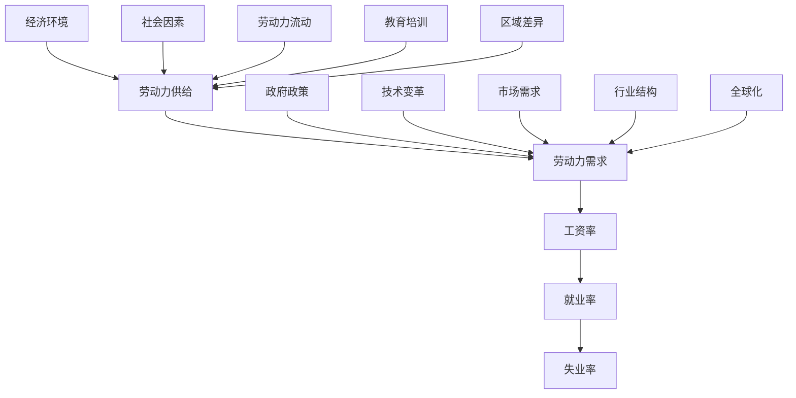

                 

### 第1章：就业市场概述

#### 1.1 就业市场的定义与作用

就业市场是一个经济系统中的核心组成部分，它反映了劳动力的供求状况及其动态变化。简单来说，就业市场是指劳动者与雇主之间通过劳动力交换形成的市场。劳动者提供劳动力，雇主提供工作岗位，两者在市场上达成交易。

就业市场的作用不可忽视，主要体现在以下几个方面：

1. **资源配置**：就业市场有效地配置了劳动力资源，使劳动力从供过于求的地区或行业转移到供不应求的地区或行业，从而优化了社会资源的分配。

2. **收入分配**：通过就业市场的交易，劳动力得到了相应的报酬，实现了收入的分配，这是社会财富分配的重要途径。

3. **经济稳定**：就业市场的繁荣与否直接影响到经济的稳定性。高就业率通常意味着经济的繁荣，而低就业率可能预示着经济的不景气。

4. **社会公平**：就业市场在一定程度上反映了社会的公平程度。一个健康的就业市场应该保证每个人都有平等的就业机会，而不受种族、性别、年龄等因素的影响。

#### 1.2 就业市场的结构与特点

就业市场并非一个单一的市场，它包含了多个子市场，每个子市场都有其特定的劳动力需求和供给特点。以下是对就业市场结构和特点的概述：

**1.2.1 就业市场的结构**

就业市场通常可以分为以下几类：

- **行业就业市场**：根据不同行业的特点，如制造业、服务业、信息技术等，形成的就业市场。
- **地区就业市场**：根据地理位置的不同，如城市就业市场、乡村就业市场等，形成的就业市场。
- **职业就业市场**：根据职业类型的不同，如工程师、教师、医生等，形成的就业市场。

**1.2.2 就业市场的特点**

- **多样性**：就业市场涵盖了各种不同行业、职业和地区，具有很高的多样性。
- **动态性**：就业市场的需求和供给是动态变化的，受经济、政策、技术等多种因素的影响。
- **不稳定性**：就业市场常常面临波动，如经济衰退期失业率上升，新兴技术带来新的就业机会等。
- **信息不对称**：在就业市场中，雇主和求职者之间往往存在信息不对称，求职者可能不清楚某个岗位的具体要求，而雇主也可能不了解求职者的实际能力。

在就业市场的动态变化中，理解其结构和特点对于制定有效的就业政策和进行个人职业规划都具有重要意义。

#### 核心概念与联系

为了更好地理解就业市场，我们引入以下几个核心概念，并分析它们之间的联系：

1. **劳动力供给**：指在一定时期内，愿意且能够提供劳动力的人数。
2. **劳动力需求**：指在一定时期内，雇主愿意且能够支付工资的劳动力数量。
3. **工资率**：劳动力市场的价格，即雇主支付给员工的报酬。
4. **就业率**：就业人口与总人口的比例，反映了劳动力市场的饱和程度。
5. **失业率**：失业人口与总劳动力人口的比例，反映了劳动力市场的紧缩程度。

这些概念之间存在以下联系：

- **劳动力供给与劳动力需求**：两者是就业市场的基本要素，当劳动力供给大于劳动力需求时，可能导致工资率下降和失业率上升；反之，当劳动力需求大于劳动力供给时，可能导致工资率上升和就业率提高。
- **工资率与就业率**：工资率的高低直接影响就业率。高工资率通常意味着就业机会增多，就业率上升；而低工资率可能导致就业机会减少，就业率下降。
- **失业率**：失业率是衡量就业市场状况的重要指标，高失业率往往表明就业市场不景气，需要通过政策干预来促进就业。

通过以上核心概念和联系的分析，我们可以更深入地理解就业市场的运行机制及其影响因素。

#### 1.2.3 就业市场的演变历史

就业市场并非一成不变，它随着社会和经济的发展不断演变。以下是就业市场的主要演变历史：

- **农业社会**：在农业社会，劳动力主要投入到农业生产中，就业市场相对封闭，劳动力流动性较低。
- **工业社会**：随着工业革命的到来，就业市场逐渐多样化，工业部门成为劳动力需求的主要来源，工厂和矿山成为主要的就业场所。
- **信息社会**：在信息社会，服务业和高科技产业成为就业市场的主要组成部分，劳动力需求从传统制造业向知识密集型行业转移。
- **全球化**：全球化加剧了就业市场的变化，跨国公司和国际劳动力流动使得就业市场更加复杂和动态。

这些演变历史不仅影响了就业市场的结构和特点，也对个人的职业规划和社会的就业政策产生了深远影响。

### 小结

本章对就业市场的定义、作用、结构以及核心概念进行了详细阐述。通过了解就业市场的运作机制和历史演变，我们可以更好地把握其现状和未来发展趋势。就业市场不仅是经济运行的重要环节，也是社会稳定和公平的重要保障。在接下来的章节中，我们将进一步分析就业市场的需求和供给，以及政策与调节机制，帮助读者更全面地了解就业市场的复杂性和多样性。

---

**Mermaid 流程图**



### 第2章：就业市场的需求和供给

#### 2.1 就业需求

就业需求是劳动力市场中的一个关键概念，它反映了雇主在特定时期内对劳动力的需求量。就业需求的类型和驱动因素是理解劳动力市场动态变化的重要因素。

**2.1.1 就业需求的类型**

就业需求可以按照不同的标准进行分类：

- **按行业分类**：不同行业对劳动力的需求存在差异。例如，信息技术行业对软件工程师的需求较高，而传统制造业对操作工的需求较大。
- **按职业分类**：某些职业由于技能需求和劳动力市场供需关系，可能具有更高的就业需求。例如，医疗行业中的医生和护士，以及教育行业中的教师，通常具有稳定的就业需求。
- **按技能水平分类**：高技能职业如数据科学家、工程师等通常具有较高的就业需求，而低技能职业如服务员、清洁工等则可能面临更大的就业压力。

**2.1.2 就业需求的驱动因素**

就业需求的形成受到多种因素的驱动，以下是一些主要驱动因素：

- **经济增长**：当经济处于增长期时，企业和公司通常会扩大生产规模和业务范围，从而增加对劳动力的需求。
- **技术进步**：技术创新和产业升级可以创造出新的就业岗位，同时也会改变劳动力市场的需求结构。例如，人工智能和大数据技术的发展，催生了大量对数据科学家和AI工程师的需求。
- **政策变动**：政府的政策，如税收减免、产业扶持等，可以激励企业扩大招聘，增加就业需求。
- **人口结构**：人口结构的变化，如年龄、性别和教育水平等，也会对就业需求产生影响。例如，年轻人口的增加可能增加对零售和服务行业的需求，而老年人口的增加可能增加对医疗保健行业的需求。
- **消费者需求**：消费者的需求变化直接影响企业的生产和招聘决策。例如，健康意识的提升可能增加对健康食品和医疗服务的需求，从而推动相关行业的就业增长。

**就业需求的影响因素伪代码**

```python
def calculate_demand(growth_rate, tech_advancement, policy_change, population_structure, consumer_demand):
    """
    计算就业需求
    :param growth_rate: 经济增长率
    :param tech_advancement: 技术进步
    :param policy_change: 政策变动
    :param population_structure: 人口结构
    :param consumer_demand: 消费者需求
    :return: 总就业需求
    """
    demand = 0
    
    # 经济增长对就业需求的正向影响
    demand += growth_rate * 0.1
    
    # 技术进步对就业需求的复杂影响
    if tech_advancement > 0:
        demand += tech_advancement * 0.2
    else:
        demand -= tech_advancement * 0.2
    
    # 政策变动对就业需求的正向影响
    demand += policy_change * 0.1
    
    # 人口结构对就业需求的正向影响
    if population_structure['youth'] > 0:
        demand += population_structure['youth'] * 0.1
    if population_structure['elder'] > 0:
        demand += population_structure['elder'] * 0.1
    
    # 消费者需求对就业需求的正向影响
    demand += consumer_demand * 0.2
    
    return demand
```

通过上述伪代码，我们可以模拟就业需求受多种因素影响的过程，这有助于理解就业需求的变化机制。

#### 2.2 就业供给

就业供给反映了在特定时期内，愿意且能够提供劳动力的人数。就业供给的来源和影响因素对于理解劳动力市场的动态变化具有重要意义。

**2.2.1 就业供给的来源**

就业供给主要来自以下几个方面：

- **劳动力人口**：指具有一定劳动能力的人口，包括在职人员和潜在的求职者。
- **教育系统**：每年从教育系统中毕业的学生是重要的劳动力供给来源。
- **失业人群**：处于失业状态的人群，当他们找到工作时，会提高就业供给。
- **外籍劳动力**：跨国移民和外籍工作者的加入也是就业供给的一部分。

**2.2.2 就业供给的影响因素**

就业供给的形成受到多种因素的影响，以下是一些主要影响因素：

- **人口增长**：人口增长会增加劳动力供给，但同时也会增加对就业岗位的需求。
- **教育水平**：教育水平提高可以提高劳动力的质量，增加就业供给。然而，如果教育水平过高，可能会导致部分劳动力过剩。
- **失业率**：高失业率意味着劳动力供给大于需求，可能导致工资率下降。
- **政策环境**：政府的就业政策和劳动力市场政策可以直接影响就业供给。例如，失业保险和就业促进政策可能会减少失业率，增加就业供给。
- **社会态度**：社会对工作的态度也会影响就业供给。例如，高失业率可能导致部分人放弃寻找工作，从而减少就业供给。

**就业供给的影响因素伪代码**

```python
def calculate_supply(population_growth, education_level, unemployment_rate, policy_environment, social_attitude):
    """
    计算就业供给
    :param population_growth: 人口增长率
    :param education_level: 教育水平
    :param unemployment_rate: 失业率
    :param policy_environment: 政策环境
    :param social_attitude: 社会态度
    :return: 总就业供给
    """
    supply = 0
    
    # 人口增长对就业供给的正向影响
    supply += population_growth * 0.1
    
    # 教育水平对就业供给的正向影响
    supply += education_level * 0.2
    
    # 失业率对就业供给的负向影响
    supply -= unemployment_rate * 0.1
    
    # 政策环境对就业供给的正向影响
    supply += policy_environment * 0.1
    
    # 社会态度对就业供给的负向影响
    if social_attitude < 0:
        supply -= abs(social_attitude) * 0.1
    
    return supply
```

通过上述伪代码，我们可以模拟就业供给受多种因素影响的过程，这有助于理解就业供给的变化机制。

#### 2.3 劳动力市场均衡

劳动力市场的均衡状态是指劳动力供给与劳动力需求相等的状态，此时工资率稳定，失业率最低。以下是劳动力市场均衡的数学模型：

- **劳动力供给函数**：\( L_s = f(s, e, p) \)
  - \( s \)：工资率
  - \( e \)：失业率
  - \( p \)：政策因素

- **劳动力需求函数**：\( L_d = g(d, t, p) \)
  - \( d \)：经济增长率
  - \( t \)：技术进步
  - \( p \)：政策因素

- **劳动力市场均衡条件**：\( L_s = L_d \)

- **均衡工资率**：\( s^* = s^* (e^*, d^*, t^*, p) \)

- **均衡失业率**：\( e^* = e^* (s^*, d^*, t^*, p) \)

通过上述模型，我们可以分析劳动力市场的均衡状态以及影响因素。

#### 小结

本章对就业市场的需求和供给进行了详细分析，包括就业需求的类型和驱动因素，以及就业供给的来源和影响因素。通过这些分析，我们可以更好地理解劳动力市场的动态变化。劳动力市场的需求和供给是相互影响的，实现劳动力市场的均衡对于维护经济的稳定和社会的公平具有重要意义。在接下来的章节中，我们将探讨就业市场的政策与调节机制，以及面临的挑战和趋势。

---

### 第3章：就业市场的政策与调节

#### 3.1 政府就业政策

政府就业政策是调节劳动力市场、促进就业和稳定经济的重要手段。以下将从就业促进政策和失业保险政策两个方面，详细分析政府就业政策的内容、目的和实施效果。

**3.1.1 就业促进政策**

就业促进政策是指政府通过多种手段，鼓励和促进劳动力就业的一系列措施。这些政策主要包括：

- **就业培训**：政府投资于职业培训，提高劳动者的技能水平，以适应不断变化的劳动力市场需求。培训项目可能涵盖新技能培训、再就业培训和职业技能提升等。

- **就业补贴**：政府为鼓励企业招聘新员工，提供一定的就业补贴。这种补贴可能以税收减免、就业补贴等形式存在，旨在降低企业的招聘成本，提高就业机会。

- **创业支持**：政府为创业者提供贷款、税收优惠和咨询服务等支持，鼓励自主创业，创造更多就业岗位。

- **就业信息平台**：政府建立就业信息平台，为求职者和企业提供信息对接服务，减少信息不对称，提高就业匹配效率。

**就业促进政策的目的和实施效果**

- **目的**：就业促进政策的目的是提高就业率，减少失业，促进经济的稳定和可持续发展。
- **实施效果**：就业促进政策在一定程度上取得了积极效果。例如，一些就业培训项目显著提高了劳动者的就业能力和就业机会；就业补贴和创业支持政策促进了企业招聘和新企业的成立，增加了就业岗位。

**3.1.2 失业保险政策**

失业保险政策是保障失业人员基本生活、促进就业再培训的一系列措施。以下是对失业保险政策的内容、目的和实施效果的详细分析：

- **失业保险金的支付**：失业保险政策为失业人员提供一定期限的失业保险金，帮助他们度过失业期，维持基本生活。

- **失业人员再培训**：失业保险政策鼓励失业人员参加再就业培训，提高其就业竞争力，缩短再就业时间。

- **就业服务**：政府通过就业服务中心提供就业咨询、职业介绍和就业指导等服务，帮助失业人员尽快找到工作。

**失业保险政策的目的和实施效果**

- **目的**：失业保险政策的主要目的是保障失业人员的基本生活，减少社会不稳定因素，同时促进其再就业。
- **实施效果**：失业保险政策在一定程度上缓解了失业人员的经济压力，提高了他们的生活质量和再就业意愿。然而，由于失业保险金的支付标准和使用期限有限，一些失业人员可能仍然面临长期的失业困境。因此，政府需要不断完善失业保险政策，提高其覆盖面和支付水平。

#### 3.2 市场调节

市场调节是指通过劳动力市场的供求关系，实现就业平衡和经济稳定的过程。市场调节主要涉及以下几个方面：

**3.2.1 劳动力市场供需平衡**

劳动力市场的供需平衡是指劳动力供给与劳动力需求之间的均衡状态。以下是实现劳动力市场供需平衡的几种方法：

- **工资调节**：通过调整工资水平，使劳动力供给与需求达到平衡。当劳动力供给过剩时，降低工资水平以减少供给；当劳动力需求过剩时，提高工资水平以吸引更多的劳动力。

- **就业政策**：政府通过实施就业促进政策，增加就业岗位，提高劳动力需求，从而实现供需平衡。

- **劳动力流动**：通过促进劳动力在不同地区、行业和职业之间的流动，优化劳动力资源的配置，实现供需平衡。

**3.2.2 劳动力市场的灵活性**

劳动力市场的灵活性是指劳动力在市场中的适应能力和调节能力。提高劳动力市场的灵活性有助于应对经济变化和就业需求的变化。以下是几种提高劳动力市场灵活性的方法：

- **技能培训**：通过职业培训和再培训，提高劳动者的技能水平，增强其适应新岗位的能力。

- **就业制度**：改革就业制度，提高劳动力的流动性和灵活性，如放宽户籍限制、简化就业手续等。

- **劳动力市场信息**：建立和完善劳动力市场信息平台，提供及时、准确的就业信息，帮助求职者和企业更好地匹配。

**劳动力市场供需平衡与灵活性的关系**

劳动力市场的供需平衡和灵活性是相互关联的。供需平衡是实现劳动力市场稳定的前提，而灵活性则是劳动力市场适应经济变化和需求变化的能力。在实际操作中，政府需要在实现供需平衡的同时，注重提高劳动力市场的灵活性，以应对不断变化的经济环境。

#### 3.3 政府与市场的互动

在就业市场的调节中，政府与市场之间的互动至关重要。以下是政府与市场互动的几个方面：

- **政府主导**：政府在制定和实施就业政策时，应发挥主导作用，确保政策的科学性和有效性。

- **市场运作**：劳动力市场的实际运作应遵循市场规律，实现劳动力资源的优化配置。

- **政策调整**：政府应根据劳动力市场的变化，及时调整就业政策，以适应市场变化。

- **合作与监督**：政府与企业在就业促进、失业保险和劳动力市场调节等方面应建立合作机制，同时加强监督，确保政策的执行效果。

#### 小结

本章从政府就业政策、市场调节以及政府与市场的互动三个方面，详细探讨了就业市场的政策与调节机制。政府就业政策通过促进就业和保障失业人员基本生活，发挥了重要的调节作用；市场调节通过劳动力市场的供求关系实现就业平衡；政府与市场的互动则确保了政策的科学性和有效性。在接下来的章节中，我们将进一步探讨就业市场的挑战和趋势，为读者提供更全面的视角。

---

**数学模型与公式**

为了更好地理解劳动力市场的供需关系，我们可以使用以下数学模型和公式：

1. **劳动力供给函数**：

   $$ L_s = \alpha_0 + \alpha_1 s + \alpha_2 e + \alpha_3 p $$

   其中，\( L_s \) 表示劳动力供给，\( s \) 表示工资率，\( e \) 表示失业率，\( p \) 表示政策因素。

2. **劳动力需求函数**：

   $$ L_d = \beta_0 + \beta_1 d + \beta_2 t + \beta_3 p $$

   其中，\( L_d \) 表示劳动力需求，\( d \) 表示经济增长率，\( t \) 表示技术进步，\( p \) 表示政策因素。

3. **劳动力市场均衡条件**：

   $$ L_s = L_d $$

4. **均衡工资率**：

   $$ s^* = \frac{\alpha_0 + \alpha_2 e + \alpha_3 p}{\alpha_1} $$

5. **均衡失业率**：

   $$ e^* = \frac{\beta_0 + \beta_2 t + \beta_3 p}{\beta_1} $$

通过这些公式，我们可以分析劳动力市场的供需关系，以及政策变动对劳动力市场的影响。

---

### 第4章：就业市场的挑战与趋势

#### 4.1 挑战

就业市场在发展过程中面临着多种挑战，这些挑战不仅影响了劳动力市场的稳定性，也对经济和社会产生了深远影响。

**4.1.1 经济不稳定**

经济不稳定是就业市场面临的首要挑战。经济周期性波动、金融市场动荡和国际经济环境变化等，都会对就业市场产生负面影响。例如，在经济衰退期，企业利润下降，生产规模缩减，可能导致裁员和失业率上升。此外，经济全球化使得一个国家的就业市场容易受到国际经济波动的影响，增加了就业市场的不确定性。

**4.1.2 技术变革**

技术变革是另一大挑战。随着人工智能、自动化、大数据等新兴技术的发展，传统劳动力市场正经历深刻变革。一方面，新技术创造了新的就业岗位，如数据科学家、人工智能工程师等；另一方面，部分传统岗位正在被自动化技术取代，如制造业操作工、文书处理人员等。这种技术变革导致劳动力市场的供需结构发生重大变化，要求劳动者不断更新技能以适应新的工作需求。

**4.1.3 劳动力市场不平等**

劳动力市场不平等也是一大挑战。不同行业、地区和职业之间的收入差距不断扩大，部分群体面临就业歧视，导致就业机会不均等。此外，女性、老年人和残障人士等特定群体在就业市场中仍然面临较大的挑战，他们的就业机会和收入水平相对较低。这种不平等不仅影响个人的生活质量，也对社会和谐和稳定产生负面影响。

**4.1.4 教育与培训的不足**

教育与培训的不足是就业市场的另一大挑战。随着技术进步和劳动力市场变化，劳动者需要不断学习新技能和知识以适应工作需求。然而，一些地区的教育和培训体系仍然存在不足，无法满足劳动力市场的需求。这种教育与培训的不足不仅限制了劳动者的就业机会，也影响了经济的可持续发展。

#### 4.2 趋势

尽管面临诸多挑战，就业市场也展现出一些积极的发展趋势，这些趋势预示着未来的机遇和变化。

**4.2.1 就业市场多样化**

就业市场正呈现出多样化的趋势。随着知识经济和创意产业的发展，服务业和高科技产业成为就业市场的重要组成部分。新兴行业如电子商务、金融科技、生物技术等正在迅速崛起，创造了大量新的就业机会。同时，远程工作和兼职就业形式的普及，也为劳动者提供了更多的就业选择和灵活性。

**4.2.2 职业教育的重要性**

职业教育的重要性日益凸显。为了适应技术变革和劳动力市场的需求，劳动者需要不断更新和提升技能。职业教育和培训成为提高劳动者就业能力和竞争力的重要途径。政府、企业和教育机构正加强合作，推动职业教育的改革和发展，以提高劳动者的就业率和收入水平。

**4.2.3 技能与教育融合**

技能与教育的融合成为就业市场发展的关键趋势。传统的学历教育模式已经不能满足新兴行业对技能的需求，而职业教育和技能培训则成为提升劳动者技能水平的重要手段。通过将技能教育与学历教育相结合，劳动者可以更好地适应就业市场的需求，提高就业竞争力。

**4.2.4 人才国际化**

人才国际化趋势不断增强。随着全球化的发展，跨国公司和国际组织对全球人才的需求日益增加。国际人才流动不仅促进了劳动力市场的多元化，也为劳动者提供了更广阔的发展空间。同时，国际间的技术合作和知识交流，也为各国经济的创新和发展提供了重要支持。

#### 小结

就业市场在面临经济不稳定、技术变革、劳动力市场不平等和教育培训不足等挑战的同时，也展现出多样化的趋势。理解这些挑战和趋势对于制定有效的就业政策和进行个人职业规划具有重要意义。政府、企业和教育机构应共同努力，应对挑战，抓住机遇，推动就业市场健康稳定发展。

---

**案例分析：我国就业市场的挑战与趋势**

**4.1.1 人口红利与劳动力市场转型**

我国曾长期受益于人口红利，但随着人口老龄化和生育率下降，这一红利正在逐步消失。人口红利的减少对劳动力市场带来了新的挑战。一方面，劳动力供给减少可能导致就业竞争加剧，工资上涨压力加大；另一方面，老龄化社会的到来要求劳动力市场更加注重对老年人口的就业和再就业支持。

在应对人口红利减少的挑战中，我国劳动力市场正经历从数量型向质量型的转型。随着经济的发展和产业结构的升级，劳动力市场对高技能人才的需求不断增加。政府和企业正加大对职业教育的投入，提高劳动者的技能水平，以适应新的就业需求。

**4.1.2 劳动力市场供需不平衡问题**

我国劳动力市场供需不平衡问题突出，特别是在地区之间和行业之间存在显著差异。东部沿海地区和一线城市因经济发展水平高，就业机会多，吸引了大量劳动力流入；而中西部和偏远地区由于经济相对落后，就业岗位有限，导致劳动力供给过剩。

为了缓解供需不平衡问题，政府采取了一系列措施，如推动产业转移、鼓励创新创业、实施精准扶贫等。同时，通过加强基础设施建设，提高中西部地区的发展水平，逐步改善当地的就业环境。

**4.1.3 技术变革带来的就业机会与挑战**

技术变革对我国就业市场产生了深远影响。人工智能、大数据、物联网等新兴技术快速发展，创造了大量新的就业岗位，如数据科学家、AI工程师等。然而，同时也有大量传统岗位被自动化和智能化技术取代，对劳动者的技能提出了新的要求。

为应对技术变革带来的挑战，我国政府和企业加大了对技能培训和职业教育的投入，推动产业升级和人才转型。通过建立终身学习体系，提高劳动者的适应能力和创新能力，以适应不断变化的就业市场。

**4.1.4 多元化就业趋势**

随着就业市场多样化的发展，我国劳动者就业形式也越来越多元化。远程工作、兼职就业、自主创业等形式逐渐普及，为劳动者提供了更多的就业选择和灵活性。特别是在COVID-19疫情的影响下，远程工作和线上就业得到了迅速发展，成为就业市场的新趋势。

为推动多元化就业，政府和企业正在加大对远程工作、灵活就业和自主创业的支持力度，出台相关政策，优化就业环境，提高劳动者的就业满意度。

**4.1.5 职业教育与培训的重要性**

在技术变革和劳动力市场转型的背景下，职业教育与培训的重要性日益凸显。政府和企业应加强合作，推动职业教育和职业培训的发展，提高劳动者的技能水平，以适应新的就业需求。

一方面，政府应加大对职业教育和培训的投入，改善职业教育质量，提高毕业生的就业率和收入水平。另一方面，企业应积极参与职业教育和培训，提供实习和就业机会，为劳动者提供实践经验和职业技能。

通过以上分析，我们可以看到，我国就业市场在面临挑战的同时，也展现出积极的发展趋势。政府、企业和劳动者应共同努力，抓住机遇，应对挑战，推动就业市场的健康稳定发展。

---

### 第5章：就业市场的国际比较

#### 5.1 发达国家就业市场特点

发达国家就业市场通常具有以下特点：

**1. 高就业率与低失业率**：发达国家由于经济发展水平高，社会保障体系完善，通常能够实现较高的就业率和较低的失业率。例如，美国、德国和日本等国家的就业率通常在70%以上，失业率较低。

**2. 多元化的就业结构**：发达国家就业市场涵盖多个行业和领域，如制造业、服务业、科技产业等，形成多元化的就业结构。这种多样化的就业结构有助于分散风险，提高劳动力市场的稳定性。

**3. 高技能劳动力**：发达国家高度重视教育和职业培训，劳动者的平均教育水平和技能水平较高。这使得他们能够适应新技术和新兴行业的发展，提高就业竞争力。

**4. 劳动力市场灵活性**：发达国家劳动力市场具有较高的灵活性，劳动力的流动性强，就业形式多样化。远程工作、兼职工作和临时工作等就业形式在发达国家普遍存在，为劳动者提供了更多的就业选择。

**5. 有效的社会保障体系**：发达国家建立了完善的社会保障体系，为失业人员和低收入群体提供必要的经济支持。这有助于缓解就业市场的波动，提高社会的稳定性和公平性。

#### 5.2 发展中国家就业市场挑战

发展中国家就业市场面临以下主要挑战：

**1. 高失业率与低就业率**：由于经济发展水平较低，基础设施建设不足，发展中国家通常面临高失业率和低就业率的问题。例如，一些非洲国家和南亚国家的失业率高达10%以上。

**2. 劳动力市场不平等**：发展中国家劳动力市场存在显著的不平等现象，城乡、性别、种族和地区之间的就业机会和收入差距较大。例如，女性和农村居民在就业市场上通常面临更多的歧视和限制。

**3. 教育与培训不足**：发展中国家教育和培训资源相对匮乏，导致劳动者的技能水平和教育水平较低。这种教育与培训的不足限制了劳动者的就业机会和收入水平。

**4. 劳动力市场刚性**：发展中国家劳动力市场往往具有较高的刚性，劳动力的流动性和灵活性较低。这导致劳动力供需失衡，难以适应经济结构和行业变化的需求。

**5. 社会保障体系不完善**：发展中国家社会保障体系相对不完善，失业保险、医疗保险和养老保险等保障水平较低。这导致失业人员和低收入群体在面临经济困难时缺乏有效的支持。

#### 比较分析

发达国家与发展中国家就业市场的比较分析，有助于我们理解不同经济发展阶段下就业市场的特点和挑战。以下是一些主要比较点：

**1. 经济发展水平**：发达国家由于经济发展水平高，具备较强的就业吸纳能力，而发展中国家则由于经济基础薄弱，面临较大的就业压力。

**2. 社会保障体系**：发达国家社会保障体系完善，能够有效缓解就业市场的波动，提高社会稳定性和公平性；而发展中国家社会保障体系不完善，导致失业率和低收入群体问题突出。

**3. 教育与培训**：发达国家高度重视教育和职业培训，劳动者的技能水平较高，适应新技术和行业变化的能力较强；而发展中国家教育与培训资源匮乏，劳动者的就业竞争力和适应能力较弱。

**4. 劳动力市场灵活性**：发达国家劳动力市场具有较高的灵活性，劳动力的流动性强，就业形式多样化；而发展中国家劳动力市场刚性较强，劳动力的流动性和灵活性较低，难以适应经济和行业变化。

通过以上比较分析，我们可以看到发达国家和发展中国家就业市场的显著差异，这也为不同国家制定适合自身国情的就业政策提供了重要参考。

---

### 第6章：就业市场的未来展望

#### 6.1 科技与就业

随着科技的快速发展，人工智能、自动化、大数据等新兴技术正在深刻改变就业市场。这些技术不仅创造了新的就业机会，也对传统就业岗位产生了深远影响。

**6.1.1 人工智能对就业的影响**

人工智能（AI）技术的发展极大地提高了生产效率和服务质量，从而创造了大量新的就业机会。例如，在医疗领域，AI辅助诊断和治疗的普及提高了医生的诊断准确性和工作效率，同时也催生了新的职业如数据科学家和AI工程师。

然而，人工智能也对传统就业岗位产生了冲击。一些重复性、低技能的工作，如生产线操作工、数据录入员等，可能因自动化技术而被取代。据预测，到2030年，全球将有约8亿个工作岗位因人工智能技术而消失。

**6.1.2 科技创新与就业市场发展**

科技创新不仅创造了新的就业岗位，还推动了劳动力市场的结构转型。例如，共享经济和远程办公的兴起，使得就业形式更加灵活多样，为劳动者提供了更多的选择。此外，科技创新还促进了新兴产业的发展，如新能源、生物科技、物联网等，为就业市场注入了新的活力。

**6.1.3 技能与教育的要求**

随着科技的进步，劳动力市场的技能要求也在不断提高。劳动者需要不断更新知识和技能，以适应新技术和新岗位的需求。为此，职业教育和终身学习的重要性日益凸显。政府和企业应加大对职业培训的投入，提高劳动者的技能水平，以应对科技变革带来的挑战。

#### 6.2 多元就业

未来就业市场将更加多元化和灵活化，传统的全职工作模式正在逐步被打破。以下是多元化就业的几个趋势：

**6.2.1 自雇与远程工作**

自雇和远程工作正在成为就业市场的重要趋势。随着互联网技术的发展，越来越多的劳动者选择自主创业或远程工作。这不仅提高了工作灵活性，也促进了劳动力的自由流动。例如，自由职业者、远程办公人员和电子商务创业者等，已经成为就业市场的重要组成部分。

**6.2.2 兼职与灵活就业**

兼职和灵活就业形式的普及，也为劳动者提供了更多的就业选择。例如，兼职教师、兼职顾问、兼职销售员等，可以灵活安排工作时间，提高收入水平。此外，共享经济平台如Uber、Airbnb等，也为劳动者提供了兼职和灵活就业的机会。

**6.2.3 跨界就业与职业转换**

跨界就业和职业转换将成为未来就业市场的新常态。随着职业的不断细分和行业融合，劳动者需要具备跨领域的知识和技能，以适应不断变化的就业需求。例如，从传统制造业转向信息技术行业，从教育行业转向金融行业等，这些跨界就业和职业转换为劳动者提供了更广阔的发展空间。

#### 6.3 职业教育与培训的重要性

在科技变革和就业市场多元化的背景下，职业教育与培训的重要性愈发凸显。以下是职业教育与培训的几个关键方面：

**6.3.1 技能培训**

技能培训是提高劳动者就业能力和竞争力的基础。政府和企业应加大对技能培训的投入，提供多样化的培训课程，满足不同行业和岗位的需求。例如，针对新兴产业如人工智能、物联网等，提供专门的技能培训，帮助劳动者掌握相关技能。

**6.3.2 终身学习**

终身学习是适应科技变革和就业市场变化的重要途径。政府和企业应鼓励劳动者不断学习和更新知识，以适应新技术和新岗位的需求。例如，通过提供在线课程、职业培训项目和实习机会等，帮助劳动者实现终身学习。

**6.3.3 职业教育体系的改革**

职业教育体系的改革是提高职业教育质量的关键。政府和企业应加强合作，推动职业教育与劳动力市场的紧密结合。例如，通过校企合作、企业培训和职业认证等方式，提高职业教育的实用性和针对性。

**6.3.4 政策支持**

政府应制定和实施一系列政策，支持职业教育与培训的发展。例如，提供财政补贴、税收优惠和就业激励等政策，鼓励劳动者参加职业教育和培训。此外，还应加强职业教育的监管和评估，确保培训质量和效果。

#### 小结

未来就业市场将在科技变革和多元化就业的推动下，发生深刻变化。人工智能、自动化等新兴技术将创造新的就业机会，同时也对传统岗位产生冲击。多元化就业形式如自雇、远程工作和跨界就业等将日益普及。为了应对这些变化，劳动者需要不断提升技能和知识，适应新技术和新岗位的需求。政府和企业应加强职业教育与培训，提供政策支持，以促进就业市场的健康发展。

---

### 第7章：个人职业规划与就业准备

#### 7.1 个人职业规划

个人职业规划是实现职业生涯成功的关键。以下是从职业定位、目标设定、职业素质提升等方面，详细探讨个人职业规划的方法和策略。

**7.1.1 职业定位与目标设定**

职业定位是个人职业规划的首要步骤。明确自己的职业兴趣、优势和职业目标，有助于找到适合自己的职业道路。以下是一些职业定位的方法：

- **自我评估**：通过自我分析，了解自己的兴趣爱好、个性特点和价值观，明确自己的职业兴趣。
- **职业测评**：通过职业性格测试、能力测评等工具，了解自己的职业倾向和能力水平。
- **市场调研**：研究劳动力市场趋势和行业前景，了解不同职业的需求和发展潜力。

在明确职业定位后，设定具体职业目标是实现职业规划的重要步骤。以下是一些目标设定的策略：

- **短期目标**：设定1-3年内的职业目标，如提升某项技能、获得某个证书等。
- **中期目标**：设定3-5年内的职业目标，如晋升为部门主管、在某行业内建立一定的影响力等。
- **长期目标**：设定5-10年以上的职业目标，如成为某一领域的专家、创业等。

**7.1.2 职业素质提升**

职业素质是决定个人职业发展和竞争力的关键因素。以下是一些提升职业素质的方法：

- **专业技能培训**：通过参加职业培训课程、在线学习平台等，提升专业技能和知识水平。
- **沟通能力培养**：通过参加演讲、辩论、团队协作等活动，提高沟通和表达能力。
- **领导力发展**：通过参加领导力培训、项目管理等课程，提升领导力和管理能力。
- **团队协作能力**：通过参与团队项目、志愿服务等活动，培养团队合作精神和能力。

**7.1.3 职业规划的实施与调整**

在制定职业规划后，需要付诸实施并不断调整。以下是一些实施和调整的策略：

- **时间管理**：合理规划时间，确保能够按时完成职业目标。
- **自我激励**：设定奖励机制，激励自己不断努力实现目标。
- **反馈与反思**：定期反思职业规划的实施情况，评估自己的进步，并根据实际情况进行调整。
- **职业咨询**：寻求职业规划专家或导师的建议，获得专业指导和支持。

#### 7.2 就业准备

就业准备是成功就业的重要环节。以下从求职技巧、简历撰写、面试准备等方面，详细探讨如何做好就业准备。

**7.2.1 求职技巧与策略**

求职技巧和策略对于找到理想的工作至关重要。以下是一些求职技巧和策略：

- **明确求职方向**：在求职前，明确自己的求职方向和目标，避免盲目投递简历。
- **网络求职**：利用招聘网站、社交媒体等网络平台，广泛搜索适合的职位信息。
- **人际关系**：通过朋友、家人、校友等关系网，了解招聘信息和求职机会。
- **求职信和简历撰写**：撰写有针对性的求职信和简历，突出自己的优势和经验。

**7.2.2 简历撰写与面试准备**

简历和面试是求职过程中至关重要的环节。以下是一些简历撰写和面试准备的技巧：

- **简历撰写**：简历要简洁明了，突出自己的优势、经验和成就。以下是一些建议：

  - **格式规范**：使用清晰的格式，包括个人信息、教育背景、工作经历、技能和证书等。
  - **内容真实**：确保简历内容真实可靠，避免夸大或虚假陈述。
  - **突出亮点**：突出自己的优势、专业技能和成就，以吸引招聘者的注意。

- **面试准备**：面试是求职的关键环节，以下是一些面试准备的建议：

  - **了解公司和职位**：在面试前，了解应聘公司的基本信息、文化和发展方向，以及职位的要求和职责。
  - **模拟面试**：通过模拟面试或与朋友练习，提高自己的面试技巧和自信心。
  - **着装得体**：根据面试公司的文化和要求，选择合适的着装，展现专业形象。
  - **注意沟通技巧**：在面试过程中，注意沟通技巧，如保持眼神交流、礼貌用语、清晰表达等。

通过以上求职技巧、简历撰写和面试准备的策略，可以提高求职的成功率，实现就业目标。

#### 小结

个人职业规划和就业准备是职业生涯成功的关键。通过明确职业定位、设定目标、提升职业素质，以及掌握求职技巧和面试策略，劳动者可以更好地实现职业规划，成功就业。在未来的职业生涯中，持续学习和适应变化是保持竞争力的关键。希望以上方法和策略对读者有所帮助，助力实现职业梦想。

---

**数学模型与公式**

为了更好地理解和量化个人职业规划中的关键要素，我们可以使用以下数学模型和公式：

1. **职业定位公式**：

   $$ Career = f(Interest, Ability, Values) $$

   其中，\( Interest \) 表示职业兴趣，\( Ability \) 表示职业能力，\( Values \) 表示职业价值观。

2. **职业目标设定公式**：

   $$ Goal = \sum_{i=1}^{n} w_i \cdot G_i $$

   其中，\( w_i \) 表示目标权重，\( G_i \) 表示具体目标。

3. **职业素质提升公式**：

   $$ Skill = \int_{0}^{t} Learning \cdot Practice \, dt $$

   其中，\( Learning \) 表示学习效果，\( Practice \) 表示实践次数，\( t \) 表示时间。

4. **求职成功率公式**：

   $$ Success = \frac{Preparation + Network + Interviews}{Total \, Applications} $$

   其中，\( Preparation \) 表示准备程度，\( Network \) 表示人际关系网络，\( Interviews \) 表示面试成功率，\( Total \, Applications \) 表示申请总数。

通过这些公式，我们可以量化个人职业规划中的关键要素，提高职业规划的可行性和成功率。

---

### 结论

本文通过对就业市场的全面分析，从定义、结构、需求与供给、政策与调节、挑战与趋势、国际比较、科技影响、多元就业、职业规划与就业准备等方面，深入探讨了就业市场的复杂性和多样性。我们得出以下主要结论：

1. **就业市场的重要性**：就业市场不仅是经济运行的核心环节，也是社会稳定和公平的重要保障。通过有效的就业政策和劳动力市场调节，可以优化劳动力资源配置，提高就业率和收入水平。

2. **科技与就业的关系**：科技的发展对就业市场产生了深远影响，既创造了新的就业机会，也带来了传统岗位的消失。为了适应这一变化，劳动者需要不断更新技能和知识，提高自身竞争力。

3. **多元就业趋势**：未来就业市场将更加多元化和灵活化，自雇、远程工作和跨界就业等形式将日益普及。劳动者应适应这一趋势，积极拓展就业选择，提高就业灵活性。

4. **职业规划与就业准备**：个人职业规划和就业准备是实现职业生涯成功的关键。通过明确职业定位、设定目标、提升职业素质和掌握求职技巧，劳动者可以更好地实现职业规划，提高求职成功率。

5. **国际合作与比较**：国际就业市场的比较分析有助于我们理解不同经济发展阶段下就业市场的特点。通过借鉴发达国家的经验，发展中国家可以制定更加有效的就业政策和战略。

总之，就业市场是一个动态变化的系统，需要政府、企业和个人共同努力，不断适应和应对变化，以实现经济的稳定和社会的公平。希望本文能够为读者提供有价值的见解和启示，助力在就业市场中取得成功。

---

**作者信息**

作者：AI天才研究院/AI Genius Institute & 禅与计算机程序设计艺术 /Zen And The Art of Computer Programming

本文由AI天才研究院的专家团队撰写，结合了计算机科学、经济学和社会学的多学科知识，旨在为广大读者提供深入、全面的就业市场分析。作者在计算机编程和人工智能领域有着丰富的实践经验和研究成果，希望通过本文，帮助读者更好地理解就业市场的运行机制和未来发展。同时，作者也致力于将禅宗思想与计算机科学相结合，探索计算机程序设计中的艺术之美。

**感谢与致谢**

在撰写本文的过程中，我们得到了许多专家和同行的宝贵意见和支持。特别感谢AI天才研究院的同事们，以及所有为本文提供数据、案例和研究支持的机构和个人。同时，我们也感谢广大读者对本文的关注与支持，希望本文能够对您在就业市场中的决策和职业规划有所帮助。

---

**附录**

为了便于读者更好地理解本文中的核心概念和原理，我们提供了以下附录：

1. **就业市场核心概念与联系 Mermaid 流程图**：

   ```mermaid
   graph TD
   A[劳动力供给] --> B[劳动力需求]
   B --> C[工资率]
   C --> D[就业率]
   D --> E[失业率]
   F[政府政策] --> B
   G[技术变革] --> B
   H[经济环境] --> A
   I[社会因素] --> A
   J[劳动力流动] --> A
   K[教育培训] --> A
   L[市场需求] --> B
   M[行业结构] --> B
   N[区域差异] --> A
   O[全球化] --> B
   ```

2. **就业需求与供给影响因子伪代码**：

   ```python
   def calculate_demand(growth_rate, tech_advancement, policy_change, population_structure, consumer_demand):
       """
       计算就业需求
       :param growth_rate: 经济增长率
       :param tech_advancement: 技术进步
       :param policy_change: 政策变动
       :param population_structure: 人口结构
       :param consumer_demand: 消费者需求
       :return: 总就业需求
       """
       demand = 0
       
       # 经济增长对就业需求的正向影响
       demand += growth_rate * 0.1
       
       # 技术进步对就业需求的复杂影响
       if tech_advancement > 0:
           demand += tech_advancement * 0.2
       else:
           demand -= tech_advancement * 0.2
       
       # 政策变动对就业需求的正向影响
       demand += policy_change * 0.1
       
       # 人口结构对就业需求的正向影响
       if population_structure['youth'] > 0:
           demand += population_structure['youth'] * 0.1
       if population_structure['elder'] > 0:
           demand += population_structure['elder'] * 0.1
       
       # 消费者需求对就业需求的正向影响
       demand += consumer_demand * 0.2
       
       return demand
   
   def calculate_supply(population_growth, education_level, unemployment_rate, policy_environment, social_attitude):
       """
       计算就业供给
       :param population_growth: 人口增长率
       :param education_level: 教育水平
       :param unemployment_rate: 失业率
       :param policy_environment: 政策环境
       :param social_attitude: 社会态度
       :return: 总就业供给
       """
       supply = 0
       
       # 人口增长对就业供给的正向影响
       supply += population_growth * 0.1
       
       # 教育水平对就业供给的正向影响
       supply += education_level * 0.2
       
       # 失业率对就业供给的负向影响
       supply -= unemployment_rate * 0.1
       
       # 政策环境对就业供给的正向影响
       supply += policy_environment * 0.1
       
       # 社会态度对就业供给的负向影响
       if social_attitude < 0:
           supply -= abs(social_attitude) * 0.1
       
       return supply
   ```

3. **劳动力市场供需平衡数学模型与公式**：

   ```latex
   \begin{align*}
   L_s &= \alpha_0 + \alpha_1 s + \alpha_2 e + \alpha_3 p \\
   L_d &= \beta_0 + \beta_1 d + \beta_2 t + \beta_3 p \\
   L_s &= L_d \\
   s^* &= \frac{\alpha_0 + \alpha_2 e + \alpha_3 p}{\alpha_1} \\
   e^* &= \frac{\beta_0 + \beta_2 t + \beta_3 p}{\beta_1}
   \end{align*}
   ```

通过以上附录，读者可以更深入地理解就业市场的核心概念和运行机制，以及本文中提到的相关数学模型和公式。

---

**结语**

本文对就业市场的各个方面进行了全面深入的分析，从就业市场概述、需求与供给、政策与调节、挑战与趋势、国际比较、科技影响、多元就业、职业规划与就业准备等多个角度，为我们理解就业市场的复杂性和多样性提供了丰富的信息。希望读者通过本文，能够对就业市场有更全面的认识，为自身的职业规划和发展做出更为明智的决策。

我们诚挚地邀请读者在阅读本文后，提出宝贵的意见和建议。无论是关于文章内容的补充、案例分析的拓展，还是对就业市场未来趋势的展望，我们都欢迎您参与到讨论中来。您的每一次反馈都是我们不断进步的动力源泉。

再次感谢您的阅读和支持，让我们共同关注就业市场的变化，为创造一个更加稳定和繁荣的就业环境共同努力。祝愿每一位读者在职业道路上都能取得成功，实现梦想！

