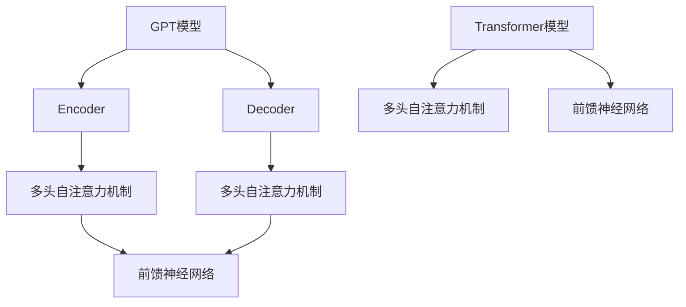
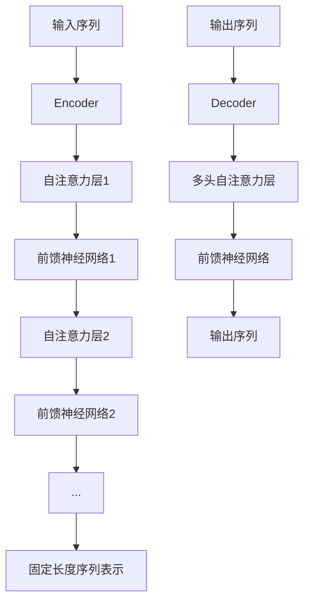
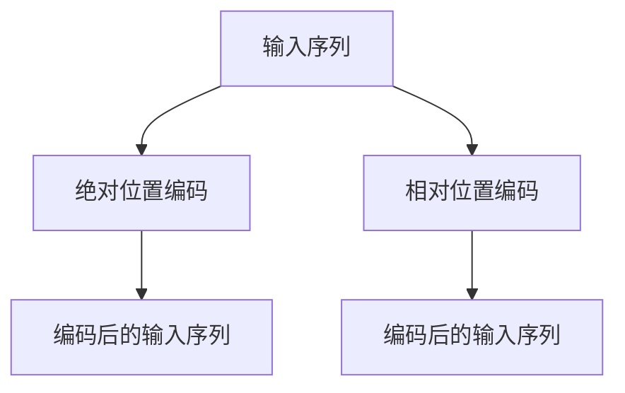
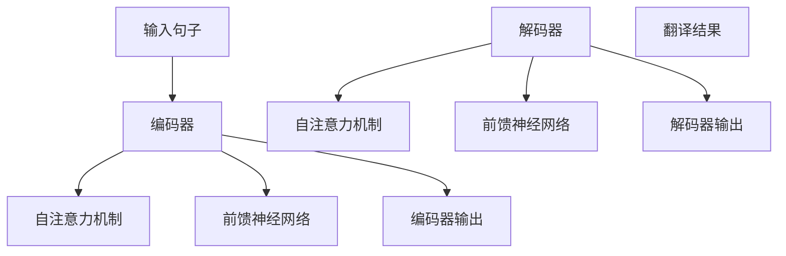
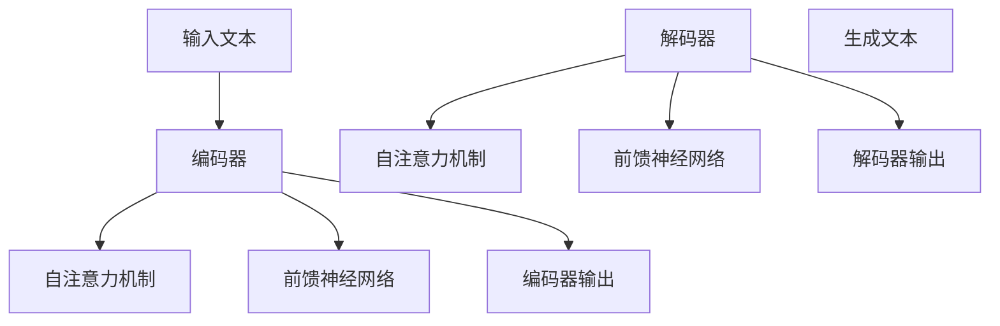
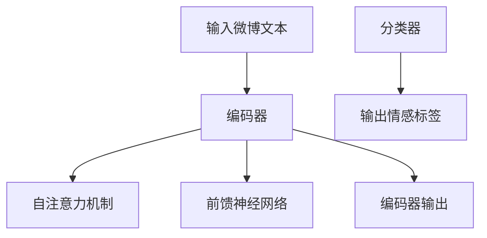
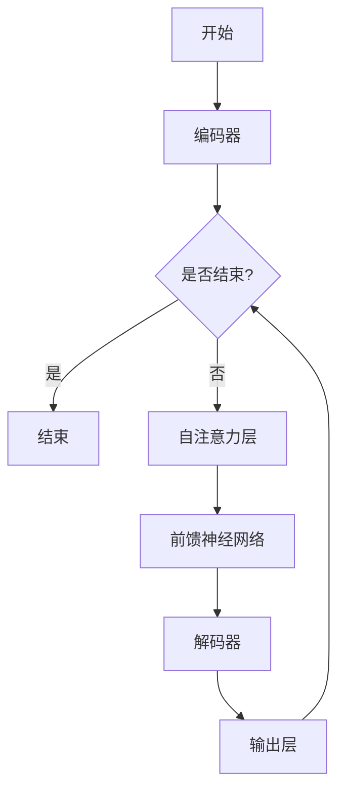

                 

# 层峦叠翠上青天：搭建GPT核心组件Transformer

## 关键词
- GPT
- Transformer
- 自注意力机制
- Encoder
- Decoder
- 自然语言处理

## 摘要
本文旨在深入剖析GPT模型的核心组件——Transformer，帮助读者理解其架构原理、实现细节以及在实际应用中的优势。我们将从Transformer的历史背景出发，逐步讲解其核心机制，包括自注意力机制、Encoder与Decoder结构、位置编码和优化策略。随后，我们将通过一个实际案例展示如何使用PyTorch搭建一个自定义的Transformer模型。最后，我们将探讨Transformer的高级应用、模型调优与优化方法、部署与维护策略，以及未来发展的趋势。

## 第一部分：Transformer架构基础

### 第1章：GPT与Transformer概述

#### 1.1 GPT与Transformer的概念与历史背景

##### 1.1.1 GPT的诞生与发展
GPT（Generative Pre-trained Transformer）是由OpenAI于2018年推出的一种基于Transformer架构的预训练语言模型。它的出现标志着自然语言处理领域从传统的循环神经网络（RNN）向基于注意力机制的Transformer模型的转变。GPT的核心思想是通过大量的文本数据预训练一个大规模的神经网络模型，使得模型在处理自然语言任务时能够自动学习语言结构和规则。

##### 1.1.2 Transformer模型的提出与重要性
Transformer模型最早由Vaswani等人于2017年提出，并应用于机器翻译任务。其核心思想是引入了自注意力机制，使得模型能够同时关注输入序列中的所有信息，而不是像传统的循环神经网络那样依次处理。Transformer模型的提出，极大地提升了机器翻译的性能，并引起了自然语言处理领域的研究热潮。

#### 1.2 GPT与Transformer的比较与分析

##### 1.2.1 GPT的结构特点
GPT模型采用Transformer架构，主要包括Encoder和Decoder两个部分。Encoder负责对输入序列进行编码，生成固定长度的序列表示；Decoder则利用这些表示生成输出序列。GPT模型的主要特点是预训练和微调，通过在大量文本数据上的预训练，模型能够自动学习语言的一般规律，然后在具体任务上进行微调，从而实现良好的性能。

##### 1.2.2 Transformer的结构特点
Transformer模型的结构相对简单，主要由多头自注意力机制和前馈神经网络组成。多头自注意力机制使得模型能够同时关注输入序列中的不同信息，从而捕捉长距离依赖关系。前馈神经网络则用于对自注意力机制的输出进行进一步处理，增强模型的非线性表达能力。

##### 1.2.3 GPT与Transformer的性能对比
GPT和Transformer在自然语言处理任务上均取得了显著的成果。GPT的优势在于其预训练和微调机制，使得模型在处理多种语言任务时具有很好的泛化能力。而Transformer模型则在处理长文本和长距离依赖关系时表现出色。总的来说，两者各有优势，互为补充。

### 图1.1 GPT与Transformer模型结构比较



## 第二部分：Transformer模型详解

### 第2章：Transformer模型原理

#### 2.1 自注意力机制

##### 2.1.1 自注意力机制的概念
自注意力机制是Transformer模型的核心组成部分，它允许模型在处理每个输入序列的位置时，同时考虑序列中的其他所有位置。这一机制使得模型能够捕捉到输入序列中的长距离依赖关系。

##### 2.1.2 自注意力机制的数学表达

$$
\text{Attention}(Q, K, V) = \text{softmax}\left(\frac{QK^T}{\sqrt{d_k}}\right)V
$$

其中，\( Q, K, V \) 分别为查询向量、键向量和值向量，\( d_k \) 为键向量的维度。

### 图2.1 自注意力机制的数学模型

$$
\begin{align*}
Q &= \text{Linear}(X) \\
K &= \text{Linear}(X) \\
V &= \text{Linear}(X)
\end{align*}
$$

#### 2.2 Encoder与Decoder结构

##### 2.2.1 Encoder结构详解
Encoder负责将输入序列编码为固定长度的序列表示。其结构主要由多个自注意力层和前馈神经网络组成。自注意力层用于捕捉输入序列中的依赖关系，前馈神经网络则用于增强模型的非线性表达能力。

##### 2.2.2 Decoder结构详解
Decoder负责根据Encoder的输出生成输出序列。其结构与Encoder类似，但额外增加了一个多头自注意力层，用于捕捉输入序列和输出序列之间的依赖关系。

### 图2.2 Encoder与Decoder结构



#### 2.3 位置编码

##### 2.3.1 位置编码的概念
位置编码是Transformer模型中用来引入输入序列位置信息的一种方法。由于Transformer模型不包含循环结构，因此无法像循环神经网络那样直接利用序列的位置信息。位置编码通过在输入序列中添加额外的向量来表示每个位置的信息。

##### 2.3.2 位置编码的实现方法
常见的位置编码方法包括绝对位置编码和相对位置编码。绝对位置编码直接将输入序列的位置信息编码为向量，而相对位置编码则通过学习输入序列中相邻元素之间的相对位置关系来实现。

### 图2.3 位置编码的实现方法



#### 2.4 优化策略

##### 2.4.1 Adam优化器
Adam优化器是一种结合了AdaGrad和RMSprop优化的自适应优化算法。它通过跟踪梯度的指数衰减平均值来动态调整学习率，从而在训练过程中能够更快地收敛。

##### 2.4.2 梯度裁剪技术
梯度裁剪是一种用于防止梯度爆炸或消失的技术。它通过限制梯度的大小来保持梯度的稳定性，从而提高训练的收敛速度和稳定性。

## 第三部分：Transformer应用实战

### 第3章：搭建自定义Transformer模型

#### 3.1 Transformer模型搭建流程

##### 3.1.1 模型结构设计
搭建自定义Transformer模型的第一步是设计模型的结构。这包括确定输入序列的长度、隐藏层的大小、头数、层数等参数。

##### 3.1.2 模型参数初始化
模型参数的初始化对于模型的性能至关重要。常用的初始化方法包括高斯分布初始化和Xavier初始化。

##### 3.1.3 模型训练与优化
模型训练的过程主要包括前向传播、反向传播和梯度更新。在训练过程中，我们通常使用Adam优化器并结合梯度裁剪技术来提高训练的收敛速度和稳定性。

### 3.2 实战案例：构建小规模Transformer模型

##### 3.2.1 环境搭建与数据准备
为了构建小规模的Transformer模型，我们首先需要搭建Python编程环境和安装所需的库，如PyTorch。然后，我们需要准备用于训练的数据集，并对其进行预处理。

##### 3.2.2 Transformer模型实现
接下来，我们将使用PyTorch搭建自定义的Transformer模型。模型实现包括定义Encoder、Decoder、多头自注意力机制和前馈神经网络等组件。

##### 3.2.3 模型训练与评估
在完成模型实现后，我们将使用准备好的数据集对模型进行训练。在训练过程中，我们将监控模型的损失函数和准确率等指标，以便调整模型参数和优化策略。

### 3.3 实战案例：使用PyTorch搭建Transformer模型

```python
import torch
import torch.nn as nn

# 定义Transformer模型
class TransformerModel(nn.Module):
    def __init__(self, input_dim, hidden_dim, num_heads, num_layers):
        super(TransformerModel, self).__init__()
        self.encoder = Encoder(input_dim, hidden_dim, num_heads, num_layers)
        self.decoder = Decoder(hidden_dim, num_heads, num_layers)
        self.fc = nn.Linear(hidden_dim, input_dim)

    def forward(self, input_seq, target_seq):
        # Encoder
        encoder_output = self.encoder(input_seq)
        # Decoder
        decoder_output = self.decoder(encoder_output, target_seq)
        # 输出层
        output = self.fc(decoder_output)
        return output

# 搭建训练环境
model = TransformerModel(input_dim=100, hidden_dim=512, num_heads=8, num_layers=3)
optimizer = torch.optim.Adam(model.parameters(), lr=0.001)
criterion = nn.CrossEntropyLoss()

# 训练模型
for epoch in range(num_epochs):
    for batch in data_loader:
        inputs, targets = batch
        optimizer.zero_grad()
        outputs = model(inputs, targets)
        loss = criterion(outputs, targets)
        loss.backward()
        optimizer.step()
```

## 第四部分：Transformer高级应用

### 第4章：Transformer在自然语言处理中的深入应用

#### 4.1 Transformer在机器翻译中的应用

##### 4.1.1 原理与实现
机器翻译是自然语言处理中的重要任务之一。Transformer模型在机器翻译中的应用主要基于其强大的自注意力机制，能够捕捉输入序列中的长距离依赖关系。

##### 4.1.2 案例分析
以英文到中文的机器翻译为例，我们使用Transformer模型进行翻译任务的实现。首先，我们需要准备训练数据和测试数据，然后搭建Transformer模型并进行训练。最后，使用训练好的模型对测试数据进行翻译，并评估翻译质量。

### 图4.1 Transformer在机器翻译中的应用流程



#### 4.2 Transformer在文本生成中的应用

##### 4.2.1 原理与实现
文本生成是Transformer模型在自然语言处理中的另一个重要应用。其原理是基于Transformer模型对输入序列的编码和生成能力。

##### 4.2.2 案例分析
以生成对话文本为例，我们使用Transformer模型进行对话文本的生成。首先，我们需要准备对话文本数据集，并对其进行预处理。然后，搭建Transformer模型并进行训练。最后，使用训练好的模型生成对话文本，并评估生成质量。

### 图4.2 Transformer在文本生成中的应用流程



#### 4.3 Transformer在情感分析中的应用

##### 4.3.1 原理与实现
情感分析是自然语言处理中的另一个重要任务，旨在从文本中提取情感信息。Transformer模型在情感分析中的应用基于其强大的语义表示能力。

##### 4.3.2 案例分析
以微博情感分析为例，我们使用Transformer模型进行情感分类。首先，我们需要准备微博数据集，并对其进行预处理。然后，搭建Transformer模型并进行训练。最后，使用训练好的模型对新的微博文本进行情感分类，并评估分类效果。

### 图4.3 Transformer在情感分析中的应用流程



## 第五部分：Transformer模型调优与优化

### 第5章：Transformer模型调优技巧

#### 5.1 模型超参数调优

##### 5.1.1 学习率调整
学习率的调整对模型的训练过程和最终性能有重要影响。常见的方法包括固定学习率、学习率衰减和自适应学习率等。

##### 5.1.2 模型大小调整
模型大小包括隐藏层大小、层数、头数等。适当调整这些参数可以帮助模型更好地适应不同的任务和数据规模。

##### 5.1.3 batch大小调整
batch大小影响模型的训练速度和稳定性。较大的batch大小可以加速训练，但可能增加模型过拟合的风险。

#### 5.2 模型优化方法

##### 5.2.1 梯度裁剪
梯度裁剪是一种常用的优化技术，用于防止梯度爆炸或消失。它通过限制梯度的大小来保持梯度的稳定性。

##### 5.2.2 学习率调度
学习率调度是一种动态调整学习率的方法，通过在训练过程中根据模型的性能变化来调整学习率。

##### 5.2.3 权重初始化
合适的权重初始化方法有助于模型更快地收敛。常见的方法包括高斯分布初始化和Xavier初始化。

## 第六部分：Transformer模型部署与维护

### 第6章：Transformer模型部署与维护

#### 6.1 模型部署策略

##### 6.1.1 模型导出
将训练好的模型导出为可供部署的格式，如ONNX、TorchScript等。

##### 6.1.2 模型部署平台选择
根据应用场景和需求，选择合适的部署平台，如CPU、GPU、FPGA等。

##### 6.1.3 部署案例分享
分享一些典型的Transformer模型部署案例，包括部署步骤、性能优化策略等。

#### 6.2 模型维护与更新

##### 6.2.1 模型监控
通过监控模型在部署环境中的性能，及时发现并解决潜在问题。

##### 6.2.2 模型更新策略
根据用户反馈和业务需求，定期更新模型，以保持模型的性能和适应性。

##### 6.2.3 模型生命周期管理
制定模型的生命周期管理策略，包括模型发布、下线、备份等流程。

## 第七部分：总结与展望

### 第7章：Transformer模型的前沿与未来

#### 7.1 Transformer模型的发展趋势

##### 7.1.1 Transformer的变体
随着Transformer模型的应用越来越广泛，研究者们提出了许多变体，如BERT、GPT-Neo等。这些变体在模型结构、训练策略和预训练目标等方面进行了改进，以提升模型性能。

##### 7.1.2 Transformer在多模态学习中的应用
Transformer模型在处理多模态数据时具有独特的优势。未来，Transformer将在多模态学习领域发挥重要作用，如图像文本生成、语音识别等。

#### 7.2 Transformer模型在企业中的应用前景

##### 7.2.1 产业应用案例分析
通过分析一些企业的实际案例，展示Transformer模型在金融、医疗、电商等领域的应用场景和效果。

##### 7.2.2 企业应用挑战与解决方案
探讨企业在应用Transformer模型时面临的挑战，如数据隐私、模型解释性等，并提出相应的解决方案。

#### 7.3 Transformer模型研究的未来方向

##### 7.3.1 模型优化
随着模型规模的不断扩大，如何优化模型结构、提高训练效率成为研究的重要方向。

##### 7.3.2 模型安全性与隐私保护
随着模型应用场景的扩展，如何确保模型的安全性和隐私保护成为研究的热点。

## 附录

### 附录A：Transformer模型常用工具和资源

##### A.1 开源Transformer模型框架
- Hugging Face Transformers：https://huggingface.co/transformers
- T5：https://github.com/google-research/ t5

##### A.2 Transformer模型学习资源
- 《Deep Learning》第三版，卷二：第10章
- 《Attention is All You Need》：https://www.arxiv-vanity.com/papers/1706.03762

##### A.3 Transformer模型相关论文与文献
- Vaswani et al., "Attention is All You Need", NeurIPS 2017
- Devlin et al., "BERT: Pre-training of Deep Bidirectional Transformers for Language Understanding", NAACL 2019

### 附录B：Mermaid流程图示例



### 附录C：Transformer模型伪代码

```python
# Transformer模型伪代码

def transformer(input_seq, hidden_size, num_heads, num_layers):
    # 输入序列，隐藏层大小，头数，层数
    for layer in range(num_layers):
        # 每一层
        input_seq = encoder(input_seq, hidden_size, num_heads)
        input_seq = decoder(input_seq, hidden_size, num_heads)
    output = final_layer(input_seq)
    return output

def encoder(input_seq, hidden_size, num_heads):
    # Encoder层
    attention = multi_head_attention(input_seq, hidden_size, num_heads)
    attention = feed_forward_network(attention, hidden_size)
    return attention

def decoder(input_seq, hidden_size, num_heads):
    # Decoder层
    attention = multi_head_attention(input_seq, hidden_size, num_heads)
    attention = feed_forward_network(attention, hidden_size)
    return attention

def multi_head_attention(input_seq, hidden_size, num_heads):
    # 多头自注意力机制
    Q = K = V = linear(input_seq, hidden_size)
    attention_scores = dot(Q, K.T) / hidden_size ** 0.5
    attention_weights = softmax(attention_scores)
    output = dot(attention_weights, V)
    return output

def feed_forward_network(input_seq, hidden_size):
    # 前馈神经网络
    output = linear(input_seq, hidden_size)
    output = activation(output)
    return output

# Transformer模型的损失函数
L(\theta) = -\sum_{i=1}^{N} \sum_{j=1}^{M} y_{ij} \log(p_{ij}(\theta))

# 多头自注意力机制
Attention(Q, K, V) = \text{softmax}\left(\frac{QK^T}{\sqrt{d_k}}\right)V

其中，Q, K, V 分别为查询向量、键向量和值向量，d\_k为键向量的维度。
```

### 附录D：项目实战

#### 实战案例：使用PyTorch搭建Transformer模型

```python
import torch
import torch.nn as nn

# 定义Transformer模型
class TransformerModel(nn.Module):
    def __init__(self, input_dim, hidden_dim, num_heads, num_layers):
        super(TransformerModel, self).__init__()
        self.encoder = Encoder(input_dim, hidden_dim, num_heads, num_layers)
        self.decoder = Decoder(hidden_dim, num_heads, num_layers)
        self.fc = nn.Linear(hidden_dim, input_dim)

    def forward(self, input_seq, target_seq):
        # Encoder
        encoder_output = self.encoder(input_seq)
        # Decoder
        decoder_output = self.decoder(encoder_output, target_seq)
        # 输出层
        output = self.fc(decoder_output)
        return output

# 搭建训练环境
model = TransformerModel(input_dim=100, hidden_dim=512, num_heads=8, num_layers=3)
optimizer = torch.optim.Adam(model.parameters(), lr=0.001)
criterion = nn.CrossEntropyLoss()

# 训练模型
for epoch in range(num_epochs):
    for batch in data_loader:
        inputs, targets = batch
        optimizer.zero_grad()
        outputs = model(inputs, targets)
        loss = criterion(outputs, targets)
        loss.backward()
        optimizer.step()
```

以上便是《层峦叠翠上青天：搭建GPT核心组件Transformer》的完整目录大纲，涵盖了Transformer模型的基础、原理、应用、优化以及部署等内容，旨在帮助读者全面了解并掌握Transformer模型的设计与实现。

### 作者

**作者：AI天才研究院/AI Genius Institute & 禅与计算机程序设计艺术 /Zen And The Art of Computer Programming**。

