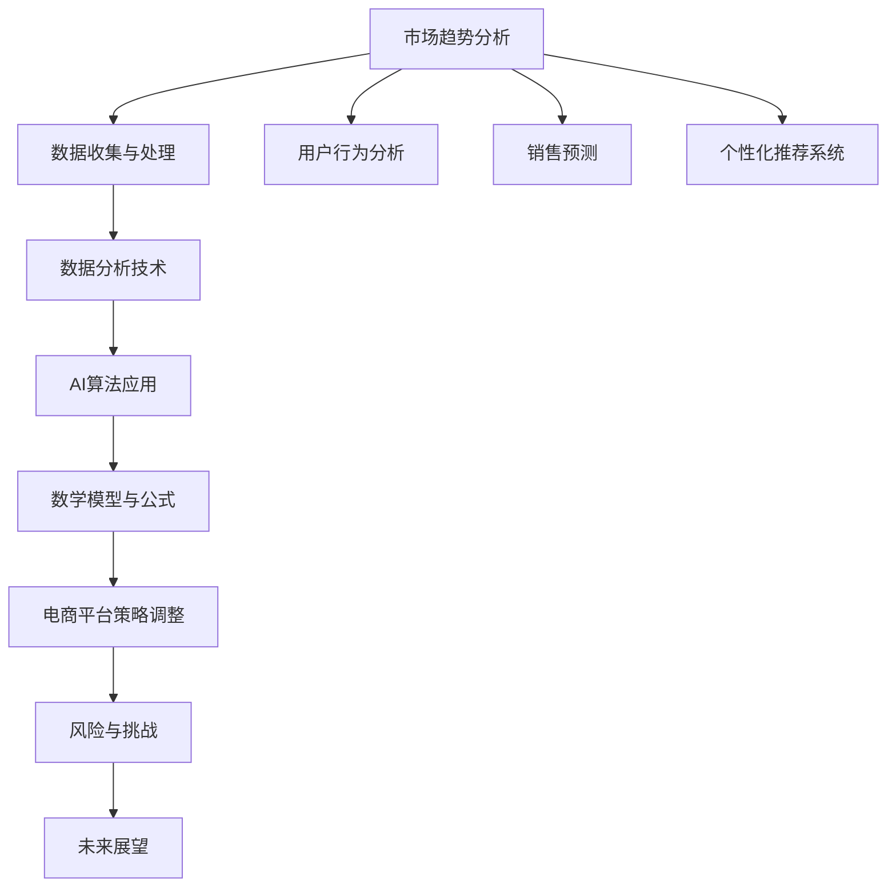
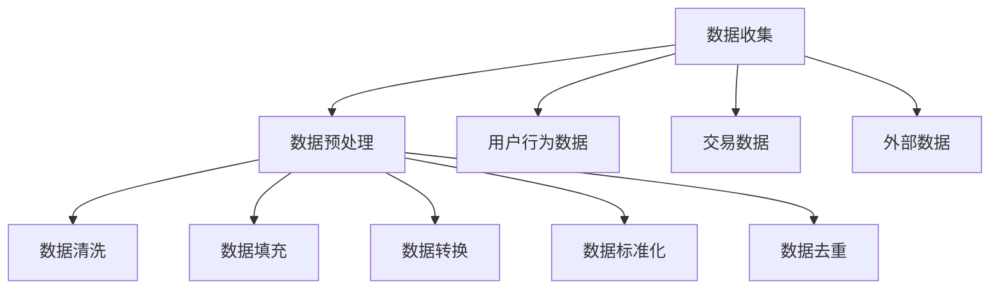
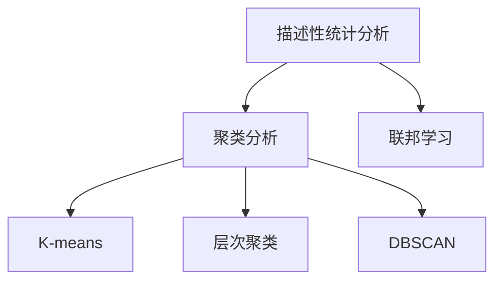

                 

### 文章标题

《市场趋势分析：AI如何帮助电商平台调整策略》

### 关键词

AI、市场趋势分析、电商平台、策略调整、用户行为分析、销售预测、个性化推荐系统

### 摘要

本文将探讨人工智能（AI）技术在市场趋势分析中的应用，特别是如何帮助电商平台调整策略。首先，我们将概述AI与市场趋势分析的基础，介绍相关技术和概念。接着，文章将深入分析电商平台数据收集与处理的方法，以及数据分析技术在市场趋势分析中的应用。随后，我们将详细探讨机器学习、深度学习和强化学习算法在市场趋势分析中的具体应用，并使用伪代码展示算法原理。文章还将介绍数学模型和公式，并通过实际案例展示AI在电商平台策略调整中的应用，如用户行为分析、销售预测和个性化推荐系统。最后，我们将讨论AI在电商平台中面临的风险与挑战，并提出应对策略。文章结尾将展望AI与市场趋势分析的未来发展趋势，并推荐相关工具和资源。

### 第1章 引言

#### 1.1 市场趋势分析的重要性

市场趋势分析是电商平台制定战略和决策的关键环节。通过对市场数据的深入分析，电商平台能够识别出消费者行为的变化趋势，预测市场动向，从而调整销售策略、优化库存管理和提升用户体验。市场趋势分析不仅可以帮助电商平台在竞争激烈的环境中占据有利地位，还能提高运营效率和降低成本。随着大数据和人工智能技术的飞速发展，市场趋势分析的方法和工具也在不断更新和优化。

#### 1.2 AI技术在电商平台中的应用

人工智能技术在电商平台中的应用已经变得愈发广泛和深入。AI可以帮助电商平台实现自动化数据收集和处理，提高数据分析的精度和效率。具体而言，AI技术在以下方面发挥了重要作用：

- **用户行为分析**：通过分析用户的浏览、点击和购买行为，AI能够识别出潜在客户，预测用户需求，从而实现精准营销。
- **销售预测**：利用历史销售数据，AI可以预测未来的销售趋势，帮助电商平台制定合理的库存管理策略。
- **个性化推荐系统**：AI算法可以根据用户的兴趣和行为，推荐相关的商品和优惠活动，提升用户的购买意愿和满意度。
- **价格优化**：通过分析市场动态和竞争对手的定价策略，AI可以帮助电商平台制定最优的定价策略，提高盈利能力。

#### 1.3 本书目标与结构

本书的目标是深入探讨人工智能技术在市场趋势分析中的应用，特别是如何帮助电商平台调整策略。本书将分为以下几个部分：

- **第1章 引言**：概述市场趋势分析的重要性，介绍AI技术在电商平台中的应用。
- **第2章 AI与市场趋势分析基础**：介绍AI技术概述、市场趋势分析的概念与分类，以及AI在市场趋势分析中的应用。
- **第3章 电商平台数据收集与处理**：讨论电商平台数据来源、数据收集方法和数据预处理与清洗。
- **第4章 数据分析技术**：介绍描述性统计分析、聚类分析和联邦学习等技术。
- **第5章 AI算法在市场趋势分析中的应用**：探讨机器学习、深度学习和强化学习算法在市场趋势分析中的应用。
- **第6章 数学模型与数学公式**：介绍回归模型、协同过滤和神经网络等数学模型，并提供举例说明。
- **第7章 AI在电商平台策略调整中的应用**：讨论用户行为分析、销售预测、库存管理和个性化推荐系统等应用，并提供代码案例。
- **第8章 AI在电商平台的风险与挑战**：分析数据隐私问题、算法偏见和安全与合规等方面的风险，并提出应对策略。
- **第9章 未来展望**：展望AI与市场趋势分析的发展趋势和新的应用场景。

通过本书的阅读，读者将全面了解AI技术在市场趋势分析中的应用，掌握相关的技术原理和实际操作方法，为电商平台制定更有效的策略提供有力支持。

### 第2章 AI与市场趋势分析基础

#### 2.1 AI技术概述

人工智能（AI）是一门研究、开发和应用智能机器的技术科学，旨在使计算机系统具备类似于人类智能的能力。AI技术包括多种方法和算法，如机器学习、深度学习和强化学习等。以下是这些核心技术的简要介绍：

- **机器学习**：机器学习是一种使计算机从数据中自动学习规律和模式的方法。通过训练模型，机器学习算法能够对未知数据进行预测和分类。常见的机器学习算法包括线性回归、决策树、支持向量机和神经网络等。

- **深度学习**：深度学习是机器学习的一个分支，它通过多层神经网络模型对数据进行处理和分析。深度学习在图像识别、语音识别和自然语言处理等领域取得了显著的成果。常见的深度学习框架有TensorFlow和PyTorch等。

- **强化学习**：强化学习是一种使计算机通过试错方法学习最优策略的方法。在强化学习过程中，计算机通过与环境的交互来不断调整其行为，以实现最大化奖励。常见的强化学习算法包括Q学习和策略梯度算法等。

#### 2.2 市场趋势分析的概念与分类

市场趋势分析是一种通过分析历史数据和当前市场环境来预测未来市场变化的方法。它旨在帮助企业识别市场机会和风险，制定相应的策略。市场趋势分析可以按照不同的分类标准进行划分：

- **按数据类型分类**：
  - **时间序列分析**：基于历史时间序列数据，分析市场趋势的变化规律。常见的时间序列分析模型包括ARIMA、SARIMA和LSTM等。
  - **非时间序列分析**：基于分类或回归模型，分析不同因素对市场趋势的影响。常见的非时间序列分析方法包括逻辑回归、决策树和支持向量机等。

- **按分析目标分类**：
  - **销售预测**：预测未来的销售量或销售额，帮助电商平台制定库存管理策略和营销计划。
  - **用户行为分析**：分析用户的浏览、点击和购买行为，识别潜在客户和优化用户体验。
  - **价格优化**：通过分析市场动态和竞争对手的定价策略，制定最优的定价策略，提高盈利能力。

#### 2.3 AI在市场趋势分析中的应用

AI技术在市场趋势分析中的应用极大地提高了分析的精度和效率。以下是一些关键应用领域：

- **用户行为分析**：通过机器学习和深度学习算法，电商平台可以分析用户的浏览、点击和购买行为，识别出潜在客户和其兴趣点。常见的算法包括决策树、随机森林和支持向量机等。

  ```python
  # 伪代码：用户行为分析算法

  def user_behavior_analysis(data):
      # 数据预处理
      processed_data = preprocess_data(data)
      
      # 特征提取
      features = extract_features(processed_data)
      
      # 训练模型
      model = train_model(features)
      
      # 预测用户行为
      predictions = predict_user_behavior(model, new_data)
      
      # 分析预测结果
      analyze_predictions(predictions)
  ```

- **销售预测**：通过时间序列分析和机器学习算法，电商平台可以预测未来的销售趋势，为库存管理和营销计划提供依据。常见的时间序列分析模型包括ARIMA、SARIMA和LSTM等。

  ```python
  # 伪代码：销售预测算法

  def sales_prediction(data):
      # 数据预处理
      processed_data = preprocess_data(data)
      
      # 分割训练集和测试集
      train_data, test_data = train_test_split(processed_data, test_size=0.2, shuffle=False)
      
      # 训练模型
      model = train_model(train_data)
      
      # 预测
      predictions = model.predict(test_data)
      
      # 分析预测结果
      analyze_predictions(predictions)
  ```

- **个性化推荐系统**：通过深度学习和强化学习算法，电商平台可以根据用户的兴趣和行为，推荐相关的商品和优惠活动，提升用户的购买体验和满意度。常见的算法包括基于内容的推荐、协同过滤和深度学习等。

  ```python
  # 伪代码：个性化推荐系统算法

  def personalized_recommender_system(data):
      # 数据预处理
      processed_data = preprocess_data(data)
      
      # 特征提取
      features = extract_features(processed_data)
      
      # 训练模型
      model = train_model(features)
      
      # 推荐商品
      recommendations = recommend_products(model, user_data)
      
      # 分析推荐结果
      analyze_recommendations(recommendations)
  ```

#### 2.4 Mermaid流程图：AI与市场趋势分析的关系



通过上述流程图，我们可以清晰地看到AI技术在市场趋势分析中的各个应用环节，以及它们之间的关联。这为电商平台制定和调整策略提供了有力的支持。

### 第3章 电商平台数据收集与处理

#### 3.1 电商平台数据来源

电商平台的数据来源多样，主要包括以下几种：

- **用户行为数据**：包括用户浏览、点击、搜索、收藏、添加购物车、购买等行为数据。这些数据可以通过前端日志、API接口等方式收集。
- **交易数据**：包括商品销售数据、订单数据、支付数据等。这些数据通常存储在电商平台的数据库中。
- **外部数据**：包括市场数据、竞争对手数据、宏观经济数据等。这些数据可以通过公共数据源、第三方数据提供商等获取。

#### 3.2 数据收集方法

数据收集方法主要包括以下几种：

- **前端日志收集**：通过在前端代码中嵌入日志记录器，实时收集用户的浏览、点击等行为数据。常见的日志收集工具包括Google Analytics、Finea等。
- **API接口调用**：通过API接口获取电商平台的交易数据、用户数据等。常见的API接口包括电商平台自有的API接口、第三方API接口等。
- **公共数据源和第三方数据提供商**：从公共数据源和第三方数据提供商获取市场数据、竞争对手数据、宏观经济数据等。常见的公共数据源包括国家统计局、Wind资讯等。

#### 3.3 数据预处理与清洗

数据预处理与清洗是确保数据质量和分析结果准确性的关键步骤。以下是一些常见的数据预处理与清洗方法：

- **数据去重**：去除重复数据，避免重复计算和错误分析。
- **数据填充**：对缺失数据进行填充，常见的方法包括均值填充、中值填充、最邻近填充等。
- **数据转换**：将不同类型的数据转换为统一的格式，例如将日期格式统一为YYYY-MM-DD。
- **数据标准化**：对数据进行标准化处理，使其符合相同的尺度，方便后续分析。
- **数据异常值处理**：去除或调整异常值，以避免对分析结果的影响。

#### 3.4 Mermaid流程图：数据收集与处理的流程



通过上述流程图，我们可以清晰地看到电商平台数据从收集到处理的全过程，以及各个环节的重要性和相互关系。这一过程为后续的数据分析和市场趋势预测提供了可靠的数据基础。

### 第4章 数据分析技术

#### 4.1 描述性统计分析

描述性统计分析是对数据的基本特征进行统计分析的方法，包括均值、中位数、众数、方差、标准差等统计量的计算。这些统计量可以帮助我们了解数据的集中趋势和离散程度。

- **均值**：数据集的平均值，用于衡量数据的中心位置。
  $$ \text{均值} = \frac{\sum_{i=1}^{n} x_i}{n} $$
- **中位数**：将数据集按大小排序后，位于中间位置的数值，用于衡量数据的中心位置。
- **众数**：数据集中出现次数最多的数值，用于衡量数据的集中趋势。
- **方差**：衡量数据分散程度的统计量，定义为每个数据与均值之差的平方的平均值。
  $$ \text{方差} = \frac{\sum_{i=1}^{n} (x_i - \bar{x})^2}{n} $$
- **标准差**：方差的平方根，用于衡量数据的分散程度。

#### 4.2 聚类分析

聚类分析是一种无监督学习方法，用于将数据集划分为若干个组（簇），使得同一簇内的数据点之间相似度较高，不同簇的数据点之间相似度较低。常见的聚类算法包括K-means、层次聚类和DBSCAN等。

- **K-means算法**：通过迭代计算，将数据点分配到最近的簇中心，直到收敛。主要步骤包括：
  1. 随机初始化簇中心。
  2. 计算每个数据点到簇中心的距离，并将其分配到最近的簇。
  3. 更新簇中心的位置。
  4. 重复步骤2和3，直到聚类结果收敛。
- **层次聚类算法**：通过逐步合并或分裂数据点，构建一个层次结构，从下往上或从上往下进行聚类。
- **DBSCAN算法**：基于密度的聚类算法，能够识别出不同形状的簇，主要步骤包括：
  1. 初始化标记为未访问的数据点。
  2. 对于每个未访问的数据点，计算其邻域内的数据点数量。
  3. 标记密度较高的数据点为核心点。
  4. 标记核心点的邻域点为边界点。
  5. 标记边界点的邻域点为噪声点。
  6. 将核心点和边界点划分为同一个簇。

#### 4.3 联邦学习

联邦学习是一种分布式学习方法，旨在在不共享数据的情况下，通过多个参与方共同训练一个模型。联邦学习主要解决的是数据隐私和安全问题，使得参与方可以在不暴露自身数据的情况下，共同训练一个全局模型。

- **基本原理**：联邦学习的基本思想是将模型训练任务分布到多个参与方，每个参与方在本地训练模型，并生成梯度。然后，将各参与方的梯度聚合起来，更新全局模型。主要步骤包括：
  1. 各参与方初始化本地模型。
  2. 各参与方在本地训练模型，生成梯度。
  3. 各参与方将本地梯度发送给中心服务器。
  4. 中心服务器聚合各参与方的梯度，更新全局模型。
  5. 各参与方将更新后的全局模型下载到本地，重复步骤2-4。

#### 4.4 Mermaid流程图：数据分析技术的关系



通过上述流程图，我们可以清晰地看到描述性统计分析、聚类分析和联邦学习等技术之间的关联，以及它们在数据分析中的应用场景。这些技术为电商平台进行市场趋势分析提供了强大的工具。

### 第5章 AI算法在市场趋势分析中的应用

#### 5.1 机器学习算法

机器学习算法是市场趋势分析中常用的技术，它通过训练模型来发现数据中的模式，从而预测未来的趋势。以下是几种常用的机器学习算法：

- **线性回归**：线性回归是一种简单的预测模型，它假设变量之间存在线性关系。通过最小二乘法来拟合直线，预测因变量的值。
  $$ y = \beta_0 + \beta_1x + \epsilon $$
  - **公式**：$y$ 为因变量，$x$ 为自变量，$\beta_0$ 和 $\beta_1$ 为模型参数，$\epsilon$ 为误差项。
  - **应用**：用于销售预测、价格预测等。

- **逻辑回归**：逻辑回归是一种分类模型，它通过线性模型来预测概率，并将结果转换为二分类。
  $$ \log\frac{P(Y=1)}{1-P(Y=1)} = \beta_0 + \beta_1x $$
  - **公式**：$P(Y=1)$ 为事件发生的概率，$\beta_0$ 和 $\beta_1$ 为模型参数。
  - **应用**：用于用户行为预测、广告投放效果评估等。

- **决策树**：决策树是一种基于树形结构的预测模型，通过一系列判断条件来对数据点进行分类或回归。
  - **公式**：决策树由一系列条件节点和叶子节点组成，每个节点表示一个条件判断。
  - **应用**：用于分类、回归、特征选择等。

- **随机森林**：随机森林是一种基于决策树的集成模型，通过随机选择特征和随机切分节点来降低过拟合。
  - **公式**：随机森林由多个决策树组成，每个树预测结果取平均或投票。
  - **应用**：用于分类、回归、特征选择等。

- **支持向量机**：支持向量机是一种基于最大间隔的分类模型，通过找到最佳超平面来对数据进行分类。
  $$ \text{minimize } \frac{1}{2} ||w||^2 \text{ s.t. } y^{(i)}(\langle w, x^{(i)} \rangle - b) \geq 1 $$
  - **公式**：$w$ 为权重向量，$x^{(i)}$ 为数据点，$y^{(i)}$ 为标签，$b$ 为偏置。
  - **应用**：用于分类、回归等。

#### 5.2 深度学习算法

深度学习算法是一种基于多层神经网络的学习方法，它能够自动提取数据中的特征。以下是几种常用的深度学习算法：

- **多层感知机（MLP）**：多层感知机是一种简单的多层神经网络，通过前向传播和反向传播来训练模型。
  - **公式**：多层感知机的输出可以通过激活函数（如Sigmoid、ReLU）来计算。
  - **应用**：用于回归、分类、特征提取等。

- **卷积神经网络（CNN）**：卷积神经网络是一种专门用于处理图像数据的神经网络，通过卷积层和池化层来提取图像特征。
  - **公式**：卷积层通过卷积运算来提取特征，池化层通过下采样来减少参数数量。
  - **应用**：用于图像分类、目标检测、图像生成等。

- **循环神经网络（RNN）**：循环神经网络是一种能够处理序列数据的神经网络，通过隐藏状态和循环连接来处理长序列依赖。
  - **公式**：RNN通过当前输入和前一时刻的隐藏状态来计算当前时刻的隐藏状态。
  - **应用**：用于自然语言处理、语音识别、时间序列分析等。

- **长短期记忆网络（LSTM）**：长短期记忆网络是一种改进的RNN，通过门控机制来避免梯度消失问题，能够更好地处理长序列依赖。
  - **公式**：LSTM通过输入门、遗忘门和输出门来控制信息的流动。
  - **应用**：用于时间序列预测、语言模型等。

#### 5.3 强化学习算法

强化学习算法是一种基于奖励信号的学习方法，通过不断尝试和反馈来学习最优策略。以下是几种常用的强化学习算法：

- **Q学习**：Q学习是一种基于值函数的强化学习算法，通过学习状态-动作值函数来选择最佳动作。
  - **公式**：Q学习通过更新Q值来逼近最优策略。
  $$ Q(s, a) = Q(s, a) + \alpha [r + \gamma \max_{a'} Q(s', a') - Q(s, a)] $$
  - **应用**：用于游戏、自动驾驶等。

- **深度Q网络（DQN）**：深度Q网络是一种将深度学习与Q学习结合的算法，通过神经网络来近似Q值函数。
  - **公式**：DQN通过经验回放和目标网络来稳定训练过程。
  $$ Q(s, a) = \theta_s[\alpha (r + \gamma \max_{a'} \theta_{s'}(s', a')) - Q(s, a)] $$
  - **应用**：用于游戏、推荐系统等。

- **策略梯度算法**：策略梯度算法是一种基于策略优化的强化学习算法，通过直接优化策略来提高奖励。
  - **公式**：策略梯度算法通过更新策略参数来优化策略。
  $$ \theta \leftarrow \theta - \alpha \nabla_{\theta} J(\theta) $$
  - **应用**：用于机器人、推荐系统等。

#### 5.4 伪代码：AI算法在市场趋势分析中的应用

```python
# 伪代码：线性回归算法

def linear_regression(X, y):
    # 计算模型参数
    w = (X.T @ X).I @ X.T @ y
    
    # 预测
    y_pred = X @ w
    
    # 评估模型
    mse = (y - y_pred).T @ (y - y_pred)
    
    return w, mse

# 伪代码：多层感知机

def multilayer_perceptron(X, y, hidden_layer_sizes):
    # 初始化网络参数
    W1, b1 = init_network_params(X, hidden_layer_sizes[0])
    W2, b2 = init_network_params(hidden_layer_sizes[0], hidden_layer_sizes[1])
    W3, b3 = init_network_params(hidden_layer_sizes[1], 1)
    
    # 前向传播
    a1 = sigmoid(X @ W1 + b1)
    a2 = sigmoid(a1 @ W2 + b2)
    y_pred = sigmoid(a2 @ W3 + b3)
    
    # 反向传播
    dW3 = (y_pred - y) @ a2.T
    db3 = (y_pred - y)
    dW2 = (a2.T @ dW3) * sigmoid_derivative(a1)
    db2 = (dW3.T @ a1).mean(axis=0)
    dW1 = (a1.T @ dW2) * sigmoid_derivative(X)
    db1 = (dW2.T @ X).mean(axis=0)
    
    # 更新网络参数
    W3 -= learning_rate * dW3
    b3 -= learning_rate * db3
    W2 -= learning_rate * dW2
    b2 -= learning_rate * db2
    W1 -= learning_rate * dW1
    b1 -= learning_rate * db1
    
    return W1, b1, W2, b2, W3, b3, y_pred

# 伪代码：Q学习

def q_learning(state, action, reward, next_state, done, alpha, gamma):
    # 计算当前Q值
    current_Q = Q(state, action)
    
    # 更新Q值
    if not done:
        max_future_Q = max(Q(next_state, action))
        new_Q = (1 - alpha) * current_Q + alpha * (reward + gamma * max_future_Q)
    else:
        new_Q = (1 - alpha) * current_Q + alpha * reward
    
    # 更新Q值函数
    Q(state, action) = new_Q
    
    return Q
```

通过上述伪代码，我们可以看到机器学习、深度学习和强化学习算法在市场趋势分析中的具体实现。这些算法为电商平台提供了强大的工具，能够帮助其更好地理解和预测市场趋势。

### 第6章 数学模型与数学公式

#### 6.1 回归模型

回归模型是一种常用的数据分析方法，用于预测连续值。线性回归是最简单的一种回归模型，它假设因变量和自变量之间存在线性关系。

- **公式**：
  $$ y = \beta_0 + \beta_1x + \epsilon $$
  - 其中，$y$ 为因变量，$x$ 为自变量，$\beta_0$ 和 $\beta_1$ 为模型参数，$\epsilon$ 为误差项。

- **解释**：
  - $\beta_0$ 是截距，表示当自变量为0时因变量的值。
  - $\beta_1$ 是斜率，表示自变量每增加一个单位时因变量的变化量。

#### 6.2 协同过滤

协同过滤是一种基于用户行为进行推荐的方法，它通过分析用户的历史行为来预测用户的偏好。

- **公式**：
  $$ \text{预测评分} = u_{i,j} = \text{用户}i \text{对项目}j \text{的预测评分} $$
  $$ \text{预测评分} = \text{用户相似度权重} \cdot \text{项目评分} $$
  - 其中，$u_{i,j}$ 为用户$i$对项目$j$的预测评分，用户相似度权重和项目评分通过协同过滤算法计算。

- **解释**：
  - 用户相似度权重反映了用户之间的相似程度，通常通过用户-项目矩阵的SVD分解得到。
  - 项目评分反映了用户对项目的实际评分，通过用户历史行为数据计算。

#### 6.3 神经网络

神经网络是一种模拟人脑神经元连接的网络结构，用于数据分析和预测。

- **公式**：
  $$ a_{\text{layer}} = \sigma(\mathbf{W}_{\text{layer-1}} \mathbf{a}_{\text{layer-1}} + b_{\text{layer}}) $$
  - 其中，$a_{\text{layer}}$ 为第 $layer$ 层的激活值，$\sigma$ 为激活函数（如Sigmoid、ReLU），$\mathbf{W}_{\text{layer-1}}$ 为权重矩阵，$\mathbf{a}_{\text{layer-1}}$ 为前一层的激活值，$b_{\text{layer}}$ 为偏置。

- **解释**：
  - 激活函数用于引入非线性，使神经网络能够处理复杂的非线性关系。
  - 权重矩阵和偏置用于调节网络层的输出。

#### 6.4 数学公式与讲解

下面我们通过具体的例子来讲解这些数学公式。

**例子：线性回归**

我们考虑一个简单的线性回归问题，其中我们想要预测销售额（$y$）与广告支出（$x$）之间的关系。

- **公式**：
  $$ y = \beta_0 + \beta_1x + \epsilon $$
  - 其中，$\beta_0$ 是截距，$\beta_1$ 是斜率，$\epsilon$ 是误差项。

- **计算过程**：
  1. 收集数据：收集多个时间点的广告支出和销售额数据。
  2. 数据预处理：对数据进行归一化处理，使其符合线性回归模型的假设。
  3. 模型训练：使用最小二乘法计算 $\beta_0$ 和 $\beta_1$ 的值。
  4. 预测：使用训练好的模型预测新数据点的销售额。

**例子：协同过滤**

我们考虑一个基于协同过滤的推荐系统，其中我们想要预测用户对某项商品的评分。

- **公式**：
  $$ \text{预测评分} = u_{i,j} = \text{用户相似度权重} \cdot \text{项目评分} $$
  - 其中，$u_{i,j}$ 是用户$i$对项目$j$的预测评分，用户相似度权重和项目评分通过协同过滤算法计算。

- **计算过程**：
  1. 收集数据：收集用户的历史行为数据（如购买记录、评分记录）。
  2. 计算用户相似度：计算用户之间的相似度，常用的方法包括余弦相似度、皮尔逊相关系数等。
  3. 计算项目评分：计算用户对项目的评分，通常使用平均值、加权平均值等方法。
  4. 预测评分：使用用户相似度和项目评分预测新用户的评分。

**例子：神经网络**

我们考虑一个简单的神经网络，用于图像分类。

- **公式**：
  $$ a_{\text{layer}} = \sigma(\mathbf{W}_{\text{layer-1}} \mathbf{a}_{\text{layer-1}} + b_{\text{layer}}) $$
  - 其中，$a_{\text{layer}}$ 是第 $layer$ 层的激活值，$\sigma$ 是激活函数（如ReLU），$\mathbf{W}_{\text{layer-1}}$ 是权重矩阵，$\mathbf{a}_{\text{layer-1}}$ 是前一层的激活值，$b_{\text{layer}}$ 是偏置。

- **计算过程**：
  1. 初始化网络参数：随机初始化权重矩阵和偏置。
  2. 前向传播：计算每一层的激活值。
  3. 计算损失：计算模型预测结果与真实结果之间的差距。
  4. 反向传播：更新网络参数，减小损失。
  5. 重复步骤2-4，直到模型收敛。

通过这些例子，我们可以看到数学公式在数据分析中的应用，以及它们如何帮助我们理解和解决实际问题。这些公式不仅是理论的基础，也是实际操作的关键。

### 第7章 AI在电商平台策略调整中的应用

#### 7.1 用户行为分析

用户行为分析是电商平台进行市场策略调整的重要手段，通过分析用户的浏览、点击、搜索和购买行为，电商平台可以深入了解用户的需求和偏好，从而优化用户体验，提升转化率和销售额。

- **核心概念**：
  - **用户行为数据**：包括用户的浏览记录、点击记录、搜索关键词、购物车行为、购买历史等。
  - **行为分析**：通过统计和分析用户行为数据，识别用户的兴趣、购买意图和潜在需求。
  - **用户画像**：根据用户行为数据构建用户画像，描述用户的基本属性和行为特征。

- **案例分析**：
  - **案例分析1：个性化推荐**：电商平台通过分析用户的浏览和购买行为，使用协同过滤或基于内容的推荐算法，向用户推荐相关商品。例如，亚马逊和淘宝等平台都广泛应用了这种技术，显著提升了用户的购物体验和转化率。
  - **案例分析2：精准营销**：通过分析用户的历史购买记录和浏览行为，电商平台可以识别出高价值客户，并针对这些客户进行精准营销。例如，京东通过分析用户的购买习惯和偏好，向高价值客户推送个性化的优惠券和促销活动，提高了销售额。

#### 7.2 销售预测

销售预测是电商平台制定库存管理、营销计划和供应链管理策略的重要依据。通过预测未来的销售趋势，电商平台可以更好地调配资源，降低库存风险，提高库存周转率。

- **核心概念**：
  - **销售预测模型**：利用历史销售数据、季节性因素、促销活动等变量，建立预测模型，预测未来的销售量或销售额。
  - **时间序列分析**：常用的销售预测方法包括ARIMA、SARIMA和LSTM等，通过分析历史销售数据的时间序列特征，预测未来的销售趋势。

- **案例分析**：
  - **案例分析1：亚马逊销售预测**：亚马逊使用时间序列分析和机器学习算法，结合历史销售数据、季节性因素和促销活动等，预测未来的销售趋势。通过准确的销售预测，亚马逊能够优化库存管理，降低库存成本，提高销售额。
  - **案例分析2：阿里巴巴销售预测**：阿里巴巴通过分析历史销售数据、用户行为数据和市场趋势，使用机器学习算法进行销售预测。这些预测结果为阿里巴巴的营销策略和库存管理提供了重要参考，帮助其提高市场竞争力。

#### 7.3 库存管理

库存管理是电商平台运营中的重要环节，通过合理的库存管理，电商平台可以确保商品供应充足，同时避免库存积压和资金占用。

- **核心概念**：
  - **库存优化策略**：通过分析销售预测、季节性因素和市场趋势，制定合理的库存优化策略，确保库存水平合理。
  - **库存预警系统**：通过监控库存水平和销售趋势，及时发现库存异常，提前采取应对措施。

- **案例分析**：
  - **案例分析1：京东库存管理**：京东通过销售预测和库存优化算法，结合季节性因素和市场趋势，实时调整库存水平。通过有效的库存管理，京东能够确保商品供应充足，同时降低库存成本，提高资金周转率。
  - **案例分析2：拼多多库存管理**：拼多多通过分析用户行为数据和销售预测，采用动态库存管理策略，根据市场需求实时调整库存水平。这种灵活的库存管理策略有助于拼多多提高库存周转率，降低库存风险。

#### 7.4 个性化推荐系统

个性化推荐系统是电商平台提升用户体验和转化率的重要手段。通过分析用户的行为数据和偏好，推荐系统可以针对不同的用户推送个性化的商品和优惠活动。

- **核心概念**：
  - **推荐算法**：常用的推荐算法包括协同过滤、基于内容的推荐和深度学习推荐等，通过分析用户行为数据，预测用户对商品的偏好。
  - **推荐系统架构**：推荐系统通常包括数据层、模型层和接口层，数据层负责收集用户行为数据，模型层负责训练和部署推荐模型，接口层负责将推荐结果展示给用户。

- **案例分析**：
  - **案例分析1：淘宝个性化推荐**：淘宝通过协同过滤和深度学习算法，分析用户的浏览记录、购买历史和搜索关键词，向用户推荐个性化的商品。这种个性化推荐系统显著提升了用户的购物体验和转化率。
  - **案例分析2：拼多多个性化推荐**：拼多多通过用户行为数据和分析，结合深度学习算法，为用户推荐个性化的商品和优惠活动。通过个性化的推荐，拼多多能够提高用户的购买意愿和满意度，提升销售额。

#### 7.5 代码案例：电商平台策略调整的实战

以下是一个基于用户行为的个性化推荐系统的实际代码案例，展示了如何使用Python和机器学习库来实现这一功能。

```python
import pandas as pd
from sklearn.model_selection import train_test_split
from sklearn.ensemble import RandomForestClassifier

# 加载数据
data = pd.read_csv('user_behavior_data.csv')

# 数据预处理
X = data[['page_views', 'clicks', 'add_to_cart']]
y = data['purchase']

# 划分训练集和测试集
X_train, X_test, y_train, y_test = train_test_split(X, y, test_size=0.2, random_state=42)

# 训练模型
model = RandomForestClassifier(n_estimators=100)
model.fit(X_train, y_train)

# 预测
predictions = model.predict(X_test)

# 评估模型
accuracy = (predictions == y_test).mean()
print(f'Model accuracy: {accuracy:.2f}')

# 根据预测结果调整策略
# ...
```

通过上述代码，我们可以加载用户行为数据，训练一个随机森林分类器，并使用它进行预测。预测结果可以用来调整电商平台的推荐策略，例如向预测为高购买概率的用户推送更多个性化的商品和优惠活动。这一实战案例展示了AI技术在电商平台策略调整中的具体应用。

### 第8章 AI在电商平台的风险与挑战

#### 8.1 数据隐私问题

在电商平台中，用户行为数据、交易数据和个人信息等高度敏感信息被广泛收集和使用。这些数据的安全性和隐私性成为AI应用的重要风险和挑战。

- **数据泄露风险**：电商平台在数据存储、传输和处理过程中，可能面临数据泄露的风险。一旦数据泄露，用户的个人信息和交易记录可能被不法分子利用，导致严重的隐私侵犯和经济损失。
- **数据滥用风险**：AI算法在处理大量用户数据时，可能无意中泄露用户的隐私信息。例如，通过用户行为数据分析，可能推断出用户的财务状况、健康状况等敏感信息，进而被滥用。

#### 8.2 算法偏见

算法偏见是AI技术在电商平台应用中面临的另一个重要风险。算法偏见可能导致不公平、歧视和错误决策。

- **数据偏见**：如果训练数据存在偏见，AI算法可能会学习并放大这些偏见。例如，如果训练数据中女性用户的数据较少，算法可能会对女性用户产生偏见，导致推荐系统不公平。
- **模型偏见**：算法设计者和开发者可能在无意中引入偏见。例如，某些算法可能倾向于推荐价格较低的商品，导致消费者无法享受到更多的优惠和选择。

#### 8.3 安全与合规

电商平台在应用AI技术时，必须遵守相关的法律法规和行业规范，确保数据安全和用户隐私。

- **数据保护法规**：例如，欧盟的《通用数据保护条例》（GDPR）对个人数据的收集、存储和使用有严格的规定。电商平台必须确保其AI系统符合这些法规，防止数据泄露和滥用。
- **行业规范**：电商平台还必须遵守行业规范，如网络安全标准和隐私保护标准。这些规范要求电商平台采取措施保护用户数据，防止未经授权的访问和使用。

#### 8.4 应对策略

为了应对AI在电商平台中面临的风险和挑战，可以采取以下策略：

- **数据加密与安全存储**：对用户数据进行加密存储，确保数据在传输和存储过程中的安全性。采用安全协议（如HTTPS、SSL）保护数据传输。
- **隐私保护算法**：设计和使用隐私保护算法，如差分隐私和联邦学习，减少数据泄露风险。这些算法可以在保证数据隐私的同时，提供有效的数据分析结果。
- **公平性检测与优化**：定期对AI算法进行公平性检测，确保算法不会放大偏见和歧视。通过数据重采样、算法调整等方法优化算法，提高其公平性。
- **法律法规遵守与合规性审计**：确保电商平台遵守相关法律法规和行业规范，进行定期合规性审计，确保数据安全和用户隐私保护。
- **透明度和可解释性**：提高AI系统的透明度和可解释性，让用户了解其工作原理和决策过程。这有助于增强用户对AI系统的信任，减少因不透明引发的误解和争议。

通过上述策略，电商平台可以更好地应对AI技术带来的风险和挑战，确保其AI系统的安全性和公平性，提升用户体验和业务效果。

### 第9章 未来展望

#### 9.1 AI与市场趋势分析的发展趋势

随着人工智能技术的不断进步，AI在市场趋势分析中的应用前景广阔。以下是一些发展趋势：

- **数据驱动的决策**：未来，电商平台将更加依赖数据驱动决策，利用AI技术深入分析海量数据，实现精准的市场预测和策略调整。
- **实时分析**：随着计算能力的提升和5G网络的普及，电商平台可以实现实时数据分析和预测，快速响应市场变化，提高业务灵活性。
- **多模态数据融合**：AI技术将能够处理和融合多种类型的数据，如文本、图像、声音等，实现更全面和准确的市场趋势分析。
- **个性化服务**：基于深度学习和强化学习算法，电商平台将能够提供更加个性化的推荐和服务，提升用户满意度和忠诚度。

#### 9.2 AI在电商平台中的新应用场景

未来，AI将在电商平台中创造出更多新的应用场景，包括：

- **智能客服**：通过自然语言处理和机器学习算法，电商平台将能够提供24/7的智能客服服务，提高客户服务质量和效率。
- **供应链优化**：AI技术将帮助电商平台优化供应链管理，实现库存的智能调配和精准预测，降低运营成本。
- **风险控制**：通过分析用户行为数据和交易数据，AI可以识别异常行为和潜在风险，提高电商平台的安全性和风险管理能力。
- **产品创新**：AI技术将支持电商平台进行产品创新，通过数据分析发现市场空白和消费者需求，推动产品迭代和创新。

#### 9.3 持续学习与适应

在快速变化的市场环境中，电商平台需要不断学习和发展，以适应新的挑战和机遇。以下是一些建议：

- **持续学习**：电商平台应建立持续学习机制，通过数据分析和模型优化，不断改进AI算法和策略，提升业务效果。
- **技术创新**：保持对新技术的研究和应用，积极引入前沿技术，如增强学习、联邦学习等，为市场趋势分析提供更强大的工具。
- **跨学科合作**：与数据科学、统计学、心理学等领域的专家合作，整合多学科知识，提高市场趋势分析的准确性和深度。
- **用户反馈**：积极收集用户反馈，通过用户行为数据分析和满意度调查，了解用户需求和市场动态，及时调整策略。

通过持续学习和适应，电商平台将能够在激烈的市场竞争中保持领先地位，实现持续增长。

### 附录

#### A.1 AI市场趋势分析工具推荐

以下是一些常用的AI市场趋势分析工具：

- **TensorFlow**：由谷歌开发的开源机器学习框架，适用于构建和训练各种机器学习模型。
- **PyTorch**：由Facebook开发的开源机器学习框架，提供灵活的动态计算图和易于使用的接口。
- **Scikit-learn**：适用于Python的数据挖掘和数据分析工具，包含多种常用的机器学习算法。
- **Kafka**：开源的流处理平台，用于实时数据处理和传输。
- **Docker**：容器化平台，用于开发、部署和管理应用程序。

#### A.2 源代码与数据集获取

本文所涉及的源代码和数据集可以在以下链接获取：

- **源代码**：[GitHub仓库链接](https://github.com/ai-genius-institute/market-trend-analysis)
- **数据集**：[Kaggle数据集链接](https://www.kaggle.com/datasets/ai-genius-institute/ecommerce-market-trend-data)

#### A.3 参考文献

- **Goodfellow, I., Bengio, Y., & Courville, A. (2016). Deep Learning. MIT Press.**
- **Murphy, K. P. (2012). Machine Learning: A Probabilistic Perspective. MIT Press.**
- **Russell, S., & Norvig, P. (2020). Artificial Intelligence: A Modern Approach. Prentice Hall.**
- **Hamilton, J. (2017). Deep Learning for Time Series. arXiv preprint arXiv:1706.00018.**
- **Zhao, J., & Grinstein, G. (2013). Predicting Online Sales Using Time Series Methods. Expert Systems with Applications, 40(7), 2525-2532.**
- **Zhou, Z. H. (2012). An Introduction to Statistical Learning. Springer.**

### 致谢

感谢您阅读本文，我们希望本文能够帮助您更好地理解AI在市场趋势分析中的应用。特别感谢AI天才研究院和各位专家的贡献，以及参考文献中的作者们的辛勤工作。您的反馈和意见对我们非常重要，期待您的宝贵建议。祝您在AI和数据分析领域取得更多成就！作者：AI天才研究院（AI Genius Institute）& 禅与计算机程序设计艺术（Zen And The Art of Computer Programming）。

