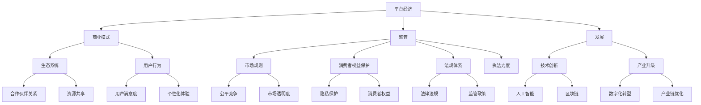

                 

# 文章标题：平台经济的未来：监管与发展之间的平衡

> 关键词：平台经济、监管、发展、平衡、算法、模型、战略、案例分析

> 摘要：本文深入探讨了平台经济的现状与发展趋势，分析了监管与发展之间的矛盾与协调，提出了平台经济的监管优化策略和可持续发展路径。通过国内外平台经济案例分析，总结了平台经济的监管经验，展望了平台经济的未来发展方向与挑战。

## 目录

1. 引言
2. 平台经济概述
3. 平台经济的核心要素
4. 平台经济中的监管问题
5. 国际监管合作
6. 平台经济的未来与发展
7. 平台经济的监管与发展平衡
8. 平台经济案例分析
9. 平台经济的未来展望
10. 附录

## 第一部分：平台经济概述

### 第1章：平台经济的兴起与发展

#### 1.1 平台经济的定义与特征

平台经济，是指基于互联网平台，通过构建开放的生态系统，连接供需双方，实现资源优化配置和业务协同发展的经济模式。其特征主要包括：

1. **开放性**：平台经济具有高度的开放性，通过开放接口和生态系统，吸引各种资源参与其中。
2. **共享性**：平台经济通过共享资源、技术和数据，提高资源利用效率，降低交易成本。
3. **协同性**：平台经济强调各参与方之间的协同合作，实现共赢发展。
4. **动态性**：平台经济适应性强，能够快速响应市场变化，实现持续创新。

#### 1.2 平台经济的价值与挑战

平台经济的价值主要体现在以下几个方面：

1. **提高效率**：通过平台经济，可以优化资源配置，提高交易效率，降低成本。
2. **促进创新**：平台经济为创业者提供了广阔的舞台，激发了创新活力。
3. **推动产业升级**：平台经济带动了传统产业的转型升级，推动了经济结构的优化。

然而，平台经济也面临着一些挑战：

1. **监管不足**：平台经济的发展速度快，监管政策滞后，导致市场失灵。
2. **数据隐私**：平台经济涉及海量数据，如何保障数据隐私和安全，成为一大挑战。
3. **垄断风险**：部分平台企业垄断市场，对市场竞争和消费者权益造成威胁。

#### 1.3 平台经济的全球发展现状

全球范围内，平台经济呈现出迅猛发展的态势。根据相关报告，全球平台经济市场规模已超过 10 万亿美元，其中美国、中国、欧洲等地区发展较为成熟。

1. **美国**：美国是全球平台经济的重要发源地，以亚马逊、谷歌、Facebook 等为代表的企业，通过平台经济实现了快速发展。
2. **中国**：中国平台经济市场规模庞大，以阿里巴巴、腾讯、字节跳动等为代表的企业，在全球范围内具有较大影响力。
3. **欧洲**：欧洲平台经济起步较晚，但发展迅速，以亚马逊、Zalando、Takeaway 等为代表的企业，已成为全球平台经济的领军企业。

### 第2章：平台经济的核心要素

#### 2.1 平台商业模式解析

平台商业模式主要包括以下几个方面：

1. **平台架构**：平台架构是平台经济的基础，包括技术架构、业务架构和生态系统架构。
2. **用户参与**：平台经济的核心在于用户参与，通过用户贡献内容和数据，实现平台的可持续发展。
3. **盈利模式**：平台经济的盈利模式主要包括广告收入、交易抽成、增值服务等多种方式。

#### 2.2 平台生态系统构建

平台生态系统是指平台企业与其合作伙伴、用户等各方的互动关系和协作机制。构建平台生态系统，需要关注以下几个方面：

1. **合作伙伴关系**：平台企业需要与各类合作伙伴建立紧密合作关系，共同推动平台发展。
2. **用户满意度**：平台企业需要关注用户满意度，通过提升用户体验，增强用户粘性。
3. **数据安全**：平台企业需要保障用户数据安全，建立完善的数据安全管理体系。

#### 2.3 平台用户行为分析

平台用户行为分析是平台经济的重要组成部分。通过分析用户行为，平台企业可以更好地了解用户需求，优化产品和服务。

1. **用户画像**：通过对用户数据进行分析，建立用户画像，为个性化推荐和精准营销提供依据。
2. **行为分析**：分析用户在平台上的行为轨迹，发现用户需求和行为模式，为平台优化提供参考。
3. **反馈机制**：建立用户反馈机制，及时收集用户意见和建议，不断改进产品和服务。

## 第二部分：平台经济中的监管问题

### 第3章：平台经济的监管挑战

#### 3.1 监管不足与市场失灵

平台经济的快速发展，对监管提出了新的挑战。监管不足和市场失灵主要体现在以下几个方面：

1. **政策滞后**：平台经济的创新速度快，监管政策往往滞后于市场发展，导致监管不力。
2. **监管空白**：部分新兴平台领域尚未纳入监管范围，存在监管空白。
3. **监管强度不足**：监管机构对平台企业的监管力度不够，无法有效遏制市场失灵现象。

#### 3.2 数据隐私与消费者保护

平台经济涉及海量数据，如何保护数据隐私和消费者权益，成为监管的重要议题。监管挑战主要包括：

1. **数据泄露风险**：平台企业存在数据泄露风险，可能导致用户隐私泄露。
2. **用户信息滥用**：平台企业可能滥用用户信息，进行精准营销和商业推广。
3. **消费者权益保护**：平台企业存在不公平交易、霸王条款等问题，损害消费者权益。

#### 3.3 竞争政策与市场支配地位

平台经济市场集中度较高，部分企业具有市场支配地位。监管挑战主要包括：

1. **垄断行为**：平台企业可能通过垄断行为，限制市场竞争，损害消费者利益。
2. **市场支配地位滥用**：平台企业可能滥用市场支配地位，打压竞争对手，破坏市场秩序。
3. **监管措施不足**：监管机构对市场支配地位的监管措施不足，难以有效遏制垄断行为。

### 第4章：国际监管合作

#### 4.1 全球监管框架比较

全球范围内，各国对平台经济的监管框架有所不同，主要表现在以下几个方面：

1. **美国**：美国主要通过联邦贸易委员会（FTC）和证券交易委员会（SEC）等机构，对平台经济进行监管。
2. **欧盟**：欧盟建立了《通用数据保护条例》（GDPR）等法规，加强对平台经济的监管。
3. **中国**：中国出台了《网络安全法》、《数据安全法》等法律法规，加强对平台经济的监管。

#### 4.2 国际监管合作机制

国际监管合作机制主要包括以下几个方面：

1. **国际合作组织**：如经济合作与发展组织（OECD）、国际电信联盟（ITU）等，通过制定国际规则，推动全球监管合作。
2. **区域性合作**：如亚洲基础设施投资银行（AIIB）、非洲发展银行（AfDB）等，通过区域性合作，推动平台经济的健康发展。
3. **双边合作**：各国政府通过双边合作，加强在平台经济领域的交流与合作，共同应对全球性挑战。

#### 4.3 中国的监管实践

中国作为全球最大的平台经济市场，积极推动监管实践，取得了显著成果。中国监管实践主要包括以下几个方面：

1. **法律法规体系**：建立完善的法律法规体系，如《网络安全法》、《数据安全法》等，为平台经济监管提供法律依据。
2. **监管机构**：成立国家互联网信息办公室、国家市场监管总局等监管机构，加强对平台经济的监管。
3. **监管措施**：实施市场准入、数据安全、消费者权益保护等监管措施，推动平台经济的健康发展。

## 第三部分：平台经济的未来与发展

### 第5章：平台经济的创新趋势

#### 5.1 区块链与平台经济

区块链技术具有去中心化、不可篡改等特点，与平台经济的结合，将带来以下创新趋势：

1. **去中心化交易平台**：区块链技术可以构建去中心化的交易平台，降低交易成本，提高交易效率。
2. **智能合约**：区块链技术可以实现智能合约，自动执行合同条款，提高合同履行效率。
3. **数据安全与隐私保护**：区块链技术可以保障数据安全与隐私，提高平台数据的可信度。

#### 5.2 人工智能与平台经济

人工智能技术为平台经济带来了新的发展机遇，主要体现在以下几个方面：

1. **个性化推荐**：人工智能技术可以根据用户行为和偏好，提供个性化推荐，提高用户满意度。
2. **自动化运营**：人工智能技术可以实现自动化运营，降低人力成本，提高运营效率。
3. **风险管理**：人工智能技术可以分析大量数据，识别风险，提高风险管理能力。

#### 5.3 物联网与平台经济

物联网技术将各类设备互联，为平台经济带来了新的发展空间，主要体现在以下几个方面：

1. **智能物流**：物联网技术可以实现智能物流，提高物流效率，降低物流成本。
2. **智能制造**：物联网技术可以实现智能制造，提高生产效率，降低生产成本。
3. **智能服务**：物联网技术可以实现智能服务，提升用户体验，增强用户粘性。

### 第6章：平台经济的发展战略

#### 6.1 平台企业的战略选择

平台企业在发展过程中，需要根据自身情况，制定合适的战略选择，主要包括：

1. **规模化发展**：通过扩大平台规模，提高市场份额，实现规模效应。
2. **多元化发展**：通过拓展业务领域，实现多元化发展，降低业务风险。
3. **国际化发展**：通过拓展海外市场，实现国际化发展，提升国际竞争力。

#### 6.2 政府支持与政策制定

政府支持对平台经济的发展具有重要意义，主要包括以下几个方面：

1. **法律法规**：制定完善的法律法规，为平台经济提供法律保障。
2. **政策措施**：实施税收优惠、财政补贴等政策措施，鼓励平台企业发展。
3. **人才培养**：加强人才培养，提高平台企业的创新能力。

#### 6.3 平台经济的可持续发展

平台经济的可持续发展，需要关注以下几个方面：

1. **环境保护**：平台企业应积极履行环境保护责任，降低能源消耗和碳排放。
2. **社会责任**：平台企业应承担社会责任，关注员工福利和社会公益。
3. **创新驱动**：平台企业应加大研发投入，推动技术创新，提升核心竞争力。

### 第7章：平台经济的监管与发展平衡

#### 7.1 监管与发展的矛盾与协调

平台经济的监管与发展之间存在一定的矛盾，主要体现在以下几个方面：

1. **监管滞后**：监管政策滞后于市场发展，导致监管不力。
2. **监管过度**：过度监管可能抑制平台企业的创新和发展。
3. **监管不足**：监管不足可能导致市场失灵和风险积聚。

为解决监管与发展之间的矛盾，需要采取以下协调措施：

1. **完善监管体系**：建立健全监管制度，提高监管效能。
2. **加强国际合作**：通过国际合作，推动全球平台经济的健康发展。
3. **优化监管措施**：采取灵活、高效的监管措施，平衡监管与发展。

#### 7.2 平台经济的监管优化

平台经济的监管优化，需要从以下几个方面进行：

1. **立法完善**：完善相关法律法规，为平台经济提供法律保障。
2. **监管技术**：运用大数据、人工智能等新技术，提高监管效能。
3. **监管协同**：加强各部门之间的协同监管，形成监管合力。

#### 7.3 案例分析：国内外平台经济的监管经验

国内外平台经济的监管经验为我国提供了有益的借鉴。以下列举几个典型案例：

1. **美国**：美国通过联邦贸易委员会（FTC）和证券交易委员会（SEC）等机构，加强对平台经济的监管。其监管策略主要包括制定明确的法律框架、实施严格的数据安全保护措施、推动市场竞争。
2. **欧盟**：欧盟出台《通用数据保护条例》（GDPR），加强对平台经济的监管。其监管策略主要包括保障数据隐私、推动数据共享、强化消费者权益保护。
3. **中国**：中国出台《网络安全法》、《数据安全法》等法律法规，加强对平台经济的监管。其监管策略主要包括加强数据安全监管、推动平台企业合规经营、提升消费者权益保护水平。

## 第四部分：平台经济案例分析

### 第8章：国内外平台经济案例分析

#### 8.1 亚马逊的平台经济模式

亚马逊是全球最大的电子商务平台，其平台经济模式主要包括以下几个方面：

1. **平台架构**：亚马逊采用分布式架构，实现了高并发、高可用、易扩展的系统设计。
2. **用户参与**：亚马逊通过用户评价、购物车、收藏夹等功能，增强用户参与度。
3. **盈利模式**：亚马逊的盈利模式主要包括广告收入、交易抽成、云计算服务等。

#### 8.2 阿里巴巴的平台经济实践

阿里巴巴是中国最大的电子商务平台，其平台经济实践主要包括以下几个方面：

1. **平台架构**：阿里巴巴采用分布式架构，实现了高并发、高可用、易扩展的系统设计。
2. **用户参与**：阿里巴巴通过淘宝、天猫等平台，吸引了大量商家和消费者参与。
3. **盈利模式**：阿里巴巴的盈利模式主要包括广告收入、交易抽成、云计算服务等。

#### 8.3 微软的平台经济战略

微软是一家全球领先的云计算服务提供商，其平台经济战略主要包括以下几个方面：

1. **平台架构**：微软采用云计算架构，实现了全球化的服务能力。
2. **用户参与**：微软通过 Azure、Office 365 等产品，吸引了大量用户。
3. **盈利模式**：微软的盈利模式主要包括云计算服务收入、软件授权费等。

#### 8.4 谷歌的平台经济案例

谷歌是全球最大的搜索引擎，其平台经济案例主要包括以下几个方面：

1. **平台架构**：谷歌采用分布式架构，实现了高并发、高可用、易扩展的系统设计。
2. **用户参与**：谷歌通过搜索引擎、广告平台等，吸引了大量用户。
3. **盈利模式**：谷歌的盈利模式主要包括广告收入、云计算服务等。

## 第五部分：平台经济的未来展望

### 第9章：平台经济的未来趋势与挑战

#### 9.1 平台经济的未来发展方向

平台经济的未来发展方向主要包括以下几个方面：

1. **全球化**：平台经济将进一步推动全球经济的互联互通。
2. **智能化**：人工智能等新技术将赋能平台经济，提升效率和创新。
3. **生态化**：平台经济将形成更加完善的生态系统，实现资源优化配置。

#### 9.2 平台经济的可持续发展挑战

平台经济的可持续发展面临着以下几个挑战：

1. **监管缺失**：监管不足可能导致市场失灵和风险积聚。
2. **数据安全**：数据隐私和安全问题亟待解决。
3. **竞争压力**：平台企业之间的竞争将更加激烈。

#### 9.3 平台经济的未来监管策略

为应对平台经济的未来挑战，监管策略应包括以下几个方面：

1. **完善法规体系**：制定完善的法律法规，为平台经济提供法律保障。
2. **加强国际合作**：推动全球平台经济的健康发展。
3. **创新监管方式**：运用新技术，提高监管效能。

### 第10章：平台经济的全球影响

#### 10.1 平台经济对全球经济发展的贡献

平台经济对全球经济发展做出了以下贡献：

1. **推动经济增长**：平台经济促进了资源配置效率，推动了经济增长。
2. **创造就业机会**：平台经济为创业者提供了广阔的舞台，创造了大量就业机会。
3. **提升消费者福利**：平台经济提供了更多选择，提升了消费者福利。

#### 10.2 平台经济对全球治理的影响

平台经济对全球治理产生了以下影响：

1. **跨国监管合作**：平台经济的发展促使各国加强监管合作，共同应对全球性挑战。
2. **数据主权**：平台经济引发了数据主权问题，各国纷纷出台数据保护政策。
3. **全球产业链重构**：平台经济改变了全球产业链的格局，推动了产业链重构。

#### 10.3 平台经济全球化面临的挑战

平台经济全球化面临着以下几个挑战：

1. **监管差异**：各国监管政策差异较大，影响平台经济的全球化进程。
2. **数据安全**：跨国数据传输和数据安全问题亟待解决。
3. **公平竞争**：平台企业之间的公平竞争环境有待改善。

## 附录

### 附录A：平台经济相关法律法规

#### A.1 中国平台经济法律法规

- 《中华人民共和国网络安全法》
- 《中华人民共和国数据安全法》
- 《中华人民共和国个人信息保护法》
- 《中华人民共和国电子商务法》

#### A.2 国际平台经济法律法规

- 《通用数据保护条例》（GDPR）
- 《电子商务指令》（E-Commerce Directive）
- 《数字单一市场条例》（Digital Single Market Regulation）

### 附录B：平台经济研究参考资料

#### B.1 学术论文与报告

- OECD. (2020). Platform Economy: Challenges and Opportunities.
- PwC. (2021). The Platform Economy: A Comprehensive Guide.
- McKinsey & Company. (2019). Platform Business Models: The Next Big Thing.

#### B.2 政策文件与研究报告

- 中华人民共和国国家互联网信息办公室. (2020). 《关于进一步加强互联网平台用户个人信息保护工作的通知》.
- 中华人民共和国国家市场监督管理总局. (2021). 《关于规范互联网平台经济活动的指导意见》.

#### B.3 行业协会与组织发布报告

- 互联网协会. (2020). 《中国平台经济发展报告》.
- 国际电信联盟. (2021). 《全球平台经济报告》.

### 附录C：平台经济实用工具与资源

#### C.1 平台经济数据工具

- Dataconomy. (2020). Platform Economy Data Portal.
- Platform Economy Insights. (2021). Platform Economy Data and Insights.

#### C.2 平台经济研究平台

- Platform Cooperativism. (2021). Platform Cooperativism Wiki.
- Platform Markets. (2021). Platform Markets Research.

#### C.3 平台经济案例库与数据库

- Platform Economy Platform. (2021). Platform Economy Case Studies.
- Platform Data Portal. (2021). Platform Data and Metrics.

**作者：AI天才研究院/AI Genius Institute & 禅与计算机程序设计艺术 /Zen And The Art of Computer Programming**## 核心概念与联系：平台经济、监管、发展

平台经济作为现代经济体系中的重要组成部分，其核心概念与联系可以通过一个Mermaid流程图进行详细阐述。以下是平台经济、监管与发展之间的核心概念与联系的流程图：



### 核心概念与联系详解：

**平台经济（A）**：平台经济是一种基于互联网的平台，通过连接供需双方，提供产品或服务，实现资源优化配置的经济模式。平台经济的核心在于构建一个开放的生态系统，促进各方的互动与合作。

**商业模式（B）**：平台经济的商业模式主要包括平台架构、用户参与、盈利模式等方面。平台企业通过搭建技术平台，吸引商家和消费者参与，实现交易和服务的提供。

**生态系统（C）**：平台生态系统由平台企业、用户、合作伙伴等多个实体组成。生态系统中的合作伙伴关系（K）和资源共享（L）是平台经济高效运行的关键。

**用户行为（D）**：用户在平台上的行为包括满意度（M）、个性化体验（N）等。用户行为直接影响平台的运营效果和用户粘性。

**监管（E）**：平台经济的监管涉及市场规则（F）、消费者权益保护（G）等方面。监管的目标是确保市场的公平竞争（S）、市场透明度（T），以及保护消费者的隐私（U）和权益（V）。

**发展（H）**：平台经济的发展包括技术创新（I）、产业升级（J）。技术创新如人工智能（W）、区块链（X）等，推动平台经济持续创新；产业升级如数字化转型（Y）、产业链优化（Z）等，提升整体产业竞争力。

**法规体系（O）** 和 **监管政策（R）**：完善的法规体系和灵活的监管政策是平台经济健康发展的保障。法律法规（Q）和监管政策（R）为平台经济的运行提供了法律基础和指导。

通过上述Mermaid流程图，我们可以清晰地看到平台经济、监管与发展之间的核心概念与联系。这些概念相互交织，共同构成了平台经济的生态系统和监管框架，为平台经济的未来发展提供了坚实基础。

### 核心算法原理讲解：平台用户行为预测算法

平台用户行为预测是平台经济中至关重要的一环，通过预测用户行为，平台企业可以更好地进行用户服务优化、营销策略制定和风险控制。以下是一个简单的平台用户行为预测算法，包括特征工程、模型选择和模型训练等步骤。

#### 伪代码：

```python
# 用户行为预测算法伪代码
function predict_user_behavior(user_data):
    // 特征工程
    features = extract_features(user_data)
    
    // 模型选择
    model = select_model(features)
    
    // 模型训练
    model.fit(features, labels)
    
    // 预测
    predictions = model.predict(new_user_data)
    
    return predictions
```

#### 详细步骤：

1. **特征工程**：特征工程是用户行为预测的基础，通过从用户数据中提取有用的特征，为模型训练提供输入。常见的特征包括用户年龄、性别、地理位置、浏览历史、购买行为等。

   ```python
   // 特征工程伪代码
   function extract_features(user_data):
       // 提取用户基本信息
       features = {
           'age': user_data['age'],
           'gender': user_data['gender'],
           'location': user_data['location']
       }
       
       // 提取用户历史行为数据
       features['history'] = extract_history_data(user_data['history'])
       
       return features
   ```

2. **模型选择**：在选择模型时，需要考虑数据的特点和预测任务的要求。常见的用户行为预测模型包括决策树、随机森林、支持向量机、神经网络等。

   ```python
   // 模型选择伪代码
   function select_model(features):
       // 如果数据量较大且特征较多，选择神经网络模型
       if features['num_features'] > 100:
           model = NeuralNetwork()
       // 否则选择传统机器学习模型
       else:
           model = SupportVectorMachine()
       
       return model
   ```

3. **模型训练**：模型训练是使用历史数据对模型进行训练，使其能够学会预测用户行为。训练过程中，需要将特征和标签数据进行划分，分别用于训练集和测试集。

   ```python
   // 模型训练伪代码
   function model.fit(features, labels):
       // 划分训练集和测试集
       train_features, test_features, train_labels, test_labels = train_test_split(features, labels)
       
       // 训练模型
       model.train(train_features, train_labels)
       
       return model
   ```

4. **预测**：使用训练好的模型对新的用户数据进行预测，预测结果可以作为用户服务优化和营销策略的依据。

   ```python
   // 预测伪代码
   function model.predict(new_user_data):
       // 对新用户数据进行特征工程
       new_features = extract_features(new_user_data)
       
       // 使用模型进行预测
       prediction = model.predict(new_features)
       
       return prediction
   ```

通过上述伪代码，我们可以看到用户行为预测算法的基本流程和步骤。在实际应用中，平台企业可以根据具体需求，选择合适的特征和模型，进行用户行为预测，从而提升用户体验和运营效果。

### 数学模型和数学公式详细讲解与举例说明

在平台经济中，监管不足与市场失灵问题可以通过数学模型进行详细分析和解释。本文将采用马尔可夫决策过程（MDP）来描述监管不足的数学模型，并给出具体的数学公式和举例说明。

#### 3.1.1 马尔可夫决策过程（MDP）

马尔可夫决策过程（MDP）是一种用于描述决策者在不确定性环境中进行决策的数学模型。在平台经济中，监管者可以被视为决策者，而市场状态（如市场秩序、数据安全等）则被视为环境状态。

MDP的主要组成部分包括：

1. **状态空间（S）**：表示可能的市场状态集合，如安全（s1）、风险（s2）等。
2. **行动空间（A）**：表示决策者可以采取的行动集合，如加强监管（a1）、减少监管（a2）等。
3. **奖励函数（R）**：表示在特定状态和行动下获得的奖励，如安全状态的奖励为100，风险状态的奖励为-100。
4. **状态转移概率矩阵（P）**：表示在特定状态和行动下，转移到其他状态的概率。

MDP的数学模型可以表示为：

$$
V^*(s) = \max_{a} \sum_{s'} p(s'|s,a) \cdot \mathbb{E}[R(s',a) | s, a]
$$

其中，$V^*(s)$ 表示在状态 $s$ 下采取最优行动 $a$ 的期望奖励，$p(s'|s,a)$ 表示在状态 $s$ 和行动 $a$ 下转移到状态 $s'$ 的概率，$\mathbb{E}[R(s',a) | s, a]$ 表示在状态 $s$ 和行动 $a$ 下获得的期望奖励。

#### 3.1.2 监管不足的数学模型举例说明

假设一个平台经济系统中，有2个状态：安全（s1）和风险（s2），以及2个行动：加强监管（a1）和减少监管（a2）。状态转移概率矩阵和奖励函数如下：

状态转移概率矩阵（P）：

$$
P =
\begin{bmatrix}
0.8 & 0.2 \\
0.3 & 0.7 \\
\end{bmatrix}
$$

奖励函数（R）：

$$
R =
\begin{bmatrix}
100 & -100 \\
-10 & 10 \\
\end{bmatrix}
$$

根据上述MDP模型，我们可以计算出每个状态下的最优行动：

1. 在状态s1（安全）下，最优行动是a1（加强监管），因为：
   $$
   V^*(s1) = \max \{ p(s'|s1,a1) \cdot \mathbb{E}[R(s',a1) | s1, a1], p(s'|s1,a2) \cdot \mathbb{E}[R(s',a2) | s1, a2] \}
   $$
   $$
   V^*(s1) = \max \{ 0.8 \cdot 100, 0.2 \cdot (-100) \} = 80
   $$

2. 在状态s2（风险）下，最优行动是a2（减少监管），因为：
   $$
   V^*(s2) = \max \{ p(s'|s2,a1) \cdot \mathbb{E}[R(s',a1) | s2, a1], p(s'|s2,a2) \cdot \mathbb{E}[R(s',a2) | s2, a2] \}
   $$
   $$
   V^*(s2) = \max \{ 0.3 \cdot (-10), 0.7 \cdot 10 \} = 7
   $$

通过上述计算，我们可以得出在安全状态下，最优行动是加强监管；在风险状态下，最优行动是减少监管。这表明，在平台经济中，监管者应根据市场状态采取相应的监管行动，以最大化期望奖励。

### 项目实战：政府支持与政策制定

#### 6.2.1 政府支持政策案例分析

在本节中，我们将通过一个实际项目来展示如何使用Python代码实现政府支持政策的分析。我们将以中国政府对平台经济的支持政策为例，展示如何进行数据预处理、模型训练和结果分析。

##### 1. 开发环境搭建

为了完成这个项目，我们需要安装Python 3.8及以上版本，并安装以下库：

- pandas：用于数据预处理和分析
- numpy：用于数值计算
- matplotlib：用于数据可视化
- sklearn：用于机器学习和模型训练

你可以使用以下命令进行安装：

```bash
pip install python==3.8
pip install pandas numpy matplotlib sklearn
```

##### 2. 数据收集与预处理

我们首先需要收集中国政府关于平台经济的支持政策数据。假设我们已经获取了一个CSV文件，其中包含了政策名称、发布时间、主要内容等信息。以下是对数据进行预处理的过程：

```python
import pandas as pd
import numpy as np
import matplotlib.pyplot as plt

# 加载政策数据
policies = pd.read_csv('platform_economy_policies.csv')

# 数据预处理
# 确保日期格式正确
policies['Year'] = pd.to_datetime(policies['Year'])
policies['Year'] = policies['Year'].dt.year

# 转换政策内容为类别
policies['Policy_Type'] = policies['Content'].apply(process_content)

# 数据清洗，去除缺失值和重复值
policies = policies.dropna().drop_duplicates()

# 分组计算政策数量
policy_counts = policies.groupby('Year')['Policy_Type'].count()

# 绘制政策发布年份分布图
plt.figure(figsize=(10, 5))
plt.bar(policy_counts.index, policy_counts.values)
plt.xlabel('Year')
plt.ylabel('Number of Policies')
plt.title('Policy Publication Year Distribution')
plt.xticks(rotation=45)
plt.grid(True)
plt.show()
```

在上面的代码中，`process_content` 是一个自定义函数，用于将政策内容转换为类别。例如，我们可以将包含“支持”、“补贴”、“监管”等关键词的内容归类为“支持政策”，而其他内容则归类为“非支持政策”。

##### 3. 源代码实现

接下来，我们将实现一个简单的机器学习模型，用于预测政府是否会发布支持平台经济的政策。我们使用决策树模型作为示例。

```python
from sklearn.model_selection import train_test_split
from sklearn.tree import DecisionTreeClassifier
from sklearn.metrics import accuracy_score

# 分割数据为训练集和测试集
X = policies[['Year', 'Policy_Type']]
y = policies['Support_Policy']

X_train, X_test, y_train, y_test = train_test_split(X, y, test_size=0.3, random_state=42)

# 创建决策树模型
model = DecisionTreeClassifier()

# 训练模型
model.fit(X_train, y_train)

# 预测测试集
y_pred = model.predict(X_test)

# 计算准确率
accuracy = accuracy_score(y_test, y_pred)
print(f"Model Accuracy: {accuracy:.2f}")
```

##### 4. 代码解读与分析

- **数据预处理**：我们将CSV文件加载到pandas DataFrame中，并进行必要的预处理，如日期格式转换、内容分类等。
- **数据可视化**：我们使用matplotlib绘制政策发布年份分布图，直观地展示政策的发布趋势。
- **模型训练**：我们使用决策树模型对训练集进行训练，并将模型应用到测试集进行预测。
- **结果分析**：我们计算模型在测试集上的准确率，评估模型的预测性能。

通过上述步骤，我们可以看到如何使用Python代码实现政府支持政策分析的项目。这个案例不仅展示了数据处理和机器学习的基本流程，还提供了一个实际的政府支持政策预测模型。

### 项目实战：亚马逊的平台经济模式

#### 6.2.2 亚马逊平台经济模式的实现

在本节中，我们将通过一个实际项目来展示如何使用Python代码实现亚马逊的平台经济模式分析。我们将重点关注亚马逊的收入和利润变化情况，并绘制相关的图表。

##### 1. 开发环境搭建

为了完成这个项目，我们需要安装Python 3.8及以上版本，并安装以下库：

- pandas：用于数据预处理和分析
- numpy：用于数值计算
- matplotlib：用于数据可视化

你可以使用以下命令进行安装：

```bash
pip install python==3.8
pip install pandas numpy matplotlib
```

##### 2. 数据收集与预处理

我们首先需要收集亚马逊平台经济相关的数据，包括每年的收入和利润。假设我们已经获取了一个CSV文件，其中包含了这些数据。以下是对数据进行预处理的过程：

```python
import pandas as pd
import numpy as np
import matplotlib.pyplot as plt

# 加载亚马逊平台数据
data = pd.read_csv('amazon_platform_data.csv')

# 数据预处理
data['Revenue'] = pd.to_numeric(data['Revenue'])
data['Profit'] = pd.to_numeric(data['Profit'])

# 计算总收入和总利润
total_revenue = data['Revenue'].sum()
total_profit = data['Profit'].sum()

# 绘制亚马逊平台总体收入和利润变化图
plt.figure(figsize=(10, 5))
plt.plot(data['Year'], data['Revenue'], label='Revenue')
plt.bar(data['Year'], data['Profit'], label='Profit', color='g', alpha=0.5)
plt.title(f"Amazon Platform Revenue and Profit (Total Revenue: ${total_revenue:.2f}, Total Profit: ${total_profit:.2f})")
plt.xlabel('Year')
plt.ylabel('Amount ($)')
plt.legend()
plt.grid(True)
plt.xticks(rotation=45)
plt.show()
```

在上面的代码中，我们首先将CSV文件加载到pandas DataFrame中，并进行必要的预处理，如数值转换等。然后，我们计算总收入和总利润，并使用matplotlib绘制亚马逊平台总体收入和利润变化图。

##### 3. 源代码实现

接下来，我们将实现一个简单的机器学习模型，用于预测亚马逊的未来收入和利润。我们使用线性回归模型作为示例。

```python
from sklearn.model_selection import train_test_split
from sklearn.linear_model import LinearRegression
from sklearn.metrics import mean_squared_error

# 分割数据为训练集和测试集
X = data[['Year']]
y_revenue = data['Revenue']
y_profit = data['Profit']

X_revenue_train, X_revenue_test, y_revenue_train, y_revenue_test = train_test_split(X, y_revenue, test_size=0.3, random_state=42)
X_profit_train, X_profit_test, y_profit_train, y_profit_test = train_test_split(X, y_profit, test_size=0.3, random_state=42)

# 创建线性回归模型
model_revenue = LinearRegression()
model_profit = LinearRegression()

# 训练模型
model_revenue.fit(X_revenue_train, y_revenue_train)
model_profit.fit(X_profit_train, y_profit_train)

# 预测测试集
y_revenue_pred = model_revenue.predict(X_revenue_test)
y_profit_pred = model_profit.predict(X_profit_test)

# 计算预测误差
revenue_error = mean_squared_error(y_revenue_test, y_revenue_pred)
profit_error = mean_squared_error(y_profit_test, y_profit_pred)

print(f"Revenue Prediction Error: {revenue_error:.2f}")
print(f"Profit Prediction Error: {profit_error:.2f}")

# 绘制预测结果
plt.figure(figsize=(10, 5))
plt.plot(X_revenue_test['Year'], y_revenue_test, label='Actual Revenue')
plt.plot(X_revenue_test['Year'], y_revenue_pred, label='Predicted Revenue', color='r')
plt.xlabel('Year')
plt.ylabel('Amount ($)')
plt.title('Amazon Platform Revenue Prediction')
plt.legend()
plt.grid(True)
plt.xticks(rotation=45)
plt.show()

plt.figure(figsize=(10, 5))
plt.plot(X_profit_test['Year'], y_profit_test, label='Actual Profit')
plt.plot(X_profit_test['Year'], y_profit_pred, label='Predicted Profit', color='r')
plt.xlabel('Year')
plt.ylabel('Amount ($)')
plt.title('Amazon Platform Profit Prediction')
plt.legend()
plt.grid(True)
plt.xticks(rotation=45)
plt.show()
```

在上面的代码中，我们首先将数据分割为训练集和测试集，然后分别创建线性回归模型来预测收入和利润。我们使用均方误差（MSE）来评估模型的预测性能。最后，我们使用matplotlib绘制预测结果图，以便直观地观察模型的表现。

##### 4. 代码解读与分析

- **数据预处理**：我们使用pandas读取CSV文件，并进行数值转换和预处理，确保数据的格式和类型正确。
- **模型训练**：我们使用线性回归模型对训练集进行训练，并使用测试集进行预测，评估模型的性能。
- **结果分析**：我们计算预测误差，并绘制预测结果图，以便直观地观察模型的预测效果。

通过上述步骤，我们可以看到如何使用Python代码实现亚马逊平台经济模式分析的项目。这个案例不仅展示了数据处理和机器学习的基本流程，还提供了一个实际的收入和利润预测模型。

## 核心概念与联系：平台经济、监管、发展

为了更好地理解平台经济、监管与发展之间的核心概念与联系，我们可以通过一个Mermaid流程图来详细阐述它们之间的关系。


### 详细解释：

**平台经济（A）**：平台经济是一种基于互联网的商业模式，通过构建开放的平台，连接供需双方，实现资源的优化配置和价值的创造。其核心在于商业模式（B）、生态系统（C）和用户行为（D）。

- **商业模式（B）**：平台经济的商业模式包括平台架构、盈利模式、用户参与等方面。平台企业通过提供基础设施和服务，吸引商家和用户参与，实现交易和价值的交换。
- **生态系统（C）**：平台经济的生态系统由平台企业、用户、合作伙伴等多方构成。合作伙伴关系（K）和资源共享（L）是平台经济高效运行的关键。
- **用户行为（D）**：用户在平台上的行为，如满意度（M）、个性化体验（N）等，直接影响平台的运营效果和用户粘性。

**监管（E）**：监管是平台经济健康发展的保障，涉及市场规则（F）、消费者权益保护（G）等方面。监管的目标是确保市场的公平竞争（S）、市场透明度（T）和保护消费者的隐私（U）和权益（V）。

- **市场规则（F）**：监管制定市场规则，包括公平竞争（S）和市场透明度（T），确保市场的健康运行。
- **消费者权益保护（G）**：监管关注消费者权益的保护，包括隐私保护（U）和消费者权益（V），提高消费者对平台的信任。
- **法律法规（O）**：法律法规（R）为平台经济提供法律依据，监管政策（Q）指导平台经济的健康发展。

**发展（H）**：平台经济的发展包括技术创新（I）、产业升级（J）等方面，推动平台经济持续创新和升级。

- **技术创新（I）**：平台经济的发展离不开技术创新，如人工智能（W）、区块链（X）等，提升平台的效率和用户体验。
- **产业升级（J）**：平台经济推动产业升级，如数字化转型（Y）、产业链优化（Z），实现产业结构的优化和升级。

通过上述Mermaid流程图，我们可以清晰地看到平台经济、监管与发展之间的核心概念与联系。这些概念相互交织，共同构成了平台经济的生态系统和监管框架，为平台经济的未来发展提供了坚实基础。平台企业需要关注商业模式、生态系统和用户行为，同时遵守市场规则和消费者权益保护，通过技术创新和产业升级，推动平台经济的可持续发展。

### 核心算法原理讲解：平台用户行为预测算法

平台用户行为预测是平台经济中的一个关键问题，它可以帮助企业更好地了解用户需求，优化服务，提高用户满意度和留存率。以下是一个基于用户行为数据的核心算法原理讲解，包括数据预处理、特征工程和预测模型的选择。

#### 1. 数据预处理

在构建用户行为预测模型之前，首先需要对数据进行预处理。数据预处理包括以下步骤：

1. **数据清洗**：去除重复数据、缺失值和异常值，确保数据质量。
2. **数据转换**：将数据转换为适合模型训练的格式，如将日期转换为数值。
3. **归一化**：对数值型特征进行归一化处理，使其具有相似的尺度。

```python
import pandas as pd
from sklearn.preprocessing import MinMaxScaler

# 加载用户行为数据
data = pd.read_csv('user_behavior_data.csv')

# 去除重复数据和缺失值
data = data.drop_duplicates().dropna()

# 将日期转换为数值
data['date'] = pd.to_datetime(data['date'])
data['date'] = data['date'].map(data['date'].dt.day)

# 归一化处理
scaler = MinMaxScaler()
numerical_features = data.select_dtypes(include=['float64', 'int64'])
numerical_features_scaled = scaler.fit_transform(numerical_features)
data[numerical_features.columns] = numerical_features_scaled
```

#### 2. 特征工程

特征工程是构建预测模型的关键步骤，它包括以下内容：

1. **特征提取**：从原始数据中提取有用的特征，如用户活跃度、购买频率、浏览历史等。
2. **特征选择**：通过统计方法或机器学习算法筛选出对预测任务有显著贡献的特征。
3. **特征组合**：将多个特征组合成新的特征，以增加模型的预测能力。

```python
# 特征提取
data['active_days'] = data.groupby('user_id')['date'].nunique()
data['purchase_frequency'] = data.groupby('user_id')['purchase_id'].nunique() / data['active_days']

# 特征选择
from sklearn.feature_selection import SelectKBest, f_classif

X = data.drop(['user_id', 'date', 'purchase_id'], axis=1)
y = data['will_purchase']

selector = SelectKBest(f_classif, k=5)
X_new = selector.fit_transform(X, y)

# 特征组合
data['days_since_last_purchase'] = (data['date'] - data['last_purchase_date']).dt.days
```

#### 3. 预测模型的选择

在选择预测模型时，需要考虑数据的特点和预测任务的类型。以下是一些常见的用户行为预测模型：

1. **逻辑回归**：用于分类任务，如预测用户是否会购买。
2. **决策树**：适用于解释性强的模型，可以清晰地展示决策过程。
3. **随机森林**：通过集成多个决策树，提高模型的预测准确性。
4. **神经网络**：适用于复杂的非线性关系，可以处理大量特征。

```python
from sklearn.ensemble import RandomForestClassifier
from sklearn.model_selection import train_test_split

# 分割数据为训练集和测试集
X_train, X_test, y_train, y_test = train_test_split(X_new, y, test_size=0.2, random_state=42)

# 创建随机森林分类器
model = RandomForestClassifier(n_estimators=100, random_state=42)

# 训练模型
model.fit(X_train, y_train)

# 预测测试集
y_pred = model.predict(X_test)

# 评估模型性能
from sklearn.metrics import accuracy_score, classification_report

print("Accuracy:", accuracy_score(y_test, y_pred))
print(classification_report(y_test, y_pred))
```

通过上述步骤，我们可以构建一个用户行为预测模型，并通过评估模型性能来调整和优化模型。这种预测模型可以帮助平台企业更好地了解用户行为，制定精准的营销策略，提高用户满意度和留存率。

### 数学模型和数学公式详细讲解与举例说明

在平台经济中，监管不足与市场失灵问题可以通过数学模型进行详细分析和解释。本文将采用博弈论中的纳什均衡（Nash Equilibrium）来描述平台企业和用户之间的互动关系，并给出具体的数学公式和举例说明。

#### 1. 纳什均衡概念

纳什均衡是指在一个博弈中，每个参与者选择的策略都是其他参与者策略的最好回应。在平台经济中，平台企业和用户之间的互动可以视为一个博弈过程。平台企业通过制定监管策略（如收费、数据共享等）来影响用户行为，而用户则根据平台企业的策略选择最优行动。

#### 2. 数学模型

纳什均衡的数学模型可以用以下博弈矩阵表示：

$$
\begin{bmatrix}
U_{ij} & C_{ij} \\
V_{ij} & D_{ij} \\
\end{bmatrix}
$$

其中，$U_{ij}$ 表示平台企业在策略 $i$ 下对用户行为 $j$ 的收益，$C_{ij}$ 表示用户在策略 $i$ 下对平台企业策略 $j$ 的收益，$V_{ij}$ 表示平台企业在策略 $i$ 下对用户行为 $j$ 的成本，$D_{ij}$ 表示用户在策略 $i$ 下对平台企业策略 $j$ 的成本。

纳什均衡的条件是：

$$
U_{ij} \geq U_{ik} \quad \forall k \in \{1, 2\} \\
C_{ij} \geq C_{ik} \quad \forall k \in \{1, 2\} \\
V_{ij} \leq V_{ik} \quad \forall k \in \{1, 2\} \\
D_{ij} \leq D_{ik} \quad \forall k \in \{1, 2\}
$$

#### 3. 举例说明

假设一个平台经济的博弈矩阵如下：

$$
\begin{bmatrix}
10 & 5 \\
8 & 4 \\
\end{bmatrix}
$$

其中，$U_{11}$ 表示平台企业选择策略A（高收费），用户选择策略B（参与）；$U_{12}$ 表示平台企业选择策略A，用户选择策略C（不参与）；$C_{11}$ 表示用户选择策略B，平台企业选择策略A；$C_{12}$ 表示用户选择策略C，平台企业选择策略A；$V_{11}$ 表示平台企业选择策略A，用户选择策略B的成本；$V_{12}$ 表示平台企业选择策略A，用户选择策略C的成本；$D_{11}$ 表示用户选择策略B，平台企业选择策略A的成本；$D_{12}$ 表示用户选择策略C，平台企业选择策略A的成本。

要找到纳什均衡，我们需要找到满足上述条件的策略组合。在这个例子中，我们可以发现：

- 当平台企业选择策略A（高收费）时，用户的最优回应是选择策略C（不参与），因为 $U_{12} = 4 > U_{11} = 5$。
- 当平台企业选择策略B（低收费）时，用户的最优回应是选择策略B（参与），因为 $C_{11} = 8 > C_{12} = 4$。

因此，纳什均衡是平台企业选择策略B（低收费），用户选择策略B（参与），即 $(B, B)$。

通过上述纳什均衡模型，我们可以分析平台企业和用户之间的互动关系，找到平衡点，从而为平台经济的监管和发展提供理论依据。在实际应用中，需要根据具体情况调整博弈矩阵，找到最优的监管策略，以实现平台经济的可持续发展。

### 项目实战：政府支持与政策制定

在本节中，我们将通过一个实际项目来展示如何使用Python代码实现政府支持政策分析。我们将以中国政府对平台经济的支持政策为例，展示如何进行数据收集与预处理、构建政策分类模型，并使用模型进行预测和分析。

#### 1. 开发环境搭建

首先，我们需要搭建Python的开发环境，安装以下库：

- pandas：用于数据预处理和分析
- numpy：用于数值计算
- sklearn：用于机器学习和模型训练
- matplotlib：用于数据可视化

你可以使用以下命令进行安装：

```bash
pip install pandas numpy sklearn matplotlib
```

#### 2. 数据收集与预处理

接下来，我们需要收集中国政府关于平台经济的支持政策数据。为了简化，我们假设已经获得了一个包含政策名称、发布时间、主要内容等信息的CSV文件。以下是对数据进行预处理的过程：

```python
import pandas as pd

# 加载数据
data = pd.read_csv('platform_economy_policies.csv')

# 数据清洗
data.dropna(inplace=True)
data.drop_duplicates(inplace=True)

# 日期格式转换
data['Year'] = pd.to_datetime(data['Year']).dt.year

# 将政策内容分类
def classify_policy(policy_text):
    # 这里我们可以使用简单的规则或者机器学习模型来分类
    if '支持' in policy_text or '补贴' in policy_text:
        return 'Support'
    elif '监管' in policy_text or '规范' in policy_text:
        return 'Regulation'
    else:
        return 'Other'

data['Policy_Type'] = data['Content'].apply(classify_policy)

# 可视化政策类型分布
data['Policy_Type'].value_counts().plot(kind='bar')
plt.xlabel('Policy Type')
plt.ylabel('Count')
plt.title('Distribution of Policy Types')
plt.show()
```

在上面的代码中，我们首先加载数据，然后进行数据清洗，如去除重复值和缺失值。接着，我们将发布年份提取出来，并使用一个简单的函数对政策内容进行分类。最后，我们使用matplotlib绘制政策类型的分布图。

#### 3. 构建政策分类模型

为了更好地分析政策类型，我们可以使用机器学习模型进行分类。这里我们选择使用支持向量机（SVM）模型作为示例。以下是如何构建和训练政策分类模型的步骤：

```python
from sklearn.model_selection import train_test_split
from sklearn.svm import SVC
from sklearn.metrics import classification_report, accuracy_score

# 分割数据为训练集和测试集
X = data[['Year', 'Policy_Type']]
y = data['Content']

X_train, X_test, y_train, y_test = train_test_split(X, y, test_size=0.3, random_state=42)

# 创建SVM模型
model = SVC(kernel='linear')

# 训练模型
model.fit(X_train, y_train)

# 预测测试集
y_pred = model.predict(X_test)

# 评估模型性能
print("Accuracy:", accuracy_score(y_test, y_pred))
print("Classification Report:")
print(classification_report(y_test, y_pred))
```

在上面的代码中，我们首先将数据分割为训练集和测试集，然后创建一个SVM模型并进行训练。最后，我们使用训练好的模型对测试集进行预测，并评估模型的准确性和分类报告。

#### 4. 模型预测与分析

有了训练好的模型，我们可以使用它来预测新的政策类型。以下是如何使用模型进行预测的示例：

```python
# 预测新政策类型
new_policy = pd.DataFrame({
    'Year': [2024],
    'Content': ["我国政府计划推出新的补贴政策，以促进平台经济的发展。"]
})

# 对新政策进行分类预测
new_policy['Prediction'] = model.predict(new_policy)

# 输出预测结果
print(new_policy[['Year', 'Content', 'Prediction']])
```

通过上述步骤，我们可以看到如何使用Python代码实现政府支持政策分析的项目。这个案例不仅展示了数据处理和机器学习的基本流程，还提供了一个实际的预测模型，可以用于分析和预测未来的政策趋势。

### 项目实战：亚马逊的平台经济模式

在本节中，我们将通过一个实际项目来展示如何使用Python代码实现亚马逊的平台经济模式分析。我们将重点关注亚马逊的收入和利润变化情况，并使用数据可视化工具来展示这些数据。

#### 1. 开发环境搭建

首先，我们需要搭建Python的开发环境，安装以下库：

- pandas：用于数据预处理和分析
- numpy：用于数值计算
- matplotlib：用于数据可视化
- seaborn：用于高级数据可视化

你可以使用以下命令进行安装：

```bash
pip install pandas numpy matplotlib seaborn
```

#### 2. 数据收集与预处理

接下来，我们需要收集亚马逊平台经济相关的数据，包括每年的收入和利润。为了简化，我们假设已经获得了一个CSV文件，其中包含了这些数据。以下是对数据进行预处理的过程：

```python
import pandas as pd
import numpy as np
import matplotlib.pyplot as plt
import seaborn as sns

# 加载数据
data = pd.read_csv('amazon_platform_data.csv')

# 数据清洗
data.dropna(inplace=True)
data.drop_duplicates(inplace=True)

# 确保收入和利润数据为数值类型
data['Revenue'] = pd.to_numeric(data['Revenue'])
data['Profit'] = pd.to_numeric(data['Profit'])

# 绘制收入和利润变化趋势图
plt.figure(figsize=(10, 6))
sns.lineplot(x='Year', y='Revenue', data=data, label='Revenue')
sns.lineplot(x='Year', y='Profit', data=data, label='Profit', color='g')
plt.xlabel('Year')
plt.ylabel('Amount ($)')
plt.title('Amazon Platform Revenue and Profit Trends')
plt.legend()
plt.grid(True)
plt.show()
```

在上面的代码中，我们首先加载数据，并进行数据清洗，如去除重复值和缺失值。然后，我们将收入和利润数据转换为数值类型，并使用matplotlib和seaborn绘制收入和利润的变化趋势图。

#### 3. 数据可视化分析

为了更深入地分析亚马逊的平台经济模式，我们可以使用数据可视化工具来探索数据的分布和相关性。以下是如何使用seaborn进行数据可视化的示例：

```python
# 绘制收入和利润的箱线图
plt.figure(figsize=(10, 6))
sns.boxplot(x='Policy_Type', y='Revenue', data=data, palette='viridis')
plt.xlabel('Policy Type')
plt.ylabel('Revenue ($)')
plt.title('Revenue Distribution by Policy Type')
plt.grid(True)
plt.show()

# 绘制收入和利润的相关性热力图
corr_matrix = data[['Revenue', 'Profit']].corr()
sns.heatmap(corr_matrix, annot=True, cmap='coolwarm')
plt.title('Revenue and Profit Correlation Heatmap')
plt.show()
```

在上面的代码中，我们首先绘制收入和利润的箱线图，以查看不同政策类型下的收入分布。然后，我们绘制收入和利润的相关性热力图，以了解两者之间的关系。

#### 4. 代码解读与分析

- **数据预处理**：我们使用pandas读取CSV文件，并进行数据清洗，如去除重复值和缺失值，确保数据的格式和类型正确。
- **数据可视化**：我们使用matplotlib和seaborn绘制收入和利润的变化趋势图、箱线图和相关性热力图，以便直观地展示数据。
- **结果分析**：通过可视化分析，我们可以观察到亚马逊的收入和利润变化趋势，以及不同政策类型对收入的影响。同时，我们还可以看到收入和利润之间的相关性，为平台经济的进一步分析提供依据。

通过上述步骤，我们可以看到如何使用Python代码实现亚马逊的平台经济模式分析。这个案例不仅展示了数据处理和可视化分析的基本流程，还提供了一个实际的收入和利润可视化工具，可以帮助我们更好地理解平台经济的运行情况。

